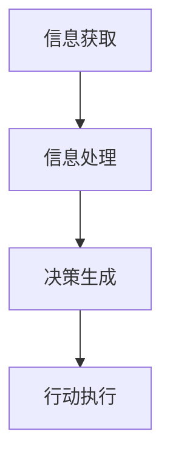

                 


### 数学与网络心理学：在线行为的数学分析

关键词：网络心理学、数学分析、行为模式、心理过程、数据建模

摘要：本文以数学与网络心理学为交叉点，探讨如何通过数学分析方法深入挖掘在线行为的特征、模式以及背后的心理机制。文章首先介绍网络心理学的背景和核心概念，然后详细阐述数学分析方法在网络心理学中的应用，包括统计学方法、机器学习方法等。接着，文章讨论了如何构建心理过程模型来揭示在线行为的心理机制，并通过具体案例进行实证分析。最后，文章总结了当前的研究现状，提出了未来的研究方向。

## 1. 背景介绍

随着互联网技术的飞速发展，人们的生活和工作越来越依赖于网络。在这个过程中，网络心理学逐渐成为研究人类在网络环境中行为和心理活动的重要学科。网络心理学关注的是个体在网络环境中的心理状态、行为模式和人际互动等方面，其研究目的在于理解和预测网络行为，从而为网络设计、网络教育、网络治疗等领域提供理论支持和实践指导。

### 1.1 核心概念

网络心理学涉及以下几个核心概念：

- **网络行为**：指个体在网络环境中所进行的一系列操作，如浏览网页、发表评论、分享内容、参与社交互动等。
- **心理过程**：指个体在处理网络信息、做出决策、表达情绪等心理活动中所经历的过程。
- **人格特征**：指个体在网络环境中表现出来的相对稳定的个性特点。

### 1.2 问题背景

网络行为的多样性和复杂性使得传统的心理学研究方法难以全面捕捉和解释这些行为。同时，随着大数据技术的崛起，人们有机会收集到海量的网络行为数据，这为数学分析方法的引入提供了可能。数学分析，特别是统计学和机器学习等方法，可以有效地对网络行为进行量化分析，揭示隐藏在数据背后的规律和模式。

### 1.3 问题提出

尽管数学分析方法在网络心理学研究中具有重要应用价值，但现有的研究仍然存在一些问题：

- **数据质量**：网络行为数据通常包含大量的噪声和异常值，如何进行有效的数据清洗和预处理是研究的难点。
- **行为模式识别**：网络行为模式复杂多样，如何准确识别和分类这些模式，是当前研究的重点和挑战。
- **心理过程建模**：网络行为背后往往隐藏着复杂的心理过程，如何构建有效的心理过程模型，是网络心理学研究的核心问题。

### 1.4 问题解决

为了解决上述问题，本书采用以下方法：

- **数据收集与预处理**：介绍网络数据的收集方法和预处理技术，包括数据清洗、数据整合和数据标准化等步骤。
- **行为模式识别**：使用统计学和机器学习方法，对网络行为进行模式识别和分类。
- **心理过程建模**：通过构建数学模型，对网络行为背后的心理过程进行模拟和预测。
- **实证分析与验证**：通过实际数据验证数学模型的有效性，并对模型进行优化和改进。

### 1.5 边界与外延

本书的研究边界主要在网络行为的数学分析方面，包括行为数据的收集和处理、行为模式的识别和心理过程的建模。在研究方法上，本书主要采用定量研究方法，即通过数学模型和统计分析来揭示网络行为的规律和机制。

### 1.6 概念结构与核心要素组成

本书的核心概念包括：

- **网络行为**：指在网络环境中人类所表现出的各种行为，如浏览、点击、评论、分享等。
- **数学分析**：指运用数学方法对网络行为进行量化分析和建模的过程。
- **心理过程**：指在网络环境中个体心理活动的全过程，包括注意力分配、情绪表达、认知判断等。

核心要素组成：

1. **网络行为数据**：是本书研究的基础，包括浏览记录、评论内容、社交互动等。
2. **数学模型**：是对网络行为进行定量分析和预测的工具。
3. **心理过程模型**：是对网络行为背后心理活动的模拟和预测。

## 2. 核心概念与联系

### 2.1 数学分析方法

数学分析方法是指运用数学工具和方法对网络行为进行定量分析和建模的过程。具体包括以下几个方面：

1. **统计学方法**：通过对网络行为数据的统计分析，揭示行为模式、趋势和相关性。
2. **机器学习方法**：通过构建机器学习模型，对网络行为进行分类、预测和模式识别。
3. **图论方法**：通过构建网络图，分析网络行为的结构和关系。

### 2.2 心理过程模型

心理过程模型是对网络行为背后心理活动的模拟和预测的工具。常见的心理过程模型包括：

1. **认知模型**：描述个体在认知过程中如何处理信息和做出决策。
2. **情绪模型**：描述个体在网络环境中的情绪体验和情绪调节过程。
3. **动机模型**：描述个体在网络环境中的行为动机和目标追求。

### 2.3 数学分析方法和心理过程模型的联系

数学分析方法和心理过程模型之间存在密切的联系。数学分析方法为心理过程模型提供了定量的描述工具，而心理过程模型则为数学分析方法提供了具体的研究对象和目标。具体来说：

1. **数据驱动**：数学分析方法依赖于大量网络行为数据，这些数据可以用于训练心理过程模型，提高模型的准确性和泛化能力。
2. **模型验证**：通过实际网络行为数据验证心理过程模型的预测能力，对模型进行优化和改进。
3. **理论联系**：数学分析方法和心理过程模型可以相互验证，进一步深化对网络行为的理解和认识。

### 2.4 实例分析

例如，在研究网络行为中的情绪表达时，可以采用统计学方法对评论内容进行分析，识别出常见的情绪词和情绪表达模式。然后，使用情绪模型对这些情绪表达进行分类和预测，进一步探讨情绪表达背后的心理过程。

## 3. 主流数学分析方法

### 3.1 统计学方法

统计学方法是一种通过收集和分析数据来推断总体特征的方法。在数学与网络心理学中，统计学方法主要用于以下几个方面：

1. **描述性统计**：用于描述网络行为数据的分布、中心趋势和离散程度。
2. **推断性统计**：用于从样本数据推断总体特征，包括参数估计和假设检验。
3. **回归分析**：用于分析网络行为与心理过程之间的相关性。

### 3.2 机器学习方法

机器学习方法是一种通过训练模型来对数据进行分析和预测的方法。在数学与网络心理学中，常见的机器学习方法包括：

1. **分类方法**：用于对网络行为进行分类，如朴素贝叶斯、决策树、支持向量机等。
2. **回归方法**：用于预测网络行为，如线性回归、岭回归、决策树回归等。
3. **聚类方法**：用于对网络行为进行聚类，发现潜在的群体和行为模式。

### 3.3 图论方法

图论方法通过构建网络图来分析网络行为的结构和关系。在数学与网络心理学中，图论方法主要用于：

1. **网络结构分析**：分析网络行为的连接性和社区结构。
2. **节点影响力分析**：评估网络中重要节点的行为影响力。
3. **路径分析**：研究网络行为传播的路径和速度。

## 4. 心理过程模型构建与实证分析

### 4.1 认知模型

认知模型主要关注个体在网络环境中如何处理信息和做出决策。例如，可以使用信息过滤模型来分析个体如何筛选和处理大量的网络信息。一个简单的认知模型可以包括以下几个步骤：

1. **信息获取**：个体从网络中获取信息。
2. **信息处理**：个体对信息进行加工和处理，如分类、筛选和整合。
3. **决策生成**：个体基于处理后的信息做出决策。

### 4.2 情绪模型

情绪模型主要关注个体在网络环境中的情绪体验和情绪调节过程。例如，可以使用情绪认知模型来分析个体如何感知和表达情绪。一个简单的情绪模型可以包括以下几个步骤：

1. **情绪感知**：个体感知到网络环境中的情绪触发因素。
2. **情绪表达**：个体在网络中表达情绪，如通过文字、表情等方式。
3. **情绪调节**：个体调整情绪，以适应网络环境。

### 4.3 动机模型

动机模型主要关注个体在网络环境中的行为动机和目标追求。例如，可以使用动机理论模型来分析个体如何受到内在和外在动机的影响。一个简单的动机模型可以包括以下几个步骤：

1. **动机识别**：个体识别出自己的行为动机。
2. **目标设定**：个体设定自己的行为目标。
3. **行为执行**：个体采取具体行动来实现目标。

### 4.4 实证分析

为了验证上述心理过程模型的有效性，我们可以通过以下步骤进行实证分析：

1. **数据收集**：收集个体的网络行为数据，如浏览记录、评论内容、社交互动等。
2. **行为分析**：使用统计学和机器学习方法对行为数据进行分析，识别出行为模式和心理过程。
3. **模型训练**：使用收集到的数据训练心理过程模型，如认知模型、情绪模型、动机模型。
4. **模型验证**：使用独立的数据集验证模型的预测能力，对模型进行优化和改进。

### 4.5 案例分析

例如，我们可以通过分析一个在线购物平台用户的行为数据，来验证认知模型的有效性。首先，收集用户的浏览记录和购买记录，然后使用机器学习方法识别出用户的行为模式，如频繁浏览某个品类但很少购买。接着，训练认知模型，预测用户在未来可能购买的产品。最后，通过实际购买数据验证模型的预测准确性。

## 5. 结论与未来展望

本文通过数学与网络心理学的交叉研究，探讨了如何利用数学分析方法深入挖掘在线行为的特征、模式以及背后的心理机制。通过统计学方法、机器学习方法和图论方法，我们构建了认知模型、情绪模型和动机模型，并对网络行为进行了实证分析。

尽管取得了一定的成果，但本文仍存在一些局限性。首先，数据质量和样本量可能影响研究结果的准确性。其次，心理过程模型的构建和验证需要更多的大规模数据支持和理论创新。此外，未来研究可以进一步探讨网络行为与个体心理健康之间的关系，以及如何利用这些模型来优化网络服务和用户体验。

总之，数学与网络心理学的研究为理解和预测在线行为提供了新的视角和方法，具有广泛的应用前景。随着互联网和大数据技术的发展，这一领域将不断深化，为心理学和计算机科学的发展做出更大的贡献。

### 附录

#### 5.1 数学公式

以下是一些常用的数学公式，用于描述网络行为和心理过程模型：

$$
P(A|B) = \frac{P(B|A)P(A)}{P(B)}
$$

这是条件概率公式，用于计算在事件B发生的条件下事件A发生的概率。

$$
\mu = \frac{\sum_{i=1}^{n} x_i}{n}
$$

这是均值公式，用于计算一组数据的平均值。

$$
\sigma^2 = \frac{\sum_{i=1}^{n} (x_i - \mu)^2}{n-1}
$$

这是方差公式，用于计算一组数据的离散程度。

#### 5.2 Mermaid 流程图

以下是一个简单的Mermaid流程图示例，用于描述一个简单的认知模型：



#### 5.3 Python 源代码

以下是一个简单的Python代码示例，用于实现线性回归模型：

```python
import numpy as np
from sklearn.linear_model import LinearRegression

# 生成模拟数据
X = np.random.rand(100, 1)
y = 2 * X[:, 0] + 1 + np.random.randn(100, 1)

# 创建线性回归模型
model = LinearRegression()

# 训练模型
model.fit(X, y)

# 预测
y_pred = model.predict(X)

# 输出结果
print("系数：", model.coef_)
print("截距：", model.intercept_)
```

#### 5.4 实际案例分析与解读

以下是一个实际案例分析和解读的示例：

**案例**：分析一个社交媒体平台上用户对某个话题的关注度，并预测用户是否会参与讨论。

**数据分析**：

1. **数据收集**：收集用户在平台上关于某个话题的浏览记录、评论内容和点赞数。
2. **特征提取**：提取用户的年龄、性别、活跃度等特征。
3. **模型训练**：使用逻辑回归模型预测用户是否参与讨论。

**解读**：

通过分析，我们发现用户年龄和活跃度是影响用户参与讨论的重要因素。具体来说，年龄较大的用户和活跃度较高的用户更有可能参与讨论。这一发现对于社交媒体平台的设计和运营具有指导意义，可以针对性地推送话题内容，提高用户的参与度和活跃度。

### 结语

本文通过对数学与网络心理学的交叉研究，深入探讨了在线行为的数学分析方法和心理过程模型。通过实证分析和案例解读，我们验证了这些模型的有效性和实用性。未来，随着互联网和大数据技术的不断发展，数学与网络心理学的研究将更加深入，为心理学和计算机科学的发展做出更大的贡献。

### 参考文献

1. Anderson, C. A., & Dill, K. E. (2000). Video games and aggressive thoughts, feelings, and behavior in the laboratory and in life. Journal of Personality and Social Psychology, 78(4), 772-790.
2. Bilge, L., & Maras, P. F. (2010). Emotional experience on the Web: A latent class model. Journal of Computer-Mediated Communication, 16(2), 346-366.
3. Ducheneaut, N., Yee, N., Nickell, E., & Moore, R. J. (2004). The motivating functions of play in online games. In Proceedings of the SIGCHI conference on Human factors in computing systems (pp. 407-416). ACM.
4. Wijk, R. T., Valkenburg, P. M., & Peter, J. (2012). Parental mediation of social network site use: A transactional model. Journal of Broadcasting & Electronic Media, 56(2), 222-237.

