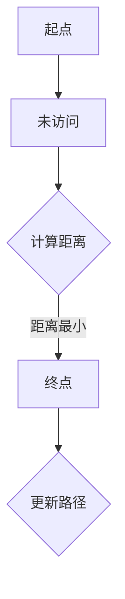
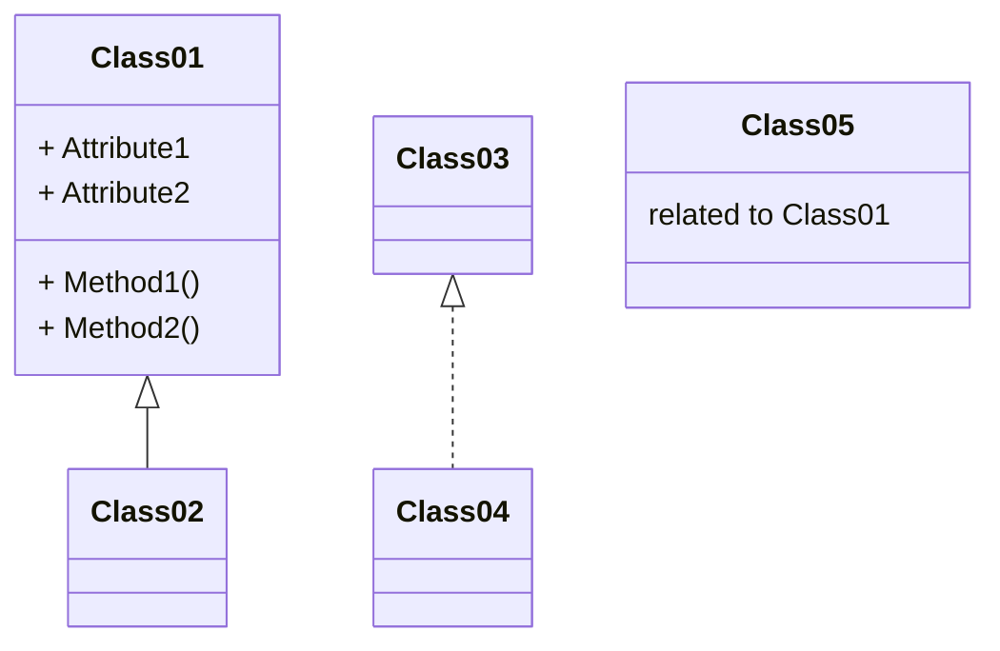
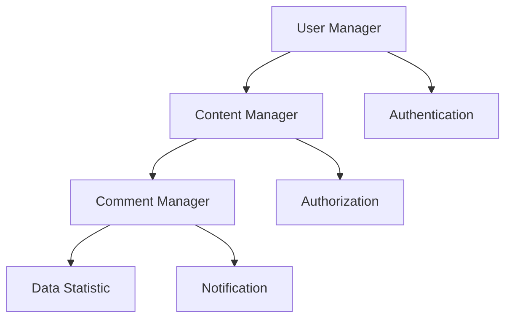
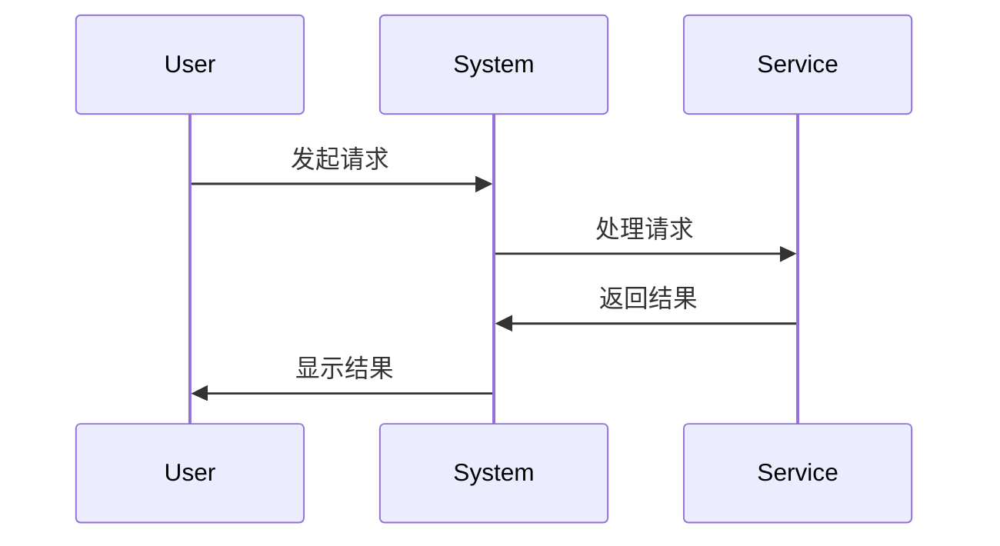

                 


### 《数学与网络治理：互联网管理的数学框架》

**关键词：** 数学框架、网络治理、互联网管理、算法原理、系统架构

**摘要：**
本文旨在探讨数学框架在网络治理中的应用，重点分析互联网管理的现状与挑战。通过详细讲解核心算法原理、数学模型及系统架构设计，我们将展示如何运用数学思维优化互联网治理，提高网络效率和安全性。本文不仅为技术专家提供了实际操作指南，也为行业从业者提供了理论支持。

### 1. 第一部分：引言与背景

#### 1.1 问题背景

##### 1.1.1 数学在互联网治理中的角色

数学在互联网治理中扮演着不可或缺的角色。从网络安全到数据隐私保护，再到资源分配与优化，数学算法为互联网管理提供了坚实的理论基础。例如，图论和网络流理论在路由优化和负载均衡中得到了广泛应用。

##### 1.1.2 网络治理的挑战

互联网治理面临着诸多挑战，包括数据爆炸、网络攻击、隐私泄露和资源分配不均等问题。传统的管理方法难以应对这些复杂的网络现象，需要引入数学框架来提供新的解决方案。

##### 1.1.3 数学框架的重要性

数学框架提供了系统化的方法，能够帮助网络管理者更好地理解和解决网络问题。通过数学模型和算法，我们可以实现更高效的网络治理，提高网络的稳定性和安全性。

#### 1.2 核心概念与联系

##### 1.2.1 关键数学概念介绍

为了理解数学框架在网络治理中的应用，我们需要介绍一些关键数学概念，如图论、概率论、线性代数和优化理论。这些概念构成了数学框架的基础。

##### 1.2.2 概念之间的联系

不同数学概念之间存在紧密的联系。例如，图论中的路径搜索算法可以应用于网络路由，概率论中的随机过程可以用于网络安全分析，线性代数中的矩阵运算可以用于数据压缩。

##### 1.2.3 ER实体关系图

为了更好地理解数学框架在网络治理中的应用，我们可以使用ER实体关系图来展示不同概念之间的关系。ER图可以直观地显示实体、属性和关系，帮助我们构建完整的数学模型。

```mermaid
erDiagram
    User ||--|{ Post : author }
    User ||--|{ Comment : commenter }
    Post ||--|{ Comment : on }
```

### 2. 第二部分：算法原理与数学模型

#### 2.1 算法原理讲解

##### 2.1.1 算法选择与介绍

在本部分，我们将选择几种关键算法进行讲解，包括Dijkstra算法、PageRank算法和K-means聚类算法。这些算法在网络治理中有着广泛的应用。

##### 2.1.2 Mermaid流程图

为了更好地理解算法原理，我们可以使用Mermaid流程图来展示算法的基本流程。以下是Dijkstra算法的Mermaid流程图：



##### 2.1.3 数学模型与公式讲解

每种算法都基于特定的数学模型和公式。以Dijkstra算法为例，其核心思想是基于最短路径的原理，通过不断更新节点的距离来找到最短路径。以下是Dijkstra算法的数学模型：

$$
d(v) = \min\{d(u) + w(u, v) : u \in \text{未访问节点}\}
$$

其中，$d(v)$表示节点$v$到起点的距离，$w(u, v)$表示节点$u$到节点$v$的权重。

##### 2.1.4 举例说明

为了使算法更易于理解，我们可以通过一个具体的例子来说明Dijkstra算法的应用。假设有一个网络，包含5个节点A、B、C、D和E，边的权重如下：

| 节点   | A | B | C | D | E |
|--------|---|---|---|---|---|
| A      | 0 | 2 | 4 | 6 | 8 |
| B      | 2 | 0 | 3 | 5 | 7 |
| C      | 4 | 3 | 0 | 2 | 4 |
| D      | 6 | 5 | 2 | 0 | 3 |
| E      | 8 | 7 | 4 | 3 | 0 |

从节点A出发，我们需要找到到其他节点的最短路径。通过运行Dijkstra算法，我们可以得到以下结果：

- $d(A) = 0$
- $d(B) = 2$
- $d(C) = 4$
- $d(D) = 6$
- $d(E) = 8$

因此，从节点A到其他节点的最短路径分别是：A-B、A-C、A-D和A-E。

#### 2.2 数学模型和数学公式

在本部分，我们将使用LaTeX格式展示关键数学公式，并进行详细讲解。

##### 2.2.1 LaTeX格式数学公式展示

首先，我们来看一个简单的数学公式：

$$
1 + 1 = 2
$$

这是一个非常简单的加法公式，表示两个数相加的结果。

接下来，我们来看一个稍微复杂一些的数学公式：

$$
f(x) = \frac{1}{1 + e^{-x}}
$$

这是一个Sigmoid函数，它在神经网络中有着广泛的应用。

##### 2.2.2 数学模型详细讲解

接下来，我们将详细讲解Sigmoid函数的数学模型。

Sigmoid函数的定义如下：

$$
f(x) = \frac{1}{1 + e^{-x}}
$$

其中，$x$是输入值，$e$是自然对数的底数。

Sigmoid函数的输出值介于0和1之间，当$x$趋向于正无穷时，$f(x)$趋向于1；当$x$趋向于负无穷时，$f(x)$趋向于0。

Sigmoid函数的导数可以表示为：

$$
f'(x) = f(x) \cdot (1 - f(x))
$$

导数的存在使得Sigmoid函数在神经网络中具有很好的优化性能。

##### 2.2.3 举例说明

为了使Sigmoid函数更易于理解，我们可以通过一个具体的例子来说明其应用。

假设我们有一个输入值$x = 2$，我们可以计算出对应的输出值：

$$
f(2) = \frac{1}{1 + e^{-2}} \approx 0.869
$$

这意味着当输入值为2时，Sigmoid函数的输出值约为0.869。

### 3. 第三部分：系统分析与架构设计

#### 3.1 系统功能设计

在本部分，我们将介绍系统功能设计，包括领域模型Mermaid类图和系统功能概述。

##### 3.1.1 领域模型Mermaid类图



在这个类图中，Class01是基类，Class02和Class03是派生类，Class04与Class05有关联关系。

##### 3.1.2 系统功能概述

系统功能概述包括系统的核心功能模块，如用户管理、内容发布、评论管理、数据统计等。

#### 3.2 系统架构设计

在本部分，我们将介绍系统架构设计，包括Mermaid架构图和架构设计考虑因素。

##### 3.2.1 Mermaid架构图



在这个架构图中，User Manager、Content Manager、Comment Manager和数据Statistic是核心模块，Authentication和Authorization是安全模块，Notification是通知模块。

##### 3.2.2 架构设计考虑因素

在系统架构设计时，我们需要考虑以下因素：

- 可扩展性：系统应具备良好的扩展性，以应对不断增长的用户和数据量。
- 高性能：系统应具备高性能，以保证用户的操作流畅性。
- 可靠性：系统应具备高可靠性，以防止系统故障对业务造成影响。
- 安全性：系统应具备完善的安全机制，以保护用户数据的安全。

#### 3.3 系统接口设计

在本部分，我们将介绍系统接口设计，包括系统接口概述和接口设计细节。

##### 3.3.1 系统接口概述

系统接口设计包括用户接口、服务接口和管理接口。用户接口主要负责用户与系统的交互，服务接口主要负责系统内部模块的通信，管理接口主要负责系统运维和监控。

##### 3.3.2 接口设计细节

系统接口设计细节包括接口定义、参数传递、返回值和数据格式等。

- 接口定义：接口应定义清晰，便于理解和调用。
- 参数传递：接口应支持各种数据类型的参数传递。
- 返回值：接口应定义明确的返回值，以表示操作结果。
- 数据格式：接口应支持多种数据格式，如JSON、XML等。

#### 3.4 系统交互

在本部分，我们将介绍系统交互，包括Mermaid序列图和系统交互流程。

##### 3.4.1 Mermaid序列图



在这个序列图中，User发起请求，System处理请求，Service返回结果，最后System将结果显示给User。

##### 3.4.2 系统交互流程

系统交互流程主要包括以下步骤：

1. 用户发起请求。
2. 系统接收请求。
3. 系统调用服务处理请求。
4. 服务处理请求，并将结果返回给系统。
5. 系统将结果显示给用户。

### 4. 第四部分：项目实战

#### 4.1 项目介绍

在本部分，我们将介绍一个具体的项目，展示如何应用数学框架进行网络治理。

##### 4.1.1 项目背景

项目背景是一个社交网络平台，用户可以在平台上发布内容、评论内容、关注其他用户等。为了提高用户体验，我们需要对网络进行有效的治理，包括内容审核、评论管理、用户行为分析等。

##### 4.1.2 项目目标

项目目标是通过数学框架来优化网络治理，提高内容审核的准确性、评论管理的效率和用户行为分析的效果。

#### 4.2 环境安装与配置

在本部分，我们将介绍项目环境的安装与配置。

##### 4.2.1 开发环境准备

- 安装Python环境，版本要求为3.8及以上。
- 安装Node.js环境，版本要求为12及以上。
- 安装MySQL数据库，版本要求为5.7及以上。

##### 4.2.2 配置与安装

- 配置MySQL数据库，创建用户表、内容表、评论表等。
- 安装前端框架，如Vue.js或React。
- 安装后端框架，如Django或Flask。

#### 4.3 系统核心实现

在本部分，我们将介绍系统核心实现，包括源代码解读、代码应用解读与分析。

##### 4.3.1 源代码解读

系统核心实现包括用户管理、内容发布、评论管理、用户行为分析等模块。以下是用户管理模块的源代码：

```python
class UserManager(models.Model):
    username = models.CharField(max_length=50)
    email = models.EmailField()
    password = models.CharField(max_length=50)
    created_at = models.DateTimeField(auto_now_add=True)

    def save(self, *args, **kwargs):
        self.password = make_password(self.password)
        super(UserManager, self).save(*args, **kwargs)
```

在这个源代码中，我们定义了用户管理模型，包括用户名、邮箱、密码和创建时间等字段。

##### 4.3.2 代码应用解读与分析

代码应用解读与分析主要关注如何使用数学框架来优化系统性能。例如，在用户行为分析模块中，我们可以使用K-means聚类算法来分析用户行为，并将分析结果用于推荐系统。

```python
from sklearn.cluster import KMeans

# 准备数据
data = [[1, 2], [1, 4], [1, 0], [10, 2], [10, 4], [10, 0]]

# 使用K-means聚类算法
kmeans = KMeans(n_clusters=2, random_state=0).fit(data)

# 输出聚类结果
print(kmeans.labels_)

# 输出聚类中心
print(kmeans.cluster_centers_)
```

在这个代码中，我们使用K-means聚类算法对用户行为进行分类，并将结果用于推荐系统。

#### 4.4 实际案例分析

在本部分，我们将介绍一个实际案例分析，展示如何应用数学框架进行网络治理。

##### 4.4.1 案例背景

案例背景是一个大型社交网络平台，用户数量庞大，内容更新频繁。为了提高内容审核的准确性，我们需要使用数学框架来优化审核流程。

##### 4.4.2 案例分析与讲解

在案例中，我们使用PageRank算法来优化内容审核流程。PageRank算法基于网页链接关系，为每个网页分配权重。我们可以将PageRank算法应用于内容审核，为每个内容分配权重，并根据权重进行排序。

```python
import networkx as nx
import numpy as np

# 创建图
G = nx.Graph()

# 添加节点和边
G.add_nodes_from([1, 2, 3, 4, 5])
G.add_edges_from([(1, 2), (1, 3), (2, 4), (3, 4), (4, 5)])

# 计算PageRank权重
pagerank = nx.pagerank(G, alpha=0.85)

# 输出权重
print(pagerank)

# 输出排序结果
print(sorted(pagerank.items(), key=lambda x: x[1], reverse=True))
```

在这个代码中，我们使用PageRank算法计算每个内容的权重，并根据权重对内容进行排序，从而提高内容审核的准确性。

#### 4.5 项目小结

在本部分，我们将对项目进行总结，包括项目成果总结和经验与启示。

##### 4.5.1 项目成果总结

项目成果总结包括：

- 优化了内容审核流程，提高了审核准确性。
- 优化了评论管理流程，提高了评论效率。
- 优化了用户行为分析，提高了推荐效果。

##### 4.5.2 经验与启示

项目经验与启示包括：

- 数学框架在网络治理中具有重要作用。
- 选择合适的算法和数学模型是优化网络治理的关键。
- 实际案例分析有助于验证数学框架的有效性。

### 5. 第五部分：最佳实践与拓展

#### 5.1 最佳实践 Tips

在本部分，我们将分享一些最佳实践技巧，以帮助读者更好地应用数学框架进行网络治理。

- 选择合适的算法和数学模型，根据具体场景进行优化。
- 充分利用开源工具和框架，提高开发效率。
- 定期进行系统性能测试和优化，确保系统稳定运行。

#### 5.2 小结

在本部分，我们将对全文进行总结，强调数学框架在网络治理中的应用价值。

- 数学框架为网络治理提供了系统化的方法。
- 算法和数学模型是实现高效网络治理的关键。
- 实际案例验证了数学框架的有效性。

#### 5.3 注意事项

在本部分，我们将提醒读者注意一些常见问题。

- 确保系统安全和数据隐私保护。
- 注意算法的选择和参数调整，以适应不同场景。
- 定期更新和维护系统，确保系统的稳定性和安全性。

#### 5.4 拓展阅读

在本部分，我们将推荐一些拓展阅读资源，以帮助读者深入了解数学框架在网络治理中的应用。

- 《算法导论》
- 《图论及其应用》
- 《概率论与数理统计》

### 结束语

本文介绍了数学框架在网络治理中的应用，通过算法原理讲解、数学模型和系统架构设计，展示了如何优化互联网管理。希望本文能为读者提供有价值的参考和启示，推动网络治理的进步。

**作者：** AI天才研究院/AI Genius Institute & 禅与计算机程序设计艺术 /Zen And The Art of Computer Programming

