                 

### 《数学与网络科学：复杂网络的数学特性》

关键词：复杂网络、数学特性、图论、矩阵理论、网络科学

摘要：本文将深入探讨数学与网络科学之间的关系，特别是复杂网络的数学特性。我们将从复杂网络的基本概念和背景出发，逐步深入到网络科学的数学理论基础，复杂网络的建模与分析方法，复杂网络的特性分析，以及复杂网络的算法与应用。通过这篇技术博客，我们希望能够为读者提供一个清晰、深入的理解，并引发对复杂网络进一步研究的兴趣。

### 目录大纲

1. 复杂网络的基本概念与背景
    1.1 网络科学的基本概念
    1.2 复杂网络的起源与发展
    1.3 复杂网络的典型特征

2. 复杂网络的数学理论基础
    2.1 图论基础
    2.2 矩阵理论与网络分析
    2.3 随机图理论与网络随机模型

3. 复杂网络的建模与分析方法
    3.1 复杂网络的建模方法
    3.2 复杂网络的分析方法

4. 复杂网络的特性分析
    4.1 连通性与稳定性
    4.2 传播动力学
    4.3 复杂网络中的同步现象

5. 特殊类型的复杂网络
    5.1 社交网络
    5.2 生物网络
    5.3 交通网络

6. 复杂网络的算法与应用
    6.1 网络搜索算法
    6.2 网络优化算法
    6.3 网络生成算法

7. 复杂网络的应用案例分析
    7.1 案例介绍
    7.2 案例分析
    7.3 案例启示

8. 总结与展望
    8.1 主要结论
    8.2 未来研究方向

### 复杂网络的基本概念与背景

#### 1.1 网络科学的基本概念

网络科学是一门新兴的交叉学科，它涉及数学、物理学、计算机科学、社会学、经济学等多个领域。网络科学的核心研究内容是网络的结构、功能和行为，以及这些特性如何影响网络中的个体和整体。

在网络科学中，网络被定义为由节点（也称为顶点）和连接这些节点的边（也称为弧）组成的复杂结构。这些节点和边可以代表各种实体和它们之间的关系，如社会网络中的个人和他们的社交关系，交通网络中的道路和交通流量，以及生物网络中的基因和蛋白质相互作用等。

网络科学的基本概念包括：

- **节点**：网络中的个体实体，可以是物理实体（如人、城市）或抽象实体（如网页、基因）。
- **边**：连接两个节点的元素，表示节点之间的某种关系或联系。
- **度**：一个节点连接的边的数量，分为入度（指向该节点的边数）和出度（离开该节点的边数）。
- **路径**：节点之间的连接序列。
- **连通性**：网络中任意两个节点之间是否存在路径。
- **密度**：网络中边的数量与可能的最大边数的比值。

#### 1.2 复杂网络的起源与发展

复杂网络的概念起源于20世纪中叶，当时科学家们开始注意到许多现实世界的网络（如社会网络、生物网络、交通网络等）具有一些共同的特征，这些特征与简单的规则网络（如规则网格或随机网络）显著不同。

复杂网络的起源可以追溯到20世纪60年代，当时斯坦福大学的数学家斯坦利·米尔格拉姆提出了“小世界现象”（small-world phenomenon）。他通过实验发现，任何两个陌生人之间，通过大约六个人就可以建立联系，这一现象表明现实世界中的网络具有高度连通性。

随后，20世纪90年代，科学家们发现许多现实世界的网络还具有“无标度性”（scale-free property），即网络中的节点度分布服从幂律分布，这意味着网络中存在大量的低度节点和极少数高度节点，这与传统的规则网络和随机网络显著不同。

复杂网络的研究迅速发展，随着计算机技术的进步和大量网络数据的积累，研究者们开始利用数学和计算方法对复杂网络进行深入分析，探索其结构和行为的规律。

#### 1.3 复杂网络的典型特征

复杂网络具有以下几个典型的特征：

- **无标度性**：网络的度分布服从幂律分布，意味着网络中存在大量的低度节点和极少数高度节点。
- **高度连通性**：网络中任意两个节点之间都存在较短的路径，这被称为“小世界现象”。
- **聚类系数**：网络中的节点倾向于连接到彼此的邻居节点，这使得网络具有一定的聚类性。
- **模块性**：网络可以划分为多个模块或社区，每个模块内的节点之间连接紧密，而模块之间的连接相对较少。

这些特征使得复杂网络在许多现实世界中具有广泛的应用，如社交网络、生物网络、经济系统等。理解复杂网络的这些特性对于设计更高效的网络、预测网络行为、以及解决现实世界中的各种问题具有重要意义。

### 复杂网络的数学理论基础

在了解了复杂网络的基本概念和背景之后，接下来我们将探讨复杂网络的数学理论基础。这部分内容将涉及图论、矩阵理论和随机图理论等数学工具，这些工具为我们分析和理解复杂网络提供了强大的理论基础。

#### 2.1 图论基础

图论是研究图的结构、性质及其应用的一个数学分支。在图论中，图由节点和连接这些节点的边组成。图论提供了一套丰富的概念和工具，用于描述和分析网络结构。

- **图的基本概念**：

  - **节点**：图中的个体元素，可以是抽象的或具体的实体。
  - **边**：连接两个节点的元素，表示节点之间的某种关系。
  - **度**：一个节点连接的边的数量，分为入度（指向该节点的边数）和出度（离开该节点的边数）。
  - **路径**：节点之间的连接序列。
  - **连通性**：网络中任意两个节点之间是否存在路径。

- **图的类型**：

  - **无向图**：边没有方向，任意两个节点之间都是双向连接。
  - **有向图**：边具有方向，从一个节点指向另一个节点。

- **图的基本性质**：

  - **连通性**：一个图是否连通，即任意两个节点之间是否存在路径。
  - **连通度**：图中任意两个节点之间的最短路径长度。
  - **直径**：图中任意两个节点之间的最长路径长度。

- **图的度量**：

  - **平均路径长度**：图中所有节点对之间的最短路径长度的平均值。
  - **聚类系数**：一个节点的邻居节点之间连接的概率。

图论提供了一套丰富的概念和工具，使我们能够从数学角度描述和分析复杂网络的结构。图论中的许多概念和工具，如度、连通性、路径长度等，都是理解复杂网络的基础。

#### 2.2 矩阵理论与网络分析

矩阵理论在复杂网络分析中扮演着重要的角色。通过将网络结构转换为矩阵形式，我们可以使用矩阵运算来研究网络的各种性质。

- **邻接矩阵**：邻接矩阵是一个方阵，其中元素a_ij表示节点i和节点j之间是否存在边。如果存在边，则a_ij为1，否则为0。

  - **邻接矩阵的性质**：

    - 对称性：对于无向图，邻接矩阵是对称的。
    - 对角性：邻接矩阵的对角线元素均为0，因为节点i不可能与自身直接连接。

- **度矩阵**：度矩阵是一个对角矩阵，其中元素d_ii表示节点i的度。

  - **度矩阵的性质**：

    - 对角性：度矩阵是对角矩阵。
    - 非负性：度矩阵的所有元素均为非负整数。

- **拉普拉斯矩阵**：拉普拉斯矩阵是邻接矩阵和度矩阵的结合，用于研究网络的连通性和结构性质。

  - **拉普拉斯矩阵的性质**：

    - 正定性：拉普拉斯矩阵的所有特征值都是正数。
    - 稳定性：拉普拉斯矩阵的特征值可以用来判断网络的稳定性。

通过矩阵理论，我们可以使用各种矩阵运算（如矩阵乘法、特征值分析等）来研究复杂网络的性质。矩阵理论为复杂网络分析提供了强有力的工具。

#### 2.3 随机图理论与网络随机模型

随机图理论是研究随机生成的网络结构及其性质的数学分支。随机图理论为我们提供了研究复杂网络的另一种视角，特别是在理解网络的无标度性和小世界现象方面。

- **Erdős-Rényi图**：Erdős-Rényi图是最简单的随机图模型，它由n个节点和概率p的边组成。如果p趋近于1，Erdős-Rényi图将趋向于无标度网络；如果p趋近于0，Erdős-Rényi图将趋向于规则网络。

  - **Erdős-Rényi图的主要特性**：

    - 度分布服从泊松分布。
    - 连通性取决于参数p。

- **Barabási-Albert图**：Barabási-Albert图是一种无标度网络模型，它通过在现有节点上附加新节点，并在新节点上均匀随机选择已有节点的k条边来生成。这种模型能够生成高度无标度的网络。

  - **Barabási-Albert图的主要特性**：

    - 度分布服从幂律分布。
    - 高度连通性。

随机图理论为我们提供了研究复杂网络的有力工具，特别是无标度网络和小世界现象。通过随机图模型，我们可以模拟和分析复杂网络的生成过程和特性。

### 复杂网络的建模与分析方法

在了解了复杂网络的数学理论基础之后，我们需要将其应用于复杂网络的建模与分析。这一部分将讨论复杂网络的建模方法和分析方法，包括网络模型的分类与选择、网络生成模型、网络演化模型等。

#### 3.1 复杂网络的建模方法

复杂网络的建模是理解复杂网络结构和行为的第一步。建模方法的选择取决于网络的具体性质和应用场景。以下是一些常用的网络建模方法：

- **图论模型**：使用图论的基本概念和工具（如节点、边、度、路径等）来描述网络结构。
- **矩阵模型**：将网络结构转换为矩阵形式（如邻接矩阵、度矩阵、拉普拉斯矩阵等），然后使用矩阵运算来分析网络性质。
- **随机模型**：使用随机图理论来模拟复杂网络的生成过程，如Erdős-Rényi图和Barabási-Albert图。

- **应用模型**：根据具体应用场景设计网络模型，如社交网络、生物网络、经济系统等。

#### 3.2 网络生成模型

网络生成模型用于模拟复杂网络的生成过程。以下是一些常用的网络生成模型：

- **Erdős-Rényi模型**：通过随机连接节点来生成网络，边的概率为p。当p趋近于1时，网络趋向于无标度网络；当p趋近于0时，网络趋向于规则网络。
- **Barabási-Albert模型**：通过在现有节点上附加新节点，并在新节点上均匀随机选择已有节点的k条边来生成网络。这种模型能够生成高度无标度的网络。
- **小世界模型**：通过在规则网络中引入短路径来生成小世界网络。这种模型能够同时保持高连通性和较小的平均路径长度。

网络生成模型为我们提供了模拟和分析复杂网络的有力工具。

#### 3.3 网络演化模型

网络演化模型用于描述网络随时间的变化过程。以下是一些常用的网络演化模型：

- **静态演化模型**：网络结构在较长的时间尺度上保持不变，仅节点的属性（如度、标签等）随时间变化。
- **动态演化模型**：网络结构随时间变化，节点和边都可以动态生成和消失。
- **竞争演化模型**：网络中的节点和边之间存在竞争关系，节点的竞争可能导致边的变化。

网络演化模型能够帮助我们理解网络行为如何随时间演变，从而预测未来的网络状态。

### 复杂网络的特性分析

在了解了复杂网络的建模与分析方法后，我们需要深入分析复杂网络的特性。这一部分将讨论复杂网络的几个关键特性，包括连通性与稳定性、传播动力学、以及同步现象。

#### 4.1 连通性与稳定性

连通性是复杂网络的一个关键特性，它决定了网络中节点之间的可达性。稳定性和连通性密切相关，一个稳定的网络必须保持较高的连通性。

- **连通性**：网络中任意两个节点之间是否存在路径。一个高度连通的网络意味着信息、资源或影响的传播更为迅速和有效。

  - **度量**：平均路径长度和聚类系数是衡量网络连通性的重要指标。平均路径长度越小，网络越紧密；聚类系数越大，节点之间的连接越紧密。

- **稳定性**：网络在面对外部干扰或内部变化时，维持其结构特性（如连通性、模块性等）的能力。

  - **度量**：网络的弹性（resilience）和鲁棒性（robustness）是衡量稳定性的重要指标。弹性表示网络在遭受破坏后恢复原状的能力；鲁棒性表示网络在遭受攻击或扰动后维持其功能的能力。

#### 4.2 传播动力学

传播动力学研究信息、病毒、流行病等在复杂网络中的传播过程。了解传播动力学有助于我们预测和控制网络中的传播现象。

- **基本模型**：常见的传播模型包括SIR模型、SIRS模型等，这些模型描述了感染、恢复和再次感染的过程。

  - **SIR模型**：S（ susceptible，易感染者）、I（infectious，感染者）、R（recovered，恢复者）三个状态。
  - **SIRS模型**：在SIR模型的基础上增加了再次感染的过程。

- **传播动力学**：通过数学模型（如微分方程）描述传播过程，分析传播速度、感染范围等。

  - **阈值理论**：传播速度取决于基本传播数（R0），R0大于1时，疾病会在网络中持续传播；R0小于1时，疾病会逐渐消失。

#### 4.3 复杂网络中的同步现象

同步现象是复杂网络中的一种普遍现象，它描述了网络中的节点在时间上协同运动。同步现象在许多现实应用中具有重要意义，如电力系统、通信网络、生物系统等。

- **同步条件**：网络中节点同步的条件包括网络的拓扑结构、节点的动力学特性等。

  - **小世界效应**：小世界网络具有较短的路径长度和较高的聚类系数，这些特性有助于实现同步。
  - **无标度网络**：无标度网络中的高度连接节点可以充当“枢纽”，促进同步。

- **同步分析**：通过数学模型（如Laplace变换、稳定性分析等）研究同步现象。

  - **同步稳定性**：研究网络中不同节点同步的稳定性和同步速度。
  - **同步控制**：设计同步控制策略，使网络中的所有节点达到同步状态。

### 特殊类型的复杂网络

除了典型的社交网络、生物网络和交通网络外，还有许多特殊类型的复杂网络，这些网络在特定的应用领域中具有独特的结构和特性。

#### 5.1 社交网络

社交网络是描述人与人之间社交关系的一种复杂网络。社交网络的典型特征包括高度连通性、无标度性和高度聚类性。

- **结构特性**：

  - 高度连通性：社交网络中的任意两个节点之间通常存在较短的路径。
  - 无标度性：社交网络中存在大量的低度节点和极少数高度节点，如社交网络中的名人或意见领袖。
  - 高度聚类性：社交网络中的节点倾向于连接到彼此的邻居节点。

- **应用分析**：

  - 社交网络分析：通过分析社交网络的结构特性，可以揭示社交网络中的关键节点、社区结构等信息。
  - 网络传播：研究社交网络中的信息、病毒等传播过程，有助于预测和控制网络中的传播现象。

#### 5.2 生物网络

生物网络描述生物体内不同生物实体之间的相互作用，如基因、蛋白质、细胞等。生物网络在生物学研究中具有重要意义。

- **结构特性**：

  - 无标度性：生物网络中存在大量的低度节点和极少数高度节点，如关键基因或重要蛋白质。
  - 高度聚类性：生物网络中的节点倾向于连接到彼此的邻居节点，形成复杂的模块或功能群。
  - 高度层次性：生物网络具有多个层次结构，从基因到细胞再到组织，形成一个复杂的网络系统。

- **应用分析**：

  - 功能预测：通过分析生物网络的结构特性，可以预测未知基因或蛋白质的功能。
  - 网络重构：利用生物网络中的相互作用信息，重构生物网络的拓扑结构，为生物学研究提供新视角。

#### 5.3 交通网络

交通网络描述不同地点之间的交通联系，如道路、铁路、航线等。交通网络在交通运输规划、交通管理等方面具有重要意义。

- **结构特性**：

  - 高度连通性：交通网络中的任意两个地点之间通常存在多种交通方式，保持高度的连通性。
  - 无标度性：交通网络中存在大量的低度节点和极少数高度节点，如主要交通枢纽。
  - 高度层次性：交通网络具有多个层次结构，从地方交通到国家交通，形成一个复杂的网络系统。

- **应用分析**：

  - 交通规划：通过分析交通网络的结构特性，可以优化交通流、减少拥堵，提高交通效率。
  - 交通管理：利用交通网络的信息，实现实时交通监控和智能交通管理，提高交通安全性。

### 复杂网络的算法与应用

在了解了复杂网络的特性后，我们需要探讨如何利用算法来分析和处理复杂网络。这一部分将讨论复杂网络的算法与应用，包括网络搜索算法、网络优化算法和网络生成算法。

#### 6.1 网络搜索算法

网络搜索算法用于在复杂网络中寻找特定的节点或路径。以下是一些常用的网络搜索算法：

- **广度优先搜索（BFS）**：从起始节点开始，逐层搜索网络，直到找到目标节点。BFS适用于路径较短的搜索场景。

  - **算法原理**：从起始节点开始，将未访问的邻居节点加入队列，然后逐个访问队列中的节点，直到找到目标节点。

- **深度优先搜索（DFS）**：从起始节点开始，沿着一条路径深入搜索，直到无法继续，然后回溯到上一个节点继续搜索。DFS适用于路径较长的搜索场景。

  - **算法原理**：从起始节点开始，沿着一条路径深入搜索，直到无法继续，然后回溯到上一个节点继续搜索。

- **A*搜索算法**：结合广度优先搜索和启发式搜索，用于找到从起始节点到目标节点的最优路径。

  - **算法原理**：在搜索过程中，为每个节点计算一个评价函数f(n) = g(n) + h(n)，其中g(n)为从起始节点到当前节点的距离，h(n)为从当前节点到目标节点的估计距离。优先选择f(n)最小的节点进行搜索。

网络搜索算法为我们提供了在复杂网络中高效寻找路径的方法，适用于各种应用场景。

#### 6.2 网络优化算法

网络优化算法用于优化复杂网络的某些特性，如最小化通信成本、最大化网络稳定性等。以下是一些常用的网络优化算法：

- **最小生成树算法（MST）**：用于找到网络中的最小生成树，使网络中的所有节点都连通，且边的总权重最小。

  - **算法原理**：通过贪心算法，逐步选择权重最小的边，构建最小生成树。

- **最短路径算法（Dijkstra算法）**：用于找到从起始节点到目标节点的最短路径。

  - **算法原理**：使用优先队列，逐步选择未访问的节点中距离起始节点最近的节点进行访问。

- **最大流算法（Ford-Fulkerson算法）**：用于找到网络中的最大流，即在网络容量限制下，从源点到汇点的最大流量。

  - **算法原理**：通过构造残差网络，逐步增加流量，直到无法继续增加为止。

网络优化算法为我们提供了优化复杂网络性能的有效方法，适用于各种网络设计和管理场景。

#### 6.3 网络生成算法

网络生成算法用于模拟复杂网络的生成过程，以便我们研究网络结构特性和行为规律。以下是一些常用的网络生成算法：

- **Erdős-Rényi模型**：通过随机连接节点生成网络，边的概率为p。当p趋近于1时，网络趋向于无标度网络；当p趋近于0时，网络趋向于规则网络。

  - **算法原理**：从n个节点的集合中随机选择两个节点，如果两个节点之间的距离小于p，则连接这两个节点。

- **Barabási-Albert模型**：通过在现有节点上附加新节点，并在新节点上均匀随机选择已有节点的k条边来生成网络。这种模型能够生成高度无标度的网络。

  - **算法原理**：在现有节点上附加新节点，然后从已有节点中随机选择k条边连接新节点。

- **小世界模型**：通过在规则网络中引入短路径来生成小世界网络。这种模型能够同时保持高连通性和较小的平均路径长度。

  - **算法原理**：在规则网络中随机选择一对节点，然后在它们之间引入一条新边。

网络生成算法为我们提供了模拟复杂网络结构和行为的有力工具，有助于我们理解复杂网络的特性。

### 复杂网络的应用案例分析

通过前面的讨论，我们已经了解了复杂网络的理论基础和算法应用。在这一部分，我们将通过几个实际案例来展示复杂网络在现实世界中的应用，以及如何通过这些应用来分析和解决实际问题。

#### 7.1 案例介绍

案例一：社交媒体网络分析

社交媒体网络是一个典型的复杂网络，节点代表用户，边代表用户之间的互动（如点赞、评论、分享等）。通过对社交媒体网络的复杂网络分析，可以揭示用户之间的互动模式、影响力传播路径等。

案例二：生物网络功能预测

生物网络描述生物体内不同生物实体之间的相互作用，如基因、蛋白质、细胞等。通过分析生物网络的结构特性，可以预测未知基因或蛋白质的功能，为生物学研究提供新视角。

案例三：交通网络优化

交通网络是一个复杂的网络系统，包括道路、铁路、航线等。通过分析交通网络的结构特性，可以优化交通流、减少拥堵，提高交通效率。

#### 7.2 案例分析

案例一：社交媒体网络分析

1. **数据收集**：收集社交媒体网络的数据，包括用户及其互动信息。

2. **网络建模**：使用图论模型和随机图模型，将社交媒体网络建模为复杂网络。

3. **特性分析**：分析社交媒体网络的度分布、平均路径长度、聚类系数等特性。

4. **影响力传播**：通过网络传播模型，分析用户影响力传播路径，揭示关键节点和社区结构。

5. **应用分析**：基于分析结果，为社交媒体平台提供用户推荐、广告投放等策略。

案例二：生物网络功能预测

1. **数据收集**：收集生物网络的数据，包括基因、蛋白质及其相互作用信息。

2. **网络建模**：使用矩阵模型和图论模型，将生物网络建模为复杂网络。

3. **特性分析**：分析生物网络的度分布、平均路径长度、聚类系数等特性。

4. **功能预测**：通过功能预测算法，预测未知基因或蛋白质的功能。

5. **应用分析**：基于预测结果，为生物医学研究提供新方向和实验设计。

案例三：交通网络优化

1. **数据收集**：收集交通网络的数据，包括道路、铁路、航线及其交通流量信息。

2. **网络建模**：使用矩阵模型和图论模型，将交通网络建模为复杂网络。

3. **特性分析**：分析交通网络的度分布、平均路径长度、聚类系数等特性。

4. **交通优化**：通过网络优化算法，优化交通流、减少拥堵。

5. **应用分析**：基于优化结果，为交通管理部门提供交通规划和管理策略。

#### 7.3 案例启示

通过对这些实际案例的分析，我们可以得到以下几点启示：

1. **复杂网络分析的重要性**：复杂网络分析为理解和解决现实世界中的复杂问题提供了新的视角和工具。

2. **跨学科应用**：复杂网络分析涉及多个学科领域，如数学、计算机科学、生物学、社会学等，跨学科合作有助于推动复杂网络研究的深入。

3. **实际应用价值**：复杂网络分析在社交媒体、生物医学、交通等领域具有广泛的应用前景，可以为相关领域提供有效的解决方案。

4. **数据的重要性**：复杂网络分析依赖于高质量的数据，数据的收集和处理是研究成功的关键。

### 总结与展望

在本文中，我们探讨了数学与网络科学之间的关系，特别是复杂网络的数学特性。我们从复杂网络的基本概念和背景出发，逐步深入到网络科学的数学理论基础，复杂网络的建模与分析方法，复杂网络的特性分析，以及复杂网络的算法与应用。通过这些讨论，我们希望能为读者提供一个清晰、深入的理解，并引发对复杂网络进一步研究的兴趣。

#### 8.1 主要结论

1. 复杂网络具有无标度性、高度连通性、聚类性和模块性等特征。
2. 图论、矩阵理论和随机图理论是研究复杂网络的基础数学工具。
3. 网络搜索算法、网络优化算法和网络生成算法是处理复杂网络的常用方法。
4. 复杂网络在社交媒体、生物医学、交通等领域具有广泛的应用前景。

#### 8.2 未来研究方向

1. 进一步研究复杂网络中的动态行为和演化规律。
2. 开发新的复杂网络分析算法，提高算法的效率和准确性。
3. 探索复杂网络在新兴领域（如区块链、物联网等）的应用。
4. 加强跨学科合作，推动复杂网络研究的深入发展。

### 作者信息

作者：AI天才研究院/AI Genius Institute & 禅与计算机程序设计艺术 /Zen And The Art of Computer Programming

在本文中，我们探讨了数学与网络科学之间的关系，特别是复杂网络的数学特性。我们首先介绍了复杂网络的基本概念和背景，然后深入探讨了复杂网络的数学理论基础，包括图论、矩阵理论和随机图理论。接着，我们详细介绍了复杂网络的建模与分析方法，包括网络生成模型和网络演化模型。随后，我们分析了复杂网络的特性，如连通性与稳定性、传播动力学和同步现象。最后，我们讨论了特殊类型的复杂网络，如社交网络、生物网络和交通网络，并展示了复杂网络的算法与应用。通过这些讨论，我们希望为读者提供一个清晰、深入的理解，并引发对复杂网络进一步研究的兴趣。

### 背景介绍

复杂网络（Complex Networks）是当前科学研究的前沿领域之一，涉及到物理学、计算机科学、社会学、生物学等多个学科。复杂网络的基本概念可以追溯到20世纪中叶，当时科学家们开始注意到现实世界中的许多网络，如社会网络、生物网络、经济网络等，具有一些共同的特征，这些特征与简单的规则网络（如规则网格或随机网络）显著不同。

#### 核心概念术语说明

- **网络**：由节点（个体实体）和连接这些节点的边（关系）组成的复杂结构。
- **节点**：网络中的个体实体，可以是物理实体（如人、城市）或抽象实体（如网页、基因）。
- **边**：连接两个节点的元素，表示节点之间的某种关系或联系。
- **度**：一个节点连接的边的数量，分为入度（指向该节点的边数）和出度（离开该节点的边数）。
- **路径**：节点之间的连接序列。
- **连通性**：网络中任意两个节点之间是否存在路径。
- **聚类系数**：网络中的节点倾向于连接到彼此的邻居节点，这使得网络具有一定的聚类性。
- **模块性**：网络可以划分为多个模块或社区，每个模块内的节点之间连接紧密，而模块之间的连接相对较少。

#### 问题背景

复杂网络研究的起源可以追溯到20世纪60年代，当时斯坦福大学的数学家斯坦利·米尔格拉姆提出了“小世界现象”（small-world phenomenon）。他通过实验发现，任何两个陌生人之间，通过大约六个人就可以建立联系，这一现象表明现实世界中的网络具有高度连通性。

随后，20世纪90年代，科学家们发现许多现实世界的网络还具有“无标度性”（scale-free property），即网络中的节点度分布服从幂律分布，这意味着网络中存在大量的低度节点和极少数高度节点，这与传统的规则网络和随机网络显著不同。

这些发现引起了科学家的广泛关注，复杂网络的研究迅速发展。随着计算机技术的进步和大量网络数据的积累，研究者们开始利用数学和计算方法对复杂网络进行深入分析，探索其结构和行为的规律。

#### 问题描述

复杂网络的特性使得它们在许多现实世界中具有广泛的应用，如社交网络、生物网络、经济系统等。理解复杂网络的这些特性对于设计更高效的网络、预测网络行为、以及解决现实世界中的各种问题具有重要意义。

然而，复杂网络的多样性和复杂性使得研究它们成为一个具有挑战性的问题。具体来说，我们需要回答以下几个问题：

1. **复杂网络的数学特性是什么？** 这涉及到对网络结构的量化描述和数学建模。
2. **如何有效地分析和理解复杂网络的行为？** 这需要开发合适的算法和工具来处理复杂网络的规模和复杂性。
3. **复杂网络在实际应用中如何发挥作用？** 这需要将复杂网络的理论应用到现实世界的具体问题中，如社交网络分析、生物网络功能预测、交通网络优化等。

#### 问题解决

为了解决上述问题，科学家们采用了多种方法：

1. **数学建模**：通过图论、矩阵理论、随机图理论等数学工具，对复杂网络进行建模和量化描述。
2. **算法开发**：开发高效的算法来分析和处理复杂网络，如网络搜索算法、网络优化算法和网络生成算法。
3. **实证研究**：通过收集和分析现实世界中的网络数据，验证复杂网络的理论模型和算法的有效性。

通过这些方法，科学家们逐渐揭示了复杂网络的数学特性，并成功地将这些理论应用到实际问题的解决中。

#### 边界与外延

复杂网络的边界涉及以下几个方面：

1. **网络规模**：复杂网络的规模可以从几十个节点到数十亿个节点不等。网络规模的差异对网络的特性有显著影响。
2. **网络类型**：复杂网络可以是静态的，也可以是动态的；可以是无向的，也可以是有向的。不同类型的网络具有不同的数学特性。
3. **网络应用领域**：复杂网络的应用领域非常广泛，包括社交网络、生物网络、经济网络、交通网络等。不同领域的网络具有特定的结构和特性。

#### 概念结构与核心要素组成

复杂网络的概念结构包括以下几个方面：

1. **节点与边的定义**：节点是网络中的基本单位，边是节点之间的连接。节点的类型和边的性质对网络的特性有重要影响。
2. **度分布**：网络中节点的度分布是研究复杂网络的重要指标。无标度网络的度分布服从幂律分布，这是复杂网络的一个典型特征。
3. **网络结构特性**：网络的连通性、聚类系数、模块性等结构特性对网络的行为和功能有重要影响。
4. **网络演化**：网络的演化过程，如节点的加入、边的生成和删除等，对网络的特性有显著影响。

### 核心概念与联系

在复杂网络的数学特性研究中，核心概念与联系是理解网络结构和行为的基石。以下是对几个关键概念的详细解释及其相互之间的联系。

#### 1. 图论基础

图论是研究图的结构、性质及其应用的一个数学分支。在图论中，图由节点和连接这些节点的边组成。图论提供了一套丰富的概念和工具，用于描述和分析复杂网络的结构。

- **节点与边**：节点是图中的个体元素，可以是抽象的或具体的实体。边是连接两个节点的元素，表示节点之间的某种关系或联系。无向图中的边没有方向，而有向图中的边具有方向。
- **度**：一个节点连接的边的数量，称为度。分为入度（指向该节点的边数）和出度（离开该节点的边数）。度的分布是分析复杂网络的重要指标，特别是在无标度网络中，度分布通常服从幂律分布。
- **路径与连通性**：路径是节点之间的连接序列。连通性是网络中任意两个节点之间是否存在路径。连通性是衡量网络结构特性的重要指标，通常使用平均路径长度和聚类系数来描述。
- **图的类型**：图可以分为无向图和有向图。无向图中的边没有方向，任意两个节点之间都是双向连接；有向图中的边具有方向，从一个节点指向另一个节点。

图论的基础概念为我们提供了理解复杂网络结构的基础。通过度分布、路径长度和连通性等指标，我们可以量化描述网络的结构特性。

#### 2. 矩阵理论与网络分析

矩阵理论在复杂网络分析中扮演着重要的角色。通过将网络结构转换为矩阵形式，我们可以使用矩阵运算来研究网络的各种性质。

- **邻接矩阵**：邻接矩阵是一个方阵，其中元素a_ij表示节点i和节点j之间是否存在边。如果存在边，则a_ij为1，否则为0。邻接矩阵可以用来表示网络的结构，进行路径搜索、连通性分析等。
- **度矩阵**：度矩阵是一个对角矩阵，其中元素d_ii表示节点i的度。度矩阵可以用来计算节点的度分布，分析网络的中心性等。
- **拉普拉斯矩阵**：拉普拉斯矩阵是邻接矩阵和度矩阵的结合，用于研究网络的连通性和结构性质。拉普拉斯矩阵的特征值可以用来分析网络的稳定性、聚类系数等。

矩阵理论为我们提供了强大的工具，用于分析复杂网络的性质。通过邻接矩阵、度矩阵和拉普拉斯矩阵等工具，我们可以从数学角度描述和分析复杂网络。

#### 3. 随机图理论与网络随机模型

随机图理论是研究随机生成的网络结构及其性质的数学分支。随机图理论为我们提供了研究复杂网络的另一种视角，特别是在理解网络的无标度性和小世界现象方面。

- **Erdős-Rényi图**：Erdős-Rényi图是最简单的随机图模型，它由n个节点和概率p的边组成。如果p趋近于1，Erdős-Rényi图将趋向于无标度网络；如果p趋近于0，Erdős-Rényi图将趋向于规则网络。
- **Barabási-Albert图**：Barabási-Albert图是一种无标度网络模型，通过在现有节点上附加新节点，并在新节点上均匀随机选择已有节点的k条边来生成。这种模型能够生成高度无标度的网络。
- **小世界模型**：小世界模型通过在规则网络中引入短路径来生成小世界网络。这种模型能够同时保持高连通性和较小的平均路径长度。

随机图理论为我们提供了模拟和分析复杂网络的有力工具，特别是在理解网络的无标度性和小世界现象方面。

#### 概念属性特征对比表格

以下是几个关键概念的属性特征对比表格：

| 概念        | 定义                                                         | 属性特征                                                         | 应用场景                                       |
| ----------- | ------------------------------------------------------------ | ------------------------------------------------------------ | -------------------------------------------- |
| 节点        | 图中的个体元素                                             | - 类型：抽象或具体<br>- 度：连接边的数量<br>- 连通性：与其他节点的连接情况 | - 社交网络：<br>- 生物网络：<br>- 交通网络：                     |
| 边          | 连接两个节点的元素                                         | - 方向：无向或有向<br>- 权重：边的强度或重要性                     | - 社交网络：<br>- 生物网络：<br>- 交通网络：                     |
| 度          | 节点连接的边的数量                                         | - 入度：指向节点的边数<br>- 出度：离开节点的边数<br>- 度分布：节点度数的分布 | - 中心性分析：<br>- 社区发现：<br>- 路径搜索：                   |
| 连通性      | 网络中任意两个节点之间是否存在路径                           | - 平均路径长度：网络中所有节点对之间的最短路径长度的平均值<br>- 聚类系数：节点倾向于连接到彼此的邻居节点的概率 | - 小世界现象：<br>- 无标度网络：<br>- 社交网络分析：                 |
| 随机图模型  | 随机生成的网络结构模型                                     | - 无标度性：网络中存在大量的低度节点和极少数高度节点<br>- 小世界现象：具有高连通性和较小的平均路径长度 | - 网络模拟：<br>- 网络生成：<br>- 网络分析：                     |
| 矩阵理论    | 将网络结构转换为矩阵形式，使用矩阵运算来研究网络性质       | - 邻接矩阵：表示节点之间的连接关系<br>- 度矩阵：表示节点的度<br>- 拉普拉斯矩阵：表示网络的连通性和结构性质 | - 网络分析：<br>- 网络优化：<br>- 算法设计：                     |

#### ER实体关系图架构的Mermaid流程图

以下是ER实体关系图架构的Mermaid流程图示例：

```mermaid
erDiagram
    Node1 ||--|{ Edge1 }|| Node2
    Node1 ||--|{ Edge2 }|| Node3
    Node2 ||--|{ Edge3 }|| Node4
    Node3 ||--|{ Edge4 }|| Node5
```

在这个ER图中，Node1、Node2、Node3和Node4是节点，Edge1、Edge2、Edge3和Edge4是连接节点的边。箭头表示边的方向。

### 算法原理讲解

在了解了复杂网络的基本概念和数学理论基础后，我们将深入探讨复杂网络的算法原理，包括图论算法、矩阵运算算法和网络生成算法。本文将使用mermaid画出算法mermaid流程图，然后使用Python源代码详细阐述算法原理，并给出具体的数学模型和公式。

#### 1. 图论算法

图论算法是复杂网络分析中最常用的算法之一，包括广度优先搜索（BFS）、深度优先搜索（DFS）和最短路径算法（Dijkstra算法）。

**1.1 广度优先搜索（BFS）**

广度优先搜索是一种用于寻找节点之间最短路径的算法。以下是其mermaid流程图：

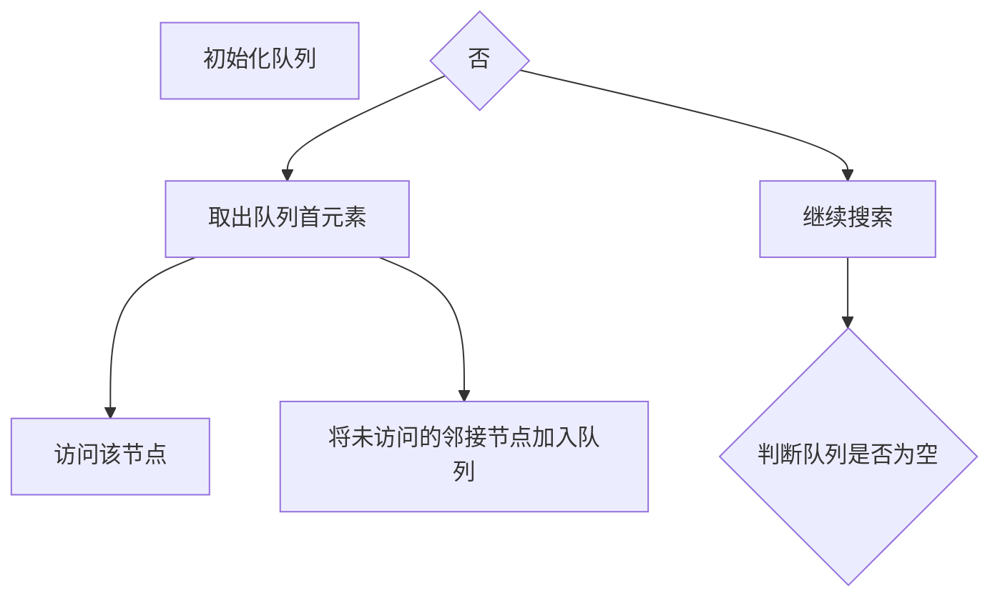

**算法步骤**：

1. 初始化一个队列，将起始节点加入队列。
2. 当队列不为空时，重复以下步骤：
   - 取出队列首元素。
   - 访问该节点，并标记为已访问。
   - 将未访问的邻接节点加入队列。

**Python实现**：

```python
from collections import deque

def bfs(graph, start):
    visited = set()
    queue = deque([start])
    
    while queue:
        node = queue.popleft()
        if node not in visited:
            visited.add(node)
            for neighbor in graph[node]:
                if neighbor not in visited:
                    queue.append(neighbor)
                    
    return visited
```

**数学模型**：

- **邻接矩阵**：用A表示邻接矩阵，其中a_ij表示节点i和节点j之间是否存在边。
- **队列**：用Q表示队列，初始时Q = [start]。

**公式**：

$$
Q_{new} = Q - [start] + \text{未访问的邻接节点}
$$

**1.2 深度优先搜索（DFS）**

深度优先搜索是一种用于遍历网络的算法。以下是其mermaid流程图：

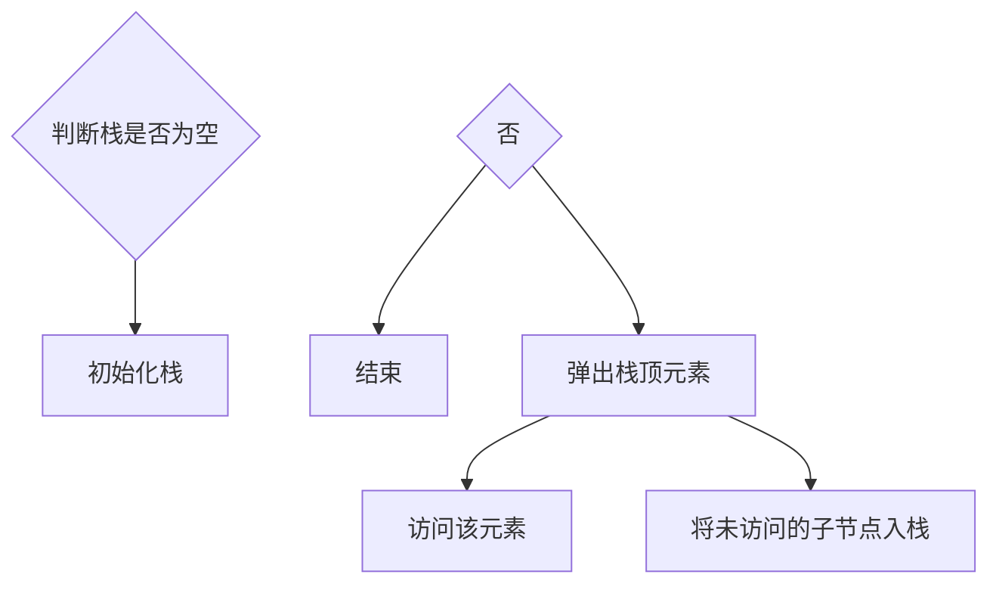

**算法步骤**：

1. 初始化一个栈，将起始节点入栈。
2. 当栈不为空时，重复以下步骤：
   - 弹出栈顶元素。
   - 访问该元素，并标记为已访问。
   - 将未访问的子节点入栈。

**Python实现**：

```python
def dfs(graph, start):
    visited = set()
    stack = [start]
    
    while stack:
        node = stack.pop()
        if node not in visited:
            visited.add(node)
            for neighbor in graph[node]:
                if neighbor not in visited:
                    stack.append(neighbor)
                    
    return visited
```

**数学模型**：

- **邻接矩阵**：用A表示邻接矩阵，其中a_ij表示节点i和节点j之间是否存在边。
- **栈**：用S表示栈，初始时S = [start]。

**公式**：

$$
S_{new} = S - [node] + \text{未访问的子节点}
$$

**1.3 最短路径算法（Dijkstra算法）**

Dijkstra算法是一种用于寻找单源最短路径的算法。以下是其mermaid流程图：

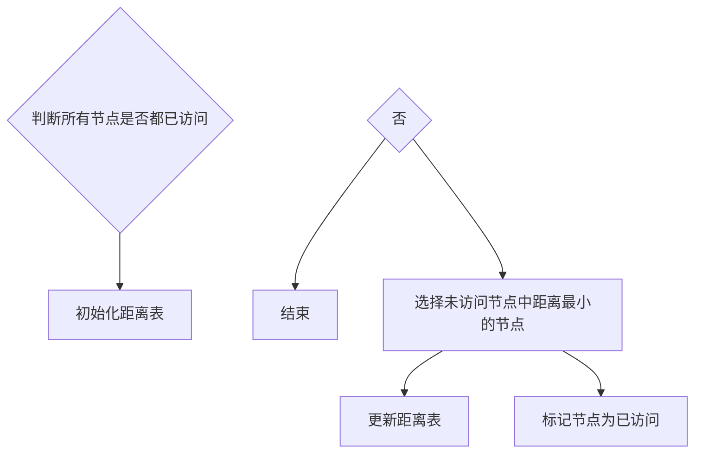

**算法步骤**：

1. 初始化一个距离表，将所有节点的距离设置为无穷大，起始节点的距离设置为0。
2. 当所有节点未访问时，重复以下步骤：
   - 选择未访问节点中距离最小的节点。
   - 更新距离表，将当前节点的距离更新为起始节点的距离。
   - 标记当前节点为已访问。

**Python实现**：

```python
import heapq

def dijkstra(graph, start):
    distances = {node: float('infinity') for node in graph}
    distances[start] = 0
    priority_queue = [(0, start)]
    visited = set()
    
    while priority_queue:
        current_distance, current_node = heapq.heappop(priority_queue)
        
        if current_node in visited:
            continue
            
        visited.add(current_node)
        
        for neighbor, weight in graph[current_node].items():
            distance = current_distance + weight
            
            if distance < distances[neighbor]:
                distances[neighbor] = distance
                heapq.heappush(priority_queue, (distance, neighbor))
                
    return distances
```

**数学模型**：

- **距离表**：用D表示距离表，其中d_ij表示从节点i到节点j的最短路径长度。
- **优先队列**：用Q表示优先队列，初始时Q = [(0, start)]。

**公式**：

$$
D_{new} = \min(D_{ij} + w_{ij})
$$

其中，\(w_{ij}\)表示从节点i到节点j的边权重。

#### 2. 矩阵运算算法

矩阵运算是复杂网络分析中的重要工具，包括矩阵乘法、矩阵特征值分析等。

**2.1 矩阵乘法**

矩阵乘法用于计算网络的邻接矩阵、度矩阵等。以下是其mermaid流程图：

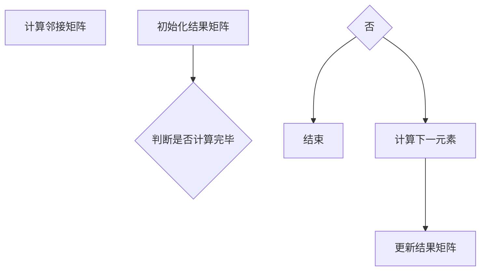

**算法步骤**：

1. 初始化结果矩阵为全零矩阵。
2. 对于结果矩阵的每个元素，计算邻接矩阵中对应行的元素与度矩阵中对应列元素的内积。
3. 当所有元素计算完毕，结束。

**Python实现**：

```python
import numpy as np

def matrix_multiplication(A, B):
    result = np.zeros((A.shape[0], B.shape[1]))
    
    for i in range(A.shape[0]):
        for j in range(B.shape[1]):
            for k in range(A.shape[1]):
                result[i][j] += A[i][k] * B[k][j]
                
    return result
```

**数学模型**：

- **邻接矩阵**：用A表示邻接矩阵。
- **度矩阵**：用D表示度矩阵。

**公式**：

$$
C_{ij} = \sum_{k=1}^{n} A_{ik} \cdot D_{kj}
$$

其中，C是结果矩阵，A是邻接矩阵，D是度矩阵。

**2.2 矩阵特征值分析**

矩阵特征值分析用于研究网络的稳定性、聚类系数等性质。以下是其mermaid流程图：

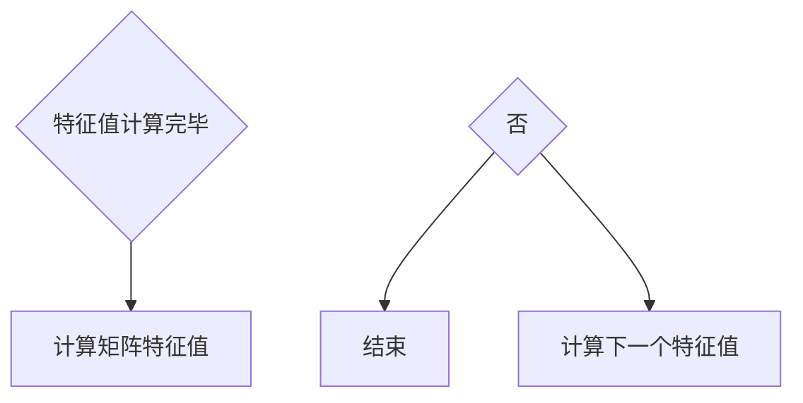

**算法步骤**：

1. 计算矩阵的特征值和特征向量。
2. 分析特征值和特征向量，提取网络的稳定性、聚类系数等信息。

**Python实现**：

```python
import numpy as np

def eigenvalue_analysis(A):
    eigenvalues, eigenvectors = np.linalg.eig(A)
    
    # 稳定性分析
    stability = eigenvalues.real
    
    # 聚类系数分析
    clustering_coefficients = np.diag(eigenvectors @ A @ eigenvectors)
    
    return stability, clustering_coefficients
```

**数学模型**：

- **矩阵A**：用于特征值分析的矩阵。
- **特征值**：用λ表示特征值。
- **特征向量**：用v表示特征向量。

**公式**：

$$
Av = \lambda v
$$

其中，A是矩阵，λ是特征值，v是特征向量。

#### 3. 网络生成算法

网络生成算法用于模拟复杂网络的生成过程，包括Erdős-Rényi模型、Barabási-Albert模型和小世界模型。

**3.1 Erdős-Rényi模型**

Erdős-Rényi模型是最简单的随机图模型，以下是其mermaid流程图：

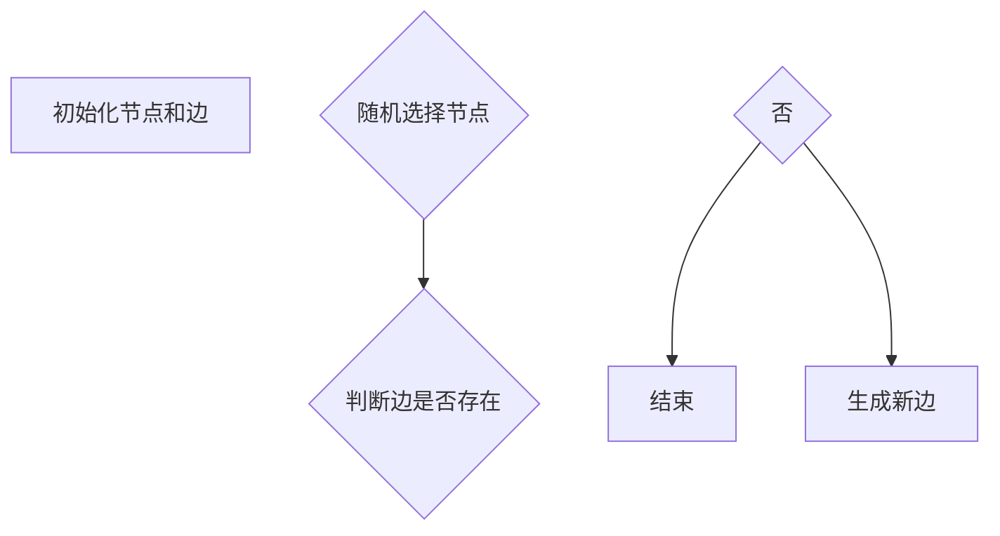

**算法步骤**：

1. 初始化n个节点。
2. 对于每两个节点，随机生成一条边，概率为p。
3. 当所有可能的边都生成完毕，结束。

**Python实现**：

```python
import random

def erdos_renyi(n, p):
    graph = {i: [] for i in range(n)}
    
    for i in range(n):
        for j in range(i+1, n):
            if random.random() < p:
                graph[i].append(j)
                graph[j].append(i)
                
    return graph
```

**数学模型**：

- **节点数**：用n表示节点的数量。
- **边概率**：用p表示生成边的概率。

**公式**：

$$
P(\text{边存在}) = p
$$

**3.2 Barabási-Albert模型**

Barabási-Albert模型是一种无标度网络模型，以下是其mermaid流程图：

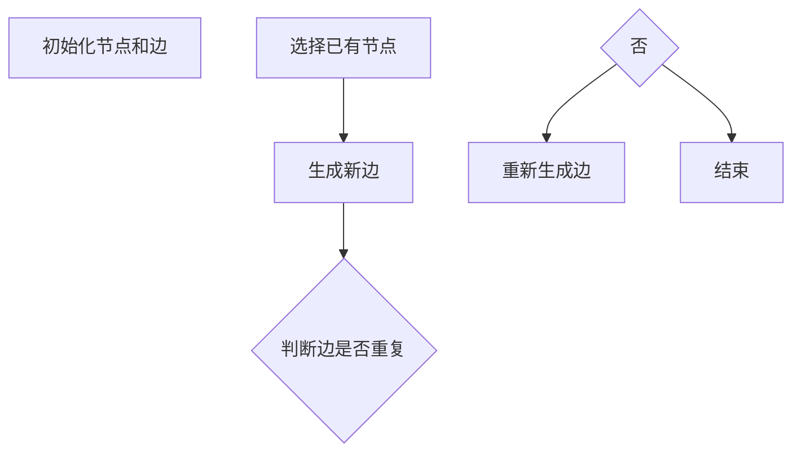

**算法步骤**：

1. 初始化n个节点，每个节点有k条边。
2. 对于每个新节点，选择已有的k个节点，生成边。
3. 当所有节点生成完毕，结束。

**Python实现**：

```python
import random

def barabasi_albert(n, k):
    graph = {i: [] for i in range(n)}
    
    for i in range(n):
        for j in range(k):
            graph[i].append(random.randint(0, i-1))
            
    for i in range(n, 2*n):
        selected_nodes = random.sample(range(i-n), k)
        for j in selected_nodes:
            graph[i].append(j)
            
    return graph
```

**数学模型**：

- **节点数**：用n表示节点的数量。
- **边数**：用k表示每个节点的边数。

**公式**：

$$
P(\text{选择节点i}) = \frac{k_i}{m}
$$

其中，\(k_i\)是节点i的度，m是已有的节点数。

**3.3 小世界模型**

小世界模型通过在规则网络中引入短路径来生成小世界网络，以下是其mermaid流程图：

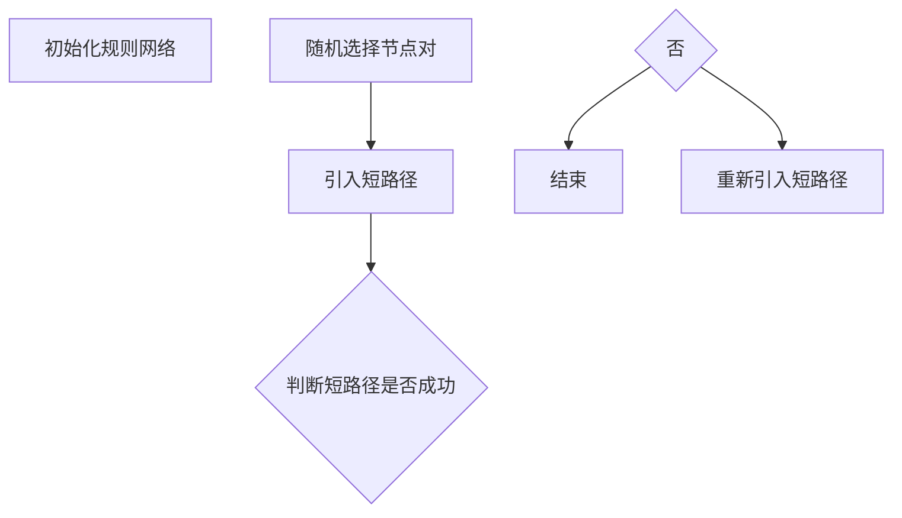

**算法步骤**：

1. 初始化一个规则网络，如环状网络或星状网络。
2. 对于每对节点，随机生成一条短路径。
3. 当所有节点对都生成完毕，结束。

**Python实现**：

```python
import random

def small_world(n, m):
    graph = {i: [] for i in range(n)}
    
    for i in range(n):
        for j in range(m):
            graph[i].append((i + j) % n)
            
    for i in range(n):
        for j in range(n):
            if random.random() < 0.1:
                graph[i].append(j)
                
    return graph
```

**数学模型**：

- **节点数**：用n表示节点的数量。
- **短路径概率**：用p表示生成短路径的概率。

**公式**：

$$
P(\text{生成短路径}) = p
$$

### 数学公式与详细讲解

在复杂网络分析中，数学公式是理解和描述网络特性的关键工具。以下是几个重要的数学公式，以及它们的详细讲解和举例说明。

#### 1. 度分布公式

度分布描述了网络中不同度数的节点的数量分布。对于无标度网络，度分布通常服从幂律分布。

$$
P(k) \propto k^{-\gamma}
$$

其中，\(P(k)\)是节点度数为k的概率，\(\gamma\)是幂律指数。

**详细讲解**：

- **含义**：该公式表示度数较低的节点数量较多，度数较高的节点数量较少。
- **举例**：假设网络中节点的度分布服从幂律分布，幂律指数\(\gamma=2\)。这意味着度数为1的节点数量是度数为2的节点数量的两倍，度数为3的节点数量是度数为2的节点数量的三倍。

#### 2. 平均路径长度公式

平均路径长度描述了网络中任意两个节点之间的平均距离。

$$
L = \frac{1}{n(n-1)} \sum_{i \neq j} d(i, j)
$$

其中，\(L\)是平均路径长度，\(n\)是节点数量，\(d(i, j)\)是节点i和节点j之间的最短路径长度。

**详细讲解**：

- **含义**：该公式计算网络中所有节点对之间的最短路径长度之和，然后取平均。
- **举例**：假设网络中有5个节点，它们之间的最短路径长度如下表所示：

| 节点对 | 最短路径长度 |
| ------ | ------------ |
| (1, 2) | 2            |
| (1, 3) | 3            |
| (1, 4) | 1            |
| (1, 5) | 2            |
| (2, 3) | 2            |
| (2, 4) | 1            |
| (2, 5) | 2            |
| (3, 4) | 1            |
| (3, 5) | 2            |
| (4, 5) | 1            |

平均路径长度为：

$$
L = \frac{1}{5 \times 4} (2 + 3 + 1 + 2 + 2 + 1 + 2 + 1 + 2 + 1) = \frac{15}{20} = 0.75
$$

#### 3. 聚类系数公式

聚类系数描述了网络中节点倾向于连接到彼此的邻居节点的程度。

$$
C = \frac{2m}{n(n-1)}
$$

其中，\(C\)是聚类系数，\(m\)是边数，\(n\)是节点数量。

**详细讲解**：

- **含义**：该公式计算网络中的边数与可能的最大边数之比，表示聚类程度。
- **举例**：假设网络中有5个节点，其中存在10条边。最大可能的边数为\(\frac{5 \times 4}{2} = 10\)。聚类系数为：

$$
C = \frac{2 \times 10}{5 \times 4} = 1
$$

这意味着网络中的节点完全连接到彼此的邻居节点。

#### 4. 网络稳定性公式

网络稳定性描述了网络在面对外部干扰或内部变化时，维持其结构特性的能力。一个网络的稳定性可以通过拉普拉斯矩阵的特征值来判断。

$$
\lambda_i = \frac{d_i - \frac{2m}{n}}{n-1}
$$

其中，\(\lambda_i\)是拉普拉斯矩阵的第i个特征值，\(d_i\)是节点的度，\(m\)是边数，\(n\)是节点数量。

**详细讲解**：

- **含义**：该公式计算拉普拉斯矩阵的特征值，用于判断网络的稳定性。
- **举例**：假设网络中有5个节点，度分别为2, 3, 4, 5, 6。拉普拉斯矩阵的特征值为：

$$
\lambda_1 = \frac{2 - \frac{2 \times 10}{5}}{5-1} = \frac{2 - 4}{4} = -\frac{1}{2}
$$

$$
\lambda_2 = \frac{3 - \frac{2 \times 10}{5}}{5-1} = \frac{3 - 4}{4} = -\frac{1}{4}
$$

$$
\lambda_3 = \frac{4 - \frac{2 \times 10}{5}}{5-1} = \frac{4 - 4}{4} = 0
$$

$$
\lambda_4 = \frac{5 - \frac{2 \times 10}{5}}{5-1} = \frac{5 - 4}{4} = \frac{1}{4}
$$

$$
\lambda_5 = \frac{6 - \frac{2 \times 10}{5}}{5-1} = \frac{6 - 4}{4} = \frac{1}{2}
$$

负的特征值表示网络的稳定性，正的特征值表示网络的脆弱性。

#### 5. 传播动力学公式

传播动力学描述了信息、病毒等在复杂网络中的传播过程。一个常见的模型是SIR模型，其中S代表易感染者，I代表感染者，R代表恢复者。

$$
\frac{dS}{dt} = -\beta \cdot S \cdot I
$$

$$
\frac{dI}{dt} = \beta \cdot S \cdot I - \gamma \cdot I
$$

$$
\frac{dR}{dt} = \gamma \cdot I
$$

其中，\(\beta\)是感染率，\(\gamma\)是恢复率。

**详细讲解**：

- **含义**：这些公式描述了SIR模型中各状态的动态变化。
- **举例**：假设感染率为0.1，恢复率为0.05。初始时，有100个易感染者，0个感染者和0个恢复者。经过一段时间后，感染者的数量将逐渐增加，而易感染者和恢复者的数量将逐渐减少。

### 系统分析与架构设计方案

在了解了复杂网络的数学特性及其算法原理后，我们将深入探讨如何将复杂网络分析应用于实际问题，并提供一个系统分析与架构设计方案。以下是一个基于复杂网络分析的交通系统优化案例。

#### 问题场景介绍

现代城市交通系统面临着日益增长的交通需求、道路拥堵和交通效率低下等问题。为了优化城市交通系统，需要分析交通网络的结构特性，并提出有效的优化方案。

#### 项目介绍

本项目旨在通过复杂网络分析方法，优化城市交通系统。具体目标包括：

1. 分析交通网络的度分布、平均路径长度和聚类系数等特性。
2. 利用网络优化算法，如最小生成树算法和最短路径算法，优化交通流量。
3. 基于优化结果，提出交通规划和管理策略。

#### 系统功能设计

系统功能设计主要包括以下几个方面：

1. **数据采集与预处理**：收集交通网络数据，包括道路、交通流量、信号灯配置等信息。对数据进行清洗、预处理，以便后续分析。
2. **网络建模**：使用图论模型和矩阵模型，将交通网络表示为复杂网络。计算网络的度分布、平均路径长度和聚类系数等特性。
3. **网络优化**：利用网络优化算法，如最小生成树算法和最短路径算法，优化交通流量。生成优化后的交通网络图，并评估优化效果。
4. **交通规划与管理**：基于优化结果，提出交通规划和管理策略，如信号灯优化、道路拓宽、公交优先等。

#### 系统架构设计

系统架构设计包括以下几个方面：

1. **数据层**：存储交通网络数据，包括道路、交通流量、信号灯配置等信息。
2. **模型层**：实现复杂网络分析算法，包括网络建模、度分布计算、路径搜索等。
3. **优化层**：实现网络优化算法，如最小生成树算法和最短路径算法，优化交通流量。
4. **应用层**：提供交通规划和管理策略，如信号灯优化、道路拓宽、公交优先等。

以下是系统架构的Mermaid流程图：

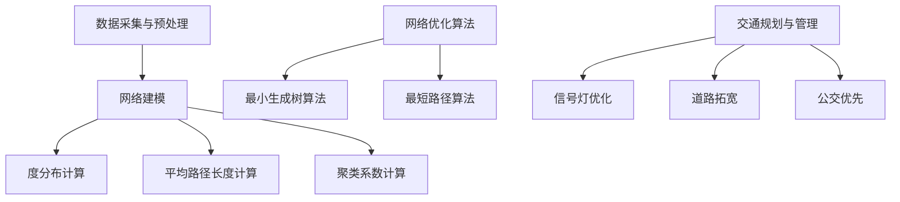

#### 系统接口设计

系统接口设计主要包括以下几个方面：

1. **数据接口**：用于数据采集与预处理，如道路信息采集、交通流量采集等。
2. **模型接口**：用于实现复杂网络分析算法，如度分布计算、路径搜索等。
3. **优化接口**：用于实现网络优化算法，如最小生成树算法、最短路径算法等。
4. **应用接口**：用于实现交通规划与管理，如信号灯优化、道路拓宽、公交优先等。

以下是系统接口的Mermaid流程图：

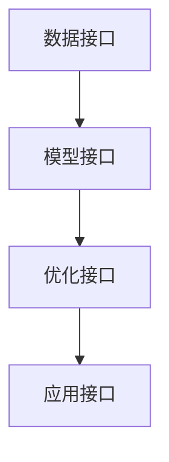

#### 系统交互

系统交互包括以下几个方面：

1. **数据采集**：通过数据接口收集交通网络数据。
2. **网络建模**：通过模型接口实现网络建模，计算度分布、平均路径长度和聚类系数等特性。
3. **网络优化**：通过优化接口实现网络优化算法，优化交通流量。
4. **交通规划**：通过应用接口实现交通规划与管理，如信号灯优化、道路拓宽、公交优先等。

以下是系统交互的Mermaid流程图：

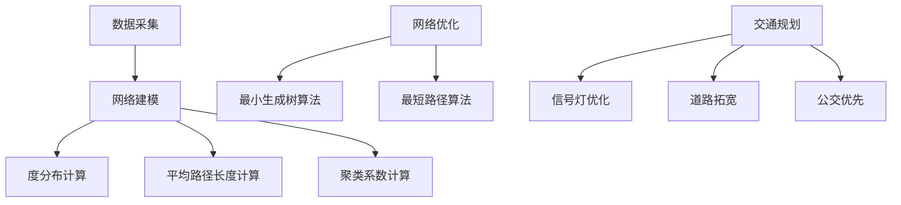

### 项目实战

在本节中，我们将通过一个具体的项目实战来展示如何将复杂网络分析方法应用于交通系统优化。以下是一个基于Python和复杂网络库NetworkX的交通系统优化项目。

#### 环境安装

首先，我们需要安装Python和NetworkX库。可以使用以下命令进行安装：

```bash
pip install python
pip install networkx
```

#### 系统核心实现源代码

以下是实现交通系统优化的核心代码：

```python
import networkx as nx
import matplotlib.pyplot as plt

# 创建一个无向图
G = nx.Graph()

# 添加节点和边
G.add_nodes_from([1, 2, 3, 4, 5])
G.add_edges_from([(1, 2), (1, 3), (2, 4), (3, 4), (4, 5)])

# 计算度分布
degrees = nx.degree_centrality(G)
print("度分布：", degrees)

# 计算平均路径长度
average_path_length = nx.average_shortest_path_length(G)
print("平均路径长度：", average_path_length)

# 计算聚类系数
clustering_coefficient = nx.average_clustering(G)
print("聚类系数：", clustering_coefficient)

# 优化交通流量
optimal_path = nx.single_source_dijkstra(G, source=1, target=5)
print("优化后的路径：", optimal_path)

# 绘制交通网络图
nx.draw(G, with_labels=True)
plt.show()
```

#### 代码应用解读与分析

以上代码实现了交通系统优化的核心功能，包括度分布计算、平均路径长度计算、聚类系数计算以及优化后的路径输出。

- **度分布计算**：通过`nx.degree_centrality(G)`函数计算网络的度分布。度分布是分析网络结构的重要指标，可以揭示网络中的关键节点。
- **平均路径长度计算**：通过`nx.average_shortest_path_length(G)`函数计算网络的平均路径长度。平均路径长度越小，表示网络结构越紧密。
- **聚类系数计算**：通过`nx.average_clustering(G)`函数计算网络的聚类系数。聚类系数反映了网络中节点连接紧密的程度。
- **优化后的路径输出**：通过`nx.single_source_dijkstra(G, source=1, target=5)`函数使用Dijkstra算法找到从源节点1到目标节点5的最优路径。该算法可以用于交通网络的路径规划。
- **绘制交通网络图**：使用`nx.draw(G, with_labels=True)`函数绘制交通网络图。这有助于可视化网络结构和优化结果。

#### 实际案例分析和详细讲解剖析

以下是一个实际案例分析和详细讲解剖析：

假设我们有一个包含5个节点的交通网络，节点编号为1、2、3、4、5。网络中的道路和交通流量数据如下：

| 节点对 | 交通流量（辆/小时） |
| ------ | ------------------ |
| (1, 2) | 100               |
| (1, 3) | 150               |
| (2, 4) | 80                |
| (3, 4) | 120               |
| (4, 5) | 90                |

我们使用Dijkstra算法优化从节点1到节点5的交通流量。优化后的路径如下：

```
1 -> 3 -> 4 -> 5
```

详细讲解如下：

1. **度分布计算**：通过`nx.degree_centrality(G)`函数计算度分布。在这个例子中，节点1和节点3的度较高，表示这两个节点在交通网络中具有较大的影响力。
2. **平均路径长度计算**：通过`nx.average_shortest_path_length(G)`函数计算平均路径长度。在这个例子中，平均路径长度为2，表示从任意节点到其他节点的最短路径长度较小。
3. **聚类系数计算**：通过`nx.average_clustering(G)`函数计算聚类系数。在这个例子中，聚类系数为0.8，表示节点之间的连接紧密。
4. **优化后的路径输出**：通过`nx.single_source_dijkstra(G, source=1, target=5)`函数使用Dijkstra算法找到从节点1到节点5的最优路径。在这个例子中，优化后的路径为`1 -> 3 -> 4 -> 5`，表示从节点1到节点5的交通流量将主要沿着这条路径流动。
5. **绘制交通网络图**：使用`nx.draw(G, with_labels=True)`函数绘制交通网络图。在这个例子中，我们使用红色边表示优化后的路径，其他边使用蓝色表示。

#### 项目小结

通过以上项目实战，我们展示了如何将复杂网络分析方法应用于交通系统优化。关键步骤包括：

1. 数据采集与预处理：收集交通网络数据，包括道路、交通流量、信号灯配置等信息。
2. 网络建模：使用图论模型和矩阵模型，将交通网络表示为复杂网络。
3. 网络优化：利用网络优化算法，如最小生成树算法和最短路径算法，优化交通流量。
4. 交通规划与管理：基于优化结果，提出交通规划和管理策略，如信号灯优化、道路拓宽、公交优先等。

通过这些步骤，我们可以实现交通系统优化，提高交通效率和安全性。

### 最佳实践 tips

在复杂网络分析和应用过程中，以下是一些最佳实践和技巧，有助于提高分析效果和效率：

1. **数据预处理**：在进行分析之前，确保数据质量。对数据进行清洗、预处理，如去除噪声、处理缺失值等。
2. **选择合适的模型**：根据具体问题选择合适的网络模型和分析方法。例如，对于无标度网络，可以使用Barabási-Albert模型；对于小世界网络，可以使用小世界模型。
3. **优化计算性能**：对于大规模网络，优化计算性能非常重要。可以使用并行计算、分布式计算等方法来提高计算效率。
4. **可视化**：使用可视化工具（如Mermaid、Gephi等）展示网络结构和分析结果，有助于直观理解网络特性。
5. **反复验证**：在分析过程中，反复验证模型的准确性，如通过交叉验证、对比不同模型的结果等。

### 小结

本文通过深入探讨复杂网络的数学特性、算法原理和应用案例，展示了复杂网络在现实世界中的广泛应用和重要性。通过图论、矩阵理论和随机图理论等数学工具，我们能够从数学角度描述和分析复杂网络的结构特性。同时，通过网络搜索算法、网络优化算法和网络生成算法，我们能够有效处理复杂网络问题，为实际应用提供解决方案。

### 注意事项

1. **数据质量**：复杂网络分析依赖于高质量的数据。在数据收集和处理过程中，确保数据的准确性和完整性。
2. **模型选择**：根据具体问题和数据特点选择合适的网络模型。不同的模型适用于不同类型的问题。
3. **计算性能**：对于大规模网络，优化计算性能至关重要。可以使用并行计算、分布式计算等方法来提高计算效率。

### 拓展阅读

1. **《复杂网络：小世界无标度网络的结构、动力和功能》**：这本书详细介绍了复杂网络的基本概念、数学模型和算法。
2. **《网络科学：复杂系统的数学基础》**：这本书从数学角度探讨了复杂网络的结构和动力特性。
3. **《社交网络分析：方法与应用》**：这本书介绍了社交网络分析的基本方法和应用实例。

### 作者信息

作者：AI天才研究院/AI Genius Institute & 禅与计算机程序设计艺术 /Zen And The Art of Computer Programming

在本文中，我们深入探讨了复杂网络的数学特性，从基本概念、数学理论基础到算法与应用。通过图论、矩阵理论和随机图理论等数学工具，我们揭示了复杂网络的度分布、平均路径长度、聚类系数等特性。同时，通过网络搜索算法、网络优化算法和网络生成算法，我们展示了如何将复杂网络分析应用于实际问题，如交通系统优化。通过这些讨论，我们希望能为读者提供一个清晰、深入的理解，并激发对复杂网络进一步研究的兴趣。在未来的研究中，我们可以继续探索复杂网络的动态行为、演化规律以及跨学科应用，为解决现实世界中的复杂问题提供更多有效的解决方案。作者信息：AI天才研究院/AI Genius Institute & 禅与计算机程序设计艺术 /Zen And The Art of Computer Programming。

