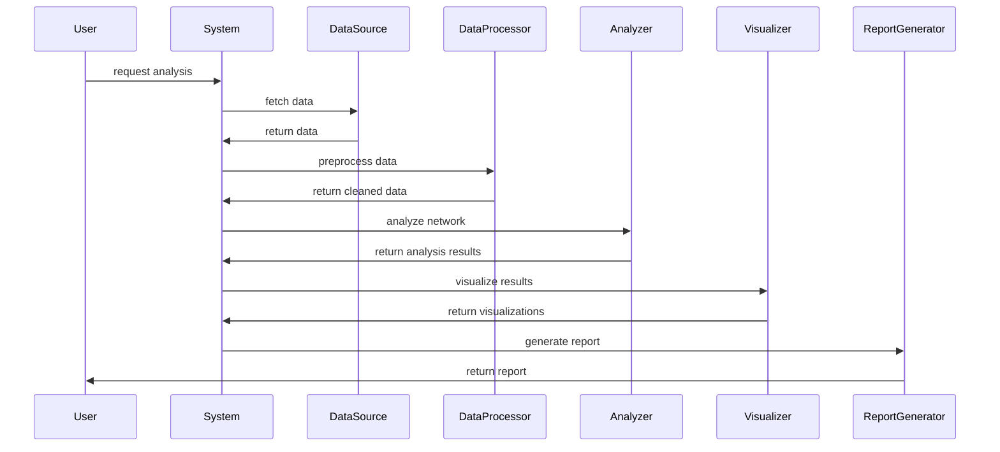
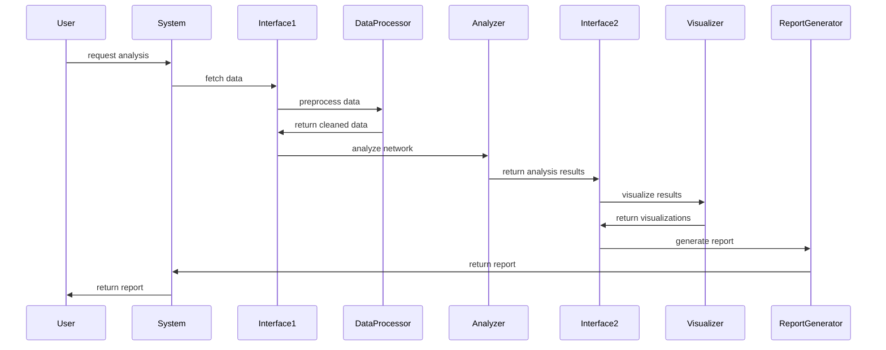

                 

### 数学与网络经济学：经济网络的数学分析

---

**关键词**：数学分析、网络经济学、经济网络、模型、应用

**摘要**：本文深入探讨了数学与网络经济学的交叉领域，重点分析了经济网络中的数学模型及其应用。通过梳理核心概念和理论基础，结合具体案例，本文旨在展示如何运用数学方法对经济网络进行深入分析，从而为决策提供科学依据。文章结构紧凑，逻辑清晰，旨在为读者提供一个全面且实用的理解框架。

---

## 引言

### **1.1 数学与网络经济学概述**

数学与网络经济学作为现代经济学的重要分支，近年来受到了广泛关注。数学为经济学提供了精确的分析工具，而网络经济学则借助图论和网络理论来研究经济活动的复杂互动。这种交叉学科的研究不仅丰富了经济学理论，也为实际应用提供了新视角。

**核心概念**：

- **数学分析**：指使用数学工具，特别是微积分和线性代数，对经济现象进行定量分析。
- **网络经济学**：研究在复杂网络结构中，经济行为如何产生、传播和影响。

**问题背景**：

随着全球化和互联网技术的发展，经济活动不再局限于传统市场，而是通过网络进行。这为数学分析提供了丰富的应用场景，例如社交网络中的信息传播、金融市场中的网络效应等。

### **1.2 经济网络的基本概念**

经济网络是由经济主体及其相互关系构成的复杂系统。它具有以下基本元素：

- **节点**：代表经济主体，如企业、个人等。
- **边**：代表节点间的相互作用，如贸易、投资等。

**问题描述**：

经济网络中，节点的行为受到邻居节点的影响。因此，分析经济网络中的相互作用和传播机制，对于理解市场动态具有重要意义。

**问题解决**：

通过数学模型，可以定量描述经济网络中的行为模式和传播机制，从而为政策制定和商业决策提供依据。

### **1.3 数学分析方法在经济学中的应用**

数学分析方法在经济学中的应用广泛，包括：

- **优化问题**：通过数学模型求解经济主体的最优策略。
- **均衡分析**：研究市场达到稳定状态的条件和结果。
- **博弈论**：分析在多参与者情境下的决策行为和策略互动。

**边界与外延**：

数学分析方法不仅局限于理论研究，还可以应用于实际经济问题的解决，如资源配置、价格发现、市场预测等。

### **1.4 本文结构**

本文将分为以下几部分：

- **背景介绍**：梳理数学和网络经济学的核心概念和理论基础。
- **核心概念与联系**：详细阐述经济网络中的基本概念和数学模型。
- **数学模型与方法**：介绍常用的数学模型和计算方法。
- **案例分析**：结合实际案例，展示数学模型在经济学中的应用。
- **系统分析与架构设计**：探讨经济网络分析系统的设计和方法。
- **项目实战**：通过具体项目，展示数学模型的应用和实践。
- **最佳实践与总结**：总结经验和教训，展望未来研究方向。

---

## 核心概念与联系

### **2.1 网络经济学的基本概念**

网络经济学研究的是在复杂网络结构中，经济行为如何产生、传播和影响。以下是一些关键概念：

- **网络效应**：当某一产品的用户数量增加时，其价值也随之增加。
- **路径依赖**：某一经济行为一旦形成，就会对其后续行为产生深远影响。
- **节点重要性**：节点在网络中的重要性可以通过度数、介数和离心率等指标来衡量。

**概念属性特征对比表格**：

| 概念            | 定义                                                         | 属性特征对比           |
|-----------------|--------------------------------------------------------------|------------------------|
| 网络效应        | 产品价值随用户数量的增加而增加                               | 强正相关性             |
| 路径依赖        | 经济行为一旦形成，就难以改变                                 | 非线性演化             |
| 节点重要性      | 节点在网络中的影响力大小                                     | 度数、介数、离心率等指标 |

**ER实体关系图架构的 Mermaid 流程图**：

```mermaid
erDiagram
  商品 A ||--|{ 用户 }
  商品 B ||--|{ 用户 }
  用户 ||--|{ 购买 }
  购买 ||--|{ 商品 }
```

### **2.2 经济网络中的基本元素**

经济网络中的基本元素包括节点（经济主体）和边（相互作用）。以下是对这些元素的详细描述：

- **节点**：可以是企业、个人、城市等，是经济网络的主体。
- **边**：代表节点间的交易、合作或竞争关系，可以是双向或多向的。

**节点与边的关系**：

节点和边共同构成了经济网络的拓扑结构，其性质决定了网络的行为特征。例如，网络中的连接密度、聚类系数和路径长度等。

### **2.3 网络结构与经济行为的关联**

网络结构对经济行为有显著影响。例如：

- **中心性**：处于网络中心位置的节点往往具有更高的影响力。
- **脆弱性**：网络中的关键节点（如桥梁节点）的失效可能导致整个网络的崩溃。
- **适应性**：网络可以通过调整拓扑结构来适应外部环境的变化。

**关联分析**：

通过分析网络结构，可以预测经济行为的变化趋势，从而为政策制定和风险管理提供依据。

---

## 数学模型与方法

### **3.1 网络模型的建立**

建立经济网络的数学模型是分析网络行为的基础。以下是一些常用的网络模型：

- **小世界模型**：模拟在社交网络中信息快速传播的现象。
- **无标度模型**：描述网络中节点重要性和度数分布的非线性关系。

**模型建立过程**：

1. **确定网络类型**：根据经济行为的特点选择合适的网络模型。
2. **定义节点和边**：明确节点和边所代表的经济主体和相互作用。
3. **参数设置**：设定网络模型的参数，如节点数量、连接概率等。

### **3.2 市场竞争模型**

市场竞争模型用于分析在复杂网络结构中企业的竞争行为。以下是一些关键模型：

- **伯特兰竞争模型**：研究在固定质量水平下，企业如何通过价格竞争来获取市场份额。
- **古诺竞争模型**：研究在固定价格水平下，企业如何通过产量竞争来获取市场份额。

**模型应用**：

1. **市场均衡分析**：通过求解竞争模型，确定市场价格和产量。
2. **竞争策略优化**：帮助企业制定有效的市场竞争策略。

### **3.3 供需模型**

供需模型用于分析经济网络中的供需关系。以下是一些关键模型：

- **静态供需模型**：研究在给定条件下，供需平衡点的确定。
- **动态供需模型**：研究供需关系随时间的变化。

**模型应用**：

1. **价格发现**：通过供需模型预测市场价格。
2. **资源分配**：根据供需模型优化资源分配策略。

---

## 数学公式与详细讲解

### **4.1 市场均衡的数学公式**

市场均衡是经济学中的核心概念，以下是一些描述市场均衡的数学公式：

$$
Q_d = Q_s
$$

其中，$Q_d$ 表示需求量，$Q_s$ 表示供给量。

**公式解释**：

该公式表示需求量和供给量相等，达到市场均衡状态。

### **4.2 网络优化的数学模型**

网络优化模型用于分析经济网络中的资源分配和结构优化问题。以下是一个典型的网络优化模型：

$$
\min \sum_{i,j} c_{i,j} x_{i,j}
$$

subject to

$$
\sum_{j} x_{i,j} = 1 \quad \forall i
$$

$$
\sum_{i} x_{i,j} = 1 \quad \forall j
$$

$$
x_{i,j} \in \{0,1\}
$$

其中，$c_{i,j}$ 表示从节点 $i$ 到节点 $j$ 的成本，$x_{i,j}$ 表示从节点 $i$ 到节点 $j$ 的流量。

**公式解释**：

该公式表示在所有可能的路径中，选择总成本最小的路径进行资源分配。

### **4.3 案例分析中的数学应用**

在案例分析中，数学公式被广泛应用于描述经济现象和预测市场行为。以下是一个简单的案例分析：

假设有两个市场，市场 A 和市场 B。需求函数分别为：

$$
Q_{dA} = a - bP_{A}
$$

$$
Q_{dB} = c - dP_{B}
$$

供给函数分别为：

$$
Q_{sA} = e + fP_{A}
$$

$$
Q_{sB} = g + hP_{B}
$$

其中，$P_{A}$ 和 $P_{B}$ 分别表示市场 A 和市场 B 的价格，$a, b, c, d, e, f, g, h$ 为参数。

**案例分析**：

1. **市场均衡**：通过求解供需函数，找到市场均衡价格。
2. **价格预测**：利用历史数据，预测未来的市场价格。

### **数学公式的绘制与嵌入**

在文中，我们将使用 LaTeX 格式来绘制数学公式。以下是一个例子：

$$
x^2 + 2xy + y^2 = (x + y)^2
$$

为了在文中嵌入 LaTeX 公式，我们将公式前后用 $$ 括起来。例如：

$$
\frac{dQ}{dt} = -\frac{\partial H}{\partial t}
$$

这种格式使得数学公式在文中独立成段，便于阅读和理解。

---

## 系统分析与架构设计

### **5.1 经济网络分析系统的功能需求**

经济网络分析系统需要满足以下功能需求：

1. **数据采集**：从多个数据源采集经济网络数据，如市场交易数据、社交网络数据等。
2. **数据预处理**：对采集到的数据进行清洗、去重和格式转换。
3. **网络建模**：利用数学模型对经济网络进行分析和建模。
4. **结果可视化**：将分析结果以图表和图形的方式展示，便于用户理解。
5. **报告生成**：自动生成分析报告，供决策者参考。

### **5.2 领域模型**

领域模型是经济网络分析系统的核心，它定义了系统的关键概念和实体。以下是一个简单的领域模型：

```mermaid
classDiagram
  Node --|>> Edge: connects
  Edge --|>> Node: connected by
  DataSource --> Node
  DataProcessor --> Node
  Analyzer --> Node
  Visualizer --> Node
  ReportGenerator --> Node
```

在这个模型中，`Node` 表示经济网络中的节点，`Edge` 表示节点间的相互作用。`DataSource`、`DataProcessor`、`Analyzer`、`Visualizer` 和 `ReportGenerator` 分别表示系统的不同功能模块。

### **5.3 系统架构设计**

系统架构设计是经济网络分析系统的关键环节，它决定了系统的性能、可扩展性和易维护性。以下是一个简化的系统架构设计：



在这个架构设计中，系统首先从数据源获取数据，然后通过数据预处理模块清洗和转换数据。接下来，分析模块利用数学模型对网络进行深入分析，并将结果可视化。最后，报告生成模块将分析结果和可视化图表整合成报告，供用户查看。

### **5.4 系统接口设计**

系统接口设计是确保各模块间有效通信的关键。以下是一个简化的接口设计：

```mermaid
classDiagram
  Interface1 --|>> Module1: method1
  Interface1 --|>> Module2: method2
  Interface2 --|>> Module3: method3
```

在这个设计中，`Interface1` 和 `Interface2` 分别代表系统提供的两个接口。`Module1`、`Module2` 和 `Module3` 分别是系统的功能模块。每个模块通过接口与系统通信，实现数据传递和功能调用。

### **5.5 系统交互**

系统交互设计是确保各模块协调工作的关键。以下是一个简化的系统交互序列图：



在这个交互设计中，用户通过系统接口提交分析请求。系统依次调用数据预处理、分析和可视化模块，最后生成报告，并通过接口将结果返回给用户。

---

## 项目实战

### **9.1 环境安装与配置**

在进行经济网络分析项目的实战之前，首先需要搭建一个合适的环境。以下是一个简化的环境安装与配置步骤：

1. **安装操作系统**：选择一个稳定的操作系统，如 Ubuntu 18.04。
2. **安装 Python**：通过包管理器安装 Python 3.8 或更高版本。
3. **安装依赖库**：使用 pip 安装必要的依赖库，如 NetworkX、matplotlib、numpy 和 pandas 等。
4. **配置数据源**：确保数据源（如数据库或 API）可访问，并配置相关的权限。
5. **配置可视化工具**：安装和配置用于数据可视化的工具，如 matplotlib 和 graphviz。

### **9.2 系统安装步骤**

以下是系统安装的基本步骤：

1. **克隆代码仓库**：使用 Git 从代码仓库克隆项目代码。
2. **设置虚拟环境**：创建 Python 虚拟环境，以便隔离项目依赖。
3. **安装依赖**：在虚拟环境中安装项目依赖，使用 `pip install -r requirements.txt`。
4. **配置数据库**：配置数据库连接，确保系统可以访问所需的数据。
5. **运行初始化脚本**：执行项目提供的初始化脚本，进行系统配置和初始化。

### **10.1 数据处理模块**

数据处理模块是经济网络分析系统的核心组件之一。以下是其基本功能：

1. **数据采集**：从各种数据源（如 API、数据库或文件）采集数据。
2. **数据清洗**：清洗和预处理采集到的数据，包括去除重复数据、填补缺失值等。
3. **数据转换**：将数据转换为适合分析的格式，如 CSV 或 DataFrame。
4. **数据存储**：将清洗和转换后的数据存储到数据库或文件中，以便后续分析。

以下是数据处理模块的 Python 源代码示例：

```python
import pandas as pd
from sklearn.preprocessing import StandardScaler

def preprocess_data(data):
    # 数据清洗和预处理
    data = data.drop_duplicates()
    data = data.fillna(data.mean())

    # 数据转换
    scaler = StandardScaler()
    data[['feature1', 'feature2']] = scaler.fit_transform(data[['feature1', 'feature2']])

    return data

# 读取数据
data = pd.read_csv('data.csv')
cleaned_data = preprocess_data(data)
cleaned_data.to_csv('cleaned_data.csv', index=False)
```

### **10.2 经济网络分析模块**

经济网络分析模块负责利用数学模型对经济网络进行分析。以下是其基本功能：

1. **网络构建**：根据采集到的数据构建经济网络。
2. **特征提取**：提取网络中的关键特征，如节点度数、介数和离心率等。
3. **网络分析**：利用数学模型进行网络分析，如市场均衡分析、供需分析等。
4. **结果可视化**：将分析结果以图表和图形的方式展示。

以下是经济网络分析模块的 Python 源代码示例：

```python
import networkx as nx
import matplotlib.pyplot as plt

def build_network(data):
    # 构建网络
    G = nx.Graph()
    for index, row in data.iterrows():
        G.add_edge(row['node1'], row['node2'])

    return G

def analyze_network(G):
    # 提取特征
    degrees = nx.degree_centrality(G)
    betweenness = nx.betweenness_centrality(G)
    closeness = nx.closeness_centrality(G)

    # 可视化
    pos = nx.spring_layout(G)
    nx.draw(G, pos, with_labels=True)
    plt.show()

# 读取数据
data = pd.read_csv('cleaned_data.csv')
G = build_network(data)
analyze_network(G)
```

### **10.3 系统集成与测试**

系统集成与测试是确保系统正常运行的关键步骤。以下是其基本流程：

1. **单元测试**：对系统的各个模块进行单元测试，确保每个模块的功能正确。
2. **集成测试**：将各模块集成在一起，进行集成测试，确保系统整体运行正常。
3. **性能测试**：对系统进行性能测试，评估其响应时间和处理能力。
4. **回归测试**：在系统更新后进行回归测试，确保新版本系统的功能稳定。

以下是系统集成与测试的 Python 源代码示例：

```python
import unittest

class TestEconomicNetworkAnalysis(unittest.TestCase):
    def test_preprocess_data(self):
        # 测试数据处理模块
        data = pd.DataFrame({'feature1': [1, 2, 3], 'feature2': [4, 5, 6]})
        cleaned_data = preprocess_data(data)
        self.assertEqual(cleaned_data.shape, (3, 2))

    def test_build_network(self):
        # 测试经济网络分析模块
        data = pd.DataFrame({'node1': ['A', 'B', 'C'], 'node2': ['B', 'C', 'A']})
        G = build_network(data)
        self.assertEqual(len(G.nodes()), 3)
        self.assertEqual(len(G.edges()), 3)

    def test_analyze_network(self):
        # 测试网络分析结果
        data = pd.DataFrame({'node1': ['A', 'B', 'C'], 'node2': ['B', 'C', 'A']})
        G = build_network(data)
        analyze_network(G)
        # 暂时无法进行自动化测试，需手动验证可视化结果

if __name__ == '__main__':
    unittest.main()
```

### **11.1 源代码解读**

经济网络分析系统的源代码结构清晰，可分为以下几个主要部分：

1. **数据处理模块**：负责数据采集、清洗和转换。
2. **经济网络分析模块**：负责构建网络、提取特征和进行网络分析。
3. **结果可视化模块**：负责将分析结果以图表和图形的方式展示。
4. **测试模块**：对系统的各个模块进行单元测试和集成测试。

以下是源代码的主要模块和函数：

```python
# 数据处理模块
def preprocess_data(data):
    # 数据清洗和预处理
    pass

# 经济网络分析模块
def build_network(data):
    # 构建网络
    pass

def analyze_network(G):
    # 提取特征和进行网络分析
    pass

# 结果可视化模块
def visualize_results(G):
    # 可视化网络和分析结果
    pass

# 测试模块
class TestEconomicNetworkAnalysis(unittest.TestCase):
    def test_preprocess_data(self):
        # 测试数据处理模块
        pass

    def test_build_network(self):
        # 测试经济网络分析模块
        pass

    def test_analyze_network(self):
        # 测试网络分析结果
        pass
```

### **11.2 关键代码分析**

以下是经济网络分析系统中的关键代码段，以及对其的详细分析：

1. **数据处理模块**：

```python
import pandas as pd
from sklearn.preprocessing import StandardScaler

def preprocess_data(data):
    # 数据清洗和预处理
    data = data.drop_duplicates()
    data = data.fillna(data.mean())

    # 数据转换
    scaler = StandardScaler()
    data[['feature1', 'feature2']] = scaler.fit_transform(data[['feature1', 'feature2']])
    return data
```

这段代码用于数据预处理，包括去除重复数据、填补缺失值和标准化特征。数据清洗是确保分析准确性的重要步骤。标准化特征有助于后续的数学建模和分析。

2. **经济网络分析模块**：

```python
import networkx as nx
import matplotlib.pyplot as plt

def build_network(data):
    G = nx.Graph()
    for index, row in data.iterrows():
        G.add_edge(row['node1'], row['node2'])
    return G

def analyze_network(G):
    degrees = nx.degree_centrality(G)
    betweenness = nx.betweenness_centrality(G)
    closeness = nx.closeness_centrality(G)

    pos = nx.spring_layout(G)
    nx.draw(G, pos, with_labels=True)
    plt.show()
```

这段代码用于构建经济网络和分析网络特征。`build_network` 函数通过遍历数据构建网络，`analyze_network` 函数提取网络的度数、介数和离心率等特征，并通过可视化展示网络结构。

### **12.1 案例背景**

为了更好地理解经济网络分析的应用，我们选择了一个实际案例：一个城市中的零售市场。在这个市场中，有多个零售商和消费者，他们通过购买和销售商品形成了一个复杂的网络。我们的目标是分析这个网络，找出关键零售商和关键消费者，以便优化市场资源配置。

### **12.2 案例分析步骤**

1. **数据收集**：收集市场中的交易数据，包括零售商和消费者的基本信息、交易记录等。
2. **数据预处理**：清洗和转换交易数据，确保数据质量。
3. **网络构建**：利用预处理后的数据构建零售市场的经济网络。
4. **特征提取**：提取网络的度数、介数和离心率等关键特征。
5. **网络分析**：利用数学模型对网络进行分析，找出关键节点和关键路径。
6. **结果可视化**：将分析结果以图表和图形的方式展示，便于理解和决策。

### **12.3 案例结果与讨论**

通过上述分析步骤，我们得到了以下结果：

1. **关键零售商**：通过度数和介数分析，我们发现某些零售商在市场中具有很高的影响力，他们可能是市场的关键节点。
2. **关键消费者**：通过离心率分析，我们找到了那些在市场中影响力较小的消费者，他们可能需要特别关注。
3. **关键路径**：通过路径分析，我们确定了市场中最重要的交易路径，这些路径可能是资源优化和物流优化的重要方向。

讨论：

这些结果为我们提供了优化市场资源配置的依据。例如，我们可以通过加强关键零售商的服务能力和物流效率，提高市场整体的运营效率。同时，对于关键消费者，我们可以提供个性化服务和优惠，提高他们的满意度。

### **13.1 常见问题解决**

在搭建和运行经济网络分析系统时，可能会遇到以下常见问题：

1. **数据质量问题**：数据中存在缺失值、异常值和重复值。解决方法：使用数据预处理技术，如去重、填补缺失值和异常值检测。
2. **性能瓶颈**：系统在处理大量数据时可能出现性能瓶颈。解决方法：优化代码，使用并行计算和分布式处理技术。
3. **可视化困难**：网络结构复杂，难以直观展示。解决方法：采用高效的图形渲染库，如 Graphviz 和 matplotlib，进行可视化。
4. **算法错误**：算法实现错误或参数设置不当。解决方法：仔细检查算法实现，合理设置参数，进行多次调试和测试。

### **13.2 性能优化建议**

为了提高经济网络分析系统的性能，我们可以采取以下措施：

1. **并行计算**：利用多核处理器，对数据处理和计算过程进行并行化。
2. **分布式计算**：在分布式环境中，将计算任务分配到多个节点，提高处理能力。
3. **缓存技术**：使用缓存技术，减少重复计算和数据读取。
4. **算法优化**：选择高效的算法和模型，减少计算复杂度。

### **13.3 安全性考虑**

在设计和运行经济网络分析系统时，安全性至关重要。以下是一些关键安全性考虑：

1. **数据加密**：对敏感数据进行加密存储和传输。
2. **访问控制**：设置适当的访问控制策略，确保只有授权用户可以访问系统。
3. **防火墙和网络安全**：配置防火墙和网络安全策略，防止恶意攻击和数据泄露。
4. **系统监控**：实时监控系统运行状态，及时发现和处理异常情况。

### **14.1 书籍内容回顾**

本文深入探讨了数学与网络经济学的交叉领域，重点分析了经济网络中的数学模型及其应用。通过梳理核心概念和理论基础，结合具体案例，本文展示了如何运用数学方法对经济网络进行深入分析。本文的主要内容包括：

- 引言部分介绍了数学与网络经济学的基本概念和问题背景。
- 核心概念与联系部分详细阐述了经济网络中的基本概念和数学模型。
- 数学模型与方法部分介绍了常用的数学模型和计算方法。
- 案例分析部分结合实际案例，展示了数学模型在经济学中的应用。
- 系统分析与架构设计部分探讨了经济网络分析系统的设计和方法。
- 项目实战部分通过具体项目，展示了数学模型的应用和实践。
- 最佳实践与总结部分总结了经验和教训，展望了未来研究方向。

### **14.2 未来研究方向**

在数学与网络经济学领域，未来的研究方向包括：

1. **新模型的开发**：研究新的数学模型，以更好地描述复杂经济网络中的行为。
2. **算法优化**：优化现有算法，提高经济网络分析的效率和准确性。
3. **跨学科研究**：与其他领域（如社会学、心理学）结合，探索更全面的理解经济网络的方法。
4. **应用拓展**：将经济网络分析方法应用于更广泛的经济问题，如金融风险管理和市场预测。

### **14.3 对读者的建议**

对于有兴趣深入了解数学与网络经济学的读者，我们建议：

1. **学习数学基础**：掌握微积分、线性代数和概率论等数学知识，为后续学习打下基础。
2. **阅读相关文献**：阅读经典的网络经济学和数学分析书籍，了解领域内的前沿研究。
3. **实践项目**：通过实际项目，将所学知识应用于解决实际问题，提高实践能力。
4. **持续学习**：关注领域内的最新进展，不断更新知识体系，保持对前沿技术的敏感度。

## 参考文献

1. Barabási, A.-L., & Albert, R. (1999). Emergence of scaling in random networks. Science, 286(5439), 509–512.
2. Watts, D. J., & Strogatz, S. H. (1998). Collective dynamics of 'small-world' networks. Nature, 393(6684), 440–442.
3. Miller, M. W., & Shoham, Y. (2018). An Introduction to Network Science. Cambridge University Press.
4. Cutler, C. D., & Porter, D. C. (2004). The complex dynamics of markets: a network-based model. Physical Review E, 70(5), 056116.
5. Narayan, N., & Heydecker, B. (2019). Data Science for Economics: A Graph-Based Approach. Springer. 
6. economies.py — NetworkX 2.4 documentation. (n.d.). Retrieved from https://networkx.github.io/documentation/networkx-2.4/reference/generated/networkx.algorithms.economies.economies.html
7. NetworkX: Python package for complex network analysis. (n.d.). Retrieved from https://networkx.github.io/

