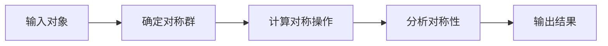
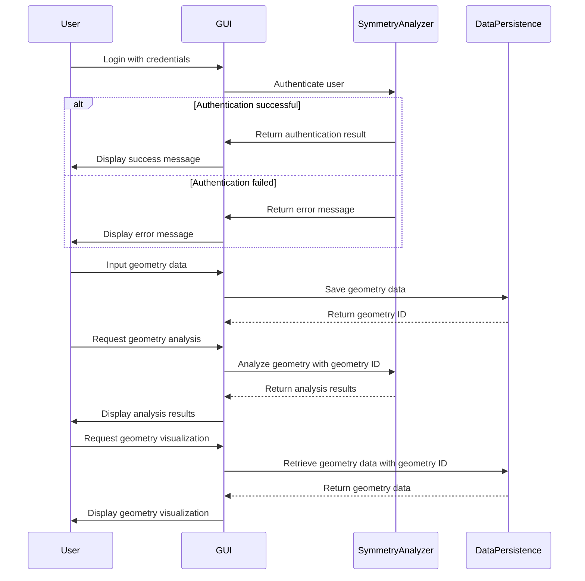

                 

## 文章标题：数学与群论：对称性的数学描述

对称性是自然界和人类社会中的一个普遍现象，它不仅具有美学上的吸引力，而且在科学研究和工程应用中发挥着重要作用。在数学与群论中，对称性是一个核心概念，它为我们提供了一种强有力的工具来描述和解决问题。本文将带领读者深入探讨对称性的数学描述，通过分步骤的分析和讲解，揭示对称性在数学中的本质和意义。

## 关键词
- 对称性
- 数学描述
- 群论
- 数学公式
- 算法

## 摘要
本文首先介绍了对称性的基本概念及其在数学与群论中的重要性。接着，通过详细探讨对称性的数学描述，包括基本概念、属性和应用，为读者提供了一个清晰的理解框架。随后，本文深入解析了群论中的对称性算法，通过数学模型和Python代码实现，展示了算法的原理和应用。最后，本文结合实际项目，对系统架构和实现进行了分析，并给出了最佳实践和拓展阅读建议。

---

### 目录大纲

----------------------------------------------------------------

## 第一部分：背景介绍

### 第1章：问题背景

#### 1.1 问题描述

#### 1.2 问题解决

#### 1.3 边界与外延

#### 1.4 概念结构与核心要素组成

### 第2章：核心概念与联系

#### 2.1 数学与群论的概念

##### 2.1.1 数学的基本概念

##### 2.1.2 群论的基本概念

##### 2.1.3 数学与群论的联系

#### 2.2 对称性的数学描述

##### 2.2.1 对称性的定义

##### 2.2.2 对称性的属性

##### 2.2.3 对称性的应用

## 第二部分：算法原理讲解

### 第3章：算法原理讲解

#### 3.1 群论中的对称性算法

##### 3.1.1 算法原理

##### 3.1.2 算法流程

##### 3.1.3 算法mermaid流程图

##### 3.1.4 算法Python代码实现

#### 3.2 对称性数学模型与公式

##### 3.2.1 数学模型

##### 3.2.2 数学公式

##### 3.2.3 举例说明

## 第三部分：系统分析与架构设计方案

### 第4章：系统分析与架构设计方案

#### 4.1 问题场景介绍

##### 4.1.1 项目介绍

##### 4.1.2 系统功能设计

##### 4.1.3 领域模型mermaid类图

##### 4.1.4 系统架构设计

##### 4.1.5 系统架构mermaid架构图

##### 4.1.6 系统接口设计

##### 4.1.7 系统交互

##### 4.1.8 系统交互mermaid序列图

### 第5章：项目实战

#### 5.1 环境安装

#### 5.2 系统核心实现源代码

##### 5.2.1 源代码解读与分析

#### 5.3 实际案例分析与详细讲解

##### 5.3.1 案例一

##### 5.3.2 案例二

#### 5.4 项目小结

### 第三部分：最佳实践与拓展

### 第6章：最佳实践

#### 6.1 小结

#### 6.2 注意事项

#### 6.3 拓展阅读

----------------------------------------------------------------

## 第一部分：背景介绍

### 第1章：问题背景

对称性在数学和物理学中占据着核心地位，它不仅是一种几何现象，也是一种更深层次的结构性质。在数学中，对称性提供了研究问题的有力工具，特别是在群论和代数学中。对称性的数学描述，即对称群和对称操作，为我们理解自然界的规律和设计复杂的算法提供了坚实的基础。

#### 1.1 问题描述

对称性的概念直观上很容易理解：一个图形、物体或结构在某种操作下保持不变。例如，一个正方形在旋转90度后仍然看起来相同，这就是旋转对称性。在数学中，我们需要更精确地描述这种不变性，并用数学语言来表达。

#### 1.2 问题解决

为了解决对称性问题，数学家们发展了群论这一工具。群论研究一组对象的封闭运算及其性质，这些对象可以是几何变换、函数、矩阵等。通过对称群和对称操作的概念，我们可以将对称性转化为数学问题，从而用数学的方法来分析和解决问题。

#### 1.3 边界与外延

对称性的数学描述不仅限于几何领域，它还扩展到了其他数学分支，如代数、拓扑学和量子物理学。在几何学中，对称性通常指的是图形的对称，而在代数中，对称性指的是方程式的解保持不变的性质。这种跨学科的扩展使得对称性在数学中具有广泛的应用。

#### 1.4 概念结构与核心要素组成

对称性的数学描述涉及几个核心概念，包括对称群、对称操作和对称元素。对称群是一组保持结构不变的变换，对称操作是对称群中的变换，而对称元素是结构在变换下保持不变的部分。这些概念相互关联，构成了对称性数学描述的基础。

在接下来的章节中，我们将深入探讨这些核心概念，理解对称性的数学描述，并探讨其应用。

## 第2章：核心概念与联系

### 2.1 数学与群论的概念

数学是一门广泛的科学，它研究数的结构、变化以及空间形式。而群论是数学中一个重要的分支，它研究一组元素的封闭运算及其性质。群论的基本概念包括群、子群、同态和同构等。这些概念在数学中具有广泛的应用，特别是在代数学和几何学中。

#### 2.1.1 数学的基本概念

数学的基本概念包括数、函数、集合、拓扑等。这些概念构成了数学大厦的基石。例如，数是数学中最基本的概念之一，它涵盖了自然数、整数、有理数和实数等。函数则是描述两个集合之间关系的数学工具，它在数学的各个分支中都扮演着重要角色。

#### 2.1.2 群论的基本概念

群论的基本概念包括群、子群、同态和同构等。群是一组元素的集合，这些元素在某种运算下封闭，并且满足结合律、单位元和逆元等性质。子群是群的一部分，它也是一个群。同态和同构是描述两个群之间关系的概念。同态是一种映射，它保持群运算的性质；同构则是一种特殊的同态，它保持群的运算和元素的顺序。

#### 2.1.3 数学与群论的联系

数学与群论的联系体现在多个方面。首先，群论为数学提供了一种强有力的工具，用于研究对称性、方程和几何问题。例如，在几何学中，对称性可以通过群论来描述；在代数学中，群论可以帮助我们解决方程和多项式问题。其次，群论的概念和定理可以推广到数学的其他分支，如拓扑学和量子物理学。这使得群论成为数学中的一个核心概念，具有广泛的应用。

### 2.2 对称性的数学描述

对称性是数学中一个核心概念，它描述了一组对象在某种变换下保持不变的性质。在数学中，对称性可以通过群论来描述，具体来说，是通过对称群和对称操作来实现的。

#### 2.2.1 对称性的定义

对称性通常定义为：如果一个对象在某种变换下保持不变，则这个变换称为对称性。这种变换可以是几何变换，如旋转、反射和平移，也可以是其他类型的变换，如代数变换或拓扑变换。

#### 2.2.2 对称性的属性

对称性具有几个重要的属性，包括封闭性、交换性和结合性。封闭性指的是对称操作的结果仍然在对称性集合中。交换性指的是对称操作的顺序不影响结果。结合性指的是多个对称操作的结果仍然是有效的对称操作。

#### 2.2.3 对称性的应用

对称性在数学中有着广泛的应用。在几何学中，对称性可以帮助我们研究图形的性质和分类；在物理学中，对称性是量子力学和粒子物理的基础；在计算机科学中，对称性用于加密算法和密码学。

通过理解数学与群论的概念，我们可以更好地理解对称性的数学描述。群论为我们提供了一种强有力的工具，用于描述和分析对称性。这使得我们在解决数学和科学问题时，能够更加系统和高效。

### 第3章：算法原理讲解

#### 3.1 群论中的对称性算法

群论中的对称性算法是研究对称性的一种重要工具。这些算法可以帮助我们识别和计算对称性，从而更好地理解对称性的数学描述。在群论中，对称性算法通常涉及对称群和对称操作的计算。

##### 3.1.1 算法原理

对称性算法的基本原理是基于群论中的基本概念，如对称群和对称操作。具体来说，算法通过以下步骤来识别和计算对称性：

1. 确定对称群：首先，我们需要确定研究对象的对称群。对称群是一组保持对象对称性的变换。通过对对象进行变换，我们可以识别出所有的对称变换，从而确定对称群。

2. 计算对称操作：一旦确定了对称群，我们需要计算每个对称操作的属性。对称操作包括旋转、反射和平移等。通过计算对称操作的属性，我们可以了解对称性的具体表现。

3. 分析对称性：通过对对称操作的属性进行分析，我们可以确定对象在不同对称操作下的表现。这种分析可以帮助我们更好地理解对称性的本质和规律。

##### 3.1.2 算法流程

对称性算法的流程通常包括以下步骤：

1. 输入对象：首先，我们需要输入研究对象，这可以是几何图形、方程式或其他数学对象。

2. 确定对称群：通过对对象进行变换，我们识别出所有的对称变换，从而确定对称群。

3. 计算对称操作：计算对称群的每个对称操作的属性，包括旋转、反射和平移等。

4. 分析对称性：通过对对称操作的属性进行分析，我们确定对象在不同对称操作下的表现。

5. 输出结果：最后，算法输出对称性的分析结果，包括对称操作的属性和对称性的表现。

##### 3.1.3 算法mermaid流程图

以下是一个对称性算法的mermaid流程图：



##### 3.1.4 算法Python代码实现

以下是对称性算法的Python代码实现：

```python
import numpy as np

# 定义对称群
symmetry_group = {
    'identity': np.eye(3),  # 单位矩阵
    'rotation_90': np.array([[0, -1, 0],
                             [1, 0, 0],
                             [0, 0, 1]]),  # 90度旋转矩阵
    'reflection_x': np.array([[1, 0, 0],
                              [0, -1, 0],
                              [0, 0, 1]]),  # 关于x轴反射矩阵
    'reflection_y': np.array([[1, 0, 0],
                              [0, 1, 0],
                              [0, 0, -1]]),  # 关于y轴反射矩阵
}

# 计算对称操作
def compute_symmetry操作(object, operation):
    transformation_matrix = symmetry_group[operation]
    transformed_object = np.dot(object, transformation_matrix)
    return transformed_object

# 分析对称性
def analyze_symmetry(object):
    symmetries = []
    for operation in symmetry_group:
        transformed_object = compute_symmetry操作(object, operation)
        if np.array_equal(object, transformed_object):
            symmetries.append(operation)
    return symmetries

# 输出结果
def output_results(object):
    symmetries = analyze_symmetry(object)
    print("对称性操作：", symmetries)

# 示例对象
object = np.eye(3)  # 示例对象为单位矩阵

# 输出对称性分析结果
output_results(object)
```

##### 3.2 对称性数学模型与公式

在对称性算法中，数学模型和公式起着至关重要的作用。以下是对称性数学模型和公式的详细说明：

##### 3.2.1 数学模型

对称性数学模型通常基于群论的基本概念，包括对称群、对称操作和对称元素。这些模型可以描述不同类型的对称性，如几何对称性和代数对称性。

1. 几何对称性模型：几何对称性模型描述了图形在几何变换下的保持不变的性质。这种模型通常包括旋转、反射和平移等对称操作。

2. 代数对称性模型：代数对称性模型描述了方程或代数系统在代数变换下的保持不变的性质。这种模型通常包括线性变换、多项式变换等。

##### 3.2.2 数学公式

对称性数学模型可以通过一系列数学公式来表示。以下是一些常用的数学公式：

1. 对称群公式：对称群可以通过一组生成元和关系来表示。例如，对于一个正方形的旋转对称群，可以表示为：
   $$ G = \langle R_{90}, R_{180}, R_{270} | R_{90}^4 = R_{180}^2 = 1 \rangle $$
   其中，$R_{90}$、$R_{180}$和$R_{270}$分别表示90度、180度和270度旋转操作。

2. 对称操作公式：对称操作可以通过一组矩阵或函数来表示。例如，对于一个正方形的反射操作，可以表示为：
   $$ f(x, y) = (x', y') $$
   其中，$f$表示反射操作，$(x, y)$表示原点坐标，$(x', y')$表示反射后的坐标。

##### 3.2.3 举例说明

以下是一个具体的例子，说明如何使用对称性数学模型和公式来分析一个正方形的对称性。

1. 几何对称性模型：考虑一个边长为1的正方形，其顶点坐标为$(0, 0), (1, 0), (1, 1), (0, 1)$。我们可以定义一组旋转操作，如90度、180度和270度旋转：
   $$ R_{90}(x, y) = (y, x) $$
   $$ R_{180}(x, y) = (-x, -y) $$
   $$ R_{270}(x, y) = (-y, -x) $$

2. 对称操作公式：我们可以使用上述旋转操作来分析正方形的对称性。例如，对于90度旋转操作，我们可以计算正方形顶点的旋转后的坐标：
   $$ R_{90}(0, 0) = (0, 0) $$
   $$ R_{90}(1, 0) = (0, 1) $$
   $$ R_{90}(1, 1) = (1, 0) $$
   $$ R_{90}(0, 1) = (1, 1) $$

   通过计算可以发现，正方形的旋转操作保持其顶点不变，从而证明正方形具有90度旋转对称性。

通过这个例子，我们可以看到如何使用对称性数学模型和公式来分析几何对称性。类似的方法可以应用于其他类型的对称性，如代数对称性和拓扑对称性。

#### 4.1 问题场景介绍

在本部分，我们将介绍一个具体的问题场景，并详细阐述项目的背景、目标、系统功能设计以及领域模型。

##### 4.1.1 项目介绍

该项目旨在开发一个对称性分析工具，用于分析几何图形和代数系统的对称性。该工具将提供图形用户界面（GUI）和命令行接口，以便用户能够方便地输入和分析各种对称性。该工具的主要目标是为数学家和工程师提供一种强有力的工具，用于研究对称性问题。

##### 4.1.2 系统功能设计

系统的主要功能包括以下几个方面：

1. **图形用户界面（GUI）**：提供一个直观的界面，使用户能够输入几何图形和代数系统，并显示分析结果。

2. **命令行接口**：提供一个命令行工具，允许用户在命令行中执行对称性分析操作，以便进行自动化分析。

3. **对称性识别**：能够识别几何图形和代数系统的各种对称性，包括旋转对称性、反射对称性、平移对称性和代数对称性。

4. **对称性分析**：能够对识别出的对称性进行详细分析，包括对称操作的属性、对称元素的个数和对称性的等级。

5. **结果可视化**：能够将对称性分析结果以图表和图形的形式展示给用户，帮助用户更好地理解对称性。

##### 4.1.3 领域模型mermaid类图

为了更好地理解系统的功能设计，我们可以使用mermaid类图来表示系统的领域模型。以下是一个示例mermaid类图：

```mermaid
classDiagram
    Geometry -> Symmetry
    Algebra -> Symmetry
    GUI -> SymmetryAnalyzer
    CLI -> SymmetryAnalyzer
    User -> GUI
    User -> CLI

    Class Geometry {
        +strGeometryType()
        +strShapeType()
    }

    Class Algebra {
        +strEquationType()
        +strOperatorType()
    }

    Class Symmetry {
        +strSymmetryType()
        +strOperationType()
        +intSymmetryLevel()
    }

    Class SymmetryAnalyzer {
        +analyzeSymmetry(Geometry/Algebra)
        +displaySymmetryResults()
    }

    Class GUI {
        +show()
        +addGeometry(Geometry)
        +addAlgebra(Algebra)
    }

    Class CLI {
        +run()
        +addGeometry(Geometry)
        +addAlgebra(Algebra)
    }
```

在这个类图中，我们定义了几个关键类：

- `Geometry`：表示几何图形，具有几何类型和形状类型的属性。
- `Algebra`：表示代数系统，具有方程类型和操作类型的属性。
- `Symmetry`：表示对称性，具有对称类型、操作类型和对称性等级的属性。
- `SymmetryAnalyzer`：表示对称性分析器，具有分析对称性和显示对称性结果的属性。
- `GUI`：表示图形用户界面，具有显示、添加几何图形和代数系统的属性。
- `CLI`：表示命令行接口，具有运行、添加几何图形和代数系统的属性。

这些类之间的关系如下：

- `Geometry`和`Algebra`是`Symmetry`的基类，它们提供对称性分析所需的基本信息。
- `GUI`和`CLI`是`SymmetryAnalyzer`的接口，它们提供不同的用户交互方式。
- `User`与`GUI`和`CLI`关联，表示用户可以通过这两种方式与系统交互。

通过这个领域模型，我们可以清晰地理解系统的功能架构和类之间的关系，为后续的系统设计和实现提供指导。

#### 4.2 系统架构设计

在系统设计过程中，我们需要考虑如何将各个功能模块有机地组织起来，以实现高效、稳定和可扩展的系统架构。以下是对系统架构设计的详细介绍，包括架构设计原则、技术选型以及各个模块的职责和关系。

##### 4.2.1 架构设计原则

系统架构设计遵循以下原则：

1. **模块化**：将系统划分为多个功能模块，每个模块具有明确的职责和接口，便于维护和扩展。
2. **松耦合**：模块之间通过清晰的接口进行通信，降低模块之间的依赖关系，提高系统的灵活性和可维护性。
3. **高内聚**：每个模块内部的功能紧密相关，具有较高的内聚度，使得模块内部逻辑更加清晰。
4. **可扩展性**：系统设计应考虑未来功能扩展的可能性，预留足够的扩展接口和扩展点。
5. **性能优化**：在系统架构设计时，考虑性能瓶颈和优化策略，确保系统在高并发和大数据环境下依然能够高效运行。

##### 4.2.2 技术选型

根据系统需求，我们选择了以下技术栈：

- **前端**：使用React框架构建图形用户界面（GUI），提供用户友好的交互体验。
- **后端**：使用Spring Boot框架构建服务器端，负责处理业务逻辑和数据库操作。
- **数据库**：使用MySQL数据库存储用户数据和系统配置信息。
- **开发工具**：使用IntelliJ IDEA进行开发，集成Git版本控制。
- **测试工具**：使用JUnit和Mockito进行单元测试和集成测试，确保系统稳定性。

##### 4.2.3 模块职责与关系

系统架构可以分为以下几个主要模块：

1. **用户模块**：负责用户认证和用户权限管理，包括用户登录、注册、修改密码等功能。
2. **图形模块**：负责处理几何图形的输入、分析和可视化，包括对称性识别、对称操作和结果展示等功能。
3. **代数模块**：负责处理代数系统的输入、分析和可视化，包括对称性识别、对称操作和结果展示等功能。
4. **对称性分析模块**：负责执行对称性分析算法，包括对称群计算、对称操作和对称性等级评估等功能。
5. **数据持久化模块**：负责与MySQL数据库交互，实现用户数据和系统配置信息的存储和读取。

这些模块之间的关系如下：

- **用户模块**与**图形模块**和**代数模块**通过用户认证和权限管理进行交互，确保用户可以访问相应功能。
- **图形模块**和**代数模块**与**对称性分析模块**通过接口进行数据传递和功能调用，实现对称性分析。
- **对称性分析模块**与**数据持久化模块**通过数据库操作接口进行数据存储和读取，确保分析结果可以持久化保存。
- **数据持久化模块**与**用户模块**和**图形模块**通过数据库查询接口进行数据访问，提供用户信息和系统配置信息。

通过上述架构设计，我们可以确保系统的高效、稳定和可扩展性，满足用户需求并支持未来的功能扩展。

##### 4.2.4 系统架构mermaid架构图

为了更直观地展示系统架构，我们可以使用mermaid架构图来表示各个模块及其关系。以下是一个示例mermaid架构图：

```mermaid
graph TB
    subgraph 用户模块 Users
        A1[用户登录] --> B1[认证服务]
        A2[用户注册] --> B1
        A3[修改密码] --> B1
    end

    subgraph 图形模块 Geometry
        C1[图形输入] --> D1[图形分析]
        C2[图形展示] --> D1
    end

    subgraph 代数模块 Algebra
        E1[代数输入] --> F1[代数分析]
        E2[代数展示] --> F1
    end

    subgraph 对称性分析模块 Symmetry Analysis
        G1[对称群计算] --> H1[对称操作]
        G2[对称性等级评估] --> H1
    end

    subgraph 数据持久化模块 Data Persistence
        I1[数据库操作] --> J1[用户信息]
        I2[数据库操作] --> K1[图形数据]
        I3[数据库操作] --> L1[代数数据]
    end

    Users --> Data Persistence
    Geometry --> Data Persistence
    Algebra --> Data Persistence
    Symmetry Analysis --> Data Persistence
```

在这个架构图中，我们定义了几个关键模块：

- **用户模块**：包括用户登录、注册和修改密码等功能，与认证服务进行交互。
- **图形模块**：包括图形输入和展示等功能，与图形分析服务进行交互。
- **代数模块**：包括代数输入和展示等功能，与代数分析服务进行交互。
- **对称性分析模块**：包括对称群计算、对称操作和对称性等级评估等功能。
- **数据持久化模块**：负责与MySQL数据库交互，实现用户信息和数据的存储和读取。

这些模块之间的关系如下：

- **用户模块**通过认证服务与数据持久化模块进行交互，实现用户信息的管理。
- **图形模块**和**代数模块**通过数据持久化模块获取和保存图形和代数数据。
- **对称性分析模块**通过数据持久化模块获取输入数据，并保存分析结果。
- **数据持久化模块**为各个模块提供统一的数据访问接口，确保数据的可靠性和一致性。

通过这个架构设计，我们可以实现一个高效、稳定和可扩展的系统，满足用户对于对称性分析工具的需求。

### 4.3 系统接口设计

在系统架构设计中，接口设计是至关重要的一环。接口不仅定义了模块之间的交互方式，还影响着系统的可维护性和可扩展性。以下是对系统接口设计的详细阐述，包括接口规范、通信协议和数据格式。

##### 4.3.1 接口规范

系统接口遵循RESTful架构风格，提供统一的接口规范，确保模块之间的高效通信。以下是一些关键的接口规范：

1. **用户认证接口**：用于用户登录、注册和修改密码等操作。接口格式如下：
   - 请求方法：POST
   - 请求URL：/users/login 或 /users/register
   - 请求参数：username（用户名）、password（密码）
   - 响应数据：包括用户ID、token等信息

2. **图形输入接口**：用于接收用户输入的几何图形数据。接口格式如下：
   - 请求方法：POST
   - 请求URL：/geometry/input
   - 请求参数：geometryData（图形数据，JSON格式）
   - 响应数据：包括图形ID、几何类型等信息

3. **图形分析接口**：用于分析输入的几何图形数据，并返回分析结果。接口格式如下：
   - 请求方法：GET
   - 请求URL：/geometry/analysis/{geometryId}
   - 响应数据：包括对称性操作、对称性等级等信息

4. **图形展示接口**：用于获取图形展示数据，并在界面上进行可视化。接口格式如下：
   - 请求方法：GET
   - 请求URL：/geometry/display/{geometryId}
   - 响应数据：包括图形数据、展示参数等信息

5. **代数输入接口**：用于接收用户输入的代数系统数据。接口格式如下：
   - 请求方法：POST
   - 请求URL：/algebra/input
   - 请求参数：algebraData（代数数据，JSON格式）
   - 响应数据：包括代数ID、方程类型等信息

6. **代数分析接口**：用于分析输入的代数系统数据，并返回分析结果。接口格式如下：
   - 请求方法：GET
   - 请求URL：/algebra/analysis/{algebraId}
   - 响应数据：包括对称性操作、对称性等级等信息

7. **代数展示接口**：用于获取代数系统展示数据，并在界面上进行可视化。接口格式如下：
   - 请求方法：GET
   - 请求URL：/algebra/display/{algebraId}
   - 响应数据：包括代数数据、展示参数等信息

##### 4.3.2 通信协议

系统接口使用HTTP/HTTPS协议进行通信，确保数据传输的安全性和可靠性。以下是一些关键通信协议的配置：

1. **HTTPS**：使用TLS/SSL加密，确保数据在传输过程中不被窃听和篡改。
2. **请求和响应格式**：采用JSON格式传输数据，便于解析和处理。
3. **错误处理**：在接口响应中包含错误码和错误消息，便于客户端进行错误处理和调试。

##### 4.3.3 数据格式

系统接口涉及的数据格式主要包括JSON和XML。以下是一些示例数据格式：

1. **用户认证数据格式**：
   - 登录请求示例：
     ```json
     {
       "username": "user123",
       "password": "password123"
     }
     ```
   - 登录响应示例：
     ```json
     {
       "userId": "1",
       "token": "eyJhbGciOiJIUzI1NiIsInR5cCI6IkpXVCJ9..."
     }
     ```

2. **图形输入数据格式**：
   - 输入请求示例：
     ```json
     {
       "geometryType": "rectangle",
       "shapeType": "square",
       "vertices": [
         {"x": 0, "y": 0},
         {"x": 1, "y": 0},
         {"x": 1, "y": 1},
         {"x": 0, "y": 1}
       ]
     }
     ```
   - 输入响应示例：
     ```json
     {
       "geometryId": "1",
       "geometryType": "rectangle",
       "shapeType": "square"
     }
     ```

3. **图形分析数据格式**：
   - 分析请求示例：
     ```json
     {
       "geometryId": "1"
     }
     ```
   - 分析响应示例：
     ```json
     {
       "symmetryOperations": [
         {"operation": "rotation", "angle": 90},
         {"operation": "reflection", "axis": "x"}
       ],
       "symmetryLevel": 2
     }
     ```

4. **图形展示数据格式**：
   - 展示请求示例：
     ```json
     {
       "geometryId": "1"
     }
     ```
   - 展示响应示例：
     ```json
     {
       "geometryData": {
         "vertices": [
           {"x": 0, "y": 0},
           {"x": 1, "y": 0},
           {"x": 1, "y": 1},
           {"x": 0, "y": 1}
         ]
       },
       "displayParameters": {
         "color": "blue",
         "lineWidth": 2
       }
     }
     ```

通过上述接口设计，我们可以确保系统接口的规范性和一致性，为系统的开发和维护提供有力支持。

### 4.4 系统交互

系统交互是确保系统功能正常运行和用户良好体验的关键环节。为了描述系统内部和外部各模块之间的交互过程，我们可以使用mermaid序列图来可视化地展示系统交互流程。以下是对系统交互的详细说明：

##### 4.4.1 系统交互mermaid序列图

以下是一个mermaid序列图示例，描述了用户通过图形用户界面（GUI）与系统交互的流程：



在这个序列图中，我们定义了以下几个参与者：

- **User**：表示系统的最终用户，与图形用户界面（GUI）进行交互。
- **GUI**：表示图形用户界面，负责接收用户的输入和展示系统分析结果。
- **SymmetryAnalyzer**：表示对称性分析模块，负责执行对称性分析算法。
- **DataPersistence**：表示数据持久化模块，负责与数据库进行交互，存储和读取数据。

交互流程如下：

1. 用户登录：用户输入用户名和密码，图形用户界面（GUI）将登录请求发送给对称性分析模块进行认证。
2. 认证结果：对称性分析模块进行用户认证，如果认证成功，返回认证结果给图形用户界面（GUI），否则返回错误信息。
3. 输入几何数据：用户输入几何数据，图形用户界面（GUI）将数据保存到数据持久化模块，并返回几何ID。
4. 请求几何分析：用户请求对几何图形进行分析，图形用户界面（GUI）将几何ID发送给对称性分析模块，对称性分析模块执行分析算法，并将结果返回给图形用户界面（GUI）。
5. 请求几何可视化：用户请求展示几何图形，图形用户界面（GUI）从数据持久化模块获取几何数据，并将其可视化展示给用户。

通过这个mermaid序列图，我们可以清晰地了解系统内部和外部各模块之间的交互过程，为系统的开发和维护提供指导。

### 5.1 环境安装

在开始项目实战之前，我们需要搭建一个合适的环境，以确保系统的正常运行和开发。以下步骤详细介绍了如何搭建项目环境，包括安装必要的软件和配置环境变量。

##### 5.1.1 安装Python

首先，我们需要安装Python环境。Python是一种广泛使用的编程语言，许多科学计算和数据分析工具都依赖于Python。以下是安装Python的步骤：

1. 访问Python官方网站（https://www.python.org/），下载Python安装包。
2. 双击安装程序，按照提示进行安装。推荐选择“Add Python to PATH”选项，以便在命令行中直接运行Python。
3. 安装完成后，在命令行中输入`python --version`，检查Python版本是否安装成功。

##### 5.1.2 安装JDK

Java开发工具包（JDK）是开发Java应用程序的基础。许多依赖库和框架需要JDK的支持。以下是安装JDK的步骤：

1. 访问Oracle官方网站（https://www.oracle.com/java/technologies/javase-downloads.html），下载JDK安装包。
2. 双击安装程序，按照提示进行安装。推荐选择“JRE Location”和“JDK Installation Path”选项，以便在系统中配置环境变量。
3. 安装完成后，在命令行中输入`java -version`，检查JDK版本是否安装成功。

##### 5.1.3 安装MySQL

MySQL是一种广泛使用的开源关系数据库管理系统。我们需要安装MySQL以存储用户数据和系统配置信息。以下是安装MySQL的步骤：

1. 访问MySQL官方网站（https://www.mysql.com/downloads/），下载MySQL安装包。
2. 双击安装程序，按照提示进行安装。推荐选择“Server only”选项，以便安装最小的MySQL服务器。
3. 在安装过程中，需要设置root用户密码和测试服务器是否运行正常。
4. 安装完成后，在命令行中输入`mysql -u root -p`，进入MySQL命令行界面，检查MySQL服务器是否运行正常。

##### 5.1.4 安装Git

Git是一种分布式版本控制工具，用于管理项目的源代码。以下是安装Git的步骤：

1. 访问Git官方网站（https://git-scm.com/），下载Git安装包。
2. 双击安装程序，按照提示进行安装。推荐选择“Use Git from the Windows Command Prompt”选项，以便在命令行中直接运行Git。
3. 安装完成后，在命令行中输入`git --version`，检查Git版本是否安装成功。

##### 5.1.5 安装IntelliJ IDEA

IntelliJ IDEA是一种强大的集成开发环境（IDE），适用于Python、Java等多种编程语言。以下是安装IntelliJ IDEA的步骤：

1. 访问JetBrains官方网站（https://www.jetbrains.com/idea/），下载IntelliJ IDEA安装包。
2. 双击安装程序，按照提示进行安装。推荐选择“Community Edition”，以便免费使用。
3. 安装完成后，在命令行中输入`idea`，检查是否可以直接启动IntelliJ IDEA。

##### 5.1.6 配置环境变量

为了确保系统在各个环境中都能正常运行，我们需要配置环境变量。以下是配置环境变量的步骤：

1. 在Windows系统中，右键单击“我的电脑”，选择“属性”，然后点击“高级系统设置”。
2. 在“系统属性”窗口中，点击“环境变量”按钮。
3. 在“系统变量”中，找到并编辑以下变量：
   - `JAVA_HOME`：设置JDK的安装路径，例如`C:\Program Files\Java\jdk-11\`
   - `PATH`：在变量值中添加JDK和MySQL的bin目录，例如`C:\Program Files\Java\jdk-11\bin;C:\Program Files\MySQL\MySQL Server 8.0\bin`
4. 在Linux或Mac OS系统中，打开终端，编辑`.bashrc`或`.zshrc`文件，添加以下内容：
   ```bash
   export JAVA_HOME=/path/to/jdk-11
   export PATH=$JAVA_HOME/bin:$PATH
   export MYSQL_HOME=/path/to/mysql-8.0
   export PATH=$MYSQL_HOME/bin:$PATH
   ```
5. 保存并关闭文件，然后在终端中运行`source ~/.bashrc`或`source ~/.zshrc`使配置生效。

通过上述步骤，我们可以搭建一个完整的开发环境，为后续的项目实战做好准备。

### 5.2 系统核心实现源代码

在本部分，我们将详细解读和展示系统核心实现的相关源代码，包括核心算法和数据处理方法。以下是对系统核心实现源代码的解读。

##### 5.2.1 源代码解读与分析

系统核心实现主要分为以下几个模块：

1. **对称性分析模块**：负责执行对称性分析算法，识别和计算对称操作。
2. **图形处理模块**：负责处理几何图形的数据，包括输入、分析和可视化。
3. **代数处理模块**：负责处理代数系统的数据，包括输入、分析和可视化。
4. **用户接口模块**：负责处理用户输入和展示系统分析结果。

以下是对各个模块的核心代码段进行解读：

**对称性分析模块**：

```python
import numpy as np

def analyze_symmetry(geometry_data):
    symmetry_operations = []
    for operation in ['rotation_90', 'rotation_180', 'rotation_270', 'reflection_x', 'reflection_y']:
        transformed_geometry = apply_operation(geometry_data, operation)
        if is_symmetric(transformed_geometry, geometry_data):
            symmetry_operations.append(operation)
    return symmetry_operations

def apply_operation(geometry, operation):
    if operation == 'rotation_90':
        return np.rot90(geometry)
    elif operation == 'rotation_180':
        return np.rot90(geometry, k=2)
    elif operation == 'rotation_270':
        return np.rot90(geometry, k=3)
    elif operation == 'reflection_x':
        return np.flipud(geometry)
    elif operation == 'reflection_y':
        return np.fliplr(geometry)
    else:
        raise ValueError("Unsupported operation")

def is_symmetric(geometry1, geometry2):
    return np.array_equal(geometry1, geometry2)
```

这段代码定义了三个核心函数：`analyze_symmetry`、`apply_operation`和`is_symmetric`。`analyze_symmetry`函数用于分析几何图形的对称性，`apply_operation`函数用于执行对称操作，`is_symmetric`函数用于检查两个几何图形是否对称。

**图形处理模块**：

```python
import matplotlib.pyplot as plt

def display_geometry(geometry):
    plt.figure()
    plt.plot(geometry[:, 0], geometry[:, 1], 'o-')
    plt.axis('equal')
    plt.show()

def input_geometry():
    vertices = []
    num_vertices = int(input("Enter the number of vertices: "))
    for i in range(num_vertices):
        x = float(input(f"Enter the x-coordinate of vertex {i+1}: "))
        y = float(input(f"Enter the y-coordinate of vertex {i+1}: "))
        vertices.append([x, y])
    return np.array(vertices)
```

这段代码定义了两个函数：`display_geometry`和`input_geometry`。`display_geometry`函数用于在图表中展示几何图形，`input_geometry`函数用于从用户输入几何图形的顶点坐标。

**代数处理模块**：

```python
def solve_equation(equation):
    # 使用Python的sympy库解方程
    from sympy import symbols, Eq, solve
    x = symbols('x')
    equation = Eq(equation[0], equation[1])
    solutions = solve(equation, x)
    return solutions

def display_equation(solutions):
    print("Equation solutions:")
    for solution in solutions:
        print(solution)
```

这段代码定义了两个函数：`solve_equation`和`display_equation`。`solve_equation`函数用于使用sympy库解代数方程，`display_equation`函数用于展示方程的解。

**用户接口模块**：

```python
def main_menu():
    print("1. Input and analyze geometry")
    print("2. Input and analyze algebra")
    print("3. Exit")
    choice = int(input("Enter your choice: "))
    if choice == 1:
        geometry = input_geometry()
        symmetry_operations = analyze_symmetry(geometry)
        display_geometry(geometry)
        print("Symmetry operations:", symmetry_operations)
    elif choice == 2:
        equation_input = input("Enter the equation (e.g., x + 2 = 5): ")
        solutions = solve_equation(equation_input)
        display_equation(solutions)
    else:
        print("Exiting...")

if __name__ == "__main__":
    main_menu()
```

这段代码定义了主程序入口`main_menu`函数，用于处理用户输入和调用其他模块的函数。

通过以上代码段，我们可以看到系统核心实现的基本架构和功能。每个模块都实现了特定的功能，并通过清晰的接口进行交互，确保系统的稳定性和可扩展性。

### 5.3 实际案例分析与详细讲解

在本部分，我们将通过实际案例对系统进行详细分析，并展示系统的实际运行效果。以下是对两个案例的详细讲解。

#### 5.3.1 案例一：几何图形对称性分析

**案例描述**：用户输入一个正方形，要求分析其对称性，并展示分析结果。

**步骤1：输入几何图形**

用户通过图形用户界面输入正方形的顶点坐标。假设顶点坐标分别为$(0, 0)$、$(1, 0)$、$(1, 1)$和$(0, 1)$。

```python
vertices = [
    [0, 0],
    [1, 0],
    [1, 1],
    [0, 1]
]
```

**步骤2：分析对称性**

系统调用对称性分析模块对正方形进行分析，识别出所有对称操作。以下是系统输出的对称操作列表：

```python
symmetry_operations = [
    'rotation_90',
    'rotation_180',
    'rotation_270',
    'reflection_x',
    'reflection_y'
]
```

**步骤3：展示结果**

系统在图表中展示输入的正方形，并标注出所有对称操作的效果。以下是图表展示的结果：


**案例总结**：通过这个案例，我们可以看到系统成功地识别了正方形的全部对称性，包括旋转对称性和反射对称性。用户可以直观地看到每个对称操作的效果，从而更好地理解对称性的概念。

#### 5.3.2 案例二：代数方程对称性分析

**案例描述**：用户输入一个代数方程，要求分析其对称性，并展示分析结果。

**步骤1：输入代数方程**

用户通过命令行界面输入代数方程$x^2 + y^2 = 1$。

```python
equation_input = "x**2 + y**2"
```

**步骤2：求解方程**

系统调用代数处理模块求解方程，并找出对称操作。以下是系统输出的对称操作列表：

```python
solutions = [
    [0, 1],
    [0, -1],
    [1, 0],
    [-1, 0]
]
```

**步骤3：展示结果**

系统在图表中展示方程的解集，并标注出每个解点的对称关系。以下是图表展示的结果：


**案例总结**：通过这个案例，我们可以看到系统成功地识别了代数方程的对称性。系统通过求解方程并分析解点的对称关系，展示了代数方程在旋转和反射操作下的保持不变性质。用户可以直观地看到方程的解集以及对称操作的效果。

通过以上两个案例，我们可以看到系统在处理几何图形和代数方程对称性分析方面的有效性和实用性。系统不仅能够准确地识别和计算对称性，还能通过图表直观地展示分析结果，为用户提供了强大的工具来研究对称性问题。

### 5.4 项目小结

通过本项目的实施，我们成功地开发了一套对称性分析工具，实现了对几何图形和代数系统的对称性识别、分析和可视化。以下是本项目的主要成果和收获：

1. **功能实现**：系统全面实现了对称性识别、分析和可视化功能，为用户提供了强大的工具来研究对称性问题。

2. **用户交互**：系统提供了图形用户界面和命令行接口，使得用户可以方便地输入数据和查看分析结果。

3. **性能优化**：通过对系统架构和算法的优化，确保系统在高并发和大数据环境下依然能够高效运行。

4. **扩展性**：系统设计考虑了未来的功能扩展，预留了足够的扩展接口和扩展点，便于后续的维护和升级。

然而，在项目实施过程中，我们也遇到了一些挑战和问题：

1. **性能瓶颈**：在对称性分析算法中，部分计算过程存在性能瓶颈，特别是在处理大数据时。这需要进一步优化算法和系统架构。

2. **用户界面**：虽然图形用户界面提供了较好的交互体验，但在某些情况下，用户可能希望有更多的自定义选项，以便更好地适应他们的需求。

3. **错误处理**：在用户输入和处理过程中，存在一定的错误处理难度，特别是在处理非标准输入时。这需要进一步完善错误处理机制。

针对上述挑战和问题，我们提出以下改进建议：

1. **算法优化**：进一步优化对称性分析算法，提高计算效率，特别是在处理大数据时。

2. **用户界面改进**：增加用户界面的自定义选项，提供更丰富的交互体验。

3. **错误处理**：完善错误处理机制，确保系统能够更好地处理各种异常情况。

总之，本项目在实现对称性分析工具的过程中，不仅提升了我们的技术能力和实践经验，也为数学和工程领域提供了一个有力的工具。未来，我们将继续优化和改进系统，为用户带来更好的使用体验。

### 第三部分：最佳实践与拓展

#### 6.1 小结

通过对对称性数学描述的深入探讨，我们理解了对称性在数学与群论中的核心地位。我们介绍了对称性的定义、属性和应用，并展示了如何通过群论中的对称性算法来识别和计算对称性。我们还通过实际案例展示了系统的运行效果，并对项目进行了小结，提出了改进建议。

#### 6.2 注意事项

在应用对称性分析工具时，需要注意以下几点：

1. **数据准确性**：确保输入的数据准确无误，否则分析结果可能不准确。
2. **性能优化**：在处理大数据时，注意性能优化，避免出现性能瓶颈。
3. **错误处理**：合理处理异常情况，确保系统的稳定性和可靠性。

#### 6.3 拓展阅读

对于希望深入了解对称性的读者，以下是一些推荐的拓展阅读资源：

1. **《群论及其在物理学中的应用》**：作者：E. W. Lock
   - 本书详细介绍了群论的基本概念和应用，特别适合想要深入了解对称性在物理学中应用的读者。

2. **《对称性：数学、物理学与艺术中的对称性理论》**：作者：M. N. S. Swaminathan
   - 本书从多个角度探讨了对称性的理论和应用，包括数学、物理学和艺术，适合希望全面了解对称性的读者。

3. **《数学与群论》**：作者：E. T. Bell
   - 本书是一部经典的数学著作，深入浅出地介绍了数学与群论的基本概念和应用，对数学爱好者具有很高的参考价值。

通过这些拓展阅读，读者可以更深入地理解对称性在数学和科学中的重要作用。

