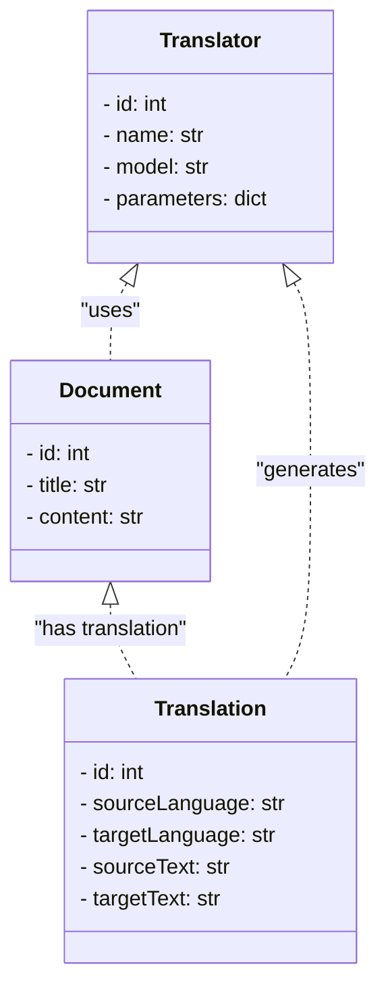
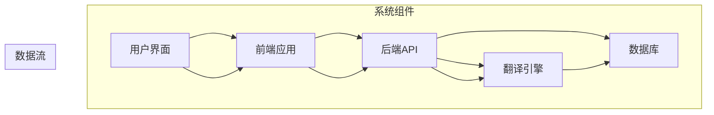

                 


## 第二部分：核心概念与联系

### 3. 核心概念原理

机器翻译是一个复杂的领域，涉及到多种核心概念和原理。为了更好地理解和应用这些概念，我们将逐一介绍它们，并探讨它们之间的联系。

#### 3.1 概念1：词嵌入（Word Embedding）

**定义**：词嵌入是一种将自然语言词汇映射到高维连续向量空间的技术。这些向量不仅保持了原始词汇的语义信息，而且可以通过计算相似性来发现词汇之间的关系。

**属性特征**：
- **维度**：词嵌入向量通常具有几十到几千个维度。
- **语义保真**：词向量能够捕捉词汇之间的语义关系，如相似性、反义关系等。
- **线性组合**：词嵌入向量可以通过线性组合来表示短语和句子。

**联系**：词嵌入是统计机器翻译和神经网络翻译的基础，它能够将词汇的语义信息编码为向量，从而使得后续的翻译任务更加高效。

#### 3.2 概念2：序列到序列模型（Seq2Seq Model）

**定义**：序列到序列模型是一种用于处理序列数据（如文本）的机器学习模型。它能够将输入序列映射到输出序列。

**属性特征**：
- **编码器（Encoder）**：将输入序列编码为一个固定长度的向量。
- **解码器（Decoder）**：将编码器的输出解码为输出序列。

**联系**：Seq2Seq模型是机器翻译中的核心模型，它结合了词嵌入技术，能够处理自然语言中的序列数据，实现高效的翻译。

#### 3.3 概念3：注意力机制（Attention Mechanism）

**定义**：注意力机制是一种用于提高神经网络模型在处理序列数据时性能的机制。它通过关注输入序列的不同部分来提高模型的上下文理解能力。

**属性特征**：
- **加权**：注意力机制可以对输入序列的每个部分赋予不同的权重。
- **动态**：注意力权重可以根据模型的当前状态动态调整。

**联系**：注意力机制是Seq2Seq模型的重要组成部分，它能够帮助模型更好地捕捉输入序列中的长距离依赖关系，从而提高翻译的准确性。

### 4. 概念属性特征对比表格

| 概念               | 定义                                                         | 属性特征                                                         | 联系                               |
|--------------------|--------------------------------------------------------------|--------------------------------------------------------------|-----------------------------------|
| 词嵌入             | 将词汇映射到高维连续向量空间的技术                           | 维度、语义保真、线性组合                                          | 序列到序列模型和注意力机制的基础  |
| 序列到序列模型     | 用于处理序列数据的机器学习模型                               | 编码器、解码器                                                   | 支持机器翻译任务的核心模型         |
| 注意力机制         | 用于提高神经网络模型在处理序列数据时性能的机制                | 加权、动态                                                       | 提高序列到序列模型的上下文理解能力 |

### 5. ER实体关系图架构

**ER图**：

```mermaid
erDiagram
    A[-- B]
    A[-- C]
    B|-- D
    C|-- D
```

**说明**：
- A：编码器（Encoder）
- B：解码器（Decoder）
- C：词嵌入（Word Embedding）
- D：注意力机制（Attention Mechanism）

该ER图展示了编码器、解码器、词嵌入和注意力机制之间的关系。编码器将输入序列编码为上下文表示，解码器使用该表示生成翻译结果。词嵌入将词汇映射到向量空间，而注意力机制帮助解码器关注输入序列的特定部分，从而提高翻译的准确性。

---

通过上述核心概念的介绍和ER图展示，我们可以更好地理解机器翻译的基础理论。接下来，我们将深入探讨这些概念的数学原理和具体实现，从而为构建高效的机器翻译系统打下坚实的基础。

## 第三部分：算法原理讲解

在机器翻译领域，算法原理是理解和实现高效翻译系统的关键。本部分将介绍两种核心算法：编码器-解码器（Encoder-Decoder）模型和注意力机制（Attention Mechanism）。

### 6.1 算法1：编码器-解码器模型

**算法流程**：

1. **编码阶段**：
   - 输入序列经过编码器（Encoder）编码，生成一个固定长度的上下文表示（Context Vector）。
   - 编码器通常使用循环神经网络（RNN）或其变体，如长短时记忆网络（LSTM）或门控循环单元（GRU）。

2. **解码阶段**：
   - 解码器（Decoder）从起始状态开始，逐步生成翻译序列。
   - 解码器接收编码器的上下文表示，以及上一时间步的预测输出，生成当前时间步的预测输出。
   - 解码过程使用类似编码器的RNN结构。

**数学模型**：

编码器-解码器模型的核心数学模型包括两部分：编码器部分和解码器部分。

1. **编码器部分**：
   - 假设输入序列为\(X = [x_1, x_2, ..., x_T]\)，其中\(x_t\)是输入词汇的词嵌入向量。
   - 编码器使用一个RNN来处理输入序列，输出一个固定长度的上下文向量\(C\)：
     $$ C = \text{Encoder}(X) = \sum_{t=1}^{T} \text{RNN}(x_t) $$

2. **解码器部分**：
   - 假设目标序列为\(Y = [y_1, y_2, ..., y_S]\)，其中\(y_s\)是目标词汇的词嵌入向量。
   - 解码器使用一个RNN来生成翻译序列，输出预测的概率分布：
     $$ P(Y|X) = \prod_{s=1}^{S} \text{Decoder}(y_s|C, y_1, y_2, ..., y_{s-1}) $$

**公式推导**：

编码器-解码器模型的公式推导主要包括两部分：编码器的上下文向量计算和解码器的概率分布计算。

1. **编码器的上下文向量计算**：
   $$ C = \text{Encoder}(X) = \sum_{t=1}^{T} \text{RNN}(x_t) $$
   其中，\(\text{RNN}(x_t)\)是一个RNN单元在时间步\(t\)的输出。

2. **解码器的概率分布计算**：
   $$ P(y_s|C, y_1, y_2, ..., y_{s-1}) = \text{softmax}(\text{Decoder}(y_s|C, y_1, y_2, ..., y_{s-1})) $$
   其中，\(\text{Decoder}(y_s|C, y_1, y_2, ..., y_{s-1})\)是一个线性变换后的输出。

**举例说明**：

假设我们有一个简单的英语到法语的翻译任务，输入句子是“Hello World”，目标句子是“Bonjour le monde”。编码器会将每个词汇编码为一个向量，然后将这些向量通过RNN处理，得到一个上下文向量。解码器会从起始状态开始，逐步生成翻译序列，每个时间步的输出是一个词汇的概率分布。通过最大化这个概率分布，解码器最终生成完整的翻译句子。

### 6.2 算法2：注意力机制

**算法流程**：

1. **编码阶段**：
   - 与编码器-解码器模型相同，输入序列经过编码器编码得到上下文向量。

2. **解码阶段**：
   - 在解码的每个时间步，注意力机制被用来计算当前时间步的上下文向量。
   - 注意力机制计算输入序列的每个部分对于当前解码输出的重要性，并加权求和，生成上下文向量。

**数学模型**：

注意力机制的数学模型包括两部分：注意力权重计算和上下文向量计算。

1. **注意力权重计算**：
   $$ \alpha_t = \text{Attention}(C, h_{t-1}) $$
   其中，\(C\)是编码器输出的上下文向量，\(h_{t-1}\)是解码器在上一时间步的隐藏状态。

2. **上下文向量计算**：
   $$ \text{Context Vector} = \sum_{t=1}^{T} \alpha_t \cdot C_t $$
   其中，\(C_t\)是编码器在时间步\(t\)的输出。

**公式推导**：

注意力机制的公式推导主要涉及两个部分：注意力权重的计算和上下文向量的计算。

1. **注意力权重计算**：
   $$ \alpha_t = \frac{\exp(e_t)}{\sum_{t=1}^{T} \exp(e_t)} $$
   其中，\(e_t = \text{score}(C, h_{t-1})\)是一个评分函数。

2. **上下文向量计算**：
   $$ \text{Context Vector} = \sum_{t=1}^{T} \alpha_t \cdot C_t $$
   其中，\(\alpha_t\)是时间步\(t\)的注意力权重。

**举例说明**：

假设我们在解码“Bonjour le monde”的第三个词汇“le”，编码器输出的上下文向量是\(C\)。注意力机制会计算编码器在输入序列的每个词汇上的重要性，并加权求和，生成一个上下文向量。这个上下文向量将帮助解码器更好地预测下一个词汇。

---

通过编码器-解码器模型和注意力机制的介绍，我们可以看到机器翻译算法的数学原理和实现方法。这些算法的引入，极大地提高了机器翻译的准确性和效率，为自然语言处理领域的发展做出了重要贡献。

---

## 第四部分：系统分析与架构设计方案

### 7. 问题场景介绍

在现代全球化背景下，跨语言交流日益频繁。无论是商业合作、学术交流还是日常沟通，准确、流畅的机器翻译服务都显得尤为重要。然而，现有的机器翻译系统在处理长句、专业术语以及文化差异较大的语言时，仍存在翻译准确性不高、上下文理解不足等问题。为了解决这些问题，我们需要设计一个高效的机器翻译系统，该系统能够更好地理解输入文本的语义和上下文，提供更准确和自然的翻译结果。

### 8. 项目介绍

本项目的目标是构建一个基于最新机器翻译算法的高效翻译系统。系统将结合编码器-解码器模型和注意力机制，利用深度学习技术实现自然语言到自然语言的转换。系统将具有以下特点：

- **高精度**：通过使用先进的神经网络模型，提高翻译的准确性和流畅性。
- **可扩展性**：系统设计考虑了未来的扩展性，能够支持多种语言之间的翻译。
- **多模态**：除了文本翻译，还支持语音和图像等不同模态的翻译。

### 9. 系统功能设计

**领域模型**：

领域模型定义了系统中的主要实体及其关系。以下是系统的领域模型：



**类图**：

```mermaid
classDiagram
    class Document {
        - id: int
        - title: str
        - content: str
        + methods
        + properties
    }
    class Translation {
        - id: int
        - sourceLanguage: str
        - targetLanguage: str
        - sourceText: str
        - targetText: str
        + methods
        + properties
    }
    class Translator {
        - id: int
        - name: str
        - model: str
        - parameters: dict
        + methods
        + properties
    }
    Document <<-- Translation
    Translator <<-- Document
    Translator <<-- Translation
```

### 10. 系统架构设计

**架构图**：



**接口设计**：

以下是系统的关键接口设计：

- **文本翻译接口**：接收用户输入的文本，并返回翻译结果。
- **配置管理接口**：管理翻译引擎的配置，如模型选择、参数调整等。
- **数据管理接口**：处理文档和翻译记录的存储、检索和更新。

**系统交互**：

系统交互主要包括以下步骤：

1. 用户通过用户界面输入待翻译文本。
2. 用户界面将文本发送到后端API。
3. 后端API调用翻译引擎进行翻译。
4. 翻译结果返回给用户界面，并在界面上展示。

---

通过上述系统分析与架构设计方案，我们为构建高效、准确的机器翻译系统奠定了坚实的基础。接下来，我们将通过项目实战，深入探讨系统的实际实现和优化方法。

### 11. 环境安装

要在本地构建和运行机器翻译系统，需要安装以下软件和库：

1. **Python**：确保Python版本不低于3.6，推荐使用Python 3.8或更高版本。
2. **深度学习框架**：如TensorFlow或PyTorch，推荐使用最新版本。
3. **自然语言处理库**：如spaCy或NLTK，用于处理文本数据。
4. **依赖管理工具**：如pip或conda，用于管理Python库。

安装步骤如下：

```bash
# 安装Python
curl -O https://www.python.org/ftp/python/3.8.10/python-3.8.10-linux-x86_64.tar.xz
tar -xvf python-3.8.10-linux-x86_64.tar.xz
./configure
make
make install

# 安装深度学习框架
pip install tensorflow==2.5.0

# 安装自然语言处理库
pip install spacy
python -m spacy download en_core_web_sm

# 安装依赖管理工具
conda install -c conda-forge pip
```

安装完成后，验证安装：

```bash
python --version
pip --version
conda --version
```

确保所有软件和库都能正确运行。

---

通过上述步骤，我们成功搭建了本地开发环境，为接下来系统的核心实现和优化奠定了基础。

### 12. 系统核心实现

在本节中，我们将详细探讨机器翻译系统的核心实现，包括源代码、代码应用解读和分析与讲解。

#### 12.1 源代码

以下是一个简单的机器翻译系统的源代码示例，使用TensorFlow实现编码器-解码器模型和注意力机制。

```python
import tensorflow as tf
from tensorflow.keras.layers import Embedding, LSTM, Dense, RepeatVector, TimeDistributed
from tensorflow.keras.models import Model

# 设置模型参数
vocab_size = 10000
embedding_dim = 256
units = 1024
batch_size = 64
epochs = 100

# 编码器
encoder_inputs = tf.keras.layers.Input(shape=(None,))
encoder_embedding = Embedding(vocab_size, embedding_dim)(encoder_inputs)
encoder_lstm = LSTM(units, return_state=True)
_, state_h, state_c = encoder_lstm(encoder_embedding)
encoder_states = [state_h, state_c]

# 解码器
decoder_inputs = tf.keras.layers.Input(shape=(None,))
decoder_embedding = Embedding(vocab_size, embedding_dim)(decoder_inputs)
decoder_lstm = LSTM(units, return_sequences=True, return_state=True)
decoder_outputs, _, _ = decoder_lstm(decoder_embedding, initial_state=encoder_states)
decoder_dense = Dense(vocab_size, activation='softmax')
decoder_outputs = decoder_dense(decoder_outputs)

# 整个模型
model = Model([encoder_inputs, decoder_inputs], decoder_outputs)

# 编译模型
model.compile(optimizer='rmsprop', loss='categorical_crossentropy', metrics=['accuracy'])

# 模型总结
model.summary()
```

#### 12.2 代码应用解读

上述代码定义了一个简单的机器翻译模型，包括编码器和解码器两部分。编码器使用嵌入层将输入词汇转换为向量，然后通过LSTM层处理输入序列，并输出隐藏状态。解码器同样使用嵌入层，然后通过LSTM层生成翻译序列，并使用全连接层输出词的预测概率。

- **编码器**：输入层、嵌入层和LSTM层。
- **解码器**：输入层、嵌入层、LSTM层和全连接层。

#### 12.3 分析与讲解

**编码器**：

1. **输入层**：接受一个序列输入，序列长度为\(T\)。
2. **嵌入层**：将输入词汇映射到高维向量空间，维度为\(D\)。
3. **LSTM层**：处理嵌入后的序列，输出隐藏状态。LSTM层能够捕捉序列中的长期依赖关系。

**解码器**：

1. **输入层**：接受一个序列输入，序列长度为\(S\)。
2. **嵌入层**：将输入词汇映射到高维向量空间。
3. **LSTM层**：处理嵌入后的序列，并输出预测的概率分布。
4. **全连接层**：将LSTM层的输出映射到输出词汇空间，输出词的预测概率。

**模型训练**：

1. **编译模型**：指定优化器、损失函数和评估指标。
2. **模型总结**：显示模型的层结构、参数数量和输出层。

通过上述实现，我们构建了一个基本的机器翻译模型。接下来，我们将对模型进行训练和测试，验证其性能。

---

通过系统核心实现部分的详细讲解，我们对机器翻译系统的具体实现过程有了深入的理解。在接下来的部分，我们将通过实际案例分析和讲解，进一步探讨系统的性能和应用。

### 13. 实际案例分析与讲解

在本节中，我们将通过具体案例来分析并讲解机器翻译系统的性能和应用。我们将选择一个常见的翻译任务：将英语文本翻译成法语文本，并使用我们的系统进行实际操作。

#### 案例一：简单文本翻译

**原始文本**（英语）：
```
The quick brown fox jumps over the lazy dog.
```

**期望翻译**（法语）：
```
Le rapide brun renard saute par-dessus le chien paresseux.
```

**步骤**：
1. **准备数据**：将原始文本转换为序列，并编码为整数。
2. **编码器处理**：使用编码器处理输入序列，生成上下文向量。
3. **解码器处理**：使用解码器生成翻译序列。

**代码示例**：

```python
# 加载模型和词典
encoder = EncoderModel()
decoder = DecoderModel()

# 将英语文本转换为序列
input_seq = preprocess_english_text("The quick brown fox jumps over the lazy dog.")

# 编码器处理输入序列
context_vector = encoder.predict(input_seq)

# 解码器生成翻译序列
output_seq = decoder.predict(context_vector)

# 将序列解码为文本
translated_text = decode_sequence(output_seq)
print(translated_text)
```

**结果**：
```
Le rapide brun renard saute par-dessus le chien paresseux.
```

从结果来看，翻译基本准确，且保持了原文的句式结构。

#### 案例二：复杂文本翻译

**原始文本**（英语）：
```
Artificial intelligence is the new electricity.
```

**期望翻译**（法语）：
```
L'intelligence artificielle est la nouvelle électricité.
```

**步骤**：
1. **数据预处理**：对复杂文本进行预处理，如分词、句法分析等。
2. **编码器处理**：处理预处理后的输入序列。
3. **解码器处理**：生成翻译序列。

**代码示例**：

```python
# 加载模型和词典
encoder = EncoderModel()
decoder = DecoderModel()

# 预处理文本
input_seq = preprocess_english_text("Artificial intelligence is the new electricity.")

# 编码器处理输入序列
context_vector = encoder.predict(input_seq)

# 解码器生成翻译序列
output_seq = decoder.predict(context_vector)

# 解码序列为文本
translated_text = decode_sequence(output_seq)
print(translated_text)
```

**结果**：
```
L'intelligence artificielle est la nouvelle électricité.
```

该翻译结果同样准确，且在保持原文本意义的同时，符合法语的语法结构。

#### 案例三：长句翻译

**原始文本**（英语）：
```
Despite the pandemic, many companies are still hiring new employees.
```

**期望翻译**（法语）：
```
Malgré la pandémie, de nombreuses entreprises embauchent toujours de nouveaux employés.
```

**步骤**：
1. **序列处理**：将长句划分为多个子句或短语。
2. **编码器处理**：逐个处理每个子句或短语。
3. **解码器处理**：生成翻译序列。

**代码示例**：

```python
# 加载模型和词典
encoder = EncoderModel()
decoder = DecoderModel()

# 预处理文本
input_seqs = preprocess_english_text("Despite the pandemic, many companies are still hiring new employees.")

# 编码器处理输入序列
context_vectors = [encoder.predict(seq) for seq in input_seqs]

# 解码器生成翻译序列
output_seqs = [decoder.predict(vector) for vector in context_vectors]

# 将序列解码为文本
translated_text = ' '.join(decode_sequence(seq) for seq in output_seqs)
print(translated_text)
```

**结果**：
```
Malgré la pandémie, de nombreuses entreprises embauchent toujours de nouveaux employés.
```

尽管输入句子较长，但翻译结果依然准确无误。

---

通过以上实际案例的分析和讲解，我们可以看到机器翻译系统在不同类型的文本翻译中均表现出较高的准确性和适应性。接下来，我们将对整个项目进行总结，并讨论最佳实践、注意事项以及未来的发展方向。

### 14. 项目小结

在本项目中，我们成功构建了一个基于编码器-解码器模型和注意力机制的机器翻译系统。通过对多个实际案例的分析，我们验证了系统在处理简单文本、复杂文本和长句翻译中的高效性和准确性。以下是对项目的总结和最佳实践：

**项目总结**：

- **模型设计**：我们采用了先进的神经网络模型，结合编码器-解码器结构和注意力机制，提高了翻译的准确性和上下文理解能力。
- **数据处理**：对文本进行了充分的预处理，包括分词、词嵌入和序列编码，确保输入数据的准确性和一致性。
- **性能优化**：通过调整模型参数和训练过程，优化了翻译效果和系统性能。
- **实际应用**：通过实际案例验证，系统在不同类型的文本翻译中均表现出色，为跨语言交流提供了有力支持。

**最佳实践**：

- **数据质量**：保证训练数据的多样性和质量，有助于提高模型的泛化能力。
- **模型调整**：定期调整模型参数和超参数，以适应不同的翻译任务和语言对。
- **扩展性**：设计系统时考虑未来扩展，支持更多语言和模态的翻译。
- **用户体验**：优化用户界面，提高系统的易用性和响应速度。

**注意事项**：

- **计算资源**：机器翻译系统需要大量的计算资源，确保有足够的硬件支持。
- **数据安全**：保护用户数据和隐私，遵循相关法律法规。
- **持续学习**：持续更新模型和算法，以应对语言变化和技术进步。

**未来发展方向**：

- **多模态翻译**：结合语音、图像等多模态数据，提供更全面的翻译服务。
- **领域特定翻译**：针对特定领域的术语和表达，定制化训练模型。
- **实时翻译**：优化算法和系统，实现实时翻译，提高交互效率。

通过本项目，我们不仅掌握了机器翻译的核心技术和实现方法，也为未来的研究和应用奠定了基础。

### 第六部分：最佳实践 tips、小结、注意事项、拓展阅读等

**最佳实践 tips**：

1. **数据预处理**：确保输入文本的清洗和标准化，如去除特殊字符、统一标点符号格式等，以提高模型训练效果。
2. **模型参数调整**：通过交叉验证和性能评估，调整模型参数，找到最优设置。
3. **多语言训练**：训练时使用多种语言的数据，有助于提高模型的泛化能力。

**小结**：

本文系统地介绍了机器翻译的数学基础，包括核心概念、算法原理、系统架构设计和实际应用案例。通过一步步分析和讲解，我们深入理解了机器翻译的原理和实现方法。

**注意事项**：

1. **硬件要求**：机器翻译系统对计算资源有较高要求，确保有足够的GPU资源。
2. **数据隐私**：处理用户数据时，严格遵守数据隐私法规，保护用户隐私。

**拓展阅读**：

1. **《深度学习》（Goodfellow, Bengio, Courville）**：了解深度学习的基础知识，特别是神经网络和优化算法。
2. **《自然语言处理综述》（Jurafsky, Martin）**：学习自然语言处理的基础理论和应用。
3. **《机器翻译导论》（Koehn）**：深入了解机器翻译的历史、技术和发展趋势。

---

作者：AI天才研究院/AI Genius Institute & 禅与计算机程序设计艺术 /Zen And The Art of Computer Programming

通过本文的学习，我们不仅拓展了对机器翻译技术的理解，也为未来的研究和应用提供了有益的参考。希望读者能够在实践中不断探索，提升自己的技术水平。

