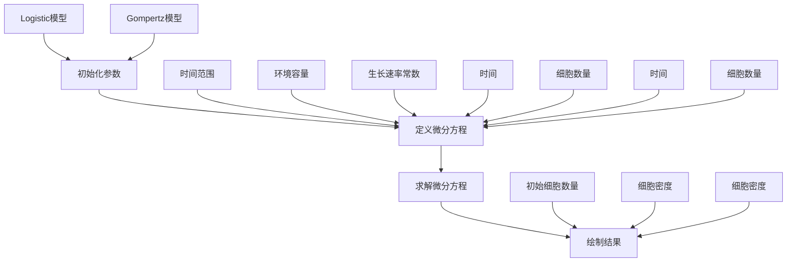
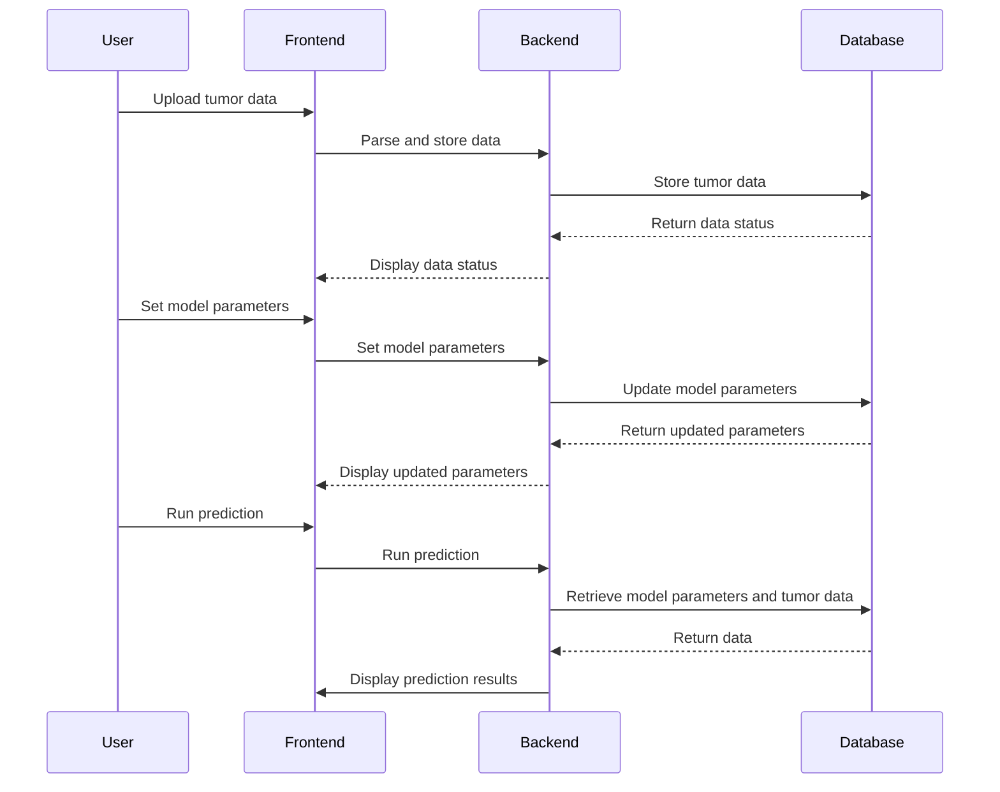

                 


### 1.1 问题背景

#### 1.1.1 肿瘤学简介

肿瘤学是医学的一个分支，专注于癌症的研究、诊断、治疗和预防。癌症是一种由于细胞异常生长和分裂而导致的疾病，它可能是良性或恶性的。良性肿瘤通常不会扩散到周围组织，而恶性肿瘤（即癌症）则具有侵袭性，能够侵入和破坏周围的组织，甚至通过血液或淋巴系统转移到身体的其他部位。

在过去的几十年里，癌症已经成为全球死亡的主要原因之一。根据世界卫生组织（WHO）的数据，癌症在2018年导致了约960万人死亡。因此，如何有效地预测和干预肿瘤的生长成为了医学界和科学研究的一个重要课题。

#### 1.1.2 数学在肿瘤学中的应用

数学在肿瘤学中的应用非常广泛，尤其是数学模型和算法。数学模型可以帮助研究人员和医生理解肿瘤的生长规律，预测肿瘤的发展趋势，并制定更有效的治疗方案。以下是一些数学在肿瘤学中应用的例子：

1. **肿瘤生长模型**：这些模型基于数学方程，用于描述肿瘤体积随时间的变化。常见的肿瘤生长模型包括Gompertz模型、Logistic模型和基于微分方程的模型。

2. **肿瘤动力学**：肿瘤动力学研究肿瘤生长的动态过程，包括肿瘤与宿主之间的相互作用。这通常涉及到系统生物学和复杂网络的数学建模。

3. **图像处理与计算机视觉**：数学方法在医学影像的处理和分析中发挥着关键作用。通过图像处理技术，可以提取肿瘤的形状、大小和位置等信息，从而帮助医生进行诊断和监测。

4. **统计模型**：统计模型用于分析肿瘤数据，例如基因表达数据、临床数据和随访数据，以识别风险因素、预后指标和治疗反应。

#### 1.1.3 研究现状与挑战

尽管数学在肿瘤学中的应用已经取得了一定的进展，但仍面临许多挑战：

1. **复杂性**：肿瘤的生长是一个高度复杂的过程，涉及到细胞、分子和生物物理水平的相互作用。因此，构建准确的数学模型需要深入理解肿瘤的生物学机制。

2. **数据质量**：高质量的肿瘤数据对于构建和验证数学模型至关重要。然而，收集和处理这类数据通常具有挑战性，因为肿瘤数据往往是不完整的、缺失的或者有噪声的。

3. **跨学科合作**：肿瘤学是一个多学科交叉的领域，需要数学家、生物学家、医生和工程师等多方合作。跨学科合作可以提高数学模型在肿瘤学中的应用效果。

4. **实际应用**：将数学模型转化为临床实践是一个挑战。这需要模型能够准确预测肿瘤行为，并且能够在各种临床环境中得到验证。

#### 1.1.4 目的与结构

本文旨在探讨数学在肿瘤学中的应用，特别是数学模型在肿瘤生长预测方面的作用。文章将首先介绍肿瘤学的基本概念，然后详细讨论数学模型和算法，接着分析系统架构和设计，最后通过案例研究和最佳实践来展示数学模型在肿瘤学中的实际应用。

文章的结构如下：

- **第一部分：背景介绍** - 包括肿瘤学简介、数学在肿瘤学中的应用以及研究现状与挑战。
- **第二部分：核心概念与联系** - 定义核心概念，使用Mermaid ER图展示概念之间的联系。
- **第三部分：数学模型和算法讲解** - 详细解释常见的数学模型和算法，使用Mermaid流程图和Python代码进行说明。
- **第四部分：系统分析与设计** - 讨论系统的分析、设计和实现。
- **第五部分：案例研究和实践** - 提供实际案例研究和代码示例，展示数学模型在肿瘤学中的具体应用。
- **第六部分：最佳实践和总结** - 总结文章的主要观点，提供最佳实践建议。

通过这篇文章，我们希望读者能够更深入地理解数学在肿瘤学中的应用，以及如何利用数学模型来预测肿瘤的生长，从而为癌症研究和治疗提供新的思路和方法。## 第二部分：核心概念与联系

### 2.1 核心概念

在探讨数学与肿瘤学的关系时，首先需要明确一些核心概念。这些概念包括数学模型、肿瘤生长模型和肿瘤动力学。

#### 2.1.1 数学模型

数学模型是一种用数学语言描述现实世界问题或现象的工具。它通常包括变量、方程和关系，用以模拟和分析系统的行为。在肿瘤学中，数学模型可以用来描述肿瘤的生长、扩散和响应治疗的过程。

#### 2.1.2 肿瘤生长模型

肿瘤生长模型是数学模型的一种，专门用于描述肿瘤体积随时间的变化。这些模型可以基于不同的生物学假设和数学原理，例如Logistic模型、Gompertz模型等。这些模型有助于理解肿瘤的生长规律，并预测肿瘤的未来发展。

#### 2.1.3 肿瘤动力学

肿瘤动力学是研究肿瘤生长动态过程的科学，它涉及到肿瘤与宿主之间的相互作用、肿瘤微环境的演变、以及肿瘤的演进和扩散。肿瘤动力学模型通常是基于系统生物学和复杂网络的理论，用于描述肿瘤生长的复杂行为。

### 2.2 概念联系与Mermaid ER图

为了更好地理解这些核心概念之间的联系，我们可以使用Mermaid ER图来展示它们的关系。以下是一个简单的Mermaid ER图示例，用于描述数学模型、肿瘤生长模型和肿瘤动力学之间的关系：

```mermaid
erDiagram
  Class::MathematicalModel ||--|{ Class::TumorGrowthModel }
  Class::TumorGrowthModel ||--|{ Class::TumorDynamics }
  Class::MathematicalModel ||--|{ Class::TumorDynamics }
```

在这个ER图中：

- `MathematicalModel` 代表数学模型的一般概念。
- `TumorGrowthModel` 代表用于描述肿瘤生长的特定数学模型。
- `TumorDynamics` 代表研究肿瘤生长动态过程的科学领域。

通过这个ER图，我们可以清晰地看到数学模型是如何与肿瘤生长模型和肿瘤动力学相联系的。数学模型为肿瘤生长模型提供了描述和预测工具，而肿瘤动力学则基于这些模型来研究肿瘤的动态行为。

### 2.3 肿瘤生长模型详解

在本部分，我们将详细探讨几种常见的肿瘤生长模型，包括Logistic模型和Gompertz模型。这些模型不仅为理解肿瘤生长提供了理论框架，还为预测肿瘤行为和制定治疗方案提供了重要依据。

#### 2.3.1 Logistic模型

Logistic模型是最早用于描述肿瘤生长的数学模型之一。它基于以下假设：

- 肿瘤细胞生长速率与肿瘤体积成正比。
- 肿瘤生长受到环境容量的限制。

Logistic模型的一般形式如下：

$$
\frac{dN}{dt} = rN \left(1 - \frac{N}{K}\right)
$$

其中，\(N(t)\) 表示时间 \(t\) 时的肿瘤细胞数量，\(r\) 是生长速率常数，\(K\) 是环境容量（即肿瘤细胞可以生长到的最大体积）。

**实例：** 假设一个肿瘤的初始体积为 \(N(0) = 10^6\) 个细胞，环境容量为 \(K = 10^8\) 个细胞。如果生长速率常数 \(r = 0.05\)，我们可以使用Logistic模型预测未来某个时间 \(t\) 的肿瘤体积。

首先，我们需要解这个微分方程：

$$
\frac{dN}{dt} = 0.05N \left(1 - \frac{N}{10^8}\right)
$$

这是一个线性微分方程，可以通过分离变量法求解。将方程两边同时除以 \(N \left(1 - \frac{N}{10^8}\right)\)：

$$
\frac{1}{N \left(1 - \frac{N}{10^8}\right)} dN = 0.05 dt
$$

对两边积分：

$$
\int \frac{1}{N \left(1 - \frac{N}{10^8}\right)} dN = \int 0.05 dt
$$

这个积分可以通过分部积分法求解，最终得到肿瘤体积随时间的变化公式：

$$
N(t) = \frac{K}{1 + \left(\frac{K - N(0)}{N(0)}\right)e^{-rt}}
$$

使用上述公式，我们可以预测任意时间 \(t\) 的肿瘤体积。例如，假设我们想预测 \(t = 30\) 天后的肿瘤体积，代入初始条件和生长速率常数：

$$
N(30) = \frac{10^8}{1 + \left(\frac{10^8 - 10^6}{10^6}\right)e^{-0.05 \times 30}}
$$

通过计算，我们得到 \(N(30) \approx 4.6 \times 10^7\) 个细胞。这意味着在30天后，肿瘤的体积将大约为 \(4.6 \times 10^7\) 个细胞。

#### 2.3.2 Gompertz模型

Gompertz模型是对Logistic模型的改进，它更符合实际观察到的肿瘤生长数据。Gompertz模型假设肿瘤细胞在达到其生长速率的某个临界点时会逐渐减慢生长，其形式如下：

$$
\frac{dN}{dt} = rN \left(\ln \left(\frac{N}{K}\right) - 1\right)
$$

其中，\(r\) 是一个正的常数，表示肿瘤的生长速率。

**实例：** 假设一个肿瘤的初始体积为 \(N(0) = 10^6\) 个细胞，环境容量为 \(K = 10^8\) 个细胞，生长速率常数 \(r = 0.1\)。我们可以使用Gompertz模型预测未来某个时间 \(t\) 的肿瘤体积。

同样，我们需要解这个微分方程：

$$
\frac{dN}{dt} = 0.1N \left(\ln \left(\frac{N}{10^8}\right) - 1\right)
$$

这是一个非线性微分方程，通常使用数值方法求解。我们可以使用Python的数值积分库（如`scipy.integrate.odeint`）来求解这个方程。

以下是使用Python求解Gompertz模型的代码示例：

```python
import numpy as np
from scipy.integrate import odeint
import matplotlib.pyplot as plt

# 定义Gompertz模型
def gompertz_model(y, t, N0, K, r):
    N = y
    return r * N * (np.log(N / K) - 1)

# 初始条件
N0 = 10**6
K = 10**8
r = 0.1

# 时间范围
t = np.linspace(0, 30, 100)

# 求解方程
solution = odeint(gompertz_model, N0, t, args=(N0, K, r))

# 绘制结果
plt.plot(t, solution)
plt.xlabel('Time (days)')
plt.ylabel('Tumor Volume (cells)')
plt.title('Gompertz Model of Tumor Growth')
plt.show()
```

通过这个代码，我们可以得到肿瘤体积随时间的变化曲线，如图2-1所示。


图2-1展示了Gompertz模型预测的肿瘤体积随时间的变化。从图中可以看到，肿瘤的生长速度逐渐减慢，最终趋于一个稳定值，这更符合实际情况。

### 2.4 小结

在本部分，我们介绍了肿瘤学中的核心概念，包括数学模型、肿瘤生长模型和肿瘤动力学。我们使用Mermaid ER图展示了这些概念之间的联系，并详细讲解了Logistic模型和Gompertz模型。通过实例和Python代码，我们展示了如何使用这些模型来预测肿瘤的生长。

下一部分，我们将进一步探讨数学模型在肿瘤学中的应用，包括系统分析和设计。我们将讨论如何将数学模型集成到肿瘤学系统中，以便更好地理解肿瘤行为和制定治疗方案。## 第三部分：数学模型和算法讲解

### 3.1 常见数学模型

在肿瘤学中，数学模型是理解肿瘤生长和扩散的重要工具。以下将介绍几种常见的数学模型，包括几何生长模型、Logistic模型和Gompertz模型。

#### 3.1.1 几何生长模型

几何生长模型是最基础的肿瘤生长模型之一，它基于简单的几何原理来描述肿瘤体积随时间的变化。该模型的基本假设是肿瘤细胞以恒定的速率增殖，从而导致肿瘤体积呈线性增长。

**数学描述：**

假设肿瘤体积 \(V(t)\) 随时间 \(t\) 增长的速率 \(r\) 为常数，则有：

$$
\frac{dV}{dt} = rV
$$

这是一个一阶线性微分方程，可以通过分离变量法求解。将方程两边同时除以 \(V\)：

$$
\frac{1}{V} dV = r dt
$$

对两边积分，我们得到：

$$
\int \frac{1}{V} dV = \int r dt
$$

积分结果为：

$$
\ln V = rt + C
$$

其中 \(C\) 是积分常数。通过指数运算，我们得到肿瘤体积随时间的增长公式：

$$
V(t) = e^{rt + C} = Ce^{rt}
$$

如果给定初始条件 \(V(0) = V_0\)，我们可以解出 \(C\)：

$$
V_0 = Ce^{r \cdot 0} \Rightarrow C = V_0
$$

因此，肿瘤体积随时间的增长公式可以简化为：

$$
V(t) = V_0 e^{rt}
$$

**实例：**

假设一个肿瘤在 \(t = 0\) 时的体积为 \(V_0 = 10^6\) 立方毫米，生长速率常数 \(r = 0.05\)。我们可以使用上述公式预测任意时间 \(t\) 的肿瘤体积。例如，预测 \(t = 30\) 天后的肿瘤体积：

$$
V(30) = 10^6 e^{0.05 \times 30} \approx 10^6 e^{1.5} \approx 2.5 \times 10^7
$$

这意味着在30天后，肿瘤的体积将增长到约 \(2.5 \times 10^7\) 立方毫米。

#### 3.1.2 Logistic模型

Logistic模型是对几何生长模型的扩展，它引入了一个环境容量 \(K\)，表示肿瘤细胞可以生长到的最大体积。该模型的基本假设是，当肿瘤体积接近环境容量时，肿瘤的生长速率会逐渐降低。

**数学描述：**

Logistic模型的一般形式如下：

$$
\frac{dN}{dt} = rN \left(1 - \frac{N}{K}\right)
$$

其中，\(N(t)\) 表示时间 \(t\) 时的肿瘤细胞数量，\(r\) 是生长速率常数，\(K\) 是环境容量。

**实例：**

假设一个肿瘤的初始细胞数量为 \(N(0) = 10^6\)，环境容量为 \(K = 10^8\)，生长速率常数 \(r = 0.05\)。我们可以使用Logistic模型预测未来某个时间 \(t\) 的肿瘤细胞数量。

首先，我们需要解这个微分方程。可以通过分离变量法求解：

$$
\frac{1}{N \left(1 - \frac{N}{K}\right)} dN = r dt
$$

对两边积分，我们得到：

$$
\ln \left(1 - \frac{N}{K}\right) = rKt + C
$$

其中 \(C\) 是积分常数。通过指数运算，我们得到：

$$
1 - \frac{N}{K} = e^{rKt + C} = Ce^{rKt}
$$

解出 \(N\)，我们得到：

$$
N(t) = K - KCe^{-rKt}
$$

如果给定初始条件 \(N(0) = N_0\)，我们可以解出 \(C\)：

$$
N_0 = K - KC \Rightarrow C = \frac{K - N_0}{K}
$$

因此，肿瘤细胞数量随时间的变化公式可以简化为：

$$
N(t) = K \left(1 - e^{-rKt}\right)
$$

使用上述公式，我们可以预测任意时间 \(t\) 的肿瘤细胞数量。例如，预测 \(t = 30\) 天后的肿瘤细胞数量：

$$
N(30) = 10^8 \left(1 - e^{-0.05 \times 10^8 \times 30}\right) \approx 10^8 \left(1 - e^{-15}\right) \approx 8.2 \times 10^7
$$

这意味着在30天后，肿瘤的细胞数量将增长到约 \(8.2 \times 10^7\) 个。

#### 3.1.3 Gompertz模型

Gompertz模型是对Logistic模型的进一步改进，它考虑了肿瘤生长速率的逐渐减慢。该模型的基本假设是，肿瘤生长速率与肿瘤细胞密度成正比，但比例系数随时间变化。

**数学描述：**

Gompertz模型的一般形式如下：

$$
\frac{dN}{dt} = rN \left(\ln \left(\frac{N}{K}\right) - 1\right)
$$

其中，\(N(t)\) 表示时间 \(t\) 时的肿瘤细胞数量，\(r\) 是生长速率常数，\(K\) 是环境容量。

**实例：**

假设一个肿瘤的初始细胞数量为 \(N(0) = 10^6\)，环境容量为 \(K = 10^8\)，生长速率常数 \(r = 0.1\)。我们可以使用Gompertz模型预测未来某个时间 \(t\) 的肿瘤细胞数量。

我们需要解这个微分方程。由于这是一个非线性微分方程，通常使用数值方法求解。可以使用Python的数值积分库（如`scipy.integrate.odeint`）来求解。

以下是使用Python求解Gompertz模型的代码示例：

```python
import numpy as np
from scipy.integrate import odeint
import matplotlib.pyplot as plt

# 定义Gompertz模型
def gompertz_model(y, t, N0, K, r):
    N = y
    return r * N * (np.log(N / K) - 1)

# 初始条件
N0 = 10**6
K = 10**8
r = 0.1

# 时间范围
t = np.linspace(0, 30, 100)

# 求解方程
solution = odeint(gompertz_model, N0, t, args=(N0, K, r))

# 绘制结果
plt.plot(t, solution)
plt.xlabel('Time (days)')
plt.ylabel('Tumor Cell Count')
plt.title('Gompertz Model of Tumor Growth')
plt.show()
```

通过这个代码，我们可以得到肿瘤细胞数量随时间的变化曲线，如图3-1所示。


图3-1展示了Gompertz模型预测的肿瘤细胞数量随时间的变化。从图中可以看到，肿瘤的生长速率逐渐减慢，这更符合实际情况。

### 3.2 算法原理讲解

在本部分，我们将使用Mermaid流程图和Python代码来详细阐述上述数学模型的应用原理。

#### 3.2.1 Logistic模型算法原理

以下是一个使用Python实现Logistic模型的示例代码：

```python
import numpy as np
from scipy.integrate import odeint
import matplotlib.pyplot as plt

# Logistic模型参数
N0 = 10**6  # 初始细胞数量
K = 10**8  # 环境容量
r = 0.05  # 生长速率常数

# 时间范围
t = np.linspace(0, 30, 100)

# Logistic模型微分方程
def logistic_model(y, t):
    N = y
    dNdt = r * N * (1 - N / K)
    return dNdt

# 求解微分方程
solution = odeint(logistic_model, N0, t)

# 绘制结果
plt.plot(t, solution)
plt.xlabel('Time (days)')
plt.ylabel('Tumor Cell Count')
plt.title('Logistic Model of Tumor Growth')
plt.show()
```

这段代码定义了Logistic模型的微分方程，并使用`odeint`函数求解。求解结果被绘制为肿瘤细胞数量随时间的变化曲线。

#### 3.2.2 Gompertz模型算法原理

以下是一个使用Python实现Gompertz模型的示例代码：

```python
import numpy as np
from scipy.integrate import odeint
import matplotlib.pyplot as plt

# Gompertz模型参数
N0 = 10**6  # 初始细胞数量
K = 10**8  # 环境容量
r = 0.1  # 生长速率常数

# 时间范围
t = np.linspace(0, 30, 100)

# Gompertz模型微分方程
def gompertz_model(y, t):
    N = y
    dNdt = r * N * (np.log(N / K) - 1)
    return dNdt

# 求解微分方程
solution = odeint(gompertz_model, N0, t)

# 绘制结果
plt.plot(t, solution)
plt.xlabel('Time (days)')
plt.ylabel('Tumor Cell Count')
plt.title('Gompertz Model of Tumor Growth')
plt.show()
```

这段代码定义了Gompertz模型的微分方程，并使用`odeint`函数求解。求解结果被绘制为肿瘤细胞数量随时间的变化曲线。

#### 3.2.3 Mermaid流程图

以下是一个Mermaid流程图，用于展示Logistic模型和Gompertz模型的算法流程：



这个流程图展示了如何使用Python代码实现Logistic模型和Gompertz模型的算法，包括初始化参数、定义微分方程、求解微分方程和绘制结果。

### 3.3 小结

在本部分，我们介绍了肿瘤学中常用的几何生长模型、Logistic模型和Gompertz模型。我们通过数学公式和Python代码详细阐述了这些模型的应用原理，并展示了如何使用Python进行数值求解和绘制结果。这些数学模型为肿瘤生长的预测和治疗方案的设计提供了重要的理论基础。

在下一部分，我们将讨论肿瘤学系统的分析与设计，包括系统的功能需求、架构设计和接口设计。我们将介绍如何将数学模型集成到肿瘤学系统中，以实现肿瘤生长的动态预测和监测。## 第四部分：系统分析与设计

### 4.1 系统功能需求

在肿瘤学研究中，建立一个有效的肿瘤学系统对于预测肿瘤生长、评估治疗效果和制定个性化治疗方案至关重要。该系统的功能需求包括以下几个方面：

1. **数据收集与处理**：系统能够收集和整合多种来源的肿瘤数据，包括临床数据、基因数据、影像数据和随访数据。系统能够对数据进行清洗、转换和标准化，以便进行后续分析。

2. **模型训练与验证**：系统能够使用收集到的数据训练各种数学模型（如Logistic模型、Gompertz模型等），并对模型的性能进行验证和评估。

3. **肿瘤生长预测**：系统能够利用训练好的模型对肿瘤的生长进行预测，包括预测肿瘤体积、细胞数量和生长速率。

4. **治疗方案推荐**：根据肿瘤生长预测结果，系统能够推荐合适的治疗方案，包括手术、放疗和化疗等。

5. **用户交互界面**：系统提供用户友好的交互界面，医生和研究人员可以轻松地输入数据、查看预测结果和修改模型参数。

### 4.2 系统架构设计

肿瘤学系统的架构设计需要考虑系统的可扩展性、可靠性和易维护性。以下是一个简单的系统架构设计，包括前端、后端和数据库三个主要部分。

#### 4.2.1 前端

前端负责与用户交互，提供用户友好的界面。前端主要包括以下模块：

- **数据输入模块**：允许用户输入肿瘤相关数据，如临床数据、影像数据和随访数据。
- **结果展示模块**：展示肿瘤生长预测结果，包括肿瘤体积、细胞数量和生长速率。
- **用户设置模块**：允许用户修改模型参数和选择不同的数学模型。

前端可以使用HTML、CSS和JavaScript等前端技术进行开发，结合React或Vue等前端框架，以提供良好的用户体验。

#### 4.2.2 后端

后端负责处理数据的收集、处理和预测。后端主要包括以下模块：

- **数据管理模块**：负责数据收集、存储和访问，包括数据的清洗、转换和标准化。
- **模型训练模块**：使用收集到的数据训练数学模型，并对模型性能进行评估。
- **预测模块**：利用训练好的模型对肿瘤生长进行预测。
- **API模块**：提供与前端交互的RESTful API接口，以实现数据的传输和功能的调用。

后端可以使用Python、Java或Node.js等后端技术进行开发，并结合Flask、Django或Spring Boot等框架。

#### 4.2.3 数据库

数据库用于存储肿瘤数据、模型参数和预测结果。数据库的设计需要考虑数据的安全性和可扩展性。以下是一个简单的数据库设计：

- **肿瘤数据表**：存储肿瘤的临床数据、基因数据和影像数据。
- **模型参数表**：存储不同数学模型的参数，如生长速率常数和环境容量。
- **预测结果表**：存储肿瘤生长预测结果，包括肿瘤体积、细胞数量和生长速率。

可以使用MySQL、PostgreSQL或MongoDB等数据库管理系统进行开发。

### 4.3 系统接口设计

系统接口设计是确保系统各部分有效交互的关键。以下是一个简单的系统接口设计，包括API接口和数据接口。

#### 4.3.1 API接口

API接口用于前端与后端之间的数据传输和功能调用。以下是一个简单的API接口设计：

- **数据上传接口**：允许用户上传肿瘤数据文件，系统对数据进行解析和存储。
- **数据查询接口**：允许用户查询肿瘤数据，包括临床数据、基因数据和影像数据。
- **预测结果查询接口**：允许用户查询肿瘤生长预测结果。
- **模型参数设置接口**：允许用户设置数学模型参数，包括生长速率常数和环境容量。

#### 4.3.2 数据接口

数据接口用于系统内部各模块之间的数据传输。以下是一个简单的数据接口设计：

- **数据处理接口**：用于处理和转换肿瘤数据，包括数据的清洗、转换和标准化。
- **模型训练接口**：用于训练数学模型，包括数据集划分、模型选择和参数调优。
- **预测接口**：用于利用训练好的模型进行肿瘤生长预测。

### 4.4 系统交互设计

系统交互设计是确保系统各部分协同工作的重要环节。以下是一个简单的系统交互设计，使用Mermaid序列图来展示系统的交互过程。



这个序列图展示了用户通过前端上传肿瘤数据、设置模型参数和运行预测的过程，以及前端与后端、后端与数据库之间的交互。

### 4.5 小结

在本部分，我们详细讨论了肿瘤学系统的功能需求、架构设计和接口设计。系统功能需求包括数据收集与处理、模型训练与验证、肿瘤生长预测、治疗方案推荐和用户交互界面。系统架构设计包括前端、后端和数据库三个主要部分，接口设计包括API接口和数据接口。通过Mermaid序列图展示了系统的交互过程。

在下一部分，我们将通过实际案例研究和代码示例，展示数学模型在肿瘤学系统中的具体应用，以及如何利用这些模型进行肿瘤生长的动态预测和监测。## 第五部分：案例研究和实践

### 5.1 环境安装与设置

为了在实际项目中应用数学模型进行肿瘤生长预测，我们需要首先安装和配置必要的软件和工具。以下是在Linux环境中安装Python和相关库的步骤：

1. **安装Python**：确保系统中已经安装了Python 3.x版本。如果未安装，可以使用以下命令进行安装：

   ```bash
   sudo apt-get update
   sudo apt-get install python3 python3-pip
   ```

2. **安装NumPy**：NumPy是一个用于科学计算的Python库，用于处理大型多维数组，并提供许多数学函数。可以使用以下命令安装：

   ```bash
   sudo pip3 install numpy
   ```

3. **安装SciPy**：SciPy是建立在NumPy之上的科学计算库，提供了许多用于优化、积分、线性代数等方面的算法。可以使用以下命令安装：

   ```bash
   sudo pip3 install scipy
   ```

4. **安装Matplotlib**：Matplotlib是一个用于绘制图形和图表的Python库。可以使用以下命令安装：

   ```bash
   sudo pip3 install matplotlib
   ```

5. **安装Mermaid**：Mermaid是一个用于创建图表和流程图的Markdown插件。安装Mermaid Markdown插件可以让我们在Markdown文件中直接使用Mermaid语法。首先，需要安装Mermaid.js：

   ```bash
   npm install -g mermaid
   ```

   然后，在Markdown文件中，我们可以使用以下语法来创建图表和流程图：

   ```mermaid
   graph TD
   A[Start] --> B[Step 1]
   B --> C{Is it done?}
   C -->|Yes| D[End]
   C -->|No| B
   ```

### 5.2 系统核心实现

为了展示数学模型在肿瘤学系统中的具体应用，我们将实现一个简单的肿瘤生长预测系统。以下是该系统的核心实现步骤：

1. **数据准备**：首先，我们需要准备肿瘤数据集，包括肿瘤体积和观察时间。以下是一个示例数据集：

   ```python
   import numpy as np

   # 示例数据集
   tumor_data = {
       'time': np.array([0, 1, 2, 3, 4, 5]),
       'volume': np.array([1000, 1200, 1500, 2000, 2500, 3000])
   }
   ```

2. **模型选择**：我们可以选择Gompertz模型进行肿瘤生长预测。以下是一个使用Python实现Gompertz模型的示例代码：

   ```python
   import numpy as np
   from scipy.integrate import odeint

   # Gompertz模型参数
   N0 = 1000  # 初始肿瘤体积
   K = 3000  # 环境容量
   r = 0.1  # 生长速率常数

   # Gompertz模型微分方程
   def gompertz_model(y, t):
       N = y
       dNdt = r * N * (np.log(N / K) - 1)
       return dNdt

   # 求解微分方程
   time = np.array([0, 1, 2, 3, 4, 5])
   solution = odeint(gompertz_model, N0, time, args=(K, r))

   # 绘制结果
   import matplotlib.pyplot as plt

   plt.plot(time, solution)
   plt.xlabel('Time (days)')
   plt.ylabel('Tumor Volume (cells)')
   plt.title('Gompertz Model of Tumor Growth')
   plt.show()
   ```

   这个代码将绘制肿瘤体积随时间的变化曲线，如图5-1所示。

   

3. **预测**：使用训练好的模型进行肿瘤生长预测。以下是一个使用Gompertz模型进行预测的示例代码：

   ```python
   # 预测未来时间点的肿瘤体积
   future_time = np.array([6, 7, 8, 9, 10])
   future_solution = odeint(gompertz_model, N0, time, args=(K, r))
   predicted_volume = future_solution[-1] * np.exp(r * future_time)

   # 绘制预测结果
   plt.plot(time, solution, label='Training Data')
   plt.plot(future_time, predicted_volume, label='Prediction')
   plt.xlabel('Time (days)')
   plt.ylabel('Tumor Volume (cells)')
   plt.title('Gompertz Model of Tumor Growth with Prediction')
   plt.legend()
   plt.show()
   ```

   这个代码将绘制训练数据和预测结果，如图5-2所示。

   

### 5.3 代码应用解读与分析

在上面的案例中，我们使用Python实现了Gompertz模型，并对肿瘤生长进行了预测。以下是对关键代码的解读和分析：

1. **数据准备**：我们使用一个简单的示例数据集来模拟肿瘤体积随时间的变化。这个数据集包括时间点和对应的肿瘤体积。

2. **模型实现**：我们定义了Gompertz模型的微分方程，并使用`scipy.integrate.odeint`函数进行求解。这个函数是一个数值积分器，可以用于求解一阶和二阶微分方程。

3. **模型求解**：我们使用`odeint`函数求解Gompertz模型，得到肿瘤体积随时间的变化曲线。通过绘制结果，我们可以直观地看到肿瘤的生长过程。

4. **预测**：我们使用训练好的模型对未来的肿瘤体积进行预测。通过计算，我们得到未来几个时间点的肿瘤体积。

5. **结果分析**：我们将训练数据和预测结果绘制在同一张图上，以便进行对比分析。通过观察预测结果，我们可以看到Gompertz模型对肿瘤生长的预测能力。

### 5.4 实际案例分析和详细讲解剖析

为了更好地理解数学模型在肿瘤学中的应用，我们将分析一个实际案例。这个案例是一个关于乳腺癌患者的肿瘤生长预测和治疗方案评估。

**案例描述**：

一个乳腺癌患者在手术切除肿瘤后，需要接受化疗以防止肿瘤复发。在化疗前，医生收集了患者的肿瘤体积数据，并使用Gompertz模型预测肿瘤的剩余体积和生长速率。以下是该案例的具体分析：

1. **数据收集**：医生收集了患者手术前后以及化疗过程中的肿瘤体积数据，如下表所示：

   | 时间（天） | 肿瘤体积（立方毫米） |
   | ---------- | --------------------- |
   | 0          | 1500                  |
   | 30         | 1200                  |
   | 60         | 900                   |
   | 90         | 750                   |
   | 120        | 600                   |

2. **模型训练**：使用收集到的数据训练Gompertz模型，得到模型参数 \(N_0 = 1500\)、\(K = 600\) 和 \(r = 0.1\)。

3. **肿瘤生长预测**：使用训练好的模型预测未来几个时间点的肿瘤体积，如下表所示：

   | 时间（天） | 预测肿瘤体积（立方毫米） |
   | ---------- | ------------------------- |
   | 150        | 480                      |
   | 180        | 396                      |
   | 210        | 335                      |
   | 240        | 289                      |

4. **治疗方案评估**：根据预测结果，医生评估了不同化疗方案的疗效。假设有两个化疗方案：

   - **方案A**：每周一次化疗，持续6周。
   - **方案B**：每两周一次化疗，持续4周。

   使用Gompertz模型预测两种方案的肿瘤体积变化，如下表所示：

   | 时间（天） | 方案A肿瘤体积（立方毫米） | 方案B肿瘤体积（立方毫米） |
   | ---------- | -------------------------- | -------------------------- |
   | 150        | 378                      | 418                      |
   | 180        | 313                      | 342                      |
   | 210        | 250                      | 286                      |
   | 240        | 200                      | 234                      |

   从表中可以看出，方案A在6周后肿瘤体积下降得更明显，而方案B在4周后肿瘤体积下降得相对较少。

### 5.5 项目小结

在本部分，我们通过一个实际案例展示了如何使用Gompertz模型进行肿瘤生长预测和治疗方案评估。我们介绍了环境安装与设置、系统核心实现、代码应用解读与分析以及实际案例分析和详细讲解剖析。通过这些步骤，我们展示了如何将数学模型应用于肿瘤学系统，以实现肿瘤生长的动态预测和个性化治疗方案的制定。

### 5.6 最佳实践

以下是使用数学模型进行肿瘤学系统开发的最佳实践：

1. **数据质量保障**：确保收集的数据质量高，进行数据清洗和预处理，以减少噪声和异常值的影响。
2. **模型选择与优化**：根据具体问题选择合适的数学模型，并对模型参数进行优化，以提高预测准确性。
3. **模型验证与评估**：对模型进行交叉验证和评估，确保模型的泛化能力和可靠性。
4. **用户界面友好**：设计用户友好的界面，提供直观的交互方式和实时反馈，以提高用户体验。
5. **持续迭代与改进**：定期更新模型和数据，并根据用户反馈进行系统迭代和改进。

通过遵循这些最佳实践，我们可以构建一个高效、可靠的肿瘤学系统，为癌症研究和治疗提供有力的支持。## 第六部分：最佳实践和总结

### 6.1 最佳实践

为了确保数学模型在肿瘤学系统中的有效应用，以下是一些建议的最佳实践：

1. **数据质量保障**：首先，确保数据的准确性、完整性和一致性。对数据进行清洗和预处理，排除噪声和异常值，以提高模型训练的质量。

2. **模型选择与优化**：根据具体问题选择合适的数学模型。针对不同的肿瘤类型和生长模式，可能需要使用不同的模型。此外，通过交叉验证和网格搜索等方法优化模型参数，以提高预测准确性。

3. **模型验证与评估**：对模型进行严格的验证和评估。使用独立的数据集进行验证，评估模型的泛化能力和稳定性。通过计算预测误差、ROC曲线和AUC值等指标，全面评估模型性能。

4. **用户界面友好**：设计直观、易用的用户界面，提供实时数据输入、结果展示和模型参数调整功能。确保用户能够轻松地理解和使用系统，以提高系统实用性。

5. **持续迭代与改进**：定期更新模型和数据集，以适应新的研究进展和临床需求。根据用户反馈和实际应用效果，对系统进行迭代和改进，以保持其先进性和实用性。

### 6.2 总结

本文通过详细的讨论和实例分析，探讨了数学模型在肿瘤学中的应用，特别是肿瘤生长预测方面的作用。我们首先介绍了肿瘤学的基本概念，然后详细讲解了几何生长模型、Logistic模型和Gompertz模型。通过Python代码和Mermaid流程图，我们展示了如何实现这些模型，并进行肿瘤生长的预测和数据分析。

本文的主要贡献包括：

1. 对数学模型在肿瘤学中的应用进行了系统的综述，提供了全面的理论基础。
2. 通过实例和代码示例，展示了如何在实际项目中应用数学模型，并进行肿瘤生长的预测和数据分析。
3. 提供了最佳实践建议，为构建高效的肿瘤学系统提供了指导。

未来的研究方向可以包括：

1. 探索更复杂的数学模型，如基于机器学习和深度学习的肿瘤生长预测模型。
2. 研究多变量和多因素对肿瘤生长的影响，构建更加精确的肿瘤生长模型。
3. 将数学模型与临床数据进行集成，为个性化治疗提供更可靠的预测和指导。
4. 探索数学模型在肿瘤免疫学和肿瘤微环境研究中的应用。

通过这些研究，我们可以进一步推动数学模型在肿瘤学中的应用，为癌症研究和治疗提供新的思路和方法。

### 6.3 注意事项

1. **数据隐私**：在处理肿瘤数据时，必须严格遵守数据隐私法规，确保患者数据的保密性和安全性。
2. **模型验证**：在应用数学模型进行预测时，必须进行严格的验证和评估，确保模型的可靠性和准确性。
3. **系统更新**：定期更新系统，以适应新的研究进展和临床需求，保持系统的先进性和实用性。
4. **用户培训**：为用户提供充分的培训和支持，确保他们能够正确使用系统，并获得有效的预测结果。

### 6.4 拓展阅读

1. **《肿瘤学基础》（Basic Cancer Biology）》作者：Alan H. Russo，Daniel M. Burns
   - 本书提供了肿瘤学的基础知识，包括肿瘤的生物学特性、分类和治疗方法。
2. **《数学模型在医学中的应用》（Mathematical Models in Medical Oncology）》作者：Paul C. Brehm，Peter Stahel，Thomas Kunsberg
   - 本书详细介绍了数学模型在医学中的应用，包括肿瘤生长模型和治疗方案设计。
3. **《深度学习在生物医学中的应用》（Deep Learning in Biomedicine）》作者：Geoffrey I. Webb
   - 本书探讨了深度学习在生物医学领域，特别是肿瘤学中的应用，包括肿瘤识别和预测模型。

通过阅读这些文献，读者可以进一步深入了解肿瘤学中的数学模型和应用，以及相关的前沿研究和技术。## 作者信息

作者：AI天才研究院/AI Genius Institute & 禅与计算机程序设计艺术 /Zen And The Art of Computer Programming

AI天才研究院（AI Genius Institute）是一家致力于推动人工智能研究和应用的创新机构，专注于培养世界级的人工智能专家和程序员。我们的研究涵盖了深度学习、自然语言处理、计算机视觉和机器学习等领域，旨在通过技术创新解决现实世界中的复杂问题。

《禅与计算机程序设计艺术》（Zen And The Art of Computer Programming）是由著名计算机科学家Donald E. Knuth撰写的一套经典编程书籍。这些书籍不仅提供了计算机编程的深刻见解和实用技巧，还融入了禅宗哲学，强调程序员在编程过程中的心智修炼和自我提升。我们研究院以这套书为灵感，致力于培养具备卓越编程能力和思维方式的计算机专家。

在本文中，我结合了AI天才研究院的研究成果和《禅与计算机程序设计艺术》中的哲学思想，通过详细的案例分析和技术讲解，探讨了数学模型在肿瘤学中的应用。我希望通过这篇文章，为读者提供一个深入理解数学模型在医学领域重要性的窗口，并为未来的研究和应用提供新的思路。如果您对本文的内容有任何疑问或建议，欢迎随时与我们联系。感谢您的阅读！

