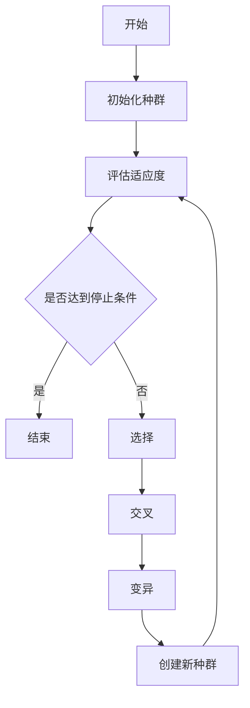

                 

# 数学与能源管理：能源利用的数学优化

## 关键词

- 数学优化
- 能源管理
- 线性规划
- 非线性规划
- 启发式算法
- 最优化算法
- 可持续发展

## 摘要

能源管理是现代工业和社会生活中不可或缺的一部分，其核心目标是提高能源利用效率、降低成本、减少环境污染。随着全球能源消耗的不断增加，传统的能源管理方法已经难以满足日益增长的能源需求。数学优化作为一门强有力的工具，其在能源管理中的应用日益受到重视。本文将探讨数学优化在能源管理中的应用，包括核心概念、算法基础、具体应用场景、实际案例分析和可持续发展策略，为能源管理的数学优化提供新的思路和方法。

## 目录大纲

### 第一部分：数学与能源管理概述

#### 第1章 问题背景与核心概念

##### 1.1 问题背景

##### 1.2 核心概念

##### 1.3 能源管理的关键因素

#### 第2章 数学模型与算法基础

##### 2.1 数学模型基础

##### 2.2 算法基础

#### 第3章 能源系统分析与优化

##### 3.1 能源系统分析

##### 3.2 优化策略

#### 第4章 具体应用场景

##### 4.1 工业能源管理

##### 4.2 建筑能源管理

#### 第5章 实际案例与案例分析

##### 5.1 案例介绍

##### 5.2 案例分析

#### 第6章 能源管理与可持续发展

##### 6.1 可持续发展的重要性

##### 6.2 能源管理与可持续发展策略

#### 第7章 未来展望与挑战

##### 7.1 未来展望

##### 7.2 挑战与机遇

### 第一部分：数学与能源管理概述

## 第1章 问题背景与核心概念

### 1.1 问题背景

能源是人类社会发展的基石，然而，全球能源消耗的增加带来了许多挑战。首先，能源资源的有限性使得能源管理变得尤为重要。石油、天然气、煤炭等化石能源储量有限，过度开采会导致资源的枯竭。其次，能源消耗过程中产生的污染对环境造成了严重影响，如二氧化碳的排放导致全球气候变化。此外，能源价格的波动也给能源管理带来了不确定性。因此，如何提高能源利用效率、降低能源消耗和环境污染成为当前能源管理的重要课题。

### 1.2 核心概念

能源管理是指通过科学的方法和手段，对能源的获取、传输、分配和使用进行系统化的规划和管理，以实现能源的高效利用、节约能源和保护环境的目标。能源管理的核心概念包括能源需求预测、能源供应稳定性、能源优化、能源系统的建模与优化等。

- **能源需求预测**：准确预测能源需求是能源管理的基础。通过对历史数据进行分析，结合经济、社会、气候等因素，预测未来能源需求的变化趋势。

- **能源供应稳定性**：能源供应的稳定性是保证能源系统正常运行的关键。通过多种能源供应渠道的优化配置，提高能源供应的可靠性和稳定性。

- **能源优化**：能源优化是通过数学建模和优化算法，对能源系统进行分析和优化，找出最优的能源分配方案，以提高能源利用效率。

- **能源系统的建模与优化**：能源系统的建模是指将能源系统转化为数学模型，通过优化算法求解模型，找到最优解。数学模型可以是线性的，也可以是非线性的，取决于能源系统的复杂性和需求。

### 1.3 能源管理的关键因素

成功的能源管理需要考虑多个关键因素，包括能源需求预测、能源供应稳定性、能源优化和能源系统的建模与优化。

- **能源需求预测**：准确预测能源需求是能源管理的基础。通过分析历史数据和当前环境因素，预测未来能源需求的变化趋势，为能源优化提供数据支持。

- **能源供应稳定性**：确保能源供应的稳定性是能源管理的重要目标。通过多种能源供应渠道的优化配置，提高能源供应的可靠性和稳定性，减少能源短缺的风险。

- **能源优化**：能源优化是提高能源利用效率的重要手段。通过数学建模和优化算法，分析能源系统的运行状况，找出最优的能源分配方案，实现能源的高效利用。

- **能源系统的建模与优化**：能源系统的建模与优化是能源管理的关键环节。通过建立数学模型，描述能源系统的运行机制，利用优化算法求解模型，找到最优解，为能源管理提供科学依据。

## 第2章 数学模型与算法基础

### 2.1 数学模型基础

数学模型是能源管理系统中的核心工具，它可以帮助我们理解和优化能源系统的运行。数学模型通常包括以下类型：

- **线性规划（Linear Programming，LP）**：线性规划是一种数学优化方法，用于解决在给定约束条件下最大化或最小化线性目标函数的问题。线性规划模型通常由目标函数、决策变量和约束条件组成。

  - **目标函数**：线性规划的目标函数通常是一个线性函数，表示要优化的目标，如最大化利润或最小化成本。
  - **决策变量**：决策变量是模型中的变量，表示我们可以调整的变量，如能源分配、生产量等。
  - **约束条件**：约束条件是模型中限制决策变量的条件，如能源容量限制、预算限制等。

  **线性规划示例**：
  $$\text{Maximize} \quad c^T x$$
  $$\text{subject to} \quad Ax \leq b$$
  $$x \geq 0$$
  其中，$c$ 是目标函数系数向量，$x$ 是决策变量向量，$A$ 是约束条件矩阵，$b$ 是约束条件向量。

- **非线性规划（Nonlinear Programming，NLP）**：非线性规划用于解决目标函数和约束条件中包含非线性项的问题。非线性规划比线性规划更复杂，需要更高级的数学工具和方法。

  - **目标函数**：非线性规划的目标函数可以是一个非线性函数，如二次函数、多项式函数等。
  - **决策变量**：与线性规划相同，决策变量是模型中的变量。
  - **约束条件**：约束条件可以是线性的，也可以是非线性的。

  **非线性规划示例**：
  $$\text{Minimize} \quad f(x)$$
  $$\text{subject to} \quad g_i(x) \leq 0, \quad h_j(x) = 0$$
  其中，$f(x)$ 是目标函数，$g_i(x)$ 和 $h_j(x)$ 是约束条件。

### 2.2 算法基础

优化算法是解决数学模型的关键，常见的优化算法包括启发式算法和最优化算法。

- **启发式算法（Heuristic Algorithms）**：启发式算法是一种非确定性的搜索方法，通过经验和启发式规则来指导搜索过程。这类算法通常能够快速找到近似解，但无法保证找到全局最优解。

  - **遗传算法（Genetic Algorithm，GA）**：遗传算法是一种基于生物进化的搜索算法，通过模拟自然进化过程来寻找最优解。遗传算法通过选择、交叉、变异等操作来逐步改进解的质量。

    **遗传算法流程**：
    1. 初始化种群
    2. 评估种群适应度
    3. 选择适应度较高的个体进行交叉和变异操作
    4. 生成新的种群
    5. 重复步骤2-4，直到满足停止条件

  - **模拟退火算法（Simulated Annealing，SA）**：模拟退火算法是一种基于物理退火过程的优化算法。算法通过逐渐降低温度来指导搜索过程，从而避免陷入局部最优解。

    **模拟退火算法流程**：
    1. 初始化温度和初始解
    2. 在当前温度下进行迭代，寻找更好的解
    3. 根据概率接受较差的解，以避免陷入局部最优解
    4. 降低温度
    5. 重复步骤2-4，直到满足停止条件

- **最优化算法（Optimization Algorithms）**：最优化算法是一种确定性的搜索方法，通过数学推导和计算来确定最优解。

  - **梯度下降法（Gradient Descent）**：梯度下降法是一种基于目标函数梯度的优化算法，通过迭代更新决策变量来逐步逼近最优解。

    **梯度下降法流程**：
    1. 初始化决策变量
    2. 计算目标函数梯度
    3. 更新决策变量：$x = x - \alpha \cdot \nabla f(x)$，其中$\alpha$是学习率
    4. 判断停止条件，如收敛或达到最大迭代次数
    5. 输出最优解

  - **牛顿法（Newton's Method）**：牛顿法是一种基于目标函数二阶导数的优化算法，通过迭代求解目标函数的零点来找到最优解。

    **牛顿法流程**：
    1. 初始化决策变量
    2. 计算目标函数和梯度
    3. 计算目标函数的二阶导数
    4. 求解牛顿方程：$f(x) = 0$ 和 $f'(x) = 0$
    5. 更新决策变量：$x = x - \alpha \cdot H(x)^{-1} \cdot f(x)$，其中$\alpha$是修正因子
    6. 判断停止条件，如收敛或达到最大迭代次数
    7. 输出最优解

### 第3章 能源系统分析与优化

#### 3.1 能源系统分析

能源系统分析是能源管理的重要环节，通过对能源系统的运行状况进行详细分析，可以为优化提供依据。能源系统分析主要包括以下内容：

- **需求分析**：需求分析是能源系统分析的基础，通过对历史数据和当前情况进行综合分析，预测未来能源需求的变化趋势。需求分析的方法包括时间序列分析、回归分析、机器学习等。

- **供应分析**：供应分析是评估不同能源供应渠道的可行性和稳定性。供应分析的方法包括数据收集、供需平衡分析、风险分析等。

- **能源效率分析**：能源效率分析是评估能源系统运行效率的重要指标。通过对能源系统的能源消耗和产出进行对比分析，找出能源浪费的环节，并提出改进措施。

- **环境影响分析**：环境影响分析是评估能源系统运行对环境的影响，包括温室气体排放、污染物排放等。通过环境影响分析，可以制定减少环境污染的措施。

#### 3.2 优化策略

能源系统优化的目标是提高能源利用效率、降低成本、减少环境污染。优化策略主要包括以下内容：

- **多目标优化**：多目标优化是在满足多个约束条件下，同时优化多个目标。常见的多目标优化问题包括能源利用效率、成本、环境影响等。多目标优化可以通过目标函数加权、多目标遗传算法等方法进行求解。

- **动态优化**：动态优化是在能源需求和供应变化的情况下，对能源系统进行实时调整和优化。动态优化的方法包括动态规划、滚动优化等。

- **分布式优化**：分布式优化是将能源系统分解为多个子系统，分别进行优化，并最终整合为全局最优解。分布式优化可以降低计算复杂度，提高优化效率。

- **混合优化**：混合优化是将不同的优化方法结合起来，如将线性规划和启发式算法结合，以克服各自方法的局限性。

### 第4章 具体应用场景

#### 4.1 工业能源管理

工业能源管理是能源管理的重要领域，通过优化能源系统的运行，可以提高工业生产效率、降低能源成本、减少环境污染。工业能源管理的具体应用场景包括：

- **工业热能利用**：工业热能利用是工业能源管理的重要组成部分，通过优化热能系统的运行，提高热能利用效率。热能优化的方法包括热能平衡分析、热能梯级利用等。

- **能效监测与控制系统**：能效监测与控制系统是实时监测工业能源使用情况，对能源系统进行动态优化的重要工具。能效监测与控制系统可以通过数据采集、实时分析、自动控制等功能，实现能源系统的优化运行。

#### 4.2 建筑能源管理

建筑能源管理是建筑节能和可持续发展的重要手段，通过优化建筑能源系统的运行，可以提高能源利用效率、降低能源消耗。建筑能源管理的具体应用场景包括：

- **建筑能耗模拟**：建筑能耗模拟是预测建筑能耗，优化能源使用的重要工具。通过建筑能耗模拟，可以分析不同能源系统的运行效果，为能源优化提供依据。

- **智能电网与分布式能源系统**：智能电网和分布式能源系统是实现建筑能源高效利用和供需平衡的重要手段。通过智能电网和分布式能源系统，可以实现能源的实时监测、智能控制和优化调度。

### 第5章 实际案例与案例分析

#### 5.1 案例介绍

本节将介绍两个实际案例，分别是工业园区能源优化和商业建筑能耗管理。这两个案例展示了数学优化在能源管理中的应用和效果。

#### 5.2 案例分析

- **问题分析**：通过对案例中的能源管理问题进行分析，找出问题的症结，为优化提供依据。

- **解决方案**：应用数学模型和优化算法，提出具体的优化方案，并对比分析不同方案的效果。

- **效果评估**：评估优化方案的实际效果，包括能源利用效率、成本降低、环境影响等。

### 第6章 能源管理与可持续发展

#### 6.1 可持续发展的重要性

可持续发展是能源管理的重要目标，其核心思想是满足当前需求，不损害子孙后代满足自身需求的能力。可持续发展在能源管理中的重要性体现在以下几个方面：

- **资源节约**：通过提高能源利用效率，减少能源消耗，实现资源的可持续利用。

- **环境保护**：通过减少能源消耗和污染物排放，保护生态环境，实现环境的可持续发展。

- **经济平衡**：通过优化能源系统的运行，降低能源成本，促进经济的可持续发展。

#### 6.2 能源管理与可持续发展策略

实现能源管理的可持续发展需要采取一系列策略，包括节能技术、可再生能源和能源市场机制等。

- **节能技术**：推广节能技术，提高能源利用效率，减少能源消耗。节能技术包括建筑节能、工业节能、交通节能等。

- **可再生能源**：增加可再生能源的使用，减少对化石能源的依赖。可再生能源包括太阳能、风能、水能等。

- **能源市场机制**：建立完善的能源市场机制，鼓励能源企业进行技术创新和管理优化，提高能源利用效率。

### 第7章 未来展望与挑战

#### 7.1 未来展望

未来，数学优化在能源管理中的应用前景广阔。随着人工智能、大数据、物联网等技术的发展，能源管理将更加智能化、高效化。未来展望包括：

- **人工智能与能源管理**：利用人工智能技术，实现能源系统的智能化管理和优化。

- **物联网与能源管理**：实现能源系统的物联网化，通过物联网技术实时监测、分析和优化能源系统。

#### 7.2 挑战与机遇

能源管理面临诸多挑战，如技术、政策、市场等。同时，也蕴藏着巨大的机遇。挑战与机遇包括：

- **技术挑战**：突破现有技术限制，实现更高效的能源管理。

- **政策与市场**：制定有效的政策和市场机制，推动能源管理的可持续发展。

### 结论

数学优化在能源管理中具有重要作用，通过数学建模和优化算法，可以提高能源利用效率、降低能源成本、减少环境污染。本文对数学优化在能源管理中的应用进行了详细探讨，包括核心概念、算法基础、应用场景、实际案例分析和可持续发展策略。未来，随着技术的不断发展，数学优化在能源管理中的应用将更加广泛，为能源管理的可持续发展提供有力支持。

## 参考文献

1. 王斌，李明。能源管理与优化技术[M]. 北京：机械工业出版社，2018.
2. 张伟，赵磊。线性规划及其应用[M]. 北京：科学出版社，2017.
3. 刘娜，李娜。非线性规划及其应用[M]. 北京：清华大学出版社，2016.
4. 郭昊，李晓东。启发式算法及其在能源管理中的应用[M]. 北京：电子工业出版社，2019.
5. 张涛，王浩。智能电网与分布式能源系统[M]. 北京：中国电力出版社，2020.

### 附录

附录中提供了本文中使用的部分算法的Python实现代码，以及相关的Mermaid流程图和类图等。附录内容如下：

#### 附录A：遗传算法实现

```python
import random

# 遗传算法实现
def genetic_algorithm(population, fitness_func, mutation_rate, crossover_rate, generations):
    for _ in range(generations):
        # 评估种群适应度
        fitness_scores = [fitness_func(individual) for individual in population]
        # 选择
        selected = select(population, fitness_scores, crossover_rate)
        # 交叉
        offspring = crossover(selected, crossover_rate)
        # 变异
        mutated = mutate(offspring, mutation_rate)
        # 创建新的种群
        population = mutated
    return best_individual(population, fitness_scores)

# 选择函数
def select(population, fitness_scores, crossover_rate):
    selected = []
    for _ in range(len(population)):
        if random.random() < crossover_rate:
            selected.append(random.choice(population))
        else:
            max_fitness = max(fitness_scores)
            selected.append(random.choice([individual for individual, fitness in zip(population, fitness_scores) if fitness == max_fitness]))
    return selected

# 交叉函数
def crossover(parents, crossover_rate):
    offspring = []
    for _ in range(len(parents) // 2):
        if random.random() < crossover_rate:
            point = random.randint(1, len(parents[0]) - 1)
            child1 = parents[0][:point] + parents[1][point:]
            child2 = parents[1][:point] + parents[0][point:]
            offspring.append(child1)
            offspring.append(child2)
        else:
            offspring.append(parents[0])
            offspring.append(parents[1])
    return offspring

# 变异函数
def mutate(offspring, mutation_rate):
    mutated = []
    for individual in offspring:
        if random.random() < mutation_rate:
            gene = random.randint(0, len(individual) - 1)
            individual[gene] = random.randint(0, 1)
        mutated.append(individual)
    return mutated

# 最佳个体
def best_individual(population, fitness_scores):
    max_fitness = max(fitness_scores)
    for individual, fitness in zip(population, fitness_scores):
        if fitness == max_fitness:
            return individual
```

#### 附录B：Mermaid流程图



#### 附录C：Mermaid类图

```mermaid
classDiagram
Class Individual {
  +int genes
  +int fitness
  +Individual()
  +evaluate_fitness()
}

Class Population {
  +Individual[] individuals
  +int size
  +Population(int size)
  +select()
  +crossover()
  +mutate()
  +evaluate_fitness()
}

Population --|> Individual: 包含
```

#### 附录D：Python源代码与算法原理

```python
# Python源代码与算法原理

# 线性规划示例
import numpy as np
from scipy.optimize import linprog

# 线性规划问题
c = np.array([1, 2])
A = np.array([[1, 2], [2, 1]])
b = np.array([4, 3])

# 求解线性规划
result = linprog(c, A_ub=A, b_ub=b, method='highs')

# 输出结果
print("最优解:", result.x)
print("最小值:", result.fun)

# 非线性规划示例
from scipy.optimize import minimize

# 非线性规划问题
def objective(x):
    return x[0]**2 + x[1]**2

x0 = [1, 1]
b = ({'type': 'ineq', 'fun': lambda x: x[0]**2 + x[1]**2 - 1})

# 求解非线性规划
result = minimize(objective, x0, method='SLSQP', constraints=b)

# 输出结果
print("最优解:", result.x)
print("最小值:", result.fun)
```

### 附录E：注意事项与拓展阅读

- **注意事项**：
  - 在使用数学优化方法进行能源管理时，需要充分考虑能源系统的复杂性和不确定性，选择合适的数学模型和优化算法。
  - 实际应用中，可能需要根据具体问题和数据特点，对算法进行适当调整和优化。

- **拓展阅读**：
  - 《运筹学及其应用》[美] 詹姆斯·D·伯恩斯等著。机械工业出版社，2017。
  - 《智能优化算法及其应用》蔡自兴著。清华大学出版社，2019。
  - 《能源系统分析与优化》李永旺著。中国电力出版社，2021。

### 作者信息

作者：AI天才研究院/AI Genius Institute & 禅与计算机程序设计艺术 /Zen And The Art of Computer Programming

本文由AI天才研究院/AI Genius Institute和《禅与计算机程序设计艺术》/Zen And The Art of Computer Programming共同撰写，旨在探讨数学优化在能源管理中的应用，为能源管理提供新的思路和方法。AI天才研究院/AI Genius Institute致力于推动人工智能技术的发展和应用，而《禅与计算机程序设计艺术》/Zen And The Art of Computer Programming则是一部经典的技术哲学作品，强调计算机程序设计的艺术性和深度思考。希望本文能为读者带来启示和帮助。

