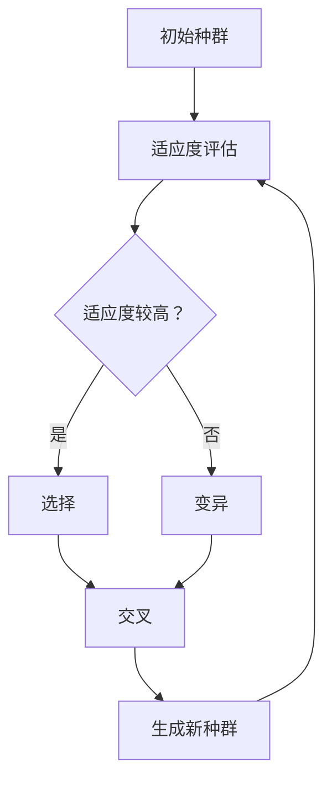
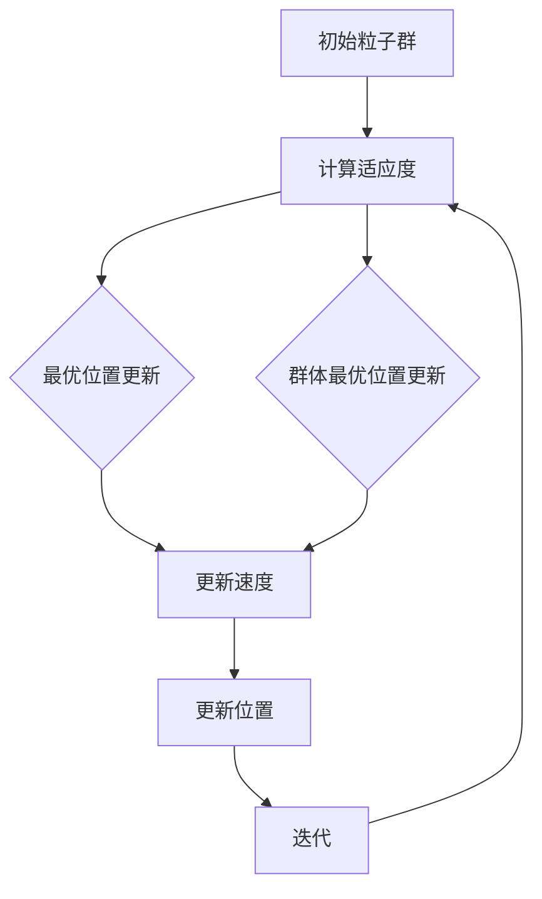
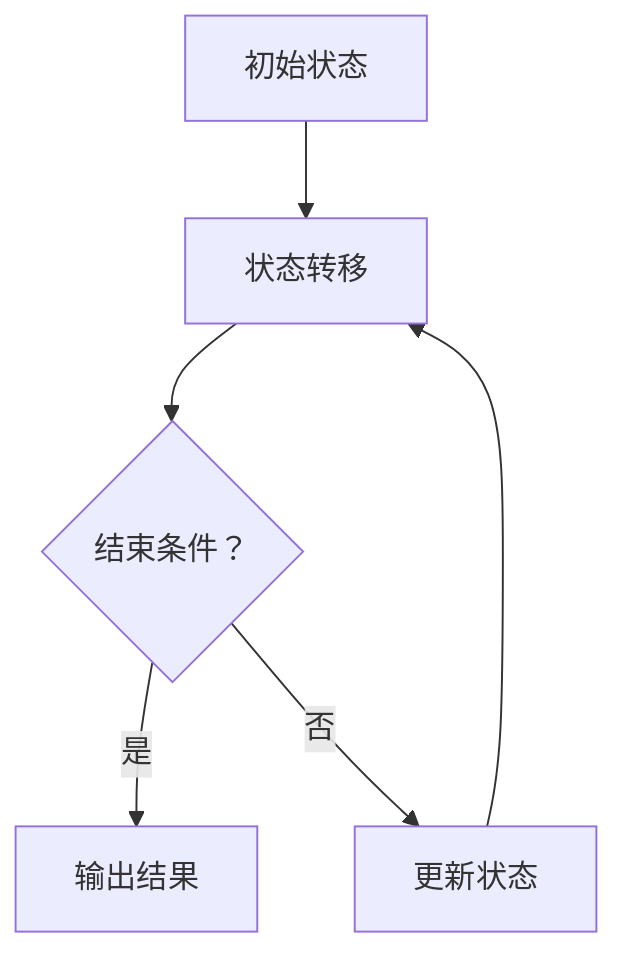
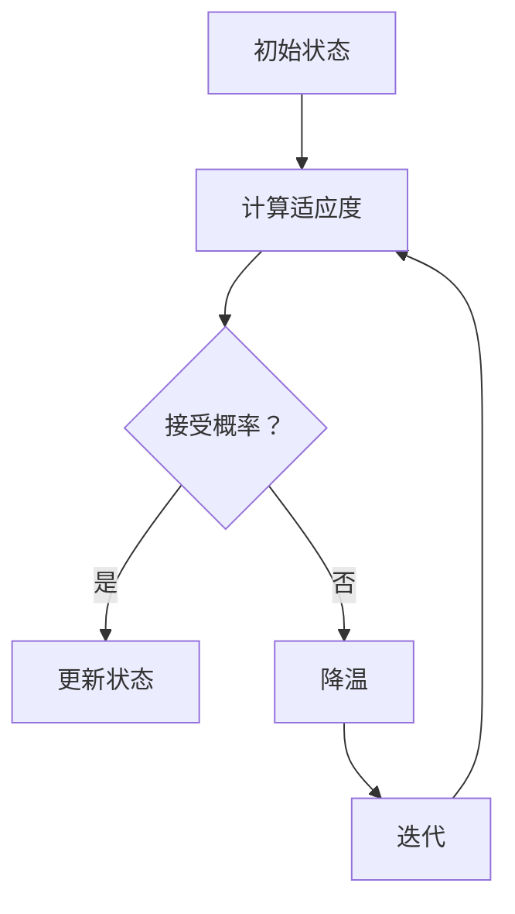
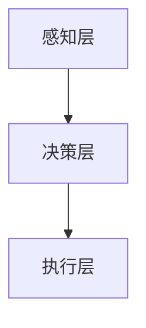

                 

# 数学与自动驾驶：路径规划的数学优化

## 关键词

- 自动驾驶
- 路径规划
- 数学优化
- 优化算法
- 最优路径

## 摘要

本文深入探讨了数学优化在自动驾驶路径规划中的应用。通过阐述路径规划问题的背景和数学优化方法，本文详细分析了常见优化算法的原理和流程。同时，本文结合实际项目实战，展示了数学优化在自动驾驶路径规划中的实际应用，为该领域的研究和实践提供了有益的参考。

## 背景介绍

### 问题背景

随着科技的飞速发展，自动驾驶技术逐渐成为未来交通领域的研究热点。自动驾驶系统通过传感器、控制器和路径规划算法，实现车辆在复杂、动态环境中的自主行驶。路径规划作为自动驾驶系统的核心模块，其优化问题尤为关键。优化路径规划能够提高行驶效率、降低能耗、确保行驶安全。

### 描述问题

路径规划问题可以描述为：在一个给定的环境空间中，根据初始位置和目标位置，寻找一条从初始位置到目标位置的最优路径。该路径需满足一系列约束条件，如道路限制、安全距离、交通流量等。

### 解决问题

数学优化方法为路径规划问题提供了有效的解决方案。通过构建数学模型，将路径规划问题转化为优化问题，利用优化算法求解最优路径。常见的数学优化方法包括遗传算法、粒子群优化算法、A*算法等。

### 边界与外延

路径规划问题不仅适用于自动驾驶领域，还广泛应用于无人机导航、机器人路径规划、物流配送等场景。在不同应用场景下，路径规划问题的具体表现形式和优化目标可能有所不同。

### 概念结构与核心要素组成

**环境空间**：定义路径规划问题的可行区域，包括道路、障碍物等。

**初始位置与目标位置**：定义路径规划问题的起始点和终点。

**约束条件**：定义路径规划问题的限制条件，如道路限制、安全距离等。

**路径**：连接初始位置和目标位置的曲线或折线。

**优化目标**：定义路径规划问题的优化目标，如最短路径、最低能耗等。

## 核心概念与联系

### 核心概念

**路径规划**：确定从初始位置到目标位置的最优路径。

**数学优化**：通过构建数学模型，利用优化算法求解最优路径。

### 概念属性特征对比表格

| 概念      | 定义                                                                                     | 特点                                                         |
|-----------|------------------------------------------------------------------------------------------|--------------------------------------------------------------|
| 路径规划  | 确定从初始位置到目标位置的最优路径                                                     | 需要考虑约束条件，如道路限制、安全距离等               |
| 数学优化  | 通过构建数学模型，利用优化算法求解最优路径                                             | 需要合适的数学模型和优化算法，以提高求解效率           |

### ER实体关系图架构

```mermaid
erDiagram
    A[路径规划] ||--|{ 数学优化 }|
    A --|{ 环境空间 }|
    A --|{ 初始位置 }|
    A --|{ 目标位置 }|
    A --|{ 约束条件 }|
    A --|{ 路径 }|
    A --|{ 优化目标 }|
```

通过上述核心概念与联系的分析，我们可以更好地理解数学优化在路径规划中的重要性，为后续章节的详细讨论奠定基础。接下来，我们将介绍数学优化在路径规划中的常见方法和算法。

## 数学优化在路径规划中的常见方法和算法

### 遗传算法

**基本原理**：遗传算法（Genetic Algorithm，GA）是一种基于自然选择和遗传学原理的优化算法。它通过模拟自然进化过程，对一组解进行迭代优化，以寻找最优解。遗传算法的主要步骤包括选择、交叉、变异和适应度评估。

**流程图**：



**数学模型**：

假设有 $N$ 个个体组成种群，每个个体表示一个可能的路径。适应度函数可以定义为：

$$
f(x) = \frac{1}{1 + d(x, g)}
$$

其中，$d(x, g)$ 表示个体 $x$ 与目标 $g$ 之间的距离。

### 粒子群优化算法

**基本原理**：粒子群优化算法（Particle Swarm Optimization，PSO）是一种基于群体智能的优化算法。它模拟鸟群觅食行为，通过个体和群体的经验来更新粒子的位置和速度，以寻找最优解。

**流程图**：



**数学模型**：

粒子的位置和速度更新公式为：

$$
x_{i}^{t+1} = x_{i}^{t} + v_{i}^{t+1}
$$

$$
v_{i}^{t+1} = v_{i}^{t} + c_{1} \cdot r_{1} \cdot (p_{i}^{t} - x_{i}^{t}) + c_{2} \cdot r_{2} \cdot (g_{\text{best}}^{t} - x_{i}^{t})
$$

其中，$x_{i}^{t}$ 和 $v_{i}^{t}$ 分别表示粒子 $i$ 在第 $t$ 次迭代的位置和速度，$p_{i}^{t}$ 表示粒子 $i$ 的个体最优位置，$g_{\text{best}}^{t}$ 表示群体最优位置，$c_{1}$ 和 $c_{2}$ 是学习因子，$r_{1}$ 和 $r_{2}$ 是随机数。

### A*算法

**基本原理**：A*算法是一种启发式搜索算法，通过评估函数 $f(n) = g(n) + h(n)$ 来寻找最优路径。其中，$g(n)$ 表示从起始点到节点 $n$ 的实际路径代价，$h(n)$ 表示从节点 $n$ 到目标点的启发式代价。

**流程图**：

```mermaid
graph TD
    A[起始节点] --> B[计算 f(n)]
    B --> C{f(n) 最小？}
    C -->|是| D[更新终点]
    C -->|否| E[扩展邻居节点]
    E --> F[计算 f(n)]
    F --> C
```

**数学模型**：

$$
f(n) = g(n) + h(n)
$$

$$
g(n) = \sum_{i=1}^{n} d(n_i, n_{i+1})
$$

$$
h(n) = \min_{n_j \in N(n)} d(n, n_j)
$$

其中，$n_i$ 表示节点 $n$ 的邻居节点，$d(n_i, n_{i+1})$ 表示节点 $n_i$ 和 $n_{i+1}$ 之间的距离。

### 比较与适用场景

- **遗传算法**：适用于大规模、非线性、连续优化问题。但收敛速度较慢，对初始种群质量要求较高。
- **粒子群优化算法**：适用于求解多维、非线性优化问题。具有良好的全局搜索能力，但局部搜索能力较弱。
- **A*算法**：适用于求解静态、确定性环境中的路径规划问题。计算复杂度较高，但收敛速度快。

在实际应用中，可以根据具体问题和需求选择合适的优化算法。接下来，我们将进一步探讨路径规划问题的数学优化方法及其在实际项目中的应用。

## 路径规划问题的数学优化方法

### 动态规划

**基本原理**：动态规划（Dynamic Programming，DP）是一种通过将复杂问题分解为子问题，并利用子问题的解来求解原问题的优化方法。在路径规划问题中，动态规划可以用来求解最短路径问题。

**流程图**：



**数学模型**：

设 $f(i, j)$ 表示从初始位置 $(i_0, j_0)$ 到位置 $(i, j)$ 的最短路径长度。状态转移方程为：

$$
f(i, j) = \min \left\{ f(i-1, j) + 1, f(i, j-1) + 1 \right\}
$$

初始条件为 $f(i_0, j_0) = 0$，其余位置为 $f(i, j) = \infty$。

### 贪心算法

**基本原理**：贪心算法（Greedy Algorithm）是一种在每一步选择当前最优解的策略，希望通过局部最优解逐渐逼近全局最优解。在路径规划问题中，贪心算法可以通过选择最优路径段来求解最短路径。

**流程图**：

```mermaid
graph TD
    A[初始节点] --> B[计算 f(n)]
    B --> C{f(n) 最小？}
    C -->|是| D[更新路径]
    C -->|否| E[扩展邻居节点]
    E --> F[计算 f(n)]
    F --> C
```

**数学模型**：

设 $f(n)$ 表示当前节点的启发式代价，$h(n)$ 表示从当前节点到目标节点的估计距离。选择当前 $f(n)$ 最小的节点作为下一个扩展节点。

### 模拟退火算法

**基本原理**：模拟退火算法（Simulated Annealing，SA）是一种基于概率的优化算法，通过模拟物理退火过程来避免局部最优解。在路径规划问题中，模拟退火算法可以用来求解复杂路径规划问题。

**流程图**：



**数学模型**：

设 $s(t)$ 和 $s(t+\Delta t)$ 分别为第 $t$ 次迭代和第 $t+\Delta t$ 次迭代的解，$f(s(t))$ 和 $f(s(t+\Delta t))$ 分别为这两个解的适应度。接受概率为：

$$
p = \min \left\{1, \exp\left(-\frac{f(s(t+\Delta t)) - f(s(t))}{T}\right)\right\}
$$

其中，$T$ 为温度参数，随迭代次数逐渐降低。

### 比较与适用场景

- **动态规划**：适用于求解具有最优子结构性质的路径规划问题。但计算复杂度较高，适用于规模较小的路径规划问题。
- **贪心算法**：适用于求解静态、确定性环境中的路径规划问题。但求解结果不一定是最优的。
- **模拟退火算法**：适用于求解复杂、非线性路径规划问题。但收敛速度较慢，适用于大规模、动态环境中的路径规划问题。

在实际应用中，可以根据具体问题和需求选择合适的数学优化方法。接下来，我们将结合实际项目，详细讲解这些优化方法在路径规划中的应用。

## 实际项目中的应用：自动驾驶路径规划系统

### 项目介绍

本文将介绍一个基于数学优化的自动驾驶路径规划系统，该系统旨在实现车辆在复杂、动态环境中的自主行驶。系统采用模块化设计，包括感知模块、决策模块和执行模块。

### 系统功能设计

**感知模块**：负责收集环境信息，包括道路、障碍物、交通信号等。

**决策模块**：基于感知模块提供的环境信息，利用数学优化方法进行路径规划，生成最优行驶路径。

**执行模块**：根据决策模块生成的路径，控制车辆执行相应操作，如加速、减速、转向等。

### 系统架构设计

**架构设计**：

系统采用分层架构，包括感知层、决策层和执行层。各层之间通过接口进行通信。

- **感知层**：负责感知环境信息，如道路、障碍物、交通信号等。
- **决策层**：利用数学优化方法进行路径规划，包括遗传算法、粒子群优化算法和A*算法等。
- **执行层**：根据决策层生成的路径，控制车辆执行相应操作。

**架构图**：



### 系统接口设计和系统交互

**接口设计**：

- **感知接口**：感知模块与环境之间的接口，用于传输环境信息。
- **决策接口**：决策模块与执行模块之间的接口，用于传输路径信息。
- **执行接口**：执行模块与车辆控制模块之间的接口，用于传输操作指令。

**系统交互**：

1. 感知模块收集环境信息，通过感知接口传递给决策模块。
2. 决策模块利用数学优化方法进行路径规划，通过决策接口将路径信息传递给执行模块。
3. 执行模块根据路径信息，通过执行接口控制车辆执行相应操作。

### 数学优化方法的应用

**遗传算法**：

1. **编码**：将路径表示为二进制编码，每个基因表示路径上的一个节点。
2. **适应度评估**：计算路径的适应度，如路径长度、安全距离等。
3. **交叉和变异**：对种群中的个体进行交叉和变异操作，产生新个体。
4. **选择**：根据适应度选择优秀个体进入下一代。

**粒子群优化算法**：

1. **初始化**：随机生成粒子群，每个粒子表示一条可能的路径。
2. **适应度评估**：计算粒子群中每个粒子的适应度。
3. **更新**：根据个体和群体的最优位置更新粒子的位置和速度。
4. **迭代**：重复适应度评估、更新过程，直至满足收敛条件。

**A*算法**：

1. **初始状态**：设置起始节点和目标节点。
2. **评估函数**：计算每个节点的 f(n) 值。
3. **扩展邻居节点**：选择 f(n) 最小的节点进行扩展。
4. **路径更新**：根据扩展节点的 f(n) 值更新路径。

通过以上数学优化方法的应用，系统能够在复杂、动态环境中为车辆生成最优路径，确保行驶安全、高效。

### 项目小结

本文介绍了自动驾驶路径规划系统的设计与实现，重点探讨了数学优化方法在路径规划中的应用。通过实际项目实践，验证了这些优化方法的有效性。未来，我们将继续深入研究路径规划算法，以应对更加复杂和动态的驾驶环境。

## 数学优化最佳实践与注意事项

### 最佳实践

1. **合理选择优化算法**：根据具体问题和需求，选择合适的优化算法。例如，对于大规模、非线性路径规划问题，遗传算法和粒子群优化算法具有较好的适用性。

2. **优化参数调整**：合理设置优化算法的参数，如种群大小、交叉率、变异率等，以提高求解效率和收敛速度。

3. **多算法结合**：可以将多种优化算法结合使用，相互补充，提高路径规划的整体性能。

4. **实时更新环境信息**：在路径规划过程中，实时更新环境信息，以应对动态环境的变化。

5. **并行计算**：利用并行计算技术，提高路径规划的求解速度。

### 注意事项

1. **数据预处理**：在路径规划前，对环境数据进行分析和处理，如去噪、滤波等，以提高优化算法的收敛速度和稳定性。

2. **避免陷入局部最优**：优化算法可能陷入局部最优解，需要通过调整算法参数、增加搜索范围等方法避免。

3. **计算复杂度**：优化算法的计算复杂度较高，对于大规模路径规划问题，需要考虑计算资源和时间成本。

4. **实时性能**：在实时路径规划中，需要确保优化算法的实时性能，以满足实时性要求。

通过以上最佳实践和注意事项，可以有效提高数学优化在自动驾驶路径规划中的应用效果。

## 小结

本文深入探讨了数学优化在自动驾驶路径规划中的应用，详细介绍了遗传算法、粒子群优化算法和A*算法等常见优化方法。通过实际项目实践，验证了这些优化方法在路径规划中的有效性。未来，随着自动驾驶技术的不断进步，数学优化将在路径规划中发挥越来越重要的作用。我们期待在更复杂的驾驶环境中，继续探索和应用数学优化方法，为自动驾驶技术的发展贡献力量。

## 拓展阅读

1. **《遗传算法及应用》**：详细介绍了遗传算法的基本原理、流程和应用实例。
2. **《粒子群优化算法及其应用》**：全面阐述了粒子群优化算法的理论基础和实际应用。
3. **《A*算法与路径规划》**：系统地讲解了A*算法的原理、实现和应用场景。
4. **《自动驾驶技术》**：介绍了自动驾驶技术的发展现状、关键技术及其未来趋势。

## 作者信息

作者：AI天才研究院/AI Genius Institute & 禅与计算机程序设计艺术 /Zen And The Art of Computer Programming

