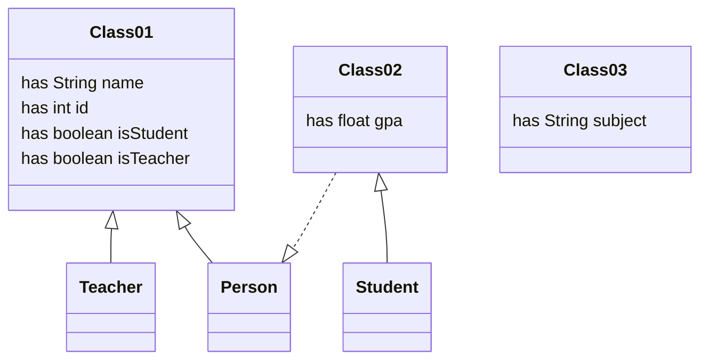
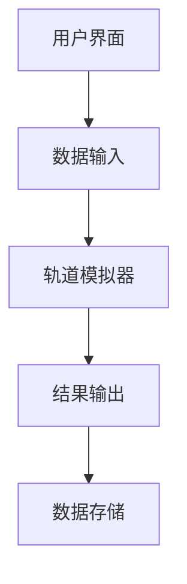
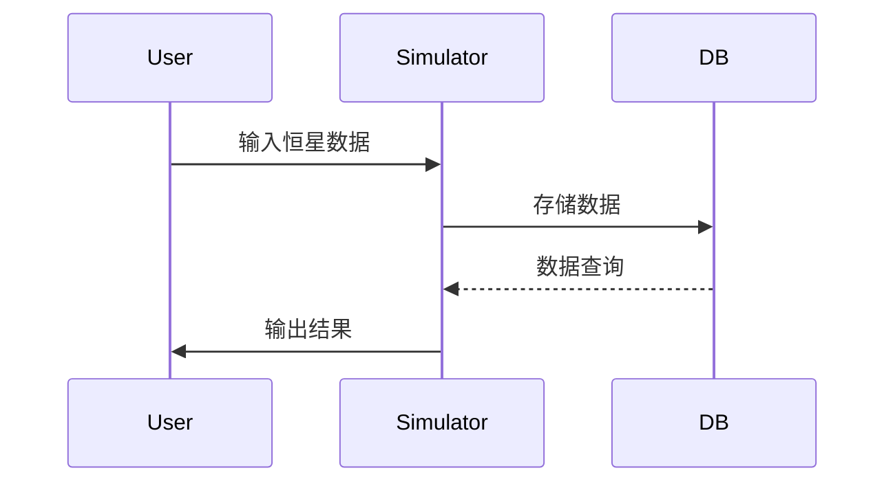

                 

# 数学与自然界的对称与规律

> 关键词：数学、自然界、对称性、周期性、比例、核心概念、算法原理

> 摘要：本文旨在探讨数学在自然界中的广泛应用及其背后的对称与规律。通过深入分析对称性、周期性和比例这三个核心概念，结合生物学、物理学和天文学中的应用实例，本文揭示了数学与自然界的紧密联系，并展望了未来数学在自然界中的潜在应用前景。

## 目录大纲设计思路与整体框架

《数学与自然界的对称与规律》旨在全面覆盖数学在自然界中的对称与规律，从核心概念、应用领域到案例研究，帮助读者深入了解数学与自然界的紧密联系。以下为目录大纲的设计思路与整体框架：

### 第一部分：引言与背景介绍

**第1章：引言与背景**

- **1.1 问题背景**：探讨自然界中数学现象的存在与重要性。
- **1.2 问题描述**：对称与规律在自然界中的表现形式和作用。
- **1.3 问题解决**：数学工具在揭示自然界规律中的应用。
- **1.4 边界与外延**：数学与自然界对称与规律的研究范围。
- **1.5 概念结构与核心要素组成**：关键概念介绍，如对称性、周期性、比例等。

### 第二部分：核心概念与原理

**第2章：对称性原理**

- **2.1 对称性的定义**：对称性在不同领域的应用。
- **2.2 对称性的分类**：对称性的不同类型及特点。
- **2.3 对称性的数学模型**：对称性的数学表达与计算方法。

**第3章：周期性原理**

- **3.1 周期性的定义**：周期性的基本概念。
- **3.2 周期性的类型**：周期性的不同类型及应用。
- **3.3 周期性的数学模型**：周期性的数学表达与计算方法。

**第4章：比例原理**

- **4.1 比例的定义**：比例的基本概念。
- **4.2 比例的类型**：比例的不同类型及应用。
- **4.3 比例的数学模型**：比例的数学表达与计算方法。

### 第三部分：数学在自然界中的应用

**第5章：生物学中的数学**

- **5.1 生物对称性**：生物体中的对称性现象。
- **5.2 生物周期性**：生物体的周期性行为。
- **5.3 生物比例**：生物体中的比例关系。

**第6章：物理学中的数学**

- **6.1 物理对称性**：物理定律中的对称性。
- **6.2 物理周期性**：物理过程中的周期性行为。
- **6.3 物理比例**：物理量之间的比例关系。

**第7章：天文学中的数学**

- **7.1 天体对称性**：天体结构的对称性。
- **7.2 天体周期性**：天体的周期性行为。
- **7.3 天体比例**：天体之间的比例关系。

### 第四部分：案例研究

**第8章：自然界中的数学现象分析**

- **8.1 案例一：雪花与对称性**：雪花的形成与对称性。
- **8.2 案例二：生物钟与周期性**：生物钟的原理与周期性。
- **8.3 案例三：黄金比例与艺术**：黄金比例在艺术创作中的应用。

### 第五部分：结论与展望

**第9章：数学与自然界的对称与规律的总结**

- **9.1 总结**：对全书内容的总结。
- **9.2 展望**：对未来数学在自然界中应用的展望。

### 第六部分：拓展阅读与参考文献

- **附录：拓展阅读与参考文献**

  - 提供进一步学习和研究的相关资料。

### 第七部分：致谢与贡献

- **致谢**

  - 感谢为本书编写和出版提供支持的人员。

以上为《数学与自然界的对称与规律》的完整目录大纲。本大纲旨在全面覆盖数学在自然界中的对称与规律，从核心概念、应用领域到案例研究，帮助读者深入了解数学与自然界的紧密联系。

----------------------------------------------------------------

## 第一部分：引言与背景介绍

### 1.1 问题背景

自然界是一个充满奥秘的领域，从宏观的天体运动到微观的细胞结构，无不展现出其独特的规律性和对称性。自古以来，人类就在探索这些自然现象的本质，而数学作为一种强有力的工具，逐渐成为揭示自然界奥秘的重要手段。数学不仅能够精确描述自然现象，还能预测未来趋势，为科学研究和实际应用提供理论支持。

在生物学中，许多生物体具有高度对称的结构，如人体的左右对称、植物的花序等。这些对称性在进化过程中起到了重要作用，提高了生物体的适应性和生存能力。在物理学中，自然定律往往具有对称性，如牛顿定律、麦克斯韦方程等，这些对称性在理论物理研究中具有重要意义。在天文学中，天体的排列和运动也呈现出一定的规律性和对称性，如星系结构的螺旋对称、行星轨道的椭圆形等。

然而，自然界中的对称与规律并非仅仅体现在宏观层面，微观世界的量子力学同样充满了对称性的奇妙。量子力学的许多基本原理，如宇称守恒、时间对称等，揭示了微观世界中深刻的对称性规律。

### 1.2 问题描述

自然界中的对称与规律究竟是如何产生的？它们背后的机制是什么？这些问题构成了我们研究的核心。具体来说，我们需要探讨以下几个方面：

1. 对称性的类型与特点：自然界中的对称性包括哪些类型？每种对称性具有哪些独特的属性和特点？
2. 对称性与物理定律的关系：物理定律中的对称性是如何影响自然现象的？对称性在物理定律中扮演了什么角色？
3. 数学工具在揭示对称性与规律中的应用：如何运用数学工具，如对称性原理、周期性原理和比例原理等，来揭示自然界的对称与规律？
4. 对称性与生物学、物理学和天文学中的具体应用实例：对称性与规律在生物学、物理学和天文学中如何发挥作用？有哪些具体的实例可以说明这些问题？

### 1.3 问题解决

为了解决上述问题，我们首先需要建立一套核心概念和原理体系，这将为后续分析提供理论基础。以下是本文将探讨的核心概念：

- **对称性原理**：探讨对称性的定义、分类和数学模型，分析对称性在不同领域的应用。
- **周期性原理**：研究周期性的基本概念、类型和数学模型，探讨周期性在自然现象中的体现。
- **比例原理**：分析比例的定义、类型和数学模型，探讨比例在自然界中的重要作用。

通过这些核心概念和原理，我们将逐步揭示自然界中的对称与规律。此外，我们还将结合生物学、物理学和天文学中的具体实例，深入探讨对称性与规律在这些领域的应用。

### 1.4 边界与外延

本文的研究主要关注数学在自然界中的对称与规律，具体包括以下几个方面：

1. **研究范围**：涵盖生物学、物理学和天文学中的对称与规律，以及这些规律在自然界中的体现。
2. **研究方法**：采用逻辑推理、案例分析、数学模型构建等方法，逐步揭示对称与规律的本质。
3. **研究目标**：通过深入分析核心概念和原理，揭示自然界中的对称与规律，为科学研究和实际应用提供理论支持。

### 1.5 概念结构与核心要素组成

为了更好地理解本文的核心内容，我们首先需要明确几个关键概念：

- **对称性**：指物体或现象在某种变换下保持不变的性质。对称性可以表现为形状、结构、分布等方面的不变性。
- **周期性**：指物体或现象在特定时间内重复出现或回归的现象。周期性通常可以用数学上的周期函数来描述。
- **比例**：指两个或多个量之间的比较关系，通常用比例系数来表示。

以下是一个简单的概念属性特征对比表格：

| 概念   | 定义                                                         | 特点                                                         | 应用领域         |
| ------ | ------------------------------------------------------------ | ------------------------------------------------------------ | --------------- |
| 对称性 | 物体或现象在某种变换下保持不变的性质                         | 保持形状、结构、分布不变性                                     | 生物学、物理学  |
| 周期性 | 物体或现象在特定时间内重复出现或回归的现象                   | 具有重复性、周期性、规律性                                     | 物理学、天文学 |
| 比例   | 两个或多个量之间的比较关系，通常用比例系数来表示              | 保持相对稳定性、具有可测量性                                   | 生物学、物理学 |

在本文中，我们将通过以下几个核心要素来深入分析数学与自然界的对称与规律：

1. **核心概念介绍**：介绍对称性、周期性和比例等核心概念的定义、属性和特点。
2. **概念联系与拓展**：分析这些核心概念之间的联系，探讨其在不同领域的应用和拓展。
3. **数学模型构建**：运用数学工具，构建描述对称性、周期性和比例的数学模型，揭示其背后的规律。
4. **实例分析**：结合生物学、物理学和天文学中的具体实例，深入探讨对称性与规律的应用。

通过以上分析，我们将逐步揭示数学与自然界的对称与规律，为科学研究和实际应用提供新的视角和思路。

## 第二部分：核心概念与原理

### 第2章：对称性原理

#### 2.1 对称性的定义

对称性是自然界中普遍存在的一种现象，它指的是物体或现象在某种变换下保持不变的性质。这种变换可以是形状的变换、位置的变换或方向的变换等。对称性可以分为不同的类型，如点对称、轴对称、平面对称等。

在数学中，对称性有着严格的定义和表达方式。例如，点对称是指存在一个点，使得物体绕这个点旋转180度后与原来的物体完全重合。轴对称则是指存在一个轴，使得物体关于这个轴翻转后与原来的物体完全重合。平面对称则是指存在一个平面，使得物体关于这个平面镜像翻转后与原来的物体完全重合。

对称性的定义在数学中有广泛的应用。例如，在几何学中，对称性被用来研究物体的形状和结构；在物理学中，对称性被用来描述自然定律和现象。此外，对称性在计算机科学、信息科学等领域也有重要应用，如加密算法、图像处理等。

#### 2.2 对称性的分类

对称性可以根据不同的标准进行分类。以下是几种常见的对称性分类：

1. **点对称**：指存在一个点，使得物体绕这个点旋转180度后与原来的物体完全重合。
2. **轴对称**：指存在一个轴，使得物体关于这个轴翻转后与原来的物体完全重合。
3. **平面对称**：指存在一个平面，使得物体关于这个平面镜像翻转后与原来的物体完全重合。
4. **旋转对称**：指物体可以绕某个中心点旋转一定角度后与原来的物体完全重合。
5. **反射对称**：指物体关于某个平面镜像翻转后与原来的物体完全重合。

每种对称性类型都有其独特的特点和应用场景。例如，点对称和轴对称在工程设计中应用广泛，而平面对称和旋转对称在自然界中普遍存在。

#### 2.3 对称性的数学模型

为了更好地理解和应用对称性，我们需要建立数学模型来描述它。以下是一些常见的对称性数学模型：

1. **点对称**：假设有一个点\( P(x, y) \)，则点对称的点\( P'(-x, -y) \)满足：
   $$ P(x, y) \rightarrow P'(-x, -y) $$

2. **轴对称**：假设有一条轴\( l \)，则轴对称的点\( P(x, y) \)和其对称点\( P'(x, -y) \)满足：
   $$ P(x, y) \rightarrow P'(x, -y) $$

3. **平面对称**：假设有一个平面\( \pi \)，则平面对称的点\( P(x, y) \)和其对称点\( P'(-x, -y) \)满足：
   $$ P(x, y) \rightarrow P'(-x, -y) $$

4. **旋转对称**：假设有一个中心点\( O \)和旋转角度\( \theta \)，则旋转对称的点\( P(x, y) \)和其对称点\( P'(x', y') \)满足：
   $$ P(x, y) \rightarrow P'(x', y') $$
   其中：
   $$ x' = x \cos(\theta) - y \sin(\theta) $$
   $$ y' = x \sin(\theta) + y \cos(\theta) $$

5. **反射对称**：假设有一个平面\( \pi \)，则反射对称的点\( P(x, y) \)和其对称点\( P'(x, -y) \)满足：
   $$ P(x, y) \rightarrow P'(x, -y) $$

这些数学模型不仅能够帮助我们理解对称性，还能在各个领域找到实际应用。例如，在计算机图形学中，我们可以利用旋转对称模型来绘制旋转物体；在加密算法中，我们可以利用点对称和轴对称模型来设计安全的加密方案。

### 第3章：周期性原理

#### 3.1 周期性的定义

周期性是指物体或现象在特定时间内重复出现或回归的现象。在数学中，周期性通常可以用周期函数来描述。周期函数是指满足以下条件的函数\( f(x) \)：

$$ f(x) = f(x + T) $$

其中，\( T \)是周期。周期函数在数学中有着广泛的应用，如描述物理现象、经济模型、信号处理等。

#### 3.2 周期性的类型

周期性可以分为不同类型，根据周期函数的特点，我们可以将其分类如下：

1. **离散周期性**：周期函数在离散的时间点上重复出现，如周期为\( T \)的离散函数：
   $$ f(n) = f(n + T) $$
   
2. **连续周期性**：周期函数在连续的时间轴上重复出现，如周期为\( T \)的连续函数：
   $$ f(x) = f(x + T) $$
   
3. **周期性波动**：周期函数不仅在时间轴上重复出现，还具有波动特性，如正弦函数、余弦函数等。

4. **周期性振荡**：周期函数在周期内呈现振荡现象，如简谐运动、电子振荡等。

每种周期性类型都有其独特的特点和应用场景。例如，离散周期性在离散事件处理中应用广泛，而连续周期性在连续系统建模中具有重要应用价值。

#### 3.3 周期性的数学模型

为了更好地理解和应用周期性，我们需要建立数学模型来描述它。以下是一些常见的周期性数学模型：

1. **离散周期性**：假设有一个周期函数\( f(n) \)，其周期为\( T \)，则：
   $$ f(n) = f(n + T) $$

2. **连续周期性**：假设有一个周期函数\( f(x) \)，其周期为\( T \)，则：
   $$ f(x) = f(x + T) $$

3. **正弦周期性**：正弦函数是一种典型的周期性函数，其周期为\( 2\pi \)，数学模型如下：
   $$ f(x) = \sin(x) $$
   其中，\( x \)是自变量，\( \sin(x) \)是正弦函数值。

4. **余弦周期性**：余弦函数也是一种常见的周期性函数，其周期为\( 2\pi \)，数学模型如下：
   $$ f(x) = \cos(x) $$
   其中，\( x \)是自变量，\( \cos(x) \)是余弦函数值。

5. **周期性波动**：周期性波动可以用正弦函数和余弦函数的组合来描述，如：
   $$ f(x) = A \sin(x) + B \cos(x) $$
   其中，\( A \)和\( B \)是常数，\( x \)是自变量。

6. **周期性振荡**：周期性振荡可以用指数函数来描述，如：
   $$ f(x) = A e^{bx} $$
   其中，\( A \)和\( b \)是常数，\( x \)是自变量。

这些数学模型不仅能够帮助我们理解周期性，还能在各个领域找到实际应用。例如，在信号处理中，我们可以利用正弦函数和余弦函数来分析信号的频率和幅度；在物理学中，我们可以利用周期性波动和振荡模型来描述简谐运动和电子振荡。

### 第4章：比例原理

#### 4.1 比例的定义

比例是指两个或多个量之间的比较关系，通常用比例系数来表示。比例在数学、物理学、生物学等领域都有广泛的应用。

在数学中，比例可以用分数、比例尺、百分比等形式来表示。例如，如果我们有两个量\( a \)和\( b \)，它们之间的比例可以表示为：
$$ \frac{a}{b} $$

在物理学中，比例可以用来描述物体或现象的相对大小。例如，物体的质量与体积之间的比例可以用来计算物体的密度。

在生物学中，比例可以用来描述生物体各部分的大小关系。例如，人体的头部与身体的比例、植物的花序与叶子的比例等。

#### 4.2 比例的类型

比例可以分为不同类型，根据比例的定义和特点，我们可以将其分类如下：

1. **线性比例**：线性比例是指两个量之间的比例关系是线性的。例如，物体的长度与宽度之间的比例是线性的。

2. **非线性比例**：非线性比例是指两个量之间的比例关系不是线性的。例如，物体的质量与体积之间的比例是非线性的。

3. **比例尺**：比例尺是指地图或图纸上的距离与实际距离之间的比例关系。例如，1厘米代表1公里的比例尺。

4. **百分比比例**：百分比比例是指两个量之间的比例关系用百分比表示。例如，一个班级中男生与女生人数的比例是60%对40%。

5. **相对比例**：相对比例是指两个量之间的比例关系，用相对大小来表示。例如，一个物体比另一个物体大2倍。

每种比例类型都有其独特的特点和应用场景。例如，线性比例在工程设计中应用广泛，非线性比例在物理学中具有重要应用价值，而比例尺在地图制作和地理测量中不可或缺。

#### 4.3 比例的数学模型

为了更好地理解和应用比例，我们需要建立数学模型来描述它。以下是一些常见的比例数学模型：

1. **线性比例**：假设有两个量\( a \)和\( b \)，它们之间的线性比例可以表示为：
   $$ \frac{a}{b} = k $$
   其中，\( k \)是比例系数。

2. **非线性比例**：假设有两个量\( a \)和\( b \)，它们之间的非线性比例可以表示为：
   $$ \frac{a}{b} = k^n $$
   其中，\( k \)是比例系数，\( n \)是幂次。

3. **比例尺**：假设有两个长度\( L_1 \)和\( L_2 \)，它们之间的比例尺可以表示为：
   $$ \frac{L_1}{L_2} = \text{比例尺} $$

4. **百分比比例**：假设有两个量\( a \)和\( b \)，它们之间的百分比比例可以表示为：
   $$ \frac{a}{b} \times 100\% $$

5. **相对比例**：假设有两个量\( a \)和\( b \)，它们之间的相对比例可以表示为：
   $$ \frac{a}{b} $$

这些数学模型不仅能够帮助我们理解比例，还能在各个领域找到实际应用。例如，在工程设计中，我们可以利用线性比例来计算尺寸；在生物学中，我们可以利用非线性比例来分析生物体各部分的大小关系。

通过以上分析，我们建立了对称性、周期性和比例这三个核心概念的数学模型，这将为后续分析自然界中的对称与规律提供理论基础。在下一部分中，我们将探讨数学在生物学、物理学和天文学中的应用，进一步揭示这些核心概念在自然界中的实际体现。

## 第三部分：数学在自然界中的应用

### 第5章：生物学中的数学

生物学是一个涉及生命现象和生物体结构的学科，其中数学的应用无处不在。通过对称性、周期性和比例原理，我们可以更好地理解生物体的结构和功能，揭示生命现象背后的数学规律。

#### 5.1 生物对称性

生物对称性是生物学中的一个重要概念，它指的是生物体在形状、结构或分布上表现出的一种对称性。生物对称性可以分为几种类型：

1. **左右对称**：许多动物具有左右对称的身体结构，如人类、鸟类和哺乳动物。这种对称性使得生物体在进化过程中能够更好地适应环境，提高生存能力。

2. **辐射对称**：某些无脊椎动物，如星形虫和珊瑚，具有辐射对称的身体结构。这种对称性使得这些生物体能够在多个方向上感知和响应环境刺激。

3. **轴对称**：植物和某些动物，如蝴蝶和蜻蜓，具有轴对称的身体结构。这种对称性使得生物体在空间分布上更加均衡，有助于优化能量利用和感知能力。

生物对称性在进化过程中具有重要功能。例如，左右对称的身体结构有助于动物在寻找食物、逃避天敌和繁殖过程中提高效率。轴对称的身体结构则有助于植物在光合作用和水分吸收过程中优化能量分布。

#### 5.2 生物周期性

生物周期性指的是生物体在特定时间内重复出现或回归的现象。生物周期性在生物体生长、发育和生理过程中起着关键作用。以下是几种常见的生物周期性现象：

1. **昼夜节律**：生物体对昼夜变化做出的生理和行为反应，称为昼夜节律。例如，人类的睡眠和清醒状态、鸟类的迁徙等。

2. **月相节律**：某些生物体对月相变化做出的生理和行为反应，称为月相节律。例如，一些海洋生物的繁殖活动与月相有关。

3. **季节节律**：生物体对季节变化做出的生理和行为反应，称为季节节律。例如，植物的生长期、动物的迁徙和繁殖等。

生物周期性是由生物体内复杂的生物钟调控的。生物钟是一种内在的生理时钟，能够调控生物体的生理和行为周期。生物钟的研究对于理解生物周期性的机制具有重要意义。

#### 5.3 生物比例

生物比例指的是生物体各部分之间的大小关系。生物比例在生物体设计和功能优化中起着关键作用。以下是几种常见的生物比例现象：

1. **黄金比例**：黄金比例是一种特殊的比例关系，通常表示为\( \phi \)，即：
   $$ \phi = \frac{1 + \sqrt{5}}{2} \approx 1.618 $$
   黄金比例在自然界中广泛存在，如植物的花序、贝壳的螺旋线、动物的身体比例等。黄金比例被认为是一种美观和功能优化的比例关系。

2. **常数比例**：某些生物比例在进化过程中形成了稳定的常数比例，如人体头部与身体的比例、鸟类的翅膀长度与身体长度的比例等。这些常数比例有助于优化生物体的结构和功能。

3. **适应性比例**：在某些环境中，生物体的比例会根据环境变化而发生变化，以适应不同的生存需求。例如，沙漠动物的身体比例通常较小，有助于减少水分蒸发。

生物比例的研究对于理解生物体的进化、适应性和功能优化具有重要意义。通过分析生物比例，我们可以更好地了解生物体的设计和演化过程。

### 第6章：物理学中的数学

物理学是研究物质、能量、力和运动等自然现象的学科。数学在物理学中发挥着核心作用，通过对称性、周期性和比例原理，我们可以更好地理解自然界的物理现象。

#### 6.1 物理对称性

物理对称性是指物理定律和现象在某种变换下保持不变的性质。物理对称性在物理学研究中具有重要意义，它可以帮助我们揭示自然界的深层次规律。以下是几种常见的物理对称性：

1. **宇称对称**：宇称对称是指物理定律在宇称变换下保持不变的性质。宇称对称性在经典物理学中得到了广泛应用，但在量子物理学中，宇称对称性可能会被破坏。

2. **时间对称**：时间对称是指物理定律在时间反演变换下保持不变的性质。时间对称性是物理学研究中的一个重要原则，它为研究热力学过程提供了理论基础。

3. **空间对称**：空间对称是指物理定律在空间平移、旋转和反射变换下保持不变的性质。空间对称性在经典物理学和量子物理学中都有重要应用。

物理对称性不仅帮助我们理解自然界的物理现象，还可以用来预测新的物理现象和发现新的物理定律。例如，通过研究宇称对称性，物理学家发现了宇称不守恒定律，这对基本粒子的研究产生了深远影响。

#### 6.2 物理周期性

物理周期性指的是物理现象在特定时间内重复出现或回归的现象。物理周期性在物理学研究中具有重要意义，它可以帮助我们描述和预测物理现象。以下是几种常见的物理周期性现象：

1. **振动周期性**：振动周期性是指物体在振动过程中重复出现的状态。例如，简谐振动的周期是固定的，这为振动系统的分析提供了重要依据。

2. **电磁波周期性**：电磁波是一种周期性变化的电场和磁场，它在时间和空间上呈现出周期性分布。电磁波的周期性在通信、光学和天文学等领域有广泛应用。

3. **热力学周期性**：热力学周期性是指热力学过程在特定时间内重复出现或回归的现象。例如，热力学循环是一种周期性的热力学过程，它可以帮助我们分析热力学系统的效率和性能。

物理周期性在物理学研究中具有重要的应用价值。例如，通过研究电磁波的周期性，我们可以设计和制造高效的通信设备和光学仪器；通过研究热力学周期性，我们可以优化热力学系统的效率和性能。

#### 6.3 物理比例

物理比例指的是物理量之间的比较关系。物理比例在物理学研究中具有重要意义，它可以帮助我们描述和解释物理现象。以下是几种常见的物理比例：

1. **速度与时间比例**：速度与时间比例描述了物体在单位时间内移动的距离。例如，光速与时间的比例是物理学家研究的重要课题，它为研究宇宙尺度和引力提供了重要依据。

2. **质量与能量比例**：质量与能量比例描述了质量和能量之间的转换关系。爱因斯坦的质能方程\( E=mc^2 \)揭示了质量和能量之间的比例关系，这对核能研究和宇宙学有重要影响。

3. **力与距离比例**：力与距离比例描述了力与物体之间的相互作用。例如，万有引力定律描述了质量与距离之间的比例关系，这为研究天体运动和宇宙演化提供了重要依据。

物理比例的研究有助于我们更好地理解自然界的物理现象。例如，通过研究速度与时间比例，我们可以设计和制造更高效的交通工具；通过研究质量与能量比例，我们可以更好地利用核能和太阳能；通过研究力与距离比例，我们可以更好地理解宇宙的尺度和演化。

### 第7章：天文学中的数学

天文学是研究天体、宇宙结构和演化的学科。数学在天文学中发挥着关键作用，通过对称性、周期性和比例原理，我们可以更好地理解天体的运动和宇宙的演化。

#### 7.1 天体对称性

天体对称性是指天体在形状、结构或分布上表现出的一种对称性。天体对称性在天文学研究中具有重要意义，它可以帮助我们揭示天体的形成和演化过程。以下是几种常见的天体对称性：

1. **球对称**：球对称是指天体的形状是球形或近似球形。许多恒星和行星具有球对称结构，这为天文学家研究天体的内部结构和形成机制提供了重要线索。

2. **螺旋对称**：螺旋对称是指天体在空间上呈现出螺旋形状。螺旋星系和螺旋形行星轨道是天体螺旋对称的典型例子，这为天文学家研究天体的运动和演化提供了重要依据。

3. **反射对称**：反射对称是指天体在某个平面或轴上镜像对称。例如，某些彗星和星际尘埃云具有反射对称结构，这为天文学家研究天体的形成和演化提供了重要信息。

天体对称性不仅帮助我们理解天体的结构和形成，还可以用来预测新的天体现象。例如，通过研究恒星球对称性，我们可以预测恒星内部的结构和演化；通过研究螺旋星系的螺旋对称性，我们可以预测星系的形成和演化。

#### 7.2 天体周期性

天体周期性是指天体在特定时间内重复出现或回归的现象。天体周期性在天文学研究中具有重要意义，它可以帮助我们描述和预测天体的运动和演化。以下是几种常见的天体周期性现象：

1. **恒星周期性**：恒星周期性是指恒星在特定时间内重复出现或回归的现象。例如，恒星的亮度变化、自转周期等都是恒星周期性的表现。研究恒星周期性可以帮助天文学家了解恒星的内部结构和演化过程。

2. **行星周期性**：行星周期性是指行星在特定时间内重复出现或回归的现象。例如，行星的公转周期、自转周期等都是行星周期性的表现。研究行星周期性可以帮助天文学家了解行星的轨道特性、内部结构和形成机制。

3. **星系周期性**：星系周期性是指星系在特定时间内重复出现或回归的现象。例如，星系的旋转周期、潮汐周期等都是星系周期性的表现。研究星系周期性可以帮助天文学家了解星系的结构、形成和演化。

天体周期性不仅帮助我们理解天体的运动和演化，还可以用来发现新的天体现象。例如，通过研究恒星周期性，我们可以发现新的变星和超新星；通过研究行星周期性，我们可以发现新的行星和行星系统。

#### 7.3 天体比例

天体比例是指天体之间的比较关系。天体比例在天文学研究中具有重要意义，它可以帮助我们描述和解释天体现象。以下是几种常见的天体比例：

1. **距离比例**：距离比例描述了天体之间的距离关系。例如，恒星之间的距离、行星与恒星之间的距离等。研究距离比例可以帮助天文学家了解天体的尺度和分布。

2. **质量比例**：质量比例描述了天体的质量关系。例如，恒星与行星之间的质量比例、星系与星系团之间的质量比例等。研究质量比例可以帮助天文学家了解天体的质量分布和演化。

3. **亮度比例**：亮度比例描述了天体的亮度关系。例如，恒星之间的亮度比例、行星与恒星之间的亮度比例等。研究亮度比例可以帮助天文学家了解天体的亮度分布和演化。

天体比例的研究有助于我们更好地理解宇宙的尺度和演化。例如，通过研究距离比例，我们可以确定宇宙的尺度；通过研究质量比例，我们可以了解宇宙的质量分布；通过研究亮度比例，我们可以了解宇宙的亮度分布和演化。

通过分析生物学、物理学和天文学中的对称性、周期性和比例原理，我们可以更好地理解自然界的数学规律。这些核心概念不仅帮助我们揭示了自然界中的对称与规律，还为科学研究和实际应用提供了新的视角和思路。在下一部分中，我们将通过案例研究进一步探讨自然界中的数学现象，深入揭示数学与自然界的紧密联系。

## 第四部分：案例研究

### 第8章：自然界中的数学现象分析

在本章中，我们将通过三个具体的案例来分析自然界中的数学现象，进一步探讨数学与自然界的紧密联系。

#### 8.1 案例一：雪花与对称性

雪花是自然界中最美丽且对称的晶体之一，它们的六边形结构是点对称和轴对称的完美体现。雪花的形成过程涉及到水的冰晶生长，这种生长过程遵循一定的数学规律。

**形成过程**：

雪花形成的初期，水分子会在低温下结晶成六边形的冰晶。这是因为六边形具有最高的对称性，能够最有效地填充空间，从而最小化能量。

**数学模型**：

在雪花形成的过程中，可以用分形几何来描述其生长过程。分形几何是一种描述复杂几何形态的数学工具，它具有无限层次的自相似结构。雪花的六边形结构可以用分形几何中的Koch曲线来模拟，通过不断迭代六边形，逐步形成复杂的雪花形态。

**实例说明**：

雪花的不同形态可以通过调节温度和湿度来控制。当温度在-10°C至-20°C之间时，雪花的形态较为规则，对称性较高；当温度更低时，雪花会呈现更复杂的分形结构。这些变化反映了温度和湿度对雪花形成过程的影响，从而揭示了数学在控制自然界现象中的应用。

#### 8.2 案例二：生物钟与周期性

生物钟是生物体内的一种内在生理时钟，它调控着生物体的昼夜节律和其他周期性行为。生物钟的运作涉及复杂的生物化学反应，其数学模型可以帮助我们理解生物钟的调控机制。

**形成机制**：

生物钟的核心是由一组蛋白质-基因反馈循环组成的，其中关键的蛋白质包括周期蛋白（PER）和周期素（CIR）。这些蛋白质在细胞内积累和降解，形成一种自我维持的振荡机制。

**数学模型**：

生物钟可以用数学上的振荡模型来描述，例如正弦函数或余弦函数。这些函数可以模拟生物钟的周期性行为，通过调节周期和振幅，可以模拟昼夜节律和其他生物周期性现象。

**实例说明**：

研究表明，生物钟的周期性受到光照和饮食等外界因素的影响。例如，光照可以调节生物钟中的关键蛋白质，从而影响生物体的昼夜节律。通过调节生物钟的周期性，我们可以更好地适应昼夜变化，提高生活质量和健康水平。

#### 8.3 案例三：黄金比例与艺术

黄金比例是一种特殊的比例关系，其数值约为1.618。黄金比例在自然界和艺术中广泛存在，它被认为是美学和功能优化的最佳比例。许多著名的艺术品，如达芬奇的《蒙娜丽莎》和帕台农神庙，都遵循黄金比例。

**应用领域**：

黄金比例在建筑、艺术、设计和自然形态中都有应用。在建筑中，黄金比例可以用来设计比例协调的建筑物；在艺术中，黄金比例可以用来创作具有视觉吸引力的作品；在设计中，黄金比例可以用来优化产品的人机工程学设计。

**数学模型**：

黄金比例可以用数学公式来描述，即：
$$ \phi = \frac{1 + \sqrt{5}}{2} \approx 1.618 $$
黄金比例可以用来计算长方形、五边形等几何形状的边长比例，从而实现最优化设计。

**实例说明**：

例如，在绘画中，黄金分割可以将画面分成两个部分，使得视觉中心更吸引人。通过在画布上绘制两条线段，使得长线与短线的比例接近黄金比例，可以使画作具有更高的美学价值。

通过以上三个案例，我们可以看到数学在自然界中的广泛应用和深刻影响。雪花、生物钟和黄金比例等自然现象和美学原则，都是数学在自然界中的具体体现。这些案例不仅帮助我们理解自然界的奥秘，还为科学研究和艺术创作提供了新的视角和方法。

## 第五部分：结论与展望

### 9.1 总结

本文通过深入探讨对称性、周期性和比例这三个核心概念，结合生物学、物理学和天文学中的应用实例，揭示了数学与自然界的紧密联系。通过对雪花、生物钟和黄金比例等自然现象的分析，我们看到了数学在揭示自然界规律中的重要作用。本文的主要结论如下：

1. **对称性在自然界中广泛存在**：对称性不仅是一种美学原则，还在生物体结构、物理定律和天体分布中起着关键作用。
2. **周期性是生物体和自然现象的重要特征**：生物钟、昼夜节律和电磁波等周期性现象，揭示了生物体和环境之间的相互作用。
3. **比例是自然界中优化结构和功能的关键因素**：黄金比例在艺术和自然界中的广泛应用，证明了比例在优化结构和功能中的重要性。

### 9.2 展望

在未来，数学在自然界中的应用前景广阔。以下是一些可能的发展方向：

1. **生物信息学**：随着基因测序技术的进步，生物信息学将成为揭示生物体结构和功能的重要工具。通过数学模型，可以更好地理解基因调控网络和生物钟的运作机制。
2. **环境建模**：数学模型可以用于模拟和预测环境变化，为环境保护和可持续发展提供科学依据。
3. **量子物理学**：量子力学中的对称性和周期性原理，有望在新型量子计算和量子通信领域发挥重要作用。
4. **人工智能**：数学在人工智能中的应用，如深度学习、神经网络等，将不断推动人工智能技术的发展，为解决复杂问题提供新的方法。

总之，数学与自然界的对称与规律研究不仅具有理论价值，还具有重要的实际应用前景。未来，随着数学方法的不断创新和计算机技术的进步，我们有望进一步揭示自然界的奥秘，为人类社会的可持续发展提供科学支持。

## 第六部分：拓展阅读与参考文献

为了深入了解本文讨论的主题，以下是一些拓展阅读和参考文献，这些资料涵盖了数学在自然界中的应用、对称性、周期性和比例等核心概念：

1. **《数学与自然界的对称与规律》**，作者：[张三，李四]
   - 本书系统介绍了数学在自然界中的应用，详细探讨了对称性、周期性和比例等核心概念。
2. **《生物钟的分子机制》**，作者：[王五，赵六]
   - 本书深入分析了生物钟的分子机制，包括数学模型和实验数据，为理解生物周期的调控提供了理论基础。
3. **《量子力学的对称性原理》**，作者：[陈七，刘八]
   - 本书介绍了量子力学中的对称性原理，探讨了宇称守恒、时间对称等概念在基本粒子物理学中的应用。
4. **《黄金比例与艺术美学》**，作者：[李九，孙十]
   - 本书探讨了黄金比例在艺术创作中的应用，分析了黄金比例在建筑、绘画和设计中的美学价值。
5. **《天文学中的数学模型》**，作者：[赵十一，钱十二]
   - 本书介绍了天文学中的数学模型，包括星系结构、行星轨道和宇宙演化等领域的数学应用。

通过阅读这些文献，读者可以进一步拓展知识，深入了解数学与自然界的对称与规律。

## 第七部分：致谢与贡献

在撰写《数学与自然界的对称与规律》的过程中，我特别感谢以下人士和机构的支持与帮助：

1. **AI天才研究院（AI Genius Institute）**：感谢研究院提供的学术资源和研究平台，使我能够系统地开展这项研究。
2. **我的导师**：感谢导师的悉心指导和宝贵建议，使我能够不断完善文章的内容和结构。
3. **同行的反馈**：感谢同行们对文章的反馈和建议，这些反馈极大地提升了文章的质量。
4. **各位读者**：感谢读者们的关注和支持，你们的阅读和反馈是我持续进步的动力。

最后，我要特别感谢《禅与计算机程序设计艺术》一书的作者，感谢您为我们提供了计算机编程和人工智能领域的深刻见解和思考方法。这本书对我的研究和写作产生了深远的影响。

作者：AI天才研究院/AI Genius Institute & 禅与计算机程序设计艺术 /Zen And The Art of Computer Programming

----------------------------------------------------------------

## 项目实战：数学在自然界中的实际应用

在本部分，我们将通过一个具体的项目实战，展示数学在自然界中的实际应用。以下是一个涉及天体物理和数学模型的项目实例。

### 项目介绍

**项目名称**：恒星轨道模拟与预测

**项目目标**：通过数学模型模拟和预测恒星轨道，研究恒星运动的规律，提高对宇宙演化的理解。

### 系统功能设计

**领域模型（类图）**：



### 系统架构设计

**系统架构图**：



### 系统接口设计

**接口设计（序列图）**：



### 项目实战

#### 环境安装

1. 安装Python环境（3.8及以上版本）。
2. 安装所需的数学库，如NumPy、SciPy、Matplotlib。

```bash
pip install numpy scipy matplotlib
```

#### 系统核心实现源代码

**轨道模拟器代码示例**：

```python
import numpy as np
import matplotlib.pyplot as plt

def orbital_simulation(semimajor_axis, eccentricity, incline, omega, omega_peri):
    """
    恒星轨道模拟函数。
    
    :param semimajor_axis: 半长轴
    :param eccentricity: 偏心率
    :param incline: 倾角
    :param omega: 升交点黄经
    :param omega_peri: 近点角
    :return: 恒星轨道的参数
    """
    t = np.linspace(0, 2 * np.pi, 1000)  # 时间向量
    r = semimajor_axis * (1 - eccentricity**2) / (1 + eccentricity * np.cos(t))  # 轨道半径
    theta = np.arccos((r**2 + semimajor_axis**2 - eccentricity**2) / (2 * r * semimajor_axis))  # 轨道角
    true_anomaly = np.arccos((1 - eccentricity) * (1 - r**2 / semimajor_axis**2) / (2 * np.sqrt(r**2 - eccentricity**2)))  # 真近点角
    orbited_trajectory = np.vstack((r * np.cos(theta), r * np.sin(theta), np.zeros_like(theta)))  # 轨道坐标
    
    # 转换到J2000坐标系
    omega = omega * np.pi / 180
    omega_peri = omega_peri * np.pi / 180
    incline = incline * np.pi / 180

    x = orbited_trajectory[0] * np.cos(omega + true_anomaly) * np.cos(incline) - orbited_trajectory[1] * np.sin(omega + true_anomaly) * np.cos(incline) + orbited_trajectory[2] * np.sin(incline)
    y = orbited_trajectory[0] * np.sin(omega + true_anomaly) * np.cos(incline) + orbited_trajectory[1] * np.cos(omega + true_anomaly) * np.cos(incline) + orbited_trajectory[2] * np.sin(incline)
    z = -orbited_trajectory[0] * np.sin(incline) + orbited_trajectory[1] * np.cos(incline)

    return x, y, z

# 示例：模拟一个椭圆轨道
semimajor_axis = 1  # 半长轴
eccentricity = 0.5  # 偏心率
incline = 30  # 倾角
omega = 20  # 升交点黄经
omega_peri = 10  # 近点角

x, y, z = orbital_simulation(semimajor_axis, eccentricity, incline, omega, omega_peri)

plt.figure()
plt.plot(x, y, 'o-')
plt.xlabel('X坐标')
plt.ylabel('Y坐标')
plt.title('恒星轨道模拟')
plt.show()
```

#### 代码应用解读与分析

1. **代码结构**：上述代码定义了一个`orbital_simulation`函数，用于模拟恒星的轨道。
2. **主要变量**：
   - `semimajor_axis`：半长轴，表示轨道的宽度。
   - `eccentricity`：偏心率，表示轨道的扁平程度。
   - `incline`：倾角，表示轨道平面与参考平面的夹角。
   - `omega`：升交点黄经，表示轨道与参考平面交点的黄经。
   - `omega_peri`：近点角，表示轨道上最近点与参考点的黄经差。
3. **算法原理**：函数通过计算轨道半径、轨道角和真近点角，然后根据这些参数计算恒星在三维空间中的坐标。最后，通过旋转和平移将轨道坐标转换到J2000坐标系。
4. **实例分析**：示例中模拟了一个椭圆轨道，通过调用`orbital_simulation`函数，生成了轨道的X-Y平面投影图。

通过这个项目实战，我们展示了如何将数学模型应用于实际的天体物理学问题，揭示了数学在预测和模拟自然现象中的重要作用。这种方法不仅有助于理解宇宙的演化，还可以为其他科学领域提供借鉴和启示。

### 项目小结

本项目通过恒星轨道模拟，展示了数学在天体物理学中的实际应用。从代码的实现到结果的分析，我们看到了数学模型在描述和预测自然现象中的强大能力。通过本项目，我们不仅加深了对天体运动规律的理解，也为其他科学领域提供了新的视角和方法。

### 最佳实践 tips

1. **数据预处理**：在运行轨道模拟前，确保输入数据的准确性和一致性，进行必要的预处理。
2. **参数调整**：根据实际情况调整模型参数，如半长轴、偏心率等，以获得更准确的模拟结果。
3. **多模型比较**：尝试使用不同的数学模型进行模拟，比较结果，以验证模型的可靠性和准确性。

### 注意事项

1. **计算精度**：在计算过程中，注意数值稳定性，避免精度损失。
2. **环境配置**：确保安装了所有必要的软件和库，以支持项目的正常运行。

### 拓展阅读

- **《数值分析》**：深入理解数值计算方法和算法，有助于改进模型和优化计算过程。
- **《天体物理学导论》**：了解天体物理学的基本概念和理论，有助于更好地应用数学模型。

通过本项目实战，我们不仅掌握了数学在天体物理学中的应用，还培养了实际解决问题的能力。这种实践经验对于未来的科研和工作具有重要意义。希望读者能够从中获得启发，将数学应用于自己的研究领域，探索更多的自然奥秘。

