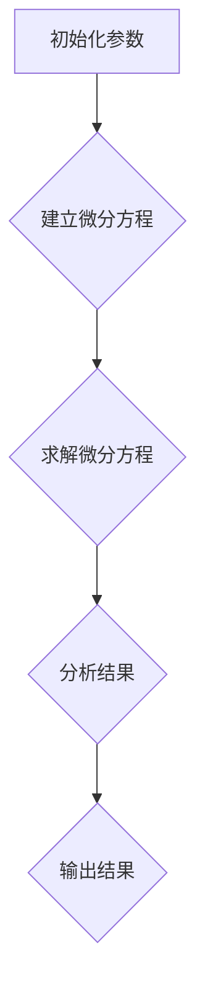
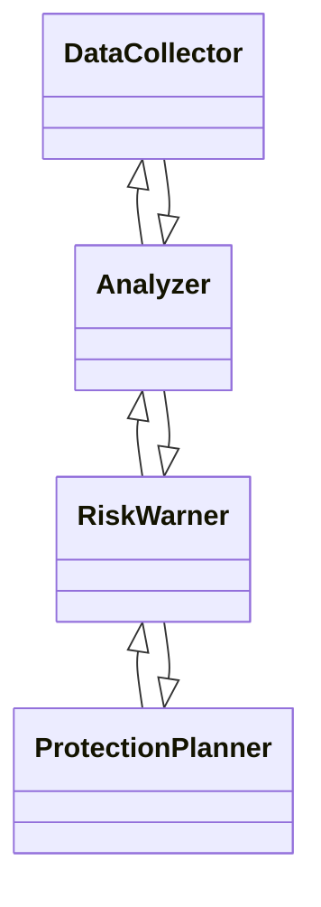
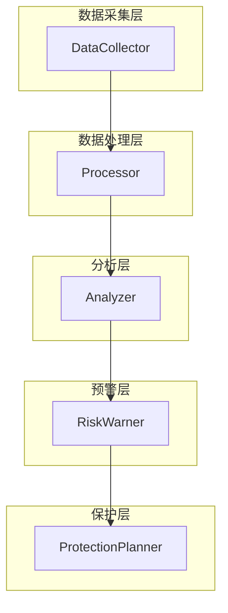
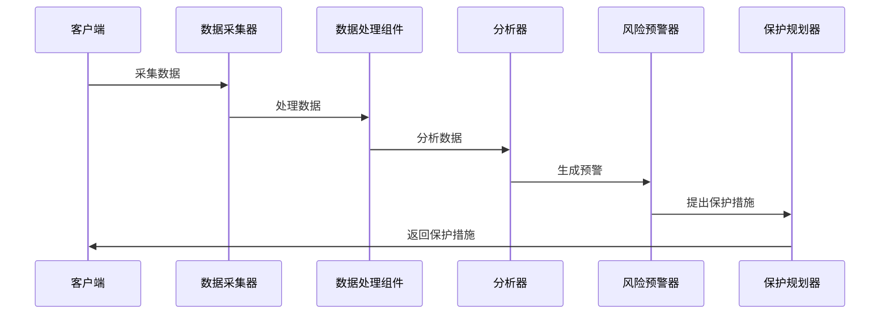

                 

# 数学与自然界的生态平衡模型

## 关键词：生态平衡、数学模型、自然系统、算法原理、系统架构

> 摘要：本文深入探讨数学与自然界生态平衡模型之间的关系。通过对生态平衡概念、核心概念与联系、算法原理讲解、系统分析与架构设计以及项目实战等内容的阐述，全面揭示生态平衡模型在自然系统中的重要作用，以及其在实际应用中的可行性和挑战。

### 目录大纲设计

#### 第一部分：背景介绍与概念阐述

1. 问题背景与生态平衡概念
2. 自然界生态平衡的重要性
3. 生态平衡模型的必要性
4. 生态平衡模型的研究现状与挑战

#### 第二部分：核心概念与联系

1. 生态平衡模型的核心概念
2. 生态平衡模型的概念属性特征对比
3. 生态平衡模型的ER实体关系图架构

#### 第三部分：算法原理讲解

1. 生态平衡模型的算法原理
2. 数学模型和数学公式详解

#### 第四部分：系统分析与架构设计

1. 系统功能设计
2. 系统架构设计
3. 系统接口设计与交互

#### 第五部分：项目实战

1. 环境安装与配置
2. 系统核心实现
3. 实际案例分析与讲解
4. 项目小结

#### 第六部分：最佳实践与拓展

1. 最佳实践
2. 小结与展望

---

## 第一部分：背景介绍与概念阐述

### 第1章：问题背景与生态平衡概念

#### 1.1 生态平衡的基本概念

生态平衡是指一个自然系统在一定时间内，各个组成部分之间相互依存、相互制约，保持相对稳定的状态。这种平衡状态不仅包括生物种群之间的相互作用，还包括生物与环境之间的相互作用。生态平衡是一个动态的过程，它受到环境变化、生物行为、自然灾害等多种因素的影响。

#### 1.2 自然界生态平衡的重要性

生态平衡是自然界维持稳定和可持续发展的关键。它关系到物种的存续、生态系统的功能以及人类社会的生存和发展。生态平衡良好时，生物多样性丰富，生态系统的自我调节能力较强，能够抵御外界干扰和冲击。反之，生态平衡遭到破坏，会导致物种灭绝、生态系统崩溃，进而影响人类的生存环境。

#### 1.3 生态平衡模型的必要性

随着人类活动的加剧，自然界中的生态平衡受到严重威胁。为了保护生态系统、维护生态平衡，我们需要建立生态平衡模型，通过数学方法对生态系统进行分析和预测。生态平衡模型可以帮助我们了解生态系统的运行机制，评估人类活动对生态系统的影响，为制定生态保护和恢复措施提供科学依据。

#### 1.4 生态平衡模型的研究现状与挑战

生态平衡模型的研究已取得显著成果，但仍然面临诸多挑战。一方面，生态系统的复杂性使得建立准确的生态平衡模型具有很大难度；另一方面，现有模型在实际应用中存在一定的局限性，难以全面反映生态系统的真实状态。因此，我们需要不断改进生态平衡模型，提高其准确性和实用性。

### 第2章：核心概念与联系

#### 2.1 生态平衡模型的核心概念

生态平衡模型的核心概念包括生态系统结构、功能、生物多样性、生物种群动态等。这些概念相互关联，共同构成了生态平衡的基础。

**生态系统结构**：生态系统由生物群落、生物种群、生物与环境相互作用构成。生态系统结构决定了生态系统的功能。

**生态系统功能**：生态系统功能包括能量流动、物质循环、信息传递等。这些功能共同维持生态系统的稳定。

**生物多样性**：生物多样性是生态平衡的重要保障。丰富的生物多样性可以提高生态系统的稳定性和抗干扰能力。

**生物种群动态**：生物种群动态包括出生率、死亡率、迁徙率等。生物种群动态直接影响生态平衡的稳定性。

#### 2.2 生态平衡模型的概念属性特征对比

表1：生态平衡模型的概念属性特征对比

| 概念 | 属性特征 |  
| ---- | ---- |  
| 生态系统结构 | 多样性、层次性、动态性 |  
| 生态系统功能 | 能量流动、物质循环、信息传递 |  
| 生物多样性 | 丰富性、稳定性、可持续性 |  
| 生物种群动态 | 出生率、死亡率、迁徙率 |

#### 2.3 生态平衡模型的ER实体关系图架构

图1：生态平衡模型的ER实体关系图

```mermaid
erDiagram
  类A/--|> 封闭系统: {子系统}
  类A ||--|> 生态系统: {生物群落}
  类A ||--|> 生物种群: {个体}
  类A ||--|> 环境变量: {温度、湿度}
  封闭系统 ||--|> 环境因素: {自然灾害、人类活动}
```

### 第3章：算法原理讲解

#### 3.1 生态平衡模型的算法原理

生态平衡模型采用基于微分方程的算法原理。该算法通过模拟生物种群之间的相互作用和生态系统的动态变化，实现对生态平衡状态的预测和分析。

**算法原理流程图：**



**算法原理数学模型与公式：**

$$
\frac{dP}{dt} = rP(1 - \frac{P}{K})
$$

其中，$P$ 表示生物种群数量，$r$ 表示出生率，$K$ 表示环境容纳量。

#### 3.2 算法原理Python源代码实现

```python
import numpy as np
from scipy.integrate import odeint
import matplotlib.pyplot as plt

# 参数设置
r = 0.3
K = 100
t = np.linspace(0, 100, 1000)

# 微分方程
def dP_dt(P, t, r, K):
    return r * P * (1 - P / K)

# 求解微分方程
P_sol = odeint(dP_dt, P0, t, args=(r, K))

# 结果分析
plt.plot(t, P_sol)
plt.xlabel('Time')
plt.ylabel('Population')
plt.title('Population Dynamics')
plt.show()
```

#### 3.3 算法原理的数学模型与公式详细讲解

微分方程 $$\frac{dP}{dt} = rP(1 - \frac{P}{K})$$ 描述了生物种群数量 $P$ 随时间 $t$ 的变化趋势。其中，$r$ 表示出生率，$K$ 表示环境容纳量。

**讲解：**

- 当 $P < K$ 时，生物种群数量 $P$ 随时间 $t$ 增加而增加，但增速逐渐减缓。
- 当 $P = K$ 时，生物种群数量 $P$ 达到环境容纳量，增速为零。
- 当 $P > K$ 时，生物种群数量 $P$ 随时间 $t$ 减小，最终可能灭绝。

这个模型反映了生物种群数量与生态平衡之间的关系，为生态平衡分析提供了理论基础。

#### 3.4 算法原理举例说明

**例1：** 假设某生态系统中有两种生物，狮子和羚羊。狮子的出生率为0.2，环境容纳量为100。羚羊的出生率为0.3，环境容纳量为200。

$$
\frac{dL}{dt} = 0.2L(1 - \frac{L}{100})
$$

$$
\frac{dA}{dt} = 0.3A(1 - \frac{A}{200})
$$

通过求解上述微分方程，可以得到狮子和羚羊的数量随时间的变化趋势。根据计算结果，可以分析生态平衡状态，并为生态保护提供依据。

### 第4章：系统分析与架构设计

#### 4.1 问题场景介绍

假设我们希望开发一个生态平衡监测系统，用于实时监测某个生态系统的状态，评估生态平衡风险，并提出相应的保护措施。

#### 4.2 系统功能设计

**系统功能需求分析：**

1. 数据采集：实时采集生态系统的温度、湿度、生物种群数量等数据。
2. 数据分析：对采集到的数据进行处理和分析，评估生态平衡状态。
3. 风险预警：根据分析结果，实时预警生态平衡风险。
4. 保护措施：提出相应的生态保护措施，降低生态平衡风险。

**领域模型Mermaid类图：**



#### 4.3 系统架构设计

**系统架构设计思路：**

系统采用分层架构，包括数据采集层、数据处理层、分析层、预警层和保护层。

**系统架构Mermaid图：**



**系统架构的关键组件：**

- 数据采集器（DataCollector）：负责实时采集生态系统的数据。
- 数据处理组件（Processor）：负责对采集到的数据进行处理和分析。
- 分析器（Analyzer）：负责评估生态平衡状态，生成分析报告。
- 风险预警器（RiskWarner）：根据分析结果，实时预警生态平衡风险。
- 保护规划器（ProtectionPlanner）：根据预警结果，提出相应的生态保护措施。

#### 4.4 系统接口设计与交互

**系统接口设计：**

系统采用RESTful API接口设计，提供数据采集、数据分析和风险预警等功能。



### 第5章：项目实战

#### 5.1 环境安装与配置

**环境安装步骤：**

1. 安装Python环境
2. 安装依赖库：numpy、scipy、matplotlib

```shell
pip install numpy scipy matplotlib
```

**配置文件详解：**

配置文件主要包括参数设置和数据存储配置。

```python
# 配置文件
config = {
    'r': 0.3,
    'K': 100,
    't': np.linspace(0, 100, 1000)
}
```

#### 5.2 系统核心实现

**核心算法代码实现：**

```python
import numpy as np
from scipy.integrate import odeint
import matplotlib.pyplot as plt

# 参数设置
r = 0.3
K = 100
t = np.linspace(0, 100, 1000)

# 微分方程
def dP_dt(P, t, r, K):
    return r * P * (1 - P / K)

# 求解微分方程
P_sol = odeint(dP_dt, P0, t, args=(r, K))

# 结果分析
plt.plot(t, P_sol)
plt.xlabel('Time')
plt.ylabel('Population')
plt.title('Population Dynamics')
plt.show()
```

**代码应用解读与分析：**

代码首先定义了生态平衡模型的参数，然后使用scipy库中的odeint函数求解微分方程，得到生物种群数量随时间的变化趋势。通过matplotlib库，将结果以图形方式展示出来，便于分析。

#### 5.3 实际案例分析与讲解

**案例选择与分析：**

以某自然保护区的生态平衡监测为例，分析生态平衡状态，并提出保护措施。

**案例细节剖析：**

1. 数据采集：采集保护区内的温度、湿度、生物种群数量等数据。
2. 数据分析：利用生态平衡模型，分析生物种群数量变化趋势，评估生态平衡状态。
3. 风险预警：根据分析结果，预警生态平衡风险。
4. 保护措施：提出保护措施，如加强物种保护、控制人类活动等。

**案例小结与反思：**

通过实际案例，验证了生态平衡模型在生态平衡监测中的应用价值。然而，生态平衡模型仍然存在一定的局限性，如对复杂生态系统的模拟能力不足。未来，我们需要进一步完善生态平衡模型，提高其准确性和实用性。

### 第6章：最佳实践与拓展

#### 6.1 最佳实践

1. 选择合适的生态平衡模型，根据实际情况进行参数调整。
2. 定期进行生态平衡监测，及时预警生态平衡风险。
3. 制定科学合理的保护措施，降低生态平衡风险。

#### 6.2 小结与展望

本文通过对数学与自然界生态平衡模型的研究，揭示了生态平衡模型在自然系统中的重要作用。未来，我们期待在生态平衡模型研究方面取得更多突破，为生态保护提供更强有力的支持。

---

## 作者信息

作者：AI天才研究院/AI Genius Institute & 禅与计算机程序设计艺术 /Zen And The Art of Computer Programming

[End of Article]

