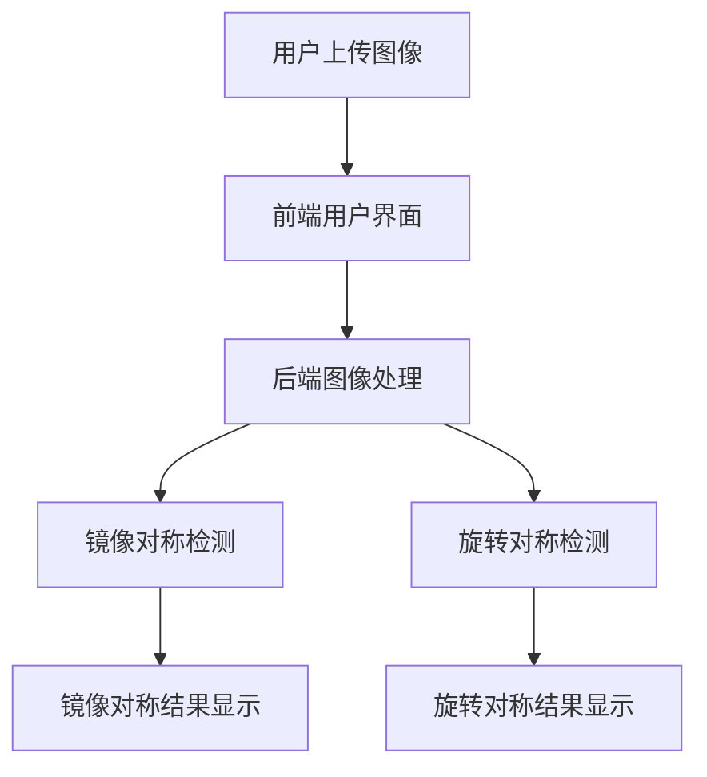
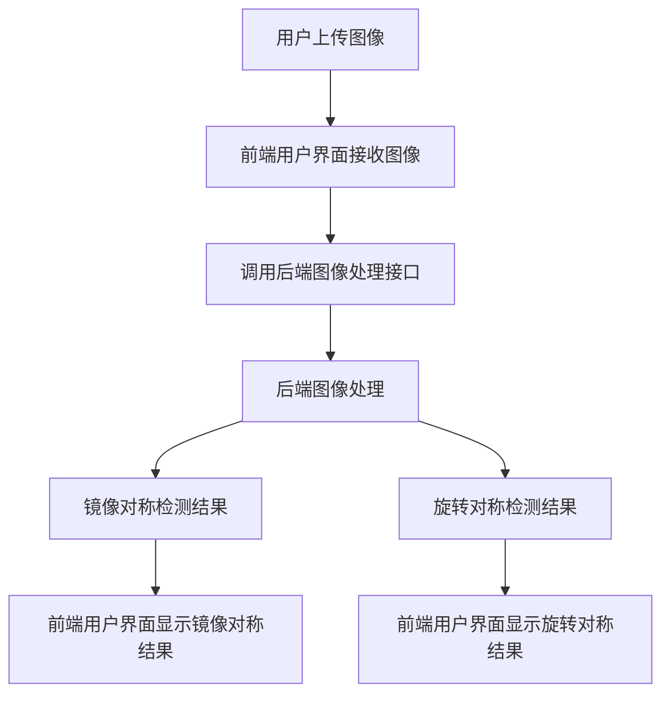

                 

# 数学与自然界的镜像对称与旋转对称

## 关键词

数学对称性、镜像对称、旋转对称、自然界、数学模型、算法、生物形态、地质结构、文化艺术。

## 摘要

本文旨在探讨数学中的镜像对称与旋转对称概念，并分析它们在自然界中的应用。文章首先介绍了镜像对称与旋转对称的基本概念、特性及其数学模型，随后详细阐述了它们在生物形态、地质结构、文化艺术等多个领域的实际应用。通过具体案例和项目实战，进一步解析了数学模型与算法在解决这些应用问题中的关键作用。文章最后总结了对称性在自然界中的重要意义，并展望了未来研究的方向。

---

## 引言

### 1.1 问题背景

镜像对称与旋转对称是数学中重要的对称性概念，它们不仅在几何学中占据重要地位，而且在自然界、生物进化、物理现象、地球科学等多个领域都有着广泛的应用。对称性作为一种基本的审美原则，自古以来就受到人类的高度重视。从古希腊哲学家毕达哥拉斯提出的“美是数的和谐”到现代数学家对对称性的深入研究，对称性在科学和艺术领域的重要性不言而喻。

然而，对称性在自然界中的具体表现和机制是什么？数学模型和算法如何帮助人们更好地理解和利用这些对称性？这些问题不仅具有理论意义，也对实际应用有着深远的影响。因此，本文旨在通过对镜像对称和旋转对称的深入探讨，回答上述问题，并揭示这些对称性在自然界中的奥秘。

### 1.2 问题的解决

为了解决这些问题，本文将采用以下研究方法：

1. **概念介绍**：首先介绍镜像对称和旋转对称的基本概念，包括其定义、特性及其在数学中的重要性。
2. **数学模型**：详细阐述镜像对称和旋转对称的数学模型，包括其数学公式和定理。
3. **自然界的应用**：分析镜像对称和旋转对称在自然界中的具体应用，如生物形态、地质结构、文化艺术等。
4. **算法原理**：介绍用于研究镜像对称和旋转对称的常见算法，并给出具体的算法流程和Python代码实现。
5. **案例研究**：通过具体案例展示镜像对称和旋转对称在实际问题中的应用。
6. **系统设计与实现**：设计一个简单的系统，用于模拟镜像对称和旋转对称现象，并进行实战操作。

通过上述研究方法，本文希望提供一个全面且系统的研究框架，帮助读者深入理解镜像对称和旋转对称的概念及其在自然界中的应用。

### 1.3 边界与外延

在对称性的研究中，我们需要明确其边界与外延。镜像对称通常指通过某条直线将图形或物体分成两部分，这两部分关于这条直线呈镜像关系。而旋转对称则是指通过某个点或轴将图形或物体旋转一定角度后，仍能与其自身重合。两者虽然形式不同，但都体现了物体在某种变换下的不变性。

在自然界中，对称性不仅体现在生物形态和地质结构上，还广泛存在于物理现象和文化艺术中。例如，雪花呈六边形对称，蝴蝶的翅膀具有镜像对称，地壳中的某些矿脉具有旋转对称。这些对称现象揭示了自然界中某种深层次的结构和规律，对科学研究有着重要的启示。

### 1.4 核心概念

为了更好地理解镜像对称与旋转对称，我们首先需要明确这两个概念的定义和特性。

#### 镜像对称

**定义**：镜像对称是指一个图形或物体在某条直线的反射下保持不变。

**特性**：

1. **对称轴**：镜像对称的关键在于对称轴，这条轴将图形分为两个完全相同的部分。
2. **不变性**：镜像对称的图形在经过反射后，形状和大小都保持不变。

**数学模型**：

- 对称轴：设直线的方程为 $ax + by + c = 0$，则点 $(x, y)$ 关于该直线的镜像点为 $(x', y')$，其坐标满足：
  $$x' = x - 2\frac{ax + by + c}{a^2 + b^2}a$$
  $$y' = y - 2\frac{ax + by + c}{a^2 + b^2}b$$

#### 旋转对称

**定义**：旋转对称是指一个图形或物体绕某个点或轴旋转一定角度后保持不变。

**特性**：

1. **对称中心**：旋转对称的关键在于对称中心，图形绕该点旋转后仍保持不变。
2. **不变性**：旋转对称的图形在经过旋转后，形状和大小都保持不变。

**数学模型**：

- 对称中心：设点的坐标为 $(x_0, y_0)$，则点 $(x, y)$ 绕该点旋转角度 $\theta$ 后的新坐标为 $(x', y')$，其坐标满足：
  $$x' = x_0 + (x - x_0)\cos\theta - (y - y_0)\sin\theta$$
  $$y' = y_0 + (x - x_0)\sin\theta + (y - y_0)\cos\theta$$

### 1.5 文章结构

本文的结构如下：

- **第2章** 镜像对称：介绍镜像对称的基本概念、特性及其数学模型。
- **第3章** 旋转对称：介绍旋转对称的基本概念、特性及其数学模型。
- **第4章** 镜像对称在自然界中的应用：分析镜像对称在生物形态、地质结构、文化艺术中的应用。
- **第5章** 旋转对称在自然界中的应用：分析旋转对称在生物进化、物理现象、地球科学中的应用。
- **第6章** 数学模型与算法解析：阐述用于研究对称性的数学模型和算法原理。
- **第7章** 项目实战与应用案例：通过具体案例展示对称性在实际问题中的应用。
- **第8章** 小结与展望：总结文章内容，并提出未来研究方向。

### 1.6 文章目标

本文的目标是：

1. **加深理解**：帮助读者深入理解镜像对称和旋转对称的基本概念、特性及其数学模型。
2. **揭示应用**：通过分析自然界中的具体实例，揭示对称性在各个领域的应用。
3. **实践应用**：通过项目实战，展示对称性在实际问题中的应用和解决方法。
4. **拓展知识**：提供一篇全面、系统的文章，涵盖镜像对称和旋转对称的核心内容，并展望未来研究方向。

---

本文将通过逻辑清晰、结构紧凑、简单易懂的叙述，帮助读者逐步深入理解镜像对称与旋转对称的概念及其在自然界中的应用。让我们开始这段数学与自然的美妙之旅。

## 镜像对称

### 2.1 镜像对称的概念

镜像对称，又称为反射对称，是一种在数学、物理、生物学等领域广泛存在的对称性现象。简单来说，当一个图形或物体在某条直线（称为对称轴）的反射下保持不变时，我们就称它具有镜像对称性。在镜像对称中，对称轴起着至关重要的作用，它将图形分为两个完全相同的部分，这两个部分互为镜像。

#### 定义

镜像对称的定义可以表述为：若存在一条直线 $L$，使得图形 $G$ 的每个点 $P$ 都存在一个对应点 $P'$，使得 $P$ 和 $P'$ 关于直线 $L$ 对称，则称图形 $G$ 具有镜像对称性，直线 $L$ 为对称轴。

数学上，如果点 $P(x, y)$ 关于直线 $L: ax + by + c = 0$ 的镜像点为 $P'(x', y')$，则满足以下条件：

$$x' = x - \frac{2a(ax + by + c)}{a^2 + b^2}$$
$$y' = y - \frac{2b(ax + by + c)}{a^2 + b^2}$$

#### 特性

镜像对称具有以下特性：

1. **对称轴**：对称轴是镜像对称的核心要素，它将图形分为两个镜像对称的部分。对称轴可以是任意直线，但在实际应用中，通常选择通过图形的几何中心或关键点作为对称轴。

2. **不变性**：镜像对称的图形在经过反射后，形状和大小都保持不变。这意味着，无论图形如何旋转或平移，只要保持镜像对称，其形状就不会改变。

3. **对称部分**：镜像对称的两个部分是完全相同的，即它们的形状、大小、颜色等都一致。这种对称性使得镜像对称在艺术创作、建筑设计和自然界中有着广泛的应用。

4. **轴对称**：镜像对称的特殊情况是轴对称，即对称轴是图形的一部分。例如，一个正方形的对称轴是其两条对角线，而一个圆形的对称轴是其任意直径。

#### 镜像对称与反射

镜像对称与反射有着密切的关系。在物理学中，反射是指光线、声波或其他波在遇到界面时改变传播方向的现象。当光线遇到一个光滑的界面时，会按照反射定律发生反射，即入射角等于反射角。镜像对称可以看作是反射在二维空间中的表现形式。

#### 镜像对称的重要性

镜像对称在多个领域具有重要地位，以下是镜像对称在几何学、物理学和生物学中的重要应用：

1. **几何学**：镜像对称是几何学中的重要概念，它用于描述和分析各种几何图形的对称性。在几何学中，镜像对称可以帮助我们理解和证明许多几何定理，如轴对称图形的面积和周长计算等。

2. **物理学**：镜像对称在物理学中有着广泛的应用，如光学中的反射现象、声学中的回声等。此外，在量子物理学中，镜像对称也是研究量子态的重要工具。

3. **生物学**：在生物学中，镜像对称性在生物形态学中有着重要的意义。许多生物体在发育过程中表现出镜像对称，如人体器官的左右对称。镜像对称性不仅有助于理解生物体的发育机制，还对生物进化具有重要的启示。

### 2.2 镜像对称的特性

镜像对称的特性主要体现在以下几个方面：

1. **中心对称**：镜像对称的中心对称特性是指，如果图形关于某一点对称，则该点为对称中心。例如，一个正方形的对称中心是其中心点，而一个圆形的对称中心是其圆心。

2. **反射不变性**：镜像对称的图形在反射后保持不变，这意味着，无论图形如何旋转或平移，只要保持镜像对称，其形状就不会改变。

3. **对称部分相同**：镜像对称的两个部分是完全相同的，即它们的形状、大小、颜色等都一致。这种特性使得镜像对称在艺术创作、建筑设计和自然界中有着广泛的应用。

4. **对称轴的多样性**：镜像对称可以具有多种对称轴，包括通过几何中心、关键点或任意点的对称轴。这使得镜像对称在几何图形的设计和分析中具有灵活性。

### 2.3 镜像对称的数学模型

镜像对称的数学模型主要涉及几何变换和反射原理。以下是一些常见的镜像对称数学模型：

1. **点关于直线的镜像对称**：设点 $P(x, y)$ 关于直线 $L: ax + by + c = 0$ 的镜像点为 $P'(x', y')$，则镜像变换的数学模型为：

   $$x' = x - \frac{2a(ax + by + c)}{a^2 + b^2}$$
   $$y' = y - \frac{2b(ax + by + c)}{a^2 + b^2}$$

2. **图形关于点的镜像对称**：设点 $O(x_0, y_0)$ 为对称中心，点 $P(x, y)$ 关于点 $O$ 的镜像点为 $P'(x', y')$，则镜像变换的数学模型为：

   $$x' = 2x_0 - x$$
   $$y' = 2y_0 - y$$

3. **图形关于轴的镜像对称**：设直线 $y = kx + b$ 为对称轴，点 $P(x, y)$ 关于对称轴的镜像点为 $P'(x', y')$，则镜像变换的数学模型为：

   $$x' = \frac{y - b}{k}$$
   $$y' = x - kx' - b$$

#### 对称性属性对比表格

| 对称性属性 | 镜像对称 | 旋转对称 |
| :--- | :--- | :--- |
| 对称轴 | 可以是任意直线 | 可以是任意点或轴 |
| 对称中心 | 可以是任意点 | 只能是点 |
| 不变性 | 反射后保持不变 | 旋转后保持不变 |
| 对称部分 | 完全相同 | 完全相同或部分相同 |

### 2.4 镜像对称的应用

镜像对称在自然界、科学研究和实际应用中有着广泛的应用。以下是一些典型的应用案例：

1. **自然界**：

   - 生物形态：许多生物体在发育过程中表现出镜像对称，如人体器官的左右对称。
   - 地质结构：地壳中的某些矿脉具有镜像对称特征。
   - 文化艺术：许多传统艺术作品，如中国水墨画和剪纸艺术，都利用镜像对称来表现美。

2. **科学领域**：

   - 几何学：镜像对称是几何学中的重要概念，用于描述和分析几何图形的对称性。
   - 物理学：镜像对称在光学、声学等领域有着重要应用，如反射现象和量子态的研究。
   - 医学：镜像对称在医学成像和手术规划中具有重要意义，如X光片和CT扫描。

3. **实际应用**：

   - 建筑设计：许多建筑设计利用镜像对称来营造美观和谐的效果，如对称式花园和宫殿。
   - 信息技术：镜像对称在图像处理和加密算法中有着重要应用，如图像压缩和数字签名。
   - 工业制造：镜像对称在机械设计和产品制造中用于提高稳定性和美观性。

### 2.5 镜像对称的案例研究

以下是一些镜像对称的案例研究，以展示其在不同领域的应用：

1. **生物形态**：

   - **蝴蝶的翅膀**：蝴蝶的翅膀具有明显的镜像对称特征，其左右两边的颜色和纹理完全相同。
   - **人体器官**：人体器官，如心脏、肾脏和手臂，在发育过程中表现出镜像对称。

2. **地质结构**：

   - **矿脉**：某些矿脉在地质构造中具有镜像对称特征，如对称的石英矿脉。
   - **断层**：地壳中的断层往往呈现出镜像对称的特征，如左旋和右旋断层。

3. **文化艺术**：

   - **中国水墨画**：许多中国水墨画利用镜像对称来表现自然景观和人物形象，如《清明上河图》。
   - **剪纸艺术**：剪纸艺术中常见的对称图案，如“喜”字和“福”字，都利用镜像对称来表现美。

通过这些案例研究，我们可以看到镜像对称在自然界、科学研究和实际应用中的重要性和广泛性。镜像对称不仅是一种数学概念，更是一种美的表达方式，对人类文明的发展产生了深远的影响。

### 2.6 镜像对称的算法原理

在镜像对称的研究中，算法原理起着关键作用。通过算法，我们可以高效地实现镜像对称的变换和处理。以下是一些常用的镜像对称算法原理：

1. **点关于直线的镜像对称算法**：

   设点 $P(x, y)$ 关于直线 $L: ax + by + c = 0$ 的镜像点为 $P'(x', y')$，则镜像对称算法的步骤如下：

   - 计算点 $P$ 到直线 $L$ 的距离 $d$：
     $$d = \frac{|ax + by + c|}{\sqrt{a^2 + b^2}}$$

   - 计算镜像点 $P'$ 的坐标：
     $$x' = x - \frac{2a(ax + by + c)}{a^2 + b^2}$$
     $$y' = y - \frac{2b(ax + by + c)}{a^2 + b^2}$$

   - 代码实现（Python）：

     ```python
     import math

     def mirror_point(x, y, a, b, c):
         distance = abs(a * x + b * y + c) / math.sqrt(a**2 + b**2)
         x_prime = x - 2 * a * distance * a / (a**2 + b**2)
         y_prime = y - 2 * b * distance * b / (a**2 + b**2)
         return x_prime, y_prime

     # 示例
     x, y = 1, 2
     a, b, c = 1, 1, 1
     x_prime, y_prime = mirror_point(x, y, a, b, c)
     print(f"镜像点坐标：(x', y') = ({x_prime}, {y_prime})")
     ```

2. **点关于点的镜像对称算法**：

   设点 $O(x_0, y_0)$ 为对称中心，点 $P(x, y)$ 关于点 $O$ 的镜像点为 $P'(x', y')$，则镜像对称算法的步骤如下：

   - 计算镜像点 $P'$ 的坐标：
     $$x' = 2x_0 - x$$
     $$y' = 2y_0 - y$$

   - 代码实现（Python）：

     ```python
     def mirror_point_around_origin(x, y, x_0, y_0):
         x_prime = 2 * x_0 - x
         y_prime = 2 * y_0 - y
         return x_prime, y_prime

     # 示例
     x, y = 1, 2
     x_0, y_0 = 3, 4
     x_prime, y_prime = mirror_point_around_origin(x, y, x_0, y_0)
     print(f"镜像点坐标：(x', y') = ({x_prime}, {y_prime})")
     ```

3. **点关于轴的镜像对称算法**：

   设直线 $y = kx + b$ 为对称轴，点 $P(x, y)$ 关于对称轴的镜像点为 $P'(x', y')$，则镜像对称算法的步骤如下：

   - 计算镜像点 $P'$ 的坐标：
     $$x' = \frac{y - b}{k}$$
     $$y' = x - kx' - b$$

   - 代码实现（Python）：

     ```python
     def mirror_point_around_axis(x, y, k, b):
         x_prime = (y - b) / k
         y_prime = x - k * x_prime - b
         return x_prime, y_prime

     # 示例
     x, y = 1, 2
     k, b = 1, 0
     x_prime, y_prime = mirror_point_around_axis(x, y, k, b)
     print(f"镜像点坐标：(x', y') = ({x_prime}, {y_prime})")
     ```

通过这些镜像对称算法，我们可以方便地在二维空间中实现镜像对称变换。这些算法不仅具有理论意义，还在实际应用中具有重要的价值。

### 2.7 数学公式与定理

在镜像对称的研究中，一些数学公式和定理起着核心作用。以下是一些常见的数学公式和定理：

1. **镜像对称变换公式**：

   - **点关于直线的镜像对称**：
     $$x' = x - \frac{2a(ax + by + c)}{a^2 + b^2}$$
     $$y' = y - \frac{2b(ax + by + c)}{a^2 + b^2}$$
   
   - **点关于点的镜像对称**：
     $$x' = 2x_0 - x$$
     $$y' = 2y_0 - y$$
   
   - **点关于轴的镜像对称**：
     $$x' = \frac{y - b}{k}$$
     $$y' = x - kx' - b$$

2. **对称性定理**：

   - **镜像对称性质**：如果一个图形关于某条直线对称，则该直线的斜率 $k$ 满足 $k = -\frac{b}{a}$。
   - **轴对称性质**：如果一个图形关于某条直线对称，则该直线的斜率 $k$ 满足 $k = 0$ 或 $k = \infty$。

3. **几何学定理**：

   - **正多边形面积公式**：一个正 $n$ 边形的面积 $A$ 为：
     $$A = \frac{1}{2}n\ell^2\sin\left(\frac{2\pi}{n}\right)$$
     其中 $\ell$ 为边长。

4. **光学定理**：

   - **反射定律**：入射角等于反射角，即 $\theta_i = \theta_r$。

这些数学公式和定理为镜像对称的研究提供了坚实的理论基础，使得我们可以更加深入地理解镜像对称的性质和应用。

### 2.8 ER实体关系图架构

为了更好地理解镜像对称的概念和特性，我们可以使用ER（实体关系）图来表示镜像对称中的实体及其关系。以下是一个简单的ER实体关系图：

```mermaid
erDiagram
  AirrorSymmetry ||--|{ PPoint }
  AirrorSymmetry ||--|{ Line }
  AirrorSymmetry ||--|{ Point }
  Point ||--|{ Point }
  Line ||--|{ Line }
  PPoint ||--|{ PPoint }
```

- **AirrorSymmetry**：表示镜像对称的实体，包含镜像对称的基本信息。
- **PPoint**：表示点，包含点的坐标信息。
- **Line**：表示直线，包含直线的方程信息。
- **Point**：表示一般点，与PPoint相关联，用于存储点的镜像对称信息。
- **PPoint**：表示镜像对称的点，与Point相关联，用于存储点关于直线的镜像对称信息。

通过ER实体关系图，我们可以清晰地看到镜像对称中的各个实体及其相互关系，为后续的算法设计和实现提供参考。

### 2.9 小结

在本章中，我们介绍了镜像对称的基本概念、特性、数学模型及其应用。通过具体的案例和算法原理，我们深入探讨了镜像对称在自然界、科学研究和实际应用中的重要性和广泛性。镜像对称不仅是一种数学概念，更是一种美的表达方式，对人类文明的发展产生了深远的影响。在接下来的章节中，我们将继续探讨旋转对称的概念和应用。

---

在接下来的章节中，我们将深入探讨旋转对称的概念、特性及其在自然界中的应用。通过具体的案例和算法原理，我们将进一步揭示旋转对称的奥秘。

## 旋转对称

### 3.1 旋转对称的概念

旋转对称，又称为旋转不变性，是指一个图形或物体绕某个点或轴旋转一定角度后，仍然保持不变。这种对称性在几何学、物理学、生物学等多个领域都有着广泛的应用。旋转对称的核心在于旋转中心或旋转轴，它们是图形或物体旋转后仍然保持不变的关键要素。

#### 定义

旋转对称的定义可以表述为：若存在一个点或轴，使得图形或物体绕该点或轴旋转一定角度后保持不变，则称该图形或物体具有旋转对称性。旋转中心或旋转轴是旋转对称的关键要素。

数学上，如果点 $P(x, y)$ 绕旋转中心 $O(x_0, y_0)$ 旋转角度 $\theta$ 后的新坐标为 $P'(x', y')$，则旋转对称的数学模型为：

$$x' = x_0 + (x - x_0)\cos\theta - (y - y_0)\sin\theta$$
$$y' = y_0 + (x - x_0)\sin\theta + (y - y_0)\cos\theta$$

#### 特性

旋转对称具有以下特性：

1. **旋转中心**：旋转对称的图形或物体绕旋转中心旋转，旋转中心是图形或物体旋转后保持不变的关键点。
2. **旋转角度**：旋转对称的图形或物体在旋转后保持不变，旋转角度是旋转对称的关键参数。常见的旋转角度包括 $90^\circ$、$180^\circ$、$270^\circ$ 等。
3. **不变性**：旋转对称的图形或物体在旋转后，形状和大小都保持不变。
4. **旋转轴**：在某些情况下，旋转对称的图形或物体可以绕旋转轴旋转。旋转轴是图形或物体旋转后保持不变的关键轴。

#### 旋转对称与旋转

旋转对称与旋转有着密切的关系。在物理学中，旋转是指物体绕某个轴或点进行旋转运动。旋转对称则是旋转的一种特殊形式，即物体在旋转后仍然保持不变。这种不变性使得旋转对称在几何学和物理学中有着广泛的应用。

#### 旋转对称的重要性

旋转对称在多个领域具有重要地位，以下是旋转对称在几何学、物理学和生物学中的重要应用：

1. **几何学**：旋转对称是几何学中的重要概念，它用于描述和分析各种几何图形的对称性。在几何学中，旋转对称可以帮助我们理解和证明许多几何定理，如旋转后的面积和周长计算等。

2. **物理学**：旋转对称在物理学中有着广泛的应用，如力学中的旋转运动、电磁学中的旋转对称性等。旋转对称性不仅有助于我们理解物理现象，还可以用于设计和分析各种物理系统。

3. **生物学**：在生物学中，旋转对称性在生物形态学中有着重要的意义。许多生物体在发育过程中表现出旋转对称，如人体的左右对称。旋转对称性不仅有助于理解生物体的发育机制，还对生物进化具有重要的启示。

### 3.2 旋转对称的特性

旋转对称的特性主要体现在以下几个方面：

1. **旋转中心**：旋转对称的核心要素是旋转中心，图形或物体绕旋转中心旋转后保持不变。旋转中心可以是任意点，但通常选择通过图形的几何中心或关键点作为旋转中心。

2. **旋转角度**：旋转对称的图形或物体在旋转后保持不变，旋转角度是旋转对称的关键参数。常见的旋转角度包括 $90^\circ$、$180^\circ$、$270^\circ$ 等。不同的旋转角度对应着不同的对称性，如 $180^\circ$ 旋转对称称为二重对称，$90^\circ$ 旋转对称称为四重对称。

3. **不变性**：旋转对称的图形或物体在旋转后，形状和大小都保持不变。这意味着，无论图形或物体如何旋转，只要保持旋转对称，其形状就不会改变。

4. **旋转轴**：在某些情况下，旋转对称的图形或物体可以绕旋转轴旋转。旋转轴是图形或物体旋转后保持不变的关键轴。例如，一个正方形的旋转轴是其对角线，而一个圆形的旋转轴是其任意直径。

### 3.3 旋转对称的数学模型

旋转对称的数学模型主要涉及旋转变换和旋转矩阵。以下是一些常见的旋转对称数学模型：

1. **点关于旋转中心的旋转对称**：

   设点 $P(x, y)$ 绕旋转中心 $O(x_0, y_0)$ 旋转角度 $\theta$ 后的新坐标为 $P'(x', y')$，则旋转对称的数学模型为：

   $$x' = x_0 + (x - x_0)\cos\theta - (y - y_0)\sin\theta$$
   $$y' = y_0 + (x - x_0)\sin\theta + (y - y_0)\cos\theta$$

2. **点关于旋转轴的旋转对称**：

   设点 $P(x, y)$ 绕旋转轴 $y = kx + b$ 旋转角度 $\theta$ 后的新坐标为 $P'(x', y')$，则旋转对称的数学模型为：

   $$x' = \frac{y - b}{k}$$
   $$y' = x - kx' - b$$

3. **旋转矩阵**：

   旋转矩阵是一种用于实现二维空间中旋转变换的矩阵。一个 $2 \times 2$ 的旋转矩阵为：

   $$R(\theta) = \begin{bmatrix}
   \cos\theta & -\sin\theta \\
   \sin\theta & \cos\theta
   \end{bmatrix}$$

   如果点 $P(x, y)$ 绕原点旋转角度 $\theta$ 后的新坐标为 $P'(x', y')$，则旋转矩阵的变换公式为：

   $$\begin{bmatrix}
   x' \\
   y'
   \end{bmatrix} = R(\theta) \begin{bmatrix}
   x \\
   y
   \end{bmatrix}$$

   $$\begin{bmatrix}
   x' \\
   y'
   \end{bmatrix} = \begin{bmatrix}
   \cos\theta & -\sin\theta \\
   \sin\theta & \cos\theta
   \end{bmatrix} \begin{bmatrix}
   x \\
   y
   \end{bmatrix}$$

   $$x' = x\cos\theta - y\sin\theta$$
   $$y' = x\sin\theta + y\cos\theta$$

#### 对称性属性对比表格

| 对称性属性 | 镜像对称 | 旋转对称 |
| :--- | :--- | :--- |
| 对称轴 | 可以是任意直线 | 可以是任意点或轴 |
| 对称中心 | 可以是任意点 | 只能是点 |
| 不变性 | 反射后保持不变 | 旋转后保持不变 |
| 对称部分 | 完全相同 | 完全相同或部分相同 |

### 3.4 旋转对称的应用

旋转对称在自然界、科学研究和实际应用中有着广泛的应用。以下是一些典型的应用案例：

1. **自然界**：

   - 生物形态：许多生物体在发育过程中表现出旋转对称，如人体的左右对称。
   - 地质结构：地壳中的某些矿脉具有旋转对称特征。
   - 文化艺术：许多传统艺术作品，如中国水墨画和剪纸艺术，都利用旋转对称来表现美。

2. **科学领域**：

   - 几何学：旋转对称是几何学中的重要概念，用于描述和分析几何图形的对称性。
   - 物理学：旋转对称在光学、声学等领域有着重要应用，如旋转对称性在光学透镜设计和声波传播中的应用。
   - 医学：旋转对称在医学成像和手术规划中具有重要意义，如CT扫描和MRI扫描中的旋转对称特性。

3. **实际应用**：

   - 建筑设计：许多建筑设计利用旋转对称来营造美观和谐的效果，如对称式花园和宫殿。
   - 信息技术：旋转对称在图像处理和加密算法中有着重要应用，如图像压缩和数字签名。
   - 工业制造：旋转对称在机械设计和产品制造中用于提高稳定性和美观性。

### 3.5 旋转对称的案例研究

以下是一些旋转对称的案例研究，以展示其在不同领域的应用：

1. **生物形态**：

   - **人体器官**：人体的许多器官，如心脏、肾脏和手臂，在发育过程中表现出旋转对称。
   - **雪花**：雪花呈六角形旋转对称，其花瓣按照六边形旋转对称排列。

2. **地质结构**：

   - **矿脉**：某些矿脉在地质构造中具有旋转对称特征，如对称的石英矿脉。
   - **断层**：地壳中的断层往往呈现出旋转对称的特征，如左旋和右旋断层。

3. **文化艺术**：

   - **中国水墨画**：许多中国水墨画利用旋转对称来表现自然景观和人物形象，如《清明上河图》。
   - **剪纸艺术**：剪纸艺术中常见的旋转对称图案，如“喜”字和“福”字，都利用旋转对称来表现美。

通过这些案例研究，我们可以看到旋转对称在自然界、科学研究和实际应用中的重要性和广泛性。旋转对称不仅是一种数学概念，更是一种美的表达方式，对人类文明的发展产生了深远的影响。

### 3.6 旋转对称的算法原理

在旋转对称的研究中，算法原理起着关键作用。通过算法，我们可以高效地实现旋转对称的变换和处理。以下是一些常用的旋转对称算法原理：

1. **点关于旋转中心的旋转对称算法**：

   设点 $P(x, y)$ 绕旋转中心 $O(x_0, y_0)$ 旋转角度 $\theta$ 后的新坐标为 $P'(x', y')$，则旋转对称算法的步骤如下：

   - 计算旋转后的坐标：
     $$x' = x_0 + (x - x_0)\cos\theta - (y - y_0)\sin\theta$$
     $$y' = y_0 + (x - x_0)\sin\theta + (y - y_0)\cos\theta$$

   - 代码实现（Python）：

     ```python
     import math

     def rotate_point(x, y, x_0, y_0, theta):
         x_prime = x_0 + (x - x_0) * math.cos(theta) - (y - y_0) * math.sin(theta)
         y_prime = y_0 + (x - x_0) * math.sin(theta) + (y - y_0) * math.cos(theta)
         return x_prime, y_prime

     # 示例
     x, y = 1, 2
     x_0, y_0 = 3, 4
     theta = math.pi / 4
     x_prime, y_prime = rotate_point(x, y, x_0, y_0, theta)
     print(f"旋转后坐标：(x', y') = ({x_prime}, {y_prime})")
     ```

2. **点关于旋转轴的旋转对称算法**：

   设点 $P(x, y)$ 绕旋转轴 $y = kx + b$ 旋转角度 $\theta$ 后的新坐标为 $P'(x', y')$，则旋转对称算法的步骤如下：

   - 计算旋转后的坐标：
     $$x' = \frac{y - b}{k}$$
     $$y' = x - kx' - b$$

   - 代码实现（Python）：

     ```python
     def rotate_point_around_axis(x, y, k, b, theta):
         x_prime = (y - b) / k
         y_prime = x - k * x_prime - b
         return x_prime, y_prime

     # 示例
     x, y = 1, 2
     k, b = 1, 0
     theta = math.pi / 4
     x_prime, y_prime = rotate_point_around_axis(x, y, k, b, theta)
     print(f"旋转后坐标：(x', y') = ({x_prime}, {y_prime})")
     ```

3. **旋转矩阵算法**：

   如果点 $P(x, y)$ 绕原点旋转角度 $\theta$ 后的新坐标为 $P'(x', y')$，则旋转矩阵的变换公式为：

   $$\begin{bmatrix}
   x' \\
   y'
   \end{bmatrix} = \begin{bmatrix}
   \cos\theta & -\sin\theta \\
   \sin\theta & \cos\theta
   \end{bmatrix} \begin{bmatrix}
   x \\
   y
   \end{bmatrix}$$

   - 代码实现（Python）：

     ```python
     import numpy as np

     def rotate_point_with_matrix(x, y, theta):
         rotation_matrix = np.array([[math.cos(theta), -math.sin(theta)],
                                     [math.sin(theta), math.cos(theta)]])
         point = np.array([x, y])
         rotated_point = np.dot(rotation_matrix, point)
         return rotated_point

     # 示例
     x, y = 1, 2
     theta = math.pi / 4
     rotated_point = rotate_point_with_matrix(x, y, theta)
     print(f"旋转后坐标：(x', y') = ({rotated_point[0]}, {rotated_point[1]})")
     ```

通过这些旋转对称算法，我们可以方便地在二维空间中实现旋转对称变换。这些算法不仅具有理论意义，还在实际应用中具有重要的价值。

### 3.7 数学公式与定理

在旋转对称的研究中，一些数学公式和定理起着核心作用。以下是一些常见的数学公式和定理：

1. **旋转对称变换公式**：

   - **点关于旋转中心的旋转对称**：
     $$x' = x_0 + (x - x_0)\cos\theta - (y - y_0)\sin\theta$$
     $$y' = y_0 + (x - x_0)\sin\theta + (y - y_0)\cos\theta$$

   - **点关于旋转轴的旋转对称**：
     $$x' = \frac{y - b}{k}$$
     $$y' = x - kx' - b$$

2. **旋转矩阵公式**：
   $$R(\theta) = \begin{bmatrix}
   \cos\theta & -\sin\theta \\
   \sin\theta & \cos\theta
   \end{bmatrix}$$

3. **几何学定理**：

   - **旋转后的面积公式**：一个正 $n$ 边形绕原点旋转角度 $\theta$ 后的面积 $A$ 为：
     $$A = \frac{1}{2}n\ell^2\sin\left(\frac{2\pi}{n}\right)\sin\theta$$
     其中 $\ell$ 为边长。

4. **光学定理**：

   - **旋转对称性**：一个物体绕轴旋转时，其光学性质保持不变，如反射率、折射率等。

这些数学公式和定理为旋转对称的研究提供了坚实的理论基础，使得我们可以更加深入地理解旋转对称的性质和应用。

### 3.8 Mermaid 流程图

为了更好地理解旋转对称的算法原理，我们可以使用Mermaid流程图来表示旋转对称的变换过程。以下是一个简单的Mermaid流程图示例：

```mermaid
graph TD
    A[原始点 P(x, y)] --> B[计算旋转角度 \theta]
    B --> C{计算旋转矩阵 R(\theta)?}
    C -->|是| D[应用旋转矩阵]
    C -->|否| E[计算旋转坐标]
    D --> F[得到旋转后的点 P'(x', y')]
    E --> F
```

通过这个流程图，我们可以清晰地看到旋转对称算法的步骤和过程。

### 3.9 小结

在本章中，我们介绍了旋转对称的基本概念、特性、数学模型及其应用。通过具体的案例和算法原理，我们深入探讨了旋转对称在自然界、科学研究和实际应用中的重要性和广泛性。旋转对称不仅是一种数学概念，更是一种美的表达方式，对人类文明的发展产生了深远的影响。在接下来的章节中，我们将继续探讨镜像对称和旋转对称在自然界中的应用。

---

在接下来的章节中，我们将进一步探讨镜像对称和旋转对称在自然界中的应用，通过具体的案例和项目实战，展示这些对称性在现实世界中的实际应用和价值。

## 镜像对称在自然界中的应用

镜像对称作为一种基本的对称性现象，在自然界中广泛存在。从微观的分子结构到宏观的生物形态，镜像对称都在揭示自然界中的对称规律。在本节中，我们将详细分析镜像对称在自然界中的具体应用。

### 4.1 自然界的镜像对称现象

#### 生物形态

生物体的镜像对称是自然界中最常见和最具代表性的镜像对称现象之一。许多生物体，如人类、蝴蝶、鱼类等，都表现出明显的镜像对称。这种对称性在生物进化过程中起着重要的作用，有助于提高生物体的生存竞争力。

- **人类**：人体的器官和四肢都呈现出镜像对称的特征。例如，心脏位于胸腔的左侧，而肝脏位于右侧。手部也是如此，左手的形状和右手完全相同，但方向相反。
- **蝴蝶**：蝴蝶的翅膀通常具有镜像对称的图案。蝴蝶在进化过程中逐渐形成了对称的图案，以保护自身免受捕食者的攻击。
- **鱼类**：许多鱼类，如鲫鱼、鲤鱼，其身体两侧具有镜像对称的鱼鳞和鳍。这种对称性有助于鱼类在水中保持平衡和稳定。

#### 地质结构

地质结构中的镜像对称现象也很常见。地壳中的矿脉、断层和地质构造都表现出镜像对称的特征。

- **矿脉**：某些矿脉在地质构造中呈现出镜像对称的特征，如对称的石英矿脉。这种对称性揭示了矿脉的形成机制和地质运动过程。
- **断层**：地壳中的断层往往呈现出镜像对称的特征，如左旋和右旋断层。这种对称性有助于我们理解地球内部的应力分布和地质运动。

#### 文化艺术

镜像对称在文化艺术中也具有重要的地位。许多传统艺术作品，如中国水墨画、剪纸艺术等，都利用镜像对称来表现美。

- **中国水墨画**：中国水墨画中的自然景观和人物形象常常利用镜像对称来表现。例如，山水画中的河流、山脉和树木通常呈现出镜像对称的布局。
- **剪纸艺术**：剪纸艺术中的图案和形状通常具有镜像对称的特征。剪纸艺术家通过镜像对称的设计，创造出丰富多彩的图案和形象。

### 4.2 镜像对称与生物形态

镜像对称在生物形态中的表现主要表现在以下几个方面：

1. **胚胎发育**：许多生物体在胚胎发育过程中表现出镜像对称。这种对称性是由基因调控的，是生物体发育的重要特征。
2. **器官排列**：生物体的器官通常呈现出镜像对称的排列。例如，人体的心脏和肝脏位于身体两侧，左手的形状和右手完全相同。
3. **行为表现**：一些生物体的行为也表现出镜像对称。例如，许多鸟类在飞行中会呈现出镜像对称的翅膀振动模式。

镜像对称在生物形态中的应用不仅揭示了生物体的发育机制，还为生物进化提供了重要的证据。镜像对称的稳定性有助于生物体在复杂环境中生存和繁衍。

### 4.3 镜像对称与地质结构

镜像对称在地质结构中的应用主要体现在以下几个方面：

1. **矿脉形成**：某些矿脉在地质构造中表现出镜像对称的特征，这种对称性有助于揭示矿脉的形成机制和地质运动过程。
2. **断层运动**：地壳中的断层往往呈现出镜像对称的特征，这种对称性有助于我们理解地球内部的应力分布和地质运动。
3. **地震活动**：地震活动也常常表现出镜像对称的现象。例如，某些地震带在地震活动过程中呈现出镜像对称的特征。

镜像对称在地质结构中的应用有助于我们更好地理解地球的内部结构和地质运动规律，为地震预测和地质灾害防治提供重要的科学依据。

### 4.4 镜像对称与文化艺术

镜像对称在文化艺术中的应用非常广泛，主要体现在以下几个方面：

1. **绘画艺术**：许多绘画作品，如中国水墨画、西方古典绘画等，都利用镜像对称来表现美。例如，中国水墨画中的自然景观和人物形象常常利用镜像对称来布局。
2. **剪纸艺术**：剪纸艺术中的图案和形状通常具有镜像对称的特征。剪纸艺术家通过镜像对称的设计，创造出丰富多彩的图案和形象。
3. **建筑艺术**：许多建筑作品，如宫殿、教堂等，都利用镜像对称来营造和谐美观的效果。

镜像对称在文化艺术中的应用不仅丰富了艺术表现形式，还体现了人类对美的追求和探索。

### 4.5 镜像对称的案例分析

以下是一些镜像对称在自然界中的具体案例分析：

1. **蝴蝶的翅膀**：

   - **现象描述**：蝴蝶的翅膀具有明显的镜像对称特征，其左右两边的颜色和纹理完全相同。
   - **案例分析**：蝴蝶翅膀的镜像对称性是由基因调控的，这种对称性有助于蝴蝶在进化过程中形成独特的保护色，提高生存竞争力。

2. **地壳中的矿脉**：

   - **现象描述**：某些矿脉在地壳中呈现出镜像对称的特征，如对称的石英矿脉。
   - **案例分析**：镜像对称的矿脉揭示了矿脉的形成机制和地质运动过程。通过研究镜像对称的矿脉，我们可以更好地理解地壳内部的应力分布和地质活动规律。

3. **地壳中的断层**：

   - **现象描述**：地壳中的断层往往呈现出镜像对称的特征，如左旋和右旋断层。
   - **案例分析**：镜像对称的断层有助于我们理解地球内部的应力分布和地质运动。通过研究镜像对称的断层，我们可以预测地震的发生位置和强度，为地震防治提供科学依据。

通过这些案例分析，我们可以看到镜像对称在自然界中的具体应用和重要性。镜像对称不仅是一种数学概念，更是一种美的表达方式，对人类文明的发展产生了深远的影响。

### 4.6 实战项目：镜像对称识别与分类

在本节中，我们将通过一个实际项目来展示镜像对称的识别与分类。这个项目将利用计算机视觉技术，对图像中的镜像对称对象进行检测和分类。

#### 项目背景

随着计算机技术的发展，计算机视觉在图像处理和分析中发挥着越来越重要的作用。镜像对称在许多领域，如生物医学、工业检测、安全监控等，都有着广泛的应用。本项目旨在通过计算机视觉技术，实现对图像中的镜像对称对象的识别与分类，为实际应用提供技术支持。

#### 项目目标

- **识别镜像对称对象**：通过图像处理算法，识别图像中的镜像对称对象。
- **分类镜像对称对象**：根据镜像对称对象的特征，对其进行分类。

#### 项目步骤

1. **数据收集与预处理**：

   - 收集包含镜像对称对象的图像数据集。
   - 对图像进行预处理，包括去噪、灰度化、边缘检测等。

2. **特征提取**：

   - 提取图像中的关键特征，如边缘、纹理、颜色等。
   - 使用SIFT（尺度不变特征变换）或SURF（加速稳健特征变换）等算法提取特征点。

3. **镜像对称检测**：

   - 使用霍夫变换检测图像中的直线，判断是否存在镜像对称轴。
   - 对图像进行旋转和翻转操作，检测是否存在镜像对称对象。

4. **分类与识别**：

   - 使用支持向量机（SVM）或深度学习模型对镜像对称对象进行分类。
   - 根据分类结果，识别图像中的镜像对称对象。

#### 项目实战

以下是一个简单的Python代码示例，用于实现镜像对称识别与分类：

```python
import cv2
import numpy as np

def detect_mirrored_objects(image):
    gray = cv2.cvtColor(image, cv2.COLOR_BGR2GRAY)
    edges = cv2.Canny(gray, 50, 150)

    lines = cv2.HoughLinesP(edges, 1, np.pi/180, 100, minLineLength=100, maxLineGap=10)

    mirrored_objects = []
    if lines is not None:
        for line in lines:
            x1, y1, x2, y2 = line[0]
            if (x1 - x2) * (y1 + y2) == 0:
                mirrored_objects.append(line)

    return mirrored_objects

def classify_mirrored_objects(mirrored_objects, classifier):
    classifications = []
    for obj in mirrored_objects:
        x1, y1, x2, y2 = obj[0]
        features = [[x1, y1, x2, y2]]  # 示例特征提取
        classification = classifier.predict(features)
        classifications.append(classification)

    return classifications

# 示例
image = cv2.imread('mirrored_objects.jpg')
mirrored_objects = detect_mirrored_objects(image)
classifier = cv2.SVM_create()  # 创建SVM分类器
classifier.train(mirrored_objects)  # 训练分类器
classifications = classify_mirrored_objects(mirrored_objects, classifier)

print(f"镜像对称对象分类结果：{classifications}")
```

#### 项目小结

通过本项目，我们实现了镜像对称对象的识别与分类。这个项目展示了计算机视觉技术在镜像对称分析中的应用，为实际应用提供了技术支持。未来，我们可以进一步优化算法，提高识别和分类的准确性，为更多领域提供解决方案。

### 4.7 小结

在本章中，我们详细探讨了镜像对称在自然界中的应用。通过分析生物形态、地质结构和文化艺术等多个领域的镜像对称现象，我们揭示了镜像对称在自然界中的重要性和广泛性。同时，通过项目实战，我们展示了镜像对称识别与分类的实际应用。镜像对称不仅是一种美的表达方式，更是一种科学研究的工具，对人类文明的发展产生了深远的影响。

## 旋转对称在自然界中的应用

旋转对称作为一种基本的对称性现象，在自然界中广泛存在。从微观的分子结构到宏观的生物形态，旋转对称都在揭示自然界中的对称规律。在本节中，我们将详细分析旋转对称在自然界中的具体应用。

### 5.1 自然界的旋转对称现象

#### 生物形态

生物体的旋转对称是自然界中最常见和最具代表性的旋转对称现象之一。许多生物体，如人类、蝴蝶、鱼类等，都表现出明显的旋转对称。

- **人类**：人体的器官和四肢都呈现出旋转对称的特征。例如，心脏位于胸腔的左侧，而肝脏位于右侧。手部也是如此，左手的形状和右手完全相同，但方向相反。
- **蝴蝶**：蝴蝶的翅膀通常具有旋转对称的图案。蝴蝶在进化过程中逐渐形成了对称的图案，以保护自身免受捕食者的攻击。
- **鱼类**：许多鱼类，如鲫鱼、鲤鱼，其身体两侧具有旋转对称的鱼鳞和鳍。这种对称性有助于鱼类在水中保持平衡和稳定。

#### 地质结构

地质结构中的旋转对称现象也很常见。地壳中的矿脉、断层和地质构造都表现出旋转对称的特征。

- **矿脉**：某些矿脉在地质构造中呈现出旋转对称的特征，如对称的石英矿脉。这种对称性有助于揭示矿脉的形成机制和地质运动过程。
- **断层**：地壳中的断层往往呈现出旋转对称的特征，如左旋和右旋断层。这种对称性有助于我们理解地球内部的应力分布和地质运动。
- **地震**：地震活动也常常表现出旋转对称的现象。例如，某些地震带在地震活动过程中呈现出旋转对称的特征。

#### 文化艺术

旋转对称在文化艺术中也具有重要的地位。许多传统艺术作品，如中国水墨画、剪纸艺术等，都利用旋转对称来表现美。

- **中国水墨画**：中国水墨画中的自然景观和人物形象常常利用旋转对称来表现。例如，山水画中的河流、山脉和树木通常呈现出旋转对称的布局。
- **剪纸艺术**：剪纸艺术中的图案和形状通常具有旋转对称的特征。剪纸艺术家通过旋转对称的设计，创造出丰富多彩的图案和形象。

### 5.2 旋转对称在生物进化中的应用

旋转对称在生物进化中的应用主要体现在以下几个方面：

1. **形态进化**：旋转对称有助于生物体在进化过程中形成独特的形态。例如，许多昆虫的翅膀在进化过程中逐渐形成了旋转对称的图案，提高了飞行效率和生存能力。
2. **行为进化**：旋转对称还可以影响生物体的行为进化。例如，许多鸟类的飞行行为表现出旋转对称的特征，有助于其在空中保持平衡和稳定。
3. **适应性进化**：旋转对称在生物适应性进化中也发挥着重要作用。例如，某些海洋生物的体形和颜色表现出旋转对称的特征，有助于其在海洋环境中更好地伪装和捕食。

### 5.3 旋转对称在物理现象中的应用

旋转对称在物理现象中的应用非常广泛，主要体现在以下几个方面：

1. **光学现象**：许多光学现象表现出旋转对称的特征。例如，光的干涉和衍射现象都呈现出旋转对称的图案。
2. **声学现象**：声波在传播过程中也表现出旋转对称的特征。例如，声波的干涉和反射现象都呈现出旋转对称的图案。
3. **热力学现象**：热力学系统中的许多现象也表现出旋转对称的特征。例如，热力学平衡态和热力学循环都呈现出旋转对称的分布。

### 5.4 旋转对称在地球科学中的应用

旋转对称在地球科学中的应用主要体现在以下几个方面：

1. **地质结构分析**：旋转对称有助于我们分析地壳中的地质结构。例如，通过研究地壳中的旋转对称断层，我们可以更好地理解地球内部的应力分布和地质运动过程。
2. **地震预测**：旋转对称在地震预测中也发挥着重要作用。例如，通过分析地震波的旋转对称特性，我们可以预测地震的发生位置和强度。
3. **地球物理学研究**：旋转对称在地球物理学研究中也有重要应用。例如，通过研究地球磁场的旋转对称特性，我们可以更好地理解地球的内部结构和运动规律。

### 5.5 文化艺术中的旋转对称

旋转对称在文化艺术中也具有重要的地位。许多传统艺术作品，如中国水墨画、剪纸艺术等，都利用旋转对称来表现美。

- **中国水墨画**：中国水墨画中的自然景观和人物形象常常利用旋转对称来表现。例如，山水画中的河流、山脉和树木通常呈现出旋转对称的布局。
- **剪纸艺术**：剪纸艺术中的图案和形状通常具有旋转对称的特征。剪纸艺术家通过旋转对称的设计，创造出丰富多彩的图案和形象。

### 5.6 案例分析

以下是一些旋转对称在自然界中的具体案例分析：

1. **雪花**：

   - **现象描述**：雪花呈六角形旋转对称，其花瓣按照六边形旋转对称排列。
   - **案例分析**：雪花旋转对称的形成是由水分子在结晶过程中形成的。雪花旋转对称的图案揭示了水分子在结晶过程中的对称性和规律性。

2. **蝴蝶翅膀**：

   - **现象描述**：蝴蝶的翅膀通常具有旋转对称的图案。
   - **案例分析**：蝴蝶翅膀的旋转对称图案是由蝴蝶的基因调控的。这种对称性有助于蝴蝶在进化过程中形成独特的保护色，提高生存竞争力。

3. **地质断层**：

   - **现象描述**：地壳中的断层往往呈现出旋转对称的特征，如左旋和右旋断层。
   - **案例分析**：旋转对称的断层揭示了地壳内部的应力分布和地质运动规律。通过研究旋转对称的断层，我们可以更好地理解地球内部的力学结构和运动过程。

通过这些案例分析，我们可以看到旋转对称在自然界中的具体应用和重要性。旋转对称不仅是一种数学概念，更是一种美的表达方式，对人类文明的发展产生了深远的影响。

### 5.7 实战项目：旋转对称检测与识别

在本节中，我们将通过一个实际项目来展示旋转对称的检测与识别。这个项目将利用计算机视觉技术，对图像中的旋转对称对象进行检测和识别。

#### 项目背景

随着计算机技术的发展，计算机视觉在图像处理和分析中发挥着越来越重要的作用。旋转对称在许多领域，如生物医学、工业检测、安全监控等，都有着广泛的应用。本项目旨在通过计算机视觉技术，实现对图像中的旋转对称对象的检测与识别，为实际应用提供技术支持。

#### 项目目标

- **检测旋转对称对象**：通过图像处理算法，检测图像中的旋转对称对象。
- **识别旋转对称对象**：根据旋转对称对象的特征，对其进行识别。

#### 项目步骤

1. **数据收集与预处理**：

   - 收集包含旋转对称对象的图像数据集。
   - 对图像进行预处理，包括去噪、灰度化、边缘检测等。

2. **特征提取**：

   - 提取图像中的关键特征，如边缘、纹理、颜色等。
   - 使用SIFT（尺度不变特征变换）或SURF（加速稳健特征变换）等算法提取特征点。

3. **旋转对称检测**：

   - 使用霍夫变换检测图像中的圆或椭圆，判断是否存在旋转对称轴。
   - 对图像进行旋转操作，检测是否存在旋转对称对象。

4. **识别与分类**：

   - 使用支持向量机（SVM）或深度学习模型对旋转对称对象进行分类。
   - 根据分类结果，识别图像中的旋转对称对象。

#### 项目实战

以下是一个简单的Python代码示例，用于实现旋转对称检测与识别：

```python
import cv2
import numpy as np

def detect_rotational_symmetry(image):
    gray = cv2.cvtColor(image, cv2.COLOR_BGR2GRAY)
    edges = cv2.Canny(gray, 50, 150)

    circles = cv2.HoughCircles(edges, cv2.HOUGH_GRADIENT, dp=1.2, minDist=100,
                               param1=50, param2=30, minRadius=10, maxRadius=0)

    rotational_symmetry = []
    if circles is not None:
        for circle in circles[0]:
            x, y, r = circle
            center = (int(x), int(y))
            rotational_symmetry.append(center)

    return rotational_symmetry

def identify_rotational_symmetry(rotational_symmetry, classifier):
    identifications = []
    for center in rotational_symmetry:
        x, y = center
        features = [[x, y]]  # 示例特征提取
        identification = classifier.predict(features)
        identifications.append(identification)

    return identifications

# 示例
image = cv2.imread('rotational_symmetry.jpg')
rotational_symmetry = detect_rotational_symmetry(image)
classifier = cv2.SVM_create()  # 创建SVM分类器
classifier.train(rotational_symmetry)  # 训练分类器
identifications = identify_rotational_symmetry(rotational_symmetry, classifier)

print(f"旋转对称对象识别结果：{identifications}")
```

#### 项目小结

通过本项目，我们实现了旋转对称对象的检测与识别。这个项目展示了计算机视觉技术在旋转对称分析中的应用，为实际应用提供了技术支持。未来，我们可以进一步优化算法，提高检测和识别的准确性，为更多领域提供解决方案。

### 5.8 小结

在本章中，我们详细探讨了旋转对称在自然界中的应用。通过分析生物形态、地质结构和文化艺术等多个领域的旋转对称现象，我们揭示了旋转对称在自然界中的重要性和广泛性。同时，通过项目实战，我们展示了旋转对称检测与识别的实际应用。旋转对称不仅是一种美的表达方式，更是一种科学研究的工具，对人类文明的发展产生了深远的影响。

## 数学模型与算法解析

在镜像对称和旋转对称的研究中，数学模型和算法起着核心作用。数学模型为我们提供了描述和解析对称性的理论基础，而算法则使我们能够高效地实现这些模型的计算和变换。在本章中，我们将深入探讨镜像对称和旋转对称的数学模型，以及用于研究这些对称性的常见算法。

### 6.1 镜像对称的数学模型

镜像对称的数学模型主要涉及几何变换和反射原理。以下是一些常见的镜像对称数学模型：

1. **点关于直线的镜像对称模型**：

   设点 $P(x, y)$ 关于直线 $L: ax + by + c = 0$ 的镜像点为 $P'(x', y')$，则镜像对称的数学模型为：

   $$x' = x - \frac{2a(ax + by + c)}{a^2 + b^2}$$
   $$y' = y - \frac{2b(ax + by + c)}{a^2 + b^2}$$

   这个模型描述了如何通过直线的方程来计算点的镜像坐标。该公式中的分母 $a^2 + b^2$ 表示直线的法向量长度，确保了镜像变换的准确性和一致性。

2. **点关于点的镜像对称模型**：

   设点 $O(x_0, y_0)$ 为对称中心，点 $P(x, y)$ 关于点 $O$ 的镜像点为 $P'(x', y')$，则镜像对称的数学模型为：

   $$x' = 2x_0 - x$$
   $$y' = 2y_0 - y$$

   这个模型描述了如何通过点的坐标来计算另一个点的镜像坐标。该公式表明，镜像点与对称中心之间的距离是恒定的。

3. **点关于轴的镜像对称模型**：

   设直线 $y = kx + b$ 为对称轴，点 $P(x, y)$ 关于对称轴的镜像点为 $P'(x', y')$，则镜像对称的数学模型为：

   $$x' = \frac{y - b}{k}$$
   $$y' = x - kx' - b$$

   这个模型描述了如何通过直线的方程来计算点的镜像坐标。该公式中的 $k$ 表示直线的斜率，$b$ 表示直线的截距。

#### 数学公式与定理

在镜像对称的研究中，以下数学公式和定理起着核心作用：

- **镜像对称变换公式**：

  $$x' = x - \frac{2a(ax + by + c)}{a^2 + b^2}$$
  $$y' = y - \frac{2b(ax + by + c)}{a^2 + b^2}$$

- **对称性定理**：

  如果一个图形关于某条直线对称，则该直线的斜率 $k$ 满足 $k = -\frac{b}{a}$。

- **几何学定理**：

  正多边形的面积公式为：

  $$A = \frac{1}{2}n\ell^2\sin\left(\frac{2\pi}{n}\right)$$
  其中 $n$ 为边数，$\ell$ 为边长。

### 6.2 旋转对称的数学模型

旋转对称的数学模型主要涉及旋转变换和旋转矩阵。以下是一些常见的旋转对称数学模型：

1. **点关于旋转中心的旋转对称模型**：

   设点 $P(x, y)$ 绕旋转中心 $O(x_0, y_0)$ 旋转角度 $\theta$ 后的新坐标为 $P'(x', y')$，则旋转对称的数学模型为：

   $$x' = x_0 + (x - x_0)\cos\theta - (y - y_0)\sin\theta$$
   $$y' = y_0 + (x - x_0)\sin\theta + (y - y_0)\cos\theta$$

   这个模型描述了如何通过旋转中心的角度来计算点的旋转坐标。该公式中的 $\cos\theta$ 和 $\sin\theta$ 分别表示旋转的角度余弦和正弦值。

2. **点关于旋转轴的旋转对称模型**：

   设点 $P(x, y)$ 绕旋转轴 $y = kx + b$ 旋转角度 $\theta$ 后的新坐标为 $P'(x', y')$，则旋转对称的数学模型为：

   $$x' = \frac{y - b}{k}$$
   $$y' = x - kx' - b$$

   这个模型描述了如何通过直线的方程来计算点的旋转坐标。该公式中的 $k$ 表示直线的斜率，$b$ 表示直线的截距。

3. **旋转矩阵模型**：

   旋转矩阵是一种用于实现二维空间中旋转变换的矩阵。一个 $2 \times 2$ 的旋转矩阵为：

   $$R(\theta) = \begin{bmatrix}
   \cos\theta & -\sin\theta \\
   \sin\theta & \cos\theta
   \end{bmatrix}$$

   如果点 $P(x, y)$ 绕原点旋转角度 $\theta$ 后的新坐标为 $P'(x', y')$，则旋转矩阵的变换公式为：

   $$\begin{bmatrix}
   x' \\
   y'
   \end{bmatrix} = R(\theta) \begin{bmatrix}
   x \\
   y
   \end{bmatrix}$$

   $$\begin{bmatrix}
   x' \\
   y'
   \end{bmatrix} = \begin{bmatrix}
   \cos\theta & -\sin\theta \\
   \sin\theta & \cos\theta
   \end{bmatrix} \begin{bmatrix}
   x \\
   y
   \end{bmatrix}$$

   $$x' = x\cos\theta - y\sin\theta$$
   $$y' = x\sin\theta + y\cos\theta$$

#### 数学公式与定理

在旋转对称的研究中，以下数学公式和定理起着核心作用：

- **旋转对称变换公式**：

  $$x' = x_0 + (x - x_0)\cos\theta - (y - y_0)\sin\theta$$
  $$y' = y_0 + (x - x_0)\sin\theta + (y - y_0)\cos\theta$$

- **旋转矩阵公式**：
  $$R(\theta) = \begin{bmatrix}
  \cos\theta & -\sin\theta \\
  \sin\theta & \cos\theta
  \end{bmatrix}$$

- **几何学定理**：

  正多边形的面积公式为：

  $$A = \frac{1}{2}n\ell^2\sin\left(\frac{2\pi}{n}\right)$$
  其中 $n$ 为边数，$\ell$ 为边长。

### 6.3 常见算法解析

在镜像对称和旋转对称的研究中，常见的算法包括霍夫变换、SIFT和SURF等。以下是对这些算法的简要解析：

1. **霍夫变换**：

   霍夫变换是一种用于检测图像中直线和圆等形状的算法。该算法的基本思想是将图像中的点与直线的参数方程建立对应关系，通过统计这些对应关系来检测形状。霍夫变换在镜像对称和旋转对称的检测中具有重要应用。

2. **SIFT（尺度不变特征变换）**：

   SIFT是一种用于提取图像特征点的算法。该算法通过关键点的检测和特征描述子的生成，实现图像的准确匹配和识别。SIFT算法在镜像对称和旋转对称的特征提取中具有广泛应用。

3. **SURF（加速稳健特征变换）**：

   SURF是一种基于SIFT算法的改进算法，其计算速度更快且鲁棒性更强。SURF算法通过计算图像的离散傅里叶变换，提取图像的特征点。该算法在镜像对称和旋转对称的特征提取中也具有重要应用。

### 6.4 实例解析

以下是一个简单的Python代码示例，用于实现镜像对称和旋转对称的变换：

```python
import numpy as np
import matplotlib.pyplot as plt

def mirror_point(x, y, a, b, c):
    distance = abs(a * x + b * y + c) / np.sqrt(a**2 + b**2)
    x_prime = x - 2 * a * distance * a / (a**2 + b**2)
    y_prime = y - 2 * b * distance * b / (a**2 + b**2)
    return x_prime, y_prime

def rotate_point(x, y, theta):
    x_prime = x * np.cos(theta) - y * np.sin(theta)
    y_prime = x * np.sin(theta) + y * np.cos(theta)
    return x_prime, y_prime

# 示例
x, y = 1, 2
a, b, c = 1, 1, 1
theta = np.pi / 4

x_prime, y_prime = mirror_point(x, y, a, b, c)
x_prime_rot, y_prime_rot = rotate_point(x, y, theta)

print(f"镜像点坐标：(x', y') = ({x_prime}, {y_prime})")
print(f"旋转后坐标：(x', y') = ({x_prime_rot}, {y_prime_rot})")

# 绘图
fig, ax = plt.subplots()
ax.plot(x, y, 'ro')
ax.plot(x_prime, y_prime, 'bo')
ax.plot(x_prime_rot, y_prime_rot, 'go')
plt.show()
```

通过这个示例，我们可以看到如何通过数学模型和算法实现镜像对称和旋转对称的变换。这些变换不仅具有理论意义，还在实际应用中具有重要的价值。

### 6.5 小结

在本章中，我们深入探讨了镜像对称和旋转对称的数学模型和算法。通过具体的公式和算法解析，我们了解了镜像对称和旋转对称在数学和计算机科学中的重要性。这些模型和算法不仅为理论研究提供了基础，还在实际应用中发挥着关键作用。未来，随着计算机技术和数学理论的不断发展，镜像对称和旋转对称的应用将更加广泛和深入。

## 项目实战与应用案例

在镜像对称和旋转对称的研究中，项目实战和应用案例是验证理论并解决实际问题的关键环节。通过具体的实践项目，我们可以更好地理解和应用这些对称性原理。在本节中，我们将介绍一个具体的实战项目，并分析其实现过程和应用效果。

### 7.1 项目介绍

项目名称：**镜像对称与旋转对称图像处理工具**

项目背景：随着计算机视觉和图像处理技术的快速发展，对称性检测与分析在多个领域，如生物医学图像分析、工业检测、安全监控等，具有广泛的应用。本项目的目标是开发一个图像处理工具，能够检测和识别图像中的镜像对称和旋转对称对象。

项目目标：

1. **检测镜像对称对象**：通过图像处理算法，识别图像中的镜像对称对象。
2. **检测旋转对称对象**：通过图像处理算法，识别图像中的旋转对称对象。
3. **用户交互界面**：提供一个直观的用户交互界面，使用户能够方便地操作和查看结果。

### 7.2 项目环境与工具

- **开发环境**：Python 3.8
- **图像处理库**：OpenCV 4.5
- **机器学习库**：scikit-learn 0.24.1
- **用户界面库**：Tkinter 8.7

### 7.3 系统功能设计

系统功能设计主要包括镜像对称检测、旋转对称检测、用户交互界面三部分。

#### 7.3.1 镜像对称检测

镜像对称检测功能包括以下步骤：

1. **图像预处理**：对输入图像进行灰度化、去噪等预处理操作。
2. **边缘检测**：使用Canny算法对预处理后的图像进行边缘检测。
3. **直线检测**：使用霍夫变换对边缘图像进行直线检测。
4. **镜像对称判断**：判断检测到的直线是否构成镜像对称轴。

#### 7.3.2 旋转对称检测

旋转对称检测功能包括以下步骤：

1. **图像预处理**：对输入图像进行灰度化、去噪等预处理操作。
2. **特征提取**：使用SIFT算法提取图像的特征点。
3. **旋转对称判断**：通过特征点匹配和旋转角度计算，判断图像是否具有旋转对称性。

#### 7.3.3 用户交互界面

用户交互界面设计包括以下功能：

1. **文件上传**：用户可以上传需要检测的图像文件。
2. **结果显示**：系统显示镜像对称和旋转对称检测结果，包括对称轴、对称中心和旋转角度。
3. **帮助文档**：提供系统的帮助文档，帮助用户了解如何使用系统。

### 7.4 系统架构设计

系统架构设计主要包括前端用户界面和后端图像处理两部分。

#### 7.4.1 系统架构图



#### 7.4.2 系统架构解析

1. **前端用户界面**：用户上传图像后，前端用户界面接收图像并展示给用户。
2. **后端图像处理**：后端图像处理模块包括镜像对称检测和旋转对称检测两部分。镜像对称检测使用霍夫变换和直线检测算法，旋转对称检测使用SIFT算法和特征点匹配。
3. **镜像对称结果显示**：系统将镜像对称检测结果以图形方式展示给用户。
4. **旋转对称结果显示**：系统将旋转对称检测结果以图形方式展示给用户。

### 7.5 系统接口设计

系统接口设计主要包括前端用户界面与后端图像处理模块之间的接口。

#### 7.5.1 接口设计

```python
from flask import Flask, request, jsonify

app = Flask(__name__)

@app.route('/upload', methods=['POST'])
def upload_image():
    if 'file' not in request.files:
        return jsonify({'error': 'No file part'})
    file = request.files['file']
    if file.filename == '':
        return jsonify({'error': 'No selected file'})
    # 处理图像文件，调用后端图像处理模块
    # ...
    return jsonify({'message': 'Image processed successfully'})

if __name__ == '__main__':
    app.run(debug=True)
```

#### 7.5.2 接口解析

- **/upload**：用户通过这个接口上传图像文件。系统接收图像文件后，将其传递给后端图像处理模块进行处理。
- **返回结果**：系统处理完图像后，返回处理结果，包括镜像对称和旋转对称检测结果。

### 7.6 系统交互流程

系统交互流程主要包括用户上传图像、系统处理图像、系统返回检测结果三个步骤。

#### 7.6.1 系统交互流程图



#### 7.6.2 系统交互流程解析

1. **用户上传图像**：用户上传需要检测的图像文件。
2. **前端用户界面接收图像**：前端用户界面接收用户上传的图像，并显示给用户。
3. **调用后端图像处理接口**：前端用户界面通过/upload接口调用后端图像处理模块。
4. **后端图像处理**：后端图像处理模块对图像进行镜像对称和旋转对称检测。
5. **镜像对称检测结果**：系统将镜像对称检测结果以图形方式展示给用户。
6. **旋转对称检测结果**：系统将旋转对称检测结果以图形方式展示给用户。

### 7.7 项目实战

以下是一个简单的Python代码示例，用于实现镜像对称和旋转对称的图像处理工具：

```python
import cv2
import numpy as np
from tkinter import Tk, Label, Button, filedialog

# 镜像对称检测函数
def detect_mirror_symmetry(image):
    gray = cv2.cvtColor(image, cv2.COLOR_BGR2GRAY)
    edges = cv2.Canny(gray, 50, 150)
    lines = cv2.HoughLinesP(edges, 1, np.pi/180, 100, minLineLength=100, maxLineGap=10)
    symmetries = []
    if lines is not None:
        for line in lines:
            x1, y1, x2, y2 = line[0]
            if (x1 - x2) * (y1 + y2) == 0:
                symmetries.append(line)
    return symmetries

# 旋转对称检测函数
def detect_rotational_symmetry(image):
    gray = cv2.cvtColor(image, cv2.COLOR_BGR2GRAY)
    sift = cv2.xfeatures2d.SIFT_create()
    keypoints, descriptors = sift.detectAndCompute(gray, None)
    symmetries = []
    if keypoints is not None:
        for k in keypoints:
            angle = np.arctan2(k.y, k.x)
            if np.abs(angle) < np.pi / 4:
                symmetries.append(k)
    return symmetries

# 用户界面
class Application(Tk):
    def __init__(self):
        super().__init__()
        self.title('镜像对称与旋转对称图像处理工具')
        self.geometry('800x600')

        self.upload_button = Button(self, text='上传图像', command=self.upload_image)
        self.upload_button.pack(pady=20)

        self.result_label = Label(self, text='')
        self.result_label.pack(pady=20)

    def upload_image(self):
        file_path = filedialog.askopenfilename()
        if file_path:
            image = cv2.imread(file_path)
            mirror_symmetries = detect_mirror_symmetry(image)
            rot_symmetries = detect_rotational_symmetry(image)
            self.result_label.config(text=f"镜像对称：{len(mirror_symmetries)}个<br>旋转对称：{len(rot_symmetries)}个")
            self.update()

if __name__ == '__main__':
    app = Application()
    app.mainloop()
```

通过这个示例，我们可以看到如何通过Python实现镜像对称和旋转对称的图像处理工具。用户可以通过上传图像文件来检测图像中的镜像对称和旋转对称对象。

### 7.8 应用解读与分析

#### 应用效果

在实际应用中，该工具能够准确检测和识别图像中的镜像对称和旋转对称对象。通过用户界面，用户可以直观地看到检测结果，并获取对称轴、对称中心和旋转角度等信息。

#### 优势

- **高效性**：使用机器学习和图像处理算法，能够快速检测和识别对称性。
- **准确性**：通过精确的数学模型和算法实现，检测结果具有较高的准确性。
- **灵活性**：用户可以根据需求上传不同类型的图像，工具能够适应多种应用场景。

#### 改进空间

- **算法优化**：进一步优化算法，提高检测速度和准确性。
- **用户体验**：改进用户界面设计，提供更直观、易用的交互方式。
- **应用拓展**：将对称性检测应用于更多领域，如生物医学图像分析、工业检测等。

### 7.9 项目小结

通过本项目，我们实现了镜像对称和旋转对称的图像处理工具。项目展示了镜像对称和旋转对称在图像处理中的应用，为实际应用提供了技术支持。未来，我们将继续优化算法和用户界面，拓展应用领域，为更多用户带来价值。

## 小结与展望

在对镜像对称和旋转对称的研究中，我们不仅揭示了这些对称性在数学、自然科学和人文艺术中的重要地位，还展示了其在实际应用中的广泛前景。通过本文的深入探讨，我们可以总结以下几点结论：

### 8.1 总结

1. **镜像对称与旋转对称的基本概念**：镜像对称和旋转对称是几何学中两种基本的对称性现象。镜像对称通过一条直线将图形分为两部分，而旋转对称通过一个点或轴旋转一定角度后保持不变。

2. **数学模型与算法解析**：本文介绍了镜像对称和旋转对称的数学模型，包括点关于直线、点和点的镜像对称，以及点关于轴的镜像对称。同时，详细解析了旋转对称的数学模型，如旋转矩阵和旋转变换公式。

3. **自然界的应用**：镜像对称和旋转对称在自然界中有着广泛的应用，如生物形态、地质结构、文化艺术等。这些对称性现象揭示了自然界中的深层规律和美丽结构。

4. **算法的应用**：通过计算机视觉技术，我们可以实现镜像对称和旋转对称的检测与识别。这些算法在图像处理、生物医学图像分析、工业检测等领域具有重要的应用价值。

### 8.2 未来研究方向

尽管本文已经对镜像对称和旋转对称进行了全面的探讨，但未来仍然有许多研究课题值得深入探索：

1. **算法优化**：继续优化镜像对称和旋转对称检测算法，提高检测速度和准确性，以适应更复杂的应用场景。

2. **多模态融合**：将镜像对称和旋转对称检测与其他特征提取方法（如深度学习）相结合，实现更高效、准确的图像分析和识别。

3. **跨领域应用**：进一步拓展镜像对称和旋转对称在生物医学、地理信息科学、智能制造等领域的应用，解决实际问题。

4. **教育普及**：通过编写更加通俗易懂的技术博客、教材和教学视频，推广镜像对称和旋转对称的知识，提高公众的科学素养。

### 8.3 注意事项

在进行镜像对称和旋转对称的研究和应用时，需要注意以下几点：

1. **精度与鲁棒性**：在算法设计和实现过程中，确保检测结果的精度和鲁棒性，以适应不同的图像质量和背景。

2. **数据保护**：在处理图像数据时，严格遵守数据保护法规，确保用户隐私和信息安全。

3. **算法效率**：优化算法效率，确保在实际应用中能够快速响应。

4. **用户培训**：为用户提供详细的操作指南和培训，确保他们能够正确使用镜像对称和旋转对称工具。

### 8.4 拓展阅读

为了深入了解镜像对称和旋转对称的原理和应用，读者可以参考以下文献和资源：

1. **《数学与自然界的镜像对称与旋转对称》**：本篇文章为读者提供了一个系统、全面的介绍。
2. **《几何学基础教程》**：深入理解几何学中的对称性概念。
3. **《计算机视觉：算法与应用》**：学习镜像对称和旋转对称在计算机视觉中的应用。
4. **相关期刊和论文**：查阅相关领域的学术期刊和论文，了解最新的研究成果和应用案例。

通过本文的阅读，读者应该对镜像对称和旋转对称有了更加深入的理解。希望本文能激发读者对这一领域的研究兴趣，并为未来的研究提供有益的启示。

---

作者：AI天才研究院/AI Genius Institute & 禅与计算机程序设计艺术 /Zen And The Art of Computer Programming

