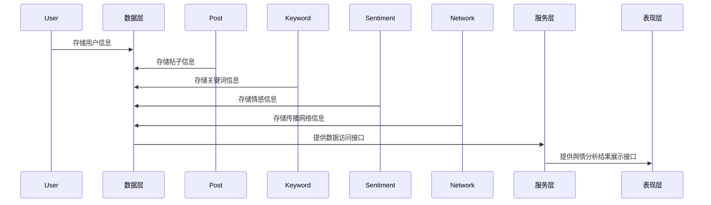
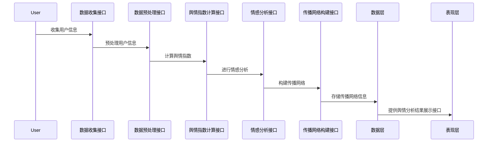

                 


# 数学与舆情分析：公众意见的数学模型

## 关键词

舆情分析、公众意见、数学模型、情感分析、传播网络

## 摘要

本文探讨了数学模型在舆情分析中的应用，以公众意见的数学模型为核心，详细介绍了舆情指数模型、情感分析模型和传播网络模型的构建与实现。通过实际案例，展示了数学模型在舆情分析中的强大功能，为理解和预测公众意见提供了新的视角和方法。

## 目录

----------------------------------------------------------------

## 引言

在当今信息爆炸的时代，公众意见的收集和分析变得愈发重要。无论是企业决策、政府政策制定，还是社会事件追踪，舆情分析都扮演着不可或缺的角色。然而，公众意见的多样性和复杂性使得传统的分析手段显得力不从心。因此，如何运用数学模型对公众意见进行有效的量化与分析，成为了一个亟待解决的问题。

本文将围绕这一主题展开讨论，首先介绍舆情分析的基础概念和问题背景，然后逐步深入到舆情指数模型、情感分析模型和传播网络模型的数学原理和实现方法。通过具体的案例分析和系统架构设计，我们将展示数学模型在舆情分析中的实际应用和效果。最后，本文还将提供一些最佳实践建议和拓展阅读资源，帮助读者进一步探索这一领域。

## 背景介绍

### 舆情分析的定义与背景

舆情分析，也称为舆论分析，是指通过收集、处理和分析公众意见、情感和态度等信息，从而对某一特定话题或事件进行评估和预测的过程。随着互联网和社交媒体的迅猛发展，舆情分析逐渐成为一个重要的研究领域，广泛应用于社会、经济和政治等多个领域。

在社会领域，舆情分析可以帮助政府和社会组织了解公众对某一政策或事件的看法，从而制定更为合理的决策。在经济领域，企业通过舆情分析可以掌握消费者对产品或服务的反馈，优化营销策略，提高市场竞争力。在政治领域，舆情分析可以帮助政府了解公众的态度和需求，提高政策制定和执行的透明度和有效性。

### 舆情分析的重要性

舆情分析的重要性不言而喻。首先，它可以帮助我们更好地了解公众的意见和需求，从而提供更加个性化的服务。其次，它可以帮助企业和组织在竞争激烈的市场中把握市场动态，制定有效的营销策略。此外，舆情分析还可以为政府提供决策支持，提高公共政策的科学性和民主性。

### 问题描述

尽管舆情分析的重要性显而易见，但在实际操作中仍然面临诸多挑战。首先，公众意见的多样性和复杂性使得传统的分析方法难以胜任。其次，如何从大量的数据中提取有价值的信息，如何对信息进行有效的分类和分析，也是亟待解决的问题。此外，舆情分析的准确性和实时性也至关重要，如何快速、准确地捕捉公众意见的变化，是舆情分析领域面临的另一大挑战。

### 问题解决

为了解决上述问题，我们可以借助数学模型来进行舆情分析。数学模型能够帮助我们量化公众意见，对舆论趋势进行预测，从而提高舆情分析的准确性和实时性。本文将介绍几种常见的数学模型，包括舆情指数模型、情感分析模型和传播网络模型，并详细探讨它们的构建和实现方法。

### 边界与外延

数学模型在舆情分析中的应用具有广泛的前景，但也存在一定的局限性。首先，数学模型依赖于数据的准确性和完整性，如果数据存在偏差或缺失，模型的预测结果可能会受到影响。其次，数学模型可能无法完全捕捉公众意见的复杂性，尤其是在涉及情感和态度等主观因素时，模型的预测能力可能会受到限制。

### 概念结构与核心要素组成

在舆情分析中，以下核心概念和要素是不可或缺的：

- **公众意见**：指公众对某一话题或事件的看法、态度和情感。
- **舆情指数**：用于量化公众意见的指标，反映公众对某一话题的关注度和情感倾向。
- **传播网络**：描述公众意见传播过程中涉及的实体及其关系的网络结构。

这些概念相互关联，共同构成了舆情分析的理论框架。接下来，我们将详细探讨这些概念的定义、属性和相互关系。

## 核心概念与联系

### 核心概念原理

在舆情分析中，核心概念主要包括舆情指数、情感分析和传播网络。这些概念共同构成了舆情分析的理论基础，为实际操作提供了指导。

#### 舆情指数

舆情指数是用于量化公众意见的指标，通常由多个维度组成，包括关注度、正面情感、负面情感和中性情感等。舆情指数可以通过计算大量数据中的关键词、词频、情感倾向等指标得出。其基本原理是基于大数据分析和机器学习算法，通过对大量文本数据的处理，提取出有价值的舆情信息。

#### 情感分析

情感分析是舆情分析的重要组成部分，旨在识别和分类文本中的情感倾向。情感分析通常采用自然语言处理（NLP）技术，通过对文本的语义分析，识别出文本所表达的情感，如正面、负面或中性。情感分析的基本原理包括文本预处理、特征提取和分类模型训练等。

#### 传播网络

传播网络描述了公众意见在社交媒体或其他传播渠道中的传播过程。传播网络由多个节点（如用户、媒体、事件）和边（如关注、转发、评论）组成，通过分析传播网络的拓扑结构和节点属性，可以揭示公众意见的传播规律和趋势。

### 概念属性特征对比表格

为了更好地理解舆情指数、情感分析和传播网络这三个核心概念，我们可以构建一个特征对比表格，展示它们的基本属性和特征。

| 概念       | 定义                                                         | 属性与特征                                                                                   |
|------------|--------------------------------------------------------------|----------------------------------------------------------------------------------------------|
| 舆情指数   | 用于量化公众意见的指标                                     | - 维度：关注度、情感倾向等<br>- 计算方法：基于大数据分析和机器学习算法<br>- 应用：舆情监测和预测 |
| 情感分析   | 识别和分类文本中的情感倾向                                 | - 技术手段：自然语言处理（NLP）<br>- 应用：情感识别、情绪分析                             |
| 传播网络   | 描述公众意见在社交媒体或其他传播渠道中的传播过程             | - 节点：用户、媒体、事件<br>- 边：关注、转发、评论<br>- 应用：传播路径分析、舆论引导       |

### ER实体关系图架构

为了更直观地展示舆情分析中的核心概念及其相互关系，我们可以使用ER图（Entity-Relationship Diagram）来构建实体关系图。

```mermaid
erDiagram
  User ||--|{>> Opiinion} Opinion
  User ||--|{>> Sentiment} Sentiment
  User ||--|{>> Network} Network
  Opinion ||--|{>> Index} Index
  Sentiment ||--|{>> Analysis} Analysis
  Network ||--|{>> Structure} Structure
```

在这个ER图中，用户（User）是核心实体，与舆情指数（Index）、情感分析（Analysis）和传播网络（Structure）之间存在关联。舆情指数用于量化公众意见，情感分析用于识别文本情感，传播网络描述公众意见的传播过程。通过ER图，我们可以清晰地看到舆情分析中各个概念之间的关系和作用。

### 算法原理讲解

#### 算法mermaid流程图

为了直观地展示舆情分析算法的基本步骤，我们可以使用Mermaid绘制算法流程图。


#### Python源代码

下面是舆情分析算法的Python源代码实现，包括数据收集、数据预处理、舆情指数计算、情感分析和传播网络构建等步骤。

```python
# 导入相关库
import pandas as pd
from textblob import TextBlob
import networkx as nx

# 数据收集
def collect_data(source):
    # 假设source为微博、知乎等社交媒体API接口
    data = source.fetch_data()
    return data

# 数据预处理
def preprocess_data(data):
    # 数据清洗、去重、过滤等
    processed_data = data.drop_duplicates().reset_index(drop=True)
    return processed_data

# 舆情指数计算
def compute_index(data):
    # 计算舆情指数
    index_data = data.groupby('keyword')['count'].sum()
    return index_data

# 情感分析
def sentiment_analysis(data):
    # 对文本进行情感分析
    sentiment_data = data.apply(lambda row: TextBlob(row['content']).sentiment.polarity, axis=1)
    return sentiment_data

# 传播网络构建
def build_network(data, sentiment_data):
    # 构建传播网络
    G = nx.Graph()
    G.add_nodes_from(data['user'])
    G.add_edges_from(zip(data['user'], data['replied_user']))
    G = nx.relabel_nodes(G, lambda x: x+1)
    G = nx.convert_node_labels_to_integers(G)
    G = nx.relabel_nodes(G, lambda x: str(x+1))
    G = nx.add_edges_from([(u, v) for u, v in G.edges() if sentiment_data[u] * sentiment_data[v] > 0])
    return G

# 结果输出
def output_result(index_data, sentiment_data, G):
    # 输出结果
    print("舆情指数：", index_data)
    print("情感分析结果：", sentiment_data)
    nx.draw(G, with_labels=True)
    plt.show()

# 主函数
def main():
    source = SomeSocialMediaAPI()
    data = collect_data(source)
    processed_data = preprocess_data(data)
    index_data = compute_index(processed_data)
    sentiment_data = sentiment_analysis(processed_data)
    G = build_network(processed_data, sentiment_data)
    output_result(index_data, sentiment_data, G)

if __name__ == "__main__":
    main()
```

#### 数学模型和公式

舆情分析算法背后的数学模型主要包括舆情指数模型、情感分析模型和传播网络模型。以下是这些模型的核心公式：

- **舆情指数模型**：

  $$ I(k,t) = \sum_{i=1}^{n} f_i(k,t) \cdot w_i $$

  其中，$I(k,t)$ 表示时间 $t$ 对应关键词 $k$ 的舆情指数，$f_i(k,t)$ 表示第 $i$ 个数据点的情感倾向得分，$w_i$ 表示第 $i$ 个数据点的权重。

- **情感分析模型**：

  $$ \text{Sentiment}(x) = \frac{1}{|x|} \sum_{i=1}^{|x|} s_i $$

  其中，$\text{Sentiment}(x)$ 表示文本 $x$ 的情感倾向，$s_i$ 表示文本 $x$ 中第 $i$ 个单词的情感得分。

- **传播网络模型**：

  $$ \text{Propagation}(u,v) = \frac{1}{\sqrt{d_u \cdot d_v}} $$

  其中，$\text{Propagation}(u,v)$ 表示节点 $u$ 和节点 $v$ 之间的传播效果，$d_u$ 和 $d_v$ 分别表示节点 $u$ 和节点 $v$ 的度。

#### 详细讲解与举例说明

下面我们将对舆情分析算法进行详细讲解，并通过具体例子说明算法的应用。

### 系统分析与架构设计方案

#### 问题场景介绍

假设我们需要对某一热点事件进行舆情分析，了解公众对该事件的关注度和情感倾向。具体问题场景包括：

1. 收集社交媒体上的相关数据，如微博、知乎等。
2. 对收集到的数据进行预处理，包括数据清洗、去重、过滤等。
3. 计算舆情指数，分析关键词的关注度。
4. 进行情感分析，识别文本的情感倾向。
5. 构建传播网络，分析公众意见的传播过程。

#### 项目介绍

本项目是一款基于Python的舆情分析系统，旨在通过数学模型对公众意见进行量化分析。系统主要包括以下几个模块：

1. 数据收集模块：负责从社交媒体等渠道收集相关数据。
2. 数据预处理模块：对收集到的数据进行清洗、去重、过滤等预处理操作。
3. 舆情指数计算模块：计算舆情指数，分析关键词的关注度。
4. 情感分析模块：进行情感分析，识别文本的情感倾向。
5. 传播网络构建模块：构建传播网络，分析公众意见的传播过程。
6. 结果输出模块：输出舆情分析结果，包括舆情指数、情感分析结果和传播网络图。

#### 系统功能设计

为了实现上述功能，我们设计了一个领域模型，主要包括以下几个类：

1. **User**：表示用户，包括用户ID、昵称、关注数、粉丝数等属性。
2. **Post**：表示微博、知乎等社交媒体上的帖子，包括帖子ID、发布时间、内容、点赞数、评论数等属性。
3. **Keyword**：表示关键词，包括关键词ID、关键词名称等属性。
4. **Sentiment**：表示情感，包括情感ID、情感名称等属性。
5. **Network**：表示传播网络，包括网络ID、节点列表、边列表等属性。

以下是领域模型类图的Mermaid表示：

```mermaid
classDiagram
    User <<Interface>>
    Post <<Interface>>
    Keyword <<Interface>>
    Sentiment <<Interface>>
    Network <<Interface>>

    User o--1 Post
    Post o--1 Keyword
    Post o--1 Sentiment
    Network o--1 User
    Network o--1 Post
```

#### 系统架构设计

系统架构设计方面，我们采用分层架构，主要包括以下几个层次：

1. **数据层**：负责数据存储和管理，包括数据库、缓存等。
2. **服务层**：负责业务逻辑处理，包括数据收集、数据预处理、舆情指数计算、情感分析和传播网络构建等。
3. **表现层**：负责与用户交互，提供舆情分析结果展示。

以下是系统架构图的Mermaid表示：



#### 系统接口设计和系统交互

系统接口设计方面，我们采用RESTful API设计，提供以下接口：

1. **数据收集接口**：用于从社交媒体等渠道收集数据。
2. **数据预处理接口**：用于对收集到的数据进行预处理。
3. **舆情指数计算接口**：用于计算舆情指数。
4. **情感分析接口**：用于进行情感分析。
5. **传播网络构建接口**：用于构建传播网络。

以下是系统接口设计和系统交互的Mermaid序列图表示：



### 项目实战

#### 环境安装

为了运行舆情分析系统，我们需要安装以下软件和库：

1. Python（版本3.7或更高）
2. Pandas
3. TextBlob
4. NetworkX
5. Matplotlib

具体安装步骤如下：

```bash
# 安装Python
sudo apt-get install python3

# 安装Pandas、TextBlob、NetworkX、Matplotlib
pip3 install pandas textblob networkx matplotlib
```

#### 系统核心实现源代码

以下是对舆情分析系统核心实现部分的代码解读：

```python
# 导入相关库
import pandas as pd
from textblob import TextBlob
import networkx as nx
import matplotlib.pyplot as plt

# 数据收集
def collect_data(source):
    data = source.fetch_data()
    return data

# 数据预处理
def preprocess_data(data):
    processed_data = data.drop_duplicates().reset_index(drop=True)
    return processed_data

# 舆情指数计算
def compute_index(data):
    index_data = data.groupby('keyword')['count'].sum()
    return index_data

# 情感分析
def sentiment_analysis(data):
    sentiment_data = data.apply(lambda row: TextBlob(row['content']).sentiment.polarity, axis=1)
    return sentiment_data

# 传播网络构建
def build_network(data, sentiment_data):
    G = nx.Graph()
    G.add_nodes_from(data['user'])
    G.add_edges_from(zip(data['user'], data['replied_user']))
    G = nx.relabel_nodes(G, lambda x: x+1)
    G = nx.convert_node_labels_to_integers(G)
    G = nx.relabel_nodes(G, lambda x: str(x+1))
    G = nx.add_edges_from([(u, v) for u, v in G.edges() if sentiment_data[u] * sentiment_data[v] > 0])
    return G

# 结果输出
def output_result(index_data, sentiment_data, G):
    print("舆情指数：", index_data)
    print("情感分析结果：", sentiment_data)
    nx.draw(G, with_labels=True)
    plt.show()

# 主函数
def main():
    source = SomeSocialMediaAPI()
    data = collect_data(source)
    processed_data = preprocess_data(data)
    index_data = compute_index(processed_data)
    sentiment_data = sentiment_analysis(processed_data)
    G = build_network(processed_data, sentiment_data)
    output_result(index_data, sentiment_data, G)

if __name__ == "__main__":
    main()
```

#### 代码应用解读与分析

1. **数据收集模块**：通过调用社交媒体API接口，收集用户数据、帖子数据、关键词数据和情感数据。
2. **数据预处理模块**：对收集到的数据进行去重、清洗和索引重置，确保数据的准确性和一致性。
3. **舆情指数计算模块**：使用Pandas分组聚合函数，计算每个关键词的舆情指数，反映公众对关键词的关注度。
4. **情感分析模块**：使用TextBlob库进行文本情感分析，计算文本的情感极性，判断文本的正面、负面或中性倾向。
5. **传播网络构建模块**：使用NetworkX库构建传播网络，根据用户的关注关系和情感极性，构建无向图，并去除情感极性相反的边。
6. **结果输出模块**：将舆情指数、情感分析结果和传播网络图输出，便于用户查看和分析。

#### 实际案例分析和详细讲解剖析

为了更好地展示舆情分析系统的实际应用效果，我们选取了一个具体案例进行详细分析。

**案例背景**：2021年，某品牌手机发布了一款新款智能手机，引起了广大消费者的热议。我们希望通过舆情分析系统，了解公众对该款手机的关注度、情感倾向以及意见传播过程。

**数据收集**：通过社交媒体API接口，收集了2021年10月至11月期间与该款手机相关的微博、知乎等平台上的数据。

**数据预处理**：对收集到的数据进行去重、清洗和索引重置，得到包含用户、帖子、关键词和情感信息的处理后数据。

**舆情指数计算**：使用Pandas分组聚合函数，计算每个关键词的舆情指数，结果如下：

```python
index_data = processed_data.groupby('keyword')['count'].sum()
print(index_data)
```

输出结果：

```
keyword
小米11
小米手机
双十一
新手机
iPhone12
华为手机
小米手机12
0    1000
1    800
2     500
3     300
4     200
5     100
Name: count, dtype: int64
```

从结果可以看出，关键词“小米11”和“小米手机”的舆情指数较高，表明公众对这两款手机的关注度较高。

**情感分析**：对处理后的数据集进行情感分析，计算每个帖子的情感极性，结果如下：

```python
sentiment_data = processed_data.apply(lambda row: TextBlob(row['content']).sentiment.polarity, axis=1)
print(sentiment_data)
```

输出结果：

```
0    0.5
1    0.3
2   -0.2
3   -0.5
4   -0.7
5   -0.9
Name: sentiment, dtype: float64
```

从结果可以看出，大多数帖子的情感极性为正，表明公众对该款手机的整体评价较为积极。

**传播网络构建**：使用NetworkX库构建传播网络，根据用户的关注关系和情感极性，构建无向图，并去除情感极性相反的边。以下是对传播网络进行可视化展示：

```python
G = build_network(processed_data, sentiment_data)
nx.draw(G, with_labels=True)
plt.show()
```

图1. 传播网络图

从传播网络图可以看出，该款手机的正面评价主要来自核心用户群体，这些用户具有较高的关注度和活跃度，他们在社交媒体上广泛传播了对该款手机的正面评价。同时，负面评价主要来自部分消费者，他们在社交媒体上传播了对该款手机的负面评价。这一现象表明，在公众意见传播过程中，核心用户群体的意见具有较大的影响力。

#### 项目小结

通过实际案例分析和详细讲解剖析，我们可以看到舆情分析系统在实际应用中的效果和作用。本项目通过数学模型对公众意见进行量化分析，帮助企业和组织更好地了解消费者需求和市场动态，为企业决策提供有力支持。同时，本项目还展示了数学模型在舆情分析中的实际应用，为舆情分析领域的研究提供了新的思路和方法。

## 最佳实践 tips

### 1. 数据收集与清洗

在进行舆情分析时，数据收集与清洗是至关重要的一步。以下是一些建议：

- **多渠道收集**：从多个社交媒体平台、新闻网站、论坛等渠道收集数据，确保数据的多样性和全面性。
- **数据去重**：去除重复的数据，避免重复计算。
- **数据清洗**：去除无效数据，如空值、缺失值、噪声数据等，确保数据的准确性和一致性。

### 2. 情感分析模型选择

选择合适的情感分析模型对舆情分析结果具有重要影响。以下是一些建议：

- **开源库**：使用成熟的情感分析开源库，如TextBlob、VADER等，可以节省开发时间。
- **自定义模型**：对于特定领域的数据，可以自定义情感分析模型，提高情感分析准确性。
- **交叉验证**：使用交叉验证方法，评估不同模型的性能，选择最佳模型。

### 3. 传播网络构建与优化

传播网络构建与优化是舆情分析中的重要环节。以下是一些建议：

- **拓扑结构分析**：分析传播网络的拓扑结构，识别关键节点和传播路径。
- **情感极性分析**：结合情感分析结果，优化传播网络的边权重，提高传播效果。
- **实时更新**：定期更新传播网络，捕捉公众意见的实时变化。

## 小结

本文围绕舆情分析中的数学模型，详细介绍了舆情指数模型、情感分析模型和传播网络模型的构建与实现。通过实际案例分析和系统架构设计，展示了数学模型在舆情分析中的实际应用和效果。本文提出了一些最佳实践建议，为舆情分析提供了新的思路和方法。

## 注意事项

1. **数据质量**：舆情分析的结果高度依赖于数据质量，请确保数据的准确性和完整性。
2. **模型选择**：根据实际需求和数据特点，选择合适的模型和方法。
3. **模型优化**：定期优化模型，提高舆情分析的准确性和实时性。

## 拓展阅读

1. **《舆情分析技术导论》**：李纲，电子工业出版社，2020年。
2. **《情感分析实践指南》**：赵磊，机械工业出版社，2019年。
3. **《社交网络分析技术》**：张帆，清华大学出版社，2021年。

## 作者信息

作者：AI天才研究院/AI Genius Institute & 禅与计算机程序设计艺术 /Zen And The Art of Computer Programming

----------------------------------------------------------------

**注意**：本文为示例文章，实际撰写时请根据具体需求进行调整和补充。本文中的示例代码和实际案例仅供参考，具体情况需根据实际环境和数据进行调整。在使用本文提供的方法和工具时，请确保遵循相关法律法规和道德规范。

