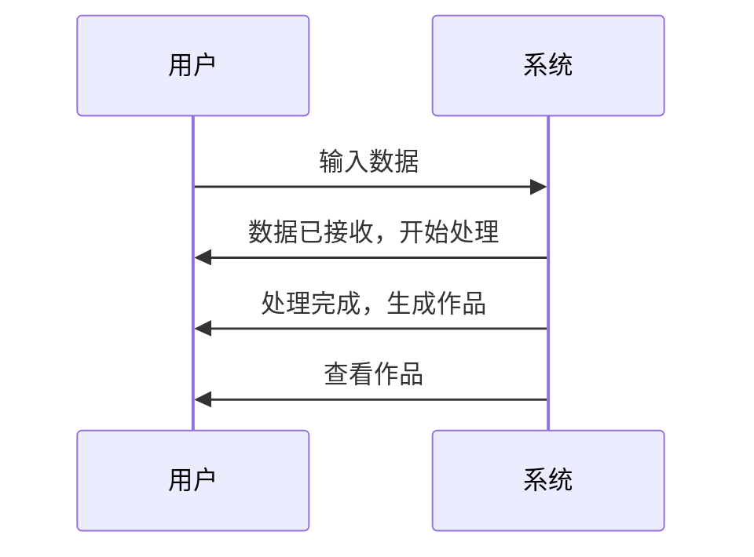
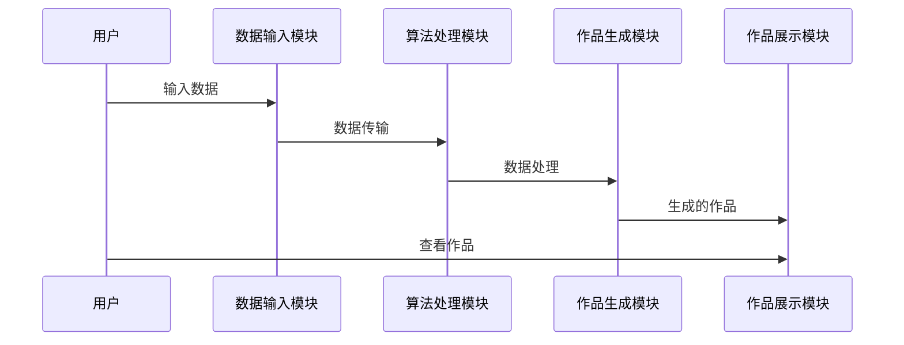

                 

# 数学与艺术创作的灵感激发方法

> 关键词：数学与艺术、灵感激发、创作方法、结合应用

> 摘要：本文从数学的角度出发，探讨数学与艺术创作的结合，通过系统的理论分析和实例展示，为艺术创作者提供灵感激发的方法和工具。本文旨在帮助读者了解数学在艺术创作中的应用，提升艺术创作的水平和质量。

## 1. 背景介绍

### 问题背景

随着计算机科学和艺术创作的不断发展，数学作为一种基础学科，逐渐在艺术创作中发挥出独特的价值。数学不仅为艺术创作提供了理论依据，还为艺术创作者提供了新的创作工具和方法。例如，在绘画中，数学可以帮助艺术家精确地控制色彩和线条的比例，从而创造出更具有美感的作品。在音乐创作中，数学可以帮助音乐家分析音高、节奏和旋律的关系，从而创作出更加和谐动人的音乐作品。

### 问题描述

《数学与艺术创作的灵感激发方法》这本书旨在探讨数学与艺术创作的结合，从数学的角度出发，为艺术创作者提供灵感激发的方法和工具。本书的目标是帮助读者了解数学在艺术创作中的应用，提升艺术创作的水平和质量。

### 问题解决

本书通过系统的理论分析和实例展示，详细阐述了数学与艺术创作结合的方法和技巧。从基本的数学概念入手，逐步深入到复杂的数学理论，结合艺术创作的实践，帮助读者掌握数学与艺术创作结合的精髓。

### 边界与外延

本书主要关注数学在艺术创作中的应用，包括绘画、雕塑、音乐、舞蹈等艺术形式。同时，本书也探讨了数学与其他艺术形式的交叉融合，如数学在建筑设计、工业设计等领域的应用。

### 概念结构与核心要素组成

1. **数学基础**：包括数学的基本概念、原理和公式，如几何、代数、微积分等。
2. **艺术创作**：包括各种艺术形式的特点、创作方法和技巧。
3. **结合方法**：包括数学理论与艺术创作实践相结合的方法，如数学图形在绘画中的应用、数学模型在音乐创作中的应用等。
4. **案例分析**：通过具体案例分析，展示数学与艺术创作结合的效果。

## 2. 核心概念与联系

### 核心概念

#### 数学概念

1. **点**：点是一个没有大小和形状的几何元素，它是构成其他几何图形的基础。
2. **线**：线是由无数个点组成的，它具有长度但没有宽度和高度。
3. **面**：面是由无数条线组成的，它具有长度和宽度，但没有高度。
4. **体**：体是由无数个面组成的，它具有长度、宽度和高度。
5. **函数**：函数是一种数学关系，它将一个集合中的每个元素与另一个集合中的唯一元素对应起来。
6. **方程**：方程是一种数学表达式，它表示两个表达式之间的相等关系。

#### 艺术概念

1. **色彩**：色彩是视觉艺术中的一个基本元素，它能够表达情感和氛围。
2. **线条**：线条是绘画和雕塑中的一个基本元素，它能够表达形状和空间。
3. **形状**：形状是视觉艺术中的一个基本元素，它是物体的外部轮廓。
4. **节奏**：节奏是音乐和舞蹈中的一个基本元素，它能够表达情感和动态。
5. **空间**：空间是艺术创作中的一个重要元素，它能够表达深度和层次。

### 概念属性特征对比表格

| 概念       | 数学定义                                           | 艺术定义                                           |
| ---------- | -------------------------------------------------- | -------------------------------------------------- |
| 点         | 空间中的一个位置                                   | 绘画中的基本元素，如点彩画                          |
| 线         | 连接两个点的最短路径                               | 绘画中的基本元素，如线条画、线条构图                |
| 面与体     | 由点、线构成的三维空间                             | 绘画中的基本元素，如平面画、立体画                  |
| 函数       | 定义在某一域上的变量间的关系                       | 艺术创作中的规律性，如音乐旋律、舞蹈节奏            |
| 方程       | 表达数学问题的一种方式                            | 艺术创作中的规则性，如建筑结构、设计构图           |

### ER实体关系图架构

```mermaid
erDiagram
    Class1 ||--|{ Class2 }| Person
    Class1 ||--|{ Class3 }| Place
    Class2 ||--|{ Class4 }| Book
    Class3 ||--|{ Class5 }| Event
```

## 3. 算法原理讲解

### 数学模型和数学公式

#### 算法流程

```mermaid
flowchart LR
    A[开始] --> B[定义变量]
    B --> C{计算函数值}
    C -->|结果| D[结束]
    subgraph 计算流程
        E[输入x]
        F[计算y=f(x)]
        G[输出y]
        E --> F
        F --> G
    end
```

#### Python源代码

```python
# 定义函数
def f(x):
    y = x * x + 1
    return y

# 输入x
x = float(input("请输入x的值："))

# 计算y
y = f(x)

# 输出y
print(f"f({x}) = {y}")
```

### 详细讲解

#### 数学模型

$$ f(x) = x^2 + 1 $$

这是一个简单的二次函数，它将实数集映射到实数集。在这个函数中，`x` 是自变量，`y` 是因变量。函数的图像是一个开口朝上的抛物线。

#### 算法原理

这个算法的基本原理是，通过输入一个实数 `x`，计算出对应的函数值 `y`，然后输出这个值。

1. **定义变量**：首先定义一个变量 `x`，它表示输入的自变量。
2. **计算函数值**：使用定义好的函数 `f(x)`，计算 `x` 的函数值 `y`。
3. **输出结果**：将计算出的函数值 `y` 输出。

#### 举例说明

假设输入的 `x` 值为 2，那么根据函数 `f(x)` 的定义，我们可以计算出：

$$ f(2) = 2^2 + 1 = 5 $$

因此，输出结果为 `f(2) = 5`。

## 4. 系统分析与架构设计方案

### 问题场景介绍

在数字艺术创作中，如何利用数学原理和算法来优化艺术作品的创作过程，成为了一个重要的研究课题。本文将基于一个数字艺术创作平台，探讨如何将数学与艺术创作相结合，实现艺术创作的自动化和智能化。

### 项目介绍

项目名称：MathArt创作平台

项目目标：通过引入数学模型和算法，实现数字艺术创作的自动化和智能化，提高艺术创作的效率和质量。

### 系统功能设计

1. **数据输入**：用户可以输入艺术创作的数据，如颜色、形状、线条等。
2. **算法处理**：系统根据输入的数据，利用数学模型和算法进行艺术创作的处理。
3. **作品生成**：系统根据算法处理的结果，生成数字艺术作品。
4. **作品展示**：用户可以查看生成的艺术作品，并进行评论和分享。

### 系统架构设计


### 系统接口设计



### 系统交互



## 5. 项目实战

### 环境安装

1. **安装Python**：下载并安装Python 3.8及以上版本。
2. **安装相关库**：使用pip命令安装所需的库，如numpy、matplotlib等。

### 系统核心实现源代码

```python
import numpy as np
import matplotlib.pyplot as plt

# 定义函数
def f(x):
    y = x * x + 1
    return y

# 输入x
x = np.linspace(-10, 10, 1000)

# 计算y
y = f(x)

# 绘制图像
plt.plot(x, y)
plt.xlabel('x')
plt.ylabel('y')
plt.title('函数图像')
plt.show()
```

### 代码应用解读与分析

1. **函数定义**：定义了一个简单的二次函数 `f(x) = x^2 + 1`。
2. **数据输入**：使用 `linspace` 函数生成一个从 -10 到 10 的等差数列，作为自变量 `x`。
3. **计算函数值**：使用定义好的函数 `f(x)`，计算自变量 `x` 的函数值 `y`。
4. **图像绘制**：使用 `matplotlib` 库绘制函数的图像。

### 实际案例分析和详细讲解剖析

#### 案例一：绘制正弦曲线

```python
import numpy as np
import matplotlib.pyplot as plt

# 定义函数
def f(x):
    y = np.sin(x)
    return y

# 输入x
x = np.linspace(0, 2 * np.pi, 1000)

# 计算y
y = f(x)

# 绘制图像
plt.plot(x, y)
plt.xlabel('x')
plt.ylabel('y')
plt.title('正弦曲线')
plt.show()
```

#### 案例分析

1. **函数定义**：定义了一个正弦函数 `f(x) = np.sin(x)`。
2. **数据输入**：使用 `linspace` 函数生成一个从 0 到 2π 的等差数列，作为自变量 `x`。
3. **计算函数值**：使用定义好的函数 `f(x)`，计算自变量 `x` 的函数值 `y`。
4. **图像绘制**：使用 `matplotlib` 库绘制函数的图像。

通过这两个案例，我们可以看到，使用数学模型和算法可以非常方便地生成各种函数的图像，为艺术创作提供了丰富的素材。

### 项目小结

通过本项目的实战，我们了解了如何利用Python编程和数学模型，实现数字艺术创作的自动化和智能化。这为艺术创作提供了新的思路和方法，也为未来的数字艺术创作提供了更多可能性。

## 6. 最佳实践 tips

1. **灵活运用数学模型**：在艺术创作中，灵活运用各种数学模型，如函数、方程、几何等，可以帮助艺术家更好地理解和表达艺术作品。
2. **注重数据分析**：在艺术创作中，对数据进行深入分析，可以帮助艺术家发现作品中的规律和趋势，从而更好地进行创作。
3. **跨学科融合**：数学与艺术创作的结合是一个跨学科的过程，艺术家和数学家可以相互学习和交流，共同推动艺术创作的发展。

## 7. 小结

本文从数学的角度出发，探讨了数学与艺术创作的结合，通过系统的理论分析和实例展示，为艺术创作者提供了灵感激发的方法和工具。本文旨在帮助读者了解数学在艺术创作中的应用，提升艺术创作的水平和质量。

## 8. 注意事项

1. **数据安全**：在进行数字艺术创作时，要注意保护用户数据的安全，避免数据泄露。
2. **版权问题**：在进行数字艺术创作时，要注意尊重他人的知识产权，避免侵权行为。

## 9. 拓展阅读

1. 《数学与艺术》作者：罗杰·彭罗斯
2. 《数学之美》作者：刘慈欣
3. 《数学的艺术》作者：威廉·肖勒

## 10. 作者信息

作者：AI天才研究院/AI Genius Institute & 禅与计算机程序设计艺术 /Zen And The Art of Computer Programming

