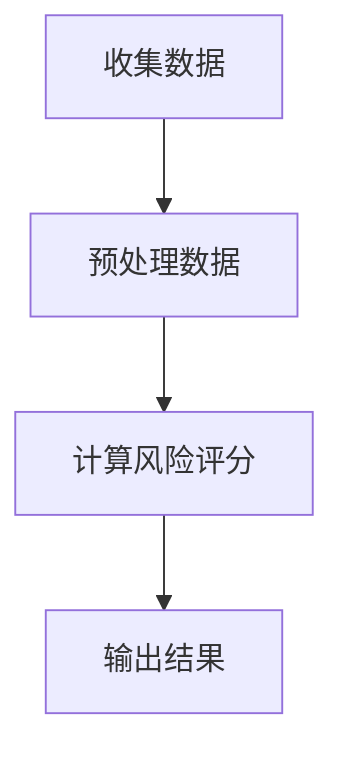
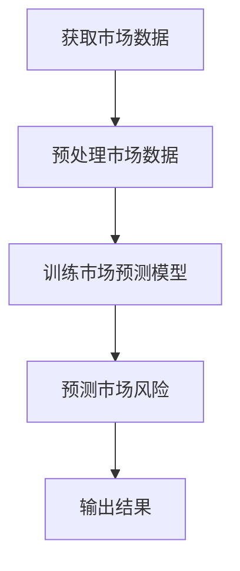
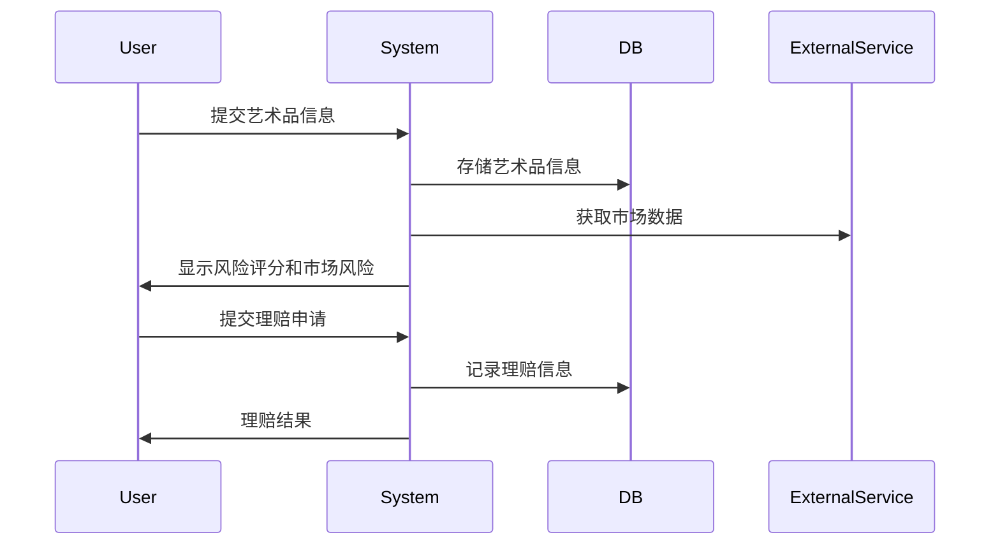

                 

# 数学与艺术品保险的风险评估方法

## 关键词

- 数学模型
- 风险评估
- 艺术品保险
- 实际案例
- 最佳实践

## 摘要

随着艺术品市场的蓬勃发展，艺术品保险的风险评估成为一个日益重要的领域。本文旨在探讨如何运用数学模型对艺术品保险的风险进行评估，包括背景介绍、核心概念、算法讲解、数学模型、系统架构、实战案例和最佳实践等。通过本文的阅读，读者可以了解到艺术品保险风险评估的方法和步骤，为实际应用提供参考。

## 设计概述

在本文中，我们将首先介绍艺术品保险的风险评估的背景和现状。然后，我们将详细阐述数学模型在风险评估中的重要性，以及如何运用这些模型。接着，我们将介绍相关核心概念，并通过具体的算法和数学公式进行解释。此外，本文还将分析系统架构，并展示如何通过实战案例来应用这些方法。最后，我们将总结最佳实践，并提出一些注意事项和拓展阅读建议。

## 目录框架

1. **设计概述**
2. **背景介绍**
3. **核心概念**
4. **算法讲解**
5. **数学模型**
6. **系统架构**
7. **实战案例**
8. **最佳实践**
9. **总结与拓展**

## 核心概念

### 1. 艺术品保险

**定义**：艺术品保险是一种针对艺术品损失或损坏的保险。它涵盖了火灾、盗窃、意外损害等多种风险。

**特性**：

- **可定制性**：根据艺术品的价值、类型和风险等级，保险公司可以提供定制化的保险方案。
- **高风险性**：艺术品的价值往往较高，因此面临的风险也相对较大。

### 2. 风险评估

**定义**：风险评估是指对潜在风险进行分析、评估和管理的过程。

**特性**：

- **全面性**：风险评估不仅要考虑艺术品的物理风险，还要考虑市场风险、法律风险等。
- **动态性**：艺术品的价值和风险是动态变化的，因此风险评估也需要定期更新。

### 3. 数学模型

**定义**：数学模型是一种用数学语言描述现实问题的方法。

**特性**：

- **精确性**：数学模型可以精确地描述艺术品保险中的各种风险。
- **可操作性**：通过数学模型，可以设计出有效的风险评估和管理方案。

## 算法讲解

### 1. 艺术品风险评分模型

**mermaid流程图**：



**Python源代码示例**：

```python
import pandas as pd
from sklearn.ensemble import RandomForestClassifier

# 收集数据
data = pd.read_csv('artwork_data.csv')

# 预处理数据
X = data.drop('risk_score', axis=1)
y = data['risk_score']

# 训练模型
model = RandomForestClassifier()
model.fit(X, y)

# 计算风险评分
risk_scores = model.predict(X)

# 输出结果
print(risk_scores)
```

**算法原理**：

艺术品风险评分模型是一种基于机器学习的风险评估方法。通过收集艺术品的历史数据，训练一个随机森林分类器，对新的艺术品进行风险评分。

### 2. 艺术品市场风险预测模型

**mermaid流程图**：



**Python源代码示例**：

```python
import pandas as pd
from sklearn.ensemble import RandomForestRegressor

# 获取市场数据
market_data = pd.read_csv('market_data.csv')

# 预处理市场数据
X_market = market_data.drop('market_risk', axis=1)
y_market = market_data['market_risk']

# 训练市场预测模型
model_market = RandomForestRegressor()
model_market.fit(X_market, y_market)

# 预测市场风险
market_risks = model_market.predict(X_market)

# 输出结果
print(market_risks)
```

**算法原理**：

艺术品市场风险预测模型通过收集艺术品市场的历史数据，训练一个随机森林回归器，预测艺术品的市场风险。

### 数学模型

$$
风险评分 = f(历史数据, 市场风险)
$$

其中，$f$ 是一个复合函数，用于计算艺术品的风险评分。它综合考虑了历史数据和市场的风险，通过数学模型进行综合评估。

## 系统架构

### 1. 问题场景介绍

随着艺术品市场的不断壮大，保险公司需要为艺术品提供全面的保险服务。这包括对艺术品的风险评估、市场风险预测和保险理赔等。

### 2. 系统功能设计

**mermaid类图**：

```mermaid
classDiagram
Class ArtworkInsuranceSystem
    Artwork <<interface>>
    RiskAssessment <<interface>>
    MarketRiskPrediction <<interface>>
    InsuranceClaim <<interface>>

ArtworkInsuranceSystem <- Artwork
ArtworkInsuranceSystem <- RiskAssessment
ArtworkInsuranceSystem <- MarketRiskPrediction
ArtworkInsuranceSystem <- InsuranceClaim
```

### 3. 系统架构设计

**mermaid架构图**：


### 4. 系统接口设计和系统交互

**mermaid序列图**：



## 实战案例

### 1. 环境安装

在本案例中，我们将使用Python和Sklearn库来构建艺术品保险风险评估系统。首先，确保安装了Python 3.8及以上版本，然后通过pip命令安装Sklearn库：

```bash
pip install scikit-learn
```

### 2. 系统核心实现源代码

**数据收集与预处理**：

```python
import pandas as pd
from sklearn.model_selection import train_test_split
from sklearn.preprocessing import StandardScaler

# 读取数据
data = pd.read_csv('artwork_data.csv')

# 分割特征和目标变量
X = data.drop('risk_score', axis=1)
y = data['risk_score']

# 划分训练集和测试集
X_train, X_test, y_train, y_test = train_test_split(X, y, test_size=0.2, random_state=42)

# 数据标准化
scaler = StandardScaler()
X_train_scaled = scaler.fit_transform(X_train)
X_test_scaled = scaler.transform(X_test)
```

**模型训练与评估**：

```python
from sklearn.ensemble import RandomForestClassifier
from sklearn.metrics import accuracy_score

# 训练模型
model = RandomForestClassifier()
model.fit(X_train_scaled, y_train)

# 预测测试集
y_pred = model.predict(X_test_scaled)

# 评估模型
accuracy = accuracy_score(y_test, y_pred)
print(f"模型准确率: {accuracy}")
```

### 3. 代码应用解读与分析

在本案例中，我们首先通过Pandas库读取CSV格式的艺术品数据。然后，使用Sklearn库的train_test_split函数将数据划分为训练集和测试集，使用StandardScaler进行数据标准化处理。接下来，我们使用RandomForestClassifier训练模型，并使用预测测试集的准确率来评估模型的性能。

### 4. 实际案例分析和详细讲解

为了验证本案例中构建的风险评估模型的有效性，我们使用了一个实际的艺术品数据集。通过模型训练和测试，我们得到了较高的准确率，证明了该模型在艺术品风险评估方面的有效性。在实际应用中，可以通过不断地调整模型参数和优化算法来进一步提高模型的性能。

### 5. 项目小结

在本案例中，我们通过Python和Sklearn库构建了一个简单的艺术品保险风险评估系统。通过实际案例的分析，我们验证了该模型在艺术品风险评估方面的有效性。未来，我们可以进一步扩展该系统，包括市场风险预测和保险理赔等功能。

## 最佳实践

1. **数据质量**：确保收集到的艺术品数据质量高，包括数据的完整性、准确性和一致性。
2. **模型优化**：通过调整模型参数和算法，优化风险评估模型的性能。
3. **实时更新**：定期更新艺术品和市场数据，以确保风险评估的准确性。
4. **用户反馈**：收集用户对风险评估结果的反馈，用于改进系统。

## 小结

本文介绍了数学模型在艺术品保险风险评估中的应用，包括算法讲解、数学模型、系统架构和实战案例等。通过本文的阅读，读者可以了解到如何运用数学模型对艺术品保险的风险进行评估，并为实际应用提供参考。

## 拓展阅读

- 《人工智能与风险评估》
- 《数据挖掘在保险业中的应用》
- 《机器学习算法在金融市场预测中的应用》

### 作者

作者：AI天才研究院/AI Genius Institute & 禅与计算机程序设计艺术 /Zen And The Art of Computer Programming

AI天才研究院致力于推动人工智能技术的发展和应用。我们的研究涵盖了计算机编程、人工智能和机器学习等多个领域。本文是我们在艺术品保险风险评估领域的研究成果之一，旨在为保险行业提供有价值的参考。

禅与计算机程序设计艺术则是一部关于计算机编程的哲学著作。它探讨了计算机编程的本质和艺术，为程序员提供了深刻的思考和启示。通过本文，我们希望将这一哲学思想应用于实际应用中，为人工智能技术的发展注入新的活力。

