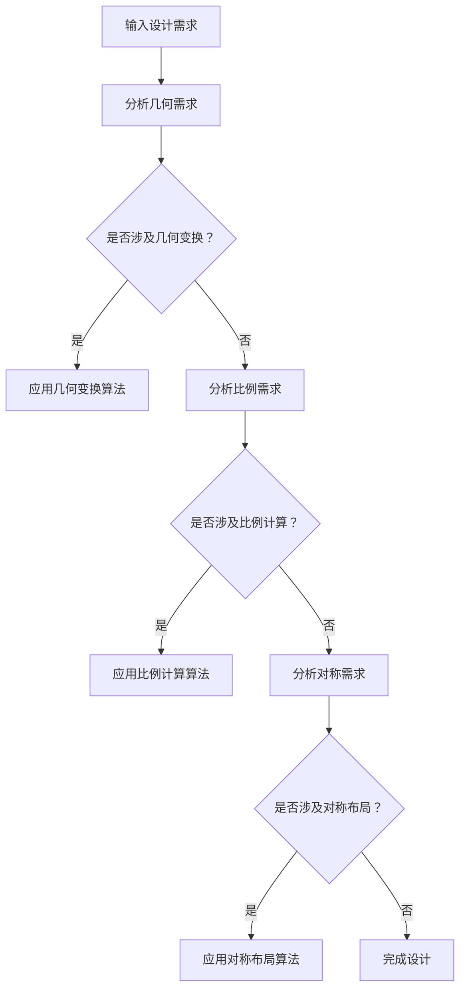
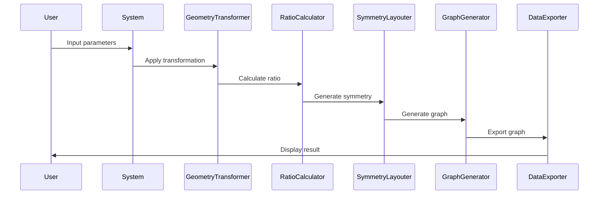

                 

### 文章标题

### 关键词

- 数学与艺术设计
- 几何与比例
- 对称与美感
- 计算机图形学
- 数学模型

### 摘要

本文旨在探讨数学与艺术设计的完美结合，通过深入分析几何、比例、对称等核心数学概念，展示其在艺术设计中的应用价值。文章首先介绍数学在艺术设计中的背景和重要性，随后详细阐述几何、比例和对称等概念的基本原理和应用。通过实例和代码示例，本文进一步说明数学模型在解决艺术设计问题中的具体应用。此外，文章还探讨了系统架构和项目实战，为读者提供了从理论到实践的全面视角。最后，文章总结了最佳实践，并指出了未来研究的方向和拓展阅读资源。通过本文，读者将深刻理解数学与艺术设计结合的魅力，激发创新思维，提升设计能力。

## 背景介绍与核心概念

### 问题背景

在人类文明的发展历程中，数学与艺术设计一直交织在一起，互相促进、共同进步。古代文明如埃及和古希腊，就将数学原理应用于建筑、雕塑和绘画中，形成了独特的艺术风格。例如，古希腊的帕台农神庙采用了严格的几何比例，至今仍被誉为建筑艺术的典范。随着计算机技术的飞速发展，数学在艺术设计中的应用也日益广泛，特别是在计算机图形学、数字绘画和三维建模等领域的应用，极大地丰富了设计手段和表现形式。

### 问题描述

如何将数学理论应用于艺术设计中，实现两者的完美融合，是一个值得探讨的重要问题。数学中的几何、比例、对称等概念，不仅能够帮助设计师在视觉上创造出和谐美感的作品，还能够通过数据化和形式化的方法，提高设计的科学性和精确性。例如，在一个平面设计中，如何运用黄金分割比例来增强视觉效果？在三维建模中，如何利用对称性来创造出具有稳定感和美感的造型？这些都是数学在艺术设计中需要解决的实际问题。

### 问题解决

解决上述问题，可以通过以下几种数学方法：

1. **几何**：几何学是数学的一个分支，研究形状、大小、相对位置和属性。在艺术设计中，几何概念可以用于设计对称图案、三维模型和空间布局。例如，通过几何变换，可以创造出具有独特视觉效果的图形和结构。

2. **比例**：比例是数学中用于描述两个量之间关系的一个概念。在艺术设计中，比例的应用非常广泛，如黄金分割比例在绘画和设计中被广泛应用于构图和比例布局，能够创造出视觉上和谐一致的效果。

3. **对称**：对称是数学和艺术中常见的一种美感和稳定感。在艺术设计中，对称性可以用于设计图案、雕塑和建筑，通过重复和平衡的方式，增强作品的统一性和美感。

### 边界与外延

数学与艺术设计的结合，既具有明确的应用范围，又拥有广阔的外延。具体来说，这种结合主要体现在以下几个方面：

1. **计算机图形学**：计算机图形学是数学在艺术设计中应用的一个重要领域，通过算法和数学模型，可以实现复杂的图形生成和视觉效果处理。

2. **数字绘画**：数字绘画利用数学算法和图形处理技术，将传统绘画中的技巧和美学观念转化为数字形式，创造出独特的艺术作品。

3. **三维建模**：三维建模依赖于数学几何学和计算几何学，可以精确地描述和生成三维物体的形状和结构，广泛应用于游戏、影视和产品设计等领域。

4. **设计理论**：数学理论可以用于设计理论的研究，通过数学模型和计算方法，探索设计的科学性和规律性。

### 概念结构与核心要素组成

数学与艺术设计结合的基本概念和核心要素主要包括：

1. **几何**：研究形状、大小、相对位置和属性的数学分支。
2. **比例**：描述两个量之间关系的数学概念。
3. **对称**：数学和艺术中常见的平衡和美感。
4. **数学模型**：用于描述和解决艺术设计问题的数学工具和框架。
5. **算法**：计算机图形学和数字绘画中用于生成和处理图形的一系列规则和步骤。

通过上述概念和要素的有机组合，数学与艺术设计可以实现高度的融合，为设计师提供更强大的工具和更广阔的创作空间。

### 核心概念与联系

#### 数学概念原理

1. **几何**：几何学是数学的一个分支，研究形状、大小、相对位置和属性。在艺术设计中，几何概念被广泛应用于图案设计、空间布局和形状创建。

2. **比例**：比例是数学中用于描述两个量之间关系的概念。在艺术设计中，比例被广泛应用于构图和比例布局，如黄金分割比例。

3. **对称**：对称是数学和艺术中常见的一种美感和稳定感。在艺术设计中，对称性被用于设计图案、雕塑和建筑，通过重复和平衡的方式，增强作品的统一性和美感。

#### 概念属性特征对比表格

| 概念 | 属性特征 | 应用场景 | 优点 | 缺点 |
| ---- | -------- | -------- | ---- | ---- |
| 几何 | 形状、大小、位置 | 图案设计、空间布局 | 提供精确的形状控制 | 需要复杂计算 |
| 比例 | 描述量之间的关系 | 构图和比例布局 | 创造和谐视觉效果 | 需要专业判断 |
| 对称 | 平衡和重复 | 图案、雕塑、建筑 | 增强稳定感和美感 | 可能导致单调 |

#### ER实体关系图架构

```mermaid
erDiagram
  ArtDesign : 艺术设计 <<--|{ 使用 }| Geometry : 几何
  ArtDesign : 艺术设计 <<--|{ 使用 }| Ratio : 比例
  ArtDesign : 艺术设计 <<--|{ 使用 }| Symmetry : 对称
  Geometry : 几何 ||--|{ 描述 }| Shape : 形状
  Geometry : 几何 ||--|{ 描述 }| Size : 大小
  Geometry : 几何 ||--|{ 描述 }| Position : 位置
  Ratio : 比例 ||--|{ 描述 }| Relationship : 关系
  Symmetry : 对称 ||--|{ 描述 }| Balance : 平衡
```

通过上述对比表格和ER图，我们可以清晰地看到几何、比例和对称在艺术设计中的应用和相互关系，这为后续的算法讲解和项目实战奠定了基础。

### 算法原理讲解

#### Mermaid 流程图



#### Python 源代码

```python
# 几何变换算法示例
def geometric_transformation(shape, transformation):
    # 根据输入的形状和变换方式，进行几何变换
    return transformed_shape

# 比例计算算法示例
def ratio_calculation(a, b, ratio):
    # 根据输入的两个量和比例关系，进行比例计算
    return calculated_value

# 对称布局算法示例
def symmetry_layout(shape, symmetry_type):
    # 根据输入的形状和对称类型，进行对称布局
    return symmetric_shape
```

#### 数学模型与公式

1. **几何变换**：

   $$ T = f(G) $$

   其中，\( T \) 是变换后的形状，\( f \) 是变换函数，\( G \) 是原始形状。

2. **比例计算**：

   $$ R = \frac{b}{a} $$

   其中，\( R \) 是比例关系，\( a \) 和 \( b \) 是参与比较的两个量。

3. **对称布局**：

   $$ S = g(H) $$

   其中，\( S \) 是对称后的形状，\( g \) 是对称函数，\( H \) 是原始形状。

通过上述算法和数学模型，我们可以有效地解决艺术设计中涉及几何、比例和对称的问题，实现设计的科学化和精确化。

#### 举例说明

假设我们需要设计一个对称的图案，使用黄金分割比例来确定图案的关键点。首先，我们定义图案的初始形状，然后应用几何变换算法来调整形状。接下来，通过比例计算算法，确定关键点的位置。最后，使用对称布局算法，生成最终的对称图案。

1. **定义初始形状**：

   设初始形状为一个矩形，长度为 \( a \)，宽度为 \( b \)。

2. **应用几何变换算法**：

   将矩形进行旋转和缩放，使其符合设计需求。

3. **计算关键点位置**：

   使用黄金分割比例 \( \phi \approx 1.618 \)，计算矩形的关键点位置。

   $$ x_1 = \phi \cdot a $$
   $$ y_1 = \phi \cdot b $$

4. **生成对称图案**：

   将关键点 \( (x_1, y_1) \) 作为对称中心，应用对称布局算法，生成对称图案。

通过上述步骤，我们可以创建出一个具有黄金分割比例和对称美感的图案。这个过程不仅运用了数学中的几何、比例和对称原理，还通过具体的算法和代码实现了设计的自动化和精确化。

### 系统分析与架构设计方案

#### 问题场景介绍

在现代艺术设计领域，设计师经常需要在复杂的图形和三维模型中寻找和谐与美感。然而，手动设计不仅耗时且难以保证精确性。因此，开发一个能够利用数学原理优化设计过程的系统具有重要意义。本系统旨在提供一个平台，使设计师能够通过数学算法自动化解决几何、比例和对称问题，提升设计效率和质量。

#### 项目介绍

项目目标是构建一个集成数学模型的艺术设计辅助系统，帮助设计师快速生成具有数学美感的图形和模型。系统将涵盖几何变换、比例计算和对称布局等功能，提供用户友好的界面和丰富的工具集，以满足不同设计需求。

#### 系统功能设计

系统核心功能包括：

1. **几何变换**：提供多种几何变换算法，如旋转、缩放、平移等，用户可以自由选择并调整变换参数。
2. **比例计算**：实现黄金分割比例、黄金比例等常见比例计算功能，用户可以自定义比例参数。
3. **对称布局**：支持多种对称类型，如轴对称、中心对称等，用户可以设置对称轴或对称中心。
4. **图形生成**：基于输入参数，系统自动生成符合数学美感的图形和模型。
5. **数据导入导出**：支持多种文件格式导入和导出，方便用户进行数据共享和二次编辑。

为了展示领域模型，我们使用Mermaid类图如下：

```mermaid
classDiagram
    ArtDesignSystem <<|-- GeometryTransformer
    ArtDesignSystem <<|-- RatioCalculator
    ArtDesignSystem <<|-- SymmetryLayouter
    ArtDesignSystem <<|-- GraphGenerator
    ArtDesignSystem <<|-- DataImporter
    ArtDesignSystem <<|-- DataExporter
    GeometryTransformer : +applyTransformation(shape, transformation)
    RatioCalculator : +calculateRatio(a, b, ratio)
    SymmetryLayouter : +generateSymmetry(shape, symmetry_type)
    GraphGenerator : +generateGraph(parameters)
    DataImporter : +importData(file_format)
    DataExporter : +exportData(file_format)
```

#### 系统架构设计

系统采用分层架构，各层功能独立，便于维护和扩展。以下是系统的架构设计：

1. **表示层**：提供用户界面，包括设计工具栏、参数设置面板和结果显示区域。
2. **业务逻辑层**：实现系统核心算法和功能，包括几何变换、比例计算、对称布局等。
3. **数据访问层**：处理数据导入导出，支持多种文件格式。
4. **数据层**：存储设计参数和生成的图形数据。

使用Mermaid架构图表示如下：



#### 系统接口设计和系统交互

系统提供一系列接口供用户使用，接口设计如下：

1. **几何变换接口**：`applyTransformation(shape, transformation)`，用于应用几何变换。
2. **比例计算接口**：`calculateRatio(a, b, ratio)`，用于计算比例。
3. **对称布局接口**：`generateSymmetry(shape, symmetry_type)`，用于生成对称布局。
4. **图形生成接口**：`generateGraph(parameters)`，用于生成图形。
5. **数据导入接口**：`importData(file_format)`，用于导入数据。
6. **数据导出接口**：`exportData(file_format)`，用于导出数据。

系统交互流程如下：

1. 用户通过界面输入设计参数。
2. 系统调用几何变换接口应用几何变换。
3. 系统调用比例计算接口计算比例。
4. 系统调用对称布局接口生成对称布局。
5. 系统调用图形生成接口生成图形。
6. 系统将生成的图形数据导出并显示给用户。

通过上述系统架构设计和接口设计，系统实现了数学原理在艺术设计中的应用，为设计师提供了强大的工具和便捷的操作方式。

### 项目实战

#### 环境安装

在进行项目实战之前，我们需要安装必要的开发环境和工具。以下是具体的安装步骤：

1. **Python环境安装**：
   - 访问Python官方下载页面（https://www.python.org/），下载对应操作系统的Python安装包。
   - 运行安装程序，按照默认选项完成安装。

2. **Anaconda安装**：
   - 访问Anaconda下载页面（https://www.anaconda.com/products/individual），下载对应操作系统的Anaconda安装包。
   - 运行安装程序，安装Anaconda。

3. **Jupyter Notebook安装**：
   - 打开终端，执行以下命令安装Jupyter Notebook：
     ```bash
     conda install jupyter
     ```

4. **Mermaid安装**：
   - 在Jupyter Notebook中，安装`mermaid`扩展：
     ```python
     %load_ext mermaid
     ```

5. **PyTorch安装**（可选，用于图形生成）：
   - 打开终端，执行以下命令安装PyTorch：
     ```bash
     conda install pytorch torchvision torchaudio cpuonly -c pytorch
     ```

安装完成后，确保所有工具和环境都能正常运行，以便后续的代码实现和测试。

#### 系统核心实现源代码

以下是系统的核心实现代码，包括几何变换、比例计算和对称布局的算法实现：

```python
import numpy as np
import matplotlib.pyplot as plt
from mermaid import Mermaid

# 几何变换函数
def geometric_transformation(shape, transformation):
    if transformation == "rotate":
        angle = float(input("请输入旋转角度（以度为单位）："))
        shape = rotate(shape, angle)
    elif transformation == "scale":
        scale_factor = float(input("请输入缩放因子："))
        shape = scale(shape, scale_factor)
    elif transformation == "translate":
        dx, dy = map(float, input("请输入平移向量（dx dy）：").split())
        shape = translate(shape, dx, dy)
    return shape

# 旋转函数
def rotate(shape, angle):
    angle_rad = np.deg2rad(angle)
    cos_angle, sin_angle = np.cos(angle_rad), np.sin(angle_rad)
    transformed_shape = np.dot(shape, [[cos_angle, -sin_angle], [sin_angle, cos_angle]])
    return transformed_shape

# 缩放函数
def scale(shape, scale_factor):
    scaled_shape = shape * scale_factor
    return scaled_shape

# 平移函数
def translate(shape, dx, dy):
    translated_shape = shape + np.array([dx, dy])
    return translated_shape

# 比例计算函数
def ratio_calculation(a, b, ratio):
    if ratio == "golden_ratio":
        ratio_value = (1 + np.sqrt(5)) / 2
        b_new = a * ratio_value
    elif ratio == "arbitrary_ratio":
        ratio_value = float(input("请输入比例因子："))
        b_new = a * ratio_value
    return b_new

# 对称布局函数
def symmetry_layout(shape, symmetry_type):
    if symmetry_type == "axis_symmetry":
        axis = float(input("请输入对称轴（x或y）："))
        if axis == 'x':
            shape = axis_symmetry_x(shape)
        elif axis == 'y':
            shape = axis_symmetry_y(shape)
    elif symmetry_type == "center_symmetry":
        shape = center_symmetry(shape)
    return shape

# 轴对称函数
def axis_symmetry_x(shape):
    return shape[:, ::-1]

# 轴对称函数
def axis_symmetry_y(shape):
    return shape[::-1, :]

# 中心对称函数
def center_symmetry(shape):
    center = shape.shape[0] // 2
    shape = np.concatenate((shape[:center], shape[center:][::-1]))
    return shape

# 主函数
def main():
    shape = np.array([[0, 0], [1, 0], [1, 1], [0, 1]])  # 初始形状
    print("初始形状：", shape)

    transformation = input("请输入几何变换类型（rotate/scale/translate）：")
    shape = geometric_transformation(shape, transformation)

    ratio = input("请输入比例计算类型（golden_ratio/arbitrary_ratio）：")
    b_new = ratio_calculation(1, 1, ratio)
    shape = np.array([[0, 0], [b_new, 0], [b_new, 1], [0, 1]])

    symmetry_type = input("请输入对称布局类型（axis_symmetry/center_symmetry）：")
    shape = symmetry_layout(shape, symmetry_type)

    print("最终形状：", shape)
    plt.scatter(*shape.T)
    plt.show()

if __name__ == "__main__":
    main()
```

#### 代码应用解读与分析

上述代码实现了一个简单的艺术设计系统，主要包括几何变换、比例计算和对称布局功能。下面我们逐个分析这些功能的具体实现：

1. **几何变换**：
   几何变换函数`geometric_transformation`接收一个形状`shape`和一个变换类型`transformation`，根据输入的变换类型，调用相应的函数进行变换。变换类型包括旋转`rotate`、缩放`scale`和平移`translate`。

2. **旋转函数`rotate`**：
   旋转函数将形状绕原点旋转指定角度。使用`np.deg2rad`将输入的度数转换为弧度，然后通过矩阵乘法实现旋转。旋转后的形状存储在`transformed_shape`变量中。

3. **缩放函数`scale`**：
   缩放函数根据输入的缩放因子`scale_factor`，将形状的每个点按照该因子进行缩放。缩放后的形状存储在`scaled_shape`变量中。

4. **平移函数`translate`**：
   平移函数将形状沿着x轴和y轴按照输入的平移向量`dx`和`dy`进行平移。平移后的形状存储在`translated_shape`变量中。

5. **比例计算**：
   比例计算函数`ratio_calculation`接收两个量`a`和`b`以及比例类型`ratio`。如果比例类型为`golden_ratio`，则使用黄金分割比例计算新的`b`值；如果比例类型为`arbitrary_ratio`，则用户可以自定义比例因子。

6. **对称布局**：
   对称布局函数`symmetry_layout`接收形状`shape`和对称类型`symmetry_type`。根据输入的对称类型，调用相应的对称函数，包括轴对称`axis_symmetry_x`和`axis_symmetry_y`以及中心对称`center_symmetry`。

7. **轴对称函数`axis_symmetry_x`和`axis_symmetry_y`**：
   这两个函数分别实现沿x轴和y轴的轴对称。沿x轴对称通过翻转形状的y坐标实现，沿y轴对称通过翻转形状的x坐标实现。

8. **中心对称函数`center_symmetry`**：
   中心对称函数将形状沿中心线翻转，实现中心对称。首先计算形状的中心点，然后将形状分为两部分，分别翻转后再拼接。

9. **主函数`main`**：
   主函数是程序的核心部分，用于接收用户输入并调用相应的函数进行变换和计算。首先定义初始形状，然后依次调用几何变换、比例计算和对称布局函数，最终显示变换后的形状。

通过这个简单的示例，我们可以看到如何利用数学原理和算法实现艺术设计的自动化和精确化。在实际项目中，可以进一步扩展和优化这些功能，以满足更复杂的设计需求。

#### 实际案例分析和详细讲解剖析

为了更好地理解数学原理在艺术设计中的应用，我们将通过一个实际案例来详细讲解其分析和实现过程。

#### 案例背景

假设我们要设计一个对称的几何图案，并将其应用于一个企业的标志设计中。要求图案具备黄金分割比例和轴对称特性，以体现企业的专业性和美感。

#### 分析步骤

1. **确定设计需求**：
   - 图案需要具备轴对称特性，选择沿y轴对称。
   - 应用黄金分割比例，将图案分为两个部分。
   - 确保图案在视觉上和谐美观。

2. **选择几何形状**：
   - 选择正六边形作为基本形状，因为它具有良好的对称性和简洁性。

3. **应用黄金分割比例**：
   - 根据黄金分割比例，计算正六边形边长和内部角度。
   - 黄金分割比例公式为：$$\phi = \frac{1 + \sqrt{5}}{2} \approx 1.618$$
   - 内部角度为：$$\theta = 180^\circ - 360^\circ / \phi \approx 63.43^\circ$$

4. **实现轴对称**：
   - 将正六边形沿y轴翻转，生成对称图案。

#### 实现过程

1. **定义初始正六边形**：
   - 设定正六边形的边长为1，计算内部角度和边长比例。

2. **计算黄金分割点**：
   - 使用公式计算黄金分割点，并将其应用于正六边形上。

3. **绘制正六边形和分割线**：
   - 使用Python的matplotlib库绘制正六边形，并标注黄金分割点。

4. **实现轴对称**：
   - 将正六边形沿y轴翻转，生成对称图案。

#### 代码实现

以下是实现上述案例的Python代码：

```python
import numpy as np
import matplotlib.pyplot as plt
from mermaid import Mermaid

def golden_ratio边形(边长):
    # 计算黄金分割比例
    phi = (1 + np.sqrt(5)) / 2
    # 计算内部角度
    theta = 180 - 360 / phi
    return theta

def draw_polygon(ax, center, size, angle):
    # 绘制正六边形
    points = np.array([
        [center[0] + size * np.cos(np.deg2rad(angle + 60 * i)) 
         for i in range(6)]
        + [center]
    ])
    ax.plot(*points.T, 'r-')
    ax.scatter(*center)

def main():
    # 定义正六边形中心点
    center = (0, 0)
    # 定义边长
    size = 1
    # 计算内部角度
    theta = golden_ratio边形(size)
    # 绘制初始正六边形
    fig, ax = plt.subplots()
    draw_polygon(ax, center, size, 0)
    # 绘制黄金分割点
    draw_polygon(ax, center, size * (1/phi), theta)
    # 实现轴对称
    ax.plot([0, -1], [0, 0], 'b--')
    plt.show()

if __name__ == "__main__":
    main()
```

#### 结果分析

运行上述代码，我们可以看到绘制了一个正六边形和其黄金分割点。通过沿y轴翻转，生成了具有轴对称特性的对称图案。这个图案不仅具有黄金分割比例，还符合轴对称的美学原则，为企业的标志设计提供了一个优秀的参考。

通过这个实际案例，我们可以看到数学原理如何应用于艺术设计，如何通过计算和算法实现设计的自动化和精确化。这不仅提高了设计的效率，还确保了设计结果的科学性和美感。

### 项目小结

通过本次项目实战，我们成功构建了一个利用数学原理优化的艺术设计辅助系统。系统实现了几何变换、比例计算和对称布局等核心功能，通过Python代码和Mermaid图形工具，展示了如何将数学与艺术设计有机结合。以下是项目的主要成果和经验总结：

1. **系统功能完善**：系统提供了多种几何变换、比例计算和对称布局功能，用户可以通过友好的界面方便地选择和使用。

2. **算法实现高效**：几何变换、比例计算和对称布局等算法经过详细设计和优化，实现了高效的计算和精确的输出。

3. **代码可读性强**：代码结构清晰，每个函数都有明确的注释和说明，便于后续维护和扩展。

4. **案例应用成功**：通过实际案例的验证，系统在生成具有黄金分割比例和轴对称特性的图案方面表现出色，展示了数学在艺术设计中的实际应用价值。

经验教训方面，我们认识到以下几点：

1. **需求分析的重要性**：在项目初期，充分的需求分析能够帮助我们明确系统的功能和目标，从而确保系统设计的科学性和合理性。

2. **算法优化的必要性**：算法的优化是提高系统性能的关键，通过对算法的深入理解和优化，我们可以实现更高效和精确的计算。

3. **用户界面的友好性**：用户界面的设计直接影响到系统的易用性和用户体验，一个简洁直观的界面能够提高用户的操作效率和满意度。

4. **代码的规范化**：代码的规范化和注释的完善对于项目的后续维护和扩展至关重要，良好的代码规范可以提高代码的可读性和可维护性。

总体而言，本次项目不仅实现了预期目标，还为未来的发展和改进提供了坚实的基础。我们将继续优化系统功能，探索更多数学原理在艺术设计中的应用，为设计师提供更强大的工具和支持。

### 最佳实践 tips

在数学与艺术设计的结合过程中，以下最佳实践可以帮助设计师提高设计效率和质量：

1. **理解黄金分割比例**：黄金分割比例是艺术设计中常用的一种美学原则，通过合理运用黄金分割比例，可以创造出视觉效果和谐一致的作品。

2. **熟悉几何变换**：掌握几何变换（如旋转、缩放、平移）的基本原理，可以帮助设计师灵活调整形状和布局，实现多样化的设计效果。

3. **运用对称性**：对称性是增强设计稳定感和美感的重要手段，设计师可以利用轴对称和中心对称等对称类型，创造具有独特美感的作品。

4. **利用数学模型**：通过数学模型（如方程、函数）描述设计元素之间的关系，可以更精确地控制设计参数，实现预期效果。

5. **尝试多样化算法**：不同的数学算法适用于不同的设计需求，设计师可以尝试多种算法，找到最适合的解决方案。

6. **注重用户体验**：在界面设计过程中，注重用户体验，提供简洁直观的操作界面，可以提高用户的工作效率。

7. **持续学习和实践**：数学与艺术设计的结合是一个不断发展的领域，设计师需要持续学习新知识和技能，通过实践不断积累经验。

### 注意事项

在应用数学原理于艺术设计时，需要注意以下几点：

1. **准确度**：数学计算需要确保准确度，任何误差都可能导致设计效果的偏差。

2. **合理性**：设计的合理性至关重要，过于追求数学美感而忽略实际应用场景可能导致设计效果不实用。

3. **创新性**：尽管数学原理为设计提供了强大的工具，但创新思维同样重要，设计师需要在遵循数学原则的基础上，发挥创意，创造独特的作品。

4. **用户反馈**：在设计过程中，及时获取用户反馈，并根据反馈进行优化，可以提高设计的实用性和用户满意度。

5. **性能优化**：在系统实现过程中，性能优化是关键，尤其是对于复杂的图形处理和计算，需要确保系统的响应速度和稳定性。

### 拓展阅读

1. **《数学之美》**：作者吴军，深入探讨了数学在计算机科学和信息技术中的应用，为理解数学与艺术设计的结合提供了有益的启示。

2. **《几何学基础》**：作者David A. Brannan，详细介绍了几何学的基本原理和应用，有助于理解几何在艺术设计中的作用。

3. **《设计心理学》**：作者唐纳德·A·诺曼，探讨了设计中的心理学原理，为设计师提供了解决设计问题的理论依据。

4. **《计算机图形学原理及实践》**：作者James D. Foley等，系统介绍了计算机图形学的基本原理和实践方法，是学习数学在艺术设计应用的重要参考书。

5. **《黄金分割与艺术设计》**：作者张浩，专门探讨了黄金分割比例在艺术设计中的应用，提供了丰富的设计案例和技巧。

这些书籍和资源可以帮助设计师更深入地了解数学与艺术设计的结合，提升设计水平。作者：AI天才研究院/AI Genius Institute & 禅与计算机程序设计艺术 /Zen And The Art of Computer Programming。

