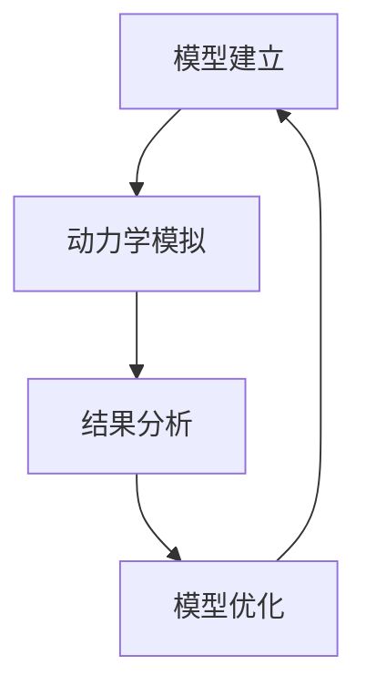
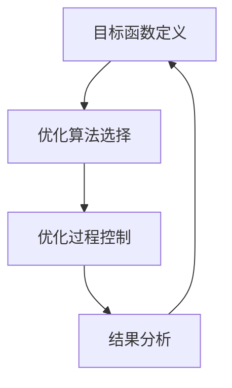
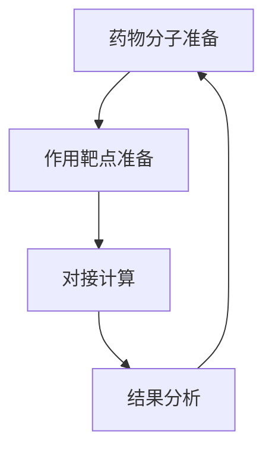

                 

### 第1章 引言：数学与药物设计的重要性

**摘要：** 本章节将介绍数学与药物设计的重要性，包括药物设计的基本概念、数学方法在药物设计中的应用，以及药物设计过程中面临的主要问题和解决方法。通过详细的分析，我们将探讨数学方法在提高药物研发效率和质量方面的巨大潜力。

---

#### 1.1 问题背景

**药物设计的重要性**

药物设计是现代药物研发过程中至关重要的一环。它涉及从大量化合物中筛选出具有潜在药效的分子，并通过结构优化和活性预测等手段进行进一步验证和改进。高效的药物设计不仅能够缩短新药研发周期，降低研发成本，还能够提高新药的成功率，从而更好地满足患者需求。

**数学方法在药物设计中的应用**

随着生物科学和计算技术的快速发展，数学方法在药物设计中的应用越来越广泛。数学模型和算法为药物分子设计与优化提供了强有力的工具，使得研究人员能够更准确地预测药物分子的活性、稳定性及生物利用度等关键性质。具体来说，数学方法在药物设计中的应用主要包括以下几个方面：

- **分子模拟**：通过模拟分子在微观环境下的动态行为，帮助研究人员预测分子之间的相互作用和构象变化。
- **结构优化**：利用优化算法对药物分子的结构进行优化，以提高其稳定性和生物活性。
- **分子对接**：通过计算方法预测药物分子与其作用靶点之间的结合方式，从而评估药物分子的潜在活性。
- **机器学习**：利用大数据和机器学习算法，从实验数据中提取特征，预测药物分子的活性。

#### 1.2 问题描述

药物设计涉及多个复杂的过程，包括药物分子的发现、结构优化、活性预测等。在这个过程中，数学方法发挥着关键作用。如何有效利用数学工具解决药物设计中的问题，提高药物研发的效率和质量，是当前研究的热点和难点。

**1.2.1 药物分子的发现**

药物分子的发现是药物设计的第一步，涉及到从大量化合物中筛选出具有潜在药效的分子。利用数学模型和算法，如高通量筛选和虚拟筛选，可以大大提高筛选效率，减少实验成本。

**1.2.2 结构优化**

结构优化是药物设计的重要环节，通过优化药物分子的结构，可以提高其稳定性和生物活性。数学优化方法，如遗传算法、模拟退火等，在这一过程中发挥了重要作用。

**1.2.3 活性预测**

活性预测是药物设计中的另一个关键步骤，旨在预测药物分子对特定生物靶点的活性。通过机器学习和统计方法，可以基于已有的数据预测新的药物分子的活性，从而减少实验次数，提高研发效率。

#### 1.3 问题解决

**数学模型和方法的应用**

数学模型和方法在药物设计中的应用主要体现在以下几个方面：

- **分子模拟**：通过模拟药物分子在微观环境下的行为，预测分子之间的相互作用和构象变化。
- **结构优化**：利用优化算法对药物分子的结构进行优化，以提高其稳定性和生物活性。
- **分子对接**：通过计算方法预测药物分子与其作用靶点之间的结合方式，从而评估药物分子的潜在活性。
- **机器学习**：利用大数据和机器学习算法，从实验数据中提取特征，预测药物分子的活性。

**计算方法与算法的选择**

根据药物设计的具体需求，选择合适的计算方法和算法至关重要。例如，对于分子模拟，可以选择分子动力学模拟或蒙特卡洛模拟；对于结构优化，可以选择遗传算法或模拟退火算法；对于活性预测，可以选择支持向量机或神经网络等机器学习算法。

**数据处理与分析**

在药物设计过程中，会产生大量的数据。如何对数据进行有效的处理和分析，提取有价值的信息，是提高药物设计效率的关键。数据处理和分析方法包括数据清洗、特征提取、模型训练和模型评估等。

#### 1.4 边界与外延

**药物设计的边界**

药物设计需要考虑多个因素，包括药物的化学性质、生物活性、药物代谢和毒性等。此外，药物设计还需要遵循一定的法律法规和伦理规范，确保药物的安全性和有效性。

**数学方法的外延**

数学方法在药物设计中的应用不仅限于分子模拟、结构优化和活性预测等传统领域，还涉及到生物信息学、机器学习等新兴领域。这些交叉应用为药物设计带来了新的机遇和挑战。

#### 1.5 概念结构与核心要素组成

**药物设计的基本概念**

药物设计涉及多个基本概念，包括药物分子、生物大分子、药物作用靶点等。理解这些概念对于药物设计至关重要。

**数学方法的核心要素**

数学方法在药物设计中的应用主要包括数学模型、计算方法和算法等核心要素。掌握这些要素，有助于更深入地理解和应用数学方法进行药物设计。

#### 1.6 本章小结

本章介绍了数学与药物设计的重要性、问题背景、问题描述、问题解决以及边界与外延。通过本章的介绍，读者可以初步了解数学方法在药物设计中的应用及其重要性，为后续章节的详细讨论奠定了基础。

---

**关键词：** 数学方法、药物设计、分子模拟、结构优化、活性预测、机器学习、计算方法、算法、分子对接。

---

### 第2章 数学模型与药物设计原理

**摘要：** 本章节将详细探讨数学模型在药物设计中的应用原理，包括分子模拟、结构优化和分子对接等核心方法。通过具体案例和原理讲解，读者将深入理解这些数学方法在药物设计中的实际应用。

---

#### 2.1 数学模型在药物设计中的应用

**2.1.1 分子模拟**

分子模拟是一种通过计算模拟分子在微观环境下的动态行为的方法。它可以帮助研究人员预测分子之间的相互作用、分子的构象变化等，为药物设计提供重要的参考。

**分子动力学模拟**

分子动力学模拟是一种基于牛顿运动定律的模拟方法，它通过计算分子系统的运动轨迹，揭示分子之间的相互作用和能量变化。分子动力学模拟在药物设计中有着广泛的应用，例如：

- **预测药物分子与生物大分子（如蛋白质）的相互作用**：通过分子动力学模拟，可以了解药物分子与生物大分子之间的结合机制，为药物设计提供指导。
- **研究药物分子的构象变化**：分子动力学模拟可以揭示药物分子在不同环境下的构象变化，有助于优化药物分子的结构。

**蒙特卡洛模拟**

蒙特卡洛模拟是一种基于概率统计的模拟方法，它通过模拟随机过程来计算系统性质。在药物设计中，蒙特卡洛模拟可以用于：

- **药物分子的热力学性质计算**：通过蒙特卡洛模拟，可以计算药物分子的热力学性质，如自由能、熵等，为药物分子的结构优化提供依据。
- **药物分子的配体设计**：蒙特卡洛模拟可以用于药物分子的配体设计，通过模拟药物分子与配体之间的相互作用，筛选出最优的配体结构。

**2.1.2 结构优化**

结构优化是利用数学优化方法对药物分子的结构进行优化，以提高其稳定性和生物活性。结构优化在药物设计中具有重要意义，因为优化的药物分子结构往往具有更好的生物利用度和药效。

**遗传算法**

遗传算法是一种基于自然进化的优化算法，它通过模拟自然选择和遗传机制，寻找最优的药物分子结构。遗传算法在药物设计中的应用主要包括：

- **药物分子的构象优化**：通过遗传算法，可以优化药物分子的构象，使其具有更好的稳定性和生物活性。
- **药物分子的组合优化**：遗传算法可以用于优化药物分子中的功能团组合，提高药物分子的药效。

**模拟退火算法**

模拟退火算法是一种基于物理学的优化算法，它通过模拟固体退火过程来寻找最优解。模拟退火算法在药物设计中的应用主要包括：

- **药物分子的构象搜索**：模拟退火算法可以用于搜索药物分子的最优构象，提高药物分子的稳定性。
- **药物分子的活性预测**：通过模拟退火算法，可以预测药物分子的活性，从而筛选出具有潜在药效的分子。

**2.1.3 分子对接**

分子对接是通过计算方法预测药物分子与其作用靶点之间的结合方式，从而评估药物分子的潜在活性。分子对接在药物设计中具有重要作用，因为它可以帮助研究人员快速筛选出具有潜在药效的分子。

**对接算法**

对接算法是一种通过计算方法预测药物分子与其作用靶点之间的结合方式的方法。常见的对接算法包括：

- **力场法**：力场法是一种基于分子间作用力的对接算法，它通过计算药物分子与作用靶点之间的相互作用能量，评估药物分子的活性。
- **基于形状互补的对接算法**：基于形状互补的对接算法通过计算药物分子与作用靶点之间的形状匹配度，评估药物分子的活性。

**对接流程**

分子对接的流程主要包括以下几个步骤：

1. **药物分子准备**：对药物分子进行预处理，包括去除溶剂效应、添加氢原子等。
2. **作用靶点准备**：对作用靶点进行预处理，包括去除溶剂效应、添加氢原子等。
3. **对接计算**：通过对接算法计算药物分子与作用靶点之间的结合方式。
4. **结果分析**：分析对接结果，评估药物分子的活性。

#### 2.2 数学方法在药物设计中的核心原理

**2.2.1 分子动力学模拟**

分子动力学模拟是一种基于牛顿运动定律的模拟方法，它通过计算分子系统的运动轨迹，揭示分子之间的相互作用和能量变化。分子动力学模拟的核心原理包括：

- **牛顿运动定律**：分子动力学模拟基于牛顿运动定律，通过计算分子之间的相互作用力和运动轨迹，模拟分子系统的动力学行为。
- **能量守恒定律**：分子动力学模拟中，系统的总能量保持守恒，通过计算系统的能量变化，可以了解分子系统的稳定性。

**2.2.2 量子力学计算**

量子力学计算是一种基于量子力学的计算方法，它可以提供分子内部电子结构的详细信息，为药物分子的设计和优化提供基础。量子力学计算的核心原理包括：

- **薛定谔方程**：量子力学计算基于薛定谔方程，通过求解薛定谔方程，可以得到分子内部电子的分布和能量。
- **哈密顿算子**：量子力学计算中，哈密顿算子用于描述分子内部电子的动能和势能，通过求解哈密顿算子，可以得到分子的能量和波函数。

**2.2.3 遗传算法**

遗传算法是一种基于自然进化的优化算法，它通过模拟自然选择和遗传机制，寻找最优的药物分子结构。遗传算法的核心原理包括：

- **适应度函数**：遗传算法中的适应度函数用于评估个体（即药物分子结构）的优劣，适应度值越高，表示个体越优秀。
- **交叉和变异操作**：遗传算法中的交叉和变异操作用于产生新的个体，通过交叉和变异，可以增加种群的多样性和探索能力。

#### 2.3 药物设计中的数学公式与应用

**2.3.1 分子动力学模拟中的数学公式**

分子动力学模拟中涉及到的数学公式主要包括牛顿运动定律、能量守恒定律等。以下是一个简化的分子动力学模拟公式：

- **牛顿运动定律**：

  $$
  m\frac{d^2r_i}{dt^2} = -\nabla V(r_i)
  $$

  其中，\(m\) 是分子的质量，\(\frac{d^2r_i}{dt^2}\) 是分子的加速度，\(\nabla V(r_i)\) 是分子所受的相互作用力。

- **能量守恒定律**：

  $$
  E_t = E_0 + \sum_{i=1}^N \frac{1}{2} m \left( \frac{d r_i}{dt} \right)^2 - V(r_i)
  $$

  其中，\(E_t\) 是系统的总能量，\(E_0\) 是系统的初始能量，\(\frac{1}{2} m \left( \frac{d r_i}{dt} \right)^2\) 是分子的动能，\(- V(r_i)\) 是分子的势能。

**2.3.2 量子力学计算中的数学公式**

量子力学计算中涉及到的数学公式主要包括薛定谔方程、哈密顿算子等。以下是一个简化的量子力学计算公式：

- **薛定谔方程**：

  $$
  \hat{H} \psi = E \psi
  $$

  其中，\(\hat{H}\) 是哈密顿算子，\(\psi\) 是分子的波函数，\(E\) 是分子的能量。

- **哈密顿算子**：

  $$
  \hat{H} = -\frac{\hbar^2}{2m} \nabla^2 + V(r)
  $$

  其中，\(\hbar\) 是约化普朗克常数，\(m\) 是分子的质量，\(\nabla^2\) 是拉普拉斯算子，\(V(r)\) 是分子的势能。

**2.3.3 遗传算法中的数学公式**

遗传算法中涉及到的数学公式主要包括适应度函数、交叉和变异等操作规则。以下是一个简化的遗传算法公式：

- **适应度函数**：

  $$
  f(x) = \frac{1}{1 + \exp(-x)}
  $$

  其中，\(x\) 是个体（药物分子结构）的适应度值，\(f(x)\) 是个体的适应度函数。

- **交叉操作**：

  $$
  C(x_1, x_2) = (x_1', x_2')
  $$

  其中，\(x_1\) 和 \(x_2\) 是两个父代个体，\(x_1'\) 和 \(x_2'\) 是两个子代个体，交叉操作通过交换父代个体的部分基因来实现。

- **变异操作**：

  $$
  M(x) = x + \eta
  $$

  其中，\(x\) 是个体（药物分子结构），\(\eta\) 是变异因子，变异操作通过在个体中引入随机变化来实现。

#### 2.4 药物设计中的 Mermaid 流程图

**2.4.1 分子模拟的流程**

分子模拟的流程主要包括模型建立、动力学模拟和结果分析等步骤。以下是一个简化的分子模拟流程图：

**2.4.2 结构优化的流程**

结构优化的流程主要包括目标函数定义、优化算法选择和优化过程控制等步骤。以下是一个简化的结构优化流程图：

**2.4.3 分子对接的流程**

分子对接的流程主要包括药物分子准备、作用靶点准备、对接计算和结果分析等步骤。以下是一个简化的分子对接流程图：

---

本章详细介绍了数学模型在药物设计中的应用，包括分子模拟、结构优化和分子对接等核心方法。通过具体的原理讲解和流程图展示，读者可以更深入地理解这些数学方法在药物设计中的实际应用。在下一章中，我们将进一步探讨数学方法在药物设计中的算法实现和案例分析。

