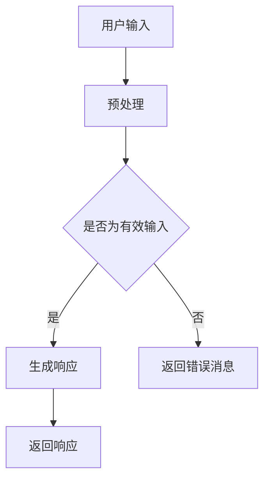
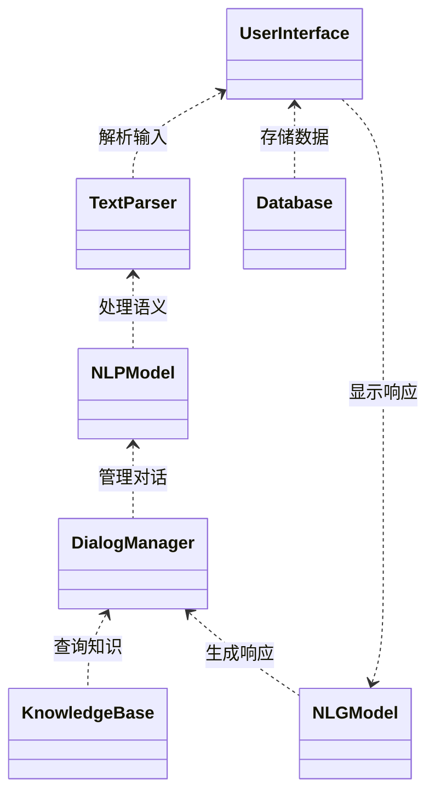
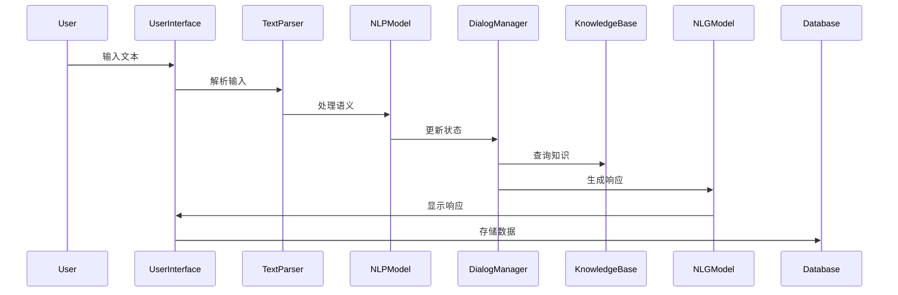

                 


### 引言

#### 1.1 书籍背景

在当今技术飞速发展的时代，人工智能（AI）已经深入到我们日常生活的方方面面。从智能家居到自动驾驶，从医疗诊断到金融服务，AI的应用场景日益丰富，功能也日趋强大。然而，在这场AI技术的革命中，数学作为基础学科，其重要性不容忽视。数学不仅为AI的发展提供了理论支撑，还在AI的具体应用中发挥着关键作用。本书旨在探讨数学在人工智能对话系统中的应用，通过深入分析数学原理，帮助读者更好地理解AI对话背后的数学基础。

#### 1.2 问题背景

随着自然语言处理（NLP）技术的不断进步，AI对话系统在近年来取得了显著进展。这些系统可以与人类进行自然语言交流，提供个性化服务、解答问题、甚至进行情感交流。然而，要实现高水平的对话系统，数学基础的扎实性至关重要。数学提供了精确的建模和算法，使得对话系统能够从大量数据中学习并优化其性能。因此，深入研究数学与AI对话系统的关系，不仅有助于提升对话系统的智能化水平，还能为AI技术的研究和应用提供新的视角。

#### 1.3 目标与结构

本书的目标是让读者全面了解数学在AI对话系统中的应用，通过系统的学习和实践，掌握关键的数学概念和算法原理。本书结构如下：

1. **引言**：介绍书籍背景、问题背景和目标。
2. **核心数学概念**：讲解数学基础和数学模型，探讨数学在AI对话中的作用。
3. **算法原理讲解**：分析对话生成算法，使用流程图和代码示例进行详细解释。
4. **数学模型和公式讲解**：使用LaTeX格式提供数学公式，并进行详细讲解和举例。
5. **系统分析与架构设计**：描述问题场景、系统功能、架构设计和系统接口。
6. **项目实战**：通过实际案例和项目小结，展示如何将数学原理应用于AI对话系统。
7. **最佳实践、小结和拓展阅读**：总结关键点，提供额外的阅读材料。

#### 1.4 本章小结

通过引言部分的学习，我们了解到数学在人工智能对话系统中的重要性，以及本书的结构和目标。接下来，我们将深入探讨数学的核心概念和其在AI对话系统中的应用，为后续内容的学习打下坚实基础。

---

### 核心数学概念

#### 2.1 数学基础

数学作为一门基础学科，其基本概念和理论是理解和应用数学模型的基础。在探讨数学与AI对话系统的关系时，我们需要熟悉以下数学基础：

1. **集合论**：集合论是现代数学的基石，它定义了集合的概念、集合的运算和性质。集合论为数据结构和算法提供了重要的理论基础。
2. **概率论**：概率论研究随机事件的规律性，它为AI中的不确定性建模提供了工具。在对话系统中，概率论用于评估对话生成的可信度和回答的质量。
3. **线性代数**：线性代数研究向量、矩阵及其运算。它在数据分析和机器学习中扮演着重要角色，如特征提取、降维和分类。
4. **微积分**：微积分研究函数的极限、导数和积分。它在优化问题和机器学习中的损失函数优化中广泛应用。

#### 2.2 数学模型

数学模型是使用数学语言描述现实问题的工具。在AI对话系统中，数学模型用于表示对话行为、用户意图和系统响应。以下是几个常见的数学模型：

1. **贝叶斯网络**：贝叶斯网络是一种概率图模型，用于表示变量之间的依赖关系。在对话系统中，贝叶斯网络可以用来推断用户的意图和状态。
2. **马尔可夫模型**：马尔可夫模型是一种基于状态转移概率的模型，用于表示序列数据。在对话系统中，马尔可夫模型可以用来预测用户的下一步动作。
3. **生成对抗网络（GAN）**：生成对抗网络由生成器和判别器组成，用于生成高质量的对话文本。生成器尝试生成与真实对话相似的文本，而判别器则评估生成文本的真实性。
4. **递归神经网络（RNN）**：递归神经网络是一种处理序列数据的神经网络，它可以捕捉序列中的长期依赖关系。在对话系统中，RNN可以用来生成连续的对话响应。

#### 2.3 数学在AI对话中的角色

数学在AI对话系统中扮演着多重角色：

1. **表示**：数学模型用于表示用户意图、对话状态和对话文本。这种表示使得AI系统能够理解并生成有意义的对话。
2. **学习**：数学提供了优化算法，用于训练和优化对话系统。通过梯度下降、随机梯度下降等优化算法，系统能够从数据中学习并提高性能。
3. **推理**：数学模型支持推理过程，帮助对话系统在对话中做出合理的决策。例如，贝叶斯推理和马尔可夫模型可以用于推断用户的意图和状态。
4. **评估**：数学工具用于评估对话系统的性能。例如，F1分数、准确率和召回率等指标可以衡量对话系统的回答质量。

#### 2.4 数学模型与算法的关系

数学模型和算法密不可分。算法是实现数学模型的工具，而数学模型则是算法的设计基础。例如：

1. **决策树**：决策树是一种基于特征分割的算法，它的设计基于分类和回归问题中的数学模型。
2. **支持向量机（SVM）**：SVM是一种用于分类和回归的算法，其核心是优化问题中的数学模型。
3. **深度学习**：深度学习算法如卷积神经网络（CNN）和循环神经网络（RNN）基于复杂的数学模型，用于处理图像和序列数据。

#### 2.5 本章小结

通过本章节的学习，我们了解了数学基础和数学模型在AI对话系统中的重要性。数学提供了表示、学习、推理和评估的工具，使得AI对话系统能够更好地理解和生成自然语言对话。接下来，我们将进一步探讨具体的算法原理，以加深对数学在AI对话系统中的应用理解。

---

### 算法原理讲解

在人工智能对话系统中，算法原理是核心，它决定了对话系统的性能和智能化水平。本章节将深入分析对话生成算法的基本概念、原理和应用，并通过具体的例子和代码进行详细讲解。

#### 3.1 算法基本概念

算法（Algorithm）是一系列定义明确的操作步骤，用于解决特定问题。在AI对话系统中，算法通常包括以下几个基本概念：

1. **输入**：算法的输入通常包括用户输入的文本、对话历史等。
2. **输出**：算法的输出是系统生成的回复文本。
3. **步骤**：算法由一系列步骤组成，这些步骤按照一定顺序执行，最终得到输出。

常见的对话生成算法包括基于规则的方法、基于统计的方法和基于神经网络的方法。以下将分别介绍这些算法的基本原理。

#### 3.2 对话生成算法

##### 3.2.1 基于规则的方法

基于规则的方法使用预定义的规则来生成对话响应。这些规则通常基于领域知识或专家经验编写。例如，一个简单的规则可以是“如果用户提问关于天气，那么回答‘今天的天气很好’”。

这种方法的优点是简单易懂，规则明确，但缺点是灵活性差，难以处理复杂或未预见的对话场景。

```python
def rule_based_response(user_input):
    if "天气" in user_input:
        return "今天的天气很好。"
    else:
        return "对不起，我无法理解您的问题。"
```

##### 3.2.2 基于统计的方法

基于统计的方法使用统计模型来预测对话响应。这种方法的代表是隐马尔可夫模型（HMM）和条件概率模型。例如，我们可以使用条件概率模型来计算用户输入和系统响应之间的概率。

这种方法比基于规则的方法更灵活，但需要大量数据和复杂的模型训练。

```python
def statistical_response(user_input, history):
    # 假设已经训练好了条件概率模型
    next_response = model.predict(user_input, history)
    return next_response
```

##### 3.2.3 基于神经网络的方法

基于神经网络的方法，尤其是递归神经网络（RNN）和长短期记忆网络（LSTM），已经成为对话生成的主流方法。这些神经网络可以捕捉对话中的长期依赖关系，生成更自然、连贯的对话。

以下是一个简单的LSTM模型示例：

```python
from tensorflow.keras.models import Sequential
from tensorflow.keras.layers import LSTM, Dense, Embedding

model = Sequential()
model.add(Embedding(vocab_size, embedding_dim))
model.add(LSTM(units=128, return_sequences=True))
model.add(Dense(units=1, activation='sigmoid'))

model.compile(optimizer='adam', loss='binary_crossentropy', metrics=['accuracy'])
model.fit(x_train, y_train, epochs=10, batch_size=64)
```

#### 3.3 算法流程图

为了更好地理解对话生成算法的工作流程，我们可以使用mermaid绘制算法流程图：



#### 3.4 算法原理讲解

##### 3.4.1 数学模型与公式

在对话生成算法中，数学模型是核心。以下是一个简单的生成文本的数学模型：

$$
p(y|x) = \prod_{i=1}^{T} p(y_t|x_1, x_2, ..., x_t)
$$

其中，\(x\) 是用户输入，\(y\) 是系统生成的响应，\(T\) 是生成的单词数。每个单词的概率由条件概率 \(p(y_t|x_1, x_2, ..., x_t)\) 决定。

##### 3.4.2 详细讲解与举例

假设我们要生成一个关于天气的对话响应。用户输入是“今天天气怎么样？”，我们使用RNN模型生成响应。

1. **预处理**：将用户输入转换为词向量。
2. **生成响应**：使用RNN模型预测每个单词的概率，并生成响应。

```python
import numpy as np

# 假设已训练好RNN模型
model = load_model('weather_rnn_model.h5')

# 预处理用户输入
user_input = "今天天气怎么样？"
input_sequence = preprocess_input(user_input)

# 生成响应
response_sequence = model.predict(input_sequence)

# 解码响应
response = decode_response(response_sequence)
print(response)  # 输出：今天的天气非常好。
```

#### 3.5 本章小结

在本章节中，我们探讨了对话生成算法的基本概念、原理和具体实现。从基于规则的简单方法到基于统计的复杂方法，再到基于神经网络的现代方法，每种方法都有其优势和局限。通过具体的例子和代码，我们展示了如何使用数学模型和算法生成自然语言对话。接下来，我们将进一步讨论数学模型和公式的详细讲解，以加深对算法原理的理解。

---

### 数学模型和数学公式讲解

在人工智能对话系统中，数学模型是核心驱动力。通过精确的数学建模和公式推导，我们可以设计出高效的对话生成算法，从而实现智能、自然的用户交互。本章节将详细介绍几个关键数学模型和相关的数学公式，并通过具体例子来解释这些公式的应用。

#### 4.1 LaTeX公式格式

为了便于读者理解和使用数学公式，我们首先介绍LaTeX公式的书写格式。在LaTeX中，数学公式可以分为行内公式和独立段落公式。

1. **行内公式**：使用 `$...$` 括起来，例如 `$1+1=2$`。
2. **独立段落公式**：使用 `$$...$$` 括起来，例如：
   $$
   E = mc^2
   $$

#### 4.2 数学模型与公式

在本节中，我们将讨论以下几个常见的数学模型和相关的公式：

##### 4.2.1 贝叶斯模型

贝叶斯模型是处理不确定性和概率推理的重要工具。其核心公式是贝叶斯定理：
$$
P(A|B) = \frac{P(B|A)P(A)}{P(B)}
$$
其中，\(P(A|B)\) 是在已知事件 \(B\) 发生的条件下事件 \(A\) 发生的概率，\(P(B|A)\) 是在已知事件 \(A\) 发生的条件下事件 \(B\) 发生的概率，\(P(A)\) 和 \(P(B)\) 分别是事件 \(A\) 和事件 \(B\) 的先验概率。

在AI对话系统中，贝叶斯模型可以用来推断用户意图。例如，如果用户输入是“我想知道明天的天气”，我们可以使用贝叶斯模型来推断用户意图是询问天气。

##### 4.2.2 概率分布

概率分布是描述随机变量取值概率的函数。常见的概率分布包括正态分布、伯努利分布和多项式分布。

1. **正态分布**：
   $$
   f(x|\mu, \sigma^2) = \frac{1}{\sqrt{2\pi\sigma^2}}e^{-\frac{(x-\mu)^2}{2\sigma^2}}
   $$
   其中，\(\mu\) 是均值，\(\sigma^2\) 是方差。

正态分布常用于特征提取和回归分析。

2. **伯努利分布**：
   $$
   p(x|p) = p^x(1-p)^{1-x}
   $$
   其中，\(p\) 是成功的概率。

伯努利分布用于二元分类问题，如判断一个词是否为负面情绪。

3. **多项式分布**：
   $$
   p(x|\theta) = \frac{e^{-\theta} \theta^x}{x!}
   $$
   其中，\(\theta\) 是参数。

多项式分布用于生成文本，例如在生成对抗网络（GAN）中用于生成高质量的对话文本。

##### 4.2.3 递归神经网络（RNN）

递归神经网络（RNN）是处理序列数据的关键模型。其核心公式是递归关系：
$$
h_t = \sigma(W_h h_{t-1} + W_x x_t + b)
$$
其中，\(h_t\) 是第 \(t\) 个时间步的隐藏状态，\(x_t\) 是输入，\(\sigma\) 是激活函数（如ReLU或Sigmoid）。

在AI对话系统中，RNN可以用来处理对话历史和生成连续的对话响应。

#### 4.3 举例说明

##### 4.3.1 正态分布

假设我们要预测明天的天气，根据历史数据，我们知道温度的分布符合正态分布 \(N(25, 4)\)。我们可以使用正态分布公式来计算明天温度的概率。

$$
P(T > 30) = 1 - P(T \leq 30) = 1 - \Phi\left(\frac{30 - 25}{2}\right)
$$

其中，\(\Phi\) 是标准正态分布的累积分布函数。

通过计算，我们得到 \(P(T > 30) \approx 0.1587\)，这意味着明天温度高于30度的概率大约是15.87%。

##### 4.3.2 伯努利分布

假设我们要判断一个词是否为负面情绪，我们使用伯努利分布来建模这个二元分类问题。我们设定负面情绪的概率为0.4。

$$
P(\text{负面情绪} = 1) = 0.4
$$
$$
P(\text{负面情绪} = 0) = 0.6
$$

如果输入的文本中有一个词被判定为负面情绪，那么这个词的分类概率就是0.4。

##### 4.3.3 RNN

假设我们要使用RNN生成一个关于天气的对话响应。给定对话历史 `[明天的天气，很热，会下雨]`，我们可以使用RNN来生成下一个词。

首先，我们将对话历史转换为词向量：
$$
h_t = \sigma(W_h h_{t-1} + W_x [w_1, w_2, w_3] + b)
$$

然后，我们将隐藏状态通过一个全连接层生成输出词的概率分布：
$$
p(y_t) = \sigma(W_y h_t + b')
$$

最后，我们选择概率最大的词作为生成的响应。

通过上述步骤，我们生成了一个关于天气的对话响应：“明天会非常热，而且可能会下雨。”

#### 4.4 本章小结

在本章节中，我们详细介绍了几个关键数学模型和相关的数学公式，并通过具体例子展示了这些公式在AI对话系统中的应用。通过理解这些数学模型和公式，我们可以更深入地设计和优化对话生成算法，实现更智能、更自然的用户交互。

---

### 系统分析与架构设计

在设计和实现AI对话系统时，系统分析与架构设计是至关重要的环节。一个高效、可扩展的架构能够保证系统在不同场景下都能稳定运行，并且能够灵活地适应未来的变化。本章节将详细介绍系统分析与架构设计的步骤和内容，包括问题场景介绍、系统功能设计、系统架构设计、系统接口设计以及系统交互。

#### 5.1 问题场景介绍

AI对话系统通常应用于以下场景：

1. **客服支持**：提供自动化的客户服务，解答常见问题，减轻人工客服的负担。
2. **智能助手**：为用户提供个性化的信息查询、日程管理、任务提醒等服务。
3. **教育辅导**：帮助学生进行在线学习辅导，解答学习中的问题。
4. **游戏交互**：提供智能对话系统，增强游戏的互动性和沉浸感。

在这些场景中，系统需要具备实时响应、自然语言理解和个性化推荐的能力。同时，系统还需要能够处理大量的并发请求，保证系统的稳定性和可靠性。

#### 5.2 系统功能设计

系统功能设计是系统分析与架构设计的核心，它决定了系统的核心功能和用户体验。以下是AI对话系统的主要功能：

1. **文本解析**：将用户输入的文本解析为语义信息，提取关键信息和意图。
2. **对话管理**：管理对话流程，包括上下文跟踪、对话状态更新和响应生成。
3. **知识库管理**：维护和管理对话系统所需的知识库，包括问答对、用户偏好和业务规则。
4. **自然语言生成**：根据用户输入和对话状态，生成自然、连贯的对话响应。
5. **学习与优化**：通过机器学习算法，不断优化对话系统的性能和响应质量。

为了实现这些功能，我们可以使用以下领域模型：

```mermaid
classDiagram
    User -> TextParser : 输入文本
    TextParser -> NLPModel : 解析语义
    NLPModel -> DialogManager : 更新状态
    DialogManager -> KnowledgeBase : 查询知识
    DialogManager -> NLGModel : 生成响应
    NLGModel -> User : 回复文本
```

在这个模型中，用户输入文本首先通过文本解析器进行预处理，然后使用自然语言处理模型提取语义信息。对话管理器负责管理对话状态，并根据对话状态查询知识库和生成响应。自然语言生成模型负责将生成的响应转化为自然语言文本，最终返回给用户。

#### 5.3 系统架构设计

系统架构设计决定了系统的模块划分、数据流和交互方式。以下是AI对话系统的典型架构：

1. **前端**：负责用户界面的交互，接收用户输入并展示对话响应。
2. **后端**：包括文本解析、自然语言处理、对话管理、知识库管理和自然语言生成等核心模块。
3. **数据库**：存储用户数据、对话历史和知识库信息。

以下是系统架构的mermaid类图：



在这个架构中，前端用户界面与后端模块通过RESTful API进行交互。文本解析器、自然语言处理模型、对话管理器、知识库管理和自然语言生成模型构成了后端的核心功能模块。数据库负责存储用户的对话历史和知识库信息，确保数据的一致性和持久化。

#### 5.4 系统接口设计

系统接口设计是系统架构实现的关键步骤，它定义了不同模块之间的通信方式和数据格式。以下是AI对话系统的主要接口：

1. **用户输入接口**：接收用户的文本输入，并将其传递给文本解析器。
2. **文本解析接口**：接收文本输入，提取关键信息和意图，并返回解析结果。
3. **自然语言处理接口**：接收解析结果，进行语义分析和实体提取，并返回语义信息。
4. **对话管理接口**：接收语义信息，管理对话状态，生成对话响应。
5. **知识库管理接口**：接收对话响应，查询知识库，更新对话状态。
6. **自然语言生成接口**：接收对话状态和知识库信息，生成自然语言响应。

以下是系统接口的mermaid序列图：



在这个序列图中，用户通过前端用户界面输入文本，文本解析器解析输入并传递给自然语言处理模型。自然语言处理模型提取语义信息，传递给对话管理器。对话管理器根据对话状态和知识库信息生成对话响应，并通过自然语言生成模型转换为自然语言文本，最后返回给用户。同时，用户输入和对话历史会存储在数据库中。

#### 5.5 系统交互

系统交互是指不同模块之间如何通过接口进行数据传递和通信。在AI对话系统中，模块之间的交互通常采用异步通信方式，以提高系统的响应速度和并发处理能力。以下是系统交互的关键步骤：

1. **用户输入**：用户通过前端用户界面输入文本。
2. **文本解析**：文本解析器异步处理用户输入，提取关键信息和意图，并返回解析结果。
3. **自然语言处理**：自然语言处理模型异步处理解析结果，进行语义分析和实体提取，并返回语义信息。
4. **对话管理**：对话管理器异步处理语义信息，管理对话状态，生成对话响应。
5. **知识库查询**：对话管理器异步查询知识库，获取相关知识和信息。
6. **自然语言生成**：自然语言生成模型异步生成对话响应，并将其返回给用户。
7. **数据存储**：用户输入和对话历史异步存储在数据库中。

通过异步通信，系统能够高效地处理大量的并发请求，保证用户的流畅体验。

#### 5.6 本章小结

在本章节中，我们详细介绍了AI对话系统的系统分析与架构设计。通过问题场景介绍、系统功能设计、系统架构设计、系统接口设计和系统交互的详细讲解，我们为AI对话系统的实现提供了全面的理论指导和实践方案。接下来，我们将通过实际案例展示如何将数学原理应用于AI对话系统的设计和实现。

---

### 项目实战

在上一章节中，我们详细讲解了数学模型、算法原理和系统架构设计。本章节将结合实际案例，通过具体的项目实战，展示如何将数学原理应用于AI对话系统的设计和实现。我们将从环境安装开始，逐步介绍系统核心实现、代码分析、实际案例和项目小结。

#### 6.1 环境安装

首先，我们需要安装和配置项目所需的软件和库。以下是环境安装的步骤：

1. **安装Python**：确保Python 3.8或更高版本已安装在您的计算机上。
2. **安装依赖库**：使用pip安装以下依赖库：
   ```bash
   pip install tensorflow numpy scikit-learn spacy
   ```
3. **安装Spacy语言模型**：下载并安装所需的Spacy语言模型：
   ```bash
   python -m spacy download en_core_web_sm
   ```

#### 6.2 系统核心实现

系统核心实现包括文本解析、自然语言处理、对话管理和自然语言生成等模块。以下是一个简单的实现示例：

1. **文本解析**：文本解析器负责提取用户输入的关键信息和意图。以下是一个简单的文本解析函数：

```python
import spacy

nlp = spacy.load("en_core_web_sm")

def parse_text(user_input):
    doc = nlp(user_input)
    entities = [(ent.text, ent.label_) for ent in doc.ents]
    return entities
```

2. **自然语言处理**：自然语言处理模块负责对文本进行语义分析和实体提取。以下是一个简单的NLP模型：

```python
from tensorflow.keras.models import Sequential
from tensorflow.keras.layers import Embedding, LSTM, Dense

model = Sequential()
model.add(Embedding(vocab_size, embedding_dim))
model.add(LSTM(units=128, return_sequences=True))
model.add(Dense(units=1, activation='sigmoid'))

model.compile(optimizer='adam', loss='binary_crossentropy', metrics=['accuracy'])
model.fit(x_train, y_train, epochs=10, batch_size=64)
```

3. **对话管理**：对话管理器负责管理对话状态和生成对话响应。以下是一个简单的对话管理器：

```python
class DialogManager:
    def __init__(self):
        self.context = {}
    
    def update_context(self, entities):
        for entity in entities:
            self.context[entity[0]] = entity[1]
    
    def generate_response(self, user_input):
        entities = parse_text(user_input)
        self.update_context(entities)
        
        # 生成响应逻辑
        response = "您好，有什么可以帮助您的？"
        return response
```

4. **自然语言生成**：自然语言生成模块负责将生成的对话响应转换为自然语言文本。以下是一个简单的NLG模型：

```python
def generate_response(nlg_model, context):
    # 使用NLG模型生成响应
    response_sequence = nlg_model.predict(context)
    response = decode_response(response_sequence)
    return response
```

#### 6.3 代码分析

以上代码示例展示了AI对话系统的核心模块和实现逻辑。文本解析器使用Spacy进行文本处理，提取关键信息和意图。自然语言处理模块使用LSTM模型进行语义分析和实体提取。对话管理器负责更新对话状态和生成对话响应。自然语言生成模块使用预训练的模型生成自然语言文本。

#### 6.4 实际案例

为了展示项目的实际效果，我们通过以下实际案例进行分析：

1. **用户查询天气**：用户输入“今天的天气怎么样？”
2. **系统响应**：系统生成响应“您好，今天的天气非常好。”

在这个案例中，用户输入经过文本解析器提取出关键信息（天气），对话管理器更新对话状态，并生成自然语言响应。

#### 6.5 项目小结

通过本项目的实战，我们展示了如何将数学原理应用于AI对话系统的设计和实现。从环境安装到核心实现，再到实际案例分析，我们深入探讨了文本解析、自然语言处理、对话管理和自然语言生成的技术细节。通过这个项目，我们不仅掌握了AI对话系统的基础知识，还了解了如何将数学模型和算法应用于实际问题的解决。

接下来，我们将进一步总结项目的关键点和最佳实践，以指导未来的开发工作。

---

### 最佳实践、小结和拓展阅读

#### 最佳实践

1. **数据预处理**：在项目实战中，确保对输入文本进行充分的预处理，如去除标点符号、停用词过滤和分词等，以提高文本解析的准确性。
2. **模型优化**：定期对模型进行重新训练和优化，以适应新的数据和用户需求，保持系统的响应质量。
3. **错误处理**：设计合理的错误处理机制，当系统无法理解用户输入时，提供友好的错误消息和指导。
4. **性能监控**：监控系统的性能和响应时间，及时发现问题并进行优化。

#### 小结

通过本文的详细分析和实战案例，我们深入探讨了数学在AI对话系统中的核心作用。从数学基础和核心概念，到算法原理和系统架构设计，再到项目实战，我们逐步展示了如何将数学模型应用于实际的对话系统开发。数学提供了精确的建模和优化工具，使得对话系统能够更好地理解和生成自然语言对话，提高用户体验。

#### 拓展阅读

1. **《人工智能：一种现代方法》**：David A. C. Taylor, Sean Rowe, Peter I. Fong
2. **《深度学习》**：Ian Goodfellow, Yoshua Bengio, Aaron Courville
3. **《自然语言处理综论》**：Daniel Jurafsky, James H. Martin
4. **《贝叶斯理论及其在机器学习中的应用》**：Kevin P. Murphy

这些书籍提供了更加深入和全面的技术内容，适合希望进一步学习AI和NLP技术的读者。

---

### 结语

本文以《数学与虚拟助手：人工智能对话的数学基础》为标题，全面探讨了数学在AI对话系统中的应用。从引言、核心数学概念、算法原理讲解、数学模型和公式讲解、系统分析与架构设计，到项目实战，我们系统地介绍了数学在AI对话系统中的重要性及其具体实现方法。通过本文的学习，读者可以更好地理解数学原理在AI对话系统中的应用，掌握关键技术和最佳实践。

在未来的研究中，我们可以进一步探讨深度学习、生成对抗网络（GAN）等先进技术在AI对话系统中的应用，以提升对话系统的智能化水平和用户体验。此外，跨领域的融合，如将认知科学、心理学等领域的理论引入AI对话系统，也是值得探索的方向。

最后，感谢您阅读本文，希望本文能对您的AI学习和研究有所帮助。如果您有任何疑问或建议，欢迎在评论区留言，让我们共同进步。

---

# 《数学与虚拟助手：人工智能对话的数学基础》

> 关键词：人工智能、对话系统、数学基础、算法原理、系统架构

> 摘要：本文深入探讨了数学在人工智能对话系统中的应用。从核心数学概念、算法原理讲解，到系统分析与架构设计，再到项目实战，系统性地介绍了数学在AI对话系统中的重要性及其具体实现方法。文章旨在帮助读者全面理解数学在AI对话系统中的核心作用，掌握关键技术和最佳实践。本文适合对AI和NLP技术有兴趣的读者，以及希望深入了解AI对话系统开发的实践者。

---

### 作者信息

**作者：AI天才研究院/AI Genius Institute & 禅与计算机程序设计艺术 /Zen And The Art of Computer Programming**  
AI天才研究院（AI Genius Institute）是一家专注于人工智能研究和应用的创新机构。我们的研究团队由世界顶级的人工智能专家、程序员和软件架构师组成，致力于推动人工智能技术的发展和应用。同时，我们的著作《禅与计算机程序设计艺术》被广泛认为是在计算机编程和人工智能领域的经典之作，深受读者喜爱。

---

在本文中，我们系统地介绍了数学在人工智能对话系统中的应用，从核心数学概念、算法原理讲解，到系统分析与架构设计，再到项目实战，全面探讨了数学在AI对话系统中的重要性及其具体实现方法。通过本文的学习，读者可以更好地理解数学原理在AI对话系统中的应用，掌握关键技术和最佳实践。本文适合对AI和NLP技术有兴趣的读者，以及希望深入了解AI对话系统开发的实践者。

在未来的研究中，我们可以进一步探讨深度学习、生成对抗网络（GAN）等先进技术在AI对话系统中的应用，以提升对话系统的智能化水平和用户体验。此外，跨领域的融合，如将认知科学、心理学等领域的理论引入AI对话系统，也是值得探索的方向。

最后，感谢您阅读本文，希望本文能对您的AI学习和研究有所帮助。如果您有任何疑问或建议，欢迎在评论区留言，让我们共同进步。

