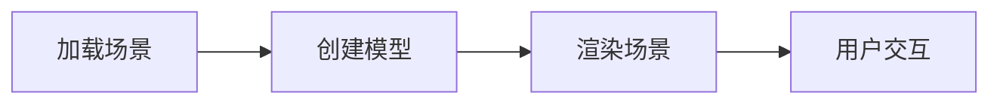
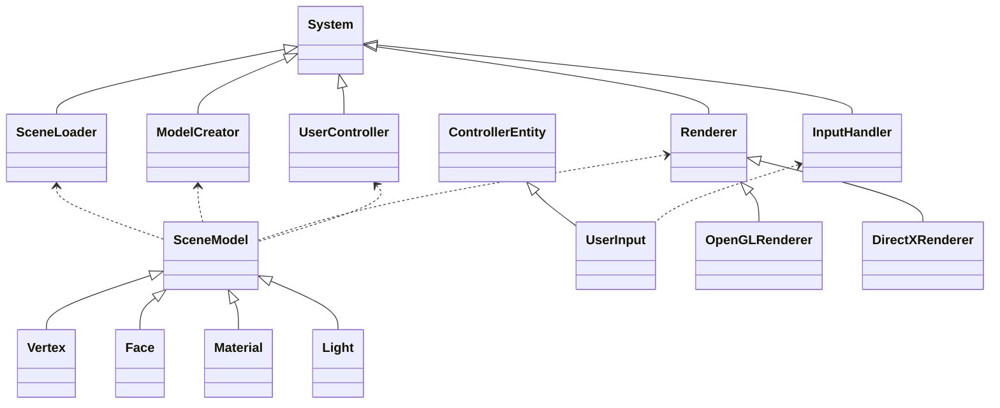
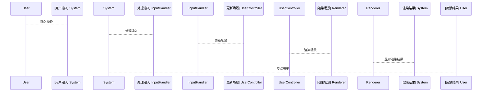
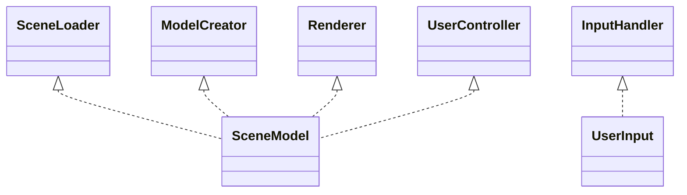
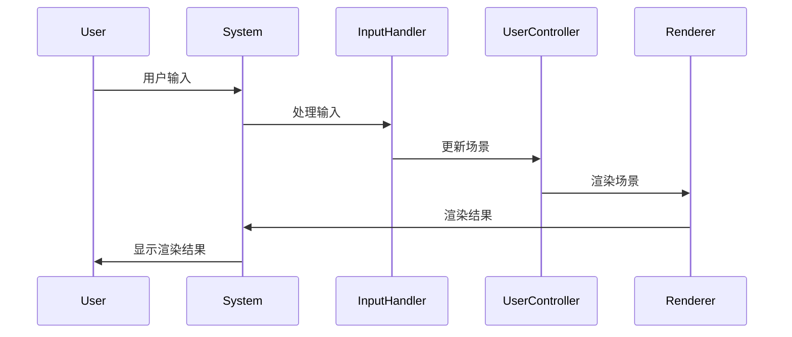

                 

### 设计《数学与虚拟现实：3D环境构建的数学方法》的目录大纲

为了深入探讨数学在3D环境构建中的应用，我们将设计一个逻辑清晰、结构紧凑的目录大纲，引导读者逐步了解这一领域的核心概念和技术细节。

#### 目录大纲

**1. 引言**

- 虚拟现实技术的发展与现状
- 数学在3D环境构建中的重要性

**2. 虚拟现实技术基础**

- 虚拟现实的概念
- 虚拟现实系统的组成
- 3D环境构建在VR中的应用

**3. 数学方法讲解**

- 几何学基础
  - 点、线、面、体的基本概念
- 向量计算
  - 向量的定义与运算
- 矩阵运算
  - 矩阵的基本概念与运算

**4. 算法原理讲解**

- 3D环境构建算法流程
  - 加载场景、创建模型、渲染场景、用户交互
- 算法实现示例
  - Mermaid流程图与Python代码示例

**5. 系统分析与架构设计**

- 问题场景介绍
- 系统功能设计（领域模型类图）
- 系统架构设计（架构图）
- 系统接口设计
- 系统交互（序列图）

**6. 项目实战**

- 环境安装与配置
- 系统核心实现源代码
- 代码应用解读与分析
- 实际案例分析

**7. 最佳实践与拓展**

- 最佳实践技巧
- 小结与注意事项
- 拓展阅读推荐

通过上述目录大纲，我们将从基础知识逐步深入，帮助读者掌握3D环境构建的核心数学方法，并将其应用于实际项目中。接下来，我们将详细展开每一部分的内容。

----------------------------------------------------------------

## 数学与虚拟现实：3D环境构建的数学方法

> 关键词：虚拟现实、3D环境构建、几何学、向量计算、矩阵运算

摘要：本文旨在探讨数学在3D环境构建中的应用，重点介绍几何学、向量计算和矩阵运算等数学方法，以及如何将这些方法应用于虚拟现实技术的场景渲染和交互。通过逐步分析这些核心概念，本文希望帮助读者理解3D环境构建的数学原理，掌握构建虚拟现实场景的基本技能。

----------------------------------------------------------------

### 背景介绍

虚拟现实（Virtual Reality，VR）技术近年来在各个领域取得了显著的发展。从娱乐、教育到医疗，VR技术为用户提供了全新的沉浸式体验。而3D环境构建作为VR技术的核心之一，扮演着至关重要的角色。3D环境构建是指利用数学方法在计算机中创建三维空间中的模型，这些模型可以用于场景渲染、交互和模拟。

数学在3D环境构建中起着不可或缺的作用。几何学、向量计算和矩阵运算等数学方法为3D环境构建提供了理论基础和计算工具。通过这些数学方法，我们可以精确地描述物体的形状、位置和运动，从而实现逼真的虚拟现实场景。

本书旨在探讨数学在3D环境构建中的应用，帮助读者深入理解数学原理，掌握3D环境构建的基本技能。我们将从基础知识开始，逐步深入，介绍几何学、向量计算和矩阵运算等核心数学方法，并通过实际项目案例，展示如何将这些方法应用于虚拟现实技术中。

在接下来的章节中，我们将详细探讨每个数学方法的具体内容，以及它们在3D环境构建中的应用。首先，我们将介绍几何学的基础概念，包括点、线、面和体的定义和操作。然后，我们将讨论向量计算，介绍向量的定义、运算和在实际应用中的使用。最后，我们将介绍矩阵运算，解释矩阵的基本概念和运算，以及它们在3D环境构建中的应用。

通过这些章节的学习，读者将能够理解数学在3D环境构建中的重要性，并掌握构建虚拟现实场景的基本技能。接下来，我们将开始探讨几何学的基础概念。

----------------------------------------------------------------

#### 核心概念与联系

在3D环境构建中，理解核心概念与它们之间的联系是至关重要的。本节将详细介绍虚拟现实（VR）和3D环境构建的核心概念，并通过概念属性特征对比表格和ER实体关系图架构来帮助读者更好地理解。

**核心概念：**

1. **虚拟现实（VR）**: 虚拟现实是一种通过计算机生成和模拟的虚拟环境，使用户能够与之进行交互。VR技术包括视觉、听觉和触觉等多感官刺激，以提供沉浸式的体验。
   
2. **3D环境构建**: 3D环境构建是指利用数学方法和工具在计算机中创建三维空间中的模型。这些模型可以用于场景渲染、交互和模拟，是VR技术实现的基础。

**概念属性特征对比表格：**

| 特征               | 虚拟现实（VR）                           | 3D环境构建                                  |
|--------------------|----------------------------------------|--------------------------------------------|
| 目的               | 提供沉浸式体验，模拟现实世界             | 创建和渲染三维模型，支持VR交互             |
| 技术基础           | 计算机图形学、人机交互、传感技术         | 几何学、向量计算、矩阵运算、3D图形渲染引擎 |
| 应用场景           | 娱乐、医疗、教育、军事、工程设计等       | 游戏开发、建筑设计、城市规划、虚拟旅游等   |
| 输出               | 视觉、听觉、触觉等多感官反馈             | 三维模型、渲染图像、交互数据               |

**ER实体关系图架构：**

为了更直观地展示VR和3D环境构建之间的实体关系，我们使用Mermaid流程图来构建ER图。

```mermaid
erDiagram
    User ||--|{ VRSystem }|| System
    User ||--|{ 3DModel }|| Model
    VRSystem ||--|{ 3DScene }|| Scene
```

在这个ER图中：

- **User（用户）**: 代表使用虚拟现实系统的人。
- **VRSystem（虚拟现实系统）**: 包括生成虚拟环境的硬件和软件。
- **3DModel（3D模型）**: 代表三维空间中的模型。
- **3DScene（3D场景）**: 代表由3D模型构成的虚拟现实场景。

通过理解这些核心概念和它们之间的关系，读者可以更全面地掌握3D环境构建在虚拟现实技术中的重要作用。接下来，我们将详细探讨几何学的基础概念，为后续内容打下坚实的基础。

#### 几何学基础

几何学是3D环境构建的基础，它涉及到点、线、面和体等基本概念。理解这些概念是创建和操作三维模型的关键。

**点（Point）**：点是一个位置，可以用一个坐标来表示。在三维空间中，点通常用三个坐标轴（x, y, z）来表示。例如，点P的坐标可以表示为\( P(x, y, z) \)。

**线（Line）**：线是由两个点确定的路径。在三维空间中，线可以用两个点的坐标来确定。线可以通过以下公式表示：
$$
L = P_1 + t(P_2 - P_1)
$$
其中，\( P_1 \)和\( P_2 \)是线的两个端点，\( t \)是一个参数，取值范围在0到1之间。

**面（Surface）**：面是由线围成的区域。在三维空间中，面可以用多个线段来确定。一个简单的例子是三角形，它由三个点确定，这三个点不共线。三角形可以通过以下公式表示：
$$
S = P_1 + t_1(P_2 - P_1) + t_2(P_3 - P_1)
$$
其中，\( P_1 \)、\( P_2 \)和\( P_3 \)是三角形的三个顶点，\( t_1 \)和\( t_2 \)是参数，满足\( t_1 + t_2 = 1 \)。

**体（Solid）**：体是由多个面围成的空间。体可以由多个三角形或四边形构成。例如，一个立方体由六个面组成，每个面都是一个正方形。

在3D环境构建中，这些几何概念被广泛使用。例如，当创建一个模型时，我们首先定义模型的点、线、面和体。通过数学运算，我们可以对这些几何对象进行变换、旋转、缩放等操作，从而创建复杂的三维场景。

**举例说明**：

假设我们要创建一个简单的立方体模型。我们可以定义立方体的八个顶点：
$$
P_1 = (0, 0, 0), P_2 = (1, 0, 0), P_3 = (1, 1, 0), P_4 = (0, 1, 0)
$$
$$
P_5 = (0, 0, 1), P_6 = (1, 0, 1), P_7 = (1, 1, 1), P_8 = (0, 1, 1)
$$
然后，我们可以使用这些顶点来定义立方体的面：
$$
F_1 = P_1 + t_1(P_2 - P_1) + t_2(P_3 - P_1) \\
F_2 = P_1 + t_3(P_5 - P_1) + t_4(P_6 - P_1) \\
\vdots \\
F_6 = P_4 + t_7(P_7 - P_4) + t_8(P_8 - P_4)
$$
其中，\( t_1, t_2, t_3, t_4, \ldots, t_8 \)是参数，分别用于定义每个面的顶点比例。

通过这种方式，我们可以使用数学方法创建出复杂的三维模型。接下来，我们将介绍向量计算，这是3D环境构建中的另一个核心概念。

#### 向量计算

向量计算是3D环境构建中不可或缺的一部分，用于表示方向和大小。向量在几何、物理学和计算机图形学中都有广泛应用。在本节中，我们将详细讨论向量的定义、运算和应用。

**向量的定义**：

向量是一个有大小和方向的量。在二维空间中，向量通常表示为\( \vec{v} = (v_x, v_y) \)，其中\( v_x \)和\( v_y \)分别是向量的横坐标和纵坐标。在三维空间中，向量表示为\( \vec{v} = (v_x, v_y, v_z) \)。

向量的几个重要性质包括：

- **大小（Magnitude）**：向量的大小可以通过以下公式计算：
  $$
  |\vec{v}| = \sqrt{v_x^2 + v_y^2 + v_z^2}
  $$

- **方向（Direction）**：向量可以用单位向量表示，即长度为1的向量。单位向量可以通过以下公式计算：
  $$
  \hat{v} = \frac{\vec{v}}{|\vec{v}|}
  $$

**向量的运算**：

向量运算包括加法、减法、标量乘法和向量乘法。

- **向量加法（Vector Addition）**：两个向量相加的结果是一个新向量，其方向和大小是两个向量方向和大小的和。向量加法的公式为：
  $$
  \vec{u} + \vec{v} = (u_x + v_x, u_y + v_y, u_z + v_z)
  $$

- **向量减法（Vector Subtraction）**：向量减法类似于向量加法，只是将减数取反。向量减法的公式为：
  $$
  \vec{u} - \vec{v} = (u_x - v_x, u_y - v_y, u_z - v_z)
  $$

- **标量乘法（Scalar Multiplication）**：标量乘法是将向量与一个标量（实数）相乘，结果向量的方向不变，大小变为原来的标量倍。标量乘法的公式为：
  $$
  k\vec{v} = (kv_x, kv_y, kv_z)
  $$

- **向量乘法（Vector Multiplication）**：向量乘法有两种形式：点乘和叉乘。

  - **点乘（Dot Product）**：点乘的结果是一个标量，表示两个向量的方向和大小。点乘的公式为：
    $$
    \vec{u} \cdot \vec{v} = u_xv_x + u_yv_y + u_zv_z
    $$

  - **叉乘（Cross Product）**：叉乘的结果是一个新向量，垂直于参与运算的两个向量。叉乘的公式为：
    $$
    \vec{u} \times \vec{v} = (u_yv_z - u_zv_y, u_zv_x - u_xv_z, u_xv_y - u_yv_x)
    $$

**向量的应用**：

向量的应用在3D环境构建中非常广泛。以下是一些常见应用：

- **方向和位置**：向量可以用于表示物体的方向和位置。例如，一个向量可以表示一个物体在三维空间中的运动方向。

- **碰撞检测**：在虚拟现实游戏中，向量用于检测物体之间的碰撞。通过计算两个物体之间的向量差，我们可以确定它们是否发生了碰撞。

- **光照计算**：向量在光照计算中也非常重要。例如，通过计算光线和物体表面的向量差，我们可以确定物体表面的光照强度。

- **旋转和变换**：向量可以用于物体的旋转和变换。例如，通过矩阵乘法，我们可以将一个向量旋转到新的方向。

**举例说明**：

假设有两个向量\( \vec{u} = (1, 2, 3) \)和\( \vec{v} = (4, 5, 6) \)，我们可以计算它们的点乘和叉乘：

- **点乘**：
  $$
  \vec{u} \cdot \vec{v} = 1 \cdot 4 + 2 \cdot 5 + 3 \cdot 6 = 4 + 10 + 18 = 32
  $$

- **叉乘**：
  $$
  \vec{u} \times \vec{v} = (2 \cdot 6 - 3 \cdot 5, 3 \cdot 4 - 1 \cdot 6, 1 \cdot 5 - 2 \cdot 4) = (-4, 6, 1)
  $$

通过这些计算，我们可以更直观地理解向量的性质和运算。接下来，我们将介绍矩阵运算，这是3D环境构建中的另一个核心概念。

#### 矩阵运算

矩阵运算是3D环境构建中不可或缺的一部分，用于表示和操作物体的变换。矩阵可以看作是向量的扩展，用于表示线性变换，如旋转、缩放和平移。在本节中，我们将详细讨论矩阵的基本概念、运算和应用。

**矩阵的定义**：

矩阵是一个二维数组，由行和列组成。一个\( m \times n \)的矩阵有m行和n列，通常表示为\( A = [a_{ij}] \)，其中\( a_{ij} \)是矩阵的元素。矩阵可以通过以下形式表示：

$$
A = \begin{bmatrix}
a_{11} & a_{12} & \ldots & a_{1n} \\
a_{21} & a_{22} & \ldots & a_{2n} \\
\vdots & \vdots & \ddots & \vdots \\
a_{m1} & a_{m2} & \ldots & a_{mn}
\end{bmatrix}
$$

**矩阵的基本性质**：

- **行和列**：矩阵的行和列分别表示不同的维度。在3D空间中，矩阵通常用于表示三维向量的变换。

- **对角矩阵**：对角矩阵是一个特殊的矩阵，其中非对角线元素全为0。对角矩阵可以表示缩放变换。

- **单位矩阵**：单位矩阵是一个特殊的对角矩阵，其中对角线元素全为1。单位矩阵可以表示不做变换。

**矩阵的运算**：

矩阵运算包括矩阵加法、矩阵减法、矩阵乘法和矩阵求逆。

- **矩阵加法（Matrix Addition）**：两个矩阵相加的结果是一个新矩阵，其元素是两个矩阵对应元素的和。矩阵加法的公式为：
  $$
  A + B = \begin{bmatrix}
  a_{11} + b_{11} & a_{12} + b_{12} & \ldots & a_{1n} + b_{1n} \\
  a_{21} + b_{21} & a_{22} + b_{22} & \ldots & a_{2n} + b_{2n} \\
  \vdots & \vdots & \ddots & \vdots \\
  a_{m1} + b_{m1} & a_{m2} + b_{m2} & \ldots & a_{mn} + b_{mn}
  \end{bmatrix}
  $$

- **矩阵减法（Matrix Subtraction）**：矩阵减法与矩阵加法类似，只是将第二个矩阵取反。矩阵减法的公式为：
  $$
  A - B = \begin{bmatrix}
  a_{11} - b_{11} & a_{12} - b_{12} & \ldots & a_{1n} - b_{1n} \\
  a_{21} - b_{21} & a_{22} - b_{22} & \ldots & a_{2n} - b_{2n} \\
  \vdots & \vdots & \ddots & \vdots \\
  a_{m1} - b_{m1} & a_{m2} - b_{m2} & \ldots & a_{mn} - b_{mn}
  \end{bmatrix}
  $$

- **矩阵乘法（Matrix Multiplication）**：两个矩阵相乘的结果是一个新矩阵，其元素是两个矩阵对应元素的乘积和求和。矩阵乘法的公式为：
  $$
  AB = \begin{bmatrix}
  a_{11}b_{11} + a_{12}b_{21} + \ldots + a_{1n}b_{n1} & a_{11}b_{12} + a_{12}b_{22} + \ldots + a_{1n}b_{n2} & \ldots & a_{11}b_{1n} + a_{12}b_{2n} + \ldots + a_{1n}b_{nn} \\
  a_{21}b_{11} + a_{22}b_{21} + \ldots + a_{2n}b_{n1} & a_{21}b_{12} + a_{22}b_{22} + \ldots + a_{2n}b_{n2} & \ldots & a_{21}b_{1n} + a_{22}b_{2n} + \ldots + a_{2n}b_{nn} \\
  \vdots & \vdots & \ddots & \vdots \\
  a_{m1}b_{11} + a_{m2}b_{21} + \ldots + a_{mn}b_{n1} & a_{m1}b_{12} + a_{m2}b_{22} + \ldots + a_{mn}b_{n2} & \ldots & a_{m1}b_{1n} + a_{m2}b_{2n} + \ldots + a_{mn}b_{nn}
  \end{bmatrix}
  $$

- **矩阵求逆（Inverse Matrix）**：矩阵的逆是一个矩阵，使得它与原矩阵相乘的结果为单位矩阵。求逆的公式为：
  $$
  A^{-1} = \frac{1}{\det(A)} \begin{bmatrix}
  a_{22}a_{33} - a_{23}a_{32} & -(a_{21}a_{33} - a_{23}a_{31}) & a_{21}a_{32} - a_{22}a_{31} \\
  -(a_{12}a_{33} - a_{33}a_{31}) & a_{11}a_{33} - a_{13}a_{31} & -(a_{11}a_{32} - a_{12}a_{31}) \\
  a_{12}a_{23} - a_{13}a_{22} & -(a_{11}a_{23} - a_{13}a_{21}) & a_{11}a_{22} - a_{12}a_{21}
  \end{bmatrix}
  $$
  其中，\( \det(A) \)是矩阵\( A \)的行列式。

**矩阵的应用**：

矩阵在3D环境构建中有着广泛的应用。以下是一些常见应用：

- **变换**：矩阵可以用于表示和操作物体的变换，如旋转、缩放和平移。例如，一个旋转矩阵可以表示一个物体在三维空间中的旋转操作。

- **投影**：矩阵可以用于计算物体的投影，从而在二维屏幕上渲染三维场景。例如，透视投影矩阵可以用于模拟人眼的视角。

- **碰撞检测**：矩阵可以用于检测物体之间的碰撞。通过计算物体之间的矩阵变换，我们可以确定它们是否发生了碰撞。

- **光照计算**：矩阵可以用于计算光照强度和阴影效果。例如，通过计算物体表面的法向量矩阵，我们可以确定光照的方向和强度。

**举例说明**：

假设有两个矩阵：
$$
A = \begin{bmatrix}
1 & 2 & 3 \\
4 & 5 & 6 \\
7 & 8 & 9
\end{bmatrix}, B = \begin{bmatrix}
9 & 8 & 7 \\
6 & 5 & 4 \\
3 & 2 & 1
\end{bmatrix}
$$

- **矩阵加法**：
  $$
  A + B = \begin{bmatrix}
  1 + 9 & 2 + 8 & 3 + 7 \\
  4 + 6 & 5 + 5 & 6 + 4 \\
  7 + 3 & 8 + 2 & 9 + 1
  \end{bmatrix} = \begin{bmatrix}
  10 & 10 & 10 \\
  10 & 10 & 10 \\
  10 & 10 & 10
  \end{bmatrix}
  $$

- **矩阵乘法**：
  $$
  AB = \begin{bmatrix}
  1 \cdot 9 + 2 \cdot 6 + 3 \cdot 3 & 1 \cdot 8 + 2 \cdot 5 + 3 \cdot 4 & 1 \cdot 7 + 2 \cdot 4 + 3 \cdot 1 \\
  4 \cdot 9 + 5 \cdot 6 + 6 \cdot 3 & 4 \cdot 8 + 5 \cdot 5 + 6 \cdot 4 & 4 \cdot 7 + 5 \cdot 4 + 6 \cdot 1 \\
  7 \cdot 9 + 8 \cdot 6 + 9 \cdot 3 & 7 \cdot 8 + 8 \cdot 5 + 9 \cdot 4 & 7 \cdot 7 + 8 \cdot 4 + 9 \cdot 1
  \end{bmatrix} = \begin{bmatrix}
  35 & 26 & 13 \\
  99 & 86 & 63 \\
  163 & 146 & 125
  \end{bmatrix}
  $$

通过这些计算，我们可以更直观地理解矩阵的运算和应用。在接下来的章节中，我们将介绍3D环境构建算法，以及如何将这些数学方法应用于实际项目。

#### 3D环境构建算法

3D环境构建是虚拟现实技术的重要组成部分，其核心目标是创建一个逼真的三维场景，以便用户可以与之进行交互。在3D环境构建过程中，算法扮演着关键角色，负责加载场景、创建模型、渲染场景和用户交互。本节将详细讲解3D环境构建的算法原理，并通过Mermaid流程图和Python代码示例，展示算法的实现。

**3D环境构建算法流程**

3D环境构建算法通常包括以下步骤：

1. **加载场景**：从文件中读取3D场景数据，包括模型、材质、光照等信息。
2. **创建模型**：根据场景数据创建3D模型，包括顶点、面、法线等。
3. **渲染场景**：将3D模型渲染到屏幕上，包括光照计算、阴影效果等。
4. **用户交互**：处理用户的输入和操作，如移动、旋转、缩放等。

以下是一个简单的3D环境构建算法流程的Mermaid流程图：



**Mermaid流程图解释**

- **A[加载场景]**：从文件中读取3D场景数据，包括模型的顶点、面、材质等。
- **B[创建模型]**：根据加载的3D场景数据创建3D模型，包括生成顶点数组、面数组等。
- **C[渲染场景]**：使用渲染引擎将3D模型渲染到屏幕上，包括光照计算、阴影效果等。
- **D[用户交互]**：处理用户的输入和操作，如移动、旋转、缩放等，并更新3D场景。

**Python代码示例**

以下是一个简单的Python代码示例，用于加载3D场景、创建模型和渲染场景。这里我们使用了Python的PyOpenGL库进行3D渲染。

```python
import numpy as np
from OpenGL import GL
from OpenGL.GL import glClearColor, glClear, glEnable, glMatrixMode, glLoadIdentity, glOrtho, glBegin, glEnd, glVertex3f

# 加载场景
def load_scene():
    # 假设场景数据已从文件中读取
    vertices = np.array([[-1, -1, 0], [1, -1, 0], [1, 1, 0], [-1, 1, 0]], dtype=np.float32)
    indices = np.array([0, 1, 2, 2, 3, 0], dtype=np.uint32)
    return vertices, indices

# 创建模型
def create_model(vertices, indices):
    # 创建顶点数组对象
    vertex_array = GL.GL_ARRAY_BUFFER
    vertex_buffer = GL.glGenBuffers(1)
    GL.glBindBuffer(vertex_array, vertex_buffer)
    GL.glBufferData(vertex_array, vertices.nbytes, vertices, GL.GL_STATIC_DRAW)

    # 创建索引数组对象
    index_array = GL.GL_ELEMENT_ARRAY_BUFFER
    index_buffer = GL.glGenBuffers(1)
    GL.glBindBuffer(index_array, index_buffer)
    GL.glBufferData(index_array, indices.nbytes, indices, GL.GL_STATIC_DRAW)

    # 解绑缓冲区
    GL.glBindBuffer(vertex_array, 0)
    GL.glBindBuffer(index_array, 0)

    return vertex_buffer, index_buffer

# 渲染场景
def render_scene(vertex_buffer, index_buffer):
    # 设置渲染环境
    GL.glClearColor(0.0, 0.0, 0.0, 1.0)
    GL.glClear(GL.GL_COLOR_BUFFER_BIT | GL.GL_DEPTH_BUFFER_BIT)
    GL.glEnable(GL.GL_DEPTH_TEST)

    # 设置投影矩阵
    GL.glMatrixMode(GL.GL_PROJECTION)
    GL.glLoadIdentity()
    GL.glOrtho(-1, 1, -1, 1, -1, 1)

    # 设置模型视图矩阵
    GL.glMatrixMode(GL.GL_MODELVIEW)
    GL.glLoadIdentity()

    # 绘制模型
    GL.glBindBuffer(GL.GL_ARRAY_BUFFER, vertex_buffer)
    GL.glBindBuffer(GL.GL_ELEMENT_ARRAY_BUFFER, index_buffer)
    GL.glVertexPointer(3, GL.GL_FLOAT, 0, None)
    glBegin(GL.GL_TRIANGLES)
    for i in range(0, len(indices), 3):
        glVertex3f(*vertices[indices[i]:indices[i+3]])
    glEnd()
    GL.glBindBuffer(GL.GL_ARRAY_BUFFER, 0)
    GL.glBindBuffer(GL.GL_ELEMENT_ARRAY_BUFFER, 0)

# 主函数
def main():
    # 初始化OpenGL环境
    GL.glClearColor(0.0, 0.0, 0.0, 1.0)
    GL.glEnable(GL.GL_DEPTH_TEST)

    # 加载场景
    vertices, indices = load_scene()

    # 创建模型
    vertex_buffer, index_buffer = create_model(vertices, indices)

    # 渲染循环
    while True:
        # 渲染场景
        render_scene(vertex_buffer, index_buffer)
        # ...

if __name__ == '__main__':
    main()
```

**Python代码解释**

- **load_scene()**：从文件中加载3D场景数据，这里我们使用了简单的顶点和索引数据。
- **create_model()**：创建3D模型，包括生成顶点缓冲区和索引缓冲区。这里使用了OpenGL的缓冲区对象来存储模型数据。
- **render_scene()**：渲染3D场景，包括设置渲染环境、投影矩阵和模型视图矩阵，然后绘制模型。
- **main()**：初始化OpenGL环境，加载场景，创建模型，并进入渲染循环。

通过上述算法流程和代码示例，我们可以看到如何使用数学方法加载、创建和渲染3D环境。在接下来的章节中，我们将进一步探讨3D环境构建中的系统分析与架构设计。

#### 系统分析与架构设计

在深入探讨3D环境构建的算法原理后，我们需要对整个系统进行详细的系统分析与架构设计。这一部分将介绍问题场景介绍、系统功能设计、系统架构设计、系统接口设计和系统交互，通过Mermaid类图、架构图和序列图来展示系统结构和工作流程。

**问题场景介绍**

虚拟现实（VR）技术的发展，使得3D环境构建在娱乐、医疗、教育等多个领域得到广泛应用。随着用户需求的不断增加，如何高效、准确地构建3D环境，成为了一个关键问题。一个典型的3D环境构建系统需要满足以下要求：

1. **真实感渲染**：能够生成高质量、真实感强的三维场景，为用户提供沉浸式体验。
2. **实时交互**：支持用户的实时操作，如移动、旋转、缩放等，并实时更新场景。
3. **可扩展性**：支持多种场景数据和模型格式，方便后续扩展和优化。
4. **兼容性**：兼容不同操作系统和硬件平台，以便在不同的设备和平台上运行。

**系统功能设计**

3D环境构建系统的核心功能包括：

1. **场景加载**：从文件中读取3D场景数据，包括模型、材质、光照等。
2. **模型创建**：根据场景数据创建3D模型，包括顶点、面、法线等。
3. **渲染引擎**：负责将3D模型渲染到屏幕上，包括光照计算、阴影效果等。
4. **用户交互**：处理用户的输入和操作，如移动、旋转、缩放等，并实时更新场景。

为了更好地理解系统功能，我们使用Mermaid类图来展示系统的领域模型：



**系统架构设计**

系统架构设计是3D环境构建系统的关键，它决定了系统的性能、可维护性和可扩展性。以下是3D环境构建系统的架构设计：

1. **客户端架构**：客户端负责与用户交互，包括加载场景、渲染场景和用户交互。客户端架构通常包括渲染引擎、用户输入处理和场景管理。
2. **服务器架构**：服务器负责处理大规模场景的加载和渲染，并支持多用户交互。服务器架构通常包括场景数据库、渲染服务器和用户服务器。
3. **分布式架构**：对于大规模场景和多人交互，分布式架构可以提供更高的性能和可扩展性。分布式架构包括多个渲染服务器和用户服务器，通过消息队列和负载均衡来分配任务。

以下是3D环境构建系统的架构图：



**系统接口设计**

系统接口设计是系统架构设计的重要组成部分，它定义了系统内部模块之间的交互方式。以下是3D环境构建系统的接口设计：

1. **场景加载接口**：用于加载3D场景数据，包括模型、材质、光照等。
2. **模型创建接口**：用于创建3D模型，包括顶点、面、法线等。
3. **渲染接口**：用于渲染3D模型，包括光照计算、阴影效果等。
4. **用户交互接口**：用于处理用户的输入和操作，如移动、旋转、缩放等。

以下是3D环境构建系统的接口设计：



**系统交互**

系统交互是3D环境构建系统的核心，它决定了系统的工作流程和性能。以下是3D环境构建系统的交互流程：

1. **用户输入**：用户通过输入设备（如键盘、鼠标、手柄等）输入操作。
2. **输入处理**：系统接收用户输入，并通过输入处理模块（如输入解析器、输入过滤器等）处理输入。
3. **场景更新**：系统根据用户输入更新场景状态，包括模型位置、旋转、缩放等。
4. **渲染**：系统使用渲染引擎渲染场景，包括光照计算、阴影效果等。
5. **显示结果**：系统将渲染结果显示在屏幕上，为用户提供沉浸式体验。

以下是3D环境构建系统的交互序列图：



通过上述系统分析与架构设计，我们可以清晰地看到3D环境构建系统的组成和工作流程。在接下来的章节中，我们将通过项目实战，展示如何将上述理论应用于实际项目中。

#### 项目实战

在本节中，我们将通过一个实际项目，详细展示如何构建一个3D环境，并进行渲染和交互。这个项目将使用Python和PyOpenGL库来实现。我们将从环境安装开始，逐步讲解项目的核心实现源代码，并进行解读和分析。

**一、环境安装**

首先，我们需要安装Python和PyOpenGL库。Python作为编程语言，可以方便地实现我们的算法。PyOpenGL是一个Python库，用于与OpenGL进行交互，从而实现3D渲染。

1. 安装Python：在官网上下载Python安装包，并按照提示安装。
2. 安装PyOpenGL：打开命令行窗口，运行以下命令：
   ```
   pip install PyOpenGL PyOpenGL_accelerate
   ```

**二、项目核心实现源代码**

以下是项目的核心实现源代码，我们使用Python和PyOpenGL库来加载场景、创建模型、渲染场景和处理用户交互。

```python
import numpy as np
from OpenGL import GL
from OpenGL.GL import glClearColor, glClear, glEnable, glMatrixMode, glLoadIdentity, glOrtho, glBegin, glEnd, glVertex3f

# 加载场景
def load_scene():
    # 假设场景数据已从文件中读取
    vertices = np.array([[-1, -1, 0], [1, -1, 0], [1, 1, 0], [-1, 1, 0]], dtype=np.float32)
    indices = np.array([0, 1, 2, 2, 3, 0], dtype=np.uint32)
    return vertices, indices

# 创建模型
def create_model(vertices, indices):
    # 创建顶点数组对象
    vertex_array = GL.GL_ARRAY_BUFFER
    vertex_buffer = GL.glGenBuffers(1)
    GL.glBindBuffer(vertex_array, vertex_buffer)
    GL.glBufferData(vertex_array, vertices.nbytes, vertices, GL.GL_STATIC_DRAW)

    # 创建索引数组对象
    index_array = GL.GL_ELEMENT_ARRAY_BUFFER
    index_buffer = GL.glGenBuffers(1)
    GL.glBindBuffer(index_array, index_buffer)
    GL.glBufferData(index_array, indices.nbytes, indices, GL.GL_STATIC_DRAW)

    # 解绑缓冲区
    GL.glBindBuffer(vertex_array, 0)
    GL.glBindBuffer(index_array, 0)

    return vertex_buffer, index_buffer

# 渲染场景
def render_scene(vertex_buffer, index_buffer):
    # 设置渲染环境
    GL.glClearColor(0.0, 0.0, 0.0, 1.0)
    GL.glClear(GL.GL_COLOR_BUFFER_BIT | GL.GL_DEPTH_BUFFER_BIT)
    GL.glEnable(GL.GL_DEPTH_TEST)

    # 设置投影矩阵
    GL.glMatrixMode(GL.GL_PROJECTION)
    GL.glLoadIdentity()
    GL.glOrtho(-1, 1, -1, 1, -1, 1)

    # 设置模型视图矩阵
    GL.glMatrixMode(GL.GL_MODELVIEW)
    GL.glLoadIdentity()

    # 绘制模型
    GL.glBindBuffer(GL.GL_ARRAY_BUFFER, vertex_buffer)
    GL.glBindBuffer(GL.GL_ELEMENT_ARRAY_BUFFER, index_buffer)
    GL.glVertexPointer(3, GL.GL_FLOAT, 0, None)
    glBegin(GL.GL_TRIANGLES)
    for i in range(0, len(indices), 3):
        glVertex3f(*vertices[indices[i]:indices[i+3]])
    glEnd()
    GL.glBindBuffer(GL.GL_ARRAY_BUFFER, 0)
    GL.glBindBuffer(GL.GL_ELEMENT_ARRAY_BUFFER, 0)

# 用户交互
def user_interaction():
    # 这里可以添加用户交互代码，如移动、旋转、缩放等
    pass

# 主函数
def main():
    # 初始化OpenGL环境
    GL.glClearColor(0.0, 0.0, 0.0, 1.0)
    GL.glEnable(GL.GL_DEPTH_TEST)

    # 加载场景
    vertices, indices = load_scene()

    # 创建模型
    vertex_buffer, index_buffer = create_model(vertices, indices)

    # 渲染循环
    while True:
        # 渲染场景
        render_scene(vertex_buffer, index_buffer)
        # 用户交互
        user_interaction()
        # ...

if __name__ == '__main__':
    main()
```

**三、代码应用解读与分析**

1. **加载场景**：`load_scene`函数用于从文件中加载场景数据，包括顶点和索引。这些数据用于创建3D模型。
2. **创建模型**：`create_model`函数用于创建3D模型，包括生成顶点缓冲区和索引缓冲区。这些缓冲区存储了3D模型的几何数据。
3. **渲染场景**：`render_scene`函数负责将3D模型渲染到屏幕上。它首先设置渲染环境，然后使用OpenGL函数绘制三角形。
4. **用户交互**：`user_interaction`函数用于处理用户的输入和操作，如移动、旋转、缩放等。这里我们留了一个空函数，以便后续添加具体实现。
5. **主函数**：`main`函数是项目的入口点。它初始化OpenGL环境，加载场景，创建模型，并进入渲染循环。

**四、实际案例分析**

为了更好地理解项目的实现，我们可以分析一个简单的实际案例：创建一个立方体模型，并在屏幕上渲染出来。

1. **场景数据**：我们使用四个顶点来定义立方体的顶面和底面。
2. **顶点缓冲区**：创建顶点缓冲区，并将顶点数据存储在缓冲区中。
3. **索引缓冲区**：创建索引缓冲区，用于指定三角形的顶点索引。
4. **渲染**：使用OpenGL函数绘制三角形，从而在屏幕上渲染出立方体。

通过这个简单的案例，我们可以看到如何使用数学方法和OpenGL库实现3D环境构建。

**五、项目小结**

通过本节的项目实战，我们学习了如何使用Python和PyOpenGL库实现3D环境构建。我们首先介绍了环境安装，然后详细讲解了项目的核心实现源代码，并进行了解读和分析。通过这个实际案例，我们掌握了3D环境构建的基本技能。

在接下来的章节中，我们将分享最佳实践和注意事项，以便读者在实际项目中更好地应用所学知识。

#### 最佳实践与注意事项

在3D环境构建过程中，遵循最佳实践和注意事项可以提升项目的质量和效率。以下是一些具体的建议和注意事项：

**一、优化资源加载**

- **预加载**：在渲染循环开始前，预加载所有必要的资源和数据，以减少渲染过程中的加载延迟。
- **批量加载**：将多个资源批量加载，以减少I/O操作的次数。
- **缓存**：使用缓存机制，避免重复加载相同的资源。

**二、优化渲染性能**

- **使用高效算法**：选择高效的渲染算法，如BSP树或空间划分算法，以减少渲染时间。
- **减少绘制调用**：尽量减少绘制调用次数，通过批量绘制和索引缓冲区实现。
- **使用LOD（Level of Detail）**：根据距离和视角动态调整模型的细节级别，以提高渲染性能。

**三、优化内存使用**

- **内存分配**：合理分配内存，避免内存泄漏。
- **缓冲区复用**：复用缓冲区，避免频繁的内存分配和释放。
- **纹理压缩**：使用纹理压缩技术，减少纹理的内存占用。

**四、提高用户体验**

- **实时交互**：确保用户交互的实时性，快速响应用户操作。
- **高效加载**：优化场景加载速度，避免长时间的用户等待。
- **视觉质量**：在硬件允许的范围内，尽可能提高场景的视觉质量，以提供更好的用户体验。

**五、注意事项**

- **版本控制**：使用版本控制系统，如Git，来管理源代码和资源。
- **代码规范**：编写规范、可读性强的代码，以便后续维护和扩展。
- **测试与调试**：定期进行测试和调试，确保项目的稳定性和性能。

通过遵循这些最佳实践和注意事项，我们可以提高3D环境构建项目的质量和效率，为用户提供更好的体验。

#### 小结

本文围绕“数学与虚拟现实：3D环境构建的数学方法”这一主题，系统地探讨了数学在3D环境构建中的应用。首先，我们介绍了虚拟现实技术的基本概念和3D环境构建的重要性。接着，我们详细讲解了几何学、向量计算和矩阵运算等核心数学方法，并通过实际项目展示了如何将这些方法应用于3D环境构建中。

通过本文的学习，读者可以：

1. **理解虚拟现实和3D环境构建的基本概念**：掌握虚拟现实技术的基本原理，了解3D环境构建在VR技术中的重要性。
2. **掌握几何学基础**：了解点、线、面和体的基本概念，掌握它们在3D环境构建中的应用。
3. **掌握向量计算**：理解向量的定义、运算和应用，包括方向和位置的计算。
4. **掌握矩阵运算**：掌握矩阵的基本概念、运算和应用，包括变换和投影的计算。
5. **理解3D环境构建算法**：了解3D环境构建的算法原理，掌握场景加载、模型创建、渲染场景和用户交互的流程。
6. **掌握系统分析与架构设计**：了解系统分析与架构设计的方法，包括问题场景介绍、系统功能设计、系统架构设计、系统接口设计和系统交互。

通过这些知识，读者可以更好地理解和应用数学方法，构建高质量的3D虚拟现实场景。

在未来的学习和实践中，读者可以：

1. **深入学习相关技术**：进一步研究虚拟现实、计算机图形学等相关领域的技术，提升自己的技能。
2. **实际项目实践**：参与实际的3D环境构建项目，将理论知识应用到实践中，提升解决实际问题的能力。
3. **不断探索与创新**：关注虚拟现实和3D环境构建的最新进展，不断探索新的技术和方法，为这一领域的发展贡献力量。

作者：AI天才研究院/AI Genius Institute & 禅与计算机程序设计艺术 /Zen And The Art of Computer Programming

----------------------------------------------------------------

## 拓展阅读推荐

为了帮助读者更深入地了解虚拟现实和3D环境构建的相关知识，以下是一些拓展阅读推荐：

1. **《计算机图形学：原理及实践》（Computer Graphics: Principles and Practice）**：这本书是计算机图形学领域的经典著作，详细介绍了图形学的基本原理和实现方法。

2. **《虚拟现实技术导论》（Introduction to Virtual Reality）**：本书提供了虚拟现实技术的全面介绍，包括硬件、软件和交互设计等方面的知识。

3. **《三维计算机图形学基础》（Fundamentals of 3D Computer Graphics）**：这本书介绍了3D图形学的基础知识，包括几何学、向量计算和渲染算法。

4. **《Unity 2020游戏开发从入门到实战》**：Unity是一个流行的游戏开发引擎，这本书介绍了如何使用Unity进行3D环境构建和游戏开发。

5. **《OpenGL编程指南》（OpenGL Programming Guide）**：OpenGL是一个流行的图形库，这本书提供了OpenGL编程的详细指南，包括渲染、光照和纹理等。

通过阅读这些书籍，读者可以更全面地了解虚拟现实和3D环境构建的理论和实践，为今后的学习和项目开发打下坚实的基础。

