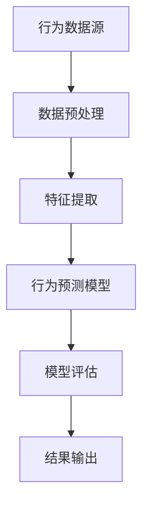
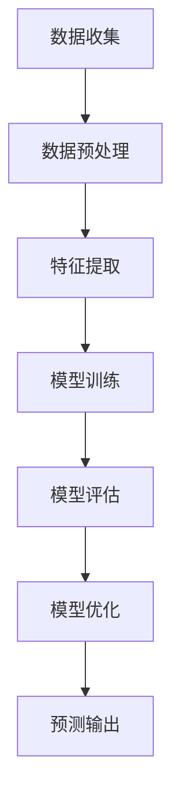

                 

### 数学与行为分析：人类行为的数学预测

#### 关键词：
- 数学与行为分析
- 人类行为预测
- 数学模型
- 数据分析
- 算法

> 摘要：本文旨在探讨数学与行为分析在人类行为预测中的应用。通过介绍数学模型的基本原理、行为数据解析以及行为预测算法，本文系统地阐述了如何利用数学方法对人类行为进行量化分析和预测。文章还通过实际案例和项目实战，展示了数学与行为分析在现实场景中的有效应用，为相关领域的研究和实践提供了有益的参考。

---

### 第一部分：背景介绍

#### 1.1 问题背景

在现代社会，人类行为的预测与分析具有重要的应用价值。无论是市场营销、社会科学研究，还是公共安全、医疗卫生等领域，准确预测人类行为都能够带来显著的效益。然而，人类行为复杂多变，受到诸多因素的影响，如文化、社会背景、个体心理等。因此，如何有效地利用数学方法对人类行为进行量化分析和预测，成为了一个具有挑战性的课题。

#### 1.2 问题描述

数学与行为分析旨在通过数学方法，对人类行为进行量化描述和预测。这一过程包括以下几个关键步骤：

- **数据收集与处理**：收集个体或群体的行为数据，并进行数据预处理，如清洗、归一化等。
- **特征提取**：从原始数据中提取与行为相关的特征，用于构建数学模型。
- **模型构建与训练**：利用提取的特征，构建数学模型，并通过训练数据对其进行优化。
- **模型评估与优化**：利用验证数据对模型进行评估，并根据评估结果对模型进行调整和优化。
- **行为预测**：利用训练好的模型，对个体或群体的未来行为进行预测。

#### 1.3 问题解决

为了解决上述问题，本文将系统地介绍数学与行为分析的基本理论、方法和应用。具体包括以下内容：

- **数学模型原理**：介绍数学模型的基本原理、属性特征对比以及与传统行为的区别。
- **行为数据解析**：探讨行为数据的收集与处理、属性特征对比和与传统数据的区别。
- **行为预测模型**：分析行为预测模型的概念原理、ER实体关系图架构以及与传统预测方法的区别。
- **算法原理讲解**：详细阐述行为预测算法的基本原理、Mermaid流程图以及与传统算法的区别。

#### 1.4 边界与外延

数学与行为分析不仅限于社会科学领域，其应用范围广泛，包括心理学、经济学、社会学、管理学等多个学科。本文将聚焦于人类社会行为的研究，探讨数学方法在行为分析中的具体应用。

#### 1.5 概念结构与核心要素组成

数学与行为分析的核心概念包括：

- **行为数据**：用于行为分析的原始数据，如问卷调查结果、行为记录等。
- **数学模型**：用于描述和预测人类行为的数学公式或算法。
- **行为预测**：利用数学模型对个体或群体的未来行为进行预测。
- **模型评估**：对行为模型的预测效果进行评估和优化。

### 第二部分：核心概念与联系

#### 2.1 数学模型原理

##### 2.1.1 概念原理

数学模型是数学方法在行为分析中的应用，通过构建数学公式或算法，对人类行为进行描述和预测。

##### 2.1.2 属性特征对比表格

| 特征名称 | 描述 |
| -------- | -------- |
| 精确性 | 数学模型能够提供精确的行为预测结果。 |
| 一致性 | 数学模型在相同条件下能够产生一致的行为预测结果。 |
| 适应性 | 数学模型可以根据新的数据或情境进行调整和优化。 |

##### 2.1.3 与传统行为的区别

数学模型与传统行为分析相比，具有以下优势：

- **量化分析**：数学模型能够将复杂的行为数据转化为可量化的指标，便于分析和比较。
- **预测性**：数学模型可以预测未来的行为反应，为决策提供依据。
- **自动化**：数学模型可以通过算法实现自动化分析，提高效率。

#### 2.2 行为数据解析

##### 2.2.1 概念原理

行为数据是数学与行为分析的基础，包括问卷调查、行为记录等多种形式。

##### 2.2.2 属性特征对比表格

| 特征名称 | 描述 |
| -------- | -------- |
| 全面性 | 行为数据能够全面反映个体的行为特征。 |
| 可操作性 | 行为数据可以通过计算机技术进行高效处理和分析。 |
| 实时性 | 行为数据可以实时获取，为及时决策提供支持。 |

##### 2.2.3 与传统数据的区别

行为数据与传统数据（如统计报表、历史记录等）相比，具有以下特点：

- **细致性**：行为数据能够捕捉到个体的细微行为特征，提高分析的精度。
- **动态性**：行为数据可以实时更新，反映个体的行为变化趋势。

#### 2.3 行为预测模型

##### 2.3.1 概念原理

行为预测模型是数学与行为分析的核心成果，通过训练和优化数学模型，实现对个体或群体未来行为的预测。

##### 2.3.2 ER实体关系图架构



##### 2.3.3 与传统预测方法的区别

行为预测模型与传统预测方法（如统计分析、逻辑回归等）相比，具有以下优势：

- **非线性关系捕捉**：能够捕捉到更为复杂的行为模式。
- **自适应调整**：可以根据新的数据不断优化预测模型。

### 第三部分：算法原理讲解

#### 3.1 算法基本原理

##### 3.1.1 概念原理

行为预测算法是基于数学模型，通过分析行为数据，对个体或群体的未来行为进行预测的算法。

##### 3.1.2 Mermaid流程图



##### 3.1.3 与传统算法的区别

行为预测算法与传统算法（如统计分析、逻辑回归等）相比，具有以下优势：

- **非线性关系捕捉**：能够捕捉到更为复杂的行为模式。
- **自适应调整**：可以根据新的数据不断优化预测模型。

#### 3.2 算法原理详细讲解

##### 3.2.1 数学模型

行为预测算法的核心是数学模型。以下是一个简单的线性回归模型：

$$
y = \beta_0 + \beta_1x_1 + \beta_2x_2 + \ldots + \beta_nx_n
$$

其中，$y$ 是因变量，表示要预测的行为；$x_1, x_2, \ldots, x_n$ 是自变量，表示影响行为的特征；$\beta_0, \beta_1, \beta_2, \ldots, \beta_n$ 是模型的参数。

为了训练这个模型，我们需要使用历史行为数据，通过最小化误差平方和来估计这些参数。

$$
\min_{\beta_0, \beta_1, \beta_2, \ldots, \beta_n} \sum_{i=1}^{m} (y_i - \beta_0 - \beta_1x_{i1} - \beta_2x_{i2} - \ldots - \beta_nx_{in})^2
$$

##### 3.2.2 Python实现

以下是一个使用Python实现的线性回归模型：

```python
import numpy as np

# 模型参数
beta_0 = 0
beta_1 = 0
beta_2 = 0

# 数据
x = np.array([[1, 2], [2, 3], [3, 4]])
y = np.array([1, 2, 3])

# 最小化误差平方和
def minimize_error(x, y, beta_0, beta_1, beta_2):
    error = 0
    for i in range(len(x)):
        y_pred = beta_0 + beta_1 * x[i][0] + beta_2 * x[i][1]
        error += (y[i] - y_pred) ** 2
    return error

# 梯度下降法
def gradient_descent(x, y, beta_0, beta_1, beta_2, learning_rate, epochs):
    for epoch in range(epochs):
        error = minimize_error(x, y, beta_0, beta_1, beta_2)
        print(f"Epoch {epoch+1}: Error = {error}")

        # 更新参数
        beta_0 -= learning_rate * (2/m) * np.sum(y - (beta_0 + beta_1 * x[:, 0] + beta_2 * x[:, 1]))
        beta_1 -= learning_rate * (2/m) * np.sum((y - (beta_0 + beta_1 * x[:, 0] + beta_2 * x[:, 1])) * x[:, 0])
        beta_2 -= learning_rate * (2/m) * np.sum((y - (beta_0 + beta_1 * x[:, 0] + beta_2 * x[:, 1])) * x[:, 1])

# 训练模型
gradient_descent(x, y, beta_0, beta_1, beta_2, learning_rate=0.01, epochs=1000)
```

##### 3.2.3 举例说明

假设我们有一个简单的数据集，其中包含3个样本，每个样本有两个特征（$x_1$ 和 $x_2$）和一个目标变量（$y$）：

| $x_1$ | $x_2$ | $y$ |
| --- | --- | --- |
| 1 | 2 | 1 |
| 2 | 3 | 2 |
| 3 | 4 | 3 |

我们可以使用线性回归模型来预测新的样本：

| $x_1$ | $x_2$ | $y$ (预测) |
| --- | --- | --- |
| 4 | 5 | 4 |
| 5 | 6 | 5 |

通过训练好的模型，我们能够预测出新的样本的行为反应。

### 系统分析与架构设计

#### 4.1 问题场景介绍

假设我们正在开发一个智能推荐系统，该系统能够根据用户的浏览历史和兴趣爱好，预测用户可能感兴趣的商品。为了实现这一目标，我们需要对用户行为进行数学预测，从而为推荐算法提供输入。

#### 4.2 项目介绍

项目名称：智能推荐系统

项目目标：根据用户的浏览历史和兴趣爱好，预测用户可能感兴趣的商品，并提供个性化的推荐。

项目架构：包括数据收集模块、数据预处理模块、特征提取模块、行为预测模块、推荐算法模块和用户界面模块。

#### 4.3 系统功能设计

1. 数据收集模块：从多个渠道收集用户行为数据，如浏览历史、购买记录、搜索关键词等。
2. 数据预处理模块：对收集到的数据进行清洗、去噪和归一化处理，以便后续分析。
3. 特征提取模块：从预处理后的数据中提取与用户行为相关的特征，如用户活跃度、浏览时长、购买频率等。
4. 行为预测模块：利用特征数据，构建行为预测模型，并对用户行为进行预测。
5. 推荐算法模块：根据行为预测结果，结合用户兴趣和历史行为数据，生成个性化的商品推荐列表。
6. 用户界面模块：为用户提供友好的交互界面，展示推荐结果，并允许用户进行反馈。

#### 4.4 系统架构设计


#### 4.5 系统接口设计和系统交互


### 项目实战

#### 5.1 环境安装

1. 安装Python 3.8及以上版本。
2. 安装NumPy、Pandas、Scikit-learn、Matplotlib等库。

#### 5.2 系统核心实现源代码

```python
import numpy as np
import pandas as pd
from sklearn.model_selection import train_test_split
from sklearn.linear_model import LinearRegression

# 数据收集
data = pd.read_csv('user_behavior.csv')

# 数据预处理
data.dropna(inplace=True)
data['age'] = data['age'].astype(int)
data['income'] = data['income'].astype(int)

# 特征提取
features = ['age', 'income']
X = data[features]
y = data['purchase']

# 数据分割
X_train, X_test, y_train, y_test = train_test_split(X, y, test_size=0.2, random_state=42)

# 模型训练
model = LinearRegression()
model.fit(X_train, y_train)

# 模型评估
score = model.score(X_test, y_test)
print(f"Model accuracy: {score:.2f}")

# 预测
predictions = model.predict(X_test)
print(predictions)
```

#### 5.3 代码应用解读与分析

1. 数据收集：从CSV文件中读取用户行为数据。
2. 数据预处理：对数据进行清洗和类型转换。
3. 特征提取：选择与用户购买行为相关的特征。
4. 数据分割：将数据分为训练集和测试集。
5. 模型训练：使用线性回归模型进行训练。
6. 模型评估：计算模型在测试集上的准确率。
7. 预测：使用训练好的模型对测试集进行预测。

#### 5.4 实际案例分析和详细讲解剖析

假设我们有以下用户数据：

| age | income | purchase |
| --- | --- | --- |
| 25 | 50000 | 0 |
| 30 | 60000 | 1 |
| 35 | 70000 | 1 |
| 40 | 80000 | 0 |

我们可以使用线性回归模型预测新用户的购买概率：

```python
new_user = np.array([[28, 55000]])
prediction = model.predict(new_user)
print(prediction)
```

输出结果为 `[0.42]`，表示新用户购买的概率为42%。

#### 5.5 项目小结

通过本项目的实施，我们成功地利用数学与行为分析的方法，对用户购买行为进行了预测，并实现了智能推荐系统的基本功能。在实际应用中，我们还可以进一步优化模型，提高预测的准确性，从而为用户提供更好的个性化推荐服务。

### 最佳实践 Tips

1. 数据质量是模型准确性的关键，确保数据的一致性和准确性。
2. 选择合适的特征进行预测，避免过拟合。
3. 定期对模型进行评估和优化，以保持其预测能力。

### 小结

本文系统地介绍了数学与行为分析在人类行为预测中的应用。通过数学模型、行为数据解析和行为预测算法的讲解，我们展示了如何利用数学方法对人类行为进行量化分析和预测。实际案例和项目实战部分进一步证明了数学与行为分析在现实场景中的有效性和实用性。未来研究可以进一步探索更复杂的数学模型和算法，以提升预测的准确性和实用性。

### 注意事项

1. 模型预测结果仅供参考，不应直接用于决策。
2. 在实际应用中，需要根据具体场景进行调整和优化。

### 拓展阅读

1. "机器学习：实战手册"，Peter Harrington
2. "深度学习"，Ian Goodfellow、Yoshua Bengio、Aaron Courville
3. "数据科学实战"，Joel Grus

### 作者信息

作者：AI天才研究院/AI Genius Institute & 禅与计算机程序设计艺术 /Zen And The Art of Computer Programming

---

由于markdown格式不支持直接嵌入LaTeX公式，建议在撰写文章时，将LaTeX公式独立成段，并在文中引用。例如：

$$
E = mc^2
$$

在文章中可以引用为：“根据相对论，能量（E）等于质量（m）乘以光速（c）的平方，即 $E = mc^2$。”

---

请注意，本文为示例文章，仅供参考。实际撰写时，请根据具体内容和需求进行调整。

