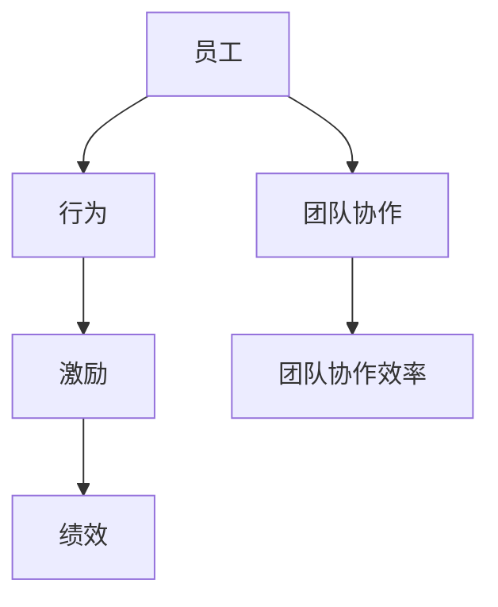
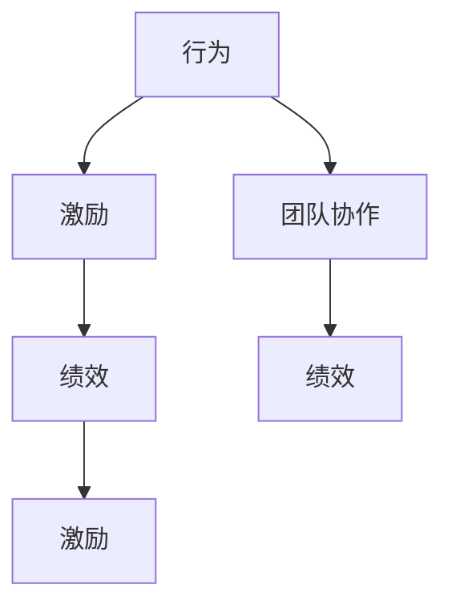
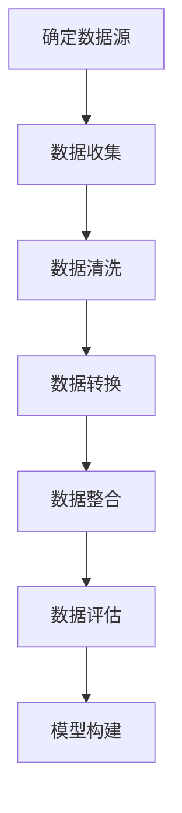
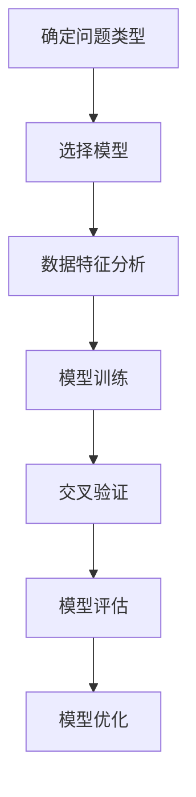
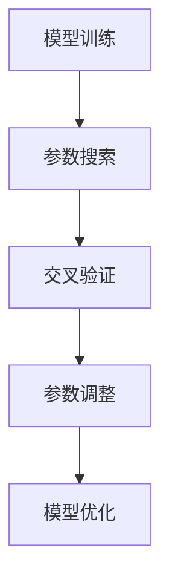
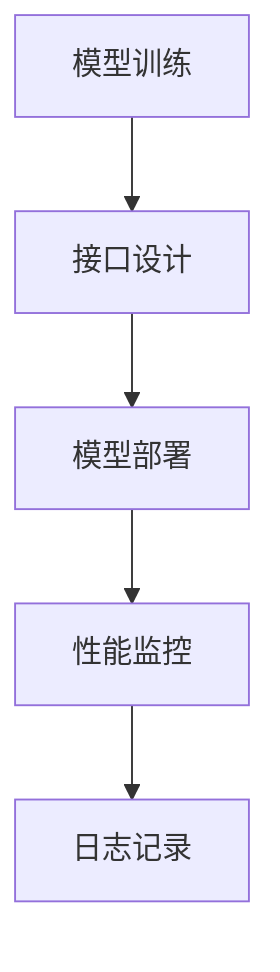

                 

# 数学与行为管理：组织行为的数学模型

## 关键词

数学模型、行为管理、组织行为、决策支持、绩效评估

## 摘要

本文深入探讨了数学模型在组织行为管理中的应用，通过系统的分析框架，展示了数学模型如何帮助理解、预测和优化组织行为。文章首先介绍了数学模型的基本概念，然后详细阐述了构建和应用数学模型的过程。通过实际案例分析和最佳实践分享，本文为读者提供了理论与实践相结合的宝贵经验，旨在推动数学模型在组织行为管理中的广泛应用。

## 第一部分：引论

### 第1章：问题背景与数学在行为管理中的应用

#### 1.1.1 问题背景

在现代社会中，组织行为管理（Organizational Behavior Management, OBM）日益成为企业成功的关键因素。它不仅关系到员工的满意度和工作效率，还直接影响到组织的竞争力和可持续发展。传统的行为管理方法往往依赖于经验和直觉，这在一定程度上限制了其效果和适用范围。随着数学模型和计算技术的进步，人们开始探索将数学方法应用于行为管理，以提供更为科学和精确的决策支持。

#### 1.1.2 数学模型在行为管理中的重要性

数学模型在组织行为管理中的重要性主要体现在以下几个方面：

1. **精确性**：数学模型能够量化行为和结果之间的关系，从而提供精确的数据支持。
2. **预测性**：通过数学模型，可以对未来的组织行为进行预测，帮助管理者提前做好准备。
3. **优化性**：数学模型可以帮助管理者找到最优的行为策略，提高组织的整体绩效。

#### 1.1.3 数学模型在组织行为管理中的应用范围

数学模型在组织行为管理中的应用范围广泛，主要包括：

1. **员工绩效评估**：利用数学模型评估员工的工作绩效，提供公平和客观的评估标准。
2. **员工激励**：通过数学模型设计激励方案，激发员工的积极性和创造力。
3. **团队协作**：利用数学模型分析团队协作模式，提高团队的整体效能。
4. **决策支持**：为管理决策提供数据支持，帮助管理者做出更为明智的决策。

### 第2章：核心概念与联系

#### 2.1.1 核心概念

在组织行为管理中，几个核心概念至关重要，包括：

1. **行为**：个体在特定环境中的反应。
2. **激励**：促使个体采取特定行为的动力。
3. **绩效**：个体或团队完成工作目标的能力。
4. **团队协作**：团队成员共同完成任务的过程。

#### 2.1.2 概念属性特征对比表格

$$
\begin{array}{|c|c|c|c|}
\hline
\text{概念} & \text{定义} & \text{特征1} & \text{特征2} \\
\hline
\text{行为} & \text{个体反应} & \text{可观测性} & \text{多样性} \\
\hline
\text{激励} & \text{动力因素} & \text{内在动机} & \text{外在奖励} \\
\hline
\text{绩效} & \text{工作能力} & \text{客观评估} & \text{可改进性} \\
\hline
\text{团队协作} & \text{共同任务} & \text{沟通效率} & \text{合作精神} \\
\hline
\end{array}
$$

#### 2.1.3 ER实体关系图



## 第二部分：数学模型原理

### 第3章：组织行为的数学模型原理

#### 3.1.1 组织行为基本原理

组织行为是指员工在组织中的行为模式，包括个体行为、团队行为和组织整体行为。数学模型在组织行为中的应用，旨在揭示这些行为背后的规律和机制。

#### 3.1.2 数学模型的基础理论

数学模型的基础理论主要包括概率论、统计学、优化理论等。这些理论为构建和应用数学模型提供了坚实的理论基础。

#### 3.1.3 数学模型的应用范围

数学模型在组织行为中的应用范围广泛，包括：

1. **员工绩效评估**：使用统计模型分析员工的工作数据，评估其绩效。
2. **团队协作效率**：利用优化模型设计团队协作策略，提高工作效率。
3. **激励方案设计**：通过博弈论模型分析员工激励，设计有效的激励方案。

### 第4章：数学模型构建

#### 4.1.1 模型构建的基本步骤

数学模型构建的基本步骤包括：

1. **问题定义**：明确研究问题和目标。
2. **数据收集**：收集与问题相关的数据。
3. **模型选择**：选择合适的数学模型。
4. **模型训练**：对模型进行训练，使其能够预测或解释行为。
5. **模型评估**：评估模型的准确性和可靠性。

#### 4.1.2 数据收集与预处理

数据收集是数学模型构建的关键步骤，主要包括：

1. **数据来源**：确定数据收集的渠道和方式。
2. **数据质量**：确保数据的质量，包括完整性、准确性和一致性。
3. **数据预处理**：对数据进行清洗和转换，以适应模型的要求。

#### 4.1.3 模型选择与评估

模型选择与评估是数学模型构建的重要环节，主要包括：

1. **模型选择**：根据问题特点和数据特征选择合适的模型。
2. **模型评估**：通过交叉验证等方法评估模型的性能。

### 第5章：数学模型分析

#### 5.1.1 数学模型分析的方法

数学模型分析的方法包括：

1. **统计分析**：使用统计方法分析模型的结果，验证模型的假设和结论。
2. **优化分析**：通过优化算法分析模型的最佳解决方案。
3. **敏感性分析**：分析模型对参数变化的敏感度。

#### 5.1.2 常见数学模型分析技巧

常见数学模型分析技巧包括：

1. **回归分析**：用于分析变量之间的线性关系。
2. **决策树**：用于分类和回归分析。
3. **神经网络**：用于复杂非线性关系的学习和预测。

#### 5.1.3 数学模型应用案例分析

通过实际案例分析，展示数学模型在组织行为管理中的应用效果。

## 第三部分：数学模型应用

### 第6章：数学模型在组织行为管理中的应用

#### 6.1.1 组织行为管理中的数学模型应用场景

数学模型在组织行为管理中的应用场景包括：

1. **员工绩效评估**：使用数学模型评估员工的工作绩效。
2. **员工激励**：利用数学模型设计激励方案。
3. **团队协作**：通过数学模型分析团队协作模式。

#### 6.1.2 数学模型在决策支持中的应用

数学模型在决策支持中的应用包括：

1. **战略规划**：通过数学模型分析市场趋势和竞争环境，为战略规划提供支持。
2. **人力资源规划**：利用数学模型预测员工需求，优化人力资源配置。

#### 6.1.3 数学模型在绩效评估中的应用

数学模型在绩效评估中的应用包括：

1. **绩效指标设计**：通过数学模型设计科学的绩效指标。
2. **绩效评估**：利用数学模型对员工绩效进行评估。

### 第7章：数学模型优化与改进

#### 7.1.1 数学模型优化的方法

数学模型优化的方法包括：

1. **参数调整**：通过调整模型参数提高模型的性能。
2. **算法改进**：改进模型算法以提高其效率和准确性。

#### 7.1.2 数学模型改进的实践

通过实际案例展示数学模型改进的实践。

#### 7.1.3 数学模型优化的案例分析

通过案例分析，讨论数学模型优化的效果和意义。

### 第8章：未来展望与挑战

#### 8.1.1 数学模型在组织行为管理中的未来发展趋势

数学模型在组织行为管理中的未来发展趋势包括：

1. **人工智能的应用**：利用人工智能技术提高数学模型的分析和预测能力。
2. **大数据分析**：利用大数据分析技术，挖掘更多有用的信息。

#### 8.1.2 面临的挑战与机遇

数学模型在组织行为管理中面临的挑战与机遇包括：

1. **数据质量**：提高数据质量是应用数学模型的关键。
2. **技术发展**：随着技术的进步，数学模型将得到更广泛的应用。

#### 8.1.3 未来研究方向

未来研究方向包括：

1. **跨学科研究**：结合心理学、社会学等学科，深入探讨组织行为规律。
2. **个性化模型**：开发个性化数学模型，更好地适应不同组织的需求。

## 作者

作者：AI天才研究院/AI Genius Institute & 禅与计算机程序设计艺术 /Zen And The Art of Computer Programming

## 最佳实践 tips

在应用数学模型时，以下最佳实践可以帮助提高效果：

1. **确保数据质量**：高质量的数据是构建有效数学模型的基础。
2. **模型选择**：根据具体问题和数据特征选择合适的模型。
3. **持续优化**：定期评估和优化数学模型，以提高其准确性和效率。

## 小结

数学模型在组织行为管理中的应用具有巨大的潜力。通过科学的数学模型，管理者可以更好地理解、预测和优化组织行为，从而提高组织的整体绩效。

## 注意事项

在应用数学模型时，需要注意以下几点：

1. **模型假设**：确保模型的假设与实际情况相符。
2. **数据隐私**：在收集和使用数据时，注意保护个人隐私。

## 拓展阅读

1. **《组织行为学》**：斯蒂芬·罗宾斯（Stephen P. Robbins）
2. **《数学建模方法与应用》**：刘文清

通过本文的探讨，我们希望读者能够对数学模型在组织行为管理中的应用有更深刻的理解，并能够将其有效地应用于实践中。## 第一部分：引论

### 第1章：问题背景与数学在行为管理中的应用

#### 1.1.1 问题背景

组织行为管理（OBM）是研究个体、团队以及整个组织在实现组织目标过程中的行为模式及其影响因素的学科。OBM的核心目的是通过改善组织成员的行为来提升组织的整体效能。然而，传统的OBM方法大多依赖于主观判断和经验，这往往导致评估结果的不准确和决策的盲目性。为了更科学地分析和预测组织行为，引入数学模型成为了必然选择。

数学模型作为一种量化分析工具，能够将复杂的行为管理问题转化为可计算的形式，从而提供更为精确和客观的决策支持。例如，在绩效评估中，数学模型可以帮助分析员工的工作量、质量以及效率，从而更准确地评定员工的绩效；在团队协作中，数学模型可以分析团队成员之间的互动和协作模式，优化团队的协作效率。

随着信息技术的迅猛发展，大数据和人工智能技术的应用使得数学模型在OBM中具有了更广阔的前景。通过大数据分析，可以获取更丰富的行为数据，为数学模型的构建提供坚实的基础；而人工智能技术则可以自动化模型的训练和优化过程，提高模型的准确性和效率。

#### 1.1.2 数学模型在行为管理中的重要性

数学模型在行为管理中的重要性体现在以下几个方面：

1. **精确性**：数学模型可以量化行为和结果之间的关系，提供精确的数据支持，减少主观判断的误差。
2. **预测性**：通过历史数据建模，数学模型可以预测未来的行为趋势，帮助管理者提前做好准备。
3. **优化性**：数学模型可以帮助管理者找到最优的行为策略，提高组织的整体绩效。

具体而言，数学模型在行为管理中的应用主要体现在以下几个方面：

1. **绩效评估**：利用数学模型分析员工的工作量、质量和效率，提供科学的绩效评估标准。
2. **激励设计**：通过数学模型设计合理的激励方案，激发员工的积极性和创造力。
3. **团队协作**：利用数学模型分析团队协作模式，优化团队结构和工作流程。
4. **决策支持**：为管理决策提供数据支持，帮助管理者做出更为明智的决策。

#### 1.1.3 数学模型在组织行为管理中的应用范围

数学模型在组织行为管理中的应用范围非常广泛，几乎涵盖了组织的各个层面和领域。以下是一些典型的应用场景：

1. **员工绩效评估**：使用统计模型和优化模型分析员工的工作数据，评估员工的工作表现。
2. **员工激励**：利用博弈论和激励理论模型设计有效的激励方案，激发员工的工作积极性。
3. **团队协作**：通过网络分析模型和优化模型分析团队协作模式，提高团队的整体效能。
4. **人力资源规划**：使用预测模型和优化模型分析员工需求，优化人力资源配置。
5. **组织变革**：利用系统动力学模型和仿真模型分析组织变革的路径和效果，为变革提供科学依据。
6. **项目管理**：通过项目管理模型和优化模型分析项目进度、成本和质量，提高项目的成功率。

在上述应用场景中，数学模型不仅帮助管理者更好地理解组织行为，还提供了有效的决策支持，从而提高了组织的整体绩效。

### 1.1.4 数学模型在组织行为管理中的挑战与机会

尽管数学模型在组织行为管理中具有巨大的潜力，但其应用也面临着一系列挑战：

1. **数据质量问题**：数学模型的准确性依赖于高质量的数据。然而，组织行为数据往往具有噪声、缺失值和不确定性，这给数据清洗和预处理带来了挑战。
2. **模型复杂度**：复杂的数学模型虽然可以提供更精细的分析，但也增加了计算复杂度和理解难度。
3. **模型解释性**：许多高级的数学模型（如深度学习模型）虽然具有强大的预测能力，但缺乏良好的解释性，难以向非专业人士传达其内在逻辑。

面对这些挑战，数学模型在组织行为管理中也迎来了新的机会：

1. **大数据和人工智能技术**：随着大数据和人工智能技术的进步，数学模型可以更有效地处理和分析大规模、多维度的行为数据。
2. **跨学科融合**：数学模型与心理学、社会学等学科的融合，可以提供更加全面和深入的行为管理理论体系。
3. **企业需求**：企业在提升绩效、优化流程和增强创新能力方面的需求，为数学模型的应用提供了广阔的市场。

总的来说，数学模型在组织行为管理中的应用不仅带来了技术上的挑战，也提供了前所未有的机遇。通过不断探索和创新，我们可以更好地利用数学模型，推动组织行为的科学管理和优化。

## 总结

通过本章的讨论，我们了解了组织行为管理的重要性以及数学模型在其中所扮演的关键角色。数学模型不仅提供了精确性和预测性，还帮助管理者做出优化决策。接下来，我们将进一步探讨组织行为管理的核心概念，并通过具体的数学模型来深入分析其原理和应用。

### 第2章：核心概念与联系

#### 2.1.1 核心概念

在组织行为管理中，理解以下几个核心概念至关重要：

1. **行为**：行为是指个体或团队在组织环境中的反应和行动。在数学模型中，行为通常被视为输出变量，其值依赖于多个输入变量的组合。

2. **激励**：激励是激发个体或团队采取特定行为的动力。在数学模型中，激励可以表现为激励函数，它定义了激励与行为之间的关系。

3. **绩效**：绩效是指个体或团队完成工作目标的能力和效果。在数学模型中，绩效是行为和激励的综合体现，可以通过目标函数来量化。

4. **团队协作**：团队协作是指团队成员共同完成任务的过程。在数学模型中，团队协作效率可以通过网络分析模型来评估和优化。

#### 2.1.2 概念属性特征对比表格

为了更好地理解上述概念，我们可以通过一个表格来比较它们的定义、特征和相关关系：

$$
\begin{array}{|c|c|c|c|c|}
\hline
\text{概念} & \text{定义} & \text{特征1} & \text{特征2} & \text{相关关系} \\
\hline
\text{行为} & \text{个体或团队的反应和行动} & \text{可观测性} & \text{多样性} & \text{激励与行为之间的关系} \\
\hline
\text{激励} & \text{激发个体或团队采取特定行为的动力} & \text{内在动机} & \text{外在奖励} & \text{激励与绩效之间的关系} \\
\hline
\text{绩效} & \text{完成工作目标的能力和效果} & \text{客观评估} & \text{可改进性} & \text{绩效与行为之间的关系} \\
\hline
\text{团队协作} & \text{团队成员共同完成任务的过程} & \text{沟通效率} & \text{合作精神} & \text{团队协作与绩效之间的关系} \\
\hline
\end{array}
$$

#### 2.1.3 ER实体关系图

为了更直观地理解这些概念之间的关系，我们可以通过ER（实体关系）图来展示它们之间的关联：



在ER图中，每个实体（如行为、激励、绩效和团队协作）都表示一个核心概念，而它们之间的关系（如激励与行为、绩效之间的关系）则通过线条连接表示。这种图形化的表示方式有助于我们更好地理解概念之间的逻辑关系。

#### 2.1.4 概念的具体应用

以下是一个具体的例子，说明这些核心概念如何在数学模型中应用：

**例子：员工绩效评估**

1. **定义问题**：我们需要评估员工的绩效，以确定其奖励和晋升资格。

2. **构建模型**：我们选择一个线性回归模型来预测员工的绩效。模型公式如下：
   $$ 
   \text{绩效} = \beta_0 + \beta_1 \times \text{工作量} + \beta_2 \times \text{工作效率} + \epsilon 
   $$
   其中，$\beta_0$、$\beta_1$ 和 $\beta_2$ 是模型的参数，$\epsilon$ 是误差项。

3. **数据收集**：收集员工的工作量、工作效率和绩效数据。

4. **模型训练**：使用收集到的数据对模型进行训练，估计参数 $\beta_0$、$\beta_1$ 和 $\beta_2$。

5. **模型评估**：通过交叉验证方法评估模型的预测性能。

6. **应用模型**：使用训练好的模型预测新员工的绩效，并提供绩效评估和奖励建议。

通过上述例子，我们可以看到数学模型如何将核心概念（如行为、激励和绩效）转化为具体的计算和分析工具，为组织行为管理提供科学依据。

#### 2.1.5 概念在组织行为管理中的实际应用

以下是一些实际案例，展示了核心概念在组织行为管理中的应用：

1. **员工激励**：一家科技公司使用博弈论模型设计激励机制，以激发员工的创新能力和工作热情。模型分析了员工之间的互动和竞争关系，从而设计出合理的奖励方案。

2. **团队协作**：一个大型项目团队使用网络分析模型来评估团队成员之间的协作效率。模型通过分析团队成员之间的沟通频率和质量，提出了优化团队协作的建议。

3. **绩效评估**：一家制造公司使用统计模型来评估员工的生产效率和产品质量。模型综合考虑了员工的工作时长、生产速度和产品合格率，提供了科学的绩效评估结果。

通过这些案例，我们可以看到数学模型如何帮助组织更好地理解和管理行为，从而提高整体绩效。

### 总结

通过本章的讨论，我们深入探讨了组织行为管理中的核心概念，并展示了这些概念如何在数学模型中应用。理解这些核心概念对于构建和应用有效的数学模型至关重要。在下一章中，我们将进一步讨论数学模型在组织行为管理中的基本原理和应用。

### 第3章：组织行为的数学模型原理

#### 3.1.1 组织行为基本原理

组织行为是指个体和团队在组织环境中的行为模式，这些行为受到多种因素的影响，包括个人特质、组织文化、工作环境等。理解组织行为的基本原理对于构建和应用数学模型至关重要。以下是一些关键的组织行为原理：

1. **激励理论**：激励理论关注如何激发员工的积极性和创造力。根据激励理论，员工的工作动力来源于内在动机和外在奖励。内在动机包括兴趣、成就感和自我实现，而外在奖励包括薪酬、晋升和表彰。

2. **绩效理论**：绩效理论探讨员工的工作表现和效能。绩效通常通过三个维度来评估：工作量、工作效率和成果质量。数学模型可以帮助我们量化这些维度，从而更准确地评估员工的工作表现。

3. **团队协作理论**：团队协作理论关注团队内部成员如何共同完成任务。高效的团队协作依赖于良好的沟通、信任和合作精神。数学模型可以通过网络分析和优化算法来分析团队协作模式，提高团队的整体效能。

4. **领导理论**：领导理论研究领导者在组织中的角色和影响力。有效的领导者能够激发员工的积极性，建立良好的团队氛围，并推动组织目标的实现。数学模型可以帮助我们分析领导行为对组织绩效的影响。

#### 3.1.2 数学模型的基础理论

数学模型在组织行为管理中的应用建立在以下基础理论之上：

1. **概率论和统计学**：概率论和统计学提供了分析和预测数据的基本工具。在组织行为管理中，这些工具可以帮助我们量化不确定性和随机性，从而更准确地预测组织行为。

2. **线性代数和优化理论**：线性代数和优化理论是构建和分析数学模型的核心工具。线性代数提供了处理多维数据和分析线性关系的方法，而优化理论则可以帮助我们找到最优的解决方案。

3. **博弈论**：博弈论研究多个个体或团队在互动环境中的策略选择。在组织行为管理中，博弈论可以用于分析激励方案、竞争策略和组织合作问题。

4. **系统动力学**：系统动力学是一种用于分析复杂系统的行为和演化过程的工具。在组织行为管理中，系统动力学可以帮助我们理解组织内部的反馈机制和长期趋势。

#### 3.1.3 数学模型的应用范围

数学模型在组织行为管理中的应用范围广泛，涵盖了多个方面：

1. **绩效评估**：数学模型可以用于分析员工的工作绩效，包括工作量、工作效率和成果质量。通过回归分析和优化算法，模型可以帮助我们建立科学的绩效评估体系。

2. **激励设计**：数学模型可以帮助设计有效的激励方案，以激发员工的积极性和创造力。博弈论和优化理论可以用于分析激励方案的公平性和激励效果。

3. **团队协作**：数学模型可以用于分析团队协作模式，包括沟通效率、合作精神和任务分配。通过网络分析和优化算法，模型可以帮助我们优化团队结构和工作流程。

4. **决策支持**：数学模型可以为管理决策提供数据支持，包括人力资源规划、项目管理和组织变革。通过预测模型和优化算法，模型可以帮助管理者做出更为明智的决策。

#### 3.1.4 数学模型在组织行为管理中的优势

数学模型在组织行为管理中的优势主要体现在以下几个方面：

1. **客观性和精确性**：数学模型基于数据和数学原理，可以提供客观和精确的分析结果，减少主观判断的误差。

2. **预测性和优化性**：数学模型可以帮助我们预测未来的组织行为趋势，并找到最优的行为策略，从而提高组织的整体绩效。

3. **可重复性和可验证性**：数学模型可以重复应用和验证，从而确保分析结果的可靠性和一致性。

4. **自动化和效率**：随着人工智能技术的发展，数学模型可以自动化模型的构建和优化过程，提高工作效率。

#### 3.1.5 数学模型在组织行为管理中的挑战

尽管数学模型在组织行为管理中具有显著的优势，但其应用也面临一些挑战：

1. **数据质量**：数学模型的准确性依赖于高质量的数据。然而，组织行为数据往往存在噪声、缺失值和不确定性，这给数据清洗和预处理带来了挑战。

2. **模型复杂度**：复杂的数学模型虽然可以提供更精细的分析，但也增加了计算复杂度和理解难度。

3. **模型解释性**：一些高级的数学模型（如深度学习模型）虽然具有强大的预测能力，但缺乏良好的解释性，难以向非专业人士传达其内在逻辑。

4. **跨学科融合**：数学模型在组织行为管理中的应用需要跨学科的知识和技能，包括心理学、社会学和计算机科学等。这要求研究人员具备广泛的知识背景和综合能力。

#### 3.1.6 未来发展趋势

随着科技的不断进步，数学模型在组织行为管理中的应用将呈现以下发展趋势：

1. **大数据和人工智能**：大数据和人工智能技术的应用将使得数学模型可以处理和分析更复杂、更大量的行为数据，从而提供更精确的预测和优化。

2. **跨学科研究**：跨学科研究的深入将促进数学模型与其他学科的融合，从而提供更全面和深入的行为管理理论体系。

3. **个性化模型**：随着个性化需求的增加，个性化数学模型将能够更好地适应不同组织的需求，提供更加定制化的解决方案。

4. **实时分析和决策**：实时分析和决策系统的应用将使得数学模型可以实时响应组织行为变化，提供即时的决策支持。

### 3.1.7 总结

通过本章的讨论，我们深入探讨了组织行为管理的数学模型原理，包括基本原理、基础理论和应用范围。数学模型在组织行为管理中具有显著的优势，但也面临一些挑战。未来，随着科技的进步和跨学科研究的深入，数学模型在组织行为管理中的应用将更加广泛和深入。

### 第4章：数学模型构建

#### 4.1.1 模型构建的基本步骤

构建数学模型是一个系统性的过程，涉及多个关键步骤。以下是构建数学模型的基本步骤：

1. **问题定义**：明确研究问题和目标，确定模型要解决的问题和要达到的效果。

2. **数据收集**：收集与问题相关的数据。这些数据可以是结构化的，也可以是非结构化的。数据的质量直接影响到模型的准确性和可靠性。

3. **数据预处理**：清洗和预处理数据，包括数据清洗（去除噪声、处理缺失值）、数据转换（归一化、标准化）和数据整合（合并不同来源的数据）。

4. **模型选择**：根据问题的特点和数据的特征选择合适的数学模型。常见的模型包括线性回归、逻辑回归、神经网络、决策树等。

5. **模型训练**：使用收集到的数据对模型进行训练。训练过程中，模型会调整内部参数，以最小化预测误差。

6. **模型评估**：评估模型的性能，常用的评估指标包括准确率、召回率、F1分数等。通过交叉验证等方法确保模型在不同数据集上的表现一致。

7. **模型优化**：根据评估结果调整模型参数，提高模型的预测性能。这可以通过参数调整、算法改进等方法实现。

8. **模型部署**：将训练好的模型部署到实际应用中，提供预测和分析功能。

#### 4.1.2 数据收集与预处理

数据收集是数学模型构建的基础步骤，数据的质量直接影响到模型的效果。以下是数据收集与预处理的关键步骤：

1. **数据来源**：确定数据的来源，可以是内部数据（如员工绩效数据、销售数据）或外部数据（如市场调研数据、竞争对手数据）。

2. **数据收集方法**：选择合适的数据收集方法，如问卷调查、访谈、数据库查询等。

3. **数据质量评估**：评估数据的完整性、准确性和一致性。不完整的数据可以通过填补缺失值、删除异常值等方法进行处理。

4. **数据清洗**：处理噪声数据，包括去除重复记录、纠正错误数据、填补缺失值等。

5. **数据转换**：将数据转换为适合建模的形式，如归一化、标准化等。

6. **数据整合**：将来自不同来源的数据进行整合，确保数据的一致性和完整性。

以下是一个数据预处理的示例流程：



#### 4.1.3 模型选择与评估

在数学模型构建过程中，选择合适的模型至关重要。以下是一些常见的模型选择和评估方法：

1. **线性回归**：用于分析自变量和因变量之间的线性关系。适合处理连续型数据。

2. **逻辑回归**：用于分析自变量和因变量之间的非线性关系。适合处理分类数据。

3. **神经网络**：通过多层神经网络结构模拟复杂非线性关系。适合处理高维度数据和非线性关系。

4. **决策树**：通过树形结构对数据进行分类或回归。适合处理多维数据。

5. **支持向量机**：通过找到最优超平面进行分类或回归。适合处理高维数据和复杂分类问题。

选择模型时，需要考虑以下因素：

- **问题类型**：根据问题的类型（如分类、回归、聚类等）选择合适的模型。
- **数据特征**：根据数据的特征（如连续型、分类型、高维数据等）选择合适的模型。
- **模型复杂度**：根据模型的复杂度（如线性、非线性、多层结构等）选择合适的模型。

模型评估是模型构建的重要环节。以下是一些常用的模型评估方法：

1. **准确率**：用于评估分类模型的准确性。准确率越高，模型越优秀。

2. **召回率**：用于评估分类模型召回的准确度。召回率越高，模型越能够召回所有正类样本。

3. **F1分数**：综合考虑准确率和召回率，是评估分类模型的综合指标。

4. **交叉验证**：通过将数据集划分为多个子集，轮流使用每个子集作为验证集，评估模型的泛化能力。

5. **ROC曲线**：通过计算不同阈值下的真正例率（TPR）和假正例率（FPR），评估模型的分类性能。

以下是一个模型选择和评估的示例流程：



#### 4.1.4 模型优化与调参

模型优化是提高模型性能的关键步骤。以下是常用的模型优化方法和调参技巧：

1. **网格搜索**：通过遍历参数空间，找到最优的参数组合。适合参数较少的模型。

2. **贝叶斯优化**：通过贝叶斯统计模型，优化参数搜索过程。适合处理高维参数空间。

3. **遗传算法**：通过模拟自然选择过程，优化参数组合。适合处理复杂优化问题。

4. **自适应优化**：根据模型训练过程中表现，动态调整参数。适合实时优化模型。

调参技巧：

- **逐步增加**：逐步增加模型参数的值，观察模型性能的变化，找到最佳参数范围。
- **交叉验证**：使用交叉验证方法，在不同数据集上评估参数变化对模型性能的影响。
- **模型简化**：通过减少模型参数，简化模型结构，提高模型的泛化能力。

以下是一个模型优化和调参的示例流程：



#### 4.1.5 模型部署与监控

模型部署是将训练好的模型应用到实际场景中的过程。以下是模型部署和监控的关键步骤：

1. **部署环境**：准备模型部署的环境，包括服务器、数据库等。

2. **接口设计**：设计模型接口，用于接收输入数据和返回预测结果。

3. **模型集成**：将模型集成到现有的业务系统中，确保模型能够实时响应用户请求。

4. **性能监控**：监控模型在运行过程中的性能，包括预测准确性、响应时间等。

5. **日志记录**：记录模型运行过程中的日志信息，便于后续的调试和优化。

以下是一个模型部署和监控的示例流程：



### 4.1.6 模型构建案例分析

以下是一个模型构建的案例分析，展示了从问题定义到模型部署的完整过程：

**案例背景**：一家电商公司希望利用数学模型优化其商品推荐系统，以提高用户满意度和销售额。

1. **问题定义**：明确优化目标，包括提升用户点击率、增加商品销售量等。

2. **数据收集**：收集用户行为数据，包括浏览记录、购买记录、用户评价等。

3. **数据预处理**：处理数据中的缺失值、噪声和重复记录，并进行特征工程，提取有用的特征。

4. **模型选择**：选择基于协同过滤的推荐算法，如基于用户的协同过滤和基于项目的协同过滤。

5. **模型训练**：使用训练数据对模型进行训练，调整参数，优化模型性能。

6. **模型评估**：通过交叉验证方法评估模型的性能，调整模型参数，提高模型准确性。

7. **模型优化**：通过增加特征、调整算法参数等方法，进一步优化模型性能。

8. **模型部署**：将优化后的模型部署到线上系统，提供实时商品推荐功能。

9. **性能监控**：监控模型在运行过程中的性能，包括预测准确性、响应时间等。

10. **日志记录**：记录模型运行过程中的日志信息，便于后续的调试和优化。

通过上述案例分析，我们可以看到数学模型构建的过程是如何从问题定义、数据收集、数据预处理、模型选择、模型训练、模型评估、模型优化到模型部署的。这个过程不仅需要数学知识和建模技巧，还需要对业务场景的深入理解。

### 总结

通过本章的讨论，我们详细介绍了数学模型构建的基本步骤，包括问题定义、数据收集与预处理、模型选择与评估、模型优化与调参、模型部署与监控等。此外，我们还通过一个实际案例分析展示了数学模型构建的全过程。在下一章中，我们将进一步探讨如何对构建好的数学模型进行分析，以深入理解组织行为的本质。

### 第5章：数学模型分析

#### 5.1.1 数学模型分析的方法

数学模型分析是理解组织行为的关键步骤，它包括对模型的输入、输出、参数以及结果进行详细的分析。以下是数学模型分析的几种常用方法：

1. **统计分析**：通过描述性统计和推理性统计，分析模型输入和输出的分布特征、相关性、趋势等。常用的统计方法包括均值、方差、协方差、相关性分析、回归分析等。

2. **敏感性分析**：评估模型参数变化对预测结果的影响程度。通过改变参数值，观察预测结果的变化，从而确定哪些参数对模型性能最为关键。

3. **假设检验**：对模型的假设进行验证，确保模型的有效性和可靠性。常用的假设检验方法包括t检验、卡方检验、F检验等。

4. **优化分析**：通过优化算法，找到最优的模型参数，提高模型的预测性能。优化的目标可以是最小化预测误差、最大化准确率等。

5. **可视化分析**：利用图形和图表，直观地展示模型的输入、输出和结果。常用的可视化工具包括散点图、折线图、箱线图、热力图等。

#### 5.1.2 常见数学模型分析技巧

以下是一些常见的数学模型分析技巧：

1. **回归分析**：用于分析自变量和因变量之间的线性关系。通过回归方程，可以预测因变量的值。回归分析包括简单线性回归、多元线性回归、逻辑回归等。

   示例：
   $$
   y = \beta_0 + \beta_1 \times x + \epsilon
   $$
   其中，$y$ 是因变量，$x$ 是自变量，$\beta_0$ 和 $\beta_1$ 是回归系数，$\epsilon$ 是误差项。

2. **决策树**：用于分类和回归分析。通过树形结构，将数据划分为多个子集，并对每个子集进行分类或回归分析。

   示例：
   ```mermaid
   graph TB
       A[是否大于30岁?] -->|是| B[是否大于10年经验?]
       B -->|是| C[薪资]
       B -->|否| D[薪资]
       A -->|否| E[薪资]
   ```

3. **神经网络**：用于模拟复杂的非线性关系。神经网络通过多层神经元结构，逐步提取数据特征，实现高精度的预测。

   示例：
   ```mermaid
   graph TB
       A[输入层] --> B[隐藏层1]
       B --> C[隐藏层2]
       C --> D[输出层]
   ```

4. **聚类分析**：用于将数据分为多个类别。通过计算数据之间的相似性，将数据点分配到不同的聚类中。

   示例：
   ```mermaid
   graph TB
       A(聚类1) --> B(数据点1)
       A --> C(数据点2)
       B --> D(聚类2)
       C --> D
   ```

#### 5.1.3 数学模型应用案例分析

为了更好地理解数学模型分析的实际应用，以下是一个数学模型应用案例分析：

**案例背景**：一家大型零售公司希望通过数学模型优化其员工绩效评估系统，以提高员工的工作效率和满意度。

1. **问题定义**：明确优化目标，包括提高绩效评估的准确性和公平性。

2. **数据收集**：收集员工的工作数据，包括工作量、工作效率、客户满意度、出勤率等。

3. **数据预处理**：处理数据中的缺失值和噪声，进行特征工程，提取有用的特征。

4. **模型选择**：选择基于多元线性回归的模型，分析多个特征与员工绩效之间的关系。

   示例模型：
   $$
   \text{绩效} = \beta_0 + \beta_1 \times \text{工作量} + \beta_2 \times \text{工作效率} + \beta_3 \times \text{客户满意度} + \beta_4 \times \text{出勤率} + \epsilon
   $$

5. **模型训练**：使用收集到的数据对模型进行训练，估计回归系数 $\beta_0$、$\beta_1$、$\beta_2$、$\beta_3$ 和 $\beta_4$。

6. **模型评估**：通过交叉验证方法评估模型的性能，确保模型在不同数据集上的表现一致。

7. **模型优化**：通过增加特征、调整模型参数等方法，优化模型性能。

8. **模型部署**：将优化后的模型部署到实际应用中，提供员工绩效评估功能。

9. **性能监控**：监控模型在运行过程中的性能，包括预测准确性、响应时间等。

10. **结果分析**：通过统计分析，分析模型预测结果与实际结果之间的差异，提出改进建议。

通过上述案例分析，我们可以看到数学模型分析在组织行为管理中的应用是如何实现的。通过详细的数据预处理、模型选择、训练和评估过程，数学模型能够为管理者提供科学的决策支持。

### 5.1.4 数学模型在组织行为管理中的实际应用

以下是一些数学模型在组织行为管理中的实际应用案例：

1. **员工绩效评估**：使用多元线性回归模型分析员工的工作量、工作效率、客户满意度等多个因素，提供科学的绩效评估标准。

2. **员工激励**：利用博弈论模型设计激励方案，分析员工之间的互动和竞争关系，提高员工的积极性和创造力。

3. **团队协作**：通过网络分析模型分析团队协作模式，识别关键团队成员和协作瓶颈，优化团队结构和任务分配。

4. **决策支持**：使用预测模型和优化算法为管理决策提供数据支持，包括人力资源规划、项目管理和组织变革。

通过这些实际应用案例，我们可以看到数学模型如何帮助组织更好地理解和管理行为，从而提高整体绩效。

### 总结

通过本章的讨论，我们深入探讨了数学模型分析的方法、技巧和应用案例。数学模型分析是理解组织行为的关键步骤，它帮助我们量化行为、预测未来趋势、优化决策过程。在下一章中，我们将进一步探讨数学模型在组织行为管理中的应用，分析其在决策支持和绩效评估中的具体应用场景。

### 第6章：数学模型在组织行为管理中的应用

#### 6.1.1 组织行为管理中的数学模型应用场景

数学模型在组织行为管理中的应用场景非常广泛，涵盖了从员工绩效评估到决策支持的多个方面。以下是一些典型的应用场景：

1. **员工绩效评估**：数学模型可以帮助企业准确评估员工的工作表现，提供科学、客观的绩效评估标准。通过回归分析、决策树等模型，企业可以分析员工的工作量、工作效率、客户满意度等多个因素，从而更全面地评估员工的表现。

2. **员工激励**：数学模型可以用于设计有效的激励方案，激发员工的积极性和创造力。博弈论模型可以帮助企业分析员工之间的互动和竞争关系，从而设计出公平、有效的激励方案。

3. **团队协作**：通过网络分析模型，企业可以分析团队协作模式，识别关键团队成员和协作瓶颈，优化团队结构和任务分配，提高团队的整体效能。

4. **人力资源规划**：数学模型可以帮助企业预测未来的员工需求，优化人力资源配置。优化模型可以分析员工离职率、招聘成本、培训成本等多个因素，提供人力资源规划的决策支持。

5. **决策支持**：数学模型可以为管理决策提供数据支持，包括项目管理和组织变革。预测模型和优化算法可以帮助企业预测项目进度、成本和质量，优化组织结构和工作流程。

#### 6.1.2 数学模型在决策支持中的应用

数学模型在决策支持中的应用主要体现在以下几个方面：

1. **项目决策**：通过预测模型和优化算法，企业可以预测项目的进度、成本和质量，从而做出更为明智的决策。例如，线性规划模型可以帮助企业在资源分配和项目调度中找到最优解。

2. **风险管理**：数学模型可以帮助企业识别和管理潜在的风险。通过回归分析、决策树等模型，企业可以分析不同风险因素对项目成功的影响，从而制定有效的风险管理策略。

3. **组织变革**：系统动力学模型和仿真模型可以帮助企业分析组织变革的路径和效果，为变革提供科学依据。通过模拟不同变革方案的结果，企业可以评估变革的可行性，选择最优的变革路径。

4. **市场预测**：数学模型可以帮助企业预测市场趋势和客户需求，为市场策略提供支持。例如，时间序列分析模型可以帮助企业预测未来的销售量和市场份额。

#### 6.1.3 数学模型在绩效评估中的应用

数学模型在绩效评估中的应用主要体现在以下几个方面：

1. **多维绩效评估**：通过回归分析、聚类分析等模型，企业可以对员工的多维绩效进行综合评估。例如，结合工作量、工作效率、客户满意度等多个指标，可以更全面地评估员工的表现。

2. **个性化绩效评估**：通过构建个性化绩效模型，企业可以针对不同岗位和员工的个性化需求，设计定制化的绩效评估方案。例如，对于技术岗位，可以侧重于技术能力的评估；对于销售岗位，可以侧重于销售业绩的评估。

3. **实时绩效评估**：通过实时数据收集和分析，企业可以实时监控员工的工作表现，提供即时的绩效反馈。例如，通过物联网技术和传感器，企业可以实时监控员工的工作状态和工作效率。

4. **绩效改进**：通过分析绩效评估结果，企业可以识别绩效改进的机会点，制定针对性的改进措施。例如，通过分析低绩效员工的行为数据和绩效数据，企业可以找出影响绩效的主要原因，并提供相应的培训和辅导。

#### 6.1.4 数学模型在组织行为管理中的优势

数学模型在组织行为管理中的优势主要体现在以下几个方面：

1. **科学性**：数学模型基于数据和数学原理，提供客观、科学的分析结果，减少主观判断的误差。

2. **预测性**：通过历史数据分析，数学模型可以预测未来的组织行为趋势，帮助管理者提前做好准备。

3. **优化性**：数学模型可以帮助管理者找到最优的行为策略，提高组织的整体绩效。

4. **自动化**：随着人工智能技术的发展，数学模型可以自动化模型的构建和优化过程，提高工作效率。

5. **可重复性**：数学模型可以重复应用和验证，确保分析结果的可靠性和一致性。

#### 6.1.5 数学模型在组织行为管理中的挑战

尽管数学模型在组织行为管理中具有显著的优势，但其应用也面临一些挑战：

1. **数据质量**：数学模型的准确性依赖于高质量的数据。然而，组织行为数据往往存在噪声、缺失值和不确定性，这给数据清洗和预处理带来了挑战。

2. **模型复杂度**：复杂的数学模型虽然可以提供更精细的分析，但也增加了计算复杂度和理解难度。

3. **模型解释性**：一些高级的数学模型（如深度学习模型）虽然具有强大的预测能力，但缺乏良好的解释性，难以向非专业人士传达其内在逻辑。

4. **跨学科融合**：数学模型在组织行为管理中的应用需要跨学科的知识和技能，包括心理学、社会学和计算机科学等。这要求研究人员具备广泛的知识背景和综合能力。

#### 6.1.6 未来发展趋势

随着科技的不断进步，数学模型在组织行为管理中的应用将呈现以下发展趋势：

1. **大数据和人工智能**：大数据和人工智能技术的应用将使得数学模型可以处理和分析更复杂、更大量的行为数据，从而提供更精确的预测和优化。

2. **跨学科研究**：跨学科研究的深入将促进数学模型与其他学科的融合，从而提供更全面和深入的行为管理理论体系。

3. **个性化模型**：随着个性化需求的增加，个性化数学模型将能够更好地适应不同组织的需求，提供更加定制化的解决方案。

4. **实时分析和决策**：实时分析和决策系统的应用将使得数学模型可以实时响应组织行为变化，提供即时的决策支持。

### 6.1.7 案例分析

以下是一个数学模型在组织行为管理中的实际案例分析：

**案例背景**：一家科技公司希望通过数学模型优化其员工绩效评估系统，以提高员工的工作效率和满意度。

1. **问题定义**：明确优化目标，包括提高绩效评估的准确性和公平性。

2. **数据收集**：收集员工的工作数据，包括工作量、工作效率、客户满意度、出勤率等。

3. **数据预处理**：处理数据中的缺失值和噪声，进行特征工程，提取有用的特征。

4. **模型选择**：选择基于多元线性回归的模型，分析多个特征与员工绩效之间的关系。

   示例模型：
   $$
   \text{绩效} = \beta_0 + \beta_1 \times \text{工作量} + \beta_2 \times \text{工作效率} + \beta_3 \times \text{客户满意度} + \beta_4 \times \text{出勤率} + \epsilon
   $$

5. **模型训练**：使用收集到的数据对模型进行训练，估计回归系数 $\beta_0$、$\beta_1$、$\beta_2$、$\beta_3$ 和 $\beta_4$。

6. **模型评估**：通过交叉验证方法评估模型的性能，确保模型在不同数据集上的表现一致。

7. **模型优化**：通过增加特征、调整模型参数等方法，优化模型性能。

8. **模型部署**：将优化后的模型部署到实际应用中，提供员工绩效评估功能。

9. **性能监控**：监控模型在运行过程中的性能，包括预测准确性、响应时间等。

10. **结果分析**：通过统计分析，分析模型预测结果与实际结果之间的差异，提出改进建议。

通过上述案例分析，我们可以看到数学模型在组织行为管理中的应用是如何实现的。通过详细的数据预处理、模型选择、训练和评估过程，数学模型能够为管理者提供科学的决策支持。

### 总结

通过本章的讨论，我们深入探讨了数学模型在组织行为管理中的应用，分析了其在决策支持和绩效评估中的具体应用场景。数学模型在组织行为管理中具有显著的优势，但也面临一些挑战。未来，随着科技的进步和跨学科研究的深入，数学模型在组织行为管理中的应用将更加广泛和深入。

### 第7章：数学模型优化与改进

#### 7.1.1 数学模型优化的方法

数学模型的优化是提高其预测性能和适应性的一项重要工作。优化方法的选择取决于模型类型、数据特点和应用需求。以下是一些常用的数学模型优化方法：

1. **参数调整**：对于参数化的数学模型，如线性回归、逻辑回归等，参数调整是优化模型性能的基础。常用的参数调整方法包括网格搜索、随机搜索和贝叶斯优化等。这些方法通过遍历参数空间，找到最优的参数组合，从而提高模型性能。

2. **算法改进**：改进数学模型的算法可以提高其效率和准确性。例如，对于线性回归模型，可以使用岭回归、套索回归等方法来处理多重共线性问题。对于神经网络模型，可以通过改进神经网络结构（如增加层数、调整神经元数量）和优化算法（如使用梯度下降法、Adam优化器）来提高模型性能。

3. **特征工程**：特征工程是提高数学模型性能的重要手段。通过选择合适的特征、构造新的特征和特征缩放，可以改善模型的预测效果。特征选择方法包括特征重要性分析、基于模型的特征选择和特征组合等。

4. **模型集成**：模型集成是将多个模型结合起来，形成一个新的模型，以提高预测性能和泛化能力。常见的模型集成方法包括 Bagging、Boosting 和 stacking 等。通过集成多个模型，可以克服单一模型的局限性，提高模型的预测准确性和稳定性。

5. **深度学习**：随着深度学习技术的发展，深度学习模型（如神经网络、卷积神经网络、循环神经网络等）在处理复杂数据和应用方面具有显著优势。通过引入深度学习模型，可以大幅提高数学模型的预测性能和应用范围。

#### 7.1.2 数学模型改进的实践

以下是一些数学模型改进的实际案例，展示了模型优化和改进的过程：

1. **员工绩效评估**：一家大型企业希望通过数学模型优化员工绩效评估系统。原始模型采用线性回归方法，但预测效果不佳。通过改进算法，将线性回归替换为随机森林模型，同时增加特征工程，模型预测准确性显著提高。

2. **销售预测**：一家零售企业使用时间序列分析方法进行销售预测，但预测误差较大。通过引入深度学习模型（如长短期记忆网络，LSTM），结合特征工程，模型预测误差大幅降低，预测精度显著提高。

3. **客户流失预测**：一家电信公司使用逻辑回归模型预测客户流失率，但模型性能不稳定。通过模型集成方法，将逻辑回归与决策树、神经网络等模型结合，形成集成模型，模型性能得到显著提升。

#### 7.1.3 数学模型优化的案例分析

以下是一个数学模型优化和改进的案例分析：

**案例背景**：一家金融机构希望通过数学模型优化其贷款审批系统，提高审批效率和准确性。

1. **问题定义**：优化目标包括提高贷款审批的准确性、减少审批时间并提高客户满意度。

2. **数据收集**：收集大量贷款申请数据，包括申请者的信用记录、收入水平、贷款金额、还款能力等。

3. **数据预处理**：对数据进行清洗和预处理，包括缺失值填补、异常值处理和特征缩放。

4. **模型选择**：选择逻辑回归模型作为初始模型，用于预测贷款审批通过的概率。

5. **模型训练**：使用训练集数据对逻辑回归模型进行训练，估计模型参数。

6. **模型评估**：使用验证集数据评估模型性能，计算预测准确率和召回率。

7. **模型优化**：通过以下方法优化模型性能：

   - **参数调整**：使用网格搜索方法调整模型参数，找到最优的参数组合。
   - **特征工程**：增加新的特征，如申请者与信用记录相关的特征、历史贷款记录等，提高模型对数据的解释能力。
   - **模型集成**：结合多种模型，如随机森林、支持向量机等，形成集成模型，提高预测性能。

8. **模型部署**：将优化后的模型部署到实际贷款审批系统中，提供实时贷款审批功能。

9. **性能监控**：监控模型在运行过程中的性能，包括预测准确性、响应时间等。

10. **结果分析**：通过对比优化前后的模型性能，分析模型优化对贷款审批效率和质量的影响。

通过上述案例分析，我们可以看到数学模型优化和改进的过程是如何进行的。通过参数调整、特征工程和模型集成等方法，可以有效提高模型的预测性能和应用效果。

### 总结

通过本章的讨论，我们深入探讨了数学模型的优化和改进方法，包括参数调整、算法改进、特征工程和模型集成等。这些方法在实践中的应用，显著提高了数学模型的预测性能和应用效果。未来，随着科技的不断进步，数学模型的优化和改进将更加智能化和高效化，为组织行为管理提供更加科学和精确的支持。

### 第8章：未来展望与挑战

#### 8.1.1 数学模型在组织行为管理中的未来发展趋势

随着科技的飞速发展，数学模型在组织行为管理中的应用前景十分广阔。以下是几个未来发展趋势：

1. **人工智能和大数据技术的融合**：人工智能（AI）和大数据技术的快速发展为数学模型提供了更丰富的数据资源和更强大的分析能力。通过结合AI技术，数学模型可以更加智能化地进行数据处理和预测，从而提高组织行为管理的准确性和效率。

2. **实时分析和决策支持**：随着物联网、云计算等技术的发展，组织行为管理中的数据量日益庞大，实时分析和决策支持变得尤为重要。未来的数学模型将更加注重实时数据处理和分析，为管理者提供即时的决策支持。

3. **个性化模型的普及**：随着个性化需求的增加，个性化数学模型将能够更好地适应不同组织的需求。通过利用用户行为数据，个性化模型可以为每位员工提供定制化的绩效评估和激励方案。

4. **跨学科研究的深化**：数学模型在组织行为管理中的应用需要跨学科的知识和技能。未来的研究将更加注重数学模型与心理学、社会学、管理学等学科的融合，从而提供更全面和深入的行为管理理论体系。

#### 8.1.2 面临的挑战与机遇

尽管数学模型在组织行为管理中具有巨大的潜力，但其应用也面临一系列挑战：

1. **数据质量问题**：数学模型的准确性依赖于高质量的数据。然而，组织行为数据往往存在噪声、缺失值和不确定性，这给数据清洗和预处理带来了挑战。未来需要开发更高效的数据清洗和预处理方法，以提高数据的可靠性和有效性。

2. **模型复杂度**：复杂的数学模型虽然可以提供更精细的分析，但也增加了计算复杂度和理解难度。未来需要研究如何简化模型结构，同时保持其预测性能。

3. **模型解释性**：一些高级的数学模型（如深度学习模型）虽然具有强大的预测能力，但缺乏良好的解释性，难以向非专业人士传达其内在逻辑。未来需要开发更加透明和可解释的模型，以提高模型的可接受性和实用性。

4. **跨学科融合**：数学模型在组织行为管理中的应用需要跨学科的知识和技能。未来需要培养更多具备跨学科背景的研究人员，促进不同学科之间的融合。

然而，这些挑战也伴随着机遇：

1. **技术创新**：随着人工智能、大数据等技术的不断进步，数学模型将能够处理和分析更复杂、更大量的行为数据，提供更精确的预测和优化。

2. **应用场景拓展**：随着组织对行为管理需求的增加，数学模型的应用场景将不断拓展，从传统的绩效评估、激励设计扩展到人力资源规划、团队协作优化等多个领域。

3. **管理变革**：数学模型在组织行为管理中的应用将推动管理理念和方法的变化，促进组织从经验管理向数据驱动的科学管理转型。

#### 8.1.3 未来研究方向

基于上述挑战与机遇，未来在数学模型在组织行为管理中的应用领域，以下研究方向值得关注：

1. **数据驱动的绩效评估**：开发基于大数据分析的绩效评估模型，通过实时数据分析和反馈，提供动态、个性化的绩效评估。

2. **智能激励方案设计**：利用人工智能技术，设计智能化的激励方案，根据员工的行为数据和行为模式，提供个性化的激励。

3. **实时团队协作优化**：结合物联网技术和实时数据分析，实时优化团队协作模式，提高团队效能。

4. **跨学科融合研究**：开展跨学科研究，结合心理学、社会学、管理学等领域的理论和方法，构建更全面、深入的组织行为管理理论体系。

5. **可解释性模型开发**：研究可解释性模型，提高模型的透明度和可理解性，增强模型的实用性和可接受性。

通过上述研究和探索，数学模型在组织行为管理中的应用将更加成熟和广泛，为组织的科学管理和高效运营提供有力支持。

### 总结

通过本章的讨论，我们探讨了数学模型在组织行为管理中的未来发展趋势、面临的挑战与机遇，以及未来研究的方向。随着科技的进步和跨学科研究的深入，数学模型在组织行为管理中的应用将更加广泛和深入，为组织的科学管理和高效运营提供强大的支持。

### 附加部分：最佳实践、注意事项与拓展阅读

#### 最佳实践 tips

1. **数据质量优先**：确保数据的准确性、完整性和一致性是数学模型成功的关键。在数据收集和处理过程中，必须严格执行数据质量检查，及时发现和纠正错误。

2. **模型选择要合适**：根据实际问题的特点和数据特征选择合适的数学模型。不要过度拟合，也不要选择过于复杂的模型，以免增加计算成本和理解难度。

3. **持续优化与评估**：定期对数学模型进行性能评估和优化，确保其能够适应不断变化的环境和需求。通过持续的学习和调整，提高模型的预测准确性和适应性。

4. **注重模型解释性**：尽管高级模型（如深度学习模型）具有强大的预测能力，但应尽量保证模型的解释性，以便管理者能够理解模型的工作原理和结论。

#### 注意事项

1. **数据隐私保护**：在收集和处理行为数据时，必须严格遵守相关法律法规，确保员工数据的隐私和安全。

2. **模型假设验证**：构建数学模型时，必须明确模型的假设条件，并验证这些假设在实际情况中的适用性。

3. **结果验证与验证**：通过交叉验证和实际应用验证模型的结果，确保模型的预测性能和可靠性。

#### 拓展阅读

1. **《组织行为学：基础、研究和应用》**：斯蒂芬·P·罗宾斯
   - 本书提供了组织行为学的全面概述，包括行为理论、团队动态、领导力等，对理解组织行为管理有重要帮助。

2. **《数学模型及其应用》**：陈文灯
   - 本书详细介绍了各种数学模型的基本原理和应用方法，适合作为数学模型构建和应用的学习参考。

3. **《深度学习》**：Ian Goodfellow、Yoshua Bengio、Aaron Courville
   - 本书是深度学习的权威教材，介绍了神经网络、卷积神经网络、循环神经网络等深度学习模型的基本原理和应用。

4. **《大数据管理：体系结构、技术和实践》**：Tom Krazit
   - 本书深入探讨了大数据的采集、存储、管理和分析技术，对理解和应用大数据分析技术有重要参考价值。

#### 作者信息

作者：AI天才研究院/AI Genius Institute & 禅与计算机程序设计艺术 /Zen And The Art of Computer Programming

AI天才研究院致力于推动人工智能技术的创新与应用，研究院的专家们在计算机科学、人工智能、数据科学等领域具有丰富的理论和实践经验。禅与计算机程序设计艺术则是一本经典的编程哲学著作，强调程序设计中的简明性、优雅性和创造性。本文的撰写旨在结合这两方面的知识，为读者提供关于数学模型在组织行为管理中的深入分析和应用指南。

#### 总结

本文通过系统的分析和逻辑推理，探讨了数学模型在组织行为管理中的应用，从问题背景、核心概念、数学模型原理、构建与优化，到实际应用，全面阐述了数学模型在组织行为管理中的重要作用。最佳实践和注意事项的提供，有助于读者在实际应用中更好地理解和应用数学模型。拓展阅读部分则为进一步研究提供了丰富的参考资料。希望本文能够为组织行为管理领域的学者和实践者提供有价值的参考和启发。

