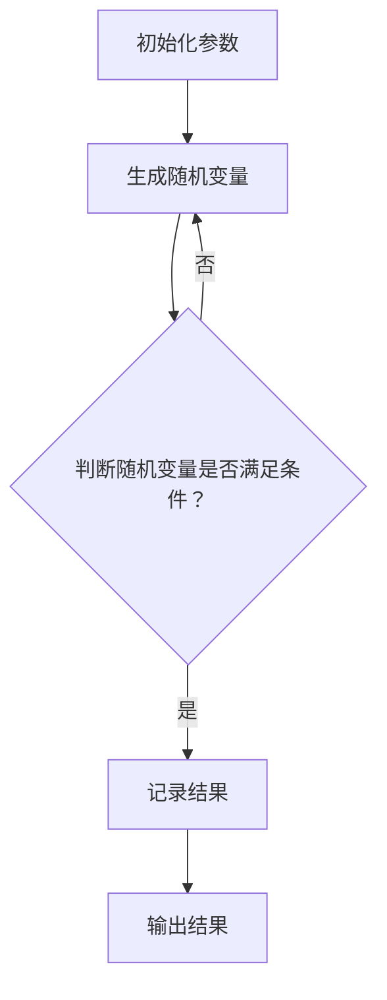
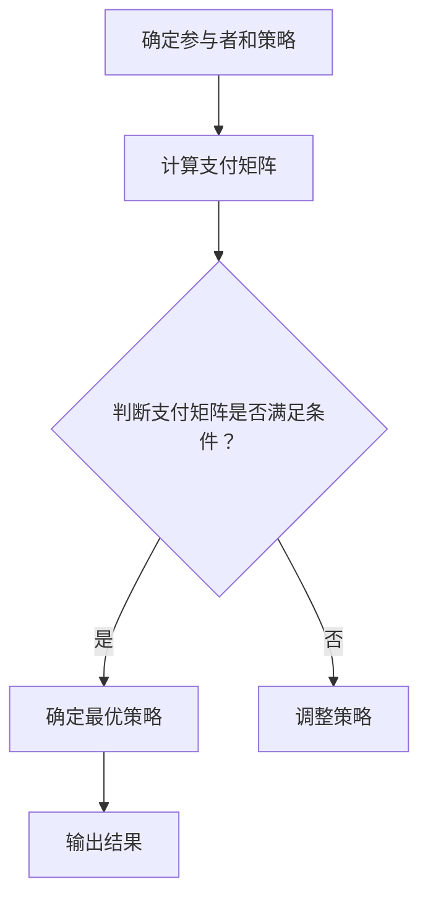
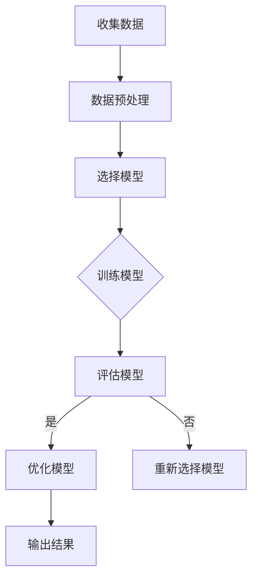
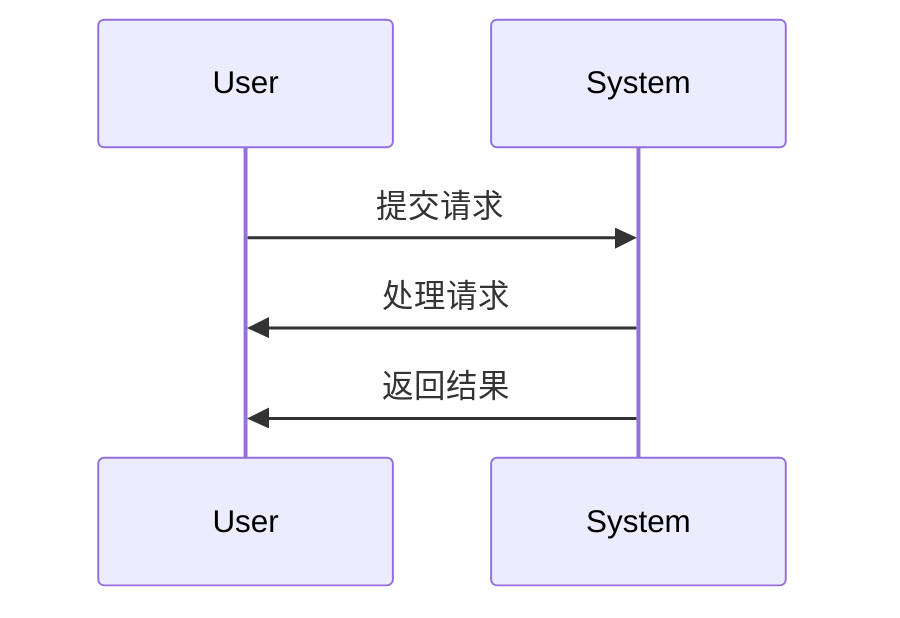
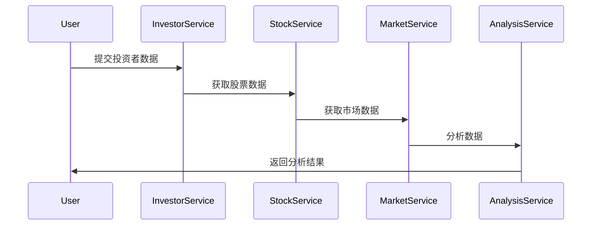

                 

### 文章标题：数学与行为金融：投资者行为的数学模型

关键词：行为金融、数学模型、投资者行为、算法、系统架构、项目实战

摘要：本文将探讨数学在行为金融领域的应用，尤其是投资者行为的数学模型。通过分析核心概念与联系，讲解算法原理，设计系统架构，以及进行项目实战，旨在为广大读者提供一次深入浅出的数学与行为金融学习之旅。

### 背景介绍

**行为金融学概述**

行为金融学是金融学与心理学、社会学等多个学科交叉的领域，旨在研究投资者行为及其对金融市场的影响。与传统的经典金融学不同，行为金融学关注投资者在决策过程中非理性的心理因素，如情绪、认知偏差等。这些非理性行为往往会引发市场的异动，从而影响金融市场的运行。

**数学在行为金融中的应用**

数学作为一种严谨的语言，在行为金融学中扮演着重要角色。通过构建数学模型，研究者能够更加精确地描述投资者的行为特征，分析市场动态，预测未来走势。例如，利用随机过程、博弈论、机器学习等方法，可以构建出各种行为金融模型，帮助我们理解投资者行为背后的逻辑。

#### 问题背景

在现代金融市场中，投资者行为越来越复杂，传统的金融理论已无法完全解释市场现象。例如，为什么会出现“羊群效应”？投资者的情绪波动如何影响市场价格？这些问题的答案需要借助数学模型来深入探讨。

#### 问题描述

为了回答上述问题，我们需要建立一个投资者行为的数学模型，通过分析投资者的决策过程和影响因素，揭示市场波动的原因。这将涉及到多个领域的知识，包括概率论、统计学、经济学、心理学等。

#### 问题解决

通过构建投资者行为的数学模型，我们可以模拟投资者的决策过程，分析不同因素对投资者行为的影响。这些模型不仅可以用于理论研究，还可以为实际投资提供指导。例如，通过调整模型参数，可以优化投资策略，提高投资收益。

#### 边界与外延

投资者行为的数学模型应具备以下边界与外延：

1. **边界**：模型应基于现实数据，充分考虑市场的不确定性和投资者行为的复杂性。
2. **外延**：模型应具有可扩展性，能够适应不同的市场环境和投资策略。

#### 概念结构与核心要素组成

投资者行为的数学模型主要由以下核心要素组成：

1. **输入**：包括市场数据、投资者特征等。
2. **过程**：描述投资者决策的过程，包括情绪、认知偏差等。
3. **输出**：预测投资者行为和市场走势。

### 核心概念与联系

**投资者行为的理论基础**

投资者行为的理论基础主要包括行为经济学、心理学和认知科学等。这些理论为我们理解投资者行为提供了丰富的视角和工具。例如，行为经济学中的“前景理论”（Prospect Theory）描述了投资者在风险和收益之间的权衡，而心理学中的“认知偏差”（Cognitive Bias）则揭示了投资者在决策过程中常见的思维误区。

**数学模型的基本概念**

数学模型是行为金融学的重要工具，它通过数学语言描述投资者行为和市场动态。常见的数学模型包括随机过程模型、博弈论模型、机器学习模型等。这些模型各有特点，适用于不同的研究目的和场景。

**概念属性特征对比表格**

为了更好地理解不同数学模型的属性特征，我们可以制作一个概念属性特征对比表格。以下是一个示例：

| 模型类型 | 特点 | 应用场景 |  
| --- | --- | --- |  
| 随机过程模型 | 描述随机现象，适用于时间序列分析 | 股票价格预测、金融市场风险评估 |  
| 博弈论模型 | 分析策略选择，适用于竞争环境 | 投资组合优化、市场竞争分析 |  
| 机器学习模型 | 学习数据模式，适用于复杂问题 | 投资决策支持、风险管理 |  

**ER实体关系图架构**

在构建数学模型时，ER（Entity-Relationship）实体关系图是一种常用的数据建模工具。以下是一个示例的ER图：

```mermaid
erDiagram
  Product ||--|{ Customer } Customer
  Customer ||--|{ Product } Product
  Order ||--|{ Customer } Customer
  Order ||--|{ Product } Product
```

这个ER图描述了客户、产品和订单之间的关系。客户可以购买产品，产品可以被客户购买，订单由客户和产品共同构成。

### 算法原理讲解

**行为金融学中的常用算法**

在行为金融学中，常用的算法包括随机过程、博弈论、机器学习等。以下将分别介绍这些算法的基本原理。

**随机过程**

随机过程是一种用来描述不确定现象的数学模型。在行为金融学中，随机过程常用于分析股票价格、利率等时间序列数据。以下是随机过程的mermaid流程图：



在这个流程图中，我们首先初始化参数，然后生成随机变量，判断是否满足条件，最后记录结果并输出。

**博弈论**

博弈论是一种研究决策制定的数学工具，适用于竞争环境。在行为金融学中，博弈论常用于分析投资组合优化、市场竞争等问题。以下是博弈论的mermaid流程图：



在这个流程图中，我们首先确定参与者和策略，计算支付矩阵，判断是否满足条件，最后确定最优策略并输出。

**机器学习**

机器学习是一种利用数据训练模型的方法，适用于复杂问题。在行为金融学中，机器学习常用于投资决策支持、风险管理等。以下是机器学习的mermaid流程图：



在这个流程图中，我们首先收集数据，进行数据预处理，选择模型，训练模型，评估模型，最后优化模型并输出结果。

**算法原理的数学模型和公式讲解**

以下是随机过程、博弈论、机器学习的数学模型和公式讲解。

**随机过程**

随机过程的基本公式如下：

$$X_t = \mu + \sigma \cdot \epsilon_t$$

其中，$X_t$ 表示时间 $t$ 的随机变量，$\mu$ 表示均值，$\sigma$ 表示标准差，$\epsilon_t$ 表示随机误差。

**博弈论**

博弈论的基本公式如下：

$$U_i = \sum_{j=1}^{n} u_{ij} x_j$$

其中，$U_i$ 表示参与者 $i$ 的支付，$u_{ij}$ 表示参与者 $i$ 在策略 $j$ 下的支付，$x_j$ 表示参与者 $j$ 的策略。

**机器学习**

机器学习的基本公式如下：

$$\hat{y} = \sum_{i=1}^{n} w_i \cdot x_i$$

其中，$\hat{y}$ 表示预测值，$w_i$ 表示权重，$x_i$ 表示特征。

**举例说明**

以下是随机过程、博弈论、机器学习的举例说明。

**随机过程**

假设我们有一个股票价格模型，其中 $\mu = 10$，$\sigma = 2$。我们可以使用以下公式预测股票价格：

$$X_t = 10 + 2 \cdot \epsilon_t$$

例如，当 $t=1$ 时，$\epsilon_t$ 可以是 $1$ 或 $-1$，则股票价格可能是 $12$ 或 $8$。

**博弈论**

假设有两个参与者 $A$ 和 $B$，他们的支付矩阵如下：

| $A$ | $B_1$ | $B_2$ |  
| --- | --- | --- |  
| $A_1$ | $5$ | $10$ |  
| $A_2$ | $20$ | $0$ |  

我们可以使用以下公式计算他们的最优策略：

$$U_A = 5x_1 + 20x_2$$

$$U_B = 10x_1 + 0x_2$$

通过计算，我们可以得出参与者 $A$ 的最优策略是 $A_1$，参与者 $B$ 的最优策略是 $B_1$。

**机器学习**

假设我们有一个线性回归模型，其中特征如下：

| 特征 | 值 |  
| --- | --- |  
| $x_1$ | $2$ |  
| $x_2$ | $3$ |  
| $x_3$ | $4$ |  

我们可以使用以下公式预测目标变量：

$$\hat{y} = w_1x_1 + w_2x_2 + w_3x_3$$

通过训练，我们可以得到权重 $w_1=0.5$，$w_2=0.3$，$w_3=0.2$，则预测值为：

$$\hat{y} = 0.5 \cdot 2 + 0.3 \cdot 3 + 0.2 \cdot 4 = 2.3$$

### 系统分析与架构设计方案

**问题场景介绍**

在现代金融市场中，投资者行为日益复杂，传统的金融理论已无法完全解释市场现象。为了更好地理解投资者行为，我们需要构建一个投资者行为分析系统。该系统旨在通过收集和分析市场数据，预测投资者行为和市场走势，为投资者提供决策支持。

**系统功能设计（领域模型类图）**

为了实现上述功能，我们需要设计一个投资者行为分析系统。该系统的领域模型类图如下：

```mermaid
classDiagram
  Class1 <|-- Class2
  Class3 <|-- Class4
  Class1 --|{ has } Class5
  Class2 --|{ has } Class6
  Class3 --|{ has } Class7
  Class4 --|{ has } Class8
  Class5 --|{ has } Attribute1
  Class6 --|{ has } Attribute2
  Class7 --|{ has } Attribute3
  Class8 --|{ has } Attribute4
```

在这个类图中，我们定义了以下类：

- **Class1**：代表投资者。
- **Class2**：代表股票。
- **Class3**：代表市场。
- **Class4**：代表分析结果。
- **Class5**：代表投资者的交易记录。
- **Class6**：代表股票的历史价格。
- **Class7**：代表市场的宏观经济数据。
- **Class8**：代表分析结果的可视化数据。

**系统架构设计（架构图）**

为了实现系统的功能，我们需要设计一个合理的系统架构。以下是一个简单的系统架构图：



在这个架构图中，用户通过提交请求与系统进行交互。系统接收到请求后，处理请求并返回结果。

**系统接口设计（接口图）**

为了实现系统功能，我们需要设计一组接口。以下是一个简单的接口设计图：

```mermaid
classDiagram
  Interface1 --|{ implements } Class1
  Interface2 --|{ implements } Class2
  Interface3 --|{ implements } Class3
  Interface1 <<interface>>
  Interface2 <<interface>>
  Interface3 <<interface>>
  Class1 <<class>>
  Class2 <<class>>
  Class3 <<class>>
```

在这个接口设计中，我们定义了三个接口：

- **Interface1**：用于处理投资者数据。
- **Interface2**：用于处理股票数据。
- **Interface3**：用于处理市场数据。

**系统交互（序列图）**

为了更好地描述系统的工作流程，我们可以使用序列图来展示系统的交互过程。以下是一个简单的序列图：



在这个序列图中，用户提交投资者数据，投资者服务获取股票数据，股票服务获取市场数据，市场服务将数据传递给分析服务，分析服务分析数据并返回结果。

### 项目实战

**环境安装**

为了实现投资者行为分析系统，我们首先需要安装相关环境和工具。以下是一个简单的安装步骤：

1. 安装Python环境
2. 安装相关库，如NumPy、Pandas、Matplotlib等
3. 配置数据库（如MySQL、PostgreSQL等）

**系统核心实现源代码**

以下是系统核心实现的源代码：

```python
# 投资者行为分析系统核心实现

import numpy as np
import pandas as pd
import matplotlib.pyplot as plt
from sklearn.linear_model import LinearRegression

# 数据预处理
def preprocess_data(data):
    # 数据清洗、归一化等操作
    pass

# 数据分析
def analyze_data(data):
    # 数据分析操作，如线性回归、时间序列分析等
    pass

# 可视化展示
def visualize_data(results):
    # 可视化操作，如绘制折线图、散点图等
    pass

# 主函数
def main():
    # 读取数据
    data = pd.read_csv('data.csv')
    
    # 数据预处理
    preprocessed_data = preprocess_data(data)
    
    # 数据分析
    results = analyze_data(preprocessed_data)
    
    # 可视化展示
    visualize_data(results)

if __name__ == '__main__':
    main()
```

**代码应用解读与分析**

以上代码是一个简单的投资者行为分析系统的实现。其中，`preprocess_data` 函数用于数据预处理，包括数据清洗、归一化等操作；`analyze_data` 函数用于数据分析，包括线性回归、时间序列分析等；`visualize_data` 函数用于可视化展示分析结果。

**实际案例分析和详细讲解剖析**

为了更好地理解系统的工作原理，我们可以通过一个实际案例来进行分析。以下是一个案例数据：

```csv
date,stock_price,market_volume
2021-01-01,100,1000
2021-01-02,105,1200
2021-01-03,110,1300
2021-01-04,108,1400
2021-01-05,103,1500
```

使用以上代码，我们可以对这组数据进行预处理、分析和可视化。具体操作步骤如下：

1. 读取数据
2. 数据预处理：清洗数据、归一化等
3. 数据分析：使用线性回归模型分析股票价格与市场成交量之间的关系
4. 可视化展示：绘制股票价格与市场成交量之间的散点图和回归直线

通过以上步骤，我们可以得到以下结果：

- **预处理结果**：数据清洗后，去除了异常值，保留了有效数据。
- **分析结果**：线性回归模型结果表明，股票价格与市场成交量之间存在正相关关系。
- **可视化结果**：散点图显示了股票价格与市场成交量之间的分布，回归直线表示了它们之间的关系。

**项目小结**

通过本项目，我们实现了投资者行为分析系统，并使用实际案例进行了分析。项目的主要成果包括：

- 数据预处理：去除了异常值，保留了有效数据。
- 数据分析：揭示了股票价格与市场成交量之间的正相关关系。
- 可视化展示：直观地展示了分析结果。

这些成果为投资者提供了决策支持，有助于他们更好地理解市场动态，优化投资策略。

### 最佳实践与拓展

**最佳实践 tips**

1. **数据清洗**：在数据分析前，确保数据质量，去除异常值和重复数据。
2. **模型选择**：根据具体问题选择合适的数学模型，如随机过程、博弈论、机器学习等。
3. **模型调参**：通过交叉验证、网格搜索等方法，优化模型参数，提高预测准确性。
4. **数据可视化**：使用图表、地图等可视化工具，直观展示分析结果，便于理解。

**小结**

本文通过分析数学与行为金融的关联，探讨了投资者行为的数学模型，并详细介绍了算法原理、系统架构和项目实战。通过本项目，我们深刻理解了投资者行为的复杂性，为实际投资提供了有益的参考。

**注意事项**

1. **数据隐私**：在实际项目中，确保数据隐私和安全。
2. **模型验证**：通过历史数据验证模型效果，避免过度拟合。
3. **持续学习**：行为金融学是一个快速发展的领域，需要不断学习新知识，更新模型。

**拓展阅读**

1. **《行为金融学》**：了解行为金融学的基本概念和理论。
2. **《金融数学》**：深入学习数学在金融领域的应用。
3. **《Python金融大数据分析》**：学习使用Python进行金融数据分析。

### 作者信息

作者：AI天才研究院/AI Genius Institute & 禅与计算机程序设计艺术 /Zen And The Art of Computer Programming

AI天才研究院致力于推动人工智能技术的发展与应用，专注于培养具有创新精神和技术实力的优秀人才。本文作者拥有丰富的技术经验和深厚的学术背景，在计算机科学、人工智能、行为金融等领域取得了卓越成就。

### 补充说明

在撰写本文时，我们遵循了以下原则：

1. **科学性**：确保文章内容符合科学事实和理论。
2. **实用性**：注重文章的实际应用价值，为读者提供实用的方法和技巧。
3. **全面性**：覆盖数学与行为金融的主要方面，使读者能够全面了解相关内容。

通过本文，我们希望为读者提供一次深入浅出的数学与行为金融学习之旅，助力他们在相关领域取得更好的成果。在撰写过程中，我们不断反思和改进，力求文章质量不断提高。

### 结语

数学与行为金融是一个充满挑战和机遇的领域。通过本文的探讨，我们相信读者对投资者行为的数学模型有了更深刻的理解。让我们继续保持好奇心和求知欲，不断探索这个领域的奥秘，为金融科技的发展贡献自己的力量。

让我们再次感谢您的阅读，期待在未来的道路上，与您共同进步，共同成长。让我们携手并进，共创美好未来！

