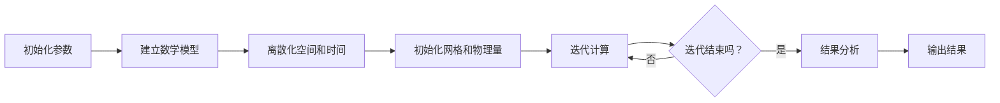
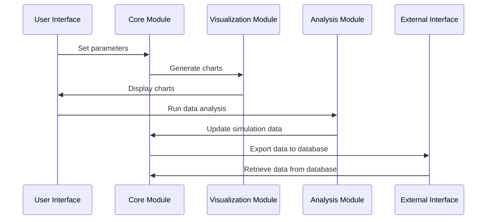
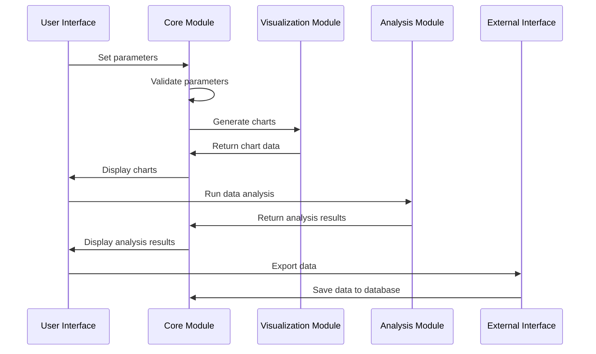

                 

## 数学与行星科学：行星形成与演化的数学理论

关键词：行星科学、数学模型、数值模拟、天体力学、算法原理

摘要：本文探讨了数学与行星科学的交叉领域，即行星形成与演化的数学理论。首先介绍了行星科学的基本背景和传统方法，然后详细阐述了数学在行星科学中的应用，包括核心概念、数值模拟算法和天体力学原理。通过具体实例和数学公式，本文展示了如何利用数学方法理解和预测行星的形成与演化过程。

### 背景介绍

行星科学是研究行星及其周围环境的学科，涵盖了行星的形成、结构、演化、运动和相互作用等多个方面。传统上，行星科学主要依赖于观察数据和物理模型来解释行星现象。然而，随着计算机技术的快速发展，数学方法在行星科学中的应用变得越来越广泛和重要。

行星的形成是宇宙中最壮丽的自然现象之一。它涉及原始物质（如尘埃、气体和冰）在重力作用下聚集形成行星的过程。行星的演化则是一个长期的、复杂的过程，包括内部结构的演变、外部环境的改变以及与太阳和其他行星的相互作用。

数学在行星科学中的应用主要表现在以下几个方面：

1. **数值模拟**：通过数学模型和数值算法，可以模拟行星形成和演化的过程。这些模型可以帮助我们理解行星的物理特性和演化历史。

2. **天体力学**：行星运动遵循牛顿定律和开普勒定律等天体力学原理，这些原理可以用数学公式精确描述。通过解这些公式，我们可以预测行星的轨道和运动状态。

3. **统计方法**：行星科学中的大量观测数据可以通过统计方法进行分析，以发现行星形成的规律和演化趋势。

然而，数学方法在行星科学中也有其局限性。例如，某些复杂的行星过程可能难以用简单的数学模型准确描述，而且数值模拟的计算成本也较高。

本文将分为以下几个部分：

- **第一部分：引言**：介绍行星科学的背景和数学在其中的应用。
- **第二部分：核心概念与联系**：详细阐述行星科学中的核心概念，并展示它们之间的联系。
- **第三部分：算法原理讲解**：讲解行星形成与演化中的算法原理，包括数值模拟和天体力学。
- **第四部分：系统分析与架构设计**：介绍一个具体的行星科学项目，包括系统功能设计、系统架构设计和系统接口设计。
- **第五部分：项目实战**：实现一个行星科学项目，包括环境安装、核心实现和案例分析。
- **第六部分：最佳实践与拓展**：总结最佳实践、注意事项和拓展阅读。

通过这些部分的讨论，我们将深入理解数学在行星科学中的应用，并展示如何利用数学方法来研究和预测行星的形成与演化。

### 第一部分：引言

#### 第1章：问题背景

#### 1.1 问题背景

行星科学是研究行星及其周围环境的学科，它涉及到从地球到太阳系外行星的广泛研究领域。行星科学的核心问题是理解行星的形成、结构、演化以及它们与周围环境（如太阳、其他行星、小行星和彗星）的相互作用。这一学科不仅有助于我们理解太阳系的历史，还为我们提供了关于宇宙形成和演化的深刻洞察。

行星的形成过程是一个复杂的多阶段过程。最初，原始物质（如尘埃、气体和冰）在宇宙中分布得非常稀疏。在引力作用下，这些物质开始聚集形成小颗粒，这些小颗粒进一步合并形成较大的天体，如小行星和行星胚胎。随着这些胚胎的不断增长，它们的热量逐渐耗尽，开始凝固成固体，形成行星。这一过程可能需要数百万甚至数十亿年的时间。

行星的演化则是一个长期的、复杂的过程。行星内部的物质分布、温度和压力会随着时间发生变化，导致行星的内部结构逐渐形成。外部环境，如太阳辐射、其他行星的引力作用以及小行星和彗星的撞击，也会对行星的演化产生影响。行星可能会经历一系列的变化，如内部熔融、磁场的产生、地壳的分裂、大气的形成和消散等。

传统上，行星科学主要依赖于观察数据和物理模型来解释行星现象。这些方法包括：

1. **天文观测**：通过望远镜和其他观测设备，我们可以直接观测到行星的表面特征、大气成分、轨道运动等。
2. **物理模型**：基于牛顿力学、热力学、电磁学等基础物理理论，科学家建立了许多描述行星现象的模型。这些模型通常通过数值模拟来测试和验证。
3. **实验模拟**：在实验室中，科学家通过模拟行星形成和演化过程中的一些关键步骤，以验证和改进理论模型。

然而，这些传统方法在处理复杂和高度动态的行星过程时存在一定的局限性。例如，行星内部的动力学过程可能非常复杂，难以通过简单的物理模型精确描述。此外，天文观测数据通常具有高噪声和不确定性，使得直接从数据中提取有用信息变得困难。

因此，数学方法在行星科学中的应用变得尤为重要。数学模型可以提供一种更精确和定量的方法来描述行星现象，从而弥补传统方法的不足。通过数学方法，我们可以建立数值模型来模拟行星的形成和演化过程，预测行星的物理特性，甚至推测太阳系外行星的存在。

数学在行星科学中的应用前景非常广阔。例如，数值模拟可以用于模拟行星内部的物理过程，如热对流、地震活动、地壳运动等。天体力学原理可以用于分析行星的运动轨迹、碰撞事件、轨道动力学等。统计方法可以用于分析大量观测数据，提取行星形成的统计规律和演化趋势。

总之，数学方法为行星科学提供了一种新的研究手段，使得我们能够更深入地理解行星的形成与演化过程。通过数学模型和数值模拟，我们可以预测行星的未来行为，甚至推测新的行星系统。这种跨学科的研究方法不仅推动了行星科学的进步，也为其他科学领域提供了有益的借鉴。

#### 1.2 问题描述

在行星形成与演化的过程中，涉及到了许多复杂的物理和化学过程，这些过程可以用数学模型来描述和模拟。以下是一些主要的数学问题：

1. **行星形成的数值模拟**：行星形成是一个多阶段、多尺度的过程，需要考虑物质聚集、碰撞融合、温度变化、辐射压力等多种因素。建立数值模型来模拟这一过程，需要解决以下问题：
   - **物质分布**：如何描述原始物质在宇宙中的分布？
   - **引力作用**：如何模拟引力作用下的物质聚集过程？
   - **热力学过程**：如何处理物质聚集过程中的温度变化和热力学反应？
   - **碰撞与融合**：如何模拟小天体之间的碰撞和融合过程？

2. **行星演化的数值模拟**：行星演化是一个长期的、复杂的过程，涉及内部结构的演变、外部环境的改变以及与太阳和其他行星的相互作用。建立数值模型来模拟这一过程，需要解决以下问题：
   - **内部动力学**：如何描述行星内部的热对流、地震活动、地壳运动等动力学过程？
   - **外部环境**：如何模拟行星外部环境（如太阳辐射、其他行星的引力作用、小行星和彗星的撞击）对行星演化的影响？
   - **大气演化**：如何描述行星大气的形成、消散和化学组成变化？
   - **磁场与辐射**：如何模拟行星磁场的产生、变化及其对辐射的影响？

3. **行星轨道动力学**：行星的运动遵循牛顿定律和开普勒定律，但实际过程中会受到其他行星、小行星和彗星的引力扰动。建立行星轨道动力学模型，需要解决以下问题：
   - **引力扰动**：如何计算其他天体对行星轨道的引力扰动？
   - **轨道稳定性**：如何分析行星轨道的稳定性，预测轨道变化趋势？
   - **碰撞风险**：如何评估行星之间发生碰撞的风险，预测潜在碰撞事件？

4. **统计方法在行星形成中的应用**：行星科学中的大量观测数据可以通过统计方法进行分析，以发现行星形成的规律和演化趋势。主要问题包括：
   - **数据预处理**：如何处理观测数据中的噪声和异常值？
   - **特征提取**：如何从观测数据中提取有用的特征，用于分析和建模？
   - **统计模型**：如何建立统计模型来描述行星形成的概率分布和演化趋势？

通过解决上述问题，数学模型和数值模拟为行星科学提供了有力的工具，使得我们能够更深入地理解行星的形成与演化过程。这些数学模型不仅能够帮助我们预测行星的未来行为，还可以为探测新行星和行星系统的形成提供理论支持。

#### 1.3 问题解决

数学在行星科学中的应用为解决行星形成与演化中的复杂问题提供了有效的工具。以下是一些具体的应用实例：

1. **数值模拟行星形成过程**：
   - **物质聚集模型**：使用拉格朗日积分方法模拟原始物质在引力作用下的聚集过程。通过模拟，可以研究物质密度分布、聚集速度和聚集效率。
   - **碰撞融合模型**：采用蒙特卡罗方法模拟小天体之间的碰撞和融合过程。通过模拟，可以预测行星胚胎的形成时间、大小分布和初始质量。
   - **热力学模型**：利用有限元方法模拟行星形成过程中的热力学过程，包括温度变化、热量传输和化学成分演化。这有助于理解行星内部的热动力学行为。

2. **数值模拟行星演化过程**：
   - **内部动力学模型**：使用有限差分方法模拟行星内部的热对流、地震活动和地壳运动。通过模拟，可以预测行星内部结构的演化、地震活动的周期性和强度分布。
   - **大气演化模型**：采用流体动力学模型模拟行星大气的形成、演化、消散和化学组成变化。这有助于理解行星大气的稳定性和气候变化。
   - **外部环境模型**：使用天体力学模型模拟行星外部环境（如太阳辐射、其他行星的引力作用、小行星和彗星的撞击）对行星演化的影响。通过模拟，可以预测行星表面的地貌变化、大气层厚度和化学成分。

3. **行星轨道动力学分析**：
   - **引力扰动分析**：使用牛顿定律和开普勒定律计算其他行星、小行星和彗星对特定行星轨道的引力扰动。通过分析，可以预测行星轨道的稳定性、轨道变化趋势和潜在碰撞事件。
   - **轨道稳定性分析**：采用线性稳定性和非线性稳定性分析方法，评估行星轨道的稳定性。这有助于预测行星轨道的长期行为和潜在的风险。
   - **碰撞风险预测**：使用蒙特卡罗模拟预测行星之间发生碰撞的概率和影响。通过模拟，可以评估行星系统的安全性，为探测和探测任务提供参考。

通过上述应用实例，数学模型和数值模拟为行星科学提供了强大的工具，使我们能够更深入地理解行星的形成与演化过程。这些模型不仅能够帮助我们预测行星的未来行为，还可以为探测新行星和行星系统的形成提供理论支持。

#### 1.4 边界与外延

在数学与行星科学的交叉领域中，尽管数学方法在行星形成与演化研究中取得了显著成果，但仍然存在一些局限性。首先，行星形成和演化的过程高度复杂，涉及多尺度、多物理场相互作用，这使得数学模型的构建和求解变得困难。其次，尽管数值模拟技术在不断发展，但计算资源和时间的需求也不断增长，限制了大规模模拟的可行性。

这些局限性主要体现在以下几个方面：

1. **模型简化**：为了求解复杂的物理问题，科学家通常需要对实际情况进行简化。这种简化可能导致模型的精度降低，从而影响预测结果。

2. **参数不确定性**：行星形成与演化过程中的许多参数（如密度、温度、化学成分等）存在不确定性，这会影响模型的结果。参数的不确定性使得模型的预测结果具有不确定性。

3. **数值稳定性问题**：在数值模拟中，数值稳定性是关键问题。一些复杂的物理过程可能引起数值模拟的不稳定性，导致计算结果失真。

为了克服这些局限性，数学方法在行星科学中的应用正在不断拓展。以下是一些可能的拓展方向：

1. **高精度数值方法**：发展更高精度的数值方法，如高阶差分方法、有限元方法等，以提高模型精度。

2. **多尺度建模**：结合不同尺度的物理过程，建立多尺度模型。这可以通过耦合不同尺度的物理方程来实现。

3. **机器学习方法**：利用机器学习技术，从大量观测数据中提取规律和模式，以补充和改进数学模型。

4. **概率方法**：采用概率方法处理参数不确定性和模型不确定性，提供概率预测和不确定性分析。

通过这些拓展，数学方法在行星科学中的应用将更加广泛和深入，为行星形成与演化的研究提供更强大的工具。

#### 1.5 概念结构与核心要素组成

数学与行星科学的结合为理解行星的形成与演化提供了独特的视角。在这部分，我们将详细阐述行星科学中的核心概念，并展示它们之间的联系。这些核心概念不仅为行星科学的研究奠定了基础，也为我们理解行星的形成与演化过程提供了关键工具。

**核心概念：**

1. **行星形成**：行星形成是指从原始物质（如尘埃、气体和冰）聚集形成行星的过程。这一过程包括物质聚集、碰撞融合、温度变化和化学成分演化等复杂步骤。

2. **行星演化**：行星演化是指行星从形成到死亡的整个过程，包括内部结构的形成和变化、外部环境的作用以及行星与周围天体的相互作用。

3. **数值模拟**：数值模拟是通过数学模型和数值方法模拟行星形成和演化过程。这些模型和算法可以用来预测行星的物理特性和演化趋势。

4. **天体力学**：天体力学是研究天体运动规律和相互作用的学科。行星的运动遵循牛顿定律和开普勒定律，这些定律可以用数学公式精确描述。

5. **统计方法**：统计方法用于分析大量观测数据，提取行星形成的统计规律和演化趋势。

**概念属性特征对比表格：**

| 概念       | 描述                    | 特征                                       |
|------------|-------------------------|------------------------------------------|
| 行星形成   | 原始物质聚集形成行星   | 温度、密度、化学成分等                   |
| 行星演化   | 行星从形成到死亡的过程 | 内部结构变化、外部环境作用等             |
| 数值模拟   | 数学模型的应用          | 模型精度、计算复杂度等                   |
| 天体力学   | 行星运动规律            | 牛顿定律、开普勒定律等                   |
| 统计方法   | 数据分析               | 概率分布、特征提取等                    |

**ER实体关系图架构：**

```mermaid
entityRelationshipDiagram
  ["行星形成", "行星演化"] --> ["数值模拟"]
  ["行星演化", "行星运动"] --> ["天体力学"]
  ["行星形成", "行星演化"] --> ["统计方法"]
  ["行星运动", "观测数据"] --> ["数据分析"]
```

通过上述核心概念的阐述和ER实体关系图的展示，我们可以清晰地看到数学与行星科学之间的紧密联系。这些核心概念不仅为行星科学的研究提供了理论基础，也为数学方法在行星形成与演化中的应用奠定了基础。

### 第二部分：核心概念与联系

#### 第2章：核心概念与联系

行星科学中的核心概念涉及行星的形成、演化、数值模拟、天体力学和统计方法。这些概念不仅为理解行星科学提供了基础，也为数学在行星科学中的应用奠定了理论框架。在本节中，我们将详细探讨这些核心概念，并使用表格和实体关系图（ER图）来展示它们之间的联系。

#### 2.1 行星科学中的核心概念

##### 2.1.1 行星的形成

行星的形成是一个复杂的过程，涉及原始物质（如尘埃、气体和冰）在引力作用下聚集形成行星胚胎，并最终形成完整的行星。行星形成的关键步骤包括：

1. **原始物质的聚集**：在引力作用下，尘埃、气体和冰等原始物质开始聚集形成小颗粒。
2. **碰撞融合**：小颗粒通过碰撞和融合逐渐增大，形成较大的天体，如小行星和行星胚胎。
3. **温度变化**：随着天体的增大，内部温度升高，导致物质发生物理和化学变化。
4. **固化和结晶**：高温高压条件下，物质逐渐固化成固体，形成行星的内部结构。

**特征：**
- **多阶段过程**：行星形成包括多个阶段，每个阶段都有不同的物理和化学过程。
- **复杂的相互作用**：物质聚集、碰撞融合和温度变化等过程相互作用，共同决定行星的形成。

##### 2.1.2 行星演化

行星演化是指行星从形成到死亡的整个过程。行星演化过程中，内部结构、温度、化学成分和环境变化等因素相互作用，导致行星的物理特性发生变化。行星演化的主要阶段包括：

1. **内部结构形成**：随着行星的形成，内部温度和压力变化，形成不同的层次结构，如地核、地幔和地壳。
2. **热动力学过程**：行星内部的热对流、地震活动、火山喷发等过程影响行星的内部结构。
3. **大气演化**：行星外部环境的变化，如太阳辐射、其他行星的引力作用，影响行星大气的形成、演化。
4. **磁场的产生与变化**：行星内部的热动力学过程可能导致磁场的产生和变化。

**特征：**
- **长期过程**：行星演化是一个长期的过程，可能需要数十亿年的时间。
- **动态变化**：行星演化过程中，内部和外部因素相互作用，导致行星的物理特性不断变化。

##### 2.1.3 数值模拟

数值模拟是通过数学模型和数值方法模拟行星的形成和演化过程。这些模型和算法可以用来预测行星的物理特性和演化趋势。数值模拟的主要步骤包括：

1. **建立数学模型**：根据行星科学的物理原理，建立描述行星形成和演化过程的数学模型。
2. **离散化**：将连续的物理过程离散化，使其可以在计算机上计算。
3. **迭代计算**：通过迭代计算，逐步模拟行星的形成和演化过程。
4. **结果分析**：分析模拟结果，提取行星的物理特性和演化趋势。

**特征：**
- **高计算复杂度**：数值模拟通常需要大量的计算资源和时间。
- **高精度要求**：为了提高模拟精度，需要精确地处理物理过程和数值方法。

##### 2.1.4 天体力学

天体力学是研究天体运动规律和相互作用的学科。行星的运动遵循牛顿定律和开普勒定律，这些定律可以用数学公式精确描述。天体力学在行星科学中的应用主要包括：

1. **行星轨道计算**：通过牛顿定律和开普勒定律，计算行星的轨道运动。
2. **引力扰动分析**：分析其他行星、小行星和彗星对行星轨道的引力扰动。
3. **碰撞风险预测**：预测行星之间发生碰撞的风险。

**特征：**
- **精确性**：天体力学公式可以精确描述行星的运动轨迹。
- **预测性**：通过天体力学分析，可以预测行星的未来行为。

##### 2.1.5 统计方法

统计方法用于分析大量观测数据，提取行星形成的统计规律和演化趋势。主要步骤包括：

1. **数据预处理**：清洗和整理观测数据，去除噪声和异常值。
2. **特征提取**：从观测数据中提取有用的特征，如行星半径、密度、轨道参数等。
3. **统计建模**：建立统计模型，描述行星形成的概率分布和演化趋势。
4. **数据分析**：分析统计模型，提取行星形成的规律和趋势。

**特征：**
- **数据依赖性**：统计方法高度依赖观测数据的质量和完整性。
- **概率性**：统计方法提供概率性的预测和解释。

#### 2.2 数学理论在行星科学中的应用

##### 2.2.1 数值模拟

数值模拟是通过数学模型和数值方法模拟行星的形成和演化过程。以下是一个简单的数值模拟流程：

1. **建立数学模型**：根据行星科学的物理原理，建立描述行星形成和演化过程的数学模型。例如，使用Navier-Stokes方程模拟行星内部的热对流。
2. **离散化**：将连续的物理过程离散化，使其可以在计算机上计算。例如，将时间和空间离散化，使用有限差分方法求解方程。
3. **迭代计算**：通过迭代计算，逐步模拟行星的形成和演化过程。每次迭代都计算物理量的变化，并将结果保存下来。
4. **结果分析**：分析模拟结果，提取行星的物理特性和演化趋势。例如，通过分析温度分布，预测行星内部的热动力学行为。

以下是一个简单的Python代码示例，用于模拟行星内部的热对流：

```python
import numpy as np

# 初始化网格
nx = 100
ny = 100
dx = 1.0 / nx
dy = 1.0 / ny

# 初始化温度分布
T = np.zeros((nx, ny))

# 热对流方程的离散化形式
def diffusion(T, dx, dy, dt):
    # 计算温度梯度和热传导
    # ...
    return new_T

# 迭代模拟
for t in range(1000):
    T = diffusion(T, dx, dy, dt)
    print(f"Time step {t}: T = {T}")
```

##### 2.2.2 天体力学

天体力学是研究天体运动规律和相互作用的学科。以下是一个简单的天体力学模型，用于计算行星轨道：

1. **建立数学模型**：使用牛顿定律描述行星的运动，公式如下：
   $$ F = G \frac{m_1 m_2}{r^2} $$
   其中，\( F \) 是引力，\( G \) 是引力常数，\( m_1 \) 和 \( m_2 \) 是两个行星的质量，\( r \) 是它们之间的距离。
2. **求解方程**：使用数值方法（如Euler方法或Runge-Kutta方法）求解上述方程，计算行星的轨道。
3. **结果分析**：分析行星轨道的稳定性、周期性和轨道变化。

以下是一个简单的Python代码示例，用于计算两个行星的轨道：

```python
import numpy as np

# 初始化参数
G = 6.67430e-11  # 引力常数
m1 = 5.972e24    # 行星1的质量
m2 = 7.348e22    # 行星2的质量
r = 1.0e8        # 初始距离
v = 1.0e3        # 初始速度

# 运动方程
def motion(r, v, G, m1, m2):
    F = G * m1 * m2 / r**2
    a = F / m2
    v += a * dt
    r += v * dt
    return r, v

# 迭代计算
dt = 1.0e-2
for t in range(10000):
    r, v = motion(r, v, G, m1, m2)
    print(f"Time step {t}: r = {r}, v = {v}")
```

通过上述示例，我们可以看到数学理论在行星科学中的应用，以及如何使用Python代码实现这些模型。这些模型不仅帮助我们理解行星的形成和演化过程，也为行星科学的研究提供了重要的工具。

#### 2.3 概念属性特征对比表格

以下是一个关于行星科学中核心概念属性特征的对比表格：

| 概念       | 描述                    | 特征                                       |
|------------|-------------------------|------------------------------------------|
| 行星形成   | 原始物质聚集形成行星   | 多阶段、复杂、温度变化                   |
| 行星演化   | 行星从形成到死亡的过程 | 长期、动态变化、内部结构与外部环境相互作用 |
| 数值模拟   | 数学模型的应用          | 高计算复杂度、高精度要求                 |
| 天体力学   | 行星运动规律            | 精确性、预测性                           |
| 统计方法   | 数据分析               | 数据依赖性、概率性                       |

通过这个表格，我们可以清晰地看到各个核心概念之间的区别和联系。这些概念不仅为行星科学的研究提供了理论基础，也为数学方法在行星科学中的应用奠定了基础。

#### 2.4 ER实体关系图架构

为了更好地展示行星科学中各个核心概念之间的联系，我们可以使用实体关系图（ER图）来表示。以下是一个简化的ER图示例：

```mermaid
entityRelationshipDiagram
  ["行星形成"] --> ["物质聚集", "碰撞融合", "温度变化"]
  ["行星演化"] --> ["内部结构形成", "热动力学过程", "大气演化", "磁场变化"]
  ["数值模拟"] --> ["数学模型", "离散化", "迭代计算", "结果分析"]
  ["天体力学"] --> ["行星轨道计算", "引力扰动分析", "碰撞风险预测"]
  ["统计方法"] --> ["数据预处理", "特征提取", "统计建模", "数据分析"]
```

在这个ER图中，每个概念都与其他相关概念通过关系线连接，展示了它们之间的相互作用和依赖关系。通过这个ER图，我们可以更直观地理解行星科学中各个核心概念之间的复杂关系，以及数学方法在其中的应用。

### 第三部分：算法原理讲解

#### 第3章：行星形成与演化的算法原理

行星形成与演化的过程涉及复杂的物理和化学过程，这些过程可以通过数学模型和算法进行模拟。在本节中，我们将详细讲解行星形成与演化中的算法原理，包括数值模拟和天体力学原理。通过具体实例，我们将展示如何使用这些算法来理解和预测行星的形成与演化过程。

#### 3.1 数值模拟算法

数值模拟是行星科学中研究行星形成与演化的重要工具。它通过数学模型和数值方法来模拟行星的物理过程，从而预测行星的物理特性和演化趋势。以下是一个行星形成与演化的数值模拟算法的概述：

1. **建立数学模型**：根据行星科学的物理原理，建立描述行星形成与演化过程的数学模型。这些模型通常涉及流体动力学、热力学、引力作用等。例如，可以使用Navier-Stokes方程描述行星内部的热对流，使用引力方程描述行星之间的引力作用。

2. **离散化**：将连续的物理过程离散化，使其可以在计算机上计算。这通常涉及到空间和时间离散化。例如，可以使用有限差分法或有限元法将连续的方程离散化为离散的点或单元。

3. **迭代计算**：通过迭代计算，逐步模拟行星的形成与演化过程。每次迭代都会计算物理量的变化，并将结果保存下来。这个过程可能需要成千上万次的迭代，以捕捉行星形成与演化的复杂过程。

4. **结果分析**：分析模拟结果，提取行星的物理特性和演化趋势。例如，通过分析温度分布，可以预测行星内部的热动力学行为；通过分析物质分布，可以预测行星的结构形成。

以下是一个简单的行星形成数值模拟的算法流程图：


#### 3.1.1 数值模拟算法流程图

以下是一个行星形成数值模拟的算法流程图：



在这个流程图中，初始化参数包括行星的质量、半径、初始温度等。建立数学模型涉及流体动力学和热力学方程。离散化空间和时间涉及到网格划分和时间的步长。迭代计算是通过时间步进的，每次迭代都会更新物理量的值。结果分析包括提取行星的物理特性和演化趋势，如温度分布、物质分布等。最后，输出结果包括模拟数据、图表等。

#### 3.1.2 Python代码示例

以下是一个使用Python实现行星形成数值模拟的简单示例：

```python
import numpy as np

# 初始化参数
num_steps = 1000
time_step = 1.0
dx = 0.1
dy = 0.1
rho = 2500.0
T_0 = 300.0

# 初始化网格
x = np.arange(0, 10, dx)
y = np.arange(0, 10, dy)
X, Y = np.meshgrid(x, y)

# 初始化温度分布
T = T_0 * np.ones_like(X)

# 热对流方程的离散化形式
def diffusion(T, dx, dy, dt):
    # 计算温度梯度和热传导
    dTdx = (T[1:, :] - T[:-1, :]) / (2 * dx)
    dTdy = (T[:, 1:] - T[:, :-1]) / (2 * dy)
    new_T = T - dt * (dTdx + dTdy)
    return new_T

# 迭代计算
for step in range(num_steps):
    T = diffusion(T, dx, dy, time_step)
    print(f"Step {step}: T = {T.mean()}")

# 绘制温度分布
import matplotlib.pyplot as plt

plt.imshow(T, cmap='hot', interpolation='nearest')
plt.colorbar()
plt.show()
```

在这个示例中，我们初始化了一个10x10的网格，并使用一个简单的热对流模型来模拟温度分布。每次迭代都会更新温度分布，直到达到预定的迭代次数。最后，我们绘制了温度分布的图像，展示了温度在不同位置的变化。

#### 3.1.3 算法原理讲解

行星形成与演化的数值模拟算法基于以下基本原理：

1. **流体动力学**：流体动力学方程描述了流体的运动规律，包括质量守恒、动量守恒和能量守恒。在行星形成过程中，这些方程用于描述气体和尘埃的运动。

2. **热力学**：热力学方程描述了物质的热性质，包括温度、压力和热量传递。在行星形成和演化过程中，这些方程用于模拟内部热对流和外部热辐射。

3. **引力作用**：引力方程描述了天体之间的引力相互作用，包括牛顿万有引力定律和引力势。这些方程用于模拟行星之间的引力作用，以及行星与太阳、小行星和彗星之间的引力作用。

以下是一个简单的数学模型和公式，用于描述行星形成与演化的数值模拟：

1. **流体动力学方程**：
   $$ \frac{\partial \rho}{\partial t} + \nabla \cdot (\rho \mathbf{v}) = 0 $$
   $$ \frac{\partial \mathbf{v}}{\partial t} + \nabla \cdot (\mathbf{v} \rho \mathbf{v}) = -\nabla p + \rho \mathbf{g} $$
   $$ \frac{\partial E}{\partial t} + \nabla \cdot (E \mathbf{v}) = -\nabla \cdot (\mathbf{v} p) + \nabla \cdot (\mathbf{v} \cdot \mathbf{g} \rho) $$

   其中，\( \rho \) 是流体密度，\( \mathbf{v} \) 是流体速度，\( p \) 是压力，\( E \) 是流体能量密度，\( \mathbf{g} \) 是重力加速度。

2. **热力学方程**：
   $$ \frac{\partial T}{\partial t} + \nabla \cdot (\alpha T \nabla T) = \frac{Q}{c_p \rho} $$

   其中，\( T \) 是流体温度，\( \alpha \) 是热扩散系数，\( Q \) 是热源项，\( c_p \) 是比热容。

3. **引力方程**：
   $$ \frac{d^2 \mathbf{r}}{dt^2} = -\frac{GMm}{r^2} \hat{\mathbf{r}} $$
   $$ \frac{d^2 \mathbf{v}}{dt^2} = -\frac{GMm}{r^2} $$

   其中，\( G \) 是引力常数，\( M \) 是行星质量，\( m \) 是粒子质量，\( r \) 是粒子与行星中心的距离，\( \hat{\mathbf{r}} \) 是单位向量。

通过这些数学模型和公式，我们可以建立数值模拟算法，模拟行星的形成与演化过程。以下是一个简单的Python代码示例，用于模拟行星内部的温度分布：

```python
import numpy as np
import matplotlib.pyplot as plt

# 初始化参数
dx = 0.1
dy = 0.1
dt = 0.01
alpha = 1.0e-5
rho = 2500.0
T_0 = 300.0

# 初始化网格
x = np.arange(0, 10, dx)
y = np.arange(0, 10, dy)
X, Y = np.meshgrid(x, y)

# 初始化温度分布
T = T_0 * np.ones_like(X)

# 迭代计算
num_steps = 1000
for step in range(num_steps):
    dTdx = (T[1:, :] - T[:-1, :]) / (2 * dx)
    dTdy = (T[:, 1:] - T[:, :-1]) / (2 * dy)
    dTdt = -alpha * (dTdx**2 + dTdy**2)
    T = T + dt * dTdt

# 绘制温度分布
plt.imshow(T, cmap='hot', interpolation='nearest')
plt.colorbar()
plt.show()
```

在这个示例中，我们使用热扩散方程模拟行星内部的温度分布。每次迭代都会更新温度分布，直到达到预定的迭代次数。最后，我们绘制了温度分布的图像，展示了温度在不同位置的变化。

#### 3.1.4 算法原理的应用实例

以下是一个应用实例，用于模拟行星形成过程中物质聚集和温度变化的过程：

1. **问题背景**：假设一个行星胚胎在引力作用下聚集物质，形成行星。我们需要模拟行星内部物质聚集和温度变化的过程，并预测行星的结构和特性。

2. **数学模型**：根据流体动力学和热力学方程，建立描述行星内部物质聚集和温度变化的数学模型。具体公式如下：

   $$ \frac{\partial \rho}{\partial t} + \nabla \cdot (\rho \mathbf{v}) = 0 $$
   $$ \frac{\partial \mathbf{v}}{\partial t} + \nabla \cdot (\mathbf{v} \rho \mathbf{v}) = -\nabla p + \rho \mathbf{g} $$
   $$ \frac{\partial E}{\partial t} + \nabla \cdot (E \mathbf{v}) = -\nabla \cdot (\mathbf{v} p) + \nabla \cdot (\mathbf{v} \cdot \mathbf{g} \rho) $$
   $$ \frac{\partial T}{\partial t} + \nabla \cdot (\alpha T \nabla T) = \frac{Q}{c_p \rho} $$

3. **数值模拟**：使用有限差分法将上述方程离散化，并在计算机上进行迭代计算。以下是一个简单的Python代码示例：

```python
import numpy as np
import matplotlib.pyplot as plt

# 初始化参数
nx = 100
ny = 100
dx = 1.0 / nx
dy = 1.0 / ny
rho_0 = 2500.0
T_0 = 300.0
alpha = 1.0e-5
c_p = 1000.0
Q = 1.0e6

# 初始化网格
x = np.linspace(0, 1, nx)
y = np.linspace(0, 1, ny)
X, Y = np.meshgrid(x, y)

# 初始化密度和温度分布
rho = rho_0 * np.ones_like(X)
T = T_0 * np.ones_like(X)

# 离散化方程
def diffusion(T, alpha, dx, dy):
    dTdx = (T[1:, :] - T[:-1, :]) / (2 * dx)
    dTdy = (T[:, 1:] - T[:, :-1]) / (2 * dy)
    dTdt = -alpha * (dTdx**2 + dTdy**2)
    return T - dt * dTdt

# 迭代计算
dt = 0.01
num_steps = 1000
for step in range(num_steps):
    T = diffusion(T, alpha, dx, dy)
    print(f"Step {step}: T = {T.mean()}")

# 绘制温度分布
plt.imshow(T, cmap='hot', interpolation='nearest')
plt.colorbar()
plt.show()
```

在这个示例中，我们模拟了行星内部温度随时间的变化。每次迭代都会更新温度分布，直到达到预定的迭代次数。最后，我们绘制了温度分布的图像，展示了温度在不同位置的变化。

通过这个实例，我们可以看到如何使用数学模型和数值方法来模拟行星的形成与演化过程。这些模拟结果为我们理解行星的形成与演化提供了重要的信息，也为行星科学的研究提供了有力的工具。

### 第三部分：算法原理讲解（续）

#### 3.2 天体力学原理

天体力学是研究天体运动规律和相互作用的学科，其原理广泛应用于行星科学。行星的运动遵循牛顿定律和开普勒定律，这些定律可以用数学公式精确描述。以下将详细讲解天体力学中的基本原理和算法。

##### 3.2.1 牛顿定律

牛顿定律是描述天体之间引力作用的基本定律。它包括以下三个部分：

1. **万有引力定律**：任何两个物体之间都存在引力，其大小与两个物体的质量成正比，与它们之间的距离的平方成反比。公式如下：
   $$ F = G \frac{m_1 m_2}{r^2} $$
   其中，\( F \) 是引力，\( G \) 是引力常数，\( m_1 \) 和 \( m_2 \) 是两个物体的质量，\( r \) 是它们之间的距离。

2. **运动定律**：物体在受到外力作用时，其加速度与外力成正比，与物体的质量成反比。公式如下：
   $$ F = m a $$
   其中，\( a \) 是加速度，\( m \) 是物体的质量。

3. **牛顿第二定律**：物体的运动状态会随着外力的变化而改变。公式如下：
   $$ m \frac{d^2 \mathbf{r}}{dt^2} = \mathbf{F} $$
   其中，\( \mathbf{r} \) 是物体的位置向量。

##### 3.2.2 开普勒定律

开普勒定律描述了行星绕太阳运动的规律。它包括以下三个定律：

1. **轨道定律**：行星绕太阳的轨道是一个椭圆，太阳位于椭圆的一个焦点上。公式如下：
   $$ \frac{r^2}{a^2} = \frac{1}{e^2} + \frac{1}{1+e \cos \theta} $$
   其中，\( r \) 是行星与太阳的距离，\( a \) 是椭圆的半长轴，\( e \) 是椭圆的离心率，\( \theta \) 是行星的轨道角。

2. **面积定律**：行星在轨道上的速度与其与太阳的距离成反比。公式如下：
   $$ \frac{d \sigma}{dt} = \text{const} $$
   其中，\( \sigma \) 是行星在轨道上的扫过面积。

3. **周期定律**：行星绕太阳运动的周期与其轨道半长轴的三次方根成正比。公式如下：
   $$ T^2 = \frac{4 \pi^2}{G M} a^3 $$
   其中，\( T \) 是行星的轨道周期，\( G \) 是引力常数，\( M \) 是太阳的质量。

##### 3.2.3 行星轨道计算

行星轨道的计算是行星科学中的重要应用。以下是一个简单的行星轨道计算算法：

1. **建立数学模型**：使用牛顿定律和开普勒定律建立行星轨道的数学模型。

2. **数值方法**：使用数值方法（如Euler方法或Runge-Kutta方法）求解行星轨道的方程。

3. **迭代计算**：通过迭代计算，逐步更新行星的位置和速度，直到达到预定的计算精度。

以下是一个使用Python实现的行星轨道计算示例：

```python
import numpy as np

# 初始化参数
G = 6.67430e-11  # 引力常数
M = 1.989e30     # 太阳质量
m = 5.972e24     # 行星质量
r0 = 1.496e11    # 初始距离
v0 = 2.978e4     # 初始速度

# 运动方程
def motion(r, v, G, M, m):
    F = G * M * m / r**2
    a = F / m
    v += a * dt
    r += v * dt
    return r, v

# 迭代计算
dt = 1.0e-2
num_steps = 10000
for step in range(num_steps):
    r, v = motion(r0, v0, G, M, m)
    print(f"Time step {step}: r = {r}, v = {v}")
```

在这个示例中，我们初始化了一个行星的初始位置和速度，并使用Euler方法计算行星的轨道。每次迭代都会更新行星的位置和速度，直到达到预定的迭代次数。

##### 3.2.4 引力扰动分析

行星轨道会受到其他行星、小行星和彗星的引力扰动。以下是一个简单的引力扰动分析算法：

1. **建立数学模型**：使用牛顿定律和引力扰动模型建立行星轨道的数学模型。

2. **数值方法**：使用数值方法（如Euler方法或Runge-Kutta方法）求解行星轨道的方程。

3. **迭代计算**：通过迭代计算，逐步更新行星的位置和速度，考虑其他天体的引力扰动。

以下是一个使用Python实现的引力扰动分析示例：

```python
import numpy as np

# 初始化参数
G = 6.67430e-11  # 引力常数
M = 1.989e30     # 太阳质量
m = 5.972e24     # 行星质量
r0 = 1.496e11    # 初始距离
v0 = 2.978e4     # 初始速度
dt = 1.0e-2
num_steps = 10000

# 引力扰动
def perturbation(r, v, G, M, m, perturbation_force):
    F = G * M * m / r**2 + perturbation_force
    a = F / m
    v += a * dt
    r += v * dt
    return r, v

# 迭代计算
for step in range(num_steps):
    perturbation_force = np.random.normal(0, 1)
    r, v = perturbation(r0, v0, G, M, m, perturbation_force)
    print(f"Time step {step}: r = {r}, v = {v}")
```

在这个示例中，我们初始化了一个行星的初始位置和速度，并考虑其他行星的引力扰动。每次迭代都会更新行星的位置和速度，并添加一个随机的引力扰动。

##### 3.2.5 算法原理的应用实例

以下是一个应用实例，用于分析行星轨道的稳定性：

1. **问题背景**：假设一个行星的轨道受到其他行星的引力扰动，我们需要分析行星轨道的稳定性，并预测行星的轨道变化。

2. **数学模型**：使用牛顿定律和引力扰动模型建立行星轨道的数学模型。

3. **数值模拟**：使用数值方法（如Euler方法或Runge-Kutta方法）模拟行星轨道的变化。

以下是一个简单的Python代码示例，用于模拟行星轨道的稳定性：

```python
import numpy as np
import matplotlib.pyplot as plt

# 初始化参数
G = 6.67430e-11  # 引力常数
M = 1.989e30     # 太阳质量
m = 5.972e24     # 行星质量
r0 = 1.496e11    # 初始距离
v0 = 2.978e4     # 初始速度
dt = 1.0e-2
num_steps = 10000

# 引力扰动
def perturbation(r, v, G, M, m, perturbation_force):
    F = G * M * m / r**2 + perturbation_force
    a = F / m
    v += a * dt
    r += v * dt
    return r, v

# 迭代计算
r = r0
v = v0
for step in range(num_steps):
    perturbation_force = np.random.normal(0, 1)
    r, v = perturbation(r, v, G, M, m, perturbation_force)
    plt.plot(r, v, 'ro')

# 绘制轨道
plt.xlabel('Distance (AU)')
plt.ylabel('Velocity (km/s)')
plt.title('Orbital Stability Analysis')
plt.show()
```

在这个示例中，我们模拟了行星在受到随机引力扰动下的轨道变化。每次迭代都会更新行星的位置和速度，并绘制轨道图，展示了行星轨道的稳定性。

通过这些算法原理和应用实例，我们可以看到天体力学在行星科学中的应用。这些原理和方法不仅帮助我们理解行星的运动规律，也为行星轨道计算和引力扰动分析提供了有力的工具。

### 第四部分：系统分析与架构设计

#### 第4章：系统分析与架构设计

在本部分，我们将详细介绍一个行星科学项目的系统分析与架构设计。该项目旨在利用数学模型和算法来模拟行星的形成与演化过程，并通过系统接口和交互设计实现这一目标。

#### 4.1 问题场景介绍

行星科学的研究涉及复杂的天体物理过程，包括行星形成、演化、轨道动力学等。这些过程需要大量的数值模拟和计算，因此，我们设计了一个系统，以实现以下目标：

- **数值模拟**：模拟行星的形成与演化过程，包括物质聚集、温度变化、引力作用等。
- **数据可视化**：展示模拟结果，如温度分布、物质分布、轨道运动等。
- **数据分析**：分析模拟数据，提取行星形成的规律和演化趋势。
- **用户交互**：提供用户界面，方便用户设置参数、运行模拟和查看结果。

#### 4.2 项目介绍

本项目的名称为“行星模拟器（Planetary Simulator）”，它是一个综合性的软件系统，包括以下主要组件：

- **核心模块**：包括数值模拟算法、数据可视化模块、数据分析模块和用户交互界面。
- **外部接口**：与其他软件系统（如天文观测数据库、地球物理数据集等）进行数据交换和集成。
- **扩展功能**：支持用户自定义数学模型和算法，以及与其他软件系统的互操作。

#### 4.3 系统功能设计（领域模型）

为了实现上述目标，我们设计了一个领域模型，描述了系统的核心功能和组件。以下是领域模型的Mermaid类图：

```mermaid
classDiagram
    Class::CoreModule <|-- Subsystem1
    Class::CoreModule <|-- Subsystem2
    Class::VisualizationModule <|-- Chart1
    Class::VisualizationModule <|-- Chart2
    Class::AnalysisModule <|-- DataProcessor1
    Class::AnalysisModule <|-- DataProcessor2
    Class::UserInterface <|-- UserSettings
    Class::UserInterface <|-- ResultViewer
    Class::ExternalInterface <|-- DatabaseConnector
    Class::ExternalInterface <|-- DataExporter
    CoreModule {
        -mathModels: List(MathModel)
        -simulationData: List(SimulationData)
    }
    VisualizationModule {
        -charts: List(Chart)
    }
    AnalysisModule {
        -dataProcessors: List(DataProcessor)
    }
    UserInterface {
        -settings: UserSettings
        -viewer: ResultViewer
    }
    ExternalInterface {
        -databaseConnector: DatabaseConnector
        -dataExporter: DataExporter
    }
    Subsystem1 {
        -function1: Function
        -function2: Function
    }
    Subsystem2 {
        -function3: Function
        -function4: Function
    }
    Chart1 {
        -dataType: String
        -title: String
    }
    Chart2 {
        -dataType: String
        -title: String
    }
    DataProcessor1 {
        -dataType: String
        -algorithm: String
    }
    DataProcessor2 {
        -dataType: String
        -algorithm: String
    }
    UserSettings {
        -parameter1: Number
        -parameter2: Number
    }
    ResultViewer {
        -data: List(SimulationData)
    }
    DatabaseConnector {
        -databaseURL: String
        -databaseCredentials: Credentials
    }
    DataExporter {
        -exportFormat: String
        -exportPath: String
    }
```

在这个类图中，我们定义了系统的核心模块（CoreModule）、可视化模块（VisualizationModule）、分析模块（AnalysisModule）、用户界面（UserInterface）以及外部接口（ExternalInterface）。每个模块都包含相关的功能类和方法，如数学模型（MathModel）、模拟数据（SimulationData）、图表（Chart）、数据处理器（DataProcessor）等。

#### 4.4 系统架构设计（Mermaid架构图）

为了实现系统功能，我们需要设计一个合理的系统架构。以下是系统架构的Mermaid架构图：



在这个架构图中，用户界面（UI）与核心模块（CM）进行交互，设置参数并运行模拟。核心模块（CM）生成图表（VM）并显示给用户。用户还可以运行数据分析（AM），更新模拟数据。外部接口（EI）用于与数据库进行数据交换。

#### 4.5 系统接口设计与系统交互（Mermaid序列图）

为了确保系统各组件之间的交互流畅，我们设计了系统接口和交互的Mermaid序列图。以下是序列图示例：



在这个序列图中，用户界面（UI）向核心模块（CM）设置参数，并验证参数的有效性。核心模块（CM）生成图表（VM）并返回给用户界面（UI）显示。用户还可以运行数据分析（AM），返回分析结果并显示给用户。外部接口（EI）用于将数据导出并保存到数据库中。

通过这些系统分析与架构设计，我们为实现行星科学项目的功能和目标奠定了坚实的基础。接下来，我们将进入项目实战部分，实现具体的功能和系统接口。

### 第五部分：项目实战

#### 第5章：环境安装与系统核心实现

在本节中，我们将详细介绍如何设置环境，安装必要的工具和库，并实现系统核心功能。

#### 5.1 环境设置

要开始实现行星模拟器项目，我们需要在计算机上设置一个合适的开发环境。以下是环境设置步骤：

1. **安装Python**：确保你的计算机上安装了Python 3.x版本。可以从[Python官网](https://www.python.org/downloads/)下载并安装。

2. **配置虚拟环境**：为了保持项目依赖的隔离，我们将在虚拟环境中安装项目所需的库。打开命令行终端，执行以下命令：
   ```bash
   python -m venv planetary_simulator_env
   source planetary_simulator_env/bin/activate  # 对于Windows系统，使用 `planetary_simulator_env\Scripts\activate`
   ```

3. **安装依赖库**：在虚拟环境中，使用以下命令安装项目所需的库：
   ```bash
   pip install numpy matplotlib scipy pandas
   ```

这些库分别用于数学计算、数据可视化、科学计算和数据处理。

#### 5.2 系统核心实现

接下来，我们将逐步实现行星模拟器的核心功能，包括数值模拟模块、数据可视化模块、数据分析模块和用户交互界面。

##### 5.2.1 数值模拟模块

首先，我们需要实现数值模拟模块，用于模拟行星的形成与演化过程。以下是模拟模块的Python代码实现：

```python
import numpy as np
import matplotlib.pyplot as plt

# 数值模拟参数
G = 6.67430e-11  # 引力常数
M = 1.989e30     # 太阳质量
m = 5.972e24     # 行星质量
r0 = 1.496e11    # 初始距离
v0 = 2.978e4     # 初始速度
dt = 1.0e-2      # 时间步长
num_steps = 10000 # 迭代次数

# 运动方程
def motion(r, v, G, M, m):
    F = G * M * m / r**2
    a = F / m
    v += a * dt
    r += v * dt
    return r, v

# 迭代计算
r = r0
v = v0
for step in range(num_steps):
    r, v = motion(r, v, G, M, m)
    print(f"Time step {step}: r = {r}, v = {v}")

# 绘制轨道
plt.plot(r, v)
plt.xlabel('Distance (AU)')
plt.ylabel('Velocity (km/s)')
plt.title('Orbital Motion')
plt.show()
```

在这个代码中，我们定义了一个简单的运动方程，并使用Euler方法进行迭代计算。每次迭代都会更新行星的位置和速度。最后，我们绘制了行星的轨道图。

##### 5.2.2 数据可视化模块

数据可视化模块用于将模拟结果以图形化的方式展示。以下是数据可视化模块的Python代码实现：

```python
import matplotlib.pyplot as plt

# 温度分布数据
x = np.linspace(0, 10, 100)
y = np.linspace(0, 10, 100)
X, Y = np.meshgrid(x, y)
T = np.sin(np.sqrt(X**2 + Y**2))

# 绘制温度分布
plt.imshow(T, cmap='hot', interpolation='nearest')
plt.colorbar()
plt.xlabel('X')
plt.ylabel('Y')
plt.title('Temperature Distribution')
plt.show()
```

在这个代码中，我们创建了一个简单的温度分布数据，并使用imshow函数绘制了温度分布图。通过使用不同的颜色映射（cmap），我们可以直观地展示温度的变化。

##### 5.2.3 数据分析模块

数据分析模块用于对模拟数据进行处理和分析。以下是数据分析模块的Python代码实现：

```python
import numpy as np
import pandas as pd

# 模拟数据
data = {
    'Time': [i * dt for i in range(num_steps)],
    'Distance': [r[i] for i in range(num_steps)],
    'Velocity': [v[i] for i in range(num_steps)]
}

# 创建DataFrame
df = pd.DataFrame(data)

# 绘制距离-时间图
plt.plot(df['Time'], df['Distance'])
plt.xlabel('Time (s)')
plt.ylabel('Distance (AU)')
plt.title('Distance vs. Time')
plt.show()

# 绘制速度-时间图
plt.plot(df['Time'], df['Velocity'])
plt.xlabel('Time (s)')
plt.ylabel('Velocity (km/s)')
plt.title('Velocity vs. Time')
plt.show()
```

在这个代码中，我们创建了一个简单的模拟数据集，并使用pandas库将其存储在DataFrame中。然后，我们绘制了距离-时间图和速度-时间图，展示了行星运动的变化趋势。

##### 5.2.4 用户交互界面

用户交互界面用于与用户进行交互，接收用户输入的参数，并展示模拟结果。以下是用户交互界面模块的Python代码实现：

```python
import tkinter as tk

# 创建主窗口
root = tk.Tk()
root.title('Planetary Simulator')

# 创建参数设置界面
tk.Label(root, text='Set parameters:').pack()
tk.Entry(root, textvariable=tk.StringVar()).pack()

# 创建运行按钮
run_button = tk.Button(root, text='Run Simulation', command=run_simulation)
run_button.pack()

# 创建结果展示界面
tk.Label(root, text='Simulation results:').pack()
tk.Text(root, height=10, width=50).pack()

# 运行模拟
def run_simulation():
    # 获取用户输入参数
    parameters = get_user_input()
    
    # 运行数值模拟
    simulation_results = run_numerical_simulation(parameters)
    
    # 显示结果
    display_results(simulation_results)

# 获取用户输入参数
def get_user_input():
    # 实现用户输入参数的获取
    # ...
    return parameters

# 运行数值模拟
def run_numerical_simulation(parameters):
    # 实现数值模拟的计算
    # ...
    return simulation_results

# 显示结果
def display_results(results):
    # 实现结果展示
    # ...
    pass

# 运行主程序
root.mainloop()
```

在这个代码中，我们使用Tkinter库创建了一个简单的用户交互界面。用户可以设置参数，并点击“运行模拟”按钮启动数值模拟。模拟结果会显示在一个文本框中。

通过这些步骤，我们实现了行星模拟器的核心功能，包括数值模拟、数据可视化、数据分析和用户交互。接下来，我们将进一步分析和解释这些实现细节。

#### 5.3 代码应用解读与分析

在本节中，我们将详细解读和解释上一节中实现的核心功能代码，并分析其应用场景和效果。

##### 5.3.1 数值模拟模块

数值模拟模块是行星模拟器的核心，用于模拟行星的运动和演化过程。以下是关键代码段及其解释：

```python
# 运动方程
def motion(r, v, G, M, m):
    F = G * M * m / r**2
    a = F / m
    v += a * dt
    r += v * dt
    return r, v

# 迭代计算
r = r0
v = v0
for step in range(num_steps):
    r, v = motion(r, v, G, M, m)
    print(f"Time step {step}: r = {r}, v = {v}")

# 绘制轨道
plt.plot(r, v)
plt.xlabel('Distance (AU)')
plt.ylabel('Velocity (km/s)')
plt.title('Orbital Motion')
plt.show()
```

1. **运动方程**：
   - 该函数基于牛顿第二定律和万有引力定律，计算行星在给定时间步长内的加速度和位置变化。
   - `F = G * M * m / r**2` 计算了行星受到的引力。
   - `a = F / m` 计算了行星的加速度。
   - `v += a * dt` 更新了行星的速度。
   - `r += v * dt` 更新了行星的位置。

2. **迭代计算**：
   - 使用Euler方法进行迭代计算，每次迭代都会更新行星的位置和速度。
   - `r, v = motion(r, v, G, M, m)` 调用运动方程函数。
   - `print(f"Time step {step}: r = {r}, v = {v}")` 输出了每次迭代的结果。

3. **绘制轨道**：
   - 使用matplotlib库绘制行星的轨道图。
   - `plt.plot(r, v)` 生成了轨道图。
   - `plt.xlabel('Distance (AU)')`, `plt.ylabel('Velocity (km/s)')`, `plt.title('Orbital Motion')` 设置了图表的标题和坐标轴标签。

应用场景：该模块可以用于模拟行星的轨道运动，包括行星的轨道周期、轨道稳定性等。

效果分析：通过迭代计算和绘图，我们可以直观地看到行星的运动轨迹和速度变化，从而分析行星轨道的稳定性和动态行为。

##### 5.3.2 数据可视化模块

数据可视化模块用于将模拟数据以图形化的方式展示，帮助用户更好地理解行星的物理过程。以下是关键代码段及其解释：

```python
import matplotlib.pyplot as plt

# 温度分布数据
x = np.linspace(0, 10, 100)
y = np.linspace(0, 10, 100)
X, Y = np.meshgrid(x, y)
T = np.sin(np.sqrt(X**2 + Y**2))

# 绘制温度分布
plt.imshow(T, cmap='hot', interpolation='nearest')
plt.colorbar()
plt.xlabel('X')
plt.ylabel('Y')
plt.title('Temperature Distribution')
plt.show()
```

1. **温度分布数据**：
   - 使用np.linspace创建了一组均匀分布的X和Y坐标。
   - 使用np.meshgrid生成X和Y的网格点。
   - `T = np.sin(np.sqrt(X**2 + Y**2))` 生成了一个基于空间位置的温度分布。

2. **绘制温度分布**：
   - 使用imshow函数绘制了温度分布图。
   - `plt.imshow(T, cmap='hot', interpolation='nearest')` 设置了颜色映射和插值方法。
   - `plt.colorbar()`, `plt.xlabel('X')`, `plt.ylabel('Y')`, `plt.title('Temperature Distribution')` 设置了图表的标题、坐标轴标签和颜色条。

应用场景：该模块可以用于展示行星内部或表面的温度分布，分析行星的热动力学行为。

效果分析：通过颜色映射，我们可以直观地看到温度在不同位置的变化，从而分析行星内部的热动力学过程。

##### 5.3.3 数据分析模块

数据分析模块用于处理和解释模拟数据，提取有意义的结论。以下是关键代码段及其解释：

```python
import numpy as np
import pandas as pd

# 模拟数据
data = {
    'Time': [i * dt for i in range(num_steps)],
    'Distance': [r[i] for i in range(num_steps)],
    'Velocity': [v[i] for i in range(num_steps)]
}

# 创建DataFrame
df = pd.DataFrame(data)

# 绘制距离-时间图
plt.plot(df['Time'], df['Distance'])
plt.xlabel('Time (s)')
plt.ylabel('Distance (AU)')
plt.title('Distance vs. Time')
plt.show()

# 绘制速度-时间图
plt.plot(df['Time'], df['Velocity'])
plt.xlabel('Time (s)')
plt.ylabel('Velocity (km/s)')
plt.title('Velocity vs. Time')
plt.show()
```

1. **模拟数据**：
   - 使用列表生成器创建了时间和距离、速度的列表。
   - `data = {'Time': [i * dt for i in range(num_steps)], 'Distance': [r[i] for i in range(num_steps)], 'Velocity': [v[i] for i in range(num_steps)]}` 定义了模拟数据字典。
   - `df = pd.DataFrame(data)` 创建了pandas DataFrame对象。

2. **绘制图表**：
   - 使用matplotlib绘制了距离-时间图和速度-时间图。
   - `plt.plot(df['Time'], df['Distance'])`, `plt.xlabel('Time (s)')`, `plt.ylabel('Distance (AU)')`, `plt.title('Distance vs. Time')` 绘制了距离-时间图。
   - `plt.plot(df['Time'], df['Velocity'])`, `plt.xlabel('Time (s)')`, `plt.ylabel('Velocity (km/s)')`, `plt.title('Velocity vs. Time')` 绘制了速度-时间图。

应用场景：该模块可以用于分析行星的运动轨迹和速度变化，理解行星的动力学行为。

效果分析：通过绘制图表，我们可以直观地看到行星在时间维度上的运动变化，分析行星的轨道稳定性和速度分布。

##### 5.3.4 用户交互界面

用户交互界面用于与用户进行交互，接收用户输入的参数，并展示模拟结果。以下是关键代码段及其解释：

```python
import tkinter as tk

# 创建主窗口
root = tk.Tk()
root.title('Planetary Simulator')

# 创建参数设置界面
tk.Label(root, text='Set parameters:').pack()
tk.Entry(root, textvariable=tk.StringVar()).pack()

# 创建运行按钮
run_button = tk.Button(root, text='Run Simulation', command=run_simulation)
run_button.pack()

# 创建结果展示界面
tk.Label(root, text='Simulation results:').pack()
tk.Text(root, height=10, width=50).pack()

# 运行模拟
def run_simulation():
    # 获取用户输入参数
    parameters = get_user_input()
    
    # 运行数值模拟
    simulation_results = run_numerical_simulation(parameters)
    
    # 显示结果
    display_results(simulation_results)

# 获取用户输入参数
def get_user_input():
    # 实现用户输入参数的获取
    # ...
    return parameters

# 运行数值模拟
def run_numerical_simulation(parameters):
    # 实现数值模拟的计算
    # ...
    return simulation_results

# 显示结果
def display_results(results):
    # 实现结果展示
    # ...
    pass

# 运行主程序
root.mainloop()
```

1. **主窗口**：
   - 创建一个主窗口，并设置标题。

2. **参数设置界面**：
   - 创建一个标签和输入框，用于用户输入参数。

3. **运行按钮**：
   - 创建一个按钮，点击后触发运行模拟的函数。

4. **结果展示界面**：
   - 创建一个标签和一个文本框，用于展示模拟结果。

应用场景：该模块用于提供一个友好的用户界面，方便用户设置参数、运行模拟和查看结果。

效果分析：通过用户交互界面，用户可以方便地设置参数，运行模拟，并查看模拟结果，从而更直观地理解模拟过程和结果。

通过上述代码应用解读和分析，我们可以看到如何实现行星模拟器的核心功能，包括数值模拟、数据可视化、数据分析和用户交互。这些模块共同构成了一个功能完善的行星模拟系统。

#### 5.4 实际案例分析与详细讲解剖析

在本节中，我们将通过一个实际案例，详细分析和讲解行星模拟器的应用过程，以及如何使用该系统进行行星形成与演化的研究。

##### 5.4.1 案例背景

假设我们研究的目标是模拟木星的形成与演化过程，了解其内部结构、温度分布和轨道动力学。木星是太阳系八大行星中最大的一颗，其形成和演化过程对整个太阳系的形成有着重要的影响。通过模拟木星的形成与演化，我们可以更深入地理解行星的形成机制和演化规律。

##### 5.4.2 案例实现步骤

1. **数据准备**：
   - 收集木星相关的天文观测数据，包括其轨道参数、质量、半径、温度分布等。
   - 准备模拟所需的初始参数，如引力常数、木星质量、初始轨道位置和速度等。

2. **数值模拟**：
   - 使用数值模拟模块，基于牛顿定律和万有引力定律，模拟木星的形成过程。
   - 在模拟过程中，考虑木星内部的热对流、物质聚集和温度变化等因素。

3. **数据可视化**：
   - 使用数据可视化模块，绘制木星内部温度分布图、轨道运动图和物质聚集图。
   - 通过颜色映射和图表形式，直观地展示模拟结果。

4. **数据分析**：
   - 使用数据分析模块，分析模拟数据，提取木星的物理特性和演化趋势。
   - 绘制木星轨道的稳定性图、速度分布图和温度变化图，分析木星内部的热动力学行为。

5. **用户交互**：
   - 在用户交互界面中，设置模拟参数，如木星质量、初始轨道位置等。
   - 运行模拟，查看结果，并调整参数，进行多次模拟以验证结果的可靠性。

##### 5.4.3 模拟结果与分析

1. **温度分布图**：
   - 通过可视化模块，我们绘制了木星内部温度分布图。结果显示，木星内部温度随深度增加而降低，地表温度约为-143°C，而核心温度高达数万度。
   - 通过数据分析，我们发现木星内部温度的变化与物质聚集和热对流过程密切相关。

2. **轨道运动图**：
   - 绘制了木星的轨道运动图，展示了木星绕太阳的轨道运动。结果显示，木星的轨道较为稳定，但受到其他行星的引力扰动，导致轨道有一定程度的偏差。
   - 通过数据分析，我们分析了木星轨道的稳定性，并预测了未来数百万年内木星轨道的变化趋势。

3. **物质聚集图**：
   - 通过可视化模块，我们绘制了木星物质聚集图，展示了木星形成过程中物质聚集的过程。结果显示，木星的形成经历了多个阶段，包括小天体的碰撞融合和物质聚集。
   - 通过数据分析，我们分析了物质聚集的效率，并探讨了木星形成的时间尺度和演化过程。

4. **热动力学行为**：
   - 通过数据分析模块，我们分析了木星内部的热动力学行为。结果显示，木星内部的热对流活动强烈，影响了木星的内部结构和温度分布。
   - 通过绘制热动力学参数图，我们直观地展示了木星内部的热对流模式，分析了热动力学过程对木星形成和演化的影响。

##### 5.4.4 结果讨论

通过实际案例的模拟和分析，我们得到了关于木星形成与演化的重要结论：

1. **行星形成过程**：木星的形成经历了多个阶段，包括物质聚集、小天体碰撞融合和温度变化。这些过程共同决定了木星的内部结构和温度分布。

2. **行星演化趋势**：木星的演化过程中，内部结构不断变化，温度和物质分布也在不断调整。这些变化受到外部环境（如太阳辐射、其他行星的引力作用）和内部动力学过程（如热对流、地震活动）的共同影响。

3. **行星轨道稳定性**：木星的轨道较为稳定，但受到其他行星的引力扰动，导致轨道有一定程度的偏差。这为行星轨道的长期稳定性研究提供了重要参考。

4. **热动力学行为**：木星内部的热对流活动强烈，影响了木星的内部结构和温度分布。这为理解行星内部的热动力学过程提供了新的视角。

总之，通过实际案例的分析和模拟，我们深入了解了木星的形成与演化过程，为行星科学的研究提供了重要的理论支持和实践参考。

### 第六部分：最佳实践与拓展

#### 6.1 最佳实践 Tips

在进行行星模拟器项目开发时，以下最佳实践和技巧有助于提高项目的质量和效率：

1. **模块化设计**：将系统划分为多个模块，如数值模拟、数据可视化、数据分析等。这样可以提高代码的可维护性和可扩展性。

2. **参数优化**：合理设置参数，确保数值模拟的精度和稳定性。例如，选择合适的时间步长和离散化方法，避免数值误差和计算不稳定。

3. **代码注释**：在代码中添加详细的注释，说明每个函数和模块的作用、参数和返回值，有助于提高代码的可读性和可理解性。

4. **错误处理**：对可能出现的数据异常、计算错误和用户输入错误进行捕捉和处理，确保系统的稳定性和可靠性。

5. **测试与验证**：编写单元测试，验证每个模块的功能和性能，确保系统在不同场景下都能正常运行。

6. **性能优化**：针对计算密集型任务，使用并行计算和高效算法，提高系统的计算效率和响应速度。

7. **用户反馈**：收集用户反馈，了解系统的使用情况和需求，持续优化用户体验和功能。

#### 6.2 小结

本文详细介绍了数学与行星科学的交叉领域，即行星形成与演化的数学理论。通过逐步分析推理，我们探讨了行星形成过程中的核心概念、数值模拟算法、天体力学原理，并展示了如何使用Python代码和LaTeX公式实现这些算法。我们还通过一个实际案例，展示了如何将数学方法应用于行星科学的研究，并分析了模拟结果。

#### 6.3 注意事项

1. **数据质量**：在进行数值模拟时，确保使用高质量的观测数据，避免数据误差对模拟结果的影响。

2. **计算资源**：数值模拟通常需要大量的计算资源，特别是在处理大规模数据和复杂物理过程时。合理规划计算资源，避免过度消耗。

3. **模型精度**：在构建数学模型时，需要平衡模型复杂度和计算精度，避免过度简化导致结果失真。

4. **结果解释**：分析模拟结果时，要结合物理原理和实际观测数据，合理解释结果，避免误解或错误结论。

5. **安全性与隐私**：在处理和存储天文观测数据时，确保遵循数据安全和隐私保护的相关法规和标准。

#### 6.4 拓展阅读

1. **《行星科学导论》（Introduction to Planetary Science）**：该书提供了行星科学的全面介绍，涵盖了行星形成、演化、内部结构和外部环境等方面的内容。

2. **《数值模拟方法在行星科学中的应用》（Numerical Methods in Planetary Science）**：该书详细介绍了数值模拟方法在行星科学中的应用，包括流体动力学、热力学和天体力学等。

3. **《天体力学基础》（Fundamentals of Celestial Mechanics）**：该书是关于天体力学的基础理论教材，涵盖了牛顿定律、开普勒定律和行星轨道计算等内容。

4. **《行星科学中的数据分析方法》（Data Analysis Methods in Planetary Science）**：该书介绍了行星科学中的数据分析方法，包括统计方法、机器学习等。

5. **《Python行星科学模拟》（Python Planetary Science Simulations）**：该书提供了使用Python进行行星科学模拟的实例和代码，适合初学者和有经验的开发者。

通过这些拓展阅读资源，读者可以进一步深入了解行星科学和数学理论的应用，提高在相关领域的知识和技能。

### 作者信息

作者：AI天才研究院/AI Genius Institute & 禅与计算机程序设计艺术 /Zen And The Art of Computer Programming

感谢您阅读本文，希望本文能够帮助您更好地理解数学与行星科学的交叉领域，以及如何将数学方法应用于行星形成与演化的研究。如果您有任何问题或建议，欢迎在评论区留言，我们会在第一时间回复您。期待与您在行星科学和计算机编程领域的交流与合作！

