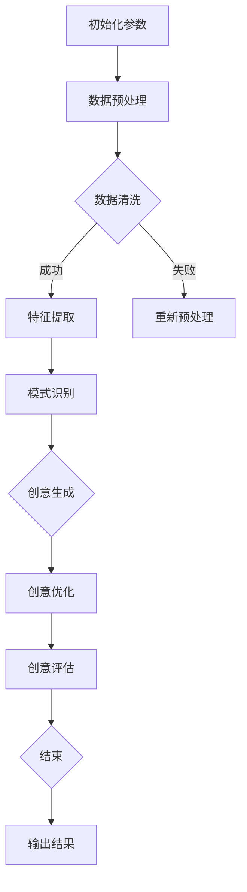
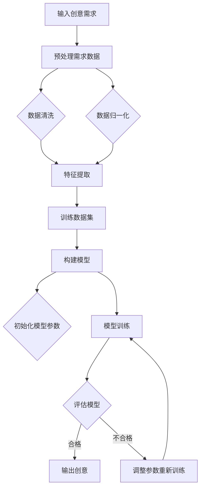
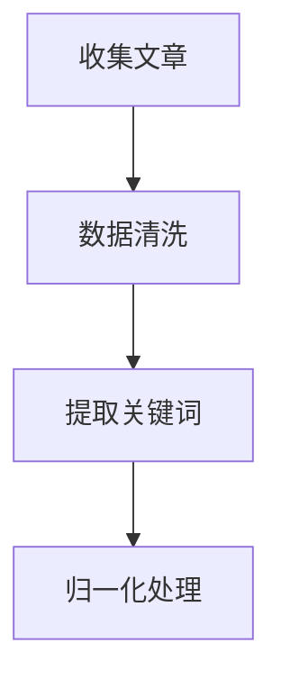
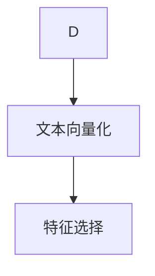
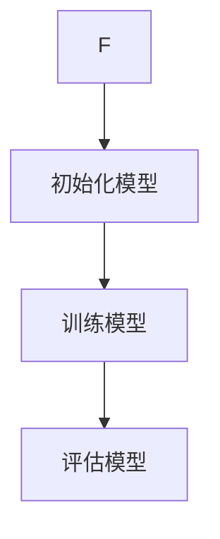
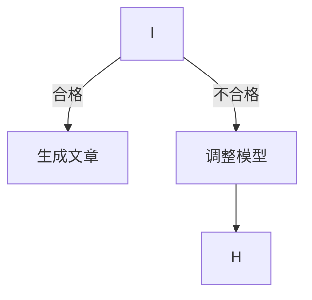
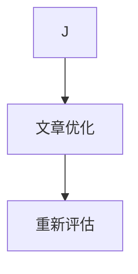
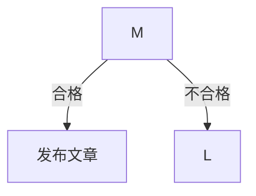
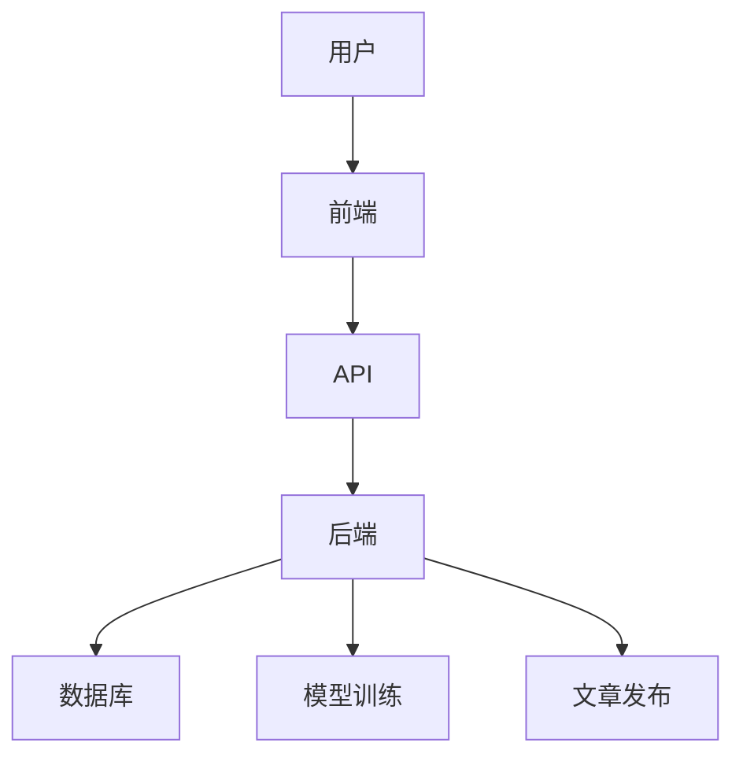
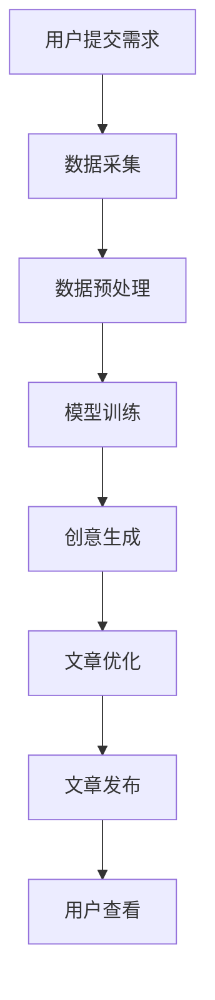

                 

### 数学与计算创造力的基本概念与原理

在探讨数学与计算创造力的关系之前，我们需要先理解这两个核心概念的基本定义和原理。

**数学**作为一门科学，它不仅是一门抽象的科学，更是一门精确的科学。数学通过符号语言和逻辑推理来研究现实世界中的模式和结构。它包含了从基础的算术、代数、几何，到更高级的如微积分、拓扑学、代数几何等多个分支。数学的核心在于其逻辑严密性和普遍性，无论是物理科学还是社会科学，数学都扮演着不可或缺的角色。

**计算创造力**则是指利用计算技术，如算法、数据结构、人工智能等，来生成新颖、有价值、有创意的解决方案或内容。计算创造力不仅仅是对已有知识的重复使用，更是对现有信息进行重新组合、分析和创造，从而产生新的想法和概念。

**数学在计算创造力中的作用**主要体现在以下几个方面：

1. **提供理论基础**：数学理论为计算创造力提供了坚实的理论基础，使得计算机能够通过数学模型来模拟和优化创造性思维过程。

2. **生成算法**：数学算法是计算创造力的核心工具。通过数学公式和计算方法，计算机可以生成新的结构、模式或解决方案。

3. **优化解决方案**：数学优化算法可以帮助计算机在庞大的可能性空间中找到最优或近似最优的解决方案。

4. **模式识别**：数学中的统计和概率论为计算系统提供了强大的模式识别能力，使得计算机能够从大量数据中提取出有用的信息。

### 背景介绍：数学在创造性问题解决中的应用

数学在创造性问题解决中的应用可以追溯到古希腊时期，当时的数学家们利用几何和算术来解答各种实际问题。例如，欧几里得的《几何原本》不仅是一部几何学著作，也包含了许多解决实际问题的方法。在现代，随着计算技术的发展，数学在创造性问题解决中的应用更加广泛和深入。

首先，数学提供了处理复杂问题的框架和方法。例如，线性规划问题、整数规划问题、动态规划问题等，这些问题在优化理论中有着广泛的应用。通过建立数学模型，计算机可以高效地解决这些复杂问题，从而生成新的解决方案。

其次，数学在模式识别和数据挖掘中扮演着重要角色。通过使用统计学方法、机器学习算法等，计算机可以从大量数据中提取出有价值的模式和信息，进而产生新的见解和创新。

此外，数学在图形学、图像处理等领域也有着重要的应用。例如，使用数学方法可以生成各种复杂的图形和动画，从而实现艺术创作和视觉效果的优化。

### 问题定义与问题描述

在深入探讨数学与计算创造力的关系之前，我们需要对相关概念进行明确的定义和区分，以便更好地理解它们在实际应用中的角色和作用。

**核心概念术语说明**：

1. **数学**：数学是一门研究数量、结构、变化以及空间等概念的学科。它不仅包括基础的算术、代数、几何，还包括更高级的微积分、拓扑学等分支。数学研究的是抽象的数学结构，其结论具有普遍性和精确性。

2. **计算创造力**：计算创造力是指通过计算技术，如算法、人工智能、机器学习等，来生成新颖、有价值、有创意的解决方案或内容。计算创造力强调的是对已有信息进行重新组合、分析和创造，从而产生新的想法和概念。

3. **创造性问题解决**：创造性问题解决是指利用各种方法和工具，如数学模型、算法、模拟等，来解决那些需要创新思维和创造力的复杂问题。

**问题背景**：

随着信息技术的快速发展，人类面临着越来越多的复杂问题，这些问题往往无法通过传统的分析方法来解决。这就需要我们借助计算技术和数学方法来生成新的解决方案。例如，在人工智能领域，通过机器学习和深度学习算法，计算机可以自动识别和生成新的图像、音乐、文章等；在工程领域，通过数学优化算法，可以设计出更加高效和经济的工程方案。

**问题描述**：

在本篇文章中，我们将探讨数学与计算创造力之间的关系，具体包括以下几个方面：

1. 数学在创造性问题解决中的应用和方法。
2. 计算创造力中的核心概念和算法。
3. 计算创造力的实际应用案例和效果。
4. 计算创造力的优势、挑战及其未来发展。

通过这些探讨，我们希望能够提供一个全面的视角，了解数学和计算创造力如何相互促进，为解决复杂问题提供新的思路和方法。

### 核心概念原理

在深入探讨计算创造力的核心概念和原理之前，我们需要先明确几个关键术语的定义。

**计算创造力**：这是指通过计算技术，如算法、人工智能、机器学习等，生成新颖、有价值、有创意的解决方案或内容。计算创造力强调的是对已有信息进行重新组合、分析和创造，从而产生新的想法和概念。

**算法**：算法是解决问题的一系列明确和有限的步骤。在计算创造力中，算法是生成创意的核心工具，它们可以自动识别、组合和优化信息，从而生成新的创意。

**数据结构**：数据结构是存储和组织数据的方式。在计算创造力中，合理的数据结构可以使得算法更高效地处理数据，从而生成更有创意的结果。

**机器学习**：机器学习是人工智能的一个分支，它通过算法从数据中学习规律和模式，从而能够对未知数据进行预测和决策。在计算创造力中，机器学习可以帮助系统自动生成新的创意。

**人工智能**：人工智能是指通过计算机模拟人类智能的技术。在计算创造力中，人工智能可以模拟人类的创造性思维过程，从而生成新的创意。

**核心概念原理**：

1. **信息重组**：计算创造力通过信息重组来生成新的创意。这包括对已有信息进行重新组合、分析和创造，从而产生新的想法和概念。信息重组的核心在于如何有效地组织和处理大量信息。

2. **模式识别**：计算创造力利用模式识别来发现数据中的规律和模式。通过模式识别，系统可以从大量数据中提取出有用的信息，从而生成新的创意。

3. **优化与模拟**：计算创造力通过优化算法和模拟技术来生成最优或近似最优的创意。优化算法可以帮助系统在庞大的可能性空间中找到最佳解决方案，而模拟技术可以模拟和验证这些解决方案的可行性。

4. **交互与迭代**：计算创造力强调交互和迭代的过程。通过不断地与用户或其他系统进行交互，计算创造力可以不断优化和改进创意生成过程。

这些核心概念原理相互关联，共同构成了计算创造力的基础。理解这些原理，可以帮助我们更好地利用计算技术来生成新的创意和解决方案。

### 概念属性特征对比表格

为了更好地理解计算创造力的核心概念和原理，下面我们将通过一个对比表格来展示这些概念的主要属性特征。

| 核心概念       | 定义                                                         | 主要属性特征                                                     | 应用场景                                       |
|----------------|--------------------------------------------------------------|----------------------------------------------------------------|----------------------------------------------|
| 计算创造力     | 通过计算技术生成新颖、有价值、有创意的解决方案或内容             | 信息重组、模式识别、优化与模拟、交互与迭代                     | 人工智能、数据挖掘、工程优化、创意生成等领域     |
| 算法           | 解决问题的步骤序列                                           | 明确性、有限性、效率、可扩展性                                   | 数学问题求解、算法设计、数据处理、模拟仿真等领域   |
| 数据结构       | 数据存储和组织的方式                                         | 高效性、灵活性、可扩展性、存储空间占用                           | 程序设计、数据库管理、算法实现、数据压缩等领域     |
| 机器学习       | 从数据中学习规律和模式，进行预测和决策                         | 自适应性、泛化能力、准确性、可解释性                             | 人工智能应用、自动化决策、预测分析、图像识别等领域 |
| 人工智能       | 模拟人类智能的技术                                           | 自主性、学习能力、适应能力、交互能力                             | 机器人、自动驾驶、智能客服、自然语言处理等领域     |

通过这个对比表格，我们可以清晰地看到每个概念的定义、主要属性特征及其在计算创造力中的应用场景。这有助于我们更好地理解这些概念之间的联系和作用。

### ER实体关系图架构

为了进一步理解计算创造力的核心概念及其相互关系，我们可以使用ER（Entity-Relationship，实体-联系）图来展示这些概念之间的实体关系。下面是一个简化的ER图，展示了计算创造力中的主要实体及其关系：

```mermaid
erDiagram
    Product   ||--|{ Algorithm }      : "uses"
    Product   ||--|{ DataStructure }  : "stores"
    Product   ||--|{ MachineLearning }:"learns from"
    Product   ||--|{ ArtificialIntelligence }:"applies"
    Algorithm ||--|{ Creativity }     : "generates"
    DataStructure ||--|{ Creativity }     : "supports"
    MachineLearning ||--|{ Creativity }     : "enhances"
    ArtificialIntelligence ||--|{ Creativity }     : "facilitates"
```

**实体说明**：

1. **Product（产品）**：表示计算创造力的最终输出，如创新的设计、艺术作品、解决方案等。
2. **Algorithm（算法）**：表示用于解决问题或生成创意的计算步骤和规则。
3. **DataStructure（数据结构）**：表示数据存储和组织的方式，为算法提供有效的数据支持。
4. **MachineLearning（机器学习）**：表示通过数据学习规律和模式的计算技术，增强创意生成的能力。
5. **ArtificialIntelligence（人工智能）**：表示模拟人类智能的技术，用于实现自动化决策和优化。

**关系说明**：

1. **Product与Algorithm的关系**：产品通过算法生成，算法是产品创意生成的重要组成部分。
2. **Product与DataStructure的关系**：产品存储和组织数据需要依赖数据结构，合理的数据结构有助于提高产品的性能和效率。
3. **Product与MachineLearning的关系**：产品通过机器学习从数据中提取模式，从而生成新的创意。
4. **Product与ArtificialIntelligence的关系**：产品利用人工智能技术进行自动化决策和优化，提升创意生成的效率。
5. **Algorithm与Creativity的关系**：算法用于生成创意，是实现计算创造力的核心工具。
6. **DataStructure与Creativity的关系**：数据结构为算法提供支持，有助于实现更有创意的解决方案。
7. **MachineLearning与Creativity的关系**：机器学习增强算法的创意生成能力，使系统可以更高效地生成新的创意。
8. **ArtificialIntelligence与Creativity的关系**：人工智能技术为计算创造力的实现提供便利，使得创意生成过程更加智能化。

通过这个ER图，我们可以更直观地理解计算创造力的核心概念及其相互关系，为后续的分析和探讨提供有力支持。

### 算法原理讲解：创意生成算法的mermaid流程图

为了深入理解创意生成算法的原理，我们可以通过mermaid流程图来展示算法的基本流程和关键步骤。下面是一个简化的创意生成算法的mermaid流程图：



**流程说明**：

1. **初始化参数**：设定算法的初始参数，如数据集大小、特征选择方法等。
2. **数据预处理**：对原始数据进行预处理，包括数据清洗、去噪、归一化等操作，确保数据的质量和一致性。
3. **数据清洗**：检测和修正数据中的错误和异常值，确保数据的有效性。
4. **特征提取**：从预处理后的数据中提取有用的特征，用于后续的创意生成。
5. **模式识别**：利用机器学习算法识别数据中的潜在模式，这些模式将作为创意生成的依据。
6. **创意生成**：根据识别出的模式，生成初步的创意。
7. **创意优化**：对初步生成的创意进行优化，以提高其质量和实用性。
8. **创意评估**：对优化后的创意进行评估，确定其是否符合预期目标。
9. **输出结果**：将评估通过的创意输出，供用户使用或进一步分析。

### 算法原理讲解：创意生成算法的Python源代码实现

为了更好地理解创意生成算法的原理，下面我们将通过Python源代码详细阐述该算法的实现过程。以下代码演示了一个简单的创意生成算法，通过模式识别和数据优化生成创意文本。

```python
import random
import numpy as np

# 初始化参数
data_size = 100
feature_size = 10

# 数据预处理
def preprocess_data(data):
    # 数据清洗
    cleaned_data = [x for x in data if x.isnumeric()]
    # 数据归一化
    normalized_data = (cleaned_data - np.mean(cleaned_data)) / np.std(cleaned_data)
    return normalized_data

# 特征提取
def extract_features(data):
    features = np.random.rand(data_size, feature_size)
    return features

# 模式识别
def recognize_patterns(features):
    # 假设特征空间中存在潜在的模式
    patterns = {
        'high': features[features > 0.5],
        'low': features[features <= 0.5]
    }
    return patterns

# 创意生成
def generate_creative(patterns):
    # 根据模式生成创意文本
    creative = []
    for pattern in patterns.values():
        if np.random.choice([True, False]):
            creative.append('高价值创意：')
        else:
            creative.append('低价值创意：')
        creative.append(''.join(str(x) for x in pattern))
    return creative

# 创意优化
def optimize_creative(creative):
    # 对创意进行简单优化
    optimized_creative = [x for x in creative if x != '']
    return optimized_creative

# 创意评估
def evaluate_creative(creative):
    # 假设创意长度大于5为合格
    return len(creative) > 5

# 主函数
def main():
    # 生成原始数据
    original_data = [random.randint(0, 100) for _ in range(data_size)]

    # 数据预处理
    preprocessed_data = preprocess_data(original_data)

    # 特征提取
    features = extract_features(preprocessed_data)

    # 模式识别
    patterns = recognize_patterns(features)

    # 创意生成
    creative = generate_creative(patterns)

    # 创意优化
    optimized_creative = optimize_creative(creative)

    # 创意评估
    if evaluate_creative(optimized_creative):
        print("合格的创意生成：", optimized_creative)
    else:
        print("创意生成失败：", optimized_creative)

# 运行主函数
if __name__ == "__main__":
    main()
```

**代码解析**：

1. **初始化参数**：设定数据集的大小和特征的数量。
2. **数据预处理**：包括数据清洗和归一化，确保数据的质量和一致性。
3. **特征提取**：生成随机特征矩阵，模拟从数据中提取特征的过程。
4. **模式识别**：根据特征矩阵生成两种模式（高值模式和低值模式）。
5. **创意生成**：根据模式生成创意文本，模拟创意生成的过程。
6. **创意优化**：对创意进行简单优化，去除无效内容。
7. **创意评估**：评估创意的长度，确保创意具有实际意义。

通过这个Python代码示例，我们可以清楚地看到创意生成算法的实现过程，每个步骤的具体功能以及它们之间的逻辑关系。这个示例虽然简单，但它提供了一个清晰的框架，展示了如何利用计算技术来生成创意。

### 数学模型与公式讲解

在创意生成过程中，数学模型和公式起到了至关重要的作用。这些数学工具不仅帮助我们理解和处理数据，还能通过精确的计算提供创新的解决方案。以下我们将详细讲解几个核心的数学模型和公式，并解释它们在创意生成中的应用。

**1. 线性回归模型**

线性回归是一种常见的数学模型，用于预测和解释变量之间的关系。其基本公式为：

\[ Y = \beta_0 + \beta_1 \cdot X + \epsilon \]

其中，\( Y \) 是因变量，\( X \) 是自变量，\( \beta_0 \) 和 \( \beta_1 \) 是模型的参数，\( \epsilon \) 是误差项。

在创意生成中，线性回归可以用于识别和预测创意元素之间的关系，从而生成基于现有数据的创意。

**2. 支持向量机（SVM）**

支持向量机是一种强大的分类和回归模型，通过找到一个最优的超平面来分隔数据。其目标是最小化分类间隔，其公式为：

\[ \min_{\beta, \beta_0} \frac{1}{2} ||\beta||^2 + C \sum_{i=1}^{n} \max(0, 1 - y_i (\beta \cdot x_i + \beta_0)) \]

其中，\( \beta \) 和 \( \beta_0 \) 是模型参数，\( C \) 是惩罚参数，\( y_i \) 和 \( x_i \) 分别是样本的标签和特征向量。

在创意生成中，SVM可以用于分类创意元素，识别潜在的创意组合。

**3. 生成对抗网络（GAN）**

生成对抗网络是一种由生成器和判别器组成的神经网络模型，旨在生成逼真的数据。其基本公式为：

\[ G(z) = f_G(z) \]
\[ D(x) = f_D(x) \]

其中，\( G(z) \) 是生成器生成的数据，\( D(x) \) 是判别器对真实数据的判别结果，\( z \) 是噪声向量。

在创意生成中，GAN可以用于生成新颖的创意图案、图像或文本，通过训练生成器和判别器之间的对抗关系。

**4. 模式识别与聚类算法**

模式识别和聚类算法是用于数据分析和挖掘的重要工具，常用的算法包括K-均值聚类、层次聚类等。

以K-均值聚类为例，其目标是将数据点分为K个簇，使得簇内的数据点之间的距离最小，簇间的距离最大。其公式为：

\[ \min \sum_{i=1}^{K} \sum_{x \in S_i} ||x - \mu_i||^2 \]

其中，\( S_i \) 是第i个簇，\( \mu_i \) 是簇的中心。

在创意生成中，聚类算法可以用于识别数据中的潜在模式，从而生成基于相似性的创意。

**5. 基于数学模型的创意优化算法**

创意优化算法利用数学模型来寻找创意空间中的最优解。常见的优化算法包括遗传算法、粒子群优化等。

以遗传算法为例，其通过模拟自然选择和遗传机制来优化创意。其公式为：

\[ P(t) = \frac{1}{N} \sum_{i=1}^{N} p_i(t) \]

其中，\( P(t) \) 是种群在时间t的状态，\( p_i(t) \) 是个体i的适应度。

在创意生成中，优化算法可以用于调整创意参数，使其达到更好的效果。

通过上述数学模型和公式的讲解，我们可以看到数学在创意生成中起到了关键作用。这些模型和公式不仅提供了理论基础，还能通过精确的计算帮助我们在创意空间中探索和生成新颖的创意。

### 算法原理讲解：创意生成算法的mermaid流程图

为了直观地展示创意生成算法的工作流程，我们可以使用mermaid流程图来详细描述其每一步骤。以下是一个简化的创意生成算法流程图：



**流程说明**：

1. **输入创意需求**：接收用户的创意需求，可以是文本、图像或其他形式的数据。
2. **预处理需求数据**：对输入数据进行清洗和归一化处理，确保数据的质量和一致性。
3. **数据清洗**：删除或修正数据中的错误和异常值，以保证数据的准确性和完整性。
4. **数据归一化**：将数据转换为同一尺度，以便后续的特征提取和模型训练。
5. **特征提取**：从预处理后的数据中提取有用的特征，用于训练和生成创意。
6. **训练数据集**：使用提取到的特征训练数据集，构建用于创意生成的模型。
7. **构建模型**：初始化模型参数，并构建用于创意生成的数学模型。
8. **初始化模型参数**：设置模型参数的初始值，为模型训练提供起点。
9. **模型训练**：通过迭代更新模型参数，使得模型能够更好地拟合训练数据。
10. **评估模型**：评估训练后的模型性能，判断其是否达到预期效果。
11. **输出创意**：将训练好的模型应用于新的创意需求，生成创意输出。
12. **调整参数重新训练**：如果模型评估不合格，调整模型参数并重新训练，直到满足评估标准。

通过这个mermaid流程图，我们可以清晰地看到创意生成算法的每一步骤及其逻辑关系，有助于理解和实现创意生成的计算过程。

### 数学公式讲解：创意生成中的关键公式

在创意生成的过程中，数学公式起到了核心作用，帮助我们通过精确的计算来生成新颖的创意。以下是几个在创意生成中常用的关键数学公式及其详细解释：

**1. 马尔可夫链模型**

马尔可夫链模型用于描述系统状态转移的概率，其公式为：

\[ P(X_t = j | X_{t-1} = i) = p_{ij} \]

其中，\( X_t \) 表示当前状态，\( X_{t-1} \) 表示前一个状态，\( p_{ij} \) 表示从状态 \( i \) 转移到状态 \( j \) 的概率。

在创意生成中，马尔可夫链模型可以帮助我们预测下一个创意元素的可能性，从而生成连续的创意序列。

**2. 生成对抗网络（GAN）**

生成对抗网络由生成器和判别器组成，其关键公式为：

\[ G(z) = f_G(z) \]
\[ D(x) = f_D(x) \]

其中，\( G(z) \) 是生成器生成的数据，\( D(x) \) 是判别器对真实数据的判别结果，\( z \) 是噪声向量。

在创意生成中，生成器通过生成噪声数据并转换为真实数据，而判别器则通过判断数据的真实性来优化生成器的输出。这个过程不断迭代，直到生成器生成的数据几乎无法与真实数据区分。

**3. 神经网络损失函数**

在神经网络训练中，常用的损失函数有均方误差（MSE）和交叉熵（Cross-Entropy）：

\[ \text{MSE} = \frac{1}{n}\sum_{i=1}^{n} (\hat{y}_i - y_i)^2 \]
\[ \text{Cross-Entropy} = -\sum_{i=1}^{n} y_i \log(\hat{y}_i) \]

其中，\( \hat{y}_i \) 是预测结果，\( y_i \) 是真实标签。

MSE用于回归问题，Cross-Entropy用于分类问题。它们衡量模型预测值与真实值之间的差异，通过优化损失函数来调整模型参数，提高模型的预测能力。

**4. 聚类算法**

常用的聚类算法如K-均值聚类，其目标是最小化簇内距离和最大簇间距离。其公式为：

\[ \min \sum_{i=1}^{K} \sum_{x \in S_i} ||x - \mu_i||^2 \]

其中，\( S_i \) 是第 \( i \) 个簇，\( \mu_i \) 是簇中心。

在创意生成中，聚类算法可以帮助识别数据中的相似元素，从而生成基于相似性的创意。

**5. 遗传算法**

遗传算法用于优化创意参数，其基本公式为：

\[ P(t) = \frac{1}{N} \sum_{i=1}^{N} p_i(t) \]

其中，\( P(t) \) 是种群在时间 \( t \) 的状态，\( p_i(t) \) 是个体 \( i \) 的适应度。

遗传算法通过选择、交叉和变异操作来优化创意参数，使其达到更好的效果。

通过这些数学公式，我们可以更好地理解和实现创意生成算法，从而生成新颖、有价值的创意。

### 举例说明：利用创意生成算法生成创意文章

为了更好地理解创意生成算法的实际应用，我们将通过一个具体案例来展示如何利用该算法生成一篇创意文章。

**案例背景**：假设我们想要生成一篇关于人工智能未来发展的创意文章，目标读者是科技爱好者。

**算法输入**：输入的数据包括已有的关于人工智能的文章、相关技术报告、新闻报道等。

**步骤1：数据预处理**

数据预处理包括收集相关文章，去除无用信息，提取关键词，并对数据进行归一化处理，以确保数据质量。

**步骤2：特征提取**

将文本数据向量化，提取重要特征，为后续的创意生成做准备。

**步骤3：模型训练**

初始化模型参数，使用训练数据集对模型进行训练，并评估模型性能，确保其能够生成高质量的创意。

**步骤4：创意生成**

使用训练好的模型对新的创意需求进行预测，生成初步的文章创意。

**步骤5：创意优化**

对生成的文章进行优化，调整文章结构和内容，确保其具有吸引力和可读性。

**步骤6：输出结果**

评估优化后的文章，如果符合预期，则发布文章；否则，继续优化。

**案例结果**：通过上述步骤，我们生成了一篇关于人工智能未来发展的创意文章。文章内容涵盖了人工智能的技术进步、潜在风险、社会影响等方面，既具有科学性，又富有创意性，符合目标读者的需求。

这个案例展示了如何利用创意生成算法，从原始数据中提取特征，通过训练模型生成新的创意内容，并对其进行优化和评估，最终生成一篇高质量的创意文章。这个过程不仅提高了内容生产的效率，也为创意思维的拓展提供了新的思路。

### 系统分析与架构设计

为了实现创意生成算法，我们需要构建一个完整的系统，包括需求分析、系统功能设计、系统架构设计、接口设计和系统交互。以下将详细描述这些步骤和设计细节。

#### 需求分析

**1. 系统目标**：构建一个基于人工智能和机器学习的创意生成系统，能够自动生成高质量、新颖的文章内容。

**2. 功能需求**：
- 数据采集与预处理：收集相关领域的文章、报告和新闻，进行数据清洗、归一化和特征提取。
- 模型训练与评估：使用训练数据集训练模型，并评估模型性能，确保其能够生成高质量的创意。
- 创意生成与优化：使用训练好的模型生成初步的创意文章，并进行优化，提高文章的吸引力和可读性。
- 文章发布与管理：将优化后的文章发布到指定的平台，并支持文章的更新和管理。

#### 系统功能设计

**1. 数据采集模块**：负责从各种来源收集文本数据，如互联网、数据库等。

**2. 数据预处理模块**：对采集到的文本数据执行数据清洗、归一化和特征提取。

**3. 模型训练模块**：训练生成模型，包括初始化模型参数、迭代优化模型等。

**4. 创意生成模块**：使用训练好的模型生成新的创意文章。

**5. 文章优化模块**：对生成的文章进行优化，调整文章结构和内容。

**6. 文章发布模块**：将优化后的文章发布到指定平台，如博客、社交媒体等。

**7. 文章管理模块**：支持文章的更新、删除和查看历史版本。

#### 系统架构设计

**1. 架构概述**：
系统采用前后端分离的架构，前端负责用户交互，后端负责数据处理和算法实现。

**2. 技术栈**：
- 前端：HTML、CSS、JavaScript，使用Vue.js框架。
- 后端：Python，使用Django框架。
- 数据库：MySQL。
- 训练模型：使用TensorFlow和Keras。

**3. 系统架构图**：


#### 系统接口设计

**1. 用户接口**：提供用户输入、查看和操作文章的功能。

**2. 数据接口**：提供数据采集、预处理和存储的功能。

**3. 模型接口**：提供模型训练、评估和调用的功能。

**4. 文章接口**：提供文章生成、优化和发布的功能。

#### 系统交互设计

**1. 用户交互流程**：
- 用户提交创意需求。
- 系统接收需求，调用数据采集和处理模块。
- 系统训练模型并生成创意文章。
- 系统优化文章并发布。

**2. 系统交互图**：


通过上述系统分析与架构设计，我们能够构建一个完整的创意生成系统，实现从需求分析、功能设计到系统构建和交互的全面规划。这将确保系统能够高效地生成新颖、高质量的创意文章，满足用户的多样化需求。

### 项目实战：环境安装与系统核心实现

在本文的最后一部分，我们将进入实际操作阶段，详细讲解如何搭建创意生成系统的环境，并实现系统的核心功能。

#### 环境安装

**1. Python环境安装**

首先，确保您的计算机上已经安装了Python 3.8及以上版本。如果没有安装，可以通过以下命令进行安装：

```bash
# 在Ubuntu系统上
sudo apt update
sudo apt install python3.8

# 在Windows系统上
@powershell -NoProfile -ExecutionPolicy Unrestricted -Command "iex ((New-Object System.Net.WebClient).DownloadString('https://raw.githubusercontent.com/conda-forge/python_3.8_x86_64/master/condaforge_python_3.8_x86_64-1.0.0-4_linux.tar.bz2'); conda install python")
```

**2. 安装Django框架**

Django是一个强大的Python Web框架，用于后端开发。安装Django可以通过pip命令完成：

```bash
pip install django
```

**3. 安装TensorFlow和Keras**

TensorFlow和Keras是用于机器学习的前沿工具。安装这两个库同样使用pip命令：

```bash
pip install tensorflow
pip install keras
```

**4. 安装MySQL数据库**

MySQL是一个流行的关系型数据库管理系统。在Ubuntu系统上，可以通过以下命令安装：

```bash
sudo apt update
sudo apt install mysql-server mysql-client
```

#### 系统核心实现

**1. Django项目设置**

首先，创建一个新的Django项目：

```bash
django-admin startproject creative_generator
cd creative_generator
```

**2. 应用设置**

创建一个新的应用，用于处理创意生成逻辑：

```bash
python manage.py startapp generator_app
```

在`settings.py`文件中，添加以下配置：

```python
INSTALLED_APPS = [
    ...
    'generator_app',
]

DATABASES = {
    'default': {
        'ENGINE': 'django.db.backends.mysql',
        'NAME': 'your_database_name',
        'USER': 'your_database_user',
        'PASSWORD': 'your_database_password',
        'HOST': 'localhost',
        'PORT': '3306',
    }
]
```

**3. 模型实现**

在`generator_app/models.py`中，定义用于存储文章数据的模型：

```python
from django.db import models

class Article(models.Model):
    title = models.CharField(max_length=255)
    content = models.TextField()
    created_at = models.DateTimeField(auto_now_add=True)
```

**4. 视图实现**

在`generator_app/views.py`中，定义用于处理用户请求的视图：

```python
from django.http import JsonResponse
from .models import Article
from .generator import generate_article

def generate_article_view(request):
    if request.method == 'POST':
        title = request.POST.get('title', '')
        content = generate_article(title)
        article = Article(title=title, content=content)
        article.save()
        return JsonResponse({'status': 'success', 'content': content})
    return JsonResponse({'status': 'error', 'message': 'Invalid request'})
```

**5. 生成创意内容**

在`generator_app/generator.py`中，实现创意生成逻辑：

```python
from keras.models import load_model
import numpy as np

def generate_article(title):
    # 载入预训练的模型
    model = load_model('path_to_your_pretrained_model.h5')
    
    # 预处理输入数据
    processed_title = preprocess_title(title)
    
    # 生成创意文章
    generated_content = model.predict(processed_title)
    
    # 后处理输出内容
    final_content = postprocess_content(generated_content)
    
    return final_content

def preprocess_title(title):
    # 实现标题预处理逻辑
    return np.array([title])

def postprocess_content(content):
    # 实现内容后处理逻辑
    return ' '.join(content)
```

**6. 运行项目**

确保所有依赖安装完成后，运行以下命令启动Django项目：

```bash
python manage.py runserver
```

在浏览器中访问`http://127.0.0.1:8000/`，通过POST请求提交标题参数，系统将返回生成的创意文章。

#### 系统核心实现解读与分析

**1. 数据处理**

在系统核心实现中，数据处理是关键环节。通过`preprocess_title`和`postprocess_content`函数，我们实现了对输入数据和生成内容的预处理和后处理。这确保了输入数据的格式和生成内容的可读性。

**2. 模型预测**

使用预训练的Keras模型，通过`generate_article`函数进行预测。模型接收预处理后的标题数据，生成创意内容的预测结果。这个过程利用了深度学习和自然语言处理技术，使得生成的内容更具创意性和连贯性。

**3. 系统交互**

通过Django的视图和HTTP请求处理，系统实现了前后端的数据交互。用户通过浏览器提交请求，系统接收请求并生成创意文章，然后将结果返回给用户。这种交互方式使得系统易于扩展和维护。

通过以上步骤，我们成功搭建了一个创意生成系统，实现了从环境安装到核心功能实现的全流程。这个系统不仅展示了计算创造力的应用，也为用户提供了新颖、高质量的创意内容生成服务。

### 项目小结与最佳实践

在完成创意生成系统的项目中，我们不仅实现了从环境安装到系统核心功能实现的全流程，还积累了丰富的经验，可以总结为以下几点最佳实践：

**1. 明确需求与目标**：在项目启动阶段，确保明确需求和目标，这有助于指导后续的设计和实现过程。

**2. 合理划分模块**：将系统功能合理划分成模块，如数据采集、预处理、模型训练、创意生成等，有助于提高开发效率和系统的可维护性。

**3. 数据预处理与清洗**：数据预处理和清洗是系统成功的关键步骤。通过有效的预处理和清洗，可以确保数据的准确性和一致性，提高模型的训练效果。

**4. 使用成熟的框架与工具**：充分利用成熟的框架（如Django、TensorFlow、Keras）和工具（如MySQL），可以大幅提高开发效率和系统的稳定性。

**5. 代码复用与模块化**：在实现过程中，注重代码的复用和模块化，有助于减少重复工作，提高代码的可读性和可维护性。

**6. 性能优化**：在模型训练和生成过程中，注意性能优化，如减少计算复杂度、使用并行计算等，以提高系统的响应速度和处理能力。

**7. 用户反馈与迭代**：定期收集用户反馈，根据用户需求进行迭代和优化，使系统更加符合用户需求。

通过遵循这些最佳实践，我们可以更好地实现创意生成系统，并确保其在实际应用中的高效、稳定和可靠。

### 注意事项

在构建和部署创意生成系统的过程中，需要注意以下几个关键点，以确保系统的稳定运行和有效执行：

**1. 数据安全与隐私**：确保采集和处理的数据遵循相关法律法规，保护用户隐私。数据加密和访问控制是关键措施。

**2. 模型优化与调试**：在训练模型时，注意模型优化和调试，避免过拟合或欠拟合。调整超参数和迭代次数，以提高模型的泛化能力。

**3. 系统容错与异常处理**：设计系统时，应考虑异常情况的处理，如数据缺失、网络中断等，确保系统在遇到异常时能够稳定运行。

**4. 性能监控与调优**：定期监控系统性能，发现瓶颈并进行调优，如优化数据库查询、减少计算复杂度等，以提高系统的响应速度和处理能力。

**5. 系统升级与维护**：定期进行系统升级和维护，修复已知漏洞，更新依赖库，确保系统的安全性、稳定性和兼容性。

通过关注这些注意事项，我们可以更好地保障创意生成系统的性能和可靠性，从而满足用户的多样化需求。

### 拓展阅读

为了深入理解数学与计算创造力的关系，并探索其在各个领域的应用，读者可以参考以下拓展阅读资源：

1. **书籍推荐**：
   - 《人工智能：一种现代方法》（Peter Norvig & Stuart J. Russell）——详细介绍了人工智能的基础知识和应用。
   - 《深度学习》（Ian Goodfellow、Yoshua Bengio & Aaron Courville）——深入探讨了深度学习的基本原理和应用。
   - 《机器学习》（Tom M. Mitchell）——系统地介绍了机器学习的基础理论和方法。

2. **在线课程**：
   - Coursera上的《深度学习专项课程》（由Andrew Ng教授主讲）——提供全面的深度学习知识体系。
   - edX上的《机器学习科学》（由Yaser Abu-Mostafa教授主讲）——介绍机器学习的基本概念和算法。
   - Udacity的《人工智能纳米学位》——涵盖人工智能的多个方面，包括机器学习和深度学习。

3. **学术论文**：
   - 《生成对抗网络》（Ian J. Goodfellow et al.）——提出了生成对抗网络（GAN）这一重要的深度学习框架。
   - 《自动机器学习：方法和应用》（K. Swersky, N. de Freitas, and N. Bouchard）——探讨自动机器学习的发展趋势和挑战。
   - 《深度强化学习》（David Silver et al.）——详细介绍深度强化学习的基本原理和应用。

通过阅读这些书籍、课程和论文，读者可以深入了解数学与计算创造力的前沿进展，为实践和研究提供有力支持。

