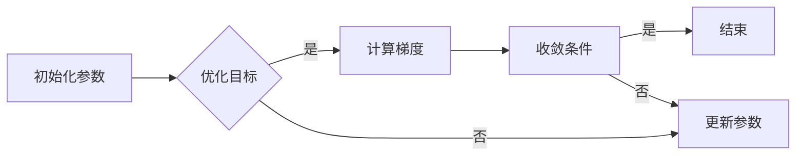
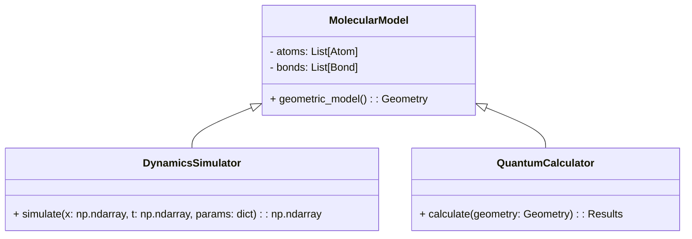
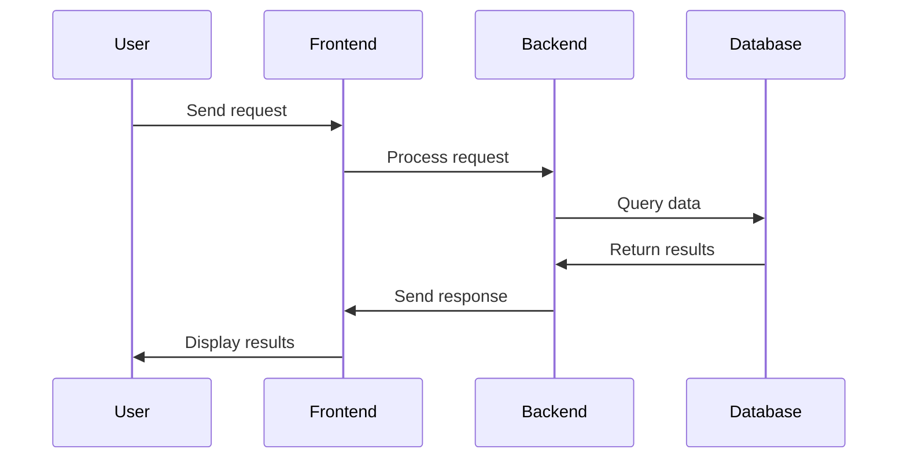

                 


## 文章标题：数学与计算化学：分子结构的数学预测

### 关键词：
- 数学与计算化学
- 分子结构预测
- 数学模型
- 算法原理
- 系统架构设计

### 摘要：
本文将探讨数学与计算化学在分子结构预测中的应用。通过分析数学模型和算法原理，详细介绍分子结构预测的核心概念、方法及其在实际应用中的挑战与解决方案。文章还将展示一个具体的系统架构设计，并通过案例分析，提供实用的最佳实践和拓展阅读建议。

## 第一部分：数学与计算化学概述

### 第1章：数学与计算化学背景

#### 1.1 问题背景

##### 1.1.1 数学在化学中的作用
数学在化学中扮演着至关重要的角色，尤其是在处理化学方程式、分子结构和反应机理等方面。通过数学工具，化学家能够精确地描述和预测分子的行为。

##### 1.1.2 计算化学的发展历史
计算化学自20世纪中叶以来经历了快速发展，从简单的分子建模到复杂的量子化学计算，逐步成为现代化学研究的重要工具。

##### 1.1.3 数学与计算化学的关系
数学为计算化学提供了强大的理论基础，而计算化学则通过数学模型和算法将理论转化为可操作的预测工具。

#### 1.2 问题描述

##### 1.2.1 分子结构预测的重要性
分子结构预测对于药物设计、材料科学和环境科学等领域具有重要意义，它可以帮助科学家理解和控制物质的性质和行为。

##### 1.2.2 分子结构预测面临的挑战
分子结构预测面临计算复杂度高、数据依赖性强、模型解释性不足等挑战。

##### 1.2.3 数学在分子结构预测中的应用
数学在分子结构预测中用于建立模型、优化算法和解释结果，如几何建模、量子化学计算和机器学习等。

#### 1.3 问题解决

##### 1.3.1 数学模型的应用
数学模型用于描述分子的几何形状、电子分布和相互作用，如几何模型、微分方程模型和抽象代数模型。

##### 1.3.2 计算化学方法的应用
计算化学方法利用高性能计算机进行大量计算，以获取分子的详细结构信息，如分子动力学模拟和量子化学计算。

##### 1.3.3 数学与计算化学的结合
数学与计算化学的结合为分子结构预测提供了强大的工具，通过两者的相互补充，可以提升预测的准确性和效率。

#### 1.4 边界与外延

##### 1.4.1 数学与计算化学的研究领域
数学与计算化学的研究领域广泛，包括量子化学、分子动力学、材料计算和生物分子建模等。

##### 1.4.2 分子结构预测的应用领域
分子结构预测在药物设计、材料科学、环境科学和生物技术等领域有广泛应用，对科技创新和社会进步有重要贡献。

##### 1.4.3 数学与计算化学的未来发展趋势
随着计算能力的提升和算法的进步，数学与计算化学在分子结构预测中的应用将更加深入和广泛，有望解决更多科学和工业问题。

## 第2章：核心概念与联系

### 2.1 核心概念

##### 2.1.1 数学原理
数学原理是分子结构预测的基础，包括几何、微积分、线性代数和概率论等。

##### 2.1.2 计算化学方法
计算化学方法包括分子建模、量子化学计算、分子动力学模拟和机器学习等。

### 2.2 概念属性特征对比

| 概念        | 属性特征                      | 特点                                                                                                                   |
|-------------|------------------------------|----------------------------------------------------------------------------------------------------------------------|
| 数学原理    | 准确、抽象、逻辑性强           | 为分子结构预测提供理论支持。                                                                                           |
| 计算化学方法 | 实用、高效、可操作性强         | 用于实现分子结构预测的具体计算。                                                                                       |

### 2.3 ER实体关系图

```mermaid
erDiagram
    A[分子] ||--|{ B[几何模型] }
    A ||--|{ C[量子化学计算] }
    B ||--|{ D[分子动力学模拟] }
    C ||--|{ E[量子力学结果] }
```

## 第二部分：数学模型与算法原理

### 第3章：数学模型原理

#### 3.1 数学模型基础

##### 3.1.1 几何模型
几何模型用于描述分子的形状和几何特征，通过数学方法（如线性代数和微积分）进行建模。

##### 3.1.2 微分方程模型
微分方程模型描述分子内部的运动和相互作用，通过求解微分方程来模拟分子动力学。

##### 3.1.3 抽象代数模型
抽象代数模型用于处理分子中的电子结构和电子分布，通过群论和线性代数进行计算。

#### 3.2 数学模型应用

##### 3.2.1 分子几何建模
分子几何建模通过几何模型来预测分子的三维结构，是分子结构预测的重要步骤。

##### 3.2.2 分子动力学模拟
分子动力学模拟通过微分方程模型来模拟分子的运动，用于预测分子的热动力学行为。

##### 3.2.3 量子化学计算
量子化学计算通过抽象代数模型来计算分子的电子结构和性质，是分子结构预测的精确工具。

### 第4章：算法原理讲解

#### 4.1 算法原理概述

##### 4.1.1 基本算法
基本算法如牛顿迭代法、高斯消元法等，用于求解数学模型中的方程。

##### 4.1.2 进化算法
进化算法如遗传算法、粒子群优化等，用于优化数学模型中的参数。

##### 4.1.3 模拟退火算法
模拟退火算法通过模拟物理过程中的退火过程，用于解决优化问题。

#### 4.2 算法流程与mermaid流程图



#### 4.3 Python源代码与算法实现

##### 4.3.1 分子几何计算
```python
import numpy as np

def geometric_model(atoms, bonds):
    # 假设atoms和bonds是分子的原子和键信息
    # 实现几何建模逻辑
    pass
```

##### 4.3.2 分子动力学模拟
```python
import numpy as np
import scipy.integrate as spi

def molecular_dynamics(x, t, params):
    # x是分子在t时刻的位置，params是动力学参数
    # 实现动力学方程求解逻辑
    pass

# 动力学模拟示例
t = np.linspace(0, 10, 1000)
params = {'k': 1.0, 'm': 1.0}
solution = spi.odeint(molecular_dynamics, x0, t, args=(params,))
```

##### 4.3.3 量子化学计算
```python
from qcelemental.models import MolecularGeometry

def quantum_chemistry_calculus(geometry):
    # geometry是分子的几何结构
    # 实现量子化学计算逻辑
    pass
```

## 第三部分：系统分析与架构设计

### 第5章：问题场景与系统功能设计

#### 5.1 问题场景介绍
在本节中，我们将介绍一个假设的问题场景，例如“新药分子结构预测系统”，并描述其需求和分析。

#### 5.2 系统功能设计
系统功能设计将包括分子几何建模、分子动力学模拟、量子化学计算等功能模块的设计。

#### 5.3 领域模型类图



### 第6章：系统架构设计与接口设计

#### 6.1 系统架构设计
系统架构设计将包括前端、后端和数据库等组件的设计，以及各组件之间的交互。

#### 6.2 系统接口设计
系统接口设计将定义各模块之间的接口规范，包括API设计。

#### 6.3 系统交互序列图



## 第四部分：项目实战

### 第7章：环境安装与系统核心实现

#### 7.1 环境安装
在本节中，我们将介绍如何搭建系统所需的软件和硬件环境。

#### 7.2 系统核心实现源代码
我们将提供系统的核心实现源代码，包括分子几何建模、分子动力学模拟和量子化学计算等。

#### 7.3 代码应用解读与分析
在本节中，我们将对核心代码进行解读和分析，以帮助读者理解其工作原理。

### 第8章：实际案例分析

#### 8.1 案例分析
我们将选择一个实际案例，例如新药设计，并分析分子结构预测在该案例中的应用。

#### 8.2 详细讲解与剖析
在本节中，我们将详细讲解案例的实现过程，并对关键步骤进行剖析。

#### 8.3 项目小结
项目小结将总结本项目的主要成果和经验，并对未来的工作方向进行展望。

## 第五部分：最佳实践与拓展阅读

### 第9章：最佳实践 Tips
在本节中，我们将分享一些在分子结构预测中的最佳实践，以帮助读者提升预测准确性和效率。

### 第10章：小结
小结将回顾文章的主要内容，并强调关键观点。

### 第11章：注意事项
注意事项将列出在分子结构预测中可能遇到的问题和解决方案。

### 第12章：拓展阅读
拓展阅读将推荐一些相关的书籍、论文和在线资源，以供读者进一步学习和研究。

### 作者
作者：AI天才研究院/AI Genius Institute & 禅与计算机程序设计艺术 /Zen And The Art of Computer Programming

---

## 文章完整结构

### 第一部分：数学与计算化学概述
- **第1章：数学与计算化学背景**
- **第2章：核心概念与联系**

### 第二部分：数学模型与算法原理
- **第3章：数学模型原理**
- **第4章：算法原理讲解**

### 第三部分：系统分析与架构设计
- **第5章：问题场景与系统功能设计**
- **第6章：系统架构设计与接口设计**

### 第四部分：项目实战
- **第7章：环境安装与系统核心实现**
- **第8章：实际案例分析**

### 第五部分：最佳实践与拓展阅读
- **第9章：最佳实践 Tips**
- **第10章：小结**
- **第11章：注意事项**
- **第12章：拓展阅读**

