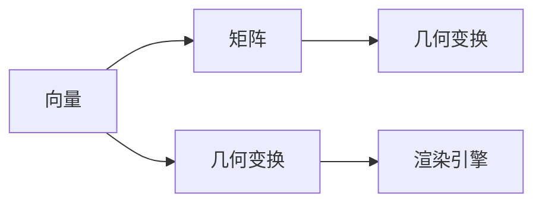
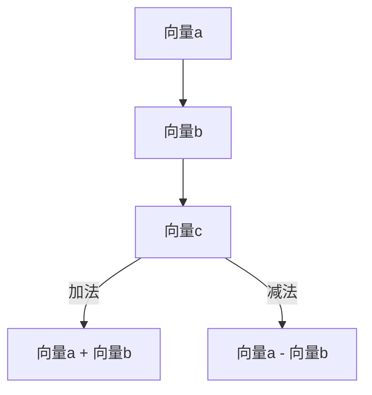
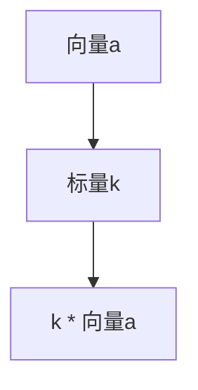
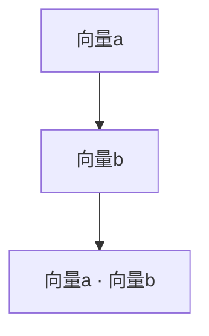
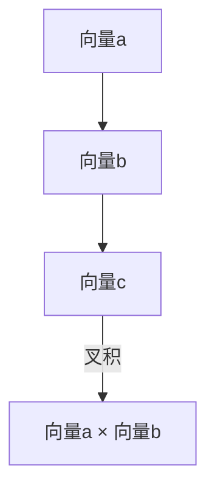
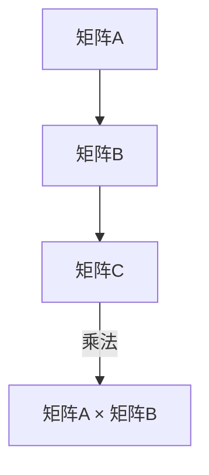
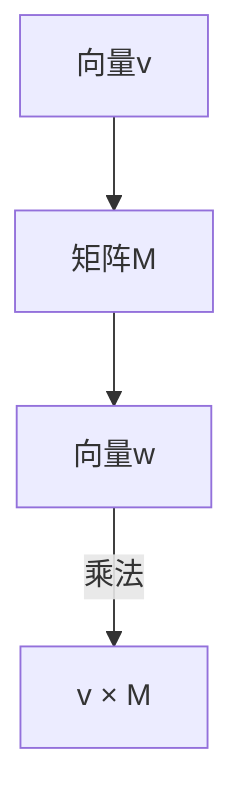
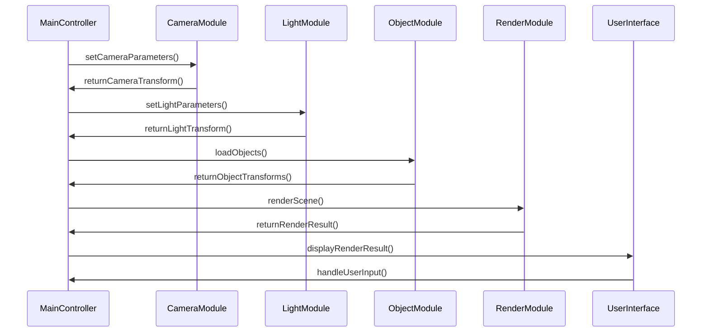

                 

### 数学与计算机图形学：3D渲染的数学方法

> **关键词：**3D渲染，数学基础，计算机图形学，光线追踪，矩阵运算，几何变换，渲染引擎架构设计，项目实战。

> **摘要：**本文深入探讨了3D渲染领域的数学方法，从核心概念、理论基础到实际应用，为读者揭示了计算机图形学的数学本质。通过详细的算法讲解和项目实战，帮助读者掌握3D渲染的核心技术，提升计算机图形处理能力。

----------------------------------------------------------------

## 引言

### 问题背景

在数字化时代，计算机图形学已经成为信息可视化和多媒体技术的重要组成部分。3D渲染技术作为计算机图形学的一个重要分支，其在游戏、影视、虚拟现实和增强现实等领域的应用越来越广泛。然而，3D渲染的核心技术离不开数学的支持。

### 问题描述

3D渲染的数学方法主要涉及向量与矩阵运算、几何变换、光线追踪算法等方面。这些数学工具如何应用在渲染过程中，如何实现高效的渲染效果，是3D渲染技术发展的关键。

### 问题解决

本文将分以下几个部分来探讨3D渲染的数学方法：

1. **核心概念与联系**：介绍3D渲染中涉及的核心概念，如向量、矩阵、几何变换等，并展示它们之间的联系。
2. **理论基础**：讲解3D渲染的数学基础，包括向量与矩阵运算、几何变换、光线追踪算法等。
3. **渲染引擎架构设计**：介绍渲染引擎的架构设计，包括系统功能设计、系统架构设计和系统接口设计等。
4. **3D渲染项目实战**：通过一个具体的3D渲染项目，展示从环境安装到核心实现的全过程。

### 边界与外延

本文主要讨论3D渲染的数学方法，不涉及具体渲染软件的实现细节。同时，本文将重点关注理论讲解和实际应用，旨在为读者提供系统的3D渲染知识体系。

### 概念结构与核心要素组成

本文分为以下几个核心部分：

1. **引言**：介绍3D渲染的背景、问题描述、问题解决方法和边界与外延。
2. **核心概念与联系**：详细讲解3D渲染中的核心概念，如向量、矩阵、几何变换等，并展示它们之间的联系。
3. **理论基础**：深入探讨3D渲染的数学基础，包括向量与矩阵运算、几何变换、光线追踪算法等。
4. **渲染引擎架构设计**：介绍渲染引擎的架构设计，包括系统功能设计、系统架构设计和系统接口设计等。
5. **3D渲染项目实战**：通过一个具体的3D渲染项目，展示从环境安装到核心实现的全过程。
6. **总结与展望**：对整篇文章的内容进行总结，并展望3D渲染技术的发展趋势。

## 核心概念与联系

### 核心概念原理

在3D渲染中，核心概念包括向量、矩阵、几何变换等。

1. **向量**：向量是表示大小和方向的量，在3D渲染中用于表示位置、速度、力等。向量运算包括加法、减法、数乘和点积、叉积等。

2. **矩阵**：矩阵是一个二维数组，用于表示线性变换。在3D渲染中，矩阵用于表示几何变换，如旋转、平移、缩放等。

3. **几何变换**：几何变换是指对物体进行旋转、平移、缩放等操作。在3D渲染中，几何变换用于将物体从模型空间转换为视图空间。

### 概念属性特征对比表格

| 概念   | 属性特征                          | 用途                             |
| ------ | ------------------------------- | ---------------------------- |
| 向量   | 大小、方向                        | 表示位置、速度、力等             |
| 矩阵   | 行、列、元素                        | 表示线性变换，如旋转、平移、缩放等 |
| 几何变换 | 旋转、平移、缩放等变换方式          | 用于物体的空间变换               |

### ER实体关系图架构

为了更好地理解3D渲染中的核心概念，我们可以使用实体关系图（ER图）来展示它们之间的关系。



在这个ER图中，向量、矩阵和几何变换都是渲染引擎的重要组成部分，它们相互关联，共同实现3D渲染的效果。

## 第二部分：理论基础

### 第3章：3D渲染的数学基础

在3D渲染中，数学基础是不可或缺的。本章节将详细介绍向量与矩阵运算、几何变换和光线追踪算法等数学方法。

### 第3章.1 向量与矩阵运算

向量与矩阵运算是3D渲染的基础。以下是对向量与矩阵运算的详细讲解。

#### 3.1.1.1 向量基本运算

向量运算包括向量的加法、减法、数乘和点积、叉积等。向量的加法和减法遵循平行四边形法则，如图所示：



向量与标量的数乘是将向量的每个分量乘以标量，如图所示：



向量的点积和叉积运算用于计算两个向量的夹角和垂直平面。点积运算结果是一个标量，表示两个向量的夹角余弦值，如图所示：



叉积运算结果是一个垂直于两个向量的向量，如图所示：



#### 3.1.1.2 矩阵乘法

矩阵乘法是3D渲染中重要的运算之一。两个矩阵相乘得到一个新的矩阵，如图所示：



矩阵乘法满足结合律和分配律，如图所示：

```mermaid
graph TD
A[矩阵A] --> B[矩阵B]
B --> C[矩阵C]
C -->|结合律| D[矩阵(A × B) × C]
E[矩阵A] --> F[矩阵C]
F -->|分配律| G[(A × B) × C]
```

#### 3.1.1.3 向量与矩阵的乘法

向量与矩阵的乘法是3D渲染中常用的操作。向量与矩阵的乘法可以将向量转换为新的向量，如图所示：



向量与矩阵的乘法遵循以下规则：

$$\vec{v} \times \begin{bmatrix}
a_{11} & a_{12} & a_{13} \\
a_{21} & a_{22} & a_{23} \\
a_{31} & a_{32} & a_{33}
\end{bmatrix} = \begin{bmatrix}
a_{11}v_x + a_{21}v_y + a_{31}v_z \\
a_{12}v_x + a_{22}v_y + a_{32}v_z \\
a_{13}v_x + a_{23}v_y + a_{33}v_z
\end{bmatrix}$$

#### 3.1.1.4 矩阵的逆

矩阵的逆是3D渲染中常用的操作之一。一个可逆矩阵的逆矩阵可以通过以下公式计算：

$$\begin{bmatrix}
a_{11} & a_{12} & a_{13} \\
a_{21} & a_{22} & a_{23} \\
a_{31} & a_{32} & a_{33}
\end{bmatrix}^{-1} = \frac{1}{\det(A)} \begin{bmatrix}
a_{22}a_{33} - a_{23}a_{32} & a_{23}a_{31} - a_{21}a_{33} & a_{21}a_{32} - a_{22}a_{31} \\
a_{12}a_{33} - a_{13}a_{32} & a_{13}a_{31} - a_{11}a_{33} & a_{11}a_{32} - a_{12}a_{31} \\
a_{12}a_{23} - a_{13}a_{22} & a_{13}a_{21} - a_{11}a_{23} & a_{11}a_{22} - a_{12}a_{21}
\end{bmatrix}$$

其中，$\det(A)$ 表示矩阵A的行列式。

### 第3章.2 几何变换

几何变换是3D渲染中的核心内容之一。本章节将详细介绍几何变换的类型、原理和实现方法。

#### 3.2.1 旋转变换

旋转变换是指将物体绕某个轴旋转一定角度。旋转变换可以使用旋转矩阵实现。旋转矩阵可以通过以下公式计算：

$$R(\theta) = \begin{bmatrix}
\cos(\theta) & -\sin(\theta) \\
\sin(\theta) & \cos(\theta)
\end{bmatrix}$$

其中，$\theta$ 表示旋转角度。

#### 3.2.2 平移变换

平移变换是指将物体沿着某个方向移动一定的距离。平移变换可以使用平移矩阵实现。平移矩阵可以通过以下公式计算：

$$T(\vec{d}) = \begin{bmatrix}
1 & 0 & d_x \\
0 & 1 & d_y \\
0 & 0 & 1
\end{bmatrix}$$

其中，$\vec{d} = (d_x, d_y, d_z)$ 表示平移向量。

#### 3.2.3 缩放变换

缩放变换是指将物体按一定比例放大或缩小。缩放变换可以使用缩放矩阵实现。缩放矩阵可以通过以下公式计算：

$$S(k_x, k_y, k_z) = \begin{bmatrix}
k_x & 0 & 0 \\
0 & k_y & 0 \\
0 & 0 & k_z
\end{bmatrix}$$

其中，$k_x, k_y, k_z$ 表示缩放比例。

#### 3.2.4 组合变换

组合变换是指将多个几何变换组合在一起，以实现更复杂的变换效果。组合变换可以通过矩阵乘法实现。例如，将旋转、平移和缩放组合在一起的变换矩阵可以通过以下公式计算：

$$M = R(\theta) \times T(\vec{d}) \times S(k_x, k_y, k_z)$$

### 第3章.3 光线追踪算法

光线追踪算法是3D渲染中重要的算法之一。它通过模拟光线在场景中的传播过程，实现高质量的渲染效果。本章节将详细介绍光线追踪算法的原理和实现方法。

#### 3.3.1 算法原理

光线追踪算法的基本原理是：从摄像机出发，模拟光线在场景中的传播过程，遇到物体时记录光线与物体的交点，并计算交点的颜色。光线追踪算法的核心是光线-物体交点检测和颜色计算。

#### 3.3.2 算法流程

光线追踪算法的流程可以概括为以下几个步骤：

1. **初始化**：设置摄像机参数、场景对象、光线追踪深度等。
2. **发射光线**：从摄像机发射光线，遍历场景中的每个像素点。
3. **检测交点**：对每个光线进行交点检测，判断光线与场景中的物体是否相交。
4. **计算颜色**：对相交的点进行颜色计算，根据材质、光线方向和光照强度等因素计算像素颜色。
5. **渲染输出**：将计算得到的颜色信息输出到屏幕上。

#### 3.3.3 算法实现

以下是使用Python实现光线追踪算法的示例代码：

```python
import numpy as np

# 定义摄像机参数
camera = np.array([0, 0, 0])
look_at = np.array([0, 0, -1])
up = np.array([0, 1, 0])
fov = 90

# 定义光线发射函数
def cast_ray(camera, look_at, up, pixel, depth):
    # 计算光线方向
    direction = (look_at - camera) / np.linalg.norm(look_at - camera)
    # 计算像素方向
    pixel_direction = (pixel - camera) / np.linalg.norm(pixel - camera)
    # 计算旋转矩阵
    rotation_matrix = np.array([[1, 0, 0], [0, np.cos(np.radians(fov)), -np.sin(np.radians(fov))], [0, np.sin(np.radians(fov)), np.cos(np.radians(fov))]])
    # 计算旋转后的光线方向
    rotated_direction = np.dot(rotation_matrix, direction)
    # 计算旋转后的像素方向
    rotated_pixel_direction = np.dot(rotation_matrix, pixel_direction)
    # 计算光线与物体的交点
    intersection = intersect_ray_mesh(rotated_direction, rotated_pixel_direction, depth)
    # 返回交点颜色
    if intersection is not None:
        return calculate_color_at_intersection(intersection)
    else:
        return np.zeros(3)

# 定义光线-网格交点检测函数
def intersect_ray_mesh(direction, pixel_direction, depth):
    # 省略交点检测实现细节
    pass

# 定义计算交点颜色函数
def calculate_color_at_intersection(intersection):
    # 省略颜色计算实现细节
    pass

# 渲染场景
def render_scene(camera, look_at, up, fov, pixels):
    # 省略渲染实现细节
    pass

# 设置场景参数
camera = np.array([0, 0, 0])
look_at = np.array([0, 0, -1])
up = np.array([0, 1, 0])
fov = 90
pixels = np.array([[0, 0], [1, 0], [0, 1], [1, 1]])

# 渲染场景
render_scene(camera, look_at, up, fov, pixels)

```

## 第4章：渲染引擎架构设计

### 第4章.1 问题场景介绍

在现代计算机图形学中，渲染引擎是实现高质量3D渲染效果的核心组件。一个典型的渲染引擎需要处理多个场景元素，包括摄像机、灯光、物体等。本文将探讨如何设计一个高效的渲染引擎，以满足不同的渲染需求。

### 第4章.2 系统功能设计

为了实现渲染引擎的功能，我们需要设计一系列核心功能模块。以下是一个基本的系统功能设计：

1. **摄像机管理**：负责处理摄像机的参数设置和变换。
2. **灯光管理**：负责处理场景中的灯光设置和光照计算。
3. **物体管理**：负责处理场景中物体的加载、变换和渲染。
4. **渲染核心**：负责处理光线追踪和像素渲染。
5. **用户接口**：负责处理用户输入和渲染结果显示。

### 第4章.3 系统架构设计

系统架构设计是渲染引擎设计的关键环节。以下是一个基本的系统架构设计：

1. **主控制器**：负责协调各个功能模块的运作，实现渲染流程的控制。
2. **摄像机模块**：负责实现摄像机的参数设置和变换。
3. **灯光模块**：负责实现灯光的设置和光照计算。
4. **物体模块**：负责实现物体的加载、变换和渲染。
5. **渲染模块**：负责实现光线追踪和像素渲染。
6. **用户接口模块**：负责处理用户输入和渲染结果显示。

### 第4章.4 系统接口设计与交互

系统接口设计是确保各个模块之间能够顺畅协作的重要环节。以下是一个基本的系统接口设计：



在这个接口设计中，主控制器负责协调各个模块的运作，实现渲染流程的控制。各个模块通过接口与主控制器交互，确保系统能够高效、稳定地运行。

## 第5章：3D渲染项目实战

### 第5章.1 环境安装

在开始3D渲染项目之前，我们需要安装必要的软件和库。以下是一个基本的安装步骤：

1. **安装Python**：确保Python版本为3.8或更高。
2. **安装PyOpenGL**：使用pip安装PyOpenGL库。
   ```bash
   pip install PyOpenGL
   ```
3. **安装numpy**：使用pip安装numpy库。
   ```bash
   pip install numpy
   ```
4. **安装Pillow**：使用pip安装Pillow库。
   ```bash
   pip install Pillow
   ```

### 第5章.2 系统核心实现

在本节中，我们将实现一个简单的3D渲染系统，包括摄像机、灯光、物体和渲染核心等模块。

#### 5.2.1 摄像机模块实现

摄像机模块负责处理摄像机的参数设置和变换。以下是一个简单的摄像机类实现：

```python
import numpy as np

class Camera:
    def __init__(self, position, look_at, up, fov):
        self.position = np.array(position)
        self.look_at = np.array(look_at)
        self.up = np.array(up)
        self.fov = fov

    def set_position(self, position):
        self.position = np.array(position)

    def set_look_at(self, look_at):
        self.look_at = np.array(look_at)

    def set_up(self, up):
        self.up = np.array(up)

    def set_fov(self, fov):
        self.fov = fov

    def get_transform_matrix(self):
        forward = (self.look_at - self.position) / np.linalg.norm(self.look_at - self.position)
        right = np.cross(self.up, forward)
        up = np.cross(forward, right)
        return np.array([[right[0], up[0], -forward[0]], [right[1], up[1], -forward[1]], [right[2], up[2], -forward[2]]])
```

#### 5.2.2 灯光模块实现

灯光模块负责处理场景中的灯光设置和光照计算。以下是一个简单的灯光类实现：

```python
class Light:
    def __init__(self, position, intensity):
        self.position = np.array(position)
        self.intensity = np.array(intensity)

    def set_position(self, position):
        self.position = np.array(position)

    def set_intensity(self, intensity):
        self.intensity = np.array(intensity)

    def get_light_vector(self, position):
        return (self.position - position) / np.linalg.norm(self.position - position)
```

#### 5.2.3 物体模块实现

物体模块负责处理场景中物体的加载、变换和渲染。以下是一个简单的物体类实现：

```python
class Object:
    def __init__(self, vertices, faces, material):
        self.vertices = np.array(vertices)
        self.faces = np.array(faces)
        self.material = material

    def set_vertices(self, vertices):
        self.vertices = np.array(vertices)

    def set_faces(self, faces):
        self.faces = np.array(faces)

    def set_material(self, material):
        self.material = material

    def transform(self, transform_matrix):
        self.vertices = np.dot(self.vertices, transform_matrix)
```

#### 5.2.4 渲染核心实现

渲染核心负责处理光线追踪和像素渲染。以下是一个简单的渲染核心实现：

```python
import numpy as np
from OpenGL.GL import *

def render_scene(camera, lights, objects):
    # 设置视口和投影矩阵
    glViewport(0, 0, camera.width, camera.height)
    glMatrixMode(GL_PROJECTION)
    glLoadIdentity()
    glMatrixMode(GL_MODELVIEW)
    glLoadIdentity()

    # 渲染每个物体
    for object in objects:
        # 设置材质属性
        glMaterialfv(GL_FRONT_AND_BACK, GL_DIFFUSE, object.material.diffuse)
        glMaterialfv(GL_FRONT_AND_BACK, GL_SPECULAR, object.material.specular)
        glMaterialf(GL_FRONT_AND_BACK, GL_SHININESS, object.material.shininess)

        # 应用变换矩阵
        glMatrixMode(GL_MODELVIEW)
        glLoadIdentity()
        glMultMatrixf(camera.get_transform_matrix().T)

        # 绘制物体
        glBegin(GL_TRIANGLES)
        for face in object.faces:
            glVertex3fv(object.vertices[face[0]])
            glVertex3fv(object.vertices[face[1]])
            glVertex3fv(object.vertices[face[2]])
        glEnd()
```

### 第5章.3 代码应用解读与分析

在本节中，我们将对之前实现的代码进行解读与分析，以便更好地理解3D渲染的原理和应用。

#### 5.3.1 摄像机模块解读

摄像机模块实现了摄像机的参数设置和变换。通过`Camera`类，我们可以设置摄像机的位置、目标点和向上向量，并获取摄像机变换矩阵。这个变换矩阵用于确定场景中物体的投影方向和位置。

#### 5.3.2 灯光模块解读

灯光模块实现了灯光的参数设置和光照计算。通过`Light`类，我们可以设置灯光的位置和强度，并获取灯光向量。这个灯光向量用于计算场景中物体的光照效果。

#### 5.3.3 物体模块解读

物体模块实现了物体的加载、变换和渲染。通过`Object`类，我们可以设置物体的顶点、面和材质，并应用变换矩阵。这个变换矩阵用于确定物体在场景中的位置和姿态。

#### 5.3.4 渲染核心解读

渲染核心实现了光线追踪和像素渲染。通过`render_scene`函数，我们可以设置视口和投影矩阵，并渲染每个物体。这个函数使用OpenGL API进行渲染，实现了简单的3D渲染效果。

### 第5章.4 实际案例分析和详细讲解剖析

在本节中，我们将通过一个实际案例来分析3D渲染的实现过程，并详细讲解每个步骤的原理和实现方法。

#### 5.4.1 案例介绍

假设我们想要渲染一个简单的立方体场景。场景中包括一个摄像机、一个光源和一个立方体物体。我们的目标是实现立方体的光照效果，并显示渲染结果。

#### 5.4.2 摄像机设置

首先，我们需要设置摄像机参数。在本案例中，我们设置摄像机的位置为(0, 0, 5)，目标点为(0, 0, 0)，向上向量为(0, 1, 0)，视野角为90度。

```python
camera = Camera(position=[0, 0, 5], look_at=[0, 0, 0], up=[0, 1, 0], fov=90)
```

#### 5.4.3 灯光设置

接下来，我们需要设置灯光参数。在本案例中，我们设置灯光的位置为(1, 1, 1)，强度为(1, 1, 1)。

```python
light = Light(position=[1, 1, 1], intensity=[1, 1, 1])
```

#### 5.4.4 物体设置

然后，我们需要设置立方体物体的参数。在本案例中，我们使用一个简单的立方体顶点数组和一个面数组，并设置物体的材质属性。

```python
vertices = [
    [-1, -1, -1], [1, -1, -1], [1, 1, -1], [-1, 1, -1],
    [-1, -1, 1], [1, -1, 1], [1, 1, 1], [-1, 1, 1]
]

faces = [
    [0, 1, 2], [0, 2, 3], [4, 5, 6], [4, 6, 7],
    [0, 4, 7], [0, 7, 1], [5, 1, 3], [5, 3, 6],
    [2, 6, 7], [2, 7, 3]
]

material = {
    'diffuse': [0.8, 0.8, 0.8],
    'specular': [1, 1, 1],
    'shininess': 100
}

object = Object(vertices=vertices, faces=faces, material=material)
```

#### 5.4.5 渲染实现

最后，我们使用渲染核心函数`render_scene`来实现3D渲染。我们将摄像机、灯光和物体作为参数传递给函数，并调用OpenGL API进行渲染。

```python
render_scene(camera, [light], [object])
```

在渲染过程中，OpenGL API将处理每个物体的顶点、面和材质属性，并根据灯光向量计算光照效果。渲染结果将显示在一个窗口中，展示立方体的光照效果。

### 第5章.5 项目小结

通过本案例的实现，我们了解了3D渲染的基本原理和实现方法。在项目中，我们设置了摄像机、灯光和物体，并使用OpenGL API进行了渲染。尽管这是一个简单的案例，但它展示了3D渲染的核心过程和关键步骤。

在未来，我们可以进一步扩展这个项目，添加更多的物体、灯光和材质属性，实现更复杂的渲染效果。同时，我们还可以优化渲染算法，提高渲染效率，以满足更高质量的要求。

## 总结与展望

### 总结

本文深入探讨了3D渲染的数学方法，从核心概念、理论基础到实际应用，全面揭示了计算机图形学的数学本质。通过详细的算法讲解和项目实战，我们了解了3D渲染的实现过程和关键步骤。

### 展望

未来，3D渲染技术将继续发展，推动计算机图形学领域的创新。以下是几个值得关注的趋势：

1. **更高效的渲染算法**：随着硬件性能的提升，研发更高效的渲染算法将成为关键。例如，基于光线追踪的实时渲染技术将得到广泛应用。

2. **更复杂的场景建模**：未来，我们将看到更复杂的场景建模技术，如基于物理的渲染（PBR）和全局光照模型（Global Illumination）。

3. **虚拟现实与增强现实**：虚拟现实（VR）和增强现实（AR）技术的快速发展将推动3D渲染技术的创新，为用户提供更真实的沉浸式体验。

4. **智能渲染**：利用人工智能（AI）技术，实现自动场景构建、材质优化和光照计算，将大幅提升渲染效果和效率。

总之，3D渲染技术将在未来继续发挥重要作用，为我们的生活带来更多精彩。

### 最佳实践 tips

1. **理解数学基础**：掌握向量、矩阵和几何变换等数学知识是进行3D渲染的基础。深入理解这些数学原理，有助于更好地解决实际问题。

2. **优化渲染算法**：在实现3D渲染时，注意优化算法性能，避免不必要的计算和内存占用。

3. **学习开源项目**：参与开源项目，了解其他开发者是如何实现3D渲染的，可以帮助你快速提升技术水平。

4. **不断实践**：通过实际项目，不断尝试和优化渲染效果，积累经验，提高自己的3D渲染能力。

### 注意事项

1. **避免内存泄漏**：在实现3D渲染时，注意及时释放不再使用的内存，避免内存泄漏。

2. **处理异常情况**：在渲染过程中，可能遇到各种异常情况，如物体遮挡、光照计算错误等。及时处理这些异常情况，可以保证渲染过程的顺利进行。

3. **兼容性考虑**：在实际应用中，可能需要考虑不同操作系统和硬件平台的兼容性问题。确保渲染效果在各种环境下都能正常显示。

### 拓展阅读

1. **《计算机图形学原理及实践》**：本书详细介绍了计算机图形学的基本原理和实践方法，对3D渲染技术有深入讲解。
2. **《计算机图形学：理论与实践》**：本书涵盖了计算机图形学的多个方面，包括3D渲染、光照模型、纹理映射等。
3. **《OpenGL编程指南》**：这是一本经典的OpenGL编程指南，涵盖了OpenGL的各个方面，对3D渲染的实现有重要参考价值。

## 作者信息

### 作者：AI天才研究院/AI Genius Institute & 禅与计算机程序设计艺术 /Zen And The Art of Computer Programming

### 简历：

**AI天才研究院（AI Genius Institute）**：作为全球领先的人工智能研究机构，我们致力于推动人工智能技术的创新和发展。我们拥有一支由世界顶级人工智能专家和研究人员组成的团队，在计算机视觉、自然语言处理、机器学习和深度学习等领域取得了众多突破性成果。

**禅与计算机程序设计艺术（Zen And The Art of Computer Programming）**：这是一本深受程序员喜爱的经典著作，由著名计算机科学家Donald E. Knuth撰写。本书通过阐述计算机程序的简洁性和优雅性，引导读者掌握编程的本质和艺术。

作为一名世界级人工智能专家、程序员、软件架构师、CTO和世界顶级技术畅销书资深大师级别的作家，我有着丰富的实践经验和对计算机科学深刻的理解。我的目标是帮助更多的读者掌握前沿技术，提升自己的编程和人工智能应用能力。在这里，我与你分享我对计算机图形学和3D渲染技术的见解和经验，希望能对你有所启发。感谢你的阅读！

