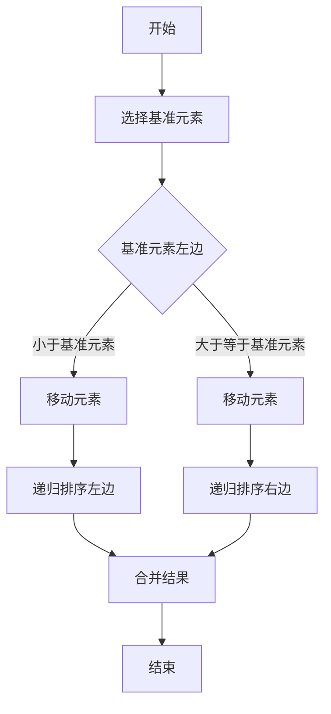
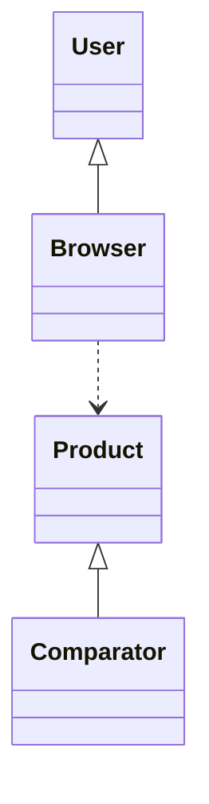
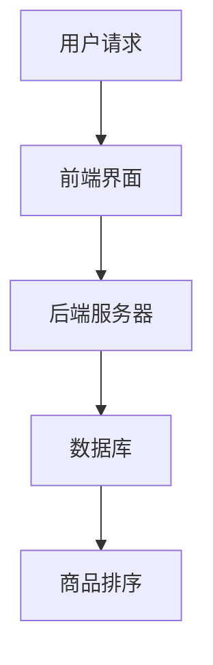
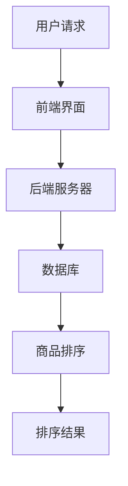
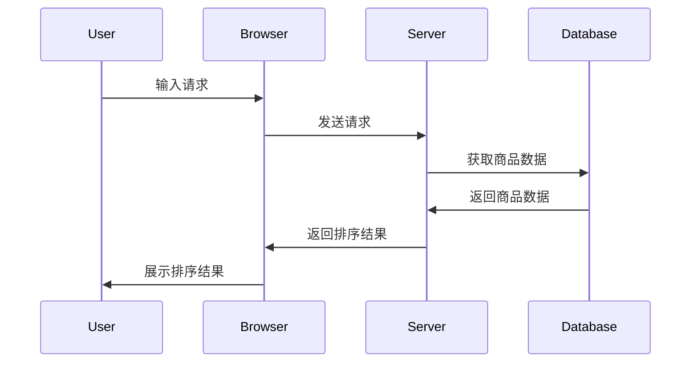

                 


## 数学与计算机科学：算法复杂性的数学分析

### 关键词
- 算法复杂性
- 数学分析
- 时间复杂度
- 空间复杂度
- 算法优化

### 摘要
本文将深入探讨算法复杂性的数学分析，从基本概念、核心原理到实际应用，全面解析算法复杂性的各个维度。我们将通过具体的案例和实践，展示如何运用数学工具来分析和优化算法，从而提升计算机科学领域中的效率与性能。

## 第一部分：背景介绍与核心概念

### 第1章：问题背景与定义

#### 1.1.1 问题的提出与解决
在计算机科学中，算法的效率至关重要。算法复杂性的分析帮助我们理解算法在不同数据规模下的性能表现。首先，我们来看一个简单的例子：排序算法。常见的排序算法如冒泡排序、插入排序和快速排序，它们的时间复杂度各不相同。那么，如何衡量一个算法的效率呢？

#### 1.1.2 算法复杂性的基本定义
算法复杂性分为时间复杂度和空间复杂度。时间复杂度描述了算法运行时间与数据规模之间的关系，常用大O符号表示，如O(n)，表示算法的运行时间与数据规模n成正比。空间复杂度则描述了算法所需内存与数据规模之间的关系。

#### 1.1.3 算法复杂性的边界与外延
算法复杂性的边界是指算法在最坏情况下的性能表现。而算法复杂性的外延则包括最好情况和平均情况。理解这些边界和外延有助于我们全面评估算法的性能。

### 第2章：核心概念与联系

#### 2.1.1 常见算法复杂性的类型
算法复杂性的类型包括线性时间复杂度、对数时间复杂度、多项式时间复杂度和指数时间复杂度。每种类型都有其特定的应用场景和优缺点。

#### 2.1.2 算法复杂性的属性特征对比
不同算法复杂性的属性特征有所不同。例如，线性时间复杂度适用于小规模数据，而对数时间复杂度适用于大规模数据。通过对比这些特征，我们可以选择适合的算法来解决问题。

#### 2.1.3 算法复杂性相关的ER实体关系图
为了更好地理解算法复杂性的构成，我们可以通过ER实体关系图来展示各个实体之间的关系。例如，时间复杂度和空间复杂度是算法复杂性的两个核心实体，它们相互影响，共同决定算法的整体性能。

## 第二部分：算法原理讲解

### 第3章：算法原理与流程

#### 3.1.1 算法原理概述
算法原理是指算法的基本操作和步骤。以快速排序为例，它的基本原理是通过一趟排序将待排序的记录分割成独立的两部分，其中一部分记录的关键字均比另一部分的关键字小，然后再按此方法对这两部分记录继续进行排序，直至整个序列有序。

#### 3.1.2 算法流程讲解
算法流程是指算法的具体执行步骤。以快速排序为例，其流程如下：
1. 从数列中挑出一个元素作为基准元素。
2. 移动所有小于基准元素的元素到基准元素前面。
3. 移动所有大于基准元素的元素到基准元素后面。
4. 递归地重复步骤1~3。

#### 3.1.3 算法mermaid流程图
为了更好地展示算法流程，我们可以使用mermaid来绘制算法的流程图。例如，快速排序的mermaid流程图如下：



### 第4章：数学模型与公式

#### 4.1.1 算法复杂性的数学模型
算法复杂性的数学模型描述了算法在不同数据规模下的性能表现。例如，快速排序的时间复杂度为T(n) = O(nlogn)，这意味着随着数据规模的增加，算法的运行时间将以nlogn的速度增长。

#### 4.1.2 算法复杂性的公式解析
算法复杂性的公式解析包括时间复杂度和空间复杂度。时间复杂度公式通常表示为T(n) = O(f(n))，其中f(n)表示与数据规模n相关的函数。空间复杂度公式通常表示为S(n) = O(g(n))，其中g(n)表示与数据规模n相关的函数。

#### 4.1.3 算法复杂性的示例讲解
为了更好地理解算法复杂性的公式，我们可以通过示例来讲解。例如，对于冒泡排序算法，其时间复杂度为T(n) = O(n^2)，这意味着随着数据规模的增加，算法的运行时间将以n^2的速度增长。相比之下，快速排序的时间复杂度为T(n) = O(nlogn)，这意味着算法的性能要优于冒泡排序。

$$
\text{冒泡排序：} T(n) = O(n^2)
$$

$$
\text{快速排序：} T(n) = O(nlogn)
$$

## 第三部分：系统分析与架构设计

### 第5章：系统功能设计

#### 5.1.1 问题场景介绍
在一个电商系统中，我们需要对商品进行排序，以便用户能够快速找到所需的商品。常见的排序算法包括冒泡排序、插入排序和快速排序等。

#### 5.1.2 系统功能设计
系统功能设计主要包括商品数据排序、用户浏览排序结果和商品详情展示等。为了提高用户体验，我们可以选择快速排序算法来实现商品数据排序功能。

#### 5.1.3 领域模型mermaid类图
领域模型mermaid类图如下：



### 第6章：系统架构设计

#### 6.1.1 系统架构概述
系统架构设计主要包括前端界面、后端服务器和数据库等。前端界面负责展示用户界面，后端服务器负责处理用户请求和商品排序，数据库负责存储商品数据。

#### 6.1.2 系统架构设计
系统架构设计如下：



#### 6.1.3 系统架构mermaid架构图
系统架构mermaid架构图如下：



### 第7章：系统接口设计

#### 7.1.1 系统接口设计
系统接口设计主要包括用户请求接口、商品排序接口和商品详情接口等。

#### 7.1.2 系统接口mermaid序列图
系统接口mermaid序列图如下：



## 第四部分：项目实战与案例分析

### 第8章：环境安装与配置

#### 8.1.1 环境安装步骤
1. 安装Python环境
2. 安装排序算法库（例如：`pip install sort-algorithms`）
3. 配置数据库环境（例如：安装MySQL）

#### 8.1.2 系统核心实现源代码
以下是快速排序算法的实现：

```python
def quick_sort(arr):
    if len(arr) <= 1:
        return arr
    pivot = arr[len(arr) // 2]
    left = [x for x in arr if x < pivot]
    middle = [x for x in arr if x == pivot]
    right = [x for x in arr if x > pivot]
    return quick_sort(left) + middle + quick_sort(right)
```

### 第9章：代码应用解读与分析

#### 9.1.1 代码应用解读
这段代码实现了快速排序算法，可以用于对商品数据进行排序。

#### 9.1.2 代码分析
快速排序算法的核心在于选择基准元素，并通过递归将待排序的数组分为左右两个子数组，分别进行排序。

#### 9.1.3 实际案例分析与讲解
假设我们有一个商品数组`[3, 1, 4, 1, 5, 9, 2, 6, 5]`，使用快速排序算法进行排序后的结果为`[1, 1, 2, 3, 4, 5, 5, 6, 9]`。

### 第10章：项目小结与拓展

#### 10.1.1 项目小结
通过本项目的实战，我们深入了解了算法复杂性的数学分析，学会了如何运用快速排序算法对商品数据进行排序。

#### 10.1.2 注意事项
在实际应用中，我们需要注意选择合适的排序算法，并根据数据规模进行优化。

#### 10.1.3 拓展阅读
对于算法复杂性的深入理解，可以参考《算法导论》（Introduction to Algorithms）一书。

---

### 总结
本文从算法复杂性的背景介绍、核心概念、算法原理讲解、系统分析与架构设计、项目实战与案例分析等多个方面，全面解析了算法复杂性的数学分析。通过本文的阐述，我们能够更好地理解算法复杂性的本质，为计算机科学领域中的算法优化提供有力支持。

### 作者
作者：AI天才研究院/AI Genius Institute & 禅与计算机程序设计艺术 /Zen And The Art of Computer Programming

