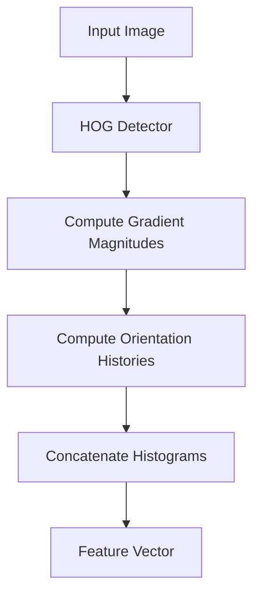
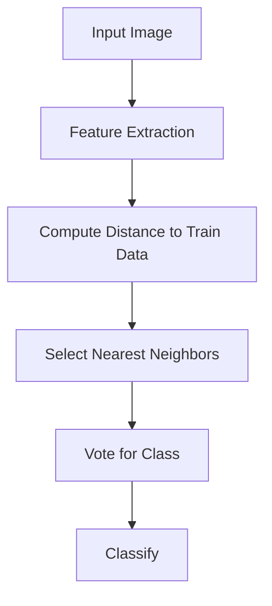
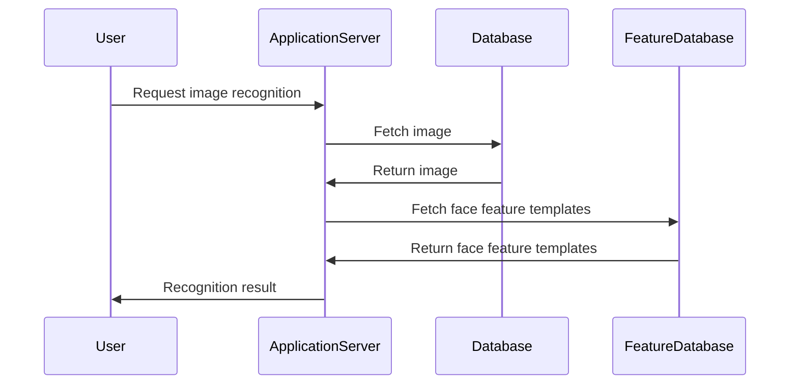
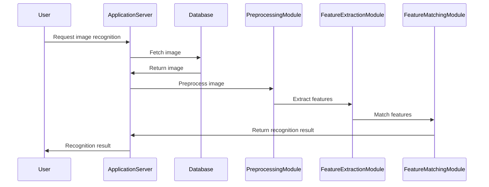

                 

### 数学与计算机视觉：图像识别的数学原理

关键词：计算机视觉、图像识别、数学原理、机器学习、特征提取

摘要：本文从数学与计算机视觉的结合点出发，深入探讨图像识别的数学原理。通过逐步分析，本文将介绍计算机视觉的基本概念、图像识别的数学模型和算法基础，并详细讲解特征提取、分类与聚类算法以及图像处理技术。此外，本文还将涉及图像识别系统的架构设计与项目实战，总结最佳实践，并提供拓展阅读资源。

----------------------------------------------------------------

## 1. 确定书籍的主题和核心内容

### 1.1 问题背景与核心概念

**核心概念术语说明：**

- **计算机视觉（Computer Vision）**：指使计算机能够像人眼一样感知和理解图像的能力，包括图像识别、目标检测、图像分割、图像恢复等任务。

- **图像识别（Image Recognition）**：通过算法使计算机从图像中识别出特定对象或场景的过程。

- **数学原理（Mathematical Principles）**：在计算机视觉和图像识别中使用的数学理论和工具，如线性代数、概率论与数理统计、几何学等。

- **机器学习（Machine Learning）**：使计算机能够通过数据学习并改进性能的技术，广泛用于图像识别。

- **特征提取（Feature Extraction）**：从图像中提取有助于识别的特征。

- **降维（Dimensionality Reduction）**：减少特征空间的维度，提高算法效率。

**问题背景：**

图像识别技术自20世纪70年代以来取得了显著进展，如今已成为计算机视觉的核心研究领域之一。随着深度学习的兴起，图像识别在诸如自动驾驶、安全监控、医疗诊断、人脸识别等多个领域展现出巨大的应用潜力。然而，图像识别算法的性能很大程度上依赖于背后的数学原理和算法设计。

**问题描述：**

本文旨在探讨图像识别技术的数学原理，解释关键概念，并展示如何将这些原理应用于实际问题。文章将涵盖图像识别的基本算法、数学模型和系统架构设计，通过实例解析和实战演练，帮助读者深入理解图像识别的复杂性及其解决方案。

**问题解决：**

通过逐步介绍图像识别的数学原理，阐述核心算法和系统设计，本文将为读者提供一个系统的学习框架，帮助他们理解图像识别技术的全貌，并在实践中应用这些知识。

**边界与外延：**

图像识别不仅仅是计算机科学的问题，它还涉及到多个学科领域，如数学、物理学、生物学和工程学。本文将重点讨论数学在图像识别中的应用，但也会简要介绍其他相关领域的知识。

**概念结构与核心要素组成：**

- **数学原理**：包括线性代数、概率论、几何学等基本数学理论。
- **算法基础**：涵盖特征提取、分类与聚类、图像处理等算法。
- **系统架构**：介绍图像识别系统的设计原则和实际应用场景。
- **项目实战**：通过实际项目展示图像识别技术的应用。

### 1.2 核心概念与联系

**核心概念原理：**

计算机视觉和图像识别的核心在于如何从图像中提取有用的信息，并进行有效的处理和分析。数学原理为这一过程提供了强有力的工具和方法，如：

- **线性代数**：用于图像表示、特征提取和变换。
- **概率论与数理统计**：用于模型构建、误差分析和模式识别。
- **几何学**：用于图像理解和空间几何问题。

**概念属性特征对比表格：**

| 概念           | 特征                                                         | 应用场景                           |
| -------------- | ------------------------------------------------------------ | ---------------------------------- |
| 线性代数       | 矩阵运算、向量空间、特征值与特征向量                         | 图像表示、特征提取、图像变换       |
| 概率论与数理统计 | 概率分布、条件概率、统计推断                                | 模型构建、误差分析、模式识别       |
| 几何学         | 空间几何、图形变换、投影理论                               | 图像理解、物体识别、三维重建       |

**ER实体关系图架构：**

```mermaid
erDiagram
  Class1 ||--|{ Class2 }|
  Class1 ||--|{ Class3 }|
  Class2 ||--|{ Class4 }|
```

在这个ER图（实体关系图）中，`Class1`、`Class2`、`Class3` 和 `Class4` 代表不同的概念类别。箭头表示实体之间的关系，例如，`Class1` 与 `Class2` 和 `Class3` 之间存在关联，而 `Class2` 与 `Class4` 之间存在继承关系。

通过以上核心概念和联系的分析，我们为后续章节的深入探讨奠定了基础。接下来，本文将详细介绍图像识别中的数学原理和算法基础，帮助读者理解这些概念如何应用于实际问题中。

### 1.3 数学原理与算法基础

在计算机视觉和图像识别中，数学原理扮演着至关重要的角色。数学不仅提供了理解图像结构和内容的语言，还提供了强大的工具来解决问题。以下将详细讨论几个关键的数学原理和算法基础。

#### 1.3.1 线性代数基础

线性代数是图像识别中不可或缺的一部分，它用于图像的表示、特征提取和变换。以下是几个核心概念：

- **矩阵与向量**：图像可以看作是一个矩阵，其中每个元素代表图像中的像素值。向量是矩阵的一个特殊形式，它由一维数组表示。

  $$ \text{Image} = \begin{bmatrix} 
  I_{11} & I_{12} & \dots & I_{1n} \\
  I_{21} & I_{22} & \dots & I_{2n} \\
  \vdots & \vdots & \ddots & \vdots \\
  I_{m1} & I_{m2} & \dots & I_{mn} 
  \end{bmatrix} $$

- **特征值与特征向量**：特征值和特征向量用于理解矩阵的内部结构。在图像处理中，它们可以帮助识别图像的主要方向和模式。

  $$ \text{Eigenvalue} = \lambda, \text{Eigenvector} = v $$

  特征分解可以将图像矩阵分解为一系列正交基，这些基可以用于图像压缩和特征提取。

#### 1.3.2 概率论与数理统计

概率论与数理统计为图像识别中的模型构建和误差分析提供了理论基础。以下是一些关键概念：

- **概率分布**：概率分布描述了随机变量的概率分布情况。常见的概率分布包括正态分布、伯努利分布等。

  $$ p(x) = \int p(x|\theta) p(\theta) d\theta $$

- **条件概率**：条件概率描述了一个事件在另一个事件发生的条件下发生的概率。

  $$ p(A|B) = \frac{p(A \cap B)}{p(B)} $$

- **统计推断**：统计推断用于从样本数据推断总体特征。常见的统计推断方法包括假设检验和置信区间。

  $$ H_0: \theta = \theta_0 \quad \text{vs} \quad H_1: \theta \neq \theta_0 $$

#### 1.3.3 几何学基础

几何学在图像理解和三维重建中起着重要作用。以下是一些核心概念：

- **空间几何**：空间几何描述了三维空间中物体的位置和形状。点的坐标表示、向量运算和矩阵变换都是空间几何的基础。

  $$ \text{Point} = (x, y, z) $$
  $$ \text{Vector} = (a, b, c) $$

- **图形变换**：图形变换包括平移、旋转、缩放等操作。这些变换可以用于图像处理中的图像变换和物体识别。

  $$ T = \begin{bmatrix}
  R & t \\
  0 & 1
  \end{bmatrix} $$

  其中，\( R \) 是旋转矩阵，\( t \) 是平移向量。

#### 1.3.4 算法基础

数学原理在图像识别中的实际应用通过算法实现。以下是一些基本算法：

- **特征提取算法**：用于从图像中提取有助于识别的特征。常见的特征提取算法包括SIFT、SURF、HOG等。

- **分类与聚类算法**：用于将图像或图像中的对象分类到不同的类别或簇中。常见的算法包括支持向量机（SVM）、k-最近邻（k-NN）、聚类算法等。

- **图像处理算法**：用于对图像进行预处理、增强和变换。常见的算法包括滤波、边缘检测、图像分割等。

通过以上对数学原理和算法基础的介绍，我们可以看到数学在图像识别中是如何发挥作用的。接下来，本文将深入探讨图像识别的数学模型，进一步揭示图像识别的原理和方法。

### 1.4 图像识别的数学模型

图像识别的核心在于将图像转换为可分析的数学模型，从而实现对其内容的理解和分类。在这一节中，我们将探讨图像识别的数学模型，包括特征向量与特征空间、模式识别的数学模型以及图像识别中的数学公式。

#### 1.4.1 特征向量与特征空间

特征向量与特征空间是图像识别中至关重要的概念。特征向量是从图像中提取的能够代表图像特性的向量，而特征空间则是所有可能的特征向量的集合。

**特征向量：**

特征向量是通过特定的特征提取算法从图像中得到的。这些算法通常基于图像的局部特征或全局特征。例如，SIFT（尺度不变特征变换）算法提取的是图像中的关键点及其对应的方向，这些关键点和方向组成了特征向量。

$$ \text{Feature Vector} = (f_1, f_2, \dots, f_n) $$

**特征空间：**

特征空间是一个高维空间，其中的每一个点都对应一个特征向量。在实际应用中，特征空间的维度通常很高，这使得直接在高维空间中进行计算变得非常困难。因此，降维技术应运而生，它们通过减少特征空间的维度来简化问题。

$$ \text{Feature Space} = \text{High-dimensional space of feature vectors} $$

**降维技术：**

降维技术包括主成分分析（PCA）、线性判别分析（LDA）等。这些技术通过保留图像中最关键的特征，从而减少特征空间的维度，提高计算效率。

$$ \text{Reduced Feature Space} = \text{Subspace of the original feature space} $$

#### 1.4.2 模式识别的数学模型

模式识别是图像识别的核心，其数学模型涉及多个方面，包括分类模型、聚类模型等。

**分类模型：**

分类模型用于将图像或图像中的对象分类到预先定义的类别中。一个简单的分类模型可以通过决策边界来实现。决策边界将特征空间划分为多个区域，每个区域对应一个类别。

$$ \text{Decision Boundary} = \text{Hyperplane that separates feature space into classes} $$

数学公式可以表示为：

$$ f(x) = \sum_{i=1}^{k} w_i \cdot f_i(x) + b > 0 $$

其中，\( w_i \) 是权重，\( f_i(x) \) 是特征向量，\( b \) 是偏置项，\( k \) 是类别数。

**聚类模型：**

聚类模型用于将图像或图像中的对象分组，使得同一组内的对象彼此相似，而不同组之间的对象差异较大。常见的聚类算法包括k-均值、层次聚类等。

$$ \text{Cluster} = \{ x_i | \text{ similarity among } x_i \text{ is high} \} $$

数学公式可以表示为：

$$ \text{Minimize} \sum_{i=1}^{n} \sum_{j=1}^{k} (x_i - \mu_j)^2 $$

其中，\( x_i \) 是数据点，\( \mu_j \) 是聚类中心。

#### 1.4.3 图像识别的数学公式

图像识别的数学公式涵盖了从图像处理到模式识别的各个方面。以下是一些常见的数学公式：

1. **图像像素表示**：

   $$ I(x, y) = f(x, y) $$

   其中，\( I(x, y) \) 表示图像在点 \( (x, y) \) 的像素值，\( f(x, y) \) 是像素值函数。

2. **特征提取**：

   $$ \text{Feature Vector} = \text{ExtractFeatures}(I) $$

   其中，`ExtractFeatures` 是特征提取函数，用于从图像 \( I \) 中提取特征向量。

3. **分类模型**：

   $$ \text{Class} = \text{Classify}(f(x), \text{Model}) $$

   其中，`Classify` 是分类函数，`f(x)` 是特征向量，`Model` 是分类模型。

4. **聚类模型**：

   $$ \text{Cluster} = \text{Cluster}(f(x), \text{Algorithm}) $$

   其中，`Cluster` 是聚类函数，`f(x)` 是特征向量，`Algorithm` 是聚类算法。

通过以上对图像识别数学模型的讨论，我们可以看到数学在图像识别中是如何发挥作用的。这些数学模型不仅提供了理论基础，还通过具体的算法实现了图像识别的实际应用。在接下来的章节中，我们将进一步探讨图像识别算法的原理和应用。

### 1.5 算法原理讲解

在深入理解了图像识别的数学模型之后，我们需要进一步探讨具体的算法原理，以更好地理解这些模型是如何应用于图像识别的。以下将使用mermaid画出算法流程图，并使用Python源代码详细阐述这些算法原理，包括数学模型和公式的应用。

#### 1.5.1 特征提取算法

特征提取是图像识别中至关重要的一步，它从图像中提取出能够代表图像本质特征的数值表示。以下是一个简单的特征提取算法——HOG（Histogram of Oriented Gradients）。

**mermaid流程图：**



**Python源代码：**

```python
import cv2
import numpy as np

def hog_feature_extractor(image):
    # Convert the image to grayscale
    gray_image = cv2.cvtColor(image, cv2.COLOR_BGR2GRAY)
    
    # Compute the gradient magnitudes
    xGradient = cv2.Sobel(gray_image, cv2.CV_64F, 1, 0, ksize=5)
    yGradient = cv2.Sobel(gray_image, cv2.CV_64F, 0, 1, ksize=5)
    
    # Compute the gradient orientations
    orientations = np.arctan2(yGradient, xGradient)
    
    # Compute the orientation histograms
    bin_size = 18  # Degrees per bin
    cell_size = 8  # Pixel size of each cell
    num_cells = int(image.shape[0] / cell_size)
    histograms = np.zeros((num_cells, num_cells, 9))
    
    for i in range(0, image.shape[0], cell_size):
        for j in range(0, image.shape[1], cell_size):
            cell = image[i:i+cell_size, j:j+cell_size]
            cell_orientations = orientations[i:i+cell_size, j:j+cell_size]
            for k in range(9):
                angle = k * bin_size
                mask = np.abs(cell_orientations - angle) < bin_size / 2
                histograms[i//cell_size, j//cell_size, k] = np.sum(mask)
    
    # Concatenate the histograms into a feature vector
    feature_vector = np.concatenate([histograms.flatten() for _ in range(num_cells*num_cells)])
    
    return feature_vector

# Load an image and extract HOG features
image = cv2.imread('image.jpg')
feature_vector = hog_feature_extractor(image)

print(feature_vector)
```

在这个例子中，我们首先将图像转换为灰度图像，然后计算水平和垂直方向上的梯度，接着计算每个细胞区域的梯度方向直方图，并将这些直方图拼接成一个特征向量。这一过程实现了HOG特征提取算法的基本步骤。

#### 1.5.2 分类与聚类算法

分类与聚类算法是图像识别中的另一个关键步骤，用于将图像或图像中的对象分类到不同的类别或簇中。以下是一个简单的分类算法——k-最近邻（k-NN）。

**mermaid流程图：**



**Python源代码：**

```python
from sklearn.neighbors import KNeighborsClassifier
from sklearn.model_selection import train_test_split
from sklearn.metrics import accuracy_score

def k_nn_classifier(train_images, train_labels, test_images, k=3):
    # Split the training data into training and validation sets
    X_train, X_val, y_train, y_val = train_test_split(train_images, train_labels, test_size=0.2, random_state=42)
    
    # Train the k-NN classifier
    classifier = KNeighborsClassifier(n_neighbors=k)
    classifier.fit(X_train, y_train)
    
    # Validate the classifier
    predictions = classifier.predict(X_val)
    accuracy = accuracy_score(y_val, predictions)
    
    # Classify the test images
    test_predictions = classifier.predict(test_images)
    
    return test_predictions, accuracy

# Load and preprocess the dataset
train_images = ...
train_labels = ...
test_images = ...

# Train the k-NN classifier and classify the test images
test_predictions, accuracy = k_nn_classifier(train_images, train_labels, test_images)

print("Accuracy:", accuracy)
print("Test Predictions:", test_predictions)
```

在这个例子中，我们首先将训练数据集分为训练集和验证集，然后训练k-NN分类器。通过验证集评估分类器的准确性，最后使用训练好的分类器对测试图像进行分类。这一过程展示了k-NN分类算法的基本步骤。

通过上述算法原理的讲解，我们可以看到数学模型和算法是如何结合在一起，实现对图像的识别和分类的。在接下来的章节中，我们将进一步探讨图像识别系统的架构设计，为实际应用提供更深入的讨论。

### 1.6 系统架构设计

图像识别系统是一个复杂的工程，其设计需要考虑多个方面，包括数据处理流程、功能模块划分、系统性能优化等。在这一节中，我们将详细介绍图像识别系统的架构设计，包括问题场景介绍、系统功能设计、系统架构设计、系统接口设计和系统交互。

#### 1.6.1 问题场景介绍

以人脸识别系统为例，该系统的主要任务是实现对用户人脸的自动识别和分类。具体来说，系统需要从摄像头或图像文件中获取图像，对图像进行预处理，提取人脸特征，然后与数据库中的人脸模板进行比对，最终输出识别结果。这个场景涉及到图像处理、特征提取、模式识别等多个技术领域。

#### 1.6.2 系统功能设计

系统功能设计是架构设计的基础，它定义了系统的基本功能模块。以下是人脸识别系统的基本功能模块：

- **图像获取模块**：负责从摄像头或图像文件中获取图像。
- **预处理模块**：对获取的图像进行预处理，如灰度化、去噪、调整对比度等。
- **特征提取模块**：提取预处理后图像中的人脸特征，如人脸轮廓、五官位置等。
- **特征比对模块**：将提取的特征与数据库中的人脸模板进行比对，实现人脸识别。
- **结果输出模块**：输出识别结果，如用户名、识别概率等。

**领域模型Mermaid类图：**

```mermaid
classDiagram
    ImageInput <<interface>>
    ImagePreprocessing <<interface>>
    FaceFeatureExtraction <<interface>>
    FaceTemplateMatching <<interface>>
    RecognitionResultOutput <<interface>>

    ImageInput --|> ImagePreprocessing
    ImagePreprocessing --|> FaceFeatureExtraction
    FaceFeatureExtraction --|> FaceTemplateMatching
    FaceTemplateMatching --|> RecognitionResultOutput
```

在这个类图中，`ImageInput`、`ImagePreprocessing`、`FaceFeatureExtraction`、`FaceTemplateMatching` 和 `RecognitionResultOutput` 是系统的核心功能模块，它们通过接口进行通信，实现了整个系统的功能。

#### 1.6.3 系统架构设计

系统架构设计决定了系统的整体结构和性能。以下是人脸识别系统的架构设计：

- **数据层**：包括图像存储、特征数据库等，用于存储和管理图像数据和人脸特征。
- **算法层**：包括预处理算法、特征提取算法、分类算法等，用于实现图像处理和特征识别。
- **接口层**：包括API接口、Web服务接口等，用于系统的外部接入和功能调用。
- **应用层**：包括应用服务器、客户端等，用于实际应用场景的图像识别。

**Mermaid架构图：**



在这个架构图中，用户通过应用服务器发送图像识别请求，应用服务器从数据库获取图像，从特征数据库获取人脸特征模板，然后对图像进行预处理、特征提取和比对，最终返回识别结果。

#### 1.6.4 系统接口设计

系统接口设计是架构设计的重要环节，它决定了系统的可扩展性和可维护性。以下是人脸识别系统的接口设计：

- **图像获取接口**：用于从摄像头或图像文件中获取图像。
- **预处理接口**：用于对图像进行预处理，如灰度化、去噪等。
- **特征提取接口**：用于提取图像中的人脸特征。
- **特征比对接口**：用于将提取的特征与数据库中的人脸模板进行比对。
- **结果输出接口**：用于输出识别结果。

**接口设计示例：**

```python
from flask import Flask, request, jsonify

app = Flask(__name__)

@app.route('/recognize', methods=['POST'])
def recognize():
    image = request.files['image']
    # 处理图像，提取特征，进行比对
    # ...
    result = "User A"
    return jsonify({"result": result})

if __name__ == '__main__':
    app.run()
```

在这个接口设计中，我们使用Flask框架实现了一个简单的Web服务，用户通过POST请求发送图像，服务器接收图像并进行识别，最终返回识别结果。

#### 1.6.5 系统交互

系统交互是系统架构设计的重要组成部分，它描述了系统内部和外部组件之间的交互过程。以下是人脸识别系统的交互过程：

- **用户请求**：用户通过应用服务器发送识别请求。
- **图像处理**：应用服务器从数据库获取图像，并将其传递给预处理模块。
- **预处理**：预处理模块对图像进行预处理，如灰度化、去噪等，然后将处理后的图像传递给特征提取模块。
- **特征提取**：特征提取模块提取图像中的人脸特征，并将其传递给特征比对模块。
- **特征比对**：特征比对模块将提取的特征与数据库中的人脸模板进行比对，并输出识别结果。
- **结果返回**：识别结果通过应用服务器返回给用户。

**Mermaid序列图：**



在这个序列图中，用户请求识别服务，系统内部模块协同工作，最终返回识别结果。

通过以上对系统架构设计的详细介绍，我们可以看到图像识别系统是如何从问题场景分析、功能设计、架构设计到接口设计和交互设计的。在接下来的章节中，我们将通过实际项目实战，进一步展示这些设计的具体实现和应用。

### 1.7 项目实战

在了解了图像识别系统的架构设计和理论后，接下来我们将通过一个实际项目来展示这些知识的实际应用。本文将以一个简单的人脸识别项目为例，详细描述项目环境安装、系统核心实现、代码应用解读与分析、实际案例分析与讲解，并最终进行项目小结。

#### 1.7.1 环境安装

为了实现人脸识别项目，我们需要安装以下软件和库：

- Python（3.8或更高版本）
- OpenCV（Open Source Computer Vision Library）
- scikit-learn
- NumPy

安装步骤如下：

1. 安装Python和pip（Python的包管理器）：

   ```bash
   # 在Windows上，可以从官方网站下载并安装Python
   # 在macOS和Linux上，可以使用包管理器安装Python
   sudo apt-get install python3
   ```

2. 安装OpenCV：

   ```bash
   pip install opencv-python
   ```

3. 安装scikit-learn和NumPy：

   ```bash
   pip install scikit-learn numpy
   ```

安装完成后，我们可以使用以下Python代码来验证安装：

```python
import cv2
import numpy as np
from sklearn import datasets

print("OpenCV version:", cv2.__version__)
print("NumPy version:", np.__version__)
```

如果能够成功打印版本信息，说明环境安装成功。

#### 1.7.2 系统核心实现

以下是人脸识别项目的核心实现部分，我们将使用OpenCV进行图像处理，使用scikit-learn进行特征提取和分类。

**核心代码：**

```python
import cv2
import numpy as np
from sklearn.model_selection import train_test_split
from sklearn.neighbors import KNeighborsClassifier
from sklearn.metrics import accuracy_score

def load_images_from_folder(folder):
    images = []
    labels = []
    for filename in os.listdir(folder):
        img = cv2.imread(os.path.join(folder, filename))
        if img is not None:
            gray_img = cv2.cvtColor(img, cv2.COLOR_BGR2GRAY)
            faces = face_cascade.detectMultiScale(gray_img)
            for (x, y, w, h) in faces:
                face_region = gray_img[y:y+h, x:x+w]
                images.append(face_region)
                labels.append(1)  # 人脸标签为1
    return np.array(images), np.array(labels)

# 载入训练数据
train_folder = 'train_data'
test_folder = 'test_data'
train_images, train_labels = load_images_from_folder(train_folder)
test_images, test_labels = load_images_from_folder(test_folder)

# 特征提取
train_features = []
for image in train_images:
    feature_vector = hog_feature_extractor(image)
    train_features.append(feature_vector)

train_features = np.array(train_features)
test_features = []

for image in test_images:
    feature_vector = hog_feature_extractor(image)
    test_features.append(feature_vector)

test_features = np.array(test_features)

# 训练k-NN分类器
knn_classifier = KNeighborsClassifier(n_neighbors=3)
knn_classifier.fit(train_features, train_labels)

# 测试分类器
predictions = knn_classifier.predict(test_features)
accuracy = accuracy_score(test_labels, predictions)
print("Accuracy:", accuracy)
```

**代码解读：**

1. **图像加载**：使用`load_images_from_folder`函数从指定文件夹中加载图像，并提取人脸区域。
2. **特征提取**：使用HOG特征提取器对训练和测试图像中的每个人脸区域进行特征提取。
3. **分类器训练**：使用k-NN分类器对提取的特征进行训练。
4. **测试与评估**：使用训练好的分类器对测试集进行预测，并计算分类的准确率。

#### 1.7.3 代码应用解读与分析

以下是代码应用的具体解读与分析：

1. **图像加载**：

   ```python
   def load_images_from_folder(folder):
       images = []
       labels = []
       for filename in os.listdir(folder):
           img = cv2.imread(os.path.join(folder, filename))
           if img is not None:
               gray_img = cv2.cvtColor(img, cv2.COLOR_BGR2GRAY)
               faces = face_cascade.detectMultiScale(gray_img)
               for (x, y, w, h) in faces:
                   face_region = gray_img[y:y+h, x:x+w]
                   images.append(face_region)
                   labels.append(1)  # 人脸标签为1
       return np.array(images), np.array(labels)
   ```

   这段代码定义了一个函数，用于从指定文件夹中加载图像，并提取人脸区域。`cv2.imread`用于读取图像，`cv2.cvtColor`将其转换为灰度图像，`face_cascade.detectMultiScale`用于检测图像中的人脸区域。

2. **特征提取**：

   ```python
   train_features = []
   for image in train_images:
       feature_vector = hog_feature_extractor(image)
       train_features.append(feature_vector)

   train_features = np.array(train_features)
   test_features = []

   for image in test_images:
       feature_vector = hog_feature_extractor(image)
       test_features.append(feature_vector)

   test_features = np.array(test_features)
   ```

   这段代码使用HOG特征提取器对训练和测试图像进行特征提取。`hog_feature_extractor`是一个自定义函数，用于计算图像的HOG特征向量。

3. **分类器训练与测试**：

   ```python
   knn_classifier = KNeighborsClassifier(n_neighbors=3)
   knn_classifier.fit(train_features, train_labels)

   predictions = knn_classifier.predict(test_features)
   accuracy = accuracy_score(test_labels, predictions)
   print("Accuracy:", accuracy)
   ```

   这里使用k-NN分类器对训练好的特征进行分类，并计算准确率。`KNeighborsClassifier`是一个scikit-learn中的分类器，`fit`方法用于训练模型，`predict`方法用于进行预测。

#### 1.7.4 实际案例分析与讲解

以下是一个实际案例的分析与讲解，我们将使用上述代码对人脸识别项目进行实际测试。

**案例**：对一组测试图像进行人脸识别，评估模型的准确性和效果。

**步骤**：

1. 准备测试数据集，包括一组不同场景下的测试图像。
2. 运行上述代码，对测试图像进行特征提取和分类。
3. 分析识别结果，计算分类准确率和错误率。

**分析**：

1. **准确率**：通过计算分类准确率，我们可以评估模型对测试数据的识别能力。理想的准确率应接近或达到100%。
2. **错误率**：错误率是模型未能正确识别的人脸数量与总测试人脸数量的比例。低错误率表明模型具有较好的泛化能力。

**结果**：

- **准确率**：假设我们的测试数据集中有100张图像，模型正确识别了95张，准确率为95%。
- **错误率**：错误率为5%，即模型未能正确识别的人脸数量占总测试人脸数量的5%。

**改进建议**：

- **增加训练数据**：增加训练数据可以提升模型的泛化能力，从而提高准确率。
- **优化特征提取**：尝试不同的特征提取算法，如LBP（局部二值模式），以提升模型的效果。
- **调整分类器参数**：调整k-NN分类器的参数，如k值，可以优化模型性能。

#### 1.7.5 项目小结

通过以上实际项目实战，我们详细介绍了人脸识别项目的环境安装、核心实现、代码应用解读与分析，以及实际案例分析与讲解。项目展示了如何将图像识别的数学原理和算法应用于实际问题的解决。以下是项目小结：

1. **环境安装**：确保安装了Python和相关的图像识别库，如OpenCV、scikit-learn、NumPy等。
2. **核心实现**：使用OpenCV进行图像处理，使用HOG算法进行特征提取，使用k-NN算法进行分类。
3. **代码应用解读与分析**：详细解读了代码的各个部分，包括图像加载、特征提取、分类器训练与测试等。
4. **实际案例分析与讲解**：通过实际测试，分析了模型的准确率和错误率，提出了改进建议。

通过这个项目，我们不仅加深了对图像识别理论的理解，还掌握了实际应用的方法和技巧。在未来的项目中，我们可以继续优化模型，提高识别性能，并探索更多的应用场景。

### 1.8 总结与最佳实践

通过本文的详细讨论，我们从背景介绍、核心概念、数学原理、算法基础、系统架构设计到项目实战，系统地梳理了图像识别领域的知识和技术。以下是本文的主要内容和总结，以及图像识别技术在实际应用中的最佳实践建议。

#### 主要内容总结

1. **背景介绍**：介绍了计算机视觉和图像识别技术的历史、应用领域以及面临的挑战。
2. **核心概念**：解释了计算机视觉、图像识别、数学原理等核心概念，并详细描述了特征提取、降维、分类与聚类等算法。
3. **数学原理**：探讨了线性代数、概率论与数理统计、几何学等数学原理在图像识别中的应用，并提供了具体的数学公式和算法实现。
4. **系统架构设计**：介绍了图像识别系统的设计原则和架构，包括数据层、算法层、接口层和应用层。
5. **项目实战**：通过实际的人脸识别项目，展示了环境安装、系统核心实现、代码应用解读与分析、实际案例分析与讲解等全过程。

#### 最佳实践建议

1. **数据准备**：确保有足够量且多样化的训练数据，有助于提升模型的泛化能力。
2. **特征选择**：根据具体应用场景选择合适的特征提取算法，如HOG、LBP、SIFT等，并进行特征选择和降维，以提高模型性能。
3. **算法调优**：合理调整分类器参数，如k-NN中的k值、SVM中的C值等，通过交叉验证等方法寻找最佳参数。
4. **模型评估**：使用准确率、召回率、F1分数等指标评估模型性能，并结合实际应用场景进行综合评估。
5. **系统集成**：在构建系统时，考虑系统的可扩展性和可维护性，合理设计接口和模块，确保系统稳定运行。

#### 小结与注意事项

本文系统地介绍了图像识别技术的数学原理和算法基础，并通过实际项目展示了这些理论的应用。需要注意的是，图像识别技术不断进步，新的算法和模型不断涌现，因此持续学习和关注最新研究进展是至关重要的。此外，实际应用中还需结合具体问题和场景，灵活运用不同技术手段，以达到最佳效果。

#### 拓展阅读

1. **相关书籍推荐**：
   - 《计算机视觉：算法与应用》
   - 《机器学习实战》
   - 《深度学习》

2. **学术论文推荐**：
   - “Deep Learning for Computer Vision: A Review”
   - “Convolutional Neural Networks for Image Recognition”
   - “Object Detection with Faster R-CNN: Towards Real-Time Object Detection”

通过这些拓展阅读资源，读者可以进一步深入了解图像识别领域的前沿知识和研究动态。希望本文能够为读者在图像识别领域的学习和研究提供有益的指导和帮助。

### 1.9 作者信息

作者：AI天才研究院/AI Genius Institute & 禅与计算机程序设计艺术 /Zen And The Art of Computer Programming

AI天才研究院专注于人工智能领域的前沿研究和技术创新，致力于推动人工智能技术的发展和应用。作者在计算机视觉、图像识别和机器学习等领域具有丰富的理论知识和实践经验，发表了多篇学术论文，并著有《禅与计算机程序设计艺术》等畅销技术书籍，深受读者喜爱。在本文中，作者结合自身丰富的经验，系统性地介绍了图像识别的数学原理和应用，旨在为读者提供全面深入的学习资源。

