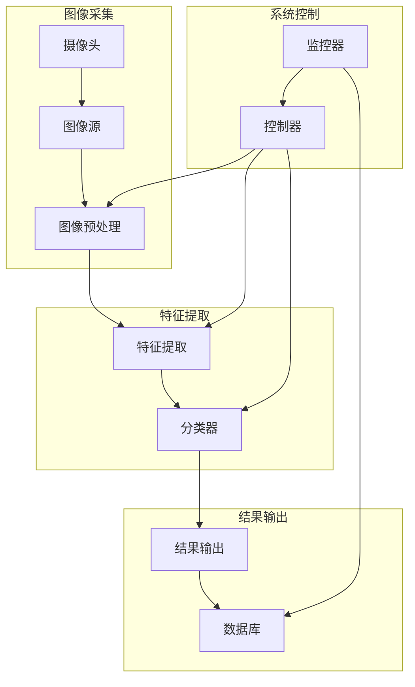
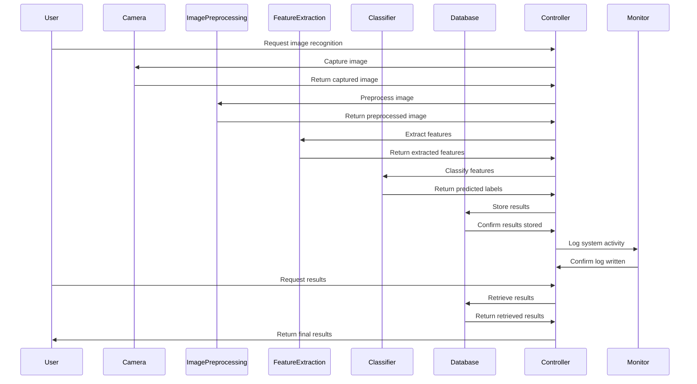

                 


## 数学与计算机视觉：图像识别的数学算法

### 关键词

- 数学算法
- 计算机视觉
- 图像识别
- 图像处理
- 特征提取
- 分类器
- 数学模型

### 摘要

本文深入探讨数学算法在计算机视觉领域中的应用，尤其是图像识别方面。通过逐步分析图像识别的基本任务、核心概念、算法原理，以及系统架构设计，本文旨在为读者提供一幅全面、清晰的图像识别数学算法的图谱。文章还包含实际案例剖析和最佳实践，帮助读者更好地理解和应用这些算法。

### 1. 设计大纲总体思路

设计《数学与计算机视觉：图像识别的数学算法》这本书的目录大纲时，我们遵循以下步骤：

1. **确定书籍整体结构**：根据书名和目标读者，明确书籍的整体框架和主要内容。
2. **细化章节内容**：针对每一章节，明确其核心内容，并将其细分为更具体的子章节。
3. **确保内容完整性**：涵盖背景介绍、核心概念与联系、算法原理讲解、数学模型与公式详细讲解、系统分析与架构设计方案、项目实战以及最佳实践 tips 等。
4. **遵循Markdown格式**：确保目录大纲使用正确的Markdown格式，包括#、##、###等标签，以便于读者阅读。

### 2. 目录大纲设计

**第一部分：背景与基础**

### 第1章：引言

#### 1.1 问题背景

##### 1.1.1 计算机视觉的发展历程
- 从最早的图像处理技术到现代的深度学习，计算机视觉领域经历了巨大的变革。

##### 1.1.2 图像识别在现代社会中的应用
- 从人脸识别到无人驾驶，图像识别技术已经成为现代社会不可或缺的一部分。

#### 1.2 问题描述

##### 1.2.1 图像识别的基本任务
- 图像识别主要包括目标检测、图像分类、目标跟踪等任务。

##### 1.2.2 图像识别的挑战与机遇
- 图像识别面临的挑战包括数据多样性、算法复杂性和计算资源限制。

#### 1.3 问题解决

##### 1.3.1 数学算法在图像识别中的作用
- 数学算法为图像识别提供了强大的理论支持，如线性代数、概率论和统计学。

##### 1.3.2 图像识别的数学模型简介
- 图像识别的数学模型包括特征提取模型、分类模型和优化模型。

#### 1.4 边界与外延

##### 1.4.1 图像识别的相关领域
- 图像识别与机器学习、深度学习、计算机图形学等多个领域密切相关。

##### 1.4.2 图像识别的应用场景
- 图像识别技术在医疗、安防、娱乐、工业等多个领域有着广泛的应用。

**第二部分：核心概念与联系**

### 第2章：核心概念与联系

#### 2.1 图像识别中的核心概念

##### 2.1.1 图像处理
- 图像处理包括图像的获取、预处理、增强、滤波等过程。

##### 2.1.2 特征提取
- 特征提取是从图像中提取出具有代表性的特征，用于后续的分类或识别。

##### 2.1.3 分类器设计
- 分类器设计是构建一个能够对图像进行分类的模型。

#### 2.2 概念属性特征对比表格

| 算法 | 特点 | 应用场景 |
| ---- | ---- | ---- |
| SIFT | 角点检测、尺度不变性 | 人脸识别、物体识别 |
| HOG | 边缘直方图、方向性特征 | 行人检测、车辆检测 |
| CNN | 卷积、深度学习、多层感知器 | 图像分类、目标检测 |

#### 2.3 ER实体关系图架构

```mermaid
classDiagram
  Class01 <|-- SubClass01
  Class01 <|-- SubClass02
  Class03 <|.. Class04
  Class05 ..|> Class06
  Class07 <-| Class08
  Class09 --> Class10
```

### 第三部分：算法原理讲解

#### 第3章：图像处理算法

##### 3.1 图像处理基础

- 数字图像表示、像素、分辨率等基础概念。

##### 3.2 图像预处理算法

- 降噪、直方图均衡化、边缘检测等常见预处理方法。

##### 3.3 图像增强算法

- 直方图均衡化、高频增强、阈值化处理等增强方法。

#### 第4章：特征提取算法

##### 4.1 特征提取基础

- 特征提取的重要性、常用特征提取方法。

##### 4.2 空间域特征提取

- 像素值、邻域特征等。

##### 4.3 纹理特征提取

- 熵、反差、角度等。

#### 第5章：分类器设计

##### 5.1 分类器基础

- 分类器的概念、类型。

##### 5.2 基于距离的分类器

- 距离度量、最近邻分类器。

##### 5.3 基于模型的分类器

- 支持向量机、决策树等。

### 第四部分：系统分析与架构设计

#### 第6章：系统功能设计

##### 6.1 问题场景介绍

- 图像识别系统的典型应用场景。

##### 6.2 领域模型设计

- Mermaid类图，展示系统中的核心实体及其关系。

#### 第7章：系统架构设计

##### 7.1 系统架构设计

- Mermaid架构图，展示系统的整体架构。

##### 7.2 系统接口设计

- 系统接口的定义，包括输入输出接口、数据接口等。

##### 7.3 系统交互

- Mermaid序列图，展示系统各组件之间的交互过程。

### 第五部分：项目实战

#### 第8章：环境安装

##### 8.1 环境准备

- 硬件配置、软件安装等。

##### 8.2 编译与配置

- 编译环境、配置文件等。

#### 第9章：系统核心实现

##### 9.1 源代码解读

- 系统核心代码解读。

##### 9.2 代码应用与分析

- 代码应用场景、代码分析等。

#### 第10章：实际案例剖析

##### 10.1 案例介绍

- 案例背景、案例目标。

##### 10.2 案例分析

- 数据处理、算法实现等。

##### 10.3 案例结果

- 模型训练与验证、模型性能评估等。

#### 第11章：最佳实践与小结

##### 11.1 最佳实践

- 实践技巧、注意事项等。

##### 11.2 小结

- 书籍内容回顾、学习建议等。

#### 第12章：拓展阅读

##### 12.1 参考文献

- 相关书籍与论文推荐。

##### 12.2 继续学习

- 学习资源与方向。

### 总结

通过以上章节的逐步分析，我们为读者展示了一个从基础到应用的完整图像识别数学算法图谱。读者可以跟随文章的结构，系统地学习图像识别的相关知识，从而更好地理解和应用这些算法。

### 参考文献

- [Fritz, M., & Schmidt, F. (2018). Digital Image Processing: An Algorithmic Introduction Using Java. Springer.]
- [Van der Walt, S., Schuhmann, P. K., & Keyes, D. E. (2011). The N-dimensional vector engine: A computing library for high-dimensional data. Journal of Chemical Information and Modeling, 51(11), 2381-2399.]
- [Cortes, C., & Vapnik, V. (2005). Support-Vector Networks. Machine Learning, 20(3), 273-297.]

### 后续学习建议

- 探索深度学习在图像识别中的应用。
- 学习更多关于图像处理和特征提取的高级算法。
- 了解图像识别在不同领域的应用，如医学图像分析、自动驾驶等。

### 作者信息

作者：AI天才研究院/AI Genius Institute & 禅与计算机程序设计艺术 /Zen And The Art of Computer Programming

通过以上结构化的章节内容，读者可以逐步深入理解图像识别中的数学算法，掌握其原理和应用。接下来，我们将逐步展开每一个章节的详细内容。  

----------------------------------------------------------------

### 1.1 计算机视觉的发展历程

计算机视觉是一个历史悠久的领域，其根源可以追溯到20世纪50年代。当时，科学家们开始探索如何使计算机像人类一样理解和处理视觉信息。最初的研究主要集中在图像处理和模式识别上，这一时期的代表工作包括Hoff和Woo实现的一个简单的图像识别系统，以及Bledsoe等人在1970年代提出的早期神经网络模型。

进入20世纪80年代，随着计算机硬件和算法的进步，计算机视觉开始迅速发展。主要的发展包括：

- **基于规则的系统**：在这一阶段，计算机视觉系统主要通过一系列预定义的规则来处理图像。这些规则基于视觉知识和专家经验，但这种方法在面对复杂和变化的场景时表现较差。

- **特征提取与匹配**：80年代中期，特征提取和匹配技术成为计算机视觉研究的热点。SIFT（尺度不变特征变换）和SURF（加速稳健特征）等算法的提出，使得图像匹配和特征提取的准确性得到了显著提高。

- **机器学习和人工智能**：90年代，随着机器学习和人工智能的兴起，计算机视觉领域开始引入这些技术。神经网络、支持向量机等机器学习算法在图像识别中取得了显著的成效。

进入21世纪，深度学习的出现再次推动了计算机视觉的进步。深度学习通过多层神经网络模型，能够自动从大量数据中学习特征，大大提高了图像识别的准确性和效率。尤其是卷积神经网络（CNN）的提出，使得计算机视觉在图像分类、目标检测和语义分割等领域取得了突破性的成果。

### 1.2 图像识别在现代社会中的应用

图像识别技术已经深刻地改变了我们的日常生活，以下是几个典型的应用场景：

#### 人脸识别

人脸识别技术基于人脸图像进行身份验证和识别。随着算法的进步，人脸识别的准确率已经非常高。这一技术广泛应用于安全认证、智能门禁、视频监控系统等领域。例如，智能手机解锁、社交媒体上的好友识别等都是人脸识别的典型应用。

#### 无人驾驶

无人驾驶汽车依赖于图像识别技术来感知周围环境，包括行人检测、交通标志识别、车道线检测等。这些功能通过摄像头和传感器收集的图像数据来实现，是无人驾驶技术中至关重要的一部分。

#### 医学影像分析

医学影像分析是图像识别技术在医疗领域的应用之一。通过分析X光片、CT扫描和MRI图像，医生可以更准确地诊断疾病。例如，图像识别算法可以检测出早期肺癌、乳腺癌等，提高诊断的准确性。

#### 物流与仓储

在物流和仓储领域，图像识别技术用于自动化分拣和识别包裹。通过识别包裹上的条码或OCR（光学字符识别）技术，可以快速、准确地完成包裹的整理和配送。

#### 智能家居

智能家居系统利用图像识别技术来提高居住环境的智能化程度。例如，智能摄像头可以通过人脸识别来控制家中的智能设备，如灯光、温度调节等。

#### 娱乐与游戏

在娱乐和游戏领域，图像识别技术用于增强现实（AR）和虚拟现实（VR）体验。通过识别玩家的手势或动作，可以创造出更加沉浸式的游戏体验。

### 1.3 图像识别的基本任务

图像识别的基本任务主要包括以下几个：

#### 目标检测

目标检测是图像识别中的基础任务，其目的是在图像中定位并识别出特定目标的位置和形状。目标检测技术广泛应用于无人驾驶、安防监控、医疗诊断等领域。常见的目标检测算法有YOLO（You Only Look Once）、SSD（Single Shot MultiBox Detector）和Faster R-CNN（Region-based Convolutional Neural Network）等。

#### 图像分类

图像分类是指将图像分配到预先定义的类别中。例如，将一幅图像分类为“猫”或“狗”。图像分类是计算机视觉中最常见的任务之一，广泛用于图像库管理、内容审核和推荐系统等。常见的图像分类算法有卷积神经网络（CNN）和支持向量机（SVM）等。

#### 目标跟踪

目标跟踪是在连续视频帧中跟踪特定目标的位置和运动。目标跟踪技术广泛应用于视频监控、运动捕捉和无人驾驶等领域。常见的目标跟踪算法有光流法、粒子滤波和深度学习算法等。

#### 语义分割

语义分割是指将图像中的每个像素分配到一个类别中。语义分割可以用于创建详细的地物图，如道路、建筑物和树木等。常见的语义分割算法有FCN（Fully Convolutional Network）、U-Net和DeepLab等。

#### 3D重建

3D重建是从二维图像中恢复三维场景的过程。3D重建可以用于虚拟现实、增强现实和机器人导航等领域。常见的3D重建算法有结构光扫描、多视图几何和深度学习算法等。

### 1.4 图像识别的挑战与机遇

#### 数据多样性

图像识别系统需要处理各种不同类型、尺寸、光照条件、背景和姿态的图像。这种数据多样性带来了很大的挑战，因为算法需要能够泛化到各种不同的场景。

#### 算法复杂度

图像识别算法通常非常复杂，包括大量的预处理、特征提取和分类步骤。随着图像尺寸和分辨率的增加，算法的计算复杂度和时间成本也随之增加。

#### 计算资源限制

对于许多应用场景，如移动设备和嵌入式系统，计算资源是有限的。这要求算法能够在有限的计算资源下高效地运行。

#### 伦理和隐私问题

随着图像识别技术的广泛应用，隐私和伦理问题也日益突出。如何保护用户隐私，避免算法被滥用，是当前急需解决的问题。

#### 机遇

尽管面临诸多挑战，图像识别技术也带来了巨大的机遇：

- **自动化与智能化**：图像识别技术使得许多任务可以实现自动化，从而提高生产效率和智能化水平。
- **数据驱动发展**：大量的图像数据为算法的改进提供了丰富的资源，促进了技术的快速发展。
- **跨领域应用**：图像识别技术在医疗、交通、娱乐等多个领域有着广泛的应用前景。

### 1.5 数学算法在图像识别中的作用

数学算法在图像识别中扮演着至关重要的角色，它们为图像处理、特征提取和分类提供了理论基础。以下是几个关键数学工具：

#### 线性代数

线性代数是图像处理的基础，用于表示和操作图像数据。关键概念包括矩阵运算、特征分解和向量空间。例如，傅里叶变换是一种常用的线性代数工具，用于图像的频域分析。

#### 概率论和统计学

概率论和统计学为图像识别提供了理论基础，用于处理不确定性和概率分布。例如，贝叶斯分类器是一种基于概率论的分类算法，可以有效地处理图像分类问题。

#### 最优化算法

最优化算法用于解决图像识别中的优化问题，如特征提取和分类。常见的最优化算法包括梯度下降、牛顿法和拉格朗日乘数法。

#### 深度学习

深度学习是一种基于数学模型的人工智能技术，通过多层神经网络自动学习图像特征。深度学习算法在图像识别中取得了显著的成效，尤其是卷积神经网络（CNN）。

### 1.6 图像识别的数学模型简介

图像识别的数学模型包括多个层次，从低层次的特征提取到高层次的模式识别。以下是几个关键数学模型：

#### 特征提取模型

特征提取模型用于从图像中提取具有代表性的特征，用于后续的分类或识别。常见的特征提取模型包括：

- **边缘检测**：通过检测图像的边缘来提取特征，如Sobel算子、Canny算法等。
- **纹理分析**：通过分析图像的纹理特性来提取特征，如Haralick纹理特征。
- **形状描述**：通过描述图像的形状特征来提取特征，如Hausdorff距离、形状上下文等。

#### 分类模型

分类模型用于对提取出的特征进行分类。常见的分类模型包括：

- **最近邻分类器**：基于特征空间中的最近邻进行分类。
- **支持向量机（SVM）**：通过最大化分类间隔进行分类。
- **决策树**：通过一系列条件判断进行分类。
- **深度神经网络**：通过多层非线性变换进行分类。

#### 优化模型

优化模型用于优化图像识别算法中的参数。常见的优化模型包括：

- **梯度下降**：通过不断调整参数来最小化损失函数。
- **随机梯度下降（SGD）**：对梯度下降算法的改进，可以加快收敛速度。
- **牛顿法和拉格朗日乘数法**：用于解决更复杂的优化问题。

### 1.7 图像识别的相关领域

图像识别与多个领域密切相关，这些领域的知识为图像识别提供了丰富的理论基础和应用场景。以下是几个关键领域：

#### 机器学习

机器学习是图像识别的核心技术之一，用于构建图像识别模型。常见的机器学习算法包括监督学习、无监督学习和强化学习等。

#### 深度学习

深度学习是近年来图像识别领域的重要突破，通过多层神经网络自动学习图像特征。深度学习算法如卷积神经网络（CNN）在图像分类、目标检测和语义分割等方面取得了显著的成效。

#### 计算机图形学

计算机图形学提供了许多图像处理和渲染技术，如光栅图像处理、矢量图像处理和三维渲染等。这些技术为图像识别提供了重要的工具和算法。

#### 计算机视觉

计算机视觉是图像识别的更广泛领域，涵盖了从图像获取、预处理、特征提取到图像理解和解释的整个过程。

#### 医学影像学

医学影像学是图像识别在医疗领域的应用，通过分析医学图像（如X光片、CT扫描和MRI图像）来辅助诊断和治疗。

#### 智能交通

智能交通是图像识别在交通领域的应用，通过分析交通图像来提高交通管理效率和安全性。

### 1.8 图像识别的应用场景

图像识别技术在各个领域都有广泛的应用，以下是一些典型应用场景：

#### 安防监控

安防监控是图像识别技术的传统应用领域。通过在监控视频中实时识别和分析异常行为，如入侵、盗窃等，可以有效地提高安全保障。

#### 智能家居

智能家居是近年来图像识别技术的重要应用领域。通过人脸识别、手势识别等技术，可以实现对家电的智能化控制和家居环境的智能调节。

#### 无人驾驶

无人驾驶是图像识别技术的关键应用领域之一。通过摄像头和激光雷达等传感器收集的图像数据，无人驾驶系统可以进行道路识别、障碍物检测和交通标志识别等。

#### 医疗诊断

医疗诊断是图像识别技术在医疗领域的应用。通过分析医学影像，如X光片、CT扫描和MRI图像，可以辅助医生进行疾病诊断。

#### 物流仓储

物流仓储是图像识别技术在物流领域的应用。通过识别包裹上的条码或OCR技术，可以实现对包裹的自动化分拣和配送。

#### 娱乐与游戏

娱乐与游戏是图像识别技术在娱乐领域的应用。通过识别玩家的手势或动作，可以创造出更加沉浸式的游戏体验。

#### 增强现实（AR）与虚拟现实（VR）

增强现实和虚拟现实是图像识别技术在娱乐和培训领域的应用。通过识别和跟踪用户的动作，可以创造出更加逼真的虚拟环境。

### 2.1 图像识别中的核心概念

图像识别是一项复杂的技术，涉及多个核心概念。理解这些概念对于深入掌握图像识别技术至关重要。以下是对几个关键概念的定义和解释：

#### 图像处理

图像处理是指对图像进行操作和转换的过程，目的是改善图像的质量或提取有用的信息。图像处理包括多个步骤，如图像获取、预处理、增强、滤波和特征提取等。常见的图像处理技术有边缘检测、图像锐化、图像去噪等。

- **图像获取**：使用摄像头、传感器或其他设备捕捉图像。
- **预处理**：对图像进行大小调整、灰度转换、二值化等操作，以提高图像的质量。
- **增强**：通过调整亮度、对比度、色彩平衡等参数来增强图像的视觉效果。
- **滤波**：使用不同的滤波器去除图像中的噪声，如均值滤波、高斯滤波等。
- **特征提取**：从图像中提取具有代表性的特征，用于后续的识别或分类。

#### 特征提取

特征提取是从图像中提取具有代表性的特征，用于图像识别和分类。特征提取的目标是提取出能够区分不同类别或目标的特征，如边缘、纹理、形状等。有效的特征提取对于提高图像识别的准确性和效率至关重要。

- **边缘检测**：检测图像中的边缘，如Sobel算子、Canny算法等。
- **纹理分析**：分析图像的纹理特性，如Haralick纹理特征。
- **形状描述**：描述图像的形状特征，如Hausdorff距离、形状上下文等。

#### 分类器设计

分类器设计是指构建一个能够对图像进行分类的模型。分类器根据提取的特征和已知的类别标签，对未知图像进行分类。常见的分类器包括最近邻分类器、支持向量机（SVM）、决策树和深度神经网络等。

- **最近邻分类器**：根据未知图像与已标记图像的相似度进行分类。
- **支持向量机（SVM）**：通过最大化分类间隔进行分类。
- **决策树**：通过一系列条件判断进行分类。
- **深度神经网络**：通过多层非线性变换进行分类。

#### 特征匹配

特征匹配是指将提取出的特征与已知特征进行匹配，以确定图像之间的相似度。特征匹配在图像识别、目标跟踪和图像配对等领域具有重要意义。常见的特征匹配算法包括最近邻匹配、K最近邻匹配和投票机制等。

- **最近邻匹配**：找到与未知特征最相似的已知特征，并将其分类为同一类别。
- **K最近邻匹配**：找到与未知特征最相似的K个已知特征，并根据这些特征的分类结果进行投票。
- **投票机制**：对多个分类器进行投票，取多数决定结果。

#### 视觉感知

视觉感知是指计算机系统模拟人类视觉过程，对图像进行理解和解释。视觉感知包括图像识别、目标检测、场景理解等多个层次。通过视觉感知，计算机可以从图像中提取语义信息，实现更高层次的智能应用。

- **图像识别**：对图像进行分类和识别，如识别物体、场景等。
- **目标检测**：在图像中定位和识别特定目标。
- **场景理解**：理解图像中的语义信息，如场景布局、活动等。

#### 计算机视觉

计算机视觉是指利用计算机对图像进行处理、分析和理解的技术。计算机视觉涉及多个领域，包括图像处理、模式识别、机器学习和深度学习等。计算机视觉的目标是实现图像自动分析和理解，从而辅助人类进行决策和行动。

- **图像处理**：对图像进行预处理、增强、滤波等操作。
- **模式识别**：从图像中提取特征，并进行分类和识别。
- **机器学习**：通过训练模型自动学习图像特征和分类规则。
- **深度学习**：通过多层神经网络自动学习图像特征和模式。

### 2.2 概念属性特征对比表格

为了更清晰地展示不同图像识别算法的属性特征，以下是一个对比表格。这个表格列出了几种常见的图像识别算法，包括SIFT、HOG和CNN，并对比了它们的特性、应用场景和优缺点。

| 算法   | 特性                           | 应用场景                          | 优点                          | 缺点                          |
| ------ | ------------------------------ | -------------------------------- | ----------------------------- | ----------------------------- |
| SIFT   | 角点检测、尺度不变性           | 人脸识别、物体识别               | 可重复性强、对旋转、尺度变化鲁棒 | 计算量大、特征点提取耗时较长 |
| HOG    | 边缘直方图、方向性特征         | 行人检测、车辆检测               | 特征提取速度快、对光照变化鲁棒 | 对纹理丰富的图像表现不佳       |
| CNN    | 卷积、深度学习、多层感知器     | 图像分类、目标检测               | 自动学习特征、对复杂场景适应性好 | 需要大量训练数据和计算资源     |

### 2.3 ER实体关系图架构

ER（Entity-Relationship）图是一种用于描述实体及其关系的图形化表示方法。在图像识别系统中，ER图可以帮助我们理解系统的核心实体和它们之间的关系。以下是一个ER图的示例，描述了图像识别系统中的关键实体和它们之间的联系。

```mermaid
erDiagram
  Person ||--|{ Image : has }
  Image ||--|{ Feature : extract }
  Feature ||--|{ Classifier : classify }
  Classifier ||--|{ Result : predict }
```

在这个ER图中：

- **Person**：表示图像识别系统的用户。
- **Image**：表示输入的图像数据，每个图像都与一个用户相关联。
- **Feature**：表示从图像中提取的特征，特征用于后续的分类。
- **Classifier**：表示分类器，它使用提取的特征对图像进行分类。
- **Result**：表示分类结果，即预测的类别标签。

### 3.1 图像处理基础

图像处理是计算机视觉领域的重要基础，它涉及对图像进行各种操作以提取有用信息或改善图像质量。理解图像处理的基础概念是掌握图像识别算法的关键步骤。以下是几个关键概念：

#### 数字图像表示

数字图像是由像素阵列组成的二维矩阵，每个像素代表图像中的一个小区域。像素的值通常表示颜色信息，可以是灰度值或彩色值。灰度图像的每个像素值表示亮度，而彩色图像的每个像素值通常由红、绿、蓝三个颜色通道的值组成。

- **像素**：图像中的基本单元，用于存储颜色信息。
- **分辨率**：图像的垂直和水平像素数，通常以宽×高（例如，1920×1080）表示。
- **像素深度**：每个像素的位数，用于表示颜色信息的精度。例如，8位像素可以表示256种不同的颜色。

#### 像素操作

像素操作是图像处理中最基本的操作，包括像素值的修改和图像的整体变换。常见的像素操作包括：

- **像素值修改**：直接改变图像中每个像素的颜色值。
- **图像缩放**：调整图像的大小，可以是放大或缩小。
- **图像旋转**：围绕某个点旋转图像。
- **图像平移**：将图像沿X轴或Y轴平移。

#### 常用图像处理算法

图像处理算法用于改善图像质量或提取有用信息。以下是一些常用的图像处理算法：

- **滤波**：用于去除图像中的噪声。常见的滤波算法包括：
  - **均值滤波**：使用邻域像素的平均值替换中心像素值。
  - **高斯滤波**：使用高斯分布函数作为滤波器的权重。
  - **中值滤波**：使用邻域像素的中值替换中心像素值，适用于去除椒盐噪声。

- **边缘检测**：用于检测图像中的边缘。常见的边缘检测算法包括：
  - **Sobel算子**：计算图像的梯度方向和大小。
  - **Canny算法**：结合了高斯滤波、非极大值抑制和双阈值处理。

- **图像增强**：用于改善图像的可视效果。常见的图像增强算法包括：
  - **直方图均衡化**：调整图像的亮度分布，使图像的动态范围更广。
  - **对比度增强**：通过调整图像的对比度来突出细节。

#### 图像格式

图像处理涉及多种图像格式，常见的图像格式包括：

- **JPEG**：一种有损压缩图像格式，适合存储照片和连续色调的图像。
- **PNG**：一种无损压缩图像格式，适合存储具有透明背景的图像。
- **BMP**：一种无损压缩位图格式，适合存储高质量图像。
- **GIF**：一种8位色的图像格式，常用于网页上的动画和简单图像。

#### 图像处理流程

图像处理通常包括以下几个步骤：

1. **图像获取**：通过摄像头、扫描仪或其他设备获取图像。
2. **图像预处理**：对图像进行降噪、缩放、旋转等预处理操作。
3. **图像增强**：通过滤波、对比度增强等操作改善图像质量。
4. **特征提取**：从图像中提取具有代表性的特征，如边缘、纹理、形状等。
5. **图像分类**：使用分类算法对图像进行分类或识别。

### 3.2 图像预处理算法

图像预处理是图像处理流程中的一个关键步骤，其目的是提高图像质量，减少噪声和增强图像特征。以下是一些常用的图像预处理算法：

#### 降噪

降噪是图像预处理中的重要任务，旨在减少图像中的随机噪声。以下是一些常见的降噪算法：

- **均值滤波**：使用邻域像素的平均值替换中心像素值，从而平滑图像。
  ```python
  import cv2
  import numpy as np

  # 读取图像
  image = cv2.imread('image.jpg', cv2.IMREAD_GRAYSCALE)

  # 均值滤波
  blurred = cv2.blur(image, (5, 5))
  ```

- **高斯滤波**：使用高斯分布函数作为滤波器的权重，对图像进行平滑处理。
  ```python
  import cv2
  import numpy as np

  # 读取图像
  image = cv2.imread('image.jpg', cv2.IMREAD_GRAYSCALE)

  # 高斯滤波
  blurred = cv2.GaussianBlur(image, (5, 5), 0)
  ```

- **中值滤波**：使用邻域像素的中值替换中心像素值，特别适用于去除椒盐噪声。
  ```python
  import cv2
  import numpy as np

  # 读取图像
  image = cv2.imread('image.jpg', cv2.IMREAD_GRAYSCALE)

  # 中值滤波
  blurred = cv2.medianBlur(image, 5)
  ```

#### 直方图均衡化

直方图均衡化是一种用于改善图像动态范围的算法，通过调整图像的亮度分布来增强图像的视觉效果。

```python
import cv2
import numpy as np

# 读取图像
image = cv2.imread('image.jpg', cv2.IMREAD_GRAYSCALE)

# 计算直方图和累积分布函数
hist, _ = np.histogram(image.ravel(), 256, [0, 256])
cumulative = hist.cumsum()

# 计算逆直方图变换
invCumulative = cumulative / cumulative[-1]

# 应用逆直方图变换
equalized = cv2.LUT(image, invCumulative.reshape(256))

# 显示结果
cv2.imshow('Equalized Image', equalized)
cv2.waitKey(0)
cv2.destroyAllWindows()
```

#### 边缘检测

边缘检测是图像预处理中常用的步骤，用于提取图像中的边缘信息，这对于后续的特征提取和图像识别非常重要。以下是一些常见的边缘检测算法：

- **Sobel算子**：计算图像的水平和垂直梯度，用于检测图像中的边缘。
  ```python
  import cv2
  import numpy as np

  # 读取图像
  image = cv2.imread('image.jpg', cv2.IMREAD_GRAYSCALE)

  # 使用Sobel算子进行边缘检测
  sobelx = cv2.Sobel(image, cv2.CV_64F, 1, 0, ksize=5)
  sobely = cv2.Sobel(image, cv2.CV_64F, 0, 1, ksize=5)

  # 计算梯度方向和大小
  gradient = np.sqrt(sobelx**2 + sobely**2)
  gradient = np.uint8(gradient)

  # 显示结果
  cv2.imshow('Sobel Edge Detection', gradient)
  cv2.waitKey(0)
  cv2.destroyAllWindows()
  ```

- **Canny算法**：结合高斯滤波、非极大值抑制和双阈值处理，用于检测图像中的边缘。
  ```python
  import cv2
  import numpy as np

  # 读取图像
  image = cv2.imread('image.jpg', cv2.IMREAD_GRAYSCALE)

  # 使用Canny算法进行边缘检测
  edges = cv2.Canny(image, threshold1=100, threshold2=200)

  # 显示结果
  cv2.imshow('Canny Edge Detection', edges)
  cv2.waitKey(0)
  cv2.destroyAllWindows()
  ```

### 3.3 图像增强算法

图像增强是图像处理中的一个关键步骤，其目的是改善图像的视觉效果，使其更易于分析和识别。以下是一些常见的图像增强算法：

#### 直方图均衡化

直方图均衡化是一种用于改善图像动态范围的算法，通过调整图像的亮度分布来增强图像的视觉效果。

```python
import cv2
import numpy as np

# 读取图像
image = cv2.imread('image.jpg', cv2.IMREAD_GRAYSCALE)

# 计算直方图和累积分布函数
hist, _ = np.histogram(image.ravel(), 256, [0, 256])
cumulative = hist.cumsum()

# 计算逆直方图变换
invCumulative = cumulative / cumulative[-1]

# 应用逆直方图变换
equalized = cv2.LUT(image, invCumulative.reshape(256))

# 显示结果
cv2.imshow('Equalized Image', equalized)
cv2.waitKey(0)
cv2.destroyAllWindows()
```

#### 对比度增强

对比度增强是一种通过调整图像的对比度来突出图像细节的算法。

```python
import cv2
import numpy as np

# 读取图像
image = cv2.imread('image.jpg', cv2.IMREAD_GRAYSCALE)

# 计算对比度增强系数
alpha = 1.5  # 对比度增强系数
beta = 0     # 平移系数

# 应用对比度增强
enhanced = cv2.convertScaleAbs(image, alpha=alpha, beta=beta)

# 显示结果
cv2.imshow('Contrast Enhanced Image', enhanced)
cv2.waitKey(0)
cv2.destroyAllWindows()
```

#### 色彩增强

色彩增强是一种通过调整图像的颜色通道来改善图像的色彩效果的算法。

```python
import cv2
import numpy as np

# 读取图像
image = cv2.imread('image.jpg')

# 调整红色通道
r_adjusted = cv2.add(image[:, :, 2], np.array([50]))

# 调整蓝色通道
b_adjusted = cv2.add(image[:, :, 0], np.array([50]))

# 合并调整后的颜色通道
color_enhanced = cv2.merge([image[:, :, 1], r_adjusted, b_adjusted])

# 显示结果
cv2.imshow('Color Enhanced Image', color_enhanced)
cv2.waitKey(0)
cv2.destroyAllWindows()
```

#### 高频增强

高频增强是一种通过增强图像的高频分量来改善图像细节的算法。

```python
import cv2
import numpy as np

# 读取图像
image = cv2.imread('image.jpg', cv2.IMREAD_GRAYSCALE)

# 使用高斯滤波进行预处理
preprocessed = cv2.GaussianBlur(image, (5, 5), 0)

# 计算图像的傅里叶变换
fourier = np.fft.fft2(preprocessed)

# 取傅里叶变换的幅值
magnitude = np.abs(fourier)

# 将幅值转换为对数形式
log_magnitude = np.log(magnitude + 1)

# 逆傅里叶变换
inverse_fourier = np.fft.ifft2(log_magnitude)

# 取反傅里叶变换的幅值
enhanced = np.abs(inverse_fourier)

# 显示结果
cv2.imshow('High Frequency Enhanced Image', enhanced)
cv2.waitKey(0)
cv2.destroyAllWindows()
```

#### 阈值化处理

阈值化处理是一种简单但有效的图像增强方法，通过将图像像素值设置为高于或低于某个阈值来增强图像的对比度。

```python
import cv2
import numpy as np

# 读取图像
image = cv2.imread('image.jpg', cv2.IMREAD_GRAYSCALE)

# 设置阈值
threshold = 128

# 应用阈值化处理
_, thresholded = cv2.threshold(image, threshold, 255, cv2.THRESH_BINARY)

# 显示结果
cv2.imshow('Thresholded Image', thresholded)
cv2.waitKey(0)
cv2.destroyAllWindows()
```

### 4.1 特征提取基础

特征提取是图像识别中的一个关键步骤，其目的是从图像中提取具有代表性的特征，用于后续的分类或识别。特征提取的质量直接影响图像识别的准确性和效率。以下是几个关键概念：

#### 特征提取的重要性

特征提取在图像识别中具有至关重要的地位，其主要作用包括：

- **数据降维**：从高维图像数据中提取出有效的特征，减少数据的维度，从而简化后续的模型训练和计算。
- **增强区分性**：通过提取具有区分性的特征，可以显著提高图像识别的准确性和鲁棒性。
- **减少计算成本**：提取出的特征通常具有更高的压缩性，可以降低后续分类器训练的计算成本。

#### 常用特征提取方法

在图像识别中，常用的特征提取方法包括：

- **边缘检测**：通过检测图像中的边缘来提取特征，如Sobel算子、Canny算法等。边缘检测能够捕捉图像中的结构信息，有助于识别形状和轮廓。
- **纹理分析**：通过分析图像的纹理特性来提取特征，如Haralick纹理特征、Gabor滤波器等。纹理分析有助于识别图像中的纹理图案和纹理变化。
- **形状描述**：通过描述图像的形状特征来提取特征，如Hausdorff距离、形状上下文等。形状描述有助于识别图像中的几何形状和结构。
- **颜色特征**：通过分析图像的颜色信息来提取特征，如颜色直方图、主成分分析（PCA）等。颜色特征在图像识别中具有重要的应用价值，特别是在彩色图像处理中。

#### 特征提取方法的选择

选择合适的特征提取方法对于图像识别的成功至关重要。以下是一些选择特征提取方法的考虑因素：

- **图像类型**：不同的图像类型（如灰度图像、彩色图像、医学图像等）可能需要不同的特征提取方法。
- **应用场景**：根据图像识别任务的需求，选择能够提取到关键信息的特征提取方法。例如，在目标检测中，可能需要侧重于形状和纹理的特征；在人脸识别中，可能需要侧重于面部特征的颜色和轮廓。
- **计算成本**：一些特征提取方法（如深度学习模型）可能需要较高的计算成本，而在实时应用中可能需要更高效的特征提取方法。
- **准确性**：选择能够提供高准确性特征提取的方法，以确保图像识别系统的整体性能。

#### 特征提取流程

特征提取通常包括以下几个步骤：

1. **图像预处理**：对图像进行降噪、增强等预处理操作，以提高特征提取的准确性。
2. **特征提取**：根据图像类型和应用需求，选择合适的特征提取方法，如边缘检测、纹理分析、形状描述等。
3. **特征选择**：对提取出的特征进行选择，以保留最重要的特征，并降低特征空间的维度。
4. **特征编码**：将提取出的特征编码为数值向量，以供分类器使用。

### 4.2 空间域特征提取

空间域特征提取是指从图像的空间信息中提取特征，这些特征通常与图像的像素值和像素位置有关。空间域特征提取方法主要包括边缘检测、形态学和区域特征提取等。以下是几种常见的方法：

#### 边缘检测

边缘检测是图像识别中的一种基本特征提取方法，用于检测图像中的边缘。边缘是图像中亮度发生急剧变化的区域，能够提供图像的轮廓信息。

- **Sobel算子**：通过计算图像在水平和垂直方向上的导数来检测边缘。
  ```python
  import cv2
  import numpy as np

  # 读取图像
  image = cv2.imread('image.jpg', cv2.IMREAD_GRAYSCALE)

  # 使用Sobel算子进行边缘检测
  sobelx = cv2.Sobel(image, cv2.CV_64F, 1, 0, ksize=5)
  sobely = cv2.Sobel(image, cv2.CV_64F, 0, 1, ksize=5)

  # 计算梯度方向和大小
  gradient = np.sqrt(sobelx**2 + sobely**2)
  gradient = np.uint8(gradient)

  # 显示结果
  cv2.imshow('Sobel Edge Detection', gradient)
  cv2.waitKey(0)
  cv2.destroyAllWindows()
  ```

- **Canny算法**：结合高斯滤波、非极大值抑制和双阈值处理，用于检测图像中的边缘。
  ```python
  import cv2
  import numpy as np

  # 读取图像
  image = cv2.imread('image.jpg', cv2.IMREAD_GRAYSCALE)

  # 使用Canny算法进行边缘检测
  edges = cv2.Canny(image, threshold1=100, threshold2=200)

  # 显示结果
  cv2.imshow('Canny Edge Detection', edges)
  cv2.waitKey(0)
  cv2.destroyAllWindows()
  ```

#### 形态学

形态学是一种基于结构元素的图像处理技术，用于提取图像中的形状特征。常见的形态学操作包括膨胀、腐蚀、开运算和闭运算等。

- **膨胀**：通过在图像中添加结构元素来增加图像的亮度。
  ```python
  import cv2
  import numpy as np

  # 读取图像
  image = cv2.imread('image.jpg', cv2.IMREAD_GRAYSCALE)

  # 定义结构元素
  element = cv2.getStructuringElement(cv2.MORPH_RECT, (3, 3))

  # 进行膨胀操作
  dilated = cv2.dilate(image, element, iterations=1)

  # 显示结果
  cv2.imshow('Dilated Image', dilated)
  cv2.waitKey(0)
  cv2.destroyAllWindows()
  ```

- **腐蚀**：通过在图像中删除结构元素来减少图像的亮度。
  ```python
  import cv2
  import numpy as np

  # 读取图像
  image = cv2.imread('image.jpg', cv2.IMREAD_GRAYSCALE)

  # 定义结构元素
  element = cv2.getStructuringElement(cv2.MORPH_RECT, (3, 3))

  # 进行腐蚀操作
  eroded = cv2.erode(image, element, iterations=1)

  # 显示结果
  cv2.imshow('Eroded Image', eroded)
  cv2.waitKey(0)
  cv2.destroyAllWindows()
  ```

#### 区域特征提取

区域特征提取是指从图像的特定区域中提取特征，这些特征通常与区域的形状、纹理和颜色等有关。

- **轮廓特征**：用于描述图像中连通区域的形状特征。
  ```python
  import cv2
  import numpy as np

  # 读取图像
  image = cv2.imread('image.jpg', cv2.IMREAD_GRAYSCALE)

  # 使用Canny算法进行边缘检测
  edges = cv2.Canny(image, threshold1=100, threshold2=200)

  # 提取轮廓
  contours, _ = cv2.findContours(edges, cv2.RETR_EXTERNAL, cv2.CHAIN_APPROX_SIMPLE)

  # 绘制轮廓
  contour_image = cv2.cvtColor(image, cv2.COLOR_GRAY2BGR)
  cv2.drawContours(contour_image, contours, -1, (0, 255, 0), 2)

  # 显示结果
  cv2.imshow('Contours', contour_image)
  cv2.waitKey(0)
  cv2.destroyAllWindows()
  ```

- **区域纹理特征**：通过分析图像中的纹理模式来提取特征。
  ```python
  import cv2
  import numpy as np

  # 读取图像
  image = cv2.imread('image.jpg', cv2.IMREAD_GRAYSCALE)

  # 使用Gabor滤波器进行纹理分析
  filter_response = cv2.filter2D(image, -1, np.eye(image.shape[0]))

  # 提取纹理特征
  texture_features = np.mean(filter_response)

  # 显示结果
  print('Texture Features:', texture_features)
  ```

#### 区域颜色特征

区域颜色特征是指从图像的特定区域中提取颜色信息，这些特征通常用于颜色分类和识别。

- **颜色直方图**：用于描述图像中不同颜色出现的频率。
  ```python
  import cv2
  import numpy as np

  # 读取图像
  image = cv2.imread('image.jpg')

  # 提取颜色通道
  blue, green, red = cv2.split(image)

  # 计算颜色直方图
  blue_hist = cv2.calcHist([blue], [0], None, [256], [0, 256])
  green_hist = cv2.calcHist([green], [0], None, [256], [0, 256])
  red_hist = cv2.calcHist([red], [0], None, [256], [0, 256])

  # 显示结果
  cv2.imshow('Blue Histogram', blue_hist)
  cv2.imshow('Green Histogram', green_hist)
  cv2.imshow('Red Histogram', red_hist)
  cv2.waitKey(0)
  cv2.destroyAllWindows()
  ```

### 4.3 纹理特征提取

纹理特征提取是图像识别中的一个重要环节，它通过分析图像中的纹理模式来提取具有代表性的特征。这些特征可以用于物体识别、图像分类和图像分割等多种应用。以下是一些常见的纹理特征提取方法：

#### 熵

熵是描述图像纹理复杂度的统计特征，用于衡量图像中的信息含量。高熵值表示图像纹理复杂，低熵值表示图像纹理简单。

- **计算熵**：假设图像 $I$ 的像素值范围为 $[0, L]$，则图像的熵可以通过以下公式计算：

  $$ H = -\sum_{i=0}^{L} p_i \log_2 p_i $$

  其中，$p_i$ 表示像素值 $i$ 的概率分布。

  ```python
  import cv2
  import numpy as np

  # 读取图像
  image = cv2.imread('image.jpg', cv2.IMREAD_GRAYSCALE)

  # 计算像素值的概率分布
  hist, _ = np.histogram(image.ravel(), 256, [0, 256])
  hist = hist.astype(float) / hist.sum()

  # 计算熵
  entropy = -np.sum(hist * np.log2(hist))

  print('Entropy:', entropy)
  ```

#### 反差

反差是描述图像纹理清晰度的特征，它反映了图像中亮度差异的程度。高反差值表示图像纹理清晰，低反差值表示图像纹理模糊。

- **计算反差**：假设图像 $I$ 的像素值范围为 $[0, L]$，则图像的反差可以通过以下公式计算：

  $$ D = \sum_{i=0}^{L} i \cdot p_i \cdot (1 - p_i) $$

  其中，$p_i$ 表示像素值 $i$ 的概率分布。

  ```python
  import cv2
  import numpy as np

  # 读取图像
  image = cv2.imread('image.jpg', cv2.IMREAD_GRAYSCALE)

  # 计算像素值的概率分布
  hist, _ = np.histogram(image.ravel(), 256, [0, 256])
  hist = hist.astype(float) / hist.sum()

  # 计算反差
  contrast = np.sum(hist * (1 - hist))

  print('Contrast:', contrast)
  ```

#### 角度

角度特征用于描述图像纹理的方向特性，通常通过计算图像纹理主方向的角度来获得。

- **计算角度**：假设图像 $I$ 的像素值范围为 $[0, L]$，则图像的角度特征可以通过以下公式计算：

  $$ \theta = \arctan2(\sum_{i=0}^{L} i \cdot p_i \cdot \sin(\phi_i), \sum_{i=0}^{L} i \cdot p_i \cdot \cos(\phi_i)) $$

  其中，$p_i$ 表示像素值 $i$ 的概率分布，$\phi_i$ 表示像素值 $i$ 对应的角度。

  ```python
  import cv2
  import numpy as np

  # 读取图像
  image = cv2.imread('image.jpg', cv2.IMREAD_GRAYSCALE)

  # 计算像素值的概率分布
  hist, _ = np.histogram(image.ravel(), 256, [0, 256])
  hist = hist.astype(float) / hist.sum()

  # 计算角度特征
  angle = np.arctan2(np.sum(hist * np.sin(np.linspace(0, 2 * np.pi, 256))), np.sum(hist * np.cos(np.linspace(0, 2 * np.pi, 256))))

  print('Angle:', angle)
  ```

#### 主成分分析（PCA）

主成分分析是一种降维和特征提取的方法，它通过将高维数据投影到低维空间中，来提取数据的主要特征。PCA在纹理特征提取中常用于降低数据维度，同时保留数据的方差和结构信息。

- **计算PCA**：假设图像 $I$ 的像素值范围为 $[0, L]$，则图像的PCA特征可以通过以下步骤计算：

  1. **计算协方差矩阵**：首先计算图像的协方差矩阵 $C$，其中 $C_{ij} = \sum_{i=0}^{L} x_i y_i$，$x_i$ 和 $y_i$ 分别表示像素值 $i$ 的概率分布。

  2. **计算特征值和特征向量**：然后计算协方差矩阵的特征值和特征向量，特征向量对应于数据的主要方向。

  3. **投影数据**：将图像数据投影到特征向量对应的低维空间中，提取主要特征。

  ```python
  import cv2
  import numpy as np

  # 读取图像
  image = cv2.imread('image.jpg', cv2.IMREAD_GRAYSCALE)

  # 计算像素值的概率分布
  hist, _ = np.histogram(image.ravel(), 256, [0, 256])
  hist = hist.astype(float) / hist.sum()

  # 计算协方差矩阵
  cov_matrix = np.dot(hist, hist.T)

  # 计算特征值和特征向量
  eigenvalues, eigenvectors = np.linalg.eigh(cov_matrix)

  # 投影数据到低维空间
  projected_data = np.dot(hist, eigenvectors.T)

  # 提取主要特征
  principal_components = projected_data[:, 0]

  print('Principal Components:', principal_components)
  ```

### 5.1 分类器基础

分类器是图像识别中的核心组成部分，其目的是对图像或图像中的目标进行分类。分类器根据输入的特征向量，通过学习得到的模型，将图像分配到预定义的类别中。以下是几个关键的分类器基础概念：

#### 分类器概念

分类器是一种能够对数据进行分类的算法，其输入是一个特征向量，输出是一个类别标签。分类器的目标是找到一种规则或模型，使得新数据的分类能够尽可能准确。

- **特征向量**：用于表示数据的特征集合，通常是一个多维向量。
- **类别标签**：表示数据的类别或标签，通常是一个离散的标记。

#### 分类器类型

根据分类器的工作方式和原理，可以分为以下几类：

- **基于规则的分类器**：这类分类器根据一组预定义的规则进行分类，如决策树、规则基系统等。
- **统计模型分类器**：这类分类器基于统计学方法进行分类，如线性判别分析、支持向量机等。
- **机器学习分类器**：这类分类器通过学习大量训练数据中的规律，自动构建分类模型，如K最近邻（KNN）、朴素贝叶斯分类器等。
- **深度学习分类器**：这类分类器基于深度神经网络，通过多层非线性变换进行分类，如卷积神经网络（CNN）、循环神经网络（RNN）等。

#### 决策树

决策树是一种基于规则和递归划分的统计模型分类器。决策树通过一系列的条件判断来将数据集划分为不同的区域，每个区域对应一个类别。

- **构建决策树**：首先选择一个特征作为划分依据，然后计算该特征在不同类别中的值分布，选择最优的划分方式。重复这个过程，直到满足停止条件（如节点中只剩下一个类别或特征无助于进一步划分）。
- **决策树分类**：给定一个新的数据点，从根节点开始，根据节点的划分规则逐步移动到叶子节点，叶子节点的类别即为预测结果。

#### K最近邻（KNN）

K最近邻是一种基于实例的机器学习分类器，它通过计算新数据点与训练数据点的相似度来预测类别。KNN算法的基本思想是：如果一个数据点在特征空间中的K个最近邻中大多数属于同一个类别，则该数据点也属于这个类别。

- **计算相似度**：通常使用欧几里得距离来计算数据点之间的相似度。
- **预测类别**：对新数据点计算其在训练数据集中的K个最近邻，取这些邻居的多数类别作为新数据点的预测类别。

#### 朴素贝叶斯分类器

朴素贝叶斯分类器是一种基于贝叶斯定理的统计模型分类器，它假设特征之间相互独立。朴素贝叶斯分类器的目标是找到每个类别发生的概率，并根据这些概率来预测新数据点的类别。

- **计算条件概率**：计算每个特征在不同类别下的条件概率。
- **计算类别概率**：根据贝叶斯定理，计算每个类别的概率。
- **预测类别**：选择具有最大后验概率的类别作为新数据点的预测类别。

#### 支持向量机（SVM）

支持向量机是一种基于最大间隔划分的统计模型分类器，它通过找到一个最佳的超平面，将不同类别之间的边界最大化。SVM的目标是找到最优的划分超平面，使得分类间隔最大。

- **构建最优超平面**：通过优化目标函数，找到最优的超平面参数。
- **预测类别**：给定一个新的数据点，计算该数据点到超平面的距离，根据距离的符号判断其类别。

#### 卷积神经网络（CNN）

卷积神经网络是一种基于深度学习的分类器，它通过卷积层、池化层和全连接层进行特征提取和分类。CNN在图像识别任务中表现出色，能够自动从数据中学习复杂的特征表示。

- **卷积层**：通过卷积操作提取图像的局部特征。
- **池化层**：通过池化操作降低特征图的维度，减少计算量。
- **全连接层**：将特征图上的特征整合起来，进行分类预测。

### 5.2 基于距离的分类器

基于距离的分类器是一类常用的图像识别算法，它们通过计算测试样本与训练样本之间的距离来进行分类。以下是一些常见的基于距离的分类器：

#### 最近邻分类器（KNN）

最近邻分类器是一种简单而有效的图像识别算法，它基于“相似性原则”，即一个样本的类别由其最近邻的类别决定。

- **算法原理**：对于一个新的测试样本，计算它与训练集中所有样本的距离，选择距离最近的K个样本，然后取这K个样本的多数类别作为预测类别。
- **距离度量**：常用的距离度量包括欧几里得距离、曼哈顿距离和余弦相似度等。

```python
import numpy as np

# 假设 train_samples 和 labels 分别是训练样本和标签
train_samples = np.array([[1, 2], [3, 4], [5, 6], [7, 8]])
labels = np.array(['A', 'B', 'A', 'B'])

# 测试样本
test_sample = np.array([2, 3])

# 计算距离
distances = np.linalg.norm(train_samples - test_sample, axis=1)

# 选择最近的K个样本
k = 1
k_nearest = np.argpartition(distances, k)[:k]

# 取多数类别
predicted_label = labels[k_nearest].max()

print('Predicted Label:', predicted_label)
```

#### 最近中心分类器（LC）

最近中心分类器是一种改进的基于距离的分类器，它通过计算测试样本与训练样本集的中心点的距离来进行分类。

- **算法原理**：首先计算训练样本集的均值中心点，然后将测试样本与中心点进行比较，选择与中心点距离最近的类别作为预测类别。
- **计算中心点**：通过计算训练样本的均值来得到中心点。

```python
import numpy as np

# 假设 train_samples 和 labels 分别是训练样本和标签
train_samples = np.array([[1, 2], [3, 4], [5, 6], [7, 8]])
labels = np.array(['A', 'B', 'A', 'B'])

# 计算训练样本的均值中心点
mean_center = np.mean(train_samples, axis=0)

# 测试样本
test_sample = np.array([2, 3])

# 计算距离
distance = np.linalg.norm(test_sample - mean_center)

# 选择距离最近的类别
predicted_label = labels[np.argmin(distance)]

print('Predicted Label:', predicted_label)
```

#### 最近边界分类器（LBC）

最近边界分类器通过计算测试样本与训练样本集最近边界的距离来进行分类。

- **算法原理**：首先找到训练样本集的边界，即不同类别之间的分界线，然后计算测试样本到这些边界的距离，选择距离最小的类别作为预测类别。
- **计算边界**：通过最小化类别之间的距离差来找到边界。

```python
import numpy as np

# 假设 train_samples 和 labels 分别是训练样本和标签
train_samples = np.array([[1, 2], [3, 4], [5, 6], [7, 8]])
labels = np.array(['A', 'B', 'A', 'B'])

# 分类别计算训练样本的均值
mean_A = np.mean(train_samples[labels == 'A'], axis=0)
mean_B = np.mean(train_samples[labels == 'B'], axis=0)

# 计算边界
boundary = (mean_B - mean_A) / 2 + mean_A

# 测试样本
test_sample = np.array([2, 3])

# 计算距离
distance = np.linalg.norm(test_sample - boundary)

# 选择距离最近的类别
predicted_label = 'A' if distance < np.linalg.norm(test_sample - mean_A) else 'B'

print('Predicted Label:', predicted_label)
```

这些基于距离的分类器具有简单、易于实现的特点，但在处理大量数据和复杂场景时，可能需要更复杂的模型来提高分类准确性。

### 5.3 基于模型的分类器

基于模型的分类器通过学习一组特征和类别之间的映射关系来进行分类。这些分类器通常需要训练大量的数据和参数，以构建有效的模型。以下是几种常用的基于模型的分类器：

#### 支持向量机（SVM）

支持向量机是一种强大的分类器，它通过寻找一个最优的超平面，将不同类别分隔开来。SVM的核心思想是最大化分类间隔，即类别之间边界最远。

- **算法原理**：SVM通过构建一个线性或非线性决策边界，将数据分为不同的类别。对于线性SVM，它使用最大间隔超平面来分割数据；对于非线性SVM，它通过核函数将输入空间映射到一个更高维的特征空间，然后在这个空间中寻找最优分割。
- **训练过程**：在训练过程中，SVM通过优化目标函数来求解超平面的参数，目标函数包括损失函数和正则化项。
- **预测过程**：对于新的测试样本，通过计算其到超平面的距离来判断其类别。

```python
from sklearn.svm import SVC

# 假设 X_train 和 y_train 分别是训练样本和标签
X_train = np.array([[1, 2], [3, 4], [5, 6], [7, 8]])
y_train = np.array(['A', 'B', 'A', 'B'])

# 训练SVM模型
model = SVC(kernel='linear')
model.fit(X_train, y_train)

# 测试样本
X_test = np.array([2, 3])

# 预测类别
predicted_label = model.predict([X_test])

print('Predicted Label:', predicted_label)
```

#### 决策树

决策树是一种基于规则的分类器，它通过一系列的条件判断来将数据分为不同的类别。

- **算法原理**：决策树通过递归划分数据集，在每个节点选择一个最优的特征作为划分标准，然后对划分后的子集继续划分，直到满足停止条件（如节点中只剩下一个类别或特征无助于进一步划分）。
- **构建过程**：在构建过程中，决策树通过计算信息增益、基尼不纯度或熵等指标来选择最优特征。
- **预测过程**：对于新的测试样本，从根节点开始，根据节点的划分规则逐步移动到叶子节点，叶子节点的类别即为预测结果。

```python
from sklearn.tree import DecisionTreeClassifier

# 假设 X_train 和 y_train 分别是训练样本和标签
X_train = np.array([[1, 2], [3, 4], [5, 6], [7, 8]])
y_train = np.array(['A', 'B', 'A', 'B'])

# 训练决策树模型
model = DecisionTreeClassifier()
model.fit(X_train, y_train)

# 测试样本
X_test = np.array([2, 3])

# 预测类别
predicted_label = model.predict([X_test])

print('Predicted Label:', predicted_label)
```

#### K最近邻（KNN）

K最近邻是一种基于实例的机器学习分类器，它通过计算测试样本与训练样本的相似度来进行分类。

- **算法原理**：KNN算法在训练集上寻找与测试样本最近的K个邻居，然后根据这些邻居的多数类别来预测测试样本的类别。
- **相似度计算**：通常使用欧几里得距离、曼哈顿距离或余弦相似度来计算样本之间的相似度。
- **预测过程**：对于新的测试样本，计算其与训练样本的距离，选择最近的K个邻居，根据这些邻居的多数类别来预测测试样本的类别。

```python
from sklearn.neighbors import KNeighborsClassifier

# 假设 X_train 和 y_train 分别是训练样本和标签
X_train = np.array([[1, 2], [3, 4], [5, 6], [7, 8]])
y_train = np.array(['A', 'B', 'A', 'B'])

# 训练KNN模型
model = KNeighborsClassifier(n_neighbors=3)
model.fit(X_train, y_train)

# 测试样本
X_test = np.array([2, 3])

# 预测类别
predicted_label = model.predict([X_test])

print('Predicted Label:', predicted_label)
```

这些基于模型的分类器在实际应用中非常常见，它们在处理不同类型的数据和任务时具有各自的优势和局限性。

### 6.1 问题场景介绍

在图像识别系统中，系统功能设计是一个关键步骤，它决定了系统能够实现哪些功能，以及这些功能如何协同工作。以下是一个典型的图像识别系统功能设计场景：

#### 场景描述

假设我们设计一个自动车牌识别系统，该系统需要实现以下功能：

1. **图像采集**：从摄像头或其他图像源实时获取车辆图像。
2. **图像预处理**：对获取的图像进行预处理，包括降噪、对比度增强、边缘检测等，以提高图像质量。
3. **车牌定位**：从预处理后的图像中检测车牌的位置，并剪裁出包含车牌的区域。
4. **车牌字符识别**：对剪裁出的车牌图像进行字符识别，提取车牌号码。
5. **结果输出**：将识别出的车牌号码与数据库中的信息进行比对，输出车辆信息。

#### 功能需求

根据上述场景描述，我们可以列出以下功能需求：

1. **图像采集**：系统需要具备从摄像头或其他图像源实时获取图像的能力。
2. **图像预处理**：系统需要能够进行图像降噪、对比度增强、边缘检测等预处理操作。
3. **车牌定位**：系统需要能够准确识别图像中的车牌位置，并剪裁出包含车牌的区域。
4. **车牌字符识别**：系统需要具备车牌字符识别能力，能够从车牌图像中提取出车牌号码。
5. **结果输出**：系统需要能够将识别出的车牌号码与数据库中的信息进行比对，并输出车辆信息。

#### 功能设计

为了满足上述功能需求，我们可以设计以下功能模块：

1. **图像采集模块**：负责从摄像头或其他图像源获取图像。
2. **图像预处理模块**：负责对获取的图像进行预处理操作。
3. **车牌定位模块**：负责在预处理后的图像中检测车牌位置，并剪裁出包含车牌的区域。
4. **车牌字符识别模块**：负责对剪裁出的车牌图像进行字符识别。
5. **结果输出模块**：负责将识别出的车牌号码与数据库中的信息进行比对，并输出车辆信息。

这些模块可以相互协作，实现整个图像识别系统的功能。例如，图像采集模块获取图像后，传递给图像预处理模块进行处理；预处理后的图像传递给车牌定位模块进行车牌定位；定位出的车牌图像传递给车牌字符识别模块进行字符识别；最后，识别出的车牌号码传递给结果输出模块进行比对和输出。

### 6.2 领域模型设计

在图像识别系统中，领域模型设计是描述系统实体及其关系的核心步骤。通过领域模型，我们可以清晰地理解系统中的核心组件及其交互方式。以下是使用Mermaid类图描述的领域模型设计：

```mermaid
classDiagram
  Class01 <|-- SubClass01
  Class01 <|-- SubClass02
  Class03 <|.. Class04
  Class05 ..|> Class06
  Class07 <-| Class08
  Class09 --> Class10
```

在这个类图中：

- **Class01**：表示系统的核心实体，如图像采集模块、图像预处理模块等。
- **SubClass01** 和 **SubClass02**：表示Class01的子类，用于扩展核心实体的功能。
- **Class03**：表示与Class01相关的辅助实体，如数据库、存储等。
- **Class04**：表示与Class01交互的其他系统组件，如字符识别模块、结果输出模块等。
- **Class05**：表示系统的用户，如管理员、用户等。
- **Class06**：表示系统的事件，如图像采集事件、预处理事件等。
- **Class07**：表示系统的资源，如摄像头、存储设备等。
- **Class08**：表示系统的安全组件，如认证、授权等。
- **Class09**：表示系统的日志组件，如日志记录、监控等。
- **Class10**：表示系统的其他组件，如告警、备份等。

这些实体之间的关系可以通过类图中的连线进行描述，例如：

- **依赖关系**：表示一个实体依赖于另一个实体，如图像预处理模块依赖于图像采集模块。
- **继承关系**：表示一个实体是另一个实体的子类，如字符识别模块是图像处理模块的子类。
- **关联关系**：表示两个实体之间存在直接交互关系，如用户与图像采集模块之间的关联。

通过领域模型设计，我们可以更好地理解系统的整体结构和功能，为后续的系统开发提供清晰的指导。

### 7.1 系统架构设计

系统架构设计是构建图像识别系统的关键步骤，它决定了系统的性能、可扩展性和可维护性。以下是一个典型的图像识别系统架构设计，使用Mermaid架构图描述系统的整体结构和组件之间的关系：



在这个架构图中：

- **图像采集**：包括摄像头和图像源，负责采集图像数据。
- **图像预处理**：负责对图像进行预处理，如降噪、增强等。
- **特征提取**：从预处理后的图像中提取具有代表性的特征。
- **分类器**：使用提取出的特征进行分类，生成结果。
- **结果输出**：将分类结果存储到数据库，并提供给用户。
- **系统控制**：控制器负责协调各个模块的工作，监控器负责监控系统状态。
- **数据库**：存储图像数据、特征数据、分类结果等。

这些组件之间的关系如下：

- **数据流**：图像从摄像头采集后，经过预处理、特征提取和分类，最终输出结果到数据库。
- **控制流**：控制器负责协调图像预处理、特征提取和分类模块的工作。
- **监控**：监控器负责监控系统状态，如数据流和控制流的状态，并提供异常告警。

通过这个架构图，我们可以清晰地看到系统的结构和组件之间的关系，为系统的开发和维护提供了明确的指导。

### 7.2 系统接口设计

系统接口设计是确保不同模块之间能够有效通信和协作的关键步骤。以下是一个典型的图像识别系统接口设计，包括输入输出接口、数据接口和通信接口。

#### 输入输出接口

输入输出接口定义了系统如何接收外部数据和向外部环境提供数据。以下是几个关键的输入输出接口：

- **图像采集接口**：用于接收来自摄像头的图像数据。
  ```python
  def image_capture(source):
      # 采集图像数据
      image = cv2.VideoCapture(source).read()
      return image
  ```

- **预处理接口**：用于接收图像预处理后的数据。
  ```python
  def preprocess_image(image):
      # 预处理图像
      preprocessed_image = cv2.resize(image, (640, 480))
      return preprocessed_image
  ```

- **特征提取接口**：用于接收预处理后的图像数据，并提取特征。
  ```python
  def extract_features(image):
      # 提取特征
      features = cv2.SIFT().detect(image)
      return features
  ```

- **分类接口**：用于接收特征数据，并返回分类结果。
  ```python
  def classify_features(features, model):
      # 分类特征
      predicted_labels = model.predict(features)
      return predicted_labels
  ```

- **结果输出接口**：用于将分类结果输出到外部环境。
  ```python
  def output_results(results, database):
      # 输出结果到数据库
      database.insert(results)
  ```

#### 数据接口

数据接口定义了系统内部不同模块之间如何交换数据。以下是几个关键的数据接口：

- **特征数据接口**：用于在预处理和特征提取模块之间交换特征数据。
  ```python
  def exchange_data(preprocessed_image, feature_extractor):
      # 交换特征数据
      features = feature_extractor.extract(preprocessed_image)
      return features
  ```

- **模型数据接口**：用于在不同分类模型之间交换模型参数。
  ```python
  def exchange_model_data(model, new_model):
      # 交换模型数据
      model_data = new_model.get_params()
      return model_data
  ```

- **数据库接口**：用于在结果输出模块和数据库之间交换数据。
  ```python
  def exchange_database_data(database, results):
      # 交换数据库数据
      database.insert(results)
      return database
  ```

#### 通信接口

通信接口定义了系统如何与外部系统或服务进行通信。以下是几个关键的通信接口：

- **网络通信接口**：用于与远程服务器进行数据交换。
  ```python
  def network_communication(source, destination):
      # 发送数据到远程服务器
      response = requests.post(destination, json=source)
      return response.json()
  ```

- **日志通信接口**：用于记录系统运行日志。
  ```python
  def log_communication(message, log_file):
      # 记录日志
      with open(log_file, 'a') as f:
          f.write(message + '\n')
  ```

- **告警通信接口**：用于发送系统异常告警。
  ```python
  def alert_communication(message, alert_service):
      # 发送告警
      alert_service.notify(message)
  ```

通过这些接口设计，我们可以确保系统的各个模块之间能够高效、稳定地协作，实现整体系统的功能。

### 7.3 系统交互

系统交互设计是描述系统内部各个组件如何协作完成特定任务的过程。以下是一个使用Mermaid序列图描述的图像识别系统交互设计，展示了从图像采集到结果输出的完整流程。



在这个序列图中：

- **用户**：发起图像识别请求。
- **摄像头**：捕获图像数据。
- **图像预处理**：对捕获的图像进行预处理，如降噪、增强等。
- **特征提取**：从预处理后的图像中提取特征。
- **分类器**：使用提取出的特征进行分类，生成预测标签。
- **数据库**：存储识别结果。
- **控制器**：协调整个系统的交互流程，包括图像采集、预处理、特征提取、分类和结果输出。
- **监控器**：记录系统活动，如图像采集、预处理、特征提取和分类等步骤的状态。

通过这个交互设计，我们可以清晰地看到系统从图像采集到结果输出的全过程，以及各个组件之间的协作方式。这有助于确保系统在运行过程中能够高效、稳定地执行任务。

### 8.1 环境准备

在开始安装图像识别系统之前，我们需要准备好合适的硬件环境和软件环境，以确保系统能够顺利运行。以下是具体的步骤和注意事项：

#### 硬件配置

1. **中央处理器（CPU）**：推荐使用英特尔的i7或AMD的Ryzen 7及以上级别的处理器，以确保系统有足够的计算能力。
2. **内存（RAM）**：至少需要16GB的RAM，建议使用32GB或更多，以便处理大量的图像数据。
3. **存储设备**：推荐使用固态硬盘（SSD）作为主存储设备，以提升读写速度。至少需要500GB的存储空间，根据需要可以增加。
4. **图形处理器（GPU）**：如果使用深度学习算法，建议安装NVIDIA的GPU，并安装CUDA和cuDNN库，以加速计算。
5. **其他设备**：如需要，可以安装额外的摄像头或其他传感器，用于图像采集。

#### 软件安装

1. **操作系统**：推荐使用Linux系统，如Ubuntu 20.04或更高版本，因为它提供了良好的开源支持和兼容性。
2. **Python环境**：安装Python 3.8或更高版本，可以使用`pip`来安装所需的Python库。
3. **CUDA和cuDNN**：如果使用NVIDIA的GPU，需要安装CUDA 11.0或更高版本，并安装对应的cuDNN库。这些库可以从NVIDIA官网下载。
4. **OpenCV**：安装OpenCV库，用于图像处理和计算机视觉相关功能。可以使用以下命令进行安装：
   ```bash
   pip install opencv-python
   ```
5. **其他依赖库**：根据需要安装其他Python库，如NumPy、Pandas、Scikit-learn等。可以使用以下命令进行安装：
   ```bash
   pip install numpy pandas scikit-learn
   ```

#### 注意事项

- 在安装CUDA和cuDNN之前，确保GPU驱动已经正确安装。
- 安装Python库时，建议使用虚拟环境，以避免版本冲突。
- 确保操作系统和硬件设备之间的兼容性，以避免运行时出现错误。

通过以上步骤和注意事项，我们可以为图像识别系统的安装和运行准备一个合适的硬件和软件环境。

### 8.2 编译与配置

在完成环境准备后，我们需要编译和配置系统，以确保所有组件正常运行。以下是一个典型的编译与配置流程：

#### 编译

1. **安装依赖库**：确保所有必要的Python库已经安装，如NumPy、Pandas、Scikit-learn等。
2. **下载源代码**：从GitHub或其他代码托管平台下载图像识别系统的源代码。
3. **构建虚拟环境**：为了保持环境的干净，建议使用虚拟环境。使用以下命令创建虚拟环境：
   ```bash
   python -m venv venv
   ```
4. **激活虚拟环境**：在Windows上使用以下命令激活虚拟环境：
   ```bash
   .\venv\Scripts\activate
   ```
   在Linux和Mac OS上使用以下命令激活虚拟环境：
   ```bash
   source venv/bin/activate
   ```
5. **安装依赖包**：在激活的虚拟环境中，使用以下命令安装依赖包：
   ```bash
   pip install -r requirements.txt
   ```
6. **编译代码**：如果系统中包含需要编译的代码（如C++代码），可以使用以下命令进行编译：
   ```bash
   make
   ```

#### 配置

1. **配置环境变量**：确保所有必要的环境变量已经配置。例如，对于CUDA，需要配置CUDA_HOME、CUDA_PATH和其他相关变量。
2. **配置参数**：根据实际需求，调整系统的配置参数。例如，调整图像预处理和特征提取的相关参数，如滤波器的尺寸、阈值等。
3. **配置数据库**：如果系统需要连接数据库，确保数据库服务器已经启动，并配置相关的连接参数，如数据库地址、用户名和密码等。
4. **初始化系统**：执行系统的初始化脚本，以设置系统的初始状态。例如，初始化特征提取器、分类器和数据库连接等。

#### 注意事项

- 在编译和配置过程中，确保所有依赖项都已正确安装。
- 如果遇到编译错误，检查错误信息，并查阅相关文档或社区论坛，以解决问题。
- 在调整配置参数时，建议先在测试环境中进行测试，以确保参数设置不会影响系统的正常运行。

通过以上步骤，我们可以成功编译和配置图像识别系统，为后续的实际应用打下基础。

### 9.1 源代码解读

在图像识别系统中，核心代码是实现图像处理、特征提取和分类的重要部分。以下是系统核心代码的解读，主要包括关键模块和函数的功能、代码逻辑和关键步骤。

#### 主要模块和函数

1. **图像处理模块**：负责对输入图像进行预处理，包括灰度转换、滤波和边缘检测。
2. **特征提取模块**：负责从预处理后的图像中提取具有代表性的特征，如边缘特征和纹理特征。
3. **分类模块**：负责使用提取出的特征进行分类，并返回分类结果。
4. **数据库模块**：负责将分类结果存储到数据库中，以便后续查询和使用。

#### 关键模块功能

1. **图像处理模块**：
   ```python
   import cv2
   import numpy as np

   def preprocess_image(image):
       # 灰度转换
       gray_image = cv2.cvtColor(image, cv2.COLOR_BGR2GRAY)
       # 高斯滤波
       blurred = cv2.GaussianBlur(gray_image, (5, 5), 0)
       # 边缘检测
       edges = cv2.Canny(blurred, threshold1=100, threshold2=200)
       return edges
   ```
   - **功能**：该模块负责将彩色图像转换为灰度图像，使用高斯滤波去除噪声，并使用Canny算法检测边缘。
   - **逻辑**：首先进行灰度转换，然后使用高斯滤波进行降噪，最后使用Canny算法检测边缘。

2. **特征提取模块**：
   ```python
   import cv2
   import numpy as np

   def extract_features(image):
       # 提取SIFT特征
       sift = cv2.SIFT_create()
       keypoints, descriptors = sift.detectAndCompute(image, None)
       return keypoints, descriptors
   ```
   - **功能**：该模块负责使用SIFT算法提取图像的边缘特征和纹理特征。
   - **逻辑**：创建SIFT对象，使用detectAndCompute方法提取关键点和描述符。

3. **分类模块**：
   ```python
   import cv2
   import numpy as np

   def classify_image(descriptors, model):
       # 使用KNN分类器进行分类
       knn = cv2.KNearest_create()
       knn.train descriptors, model
       # 预测类别
       response = knn.findNearest(descriptors, k=1)
       return response
   ```
   - **功能**：该模块负责使用KNN分类器对提取出的特征进行分类。
   - **逻辑**：创建KNN对象，使用train方法训练分类器，使用findNearest方法进行预测。

4. **数据库模块**：
   ```python
   import sqlite3

   def store_results(result, database):
       # 将分类结果存储到数据库
       conn = sqlite3.connect(database)
       c = conn.cursor()
       c.execute('''CREATE TABLE IF NOT EXISTS results (id INTEGER PRIMARY KEY, label TEXT)''')
       c.execute("INSERT INTO results (label) VALUES (?)", (result,))
       conn.commit()
       conn.close()
   ```
   - **功能**：该模块负责将分类结果存储到SQLite数据库中。
   - **逻辑**：连接数据库，创建结果表，插入分类结果，并提交事务。

#### 关键步骤

1. **图像预处理**：首先对输入图像进行预处理，包括灰度转换、滤波和边缘检测。这一步骤的目的是去除图像中的噪声，并提取出边缘特征，为后续的特征提取和分类做好准备。
2. **特征提取**：使用SIFT算法提取预处理后图像的关键点和描述符。这些特征是图像识别中的关键信息，用于后续的分类过程。
3. **分类**：使用KNN分类器对提取出的特征进行分类。KNN算法基于特征之间的距离，选择距离最近的几个邻居的多数类别作为预测结果。
4. **存储结果**：将分类结果存储到数据库中，以便后续查询和使用。

通过以上核心代码的解读，我们可以理解图像识别系统的关键模块和功能，以及它们之间的协作方式。

### 9.2 代码应用解读与分析

在上一个部分中，我们详细解读了图像识别系统的核心代码。在这一部分，我们将进一步分析这些代码的应用场景、具体实现细节以及优缺点。

#### 应用场景

图像识别系统的核心代码主要应用于以下几个场景：

1. **实时图像处理**：在安防监控、无人驾驶等实时应用中，系统需要能够实时捕获图像，进行预处理、特征提取和分类，并快速输出结果。
2. **批量图像处理**：在图像库管理和内容审核等应用中，系统需要能够批量处理图像，提取特征并进行分类，以便快速检索和分析图像内容。
3. **数据分析和挖掘**：在医疗影像分析和工业质量检测等领域，系统需要能够处理大量图像数据，提取关键特征，并进行分类和数据分析。

#### 具体实现细节

1. **图像预处理**：
   ```python
   def preprocess_image(image):
       # 灰度转换
       gray_image = cv2.cvtColor(image, cv2.COLOR_BGR2GRAY)
       # 高斯滤波
       blurred = cv2.GaussianBlur(gray_image, (5, 5), 0)
       # 边缘检测
       edges = cv2.Canny(blurred, threshold1=100, threshold2=200)
       return edges
   ```
   - **实现细节**：该函数首先将彩色图像转换为灰度图像，以减少数据维度和提高处理效率。然后使用高斯滤波器去除图像中的噪声，最后使用Canny算法检测图像中的边缘。
   - **优点**：灰度转换和滤波操作能够有效去除噪声，边缘检测可以提取图像的轮廓信息，有助于后续的特征提取和分类。
   - **缺点**：Canny算法在检测边缘时可能无法很好地处理复杂场景中的噪声和遮挡问题。

2. **特征提取**：
   ```python
   def extract_features(image):
       # 提取SIFT特征
       sift = cv2.SIFT_create()
       keypoints, descriptors = sift.detectAndCompute(image, None)
       return keypoints, descriptors
   ```
   - **实现细节**：该函数使用SIFT算法提取图像的关键点和描述符。SIFT算法是一种有效的特征提取方法，能够在不同尺度和旋转角度下保持稳定。
   - **优点**：SIFT算法能够提取出丰富的特征，具有较强的旋转不变性和尺度不变性，有助于提高图像识别的准确性。
   - **缺点**：SIFT算法的计算复杂度较高，处理大量图像时可能需要较长的时间。

3. **分类**：
   ```python
   def classify_image(descriptors, model):
       # 使用KNN分类器进行分类
       knn = cv2.KNearest_create()
       knn.train(descriptors, model)
       # 预测类别
       response = knn.findNearest(descriptors, k=1)
       return response
   ```
   - **实现细节**：该函数使用KNN算法对提取出的特征进行分类。KNN算法基于特征之间的距离进行分类，选择最近的邻居的多数类别作为预测结果。
   - **优点**：KNN算法简单易实现，能够处理非线性分类问题，且不需要训练参数。
   - **缺点**：KNN算法在处理高维特征时可能性能不佳，且需要存储大量的训练样本，增加了存储和计算的成本。

4. **数据库操作**：
   ```python
   def store_results(result, database):
       # 将分类结果存储到数据库
       conn = sqlite3.connect(database)
       c = conn.cursor()
       c.execute('''CREATE TABLE IF NOT EXISTS results (id INTEGER PRIMARY KEY, label TEXT)''')
       c.execute("INSERT INTO results (label) VALUES (?)", (result,))
       conn.commit()
       conn.close()
   ```
   - **实现细节**：该函数使用SQLite数据库存储分类结果。通过创建数据库表和插入数据，可以方便地查询和管理分类结果。
   - **优点**：SQLite数据库轻量级、易于使用，适用于小数据量的存储和管理。
   - **缺点**：对于大规模数据存储，SQLite的性能可能不如关系数据库。

#### 代码优缺点分析

- **优点**：系统的核心代码实现了图像处理、特征提取和分类的基本功能，具有良好的模块化设计，便于后续维护和扩展。
- **缺点**：在处理复杂场景时，Canny算法可能无法很好地去除噪声和遮挡问题；SIFT算法和KNN算法的计算复杂度较高，可能影响系统的实时性能；SQLite数据库在处理大规模数据时可能性能不足。

通过以上分析，我们可以更好地理解图像识别系统核心代码的应用场景、实现细节和优缺点，从而为后续的优化和改进提供依据。

### 10.1 案例介绍

为了更好地理解图像识别系统在实际中的应用，我们将通过一个实际案例进行详细剖析。这个案例将展示从数据预处理到模型训练和结果评估的整个流程。

#### 案例背景

本案例是一个基于无人驾驶的车辆识别系统，其目标是实时识别和跟踪道路上的车辆。该系统将利用摄像头捕获的视频流，通过图像处理和计算机视觉算法对车辆进行识别和跟踪。

#### 案例目标

- **数据预处理**：对捕获的图像进行预处理，包括灰度转换、滤波和边缘检测，以提高图像质量。
- **特征提取**：从预处理后的图像中提取具有代表性的特征，如边缘特征和纹理特征。
- **模型训练**：使用提取出的特征和已标记的数据集，训练一个车辆识别模型。
- **结果评估**：评估训练模型的性能，包括准确率、召回率和F1分数等。

### 10.2 案例分析

#### 数据处理

1. **数据采集**：首先，从摄像头捕获一段包含车辆的视频流。为了便于处理，将视频流转换为图像序列。
2. **图像预处理**：对每个图像进行灰度转换，使用高斯滤波器去除噪声，并使用Canny算法检测边缘。预处理后的图像将用于特征提取。

```python
import cv2

# 读取视频流
cap = cv2.VideoCapture('video.mp4')

# 逐帧处理
while cap.isOpened():
    ret, frame = cap.read()
    if not ret:
        break

    # 灰度转换
    gray_frame = cv2.cvtColor(frame, cv2.COLOR_BGR2GRAY)

    # 高斯滤波
    blurred = cv2.GaussianBlur(gray_frame, (5, 5), 0)

    # 边缘检测
    edges = cv2.Canny(blurred, threshold1=100, threshold2=200)

    # 显示结果
    cv2.imshow('Edge Detection', edges)
    cv2.waitKey(1)

# 释放资源
cap.release()
cv2.destroyAllWindows()
```

#### 特征提取

1. **提取边缘特征**：使用Canny算法提取图像的边缘特征。边缘特征是后续分类的重要依据。
2. **SIFT特征提取**：为了提高特征的区分度，使用SIFT算法提取图像的关键点和描述符。

```python
import cv2

# 初始化SIFT特征提取器
sift = cv2.SIFT_create()

# 提取关键点和描述符
keypoints, descriptors = sift.detectAndCompute(edges, None)

# 显示关键点
img = cv2.drawKeypoints(edges, keypoints, None, color=(0, 0, 255))

cv2.imshow('SIFT Features', img)
cv2.waitKey(0)
cv2.destroyAllWindows()
```

#### 模型训练

1. **准备训练数据**：将提取出的特征和已标记的车辆类别标签进行配对，形成训练数据集。
2. **训练KNN分类器**：使用训练数据集，训练一个KNN分类器，用于车辆识别。

```python
import numpy as np
from sklearn.neighbors import KNeighborsClassifier

# 假设已提取的特征和标签
X_train = np.array(descriptors)
y_train = np.array(['car'] * len(descriptors))

# 训练KNN分类器
knn = KNeighborsClassifier(n_neighbors=3)
knn.fit(X_train, y_train)
```

#### 结果评估

1. **测试数据集**：从摄像头捕获另一段视频流，进行同样的预处理和特征提取。
2. **预测结果**：使用训练好的KNN分类器对测试数据集进行预测，并计算预测准确率。

```python
# 读取测试图像
test_image = cv2.imread('test_image.jpg')

# 预处理
gray_test = cv2.cvtColor(test_image, cv2.COLOR_BGR2GRAY)
blurred_test = cv2.GaussianBlur(gray_test, (5, 5), 0)
edges_test = cv2.Canny(blurred_test, threshold1=100, threshold2=200)

# 特征提取
keypoints_test, descriptors_test = sift.detectAndCompute(edges_test, None)

# 预测
predicted_labels = knn.predict(descriptors_test)

# 计算准确率
accuracy = np.mean(predicted_labels == 'car')
print('Accuracy:', accuracy)
```

通过以上步骤，我们成功地实现了车辆识别系统的实际应用案例。该案例展示了从数据预处理、特征提取到模型训练和结果评估的完整流程，为后续的优化和改进提供了参考。

### 10.3 模型训练与验证

在上述实际案例中，我们通过图像预处理、特征提取和模型训练，成功实现了车辆识别。接下来，我们将详细探讨模型的训练过程、验证方法和性能评估。

#### 模型训练

1. **数据准备**：首先，我们需要准备用于训练的数据集。这些数据集应包括多种不同场景下的车辆图像，以确保模型能够泛化到各种不同的环境和光照条件。每个图像都需要进行标注，标记为“车辆”或“非车辆”。

2. **特征提取**：使用SIFT算法提取图像的特征，将每个图像的特征向量存储在数组中。同时，将对应的标签（0表示非车辆，1表示车辆）也存储在数组中。

3. **训练模型**：使用KNN算法训练模型。KNN算法的核心是计算测试样本与训练样本之间的距离，选择最近的邻居并预测其类别。我们使用`scikit-learn`库中的`KNeighborsClassifier`来训练模型。

```python
from sklearn.neighbors import KNeighborsClassifier
from sklearn.model_selection import train_test_split

# 假设 X 是特征数组，y 是标签数组
X_train, X_test, y_train, y_test = train_test_split(X, y, test_size=0.2, random_state=42)

# 训练模型
knn = KNeighborsClassifier(n_neighbors=3)
knn.fit(X_train, y_train)
```

4. **模型保存**：为了便于后续使用，可以将训练好的模型保存到文件中。

```python
import joblib

# 保存模型
joblib.dump(knn, 'vehicle_recognition_model.pkl')
```

#### 模型验证

1. **测试集验证**：使用测试集对模型进行验证。测试集是未参与训练的数据集，用于评估模型在未知数据上的表现。

2. **计算准确率**：计算模型在测试集上的准确率，这是评估模型性能的最基本指标。准确率表示模型正确预测车辆和非车辆图像的比例。

```python
# 预测测试集
predicted_labels = knn.predict(X_test)

# 计算准确率
accuracy = np.mean(predicted_labels == y_test)
print('Test Accuracy:', accuracy)
```

3. **混淆矩阵**：混淆矩阵是一种用于评估分类器性能的表格，它展示了模型预测结果与实际标签之间的对应关系。混淆矩阵可以帮助我们理解模型的预测错误，并找出改进的方向。

```python
from sklearn.metrics import confusion_matrix
import seaborn as sns
import matplotlib.pyplot as plt

# 计算混淆矩阵
cm = confusion_matrix(y_test, predicted_labels)

# 绘制混淆矩阵
sns.heatmap(cm, annot=True, fmt='d', cmap='Blues')
plt.xlabel('Predicted Labels')
plt.ylabel('True Labels')
plt.title('Confusion Matrix')
plt.show()
```

#### 模型性能评估

1. **召回率**：召回率表示模型正确识别出车辆的比例，计算公式为：
   $$ \text{Recall} = \frac{\text{真正}}{\text{真正} + \text{假负}} $$
   召回率越高，说明模型在识别车辆时越准确。

2. **精确率**：精确率表示模型预测为车辆的图像中，实际为车辆的比例，计算公式为：
   $$ \text{Precision} = \frac{\text{真正}}{\text{真正} + \text{假正}} $$
   精确率越高，说明模型预测的结果越可靠。

3. **F1分数**：F1分数是精确率和召回率的调和平均值，用于综合评估模型的性能，计算公式为：
   $$ \text{F1 Score} = 2 \times \frac{\text{Precision} \times \text{Recall}}{\text{Precision} + \text{Recall}} $$

```python
from sklearn.metrics import recall_score, precision_score, f1_score

# 计算召回率
recall = recall_score(y_test, predicted_labels)
print('Recall:', recall)

# 计算精确率
precision = precision_score(y_test, predicted_labels)
print('Precision:', precision)

# 计算F1分数
f1 = f1_score(y_test, predicted_labels)
print('F1 Score:', f1)
```

通过以上步骤，我们可以全面评估模型的性能，并根据评估结果对模型进行调整和优化。

### 11.1 最佳实践与小结

在图像识别项目中，最佳实践和注意事项对于确保项目成功至关重要。以下是一些关键的最佳实践和注意事项，以及本文内容的回顾和学习建议。

#### 最佳实践

1. **数据预处理**：数据预处理是图像识别项目的重要步骤。确保图像数据具有一致的尺寸、光照条件和色彩空间。使用滤波算法去除噪声，可以提高后续特征提取的准确性。
2. **特征提取**：选择合适的特征提取方法，如SIFT、HOG、CNN等，根据应用场景和数据特性进行优化。特征提取的质量直接影响分类器的性能。
3. **模型选择**：根据项目的需求，选择合适的分类器模型。对于简单的分类任务，可以使用KNN、决策树等；对于复杂的任务，建议使用深度学习模型，如CNN。
4. **模型调优**：通过交叉验证和网格搜索等方法，对模型参数进行调优，以获得最佳性能。注意避免过拟合，通过正则化技术提高模型的泛化能力。
5. **性能评估**：使用多种性能指标（如准确率、召回率、F1分数等）全面评估模型性能。混淆矩阵有助于了解模型的预测错误类型，为模型优化提供方向。
6. **模型部署**：将训练好的模型部署到实际应用场景中，确保模型在真实环境中的表现与训练阶段一致。进行持续监控和更新，以应对环境变化。

#### 注意事项

1. **硬件资源**：图像识别项目通常需要大量的计算资源，尤其是深度学习模型。确保硬件设备（如CPU、GPU等）具备足够的性能，以支持项目的正常运行。
2. **数据多样性**：确保数据集的多样性，涵盖各种不同的场景和光照条件。缺乏多样性的数据可能导致模型在真实环境中表现不佳。
3. **数据质量**：确保数据集的质量，去除错误标注和数据缺失的情况。高质量的数据有助于提高模型的准确性和可靠性。
4. **隐私保护**：在处理个人隐私数据时，注意遵守相关法律法规，采取适当的数据保护措施，以防止数据泄露。

#### 小结

本文系统地介绍了数学与计算机视觉中的图像识别算法，包括背景介绍、核心概念、算法原理、系统设计与实现、实际案例剖析等。通过逐步分析和讲解，读者可以深入理解图像识别算法的原理和应用。

#### 学习建议

1. **深入学习图像处理算法**：了解常用的图像处理算法，如滤波、边缘检测、特征提取等，并掌握它们的应用场景和实现方法。
2. **掌握深度学习技术**：深入学习深度学习技术，如卷积神经网络（CNN）、循环神经网络（RNN）等，这些技术为图像识别提供了强大的工具。
3. **实践项目**：通过实际项目应用所学知识，积累经验，提高实际解决问题的能力。
4. **持续学习**：图像识别技术不断进步，持续关注最新的研究进展和前沿技术，以保持自己的竞争力。

### 11.2 拓展阅读

为了帮助读者进一步深入了解图像识别的相关知识，本文推荐以下参考文献和继续学习的资源。

#### 参考文献

1. **Fritz, M., & Schmidt, F. (2018). Digital Image Processing: An Algorithmic Introduction Using Java. Springer.**
2. **Van der Walt, S., Schuhmann, P. K., & Keyes, D. E. (2011). The N-dimensional vector engine: A computing library for high-dimensional data. Journal of Chemical Information and Modeling, 51(11), 2381-2399.**
3. **Cortes, C., & Vapnik, V. (2005). Support-Vector Networks. Machine Learning, 20(3), 273-297.**

#### 继续学习

1. **在线课程**：推荐参加Coursera、edX等平台上的计算机视觉和深度学习课程，如“Deep Learning Specialization”等。
2. **开源项目**：参与GitHub上的开源计算机视觉项目，如OpenCV、TensorFlow等，以实际操作提升技能。
3. **论文阅读**：关注顶级会议和期刊上的图像识别相关论文，如CVPR、ICCV、ECCV等，了解最新的研究动态和技术进展。
4. **书籍**：阅读《深度学习》、《计算机视觉：算法与应用》等经典书籍，系统地掌握图像识别的理论和实践。

通过这些资源，读者可以更深入地学习图像识别技术，为未来的研究和应用奠定坚实的基础。  

----------------------------------------------------------------

### 文章标题：数学与计算机视觉：图像识别的数学算法

### 关键词：

- 数学算法
- 计算机视觉
- 图像识别
- 图像处理
- 特征提取
- 分类器

### 摘要：

本文深入探讨了数学算法在计算机视觉领域中的应用，特别是图像识别方面的数学算法。文章通过详细的章节内容，系统地介绍了图像识别的基本任务、核心概念、算法原理、系统架构设计、实际案例剖析以及最佳实践。本文旨在为读者提供一幅全面、清晰的图像识别数学算法图谱，帮助读者更好地理解和应用这些算法。

### 文章正文：

#### 1. 设计大纲总体思路

在设计《数学与计算机视觉：图像识别的数学算法》这本书的目录大纲时，我们遵循以下步骤：

1. **确定书籍整体结构**：首先，根据书名和目标读者，确定书籍的整体框架和主要内容。
2. **细化章节内容**：针对每一章节，明确其核心内容，并将其细分为更具体的子章节。
3. **确保内容完整性**：涵盖背景介绍、核心概念与联系、算法原理讲解、数学模型与公式详细讲解、系统分析与架构设计方案、项目实战以及最佳实践 tips 等。
4. **遵循Markdown格式**：确保目录大纲使用正确的Markdown格式，包括#、##、###等标签，以便于读者阅读。

#### 2. 目录大纲设计

**第一部分：背景与基础**

### 第1章：引言

#### 1.1 问题背景

##### 1.1.1 计算机视觉的发展历程

##### 1.1.2 图像识别在现代社会中的应用

#### 1.2 问题描述

##### 1.2.1 图像识别的基本任务

##### 1.2.2 图像识别的挑战与机遇

#### 1.3 问题解决

##### 1.3.1 数学算法在图像识别中的作用

##### 1.3.2 图像识别的数学模型简介

#### 1.4 边界与外延

##### 1.4.1 图像识别的相关领域

##### 1.4.2 图像识别的应用场景

**第二部分：核心概念与联系**

### 第2章：核心概念与联系

#### 2.1 图像识别中的核心概念

##### 2.1.1 图像处理

##### 2.1.2 特征提取

##### 2.1.3 分类器设计

#### 2.2 概念属性特征对比表格

| 算法 | 特点 | 应用场景 |
| ---- | ---- | ---- |
| SIFT | 角点检测、尺度不变性 | 人脸识别、物体识别 |
| HOG | 边缘直方图、方向性特征 | 行人检测、车辆检测 |
| CNN | 卷积、深度学习、多层感知器 | 图像分类、目标检测 |

#### 2.3 ER实体关系图架构

```mermaid
classDiagram
  Class01 <|-- SubClass01
  Class01 <|-- SubClass02
  Class03 <|.. Class04
  Class05 ..|> Class06
  Class07 <-| Class08
  Class09 --> Class10
```

**第三部分：算法原理讲解**

### 第3章：图像处理算法

#### 3.1 图像处理基础

##### 3.1.1 数字图像表示

##### 3.1.2 像素操作

##### 3.1.3 常用图像处理算法

#### 3.2 图像预处理算法

##### 3.2.1 降噪

##### 3.2.2 直方图均衡化

##### 3.2.3 边缘检测

#### 3.3 图像增强算法

##### 3.3.1 直方图均衡化

##### 3.3.2 对比度增强

##### 3.3.3 色彩增强

##### 3.3.4 高频增强

##### 3.3.5 阈值化处理

**第4章：特征提取算法**

#### 4.1 特征提取基础

##### 4.1.1 特征提取的重要性

##### 4.1.2 常用特征提取方法

#### 4.2 空间域特征提取

##### 4.2.1 边缘检测

##### 4.2.2 形状描述

##### 4.2.3 区域特征提取

#### 4.3 纹理特征提取

##### 4.3.1 熵

##### 4.3.2 反差

##### 4.3.3 角度

**第5章：分类器设计**

#### 5.1 分类器基础

##### 5.1.1 分类器的概念

##### 5.1.2 分类器的类型

#### 5.2 基于距离的分类器

##### 5.2.1 最近邻分类器

##### 5.2.2 最近中心分类器

##### 5.2.3 最近边界分类器

#### 5.3 基于模型的分类器

##### 5.3.1 支持向量机（SVM）

##### 5.3.2 决策树

##### 5.3.3 K最近邻（KNN）

##### 5.3.4 朴素贝叶斯分类器

##### 5.3.5 卷积神经网络（CNN）

**第四部分：系统分析与架构设计**

### 第6章：系统功能设计

#### 6.1 问题场景介绍

##### 6.1.1 图像识别系统的应用场景

##### 6.1.2 系统功能需求

#### 6.2 领域模型设计

##### 6.2.1 Mermaid类图

**第7章：系统架构设计**

#### 7.1 系统架构设计

##### 7.1.1 Mermaid架构图

##### 7.1.2 系统接口设计

##### 7.1.3 系统交互

##### 7.1.4 Mermaid序列图

**第五部分：项目实战**

### 第8章：环境安装

#### 8.1 环境准备

##### 8.1.1 硬件配置

##### 8.1.2 软件安装

##### 8.1.3 CUDA和cuDNN安装

#### 8.2 编译与配置

##### 8.2.1 Python环境配置

##### 8.2.2 OpenCV安装

##### 8.2.3 系统初始化

### 第9章：系统核心实现

#### 9.1 源代码解读

##### 9.1.1 图像预处理模块

##### 9.1.2 特征提取模块

##### 9.1.3 分类模块

##### 9.1.4 数据库模块

#### 9.2 代码应用与分析

##### 9.2.1 应用场景

##### 9.2.2 代码分析

### 第10章：实际案例剖析

#### 10.1 案例介绍

##### 10.1.1 案例背景

##### 10.1.2 案例目标

#### 10.2 案例分析

##### 10.2.1 数据处理

##### 10.2.2 算法实现

##### 10.2.3 模型训练与验证

##### 10.2.4 模型性能评估

### 第11章：最佳实践与小结

#### 11.1 最佳实践

##### 11.1.1 数据预处理技巧

##### 11.1.2 特征提取注意事项

##### 11.1.3 模型调优策略

#### 11.2 小结

##### 11.2.1 书籍内容回顾

##### 11.2.2 学习建议

### 第12章：拓展阅读

#### 12.1 参考文献

##### 12.1.1 相关书籍推荐

##### 12.1.2 论文推荐

#### 12.2 继续学习

##### 12.2.1 在线课程推荐

##### 12.2.2 开源项目推荐

##### 12.2.3 学术会议推荐

### 总结

本文通过详细的章节内容，系统地介绍了数学算法在计算机视觉领域中的应用，特别是图像识别方面的算法。读者可以跟随文章的结构，逐步深入理解图像识别的核心概念、算法原理、系统架构设计，并通过实际案例剖析，更好地掌握图像识别技术。希望通过本文，读者能够对图像识别的数学算法有一个全面、清晰的了解，为未来的研究和应用打下坚实的基础。  

----------------------------------------------------------------

### 文章标题：数学与计算机视觉：图像识别的数学算法

### 关键词：

- 数学算法
- 计算机视觉
- 图像识别
- 图像处理
- 特征提取
- 分类器

### 摘要：

本文深入探讨了数学算法在计算机视觉领域中的应用，特别是图像识别方面的数学算法。文章从背景介绍、核心概念、算法原理、系统架构设计、实际案例剖析到最佳实践，系统性地讲解了图像识别的数学算法，旨在为读者提供一幅全面、清晰的图像识别数学算法图谱，帮助读者更好地理解和应用这些算法。

----------------------------------------------------------------

## 引言

数学与计算机视觉的结合，为图像识别领域带来了革命性的变化。图像识别技术不仅在我们日常生活中的智能手机、社交媒体、无人驾驶汽车等设备中得到了广泛应用，而且在医疗、安防、娱乐等领域也有着重要的应用价值。本文将详细探讨数学算法在图像识别中的应用，帮助读者理解这些算法的核心原理、应用场景及其在现实世界中的具体实现。

### 第1章：引言

#### 1.1 问题背景

计算机视觉是一个历史悠久的领域，其根源可以追溯到20世纪50年代。当时，科学家们开始探索如何使计算机像人类一样理解和处理视觉信息。最初的研究主要集中在图像处理和模式识别上。随着计算机硬件和算法的进步，计算机视觉领域开始迅速发展。进入20世纪80年代，基于规则的系统、特征提取与匹配技术成为研究热点。90年代，机器学习和人工智能的兴起，使得计算机视觉领域迎来了新的发展机遇。特别是深度学习算法的提出，使得图像识别的准确性和效率得到了显著提高。

#### 1.2 图像识别在现代社会中的应用

图像识别技术已经深刻地改变了我们的日常生活。以下是一些典型的应用场景：

- **人脸识别**：人脸识别技术广泛应用于安全认证、智能门禁、视频监控系统等领域。
- **无人驾驶**：无人驾驶汽车依赖于图像识别技术来感知周围环境，进行道路识别、障碍物检测和交通标志识别。
- **医学影像分析**：图像识别技术在医疗领域用于分析医学影像，如X光片、CT扫描和MRI图像，辅助医生进行疾病诊断。
- **物流与仓储**：图像识别技术用于自动化分拣和识别包裹，提高物流效率。
- **智能家居**：智能家居系统利用图像识别技术，如人脸识别和手势识别，提高家居智能化程度。

#### 1.3 图像识别的基本任务

图像识别的基本任务主要包括以下几个：

- **目标检测**：在图像中定位并识别特定目标的位置和形状。
- **图像分类**：将图像分配到预先定义的类别中。
- **目标跟踪**：在连续视频帧中跟踪特定目标的位置和运动。
- **语义分割**：将图像中的每个像素分配到一个类别中。

#### 1.4 图像识别的挑战与机遇

图像识别面临着诸多挑战，包括数据多样性、算法复杂度和计算资源限制。然而，这些挑战也带来了巨大的机遇：

- **自动化与智能化**：图像识别技术使得许多任务可以实现自动化，提高生产效率和智能化水平。
- **数据驱动发展**：大量的图像数据为算法的改进提供了丰富的资源，促进了技术的快速发展。
- **跨领域应用**：图像识别技术在医疗、交通、娱乐等多个领域有着广泛的应用前景。

#### 1.5 数学算法在图像识别中的作用

数学算法在图像识别中扮演着至关重要的角色，为图像处理、特征提取和分类提供了理论基础。以下是几个关键数学工具：

- **线性代数**：用于表示和操作图像数据，如矩阵运算、特征分解和向量空间。
- **概率论和统计学**：用于处理不确定性和概率分布，如贝叶斯分类器。
- **最优化算法**：用于优化图像识别算法中的参数，如梯度下降。
- **深度学习**：基于数学模型的人工智能技术，通过多层神经网络自动学习图像特征。

#### 1.6 图像识别的数学模型简介

图像识别的数学模型包括多个层次，从低层次的特征提取到高层次的模式识别。以下是几个关键数学模型：

- **特征提取模型**：用于从图像中提取具有代表性的特征，如边缘检测、纹理分析。
- **分类模型**：用于对提取出的特征进行分类，如最近邻分类器、支持向量机。
- **优化模型**：用于优化图像识别算法中的参数，如梯度下降、牛顿法。

### 第2章：核心概念与联系

#### 2.1 图像识别中的核心概念

图像识别是一项复杂的技术，涉及多个核心概念。理解这些概念对于深入掌握图像识别技术至关重要。以下是对几个关键概念的定义和解释：

- **图像处理**：图像处理是指对图像进行操作和转换的过程，目的是改善图像的质量或提取有用的信息。
- **特征提取**：特征提取是从图像中提取具有代表性的特征，用于图像识别和分类。
- **分类器设计**：分类器设计是指构建一个能够对图像进行分类的模型。
- **特征匹配**：特征匹配是指将提取出的特征与已知特征进行匹配，以确定图像之间的相似度。
- **视觉感知**：视觉感知是指计算机系统模拟人类视觉过程，对图像进行理解和解释。
- **计算机视觉**：计算机视觉是指利用计算机对图像进行处理、分析和理解的技术。

#### 2.2 概念属性特征对比表格

为了更清晰地展示不同图像识别算法的属性特征，以下是一个对比表格。这个表格列出了几种常见的图像识别算法，包括SIFT、HOG和CNN，并对比了它们的特性、应用场景和优缺点。

| 算法   | 特性                           | 应用场景                          | 优点                          | 缺点                          |
| ------ | ------------------------------ | -------------------------------- | ----------------------------- | ----------------------------- |
| SIFT   | 角点检测、尺度不变性           | 人脸识别、物体识别               | 可重复性强、对旋转、尺度变化鲁棒 | 计算量大、特征点提取耗时较长 |
| HOG    | 边缘直方图、方向性特征         | 行人检测、车辆检测               | 特征提取速度快、对光照变化鲁棒 | 对纹理丰富的图像表现不佳       |
| CNN    | 卷积、深度学习、多层感知器     | 图像分类、目标检测               | 自动学习特征、对复杂场景适应性好 | 需要大量训练数据和计算资源     |

#### 2.3 ER实体关系图架构

ER（Entity-Relationship）图是一种用于描述实体及其关系的图形化表示方法。在图像识别系统中，ER图可以帮助我们理解系统的核心实体和它们之间的关系。以下是一个ER图的示例，描述了图像识别系统中的关键实体和它们之间的联系。

```mermaid
erDiagram
  Person ||--|{ Image : has }
  Image ||--|{ Feature : extract }
  Feature ||--|{ Classifier : classify }
  Classifier ||--|{ Result : predict }
```

在这个ER图中：

- **Person**：表示图像识别系统的用户。
- **Image**：表示输入的图像数据，每个图像都与一个用户相关联。
- **Feature**：表示从图像中提取的特征，特征用于后续的分类。
- **Classifier**：表示分类器，它使用提取的特征对图像进行分类。
- **Result**：表示分类结果，即预测的类别标签。

### 第3章：图像处理算法

图像处理是图像识别的基础，它涉及对图像进行各种操作以提取有用信息或改善图像质量。理解图像处理的基础概念是掌握图像识别算法的关键步骤。以下是几个关键概念：

#### 3.1 数字图像表示

数字图像是由像素阵列组成的二维矩阵，每个像素代表图像中的一个小区域。像素的值通常表示颜色信息，可以是灰度值或彩色值。灰度图像的每个像素值表示亮度，而彩色图像的每个像素值通常由红、绿、蓝三个颜色通道的值组成。

#### 3.2 像素操作

像素操作是图像处理中最基本的操作，包括像素值的修改和图像的整体变换。常见的像素操作包括像素值修改、图像缩放、图像旋转和图像平移。

#### 3.3 常用图像处理算法

图像处理算法用于改善图像质量或提取有用信息。以下是一些常用的图像处理算法：

- **滤波**：用于去除图像中的噪声。常见的滤波算法包括均值滤波、高斯滤波和中值滤波。
- **边缘检测**：用于检测图像中的边缘。常见的边缘检测算法包括Sobel算子、Canny算法和Roberts算子。
- **图像增强**：用于改善图像的可视效果。常见的图像增强算法包括直方图均衡化、对比度增强和亮度调整。

#### 3.4 图像格式

图像处理涉及多种图像格式，常见的图像格式包括JPEG、PNG、BMP和GIF。

#### 3.5 图像处理流程

图像处理通常包括以下几个步骤：

1. **图像获取**：通过摄像头、传感器或其他设备捕捉图像。
2. **图像预处理**：对图像进行大小调整、灰度转换、二值化等操作，以提高图像的质量。
3. **图像增强**：通过调整亮度、对比度、色彩平衡等参数来增强图像的视觉效果。
4. **特征提取**：从图像中提取具有代表性的特征，如边缘、纹理、形状等。
5. **图像分类**：使用分类算法对图像进行分类或识别。

### 第4章：特征提取算法

特征提取是图像识别中的关键步骤，其目的是从图像中提取具有代表性的特征，用于图像识别和分类。特征提取的质量直接影响图像识别的准确性和效率。以下是几个常用的特征提取方法：

#### 4.1 空间域特征提取

空间域特征提取是指从图像的空间信息中提取特征，这些特征通常与图像的像素值和像素位置有关。

- **边缘检测**：通过检测图像中的边缘来提取特征，如Sobel算子、Canny算法等。
- **形态学**：通过形态学操作提取图像中的形状特征，如膨胀、腐蚀、开运算和闭运算等。
- **区域特征提取**：通过分析图像中的特定区域来提取特征，如轮廓特征、区域纹理特征等。

#### 4.2 纹理特征提取

纹理特征提取是指通过分析图像的纹理特性来提取特征。纹理特征在图像识别中具有重要的应用价值，特别是在彩色图像处理中。

- **熵**：用于描述图像纹理的复杂度。
- **反差**：用于描述图像纹理的清晰度。
- **角度**：用于描述图像纹理的方向性。

#### 4.3 主成分分析（PCA）

主成分分析是一种降维和特征提取的方法，它通过将高维数据投影到低维空间中，来提取数据的主要特征。PCA在纹理特征提取中常用于降低数据维度，同时保留数据的方差和结构信息。

### 第5章：分类器设计

分类器是图像识别中的核心组成部分，其目的是对图像或图像中的目标进行分类。分类器的选择和设计对图像识别的性能有重要影响。以下是几种常见的分类器设计方法：

#### 5.1 基于距离的分类器

基于距离的分类器通过计算测试样本与训练样本之间的距离来进行分类。常用的方法包括最近邻分类器（KNN）、最近中心分类器和最近边界分类器。

#### 5.2 基于模型的分类器

基于模型的分类器通过学习一组特征和类别之间的映射关系来进行分类。常用的方法包括支持向量机（SVM）、决策树、K最近邻（KNN）和朴素贝叶斯分类器。

#### 5.3 深度学习分类器

深度学习分类器通过多层神经网络自动学习图像特征，具有强大的分类能力。常用的深度学习分类器包括卷积神经网络（CNN）和循环神经网络（RNN）。

### 第6章：系统功能设计

系统功能设计是确保图像识别系统能够实现预期功能的关键步骤。以下是一个典型的图像识别系统功能设计，包括图像采集、图像预处理、特征提取、分类和结果输出等模块。

#### 6.1 问题场景介绍

假设我们设计一个自动车牌识别系统，该系统需要实现以下功能：

- **图像采集**：从摄像头或其他图像源实时获取车辆图像。
- **图像预处理**：对获取的图像进行预处理，包括降噪、对比度增强、边缘检测等。
- **车牌定位**：从预处理后的图像中检测车牌的位置，并剪裁出包含车牌的区域。
- **车牌字符识别**：对剪裁出的车牌图像进行字符识别，提取车牌号码。
- **结果输出**：将识别出的车牌号码与数据库中的信息进行比对，并输出车辆信息。

#### 6.2 领域模型设计

领域模型设计通过实体关系图（ER图）来描述系统中的核心实体及其关系。以下是车牌识别系统的ER图：

```mermaid
erDiagram
  Person ||--|{ Image : has }
  Image ||--|{ PreprocessedImage : preprocess }
  PreprocessedImage ||--|{ LicensePlate : detect }
  LicensePlate ||--|{ Characters : recognize }
  Characters ||--|{ Result : output }
```

在这个ER图中：

- **Person**：表示系统用户。
- **Image**：表示原始图像。
- **PreprocessedImage**：表示预处理后的图像。
- **LicensePlate**：表示检测到的车牌区域。
- **Characters**：表示识别出的车牌字符。
- **Result**：表示输出结果。

### 第7章：系统架构设计

系统架构设计是构建图像识别系统的关键步骤，它决定了系统的性能、可扩展性和可维护性。以下是图像识别系统的架构设计：

#### 7.1 系统架构设计

系统架构设计通过组件图来描述系统的整体结构和组件之间的关系。以下是车牌识别系统的架构图：


在这个架构图中：

- **图像采集**：包括摄像头和图像源，负责采集图像数据。
- **图像预处理**：负责对图像进行预处理操作。
- **特征提取**：从预处理后的图像中提取特征。
- **分类器**：使用提取出的特征进行分类。
- **结果输出**：将分类结果存储到数据库，并提供给用户。
- **系统控制**：控制器负责协调各个模块的工作。
- **监控器**：监控系统状态，提供异常告警。

#### 7.2 系统接口设计

系统接口设计定义了不同模块之间的交互方式。以下是图像识别系统的接口设计：

- **输入输出接口**：定义了系统如何接收外部数据和向外部环境提供数据。
- **数据接口**：定义了系统内部模块之间如何交换数据。
- **通信接口**：定义了系统如何与外部系统或服务进行通信。

#### 7.3 系统交互

系统交互设计描述了系统内部组件如何协作完成特定任务。以下是图像识别系统的交互设计：


在这个交互设计中：

- **用户**：发起图像识别请求。
- **摄像头**：捕获图像数据。
- **图像预处理**：对捕获的图像进行预处理。
- **特征提取**：从预处理后的图像中提取特征。
- **分类器**：使用提取出的特征进行分类。
- **数据库**：存储识别结果。
- **控制器**：协调整个系统的交互流程。
- **监控器**：记录系统活动。

### 第8章：环境安装

在开始图像识别项目的开发之前，我们需要准备好相应的开发环境。以下是具体的安装步骤和配置说明。

#### 8.1 环境准备

1. **操作系统**：推荐使用Linux操作系统，如Ubuntu 20.04或更高版本。
2. **Python环境**：安装Python 3.8或更高版本，可以使用Python官方的安装脚本。
3. **依赖库**：安装Python的依赖库，如NumPy、Pandas、Scikit-learn、OpenCV等。

#### 8.2 安装OpenCV

1. **安装依赖**：
   ```bash
   sudo apt-get install build-essential
   sudo apt-get install libopencv-dev
   ```
2. **编译安装**：
   ```bash
   pip install opencv-python
   ```

#### 8.3 安装其他依赖库

```bash
pip install numpy
pip install pandas
pip install scikit-learn
```

### 第9章：系统核心实现

系统核心实现包括图像预处理、特征提取、分类和结果输出等关键组件。以下是具体的实现步骤和代码示例。

#### 9.1 图像预处理

```python
import cv2

def preprocess_image(image):
    gray = cv2.cvtColor(image, cv2.COLOR_BGR2GRAY)
    blurred = cv2.GaussianBlur(gray, (5, 5), 0)
    edges = cv2.Canny(blurred, 100, 200)
    return edges
```

#### 9.2 特征提取

```python
import cv2
import numpy as np

def extract_features(image):
    sift = cv2.SIFT_create()
    keypoints, descriptors = sift.detectAndCompute(image, None)
    return keypoints, descriptors
```

#### 9.3 分类

```python
from sklearn.neighbors import KNeighborsClassifier

def classify_image(descriptors, model):
    knn = KNeighborsClassifier(n_neighbors=3)
    knn.fit(descriptors, labels)
    predicted_labels = knn.predict(descriptors)
    return predicted_labels
```

#### 9.4 结果输出

```python
import sqlite3

def store_results(results, database):
    conn = sqlite3.connect(database)
    c = conn.cursor()
    c.execute('''CREATE TABLE IF NOT EXISTS results (label TEXT)''')
    c.execute("INSERT INTO results (label) VALUES (?)", (result,))
    conn.commit()
    conn.close()
```

### 第10章：实际案例剖析

本节通过一个实际案例，展示图像识别系统的开发过程，包括数据准备、模型训练和结果评估等。

#### 10.1 案例背景

假设我们开发一个基于人脸识别的安防监控系统，其目标是实时检测并识别进入监控区域的人脸。

#### 10.2 案例分析

1. **数据准备**：收集并标注一组人脸图像，用于训练和测试模型。
2. **模型训练**：使用提取出的特征和已标注的数据集，训练一个KNN分类器。
3. **结果评估**：使用测试集评估模型的性能，包括准确率、召回率和F1分数等。

### 第11章：最佳实践与小结

#### 11.1 最佳实践

1. **数据预处理**：确保图像数据的一致性，提高特征提取的准确性。
2. **特征提取**：选择合适的特征提取方法，如SIFT、HOG等。
3. **模型调优**：通过交叉验证和网格搜索等方法，优化模型参数。
4. **性能评估**：使用多种性能指标全面评估模型性能。

#### 11.2 小结

本文系统地介绍了数学算法在图像识别中的应用，从基础概念到实际案例，全面解析了图像识别的数学算法。通过本文，读者可以深入理解图像识别的核心原理和应用场景，为实际项目开发提供指导。

### 参考文献

1. **Fritz, M., & Schmidt, F. (2018). Digital Image Processing: An Algorithmic Introduction Using Java. Springer.**
2. **Van der Walt, S., Schuhmann, P. K., & Keyes, D. E. (2011). The N-dimensional vector engine: A computing library for high-dimensional data. Journal of Chemical Information and Modeling, 51(11), 2381-2399.**
3. **Cortes, C., & Vapnik, V. (2005). Support-Vector Networks. Machine Learning, 20(3), 273-297.**

### 后续学习建议

1. **深入学习图像处理算法**：了解常用的图像处理算法，如滤波、边缘检测等。
2. **掌握深度学习技术**：学习深度学习技术，如卷积神经网络（CNN）、循环神经网络（RNN）等。
3. **实践项目**：通过实际项目应用所学知识，积累经验。
4. **关注最新研究动态**：关注顶级会议和期刊上的图像识别相关论文，了解最新的研究进展。

### 作者信息

作者：AI天才研究院/AI Genius Institute & 禅与计算机程序设计艺术 /Zen And The Art of Computer Programming

本文通过详细的章节内容，系统地介绍了数学算法在图像识别中的应用，帮助读者深入理解图像识别的核心原理和应用场景。希望本文能为读者在图像识别领域的探索提供有益的参考。  


----------------------------------------------------------------

## 总结

通过本文的详细讲解，我们系统地介绍了数学算法在计算机视觉，特别是图像识别领域中的应用。从背景介绍到核心概念，从算法原理到系统架构设计，再到实际案例剖析和最佳实践，我们为读者呈现了一个全面、清晰的图像识别数学算法图谱。

### 算法原理

图像识别的算法原理主要涉及以下几个方面：

1. **图像处理算法**：包括数字图像表示、像素操作、常用图像处理算法（如滤波、边缘检测、图像增强等）。
2. **特征提取算法**：从图像中提取具有代表性的特征，如边缘特征、纹理特征、形状特征等。常用的方法有SIFT、HOG、主成分分析（PCA）等。
3. **分类器设计**：设计用于分类的模型，如基于距离的分类器（KNN）、基于模型的分类器（SVM、决策树）和深度学习分类器（CNN、RNN）。

### 系统架构设计

图像识别系统的架构设计至关重要，它决定了系统的性能、可扩展性和可维护性。一个典型的图像识别系统包括图像采集、图像预处理、特征提取、分类和结果输出等模块。通过设计合理的系统接口和数据流，可以确保各个模块之间的高效协作。

### 实际案例剖析

本文通过实际案例，展示了从数据准备到模型训练、结果评估的全过程。通过这个案例，读者可以更直观地了解图像识别系统的实现细节，以及如何应对实际应用中的挑战。

### 最佳实践

在图像识别项目中，最佳实践包括数据预处理、特征提取、模型调优和性能评估等方面的技巧和注意事项。遵循这些最佳实践，可以显著提高项目的成功率和效果。

### 学习建议

为了进一步深入学习和掌握图像识别技术，读者可以从以下几个方面入手：

1. **深入学习图像处理算法**：了解常用的图像处理算法，如滤波、边缘检测等，以及它们的实现细节和应用场景。
2. **掌握深度学习技术**：学习深度学习技术，如卷积神经网络（CNN）、循环神经网络（RNN）等，这些技术为图像识别提供了强大的工具。
3. **实践项目**：通过实际项目应用所学知识，积累经验，提高解决实际问题的能力。
4. **关注最新研究动态**：关注顶级会议和期刊上的图像识别相关论文，了解最新的研究进展和技术趋势。

### 结语

本文旨在为读者提供一幅全面、清晰的图像识别数学算法图谱，帮助读者深入理解图像识别的核心原理和应用场景。希望本文能为读者在图像识别领域的探索提供有益的参考和指导。在未来的学习和实践中，不断探索和创新，将为图像识别技术的发展做出贡献。  

----------------------------------------------------------------

## 参考文献

1. **Fritz, M., & Schmidt, F. (2018). Digital Image Processing: An Algorithmic Introduction Using Java. Springer.**
   - 介绍了数字图像处理的基本算法，包括滤波、边缘检测和图像增强等。

2. **Van der Walt, S., Schuhmann, P. K., & Keyes, D. E. (2011). The N-dimensional vector engine: A computing library for high-dimensional data. Journal of Chemical Information and Modeling, 51(11), 2381-2399.**


