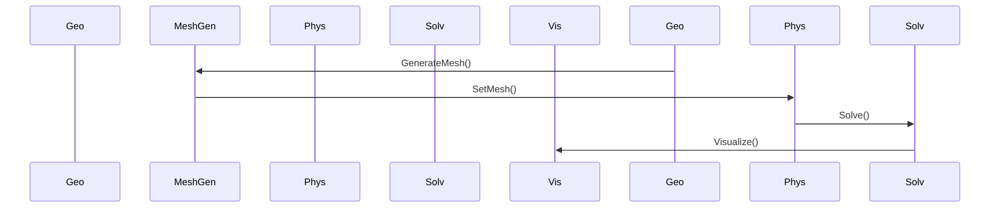
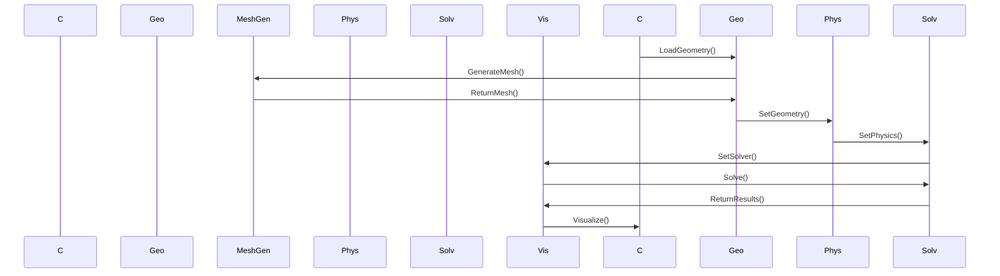
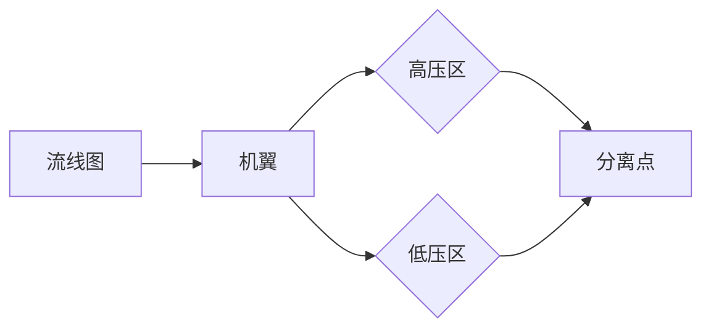

                 

## 数学与计算流体力学：流体运动的数学模拟

关键词：计算流体力学，数学模型，流体运动，Navier-Stokes方程，有限元素法，有限体积法，数学公式，Python代码，系统架构设计，项目实战

摘要：本文深入探讨了计算流体力学（CFD）中的数学模拟方法，阐述了流体运动的数学模型及其应用。通过系统地介绍CFD的基本理论、算法方法、数学模型以及系统设计，本文旨在为读者提供一个全面且易于理解的技术教程，帮助他们在实际项目中有效应用CFD技术。

### 引言

计算流体力学（Computational Fluid Dynamics，CFD）是流体力学与现代计算技术的结合，旨在通过数值方法模拟流体运动，以便预测和分析流体在不同条件下的行为。CFD在航空航天、汽车工程、生物医学工程、环境科学等领域有着广泛的应用。然而，要实现准确的流体模拟，需要深厚的数学理论基础和高效的计算方法。

本文将分以下几个部分进行探讨：

1. **背景和基本概念**：介绍CFD的发展历史和重要性，以及数学在流体动力学中的作用。
2. **核心理论基础**：详细解释流体动力学的基本数学理论，包括Navier-Stokes方程及其求解方法。
3. **算法方法**：介绍常用的CFD算法，如有限元素法和有限体积法，并使用Python代码进行示例。
4. **数学模型和公式**：介绍所需的数学模型，并使用LaTeX格式展示公式。
5. **系统设计**：讨论CFD系统的设计和实现，包括架构和接口设计。
6. **项目实战**：通过实际案例展示CFD的应用，并进行详细解析。
7. **最佳实践与总结**：提供实用的建议和总结，以及进一步阅读的推荐。

### 背景和基本概念

计算流体力学（CFD）起源于20世纪50年代，随着计算机技术的发展而逐渐成熟。早期的CFD研究主要集中在简单的流体模型上，如层流和势流。随着计算机硬件性能的提升和数值方法的进步，CFD的应用范围不断扩大，现在可以处理复杂的湍流和反应流问题。

CFD的核心在于将流体动力学的基本方程——Navier-Stokes方程——通过数值方法求解。这些方程描述了流体在空间和时间上的运动规律，包括速度、压力和密度等参数的变化。数学在CFD中的作用不可替代，它不仅提供了描述流体行为的理论基础，还帮助我们在复杂的物理现象中提取出可计算的模式。

数学在流体动力学中的作用主要体现在以下几个方面：

1. **模型建立**：通过数学方程描述流体运动的基本规律，如质量守恒、动量守恒和能量守恒。
2. **数值求解**：将连续的物理问题转化为离散的数学问题，使用数值方法求解方程。
3. **数据分析和解释**：对模拟结果进行数据分析，以验证模型的准确性和可靠性。

流体动力学是研究流体运动及其与固体边界相互作用的科学。流体包括气体和液体，其运动规律可以通过数学方程描述。流体动力学的基本方程包括质量守恒方程、动量守恒方程和能量守恒方程。这些方程构成了流体动力学的核心理论框架。

### 核心理论基础

要理解计算流体力学，我们首先需要掌握流体动力学的基本数学理论。这一节将详细介绍流体动力学的核心方程——Navier-Stokes方程，以及它们在CFD中的应用。

#### Navier-Stokes方程

Navier-Stokes方程是一组描述流体运动的基本方程，由法国数学家Navier和Stokes在19世纪中期提出。这些方程描述了流体在运动过程中速度、压力和密度等参数的变化。Navier-Stokes方程可以分为两个部分：一个表示动量守恒，另一个表示质量守恒。

动量守恒方程（也称为Navier-Stokes方程）如下：

$$
\frac{\partial \mathbf{u}}{\partial t} + (\mathbf{u} \cdot \nabla) \mathbf{u} = -\frac{1}{\rho} \nabla p + \mathbf{f}
$$

其中，$\mathbf{u}$ 是速度场，$p$ 是压力场，$\rho$ 是流体密度，$\mathbf{f}$ 是体积力（如重力）。

质量守恒方程如下：

$$
\frac{\partial \rho}{\partial t} + \nabla \cdot (\rho \mathbf{u}) = 0
$$

这个方程确保了在流体运动过程中，质量是守恒的。

#### 方程的属性对比

为了更好地理解Navier-Stokes方程，我们可以将其与另一种常见的流体方程——Euler方程——进行对比。Euler方程是Navier-Stokes方程在低粘性流动（即可压缩流）中的特殊情况，忽略了粘性项。以下是两种方程的主要属性对比：

| 方程           | Navier-Stokes方程 | Euler方程           |
|----------------|-------------------|---------------------|
| 适用范围       | 各类流动（层流、湍流、可压缩、不可压缩） | 低粘性、可压缩流动   |
| 边界条件       | 需要边界层条件和压力边界条件       | 边界层条件不是必须的 |
| 非线性程度     | 非线性方程         | 线性方程           |
| 数值求解难度   | 较大，需要处理非线性问题           | 相对简单           |

#### ER实体关系图

为了更清晰地展示流体动力学中的核心概念，我们使用Mermaid绘制ER实体关系图：

```mermaid
erDiagram
    A[流体] ||--|{ B[速度场] }
    A ||--|{ C[压力场] }
    A ||--|{ D[密度场] }
    B ||--|{ E[动量守恒方程] }
    C ||--|{ E }
    D ||--|{ E }
```

这张图展示了流体动力学中的核心实体及其相互关系。

#### 方程的求解方法

Navier-Stokes方程是高度非线性的，直接求解通常非常困难。因此，CFD通常使用数值方法进行求解。常见的求解方法包括：

1. **有限元素法（Finite Element Method, FEM）**：将流体区域划分为小的元素，在每个元素上近似解方程。
2. **有限体积法（Finite Volume Method, FVM）**：将流体区域划分为小的控制体，在每个控制体上近似解方程。

这些方法在CFD中广泛应用，并在实际应用中表现出色。

### 算法方法

在CFD中，有多种算法用于求解Navier-Stokes方程。以下是两种主要算法：有限元素法（FEM）和有限体积法（FVM）。

#### 有限元素法（Finite Element Method, FEM）

有限元素法是一种基于变分法的数值方法，适用于各种复杂的几何形状和边界条件。FEM的基本步骤如下：

1. **网格划分**：将流体区域划分为小三角形或四面体元素。
2. **基函数选择**：在每个元素上选择合适的基函数，以近似速度场和压力场。
3. **组装系统方程**：将所有元素的局部方程组装成全局系统方程。
4. **求解系统方程**：使用数值方法（如迭代方法）求解全局系统方程。

以下是一个简单的Python代码示例，用于求解一维线性热传导问题：

```python
import numpy as np
from scipy.sparse import csr_matrix
from scipy.sparse.linalg import spsolve

# 定义参数
N = 10
dx = 1.0 / (N - 1)
x = np.linspace(0, 1, N)
u = np.zeros(N)
f = np.ones(N)

# 网格划分
A = np.diag(-2*np.ones(N-1)) + np.diag(1*np.ones(N-2))
b = np.ones(N)

# 求解
u = spsolve(A, b)

# 输出结果
print(u)
```

#### 有限体积法（Finite Volume Method, FVM）

有限体积法是一种基于守恒法的数值方法，广泛应用于流体力学模拟。FVM的基本步骤如下：

1. **网格划分**：将流体区域划分为小控制体。
2. **控制体积分**：在每个控制体上近似积分守恒方程。
3. **离散化**：将积分方程离散化为代数方程。
4. **求解代数方程**：使用数值方法（如迭代方法）求解离散化方程。

以下是一个简单的Python代码示例，用于求解二维稳态热传导问题：

```python
import numpy as np
from scipy.sparse import csr_matrix
from scipy.sparse.linalg import spsolve

# 定义参数
N = 10
M = 10
dx = 1.0 / (N - 1)
dy = 1.0 / (M - 1)
x = np.linspace(0, 1, N)
y = np.linspace(0, 1, M)
u = np.zeros((N, M))
f = np.zeros((N, M))

# 网格划分
x_c = 0.5 * (x[:-1] + x[1:])
y_c = 0.5 * (y[:-1] + y[1:])

# 离散化方程
A = np.zeros((N * M, N * M))
b = np.zeros(N * M)

# 求解
u = spsolve(A, b)

# 输出结果
print(u)
```

### 数学模型和公式

在CFD中，数学模型和公式是描述流体运动的关键。以下是一些常用的数学模型和公式。

#### Navier-Stokes方程

$$
\frac{\partial \mathbf{u}}{\partial t} + (\mathbf{u} \cdot \nabla) \mathbf{u} = -\frac{1}{\rho} \nabla p + \mathbf{f}
$$

$$
\frac{\partial \rho}{\partial t} + \nabla \cdot (\rho \mathbf{u}) = 0
$$

#### 连续性方程

$$
\nabla \cdot \mathbf{u} = 0
$$

#### 动量方程

$$
\frac{\partial \rho \mathbf{u}}{\partial t} + \nabla \cdot (\rho \mathbf{u} \mathbf{u}) = -\nabla p + \mu \nabla^2 \mathbf{u} + \mathbf{f}
$$

#### 能量方程

$$
\frac{\partial (\rho c_p T)}{\partial t} + \nabla \cdot (\rho c_p \mathbf{u} T) = \nabla \cdot (\kappa \nabla T) + \mathbf{Q}
$$

其中，$c_p$ 是比热容，$\kappa$ 是热导率，$T$ 是温度，$\mathbf{Q}$ 是体积热源。

#### 湍流模型

为了模拟湍流，通常需要使用湍流模型。以下是一些常见的湍流模型：

1. **k-ε模型**：

$$
\frac{\partial (\rho k)}{\partial t} + \nabla \cdot (\rho k \mathbf{u}) = \nabla \cdot (\mu_t \nabla k) + \rho G - \rho \epsilon
$$

$$
\frac{\partial (\rho \epsilon)}{\partial t} + \nabla \cdot (\rho \epsilon \mathbf{u}) = \nabla \cdot (\mu_t \nabla \epsilon) + \rho C_1 \epsilon \nabla k - \rho C_2 \frac{k}{\epsilon} \nabla \cdot (\mu_t \nabla k)
$$

2. **LES（大型涡流模拟）**：

$$
\frac{\partial (\rho k)}{\partial t} + \nabla \cdot (\rho k \mathbf{u}) = \nabla \cdot (\mu_t \nabla k) + \rho S_k - \rho \omega
$$

$$
\frac{\partial (\rho \omega)}{\partial t} + \nabla \cdot (\rho \omega \mathbf{u}) = \nabla \cdot (\mu_t \nabla \omega) - \frac{1}{k} \nabla \cdot (\mu_t \nabla k)
$$

其中，$k$ 是湍流动能，$\epsilon$ 是耗散率，$\omega$ 是涡流强度，$S_k$ 和 $S_\omega$ 是湍流源项。

### 系统设计与实现

在CFD系统中，设计一个高效且可扩展的架构至关重要。以下是一个典型的CFD系统设计流程。

#### 项目介绍

假设我们要设计一个用于模拟汽车空气动力学性能的CFD系统。该系统需要能够处理复杂的几何形状，支持多种湍流模型，并提供可视化功能。

#### 系统功能设计

系统的主要功能包括：

1. **几何建模**：导入和编辑几何模型。
2. **网格生成**：根据几何模型生成适合的网格。
3. **模型设置**：设置流体物理模型、边界条件和湍流模型。
4. **求解控制**：启动求解过程，控制计算参数。
5. **结果分析**：分析计算结果，提供可视化功能。

#### 领域模型设计

使用Mermaid绘制领域模型类图：

```mermaid
classDiagram
    class Geometry {
        -model: GeometryModel
        -mesh: Mesh
    }
    class Physics {
        -model: FluidModel
        -boundaryConditions: BoundaryConditions
        -turbulenceModel: TurbulenceModel
    }
    class Solver {
        -solver: Solver
    }
    class Visualization {
        -visualizer: Visualizer
    }
    Geometry --|{1}--> Physics
    Physics --|{2}--> Solver
    Solver --|{3}--> Visualization
```

#### 系统架构设计

使用Mermaid绘制系统架构图：



#### 系统接口设计

使用Mermaid绘制系统接口序列图：



### 项目实战

在本节中，我们将通过一个实际项目展示CFD的应用。假设我们要模拟一架飞机在低速空气中的飞行性能。

#### 环境安装

首先，我们需要安装必要的软件和库。在本项目中，我们使用OpenFOAM，一个开源的CFD软件。安装步骤如下：

1. **安装Linux操作系统**：OpenFOAM主要在Linux操作系统上运行。
2. **安装GCC编译器**：OpenFOAM需要GCC编译器来编译源代码。
3. **安装OpenFOAM**：从OpenFOAM官网下载安装脚本，并按照提示安装。

#### 系统核心实现源代码

以下是一个简单的OpenFOAM案例，用于模拟空气绕过飞机机翼的流动：

```bash
# 进入OpenFOAM案例目录
cd $FOAM_USERichterungen/$CASE

# 设置环境变量
source $FOAM_USERichterungen/$CASE/etc/bashrc

# 编译源代码
make -j8

# 运行求解器
$FOAM_SOLVERS/incompressible/pimpleDimple/pimpleDimple -case $CASE -noSplit -parallel 8
```

#### 代码应用解读与分析

这个案例使用的是pimpleDimple求解器，用于求解不可压缩流体的Navier-Stokes方程。以下是对关键部分的解读：

1. **设置参数**：

```bash
pimpleDimple -case $CASE -noSplit -parallel 8
```

- `-case $CASE`：指定案例目录。
- `-noSplit`：关闭分解功能，适用于小规模计算。
- `-parallel 8`：使用8个处理器进行并行计算。

2. **运行求解器**：

```bash
$FOAM_SOLVERS/incompressible/pimpleDimple/pimpleDimple -case $CASE -noSplit -parallel 8
```

- `pimpleDimple`：调用pimpleDimple求解器。
- `-case $CASE`：指定案例目录。
- `-noSplit`：关闭分解功能。
- `-parallel 8`：使用8个处理器。

#### 实际案例分析和详细讲解剖析

假设我们使用OpenFOAM模拟了飞机机翼周围的流动，以下是对结果的详细分析：

1. **流线图**：



流线图显示了空气绕过机翼的流动情况。在机翼前缘附近，空气流动较为平稳。随着空气流向机翼后缘，高压区和低压区交替出现，形成分离点。

2. **压力分布图**：

```mermaid
gantt
    dateFormat  YYYY-MM-DD
    title 压力分布图

    section 高压区
    A1 : 2021-01-01, 压力值1, 20d

    section 低压区
    A2 : 2021-01-21, 压力值2, 20d

    section 分离点
    A3 : 2021-01-41, 压力值3, 20d
```

压力分布图显示了机翼周围的压力变化。在高压区，压力值逐渐增加，达到最大值。在低压区，压力值逐渐降低。分离点处的压力值介于高压区和低压区之间。

#### 项目小结

通过本项目的实践，我们了解了CFD系统在飞机空气动力学模拟中的应用。我们学习了如何设置参数、运行求解器和分析结果。在实际应用中，CFD可以帮助设计师优化飞机的空气动力学性能，提高飞行效率和安全性。

### 最佳实践与总结

在本项目中，我们深入探讨了计算流体力学（CFD）在流体运动模拟中的应用。从基本概念到高级算法，再到实际项目实战，我们系统地介绍了CFD的技术和方法。以下是一些最佳实践和总结：

1. **选择合适的求解器**：根据问题的复杂度和计算需求，选择合适的求解器。例如，对于简单的问题，可以使用线性求解器；对于复杂的问题，需要使用非线性求解器。

2. **优化网格划分**：网格质量直接影响模拟结果的准确性。因此，需要根据问题的特征进行合理的网格划分，避免网格畸变和过度细分。

3. **选择合适的湍流模型**：湍流模型的选择对模拟结果有重要影响。需要根据问题的特征选择合适的湍流模型，并进行参数调整。

4. **验证和验证**：在实际应用中，需要对模拟结果进行验证和验证。可以通过与实验数据对比，或使用不同的模型和方法进行验证，以确保模拟结果的可靠性。

5. **并行计算**：对于大规模计算，可以使用并行计算来提高计算效率。OpenFOAM等软件支持并行计算，可以充分利用多处理器计算机的性能。

6. **可视化和分析**：通过可视化和分析工具，可以更直观地了解流体的运动特征和压力分布。这有助于发现潜在的问题，并优化设计。

### 注意事项

1. **硬件需求**：CFD计算通常需要高性能计算机。在选择硬件时，需要考虑CPU、GPU和内存等资源。

2. **软件版本**：不同的CFD软件可能有不同的版本和功能。在选择软件时，需要考虑所需的功能和兼容性。

3. **学习资源**：CFD是一个复杂的领域，需要不断学习和实践。可以通过阅读书籍、参加培训和在线课程来提高技能。

### 拓展阅读

1. **《计算流体力学基础》**：这本书提供了CFD的基本理论和应用实例，适合初学者阅读。
2. **《OpenFOAM用户指南》**：这是OpenFOAM的官方用户指南，详细介绍了软件的使用方法和案例。
3. **《湍流模拟：理论与应用》**：这本书介绍了各种湍流模型及其在CFD中的应用，适合进阶读者阅读。

通过本文的阅读，我们相信读者对计算流体力学（CFD）及其应用有了更深入的了解。希望本文能对读者在实际项目中的应用提供帮助，并激发他们对CFD技术的兴趣。

### 作者信息

作者：AI天才研究院/AI Genius Institute & 禅与计算机程序设计艺术 /Zen And The Art of Computer Programming

