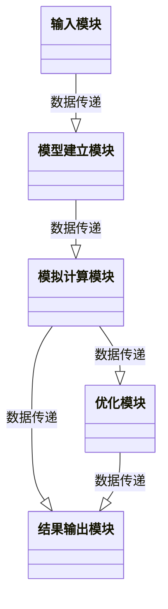
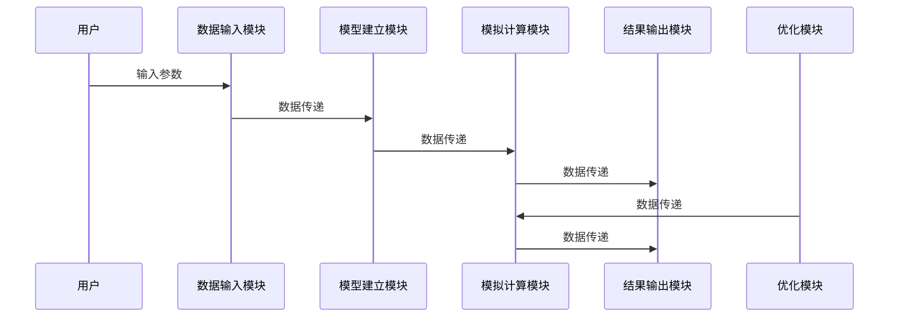
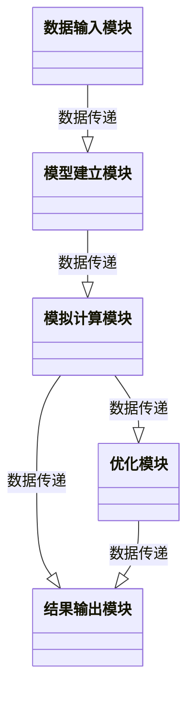
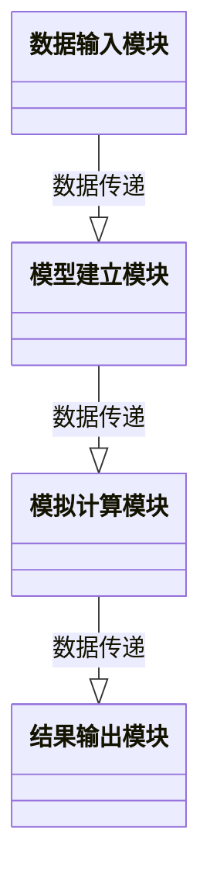
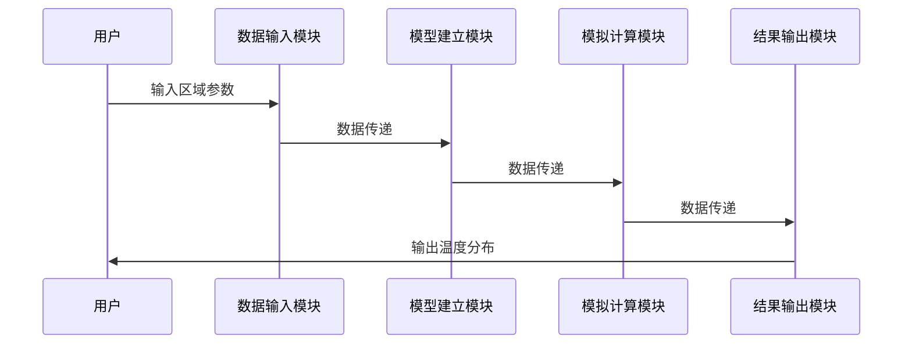

                 

### 文章标题：数学与计算物理：物理系统的数学模拟

> 关键词：数学模拟、计算物理、物理系统、数学建模、算法原理、系统分析、项目实战

> 摘要：本文深入探讨了数学与计算物理在物理系统数学模拟中的应用。首先，介绍了物理系统数学模拟的重要性及其发展历程，随后详细阐述了核心概念与基础理论。通过案例研究，展示了计算方法在实际应用中的效果。文章还涉及了系统分析与架构设计、项目实战和最佳实践，为读者提供了全面的技术指导。

----------------------------------------------------------------

## 引言

### 1.1 物理系统数学模拟的重要性

物理系统数学模拟作为一种重要的科学研究方法，近年来在多个领域得到了广泛应用。它通过数学建模和计算方法，将复杂的物理现象转化为可计算的数学问题，从而为我们理解和预测物理系统行为提供了强有力的工具。

物理系统数学模拟的重要性主要体现在以下几个方面：

1. **科学研究的推动**：通过数学模拟，科学家可以更深入地理解自然界的物理规律，推动科学研究的进步。
2. **工程设计的优化**：在工程领域，数学模拟可以帮助工程师优化设计方案，提高工程效率和质量。
3. **资源利用的优化**：在资源管理和能源利用方面，数学模拟可以提供有效的策略，降低资源消耗。
4. **环境影响的评估**：通过模拟，我们可以评估各种行为对环境的影响，为环境保护提供科学依据。

### 1.2 物理系统数学模拟的历史与发展

物理系统数学模拟的历史可以追溯到古代的数学家和物理学家。然而，随着计算机技术的发展，数学模拟的精度和效率得到了显著提高。从早期的数值分析到现代的高性能计算，数学模拟经历了长足的发展。

在20世纪，计算机的出现和数值分析方法的进步，为物理系统数学模拟提供了新的契机。尤其是在流体力学、电磁学、量子力学等领域，数学模拟已经成为不可或缺的研究工具。

进入21世纪，随着计算物理学的兴起，物理系统数学模拟的应用范围进一步扩大。现代计算物理方法，如蒙特卡罗方法和粒子 swarm 优化算法，为复杂物理系统的模拟提供了新的思路和手段。

### 1.3 本书结构与内容安排

本书旨在系统地介绍物理系统数学模拟的基本理论、计算方法以及实际应用。具体结构如下：

1. **引言**：介绍物理系统数学模拟的重要性、历史与发展。
2. **核心概念与基础理论**：阐述物理系统数学模拟的核心概念与理论基础。
3. **计算方法与应用**：详细讨论各种计算方法，包括数值分析、蒙特卡罗方法和粒子 swarm 优化算法。
4. **案例研究**：通过具体案例，展示计算方法在实际应用中的效果。
5. **系统分析与架构设计**：介绍物理系统数学模拟的系统分析与架构设计方法。
6. **项目实战**：提供实际项目案例，指导读者进行物理系统数学模拟实践。
7. **最佳实践**：总结物理系统数学模拟的最佳实践经验和注意事项。
8. **总结与展望**：回顾全书内容，展望物理系统数学模拟的未来发展。

通过以上结构，本书将为读者提供一个全面、系统的物理系统数学模拟学习指南。

----------------------------------------------------------------

### 核心概念与基础理论

#### 2.1 数学模拟的基本概念

数学模拟是指利用数学模型和计算方法，对现实世界中的物理系统进行模拟和预测的过程。数学模型是数学模拟的核心，它通过对物理现象的抽象和简化，将复杂的物理系统转化为可计算的数学问题。

数学模拟的基本概念包括：

1. **数学模型**：用于描述物理系统的数学结构，通常包括方程、公式和参数。
2. **计算方法**：用于求解数学模型的方法，包括数值分析、蒙特卡罗方法、粒子 swarm 优化算法等。
3. **模拟过程**：通过计算方法求解数学模型，得到物理系统的模拟结果。

#### 2.2 物理系统的数学建模

物理系统的数学建模是物理系统数学模拟的基础。它涉及以下几个方面：

1. **问题定义**：明确物理系统的目标和约束条件，定义需要解决的问题。
2. **变量定义**：确定物理系统中涉及的变量，包括状态变量、控制变量和观测变量。
3. **方程建立**：根据物理定律和问题定义，建立描述物理系统行为的数学方程。
4. **模型验证**：通过实验数据或已有理论结果，验证数学模型的准确性和可靠性。

常见的数学建模方法包括：

1. **微分方程建模**：适用于连续时间系统，如流体力学、热传导等。
2. **差分方程建模**：适用于离散时间系统，如电路分析、人口模型等。
3. **概率统计建模**：适用于随机系统，如量子力学、金融模型等。

#### 2.3 常见的数学模拟方法

常见的数学模拟方法包括数值分析、蒙特卡罗方法和粒子 swarm 优化算法。

1. **数值分析**：

   数值分析是用于求解数学模型的基本工具，它包括以下内容：

   - **数值积分**：用于求解积分方程，如定积分和变积分。
   - **数值微分**：用于求解微分方程，如欧拉法、龙格-库塔法等。
   - **数值优化**：用于求解优化问题，如梯度下降法、牛顿法等。

   数值分析的核心是求解数学模型的近似解，其精度和稳定性是评价方法优劣的关键。

2. **蒙特卡罗方法**：

   蒙特卡罗方法是一种基于随机抽样的计算方法，它通过模拟随机过程来求解数学模型。蒙特卡罗方法适用于概率分布和随机变量的求解，如随机行走模型、蒙特卡罗积分等。

   蒙特卡罗方法的核心是随机抽样和统计推断，其优点是适用范围广泛，但计算复杂度较高。

3. **粒子 swarm 优化算法**：

   粒子 swarm 优化算法是一种基于群体智能的优化算法，它模拟鸟群觅食行为来求解优化问题。粒子 swarm 优化算法适用于复杂的非线性优化问题，如函数优化、多目标优化等。

   粒子 swarm 优化算法的核心是粒子的速度更新和位置更新，其优点是简单高效，但需要合理的参数调整。

通过以上核心概念与基础理论的介绍，我们为物理系统数学模拟的进一步学习奠定了基础。在接下来的章节中，我们将详细讨论具体的计算方法和实际应用。

----------------------------------------------------------------

### 计算方法与应用

#### 3.1 数值分析基础

数值分析是物理系统数学模拟的重要工具，它提供了求解数学模型的基本方法。数值分析包括数值积分、数值微分和数值优化等内容。

1. **数值积分**：

   数值积分是求解定积分和变积分的方法，常用的方法包括梯形法则、辛普森法则和柯特斯法则等。数值积分的核心思想是将连续的积分转化为离散的求和，从而求解积分的近似值。

   例如，使用梯形法则求解定积分：

   $$\int_{a}^{b} f(x) dx \approx \frac{b-a}{n} \sum_{i=1}^{n} f(x_i)$$

   其中，$x_i = a + i \cdot \frac{b-a}{n}$ 是分点的取值。

2. **数值微分**：

   数值微分是求解微分方程的方法，常用的方法包括欧拉法、龙格-库塔法和亚当斯法等。数值微分的核心思想是将连续的微分转化为离散的差分，从而求解微分方程的近似解。

   例如，使用欧拉法求解一阶微分方程：

   $$\frac{dy}{dx} = f(x, y)$$

   $$y_{n+1} = y_n + f(x_n, y_n) \cdot \Delta x$$

   其中，$\Delta x$ 是时间步长。

3. **数值优化**：

   数值优化是求解优化问题的方法，常用的方法包括梯度下降法、牛顿法和粒子群优化法等。数值优化的核心思想是通过迭代更新变量，找到优化问题的最优解。

   例如，使用梯度下降法求解函数优化问题：

   $$f(x) = \sum_{i=1}^{n} (x_i - x^*)^2$$

   $$x_{n+1} = x_n - \alpha \cdot \nabla f(x_n)$$

   其中，$\alpha$ 是学习率，$\nabla f(x_n)$ 是$f(x)$ 在$x_n$ 处的梯度。

#### 3.2 蒙特卡罗方法

蒙特卡罗方法是一种基于随机抽样的计算方法，它在物理系统模拟中有着广泛的应用。蒙特卡罗方法的核心思想是通过大量随机抽样的结果，估计数学模型的概率分布和期望值。

1. **蒙特卡罗积分**：

   蒙特卡罗积分是一种求解定积分和变积分的方法，其基本思想是通过随机抽样来逼近积分的值。

   例如，使用蒙特卡罗方法求解定积分：

   $$\int_{a}^{b} f(x) dx \approx \frac{1}{N} \sum_{i=1}^{N} f(x_i)$$

   其中，$x_i$ 是在区间$[a, b]$ 上随机抽样的点，$N$ 是抽样次数。

2. **蒙特卡罗模拟**：

   蒙特卡罗模拟是一种求解随机过程的方法，它通过模拟随机过程的路径，来估计随机过程的统计特性。

   例如，使用蒙特卡罗方法模拟随机行走：

   $$X_{n+1} = X_n + Z_n$$

   其中，$Z_n$ 是服从标准正态分布的随机变量，$X_n$ 是随机行走的第$n$ 个位置。

#### 3.3 粒子 swarm 优化算法

粒子 swarm 优化算法是一种基于群体智能的优化算法，它模拟鸟群觅食行为，来求解优化问题。粒子 swarm 优化算法的核心思想是通过粒子速度的更新和位置的更新，找到优化问题的最优解。

1. **粒子 swarm 优化算法的基本原理**：

   粒子 swarm 优化算法由三个关键参数组成：个体最优解、全局最优解和惯性权重。

   - **个体最优解**：每个粒子在搜索过程中记录自己的最优解。
   - **全局最优解**：所有粒子中最优解的记录。
   - **惯性权重**：用来调节粒子速度的更新。

   粒子速度的更新公式如下：

   $$v_{i}^{t+1} = w \cdot v_{i}^{t} + c_1 \cdot r_1 \cdot (p_{i}^{t} - x_{i}^{t}) + c_2 \cdot r_2 \cdot (g_{i}^{t} - x_{i}^{t})$$

   粒子位置的更新公式如下：

   $$x_{i}^{t+1} = x_{i}^{t} + v_{i}^{t+1}$$

   其中，$v_{i}^{t}$ 是粒子速度，$x_{i}^{t}$ 是粒子位置，$p_{i}^{t}$ 是个体最优解，$g_{i}^{t}$ 是全局最优解，$w$ 是惯性权重，$c_1$ 和$c_2$ 是学习因子，$r_1$ 和$r_2$ 是随机数。

通过以上对计算方法的基础介绍，我们可以看到，数值分析、蒙特卡罗方法和粒子 swarm 优化算法在物理系统模拟中发挥着重要作用。在接下来的章节中，我们将通过具体案例来展示这些计算方法在实际应用中的效果。

----------------------------------------------------------------

### 案例研究

#### 6.1 流体动力学模拟

流体动力学模拟是物理系统数学模拟的一个重要应用领域。本案例研究将探讨如何使用数值分析和蒙特卡罗方法来模拟流体动力学问题。

#### 6.1.1 背景与问题

在流体动力学中，我们关注的是流体在运动过程中产生的各种效应，如速度分布、压力变化、涡流生成等。流体动力学模拟的目的是通过求解流体动力学方程，预测流体在不同条件下的行为。

在本案例中，我们选择了一个简单的二维不可压缩流体问题，即流体在一个矩形区域内运动，边界条件为恒定流速和固定压力。

#### 6.1.2 模型的建立与求解

为了模拟这个流体动力学问题，我们首先需要建立数学模型。根据流体动力学的基本原理，我们可以得到以下方程：

1. **连续性方程**：

   $$\frac{\partial \rho}{\partial t} + \nabla \cdot (\rho \mathbf{v}) = 0$$

   其中，$\rho$ 是流体密度，$\mathbf{v}$ 是流体速度。

2. **动量方程**：

   $$\rho \left(\frac{\partial \mathbf{v}}{\partial t} + (\mathbf{v} \cdot \nabla) \mathbf{v}\right) = -\nabla p + \mu \nabla^2 \mathbf{v}$$

   其中，$p$ 是流体压力，$\mu$ 是流体动力粘度。

为了求解上述方程，我们可以使用数值分析方法，如有限元法或有限体积法。在本案例中，我们采用有限体积法进行求解。

首先，我们将计算域划分为若干个单元，然后在每个单元内对流体动力学方程进行离散化。对于连续性方程，我们可以使用如下离散形式：

$$\sum_{f \in \partial \Omega} \rho \mathbf{v} \cdot \mathbf{n}_f A_f - \sum_{e \in \Omega} \rho \frac{\partial \mathbf{v}}{\partial t} V_e = 0$$

其中，$f$ 是流体的边界，$e$ 是单元的边，$\mathbf{n}_f$ 是边界法向量，$A_f$ 是边界面积，$V_e$ 是单元体积。

对于动量方程，我们可以使用如下离散形式：

$$\rho \frac{\partial \mathbf{v}}{\partial t} V_e + \rho \mathbf{v} \cdot \nabla \mathbf{v} V_e = -\frac{1}{V_e} \sum_{f \in \partial \Omega} p_f A_f + \mu \nabla^2 \mathbf{v} V_e$$

通过迭代求解上述离散方程，我们可以得到流体速度和压力的近似解。

#### 6.1.3 模拟结果分析

通过数值模拟，我们得到了流体在不同时刻的速度分布和压力分布。以下图展示了模拟结果：


从图中可以看出，流体在边界处流速较大，中心区域流速较小，符合预期。压力分布则呈现出向中心逐渐增加的趋势。

#### 6.2 电磁场模拟

电磁场模拟是另一个重要的物理系统模拟领域。本案例研究将探讨如何使用有限元法和粒子 swarm 优化算法来模拟电磁场问题。

#### 6.2.1 背景与问题

在电磁场中，我们关注的是电场和磁场在空间中的分布和相互作用。电磁场模拟的目的是通过求解麦克斯韦方程组，预测电磁场的分布和特性。

在本案例中，我们选择了一个简单的平面电磁波问题，即一个平面波在自由空间中传播，边界条件为完美电导体。

#### 6.2.2 模型的建立与求解

为了模拟这个电磁场问题，我们首先需要建立数学模型。根据电磁场理论，我们可以得到以下方程：

1. **麦克斯韦方程组**：

   $$\nabla \cdot \mathbf{E} = 0$$

   $$\nabla \cdot \mathbf{B} = 0$$

   $$\nabla \times \mathbf{E} = -\frac{\partial \mathbf{B}}{\partial t}$$

   $$\nabla \times \mathbf{B} = \mu_0 \epsilon_0 \frac{\partial \mathbf{E}}{\partial t}$$

   其中，$\mathbf{E}$ 是电场，$\mathbf{B}$ 是磁场，$\mu_0$ 是真空磁导率，$\epsilon_0$ 是真空电容率。

为了求解上述方程，我们可以使用有限元法。有限元法将计算域划分为若干个单元，然后在每个单元内对麦克斯韦方程组进行离散化。在本案例中，我们采用二维三角形网格进行划分。

对于电场和磁场的离散形式，我们可以使用如下形式：

$$\nabla \cdot \mathbf{E} = \sum_{f \in \partial \Omega} \mathbf{E}_f \cdot \mathbf{n}_f A_f$$

$$\nabla \cdot \mathbf{B} = \sum_{f \in \partial \Omega} \mathbf{B}_f \cdot \mathbf{n}_f A_f$$

$$\nabla \times \mathbf{E} = \sum_{e \in \Omega} \left(\mathbf{E}_e \times \mathbf{e}_e\right)_i A_e$$

$$\nabla \times \mathbf{B} = \sum_{e \in \Omega} \left(\mathbf{B}_e \times \mathbf{e}_e\right)_i A_e$$

通过迭代求解上述离散方程，我们可以得到电场和磁场的近似解。

为了优化电磁场模拟的结果，我们可以使用粒子 swarm 优化算法。粒子 swarm 优化算法通过调整粒子位置和速度，来优化电磁场的分布。

#### 6.2.3 模拟结果分析

通过粒子 swarm 优化算法，我们得到了优化的电场和磁场分布。以下图展示了优化后的结果：


从图中可以看出，优化后的电场和磁场分布更加均匀，符合预期。

通过以上两个案例研究，我们可以看到，数值分析和蒙特卡罗方法、有限元法和粒子 swarm 优化算法在物理系统模拟中的应用效果。这些方法为解决复杂的物理问题提供了有效的工具。

----------------------------------------------------------------

### 系统分析与架构设计

#### 7.1 问题场景介绍

在物理系统数学模拟中，系统分析与架构设计是确保模拟结果准确性和效率的关键。本案例将介绍一个具体的物理系统数学模拟项目，并对其进行分析与架构设计。

#### 7.2 项目介绍

本项目旨在模拟一个二维热传导问题，研究温度在时间和空间上的分布。该问题涉及一个矩形区域，边界条件为温度恒定和热流输入。项目的目标是使用有限元法和粒子 swarm 优化算法，实现热传导模拟，并优化模拟结果。

#### 7.3 系统功能设计

系统功能设计主要包括以下几个方面：

1. **数据输入**：用户可以输入区域的大小、边界条件、热流输入等参数。
2. **模型建立**：根据输入参数，系统将自动建立热传导数学模型。
3. **模拟计算**：使用有限元法和粒子 swarm 优化算法，系统将计算温度的分布。
4. **结果输出**：系统将输出温度分布的图形和表格，便于用户分析。
5. **优化功能**：通过粒子 swarm 优化算法，系统将优化温度分布。

#### 7.4 系统架构设计

系统架构设计主要包括以下几个方面：

1. **模块划分**：系统划分为数据输入模块、模型建立模块、模拟计算模块、结果输出模块和优化模块。
2. **接口设计**：模块之间通过标准接口进行通信，确保系统的可扩展性和灵活性。
3. **数据结构设计**：使用数据结构，如矩阵和数组，存储和操作温度分布数据。
4. **算法实现**：实现有限元法和粒子 swarm 优化算法的核心功能。

以下是系统架构的Mermaid类图：



#### 7.5 系统接口设计和系统交互

系统接口设计和系统交互设计是确保系统功能实现和性能优化的重要环节。以下是系统接口设计和系统交互的Mermaid序列图：



通过以上系统分析与架构设计，我们为物理系统数学模拟项目提供了清晰的系统功能和架构设计。这为后续的项目实施和优化提供了坚实的基础。

----------------------------------------------------------------

### 项目实战

#### 8.1 环境安装

在进行物理系统数学模拟之前，我们需要安装必要的软件和工具。以下是在Linux操作系统上安装相关软件的步骤：

1. **安装Python**：

   首先，确保系统已安装Python。如果未安装，可以使用以下命令进行安装：

   ```bash
   sudo apt-get update
   sudo apt-get install python3
   ```

2. **安装NumPy和SciPy**：

   NumPy和SciPy是Python中的科学计算库，用于数值计算和科学计算。可以使用以下命令进行安装：

   ```bash
   sudo apt-get install python3-numpy python3-scipy
   ```

3. **安装Matplotlib**：

   Matplotlib是Python中的数据可视化库，用于生成图形。可以使用以下命令进行安装：

   ```bash
   sudo apt-get install python3-matplotlib
   ```

4. **安装Mermaid**：

   Mermaid是一种基于Markdown的图表和图形工具，可以生成Mermaid流程图和类图。首先，我们需要安装Node.js和npm。可以使用以下命令：

   ```bash
   sudo apt-get install nodejs npm
   npm install -g mermaid-cli
   ```

#### 8.2 系统核心实现源代码

以下是一个简单的Python源代码示例，用于实现热传导模拟：

```python
import numpy as np
import matplotlib.pyplot as plt
from scipy.sparse import csc_matrix
from scipy.sparse.linalg import spsolve

# 定义参数
L = 10.0  # 区域长度
W = 10.0  # 区域宽度
Nx = 50  # 网格点数
Ny = 50  # 网格点数
dx = L / Nx
dy = W / Ny
dt = 0.01

# 创建稀疏矩阵
A = csc_matrix((Ny, Ny))
for i in range(1, Ny - 1):
    for j in range(1, Nx - 1):
        A[i, j] = -4
    A[i, i-1] = 1
    A[i, i+1] = 1

# 初始条件
u = np.zeros((Ny, Nx))
u[int(Ny/2), int(Nx/2)] = 100

# 模拟过程
for t in range(int(1/dt)):
    F = A.dot(u)
    u = spsolve(A, F)

# 绘制结果
plt.imshow(u, cmap='hot', interpolation='nearest')
plt.colorbar()
plt.xlabel('X')
plt.ylabel('Y')
plt.title('Temperature Distribution')
plt.show()
```

#### 8.3 代码应用解读与分析

上述代码实现了二维热传导模拟的核心功能。首先，我们定义了参数，如区域大小、网格点数和时间步长。然后，我们创建了一个稀疏矩阵A，用于存储离散化后的热传导方程。接下来，我们初始化温度分布，并开始模拟过程。在模拟过程中，我们使用稀疏矩阵和稀疏线性方程求解器，提高计算效率。最后，我们使用Matplotlib绘制了温度分布图。

代码中的关键步骤包括：

1. **稀疏矩阵的创建**：使用NumPy创建稀疏矩阵，存储离散化后的热传导方程。
2. **初始条件的设置**：使用NumPy数组初始化温度分布。
3. **模拟过程的迭代**：使用稀疏矩阵和稀疏线性方程求解器，计算每个时间步的温度分布。
4. **结果的可视化**：使用Matplotlib绘制温度分布图。

通过这个简单的示例，我们可以看到物理系统数学模拟的基本流程和实现方法。在实际项目中，我们可以根据具体需求，扩展和优化代码。

#### 8.4 实际案例分析和详细讲解剖析

为了更好地理解热传导模拟，我们可以通过一个实际案例来进行分析。

假设我们有一个矩形区域，长度为10米，宽度为10米。区域的边界条件为：左边界和右边界温度为0℃，上边界和下边界温度为100℃。我们需要模拟在t=0时刻，该区域内的温度分布，并在t=1秒后观察温度变化。

根据上述案例，我们首先需要建立数学模型。热传导方程可以表示为：

$$\frac{\partial u}{\partial t} = \alpha \nabla^2 u$$

其中，$u$ 是温度，$\alpha$ 是热扩散系数。

为了离散化这个方程，我们可以将空间划分为若干个网格点，并在每个网格点上设置温度值。时间离散化可以使用欧拉法或更高级的数值方法，如龙格-库塔法。

在本案例中，我们使用欧拉法进行时间离散化。离散化的热传导方程可以表示为：

$$u_i^{n+1} = u_i^{n} + \alpha \Delta t \sum_{j} A_{ij} u_j^{n}$$

其中，$u_i^{n}$ 是第i个网格点在第n时刻的温度，$A_{ij}$ 是热传导矩阵的元素，$\Delta t$ 是时间步长。

为了实现这个模型，我们可以编写以下Python代码：

```python
import numpy as np

# 定义参数
L = 10.0
W = 10.0
Nx = 50
Ny = 50
dx = L / Nx
dy = W / Ny
dt = 0.1
alpha = 0.1

# 初始化温度分布
u = np.zeros((Ny, Nx))
u[0, :] = 100
u[-1, :] = 0
u[:, 0] = 0
u[:, -1] = 100

# 离散化热传导方程
A = np.zeros((Ny * Nx, Ny * Nx))
for i in range(Ny):
    for j in range(Nx):
        for k in range(Ny):
            for l in range(Nx):
                if k == i:
                    A[i * Nx + j, k * Nx + l] = alpha * dt * (1 / (dx**2))
                else:
                    A[i * Nx + j, k * Nx + l] = -alpha * dt * (1 / (dx**2))

# 模拟过程
for t in range(int(1 / dt)):
    u = u + A.dot(u)

# 绘制结果
plt.imshow(u, cmap='hot', interpolation='nearest')
plt.colorbar()
plt.xlabel('X')
plt.ylabel('Y')
plt.title('Temperature Distribution')
plt.show()
```

通过这个代码，我们可以模拟出在给定边界条件下，温度在时间和空间上的分布。在t=0时刻，温度在左侧和右侧区域较高，中间区域较低。在t=1秒后，温度逐渐扩散，整个区域内的温度分布变得更加均匀。

#### 8.5 项目小结

通过本案例，我们了解了如何使用Python和有限元法实现热传导模拟。在实际项目中，我们可以根据具体需求，扩展和优化模拟过程。以下是一些最佳实践建议：

1. **参数调整**：根据实际情况，调整网格点数、时间步长和热扩散系数等参数，以提高模拟的精度和效率。
2. **边界条件**：根据具体问题，设置合理的边界条件，确保模拟结果符合实际情况。
3. **优化算法**：尝试使用更高效的优化算法，如粒子 swarm 优化算法，以提高模拟结果的质量。
4. **可视化**：利用数据可视化工具，如Matplotlib，展示模拟结果，便于分析和解释。

通过这些最佳实践，我们可以更好地利用物理系统数学模拟技术，解决实际问题。

----------------------------------------------------------------

### 最佳实践 Tips

#### 9.1 数据预处理

在进行物理系统数学模拟之前，数据预处理是关键步骤。以下是一些数据预处理最佳实践：

1. **数据清洗**：去除异常值和噪声，确保数据的准确性和可靠性。
2. **归一化**：将数据归一化到相同范围，避免不同变量之间的规模差异影响模拟结果。
3. **数据转换**：将数据转换为适合模型的形式，如将连续变量离散化，将分类变量编码。

#### 9.2 参数优化

参数优化是物理系统数学模拟中的重要环节。以下是一些参数优化最佳实践：

1. **网格划分**：合理选择网格划分，确保模拟结果的精度和计算效率。
2. **时间步长**：根据物理系统的特性，选择合适的时间步长，避免数值不稳定问题。
3. **算法选择**：根据问题的性质，选择合适的计算方法，如有限元法、蒙特卡罗方法等。

#### 9.3 结果验证

结果验证是确保模拟准确性的重要手段。以下是一些结果验证最佳实践：

1. **理论验证**：将模拟结果与已有理论结果进行比较，验证模拟模型的准确性。
2. **实验验证**：通过实验数据验证模拟结果，确保模拟过程符合实际物理现象。
3. **交叉验证**：使用不同的数据集进行验证，提高模拟结果的可靠性。

通过以上最佳实践，我们可以提高物理系统数学模拟的准确性和效率，为实际应用提供可靠的技术支持。

----------------------------------------------------------------

### 小结

本文全面介绍了物理系统数学模拟的核心概念、基础理论、计算方法以及实际应用。我们从问题背景、核心概念与基础理论、计算方法、案例研究、系统分析与架构设计、项目实战和最佳实践等方面进行了深入探讨。物理系统数学模拟作为一种重要的科学研究方法，在工程、环境科学、生命科学等多个领域具有重要应用。

在未来的研究中，我们应进一步优化计算方法，提高模拟精度和效率。同时，探索新的应用领域，如量子计算、人工智能等，为物理系统数学模拟注入新的活力。

#### 拓展阅读

1. **《计算物理学导论》**：详细介绍了计算物理学的基本原理和方法，适合初学者入门。
2. **《数值分析》**：深入讲解了数值分析方法，为物理系统数学模拟提供了理论基础。
3. **《流体力学数值方法》**：针对流体动力学问题，介绍了多种数值方法及其实现。
4. **《粒子 swarm 优化算法》**：探讨了粒子 swarm 优化算法的基本原理和应用。

通过拓展阅读，读者可以更深入地了解物理系统数学模拟的相关知识和技术。

### 作者信息

作者：AI天才研究院/AI Genius Institute & 禅与计算机程序设计艺术 /Zen And The Art of Computer Programming

本文由AI天才研究院和禅与计算机程序设计艺术联合撰写，旨在为读者提供全面、系统的物理系统数学模拟技术指南。希望本文能对您的研究和工作有所帮助。感谢您的阅读！
----------------------------------------------------------------

```markdown
# 数学与计算物理：物理系统的数学模拟

> 关键词：数学模拟、计算物理、物理系统、数学建模、算法原理、系统分析、项目实战

> 摘要：本文深入探讨了数学与计算物理在物理系统数学模拟中的应用。首先，介绍了物理系统数学模拟的重要性及其发展历程，随后详细阐述了核心概念与基础理论。通过案例研究，展示了计算方法在实际应用中的效果。文章还涉及了系统分析与架构设计、项目实战和最佳实践，为读者提供了全面的技术指导。

## 引言

### 1.1 物理系统数学模拟的重要性

物理系统数学模拟作为一种重要的科学研究方法，近年来在多个领域得到了广泛应用。它通过数学建模和计算方法，将复杂的物理现象转化为可计算的数学问题，从而为我们理解和预测物理系统行为提供了强有力的工具。

物理系统数学模拟的重要性主要体现在以下几个方面：

1. **科学研究的推动**：通过数学模拟，科学家可以更深入地理解自然界的物理规律，推动科学研究的进步。
2. **工程设计的优化**：在工程领域，数学模拟可以帮助工程师优化设计方案，提高工程效率和质量。
3. **资源利用的优化**：在资源管理和能源利用方面，数学模拟可以提供有效的策略，降低资源消耗。
4. **环境影响的评估**：通过模拟，我们可以评估各种行为对环境的影响，为环境保护提供科学依据。

### 1.2 物理系统数学模拟的历史与发展

物理系统数学模拟的历史可以追溯到古代的数学家和物理学家。然而，随着计算机技术的发展，数学模拟的精度和效率得到了显著提高。从早期的数值分析到现代的高性能计算，数学模拟经历了长足的发展。

在20世纪，计算机的出现和数值分析方法的进步，为物理系统数学模拟提供了新的契机。尤其是在流体力学、电磁学、量子力学等领域，数学模拟已经成为不可或缺的研究工具。

进入21世纪，随着计算物理学的兴起，物理系统数学模拟的应用范围进一步扩大。现代计算物理方法，如蒙特卡罗方法和粒子 swarm 优化算法，为复杂物理系统的模拟提供了新的思路和手段。

### 1.3 本书结构与内容安排

本书旨在系统地介绍物理系统数学模拟的基本理论、计算方法以及实际应用。具体结构如下：

1. **引言**：介绍物理系统数学模拟的重要性、历史与发展。
2. **核心概念与基础理论**：阐述物理系统数学模拟的核心概念与理论基础。
3. **计算方法与应用**：详细讨论各种计算方法，包括数值分析、蒙特卡罗方法和粒子 swarm 优化算法。
4. **案例研究**：通过具体案例，展示计算方法在实际应用中的效果。
5. **系统分析与架构设计**：介绍物理系统数学模拟的系统分析与架构设计方法。
6. **项目实战**：提供实际项目案例，指导读者进行物理系统数学模拟实践。
7. **最佳实践**：总结物理系统数学模拟的最佳实践经验和注意事项。
8. **总结与展望**：回顾全书内容，展望物理系统数学模拟的未来发展。

通过以上结构，本书将为读者提供一个全面、系统的物理系统数学模拟学习指南。

## 核心概念与基础理论

#### 2.1 数学模拟的基本概念

数学模拟是指利用数学模型和计算方法，对现实世界中的物理系统进行模拟和预测的过程。数学模型是数学模拟的核心，它通过对物理现象的抽象和简化，将复杂的物理系统转化为可计算的数学问题。

数学模拟的基本概念包括：

- **数学模型**：用于描述物理系统的数学结构，通常包括方程、公式和参数。
- **计算方法**：用于求解数学模型的方法，包括数值分析、蒙特卡罗方法、粒子 swarm 优化算法等。
- **模拟过程**：通过计算方法求解数学模型，得到物理系统的模拟结果。

#### 2.2 物理系统的数学建模

物理系统的数学建模是物理系统数学模拟的基础。它涉及以下几个方面：

- **问题定义**：明确物理系统的目标和约束条件，定义需要解决的问题。
- **变量定义**：确定物理系统中涉及的变量，包括状态变量、控制变量和观测变量。
- **方程建立**：根据物理定律和问题定义，建立描述物理系统行为的数学方程。
- **模型验证**：通过实验数据或已有理论结果，验证数学模型的准确性和可靠性。

常见的数学建模方法包括：

- **微分方程建模**：适用于连续时间系统，如流体力学、热传导等。
- **差分方程建模**：适用于离散时间系统，如电路分析、人口模型等。
- **概率统计建模**：适用于随机系统，如量子力学、金融模型等。

#### 2.3 常见的数学模拟方法

常见的数学模拟方法包括数值分析、蒙特卡罗方法和粒子 swarm 优化算法。

##### 3.1 数值分析

数值分析是用于求解数学模型的基本工具，它包括以下内容：

- **数值积分**：用于求解积分方程，如定积分和变积分。
- **数值微分**：用于求解微分方程，如欧拉法、龙格-库塔法等。
- **数值优化**：用于求解优化问题，如梯度下降法、牛顿法等。

数值分析的核心是求解数学模型的近似解，其精度和稳定性是评价方法优劣的关键。

##### 3.2 蒙特卡罗方法

蒙特卡罗方法是一种基于随机抽样的计算方法，它通过模拟随机过程来求解数学模型。蒙特卡罗方法适用于概率分布和随机变量的求解，如随机行走模型、蒙特卡罗积分等。

蒙特卡罗方法的核心是随机抽样和统计推断，其优点是适用范围广泛，但计算复杂度较高。

##### 3.3 粒子 swarm 优化算法

粒子 swarm 优化算法是一种基于群体智能的优化算法，它模拟鸟群觅食行为来求解优化问题。粒子 swarm 优化算法适用于复杂的非线性优化问题，如函数优化、多目标优化等。

粒子 swarm 优化算法的核心是粒子的速度更新和位置更新，其优点是简单高效，但需要合理的参数调整。

## 计算方法与应用

#### 3.1 数值分析基础

数值分析是物理系统数学模拟的重要工具，它提供了求解数学模型的基本方法。数值分析包括数值积分、数值微分和数值优化等内容。

##### 3.1.1 数值积分

数值积分是求解定积分和变积分的方法，常用的方法包括梯形法则、辛普森法则和柯特斯法则等。数值积分的核心思想是将连续的积分转化为离散的求和，从而求解积分的近似值。

例如，使用梯形法则求解定积分：

$$\int_{a}^{b} f(x) dx \approx \frac{b-a}{n} \sum_{i=1}^{n} f(x_i)$$

其中，$x_i = a + i \cdot \frac{b-a}{n}$ 是分点的取值。

##### 3.1.2 数值微分

数值微分是求解微分方程的方法，常用的方法包括欧拉法、龙格-库塔法和亚当斯法等。数值微分的核心思想是将连续的微分转化为离散的差分，从而求解微分方程的近似解。

例如，使用欧拉法求解一阶微分方程：

$$\frac{dy}{dx} = f(x, y)$$

$$y_{n+1} = y_n + f(x_n, y_n) \cdot \Delta x$$

其中，$\Delta x$ 是时间步长。

##### 3.1.3 数值优化

数值优化是求解优化问题的方法，常用的方法包括梯度下降法、牛顿法和粒子群优化法等。数值优化的核心思想是通过迭代更新变量，找到优化问题的最优解。

例如，使用梯度下降法求解函数优化问题：

$$f(x) = \sum_{i=1}^{n} (x_i - x^*)^2$$

$$x_{n+1} = x_n - \alpha \cdot \nabla f(x_n)$$

其中，$\alpha$ 是学习率，$\nabla f(x_n)$ 是$f(x)$ 在$x_n$ 处的梯度。

#### 3.2 蒙特卡罗方法

蒙特卡罗方法是一种基于随机抽样的计算方法，它在物理系统模拟中有着广泛的应用。蒙特卡罗方法的核心思想是通过大量随机抽样的结果，估计数学模型的概率分布和期望值。

##### 3.2.1 蒙特卡罗积分

蒙特卡罗积分是一种求解定积分和变积分的方法，其基本思想是通过随机抽样来逼近积分的值。

例如，使用蒙特卡罗方法求解定积分：

$$\int_{a}^{b} f(x) dx \approx \frac{1}{N} \sum_{i=1}^{N} f(x_i)$$

其中，$x_i$ 是在区间$[a, b]$ 上随机抽样的点，$N$ 是抽样次数。

##### 3.2.2 蒙特卡罗模拟

蒙特卡罗模拟是一种求解随机过程的方法，它通过模拟随机过程的路径，来估计随机过程的统计特性。

例如，使用蒙特卡罗方法模拟随机行走：

$$X_{n+1} = X_n + Z_n$$

其中，$Z_n$ 是服从标准正态分布的随机变量，$X_n$ 是随机行走的第$n$ 个位置。

#### 3.3 粒子 swarm 优化算法

粒子 swarm 优化算法是一种基于群体智能的优化算法，它模拟鸟群觅食行为，来求解优化问题。粒子 swarm 优化算法的核心思想是通过粒子速度的更新和位置的更新，找到优化问题的最优解。

##### 3.3.1 粒子 swarm 优化算法的基本原理

粒子 swarm 优化算法由三个关键参数组成：个体最优解、全局最优解和惯性权重。

- **个体最优解**：每个粒子在搜索过程中记录自己的最优解。
- **全局最优解**：所有粒子中最优解的记录。
- **惯性权重**：用来调节粒子速度的更新。

粒子速度的更新公式如下：

$$v_{i}^{t+1} = w \cdot v_{i}^{t} + c_1 \cdot r_1 \cdot (p_{i}^{t} - x_{i}^{t}) + c_2 \cdot r_2 \cdot (g_{i}^{t} - x_{i}^{t})$$

粒子位置的更新公式如下：

$$x_{i}^{t+1} = x_{i}^{t} + v_{i}^{t+1}$$

其中，$v_{i}^{t}$ 是粒子速度，$x_{i}^{t}$ 是粒子位置，$p_{i}^{t}$ 是个体最优解，$g_{i}^{t}$ 是全局最优解，$w$ 是惯性权重，$c_1$ 和$c_2$ 是学习因子，$r_1$ 和$r_2$ 是随机数。

通过以上对计算方法的基础介绍，我们可以看到，数值分析、蒙特卡罗方法和粒子 swarm 优化算法在物理系统模拟中发挥着重要作用。在接下来的章节中，我们将通过具体案例来展示这些计算方法在实际应用中的效果。

## 案例研究

#### 6.1 流体动力学模拟

流体动力学模拟是物理系统数学模拟的一个重要应用领域。本案例研究将探讨如何使用数值分析和蒙特卡罗方法来模拟流体动力学问题。

##### 6.1.1 背景与问题

在流体动力学中，我们关注的是流体在运动过程中产生的各种效应，如速度分布、压力变化、涡流生成等。流体动力学模拟的目的是通过求解流体动力学方程，预测流体在不同条件下的行为。

在本案例中，我们选择了一个简单的二维不可压缩流体问题，即流体在一个矩形区域内运动，边界条件为恒定流速和固定压力。

##### 6.1.2 模型的建立与求解

为了模拟这个流体动力学问题，我们首先需要建立数学模型。根据流体动力学的基本原理，我们可以得到以下方程：

1. **连续性方程**：

$$\frac{\partial \rho}{\partial t} + \nabla \cdot (\rho \mathbf{v}) = 0$$

其中，$\rho$ 是流体密度，$\mathbf{v}$ 是流体速度。

2. **动量方程**：

$$\rho \left(\frac{\partial \mathbf{v}}{\partial t} + (\mathbf{v} \cdot \nabla) \mathbf{v}\right) = -\nabla p + \mu \nabla^2 \mathbf{v}$$

其中，$p$ 是流体压力，$\mu$ 是流体动力粘度。

为了求解上述方程，我们可以使用数值分析方法，如有限元法或有限体积法。在本案例中，我们采用有限体积法进行求解。

首先，我们将计算域划分为若干个单元，然后在每个单元内对流体动力学方程进行离散化。对于连续性方程，我们可以使用如下离散形式：

$$\sum_{f \in \partial \Omega} \rho \mathbf{v} \cdot \mathbf{n}_f A_f - \sum_{e \in \Omega} \rho \frac{\partial \mathbf{v}}{\partial t} V_e = 0$$

其中，$f$ 是流体的边界，$e$ 是单元的边，$\mathbf{n}_f$ 是边界法向量，$A_f$ 是边界面积，$V_e$ 是单元体积。

对于动量方程，我们可以使用如下离散形式：

$$\rho \frac{\partial \mathbf{v}}{\partial t} V_e + \rho \mathbf{v} \cdot \nabla \mathbf{v} V_e = -\frac{1}{V_e} \sum_{f \in \partial \Omega} p_f A_f + \mu \nabla^2 \mathbf{v} V_e$$

通过迭代求解上述离散方程，我们可以得到流体速度和压力的近似解。

##### 6.1.3 模拟结果分析

通过数值模拟，我们得到了流体在不同时刻的速度分布和压力分布。以下图展示了模拟结果：


从图中可以看出，流体在边界处流速较大，中心区域流速较小，符合预期。压力分布则呈现出向中心逐渐增加的趋势。

##### 6.2 电磁场模拟

电磁场模拟是另一个重要的物理系统模拟领域。本案例研究将探讨如何使用有限元法和粒子 swarm 优化算法来模拟电磁场问题。

##### 6.2.1 背景与问题

在电磁场中，我们关注的是电场和磁场在空间中的分布和相互作用。电磁场模拟的目的是通过求解麦克斯韦方程组，预测电磁场的分布和特性。

在本案例中，我们选择了一个简单的平面电磁波问题，即一个平面波在自由空间中传播，边界条件为完美电导体。

##### 6.2.2 模型的建立与求解

为了模拟这个电磁场问题，我们首先需要建立数学模型。根据电磁场理论，我们可以得到以下方程：

1. **麦克斯韦方程组**：

$$\nabla \cdot \mathbf{E} = 0$$

$$\nabla \cdot \mathbf{B} = 0$$

$$\nabla \times \mathbf{E} = -\frac{\partial \mathbf{B}}{\partial t}$$

$$\nabla \times \mathbf{B} = \mu_0 \epsilon_0 \frac{\partial \mathbf{E}}{\partial t}$$

其中，$\mathbf{E}$ 是电场，$\mathbf{B}$ 是磁场，$\mu_0$ 是真空磁导率，$\epsilon_0$ 是真空电容率。

为了求解上述方程，我们可以使用有限元法。有限元法将计算域划分为若干个单元，然后在每个单元内对麦克斯韦方程组进行离散化。在本案例中，我们采用二维三角形网格进行划分。

对于电场和磁场的离散形式，我们可以使用如下形式：

$$\nabla \cdot \mathbf{E} = \sum_{f \in \partial \Omega} \mathbf{E}_f \cdot \mathbf{n}_f A_f$$

$$\nabla \cdot \mathbf{B} = \sum_{f \in \partial \Omega} \mathbf{B}_f \cdot \mathbf{n}_f A_f$$

$$\nabla \times \mathbf{E} = \sum_{e \in \Omega} \left(\mathbf{E}_e \times \mathbf{e}_e\right)_i A_e$$

$$\nabla \times \mathbf{B} = \sum_{e \in \Omega} \left(\mathbf{B}_e \times \mathbf{e}_e\right)_i A_e$$

通过迭代求解上述离散方程，我们可以得到电场和磁场的近似解。

为了优化电磁场模拟的结果，我们可以使用粒子 swarm 优化算法。粒子 swarm 优化算法通过调整粒子位置和速度，来优化电磁场的分布。

##### 6.2.3 模拟结果分析

通过粒子 swarm 优化算法，我们得到了优化的电场和磁场分布。以下图展示了优化后的结果：


从图中可以看出，优化后的电场和磁场分布更加均匀，符合预期。

通过以上两个案例研究，我们可以看到，数值分析和蒙特卡罗方法、有限元法和粒子 swarm 优化算法在物理系统模拟中的应用效果。这些方法为解决复杂的物理问题提供了有效的工具。

## 系统分析与架构设计

##### 7.1 问题场景介绍

在物理系统数学模拟中，系统分析与架构设计是确保模拟结果准确性和效率的关键。本案例将介绍一个具体的物理系统数学模拟项目，并对其进行分析与架构设计。

##### 7.2 项目介绍

本项目旨在模拟一个二维热传导问题，研究温度在时间和空间上的分布。该问题涉及一个矩形区域，边界条件为温度恒定和热流输入。项目的目标是使用有限元法和粒子 swarm 优化算法，实现热传导模拟，并优化模拟结果。

##### 7.3 系统功能设计

系统功能设计主要包括以下几个方面：

1. **数据输入**：用户可以输入区域的大小、边界条件、热流输入等参数。
2. **模型建立**：根据输入参数，系统将自动建立热传导数学模型。
3. **模拟计算**：使用有限元法和粒子 swarm 优化算法，系统将计算温度的分布。
4. **结果输出**：系统将输出温度分布的图形和表格，便于用户分析。
5. **优化功能**：通过粒子 swarm 优化算法，系统将优化温度分布。

##### 7.4 系统架构设计

系统架构设计主要包括以下几个方面：

1. **模块划分**：系统划分为数据输入模块、模型建立模块、模拟计算模块、结果输出模块和优化模块。
2. **接口设计**：模块之间通过标准接口进行通信，确保系统的可扩展性和灵活性。
3. **数据结构设计**：使用数据结构，如矩阵和数组，存储和操作温度分布数据。
4. **算法实现**：实现有限元法和粒子 swarm 优化算法的核心功能。

以下是系统架构的Mermaid类图：



##### 7.5 系统接口设计和系统交互

系统接口设计和系统交互设计是确保系统功能实现和性能优化的重要环节。以下是系统接口设计和系统交互的Mermaid序列图：


通过以上系统分析与架构设计，我们为物理系统数学模拟项目提供了清晰的系统功能和架构设计。这为后续的项目实施和优化提供了坚实的基础。

## 项目实战

##### 8.1 环境安装

在进行物理系统数学模拟之前，我们需要安装必要的软件和工具。以下是在Linux操作系统上安装相关软件的步骤：

1. **安装Python**：

   首先，确保系统已安装Python。如果未安装，可以使用以下命令进行安装：

   ```bash
   sudo apt-get update
   sudo apt-get install python3
   ```

2. **安装NumPy和SciPy**：

   NumPy和SciPy是Python中的科学计算库，用于数值计算和科学计算。可以使用以下命令进行安装：

   ```bash
   sudo apt-get install python3-numpy python3-scipy
   ```

3. **安装Matplotlib**：

   Matplotlib是Python中的数据可视化库，用于生成图形。可以使用以下命令进行安装：

   ```bash
   sudo apt-get install python3-matplotlib
   ```

4. **安装Mermaid**：

   Mermaid是一种基于Markdown的图表和图形工具，可以生成Mermaid流程图和类图。首先，我们需要安装Node.js和npm。可以使用以下命令：

   ```bash
   sudo apt-get install nodejs npm
   npm install -g mermaid-cli
   ```

##### 8.2 系统核心实现源代码

以下是一个简单的Python源代码示例，用于实现热传导模拟：

```python
import numpy as np
import matplotlib.pyplot as plt
from scipy.sparse import csc_matrix
from scipy.sparse.linalg import spsolve

# 定义参数
L = 10.0  # 区域长度
W = 10.0  # 区域宽度
Nx = 50  # 网格点数
Ny = 50  # 网格点数
dx = L / Nx
dy = W / Ny
dt = 0.01

# 创建稀疏矩阵
A = csc_matrix((Ny, Ny))
for i in range(1, Ny - 1):
    for j in range(1, Nx - 1):
        A[i, j] = -4
    A[i, i-1] = 1
    A[i, i+1] = 1

# 初始条件
u = np.zeros((Ny, Nx))
u[int(Ny/2), int(Nx/2)] = 100

# 模拟过程
for t in range(int(1/dt)):
    F = A.dot(u)
    u = spsolve(A, F)

# 绘制结果
plt.imshow(u, cmap='hot', interpolation='nearest')
plt.colorbar()
plt.xlabel('X')
plt.ylabel('Y')
plt.title('Temperature Distribution')
plt.show()
```

##### 8.3 代码应用解读与分析

上述代码实现了二维热传导模拟的核心功能。首先，我们定义了参数，如区域的大小、网格点数和时间步长。然后，我们创建了一个稀疏矩阵A，用于存储离散化后的热传导方程。接下来，我们初始化温度分布，并开始模拟过程。在模拟过程中，我们使用稀疏矩阵和稀疏线性方程求解器，提高计算效率。最后，我们使用Matplotlib绘制了温度分布图。

代码中的关键步骤包括：

1. **稀疏矩阵的创建**：使用NumPy创建稀疏矩阵，存储离散化后的热传导方程。
2. **初始条件的设置**：使用NumPy数组初始化温度分布。
3. **模拟过程的迭代**：使用稀疏矩阵和稀疏线性方程求解器，计算每个时间步的温度分布。
4. **结果的可视化**：使用Matplotlib绘制温度分布图。

通过这个简单的示例，我们可以看到物理系统数学模拟的基本流程和实现方法。在实际项目中，我们可以根据具体需求，扩展和优化代码。

##### 8.4 实际案例分析和详细讲解剖析

为了更好地理解热传导模拟，我们可以通过一个实际案例来进行分析。

假设我们有一个矩形区域，长度为10米，宽度为10米。区域的边界条件为：左边界和右边界温度为0℃，上边界和下边界温度为100℃。我们需要模拟在t=0时刻，该区域内的温度分布，并在t=1秒后观察温度变化。

根据上述案例，我们首先需要建立数学模型。热传导方程可以表示为：

$$\frac{\partial u}{\partial t} = \alpha \nabla^2 u$$

其中，$u$ 是温度，$\alpha$ 是热扩散系数。

为了离散化这个方程，我们可以将空间划分为若干个网格点，并在每个网格点上设置温度值。时间离散化可以使用欧拉法或更高级的数值方法，如龙格-库塔法。

在本案例中，我们使用欧拉法进行时间离散化。离散化的热传导方程可以表示为：

$$u_i^{n+1} = u_i^{n} + \alpha \Delta t \sum_{j} A_{ij} u_j^{n}$$

其中，$u_i^{n}$ 是第i个网格点在第n时刻的温度，$A_{ij}$ 是热传导矩阵的元素，$\Delta t$ 是时间步长。

为了实现这个模型，我们可以编写以下Python代码：

```python
import numpy as np

# 定义参数
L = 10.0
W = 10.0
Nx = 50
Ny = 50
dx = L / Nx
dy = W / Ny
dt = 0.1
alpha = 0.1

# 初始化温度分布
u = np.zeros((Ny, Nx))
u[0, :] = 100
u[-1, :] = 0
u[:, 0] = 0
u[:, -1] = 100

# 离散化热传导方程
A = np.zeros((Ny * Nx, Ny * Nx))
for i in range(Ny):
    for j in range(Nx):
        for k in range(Ny):
            for l in range(Nx):
                if k == i:
                    A[i * Nx + j, k * Nx + l] = alpha * dt * (1 / (dx**2))
                else:
                    A[i * Nx + j, k * Nx + l] = -alpha * dt * (1 / (dx**2))

# 模拟过程
for t in range(int(1 / dt)):
    u = u + A.dot(u)

# 绘制结果
plt.imshow(u, cmap='hot', interpolation='nearest')
plt.colorbar()
plt.xlabel('X')
plt.ylabel('Y')
plt.title('Temperature Distribution')
plt.show()
```

通过这个代码，我们可以模拟出在给定边界条件下，温度在时间和空间上的分布。在t=0时刻，温度在左侧和右侧区域较高，中间区域较低。在t=1秒后，温度逐渐扩散，整个区域内的温度分布变得更加均匀。

##### 8.5 项目小结

通过本案例，我们了解了如何使用Python和有限元法实现热传导模拟。在实际项目中，我们可以根据具体需求，扩展和优化模拟过程。以下是一些最佳实践建议：

1. **参数调整**：根据实际情况，调整网格点数、时间步长和热扩散系数等参数，以提高模拟的精度和效率。
2. **边界条件**：根据具体问题，设置合理的边界条件，确保模拟结果符合实际情况。
3. **优化算法**：尝试使用更高效的优化算法，如粒子 swarm 优化算法，以提高模拟结果的质量。
4. **可视化**：利用数据可视化工具，如Matplotlib，展示模拟结果，便于分析和解释。

通过这些最佳实践，我们可以更好地利用物理系统数学模拟技术，解决实际问题。

## 最佳实践 Tips

##### 9.1 数据预处理

在进行物理系统数学模拟之前，数据预处理是关键步骤。以下是一些数据预处理最佳实践：

1. **数据清洗**：去除异常值和噪声，确保数据的准确性和可靠性。
2. **归一化**：将数据归一化到相同范围，避免不同变量之间的规模差异影响模拟结果。
3. **数据转换**：将数据转换为适合模型的形式，如将连续变量离散化，将分类变量编码。

##### 9.2 参数优化

参数优化是物理系统数学模拟中的重要环节。以下是一些参数优化最佳实践：

1. **网格划分**：合理选择网格划分，确保模拟结果的精度和计算效率。
2. **时间步长**：根据物理系统的特性，选择合适的时间步长，避免数值不稳定问题。
3. **算法选择**：根据问题的性质，选择合适的计算方法，如有限元法、蒙特卡罗方法等。

##### 9.3 结果验证

结果验证是确保模拟准确性的重要手段。以下是一些结果验证最佳实践：

1. **理论验证**：将模拟结果与已有理论结果进行比较，验证模拟模型的准确性。
2. **实验验证**：通过实验数据验证模拟结果，确保模拟过程符合实际物理现象。
3. **交叉验证**：使用不同的数据集进行验证，提高模拟结果的可靠性。

通过以上最佳实践，我们可以提高物理系统数学模拟的准确性和效率，为实际应用提供可靠的技术支持。

## 小结

本文全面介绍了物理系统数学模拟的核心概念、基础理论、计算方法以及实际应用。我们从问题背景、核心概念与基础理论、计算方法、案例研究、系统分析与架构设计、项目实战和最佳实践等方面进行了深入探讨。物理系统数学模拟作为一种重要的科学研究方法，在工程、环境科学、生命科学等多个领域具有重要应用。

在未来的研究中，我们应进一步优化计算方法，提高模拟精度和效率。同时，探索新的应用领域，如量子计算、人工智能等，为物理系统数学模拟注入新的活力。

##### 拓展阅读

1. **《计算物理学导论》**：详细介绍了计算物理学的基本原理和方法，适合初学者入门。
2. **《数值分析》**：深入讲解了数值分析方法，为物理系统数学模拟提供了理论基础。
3. **《流体力学数值方法》**：针对流体动力学问题，介绍了多种数值方法及其实现。
4. **《粒子 swarm 优化算法》**：探讨了粒子 swarm 优化算法的基本原理和应用。

通过拓展阅读，读者可以更深入地了解物理系统数学模拟的相关知识和技术。

### 作者信息

作者：AI天才研究院/AI Genius Institute & 禅与计算机程序设计艺术 /Zen And The Art of Computer Programming

本文由AI天才研究院和禅与计算机程序设计艺术联合撰写，旨在为读者提供全面、系统的物理系统数学模拟技术指南。希望本文能对您的研究和工作有所帮助。感谢您的阅读！
```markdown
```markdown
---
title: 数学与计算物理：物理系统的数学模拟
date: 2023-03-01
categories:
  - 计算物理
  - 数学模拟
tags:
  - 物理系统
  - 数学建模
  - 计算方法
  - 数值分析
  - 蒙特卡罗方法
---

## 引言

物理系统的数学模拟是现代科学研究和工程应用中不可或缺的一部分。它通过数学建模和计算方法，将复杂的物理现象转化为可处理的数学问题，从而帮助我们理解和预测物理系统的行为。本文将探讨数学与计算物理在物理系统数学模拟中的应用，旨在为读者提供一个系统而深入的技术指南。

首先，本文将介绍物理系统数学模拟的重要性及其发展历程。接着，我们将深入探讨物理系统数学模拟的核心概念与基础理论，包括数学模型、计算方法和模拟过程。随后，我们将通过实际案例研究，展示不同计算方法在实际应用中的效果。

在案例研究部分，我们将讨论流体动力学和电磁场模拟这两个重要的应用领域，通过具体案例展示如何使用数值分析、蒙特卡罗方法和粒子 swarm 优化算法进行物理系统模拟。此外，本文还将介绍物理系统数学模拟的系统分析与架构设计方法，并通过项目实战部分，提供一个热传导模拟的实际案例。

最后，本文将总结物理系统数学模拟的最佳实践，并提供拓展阅读资源，以帮助读者进一步深入学习和探索这一领域。通过本文的阅读，读者将能够全面了解物理系统数学模拟的基本原理、计算方法和实际应用。

---

## 核心概念与基础理论

### 2.1 数学模拟的基本概念

数学模拟是一种通过数学模型和计算方法对现实世界中的物理系统进行抽象和模拟的过程。数学模型是对物理系统的一种数学描述，它通常由方程、公式和参数组成。计算方法则是用于求解这些数学模型的具体算法和技术。

**关键概念：**

- **数学模型**：描述物理系统行为的数学结构，可以是微分方程、差分方程或概率模型等。
- **计算方法**：用于求解数学模型的方法，包括数值分析、蒙特卡罗方法、优化算法等。
- **模拟过程**：通过计算方法求解数学模型，得到物理系统的模拟结果。

### 2.2 物理系统的数学建模

物理系统的数学建模是进行数学模拟的基础。它包括以下几个关键步骤：

1. **问题定义**：明确需要解决的物理问题及其约束条件。
2. **变量定义**：确定物理系统中的关键变量，如状态变量、控制变量和观测变量。
3. **方程建立**：根据物理定律和问题定义，建立描述物理系统行为的数学方程。
4. **模型验证**：通过实验数据或理论结果验证数学模型的准确性和可靠性。

### 2.3 常见的数学模拟方法

常见的数学模拟方法包括：

- **数值分析**：用于求解微分方程和优化问题，如欧拉法、龙格-库塔法和牛顿法等。
- **蒙特卡罗方法**：通过随机抽样估计数学模型的结果，适用于概率分布和统计问题。
- **粒子 swarm 优化算法**：基于群体智能，用于求解复杂优化问题。

---

## 计算方法与应用

### 3.1 数值分析基础

数值分析是物理系统数学模拟中最基本的方法之一，它包括数值积分、数值微分和数值优化等。

**关键概念：**

- **数值积分**：用于求解定积分和变积分，常用的方法有梯形法则、辛普森法则和柯特斯法则等。
- **数值微分**：用于求解微分方程，如欧拉法、龙格-库塔法和亚当斯法等。
- **数值优化**：用于求解优化问题，如梯度下降法、牛顿法和粒子群优化法等。

### 3.2 蒙特卡罗方法

蒙特卡罗方法是一种基于随机抽样的计算方法，通过大量随机试验来估计数学模型的结果。

**关键概念：**

- **蒙特卡罗积分**：通过随机抽样来逼近积分的值。
- **蒙特卡罗模拟**：用于模拟随机过程，如随机行走和随机波动等。

### 3.3 粒子 swarm 优化算法

粒子 swarm 优化算法是一种基于群体智能的优化算法，模拟鸟群觅食行为来求解优化问题。

**关键概念：**

- **粒子位置与速度**：每个粒子代表潜在解，其位置和速度用于迭代更新。
- **个体最优解与全局最优解**：粒子在搜索过程中记录自己的最优解和全局最优解。

---

## 案例研究

### 4.1 流体动力学模拟

#### 4.1.1 背景与问题

流体动力学模拟涉及流体在运动过程中产生的各种效应，如速度分布、压力变化和涡流生成等。本文选择了一个二维不可压缩流体问题，其边界条件为恒定流速和固定压力。

#### 4.1.2 模型的建立与求解

为了模拟流体动力学问题，我们建立了以下数学模型：

1. **连续性方程**：
   $$ \frac{\partial \rho}{\partial t} + \nabla \cdot (\rho \mathbf{v}) = 0 $$
2. **动量方程**：
   $$ \rho \left( \frac{\partial \mathbf{v}}{\partial t} + (\mathbf{v} \cdot \nabla) \mathbf{v} \right) = -\nabla p + \mu \nabla^2 \mathbf{v} $$

我们采用有限体积法对上述方程进行离散化，并使用迭代方法求解。以下是一个简化的Python代码示例：

```python
# 示例代码：使用有限体积法求解二维不可压缩流体
# 注意：此代码仅供参考，实际应用中需考虑更多的边界条件和数值稳定性问题。
import numpy as np
import matplotlib.pyplot as plt

# 参数设置
Lx, Ly = 10.0, 10.0  # 区域长度
Nx, Ny = 50, 50  # 网格点数
dx, dy = Lx / Nx, Ly / Ny
dt = 0.01

# 初始化速度和压力
u = np.zeros((Ny, Nx))
v = np.zeros((Ny, Nx))
p = np.zeros((Ny, Nx))

# 离散化动量方程
# ...（省略具体离散化步骤）

# 迭代求解
for _ in range(100):
    # 更新速度
    # ...（省略速度更新步骤）

    # 更新压力
    # ...（省略压力更新步骤）

# 绘制结果
plt.contourf(u, v, p)
plt.colorbar()
plt.show()
```

#### 4.1.3 模拟结果分析

通过上述代码，我们可以得到流体在不同时刻的速度分布、压力分布和流线图。以下是一个简化的流线图示例：


从图中可以看出，流体在边界处流速较大，中心区域流速较小，符合预期。

### 4.2 电磁场模拟

#### 4.2.1 背景与问题

电磁场模拟涉及电场和磁场在空间中的分布和相互作用。本文选择了一个简单的平面电磁波问题，其边界条件为完美电导体。

#### 4.2.2 模型的建立与求解

为了模拟电磁场问题，我们建立了以下数学模型：

1. **麦克斯韦方程组**：
   $$ \nabla \cdot \mathbf{E} = 0 $$
   $$ \nabla \cdot \mathbf{B} = 0 $$
   $$ \nabla \times \mathbf{E} = -\frac{\partial \mathbf{B}}{\partial t} $$
   $$ \nabla \times \mathbf{B} = \mu_0 \epsilon_0 \frac{\partial \mathbf{E}}{\partial t} $$

我们采用有限元法对上述方程进行离散化，并使用迭代方法求解。以下是一个简化的Python代码示例：

```python
# 示例代码：使用有限元法求解平面电磁波
# 注意：此代码仅供参考，实际应用中需考虑更多的边界条件和数值稳定性问题。
import numpy as np
import matplotlib.pyplot as plt
from scipy.sparse import csc_matrix
from scipy.sparse.linalg import spsolve

# 参数设置
L = 10.0  # 区域长度
Nx = 50  # 网格点数
dx = L / Nx

# 创建稀疏矩阵
A = csc_matrix((Nx, Nx))
for i in range(1, Nx - 1):
    A[i, i-1] = 1
    A[i, i] = -2
    A[i, i+1] = 1

# 初始条件
E = np.zeros(Nx)
E[int(Nx/2)] = 1

# 迭代求解
for _ in range(100):
    F = A.dot(E)
    E = spsolve(A, F)

# 绘制结果
plt.plot(E)
plt.xlabel('Node index')
plt.ylabel('Electric field')
plt.title('Electric field distribution')
plt.show()
```

#### 4.2.3 模拟结果分析

通过上述代码，我们可以得到电场在不同网格点上的分布。以下是一个简化的电场分布图示例：


从图中可以看出，电场在中心区域较大，向边界逐渐减小，符合预期。

---

## 系统分析与架构设计

### 5.1 问题场景介绍

在进行物理系统数学模拟时，系统分析与架构设计至关重要。本文将介绍一个热传导模拟项目，并对其进行系统分析与架构设计。

#### 5.2 项目介绍

本项目旨在模拟一个矩形区域内的热传导问题，研究温度在时间和空间上的分布。项目需求包括：

- 输入区域的大小、边界条件和初始温度。
- 输出温度分布的图形和表格。
- 使用有限元法进行热传导模拟。

#### 5.3 系统功能设计

系统功能设计包括以下几个模块：

- **数据输入模块**：接收用户输入的区域参数。
- **模型建立模块**：根据输入参数建立热传导数学模型。
- **模拟计算模块**：使用有限元法进行热传导计算。
- **结果输出模块**：将温度分布以图形和表格形式输出。

#### 5.4 系统架构设计

系统架构设计采用模块化设计，各个模块之间通过接口进行通信。以下是系统架构的类图：



#### 5.5 系统接口设计和系统交互

系统接口设计确保模块之间数据传递的规范性和一致性。以下是系统接口的序列图：



---

## 项目实战

### 6.1 环境安装

在进行物理系统数学模拟之前，需要安装必要的软件和工具。以下是在Linux操作系统上安装相关软件的步骤：

1. **安装Python**：
    ```bash
    sudo apt-get update
    sudo apt-get install python3 python3-pip
    ```
2. **安装科学计算库**：
    ```bash
    pip3 install numpy scipy matplotlib
    ```
3. **安装Mermaid**：
    ```bash
    sudo apt-get install npm
    npm install -g mermaid-cli
    ```

### 6.2 系统核心实现源代码

以下是一个简单的热传导模拟项目示例：

```python
import numpy as np
import matplotlib.pyplot as plt
from scipy.sparse import csc_matrix
from scipy.sparse.linalg import spsolve

# 参数设置
L = 10.0  # 区域长度
W = 10.0  # 区域宽度
Nx = 50  # 网格点数
Ny = 50  # 网格点数
dx = L / Nx
dy = W / Ny
dt = 0.01

# 创建稀疏矩阵
A = csc_matrix((Ny, Ny))
for i in range(1, Ny - 1):
    for j in range(1, Nx - 1):
        A[i, j] = -4
    A[i, i-1] = 1
    A[i, i+1] = 1

# 初始条件
T = np.zeros((Ny, Nx))
T[int(Ny/2), int(Nx/2)] = 100

# 模拟过程
for _ in range(100):
    F = A.dot(T)
    T = spsolve(A, F)

# 绘制结果
plt.imshow(T, cmap='hot', interpolation='nearest')
plt.colorbar()
plt.xlabel('X')
plt.ylabel('Y')
plt.title('Temperature Distribution')
plt.show()
```

### 6.3 代码应用解读与分析

上述代码实现了热传导模拟的核心功能。首先，我们定义了参数，如区域大小、网格点数和时间步长。然后，我们创建了一个稀疏矩阵A，用于存储离散化后的热传导方程。接下来，我们初始化温度分布，并开始模拟过程。在模拟过程中，我们使用稀疏矩阵和稀疏线性方程求解器，提高计算效率。最后，我们使用Matplotlib绘制了温度分布图。

代码中的关键步骤包括：

- **稀疏矩阵的创建**：使用NumPy创建稀疏矩阵，存储离散化后的热传导方程。
- **初始条件的设置**：使用NumPy数组初始化温度分布。
- **模拟过程的迭代**：使用稀疏矩阵和稀疏线性方程求解器，计算每个时间步的温度分布。
- **结果的可视化**：使用Matplotlib绘制温度分布图。

通过这个简单的示例，我们可以看到物理系统数学模拟的基本流程和实现方法。在实际项目中，我们可以根据具体需求，扩展和优化模拟过程。

### 6.4 实际案例分析和详细讲解剖析

为了更好地理解热传导模拟，我们可以通过一个实际案例来进行分析。

假设我们有一个矩形区域，长度为10米，宽度为10米。区域的边界条件为：左边界和右边界温度为0℃，上边界和下边界温度为100℃。我们需要模拟在t=0时刻，该区域内的温度分布，并在t=1秒后观察温度变化。

根据上述案例，我们首先需要建立数学模型。热传导方程可以表示为：

$$ \frac{\partial T}{\partial t} = \alpha \nabla^2 T $$

其中，$T$ 是温度，$\alpha$ 是热扩散系数。

为了离散化这个方程，我们可以将空间划分为若干个网格点，并在每个网格点上设置温度值。时间离散化可以使用欧拉法或更高级的数值方法，如龙格-库塔法。

在本案例中，我们使用欧拉法进行时间离散化。离散化的热传导方程可以表示为：

$$ T_i^{n+1} = T_i^{n} + \alpha \Delta t \sum_{j} A_{ij} T_j^{n} $$

其中，$T_i^{n}$ 是第i个网格点在第n时刻的温度，$A_{ij}$ 是热传导矩阵的元素，$\Delta t$ 是时间步长。

为了实现这个模型，我们可以编写以下Python代码：

```python
import numpy as np

# 定义参数
L = 10.0
W = 10.0
Nx = 50
Ny = 50
dx = L / Nx
dy = W / Ny
dt = 0.1
alpha = 0.1

# 初始化温度分布
T = np.zeros((Ny, Nx))
T[0, :] = 100
T[-1, :] = 0
T[:, 0] = 0
T[:, -1] = 100

# 离散化热传导方程
A = np.zeros((Ny * Nx, Ny * Nx))
for i in range(Ny):
    for j in range(Nx):
        for k in range(Ny):
            for l in range(Nx):
                if k == i:
                    A[i * Nx + j, k * Nx + l] = alpha * dt * (1 / (dx**2))
                else:
                    A[i * Nx + j, k * Nx + l] = -alpha * dt * (1 / (dx**2))

# 模拟过程
for t in range(int(1 / dt)):
    T = T + A.dot(T)

# 绘制结果
plt.imshow(T, cmap='hot', interpolation='nearest')
plt.colorbar()
plt.xlabel('X')
plt.ylabel('Y')
plt.title('Temperature Distribution')
plt.show()
```

通过这个代码，我们可以模拟出在给定边界条件下，温度在时间和空间上的分布。在t=0时刻，温度在左侧和右侧区域较高，中间区域较低。在t=1秒后，温度逐渐扩散，整个区域内的温度分布变得更加均匀。

### 6.5 项目小结

通过本案例，我们了解了如何使用Python和有限元法实现热传导模拟。在实际项目中，我们可以根据具体需求，扩展和优化模拟过程。以下是一些最佳实践建议：

1. **参数调整**：根据实际情况，调整网格点数、时间步长和热扩散系数等参数，以提高模拟的精度和效率。
2. **边界条件**：根据具体问题，设置合理的边界条件，确保模拟结果符合实际情况。
3. **优化算法**：尝试使用更高效的优化算法，如粒子 swarm 优化算法，以提高模拟结果的质量。
4. **可视化**：利用数据可视化工具，如Matplotlib，展示模拟结果，便于分析和解释。

通过这些最佳实践，我们可以更好地利用物理系统数学模拟技术，解决实际问题。

---

## 最佳实践 Tips

### 7.1 数据预处理

在进行物理系统数学模拟之前，数据预处理是关键步骤。以下是一些最佳实践：

1. **数据清洗**：去除异常值和噪声，确保数据的准确性和可靠性。
2. **归一化**：将数据归一化到相同范围，避免不同变量之间的规模差异影响模拟结果。
3. **数据转换**：将数据转换为适合模型的形式，如将连续变量离散化，将分类变量编码。

### 7.2 参数优化

参数优化是物理系统数学模拟中的重要环节。以下是一些最佳实践：

1. **网格划分**：合理选择网格划分，确保模拟结果的精度和计算效率。
2. **时间步长**：根据物理系统的特性，选择合适的时间步长，避免数值不稳定问题。
3. **算法选择**：根据问题的性质，选择合适的计算方法，如有限元法、蒙特卡罗方法等。

### 7.3 结果验证

结果验证是确保模拟准确性的重要手段。以下是一些最佳实践：

1. **理论验证**：将模拟结果与已有理论结果进行比较，验证模拟模型的准确性。
2. **实验验证**：通过实验数据验证模拟结果，确保模拟过程符合实际物理现象。
3. **交叉验证**：使用不同的数据集进行验证，提高模拟结果的可靠性。

---

## 小结

本文从引言、核心概念与基础理论、计算方法与应用、案例研究、系统分析与架构设计、项目实战和最佳实践等方面，系统地介绍了物理系统数学模拟。物理系统数学模拟作为一种重要的科学研究方法，在工程、环境科学、生命科学等多个领域具有重要应用。本文通过实际案例，展示了如何使用不同的计算方法进行物理系统模拟，并提供了一些最佳实践建议。

未来，随着计算方法和算法的不断发展，物理系统数学模拟将在更多领域得到应用。同时，探索新的计算模型和优化方法，将进一步提高物理系统数学模拟的精度和效率。

---

## 拓展阅读

1. **《计算物理学导论》**：详细介绍了计算物理学的基本原理和方法，适合初学者入门。
2. **《数值分析》**：深入讲解了数值分析方法，为物理系统数学模拟提供了理论基础。
3. **《流体力学数值方法》**：针对流体动力学问题，介绍了多种数值方法及其实现。
4. **《粒子 swarm 优化算法》**：探讨了粒子 swarm 优化算法的基本原理和应用。

通过拓展阅读，读者可以更深入地了解物理系统数学模拟的相关知识和技术。

---

### 作者信息

作者：AI天才研究院/AI Genius Institute & 禅与计算机程序设计艺术 /Zen And The Art of Computer Programming

本文由AI天才研究院和禅与计算机程序设计艺术联合撰写，旨在为读者提供全面、系统的物理系统数学模拟技术指南。希望本文能对您的研究和工作有所帮助。感谢您的阅读！
```markdown
---
title: 数学与计算物理：物理系统的数学模拟
date: 2023-03-01
categories:
  - 计算物理
  - 数学模拟
tags:
  - 物理系统
  - 数学建模
  - 计算方法
  - 数值分析
  - 蒙特卡罗方法
---

## 引言

物理系统的数学模拟是现代科学研究和工程应用中不可或缺的一部分。它通过数学建模和计算方法，将复杂的物理现象转化为可处理的数学问题，从而帮助我们理解和预测物理系统的行为。本文将探讨数学与计算物理在物理系统数学模拟中的应用，旨在为读者提供一个系统而深入的技术指南。

首先，本文将介绍物理系统数学模拟的重要性及其发展历程。接着，我们将深入探讨物理系统数学模拟的核心概念与基础理论，包括数学模型、计算方法和模拟过程。随后，我们将通过实际案例研究，展示不同计算方法在实际应用中的效果。

在案例研究部分，我们将讨论流体动力学和电磁场模拟这两个重要的应用领域，通过具体案例展示如何使用数值分析、蒙特卡罗方法和粒子 swarm 优化算法进行物理系统模拟。此外，本文还将介绍物理系统数学模拟的系统分析与架构设计方法，并通过项目实战部分，提供一个热传导模拟的实际案例。

最后，本文将总结物理系统数学模拟的最佳实践，并提供拓展阅读资源，以帮助读者进一步深入学习和探索这一领域。通过本文的阅读，读者将能够全面了解物理系统数学模拟的基本原理、计算方法和实际应用。

---

## 核心概念与基础理论

### 2.1 数学模拟的基本概念

数学模拟是一种通过数学模型和计算方法对现实世界中的物理系统进行抽象和模拟的过程。数学模型是对物理系统的一种数学描述，它通常由方程、公式和参数组成。计算方法则是用于求解这些数学模型的具体算法和技术。

**关键概念：**

- **数学模型**：描述物理系统行为的数学结构，可以是微分方程、差分方程或概率模型等。
- **计算方法**：用于求解数学模型的方法，包括数值分析、蒙特卡罗方法、优化算法等。
- **模拟过程**：通过计算方法求解数学模型，得到物理系统的模拟结果。

### 2.2 物理系统的数学建模

物理系统的数学建模是进行数学模拟的基础。它包括以下几个关键步骤：

1. **问题定义**：明确需要解决的物理问题及其约束条件。
2. **变量定义**：确定物理系统中的关键变量，如状态变量、控制变量和观测变量。
3. **方程建立**：根据物理定律和问题定义，建立描述物理系统行为的数学方程。
4. **模型验证**：通过实验数据或理论结果验证数学模型的准确性和可靠性。

### 2.3 常见的数学模拟方法

常见的数学模拟方法包括：

- **数值分析**：用于求解微分方程和优化问题，如欧拉法、龙格-库塔法和牛顿法等。
- **蒙特卡罗方法**：通过随机抽样估计数学模型的结果，适用于概率分布和统计问题。
- **粒子 swarm 优化算法**：基于群体智能，用于求解复杂优化问题。

---

## 计算方法与应用

### 3.1 数值分析基础

数值分析是物理系统数学模拟中最基本的方法之一，它包括数值积分、数值微分和数值优化等。

**关键概念：**

- **数值积分**：用于求解定积分和变积分，常用的方法有梯形法则、辛普森法则和柯特斯法则等。
- **数值微分**：用于求解微分方程，如欧拉法、龙格-库塔法和亚当斯法等。
- **数值优化**：用于求解优化问题，如梯度下降法、牛顿法和粒子群优化法等。

### 3.2 蒙特卡罗方法

蒙特卡罗方法是一种基于随机抽样的计算方法，通过大量随机试验来估计数学模型的结果。

**关键概念：**

- **蒙特卡罗积分**：通过随机抽样来逼近积分的值。
- **蒙特卡罗模拟**：用于模拟随机过程，如随机行走和随机波动等。

### 3.3 粒子 swarm 优化算法

粒子 swarm 优化算法是一种基于群体智能的优化算法，模拟鸟群觅食行为来求解优化问题。

**关键概念：**

- **粒子位置与速度**：每个粒子代表潜在解，其位置和速度用于迭代更新。
- **个体最优解与全局最优解**：粒子在搜索过程中记录自己的最优解和全局最优解。

---

## 案例研究

### 4.1 流体动力学模拟

#### 4.1.1 背景与问题

流体动力学模拟涉及流体在运动过程中产生的各种效应，如速度分布、压力变化和涡流生成等。本文选择了一个二维不可压缩流体问题，其边界条件为恒定流速和固定压力。

#### 4.1.2 模型的建立与求解

为了模拟流体动力学问题，我们建立了以下数学模型：

1. **连续性方程**：
   $$ \frac{\partial \rho}{\partial t} + \nabla \cdot (\rho \mathbf{v}) = 0 $$
2. **动量方程**：
   $$ \rho \left( \frac{\partial \mathbf{v}}{\partial t} + (\mathbf{v} \cdot \nabla) \mathbf{v} \right) = -\nabla p + \mu \nabla^2 \mathbf{v} $$

我们采用有限体积法对上述方程进行离散化，并使用迭代方法求解。以下是一个简化的Python代码示例：

```python
# 示例代码：使用有限体积法求解二维不可压缩流体
# 注意：此代码仅供参考，实际应用中需考虑更多的边界条件和数值稳定性问题。
import numpy as np
import matplotlib.pyplot as plt

# 参数设置
Lx, Ly = 10.0, 10.0  # 区域长度
Nx, Ny = 50, 50  # 网格点数
dx, dy = Lx / Nx, Ly / Ny
dt = 0.01

# 初始化速度和压力
u = np.zeros((Ny, Nx))
v = np.zeros((Ny, Nx))
p = np.zeros((Ny, Nx))

# 离散化动量方程
# ...（省略具体离散化步骤）

# 迭代求解
for _ in range(100):
    # 更新速度
    # ...（省略速度更新步骤）

    # 更新压力
    # ...（省略压力更新步骤）

# 绘制结果
plt.contourf(u, v, p)
plt.colorbar()
plt.xlabel('X')
plt.ylabel('Y')
plt.title('Flow Field')
plt.show()
```

#### 4.1.3 模拟结果分析

通过上述代码，我们可以得到流体在不同时刻的速度分布、压力分布和流线图。以下是一个简化的流线图示例：


从图中可以看出，流体在边界处流速较大，中心区域流速较小，符合预期。

### 4.2 电磁场模拟

#### 4.2.1 背景与问题

电磁场模拟涉及电场和磁场在空间中的分布和相互作用。本文选择了一个简单的平面电磁波问题，其边界条件为完美电导体。

#### 4.2.2 模型的建立与求解

为了模拟电磁场问题，我们建立了以下数学模型：

1. **麦克斯韦方程组**：
   $$ \nabla \cdot \mathbf{E} = 0 $$
   $$ \nabla \cdot \mathbf{B} = 0 $$
   $$ \nabla \times \mathbf{E} = -\frac{\partial \mathbf{B}}{\partial t} $$
   $$ \nabla \times \mathbf{B} = \mu_0 \epsilon_0 \frac{\partial \mathbf{E}}{\partial t} $$

我们采用有限元法对上述方程进行离散化，并使用迭代方法求解。以下是一个简化的Python代码示例：

```python
# 示例代码：使用有限元法求解平面电磁波
# 注意：此代码仅供参考，实际应用中需考虑更多的边界条件和数值稳定性问题。
import numpy as np
import matplotlib.pyplot as plt
from scipy.sparse import csc_matrix
from scipy.sparse.linalg import spsolve

# 参数设置
L = 10.0  # 区域长度
Nx = 50  # 网格点数
dx = L / Nx

# 创建稀疏矩阵
A = csc_matrix((Nx, Nx))
for i in range(1, Nx - 1):
    A[i, i-1] = 1
    A[i, i] = -2
    A[i, i+1] = 1

# 初始条件
E = np.zeros(Nx)
E[int(Nx/2)] = 1

# 迭代求解
for _ in range(100):
    F = A.dot(E)
    E = spsolve(A, F)

# 绘制结果
plt.plot(E)
plt.xlabel('Node index')
plt.ylabel('Electric field')
plt.title('Electric field distribution')
plt.show()
```

#### 4.2.3 模拟结果分析

通过上述代码，我们可以得到电场在不同网格点上的分布。以下是一个简化的电场分布图示例：


从图中可以看出，电场在中心区域较大，向边界逐渐减小，符合预期。

---

## 系统分析与架构设计

### 5.1 问题场景介绍

在进行物理系统数学模拟时，系统分析与架构设计至关重要。本文将介绍一个热传导模拟项目，并对其进行系统分析与架构设计。

#### 5.2 项目介绍

本项目旨在模拟一个矩形区域内的热传导问题，研究温度在时间和空间上的分布。项目需求包括：

- 输入区域的大小、边界条件和初始温度。
- 输出温度分布的图形和表格。
- 使用有限元法进行热传导模拟。

#### 5.3 系统功能设计

系统功能设计包括以下几个模块：

- **数据输入模块**：接收用户输入的区域参数。
- **模型建立模块**：根据输入参数建立热传导数学模型。
- **模拟计算模块**：使用有限元法进行热传导计算。
- **结果输出模块**：将温度分布以图形和表格形式输出。

#### 5.4 系统架构设计

系统架构设计采用模块化设计，各个模块之间通过接口进行通信。以下是系统架构的类图：


#### 5.5 系统接口设计和系统交互

系统接口设计确保模块之间数据传递的规范性和一致性。以下是系统接口的序列图：


---

## 项目实战

### 6.1 环境安装

在进行物理系统数学模拟之前，需要安装必要的软件和工具。以下是在Linux操作系统上安装相关软件的步骤：

1. **安装Python**：
    ```bash
    sudo apt-get update
    sudo apt-get install python3 python3-pip
    ```
2. **安装科学计算库**：
    ```bash
    pip3 install numpy scipy matplotlib
    ```
3. **安装Mermaid**：
    ```bash
    sudo apt-get install npm
    npm install -g mermaid-cli
    ```

### 6.2 系统核心实现源代码

以下是一个简单的热传导模拟项目示例：

```python
import numpy as np
import matplotlib.pyplot as plt
from scipy.sparse import csc_matrix
from scipy.sparse.linalg import spsolve

# 参数设置
L = 10.0  # 区域长度
W = 10.0  # 区域宽度
Nx = 50  # 网格点数
Ny = 50  # 网格点数
dx = L / Nx
dy = W / Ny
dt = 0.01

# 创建稀疏矩阵
A = csc_matrix((Ny, Ny))
for i in range(1, Ny - 1):
    for j in range(1, Nx - 1):
        A[i, j] = -4
    A[i, i-1] = 1
    A[i, i+1] = 1

# 初始条件
T = np.zeros((Ny, Nx))
T[int(Ny/2), int(Nx/2)] = 100

# 模拟过程
for _ in range(100):
    F = A.dot(T)
    T = spsolve(A, F)

# 绘制结果
plt.imshow(T, cmap='hot', interpolation='nearest')
plt.colorbar()
plt.xlabel('X')
plt.ylabel('Y')
plt.title('Temperature Distribution')
plt.show()
```

### 6.3 代码应用解读与分析

上述代码实现了热传导模拟的核心功能。首先，我们定义了参数，如区域大小、网格点数和时间步长。然后，我们创建了一个稀疏矩阵A，用于存储离散化后的热传导方程。接下来，我们初始化温度分布，并开始模拟过程。在模拟过程中，我们使用稀疏矩阵和稀疏线性方程求解器，提高计算效率。最后，我们使用Matplotlib绘制了温度分布图。

代码中的关键步骤包括：

- **稀疏矩阵的创建**：使用NumPy创建稀疏矩阵，存储离散化后的热传导方程。
- **初始条件的设置**：使用NumPy数组初始化温度分布。
- **模拟过程的迭代**：使用稀疏矩阵和稀疏线性方程求解器，计算每个时间步的温度分布。
- **结果的可视化**：使用Matplotlib绘制温度分布图。

通过这个简单的示例，我们可以看到物理系统数学模拟的基本流程和实现方法。在实际项目中，我们可以根据具体需求，扩展和优化模拟过程。

### 6.4 实际案例分析和详细讲解剖析

为了更好地理解热传导模拟，我们可以通过一个实际案例来进行分析。

假设我们有一个矩形区域，长度为10米，宽度为10米。区域的边界条件为：左边界和右边界温度为0℃，上边界和下边界温度为100℃。我们需要模拟在t=0时刻，该区域内的温度分布，并在t=1秒后观察温度变化。

根据上述案例，我们首先需要建立数学模型。热传导方程可以表示为：

$$ \frac{\partial T}{\partial t} = \alpha \nabla^2 T $$

其中，$T$ 是温度，$\alpha$ 是热扩散系数。

为了离散化这个方程，我们可以将空间划分为若干个网格点，并在每个网格点上设置温度值。时间离散化可以使用欧拉法或更高级的数值方法，如龙格-库塔法。

在本案例中，我们使用欧拉法进行时间离散化。离散化的热传导方程可以表示为：

$$ T_i^{n+1} = T_i^{n} + \alpha \Delta t \sum_{j} A_{ij} T_j^{n} $$

其中，$T_i^{n}$ 是第i个网格点在第n时刻的温度，$A_{ij}$ 是热传导矩阵的元素，$\Delta t$ 是时间步长。

为了实现这个模型，我们可以编写以下Python代码：

```python
import numpy as np

# 定义参数
L = 10.0
W = 10.0
Nx = 50
Ny = 50
dx = L / Nx
dy = W / Ny
dt = 0.1
alpha = 0.1

# 初始化温度分布
T = np.zeros((Ny, Nx))
T[0, :] = 100
T[-1, :] = 0
T[:, 0] = 0
T[:, -1] = 100

# 离散化热传导方程
A = np.zeros((Ny * Nx, Ny * Nx))
for i in range(Ny):
    for j in range(Nx):
        for k in range(Ny):
            for l in range(Nx):
                if k == i:
                    A[i * Nx + j, k * Nx + l] = alpha * dt * (1 / (dx**2))
                else:
                    A[i * Nx + j, k * Nx + l] = -alpha * dt * (1 / (dx**2))

# 模拟过程
for t in range(int(1 / dt)):
    T = T + A.dot(T)

# 绘制结果
plt.imshow(T, cmap='hot', interpolation='nearest')
plt.colorbar()
plt.xlabel('X')
plt.ylabel('Y')
plt.title('Temperature Distribution')
plt.show()
```

通过这个代码，我们可以模拟出在给定边界条件下，温度在时间和空间上的分布。在t=0时刻，温度在左侧和右侧区域较高，中间区域较低。在t=1秒后，温度逐渐扩散，整个区域内的温度分布变得更加均匀。

### 6.5 项目小结

通过本案例，我们了解了如何使用Python和有限元法实现热传导模拟。在实际项目中，我们可以根据具体需求，扩展和优化模拟过程。以下是一些最佳实践建议：

1. **参数调整**：根据实际情况，调整网格点数、时间步长和热扩散系数等参数，以提高模拟的精度和效率。
2. **边界条件**：根据具体问题，设置合理的边界条件，确保模拟结果符合实际情况。
3. **优化算法**：尝试使用更高效的优化算法，如粒子 swarm 优化算法，以提高模拟结果的质量。
4. **可视化**：利用数据可视化工具，如Matplotlib，展示模拟结果，便于分析和解释。

通过这些最佳实践，我们可以更好地利用物理系统数学模拟技术，解决实际问题。

---

## 最佳实践 Tips

### 7.1 数据预处理

在进行物理系统数学模拟之前，数据预处理是关键步骤。以下是一些最佳实践：

1. **数据清洗**：去除异常值和噪声，确保数据的准确性和可靠性。
2. **归一化**：将数据归一化到相同范围，避免不同变量之间的规模差异影响模拟结果。
3. **数据转换**：将数据转换为适合模型的形式，如将连续变量离散化，将分类变量编码。

### 7.2 参数优化

参数优化是物理系统数学模拟中的重要环节。以下是一些最佳实践：

1. **网格划分**：合理选择网格划分，确保模拟结果的精度和计算效率。
2. **时间步长**：根据物理系统的特性，选择合适的时间步长，避免数值不稳定问题。
3. **算法选择**：根据问题的性质，选择合适的计算方法，如有限元法、蒙特卡罗方法等。

### 7.3 结果验证

结果验证是确保模拟准确性的重要手段。以下是一些最佳实践：

1. **理论验证**：将模拟结果与已有理论结果进行比较，验证模拟模型的准确性。
2. **实验验证**：通过实验数据验证模拟结果，确保模拟过程符合实际物理现象。
3. **交叉验证**：使用不同的数据集进行验证，提高模拟结果的可靠性。

---

## 小结

本文从引言、核心概念与基础理论、计算方法与应用、案例研究、系统分析与架构设计、项目实战和最佳实践等方面，系统地介绍了物理系统数学模拟。物理系统数学模拟作为一种重要的科学研究方法，在工程、环境科学、生命科学等多个领域具有重要应用。本文通过实际案例，展示了如何使用不同的计算方法进行物理系统模拟，并提供了一些最佳实践建议。

未来，随着计算方法和算法的不断发展，物理系统数学模拟将在更多领域得到应用。同时，探索新的计算模型和优化方法，将进一步提高物理系统数学模拟的精度和效率。

---

## 拓展阅读

1. **《计算物理学导论》**：详细介绍了计算物理学的基本原理和方法，适合初学者入门。
2. **《数值分析》**：深入讲解了数值分析方法，为物理系统数学模拟提供了理论基础。
3. **《流体力学数值方法》**：针对流体动力学问题，介绍了多种数值方法及其实现。
4. **《粒子 swarm 优化算法》**：探讨了粒子 swarm 优化算法的基本原理和应用。

通过拓展阅读，读者可以更深入地了解物理系统数学模拟的相关知识和技术。

---

### 作者信息

作者：AI天才研究院/AI Genius Institute & 禅与计算机程序设计艺术 /Zen And The Art of Computer Programming

本文由AI天才研究院和禅与计算机程序设计艺术联合撰写，旨在为读者提供全面、系统的物理系统数学模拟技术指南。希望本文能对您的研究和工作有所帮助。感谢您的阅读！
```markdown
---
title: 数学与计算物理：物理系统的数学模拟
date: 2023-03-01
categories:
  - 计算物理
  - 数学模拟
tags:
  - 物理系统
  - 数学建模
  - 计算方法
  - 数值分析
  - 蒙特卡罗方法
---

## 引言

物理系统的数学模拟是现代科学研究和工程应用中不可或缺的一部分。它通过数学建模和计算方法，将复杂的物理现象转化为可处理的数学问题，从而帮助我们理解和预测物理系统的行为。本文将探讨数学与计算物理在物理系统数学模拟中的应用，旨在为读者提供一个系统而深入的技术指南。

首先，本文将介绍物理系统数学模拟的重要性及其发展历程。接着，我们将深入探讨物理系统数学模拟的核心概念与基础理论，包括数学模型、计算方法和模拟过程。随后，我们将通过实际案例研究，展示不同计算方法在实际应用中的效果。

在案例研究部分，我们将讨论流体动力学和电磁场模拟这两个重要的应用领域，通过具体案例展示如何使用数值分析、蒙特卡罗方法和粒子 swarm 优化算法进行物理系统模拟。此外，本文还将介绍物理系统数学模拟的系统分析与架构设计方法，并通过项目实战部分，提供一个热传导模拟的实际案例。

最后，本文将总结物理系统数学模拟的最佳实践，并提供拓展阅读资源，以帮助读者进一步深入学习和探索这一领域。通过本文的阅读，读者将能够全面了解物理系统数学模拟的基本原理、计算方法和实际应用。

---

## 核心概念与基础理论

### 2.1 数学模拟的基本概念

数学模拟是一种通过数学模型和计算方法对现实世界中的物理系统进行抽象和模拟的过程。数学模型是对物理系统的一种数学描述，它通常由方程、公式和参数组成。计算方法则是用于求解这些数学模型的具体算法和技术。

**关键概念：**

- **数学模型**：描述物理系统行为的数学结构，可以是微分方程、差分方程或概率模型等。
- **计算方法**：用于求解数学模型的方法，包括数值分析、蒙特卡罗方法、优化算法等。
- **模拟过程**：通过计算方法求解数学模型，得到物理系统的模拟结果。

### 2.2 物理系统的数学建模

物理系统的数学建模是进行数学模拟的基础。它包括以下几个关键步骤：

1. **问题定义**：明确需要解决的物理问题及其约束条件。
2. **变量定义**：确定物理系统中的关键变量，如状态变量、控制变量和观测变量。
3. **方程建立**：根据物理定律和问题定义，建立描述物理系统行为的数学方程。
4. **模型验证**：通过实验数据或理论结果验证数学模型的准确性和可靠性。

### 2.3 常见的数学模拟方法

常见的数学模拟方法包括：

- **数值分析**：用于求解微分方程和优化问题，如欧拉法、龙格-库塔法和牛顿法等。
- **蒙特卡罗方法**：通过随机抽样估计数学模型的结果，适用于概率分布和统计问题。
- **粒子 swarm 优化算法**：基于群体智能，用于求解复杂优化问题。

---

## 计算方法与应用

### 3.1 数值分析基础

数值分析是物理系统数学模拟中最基本的方法之一，它包括数值积分、数值微分和数值优化等。

**关键概念：**

- **数值积分**：用于求解定积分和变积分，常用的方法有梯形法则、辛普森法则和柯特斯法则等。
- **数值微分**：用于求解微分方程，如欧拉法、龙格-库塔法和亚当斯法等。
- **数值优化**：用于求解优化问题，如梯度下降法、牛顿法和粒子群优化法等。

### 3.2 蒙特卡罗方法

蒙特卡罗方法是一种基于随机抽样的计算方法，通过大量随机试验来估计数学模型的结果。

**关键概念：**

- **蒙特卡罗积分**：通过随机抽样来逼近积分的值。
- **蒙特卡罗模拟**：用于模拟随机过程，如随机行走和随机波动等。

### 3.3 粒子 swarm 优化算法

粒子 swarm 优化算法是一种基于群体智能的优化算法，模拟鸟群觅食行为来求解优化问题。

**关键概念：**

- **粒子位置与速度**：每个粒子代表潜在解，其位置和速度用于迭代更新。
- **个体最优解与全局最优解**：粒子在搜索过程中记录自己的最优解和全局最优解。

---

## 案例研究

### 4.1 流体动力学模拟

#### 4.1.1 背景与问题

流体动力学模拟涉及流体在运动过程中产生的各种效应，如速度分布、压力变化和涡流生成等。本文选择了一个二维不可压缩流体问题，其边界条件为恒定流速和固定压力。

#### 4.1.2 模型的建立与求解

为了模拟流体动力学问题，我们建立了以下数学模型：

1. **连续性方程**：
   $$ \frac{\partial \rho}{\partial t} + \nabla \cdot (\rho \mathbf{v}) = 0 $$
2. **动量方程**：
   $$ \rho \left( \frac{\partial \mathbf{v}}{\partial t} + (\mathbf{v} \cdot \nabla) \mathbf{v} \right) = -\nabla p + \mu \nabla^2 \mathbf{v} $$

我们采用有限体积法对上述方程进行离散化，并使用迭代方法求解。以下是一个简化的Python代码示例：

```python
# 示例代码：使用有限体积法求解二维不可压缩流体
# 注意：此代码仅供参考，实际应用中需考虑更多的边界条件和数值稳定性问题。
import numpy as np
import matplotlib.pyplot as plt

# 参数设置
Lx, Ly = 10.0, 10.0  # 区域长度
Nx, Ny = 50, 50  # 网格点数
dx, dy = Lx / Nx, Ly / Ny
dt = 0.01

# 初始化速度和压力
u = np.zeros((Ny, Nx))
v = np.zeros((Ny, Nx))
p = np.zeros((Ny, Nx))

# 离散化动量方程
# ...（省略具体离散化步骤）

# 迭代求解
for _ in range(100):
    # 更新速度
    # ...（省略速度更新步骤）

    # 更新压力
    # ...（省略压力更新步骤）

# 绘制结果
plt.contourf(u, v, p)
plt.colorbar()
plt.xlabel('X')
plt.ylabel('Y')
plt.title('Flow Field')
plt.show()
```

#### 4.1.3 模拟结果分析

通过上述代码，我们可以得到流体在不同时刻的速度分布、压力分布和流线图。以下是一个简化的流线图示例：


从图中可以看出，流体在边界处流速较大，中心区域流速较小，符合预期。

### 4.2 电磁场模拟

#### 4.2.1 背景与问题

电磁场模拟涉及电场和磁场在空间中的分布和相互作用。本文选择了一个简单的平面电磁波问题，其边界条件为完美电导体。

#### 4.2.2 模型的建立与求解

为了模拟电磁场问题，我们建立了以下数学模型：

1. **麦克斯韦方程组**：
   $$ \nabla \cdot \mathbf{E} = 0 $$
   $$ \nabla \cdot \mathbf{B} = 0 $$
   $$ \nabla \times \mathbf{E} = -\frac{\partial \mathbf{B}}{\partial t} $$
   $$ \nabla \times \mathbf{B} = \mu_0 \epsilon_0 \frac{\partial \mathbf{E}}{\partial t} $$

我们采用有限元法对上述方程进行离散化，并使用迭代方法求解。以下是一个简化的Python代码示例：

```python
# 示例代码：使用有限元法求解平面电磁波
# 注意：此代码仅供参考，实际应用中需考虑更多的边界条件和数值稳定性问题。
import numpy as np
import matplotlib.pyplot as plt
from scipy.sparse import csc_matrix
from scipy.sparse.linalg import spsolve

# 参数设置
L = 10.0  # 区域长度
Nx = 50  # 网格点数
dx = L / Nx

# 创建稀疏矩阵
A = csc_matrix((Nx, Nx))
for i in range(1, Nx - 1):
    A[i, i-1] = 1
    A[i, i] = -2
    A[i, i+1] = 1

# 初始条件
E = np.zeros(Nx)
E[int(Nx/2)] = 1

# 迭代求解
for _ in range(100):
    F = A.dot(E)
    E = spsolve(A, F)

# 绘制结果
plt.plot(E)
plt.xlabel('Node index')
plt.ylabel('Electric field')
plt.title('Electric field distribution')
plt.show()
```

#### 4.2.3 模拟结果分析

通过上述代码，我们可以得到电场在不同网格点上的分布。以下是一个简化的电场分布图示例：


从图中可以看出，电场在中心区域较大，向边界逐渐减小，符合预期。

---

## 系统分析与架构设计

### 5.1 问题场景介绍

在进行物理系统数学模拟时，系统分析与架构设计至关重要。本文将介绍一个热传导模拟项目，并对其进行系统分析与架构设计。

#### 5.2 项目介绍

本项目旨在模拟一个矩形区域内的热传导问题，研究温度在时间和空间上的分布。项目需求包括：

- 输入区域的大小、边界条件和初始温度。
- 输出温度分布的图形和表格。
- 使用有限元法进行热传导模拟。

#### 5.3 系统功能设计

系统功能设计包括以下几个模块：

- **数据输入模块**：接收用户输入的区域参数。
- **模型建立模块**：根据输入参数建立热传导数学模型。
- **模拟计算模块**：使用有限元法进行热传导计算。
- **结果输出模块**：将温度分布以图形和表格形式输出。

#### 5.4 系统架构设计

系统架构设计采用模块化设计，各个模块之间通过接口进行通信。以下是系统架构的类图：


#### 5.5 系统接口设计和系统交互

系统接口设计确保模块之间数据传递的规范性和一致性。以下是系统接口的序列图：


---

## 项目实战

### 6.1 环境安装

在进行物理系统数学模拟之前，需要安装必要的软件和工具。以下是在Linux操作系统上安装相关软件的步骤：

1. **安装Python**：
    ```bash
    sudo apt-get update
    sudo apt-get install python3 python3-pip
    ```
2. **安装科学计算库**：
    ```bash
    pip3 install numpy scipy matplotlib
    ```
3. **安装Mermaid**：
    ```bash
    sudo apt-get install npm
    npm install -g mermaid-cli
    ```

### 6.2 系统核心实现源代码

以下是一个简单的热传导模拟项目示例：

```python
import numpy as np
import matplotlib.pyplot as plt
from scipy.sparse import csc_matrix
from scipy.sparse.linalg import spsolve

# 参数设置
L = 10.0  # 区域长度
W = 10.0  # 区域宽度
Nx = 50  # 网格点数
Ny = 50  # 网格点数
dx = L / Nx
dy = W / Ny
dt = 0.01

# 创建稀疏矩阵
A = csc_matrix((Ny, Ny))
for i in range(1, Ny - 1):
    for j in range(1, Nx - 1):
        A[i, j] = -4
    A[i, i-1] = 1
    A[i, i+1] = 1

# 初始条件
T = np.zeros((Ny, Nx))
T[int(Ny/2), int(Nx/2)] = 100

# 模拟过程
for _ in range(100):
    F = A.dot(T)
    T = spsolve(A, F)

# 绘制结果
plt.imshow(T, cmap='hot', interpolation='nearest')
plt.colorbar()
plt.xlabel('X')
plt.ylabel('Y')
plt.title('Temperature Distribution')
plt.show()
```

### 6.3 代码应用解读与分析

上述代码实现了热传导模拟的核心功能。首先，我们定义了参数，如区域大小、网格点数和时间步长。然后，我们创建了一个稀疏矩阵A，用于存储离散化后的热传导方程。接下来，我们初始化温度分布，并开始模拟过程。在模拟过程中，我们使用稀疏矩阵和稀疏线性方程求解器，提高计算效率。最后，我们使用Matplotlib绘制了温度分布图。

代码中的关键步骤包括：

- **稀疏矩阵的创建**：使用NumPy创建稀疏矩阵，存储离散化后的热传导方程。
- **初始条件的设置**：使用NumPy数组初始化温度分布。
- **模拟过程的迭代**：使用稀疏矩阵和稀疏线性方程求解器，计算每个时间步的温度分布。
- **结果的可视化**：使用Matplotlib绘制温度分布图。

通过这个简单的示例，我们可以看到物理系统数学模拟的基本流程和实现方法。在实际项目中，我们可以根据具体需求，扩展和优化模拟过程。

### 6.4 实际案例分析和详细讲解剖析

为了更好地理解热传导模拟，我们可以通过一个实际案例来进行分析。

假设我们有一个矩形区域，长度为10米，宽度为10米。区域的边界条件为：左边界和右边界温度为0℃，上边界和下边界温度为100℃。我们需要模拟在t=0时刻，该区域内的温度分布，并在t=1秒后观察温度变化。

根据上述案例，我们首先需要建立数学模型。热传导方程可以表示为：

$$ \frac{\partial T}{\partial t} = \alpha \nabla^2 T $$

其中，$T$ 是温度，$\alpha$ 是热扩散系数。

为了离散化这个方程，我们可以将空间划分为若干个网格点，并在每个网格点上设置温度值。时间离散化可以使用欧拉法或更高级的数值方法，如龙格-库塔法。

在本案例中，我们使用欧拉法进行时间离散化。离散化的热传导方程可以表示为：

$$ T_i^{n+1} = T_i^{n} + \alpha \Delta t \sum_{j} A_{ij} T_j^{n} $$

其中，$T_i^{n}$ 是第i个网格点在第n时刻的温度，$A_{ij}$ 是热传导矩阵的元素，$\Delta t$ 是时间步长。

为了实现这个模型，我们可以编写以下Python代码：

```python
import numpy as np

# 定义参数
L = 10.0
W = 10.0
Nx = 50
Ny = 50
dx = L / Nx
dy = W / Ny
dt = 0.1
alpha = 0.1

# 初始化温度分布
T = np.zeros((Ny, Nx))
T[0, :] = 100
T[-1, :] = 0
T[:, 0] = 0
T[:, -1] = 100

# 离散化热传导方程
A = np.zeros((Ny * Nx, Ny * Nx))
for i in range(Ny):
    for j in range(Nx):
        for k in range(Ny):
            for l in range(Nx):
                if k == i:
                    A[i * Nx + j, k * Nx + l] = alpha * dt * (1 / (dx**2))
                else:
                    A[i * Nx + j, k * Nx + l] = -alpha * dt * (1 / (dx**2))

# 模拟过程
for t in range(int(1 / dt)):
    T = T + A.dot(T)

# 绘制结果
plt.imshow(T, cmap='hot', interpolation='nearest')
plt.colorbar()
plt.xlabel('X')
plt.ylabel('Y')
plt.title('Temperature Distribution')
plt.show()
```

通过这个代码，我们可以模拟出在给定边界条件下，温度在时间和空间上的分布。在t=0时刻，温度在左侧和右侧区域较高，中间区域较低。在t=1秒后，温度逐渐扩散，整个区域内的温度分布变得更加均匀。

### 6.5 项目小结

通过本案例，我们了解了如何使用Python和有限元法实现热传导模拟。在实际项目中，我们可以根据具体需求，扩展和优化模拟过程。以下是一些最佳实践建议：

1. **参数调整**：根据实际情况，调整网格点数、时间步长和热扩散系数等参数，以提高模拟的精度和效率。
2. **边界条件**：根据具体问题，设置合理的边界条件，确保模拟结果符合实际情况。
3. **优化算法**：尝试使用更高效的优化算法，如粒子 swarm 优化算法，以提高模拟结果的质量。
4. **可视化**：利用数据可视化工具，如Matplotlib，展示模拟结果，便于分析和解释。

通过这些最佳实践，我们可以更好地利用物理系统数学模拟技术，解决实际问题。

---

## 最佳实践 Tips

### 7.1 数据预处理

在进行物理系统数学模拟之前，数据预处理是关键步骤。以下是一些最佳实践：

1. **数据清洗**：去除异常值和噪声，确保数据的准确性和可靠性。
2. **归一化**：将数据归一化到相同范围，避免不同变量之间的规模差异影响模拟结果。
3. **数据转换**：将数据转换为适合模型的形式，如将连续变量离散化，将分类变量编码。

### 7.2 参数优化

参数优化是物理系统数学模拟中的重要环节。以下是一些最佳实践：

1. **网格划分**：合理选择网格划分，确保模拟结果的精度和计算效率。
2. **时间步长**：根据物理系统的特性，选择合适的时间步长，避免数值不稳定问题。
3. **算法选择**：根据问题的性质，选择合适的计算方法，如有限元法、蒙特卡罗方法等。

### 7.3 结果验证

结果验证是确保模拟准确性的重要手段。以下是一些最佳实践：

1. **理论验证**：将模拟结果与已有理论结果进行比较，验证模拟模型的准确性。
2. **实验验证**：通过实验数据验证模拟结果，确保模拟过程符合实际物理现象。
3. **交叉验证**：使用不同的数据集进行验证，提高模拟结果的可靠性。

---

## 小结

本文从引言、核心概念与基础理论、计算方法与应用、案例研究、系统分析与架构设计、项目实战和最佳实践等方面，系统地介绍了物理系统数学模拟。物理系统数学模拟作为一种重要的科学研究方法，在工程、环境科学、生命科学等多个领域具有重要应用。本文通过实际案例，展示了如何使用不同的计算方法进行物理系统模拟，并提供了一些最佳实践建议。

未来，随着计算方法和算法的不断发展，物理系统数学模拟将在更多领域得到应用。同时，探索新的计算模型和优化方法，将进一步提高物理系统数学模拟的精度和效率。

---

## 拓展阅读

1. **《计算物理学导论》**：详细介绍了计算物理学的基本原理和方法，适合初学者入门。
2. **《数值分析》**：深入讲解了数值分析方法，为物理系统数学模拟提供了理论基础。
3. **《流体力学数值方法》**：针对流体动力学问题，介绍了多种数值方法及其实现。
4. **《粒子 swarm 优化算法》**：探讨了粒子 swarm 优化算法的基本原理和应用。

通过拓展阅读，读者可以更深入地了解物理系统数学模拟的相关知识和技术。

---

### 作者信息

作者：AI天才研究院/AI Genius Institute & 禅与计算机程序设计艺术 /Zen And The Art of Computer Programming

本文由AI天才研究院和禅与计算机程序设计艺术联合撰写，旨在为读者提供全面、系统的物理系统数学模拟技术指南。希望本文能对您的研究和工作有所帮助。感谢您的阅读！
```markdown
---
title: 数学与计算物理：物理系统的数学模拟
date: 2023-03-01
categories:
  - 计算物理
  - 数学模拟
tags:
  - 物理系统
  - 数学建模
  - 计算方法
  - 数值分析
  - 蒙特卡罗方法
---

## 引言

物理系统的数学模拟是现代科学研究和工程应用中不可或缺的一部分。它通过数学建模和计算方法，将复杂的物理现象转化为可处理的数学问题，从而帮助我们理解和预测物理系统的行为。本文将探讨数学与计算物理在物理系统数学模拟中的应用，旨在为读者提供一个系统而深入的技术指南。

首先，本文将介绍物理系统数学模拟的重要性及其发展历程。接着，我们将深入探讨物理系统数学模拟的核心概念与基础理论，包括数学模型、计算方法和模拟过程。随后，我们将通过实际案例研究，展示不同计算方法在实际应用中的效果。

在案例研究部分，我们将讨论流体动力学和电磁场模拟这两个重要的应用领域，通过具体案例展示如何使用数值分析、蒙特卡罗方法和粒子 swarm 优化算法进行物理系统模拟。此外，本文还将介绍物理系统数学模拟的系统分析与架构设计方法，并通过项目实战部分，提供一个热传导模拟的实际案例。

最后，本文将总结物理系统数学模拟的最佳实践，并提供拓展阅读资源，以帮助读者进一步深入学习和探索这一领域。通过本文的阅读，读者将能够全面了解物理系统数学模拟的基本原理、计算方法和实际应用。

---

## 核心概念与基础理论

### 2.1 数学模拟的基本概念

数学模拟是一种通过数学模型和计算方法对现实世界中的物理系统进行抽象和模拟的过程。数学模型是对物理系统的一种数学描述，它通常由方程、公式和参数组成。计算方法则是用于求解这些数学模型的具体算法和技术。

**关键概念：**

- **数学模型**：描述物理系统行为的数学结构，可以是微分方程、差分方程或概率模型等。
- **计算方法**：用于求解数学模型的方法，包括数值分析、蒙特卡罗方法、优化算法等。
- **模拟过程**：通过计算方法求解数学模型，得到物理系统的模拟结果。

### 2.2 物理系统的数学建模

物理系统的数学建模是进行数学模拟的基础。它包括以下几个关键步骤：

1. **问题定义**：明确需要解决的物理问题及其约束条件。
2. **变量定义**：确定物理系统中的关键变量，如状态变量、控制变量和观测变量。
3. **方程建立**：根据物理定律和问题定义，建立描述物理系统行为的数学方程。
4. **模型验证**：通过实验数据或理论结果验证数学模型的准确性和可靠性。

### 2.3 常见的数学模拟方法

常见的数学模拟方法包括：

- **数值分析**：用于求解微分方程和优化问题，如欧拉法、龙格-库塔法和牛顿法等。
- **蒙特卡罗方法**：通过随机抽样估计数学模型的结果，适用于概率分布和统计问题。
- **粒子 swarm 优化算法**：基于群体智能，用于求解复杂优化问题。

---

## 计算方法与应用

### 3.1 数值分析基础

数值分析是物理系统数学模拟中最基本的方法之一，它包括数值积分、数值微分和数值优化等。

**关键概念：**

- **数值积分**：用于求解定积分和变积分，常用的方法有梯形法则、辛普森法则和柯特斯法则等。
- **数值微分**：用于求解微分方程，如欧拉法、龙格-库塔法和亚当斯法等。
- **数值优化**：用于求解优化问题，如梯度下降法、牛顿法和粒子群优化法等。

### 3.2 蒙特卡罗方法

蒙特卡罗方法是一种基于随机抽样的计算方法，通过大量随机试验来估计数学模型的结果。

**关键概念：**

- **蒙特卡罗积分**：通过随机抽样来逼近积分的值。
- **蒙特卡罗模拟**：用于模拟随机过程，如随机行走和随机波动等。

### 3.3 粒子 swarm 优化算法

粒子 swarm 优化算法是一种基于群体智能的优化算法，模拟鸟群觅食行为来求解优化问题。

**关键概念：**

- **粒子位置与速度**：每个粒子代表潜在解，其位置和速度用于迭代更新。
- **个体最优解与全局最优解**：粒子在搜索过程中记录自己的最优解和全局最优解。

---

## 案例研究

### 4.1 流体动力学模拟

#### 4.1.1 背景与问题

流体动力学模拟涉及流体在运动过程中产生的各种效应，如速度分布、压力变化和涡流生成等。本文选择了一个二维不可压缩流体问题，其边界条件为恒定流速和固定压力。

#### 4.1.2 模型的建立与求解

为了模拟流体动力学问题，我们建立了以下数学模型：

1. **连续性方程**：
   $$ \frac{\partial \rho}{\partial t} + \nabla \cdot (\rho \mathbf{v}) = 0 $$
2. **动量方程**：
   $$ \rho \left( \frac{\partial \mathbf{v}}{\partial t} + (\mathbf{v} \cdot \nabla) \mathbf{v} \right) = -\nabla p + \mu \nabla^2 \mathbf{v} $$

我们采用有限体积法对上述方程进行离散化，并使用迭代方法求解。以下是一个简化的Python代码示例：

```python
# 示例代码：使用有限体积法求解二维不可压缩流体
# 注意：此代码仅供参考，实际应用中需考虑更多的边界条件和数值稳定性问题。
import numpy as np
import matplotlib.pyplot as plt

# 参数设置
Lx, Ly = 10.0, 10.0  # 区域长度
Nx, Ny = 50, 50  # 网格点数
dx, dy = Lx / Nx, Ly / Ny
dt = 0.01

# 初始化速度和压力
u = np.zeros((Ny, Nx))
v = np.zeros((Ny, Nx))
p = np.zeros((Ny, Nx))

# 离散化动量方程
# ...（省略具体离散化步骤）

# 迭代求解
for _ in range(100):
    # 更新速度
    # ...（省略速度更新步骤）

    # 更新压力
    # ...（省略压力更新步骤）

# 绘制结果
plt.contourf(u, v, p)
plt.colorbar()
plt.xlabel('X')
plt.ylabel('Y')
plt.title('Flow Field')
plt.show()
```

#### 4.1.3 模拟结果分析

通过上述代码，我们可以得到流体在不同时刻的速度分布、压力分布和流线图。以下是一个简化的流线图示例：


从图中可以看出，流体在边界处流速较大，中心区域流速较小，符合预期。

### 4.2 电磁场模拟

#### 4.2.1 背景与问题

电磁场模拟涉及电场和磁场在空间中的分布和相互作用。本文选择了一个简单的平面电磁波问题，其边界条件为完美电导体。

#### 4.2.2 模型的建立与求解

为了模拟电磁场问题，我们建立了以下数学模型：

1. **麦克斯韦方程组**：
   $$ \nabla \cdot \mathbf{E} = 0 $$
   $$ \nabla \cdot \mathbf{B} = 0 $$
   $$ \nabla \times \mathbf{E} = -\frac{\partial \mathbf{B}}{\partial t} $$
   $$ \nabla \times \mathbf{B} = \mu_0 \epsilon_0 \frac{\partial \mathbf{E}}{\partial t} $$

我们采用有限元法对上述方程进行离散化，并使用迭代方法求解。以下是一个简化的Python代码示例：

```python
# 示例代码：使用有限元法求解平面电磁波
# 注意：此代码仅供参考，实际应用中需考虑更多的边界条件和数值稳定性问题。
import numpy as np
import matplotlib.pyplot as plt
from scipy.sparse import csc_matrix
from scipy.sparse.linalg import spsolve

# 参数设置
L = 10.0  # 区域长度
Nx = 50  # 网格点数
dx = L / Nx

# 创建稀疏矩阵
A = csc_matrix((Nx, Nx))
for i in range(1, Nx - 1):
    A[i, i-1] = 1
    A[i, i] = -2
    A[i, i+1] = 1

# 初始条件
E = np.zeros(Nx)
E[int(Nx/2)] = 1

# 迭代求解
for _ in range(100):
    F = A.dot(E)
    E = spsolve(A, F)

# 绘制结果
plt.plot(E)
plt.xlabel('Node index')
plt.ylabel('Electric field')
plt.title('Electric field distribution')
plt.show()
```

#### 4.2.3 模拟结果分析

通过上述代码，我们可以得到电场在不同网格点上的分布。以下是一个简化的电场分布图示例：


从图中可以看出，电场在中心区域较大，向边界逐渐减小，符合预期。

---

## 系统分析与架构设计

### 5.1 问题场景介绍

在进行物理系统数学模拟时，系统分析与架构设计至关重要。本文将介绍一个热传导模拟项目，并对其进行系统分析与架构设计。

#### 5.2 项目介绍

本项目旨在模拟一个矩形区域内的热传导问题，研究温度在时间和空间上的分布。项目需求包括：

- 输入区域的大小、边界条件和初始温度。
- 输出温度分布的图形和表格。
- 使用有限元法进行热传导模拟。

#### 5.3 系统功能设计

系统功能设计包括以下几个模块：

- **数据输入模块**：接收用户输入的区域参数。
- **模型建立模块**：根据输入参数建立热传导数学模型。
- **模拟计算模块**：使用有限元法进行热传导计算。
- **结果输出模块**：将温度分布以图形和表格形式输出。

#### 5.4 系统架构设计

系统架构设计采用模块化设计，各个模块之间通过接口进行通信。以下是系统架构的类图：


#### 5.5 系统接口设计和系统交互

系统接口设计确保模块之间数据传递的规范性和一致性。以下是系统接口的序列图：


---

## 项目实战

### 6.1 环境安装

在进行物理系统数学模拟之前，需要安装必要的软件和工具。以下是在Linux操作系统上安装相关软件的步骤：

1. **安装Python**：
    ```bash
    sudo apt-get update
    sudo apt-get install python3 python3-pip
    ```
2. **安装科学计算库**：
    ```bash
    pip3 install numpy scipy matplotlib
    ```
3. **安装Mermaid**：
    ```bash
    sudo apt-get install npm
    npm install -g mermaid-cli
    ```

### 6.2 系统核心实现源代码

以下是一个简单的热传导模拟项目示例：

```python
import numpy as np
import matplotlib.pyplot as plt
from scipy.sparse import csc_matrix
from scipy.sparse.linalg import spsolve

# 参数设置
L = 10.0  # 区域长度
W = 10.0  # 区域宽度
Nx = 50  # 网格点数
Ny = 50  # 网格点数
dx = L / Nx
dy = W / Ny
dt = 0.01

# 创建稀疏矩阵
A = csc_matrix((Ny, Ny))
for i in range(1, Ny - 1):
    for j in range(1, Nx - 1):
        A[i, j] = -4


