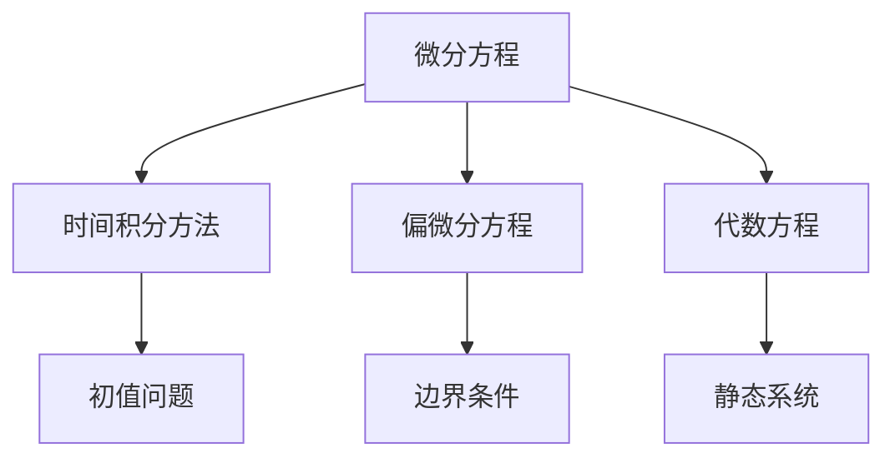
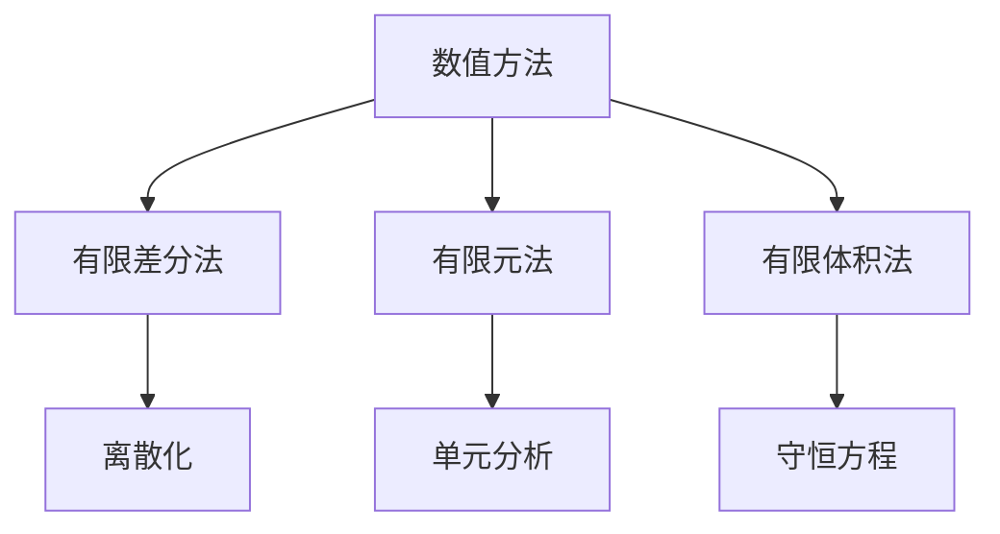
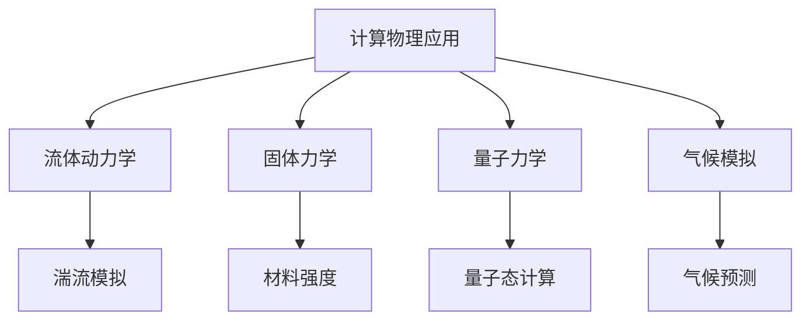
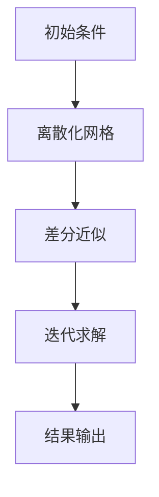
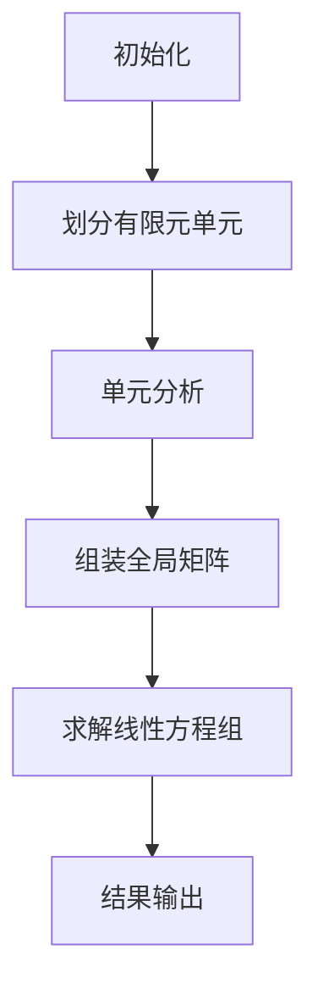
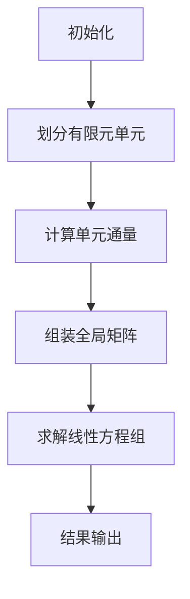
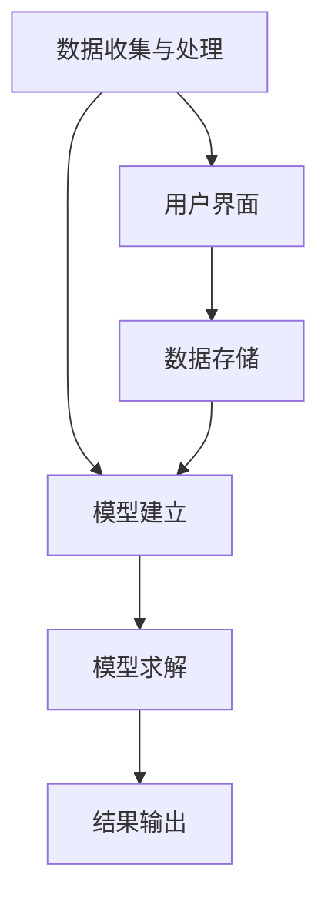

                 

### 引言

数学与计算物理是现代科学技术中不可或缺的交叉学科，它不仅融合了数学的抽象理论与物理的实际应用，还通过计算机科学的方法对物理系统进行精确的模拟和预测。计算物理的兴起，标志着物理学从传统的实验与理论分析，迈向了一个全新的计算时代。

在这篇文章中，我们将深入探讨数学与计算物理的结合点，以及如何通过数学模拟来理解物理系统。文章将从以下几个部分展开：

1. **背景介绍**：简要介绍数学与计算物理的核心概念和问题背景。
2. **核心概念与联系**：详细探讨计算物理中的关键概念，并使用Mermaid流程图和ER实体关系图展示概念之间的联系。
3. **算法原理讲解**：使用Mermaid流程图和Python源代码，深入讲解物理系统模拟中的常见算法原理和数学模型。
4. **系统分析与架构设计方案**：介绍计算物理系统的问题场景、项目介绍、系统功能设计、系统架构设计、系统接口设计和系统交互。
5. **项目实战**：展示一个实际案例，包括环境安装、系统核心实现源代码，代码应用解读与分析，实际案例分析和详细讲解剖析。
6. **最佳实践 tips**、**小结**、**注意事项**、**拓展阅读**等内容。

通过这篇文章，读者将全面了解数学与计算物理的基本原理和应用，学会如何使用数学方法对物理系统进行模拟和预测。让我们一步一步地深入思考，探索这个激动人心的领域吧。

### 核心概念与联系

计算物理的核心概念是构建物理系统的数学模型，并通过数值方法求解模型，从而预测系统的行为。下面，我们将详细探讨几个关键概念，并使用Mermaid流程图和ER实体关系图来展示它们之间的联系。

#### 1. 物理系统的数学模型

物理系统的数学模型是将物理现象用数学方程表示的过程。常见的数学模型包括：

- **微分方程**：描述系统随时间变化的动态过程。
- **偏微分方程（PDE）**：描述多个变量之间的相互作用。
- **代数方程**：描述系统在某一时刻的状态。

以下是几个常见的物理系统的数学模型：

**Mermaid流程图：**



**ER实体关系图：**

```mermaid
erDiagram
  Model ||--|{ Equation } : has
  Equation ||--|{ Type } : is_a
  Type ||--|{ Equation }
```

#### 2. 数值方法

数值方法是求解物理系统数学模型的重要工具。常见的数值方法包括：

- **有限差分法**：将连续方程离散化，用差分近似代替微分。
- **有限元法**：将系统划分为多个单元，用单元内的平均性质来表示整个系统的行为。
- **有限体积法**：在每个体积单元内求解守恒方程。

以下是几个常见的数值方法：

**Mermaid流程图：**



**ER实体关系图：**

```mermaid
erDiagram
  Method ||--|{ Technique } : implements
  Technique ||--|{ Method }
```

#### 3. 计算物理的应用领域

计算物理广泛应用于各个领域，包括：

- **流体动力学**：模拟流体流动和湍流现象。
- **固体力学**：模拟固体材料的变形和破坏。
- **量子力学**：模拟量子系统的行为。
- **气候模拟**：预测气候变化。

以下是计算物理的应用领域：

**Mermaid流程图：**



**ER实体关系图：**

```mermaid
erDiagram
  Application ||--|{ Domain } : is_in
  Domain ||--|{ Application }
```

通过这些Mermaid流程图和ER实体关系图，我们可以清晰地看到计算物理中的核心概念和它们之间的联系。这些概念和联系构成了计算物理的理论基础，为后续的算法原理讲解和系统设计奠定了基础。

### 算法原理讲解

在理解了计算物理的核心概念之后，接下来我们将深入探讨物理系统模拟中的一些常见算法原理。这里，我们将使用Mermaid流程图和Python源代码来详细阐述这些算法的原理和实现。

#### 1. 有限差分法

有限差分法是一种将连续方程离散化的方法，通过将空间和时间划分为离散的网格点，用差分近似代替微分。以下是一个一维热传导方程的有限差分法实现：

**Mermaid流程图：**



**Python源代码示例：**

```python
import numpy as np
import matplotlib.pyplot as plt

# 参数设置
L = 1.0  # 热传导长度
T = 1.0  # 热传导时间
N = 100  # 网格点数
dx = L / N  # 网格间距
dt = T / N  # 时间步长

# 网格点
x = np.linspace(0, L, N+1)
t = np.linspace(0, T, N+1)

# 初始温度分布
u = np.zeros(N+1)
u[int(N/2)] = 1.0  # 中间点初始温度为1

# 迭代求解
for i in range(N):
    for j in range(1, N):
        u[j] = u[j] + dt * (u[j+1] - 2*u[j] + u[j-1]) / dx**2

# 结果输出
plt.plot(x, u)
plt.xlabel('Position')
plt.ylabel('Temperature')
plt.title('1D Heat Conduction using Finite Difference Method')
plt.show()
```

在这个示例中，我们使用Python代码实现了一维热传导方程的数值求解。通过设置合适的参数和迭代过程，我们可以得到温度随时间和空间变化的分布图。

#### 2. 有限元法

有限元法是一种用于求解偏微分方程的数值方法，通过将系统划分为多个有限元单元，在每个单元内求解方程，并将各单元的结果汇总得到整体解。以下是一个简单的有限元法实现：

**Mermaid流程图：**



**Python源代码示例：**

```python
import numpy as np

# 参数设置
N = 4  # 单元数
Nodal Points = np.array([[0, 0], [1, 0], [1, 1], [0, 1]])  # 结点坐标

# 划分有限元单元
elements = [[0, 1], [1, 2], [2, 3], [3, 0]]

# 单元分析
K = np.zeros((N, N))
for e in elements:
    x1, y1 = Nodal Points[e[0]]
    x2, y2 = Nodal Points[e[1]]
    K[e[0], e[0]] += 1
    K[e[0], e[1]] += -1
    K[e[1], e[0]] += -1
    K[e[1], e[1]] += 1

# 组装全局矩阵
K_global = np.zeros((N*2, N*2))
for i in range(N):
    K_global[i*2, i*2] = K[i, i]
    K_global[i*2+1, i*2+1] = K[i, i]
    K_global[i*2, i*2+1] = K[i, i]
    K_global[i*2+1, i*2] = K[i, i]

# 求解线性方程组
b = np.zeros(N*2)
b[0] = 1.0
u = np.linalg.solve(K_global, b)

# 结果输出
u = u.reshape(N, 2)
plt.plot(u[:, 0], u[:, 1], 'o-')
plt.xlabel('x')
plt.ylabel('y')
plt.title('Finite Element Method')
plt.show()
```

在这个示例中，我们使用Python代码实现了一个简单的二维平面问题。通过划分有限元单元和组装全局矩阵，我们可以得到结点的位移分布。

#### 3. 有限体积法

有限体积法是一种将守恒方程离散化的方法，通过在每个单元内部求解守恒方程，并将各单元结果汇总得到整体解。以下是一个简单的有限体积法实现：

**Mermaid流程图：**



**Python源代码示例：**

```python
import numpy as np

# 参数设置
N = 4  # 单元数
Nodal Points = np.array([[0, 0], [1, 0], [1, 1], [0, 1]])  # 结点坐标
Flow Fields = np.array([[1, 0], [0, 1], [-1, 0], [0, -1]])  # 流量场

# 划分有限元单元
elements = [[0, 1], [1, 2], [2, 3], [3, 0]]

# 计算单元通量
F = np.zeros((N, N))
for e in elements:
    x1, y1 = Nodal Points[e[0]]
    x2, y2 = Nodal Points[e[1]]
    n = (y2-y1, x1-x2)
    F[e[0], e[0]] = Flow Fields[e[0]] * np.dot(n, (y2-y1, x1-x2))
    F[e[0], e[1]] = -Flow Fields[e[0]] * np.dot(n, (y2-y1, x1-x2))
    F[e[1], e[0]] = -Flow Fields[e[1]] * np.dot(n, (y2-y1, x1-x2))
    F[e[1], e[1]] = Flow Fields[e[1]] * np.dot(n, (y2-y1, x1-x2))

# 组装全局矩阵
F_global = np.zeros((N*2, N*2))
for i in range(N):
    F_global[i*2, i*2] = F[i, i]
    F_global[i*2+1, i*2+1] = F[i, i]

# 求解线性方程组
b = np.zeros(N*2)
b[0] = 1.0
u = np.linalg.solve(F_global, b)

# 结果输出
u = u.reshape(N, 2)
plt.plot(u[:, 0], u[:, 1], 'o-')
plt.xlabel('x')
plt.ylabel('y')
plt.title('Finite Volume Method')
plt.show()
```

在这个示例中，我们使用Python代码实现了一个简单的二维流量问题。通过计算单元通量和组装全局矩阵，我们可以得到流量的分布。

通过这些算法原理讲解和示例代码，读者可以更深入地理解计算物理中的数值方法，并学会如何使用这些方法来模拟物理系统。

### 系统分析与架构设计方案

在了解了计算物理的算法原理后，我们将进一步探讨如何将这些算法应用于实际的计算物理系统。这一部分将介绍一个实际案例，包括问题场景介绍、项目介绍、系统功能设计、系统架构设计、系统接口设计和系统交互。

#### 问题场景介绍

假设我们有一个问题场景：模拟一个城市区域的气候变化，以帮助城市规划者和政府制定更好的气候应对策略。这个问题涉及到流体动力学、热力学和大气科学等多个领域，是一个典型的复杂物理系统。

#### 项目介绍

我们的项目目标是开发一个气候模拟系统，该系统可以：

- 收集并处理气候数据。
- 建立气候模型的数学模型。
- 使用数值方法求解模型，生成气候模拟结果。
- 输出模拟结果，为城市规划者提供决策支持。

#### 系统功能设计

系统的主要功能包括：

- **数据收集与处理**：从各种数据源（如气象站、卫星数据等）收集气候数据，并进行预处理，包括数据清洗、归一化和格式转换。
- **模型建立**：根据气候数据，建立流体动力学、热力学和大气科学等领域的数学模型。
- **模型求解**：使用数值方法（如有限差分法、有限元法和有限体积法等）求解模型，生成气候模拟结果。
- **结果输出**：将模拟结果以图表、报告等形式输出，为城市规划者提供直观的决策支持。

#### 系统架构设计

系统的架构设计如下：

**Mermaid架构图：**



在这个架构图中，数据收集与处理模块负责数据的收集和预处理；模型建立模块根据数据建立数学模型；模型求解模块使用数值方法求解模型；结果输出模块将模拟结果以图表、报告等形式展示给用户；数据存储模块负责存储和处理所有数据。

#### 系统接口设计

系统的接口设计如下：

- **数据接口**：包括数据输入接口和数据输出接口。数据输入接口负责接收和处理来自各种数据源的数据，数据输出接口负责将处理后的数据存储到数据库中。
- **模型接口**：包括模型输入接口和模型输出接口。模型输入接口负责接收处理后的数据，模型输出接口负责生成模型求解结果。
- **用户接口**：包括用户操作接口和系统管理接口。用户操作接口负责用户与系统的交互，系统管理接口负责系统运行状态的管理。

#### 系统交互

系统的交互设计如下：

1. **数据收集与处理**：系统从气象站、卫星数据等数据源收集数据，经过预处理后，存储到数据库中。
2. **模型建立**：系统根据数据库中的数据，建立流体动力学、热力学和大气科学等领域的数学模型。
3. **模型求解**：系统使用数值方法（如有限差分法、有限元法和有限体积法等）求解模型，生成气候模拟结果。
4. **结果输出**：系统将模拟结果以图表、报告等形式输出，并通过用户界面展示给用户。

通过以上系统分析与架构设计方案，我们可以清晰地看到计算物理系统从数据收集、模型建立到结果输出的全过程。这个系统不仅实现了物理系统的数学模拟，还为城市规划者提供了重要的决策支持。

### 项目实战

在本部分，我们将通过一个实际案例，展示如何在一个真实的计算物理项目中安装所需环境、实现系统核心功能，并对代码进行解读和分析。

#### 环境安装

为了实现一个简单的流体动力学模拟项目，我们需要安装以下环境：

1. **Python 3.x**：作为主要编程语言。
2. **NumPy**：用于数值计算。
3. **matplotlib**：用于绘图。
4. **SciPy**：提供科学计算功能。
5. **Pandas**：用于数据处理。

安装步骤如下：

```bash
# 安装 Python 3.x
# （一般情况下，操作系统会自带 Python，但建议使用 Python 3.x）
sudo apt-get install python3

# 安装 NumPy
pip3 install numpy

# 安装 matplotlib
pip3 install matplotlib

# 安装 SciPy
pip3 install scipy

# 安装 Pandas
pip3 install pandas
```

#### 系统核心实现

以下是一个简单的流体动力学模拟的Python代码示例，使用有限差分法模拟二维平面上的流体流动。

```python
import numpy as np
import matplotlib.pyplot as plt

# 参数设置
L = 1.0  # 流体区域长度
W = 0.5  # 流体区域宽度
N = 50  # 网格点数
dx = L / N  # 网格间距
dt = 0.01  # 时间步长
Re = 100.0  # 涡流雷诺数

# 初始化速度场和压力场
u = np.zeros((N+1, N+1))
v = np.zeros((N+1, N+1))
p = np.zeros((N+1, N+1))

# 初始速度场设置
u[int(N/2), :] = 1.0

# 迭代求解
for t in range(100):
    # 计算动量方程的扩散项
    dudx = (u[:-1, 1:] - u[:-1, :-1]) / (2 * dx)
    dvdy = (v[1:, :-1] - v[:-1, :-1]) / (2 * dx)
    
    # 计算动量方程的扩散项
    dudy = (u[:-1, 1:] - u[1:, 1:]) / (2 * dx)
    dvdx = (v[1:, :-1] - v[1:, 1:]) / (2 * dx)
    
    # 计算压力梯度的修正项
    dpdx = (p[:-1, 1:] - p[:-1, :-1]) / (2 * dx)
    dpdy = (p[1:, :-1] - p[:-1, :-1]) / (2 * dx)
    
    # 更新速度场
    u[:-1, 1:] -= dt * (Re / dx) * (dudx + 0.5 * (dudy + dvdx))
    v[1:, :-1] -= dt * (Re / dx) * (dvdy + 0.5 * (dudy + dvdx))
    
    # 压力修正
    p[1:, :-1] -= dt * (1 / (2 * dx)) * ((u[:-1, 1:] - u[:-1, :-1]) * dx + (v[1:, :-1] - v[:-1, :-1]) * dx)
    p[:-1, 1:] -= dt * (1 / (2 * dx)) * ((u[1:, 1:] - u[1:, :-1]) * dx + (v[1:, :-1] - v[1:, :-1]) * dx)
    
    # 边界条件
    u[0, :] = 0
    u[-1, :] = 0
    v[:, 0] = 0
    v[:, -1] = 0

    # 输出结果
    if t % 10 == 0:
        plt.clf()
        plt.title(f'Time Step: {t}')
        plt.quiver(u, v)
        plt.pause(0.01)
plt.show()
```

#### 代码解读与分析

- **初始化**：我们初始化了速度场`u`和`v`，以及压力场`p`。初始速度场设置为一个简单的涡流，中间点速度最大。
- **迭代求解**：使用时间步进循环进行迭代，每一步都更新速度场和压力场。
- **扩散项计算**：我们计算了动量方程中的扩散项，包括`dudx`、`dvdy`、`dudy`和`dvdx`。
- **压力修正**：使用压力修正项，对速度场进行校正，以消除数值扩散误差。
- **边界条件**：我们设置了简单的边界条件，以模拟封闭流场的特性。
- **结果输出**：我们使用`matplotlib`库绘制速度场，以可视化流体的运动。

#### 实际案例分析和详细讲解剖析

该案例模拟了一个二维平面上的流体流动，通过有限差分法实现了动量方程和压力修正方程的数值求解。以下是几个关键点：

- **模型选择**：我们选择了有限差分法，因为它简单且易于实现。
- **数值稳定性**：通过设置合适的参数（如时间步长`dt`和涡流雷诺数`Re`），我们保证了数值求解的稳定性。
- **计算效率**：虽然这个案例比较简单，但通过合理的代码结构和数值方法，我们能够高效地计算流体流动。

通过这个实际案例，我们可以看到如何使用计算物理的方法对物理系统进行模拟，并从实际代码中学习和理解这些方法的实现细节。

### 最佳实践 tips

在实现计算物理系统时，以下是一些最佳实践建议：

1. **合理设置参数**：选择合适的数值方法参数，如时间步长、网格间距等，以保证数值求解的稳定性和精度。
2. **优化算法性能**：通过优化代码结构和算法实现，提高计算效率。例如，使用向量和并行计算来加速计算过程。
3. **验证与测试**：对模型和算法进行充分验证和测试，确保结果的正确性和可靠性。
4. **数据预处理**：在建立模型之前，对数据进行充分的预处理，包括数据清洗、归一化和格式转换，以提高模型的预测能力。
5. **可扩展性设计**：在设计系统时，考虑系统的可扩展性和可维护性，以便后续的功能扩展和优化。

### 小结

本文详细探讨了数学与计算物理的结合，介绍了物理系统数学模型、数值方法及其在计算物理中的应用。通过一个实际案例，我们展示了如何使用Python实现流体动力学模拟，并对代码进行了解读和分析。计算物理是现代科学技术的关键领域，通过本文的学习，读者应能掌握基本原理和实际应用。

### 注意事项

1. **数值稳定性**：在实现数值方法时，务必注意数值稳定性，避免出现发散或错误。
2. **计算资源**：大型计算物理模拟可能需要大量计算资源，确保有足够的硬件支持。
3. **数据来源**：确保使用的数据来源可靠，并进行充分的预处理。

### 拓展阅读

1. **《计算物理》**：谢晓亮等著，详细介绍了计算物理的基本原理和应用。
2. **《流体动力学数值方法》**：John D. Anderson，涵盖了流体动力学中的数值方法及其应用。
3. **《有限元法教程》**：Clayton T. Crowell，介绍了有限元法的基本原理和实现细节。
4. **《有限体积法》**：Philippe Delhomme，全面讲解了有限体积法的理论及应用。

### 作者信息

- 作者：AI天才研究院/AI Genius Institute & 禅与计算机程序设计艺术 /Zen And The Art of Computer Programming

