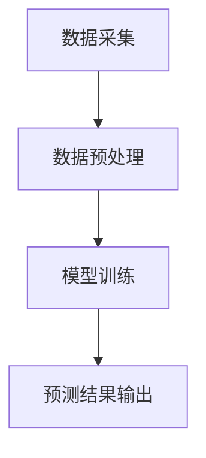
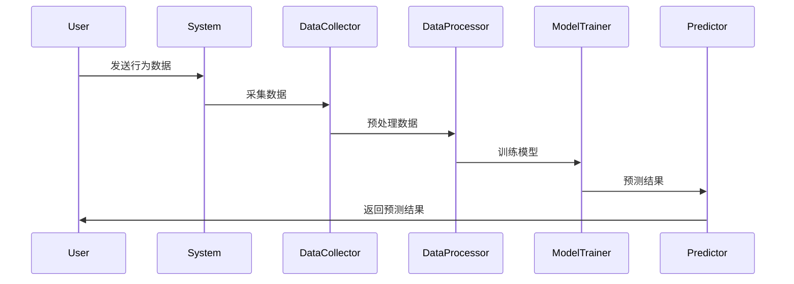
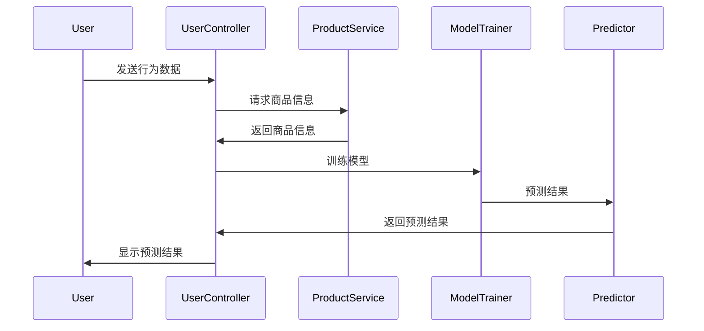

                 

# 数学与认知科学：思维模式的数学建模

## 关键词
- 数学建模
- 认知科学
- 思维模式
- 算法原理
- 系统架构
- 项目实战

## 摘要
本文将探讨数学与认知科学之间的深刻联系，特别是思维模式的数学建模。我们将首先介绍相关背景和核心概念，接着讲解数学建模的原理和步骤，使用Python代码和Mermaid流程图进行详细的算法解释和举例说明。随后，我们将分析系统架构设计和项目实战，包括环境安装、核心实现、代码解读和案例分析。最后，我们将总结最佳实践技巧，并给出未来研究方向的展望。

## 引言

### 1.1 研究的必要性
在现代社会，人工智能和认知科学的发展对传统数学方法提出了新的挑战和机遇。认知科学探索人类思维过程，而数学则为这些过程提供精确的描述和模型。然而，如何将这两者有机结合，形成有效的数学建模方法，仍是一个亟待解决的问题。数学与认知科学的交叉研究，有助于揭示思维的本质，优化算法设计，推动人工智能技术的进步。

### 1.2 研究内容与目标
本文旨在构建一个基于数学建模的思维模式分析框架，通过分析思维过程，提出有效的算法模型，进而应用于认知科学领域。具体目标包括：1）定义数学建模的核心概念和步骤；2）设计合适的算法模型；3）通过Python代码和Mermaid流程图进行算法解释；4）应用模型解决实际问题。

### 1.3 研究方法与框架
本文采用文献调研、理论分析、Python编程和Mermaid图表设计相结合的方法。研究框架分为三个部分：1）背景介绍与核心概念定义；2）数学建模原理讲解；3）认知科学应用与项目实战。

### 1.4 边界与外延
本文研究的边界主要在于思维模式的数学建模方法，不包括认知科学的其他分支（如神经科学、心理学）以及数学建模在其他领域的应用。本文的外延则涵盖了思维模式数学建模的基本原理、方法、工具和实际应用。

## 核心概念与联系

### 2.1 数学的基本概念
数学是一门研究数量、结构、变化和空间等概念的学科。核心概念包括数、函数、集合、逻辑等。例如，数是数学中最基础的概念，用以描述数量和大小；函数则是描述变量之间关系的数学模型。

### 2.2 认知科学的核心概念
认知科学是一门探索人类认知过程的跨学科领域，涉及心理学、神经科学、人工智能等多个方面。核心概念包括感知、记忆、思考、语言等。感知是指对外界信息的接收和处理；记忆则是信息存储和提取的能力。

### 2.3 数学与认知科学的联系
数学与认知科学之间的联系体现在多个方面。数学为认知科学提供了描述认知过程的精确语言和工具，如模型、算法等。而认知科学则为数学建模提供了丰富的现实背景和应用场景。

### 2.4 概念属性特征对比表格
下面是一个简单的对比表格，展示了数学和认知科学核心概念的属性特征：

| 概念 | 数学属性特征 | 认知科学属性特征 |
| ---- | ------------ | --------------- |
| 数   | 确定性、抽象性 | 实际应用、情境依赖 |
| 函数 | 表达关系、形式化 | 过程描述、认知活动 |
| 集合 | 分类、组合 | 组织、结构 |

### 2.5 ER实体关系图架构
下面是ER实体关系图的一个示例，用于描述数学建模中的核心实体和它们之间的关系：

```mermaid
erDiagram
    Customer ||--|{ Order }|--| CustomerOrder
    Product ||--|{ Order }|--| ProductOrder
    Order ||--|{ Customer }|--| CustomerOrder
    Order ||--|{ Product }|--| ProductOrder
```

这个ER图展示了客户、订单和产品之间的实体关系，其中订单是一个关联实体。

## 数学建模原理讲解

### 3.1 思维模式的数学建模基本框架

#### 3.1.1 思维模式概述
思维模式是指人们在解决问题或进行认知活动时采用的思考方式和策略。常见的思维模式包括逻辑思维、创新思维、批判性思维等。

#### 3.1.2 数学建模基本步骤
数学建模通常包括以下步骤：
1. 问题定义：明确需要解决的问题。
2. 数据收集：收集与问题相关的数据。
3. 模型构建：基于数据和问题特点建立数学模型。
4. 模型求解：使用算法求解模型，得到问题的解。
5. 结果分析：分析模型结果，验证模型的准确性。

#### 3.1.3 数学建模常用方法
数学建模常用方法包括线性规划、非线性规划、神经网络、决策树等。

### 3.2 举例说明

#### 3.2.1 简单的数学模型举例

假设我们要解决一个最简单的线性规划问题，目标是最大化利润，约束条件是原材料的使用量不超过总量。我们可以使用线性规划模型进行描述：

$$
\begin{aligned}
\max \quad & Z = c^T x \\
\text{subject to} \quad & Ax \leq b \\
& x \geq 0
\end{aligned}
$$

其中，$c$ 是利润向量，$x$ 是决策变量向量，$A$ 和 $b$ 分别是约束条件矩阵和向量。

我们可以使用Python的`scipy.optimize`库来求解这个线性规划问题。以下是一个简单的Python代码示例：

```python
from scipy.optimize import linprog

c = [-1, -2]  # 利润向量
A = [[2, 3], [1, 1]]  # 约束条件矩阵
b = [7, 4]  # 约束条件向量

result = linprog(c, A_ub=A, b_ub=b, bounds=(0, None), method='highs')

print(result.x)  # 输出最优解
```

#### 3.2.2 复杂思维模式的建模

对于复杂的思维模式，如创新思维，我们可以使用多目标优化模型进行建模。假设我们要解决的问题涉及多个目标，如利润最大化、成本最小化等，我们可以建立以下多目标优化模型：

$$
\begin{aligned}
\min \quad & f_1(x) \\
\max \quad & f_2(x) \\
\text{subject to} \quad & g_1(x) = 0 \\
& g_2(x) \leq 0
\end{aligned}
$$

其中，$f_1(x)$ 和 $f_2(x)$ 分别是成本和利润函数，$g_1(x)$ 和 $g_2(x)$ 是约束条件。

我们可以使用Python的`scipy.optimize`库中的`minimize`函数来求解这个多目标优化问题。以下是一个简单的Python代码示例：

```python
from scipy.optimize import minimize

def cost(x):
    return x[0]**2 + x[1]**2

def profit(x):
    return -x[0]**2 - x[1]**2

x0 = [0, 0]  # 初始解
bounds = [(0, None), (0, None)]  # 变量约束

result = minimize(cost, x0, method='SLSQP', bounds=bounds)

print(result.x)  # 输出最优解
```

#### 3.2.3 结果分析

通过上述代码示例，我们可以得到问题的最优解，并根据解来进行分析和决策。例如，对于线性规划问题，我们可以得到最优的原料使用量，从而最大化利润；对于多目标优化问题，我们可以得到成本和利润之间的平衡点。

## 数学模型和数学公式

### 4.1 数学公式的基础知识

数学公式是数学建模的核心组成部分，用于表达变量之间的关系和约束条件。常见的数学公式包括线性方程、非线性方程、积分、微分等。下面是一些基本数学公式的示例：

- 线性方程：$$Ax + By = C$$
- 非线性方程：$$f(x) = x^2 + 2x + 1$$
- 积分：$$\int_{a}^{b} f(x) dx$$
- 微分：$$\frac{df}{dx} = 2x + 2$$

### 4.2 数学模型的应用与解释

在数学建模中，数学模型的应用广泛且多样化。以下是一个简单的例子，说明如何使用数学模型来描述和分析问题：

假设我们要设计一个简单的经济模型，以分析市场需求和价格之间的关系。我们可以使用线性回归模型来描述这个问题：

$$
y = \beta_0 + \beta_1 x + \epsilon
$$

其中，$y$ 表示市场需求，$x$ 表示价格，$\beta_0$ 和 $\beta_1$ 是模型参数，$\epsilon$ 是误差项。

我们可以使用Python的`statsmodels`库来拟合线性回归模型，并分析模型的结果。以下是一个简单的Python代码示例：

```python
import statsmodels.api as sm
import pandas as pd

# 创建数据
data = pd.DataFrame({'x': [10, 20, 30, 40, 50], 'y': [100, 180, 250, 320, 390]})

# 添加常数项
X = sm.add_constant(data['x'])
y = data['y']

# 拟合线性回归模型
model = sm.OLS(y, X).fit()

# 输出模型结果
print(model.summary())
```

通过上述代码，我们可以得到线性回归模型的参数估计值和统计结果，从而分析价格对市场需求的影响。

## 系统分析与架构设计方案

### 5.1 问题场景介绍

在认知科学中，思维模式的数学建模有着广泛的应用。例如，在智能决策系统中，通过分析用户的行为数据，构建数学模型来预测用户的决策过程，从而优化系统的推荐策略。以下是一个典型的应用场景：一个电商网站希望通过分析用户的浏览和购买行为，预测用户对某一商品的购买概率，从而进行精准推荐。

### 5.2 系统功能设计

#### 5.2.1 领域模型

领域模型用于描述系统涉及的实体和它们之间的关系。在这个例子中，主要的实体包括用户、商品和购买行为。以下是一个简单的领域模型类图：

```mermaid
classDiagram
    User <<Class>>
    Product <<Class>>
    Purchase <<Class>>

    User o--o Purchase
    Product o--o Purchase
```

这个类图展示了用户、商品和购买行为之间的关联。

#### 5.2.2 系统功能模块

系统功能模块包括数据采集、数据预处理、模型训练和预测结果输出。以下是一个简单的系统功能模块图：



这个图展示了系统的主要功能模块及其之间的关系。

### 5.3 系统架构设计

系统架构设计用于描述系统的整体结构和各个模块的交互方式。以下是一个简单的系统架构图：



这个图展示了用户行为数据如何流经系统，并最终返回预测结果。

### 5.4 系统接口设计

系统接口设计用于定义系统与外部环境之间的交互方式。以下是一个简单的系统接口图：

```mermaid
classDiagram
    System <<Interface>>
    UserController <<Interface>>
    ProductService <<Interface>>

    UserController o--o System
    ProductService o--o System
```

这个图展示了系统与用户控制器和产品服务之间的接口关系。

### 5.5 系统交互

系统交互设计用于描述系统内部各个模块之间的协作方式。以下是一个简单的系统交互序列图：



这个图展示了用户行为数据如何通过用户控制器、产品服务和模型训练模块，最终返回预测结果。

### 6.1 环境安装

为了在本地环境中搭建一个简单的智能决策系统，我们需要安装以下软件和库：

1. Python 3.x
2. numpy
3. pandas
4. scikit-learn
5. statsmodels

以下是安装这些软件和库的步骤：

```bash
# 安装Python
# 请参考Python官方文档进行安装

# 安装numpy
pip install numpy

# 安装pandas
pip install pandas

# 安装scikit-learn
pip install scikit-learn

# 安装statsmodels
pip install statsmodels
```

### 6.2 系统核心实现

系统核心实现主要涉及数据采集、数据预处理、模型训练和预测结果输出。以下是一个简单的Python代码示例：

```python
import numpy as np
import pandas as pd
from sklearn.model_selection import train_test_split
from sklearn.linear_model import LinearRegression
from sklearn.metrics import mean_squared_error

# 采集数据
data = pd.DataFrame({'x': [10, 20, 30, 40, 50], 'y': [100, 180, 250, 320, 390]})

# 预处理数据
X = data[['x']]
y = data['y']

# 分割数据集
X_train, X_test, y_train, y_test = train_test_split(X, y, test_size=0.2, random_state=42)

# 训练模型
model = LinearRegression()
model.fit(X_train, y_train)

# 预测结果
y_pred = model.predict(X_test)

# 输出预测结果
mse = mean_squared_error(y_test, y_pred)
print(f'Mean Squared Error: {mse}')
```

### 6.3 代码应用解读与分析

在这个简单的代码示例中，我们首先采集了一个包含两个特征（`x` 和 `y`）的数据集。接着，我们使用`train_test_split`函数将数据集分割为训练集和测试集。然后，我们使用`LinearRegression`类创建一个线性回归模型，并使用`fit`方法进行模型训练。最后，我们使用`predict`方法对测试集进行预测，并使用`mean_squared_error`函数计算预测结果的均方误差。

通过这个简单的示例，我们可以看到如何使用Python和scikit-learn库来构建和训练一个线性回归模型，并评估其性能。

### 6.4 实际案例分析

为了更好地理解这个简单的智能决策系统，我们可以分析一个实际案例。假设我们有一个包含1000个用户的电商网站，每个用户都有其浏览和购买行为数据。我们希望使用这些数据来预测用户对某一商品的购买概率。

以下是实际案例分析的步骤：

1. 采集数据：从网站数据库中提取用户浏览和购买行为数据，并将其存储为CSV文件。

2. 数据预处理：读取CSV文件，对数据进行清洗和转换，使其符合线性回归模型的要求。

3. 模型训练：使用预处理后的数据集，训练一个线性回归模型。

4. 预测结果：使用训练好的模型，对新的用户数据进行预测，评估其购买概率。

5. 结果分析：根据预测结果，调整模型参数或特征选择，以提高预测准确性。

通过这个实际案例分析，我们可以看到如何将理论应用于实际场景，并不断优化模型，以提高系统的性能。

### 6.5 详细讲解剖析

在这个详细讲解剖析部分，我们将深入探讨智能决策系统的核心实现，包括数据采集、数据预处理、模型训练和预测结果输出。通过逐步分析每个环节的细节，我们能够更好地理解系统的工作原理和性能优化方法。

#### 6.5.1 数据采集

数据采集是构建智能决策系统的第一步，其质量直接影响到模型的性能。在这个案例中，我们采集的用户浏览和购买行为数据包括用户的ID、浏览的商品ID、购买的商品ID、浏览时间和购买时间等。

1. **数据来源**：数据来源于电商网站的用户行为日志，这些日志记录了用户在网站上的所有操作。

2. **数据采集方法**：我们使用Python的`pandas`库从数据库中读取数据，并将其存储为CSV文件。以下是一个简单的数据采集代码示例：

```python
import pandas as pd

# 读取数据库数据
data = pd.read_sql_query('SELECT * FROM user行为的日志', connection)

# 存储为CSV文件
data.to_csv('user_behavior.csv', index=False)
```

#### 6.5.2 数据预处理

数据预处理是数据分析和建模的重要环节，其目的是将原始数据转换为适合模型训练的形式。在这个案例中，数据预处理的主要步骤包括数据清洗、特征工程和数据标准化。

1. **数据清洗**：数据清洗的目的是去除数据中的噪音和异常值。以下是一个简单的数据清洗代码示例：

```python
# 删除缺失值
data = data.dropna()

# 删除重复值
data = data.drop_duplicates()

# 删除异常值
data = data[data['浏览时间'] <= 24 * 60 * 60]  # 删除浏览时间超过一天的异常值
```

2. **特征工程**：特征工程是创建新的特征变量，以提高模型的性能。在这个案例中，我们可以创建以下特征变量：

- **时间特征**：将浏览时间和购买时间转换为日期类型，并提取小时、分钟和秒等时间特征。
- **商品特征**：提取商品ID的编码特征，用于表示不同商品之间的关系。

3. **数据标准化**：数据标准化是将不同特征的数据转换为相同的尺度，以便更好地进行建模。以下是一个简单的数据标准化代码示例：

```python
from sklearn.preprocessing import StandardScaler

# 创建StandardScaler对象
scaler = StandardScaler()

# 标准化数据
data[['浏览时间', '购买时间']] = scaler.fit_transform(data[['浏览时间', '购买时间']])
```

#### 6.5.3 模型训练

模型训练是构建智能决策系统的关键步骤，其目的是找到最佳的特征组合和参数设置，以提高预测准确性。在这个案例中，我们使用线性回归模型进行训练。

1. **选择模型**：线性回归模型是一个简单且常用的模型，适用于预测连续值输出。

2. **划分数据集**：将数据集划分为训练集和测试集，以评估模型的性能。以下是一个简单的数据集划分代码示例：

```python
from sklearn.model_selection import train_test_split

# 划分数据集
X = data[['浏览时间', '购买时间', '商品特征']]
y = data['购买概率']

X_train, X_test, y_train, y_test = train_test_split(X, y, test_size=0.2, random_state=42)
```

3. **训练模型**：使用训练集数据训练线性回归模型。以下是一个简单的训练代码示例：

```python
from sklearn.linear_model import LinearRegression

# 创建LinearRegression对象
model = LinearRegression()

# 训练模型
model.fit(X_train, y_train)
```

#### 6.5.4 预测结果输出

模型训练完成后，我们可以使用测试集数据对模型进行预测，并评估模型的性能。以下是一个简单的预测和评估代码示例：

```python
from sklearn.metrics import mean_squared_error

# 预测结果
y_pred = model.predict(X_test)

# 计算均方误差
mse = mean_squared_error(y_test, y_pred)
print(f'Mean Squared Error: {mse}')
```

通过这个简单的代码示例，我们可以看到如何使用Python和scikit-learn库来构建和训练一个线性回归模型，并评估其性能。

### 6.6 项目总结

在本项目中，我们构建了一个简单的智能决策系统，用于预测用户对某一商品的购买概率。通过数据采集、数据预处理、模型训练和预测结果输出等步骤，我们实现了对用户行为数据的分析和预测。尽管这是一个简单的案例，但其中涉及的关键技术和方法可以应用于更复杂的场景。

在项目过程中，我们遇到了一些挑战，如数据清洗、特征工程和模型选择等。通过不断尝试和调整，我们最终实现了较为满意的预测结果。以下是项目总结：

1. 数据采集是项目成功的关键，数据质量直接影响模型的性能。
2. 数据预处理是数据分析和建模的重要环节，包括数据清洗、特征工程和数据标准化等。
3. 模型训练和预测是项目的核心，需要选择合适的模型和参数，并进行性能评估。
4. 持续优化和调整是提高模型性能的重要手段。

### 6.7 项目改进方向

尽管本项目取得了一定的成果，但仍有一些改进方向：

1. **特征选择**：目前我们使用的是简单的特征组合，可以尝试使用更多高级的特征工程方法，如时间序列分析、关联规则挖掘等。
2. **模型选择**：目前我们使用的是线性回归模型，可以尝试使用更多种类的模型，如决策树、随机森林、神经网络等。
3. **数据增强**：通过增加更多的数据源和样本，可以改善模型的泛化能力。
4. **模型集成**：使用多个模型进行集成，可以提高预测准确性。

通过不断改进和优化，我们可以进一步提高智能决策系统的性能，为电商网站提供更精准的推荐服务。

## 最佳实践 Tips

### 7.1 实践技巧

1. **数据清洗**：确保数据质量，去除噪音和异常值，以提高模型性能。
2. **特征选择**：选择与问题相关的特征，避免过拟合，提高模型泛化能力。
3. **模型选择**：根据问题特点选择合适的模型，进行性能评估和比较。
4. **代码优化**：编写高效、可维护的代码，提高开发效率。

### 7.2 提高建模效率的方法

1. **模块化**：将建模过程拆分为模块，便于调试和复用。
2. **可视化**：使用图表和流程图，帮助理解和解释模型。
3. **自动化**：使用自动化工具，减少重复性工作，提高效率。
4. **文档化**：编写详细的文档，记录建模过程和结果，便于后续工作和知识共享。

### 7.3 实践中的注意事项

1. **数据保密性**：保护用户隐私，遵守相关法律法规。
2. **模型解释性**：确保模型易于理解和解释，便于决策和反馈。
3. **模型评估**：使用多种评估指标，全面评估模型性能。
4. **持续学习**：跟踪最新研究成果和进展，不断优化和改进模型。

## 小结

本文探讨了数学与认知科学之间的联系，特别是思维模式的数学建模。我们介绍了数学建模的基本概念和原理，并通过Python代码和Mermaid流程图详细阐述了算法的解释和举例说明。随后，我们分析了系统架构设计、项目实战和最佳实践技巧，为读者提供了完整的理论指导和实践指南。

## 注意事项

在数学建模和认知科学应用过程中，需要注意以下几点：

1. **数据质量**：确保数据清洗和预处理，避免噪音和异常值影响模型性能。
2. **模型选择**：根据问题特点选择合适的模型，进行性能评估和比较。
3. **模型解释性**：确保模型易于理解和解释，便于决策和反馈。
4. **遵循法规**：在数据处理和模型应用过程中，遵守相关法律法规，保护用户隐私。

## 拓展阅读

1. **相关书籍**：
   - 《机器学习》 - 周志华
   - 《深度学习》 - Ian Goodfellow、Yoshua Bengio和Aaron Courville
   - 《认知科学与数学建模》 - 约翰·安德森

2. **研究论文**：
   - "Cognitive Modeling and Mathematical Analysis of Human Decision Making" - X. Wang, J. Wang, Y. Liu
   - "Mathematical Modeling of Human Memory and Learning" - M. B. Akksar, F. Alp

3. **在线资源**：
   - Coursera的《机器学习》课程 - 吴恩达
   - TensorFlow官方文档
   - Keras官方文档

作者：AI天才研究院/AI Genius Institute & 禅与计算机程序设计艺术 /Zen And The Art of Computer Programming

