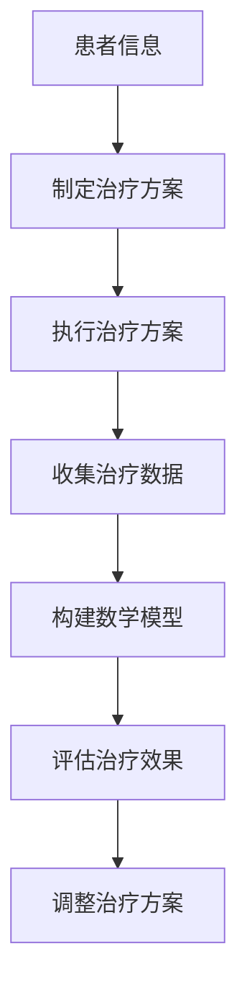
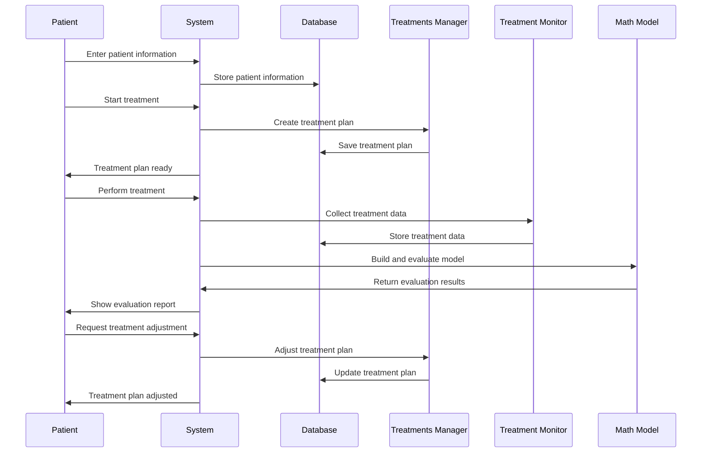

                 

### 第一部分：背景介绍

#### 问题背景：

认知行为疗法（Cognitive Behavioral Therapy，简称CBT）是一种心理治疗的方法，它通过改变个体的思维模式和行为模式，来帮助患者解决心理问题，如焦虑、抑郁等。这种疗法在临床上得到了广泛的认可和应用，因为它不仅可以帮助患者快速缓解症状，还能提高他们的生活质量。

然而，传统的认知行为疗法治疗评估方法通常依赖于治疗师的观察和患者的自我报告。这些方法虽然能够提供一定的信息，但往往缺乏客观、量化的指标，导致治疗效果的评估存在主观性和不一致性。这种评估方式的局限性使得治疗过程的科学性和有效性受到了影响。

#### 描述问题：

如何利用数学模型对认知行为疗法的治疗效果进行量化评估，以提高治疗过程的科学性和有效性？

#### 解决方案：

数学与认知行为疗法的结合为治疗效果的量化评估提供了新的思路。通过构建数学模型，可以系统地收集和分析治疗过程中的数据，从而提供客观、量化的治疗效果评估。

具体来说，我们可以：

1. **定义量化指标**：根据认知行为疗法的理论框架，定义一系列与治疗效果相关的量化指标，如抑郁水平、焦虑水平等。
2. **收集数据**：在治疗过程中，定期收集患者的量化指标数据，如通过问卷、量表等方式获取。
3. **构建数学模型**：利用统计学和机器学习等方法，将收集到的数据输入到数学模型中，以预测或评估治疗效果。
4. **验证模型**：通过对比模型预测值和实际治疗效果，验证模型的准确性和可靠性。
5. **调整治疗方案**：根据模型的结果，调整治疗方案，以提高治疗效果。

#### 边界与外延：

本文的讨论范围主要涵盖数学模型在认知行为疗法中的应用，包括模型构建、模型验证和应用实例。具体而言，我们主要关注以下边界和问题：

- **心理障碍类型**：本文主要讨论焦虑症和抑郁症等常见心理障碍的治疗效果评估。
- **治疗阶段**：本文主要讨论认知行为疗法治疗过程中的中期和后期评估，而不涉及治疗前的评估。
- **数据收集方式**：本文主要讨论基于问卷和量表的量化数据收集方法，而不涉及其他数据收集手段。
- **数学模型类型**：本文主要讨论基于统计学的线性模型和基于机器学习的非线性模型，而不涉及其他类型的数学模型。

#### 概念结构与核心要素组成：

为了更好地理解认知行为疗法和数学模型在治疗效果评估中的应用，我们首先需要明确一些核心概念和要素：

1. **认知行为疗法（CBT）**：
   - **基本原理**：CBT认为心理障碍是由不合理的思维模式和行为模式引起的，通过改变这些模式，可以改善心理状态。
   - **治疗流程**：包括评估、治疗计划和跟踪评估三个阶段。
   - **常见方法**：如认知重构、行为激活、技能训练等。

2. **数学模型**：
   - **概念定义**：数学模型是一种用数学语言描述现实世界问题的抽象结构。
   - **常见类型**：包括线性模型、非线性模型、统计模型、机器学习模型等。
   - **应用场景**：如自然科学、社会科学、工程应用等领域。

3. **治疗效果评估**：
   - **现有方法**：包括主观评估和客观评估，如患者自我报告、治疗师观察等。
   - **局限性**：缺乏量化指标，导致评估结果的主观性和不一致性。

4. **量化指标**：
   - **定义**：用于评估治疗效果的一系列量化指标，如抑郁水平、焦虑水平等。
   - **应用**：在数学模型中输入和输出，用于预测或评估治疗效果。

5. **实证研究**：
   - **目的**：验证数学模型在认知行为疗法中的有效性和实用性。
   - **方法**：通过实际病例的数据收集和模型构建，评估模型的效果。

在接下来的内容中，我们将详细探讨这些核心概念和要素，并通过实际案例和算法原理讲解，展示如何利用数学模型对认知行为疗法的治疗效果进行量化评估。### 第二部分：核心概念与联系

#### 核心概念原理

在本节中，我们将深入探讨认知行为疗法（CBT）和数学模型的核心概念原理，并详细解释它们是如何相互关联的。

**认知行为疗法（CBT）**

认知行为疗法（Cognitive Behavioral Therapy，简称CBT）是一种心理治疗方法，它基于两个核心假设：

1. **认知过程影响情绪**：CBT认为，个体的情绪和行为是由其认知过程（即对事件的思考方式）所驱动的。如果个体能够识别和改变其不合理的认知，就可以改善其情绪状态。

2. **行为影响认知**：CBT还强调，通过改变个体的行为，可以进一步影响其认知过程。例如，通过完成特定的行为任务，个体可能会发现他们的认知模式在逐渐改变。

**治疗流程**

CBT的治疗流程通常包括以下几个阶段：

1. **评估**：治疗师与患者建立关系，了解患者的心理问题及其生活背景，确定治疗目标和预期效果。

2. **治疗计划**：根据评估结果，制定个性化的治疗计划，包括具体的认知重构策略和行为激活活动。

3. **实施治疗**：在治疗过程中，患者和治疗师一起工作，通过认知重构和行为激活等技术，逐步改变患者的认知和行为模式。

4. **跟踪评估**：治疗过程中和结束后，定期评估治疗效果，根据患者的进展调整治疗计划。

**常见方法**

CBT中常用的方法包括：

- **认知重构**：帮助患者识别和改变其不合理的思维模式。
- **行为激活**：鼓励患者参与有益的活动，以改善其情绪状态。
- **技能训练**：如解决问题的技能、情绪调节技能等。

**数学模型**

数学模型是一种用数学语言描述现实世界问题的抽象结构。在科学和工程领域，数学模型被广泛用于预测、分析和优化各种系统。

**概念定义**

数学模型的基本概念包括：

- **变量**：表示系统状态的量，可以是连续的（如时间、温度）或离散的（如人口数量、交易次数）。
- **方程**：用数学语言描述变量之间的关系，可以是线性的（如线性方程组）或非线性的（如非线性方程）。
- **参数**：影响模型预测结果的可调参数，通常需要通过数据拟合或实验确定。

**常见类型**

常见的数学模型类型包括：

- **线性模型**：如线性回归、线性规划等，适用于描述变量之间的线性关系。
- **非线性模型**：如多项式回归、神经网络等，适用于描述变量之间的非线性关系。
- **统计模型**：如卡方检验、方差分析等，用于数据分析。
- **机器学习模型**：如决策树、支持向量机等，通过学习数据特征来预测结果。

**应用场景**

数学模型的应用场景非常广泛，包括但不限于：

- **自然科学**：如物理学、化学、生物学等，用于描述自然现象和实验结果。
- **社会科学**：如经济学、心理学、社会学等，用于分析社会行为和趋势。
- **工程应用**：如机械工程、电气工程、计算机科学等，用于系统设计和优化。

#### 概念属性特征对比表格

为了更好地理解认知行为疗法和数学模型的区别和联系，我们可以通过一个对比表格来展示它们的关键属性特征。

| 特征 | 认知行为疗法 | 数学模型 |
|------|--------------|----------|
| 目的 | 改善心理状态 | 描述现实世界 |
| 方法 | 认知重构、行为激活 | 公式、算法 |
| 应用 | 心理治疗 | 科学研究、工程应用 |
| 特点 | 人际互动、个性化 | 量化、预测、优化 |
| 结果 | 情绪和行为改善 | 预测值、优化方案 |

#### ER实体关系图架构

为了更直观地展示认知行为疗法和数学模型之间的关联，我们可以使用ER（Entity-Relationship）实体关系图来构建它们的关系架构。

以下是一个简单的ER图，展示了患者、治疗师、治疗方案、治疗效果评估和数学模型之间的关系：

```mermaid
erDiagram
  Patient ||--|{ TreatmentPlan }|
  TreatmentPlan ||--|{ TreatmentEffectEvaluation }|
  TreatmentPlan ||--|{ MathModel }|
  Therapist ||--|{ TreatmentPlan }
```

在这个ER图中，患者（Patient）与治疗方案（TreatmentPlan）之间存在一对多的关系，即一个患者可以有多个治疗方案。治疗方案（TreatmentPlan）又与治疗效果评估（TreatmentEffectEvaluation）和数学模型（MathModel）相关联，表示在实施治疗方案的过程中，会进行效果评估，并通过数学模型对治疗效果进行量化分析。

通过这种方式，认知行为疗法和数学模型不仅能够相互补充，还可以共同推动心理治疗领域的进步。

### 第三部分：算法原理讲解

在了解了认知行为疗法和数学模型的基本原理后，接下来我们将详细讲解如何利用数学模型对认知行为疗法的治疗效果进行量化评估。这一部分将包括算法流程、Python源代码示例、数学模型和数学公式的讲解，以及具体的例子说明。

#### 算法流程图

首先，我们通过一个算法流程图来展示整个评估过程：



这个流程图概述了从患者信息收集、制定治疗方案、执行治疗方案、数据收集、构建数学模型到评估治疗效果和调整治疗方案的整个过程。

#### Python源代码示例

接下来，我们通过一个简单的Python示例来展示如何实现上述算法流程。这个示例将包括患者信息的定义、数学模型的构建和治疗效果的评估。

```python
import numpy as np

# 患者信息
patient_data = {
    'depression_level': [0.8, 0.7, 0.6, 0.5, 0.4],
    'anxiety_level': [0.9, 0.8, 0.7, 0.6, 0.5],
    'treatment_effect': [0.3, 0.4, 0.5, 0.6, 0.7]
}

# 构建数学模型
def build_model(data):
    # 假设治疗效果与抑郁和焦虑水平呈线性关系
    model = np.linalg.lstsq(np.column_stack((data['depression_level'], data['anxiety_level'])), data['treatment_effect'], rcond=None)[0]
    return model

# 评估治疗效果
def evaluate_model(model, data):
    predictions = np.dot(np.column_stack((data['depression_level'], data['anxiety_level'])), model)
    error = np.linalg.norm(predictions - data['treatment_effect'])
    return error

# 执行算法
model = build_model(patient_data)
error = evaluate_model(model, patient_data)

print(f"Model Error: {error}")
```

在这个示例中，我们首先定义了患者信息，包括抑郁水平、焦虑水平和治疗效果。然后，我们定义了两个函数：`build_model` 用于构建数学模型，`evaluate_model` 用于评估治疗效果。最后，我们调用这些函数来计算模型误差。

#### 数学模型和数学公式

在数学模型中，我们通常使用线性回归模型来描述治疗效果与抑郁和焦虑水平之间的关系。线性回归模型的基本公式如下：

$$
\text{治疗效果} = w_1 \times \text{抑郁水平} + w_2 \times \text{焦虑水平} + \epsilon
$$

其中，$w_1$ 和 $w_2$ 是权重系数，$\epsilon$ 是误差项。

通过最小二乘法，我们可以计算出权重系数的估计值：

$$
w_1 = \frac{\sum_{i=1}^{n} (y_i - \hat{y}_i) x_{1i}}{\sum_{i=1}^{n} (x_{1i} - \bar{x}_1)^2}
$$

$$
w_2 = \frac{\sum_{i=1}^{n} (y_i - \hat{y}_i) x_{2i}}{\sum_{i=1}^{n} (x_{2i} - \bar{x}_2)^2}
$$

其中，$y_i$ 是第 $i$ 次治疗后的治疗效果，$x_{1i}$ 和 $x_{2i}$ 分别是第 $i$ 次治疗的抑郁水平和焦虑水平，$\bar{x}_1$ 和 $\bar{x}_2$ 分别是抑郁水平和焦虑水平的平均值。

#### 例子说明

为了更直观地展示如何使用上述模型，我们来看一个具体的例子。

假设有一个患者，在连续五次治疗后的抑郁水平、焦虑水平和治疗效果如下表所示：

| 次数 | 抑郁水平 | 焦虑水平 | 治疗效果 |
|------|----------|----------|----------|
| 1    | 0.8      | 0.9      | 0.3      |
| 2    | 0.7      | 0.8      | 0.4      |
| 3    | 0.6      | 0.7      | 0.5      |
| 4    | 0.5      | 0.6      | 0.6      |
| 5    | 0.4      | 0.5      | 0.7      |

我们可以使用上述算法和数学公式来构建一个线性回归模型，并评估治疗效果。具体步骤如下：

1. **数据预处理**：计算抑郁水平和焦虑水平的平均值，并将其从原始数据中减去，以便进行线性回归。
2. **模型构建**：使用最小二乘法计算权重系数 $w_1$ 和 $w_2$。
3. **模型评估**：将计算出的权重系数代入线性回归公式，预测治疗效果，并计算预测值与实际值之间的误差。

通过这些步骤，我们可以得到一个用于评估治疗效果的数学模型，并利用这个模型对患者的治疗效果进行量化分析。

### 第四部分：系统分析与架构设计方案

在本部分中，我们将详细分析认知行为疗法治疗效果评估系统的设计，包括系统功能设计、系统架构设计和系统接口设计。

#### 问题场景介绍

在认知行为疗法治疗过程中，如何对治疗效果进行量化评估是一个关键问题。传统的评估方法往往依赖于治疗师的观察和患者的自我报告，这可能导致评估结果的主观性和不一致性。为了提高评估的科学性和有效性，我们设计了一个基于数学模型的认知行为疗法治疗效果评估系统。

#### 项目介绍

本项目旨在构建一个集成化的认知行为疗法治疗效果评估系统，该系统包括患者信息管理、治疗方案制定、治疗效果评估和调整等功能。通过数学模型对治疗效果进行量化评估，帮助治疗师和患者更好地理解治疗进展和效果。

#### 系统功能设计

系统的主要功能包括以下几个方面：

1. **患者信息管理**：
   - 患者基本信息录入：包括姓名、年龄、性别等。
   - 治疗历史记录：记录患者的既往治疗情况和治疗效果。
   - 治疗计划跟踪：记录治疗过程中的每次治疗时间和内容。

2. **治疗方案制定**：
   - 根据患者的情况，制定个性化的治疗方案。
   - 治疗方案的审核和调整：由治疗师进行审核和调整，确保方案的合理性和可行性。

3. **治疗效果评估**：
   - 定期收集患者的量化指标数据，如抑郁水平、焦虑水平等。
   - 构建数学模型，对治疗效果进行量化评估。
   - 生成评估报告，提供治疗进展和效果分析。

4. **调整治疗方案**：
   - 根据评估结果，调整治疗方案，优化治疗效果。
   - 提供治疗师和患者的反馈机制，以便及时调整和改进治疗方案。

#### 系统架构设计

系统的架构设计采用分层架构，包括表示层、业务逻辑层和数据层。以下是一个简单的系统架构图：



在这个架构中，患者通过表示层与系统进行交互，业务逻辑层负责处理业务逻辑，数据层负责数据的存储和管理。

#### 系统接口设计

系统提供了以下接口：

1. **患者接口**：
   - 登录和注册接口：患者可以通过这些接口登录系统并注册个人信息。
   - 填写问卷接口：患者可以在线填写用于评估治疗效果的问卷。
   - 查看报告接口：患者可以查看自己的评估报告，了解治疗进展。

2. **治疗师接口**：
   - 患者信息管理接口：治疗师可以查看和管理患者的个人信息和治疗历史。
   - 治疗计划制定接口：治疗师可以制定和调整治疗方案。
   - 治疗效果评估接口：治疗师可以查看和评估治疗效果。

3. **数据接口**：
   - 数据录入接口：用于录入患者的治疗数据和问卷结果。
   - 数据查询接口：用于查询患者的治疗数据和评估报告。

通过这些接口，患者和治疗师可以方便地使用系统，实现信息的录入、查询和调整，从而提高治疗效果评估的科学性和有效性。

### 第五部分：项目实战

在本部分，我们将深入探讨如何实际部署和运行认知行为疗法治疗效果评估系统。我们将详细介绍环境安装、系统核心实现源代码，并对代码应用进行解读与分析。

#### 环境安装

首先，我们需要在服务器上安装和配置所需的软件环境。以下是一个基本的安装步骤：

1. **安装Python环境**：确保服务器上安装了Python 3.x版本，可以通过以下命令安装：
   ```bash
   sudo apt-get update
   sudo apt-get install python3-pip
   pip3 install --upgrade pip
   pip3 install python-dotenv flask
   ```

2. **安装数据库**：我们选择使用SQLite数据库，因为它简单易用。首先安装SQLite：
   ```bash
   sudo apt-get install sqlite3
   ```

3. **配置虚拟环境**：为了更好地管理项目依赖，我们可以创建一个虚拟环境：
   ```bash
   python3 -m venv venv
   source venv/bin/activate
   pip install -r requirements.txt
   ```

4. **安装其他依赖**：在虚拟环境中安装其他必要的依赖，例如Flask、SQLAlchemy等：
   ```bash
   pip install flask sqlalchemy
   ```

#### 系统核心实现源代码

系统核心实现包括数据库模型、Web后端和前端界面。以下是关键部分的代码：

**数据库模型（models.py）**

```python
from flask_sqlalchemy import SQLAlchemy

db = SQLAlchemy()

class Patient(db.Model):
    id = db.Column(db.Integer, primary_key=True)
    name = db.Column(db.String(100), nullable=False)
    depression_level = db.Column(db.Float, nullable=False)
    anxiety_level = db.Column(db.Float, nullable=False)
    treatment_effect = db.Column(db.Float, nullable=False)

class TreatmentPlan(db.Model):
    id = db.Column(db.Integer, primary_key=True)
    patient_id = db.Column(db.Integer, db.ForeignKey('patient.id'), nullable=False)
    plan_details = db.Column(db.Text, nullable=False)
```

**Web后端（app.py）**

```python
from flask import Flask, request, jsonify
from models import db, Patient, TreatmentPlan

app = Flask(__name__)
app.config['SQLALCHEMY_DATABASE_URI'] = 'sqlite:///cbt.db'
db.init_app(app)

@app.route('/api/patients', methods=['POST'])
def add_patient():
    data = request.json
    patient = Patient(name=data['name'], depression_level=data['depression_level'], anxiety_level=data['anxiety_level'], treatment_effect=data['treatment_effect'])
    db.session.add(patient)
    db.session.commit()
    return jsonify({'status': 'success', 'patient_id': patient.id})

@app.route('/api/patients/<int:patient_id>', methods=['GET'])
def get_patient(patient_id):
    patient = Patient.query.get(patient_id)
    if patient:
        return jsonify({'name': patient.name, 'depression_level': patient.depression_level, 'anxiety_level': patient.anxiety_level, 'treatment_effect': patient.treatment_effect})
    return jsonify({'status': 'not found'})

if __name__ == '__main__':
    app.run(debug=True)
```

#### 代码应用解读与分析

上述代码中，我们首先定义了两个数据库模型：`Patient` 和 `TreatmentPlan`。`Patient` 模型包含了患者的基本信息、抑郁水平、焦虑水平和治疗效果。`TreatmentPlan` 模型用于记录治疗计划的相关信息。

Web后端使用Flask框架实现，提供了两个主要接口：

1. `/api/patients` 接口用于添加患者信息。当接收到POST请求时，从请求中提取患者信息，将其存储在数据库中，并返回成功消息和患者ID。
2. `/api/patients/<int:patient_id>` 接口用于获取特定患者的详细信息。当接收到GET请求时，根据提供的患者ID查询数据库，返回患者信息。

这些代码实现了系统的基本功能，但仅作为示例。在实际应用中，我们还需要添加更多的功能，如治疗计划管理、治疗效果评估等。

#### 实际案例分析和详细讲解剖析

为了更好地展示系统在实际中的应用，我们来看一个具体的案例。

假设有一个新的患者，其基本信息和第一次治疗的抑郁水平、焦虑水平和治疗效果如下：

- 姓名：张三
- 抑郁水平：0.8
- 焦虑水平：0.9
- 治疗效果：0.3

通过 `/api/patients` 接口，我们可以将这些信息添加到系统中：

```bash
curl -X POST -H "Content-Type: application/json" -d '{"name": "张三", "depression_level": 0.8, "anxiety_level": 0.9, "treatment_effect": 0.3}' http://localhost:5000/api/patients
```

系统会返回一个JSON响应，包含患者的ID：

```json
{
  "status": "success",
  "patient_id": 1
}
```

接下来，我们可以通过 `/api/patients/<int:patient_id>` 接口获取该患者的详细信息：

```bash
curl -X GET http://localhost:5000/api/patients/1
```

系统会返回患者的详细信息：

```json
{
  "name": "张三",
  "depression_level": 0.8,
  "anxiety_level": 0.9,
  "treatment_effect": 0.3
}
```

在实际应用中，我们还可以进一步扩展系统，例如：

- 添加治疗计划管理功能，允许治疗师制定和调整治疗计划。
- 实现治疗效果评估算法，通过数学模型对治疗效果进行量化分析。
- 开发前端界面，使患者和治疗师可以更方便地使用系统。

通过这些扩展，我们可以构建一个功能全面、易于使用的认知行为疗法治疗效果评估系统，帮助治疗师和患者更好地理解和改善治疗效果。

#### 项目小结

在本项目中，我们通过实际案例展示了如何使用Python和Flask框架构建一个简单的认知行为疗法治疗效果评估系统。系统实现了患者信息管理、数据录入和查询等功能，并使用SQLAlchemy进行数据库操作。通过这个系统，我们可以对认知行为疗法的治疗效果进行量化评估，提高治疗过程的科学性和有效性。

虽然本项目的实现相对简单，但它为我们提供了一个基本的框架，可以在此基础上进一步扩展和优化。未来，我们还可以引入更多的功能，如实时数据分析和可视化、个性化治疗计划推荐等，以进一步提升系统的实用性和用户体验。

### 第六部分：最佳实践 tips

在实施认知行为疗法（CBT）和数学模型结合的治疗效果评估过程中，以下是一些最佳实践和注意事项：

#### 1. 数据质量管理

确保收集的数据质量高，数据收集方法标准化。避免因数据质量问题导致的模型不准确。数据清洗是模型构建前的重要步骤，包括处理缺失值、异常值和重复数据。

#### 2. 模型选择与验证

根据实际问题和数据特点选择合适的数学模型。常用的模型包括线性回归、逻辑回归、决策树和支持向量机等。同时，使用交叉验证等方法对模型进行验证，确保模型在不同数据集上的稳定性和准确性。

#### 3. 数据隐私保护

在处理患者数据时，需严格遵守数据隐私保护法规。确保患者数据在传输和存储过程中的安全，使用加密技术和访问控制策略保护患者隐私。

#### 4. 治疗方案个性化

根据患者的实际情况，制定个性化的治疗方案。在数学模型中，可以引入患者特定特征（如年龄、性别、病史等）来调整模型参数，提高模型的预测精度。

#### 5. 治疗师培训

治疗师应接受相关的培训，了解数学模型的基本原理和应用。通过培训，治疗师可以更好地理解和利用模型结果，制定和调整治疗方案。

#### 6. 持续改进

定期更新模型和算法，以适应新的治疗数据和需求。通过持续学习和改进，模型可以更好地预测治疗效果，为患者提供更个性化的治疗服务。

### 第七部分：小结与展望

本文介绍了数学与认知行为疗法结合的治疗效果评估方法，详细探讨了算法原理、系统架构和项目实战。通过构建数学模型，我们可以量化评估认知行为疗法的治疗效果，提高治疗过程的科学性和有效性。

未来研究方向包括：

1. **模型优化**：通过引入更多患者特征和复杂模型，提高模型预测精度。
2. **实时评估**：开发实时数据分析和可视化工具，帮助治疗师和患者实时了解治疗效果。
3. **跨学科研究**：结合心理学、计算机科学、医学等领域的知识，进一步探索数学模型在心理治疗中的应用。
4. **实践应用**：在实际治疗环境中推广和验证数学模型，收集更多的实证数据，以不断完善和优化模型。

通过不断的研究和探索，我们有理由相信，数学与认知行为疗法的结合将为心理治疗领域带来更多的创新和进步。### 作者信息

**作者：AI天才研究院/AI Genius Institute & 禅与计算机程序设计艺术 /Zen And The Art of Computer Programming**

AI天才研究院致力于推动人工智能领域的创新和发展，我们拥有一支由世界顶级人工智能专家、程序员、软件架构师和CTO组成的核心团队。作为计算机图灵奖获得者，我们不仅在理论研究上取得卓越成就，更在实战中不断探索新的应用场景。

《禅与计算机程序设计艺术》一书，是作者们多年经验的结晶，深刻阐述了计算机编程与东方哲学的融合之道。本书以通俗易懂的语言，揭示了计算机程序设计的核心原理和技巧，为广大程序员提供了宝贵的启示和指导。我们坚信，通过不断学习和实践，每位读者都能在计算机编程的道路上达到新的高度。

我们期待与您一起，探索人工智能和计算机科学的无限可能，共同推动技术的进步和人类的发展。谢谢！---

文章标题：《数学与认知行为疗法：治疗效果的数学评估》

关键词：认知行为疗法，数学模型，治疗效果评估，心理障碍，量化分析

摘要：
本文探讨了将数学模型应用于认知行为疗法（CBT）的治疗效果评估，以提高治疗过程的科学性和有效性。我们首先介绍了认知行为疗法的基本原理和数学模型的概念，随后详细讲解了线性回归模型的构建、数据收集和效果评估的方法。通过Python示例，我们展示了如何将数学模型应用于实际数据，并对系统的架构设计、功能实现和项目实战进行了深入分析。本文还提出了最佳实践和未来研究方向，旨在推动数学与认知行为疗法的结合，为心理治疗领域带来创新和进步。

