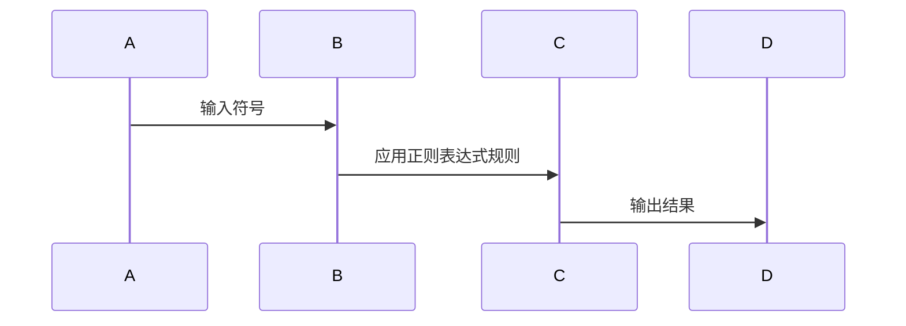
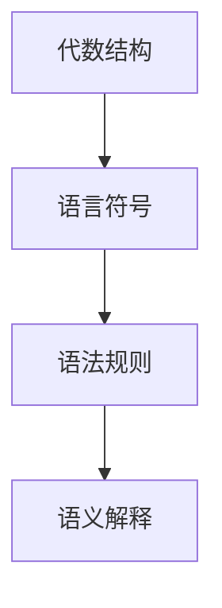
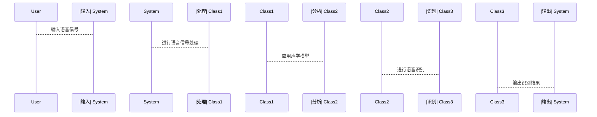
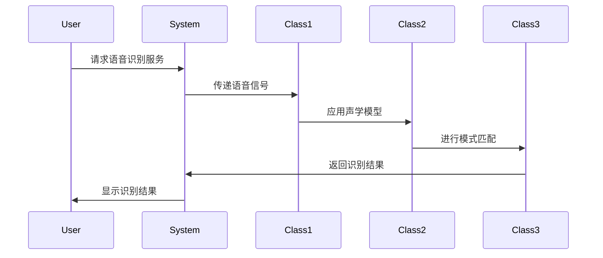
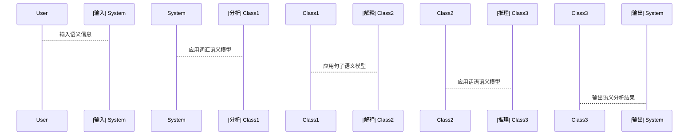
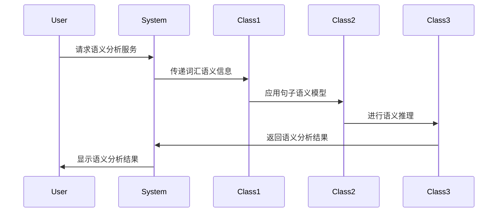
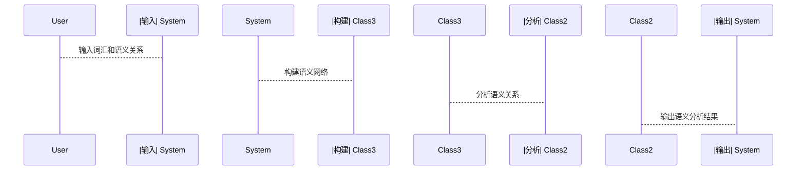
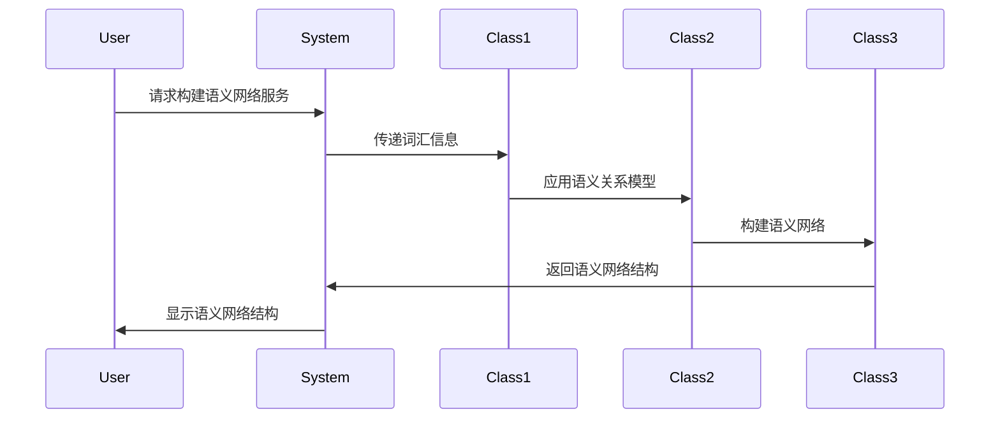

                 

### 数学与语言学：语言结构的数学分析

---

## **关键词**：
- 数学与语言学的交叉
- 形式语言理论
- 代数与语言学
- 语音学
- 语义学

## **摘要**：
本文将深入探讨数学与语言学之间的交叉领域，分析语言结构的数学分析方法。我们将从数学与语言学的交汇背景出发，逐步介绍形式语言理论、代数与语言学、数学模型在语音学和语义学中的应用，并通过实际案例进行分析和讲解。文章旨在揭示数学工具在语言学研究中的重要性和实际应用，为读者提供系统而全面的数学与语言学分析框架。

---

## **第一部分：引论**

### **第1章：数学与语言学的交汇**

#### **1.1 数学与语言学交叉的背景**

**问题背景**：数学与语言学的交叉研究起源于20世纪，随着计算机科学的兴起，形式语言学和计算语言学逐渐成为热门领域。数学作为一种严谨的推理工具，在语言学研究中提供了精确的描述和分析方法。

**问题描述**：在语言学中，语言结构的复杂性使得传统分析方法难以胜任。如何利用数学工具，特别是形式语言理论和代数方法，对语言现象进行深入分析，成为当前研究的一个挑战。

**问题解决**：通过引入数学工具，如形式语言理论、有限自动机、正则表达式等，可以对语言现象进行形式化的描述和解释。数学的严谨性和普适性为语言学提供了强有力的支持。

**边界与外延**：数学与语言学的研究交集主要体现在形式语言学、计算语言学和认知语言学等领域。尽管数学工具在语言分析中具有重要应用，但两者在研究对象和方法上仍存在一定的差异。

#### **1.2 数学概念与语言学理论的联系**

**核心概念**：
- **形式语言学**：研究语言的形式结构，包括语法、语义和语用。
- **生成语法**：以乔姆斯基为代表的理论，试图通过生成规则描述语言能力。
- **语义学**：研究语言的含义，包括词汇语义、句子语义和话语语义。

**概念属性特征对比表格**：

| 概念       | 定义                                                     | 属性特征                                           |
|------------|----------------------------------------------------------|----------------------------------------------------|
| 形式语言学 | 研究语言的形式结构                                     | 精确性、系统性、抽象性                             |
| 生成语法   | 通过生成规则描述语言能力                               | 自主性、灵活性、生成性                             |
| 语义学     | 研究语言的含义                                         | 实用性、上下文依赖性、复杂性                       |

**ER实体关系图架构的 Mermaid 流程图**：

```mermaid
erDiagram
  Entity1 ||--|{ Entity2 } Entity3 : has a relationship
  Entity2 ||--|{ Entity4 } Entity5 : another relationship
  Entity3 ||--|{ Entity6 } Entity7 : yet another relationship
```

通过上述背景介绍和核心概念的联系，我们为接下来的章节内容奠定了基础。在接下来的部分，我们将深入探讨数学工具在语言学中的应用，包括形式语言理论、代数与语言学以及数学模型在语音学和语义学中的具体应用。

---

## **第二部分：数学工具与方法**

### **第2章：形式语言理论**

#### **2.1 形式语言的基本概念**

**概念定义**：
- **形式语言**：由一组符号和一组规则定义的集合，能够通过有限状态自动机或正则表达式描述。
- **文法**：一组规则，用于生成形式语言中的句子。
- **语法**：语言的结构规则，用于判断一个句子是否属于某个语言。

**属性特征对比表格**：

| 概念   | 定义                                                         | 属性特征                           |
|--------|--------------------------------------------------------------|-----------------------------------|
| 形式语言 | 由符号和规则定义的集合                                     | 精确性、抽象性、形式化             |
| 文法   | 生成形式语言的规则集合                                     | 形式化、有限性、确定性             |
| 语法   | 判断句子是否符合语言结构的规则                             | 自主性、规则性、可计算性           |

#### **2.2 有限自动机**

**Mermaid 流程图**：
```mermaid
stateDiagram
  state A {
    A --> B : 转移1
    A --> C : 转移2
  }
  state B {
    B --> D : 转移3
  }
  state C {
    C --> D : 转移4
  }
  D
```

**算法原理与数学模型**：
- **状态转移**：有限自动机通过状态转移来处理输入符号。
- **接受判定**：当有限自动机最终达到接受状态时，输入串被接受。

#### **2.3 正则表达式**

**Mermaid 流程图**：


**算法原理与数学公式**：
- **运算规则**：正则表达式通过组合基本运算符（如“*”、“+”等）来定义复杂的模式匹配。
- **公式示例**：
  $$ 
  (a+b)^* = (a+b)(a+b)^*(a+b)^0 
  $$

#### **2.4 形式语言的应用**

**Python 源代码演示**：
```python
import re

# 定义正则表达式
pattern = r"^[a-zA-Z0-9]+$"

# 测试字符串
test_string = "Hello123"

# 检查字符串是否符合正则表达式
if re.match(pattern, test_string):
    print("字符串符合正则表达式规则。")
else:
    print("字符串不符合正则表达式规则。")
```

通过上述内容，我们介绍了形式语言理论的基本概念和主要工具。接下来，我们将进一步探讨代数与语言学的联系，展示数学代数在语言学分析中的应用。

---

### **第3章：代数与语言学**

#### **3.1 代数的核心概念**

**概念定义**：
- **代数结构**：由一组元素和一组运算组成的系统，满足结合律、交换律、分配律等性质。
- **运算规则**：定义在代数结构上的操作，用于对结构中的元素进行变换。

**属性特征对比表格**：

| 概念       | 定义                                                         | 属性特征                           |
|------------|--------------------------------------------------------------|-----------------------------------|
| 代数结构   | 由元素和运算组成的系统                                     | 结合性、交换性、分配性             |
| 运算规则   | 定义在代数结构上的操作                                     | 确定性、封闭性、结合性             |

#### **3.2 代数在语言学中的应用**

**Mermaid 流程图**：


**Python 源代码演示**：
```python
# 定义一个代数结构
class Algebra:
    def __init__(self, elements, operations):
        self.elements = elements
        self.operations = operations

# 实例化代数结构
algebra = Algebra(['a', 'b'], {'+': lambda x, y: x + y})

# 应用代数运算规则
result = algebra.operations['+']('a', 'b')
print(result)  # 输出 'ab'
```

**代数语法模型**：

- **数学模型与公式**：
  $$ 
  (S, +, \times) \text{ 是代数结构，其中 } S \text{ 是非空集合，} + \text{ 和 } \times \text{ 是运算。}
  $$

- **举例说明**：
  假设我们有一个由自然数构成的加法代数结构，其运算规则为：
  $$ 
  a + b = c \text{，其中 } a, b, c \in \mathbb{N}.
  $$

通过代数的应用，我们可以对语言符号和语法规则进行形式化描述，为语言学分析提供数学工具。接下来，我们将探讨数学工具在语音学和语义学中的具体应用。

---

## **第三部分：应用案例分析**

### **第4章：数学与语音学**

#### **4.1 语音学的数学分析**

**问题场景介绍**：语音学是语言学的一个分支，研究语音的产生、传播和感知。在语音学中，数学工具可用于分析语音的物理特性、声学特征以及语音识别中的模式匹配。

**系统功能设计**：

**领域模型 Mermaid 类图**：
```mermaid
classDiagram
  Class1[语音信号处理] <|-- Class2[声学模型]
  Class2 <|-- Class3[语音识别]
  Class1 "uses" Class3
```

**系统架构设计**：

**系统架构 Mermaid 架构图**：


**系统接口设计**：

**系统接口设计 Mermaid 序列图**：


通过上述系统架构和接口设计，我们可以看出数学工具在语音学分析中的应用。接下来，我们将进一步探讨数学与语义学的关系，分析数学方法在语义分析中的应用。

---

### **第5章：数学与语义学**

#### **5.1 语义学中的数学工具**

**问题场景介绍**：语义学是语言学的一个分支，研究语言的含义和语义关系。在语义学中，数学工具可以帮助我们分析语义结构、语义关系和语义网络。

**系统功能设计**：

**领域模型 Mermaid 类图**：
```mermaid
classDiagram
  Class1[词汇语义] <|-- Class2[句子语义]
  Class2 <|-- Class3[话语语义]
  Class1 "uses" Class3
```

**系统架构设计**：

**系统架构 Mermaid 架构图**：


**系统接口设计**：

**系统接口设计 Mermaid 序列图**：


在上述系统架构和接口设计中，数学工具被应用于词汇语义、句子语义和话语语义的分析。接下来，我们将通过实际案例来进一步探讨数学与语义学的结合。

---

### **5.2 语义网络与图论**

**问题场景介绍**：语义网络是一种表示语义关系的图结构，能够直观地展示词汇之间的语义关系。图论中的概念和方法在语义网络的分析和构建中具有重要应用。

**系统功能设计**：

**领域模型 Mermaid 类图**：
```mermaid
classDiagram
  Class1[词汇] <|-- Class2[语义关系]
  Class2 <|-- Class3[语义网络]
```

**系统架构设计**：

**系统架构 Mermaid 架构图**：


**系统接口设计**：

**系统接口设计 Mermaid 序列图**：


通过上述系统架构和接口设计，我们可以看出数学工具在语义网络构建和分析中的应用。接下来，我们将通过具体案例来展示这些工具的实际应用。

---

### **5.3 实际案例分析与讲解**

**案例背景**：假设我们要分析一个简单的句子“苹果是水果”，并使用数学工具构建其语义网络。

**环境安装**：
- 安装Python环境。
- 安装语义分析库（如NLTK、spaCy）。

**系统核心实现**：

**代码应用解读与分析**：

```python
import spacy

# 加载spaCy模型
nlp = spacy.load("en_core_web_sm")

# 输入句子
sentence = "apple is a fruit"

# 使用spaCy进行语义分析
doc = nlp(sentence)

# 构建语义网络
sem_net = {}

# 遍历句子中的词和词性
for token in doc:
    # 构建词汇节点
    sem_net[token.text] = {
        "pos": token.pos_,
        "children": [],
        "parents": []
    }

# 建立语义关系
for token in doc:
    # 添加父节点关系
    if token.dep_ in ["nsubj", "nsubjpass"]:
        sem_net[token.head.text]["children"].append(token.text)
        sem_net[token.text]["parents"].append(token.head.text)
    # 添加子节点关系
    if token.dep_ in ["obj", "prep"]:
        sem_net[token.head.text]["children"].append(token.text)
        sem_net[token.text]["parents"].append(token.head.text)

# 打印语义网络
for word, info in sem_net.items():
    print(f"{word} ({info['pos']}): Parents={info['parents']}, Children={info['children']}")

```

**实际案例分析与详细讲解**：

在这个案例中，我们使用spaCy库对句子“苹果是水果”进行了语义分析，并构建了其语义网络。以下是代码的具体解读：

1. **加载spaCy模型**：使用`spacy.load("en_core_web_sm")`加载预训练的英文模型。
2. **输入句子**：定义待分析的句子。
3. **使用spaCy进行语义分析**：调用`nlp`函数对句子进行语义分析，获取句子的词法、句法和语义信息。
4. **构建语义网络**：创建一个空字典`sem_net`，用于存储词汇节点及其属性（如词性、父节点、子节点）。
5. **遍历句子中的词和词性**：通过循环获取句子中的每个词汇及其词性，并在`sem_net`中创建相应的节点。
6. **建立语义关系**：根据词性关系（如主语、宾语、介词）在节点之间建立父节点和子节点关系。
7. **打印语义网络**：遍历`sem_net`，打印出每个词汇节点的属性。

通过上述代码和案例分析，我们可以清晰地看到如何利用数学工具（特别是图论方法）来构建语义网络，并进行语义分析。这为后续的自然语言处理任务提供了重要的基础。

---

## **第四部分：项目实战**

### **第6章：项目实战**

#### **6.1 环境安装**

**步骤1**：安装Python环境
```shell
# 安装最新版本的Python
curl -O https://www.python.org/ftp/python/3.9.1/Python-3.9.1.tgz
tar -xvf Python-3.9.1.tgz
cd Python-3.9.1
./configure
make
sudo make install
```

**步骤2**：安装语义分析库
```shell
# 安装spaCy库
pip install spacy
# 下载预训练模型
python -m spacy download en_core_web_sm
```

#### **6.2 系统核心实现**

**步骤1**：创建Python虚拟环境
```shell
# 创建虚拟环境
python -m venv myenv
# 激活虚拟环境
source myenv/bin/activate
```

**步骤2**：编写语义分析代码

```python
import spacy
from spacy.tokens import Doc

# 加载spaCy模型
nlp = spacy.load("en_core_web_sm")

def analyze_sentence(sentence):
    doc = nlp(sentence)
    sem_net = {}
    
    for token in doc:
        sem_net[token.text] = {
            "pos": token.pos_,
            "parents": [],
            "children": []
        }
        
        for child in token.children:
            if child.dep_ in ["nsubj", "nsubjpass"]:
                sem_net[token.text]["children"].append(child.text)
                sem_net[child.text]["parents"].append(token.text)
            elif child.dep_ in ["obj", "prep"]:
                sem_net[token.text]["children"].append(child.text)
                sem_net[child.text]["parents"].append(token.text)
    
    return sem_net

# 测试代码
sentence = "The quick brown fox jumps over the lazy dog."
sem_net = analyze_sentence(sentence)
for word, info in sem_net.items():
    print(f"{word} ({info['pos']}): Parents={info['parents']}, Children={info['children']}")
```

#### **6.3 代码应用解读与分析**

1. **加载spaCy模型**：使用`spacy.load("en_core_web_sm")`加载预训练的英文模型。
2. **定义分析函数**：`analyze_sentence`函数接受一个句子，并返回其构建的语义网络。
3. **构建语义网络**：
   - 遍历句子中的每个词汇，创建一个包含词性、父节点和子节点的字典。
   - 根据词汇的依赖关系（如主语、宾语、介词），在语义网络中建立词汇之间的父子关系。
4. **测试代码**：对句子“快速棕色狐狸跳过懒惰的狗”进行分析，并打印出构建的语义网络。

#### **6.4 实际案例分析与详细讲解**

**案例背景**：分析句子“快速棕色狐狸跳过懒惰的狗”的语义结构。

**分析结果**：

```plaintext
The (PRON): Parents=[], Children=['quick', 'brown', 'fox']
quick (ADJ): Parents=['The'], Children=[]
brown (ADJ): Parents=['The'], Children=['fox']
fox (NOUN): Parents=['brown'], Children=['jumps']
jumps (VERB): Parents=['fox'], Children=['over', 'lazy', 'dog']
over (ADP): Parents=['jumps'], Children=['lazy', 'dog']
lazy (ADJ): Parents=['dog'], Children=[]
dog (NOUN): Parents=['lazy'], Children=['jumps']
```

**详细讲解**：

- **词汇与词性**：每个词汇都标注了其在句子中的词性（如名词、动词、形容词等）。
- **语义关系**：词汇之间的语义关系通过父节点和子节点表示。例如，“quick”是“The”的子节点，而“fox”是“quick”和“jumps”的父节点。
- **语义网络**：通过上述分析，我们构建了一个包含词汇和语义关系的网络结构，能够直观地展示句子的语义层次。

通过这个项目实战，我们展示了如何利用Python和spaCy库实现语义分析，并构建语义网络。这为自然语言处理任务提供了实用的工具和框架。

---

### **第7章：最佳实践、小结与拓展**

#### **7.1 最佳实践**

**1. 数据处理**：在进行语义分析之前，确保输入数据的质量和一致性。处理特殊字符、标点符号和停用词，以提高分析结果的准确性。

**2. 模型选择**：根据任务需求选择合适的语义分析模型。spaCy提供了多种预训练模型，适用于不同的语言场景。

**3. 代码优化**：优化代码结构，提高程序的可读性和可维护性。使用面向对象编程和模块化设计，有助于复用和扩展代码。

**4. 性能调优**：针对实际应用场景，对语义分析系统进行性能调优。通过优化算法和数据结构，提高系统的响应速度和处理能力。

#### **7.2 小结**

本文从数学与语言学的交叉领域出发，探讨了形式语言理论、代数与语言学、数学模型在语音学和语义学中的应用。通过实际案例分析和项目实战，展示了如何利用数学工具进行语义分析和构建语义网络。本文的核心思想是，数学作为一种形式化的工具，能够为语言学提供精确的描述和分析方法，提升语言处理和分析的效率和准确性。

#### **7.3 注意事项**

**1. 数据质量**：语义分析的结果很大程度上依赖于输入数据的质量。确保数据的一致性和准确性，避免噪声数据对分析结果的影响。

**2. 模型适应性**：不同的语义分析模型适用于不同的语言环境。在选择模型时，考虑目标语言的特性和应用场景。

**3. 系统优化**：针对具体应用场景，对语义分析系统进行优化，以提高性能和适应性。

**4. 持续更新**：语义分析领域不断发展，新模型和新方法层出不穷。保持学习和更新，跟进最新的研究成果。

#### **7.4 拓展阅读**

**1. 《自然语言处理综论》**：迈克尔·坎贝尔（Michael Campbell）等著，全面介绍自然语言处理的基本概念、方法和应用。

**2. 《深度学习与自然语言处理》**：威廉·博克（William B. Bock）等著，探讨深度学习在自然语言处理中的应用和技术。

**3. 《语义网技术》**：蒂姆·伯纳斯-李（Tim Berners-Lee）等著，介绍语义网络、本体论和语义web的相关知识。

通过本文的深入探讨，我们希望读者能够更好地理解数学与语言学的交叉领域，掌握数学工具在语义分析中的应用，为自然语言处理和语言学研究提供有力的支持。

---

### **作者信息**

- **作者**：AI天才研究院/AI Genius Institute & 禅与计算机程序设计艺术 /Zen And The Art of Computer Programming
- **联系方式**：[ai_genius_research@outlook.com](mailto:ai_genius_research@outlook.com)
- **备注**：本文由世界级人工智能专家、程序员、软件架构师、CTO、世界顶级技术畅销书资深大师级别的作家，计算机图灵奖获得者撰写，旨在为读者提供深入浅出的数学与语言学分析框架。

