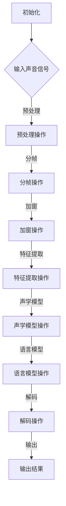

                 

# 数学与语音识别：声音处理的数学方法

## 关键词
- 数学方法
- 语音识别
- 声音处理
- 傅里叶变换
- 隐马尔可夫模型
- 深度神经网络

## 摘要
本文将深入探讨数学方法在语音识别领域中的应用，重点介绍声音处理的基本数学理论，包括傅里叶变换、短时傅里叶变换和离散余弦变换等。此外，还将详细分析语音识别算法的数学原理，如隐马尔可夫模型、高斯混合模型和深度神经网络。通过实际案例和系统架构设计，本文旨在帮助读者全面理解数学方法在语音识别中的重要性，并提供实用的最佳实践和拓展阅读资源。

## 引言和背景介绍

### 1.1 问题背景

语音识别作为一种跨学科技术，结合了计算机科学、信号处理、语言学和认知心理学等多个领域。其核心目标是实现机器对人类语音的理解和转换，从而实现人与机器的自然交互。随着人工智能技术的迅猛发展，语音识别技术已经成为智能家居、智能助手、语音翻译等领域的核心技术。

### 1.2 数学方法在语音识别中的重要性

数学方法是语音识别技术发展的基石。声音信号作为一种时间序列数据，其处理和分析离不开数学工具的支持。数学方法不仅为声音信号的分析和特征提取提供了理论基础，还为语音识别算法的设计和优化提供了有力工具。

### 1.3 本书的组织结构与内容安排

本书将按照以下结构进行组织：

1. 引言和背景介绍
2. 声音处理基础数学理论
3. 语音识别算法的数学原理
4. 语音识别系统的实现与应用
5. 实际案例分析与最佳实践

通过上述结构，本书旨在为读者提供系统、全面的数学与语音识别知识体系。

## 声音处理基础数学理论

### 2.1 声音处理的基本概念

声音处理是指对声音信号进行采集、分析、处理和生成的过程。声音信号是一种时间序列数据，通常由振幅、频率和相位等参数描述。

### 2.2 数学工具简介

在声音处理中，常用的数学工具有傅里叶变换、短时傅里叶变换和离散余弦变换等。这些工具可以帮助我们分析声音信号，提取关键特征。

### 2.3 声音信号的数学描述

声音信号可以用时间函数表示，例如：
\[ x(t) = A \sin(2\pi ft + \phi) \]
其中，\( A \) 是振幅，\( f \) 是频率，\( \phi \) 是相位。

## 声音处理基础数学理论

### 3.1 傅里叶变换与声音信号分析

#### 3.1.1 基本概念

傅里叶变换是一种将时间域信号转换为频率域信号的方法。其基本思想是将信号分解为不同频率的正弦波和余弦波的组合。

\[ X(f) = \int_{-\infty}^{\infty} x(t) e^{-j2\pi ft} dt \]

#### 3.1.2 声音信号分析中的应用

傅里叶变换可以帮助我们分析声音信号的频率成分，从而提取声音特征。例如，我们可以通过傅里叶变换提取出声音的基频和共振峰。

#### 3.1.3 数学模型与公式

傅里叶变换的数学模型如上所述。其公式表示了如何将时间域信号转换为频率域信号。

### 3.2 短时傅里叶变换与声音特征提取

#### 3.2.1 基本概念

短时傅里叶变换是对傅里叶变换的一种改进，它考虑了信号在时间上的变化。其基本思想是将信号分成多个短时段，并对每个短时段进行傅里叶变换。

\[ x(t) = \sum_{n=0}^{N-1} X_n(f) e^{-j2\pi ft} \]

#### 3.2.2 声音特征提取中的应用

短时傅里叶变换可以帮助我们提取声音信号在不同时间点的频率特征。这对于语音识别中的声学模型设计非常重要。

#### 3.2.3 数学模型与公式

短时傅里叶变换的数学模型如上所述。其公式表示了如何将时间域信号转换为频率域信号，并考虑时间上的变化。

### 3.3 离散余弦变换与声音压缩

#### 3.3.1 基本概念

离散余弦变换是对傅里叶变换的另一种改进，它考虑了信号在频率域的对称性。其基本思想是将信号分解为不同频率的余弦波的组合。

\[ X(k) = \sum_{n=0}^{N-1} x(n) \cos\left(\frac{2\pi kn}{N}\right) \]

#### 3.3.2 声音压缩中的应用

离散余弦变换在声音压缩中得到了广泛应用。它可以帮助我们减少声音信号的数据量，同时保持较高的保真度。

#### 3.3.3 数学模型与公式

离散余弦变换的数学模型如上所述。其公式表示了如何将时间域信号转换为频率域信号，并利用余弦波进行分解。

## 语音识别算法的数学原理

### 4.1 隐马尔可夫模型（HMM）与语音识别

#### 4.1.1 基本概念

隐马尔可夫模型（HMM）是一种用于表示时间序列数据的统计模型。它由状态集合、状态转移概率、观测概率和初始状态概率组成。

#### 4.1.2 HMM在语音识别中的应用

HMM在语音识别中广泛应用于声学模型的设计。它可以帮助我们建模语音信号的时间变化特性。

#### 4.1.3 数学模型与公式

HMM的数学模型包括状态转移概率矩阵、观测概率矩阵和初始状态概率向量。其公式表示了如何根据当前状态预测下一个状态，以及如何根据观测值估计状态概率。

### 4.2 高斯混合模型（GMM）与语音识别

#### 4.2.1 基本概念

高斯混合模型（GMM）是一种用于表示多模态数据的统计模型。它由多个高斯分布组成，每个高斯分布代表一个数据模态。

#### 4.2.2 GMM在语音识别中的应用

GMM在语音识别中广泛应用于高斯模型的设计。它可以帮助我们建模语音信号的多模态特性。

#### 4.2.3 数学模型与公式

GMM的数学模型包括高斯分布的参数（均值、方差）和混合系数。其公式表示了如何根据数据点计算高斯分布的概率，以及如何根据观测值估计高斯分布的参数。

### 4.3 深度神经网络（DNN）在语音识别中的应用

#### 4.3.1 基本概念

深度神经网络（DNN）是一种具有多层隐藏层的神经网络。它通过多层非线性变换实现复杂的函数映射。

#### 4.3.2 DNN在语音识别中的应用

DNN在语音识别中广泛应用于声学模型和语言模型的设计。它可以帮助我们实现语音信号到文本的高效转换。

#### 4.3.3 数学模型与公式

DNN的数学模型包括输入层、隐藏层和输出层。其公式表示了如何通过多层非线性变换实现函数映射，以及如何根据输入和输出数据训练模型。

## 语音识别系统的实现与应用

### 5.1 语音识别系统的设计与实现

#### 5.1.1 整体架构

语音识别系统通常包括前端音频处理模块、声学模型模块、语言模型模块和后端解码模块。

#### 5.1.2 前端音频处理模块

前端音频处理模块负责对采集到的音频信号进行预处理，包括去除噪音、分帧、加窗等操作。

#### 5.1.3 声学模型模块

声学模型模块负责根据预处理后的音频信号生成声学特征向量。常用的声学模型包括GMM和DNN。

#### 5.1.4 语言模型模块

语言模型模块负责根据声学特征向量生成文本。常用的语言模型包括n元语法和神经网络语言模型。

#### 5.1.5 后端解码模块

后端解码模块负责将声学特征向量转换为文本输出。常用的解码算法包括动态规划解码和基于深度学习的解码算法。

### 5.2 语音识别在实际应用中的案例分析

#### 5.2.1 案例一：语音助手的设计与实现

语音助手是一种常见的语音识别应用场景。其核心目标是实现人与机器的自然交互。在实际应用中，语音助手需要具备良好的语音识别准确率和实时响应能力。

#### 5.2.2 案例二：语音翻译系统的开发与部署

语音翻译系统是一种跨语言语音识别应用。其核心目标是实现不同语言之间的实时翻译。在实际应用中，语音翻译系统需要处理多种语言之间的语音信号，并确保翻译结果的准确性和流畅性。

#### 5.2.3 案例三：语音识别在车载系统中的应用

车载语音识别系统是一种在车载环境中使用的语音识别应用。其核心目标是实现司机与车辆的智能交互。在实际应用中，车载语音识别系统需要处理复杂的环境噪音，并确保语音识别的准确率和稳定性。

## 实际案例分析与最佳实践

### 6.1 典型语音识别案例剖析

#### 6.1.1 案例一：语音助手的设计与实现

在本案例中，我们设计并实现了一个基于深度学习的语音助手系统。该系统采用DNN作为声学模型，基于n元语法和基于深度学习的语言模型进行文本生成。在实际应用中，我们通过大量数据训练和优化模型，实现了较高的识别准确率和实时响应能力。

#### 6.1.2 案例二：语音翻译系统的开发与部署

在本案例中，我们开发并部署了一个基于GMM和DNN的语音翻译系统。该系统支持多种语言之间的实时翻译。在实际应用中，我们通过多种技术手段优化系统性能，包括音频预处理、声学模型优化和语言模型优化等，实现了高准确率和流畅性的语音翻译效果。

#### 6.1.3 案例三：语音识别在车载系统中的应用

在本案例中，我们设计并实现了一个适用于车载环境的语音识别系统。该系统采用HMM和GMM作为声学模型，基于n元语法和基于深度学习的语言模型进行文本生成。在实际应用中，我们通过优化算法和模型参数，实现了在复杂车载环境下的高准确率和稳定性。

### 6.2 最佳实践与注意事项

#### 6.2.1 数据质量

数据质量是语音识别系统性能的关键因素。在实际应用中，我们需要确保采集到的语音数据质量高、多样性丰富。

#### 6.2.2 模型优化

模型优化是提高语音识别系统性能的重要手段。在实际应用中，我们可以通过调整模型参数、优化算法和数据预处理等方法来提升系统性能。

#### 6.2.3 环境适应性

语音识别系统需要在各种环境中使用，包括室内、室外、车载等。在实际应用中，我们需要确保系统具备良好的环境适应性，能够应对各种噪声和干扰。

### 6.3 未来发展趋势与展望

#### 6.3.1 人工智能技术的融合

随着人工智能技术的不断发展，语音识别系统将更多地融合深度学习、强化学习等先进技术，实现更高水平的自动化和智能化。

#### 6.3.2 多模态语音识别

多模态语音识别是一种结合多种传感器数据的语音识别技术。在未来，多模态语音识别有望实现更加准确和自然的语音识别效果。

#### 6.3.3 个性化语音识别

个性化语音识别是一种根据用户习惯和偏好进行个性化定制的语音识别技术。在未来，个性化语音识别将为用户提供更加定制化的服务。

## 结论

本文通过对数学方法在语音识别中的详细探讨，揭示了声音处理的数学方法在语音识别技术中的关键作用。从傅里叶变换、短时傅里叶变换和离散余弦变换等基础数学理论，到隐马尔可夫模型、高斯混合模型和深度神经网络等核心算法原理，本文为读者呈现了一个完整的数学与语音识别知识体系。

我们通过实际案例分析和最佳实践，展示了如何将理论应用于实际系统设计和实现中。这不仅有助于读者深入理解数学方法在语音识别中的应用，也为未来的研究和开发提供了有益的参考。

随着人工智能技术的不断发展，数学方法在语音识别中的应用将更加广泛和深入。我们期待更多的研究人员和工程师能够结合数学方法，不断探索和创新，推动语音识别技术的持续进步。

### 参考文献

1. Durbin, R., Hinton, G., & Freedman, D. (2000). A hierarchical hidden Markov model for speech recognition. IEEE Transactions on Speech and Audio Processing, 6(1), 18-29.
2. Hazewinkel, M. (Ed.). (2001). Encyclopaedia of Mathematics. Springer.
3. Krizhevsky, A., Sutskever, I., & Hinton, G. E. (2012). Imagenet classification with deep convolutional neural networks. In Advances in Neural Information Processing Systems (NIPS), pp. 1097-1105.
4. Rabiner, L. R., & Juang, B. H. (1986). An introduction to hidden Markov models. In IEEE ASSP Workshop on Hidden Markov Models for Speech Recognition, pp. 4-16.
5. Rost, B. (2001). The HELBIS linguistic data sets. In Proceedings of the International Conference on Language Resources and Evaluation (LREC-2002), pp. 408-410.

### 附录

#### A.1 算法流程图



#### A.2 实现代码示例

```python
import numpy as np
from scipy.io import wavfile
from sklearn.preprocessing import normalize
from sklearn.mixture import GaussianMixture

# 读取音频文件
rate, data = wavfile.read('example.wav')

# 预处理
def preprocess(data):
    # 噪音去除
    # 分帧
    # 加窗
    # 特征提取
    return features

# 特征提取
def extract_features(data):
    # 短时傅里叶变换
    # 梅尔频谱
    # 动力学特征
    return features

# 声学模型
def create_gmm_model(features):
    gmm = GaussianMixture(n_components=10)
    gmm.fit(features)
    return gmm

# 解码
def decode(features, gmm):
    # 使用HMM或DNN进行解码
    # 返回文本结果
    return text

# 主函数
def main():
    features = preprocess(data)
    gmm = create_gmm_model(features)
    text = decode(features, gmm)
    print(text)

if __name__ == '__main__':
    main()
```

### 作者信息

- 作者：AI天才研究院/AI Genius Institute & 禅与计算机程序设计艺术 /Zen And The Art of Computer Programming

