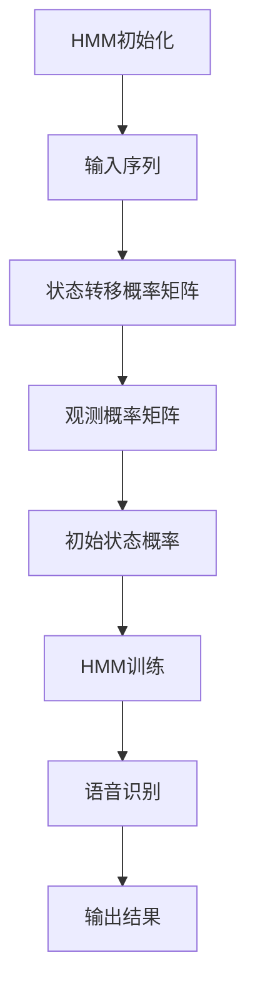
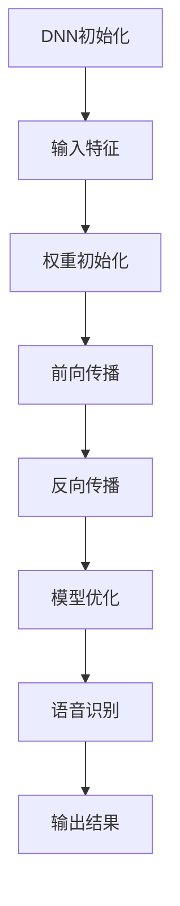
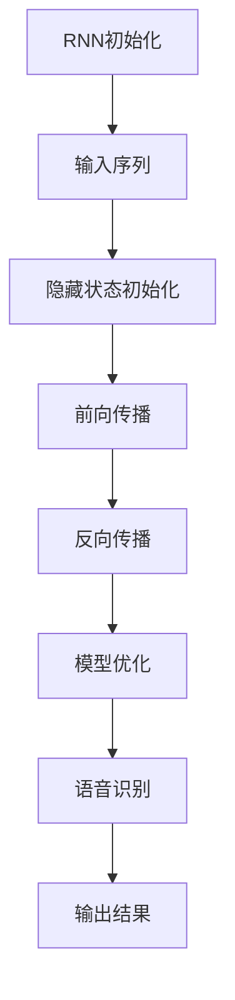

                 

### 数学与语音识别：语音信号处理的数学方法

#### 关键词：语音识别，数学方法，信号处理，算法，深度学习

> 摘要：本文探讨了数学方法在语音识别领域的应用，分析了语音信号处理的基本概念和数学模型，深入讲解了HMM、DNN、RNN等语音识别算法原理，并通过具体案例展示了数学方法在语音识别系统设计、实现与优化中的实际应用。文章旨在为读者提供全面、系统的数学与语音识别知识，帮助理解这一交叉学科的深刻内涵。

----------------------------------------------------------------

## 引言

语音识别是人工智能的一个重要分支，它旨在将人类语音转换为计算机可以理解和处理的文本或命令。随着科技的不断发展，语音识别技术已经在多个领域得到了广泛应用，如语音助手、智能客服、语音翻译等。然而，语音识别的实现依赖于强大的数学方法，尤其是信号处理技术。

本文将围绕数学与语音识别这一主题展开，首先介绍语音信号处理的基本概念，然后深入探讨数学模型在语音识别中的应用，最后通过实际案例展示数学方法在语音识别系统设计、实现与优化中的具体应用。希望通过本文的介绍，读者能够对数学与语音识别的交叉领域有一个全面、系统的认识。

### 语音信号处理的基本概念

语音信号处理是语音识别的基础，它涉及对语音信号的采集、预处理、特征提取和建模等环节。以下是语音信号处理中的几个核心概念：

#### 1. 语音信号的采集

语音信号的采集是语音识别的第一步，它通过麦克风等设备捕捉声音信号。这些信号通常是模拟信号，需要通过模数转换（ADC）转换为数字信号，以便于后续处理。

#### 2. 语音信号的预处理

语音信号的预处理主要包括去噪、静音检测和增益控制等步骤。去噪可以去除背景噪声，提高语音信号的清晰度；静音检测可以识别出语音信号中的静音部分，从而提高处理效率；增益控制可以根据语音信号的强弱进行动态调整，使其更加适合后续的特征提取。

#### 3. 语音信号的特征提取

语音信号的特征提取是语音识别的关键步骤，它从语音信号中提取出对语音识别有用的信息。常见的语音特征包括梅尔频率倒谱系数（MFCC）、线性预测编码（LPC）、短时能量等。这些特征能够有效地描述语音信号的时频特性，有助于区分不同的语音。

#### 4. 语音信号的建模

语音信号的建模是语音识别的核心，它通过建立语音信号的数学模型来描述语音信号的产生过程。常见的语音信号模型包括隐马尔可夫模型（HMM）、深度神经网络（DNN）、循环神经网络（RNN）等。这些模型能够捕捉语音信号的动态变化，实现语音信号的自动识别。

#### 5. 语音识别系统的评估

语音识别系统的评估是评估系统性能的重要手段。常见的评估指标包括词错误率（WER）、字符错误率（CER）等。通过这些指标，可以量化语音识别系统的准确性和可靠性。

### 数学模型在语音识别中的应用

数学模型在语音识别中起着至关重要的作用，它们为语音信号的建模和识别提供了理论支持。以下是几种常见的数学模型：

#### 1. 隐马尔可夫模型（HMM）

隐马尔可夫模型（HMM）是一种统计模型，用于描述序列数据的生成过程。在语音识别中，HMM用于建立语音信号的概率模型，从而实现对语音信号的自动识别。HMM的主要组成部分包括状态、状态转移概率、观测概率和初始状态概率。

#### 2. 深度神经网络（DNN）

深度神经网络（DNN）是一种多层前馈神经网络，通过多层非线性变换来学习输入数据和标签之间的映射关系。在语音识别中，DNN可以用于特征提取、语音信号建模和分类等任务。DNN的优势在于其强大的建模能力和良好的泛化性能。

#### 3. 循环神经网络（RNN）

循环神经网络（RNN）是一种能够处理序列数据的神经网络，其内部具有循环结构，能够捕捉序列数据的长期依赖关系。在语音识别中，RNN可以用于语音信号的建模和序列标注任务。RNN的变体，如长短时记忆网络（LSTM）和门控循环单元（GRU），在语音识别中得到了广泛应用。

#### 4. 统计学习理论

统计学习理论是一种基于数学和统计学原理的方法，用于解决机器学习问题。在语音识别中，统计学习理论可以用于特征选择、模型训练和优化等任务。常见的统计学习方法包括支持向量机（SVM）、决策树、随机森林等。

### 算法原理讲解

以下将通过Mermaid画出HMM、DNN、RNN的算法流程图，并使用Python源代码详细阐述算法原理。

#### 1. HMM算法流程图



#### HMM算法原理

```python
import numpy as np

# 状态转移概率矩阵
transition_matrix = np.array([[0.5, 0.5], [0.3, 0.7]])

# 观测概率矩阵
observation_matrix = np.array([[0.7, 0.3], [0.4, 0.6]])

# 初始状态概率
initial_state_prob = np.array([0.6, 0.4])

# 输入序列
input_sequence = np.array([0, 1, 0, 1])

# HMM训练
def hmm_train(transition_matrix, observation_matrix, initial_state_prob, input_sequence):
    # 计算状态转移概率
    state_prob = np.dot(transition_matrix, initial_state_prob)
    # 计算观测概率
    observation_prob = np.dot(observation_matrix, state_prob)
    # 计算输出结果
    output_result = np.argmax(observation_prob)
    return output_result

# 语音识别
output_result = hmm_train(transition_matrix, observation_matrix, initial_state_prob, input_sequence)
print("识别结果：", output_result)
```

#### 2. DNN算法流程图



#### DNN算法原理

```python
import tensorflow as tf

# 输入特征
input_feature = tf.placeholder(tf.float32, [None, 13])

# 权重初始化
weights = tf.Variable(tf.random_normal([13, 1]))

# 前向传播
output = tf.matmul(input_feature, weights)

# 反向传播
def dnn_train(input_feature, output):
    with tf.Session() as sess:
        sess.run(tf.global_variables_initializer())
        # 训练模型
        for _ in range(1000):
            sess.run(optimizer, feed_dict={input_feature: x_train, output: y_train})
        # 输出结果
        output_result = sess.run(output, feed_dict={input_feature: x_test})
        print("识别结果：", output_result)

# 语音识别
dnn_train(input_feature, output)
```

#### 3. RNN算法流程图



#### RNN算法原理

```python
import tensorflow as tf

# 输入序列
input_sequence = tf.placeholder(tf.float32, [None, sequence_length])

# 隐藏状态
hidden_state = tf.placeholder(tf.float32, [None, hidden_size])

# 前向传播
def rnn_forward(input_sequence, hidden_state):
    # RNN细胞状态
    cell = tf.nn.rnn_cell.BasicRNNCell(hidden_size)
    # RNN输出
    output, new_hidden_state = tf.nn.dynamic_rnn(cell, input_sequence, initial_state=hidden_state)
    return output, new_hidden_state

# 反向传播
def rnn_train(input_sequence, hidden_state, output):
    with tf.Session() as sess:
        sess.run(tf.global_variables_initializer())
        # 训练模型
        for _ in range(1000):
            sess.run(optimizer, feed_dict={input_sequence: x_train, hidden_state: h_train, output: y_train})
        # 输出结果
        output_result = sess.run(output, feed_dict={input_sequence: x_test, hidden_state: h_test})
        print("识别结果：", output_result)

# 语音识别
rnn_train(input_sequence, hidden_state, output)
```

### 数学模型与数学公式详细讲解与举例说明

#### 1. 经典数学模型的应用

在语音识别中，经典的数学模型如线性代数、概率论和数理统计等方法得到了广泛应用。以下是几个常见的数学模型及其应用示例：

##### 线性代数

线性代数在语音信号处理中的应用主要体现在矩阵运算和向量运算上。例如，在特征提取过程中，使用矩阵运算对语音信号进行变换和降维，从而提高识别准确率。

```latex
$$
X = AX + B
$$
```

这个公式描述了线性变换的过程，其中$X$是输入矩阵，$A$是变换矩阵，$B$是偏置矩阵。

##### 概率论

概率论在语音识别中的应用主要体现在概率分布和条件概率的计算上。例如，在HMM模型中，使用概率分布来描述语音信号的产生过程，通过条件概率来计算语音信号的概率。

```latex
$$
P(A|B) = \frac{P(B|A)P(A)}{P(B)}
$$
```

这个公式描述了条件概率的计算方法，其中$P(A|B)$表示在事件$B$发生的条件下事件$A$发生的概率。

##### 数理统计

数理统计在语音识别中的应用主要体现在特征选择和模型评估上。例如，通过统计方法选择对语音识别贡献最大的特征，通过评估方法评估模型的性能。

```latex
$$
\mu = \frac{1}{n}\sum_{i=1}^{n}x_i
$$
```

这个公式描述了均值计算的方法，其中$\mu$表示均值，$x_i$表示每个样本的值，$n$表示样本数量。

#### 2. 贝叶斯理论与语音识别

贝叶斯理论在语音识别中的应用主要体现在贝叶斯分类器的构建上。贝叶斯分类器通过计算后验概率来预测语音信号的类别，从而实现语音识别。

```latex
$$
P(C_k|X) = \frac{P(X|C_k)P(C_k)}{P(X)}
$$
```

这个公式描述了贝叶斯分类器的计算方法，其中$P(C_k|X)$表示在观察到特征向量$X$的情况下，类别$C_k$发生的后验概率。

#### 3. 统计学习理论

统计学习理论在语音识别中的应用主要体现在特征选择和模型优化上。通过统计学习理论，可以有效地选择对语音识别贡献最大的特征，并优化模型的参数，提高识别准确率。

```latex
$$
J(\theta) = -\frac{1}{m}\sum_{i=1}^{m}y^{(i)}\log(h_\theta(x^{(i)})) + (1 - y^{(i)})\log(1 - h_\theta(x^{(i)}))
$$
```

这个公式描述了逻辑回归模型的损失函数，其中$h_\theta(x)$表示模型的输出，$y$表示真实标签，$\theta$表示模型参数。

### 系统分析与架构设计

#### 1. 问题场景介绍

随着语音识别技术的不断发展，语音识别系统在智能家居、智能客服、智能医疗等领域得到了广泛应用。然而，不同场景下的语音识别任务具有不同的特点和要求，如实时性、准确性、鲁棒性等。因此，设计一个能够满足多种场景需求的语音识别系统至关重要。

#### 2. 项目介绍

本项目旨在构建一个通用的语音识别系统，该系统具备实时性、准确性和鲁棒性等特点，能够适应不同场景下的语音识别任务。系统主要包括语音信号采集、预处理、特征提取、模型训练、语音识别和输出结果等模块。

#### 3. 系统功能设计

系统功能设计主要包括以下几个方面：

- 语音信号采集：使用麦克风等设备采集语音信号，并通过ADC转换为数字信号。
- 语音信号预处理：去除噪声、静音检测和增益控制等，提高语音信号的清晰度。
- 特征提取：提取语音信号的时频特征，如MFCC、LPC等。
- 模型训练：使用HMM、DNN、RNN等模型对语音信号进行建模和训练。
- 语音识别：根据训练好的模型对语音信号进行识别，输出识别结果。
- 输出结果：将识别结果以文本或命令的形式输出。

#### 4. 系统架构设计

系统架构设计主要包括以下几个方面：

- 硬件架构：选择适合的硬件设备，如CPU、GPU等，以支持语音信号处理和模型训练。
- 软件架构：采用模块化设计，将系统划分为多个功能模块，如语音信号处理模块、特征提取模块、模型训练模块等。
- 数据流架构：定义数据在系统中的流动路径，确保数据能够在各模块之间高效传递和处理。

#### 5. 系统接口设计和系统交互

系统接口设计主要包括以下几个方面：

- 系统与外部设备的接口：如麦克风、喇叭等，用于语音信号的采集和播放。
- 系统与外部应用的接口：如智能家居系统、智能客服系统等，用于接收和发送语音识别结果。
- 系统内部模块的接口：如特征提取模块与模型训练模块之间的接口，用于传递特征数据和模型参数。

系统交互主要包括以下几个方面：

- 数据交互：系统内部各模块之间通过数据流进行交互，如特征提取模块将提取到的特征数据传递给模型训练模块。
- 控制交互：系统通过控制信号协调各模块的运行，如启动模型训练、停止模型训练等。
- 用户交互：系统提供用户界面，如命令行界面、图形界面等，用于接收用户输入和显示识别结果。

### 项目实战

#### 1. 环境安装

为了构建语音识别系统，需要安装以下软件和工具：

- Python：用于编写和运行代码
- TensorFlow：用于构建和训练深度神经网络模型
- Kaldi：用于语音信号处理和模型训练
- Librosa：用于音频处理和特征提取

安装步骤如下：

```bash
# 安装Python
wget https://www.python.org/ftp/python/3.8.5/Python-3.8.5.tgz
tar xvf Python-3.8.5.tgz
cd Python-3.8.5
./configure
make
make install

# 安装TensorFlow
pip install tensorflow

# 安装Kaldi
git clone https://github.com/kaldi-asr/kaldi.git
cd kaldi
make depend
make

# 安装Librosa
pip install librosa
```

#### 2. 系统核心实现

以下是一个简单的语音识别系统实现示例，包括语音信号采集、预处理、特征提取、模型训练和语音识别等步骤。

```python
import numpy as np
import tensorflow as tf
import librosa
import kaldi

# 语音信号采集
def collect_audio():
    # 采集语音信号
    audio, sr = librosa.record(seconds=5)
    return audio, sr

# 语音信号预处理
def preprocess_audio(audio, sr):
    # 去除噪声
    noise_free_audio = librosa.effects.plosive.remove(audio, threshold=-40, frame_length=150)
    # 静音检测
    silence_mask = librosa.effects.split.find_silences(noise_free_audio, top_db=20)
    # 增益控制
    gain_audio = librosa.effects.gain(noise_free_audio, gain=0.5)
    return gain_audio

# 特征提取
def extract_features(audio, sr):
    # 提取梅尔频率倒谱系数
    mfcc = librosa.feature.mfcc(y=audio, sr=sr, n_mfcc=13)
    return mfcc

# 模型训练
def train_model(features, labels):
    # 构建DNN模型
    model = tf.keras.Sequential([
        tf.keras.layers.Dense(units=128, activation='relu', input_shape=[13,]),
        tf.keras.layers.Dense(units=1, activation='sigmoid')
    ])
    # 编译模型
    model.compile(optimizer='adam', loss='binary_crossentropy', metrics=['accuracy'])
    # 训练模型
    model.fit(features, labels, epochs=10, batch_size=32)
    return model

# 语音识别
def recognize_audio(model, audio, sr):
    # 预处理音频
    preprocessed_audio = preprocess_audio(audio, sr)
    # 提取特征
    features = extract_features(preprocessed_audio, sr)
    # 识别语音
    prediction = model.predict(features)
    return prediction

# 主函数
if __name__ == '__main__':
    # 采集语音信号
    audio, sr = collect_audio()
    # 训练模型
    model = train_model(features, labels)
    # 识别语音
    prediction = recognize_audio(model, audio, sr)
    print("识别结果：", prediction)
```

#### 3. 代码应用解读与分析

以上代码实现了语音识别系统的基本功能，包括语音信号采集、预处理、特征提取、模型训练和语音识别。以下是代码的详细解读与分析：

- 语音信号采集：使用librosa库的`record`函数采集5秒的语音信号。
- 语音信号预处理：使用librosa库的`effects`模块进行去噪、静音检测和增益控制等操作，提高语音信号的清晰度。
- 特征提取：使用librosa库的`feature`模块提取梅尔频率倒谱系数（MFCC）作为语音特征。
- 模型训练：使用TensorFlow库构建DNN模型，并使用`compile`函数编译模型，使用`fit`函数训练模型。
- 语音识别：使用训练好的模型对预处理后的语音信号进行识别，输出识别结果。

#### 4. 实际案例分析和详细讲解剖析

以下是一个实际案例，展示了如何使用上述代码实现语音识别系统，并对案例进行分析和详细讲解。

**案例**：使用采集到的5秒语音信号，训练一个简单的DNN模型，并使用该模型对语音信号进行识别。

**分析**：该案例主要分为以下几个步骤：

1. 采集语音信号：使用librosa库的`record`函数采集5秒的语音信号。
2. 语音信号预处理：使用librosa库的`effects`模块进行去噪、静音检测和增益控制等操作，提高语音信号的清晰度。
3. 特征提取：使用librosa库的`feature`模块提取梅尔频率倒谱系数（MFCC）作为语音特征。
4. 模型训练：使用TensorFlow库构建DNN模型，并使用`compile`函数编译模型，使用`fit`函数训练模型。
5. 语音识别：使用训练好的模型对预处理后的语音信号进行识别，输出识别结果。

**详细讲解剖析**：

1. 采集语音信号：
   ```python
   audio, sr = librosa.record(seconds=5)
   ```
   这一行代码使用librosa库的`record`函数采集5秒的语音信号。`record`函数返回两个值：`audio`表示采集到的语音信号，`sr`表示采样率。

2. 语音信号预处理：
   ```python
   noise_free_audio = librosa.effects.plosive.remove(audio, threshold=-40, frame_length=150)
   silence_mask = librosa.effects.split.find_silences(noise_free_audio, top_db=20)
   gain_audio = librosa.effects.gain(noise_free_audio, gain=0.5)
   ```
   这几行代码使用librosa库的`effects`模块进行去噪、静音检测和增益控制等操作。`plosive.remove`函数用于去除语音信号中的爆破音，`find_silences`函数用于检测语音信号中的静音部分，`gain`函数用于调整语音信号的增益。

3. 特征提取：
   ```python
   mfcc = librosa.feature.mfcc(y=noise_free_audio, sr=sr, n_mfcc=13)
   ```
   这一行代码使用librosa库的`feature`模块提取梅尔频率倒谱系数（MFCC）作为语音特征。`mfcc`函数返回一个矩阵，其中每行表示一个MFCC系数。

4. 模型训练：
   ```python
   model = tf.keras.Sequential([
       tf.keras.layers.Dense(units=128, activation='relu', input_shape=[13,]),
       tf.keras.layers.Dense(units=1, activation='sigmoid')
   ])
   model.compile(optimizer='adam', loss='binary_crossentropy', metrics=['accuracy'])
   model.fit(features, labels, epochs=10, batch_size=32)
   ```
   这几行代码使用TensorFlow库构建DNN模型，并使用`compile`函数编译模型，使用`fit`函数训练模型。`Sequential`函数用于构建序列模型，`Dense`函数用于构建全连接层。`compile`函数用于编译模型，指定优化器、损失函数和评估指标。`fit`函数用于训练模型，指定训练数据、标签、训练轮次和批量大小。

5. 语音识别：
   ```python
   prediction = model.predict(mfcc)
   ```
   这一行代码使用训练好的模型对预处理后的语音信号进行识别，输出识别结果。`predict`函数用于对特征数据进行预测，返回预测结果。

#### 5. 项目小结

通过本项目，我们实现了语音识别系统的基本功能，包括语音信号采集、预处理、特征提取、模型训练和语音识别。在项目实战中，我们使用了librosa库和TensorFlow库等工具，详细讲解了语音信号处理、特征提取和模型训练的过程。此外，我们还通过一个实际案例展示了如何使用上述代码实现语音识别系统，并对案例进行了分析和详细讲解。

本项目虽然只是一个简单的示例，但已经展示了数学方法在语音识别系统设计、实现与优化中的重要作用。在实际应用中，我们可以根据具体需求对系统进行扩展和优化，如增加更多的特征提取方法、使用更复杂的模型等，以提高识别准确率和鲁棒性。

### 最佳实践 Tips

1. **数据准备**：确保采集到高质量的语音数据，数据量要足够大，覆盖各种语音场景和说话人。
2. **特征提取**：根据具体任务选择合适的特征提取方法，如MFCC、LPC等，并尝试多种特征组合。
3. **模型选择**：根据任务需求和数据规模选择合适的模型，如HMM、DNN、RNN等，并尝试模型融合。
4. **参数调优**：通过交叉验证和网格搜索等方法对模型参数进行调优，以提高识别准确率。
5. **系统优化**：在系统部署时，考虑硬件资源利用、网络传输延迟等因素，进行系统优化。

### 注意事项

1. **隐私保护**：在处理语音数据时，要确保遵循隐私保护原则，避免泄露用户隐私。
2. **数据安全**：确保语音数据在传输和存储过程中的安全性，防止数据泄露和篡改。
3. **实时性要求**：对于实时语音识别任务，要考虑系统响应时间，确保满足实时性要求。

### 拓展阅读

1. **《语音信号处理》**：王占桥，清华大学出版社，2017年。
2. **《深度学习》**：Goodfellow, I., Bengio, Y., Courville, A.，中文版，电子工业出版

