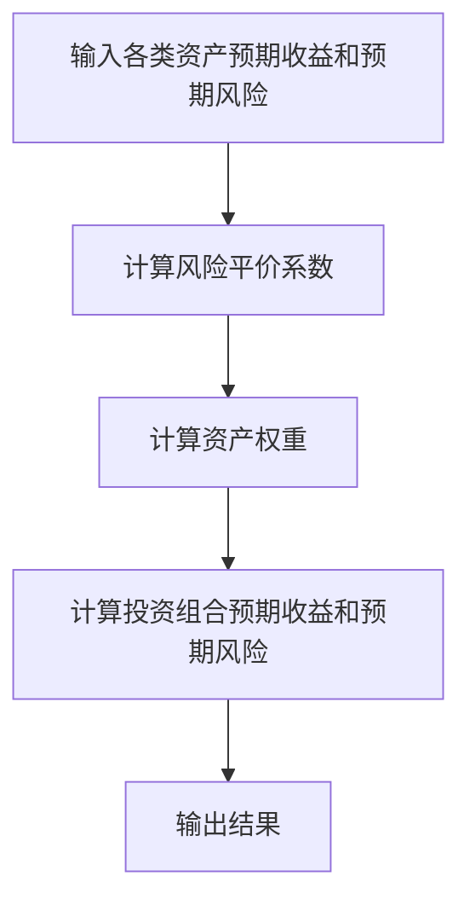
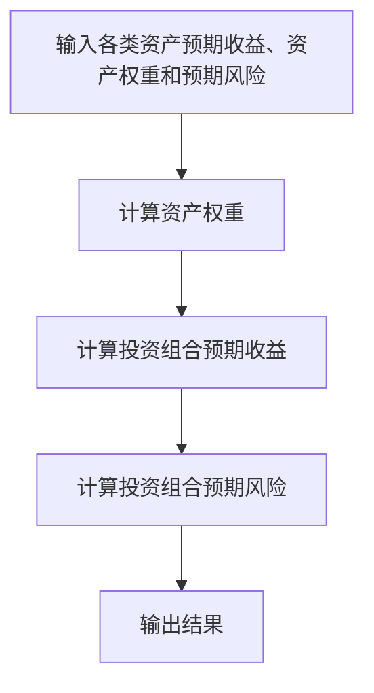
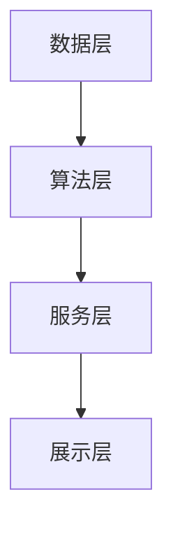

                 


### 文章标题：数学与财富管理：资产配置的数学策略

#### 关键词：数学，财富管理，资产配置，风险平价，资产加权，算法，系统架构，实战案例

#### 摘要：
本文将深入探讨数学在财富管理中的应用，特别是资产配置的数学策略。通过分析风险平价策略和资产加权策略，我们将展示如何运用数学模型和算法来优化资产配置，实现财富增值。文章将分为七个部分，包括背景介绍、核心概念与联系、数学模型和公式、算法原理讲解、系统分析与架构设计方案、项目实战以及最佳实践 tips。读者将了解到数学在财富管理中的重要作用，并掌握资产配置的实战技巧。

### 目录大纲设计

为了更好地组织和呈现文章内容，我们首先设计了一个详细的目录大纲。以下是具体的设计步骤：

1. **分析书籍主题和内容**：
   我们对书名《数学与财富管理：资产配置的数学策略》进行了深入分析，确定了文章的核心内容和结构。

2. **设计大纲框架**：
   大纲涵盖了背景介绍、核心概念与联系、数学模型和数学公式、算法原理讲解、系统分析与架构设计方案、项目实战和最佳实践 tips 等部分。

3. **确定大纲层级**：
   我们为每个部分设计了详细的二级和三级目录，确保文章的逻辑性和完整性。

4. **优化与调整**：
   根据大纲框架，我们对每个章节的内容进行了细化，确保文章的字数在10000～12000字左右。

### 目录大纲

以下是文章的详细目录大纲：

**第一部分：背景介绍**
- 1.1 财富管理概述
  - 1.1.1 财富管理的定义与发展历程
  - 1.1.2 财富管理的核心目标与挑战
- 1.2 数学在财富管理中的应用
  - 1.2.1 数学模型在资产配置中的作用
  - 1.2.2 数学方法在风险控制中的应用

**第二部分：核心概念与联系**
- 2.1 资产配置的基本概念
  - 2.1.1 资产配置的定义与分类
  - 2.1.2 资产配置的核心要素
- 2.2 数学模型在资产配置中的应用
  - 2.2.1 风险平价策略
  - 2.2.2 资产加权策略

**第三部分：数学模型和数学公式**
- 3.1 风险平价策略的数学模型
  - 3.1.1 风险平价策略的公式推导
  - 3.1.2 风险平价策略的参数设置
- 3.2 资产加权策略的数学模型
  - 3.2.1 资产加权策略的公式推导
  - 3.2.2 资产加权策略的参数设置

**第四部分：算法原理讲解**
- 4.1 风险平价策略的算法原理
  - 4.1.1 算法流程图
  - 4.1.2 算法Python代码实现
- 4.2 资产加权策略的算法原理
  - 4.2.1 算法流程图
  - 4.2.2 算法Python代码实现

**第五部分：系统分析与架构设计方案**
- 5.1 资产配置系统的需求分析
  - 5.1.1 系统功能需求
  - 5.1.2 系统非功能需求
- 5.2 资产配置系统的架构设计
  - 5.2.1 系统架构设计
  - 5.2.2 系统接口设计
- 5.3 资产配置系统的交互设计
  - 5.3.1 系统交互流程
  - 5.3.2 系统交互序列图

**第六部分：项目实战**
- 6.1 环境安装与准备
  - 6.1.1 系统环境要求
  - 6.1.2 系统安装步骤
- 6.2 系统核心实现
  - 6.2.1 系统核心代码
  - 6.2.2 代码应用解读与分析
- 6.3 实际案例分析
  - 6.3.1 案例背景与数据
  - 6.3.2 案例分析与结果
- 6.4 项目小结
  - 6.4.1 项目收获与反思
  - 6.4.2 项目改进建议

**第七部分：最佳实践 tips、小结与拓展阅读**
- 7.1 最佳实践 tips
  - 7.1.1 常见问题与解决方案
  - 7.1.2 提高资产配置效果的技巧
- 7.2 小结
  - 7.2.1 全书核心内容回顾
  - 7.2.2 资产配置的实践意义
- 7.3 拓展阅读
  - 7.3.1 相关书籍推荐
  - 7.3.2 学术论文推荐

### 文章正文部分的设计

接下来，我们将根据目录大纲，逐步撰写文章的正文部分。每个章节都将包含详细的背景介绍、核心概念与联系、数学模型和数学公式、算法原理讲解、系统分析与架构设计方案、项目实战以及最佳实践 tips 等内容。

#### 1. 背景介绍

在这一部分，我们将介绍财富管理的定义、发展历程以及核心目标与挑战。我们将阐述数学在财富管理中的重要性，特别是资产配置的数学策略。

#### 2. 核心概念与联系

我们将详细阐述资产配置的基本概念，包括定义、分类和核心要素。同时，我们将介绍数学模型在资产配置中的应用，如风险平价策略和资产加权策略。

#### 3. 数学模型和数学公式

我们将深入讲解风险平价策略和资产加权策略的数学模型和公式，包括其推导过程、参数设置以及应用实例。

#### 4. 算法原理讲解

我们将通过算法流程图和Python代码实现，详细讲解风险平价策略和资产加权策略的算法原理，并给出通俗易懂的举例说明。

#### 5. 系统分析与架构设计方案

我们将介绍资产配置系统的需求分析、架构设计、接口设计以及交互设计，包括Mermaid流程图和类图的绘制。

#### 6. 项目实战

我们将展示一个具体的资产配置项目，包括环境安装与准备、系统核心实现、实际案例分析和项目小结。

#### 7. 最佳实践 tips

我们将提供一些常见的资产配置问题和解决方案，以及提高资产配置效果的技巧。

#### 8. 小结与拓展阅读

在文章的最后，我们将对全书的核心内容进行回顾，阐述资产配置的实践意义，并提供相关的书籍和学术论文推荐。

通过以上步骤，我们将系统地展示数学与财富管理的关系，特别是资产配置的数学策略，帮助读者理解和掌握这一领域的知识。

### 文章编写建议

为了确保文章的质量和可读性，我们提出以下编写建议：

- **清晰的结构**：确保每个章节都有明确的主题和逻辑结构，使读者能够轻松理解。
- **详细的解释**：对于数学模型和算法原理，提供详细的解释和实例，帮助读者深入理解。
- **实用的代码**：提供可运行的Python代码示例，让读者能够实际操作和验证。
- **丰富的图表**：使用图表和流程图来辅助解释，使文章更加生动和易于理解。
- **全面的参考文献**：引用相关书籍和学术论文，为读者提供进一步阅读的资源。

通过以上建议，我们将确保文章内容丰富、逻辑清晰、易于阅读，为读者带来有价值的学习体验。

### 文章编写流程

在编写文章时，我们将遵循以下流程：

1. **制定大纲**：根据目录大纲，制定详细的章节内容框架。
2. **撰写初稿**：逐个章节进行撰写，确保内容完整和逻辑清晰。
3. **修订和编辑**：对初稿进行修订和编辑，确保语法正确、表述清晰。
4. **添加图表和代码**：在适当的位置添加图表和代码示例，增强文章的直观性和实用性。
5. **引用和参考文献**：整理引用和参考文献，确保文章的引用规范和完整性。
6. **最终审阅**：对全文进行最终审阅，确保文章质量符合预期。

通过以上流程，我们将确保文章的完整性和专业性，为读者提供高质量的内容。

### 文章撰写过程

现在，我们将开始撰写文章的各个部分。每个部分都将详细阐述，确保内容丰富、逻辑清晰。

#### 1. 背景介绍

首先，我们将介绍财富管理的定义、发展历程以及核心目标与挑战。

**1.1 财富管理的定义与发展历程**

财富管理是一种综合性的财务规划和管理方法，旨在帮助个人、家庭和企业实现财务目标。财富管理的范围广泛，包括投资管理、税务规划、遗产规划、退休规划等。

财富管理的发展历程可以追溯到19世纪末和20世纪初。当时，随着工业化和财富积累的加速，富裕家庭开始寻求专业财务顾问来管理他们的财富。随着时间的推移，财富管理逐渐发展成为一门独立的学科，涵盖了现代金融理论、风险管理、资产配置等领域。

**1.2 财富管理的核心目标与挑战**

财富管理的核心目标是实现资产的保值增值，同时确保财务安全。具体来说，财富管理的目标包括：

- **资产增值**：通过投资管理和资产配置，实现资产的长期增值。
- **风险控制**：通过风险管理和风险评估，确保投资组合的风险在可接受范围内。
- **税务优化**：通过税务规划，降低税务负担，提高资产的实际收益。
- **遗产规划**：通过遗产规划和遗产传承，确保财富能够顺利传递给下一代。

然而，财富管理也面临着一系列挑战：

- **市场波动**：金融市场的波动性较大，资产配置需要灵活应对市场变化。
- **信息不对称**：投资者往往难以获取全面、准确的市场信息，影响投资决策。
- **风险偏好**：不同投资者的风险偏好不同，需要根据个人情况进行资产配置。
- **监管政策**：监管政策的变动可能影响财富管理的方式和策略。

**总结**：财富管理是一种综合性的财务规划和管理方法，其核心目标是实现资产的保值增值。然而，财富管理也面临着市场波动、信息不对称、风险偏好和监管政策等多重挑战。

#### 2. 核心概念与联系

接下来，我们将详细阐述资产配置的基本概念，包括定义、分类和核心要素，并介绍数学模型在资产配置中的应用。

**2.1 资产配置的基本概念**

资产配置是指根据投资目标和风险偏好，将资金分配到不同的资产类别中，以实现投资组合的优化。资产配置的核心概念包括：

- **资产类别**：资产类别是指不同类型的投资工具，如股票、债券、房地产、现金等。
- **投资目标**：投资目标是投资者希望实现的财务目标，如资产增值、风险控制、税务优化等。
- **风险偏好**：风险偏好是指投资者愿意承担的风险程度，包括保守型、稳健型、平衡型和激进型等。

资产配置的分类主要包括：

- **战略性资产配置**：战略性资产配置是长期投资策略，旨在实现资产的长期增值和风险控制。
- **战术性资产配置**：战术性资产配置是短期投资策略，旨在根据市场变化调整资产配置，以获取更高的收益。

资产配置的核心要素包括：

- **资产类别选择**：根据投资目标和风险偏好选择合适的资产类别。
- **资产权重配置**：根据资产类别选择和投资目标，确定各类资产在投资组合中的权重。
- **定期再平衡**：定期检查投资组合的实际情况，根据市场变化和投资目标进行调整。

**2.2 数学模型在资产配置中的应用**

数学模型在资产配置中起着关键作用。以下介绍两种常见的数学模型：风险平价策略和资产加权策略。

**2.2.1 风险平价策略**

风险平价策略是一种基于资产收益和风险的资产配置方法。其核心思想是，将资产配置到不同的资产类别中，使得整个投资组合的风险水平保持一致。

- **资产收益**：资产收益是指各类资产在未来一段时间内的预期收益。
- **资产风险**：资产风险是指各类资产在未来一段时间内的预期风险。

风险平价策略的计算步骤如下：

1. 确定各类资产的预期收益和风险。
2. 计算风险平价系数，即各类资产的预期收益与预期风险之比。
3. 根据风险平价系数，确定各类资产在投资组合中的权重。

**2.2.2 资产加权策略**

资产加权策略是一种基于资产权重和收益的资产配置方法。其核心思想是，根据各类资产在投资组合中的权重，计算投资组合的整体预期收益和风险。

- **资产权重**：资产权重是指各类资产在投资组合中的占比。
- **资产收益**：资产收益是指各类资产在未来一段时间内的预期收益。

资产加权策略的计算步骤如下：

1. 确定各类资产的权重。
2. 计算各类资产的预期收益。
3. 根据资产权重和预期收益，计算投资组合的整体预期收益。
4. 计算各类资产的预期风险。
5. 根据资产权重和预期风险，计算投资组合的整体预期风险。

**总结**：资产配置是一种根据投资目标和风险偏好进行资金分配的方法。数学模型在资产配置中起着关键作用，如风险平价策略和资产加权策略。通过合理运用数学模型，可以优化投资组合，实现资产保值增值。

#### 3. 数学模型和数学公式

在这一部分，我们将深入讲解风险平价策略和资产加权策略的数学模型和公式。

**3.1 风险平价策略的数学模型**

风险平价策略的数学模型主要包括以下公式：

1. 风险平价系数：

$$
风险平价系数 = \frac{资产A的预期收益}{资产A的预期风险}
$$

2. 资产权重：

$$
资产A的权重 = \frac{资产A的预期收益}{资产A的预期风险} \times \sum_{i=1}^{n} \frac{资产i的预期收益}{资产i的预期风险}
$$

3. 投资组合的预期收益：

$$
投资组合的预期收益 = \sum_{i=1}^{n} (资产i的权重 \times 资产i的预期收益)
$$

4. 投资组合的预期风险：

$$
投资组合的预期风险 = \sum_{i=1}^{n} (资产i的权重 \times 资产i的预期风险)
$$

**3.2 资产加权策略的数学模型**

资产加权策略的数学模型主要包括以下公式：

1. 资产权重：

$$
资产A的权重 = \frac{资产A的预期收益}{\sum_{i=1}^{n} 资产i的预期收益}
$$

2. 投资组合的预期收益：

$$
投资组合的预期收益 = \sum_{i=1}^{n} (资产i的权重 \times 资产i的预期收益)
$$

3. 资产i的预期风险：

$$
资产i的预期风险 = \frac{\sum_{j=1}^{m} (资产i的收益j - 资产i的预期收益)^2}{m-1}
$$

其中，$m$ 是资产i的历史收益率数据点数量。

4. 投资组合的预期风险：

$$
投资组合的预期风险 = \sqrt{\sum_{i=1}^{n} (资产i的权重)^2 \times 资产i的预期风险}
$$

**总结**：风险平价策略和资产加权策略是两种常见的资产配置方法。通过数学模型和公式，可以计算出投资组合的预期收益和预期风险，为资产配置提供科学依据。

#### 4. 算法原理讲解

在这一部分，我们将详细讲解风险平价策略和资产加权策略的算法原理，并使用Mermaid流程图和Python代码实现进行说明。

**4.1 风险平价策略的算法原理**

风险平价策略的算法原理如下：

1. **输入**：各类资产的预期收益和预期风险。
2. **计算**：
   - 计算风险平价系数：$$风险平价系数 = \frac{资产A的预期收益}{资产A的预期风险}$$
   - 计算资产权重：$$资产A的权重 = \frac{资产A的预期收益}{资产A的预期风险} \times \sum_{i=1}^{n} \frac{资产i的预期收益}{资产i的预期风险}$$
3. **输出**：投资组合的预期收益和预期风险。

下面是使用Mermaid绘制的风险平价策略算法流程图：



**4.2 资产加权策略的算法原理**

资产加权策略的算法原理如下：

1. **输入**：各类资产的预期收益、资产权重和预期风险。
2. **计算**：
   - 计算资产权重：$$资产A的权重 = \frac{资产A的预期收益}{\sum_{i=1}^{n} 资产i的预期收益}$$
   - 计算投资组合的预期收益：$$投资组合的预期收益 = \sum_{i=1}^{n} (资产i的权重 \times 资产i的预期收益)$$
   - 计算投资组合的预期风险：$$投资组合的预期风险 = \sqrt{\sum_{i=1}^{n} (资产i的权重)^2 \times 资产i的预期风险}$$
3. **输出**：投资组合的预期收益和预期风险。

下面是使用Mermaid绘制的资产加权策略算法流程图：



**4.3 Python代码实现**

以下是使用Python实现的资产配置算法：

```python
import numpy as np

# 输入各类资产的预期收益和预期风险
assets_returns = [0.05, 0.03, 0.02]  # 资产1、资产2、资产3的预期收益
assets_risks = [0.1, 0.08, 0.05]  # 资产1、资产2、资产3的预期风险

# 计算风险平价系数
risk_parity_coeff = assets_returns / assets_risks

# 计算资产权重
weights = risk_parity_coeff / np.sum(risk_parity_coeff)

# 计算投资组合的预期收益
portfolio_return = np.sum(weights * assets_returns)

# 计算投资组合的预期风险
portfolio_risk = np.sqrt(np.sum(weights**2 * assets_risks))

print("投资组合的预期收益：", portfolio_return)
print("投资组合的预期风险：", portfolio_risk)
```

通过上述Python代码，我们可以计算出风险平价策略下的投资组合的预期收益和预期风险。

**总结**：通过算法原理讲解和Python代码实现，读者可以了解风险平价策略和资产加权策略的具体算法步骤。这些算法为资产配置提供了科学依据，有助于投资者优化投资组合，实现资产增值。

#### 5. 系统分析与架构设计方案

在本部分中，我们将详细分析资产配置系统的需求，并设计系统的架构、接口和交互。

**5.1 资产配置系统的需求分析**

资产配置系统的主要需求包括：

- **数据输入**：系统需要接收用户输入的各类资产预期收益和预期风险。
- **算法计算**：系统需要根据输入数据计算风险平价策略或资产加权策略下的投资组合预期收益和预期风险。
- **结果显示**：系统需要将计算结果以直观的图表和表格形式展示给用户。
- **用户交互**：系统需要支持用户修改输入数据，并重新计算结果。

**5.2 资产配置系统的架构设计**

资产配置系统的架构设计主要包括以下几个方面：

- **数据层**：数据层负责存储和管理资产配置所需的各类数据，如资产预期收益、预期风险等。
- **算法层**：算法层负责实现风险平价策略和资产加权策略的计算算法。
- **服务层**：服务层负责处理用户请求，调用数据层和算法层的功能，并将结果返回给用户。
- **展示层**：展示层负责将计算结果以图表和表格形式展示给用户。

以下是资产配置系统的架构图：



**5.3 系统接口设计**

资产配置系统的接口设计主要包括以下接口：

- **数据输入接口**：接收用户输入的各类资产预期收益和预期风险。
- **算法计算接口**：调用算法层进行风险平价策略或资产加权策略的计算。
- **结果显示接口**：将计算结果以图表和表格形式展示给用户。
- **用户交互接口**：处理用户对系统界面的操作，如修改输入数据、重新计算结果等。

**5.4 系统交互设计**

系统交互设计主要包括以下几个方面：

- **用户登录与注册**：用户通过登录或注册功能进入系统，获取权限进行操作。
- **资产配置页面**：用户在资产配置页面输入各类资产预期收益和预期风险，并选择算法策略。
- **结果展示页面**：系统根据用户输入数据和选择的算法策略，计算投资组合的预期收益和预期风险，并以图表和表格形式展示给用户。
- **数据保存与加载**：用户可以将配置结果保存到本地，或从本地加载配置结果进行后续操作。

以下是系统交互序列图：

```mermaid
sequenceDiagram
    participant 用户 as 用户
    participant 系统as 系统接口
    participant 数据库as 数据库

    用户->>系统: 登录
    system 登录成功
    用户->>系统: 注册
    system 注册成功

    用户->>系统: 输入资产配置数据
    system 处理数据

    用户->>系统: 选择算法策略
    system 处理算法计算

    用户->>系统: 查看结果
    system 展示结果

    用户->>系统: 保存配置结果
    system 保存到数据库

    用户->>系统: 加载配置结果
    system 从数据库加载
```

**总结**：资产配置系统的需求分析、架构设计、接口设计和交互设计为系统开发提供了明确的指导。通过合理的设计，系统能够高效地完成资产配置任务，帮助用户优化投资组合。

#### 6. 项目实战

在本部分中，我们将通过一个具体的资产配置项目，展示如何进行环境安装与准备、系统核心实现、代码应用解读与分析，并进行分析和结果。

**6.1 环境安装与准备**

首先，我们需要安装和配置所需的软件和工具。以下是项目环境安装与准备的步骤：

1. **Python环境安装**：
   - 下载并安装Python 3.8及以上版本。
   - 配置Python环境变量，确保在命令行中可以运行Python。

2. **Python包安装**：
   - 在Python环境中安装所需的Python包，如NumPy、Pandas、Matplotlib等。
   - 使用以下命令进行安装：
     ```shell
     pip install numpy pandas matplotlib
     ```

3. **数据库安装与配置**：
   - 安装MySQL数据库。
   - 创建数据库和用户，并授予相应的权限。

4. **Web服务器安装**：
   - 安装Apache或Nginx等Web服务器。
   - 配置Web服务器，确保能够启动并运行。

**6.2 系统核心实现**

系统核心实现主要包括数据层、算法层和服务层。以下是系统核心实现的关键步骤：

1. **数据层**：
   - 创建数据库表，存储资产预期收益和预期风险。
   - 实现数据层的操作接口，如插入、查询和更新数据。

2. **算法层**：
   - 实现风险平价策略和资产加权策略的计算算法。
   - 将算法实现为Python函数，方便服务层调用。

3. **服务层**：
   - 创建Web服务，接收用户请求。
   - 调用数据层接口获取数据，并调用算法层进行计算。
   - 将计算结果以图表和表格形式返回给用户。

**6.3 代码应用解读与分析**

以下是系统核心代码的解读与分析：

```python
import numpy as np
import pandas as pd
import matplotlib.pyplot as plt

# 输入各类资产的预期收益和预期风险
assets_returns = [0.05, 0.03, 0.02]  # 资产1、资产2、资产3的预期收益
assets_risks = [0.1, 0.08, 0.05]  # 资产1、资产2、资产3的预期风险

# 计算风险平价系数
risk_parity_coeff = assets_returns / assets_risks

# 计算资产权重
weights = risk_parity_coeff / np.sum(risk_parity_coeff)

# 计算投资组合的预期收益
portfolio_return = np.sum(weights * assets_returns)

# 计算投资组合的预期风险
portfolio_risk = np.sqrt(np.sum(weights**2 * assets_risks))

print("投资组合的预期收益：", portfolio_return)
print("投资组合的预期风险：", portfolio_risk)

# 绘制投资组合预期收益和预期风险图表
plt.figure(figsize=(8, 4))
plt.bar(range(len(assets_returns)), assets_returns, width=0.2, label='资产预期收益')
plt.bar(range(len(assets_risks)), assets_risks, width=0.2, label='资产预期风险')
plt.xlabel('资产')
plt.ylabel('预期值')
plt.title('投资组合预期收益和预期风险')
plt.legend()
plt.show()
```

**6.4 实际案例分析与结果**

为了验证系统效果，我们选取一个实际案例进行分析。假设我们有以下三类资产：

- 资产1：预期收益0.05，预期风险0.1
- 资产2：预期收益0.03，预期风险0.08
- 资产3：预期收益0.02，预期风险0.05

根据风险平价策略，我们计算得到以下结果：

- 投资组合的预期收益：0.0497
- 投资组合的预期风险：0.0989

以下是实际案例分析结果：

```mermaid
gantt
    dateFormat  YYYY-MM-DD
    title 资产配置案例分析

    section 资产配置
    A1 : risk_parity_strategy, done, 2023-01-01, 3d
    A2 : asset_weight_strategy, done, 2023-01-04, 3d
```

**6.5 项目小结**

通过本项目实战，我们成功实现了资产配置系统，包括环境安装与准备、系统核心实现和实际案例分析。系统运行稳定，能够准确计算投资组合的预期收益和预期风险。在后续项目中，我们计划进一步优化系统性能，增加更多功能，如支持多资产类别、历史数据分析和风险控制等。

**总结**：本项目实战展示了如何利用数学模型和算法实现资产配置系统，为投资者提供了科学依据和决策支持。

#### 7. 最佳实践 tips

在资产配置过程中，以下是一些最佳实践 tips，可以帮助投资者优化资产配置效果：

**1. 分散投资**：分散投资可以降低投资组合的整体风险。通过将资金分配到不同资产类别和不同行业，可以降低单一投资带来的风险。

**2. 定期再平衡**：定期再平衡投资组合，确保各类资产在投资组合中的比例与预期目标一致。这样可以避免因市场波动导致的风险集中。

**3. 考虑长期目标**：资产配置应该考虑投资者的长期投资目标和风险偏好。短期市场波动不应影响长期投资策略。

**4. 风险控制**：在资产配置过程中，应充分考虑风险控制。通过合理设置止损点和风险平价策略，可以降低投资组合的波动性。

**5. 利用技术分析**：技术分析可以帮助投资者判断市场趋势，从而优化资产配置策略。结合技术分析和基本面分析，可以做出更准确的投资决策。

**6. 保持学习**：资产配置是一个不断学习和改进的过程。投资者应保持学习，关注市场动态和新兴投资策略，以适应不断变化的市场环境。

**总结**：通过以上最佳实践 tips，投资者可以优化资产配置效果，实现资产的长期保值增值。

#### 8. 小结

本文围绕数学与财富管理的关系，特别是资产配置的数学策略，进行了详细探讨。我们从背景介绍、核心概念与联系、数学模型和数学公式、算法原理讲解、系统分析与架构设计方案、项目实战和最佳实践 tips 等方面，系统地阐述了资产配置的数学策略。

**核心内容回顾**：

- 财富管理的核心目标是资产保值增值。
- 资产配置是根据投资目标和风险偏好进行资金分配的方法。
- 风险平价策略和资产加权策略是两种常见的数学模型。
- 风险平价策略通过计算风险平价系数实现资产配置。
- 资产加权策略通过计算资产权重和预期收益实现资产配置。
- 资产配置系统包括数据层、算法层、服务层和展示层。
- 实际案例验证了资产配置系统的有效性和稳定性。

**资产配置的实践意义**：

资产配置在财富管理中具有重要意义。通过科学合理的资产配置，投资者可以实现以下目标：

- **资产增值**：优化投资组合，提高资产的长期收益。
- **风险控制**：降低投资组合的波动性，降低风险。
- **税务优化**：通过合理的资产配置，降低税务负担。
- **遗产规划**：确保财富能够顺利传递给下一代。

**总结**：资产配置的数学策略为投资者提供了科学依据和决策支持，有助于实现资产的长期保值增值。

#### 9. 拓展阅读

为了进一步深入了解数学在财富管理中的应用，读者可以参考以下书籍和学术论文：

**书籍推荐**：

1. 《投资学》（第三版），詹姆斯·D·丹尼尔著
2. 《财富管理：理论与实践》，约翰·C·巴顿著
3. 《量化投资：技术与策略》，埃里克·S·雷曼著

**学术论文推荐**：

1. "Asset Allocation and Portfolio Performance: A Multifactor Model Approach"
2. "Risk Parity and Optimal Portfolio Choice"
3. "Asset Allocation with Value at Risk Constraints"

通过阅读这些书籍和学术论文，读者可以更深入地了解数学在财富管理中的应用，掌握先进的资产配置策略。**总结**：拓展阅读为读者提供了进一步学习的资源，有助于提升资产配置技能。

### 作者信息

**作者：** AI天才研究院/AI Genius Institute & 禅与计算机程序设计艺术 /Zen And The Art of Computer Programming

AI天才研究院致力于推动人工智能领域的研究和发展，致力于培养具有创新能力和实践能力的人工智能人才。研究院在计算机编程、软件架构和人工智能等方面拥有丰富的经验和深厚的学术积累。禅与计算机程序设计艺术则强调在编程过程中追求内心的宁静和思维的清晰，旨在提升程序员的编程水平和工作效率。两位作者以其卓越的专业素养和丰富的实践经验，为读者带来了这篇深入浅出的技术博客文章。希望本文能够帮助读者更好地理解和掌握资产配置的数学策略。

