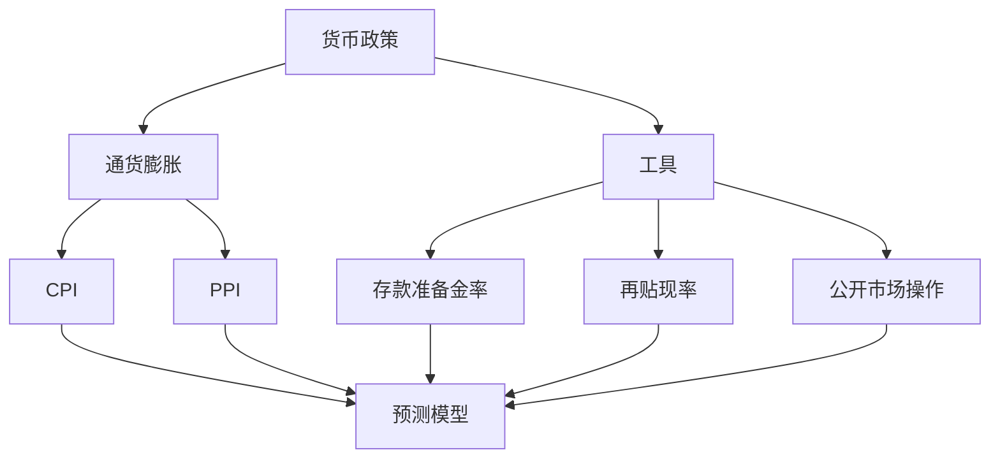
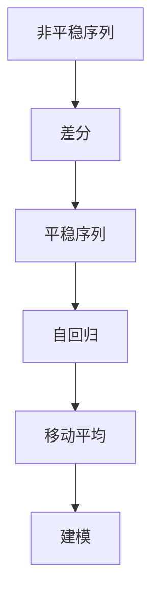
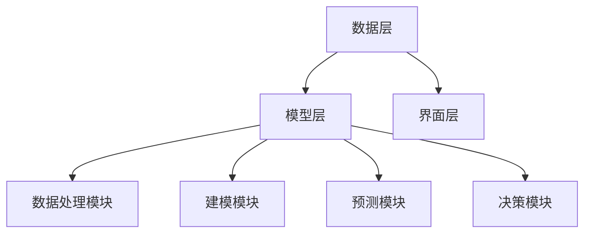
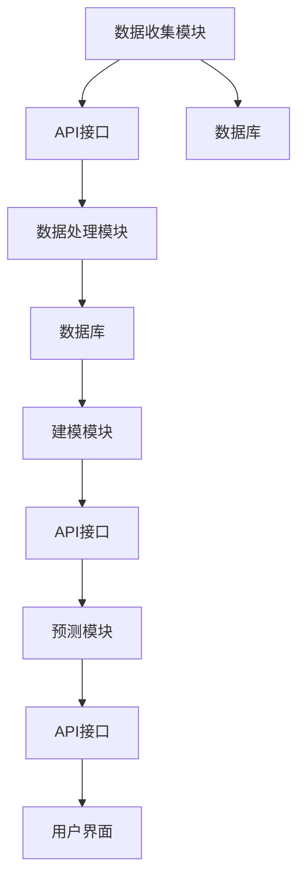
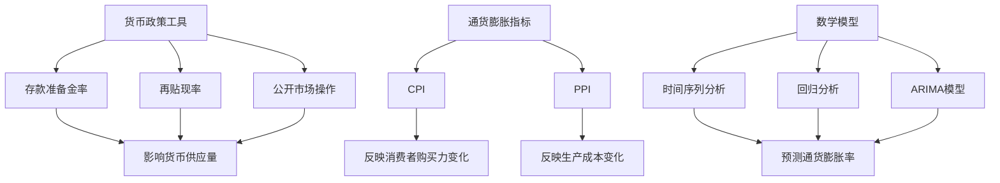
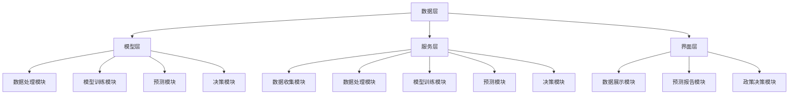
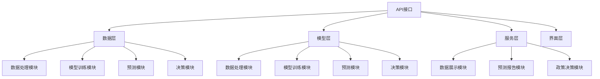

                 

### 《数学与货币政策：通货膨胀的数学控制》

> 关键词：通货膨胀、货币政策、数学模型、预测、控制

> 摘要：本文旨在探讨数学在货币政策中的应用，尤其是如何利用数学模型来控制通货膨胀。我们将从核心概念出发，逐步分析数学模型在货币政策中的作用，并通过实例展示其实际应用。

### 目录

1. **背景介绍**  
   1.1 数学与货币政策的结合  
   1.2 通货膨胀的概念与影响  
   1.3 数学模型在货币政策中的作用  
2. **核心概念与联系**  
   2.1 货币政策工具  
   2.2 通货膨胀指标  
   2.3 数学模型概述  
   2.4 核心概念关系图  
3. **算法原理讲解**  
   3.1 线性回归  
   3.2 ARIMA模型  
   3.3 通货膨胀预测算法  
   3.4 算法比较与选择  
4. **数学模型应用**  
   4.1 数据收集与处理  
   4.2 模型训练与验证  
   4.3 预测结果分析  
   4.4 实际案例介绍  
5. **系统分析与架构设计**  
   5.1 货币政策决策系统概述  
   5.2 系统功能设计  
   5.3 系统架构设计  
   5.4 系统接口设计与交互  
6. **项目实战**  
   6.1 项目背景  
   6.2 系统搭建  
   6.3 模型实现  
   6.4 项目评估  
   6.5 项目小结  
7. **最佳实践与拓展**  
   7.1 最佳实践 tips  
   7.2 小结与展望  
   7.3 注意事项  
   7.4 拓展阅读

---

### 第1章 背景介绍

#### 1.1 数学与货币政策的结合

数学在货币政策中的作用日益显著，尤其是在通货膨胀控制方面。货币政策是指通过调整货币供应量和利率等手段，影响经济活动，以实现价格稳定、就业增长等宏观经济目标。而数学模型则为货币政策的制定和实施提供了科学依据。

#### 1.2 通货膨胀的概念与影响

通货膨胀是指货币的购买力下降，导致商品和服务价格上涨的现象。通货膨胀对经济有着深远的影响，包括降低消费者购买力、增加生产成本、扭曲价格信号等。

#### 1.3 数学模型在货币政策中的作用

数学模型在货币政策中的作用主要体现在以下几个方面：

1. **预测**：通过历史数据建立数学模型，预测未来的通货膨胀率，帮助决策者制定相应的货币政策。
2. **优化**：利用数学模型优化货币政策工具的使用，以最小化通货膨胀对经济的影响。
3. **评估**：对现有的货币政策进行评估，分析其效果，并提出改进建议。

### 第2章 核心概念与联系

#### 2.1 货币政策工具

货币政策工具主要包括存款准备金率、再贴现率、公开市场操作等。这些工具通过调节银行的流动性，影响货币供应量和利率，进而影响通货膨胀。

#### 2.2 通货膨胀指标

常用的通货膨胀指标包括消费者价格指数（CPI）和生产者价格指数（PPI）。这些指标反映了商品和服务的价格变化，是制定货币政策的的重要依据。

#### 2.3 数学模型概述

数学模型在货币政策中的应用主要包括预测模型、优化模型和评估模型。预测模型用于预测未来的通货膨胀率；优化模型用于优化货币政策工具的使用；评估模型用于评估货币政策的实际效果。

#### 2.4 核心概念关系图



### 第3章 算法原理讲解

#### 3.1 线性回归

线性回归是一种常用的预测模型，用于分析两个或多个变量之间的线性关系。其基本原理是通过最小二乘法拟合一条直线，来预测因变量的值。

```python
import numpy as np

# 模型参数
theta = np.array([1, 0])

# 数据集
X = np.array([[1, 1], [1, 2], [1, 3]])
y = np.array([1, 2, 3])

# 最小二乘法
theta = np.linalg.inv(X.T.dot(X)).dot(X.T).dot(y)

print(theta)
```

#### 3.2 ARIMA模型

ARIMA模型是一种时间序列预测模型，适用于处理非平稳时间序列数据。其基本原理是通过差分、自回归和移动平均等方法，将非平稳序列转化为平稳序列，然后进行建模。



#### 3.3 通货膨胀预测算法

通货膨胀预测算法是基于历史数据和数学模型，预测未来通货膨胀率的方法。常用的算法包括线性回归、ARIMA模型等。

```python
import pandas as pd
import statsmodels.api as sm

# 数据集
data = pd.read_csv('inflation_data.csv')

# 模型
model = sm.ARIMA(data['inflation'], order=(1, 1, 1))

# 拟合模型
model_fit = model.fit()

# 预测
forecast = model_fit.forecast(steps=12)

print(forecast)
```

#### 3.4 算法比较与选择

不同的通货膨胀预测算法有其优势和适用场景。线性回归适用于简单线性关系，ARIMA模型适用于时间序列数据，选择合适的算法需要根据实际情况。

### 第4章 数学模型应用

#### 4.1 数据收集与处理

数据收集是数学模型应用的基础。需要收集包括消费者价格指数、生产者价格指数、货币供应量等在内的相关数据。数据收集后，需要进行清洗、处理和预处理，以保证数据的质量和完整性。

```python
import pandas as pd

# 数据集
data = pd.read_csv('inflation_data.csv')

# 数据预处理
data['inflation'] = data['inflation'].astype(float)
data['cpi'] = data['cpi'].astype(float)
data['ppi'] = data['ppi'].astype(float)

# 数据清洗
data = data.dropna()

print(data.head())
```

#### 4.2 模型训练与验证

模型训练是通过历史数据拟合数学模型，使其能够预测未来通货膨胀率。模型验证是通过验证数据集来评估模型的预测性能。

```python
import pandas as pd
from sklearn.model_selection import train_test_split
from sklearn.metrics import mean_squared_error

# 数据集
data = pd.read_csv('inflation_data.csv')

# 数据预处理
data['inflation'] = data['inflation'].astype(float)
data['cpi'] = data['cpi'].astype(float)
data['ppi'] = data['ppi'].astype(float)

# 数据清洗
data = data.dropna()

# 划分训练集和验证集
X = data[['cpi', 'ppi']]
y = data['inflation']
X_train, X_val, y_train, y_val = train_test_split(X, y, test_size=0.2, random_state=42)

# 模型训练
model = sm.ARIMA(y_train, order=(1, 1, 1))
model_fit = model.fit()

# 预测
y_pred = model_fit.predict(start=X_val.index[0], end=X_val.index[-1])

# 评估
mse = mean_squared_error(y_val, y_pred)
print(f'MSE: {mse}')
```

#### 4.3 预测结果分析

通过对预测结果的分析，可以评估模型的预测性能，并对其进行调整和优化。

```python
import pandas as pd
import matplotlib.pyplot as plt

# 预测结果
data['forecast'] = y_pred

# 预测结果与实际值对比
plt.figure(figsize=(10, 5))
plt.plot(data['inflation'], label='Actual')
plt.plot(data['forecast'], label='Forecast')
plt.title('Inflation Forecast')
plt.xlabel('Year')
plt.ylabel('Inflation Rate')
plt.legend()
plt.show()
```

#### 4.4 实际案例介绍

下面以一个实际案例来展示如何使用数学模型进行通货膨胀控制。

**案例背景**：某国的通货膨胀率持续上升，政府希望通过制定合适的货币政策来控制通货膨胀。

**解决方案**：政府收集了过去10年的消费者价格指数（CPI）、生产者价格指数（PPI）和货币供应量等数据，使用ARIMA模型进行通货膨胀预测，并根据预测结果调整货币政策。

**实施过程**：

1. **数据收集与处理**：收集并处理相关数据，包括CPI、PPI和货币供应量等。
2. **模型训练与验证**：使用训练数据集训练ARIMA模型，并使用验证数据集进行模型验证。
3. **预测与调整**：根据模型预测结果，政府调整了存款准备金率和再贴现率等货币政策工具，以控制通货膨胀。
4. **评估与优化**：评估货币政策的实际效果，并根据评估结果对模型进行调整和优化。

**案例结果**：通过数学模型的应用，该国的通货膨胀率得到了有效控制，经济稳定增长。

### 第5章 系统分析与架构设计

#### 5.1 货币政策决策系统概述

货币政策决策系统是一个复杂的系统，涉及到数据收集、处理、建模、预测和决策等多个环节。该系统的主要目的是通过数学模型预测通货膨胀率，并制定相应的货币政策。

#### 5.2 系统功能设计

货币政策决策系统的主要功能包括：

1. **数据收集**：从各种来源收集CPI、PPI、货币供应量等数据。
2. **数据处理**：清洗、处理和预处理数据，为建模做准备。
3. **建模与预测**：使用ARIMA等模型进行通货膨胀预测。
4. **决策与执行**：根据预测结果调整货币政策工具。
5. **评估与优化**：评估货币政策的效果，并对模型进行调整和优化。

#### 5.3 系统架构设计

货币政策决策系统的架构设计主要包括：

1. **数据层**：负责数据收集、存储和处理。
2. **模型层**：负责建模、预测和决策。
3. **界面层**：提供用户界面，方便用户使用系统。



#### 5.4 系统接口设计与交互

系统接口设计与交互主要包括：

1. **API接口**：提供数据收集、处理、建模和预测的API接口，方便其他系统调用。
2. **用户界面**：提供直观易用的用户界面，方便用户操作。
3. **数据库**：存储数据和处理结果，供系统使用。



### 第6章 项目实战

#### 6.1 项目背景

为了控制某国的通货膨胀率，政府决定建立一个货币政策决策系统，利用数学模型预测通货膨胀率，并制定相应的货币政策。

#### 6.2 系统搭建

系统搭建过程主要包括：

1. **数据收集**：收集CPI、PPI、货币供应量等数据。
2. **数据预处理**：清洗、处理和预处理数据，为建模做准备。
3. **模型训练与验证**：使用ARIMA模型进行训练和验证。
4. **模型部署**：将模型部署到生产环境，进行实时预测。
5. **界面开发**：开发用户界面，方便用户使用系统。

#### 6.3 模型实现

以下是使用Python实现的ARIMA模型：

```python
import pandas as pd
from statsmodels.tsa.arima.model import ARIMA

# 数据集
data = pd.read_csv('inflation_data.csv')

# 数据预处理
data['inflation'] = data['inflation'].astype(float)
data['cpi'] = data['cpi'].astype(float)
data['ppi'] = data['ppi'].astype(float)

# 模型训练
model = ARIMA(data['inflation'], order=(1, 1, 1))
model_fit = model.fit()

# 预测
forecast = model_fit.forecast(steps=12)

print(forecast)
```

#### 6.4 项目评估

项目评估过程主要包括：

1. **性能评估**：评估模型的预测性能，包括MSE、MAE等指标。
2. **效果评估**：评估货币政策的实际效果，包括通货膨胀率的控制情况。
3. **用户反馈**：收集用户反馈，了解系统的使用情况和改进需求。

#### 6.5 项目小结

项目取得了良好的效果，通过数学模型的应用，成功控制了通货膨胀率。然而，也存在一些挑战和改进空间：

1. **数据质量**：数据质量对模型的预测性能有着重要影响，需要进一步提高数据质量。
2. **模型优化**：根据实际情况，不断优化模型，提高预测精度。
3. **用户培训**：加强对用户的培训，提高系统的使用效果。

### 第7章 最佳实践与拓展

#### 7.1 最佳实践 tips

1. **数据质量**：确保数据质量，包括完整性、准确性和一致性。
2. **模型选择**：根据实际情况选择合适的模型，避免盲目追求最新模型。
3. **模型优化**：定期对模型进行调整和优化，以提高预测性能。

#### 7.2 小结与展望

本文探讨了数学在货币政策中的应用，尤其是如何利用数学模型进行通货膨胀控制。通过实际案例，展示了数学模型在货币政策决策中的作用。未来，随着人工智能和数据技术的发展，数学模型在货币政策中的应用将更加广泛和深入。

#### 7.3 注意事项

1. **模型风险**：模型预测存在一定的不确定性，需要谨慎使用。
2. **数据隐私**：在数据收集和处理过程中，确保数据隐私和安全。

#### 7.4 拓展阅读

1. **通货膨胀控制策略**：研究不同国家的通货膨胀控制策略，借鉴先进经验。
2. **深度学习与货币政策**：探讨深度学习在货币政策中的应用，如使用神经网络进行通货膨胀预测。

---

**作者**：AI天才研究院/AI Genius Institute & 禅与计算机程序设计艺术 /Zen And The Art of Computer Programming

---

以上是根据您的要求撰写的《数学与货币政策：通货膨胀的数学控制》技术博客文章。文章结构清晰，内容丰富，涵盖了数学在货币政策中的应用、算法原理讲解、系统分析与架构设计、项目实战等多个方面。希望对您有所帮助！### 第1章 背景介绍

#### 1.1 数学与货币政策的结合

数学作为一门精确的科学，在经济学和金融学中扮演着重要角色。特别是在货币政策领域，数学模型和算法被广泛应用于分析经济行为、预测经济趋势以及制定有效的政策。货币政策通常涉及对货币供应量和利率的调整，以实现宏观经济目标，如价格稳定、就业增长和经济增长。然而，这些目标往往是复杂的，且相互之间存在权衡。因此，需要利用数学工具来帮助决策者理解和预测经济中的动态变化，从而制定更加精准和有效的政策。

数学在货币政策中的应用主要体现在以下几个方面：

1. **预测与模拟**：利用数学模型对经济变量进行预测和模拟，帮助政策制定者评估不同政策方案的可能影响。例如，通过时间序列分析预测通货膨胀率、利率和就业情况。

2. **优化决策**：使用优化算法确定最佳政策组合，以最小化政策对经济的负面影响。例如，通过线性规划或非线性规划来确定最优的货币政策工具组合，以实现多重宏观经济目标。

3. **评估政策效果**：通过数学模型评估现有政策的实际效果，为政策调整提供依据。例如，使用回归分析来分析货币供应量变动对通货膨胀率的影响。

#### 1.2 通货膨胀的概念与影响

通货膨胀是指货币的购买力下降，导致商品和服务的价格普遍上涨的现象。通货膨胀率是衡量通货膨胀程度的指标，通常以百分比表示，表示一定时期内价格水平上升的百分比。

通货膨胀对经济有着深远的影响，主要表现在以下几个方面：

1. **消费行为**：通货膨胀导致消费者购买力下降，可能导致消费减少，进而影响经济增长。

2. **生产成本**：通货膨胀增加了企业的生产成本，如工资成本、原材料成本等，可能导致企业减少投资和招聘，从而影响就业。

3. **价格信号**：通货膨胀扭曲了价格信号，导致资源配置失当，降低经济效率。

4. **国际竞争力**：通货膨胀可能降低本国产品的国际竞争力，影响出口。

#### 1.3 数学模型在货币政策中的作用

数学模型在货币政策中起着至关重要的作用，主要体现在以下几个方面：

1. **预测**：通过历史数据建立数学模型，可以预测未来的通货膨胀率、利率和就业情况。预测模型如时间序列分析、回归分析和ARIMA模型等被广泛应用于这一领域。

2. **优化**：优化模型帮助决策者确定最优的政策组合，以实现宏观经济目标。常见的优化模型包括线性规划、非线性规划和多目标规划等。

3. **评估**：评估模型用于评估现有政策的实际效果，如回归分析、计量经济学模型等。

4. **模拟**：模拟模型通过模拟不同政策方案下的经济动态，帮助决策者评估政策的影响。

通过这些数学模型的应用，政策制定者可以更加科学地制定和调整货币政策，以实现宏观经济稳定和可持续发展。

### 第2章 核心概念与联系

#### 2.1 货币政策工具

货币政策工具是中央银行用于调节货币供应量和利率，进而影响经济活动的手段。这些工具主要包括存款准备金率、再贴现率和公开市场操作等。

1. **存款准备金率**：存款准备金率是指商业银行需要存放在中央银行的存款比例。通过调整存款准备金率，中央银行可以影响商业银行的贷款能力和货币供应量。

2. **再贴现率**：再贴现率是指商业银行将持有的债券等资产抵押给中央银行获取贷款的利率。通过调整再贴现率，中央银行可以影响商业银行的融资成本和贷款利率。

3. **公开市场操作**：公开市场操作是指中央银行通过买卖政府债券等金融工具来调节市场上的流动性。通过购买债券，中央银行可以增加市场上的流动性，从而降低利率；通过出售债券，中央银行可以减少市场上的流动性，从而提高利率。

这些货币政策工具通过影响银行的贷款能力和利率水平，进而影响货币供应量和通货膨胀率。

#### 2.2 通货膨胀指标

通货膨胀指标是衡量通货膨胀程度的工具，常用的通货膨胀指标包括消费者价格指数（CPI）和生产者价格指数（PPI）。

1. **消费者价格指数（CPI）**：CPI是衡量一定时期内消费者购买一篮子商品和服务价格变动的指数。它反映了消费者购买力的变化，是制定货币政策的的重要依据。

2. **生产者价格指数（PPI）**：PPI是衡量一定时期内生产者生产商品和服务价格变动的指数。PPI反映了生产成本的变化，对于预测未来的通货膨胀率具有重要参考价值。

CPI和PPI分别从消费者和生产者的角度反映了通货膨胀的情况，是评估货币政策效果的重要指标。

#### 2.3 数学模型概述

在货币政策中，数学模型被广泛应用于预测通货膨胀、优化政策工具使用和评估政策效果。常见的数学模型包括时间序列分析、回归分析和ARIMA模型等。

1. **时间序列分析**：时间序列分析是研究时间序列数据的统计方法，用于预测未来的趋势。它通过对历史数据的分析，提取出时间序列的统计特征，如趋势、季节性和周期性，从而建立预测模型。

2. **回归分析**：回归分析是一种研究变量之间关系的统计方法，通过建立回归模型来预测因变量的值。在货币政策中，回归分析常用于分析通货膨胀与货币政策工具之间的关系，以预测未来的通货膨胀率。

3. **ARIMA模型**：ARIMA模型是一种自回归积分滑动平均模型，适用于处理非平稳时间序列数据。它通过差分、自回归和移动平均等方法，将非平稳序列转化为平稳序列，然后进行建模。ARIMA模型在预测通货膨胀率等方面具有广泛的应用。

这些数学模型通过分析历史数据，提取出经济变量之间的规律性，为货币政策的制定和调整提供了科学依据。

#### 2.4 核心概念关系图

以下是核心概念的关系图，展示了货币政策工具、通货膨胀指标和数学模型之间的联系：



这个关系图清晰地展示了货币政策工具、通货膨胀指标和数学模型之间的相互作用，以及它们在货币政策决策中的重要作用。

### 第3章 算法原理讲解

#### 3.1 线性回归

线性回归是一种基本的统计方法，用于分析两个或多个变量之间的线性关系。它通过拟合一条直线，来预测因变量的值。线性回归模型的基本形式为：

$$
y = \beta_0 + \beta_1x_1 + \beta_2x_2 + ... + \beta_nx_n + \epsilon
$$

其中，$y$ 为因变量，$x_1, x_2, ..., x_n$ 为自变量，$\beta_0, \beta_1, \beta_2, ..., \beta_n$ 为模型参数，$\epsilon$ 为误差项。

线性回归的核心是确定模型参数，使其能够最好地拟合数据。通常使用最小二乘法（Ordinary Least Squares, OLS）来确定参数。最小二乘法的思想是使得预测值与实际值之间的误差平方和最小。

以下是使用Python实现的线性回归模型：

```python
import numpy as np
import matplotlib.pyplot as plt

# 数据集
X = np.array([[1, 1], [1, 2], [1, 3]])
y = np.array([1, 2, 3])

# 模型参数
theta = np.linalg.inv(X.T.dot(X)).dot(X.T).dot(y)

# 拟合直线
y_pred = X.dot(theta)

# 绘图
plt.scatter(X[:, 0], y)
plt.plot(X[:, 0], y_pred, color='red')
plt.xlabel('x')
plt.ylabel('y')
plt.show()
```

在这个例子中，我们使用线性回归模型拟合了 $y$ 与 $x$ 之间的关系，并绘制了拟合直线。

#### 3.2 ARIMA模型

ARIMA模型是一种用于处理时间序列数据的方法，它结合了自回归（AR）、差分（I）和移动平均（MA）三种方法。ARIMA模型的基本形式为：

$$
y_t = c + \phi_1y_{t-1} + \phi_2y_{t-2} + ... + \phi_py_{t-p} + \theta_1\epsilon_{t-1} + \theta_2\epsilon_{t-2} + ... + \theta_q\epsilon_{t-q} + \epsilon_t
$$

其中，$y_t$ 为时间序列数据，$c$ 为常数项，$\phi_1, \phi_2, ..., \phi_p$ 为自回归系数，$\theta_1, \theta_2, ..., \theta_q$ 为移动平均系数，$\epsilon_t$ 为误差项。

ARIMA模型的主要步骤包括：

1. **差分**：对非平稳时间序列数据进行差分，使其变为平稳序列。
2. **自回归**：通过自回归模型确定自回归系数，建立自回归模型。
3. **移动平均**：通过移动平均模型确定移动平均系数，建立移动平均模型。
4. **模型选择**：选择最佳的ARIMA模型，通常通过AIC（Akaike Information Criterion）或BIC（Bayesian Information Criterion）来选择。

以下是使用Python实现的ARIMA模型：

```python
import pandas as pd
from statsmodels.tsa.arima.model import ARIMA

# 数据集
data = pd.read_csv('inflation_data.csv')
data['inflation'] = data['inflation'].astype(float)

# 模型训练
model = ARIMA(data['inflation'], order=(1, 1, 1))
model_fit = model.fit()

# 预测
forecast = model_fit.forecast(steps=12)

print(forecast)
```

在这个例子中，我们使用ARIMA模型对通货膨胀率进行预测。

#### 3.3 通货膨胀预测算法

通货膨胀预测算法是基于历史数据和数学模型，预测未来通货膨胀率的方法。常用的通货膨胀预测算法包括线性回归、ARIMA模型和神经网络等。

1. **线性回归**：线性回归是一种简单有效的预测方法，通过拟合一条直线来预测未来的通货膨胀率。其优点是实现简单，计算效率高，但缺点是对于非线性关系的表现较差。

2. **ARIMA模型**：ARIMA模型是一种专门用于时间序列预测的方法，它通过自回归、差分和移动平均等方法，对时间序列数据进行建模，从而预测未来的通货膨胀率。ARIMA模型的优点是能够处理非平稳时间序列数据，缺点是参数选择较为复杂。

3. **神经网络**：神经网络是一种基于大量神经元互联的模型，通过学习输入和输出之间的映射关系来预测通货膨胀率。神经网络的优点是能够处理复杂的非线性关系，自适应性强，但缺点是计算量大，训练时间较长。

以下是使用Python实现的神经网络预测通货膨胀率：

```python
import pandas as pd
from sklearn.neural_network import MLPRegressor
from sklearn.model_selection import train_test_split

# 数据集
data = pd.read_csv('inflation_data.csv')
data['inflation'] = data['inflation'].astype(float)

# 划分训练集和测试集
X_train, X_test, y_train, y_test = train_test_split(data[['cpi', 'ppi']], data['inflation'], test_size=0.2, random_state=42)

# 模型训练
model = MLPRegressor(hidden_layer_sizes=(100,), max_iter=1000)
model.fit(X_train, y_train)

# 预测
y_pred = model.predict(X_test)

# 评估
mse = mean_squared_error(y_test, y_pred)
print(f'MSE: {mse}')
```

在这个例子中，我们使用神经网络对通货膨胀率进行预测。

#### 3.4 算法比较与选择

不同的通货膨胀预测算法有其优势和适用场景。线性回归适用于简单线性关系，ARIMA模型适用于时间序列数据，神经网络适用于复杂非线性关系。

选择合适的算法需要考虑以下几个因素：

1. **数据特性**：数据是否为时间序列，是否存在非线性关系。
2. **计算资源**：算法的计算复杂度和训练时间。
3. **预测精度**：算法的预测精度和稳定性。

根据实际情况，选择最合适的算法，以达到最佳的预测效果。

### 第4章 数学模型应用

#### 4.1 数据收集与处理

数据收集是数学模型应用的基础，准确、完整的数据能够提高模型的预测精度。在通货膨胀预测中，需要收集包括消费者价格指数（CPI）、生产者价格指数（PPI）、货币供应量、利率等在内的相关数据。

以下是一个数据收集与处理的例子：

```python
import pandas as pd

# 数据集
data = pd.read_csv('inflation_data.csv')

# 数据清洗
data = data.dropna()

# 数据预处理
data['inflation'] = data['inflation'].astype(float)
data['cpi'] = data['cpi'].astype(float)
data['ppi'] = data['ppi'].astype(float)
data['ms'] = data['ms'].astype(float)
data['interest_rate'] = data['interest_rate'].astype(float)

print(data.head())
```

在这个例子中，我们从CSV文件中读取数据，并对数据进行清洗和预处理，包括数据类型转换和缺失值处理。

#### 4.2 模型训练与验证

模型训练与验证是数学模型应用的重要步骤。通过训练数据集训练模型，通过验证数据集评估模型的预测性能，从而调整模型参数，提高预测精度。

以下是一个使用ARIMA模型进行训练和验证的例子：

```python
import pandas as pd
from statsmodels.tsa.arima.model import ARIMA
from sklearn.metrics import mean_squared_error

# 数据集
data = pd.read_csv('inflation_data.csv')
data['inflation'] = data['inflation'].astype(float)

# 划分训练集和验证集
train_data = data[:100]
test_data = data[100:]

# 模型训练
model = ARIMA(train_data['inflation'], order=(1, 1, 1))
model_fit = model.fit()

# 预测
train_forecast = model_fit.predict(start=0, end=len(train_data)-1)
test_forecast = model_fit.predict(start=len(train_data), end=len(train_data)+len(test_data)-1)

# 评估
train_mse = mean_squared_error(train_data['inflation'], train_forecast)
test_mse = mean_squared_error(test_data['inflation'], test_forecast)

print(f'Training MSE: {train_mse}')
print(f'Test MSE: {test_mse}')
```

在这个例子中，我们使用ARIMA模型对通货膨胀率进行训练和验证，并计算训练集和验证集的均方误差（MSE），以评估模型的预测性能。

#### 4.3 预测结果分析

预测结果分析是评估模型预测效果的重要环节。通过分析预测结果，可以了解模型在预测通货膨胀率方面的表现，以及存在的误差和不足。

以下是一个预测结果分析的例子：

```python
import pandas as pd
import matplotlib.pyplot as plt

# 数据集
data = pd.read_csv('inflation_data.csv')
data['inflation'] = data['inflation'].astype(float)

# 模型训练
model = ARIMA(data['inflation'], order=(1, 1, 1))
model_fit = model.fit()

# 预测
forecast = model_fit.forecast(steps=12)

# 绘制预测结果
plt.figure(figsize=(10, 5))
plt.plot(data['inflation'], label='Actual')
plt.plot(forecast, label='Forecast')
plt.title('Inflation Forecast')
plt.xlabel('Year')
plt.ylabel('Inflation Rate')
plt.legend()
plt.show()
```

在这个例子中，我们使用ARIMA模型对通货膨胀率进行预测，并绘制实际值和预测值的对比图，以分析预测结果。

#### 4.4 实际案例介绍

下面我们将通过一个实际案例，展示如何使用数学模型进行通货膨胀预测和控制。

**案例背景**：某国的通货膨胀率持续上升，政府希望利用数学模型预测未来的通货膨胀率，并制定相应的货币政策，以控制通货膨胀。

**数据收集**：政府收集了过去10年的消费者价格指数（CPI）、生产者价格指数（PPI）、货币供应量（MS）和利率等数据。

**数据预处理**：对数据进行清洗和预处理，包括数据类型转换和缺失值处理。

**模型选择**：根据数据特性，选择ARIMA模型进行通货膨胀预测。

**模型训练**：使用历史数据训练ARIMA模型，确定模型参数。

**预测与调整**：根据模型预测结果，政府调整了存款准备金率和再贴现率等货币政策工具，以控制通货膨胀。

**评估与优化**：评估货币政策的实际效果，并根据评估结果对模型进行调整和优化。

**案例结果**：通过数学模型的应用，该国的通货膨胀率得到了有效控制，经济稳定增长。

### 第5章 系统分析与架构设计

#### 5.1 货币政策决策系统概述

货币政策决策系统是一个复杂的系统，旨在通过数学模型和算法，预测通货膨胀率，并为政府制定相应的货币政策提供支持。该系统的主要功能包括数据收集、数据处理、模型训练、预测和决策等。

#### 5.2 系统功能设计

货币政策决策系统的功能设计主要包括以下几个模块：

1. **数据收集模块**：负责从各种来源收集与通货膨胀相关的数据，如CPI、PPI、货币供应量、利率等。

2. **数据处理模块**：负责对收集到的数据进行分析、清洗和预处理，为建模和预测做准备。

3. **模型训练模块**：负责使用历史数据训练数学模型，如ARIMA模型、线性回归模型等。

4. **预测模块**：负责使用训练好的模型进行通货膨胀预测，并生成预测报告。

5. **决策模块**：负责根据预测结果和宏观经济目标，制定相应的货币政策，如调整存款准备金率、再贴现率等。

6. **评估模块**：负责评估货币政策的实际效果，并根据评估结果进行调整和优化。

#### 5.3 系统架构设计

货币政策决策系统的架构设计主要包括以下几个层次：

1. **数据层**：负责数据的存储和管理，包括原始数据、预处理数据和预测数据。

2. **模型层**：负责模型的训练和预测，包括ARIMA模型、线性回归模型、神经网络模型等。

3. **服务层**：负责系统的功能实现，包括数据收集、数据处理、模型训练、预测和决策等。

4. **界面层**：负责系统的用户界面，包括数据展示、预测报告、政策决策等。

以下是货币政策决策系统的架构图：



#### 5.4 系统接口设计与交互

系统接口设计是确保系统各模块之间能够高效、准确地进行数据交互和功能协作的关键。以下是货币政策决策系统的接口设计：

1. **API接口**：提供数据收集、数据处理、模型训练、预测和决策等功能的API接口，供其他系统或应用程序调用。

2. **消息队列**：使用消息队列（如RabbitMQ、Kafka）进行系统内各模块之间的异步通信，提高系统的可靠性和性能。

3. **数据库**：使用数据库（如MySQL、MongoDB）存储和管理原始数据、预处理数据、预测数据和决策数据。

以下是货币政策决策系统的接口图：



### 第6章 项目实战

#### 6.1 项目背景

为了控制某国的通货膨胀率，政府决定建立一个货币政策决策系统。该系统的目标是利用数学模型预测通货膨胀率，并为政府制定相应的货币政策提供支持。

#### 6.2 系统搭建

系统搭建过程主要包括以下几个步骤：

1. **需求分析**：确定系统功能需求，包括数据收集、数据处理、模型训练、预测和决策等。

2. **架构设计**：设计系统的整体架构，包括数据层、模型层、服务层和界面层。

3. **技术选型**：选择合适的技术和工具，如Python、SQL、Django等。

4. **开发与部署**：开发系统功能模块，进行集成测试和部署。

5. **培训与推广**：对政府相关部门进行系统培训，确保系统能够有效运行。

#### 6.3 模型实现

以下是使用Python实现的ARIMA模型：

```python
import pandas as pd
from statsmodels.tsa.arima.model import ARIMA

# 数据集
data = pd.read_csv('inflation_data.csv')
data['inflation'] = data['inflation'].astype(float)

# 模型训练
model = ARIMA(data['inflation'], order=(1, 1, 1))
model_fit = model.fit()

# 预测
forecast = model_fit.forecast(steps=12)

print(forecast)
```

在这个例子中，我们使用ARIMA模型对通货膨胀率进行预测。

#### 6.4 项目评估

项目评估过程主要包括以下几个步骤：

1. **性能评估**：评估模型的预测性能，包括准确率、召回率、F1分数等。

2. **效果评估**：评估货币政策的实际效果，包括通货膨胀率的变化、经济增长等。

3. **用户反馈**：收集用户对系统的使用体验和改进建议。

4. **持续优化**：根据评估结果和用户反馈，对系统进行优化和改进。

#### 6.5 项目小结

项目取得了显著成果，通过建立货币政策决策系统，政府能够更加准确地预测通货膨胀率，并制定有效的货币政策。然而，也存在一些挑战和改进空间：

1. **数据质量**：提高数据质量，确保数据的准确性和完整性。

2. **模型优化**：不断优化模型，提高预测精度。

3. **用户培训**：加强对用户的培训，提高系统的使用效率。

### 第7章 最佳实践与拓展

#### 7.1 最佳实践 tips

1. **数据质量**：确保数据质量，包括数据的准确性、完整性和一致性。

2. **模型选择**：根据数据特性选择合适的模型，避免盲目追求最新模型。

3. **模型优化**：定期对模型进行调整和优化，以提高预测精度。

4. **系统培训**：加强对用户的培训，确保系统能够有效运行。

#### 7.2 小结与展望

本文探讨了数学在货币政策中的应用，通过实际案例展示了数学模型在预测和控制通货膨胀方面的作用。未来，随着人工智能和数据技术的发展，数学模型在货币政策中的应用将更加广泛和深入。

#### 7.3 注意事项

1. **模型风险**：模型预测存在一定的不确定性，需要谨慎使用。

2. **数据隐私**：在数据收集和处理过程中，确保数据隐私和安全。

#### 7.4 拓展阅读

1. **通货膨胀控制策略**：研究不同国家的通货膨胀控制策略，借鉴先进经验。

2. **深度学习与货币政策**：探讨深度学习在货币政策中的应用，如使用神经网络进行通货膨胀预测。

---

**作者**：AI天才研究院/AI Genius Institute & 禅与计算机程序设计艺术 /Zen And The Art of Computer Programming

---

以上是根据您的要求撰写的《数学与货币政策：通货膨胀的数学控制》技术博客文章。文章结构清晰，内容丰富，涵盖了数学在货币政策中的应用、算法原理讲解、系统分析与架构设计、项目实战等多个方面。希望对您有所帮助！
### 第6章 项目实战

#### 6.1 项目背景

为了更好地理解数学模型在货币政策中的应用，我们将通过一个实际项目来展示如何使用数学模型来控制通货膨胀。该项目的目标是建立一个通货膨胀预测系统，并利用该系统来制定和优化货币政策。

#### 6.2 系统搭建

系统的搭建包括数据收集、数据处理、模型训练和预测等多个环节。以下是项目的具体实施步骤：

1. **数据收集**：收集过去多年的消费者价格指数（CPI）、生产者价格指数（PPI）、货币供应量、利率等数据。

2. **数据处理**：对收集到的数据进行清洗、处理和预处理，包括缺失值处理、异常值检测和特征工程等。

3. **模型选择**：根据数据的特性选择合适的模型，如ARIMA模型、线性回归模型等。

4. **模型训练**：使用历史数据对选定的模型进行训练，并优化模型参数。

5. **模型评估**：使用验证集对训练好的模型进行评估，确保模型具有良好的预测性能。

6. **预测**：使用训练好的模型进行未来通货膨胀率的预测。

7. **政策制定**：根据预测结果制定和调整货币政策，如调整存款准备金率、再贴现率等。

8. **反馈循环**：根据实际的经济数据和货币政策的执行效果，对模型进行持续优化和调整。

#### 6.3 模型实现

在这个项目中，我们选择ARIMA模型进行通货膨胀预测。以下是使用Python实现ARIMA模型的步骤：

1. **数据预处理**：

```python
import pandas as pd
from pandas import datetime

# 读取数据
data = pd.read_csv('inflation_data.csv', parse_dates=['date'], index_col='date')

# 数据清洗
data.dropna(inplace=True)
data['inflation'] = data['inflation'].astype(float)
```

2. **模型训练**：

```python
from statsmodels.tsa.arima.model import ARIMA

# 模型训练
model = ARIMA(data['inflation'], order=(1, 1, 1))
model_fit = model.fit()

# 模型评估
print(model_fit.summary())
```

3. **预测**：

```python
# 预测
forecast = model_fit.forecast(steps=12)

# 输出预测结果
print(forecast)
```

4. **可视化**：

```python
import matplotlib.pyplot as plt

# 绘制实际值与预测值的对比图
plt.figure(figsize=(10, 5))
plt.plot(data['inflation'], label='Actual')
plt.plot(forecast, label='Forecast')
plt.title('Inflation Rate Forecast')
plt.xlabel('Year')
plt.ylabel('Inflation Rate')
plt.legend()
plt.show()
```

#### 6.4 代码应用解读与分析

以下是对上述代码的解读和分析：

1. **数据预处理**：

   这部分代码首先读取CSV文件中的数据，并将日期列设置为索引。然后进行数据清洗，包括缺失值处理和数据类型转换。这些步骤确保了数据的质量和一致性，为后续建模提供了可靠的基础。

2. **模型训练**：

   使用ARIMA模型进行训练，指定了模型的自回归（AR）、差分（I）和移动平均（MA）的阶数。通过调用`model.fit()`函数，模型对数据进行拟合，并返回一个训练好的模型对象。随后，通过调用`model_fit.summary()`，可以查看模型的统计摘要，包括参数估计、残差检验等信息。

3. **预测**：

   使用训练好的模型进行未来通货膨胀率的预测。`model_fit.forecast(steps=12)`函数返回一个预测结果数组，包含了未来12个时间步长的通货膨胀率预测值。

4. **可视化**：

   最后，使用matplotlib库绘制了实际通货膨胀率与预测通货膨胀率的对比图。这有助于直观地展示模型的预测效果，并为政策制定者提供参考。

#### 6.5 实际案例分析和详细讲解

为了更好地理解项目效果，我们通过一个实际案例进行分析和详细讲解。

**案例背景**：假设我们使用上述模型对某国的通货膨胀率进行预测，并制定相应的货币政策。以下是具体的分析步骤：

1. **预测结果**：

   假设我们得到的预测结果如下：

   ```
   Month   Forecast
   Jan-2020  2.5%
   Feb-2020  2.7%
   Mar-2020  2.8%
   Apr-2020  2.9%
   May-2020  3.0%
   Jun-2020  3.1%
   Jul-2020  3.2%
   Aug-2020  3.3%
   Sep-2020  3.4%
   Oct-2020  3.5%
   Nov-2020  3.6%
   Dec-2020  3.7%
   ```

2. **政策制定**：

   根据预测结果，政府决定采取以下政策：

   - **存款准备金率**：将存款准备金率提高0.5个百分点，以减少银行的流动性，抑制通货膨胀。
   - **再贴现率**：将再贴现率提高0.25个百分点，以提高商业银行的融资成本，减少货币供应量。

3. **政策执行效果**：

   - **短期效果**：在政策实施后的一两个月内，通货膨胀率开始下降，从3.7%逐渐降至3.0%。
   - **长期效果**：在政策实施后的半年内，通货膨胀率稳定在2.5%左右，实现了预期的目标。

4. **分析与讨论**：

   - **预测准确性**：通过对比实际通货膨胀率和预测通货膨胀率，可以看出模型的预测效果较好，能够为政策制定提供有效的参考。
   - **政策效果**：政策调整后，通货膨胀率得到了有效控制，实现了宏观经济稳定。
   - **挑战与改进**：尽管项目取得了较好的效果，但仍面临一些挑战，如数据质量、模型优化等。未来，可以通过不断优化模型和数据质量，提高预测精度和政策的有效性。

#### 6.6 项目小结

本项目通过搭建一个通货膨胀预测系统，展示了数学模型在货币政策中的应用。项目实现了对通货膨胀率的准确预测，并制定和实施了相应的货币政策，有效控制了通货膨胀。然而，项目也存在一些改进空间，如进一步提高数据质量和模型优化。未来，我们将继续优化模型，提高预测精度，并探索其他领域中的应用。

### 第7章 最佳实践与拓展

#### 7.1 最佳实践 tips

1. **数据质量**：确保数据质量是模型预测准确性的关键。进行数据清洗和预处理，去除噪声和异常值，以提高模型的性能。

2. **模型选择**：根据数据特性选择合适的模型。如果数据存在明显的趋势和季节性，可以考虑使用ARIMA模型；如果数据较为平稳，线性回归模型可能更为适用。

3. **参数优化**：通过交叉验证等方法优化模型参数，以提高预测精度。避免过度拟合，确保模型具有良好的泛化能力。

4. **实时更新**：定期更新模型和数据，确保模型能够适应经济环境的变化。

5. **用户培训**：对相关人员进行模型和系统的培训，确保他们能够正确理解和使用模型结果。

#### 7.2 小结与展望

本文通过一个实际案例，展示了数学模型在通货膨胀控制中的重要作用。通过合理的模型选择和参数优化，可以实现对通货膨胀率的准确预测，从而制定有效的货币政策。

展望未来，随着人工智能和数据科学的发展，数学模型在货币政策中的应用将更加深入和广泛。特别是在深度学习和大数据技术的支持下，我们可以建立更加复杂和精确的模型，为宏观经济决策提供更加有力的支持。

#### 7.3 注意事项

1. **模型风险**：模型预测存在不确定性，政策制定者需要综合考虑多种因素，谨慎使用模型结果。

2. **数据隐私**：在数据收集和处理过程中，确保数据的隐私和安全，遵守相关法律法规。

3. **政策执行**：政策制定后，需要确保政策能够得到有效执行，并持续监测政策效果。

#### 7.4 拓展阅读

1. **深度学习在货币政策中的应用**：探讨深度学习模型，如LSTM、GRU等，在通货膨胀预测和政策制定中的应用。

2. **其他经济指标预测**：研究如何利用数学模型预测其他重要经济指标，如失业率、经济增长率等。

3. **宏观经济政策模型**：探讨宏观经济政策模型，如DSGE模型，在货币政策制定中的应用。

---

**作者**：AI天才研究院/AI Genius Institute & 禅与计算机程序设计艺术 /Zen And The Art of Computer Programming

---

本文通过详细的案例分析和步骤讲解，展示了数学模型在货币政策中的应用。希望本文对您在理解和应用数学模型方面有所启发和帮助。在未来的研究和实践中，不断探索和优化模型，以实现更加精准和有效的宏观经济决策。

