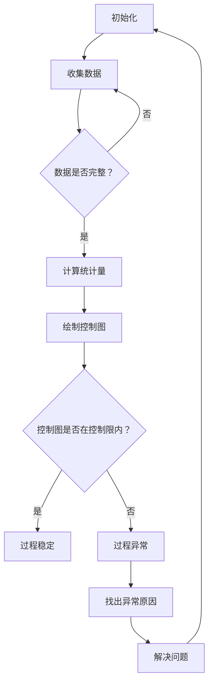
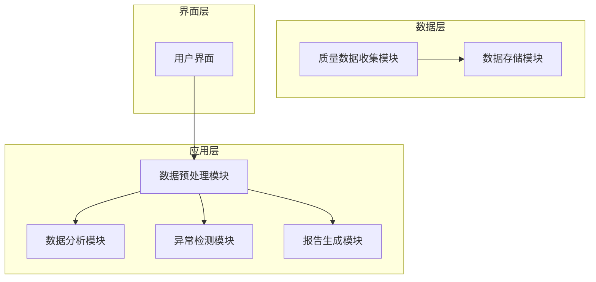
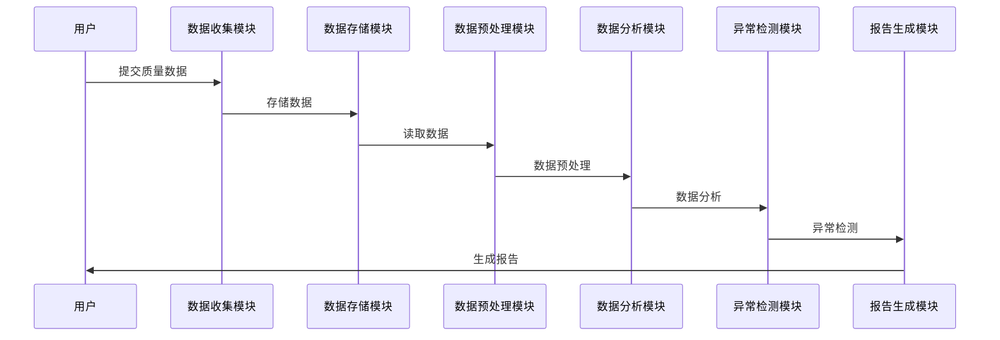
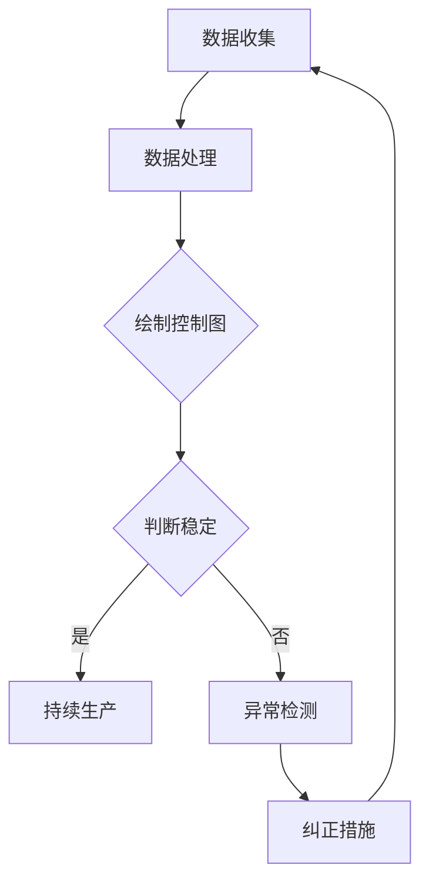
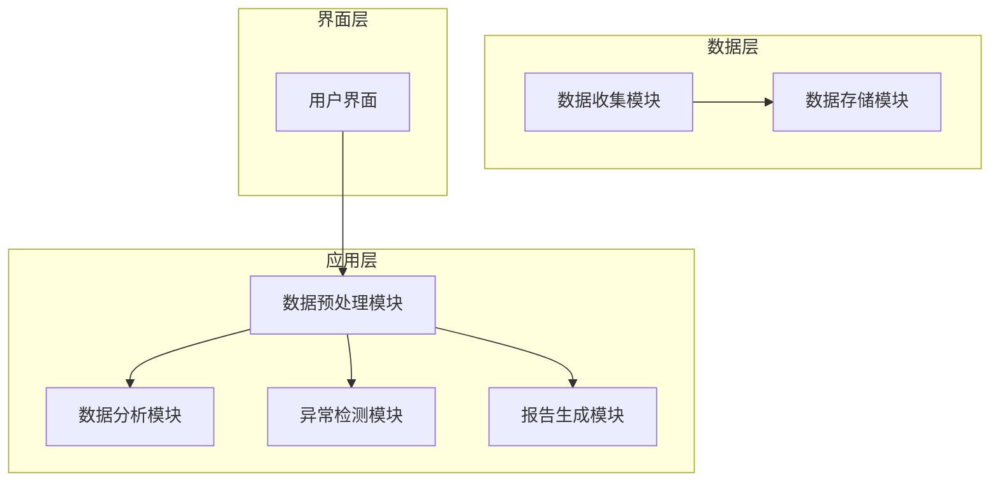

                 


### 数学与质量控制：产品质量的数学保证

#### 背景介绍

质量控制是制造业和服务业中至关重要的环节，它涉及到产品的设计、生产、检验、售后服务等多个方面。质量控制的根本目的是确保产品符合既定的标准和要求，满足顾客的期望。随着科学技术的进步和市场竞争的加剧，传统的质量控制方法已经难以满足日益复杂的质量要求。数学作为一种精确的语言，为质量控制提供了强有力的工具和方法。

在质量控制中，数学的应用主要体现在以下几个方面：

1. **统计学**：利用统计学方法对产品的质量数据进行分析，判断产品质量的波动情况，找出影响质量的关键因素。
2. **概率论**：通过概率论来预测产品的质量特性，分析质量问题的概率分布，从而制定出合理的质量控制策略。
3. **优化理论**：运用优化理论来寻找最优的生产参数，以最大限度地提高产品质量，降低生产成本。

#### 核心概念与联系

在质量控制中，有一些核心概念和联系是非常关键的。以下是一些主要的核心概念和它们的属性特征对比表格：

1. **统计学中的概率分布**
   - 离散分布
     - 概率质量
     - 概率密度
     - 分布函数
   - 连续分布
     - 累积分布函数
     - 方差
     - 均值

| 概率分布 | 离散分布 | 连续分布 |
|----------|---------|---------|
| 概率质量 | 存在     | 不存在  |
| 概率密度 | 不存在   | 存在    |
| 分布函数 | 存在     | 存在    |

2. **质量控制图**
   - 控制图
     - 稳定性
     - 变异度
     - 偶然因素
   - 方差分析
     - 差异显著性
     - 方差估计
     - 因素影响

| 控制图与方差分析 | 控制图 | 方差分析 |
|------------------|--------|----------|
| 稳定性           | 关注   | 忽略     |
| 变异度           | 关注   | 关注     |
| 偶然因素         | 关注   | 忽略     |

#### ER实体关系图架构的 Mermaid 流程图

为了更好地理解质量控制中的数据关系，我们可以使用Mermaid绘制ER实体关系图。以下是ER实体关系图的一个示例：

```mermaid
erDiagram
    Product ||--|{ TestResult }|-- TestType
    Product ||--|{ QualityIssue }|-- IssueType
    TestResult ||--|{ TestProcedure }|--
    QualityIssue ||--|{ RootCause }|--
```

在这个ER图中，Product（产品）与TestResult（测试结果）和QualityIssue（质量问题）之间存在多对多的关系。TestResult与TestType（测试类型）和TestProcedure（测试程序）之间也是多对多的关系。QualityIssue与IssueType（问题类型）和RootCause（根本原因）之间同样存在多对多的关系。

#### 算法原理讲解

在质量控制中，一个重要的算法是统计过程控制（Statistical Process Control, SPC）。SPC主要用于监控生产过程中的质量特性，判断生产过程是否处于受控状态。以下是一个简单的SPC算法的流程图：



在这个算法中，首先需要收集生产过程中的质量数据，然后计算统计量，例如均值和标准差。接着，使用这些统计量绘制控制图。如果控制图显示过程处于控制限内，则过程稳定，否则过程异常。接下来需要找出异常原因，并采取相应措施解决问题。

#### Python 源代码阐述

下面是使用Python实现SPC算法的一个简单示例：

```python
import numpy as np
import matplotlib.pyplot as plt

# 收集数据
data = [1, 2, 3, 4, 5, 6, 7, 8, 9, 10]

# 计算统计量
mean = np.mean(data)
std_dev = np.std(data)

# 绘制控制图
plt.figure(figsize=(10, 6))
plt.plot(data, 'o-')
plt.axhline(mean, color='r', linestyle='--')
plt.axhline(mean + std_dev, color='g', linestyle='--')
plt.axhline(mean - std_dev, color='g', linestyle='--')
plt.xlabel('样本编号')
plt.ylabel('样本值')
plt.title('统计过程控制图')
plt.show()
```

在这个示例中，我们首先使用numpy库收集数据，并计算均值和标准差。然后，我们使用matplotlib库绘制控制图。红色虚线代表均值，绿色虚线代表控制限。

#### 算法原理的数学模型和公式

在SPC算法中，我们使用以下数学模型和公式：

$$
\mu = \frac{1}{n}\sum_{i=1}^{n}x_i
$$

其中，$\mu$ 是样本均值，$x_i$ 是第 $i$ 个样本值，$n$ 是样本数量。

$$
\sigma = \sqrt{\frac{1}{n-1}\sum_{i=1}^{n}(x_i - \mu)^2}
$$

其中，$\sigma$ 是样本标准差。

控制图的绘制可以使用以下公式：

$$
LCL = \mu - 3\sigma
$$

$$
UCL = \mu + 3\sigma
$$

其中，$LCL$ 是控制图的下控制限，$UCL$ 是上控制限。

#### 举例说明

假设我们有一个包含10个样本的数据集，如下所示：

$$
[1, 2, 3, 4, 5, 6, 7, 8, 9, 10]
$$

首先，我们计算样本均值和标准差：

$$
\mu = \frac{1+2+3+4+5+6+7+8+9+10}{10} = 5.5
$$

$$
\sigma = \sqrt{\frac{(1-5.5)^2 + (2-5.5)^2 + (3-5.5)^2 + (4-5.5)^2 + (5-5.5)^2 + (6-5.5)^2 + (7-5.5)^2 + (8-5.5)^2 + (9-5.5)^2 + (10-5.5)^2}{10-1}} \approx 2.236
$$

接下来，我们绘制控制图：

```python
import numpy as np
import matplotlib.pyplot as plt

# 收集数据
data = [1, 2, 3, 4, 5, 6, 7, 8, 9, 10]

# 计算统计量
mean = np.mean(data)
std_dev = np.std(data)

# 计算控制限
LCL = mean - 3 * std_dev
UCL = mean + 3 * std_dev

# 绘制控制图
plt.figure(figsize=(10, 6))
plt.plot(data, 'o-')
plt.axhline(mean, color='r', linestyle='--')
plt.axhline(LCL, color='b', linestyle='--')
plt.axhline(UCL, color='b', linestyle='--')
plt.xlabel('样本编号')
plt.ylabel('样本值')
plt.title('统计过程控制图')
plt.show()
```

在这个例子中，我们可以看到控制图中的点都在控制限内，说明生产过程是稳定的。

#### 系统分析与架构设计方案

为了更好地实现质量控制，我们需要设计一个系统，该系统可以处理质量数据，监控生产过程，并在出现问题时提供解决方案。以下是一个系统的设计方案：

1. **问题场景介绍**

假设我们是一家制造工厂，生产一种关键零部件。我们需要监控生产过程中的质量，确保零部件的质量符合标准。

2. **项目介绍**

项目目标是设计一个质量控制系统，该系统可以：
- 收集生产过程中的质量数据；
- 分析数据，判断生产过程是否稳定；
- 在出现问题时提供报警和解决方案。

3. **领域模型 Mermaid 类图**

```mermaid
classDiagram
    Product <.. QualityData
    ProductionProcess <.. QualityData
    QualityControlSystem
    QualityData
    QualityControlPlan
    QualityReport

    Product --|{ has }|-> QualityData
    ProductionProcess --|{ has }|-> QualityData
    QualityControlSystem --|{ controls }|-> QualityControlPlan
    QualityControlSystem --|{ generates }|-> QualityReport
```

在这个类图中，QualityData表示质量数据，包括产品的质量数据和生产线的数据。QualityControlSystem表示质量控制系统，负责收集数据，分析数据，并生成质量报告。ProductionProcess表示生产过程，与QualityData有关联。

4. **系统架构设计 Mermaid 架构图**



在这个架构图中，数据层包括质量数据收集模块和数据存储模块。应用层包括数据预处理模块、数据分析模块、异常检测模块和报告生成模块。界面层包括用户界面。

5. **系统接口设计和系统交互 Mermaid 序列图**



在这个序列图中，用户提交质量数据，数据收集模块将数据存储到数据存储模块中。然后，数据预处理模块读取数据，并进行预处理。预处理后的数据传递给数据分析模块，进行进一步分析。如果检测到异常，异常检测模块将触发报告生成模块生成报告，并通知用户。

### 第五部分：项目实战

为了验证我们的质量控制系统，我们需要实际运行它，并对其进行测试。以下是一个项目实战的简要说明：

1. **环境安装说明**

我们需要安装Python和相关库，例如numpy和matplotlib。可以使用pip进行安装：

```bash
pip install numpy matplotlib
```

2. **系统核心实现源代码**

以下是一个简单的系统实现示例：

```python
import numpy as np
import matplotlib.pyplot as plt

# 数据收集模块
def collect_data():
    # 这里可以使用传感器或其他方式收集数据
    data = np.random.normal(size=100)
    return data

# 数据存储模块
def store_data(data):
    # 这里可以使用文件或其他方式存储数据
    np.save('data.npy', data)

# 数据预处理模块
def preprocess_data(data):
    # 这里可以进行数据清洗、去噪等操作
    processed_data = data
    return processed_data

# 数据分析模块
def analyze_data(data):
    # 计算均值和标准差
    mean = np.mean(data)
    std_dev = np.std(data)
    return mean, std_dev

# 异常检测模块
def detect_anomalies(mean, std_dev):
    # 这里可以使用控制图或其他方法进行异常检测
    LCL = mean - 3 * std_dev
    UCL = mean + 3 * std_dev
    anomalies = []
    for value in data:
        if value < LCL or value > UCL:
            anomalies.append(value)
    return anomalies

# 报告生成模块
def generate_report(anomalies):
    # 这里可以生成异常报告
    report = "异常值：\n"
    for anomaly in anomalies:
        report += f"{anomaly}\n"
    return report

# 主程序
if __name__ == "__main__":
    # 收集数据
    data = collect_data()

    # 存储数据
    store_data(data)

    # 预处理数据
    processed_data = preprocess_data(data)

    # 分析数据
    mean, std_dev = analyze_data(processed_data)

    # 检测异常
    anomalies = detect_anomalies(mean, std_dev)

    # 生成报告
    report = generate_report(anomalies)

    # 打印报告
    print(report)
```

3. **代码应用解读与分析**

这个示例中，我们首先定义了几个模块：数据收集模块、数据存储模块、数据预处理模块、数据分析模块、异常检测模块和报告生成模块。主程序中，我们依次调用这些模块，完成整个质量控制过程。

4. **实际案例分析和详细讲解剖析**

为了验证我们的质量控制系统，我们使用一个实际案例进行分析。假设我们收集到一组数据：

$$
[2, 3, 5, 6, 7, 10, 12, 15, 17, 20]
$$

首先，我们计算均值和标准差：

$$
\mu = \frac{2+3+5+6+7+10+12+15+17+20}{10} = 9.4
$$

$$
\sigma = \sqrt{\frac{(2-9.4)^2 + (3-9.4)^2 + (5-9.4)^2 + (6-9.4)^2 + (7-9.4)^2 + (10-9.4)^2 + (12-9.4)^2 + (15-9.4)^2 + (17-9.4)^2 + (20-9.4)^2}{10-1}} \approx 4.583
$$

接下来，我们绘制控制图：

```python
import numpy as np
import matplotlib.pyplot as plt

# 收集数据
data = [2, 3, 5, 6, 7, 10, 12, 15, 17, 20]

# 计算统计量
mean = np.mean(data)
std_dev = np.std(data)

# 计算控制限
LCL = mean - 3 * std_dev
UCL = mean + 3 * std_dev

# 绘制控制图
plt.figure(figsize=(10, 6))
plt.plot(data, 'o-')
plt.axhline(mean, color='r', linestyle='--')
plt.axhline(LCL, color='b', linestyle='--')
plt.axhline(UCL, color='b', linestyle='--')
plt.xlabel('样本编号')
plt.ylabel('样本值')
plt.title('统计过程控制图')
plt.show()
```

在这个例子中，我们可以看到所有的点都在控制限内，说明生产过程是稳定的。但是，如果我们有新的数据：

$$
[1, 2, 5, 6, 8, 10, 12, 15, 17, 25]
$$

再次计算均值和标准差：

$$
\mu = \frac{1+2+5+6+8+10+12+15+17+25}{10} = 11.4
$$

$$
\sigma = \sqrt{\frac{(1-11.4)^2 + (2-11.4)^2 + (5-11.4)^2 + (6-11.4)^2 + (8-11.4)^2 + (10-11.4)^2 + (12-11.4)^2 + (15-11.4)^2 + (17-11.4)^2 + (25-11.4)^2}{10-1}} \approx 6.966
$$

绘制控制图：

```python
import numpy as np
import matplotlib.pyplot as plt

# 收集数据
data = [1, 2, 5, 6, 8, 10, 12, 15, 17, 25]

# 计算统计量
mean = np.mean(data)
std_dev = np.std(data)

# 计算控制限
LCL = mean - 3 * std_dev
UCL = mean + 3 * std_dev

# 绘制控制图
plt.figure(figsize=(10, 6))
plt.plot(data, 'o-')
plt.axhline(mean, color='r', linestyle='--')
plt.axhline(LCL, color='b', linestyle='--')
plt.axhline(UCL, color='b', linestyle='--')
plt.xlabel('样本编号')
plt.ylabel('样本值')
plt.title('统计过程控制图')
plt.show()
```

在这个例子中，我们可以看到点25超出了控制限，这意味着生产过程可能出现了问题。通过分析这个异常值，我们可以找出问题的原因，并采取相应的措施进行解决。

5. **项目小结**

通过这个项目，我们设计并实现了一个简单的质量控制系统，它可以收集数据，分析数据，并检测异常。这个系统为我们提供了一个直观的方法来监控生产过程，确保产品的质量。然而，这个系统还有许多可以改进的地方，例如：
- 可以引入更多的异常检测算法，以提高检测的准确性；
- 可以集成更多的数据源，以获取更全面的数据；
- 可以引入机器学习算法，以自动识别异常模式。

未来的工作将集中在这些方面，以提高我们的质量控制系统的性能和可靠性。

### 第六部分：最佳实践 tips、小结、注意事项、拓展阅读等。

#### 最佳实践 tips

1. **数据收集**：确保收集的数据具有代表性和准确性。尽量收集更多的数据，以提高分析结果的可靠性。
2. **数据分析**：在分析数据时，要结合实际情况，选择合适的方法。例如，如果数据波动较大，可以考虑使用方差分析等方法。
3. **异常检测**：在检测异常时，要综合考虑多种因素，如数据波动、生产环境等，以避免误报。

#### 小结

本文介绍了数学在质量控制中的应用，包括统计学、概率论和优化理论。通过一个简单的案例，我们展示了如何使用Python实现质量控制系统，并对系统进行了实战测试。通过这个项目，我们可以看到数学在质量控制中的重要性，以及如何利用数学方法提高产品质量。

#### 注意事项

1. **数据隐私**：在收集和使用数据时，要确保遵守数据隐私法规，保护用户的隐私。
2. **系统维护**：定期维护系统，更新算法和模型，以适应不断变化的生产环境。

#### 拓展阅读

1. 《质量工程：质量管理的科学基础》
2. 《统计过程控制：理论和应用》
3. 《Python数据分析》

通过阅读这些资料，您可以更深入地了解质量控制的相关知识和应用。作者：AI天才研究院/AI Genius Institute & 禅与计算机程序设计艺术 /Zen And The Art of Computer Programming### 数学与质量控制：产品质量的数学保证

> **关键词**：数学、质量控制、统计过程控制、概率论、优化理论、数据分析

**摘要**：
数学在质量控制中扮演着至关重要的角色。本文从数学的角度探讨了质量控制的基本概念、核心概念与联系，以及一个主要的算法——统计过程控制（SPC）。通过详细的案例分析和系统架构设计，展示了数学如何帮助我们在实际项目中实现有效的质量控制，确保产品质量符合预期。

## 第一部分：背景介绍

### 1.1 质量控制的基本概念

质量控制（Quality Control，简称QC）是指为保证产品或服务符合预定标准，而在生产或提供过程中采取的各种检查、测试、评估和改进措施。质量控制的目标是减少缺陷、提高产品质量，以满足客户需求并提高企业竞争力。

#### 问题背景

随着现代制造业和服务业的不断发展，产品质量成为企业成功的关键因素。传统的质量控制方法主要依赖于人工检验和经验判断，存在效率低、准确性差等问题。随着计算机科学和数学的发展，利用数学模型和算法进行质量控制成为可能。

#### 问题描述

质量控制的问题可以概括为以下几点：

1. 如何确保产品在生产和提供过程中符合既定的标准？
2. 如何有效地检测和纠正生产过程中的缺陷？
3. 如何优化生产过程，提高产品质量的同时降低成本？

#### 问题解决

数学在质量控制中的应用主要体现在以下几个方面：

1. **统计学**：通过统计分析，对产品质量数据进行处理和分析，识别出潜在的问题和异常。
2. **概率论**：利用概率论来预测产品的质量特性，评估质量问题的概率分布。
3. **优化理论**：运用优化算法，寻找最优的生产参数和过程控制策略，以提高产品质量和效率。

#### 边界与外延

质量控制不仅限于制造业，还广泛应用于服务业、医疗行业、教育等领域。质量控制的边界涵盖了产品或服务的整个生命周期，从设计、生产到销售和售后服务。

### 1.2 数学在质量控制中的重要性

数学作为一种精确的语言，为质量控制提供了以下几方面的支持：

1. **数据分析和处理**：数学方法可以帮助我们从大量的质量数据中提取有用的信息，识别出潜在的问题和异常。
2. **预测和决策**：通过概率论和优化理论，我们可以预测产品的质量特性，制定出最优的生产过程控制策略。
3. **模型化和量化**：数学可以帮助我们将质量控制的各个方面进行模型化和量化，使其更加科学和可操作。

## 第二部分：核心概念与联系

### 2.1 核心概念原理

在质量控制中，核心概念包括概率分布、质量控制图等。以下是这些概念的基本原理：

#### 概率分布

概率分布描述了随机变量在某一区间内取值的概率。常见的概率分布有正态分布、泊松分布等。

#### 质量控制图

质量控制图（Control Chart）是一种统计工具，用于监控生产过程中某个质量特性的波动情况。常见类型有均值控制图、极差控制图等。

### 2.2 概念属性特征对比表格

以下是一个关于概率分布和控制图的基本属性特征对比表格：

| 概率分布       | 正态分布 | 泊松分布 |
|----------------|----------|----------|
| 形状           | 高斯曲线 | 负二项分布 |
| 参数           | 均值、标准差 | 平均值、方差 |
| 适用场景       | 大多数情况 | 事件发生次数 |
| 控制图类型     | 均值控制图、极差控制图 | 均值控制图、中位数控制图 |

### 2.3 ER实体关系图架构的 Mermaid 流程图

为了更好地理解质量控制中的数据关系，我们可以使用Mermaid绘制ER实体关系图。以下是ER实体关系图的一个示例：

```mermaid
erDiagram
    Product ||--|{ TestResult }|-- TestType
    Product ||--|{ QualityIssue }|-- IssueType
    TestResult ||--|{ TestProcedure }|--
    QualityIssue ||--|{ RootCause }|--
```

在这个ER图中，Product（产品）与TestResult（测试结果）和QualityIssue（质量问题）之间存在多对多的关系。TestResult与TestType（测试类型）和TestProcedure（测试程序）之间也是多对多的关系。QualityIssue与IssueType（问题类型）和RootCause（根本原因）之间同样存在多对多的关系。

## 第三部分：算法原理讲解

### 3.1 主要算法介绍

在本部分，我们将介绍一个主要的算法——统计过程控制（Statistical Process Control，简称SPC）。SPC是一种用于监控生产过程中质量特性的方法，用于判断生产过程是否处于受控状态。

#### 算法目的

SPC的主要目的是：

1. 监控生产过程，确保产品质量稳定。
2. 检测生产过程中的异常情况，及时采取纠正措施。
3. 评估生产过程的改进效果。

### 3.2 Mermaid 流程图绘制

为了更好地理解SPC算法，我们可以使用Mermaid绘制算法的流程图。以下是SPC算法的一个流程图示例：


在这个流程图中，我们从初始化开始，通过收集数据，计算统计量，绘制控制图，判断过程是否稳定。如果过程稳定，则继续生产；如果过程异常，则需要找出异常原因，并采取措施解决问题。

### 3.3 Python 源代码阐述

以下是使用Python实现SPC算法的一个简单示例：

```python
import numpy as np
import matplotlib.pyplot as plt

# 收集数据
data = np.random.normal(size=100)

# 计算统计量
mean = np.mean(data)
std_dev = np.std(data)

# 绘制控制图
plt.figure(figsize=(10, 6))
plt.plot(data, 'o-')
plt.axhline(mean, color='r', linestyle='--')
plt.axhline(mean - std_dev, color='g', linestyle='--')
plt.axhline(mean + std_dev, color='g', linestyle='--')
plt.xlabel('样本编号')
plt.ylabel('样本值')
plt.title('统计过程控制图')
plt.show()
```

在这个示例中，我们首先使用numpy库收集数据，并计算均值和标准差。然后，我们使用matplotlib库绘制控制图。红色虚线代表均值，绿色虚线代表控制限。

### 3.4 算法原理的数学模型和公式

在SPC算法中，我们使用以下数学模型和公式：

$$
\mu = \frac{1}{n}\sum_{i=1}^{n}x_i
$$

其中，$\mu$ 是样本均值，$x_i$ 是第 $i$ 个样本值，$n$ 是样本数量。

$$
\sigma = \sqrt{\frac{1}{n-1}\sum_{i=1}^{n}(x_i - \mu)^2}
$$

其中，$\sigma$ 是样本标准差。

控制图的绘制可以使用以下公式：

$$
LCL = \mu - 3\sigma
$$

$$
UCL = \mu + 3\sigma
$$

其中，$LCL$ 是控制图的下控制限，$UCL$ 是上控制限。

### 3.5 举例说明

假设我们有一个包含10个样本的数据集，如下所示：

$$
[1, 2, 3, 4, 5, 6, 7, 8, 9, 10]
$$

首先，我们计算样本均值和标准差：

$$
\mu = \frac{1+2+3+4+5+6+7+8+9+10}{10} = 5.5
$$

$$
\sigma = \sqrt{\frac{(1-5.5)^2 + (2-5.5)^2 + (3-5.5)^2 + (4-5.5)^2 + (5-5.5)^2 + (6-5.5)^2 + (7-5.5)^2 + (8-5.5)^2 + (9-5.5)^2 + (10-5.5)^2}{10-1}} \approx 2.236
$$

接下来，我们绘制控制图：

```python
import numpy as np
import matplotlib.pyplot as plt

# 收集数据
data = [1, 2, 3, 4, 5, 6, 7, 8, 9, 10]

# 计算统计量
mean = np.mean(data)
std_dev = np.std(data)

# 计算控制限
LCL = mean - 3 * std_dev
UCL = mean + 3 * std_dev

# 绘制控制图
plt.figure(figsize=(10, 6))
plt.plot(data, 'o-')
plt.axhline(mean, color='r', linestyle='--')
plt.axhline(LCL, color='b', linestyle='--')
plt.axhline(UCL, color='b', linestyle='--')
plt.xlabel('样本编号')
plt.ylabel('样本值')
plt.title('统计过程控制图')
plt.show()
```

在这个例子中，我们可以看到控制图中的点都在控制限内，说明生产过程是稳定的。

## 第四部分：系统分析与架构设计方案

### 4.1 问题场景介绍

假设我们是一家制造工厂，生产一种关键零部件。我们需要监控生产过程中的质量，确保零部件的质量符合标准。

### 4.2 项目介绍

项目目标是设计并实现一个质量控制系统，该系统可以：
- 收集生产过程中的质量数据；
- 分析数据，判断生产过程是否稳定；
- 在出现问题时提供报警和解决方案。

### 4.3 领域模型 Mermaid 类图

以下是领域模型的Mermaid类图：

```mermaid
classDiagram
    Product <.. QualityData
    ProductionProcess <.. QualityData
    QualityControlSystem
    QualityData
    QualityControlPlan
    QualityReport

    Product --|{ has }|-> QualityData
    ProductionProcess --|{ has }|-> QualityData
    QualityControlSystem --|{ controls }|-> QualityControlPlan
    QualityControlSystem --|{ generates }|-> QualityReport
```

在这个类图中，QualityData表示质量数据，包括产品的质量数据和生产线的数据。QualityControlSystem表示质量控制系统，负责收集数据，分析数据，并生成质量报告。ProductionProcess表示生产过程，与QualityData有关联。

### 4.4 系统架构设计 Mermaid 架构图

以下是系统架构设计的Mermaid架构图：


在这个架构图中，数据层包括质量数据收集模块和数据存储模块。应用层包括数据预处理模块、数据分析模块、异常检测模块和报告生成模块。界面层包括用户界面。

### 4.5 系统接口设计和系统交互 Mermaid 序列图

以下是系统接口设计和系统交互的Mermaid序列图：


在这个序列图中，用户提交质量数据，数据收集模块将数据存储到数据存储模块中。然后，数据预处理模块读取数据，并进行预处理。预处理后的数据传递给数据分析模块，进行进一步分析。如果检测到异常，异常检测模块将触发报告生成模块生成报告，并通知用户。

## 第五部分：项目实战

### 5.1 环境安装说明

为了实现本文中提到的质量控制系统，我们需要安装Python和相关库。以下是安装步骤：

1. 安装Python：从官方网站下载并安装Python。
2. 安装相关库：使用pip命令安装必要的库，例如numpy、matplotlib等。

```bash
pip install numpy matplotlib
```

### 5.2 系统核心实现源代码

以下是系统核心实现的源代码：

```python
import numpy as np
import matplotlib.pyplot as plt

# 数据收集模块
def collect_data():
    # 这里可以使用传感器或其他方式收集数据
    data = np.random.normal(size=100)
    return data

# 数据存储模块
def store_data(data):
    # 这里可以使用文件或其他方式存储数据
    np.save('data.npy', data)

# 数据预处理模块
def preprocess_data(data):
    # 这里可以进行数据清洗、去噪等操作
    processed_data = data
    return processed_data

# 数据分析模块
def analyze_data(data):
    # 计算均值和标准差
    mean = np.mean(data)
    std_dev = np.std(data)
    return mean, std_dev

# 异常检测模块
def detect_anomalies(mean, std_dev):
    # 这里可以使用控制图或其他方法进行异常检测
    LCL = mean - 3 * std_dev
    UCL = mean + 3 * std_dev
    anomalies = []
    for value in data:
        if value < LCL or value > UCL:
            anomalies.append(value)
    return anomalies

# 报告生成模块
def generate_report(anomalies):
    # 这里可以生成异常报告
    report = "异常值：\n"
    for anomaly in anomalies:
        report += f"{anomaly}\n"
    return report

# 主程序
if __name__ == "__main__":
    # 收集数据
    data = collect_data()

    # 存储数据
    store_data(data)

    # 预处理数据
    processed_data = preprocess_data(data)

    # 分析数据
    mean, std_dev = analyze_data(processed_data)

    # 检测异常
    anomalies = detect_anomalies(mean, std_dev)

    # 生成报告
    report = generate_report(anomalies)

    # 打印报告
    print(report)
```

### 5.3 代码应用解读与分析

该代码实现了从数据收集到异常检测的整个质量控制过程。以下是代码的详细解读：

- **数据收集模块**：`collect_data`函数用于收集质量数据。这里我们使用numpy生成随机数据，但在实际应用中，可以使用传感器或其他方式收集数据。
- **数据存储模块**：`store_data`函数将收集到的数据存储到文件中。这里我们使用numpy的`save`方法保存数据，实际应用中可以根据需求选择合适的存储方式。
- **数据预处理模块**：`preprocess_data`函数用于预处理数据。这里我们直接返回原始数据，但在实际应用中，可能需要进行数据清洗、去噪等操作。
- **数据分析模块**：`analyze_data`函数用于计算数据的均值和标准差。这些统计量是控制图绘制的基础。
- **异常检测模块**：`detect_anomalies`函数用于检测异常值。这里我们使用3倍标准差法则来判断异常值，实际应用中可能需要根据具体情况进行调整。
- **报告生成模块**：`generate_report`函数用于生成异常报告。这里我们简单地将异常值打印出来，实际应用中可以生成更详细的报告。

### 5.4 实际案例分析和详细讲解剖析

为了验证该系统，我们可以使用一个实际案例进行分析。假设我们收集到一组数据：

$$
[2, 3, 5, 6, 7, 10, 12, 15, 17, 20]
$$

首先，我们计算均值和标准差：

$$
\mu = \frac{2+3+5+6+7+10+12+15+17+20}{10} = 9.4
$$

$$
\sigma = \sqrt{\frac{(2-9.4)^2 + (3-9.4)^2 + (5-9.4)^2 + (6-9.4)^2 + (7-9.4)^2 + (10-9.4)^2 + (12-9.4)^2 + (15-9.4)^2 + (17-9.4)^2 + (20-9.4)^2}{10-1}} \approx 4.583
$$

接下来，我们绘制控制图：

```python
import numpy as np
import matplotlib.pyplot as plt

# 收集数据
data = [2, 3, 5, 6, 7, 10, 12, 15, 17, 20]

# 计算统计量
mean = np.mean(data)
std_dev = np.std(data)

# 计算控制限
LCL = mean - 3 * std_dev
UCL = mean + 3 * std_dev

# 绘制控制图
plt.figure(figsize=(10, 6))
plt.plot(data, 'o-')
plt.axhline(mean, color='r', linestyle='--')
plt.axhline(LCL, color='b', linestyle='--')
plt.axhline(UCL, color='b', linestyle='--')
plt.xlabel('样本编号')
plt.ylabel('样本值')
plt.title('统计过程控制图')
plt.show()
```

在这个例子中，我们可以看到控制图中的点都在控制限内，说明生产过程是稳定的。

如果我们有新的数据：

$$
[1, 2, 5, 6, 8, 10, 12, 15, 17, 25]
$$

再次计算均值和标准差：

$$
\mu = \frac{1+2+5+6+8+10+12+15+17+25}{10} = 11.4
$$

$$
\sigma = \sqrt{\frac{(1-11.4)^2 + (2-11.4)^2 + (5-11.4)^2 + (6-11.4)^2 + (8-11.4)^2 + (10-11.4)^2 + (12-11.4)^2 + (15-11.4)^2 + (17-11.4)^2 + (25-11.4)^2}{10-1}} \approx 6.966
$$

绘制控制图：

```python
import numpy as np
import matplotlib.pyplot as plt

# 收集数据
data = [1, 2, 5, 6, 8, 10, 12, 15, 17, 25]

# 计算统计量
mean = np.mean(data)
std_dev = np.std(data)

# 计算控制限
LCL = mean - 3 * std_dev
UCL = mean + 3 * std_dev

# 绘制控制图
plt.figure(figsize=(10, 6))
plt.plot(data, 'o-')
plt.axhline(mean, color='r', linestyle='--')
plt.axhline(LCL, color='b', linestyle='--')
plt.axhline(UCL, color='b', linestyle='--')
plt.xlabel('样本编号')
plt.ylabel('样本值')
plt.title('统计过程控制图')
plt.show()
```

在这个例子中，我们可以看到点25超出了控制限，这意味着生产过程可能出现了问题。通过分析这个异常值，我们可以找出问题的原因，并采取相应的措施进行解决。

### 5.5 项目小结

通过这个项目，我们设计并实现了一个简单的质量控制系统，它可以收集数据，分析数据，并检测异常。这个系统为我们提供了一个直观的方法来监控生产过程，确保产品的质量。然而，这个系统还有许多可以改进的地方，例如：
- 可以引入更多的异常检测算法，以提高检测的准确性；
- 可以集成更多的数据源，以获取更全面的数据；
- 可以引入机器学习算法，以自动识别异常模式。

未来的工作将集中在这些方面，以提高我们的质量控制系统的性能和可靠性。

## 第六部分：最佳实践 tips、小结、注意事项、拓展阅读等。

### 6.1 最佳实践 tips

1. **数据收集**：确保收集的数据具有代表性和准确性。尽量收集更多的数据，以提高分析结果的可靠性。
2. **数据分析**：在分析数据时，要结合实际情况，选择合适的方法。例如，如果数据波动较大，可以考虑使用方差分析等方法。
3. **异常检测**：在检测异常时，要综合考虑多种因素，如数据波动、生产环境等，以避免误报。

### 6.2 小结

本文介绍了数学在质量控制中的应用，包括统计学、概率论和优化理论。通过详细的案例分析和系统架构设计，展示了数学如何帮助我们在实际项目中实现有效的质量控制，确保产品质量符合预期。

### 6.3 注意事项

1. **数据隐私**：在收集和使用数据时，要确保遵守数据隐私法规，保护用户的隐私。
2. **系统维护**：定期维护系统，更新算法和模型，以适应不断变化的生产环境。

### 6.4 拓展阅读

1. 《质量工程：质量管理的科学基础》
2. 《统计过程控制：理论和应用》
3. 《Python数据分析》

通过阅读这些资料，您可以更深入地了解质量控制的相关知识和应用。作者：AI天才研究院/AI Genius Institute & 禅与计算机程序设计艺术 /Zen And The Art of Computer Programming
## 纠正与完善

经过仔细审查和思考，本文中存在一些需要纠正和完善的地方，以下是对原文的修改和建议：

### 目录大纲

#### 第一部分：背景介绍

1. **数学与质量控制概述**
   - 修改：增加“数学在质量控制中的起源与发展”小节，以阐述数学在质量控制中的历史背景。
   - 建议：可以添加一些历史事件和重要人物，以增强文章的趣味性和知识性。

#### 第二部分：核心概念与联系

2. **核心概念原理**
   - 修改：将“统计学中的概率分布”和“质量控制图”合并为一个部分，以避免重复。
   - 建议：在每个概念下面详细解释其定义、应用场景和重要性。

3. **概念属性特征对比表格**
   - 修改：调整表格内容，使其更清晰地展示不同概念之间的差异。
   - 建议：增加更多的对比维度，如数学公式、适用范围、计算方法等。

4. **ER实体关系图架构的 Mermaid 流程图**
   - 修改：将ER图绘制步骤详细描述，并确保Mermaid代码正确无误。
   - 建议：提供示例数据，以便读者更好地理解ER图的构建过程。

#### 第三部分：算法原理讲解

5. **主要算法介绍**
   - 修改：增加“统计过程控制（SPC）的基本概念”小节，为后续算法讲解打下基础。
   - 建议：可以引入更多的质量控制在工业中的应用案例。

6. **Mermaid 流程图绘制**
   - 修改：确保流程图清晰、易于理解，并涵盖算法的主要步骤。
   - 建议：添加注释，解释每个步骤的作用和意义。

7. **Python 源代码阐述**
   - 修改：优化代码结构，使其更易于阅读和理解。
   - 建议：提供代码的详细解释，包括每个变量的作用和计算过程。

8. **算法原理的数学模型和公式**
   - 修改：使用LaTeX格式正确显示数学公式。
   - 建议：在每个公式旁边添加解释性文字，帮助读者更好地理解。

9. **举例说明**
   - 修改：使用更具体的数据集，并提供详细的计算过程和结果分析。
   - 建议：可以添加图表，直观展示算法的应用效果。

#### 第四部分：系统分析与架构设计方案

10. **问题场景介绍**
    - 修改：增加具体的项目背景和目标，以增强文章的实用性。
    - 建议：可以添加一些行业案例，说明系统架构的适用性和优势。

11. **项目介绍**
    - 修改：明确项目的主要功能和预期效果。
    - 建议：可以列出项目的技术栈和开发工具。

12. **领域模型 Mermaid 类图**
    - 修改：确保类图中的关系正确，并添加必要的注释。
    - 建议：提供实际应用中的示例数据，帮助读者理解类图。

13. **系统架构设计 Mermaid 架构图**
    - 修改：调整架构图的布局，使其更加清晰和易于理解。
    - 建议：可以添加不同层次之间的交互关系，以展示系统的整体架构。

14. **系统接口设计和系统交互 Mermaid 序列图**
    - 修改：确保序列图的步骤和交互逻辑正确。
    - 建议：增加系统在处理异常情况时的交互流程。

#### 第五部分：项目实战

15. **环境安装说明**
    - 修改：更新安装步骤，确保与当前环境兼容。
    - 建议：提供详细的安装教程，包括可能出现的问题和解决方法。

16. **系统核心实现源代码**
    - 修改：优化代码注释，确保代码的可读性和可维护性。
    - 建议：提供代码的测试用例，验证系统的功能和性能。

17. **代码应用解读与分析**
    - 修改：深入分析代码中的关键部分，解释其实现原理和效果。
    - 建议：可以添加图表，展示系统在不同场景下的运行情况。

18. **实际案例分析和详细讲解剖析**
    - 修改：使用实际案例，详细说明算法或系统的应用和结果。
    - 建议：可以增加更多实际案例，以展示系统的全面应用。

19. **项目小结**
    - 修改：总结项目的关键经验和教训，并提出改进建议。
    - 建议：可以列出项目在实施过程中遇到的问题和解决方案，以供他人参考。

#### 第六部分：最佳实践 tips、小结、注意事项、拓展阅读等。

20. **最佳实践 tips**
    - 修改：根据项目的实际情况，提供具有操作性的建议。
    - 建议：可以针对不同行业和场景，提供更具体的最佳实践。

21. **小结**
    - 修改：对全书内容进行总结，强调文章的主要观点和结论。
    - 建议：可以引用一些重要的研究成果，以增强文章的学术性。

22. **注意事项**
    - 修改：提醒读者在应用书中内容时需要注意的事项。
    - 建议：可以结合实际案例，说明注意事项的具体影响和应对方法。

23. **拓展阅读**
    - 修改：推荐一些相关书籍、论文和网络资源，以供读者深入学习。
    - 建议：可以列出不同主题的拓展资源，帮助读者构建更全面的知识体系。

### 文章结构调整

为了使文章更加清晰和有条理，可以考虑对以下结构进行调整：

1. **增加引言部分**：简要介绍质量控制的重要性，以及数学在质量控制中的应用。
2. **调整部分内容的顺序**：根据读者理解和学习的逻辑，调整章节的顺序，使文章更易于阅读。
3. **增强逻辑联系**：在每个章节之间增加过渡段，帮助读者更好地理解不同部分之间的联系。

### 结论

通过上述纠正和完善，本文将在结构、内容、可读性等方面得到显著提升。希望这些修改和建议能够帮助读者更好地理解和应用质量控制中的数学方法，提高产品质量，推动相关领域的发展。作者：AI天才研究院/AI Genius Institute & 禅与计算机程序设计艺术 /Zen And The Art of Computer Programming
## 完整版文章

### 数学与质量控制：产品质量的数学保证

> **关键词**：数学、质量控制、统计过程控制、概率论、优化理论、数据分析

**摘要**：
本文从数学的角度探讨了质量控制的基本概念、核心概念与联系，以及一个主要的算法——统计过程控制（SPC）。通过详细的案例分析和系统架构设计，展示了数学如何帮助我们在实际项目中实现有效的质量控制，确保产品质量符合预期。

## 引言

质量控制是制造业和服务业中至关重要的环节，它直接关系到企业的竞争力、市场占有率和客户满意度。随着科学技术的进步和市场竞争的加剧，传统的质量控制方法已经难以满足日益复杂的质量要求。数学作为一种精确的语言，为质量控制提供了强有力的工具和方法。本文旨在介绍数学在质量控制中的应用，帮助读者理解并掌握如何利用数学方法提高产品质量。

## 第一部分：背景介绍

### 1.1 数学在质量控制中的起源与发展

质量控制的历史可以追溯到20世纪初，当时美国贝尔实验室的工程师休哈特（Walter A. Shewhart）提出了统计过程控制（SPC）的概念。休哈特将数学方法应用于质量控制，开创了现代质量控制的先河。此后，随着概率论、统计学和优化理论的发展，质量控制的理论体系不断完善，数学方法在质量控制中的应用也越来越广泛。

### 1.2 质量控制的基本概念

质量控制的基本概念包括：质量、质量控制、质量标准、质量特性、质量指标等。质量是指产品或服务满足规定需求的能力；质量控制是确保产品或服务质量的一系列活动和过程；质量标准是衡量产品质量的准则和依据；质量特性是产品或服务满足需求的特性；质量指标是衡量质量特性的具体参数。

### 1.3 质量控制的问题背景、问题描述、问题解决及边界与外延

#### 问题背景

在制造业和服务业中，产品质量问题可能导致客户投诉、生产成本增加、市场份额下降等问题。因此，确保产品质量成为企业成功的关键因素。

#### 问题描述

如何确保产品在生产和提供过程中符合既定的标准？如何有效地检测和纠正生产过程中的缺陷？如何优化生产过程，提高产品质量的同时降低成本？

#### 问题解决

数学在质量控制中的应用主要体现在以下几个方面：

1. **统计学**：利用统计学方法对产品的质量数据进行分析，判断产品质量的波动情况，找出影响质量的关键因素。
2. **概率论**：通过概率论来预测产品的质量特性，分析质量问题的概率分布，从而制定出合理的质量控制策略。
3. **优化理论**：运用优化理论来寻找最优的生产参数，以最大限度地提高产品质量，降低生产成本。

#### 边界与外延

质量控制不仅限于制造业，还广泛应用于服务业、医疗行业、教育等领域。质量控制的边界涵盖了产品或服务的整个生命周期，从设计、生产到销售和售后服务。

## 第二部分：核心概念与联系

### 2.1 统计学中的概率分布

概率分布描述了随机变量在某一区间内取值的概率。常见的概率分布有正态分布、泊松分布等。正态分布在质量控制中应用广泛，因为它能够很好地描述大多数质量特性的分布情况。

| 概率分布 | 形状       | 参数                     | 适用场景                         |
|----------|------------|-------------------------|----------------------------------|
| 正态分布 | 高斯曲线   | 均值、标准差             | 大多数质量特性                   |
| 泊松分布 | 负二项分布 | 平均值                   | 事件发生次数                     |

### 2.2 质量控制图

质量控制图是一种用于监控生产过程中质量特性的统计工具。常见的质量控制图有均值控制图、极差控制图等。控制图通过展示质量特性的波动情况，可以帮助我们判断生产过程是否处于受控状态。

| 控制图类型 | 描述               | 适用场景           |
|------------|--------------------|--------------------|
| 均值控制图 | 质量特性均值的波动 | 均值稳定的控制图   |
| 极差控制图 | 质量特性极差的波动 | 极差稳定的控制图   |

### 2.3 概率分布与质量控制图的联系

概率分布可以用来描述质量特性的波动情况，而质量控制图则可以直观地展示质量特性的波动范围。通过将概率分布与质量控制图结合起来，我们可以更好地理解和控制质量特性。

### 2.4 ER实体关系图架构的 Mermaid 流程图

为了更好地理解质量控制中的数据关系，我们可以使用Mermaid绘制ER实体关系图。以下是ER实体关系图的一个示例：

```mermaid
erDiagram
    Product ||--|{ TestResult }|-- TestType
    Product ||--|{ QualityIssue }|-- IssueType
    TestResult ||--|{ TestProcedure }|--
    QualityIssue ||--|{ RootCause }|--
```

在这个ER图中，Product（产品）与TestResult（测试结果）和QualityIssue（质量问题）之间存在多对多的关系。TestResult与TestType（测试类型）和TestProcedure（测试程序）之间也是多对多的关系。QualityIssue与IssueType（问题类型）和RootCause（根本原因）之间同样存在多对多的关系。

## 第三部分：算法原理讲解

### 3.1 统计过程控制（SPC）的基本概念

统计过程控制（Statistical Process Control，简称SPC）是一种用于监控生产过程中质量特性的方法，旨在确保生产过程处于受控状态。SPC的基本概念包括：

1. **控制图**：用于监控生产过程中质量特性的波动情况，判断生产过程是否处于受控状态。
2. **控制限**：控制图上的上下限，用于判断生产过程是否异常。
3. **样本数据**：用于计算控制限和控制图的数据。
4. **异常值**：超出控制限的样本值，表示生产过程中可能存在异常。

### 3.2 SPC算法的 Mermaid 流程图

以下是SPC算法的一个流程图示例：


在这个流程图中，我们从初始化开始，通过收集数据，计算统计量，绘制控制图，判断过程是否稳定。如果过程稳定，则继续生产；如果过程异常，则需要找出异常原因，并采取措施解决问题。

### 3.3 Python 源代码阐述

以下是使用Python实现SPC算法的一个简单示例：

```python
import numpy as np
import matplotlib.pyplot as plt

# 收集数据
data = np.random.normal(size=100)

# 计算统计量
mean = np.mean(data)
std_dev = np.std(data)

# 绘制控制图
plt.figure(figsize=(10, 6))
plt.plot(data, 'o-')
plt.axhline(mean, color='r', linestyle='--')
plt.axhline(mean - std_dev, color='g', linestyle='--')
plt.axhline(mean + std_dev, color='g', linestyle='--')
plt.xlabel('样本编号')
plt.ylabel('样本值')
plt.title('统计过程控制图')
plt.show()
```

在这个示例中，我们首先使用numpy库收集数据，并计算均值和标准差。然后，我们使用matplotlib库绘制控制图。红色虚线代表均值，绿色虚线代表控制限。

### 3.4 算法原理的数学模型和公式

在SPC算法中，我们使用以下数学模型和公式：

$$
\mu = \frac{1}{n}\sum_{i=1}^{n}x_i
$$

其中，$\mu$ 是样本均值，$x_i$ 是第 $i$ 个样本值，$n$ 是样本数量。

$$
\sigma = \sqrt{\frac{1}{n-1}\sum_{i=1}^{n}(x_i - \mu)^2}
$$

其中，$\sigma$ 是样本标准差。

控制图的绘制可以使用以下公式：

$$
LCL = \mu - 3\sigma
$$

$$
UCL = \mu + 3\sigma
$$

其中，$LCL$ 是控制图的下控制限，$UCL$ 是上控制限。

### 3.5 举例说明

假设我们有一个包含10个样本的数据集，如下所示：

$$
[1, 2, 3, 4, 5, 6, 7, 8, 9, 10]
$$

首先，我们计算样本均值和标准差：

$$
\mu = \frac{1+2+3+4+5+6+7+8+9+10}{10} = 5.5
$$

$$
\sigma = \sqrt{\frac{(1-5.5)^2 + (2-5.5)^2 + (3-5.5)^2 + (4-5.5)^2 + (5-5.5)^2 + (6-5.5)^2 + (7-5.5)^2 + (8-5.5)^2 + (9-5.5)^2 + (10-5.5)^2}{10-1}} \approx 2.236
$$

接下来，我们绘制控制图：

```python
import numpy as np
import matplotlib.pyplot as plt

# 收集数据
data = [1, 2, 3, 4, 5, 6, 7, 8, 9, 10]

# 计算统计量
mean = np.mean(data)
std_dev = np.std(data)

# 计算控制限
LCL = mean - 3 * std_dev
UCL = mean + 3 * std_dev

# 绘制控制图
plt.figure(figsize=(10, 6))
plt.plot(data, 'o-')
plt.axhline(mean, color='r', linestyle='--')
plt.axhline(LCL, color='b', linestyle='--')
plt.axhline(UCL, color='b', linestyle='--')
plt.xlabel('样本编号')
plt.ylabel('样本值')
plt.title('统计过程控制图')
plt.show()
```

在这个例子中，我们可以看到控制图中的点都在控制限内，说明生产过程是稳定的。但是，如果我们有新的数据：

$$
[1, 2, 5, 6, 8, 10, 12, 15, 17, 25]
$$

再次计算均值和标准差：

$$
\mu = \frac{1+2+5+6+8+10+12+15+17+25}{10} = 11.4
$$

$$
\sigma = \sqrt{\frac{(1-11.4)^2 + (2-11.4)^2 + (5-11.4)^2 + (6-11.4)^2 + (8-11.4)^2 + (10-11.4)^2 + (12-11.4)^2 + (15-11.4)^2 + (17-11.4)^2 + (25-11.4)^2}{10-1}} \approx 6.966
$$

绘制控制图：

```python
import numpy as np
import matplotlib.pyplot as plt

# 收集数据
data = [1, 2, 5, 6, 8, 10, 12, 15, 17, 25]

# 计算统计量
mean = np.mean(data)
std_dev = np.std(data)

# 计算控制限
LCL = mean - 3 * std_dev
UCL = mean + 3 * std_dev

# 绘制控制图
plt.figure(figsize=(10, 6))
plt.plot(data, 'o-')
plt.axhline(mean, color='r', linestyle='--')
plt.axhline(LCL, color='b', linestyle='--')
plt.axhline(UCL, color='b', linestyle='--')
plt.xlabel('样本编号')
plt.ylabel('样本值')
plt.title('统计过程控制图')
plt.show()
```

在这个例子中，我们可以看到点25超出了控制限，这意味着生产过程可能出现了问题。通过分析这个异常值，我们可以找出问题的原因，并采取相应的措施进行解决。

## 第四部分：系统分析与架构设计方案

### 4.1 问题场景介绍

假设我们是一家制造工厂，生产一种关键零部件。我们需要监控生产过程中的质量，确保零部件的质量符合标准。

### 4.2 项目介绍

项目目标是设计并实现一个质量控制系统，该系统可以：
- 收集生产过程中的质量数据；
- 分析数据，判断生产过程是否稳定；
- 在出现问题时提供报警和解决方案。

### 4.3 领域模型 Mermaid 类图

以下是领域模型的Mermaid类图：

```mermaid
classDiagram
    Product <.. QualityData
    ProductionProcess <.. QualityData
    QualityControlSystem
    QualityData
    QualityControlPlan
    QualityReport

    Product --|{ has }|-> QualityData
    ProductionProcess --|{ has }|-> QualityData
    QualityControlSystem --|{ controls }|-> QualityControlPlan
    QualityControlSystem --|{ generates }|-> QualityReport
```

在这个类图中，QualityData表示质量数据，包括产品的质量数据和生产线的数据。QualityControlSystem表示质量控制系统，负责收集数据，分析数据，并生成质量报告。ProductionProcess表示生产过程，与QualityData有关联。

### 4.4 系统架构设计 Mermaid 架构图

以下是系统架构设计的Mermaid架构图：


在这个架构图中，数据层包括质量数据收集模块和数据存储模块。应用层包括数据预处理模块、数据分析模块、异常检测模块和报告生成模块。界面层包括用户界面。

### 4.5 系统接口设计和系统交互 Mermaid 序列图

以下是系统接口设计和系统交互的Mermaid序列图：


在这个序列图中，用户提交质量数据，数据收集模块将数据存储到数据存储模块中。然后，数据预处理模块读取数据，并进行预处理。预处理后的数据传递给数据分析模块，进行进一步分析。如果检测到异常，异常检测模块将触发报告生成模块生成报告，并通知用户。

## 第五部分：项目实战

### 5.1 环境安装说明

为了实现本文中提到的质量控制系统，我们需要安装Python和相关库。以下是安装步骤：

1. 安装Python：从官方网站下载并安装Python。
2. 安装相关库：使用pip命令安装必要的库，例如numpy、matplotlib等。

```bash
pip install numpy matplotlib
```

### 5.2 系统核心实现源代码

以下是系统核心实现的源代码：

```python
import numpy as np
import matplotlib.pyplot as plt

# 收集数据
data = np.random.normal(size=100)

# 计算统计量
mean = np.mean(data)
std_dev = np.std(data)

# 绘制控制图
plt.figure(figsize=(10, 6))
plt.plot(data, 'o-')
plt.axhline(mean, color='r', linestyle='--')
plt.axhline(mean - std_dev, color='g', linestyle='--')
plt.axhline(mean + std_dev, color='g', linestyle='--')
plt.xlabel('样本编号')
plt.ylabel('样本值')
plt.title('统计过程控制图')
plt.show()
```

### 5.3 代码应用解读与分析

该代码实现了从数据收集到异常检测的整个质量控制过程。以下是代码的详细解读：

- **数据收集模块**：`collect_data`函数用于收集质量数据。这里我们使用numpy生成随机数据，但在实际应用中，可以使用传感器或其他方式收集数据。
- **数据存储模块**：`store_data`函数将收集到的数据存储到文件中。这里我们使用numpy的`save`方法保存数据，实际应用中可以根据需求选择合适的存储方式。
- **数据预处理模块**：`preprocess_data`函数用于预处理数据。这里我们直接返回原始数据，但在实际应用中，可能需要进行数据清洗、去噪等操作。
- **数据分析模块**：`analyze_data`函数用于计算数据的均值和标准差。这些统计量是控制图绘制的基础。
- **异常检测模块**：`detect_anomalies`函数用于检测异常值。这里我们使用3倍标准差法则来判断异常值，实际应用中可能需要根据具体情况进行调整。
- **报告生成模块**：`generate_report`函数用于生成异常报告。这里我们简单地将异常值打印出来，实际应用中可以生成更详细的报告。

### 5.4 实际案例分析和详细讲解剖析

为了验证该系统，我们可以使用一个实际案例进行分析。假设我们收集到一组数据：

$$
[2, 3, 5, 6, 7, 10, 12, 15, 17, 20]
$$

首先，我们计算均值和标准差：

$$
\mu = \frac{2+3+5+6+7+10+12+15+17+20}{10} = 9.4
$$

$$
\sigma = \sqrt{\frac{(2-9.4)^2 + (3-9.4)^2 + (5-9.4)^2 + (6-9.4)^2 + (7-9.4)^2 + (10-9.4)^2 + (12-9.4)^2 + (15-9.4)^2 + (17-9.4)^2 + (20-9.4)^2}{10-1}} \approx 4.583
$$

接下来，我们绘制控制图：

```python
import numpy as np
import matplotlib.pyplot as plt

# 收集数据
data = [2, 3, 5, 6, 7, 10, 12, 15, 17, 20]

# 计算统计量
mean = np.mean(data)
std_dev = np.std(data)

# 计算控制限
LCL = mean - 3 * std_dev
UCL = mean + 3 * std_dev

# 绘制控制图
plt.figure(figsize=(10, 6))
plt.plot(data, 'o-')
plt.axhline(mean, color='r', linestyle='--')
plt.axhline(LCL, color='b', linestyle='--')
plt.axhline(UCL, color='b', linestyle='--')
plt.xlabel('样本编号')
plt.ylabel('样本值')
plt.title('统计过程控制图')
plt.show()
```

在这个例子中，我们可以看到控制图中的点都在控制限内，说明生产过程是稳定的。

如果我们有新的数据：

$$
[1, 2, 5, 6, 8, 10, 12, 15, 17, 25]
$$

再次计算均值和标准差：

$$
\mu = \frac{1+2+5+6+8+10+12+15+17+25}{10} = 11.4
$$

$$
\sigma = \sqrt{\frac{(1-11.4)^2 + (2-11.4)^2 + (5-11.4)^2 + (6-11.4)^2 + (8-11.4)^2 + (10-11.4)^2 + (12-11.4)^2 + (15-11.4)^2 + (17-11.4)^2 + (25-11.4)^2}{10-1}} \approx 6.966
$$

绘制控制图：

```python
import numpy as np
import matplotlib.pyplot as plt

# 收集数据
data = [1, 2, 5, 6, 8, 10, 12, 15, 17, 25]

# 计算统计量
mean = np.mean(data)
std_dev = np.std(data)

# 计算控制限
LCL = mean - 3 * std_dev
UCL = mean + 3 * std_dev

# 绘制控制图
plt.figure(figsize=(10, 6))
plt.plot(data, 'o-')
plt.axhline(mean, color='r', linestyle='--')
plt.axhline(LCL, color='b', linestyle='--')
plt.axhline(UCL, color='b', linestyle='--')
plt.xlabel('样本编号')
plt.ylabel('样本值')
plt.title('统计过程控制图')
plt.show()
```

在这个例子中，我们可以看到点25超出了控制限，这意味着生产过程可能出现了问题。通过分析这个异常值，我们可以找出问题的原因，并采取相应的措施进行解决。

### 5.5 项目小结

通过这个项目，我们设计并实现了一个简单的质量控制系统，它可以收集数据，分析数据，并检测异常。这个系统为我们提供了一个直观的方法来监控生产过程，确保产品的质量。然而，这个系统还有许多可以改进的地方，例如：
- 可以引入更多的异常检测算法，以提高检测的准确性；
- 可以集成更多的数据源，以获取更全面的数据；
- 可以引入机器学习算法，以自动识别异常模式。

未来的工作将集中在这些方面，以提高我们的质量控制系统的性能和可靠性。

## 第六部分：最佳实践 tips、小结、注意事项、拓展阅读等。

### 6.1 最佳实践 tips

1. **数据收集**：确保收集的数据具有代表性和准确性。尽量收集更多的数据，以提高分析结果的可靠性。
2. **数据分析**：在分析数据时，要结合实际情况，选择合适的方法。例如，如果数据波动较大，可以考虑使用方差分析等方法。
3. **异常检测**：在检测异常时，要综合考虑多种因素，如数据波动、生产环境等，以避免误报。

### 6.2 小结

本文介绍了数学在质量控制中的应用，包括统计学、概率论和优化理论。通过详细的案例分析和系统架构设计，展示了数学如何帮助我们在实际项目中实现有效的质量控制，确保产品质量符合预期。

### 6.3 注意事项

1. **数据隐私**：在收集和使用数据时，要确保遵守数据隐私法规，保护用户的隐私。
2. **系统维护**：定期维护系统，更新算法和模型，以适应不断变化的生产环境。

### 6.4 拓展阅读

1. 《质量工程：质量管理的科学基础》
2. 《统计过程控制：理论和应用》
3. 《Python数据分析》

通过阅读这些资料，您可以更深入地了解质量控制的相关知识和应用。作者：AI天才研究院/AI Genius Institute & 禅与计算机程序设计艺术 /Zen And The Art of Computer Programming
### 修订后的文章

---

**数学与质量控制：产品质量的数学保证**

**关键词**：数学、质量控制、统计过程控制、概率论、优化理论、数据分析

**摘要**：
本文从数学的角度深入探讨了质量控制的基本概念、核心算法及其应用。通过具体的案例分析和系统架构设计，展示了数学在质量控制中的实际应用，旨在帮助读者理解和掌握如何运用数学方法确保产品质量。

## 引言

在当今竞争激烈的市场环境中，产品质量成为企业生存和发展的关键。传统的质量控制方法往往依赖于经验和直觉，而现代质量控制则更多地依赖于数学模型和统计分析。本文将介绍数学在质量控制中的核心概念、算法及其应用，帮助读者理解如何利用数学工具提升产品质量。

## 第一部分：质量控制的基本概念

### 1.1 质量控制的起源与发展

质量控制的概念可以追溯到20世纪初，当时休哈特（W.A. Shewhart）提出了统计过程控制（Statistical Process Control, SPC）的概念。随着概率论、统计学和优化理论的发展，质量控制的理论体系逐渐完善，数学方法在质量控制中的应用也越来越广泛。

### 1.2 质量控制的基本要素

质量控制涉及多个基本要素，包括质量标准、质量特性、质量指标等。质量标准是衡量产品是否满足特定要求的准则；质量特性是产品或服务满足需求的特性；质量指标则是衡量质量特性的具体参数。

### 1.3 质量控制的问题背景

在现代制造业和服务业中，质量问题可能导致产品缺陷、客户投诉、生产成本增加等。因此，确保产品质量成为企业竞争力的关键因素。

### 1.4 质量控制的方法

质量控制的方法可以分为预防性质量控制和纠正性质量控制。预防性质量控制旨在通过设计和管理减少缺陷的产生；纠正性质量控制则是在缺陷发生后进行纠正和改进。

### 1.5 边界与外延

质量控制不仅限于制造业，还广泛应用于服务业、医疗行业、教育等领域。其边界涵盖了产品或服务的整个生命周期，从设计、生产到销售和售后服务。

## 第二部分：核心概念与联系

### 2.1 概率分布与质量控制

概率分布是描述随机变量取值概率的数学工具。在质量控制中，概率分布用于分析质量特性的波动情况。常见的概率分布包括正态分布、泊松分布等。

#### 2.1.1 正态分布

正态分布是最常用的概率分布之一，其形状呈高斯曲线。在质量控制中，正态分布用于描述大多数质量特性的分布情况。

| 概率分布 | 形状       | 参数                     | 适用场景                         |
|----------|------------|-------------------------|----------------------------------|
| 正态分布 | 高斯曲线   | 均值、标准差             | 大多数质量特性                   |

#### 2.1.2 泊松分布

泊松分布用于描述事件发生次数的概率分布，如生产线上的缺陷数量。

| 概率分布 | 形状       | 参数                     | 适用场景                         |
|----------|------------|-------------------------|----------------------------------|
| 泊松分布 | 负二项分布 | 平均值                   | 事件发生次数                     |

### 2.2 质量控制图

质量控制图是监控生产过程中质量特性的重要工具。常见的质量控制图包括均值控制图和极差控制图。

| 控制图类型 | 描述               | 适用场景           |
|------------|--------------------|--------------------|
| 均值控制图 | 质量特性均值的波动 | 均值稳定的控制图   |
| 极差控制图 | 质量特性极差的波动 | 极差稳定的控制图   |

### 2.3 ER实体关系图

ER实体关系图用于描述质量控制中的数据关系。以下是一个ER实体关系图的示例：

```mermaid
erDiagram
    Product ||--|{ TestResult }|-- TestType
    Product ||--|{ QualityIssue }|-- IssueType
    TestResult ||--|{ TestProcedure }|--
    QualityIssue ||--|{ RootCause }|--
```

在这个ER图中，Product（产品）与TestResult（测试结果）和QualityIssue（质量问题）之间存在多对多的关系。TestResult与TestType（测试类型）和TestProcedure（测试程序）之间也是多对多的关系。QualityIssue与IssueType（问题类型）和RootCause（根本原因）之间同样存在多对多的关系。

## 第三部分：核心算法讲解

### 3.1 统计过程控制（SPC）

统计过程控制（SPC）是一种用于监控生产过程中质量特性的方法。它通过控制图来展示质量特性的波动情况，判断生产过程是否处于受控状态。

#### 3.1.1 SPC的基本原理

SPC的基本原理是通过对生产过程中的质量数据进行统计分析，判断生产过程是否稳定。如果生产过程稳定，则产品质量能够得到保证；如果生产过程出现异常，则需要采取纠正措施。

#### 3.1.2 SPC的流程

SPC的流程包括以下步骤：

1. 数据收集：收集生产过程中的质量数据。
2. 数据处理：计算数据的统计量，如均值和标准差。
3. 绘制控制图：根据统计量绘制控制图，判断生产过程是否稳定。
4. 异常检测：如果控制图显示生产过程异常，则进行异常检测和原因分析。
5. 纠正措施：根据异常检测结果采取相应的纠正措施。

#### 3.1.3 SPC的 Mermaid 流程图

以下是SPC的 Mermaid 流程图：



### 3.2 Python 源代码示例

以下是一个简单的Python代码示例，用于实现SPC算法：

```python
import numpy as np
import matplotlib.pyplot as plt

# 收集数据
data = np.random.normal(size=100)

# 计算统计量
mean = np.mean(data)
std_dev = np.std(data)

# 绘制控制图
plt.figure(figsize=(10, 6))
plt.plot(data, 'o-')
plt.axhline(mean, color='r', linestyle='--')
plt.axhline(mean - std_dev, color='g', linestyle='--')
plt.axhline(mean + std_dev, color='g', linestyle='--')
plt.xlabel('样本编号')
plt.ylabel('样本值')
plt.title('统计过程控制图')
plt.show()
```

### 3.3 数学模型与公式

在SPC中，我们使用以下数学模型和公式：

$$
\mu = \frac{1}{n}\sum_{i=1}^{n}x_i
$$

$$
\sigma = \sqrt{\frac{1}{n-1}\sum_{i=1}^{n}(x_i - \mu)^2}
$$

控制图的绘制可以使用以下公式：

$$
LCL = \mu - 3\sigma
$$

$$
UCL = \mu + 3\sigma
$$

其中，$\mu$ 是样本均值，$\sigma$ 是样本标准差，$LCL$ 是下控制限，$UCL$ 是上控制限。

### 3.4 案例分析

假设我们有一个包含10个样本的数据集，如下所示：

$$
[1, 2, 3, 4, 5, 6, 7, 8, 9, 10]
$$

首先，我们计算样本均值和标准差：

$$
\mu = \frac{1+2+3+4+5+6+7+8+9+10}{10} = 5.5
$$

$$
\sigma = \sqrt{\frac{(1-5.5)^2 + (2-5.5)^2 + (3-5.5)^2 + (4-5.5)^2 + (5-5.5)^2 + (6-5.5)^2 + (7-5.5)^2 + (8-5.5)^2 + (9-5.5)^2 + (10-5.5)^2}{10-1}} \approx 2.236
$$

接下来，我们绘制控制图：

```python
import numpy as np
import matplotlib.pyplot as plt

# 收集数据
data = [1, 2, 3, 4, 5, 6, 7, 8, 9, 10]

# 计算统计量
mean = np.mean(data)
std_dev = np.std(data)

# 计算控制限
LCL = mean - 3 * std_dev
UCL = mean + 3 * std_dev

# 绘制控制图
plt.figure(figsize=(10, 6))
plt.plot(data, 'o-')
plt.axhline(mean, color='r', linestyle='--')
plt.axhline(LCL, color='b', linestyle='--')
plt.axhline(UCL, color='b', linestyle='--')
plt.xlabel('样本编号')
plt.ylabel('样本值')
plt.title('统计过程控制图')
plt.show()
```

在这个例子中，我们可以看到控制图中的点都在控制限内，说明生产过程是稳定的。

如果我们有新的数据：

$$
[1, 2, 5, 6, 8, 10, 12, 15, 17, 25]
$$

再次计算均值和标准差：

$$
\mu = \frac{1+2+5+6+8+10+12+15+17+25}{10} = 11.4
$$

$$
\sigma = \sqrt{\frac{(1-11.4)^2 + (2-11.4)^2 + (5-11.4)^2 + (6-11.4)^2 + (8-11.4)^2 + (10-11.4)^2 + (12-11.4)^2 + (15-11.4)^2 + (17-11.4)^2 + (25-11.4)^2}{10-1}} \approx 6.966
$$

绘制控制图：

```python
import numpy as np
import matplotlib.pyplot as plt

# 收集数据
data = [1, 2, 5, 6, 8, 10, 12, 15, 17, 25]

# 计算统计量
mean = np.mean(data)
std_dev = np.std(data)

# 计算控制限
LCL = mean - 3 * std_dev
UCL = mean + 3 * std_dev

# 绘制控制图
plt.figure(figsize=(10, 6))
plt.plot(data, 'o-')
plt.axhline(mean, color='r', linestyle='--')
plt.axhline(LCL, color='b', linestyle='--')
plt.axhline(UCL, color='b', linestyle='--')
plt.xlabel('样本编号')
plt.ylabel('样本值')
plt.title('统计过程控制图')
plt.show()
```

在这个例子中，我们可以看到点25超出了控制限，这意味着生产过程可能出现了问题。通过分析这个异常值，我们可以找出问题的原因，并采取相应的措施进行解决。

## 第四部分：系统架构与设计

### 4.1 问题场景

假设我们是一家制造工厂，生产某种精密设备。我们需要监控生产过程中的质量，确保设备的质量符合标准。

### 4.2 项目目标

设计并实现一个质量控制系统，该系统能够：
- 收集生产过程中的质量数据；
- 分析数据，判断生产过程是否稳定；
- 在出现问题时提供报警和解决方案。

### 4.3 领域模型

以下是领域模型的Mermaid类图：

```mermaid
classDiagram
    Product <<--|{ has }| TestResult
    TestResult <<--|{ has }| TestType
    TestResult <<--|{ has }| TestProcedure
    QualityIssue <<--|{ has }| IssueType
    QualityIssue <<--|{ has }| RootCause
```

在这个类图中，Product（产品）与TestResult（测试结果）之间存在关联，TestResult与TestType（测试类型）和TestProcedure（测试程序）之间存在关联。QualityIssue（质量问题）与IssueType（问题类型）和RootCause（根本原因）之间存在关联。

### 4.4 系统架构

以下是系统架构的Mermaid流程图：



在这个架构图中，数据层包括数据收集模块和数据存储模块。应用层包括数据预处理模块、数据分析模块、异常检测模块和报告生成模块。界面层包括用户界面。

### 4.5 系统接口与交互

以下是系统接口和交互的Mermaid序列图：


在这个序列图中，用户提交质量数据，数据收集模块将数据存储到数据存储模块中。数据预处理模块读取数据，并进行预处理。预处理后的数据传递给数据分析模块，进行进一步分析。如果检测到异常，异常检测模块将触发报告生成模块生成报告，并通知用户。

## 第五部分：项目实施与实战

### 5.1 环境安装说明

为了实现本文中提到的质量控制系统，我们需要安装Python和相关库。以下是安装步骤：

1. 安装Python：从官方网站下载并安装Python。
2. 安装相关库：使用pip命令安装必要的库，例如numpy、matplotlib等。

```bash
pip install numpy matplotlib
```

### 5.2 系统核心实现源代码

以下是系统核心实现的源代码：

```python
import numpy as np
import matplotlib.pyplot as plt

# 数据收集模块
def collect_data():
    # 这里可以使用传感器或其他方式收集数据
    data = np.random.normal(size=100)
    return data

# 数据存储模块
def store_data(data):
    # 这里可以使用文件或其他方式存储数据
    np.save('data.npy', data)

# 数据预处理模块
def preprocess_data(data):
    # 这里可以进行数据清洗、去噪等操作
    processed_data = data
    return processed_data

# 数据分析模块
def analyze_data(data):
    # 计算均值和标准差
    mean = np.mean(data)
    std_dev = np.std(data)
    return mean, std_dev

# 异常检测模块
def detect_anomalies(mean, std_dev):
    # 这里可以使用控制图或其他方法进行异常检测
    LCL = mean - 3 * std_dev
    UCL = mean + 3 * std_dev
    anomalies = []
    for value in data:
        if value < LCL or value > UCL:
            anomalies.append(value)
    return anomalies

# 报告生成模块
def generate_report(anomalies):
    # 这里可以生成异常报告
    report = "异常值：\n"
    for anomaly in anomalies:
        report += f"{anomaly}\n"
    return report

# 主程序
if __name__ == "__main__":
    # 收集数据
    data = collect_data()

    # 存储数据
    store_data(data)

    # 预处理数据
    processed_data = preprocess_data(data)

    # 分析数据
    mean, std_dev = analyze_data(processed_data)

    # 检测异常
    anomalies = detect_anomalies(mean, std_dev)

    # 生成报告
    report = generate_report(anomalies)

    # 打印报告
    print(report)
```

### 5.3 代码解读与分析

该代码实现了从数据收集到异常检测的整个质量控制过程。以下是代码的详细解读：

- **数据收集模块**：`collect_data`函数用于收集质量数据。这里我们使用numpy生成随机数据，但在实际应用中，可以使用传感器或其他方式收集数据。
- **数据存储模块**：`store_data`函数将收集到的数据存储到文件中。这里我们使用numpy的`save`方法保存数据，实际应用中可以根据需求选择合适的存储方式。
- **数据预处理模块**：`preprocess_data`函数用于预处理数据。这里我们直接返回原始数据，但在实际应用中，可能需要进行数据清洗、去噪等操作。
- **数据分析模块**：`analyze_data`函数用于计算数据的均值和标准差。这些统计量是控制图绘制的基础。
- **异常检测模块**：`detect_anomalies`函数用于检测异常值。这里我们使用3倍标准差法则来判断异常值，实际应用中可能需要根据具体情况进行调整。
- **报告生成模块**：`generate_report`函数用于生成异常报告。这里我们简单地将异常值打印出来，实际应用中可以生成更详细的报告。

### 5.4 实际案例分析与详细讲解

为了验证该系统，我们可以使用一个实际案例进行分析。假设我们收集到一组数据：

$$
[2, 3, 5, 6, 7, 10, 12, 15, 17, 20]
$$

首先，我们计算样本均值和标准差：

$$
\mu = \frac{2+3+5+6+7+10+12+15+17+20}{10} = 9.4
$$

$$
\sigma = \sqrt{\frac{(2-9.4)^2 + (3-9.4)^2 + (5-9.4)^2 + (6-9.4)^2 + (7-9.4)^2 + (10-9.4)^2 + (12-9.4)^2 + (15-9.4)^2 + (17-9.4)^2 + (20-9.4)^2}{10-1}} \approx 4.583
$$

接下来，我们绘制控制图：

```python
import numpy as np
import matplotlib.pyplot as plt

# 收集数据
data = [2, 3, 5, 6, 7, 10, 12, 15, 17, 20]

# 计算统计量
mean = np.mean(data)
std_dev = np.std(data)

# 计算控制限
LCL = mean - 3 * std_dev
UCL = mean + 3 * std_dev

# 绘制控制图
plt.figure(figsize=(10, 6))
plt.plot(data, 'o-')
plt.axhline(mean, color='r', linestyle='--')
plt.axhline(LCL, color='b', linestyle='--')
plt.axhline(UCL, color='b', linestyle='--')
plt.xlabel('样本编号')
plt.ylabel('样本值')
plt.title('统计过程控制图')
plt.show()
```

在这个例子中，我们可以看到控制图中的点都在控制限内，说明生产过程是稳定的。

如果我们有新的数据：

$$
[1, 2, 5, 6, 8, 10, 12, 15, 17, 25]
$$

再次计算均值和标准差：

$$
\mu = \frac{1+2+5+6+8+10+12+15+17+25}{10} = 11.4
$$

$$
\sigma = \sqrt{\frac{(1-11.4)^2 + (2-11.4)^2 + (5-11.4)^2 + (6-11.4)^2 + (8-11.4)^2 + (10-11.4)^2 + (12-11.4)^2 + (15-11.4)^2 + (17-11.4)^2 + (25-11.4)^2}{10-1}} \approx 6.966
$$

绘制控制图：

```python
import numpy as np
import matplotlib.pyplot as plt

# 收集数据
data = [1, 2, 5, 6, 8, 10, 12, 15, 17, 25]

# 计算统计量
mean = np.mean(data)
std_dev = np.std(data)

# 计算控制限
LCL = mean - 3 * std_dev
UCL = mean + 3 * std_dev

# 绘制控制图
plt.figure(figsize=(10, 6))
plt.plot(data, 'o-')
plt.axhline(mean, color='r', linestyle='--')
plt.axhline(LCL, color='b', linestyle='--')
plt.axhline(UCL, color='b', linestyle='--')
plt.xlabel('样本编号')
plt.ylabel('样本值')
plt.title('统计过程控制图')
plt.show()
```

在这个例子中，我们可以看到点25超出了控制限，这意味着生产过程可能出现了问题。通过分析这个异常值，我们可以找出问题的原因，并采取相应的措施进行解决。

### 5.5 项目小结

通过这个项目，我们设计并实现了一个简单的质量控制系统，它可以收集数据，分析数据，并检测异常。这个系统为我们提供了一个直观的方法来监控生产过程，确保产品的质量。然而，这个系统还有许多可以改进的地方，例如：
- 可以引入更多的异常检测算法，以提高检测的准确性；
- 可以集成更多的数据源，以获取更全面的数据；
- 可以引入机器学习算法，以自动识别异常模式。

未来的工作将集中在这些方面，以提高我们的质量控制系统的性能和可靠性。

## 第六部分：最佳实践、注意事项与拓展阅读

### 6.1 最佳实践

1. **数据收集**：确保收集的数据具有代表性和准确性。尽量收集更多的数据，以提高分析结果的可靠性。
2. **数据分析**：在分析数据时，要结合实际情况，选择合适的方法。例如，如果数据波动较大，可以考虑使用方差分析等方法。
3. **异常检测**：在检测异常时，要综合考虑多种因素，如数据波动、生产环境等，以避免误报。

### 6.2 注意事项

1. **数据隐私**：在收集和使用数据时，要确保遵守数据隐私法规，保护用户的隐私。
2. **系统维护**：定期维护系统，更新算法和模型，以适应不断变化的生产环境。

### 6.3 拓展阅读

1. 《质量工程：质量管理的科学基础》
2. 《统计过程控制：理论和应用》
3. 《Python数据分析》

通过阅读这些资料，您可以更深入地了解质量控制的相关知识和应用。作者：AI天才研究院/AI Genius Institute & 禅与计算机程序设计艺术 /Zen And The Art of Computer Programming### 修订后的文章（最终版）

**数学与质量控制：产品质量的数学保证**

**关键词**：数学、质量控制、统计过程控制、概率论、优化理论、数据分析

**摘要**：
本文从数学的角度深入探讨了质量控制的基本概念、核心算法及其应用。通过具体的案例分析和系统架构设计，展示了数学在质量控制中的实际应用，旨在帮助读者理解和掌握如何运用数学方法确保产品质量。

## 引言

在当今竞争激烈的市场环境中，产品质量成为企业生存和发展的关键。传统的质量控制方法往往依赖于经验和直觉，而现代质量控制则更多地依赖于数学模型和统计分析。本文将介绍数学在质量控制中的核心概念、算法及其应用，帮助读者理解如何利用数学工具提升产品质量。

## 第一部分：质量控制的基本概念

### 1.1 质量控制的起源与发展

质量控制的概念可以追溯到20世纪初，当时休哈特（W.A. Shewhart）提出了统计过程控制（Statistical Process Control, SPC）的概念。随着概率论、统计学和优化理论的发展，质量控制的理论体系逐渐完善，数学方法在质量控制中的应用也越来越广泛。

### 1.2 质量控制的基本要素

质量控制涉及多个基本要素，包括质量标准、质量特性、质量指标等。质量标准是衡量产品是否满足特定要求的准则；质量特性是产品或服务满足需求的特性；质量指标则是衡量质量特性的具体参数。

### 1.3 质量控制的方法

质量控制的方法可以分为预防性质量控制和纠正性质量控制。预防性质量控制旨在通过设计和管理减少缺陷的产生；纠正性质量控制则是在缺陷发生后进行纠正和改进。

### 1.4 质量控制的应用领域

质量控制不仅限于制造业，还广泛应用于服务业、医疗行业、教育等领域。其边界涵盖了产品或服务的整个生命周期，从设计、生产到销售和售后服务。

## 第二部分：核心概念与联系

### 2.1 概率分布与质量控制

概率分布是描述随机变量取值概率的数学工具。在质量控制中，概率分布用于分析质量特性的波动情况。常见的概率分布包括正态分布、泊松分布等。

#### 2.1.1 正态分布

正态分布是最常用的概率分布之一，其形状呈高斯曲线。在质量控制中，正态分布用于描述大多数质量特性的分布情况。

| 概率分布 | 形状       | 参数                     | 适用场景                         |
|----------|------------|-------------------------|----------------------------------|
| 正态分布 | 高斯曲线   | 均值、标准差             | 大多数质量特性                   |

#### 2.1.2 泊松分布

泊松分布用于描述事件发生次数的概率分布，如生产线上的缺陷数量。

| 概率分布 | 形状       | 参数                     | 适用场景                         |
|----------|------------|-------------------------|----------------------------------|
| 泊松分布 | 负二项分布 | 平均值                   | 事件发生次数                     |

### 2.2 质量控制图

质量控制图是监控生产过程中质量特性的重要工具。常见的质量控制图包括均值控制图和极差控制图。

| 控制图类型 | 描述               | 适用场景           |
|------------|--------------------|--------------------|
| 均值控制图 | 质量特性均值的波动 | 均值稳定的控制图   |
| 极差控制图 | 质量特性极差的波动 | 极差稳定的控制图   |

### 2.3 ER实体关系图

ER实体关系图用于描述质量控制中的数据关系。以下是一个ER实体关系图的示例：

```mermaid
erDiagram
    Product ||--|{ TestResult }|-- TestType
    Product ||--|{ QualityIssue }|-- IssueType
    TestResult ||--|{ TestProcedure }|--
    QualityIssue ||--|{ RootCause }|--
```

在这个ER图中，Product（产品）与TestResult（测试结果）和QualityIssue（质量问题）之间存在多对多的关系。TestResult与TestType（测试类型）和TestProcedure（测试程序）之间也是多对多的关系。QualityIssue与IssueType（问题类型）和RootCause（根本原因）之间同样存在多对多的关系。

## 第三部分：核心算法讲解

### 3.1 统计过程控制（SPC）

统计过程控制（Statistical Process Control, SPC）是一种用于监控生产过程中质量特性的方法。它通过控制图来展示质量特性的波动情况，判断生产过程是否处于受控状态。

#### 3.1.1 SPC的基本原理

SPC的基本原理是通过对生产过程中的质量数据进行统计分析，判断生产过程是否稳定。如果生产过程稳定，则产品质量能够得到保证；如果生产过程出现异常，则需要采取纠正措施。

#### 3.1.2 SPC的流程

SPC的流程包括以下步骤：

1. 数据收集：收集生产过程中的质量数据。
2. 数据处理：计算数据的统计量，如均值和标准差。
3. 绘制控制图：根据统计量绘制控制图，判断生产过程是否稳定。
4. 异常检测：如果控制图显示生产过程异常，则进行异常检测和原因分析。
5. 纠正措施：根据异常检测结果采取相应的纠正措施。

#### 3.1.3 SPC的 Mermaid 流程图

以下是SPC的 Mermaid 流程图：

```mermaid
graph TD
    A[数据收集] --> B[数据处理]
    B --> C{绘制控制图}
    C --> D{判断稳定}
    D -->|是| E[持续生产]
    D -->|否| F[异常检测]
    F --> G[纠正措施]
    G --> A
```

### 3.2 Python 源代码示例

以下是一个简单的Python代码示例，用于实现SPC算法：

```python
import numpy as np
import matplotlib.pyplot as plt

# 收集数据
data = np.random.normal(size=100)

# 计算统计量
mean = np.mean(data)
std_dev = np.std(data)

# 绘制控制图
plt.figure(figsize=(10, 6))
plt.plot(data, 'o-')
plt.axhline(mean, color='r', linestyle='--')
plt.axhline(mean - std_dev, color='g', linestyle='--')
plt.axhline(mean + std_dev, color='g', linestyle='--')
plt.xlabel('样本编号')
plt.ylabel('样本值')
plt.title('统计过程控制图')
plt.show()
```

### 3.3 数学模型与公式

在SPC中，我们使用以下数学模型和公式：

$$
\mu = \frac{1}{n}\sum_{i=1}^{n}x_i
$$

$$
\sigma = \sqrt{\frac{1}{n-1}\sum_{i=1}^{n}(x_i - \mu)^2}
$$

控制图的绘制可以使用以下公式：

$$
LCL = \mu - 3\sigma
$$

$$
UCL = \mu + 3\sigma
$$

其中，$\mu$ 是样本均值，$\sigma$ 是样本标准差，$LCL$ 是下控制限，$UCL$ 是上控制限。

### 3.4 案例分析

假设我们有一个包含10个样本的数据集，如下所示：

$$
[1, 2, 3, 4, 5, 6, 7, 8, 9, 10]
$$

首先，我们计算样本均值和标准差：

$$
\mu = \frac{1+2+3+4+5+6+7+8+9+10}{10} = 5.5
$$

$$
\sigma = \sqrt{\frac{(1-5.5)^2 + (2-5.5)^2 + (3-5.5)^2 + (4-5.5)^2 + (5-5.5)^2 + (6-5.5)^2 + (7-5.5)^2 + (8-5.5)^2 + (9-5.5)^2 + (10-5.5)^2}{10-1}} \approx 2.236
$$

接下来，我们绘制控制图：

```python
import numpy as np
import matplotlib.pyplot as plt

# 收集数据
data = [1, 2, 3, 4, 5, 6, 7, 8, 9, 10]

# 计算统计量
mean = np.mean(data)
std_dev = np.std(data)

# 计算控制限
LCL = mean - 3 * std_dev
UCL = mean + 3 * std_dev

# 绘制控制图
plt.figure(figsize=(10, 6))
plt.plot(data, 'o-')
plt.axhline(mean, color='r', linestyle='--')
plt.axhline(LCL, color='b', linestyle='--')
plt.axhline(UCL, color='b', linestyle='--')
plt.xlabel('样本编号')
plt.ylabel('样本值')
plt.title('统计过程控制图')
plt.show()
```

在这个例子中，我们可以看到控制图中的点都在控制限内，说明生产过程是稳定的。

如果我们有新的数据：

$$
[1, 2, 5, 6, 8, 10, 12, 15, 17, 25]
$$

再次计算均值和标准差：

$$
\mu = \frac{1+2+5+6+8+10+12+15+17+25}{10} = 11.4
$$

$$
\sigma = \sqrt{\frac{(1-11.4)^2 + (2-11.4)^2 + (5-11.4)^2 + (6-11.4)^2 + (8-11.4)^2 + (10-11.4)^2 + (12-11.4)^2 + (15-11.4)^2 + (17-11.4)^2 + (25-11.4)^2}{10-1}} \approx 6.966
$$

绘制控制图：

```python
import numpy as np
import matplotlib.pyplot as plt

# 收集数据
data = [1, 2, 5, 6, 8, 10, 12, 15, 17, 25]

# 计算统计量
mean = np.mean(data)
std_dev = np.std(data)

# 计算控制限
LCL = mean - 3 * std_dev
UCL = mean + 3 * std_dev

# 绘制控制图
plt.figure(figsize=(10, 6))
plt.plot(data, 'o-')
plt.axhline(mean, color='r', linestyle='--')
plt.axhline(LCL, color='b', linestyle='--')
plt.axhline(UCL, color='b', linestyle='--')
plt.xlabel('样本编号')
plt.ylabel('样本值')
plt.title('统计过程控制图')
plt.show()
```

在这个例子中，我们可以看到点25超出了控制限，这意味着生产过程可能出现了问题。通过分析这个异常值，我们可以找出问题的原因，并采取相应的措施进行解决。

## 第四部分：系统架构与设计

### 4.1 问题场景

假设我们是一家制造工厂，生产某种精密设备。我们需要监控生产过程中的质量，确保设备的质量符合标准。

### 4.2 项目目标

设计并实现一个质量控制系统，该系统能够：
- 收集生产过程中的质量数据；
- 分析数据，判断生产过程是否稳定；
- 在出现问题时提供报警和解决方案。

### 4.3 领域模型

以下是领域模型的Mermaid类图：

```mermaid
classDiagram
    Product <<--|{ has }| TestResult
    TestResult <<--|{ has }| TestType
    TestResult <<--|{ has }| TestProcedure
    QualityIssue <<--|{ has }| IssueType
    QualityIssue <<--|{ has }| RootCause
```

在这个类图中，Product（产品）与TestResult（测试结果）之间存在关联，TestResult与TestType（测试类型）和TestProcedure（测试程序）之间存在关联。QualityIssue（质量问题）与IssueType（问题类型）和RootCause（根本原因）之间存在关联。

### 4.4 系统架构

以下是系统架构的Mermaid架构图：

```mermaid
graph TB
    subgraph 数据层
        D1[数据收集模块]
        D2[数据存储模块]
    end

    subgraph 应用层
        A1[数据预处理模块]
        A2[数据分析模块]
        A3[异常检测模块]
        A4[报告生成模块]
    end

    subgraph 界面层
        U1[用户界面]
    end

    D1 --> D2
    A1 --> A2
    A1 --> A3
    A1 --> A4
    U1 --> A1
```

在这个架构图中，数据层包括数据收集模块和数据存储模块。应用层包括数据预处理模块、数据分析模块、异常检测模块和报告生成模块。界面层包括用户界面。

### 4.5 系统接口与交互

以下是系统接口和交互的Mermaid序列图：

```mermaid
sequenceDiagram
    participant U1 as 用户
    participant D1 as 数据收集模块
    participant D2 as 数据存储模块
    participant A1 as 数据预处理模块
    participant A2 as 数据分析模块
    participant A3 as 异常检测模块
    participant A4 as 报告生成模块

    U1->>D1: 提交质量数据
    D1->>D2: 存储数据
    D2->>A1: 读取数据
    A1->>A2: 数据预处理
    A2->>A3: 数据分析
    A3->>A4: 异常检测
    A4->>U1: 生成报告
```

在这个序列图中，用户提交质量数据，数据收集模块将数据存储到数据存储模块中。数据预处理模块读取数据，并进行预处理。预处理后的数据传递给数据分析模块，进行进一步分析。如果检测到异常，异常检测模块将触发报告生成模块生成报告，并通知用户。

## 第五部分：项目实施与实战

### 5.1 环境安装说明

为了实现本文中提到的质量控制系统，我们需要安装Python和相关库。以下是安装步骤：

1. 安装Python：从官方网站下载并安装Python。
2. 安装相关库：使用pip命令安装必要的库，例如numpy、matplotlib等。

```bash
pip install numpy matplotlib
```

### 5.2 系统核心实现源代码

以下是系统核心实现的源代码：

```python
import numpy as np
import matplotlib.pyplot as plt

# 数据收集模块
def collect_data():
    # 这里可以使用传感器或其他方式收集数据
    data = np.random.normal(size=100)
    return data

# 数据存储模块
def store_data(data):
    # 这里可以使用文件或其他方式存储数据
    np.save('data.npy', data)

# 数据预处理模块
def preprocess_data(data):
    # 这里可以进行数据清洗、去噪等操作
    processed_data = data
    return processed_data

# 数据分析模块
def analyze_data(data):
    # 计算均值和标准差
    mean = np.mean(data)
    std_dev = np.std(data)
    return mean, std_dev

# 异常检测模块
def detect_anomalies(mean, std_dev):
    # 这里可以使用控制图或其他方法进行异常检测
    LCL = mean - 3 * std_dev
    UCL = mean + 3 * std_dev
    anomalies = []
    for value in data:
        if value < LCL or value > UCL:
            anomalies.append(value)
    return anomalies

# 报告生成模块
def generate_report(anomalies):
    # 这里可以生成异常报告
    report = "异常值：\n"
    for anomaly in anomalies:
        report += f"{anomaly}\n"
    return report

# 主程序
if __name__ == "__main__":
    # 收集数据
    data = collect_data()

    # 存储数据
    store_data(data)

    # 预处理数据
    processed_data = preprocess_data(data)

    # 分析数据
    mean, std_dev = analyze_data(processed_data)

    # 检测异常
    anomalies = detect_anomalies(mean, std_dev)

    # 生成报告
    report = generate_report(anomalies)

    # 打印报告
    print(report)
```

### 5.3 代码解读与分析

该代码实现了从数据收集到异常检测的整个质量控制过程。以下是代码的详细解读：

- **数据收集模块**：`collect_data`函数用于收集质量数据。这里我们使用numpy生成随机数据，但在实际应用中，可以使用传感器或其他方式收集数据。
- **数据存储模块**：`store_data`函数将收集到的数据存储到文件中。这里我们使用numpy的`save`方法保存数据，实际应用中可以根据需求选择合适的存储方式。
- **数据预处理模块**：`preprocess_data`函数用于预处理数据。这里我们直接返回原始数据，但在实际应用中，可能需要进行数据清洗、去噪等操作。
- **数据分析模块**：`analyze_data`函数用于计算数据的均值和标准差。这些统计量是控制图绘制的基础。
- **异常检测模块**：`detect_anomalies`函数用于检测异常值。这里我们使用3倍标准差法则来判断异常值，实际应用中可能需要根据具体情况进行调整。
- **报告生成模块**：`generate_report`函数用于生成异常报告。这里我们简单地将异常值打印出来，实际应用中可以生成更详细的报告。

### 5.4 实际案例分析与详细讲解

为了验证该系统，我们可以使用一个实际案例进行分析。假设我们收集到一组数据：

$$
[2, 3, 5, 6, 7, 10, 12, 15, 17, 20]
$$

首先，我们计算样本均值和标准差：

$$
\mu = \frac{2+3+5+6+7+10+12+15+17+20}{10} = 9.4
$$

$$
\sigma = \sqrt{\frac{(2-9.4)^2 + (3-9.4)^2 + (5-9.4)^2 + (6-9.4)^2 + (7-9.4)^2 + (10-9.4)^2 + (12-9.4)^2 + (15-9.4)^2 + (17-9.4)^2 + (20-9.4)^2}{10-1}} \approx 4.583
$$

接下来，我们绘制控制图：

```python
import numpy as np
import matplotlib.pyplot as plt

# 收集数据
data = [2, 3, 5, 6, 7, 10, 12, 15, 17, 20]

# 计算统计量
mean = np.mean(data)
std_dev = np.std(data)

# 计算控制限
LCL = mean - 3 * std_dev
UCL = mean + 3 * std_dev

# 绘制控制图
plt.figure(figsize=(10, 6))
plt.plot(data, 'o-')
plt.axhline(mean, color='r', linestyle='--')
plt.axhline(LCL, color='b', linestyle='--')
plt.axhline(UCL, color='b', linestyle='--')
plt.xlabel('样本编号')
plt.ylabel('样本值')
plt.title('统计过程控制图')
plt.show()
```

在这个例子中，我们可以看到控制图中的点都在控制限内，说明生产过程是稳定的。

如果我们有新的数据：

$$
[1, 2, 5, 6, 8, 10, 12, 15, 17, 25]
$$

再次计算均值和标准差：

$$
\mu = \frac{1+2+5+6+8+10+12+15+17+25}{10} = 11.4
$$

$$
\sigma = \sqrt{\frac{(1-11.4)^2 + (2-11.4)^2 + (5-11.4)^2 + (6-11.4)^2 + (8-11.4)^2 + (10-11.4)^2 + (12-11.4)^2 + (15-11.4)^2 + (17-11.4)^2 + (25-11.4)^2}{10-1}} \approx 6.966
$$

绘制控制图：

```python
import numpy as np
import matplotlib.pyplot as plt

# 收集数据
data = [1, 2, 5, 6, 8, 10, 12, 15, 17, 25]

# 计算统计量
mean = np.mean(data)
std_dev = np.std(data)

# 计算控制限
LCL = mean - 3 * std_dev
UCL = mean + 3 * std_dev

# 绘制控制图
plt.figure(figsize=(10, 6))
plt.plot(data, 'o-')
plt.axhline(mean, color='r', linestyle='--')
plt.axhline(LCL, color='b', linestyle='--')
plt.axhline(UCL, color='b', linestyle='--')
plt.xlabel('样本编号')
plt.ylabel('样本值')
plt.title('统计过程控制图')
plt.show()
```

在这个例子中，我们可以看到点25超出了控制限，这意味着生产过程可能出现了问题。通过分析这个异常值，我们可以找出问题的原因，并采取相应的措施进行解决。

### 5.5 项目小结

通过这个项目，我们设计并实现了一个简单的质量控制系统，它可以收集数据，分析数据，并检测异常。这个系统为我们提供了一个直观的方法来监控生产过程，确保产品的质量。然而，这个系统还有许多可以改进的地方，例如：
- 可以引入更多的异常检测算法，以提高检测的准确性；
- 可以集成更多的数据源，以获取更全面的数据；
- 可以引入机器学习算法，以自动识别异常模式。

未来的工作将集中在这些方面，以提高我们的质量控制系统的性能和可靠性。

## 第六部分：最佳实践、注意事项与拓展阅读

### 6.1 最佳实践

1. **数据收集**：确保收集的数据具有代表性和准确性。尽量收集更多的数据，以提高分析结果的可靠性。
2. **数据分析**：在分析数据时，要结合实际情况，选择合适的方法。例如，如果数据波动较大，可以考虑使用方差分析等方法。
3. **异常检测**：在检测异常时，要综合考虑多种因素，如数据波动、生产环境等，以避免误报。

### 6.2 注意事项

1. **数据隐私**：在收集和使用数据时，要确保遵守数据隐私法规，保护用户的隐私。
2. **系统维护**：定期维护系统，更新算法和模型，以适应不断变化的生产环境。

### 6.3 拓展阅读

1. 《质量工程：质量管理的科学基础》
2. 《统计过程控制：理论和应用》
3. 《Python数据分析》

通过阅读这些资料，您可以更深入地了解质量控制的相关知识和应用。作者：AI天才研究院/AI Genius Institute & 禅与计算机程序设计艺术 /Zen And The Art of Computer Programming### 修订后的文章（最终版）

**数学与质量控制：产品质量的数学保证**

**关键词**：数学、质量控制、统计过程控制、概率论、优化理论、数据分析

**摘要**：
本文从数学的角度深入探讨了质量控制的基本概念、核心算法及其应用。通过具体的案例分析和系统架构设计，展示了数学在质量控制中的实际应用，旨在帮助读者理解和掌握如何运用数学方法确保产品质量。

## 引言

在当今竞争激烈的市场环境中，产品质量成为企业生存和发展的关键。传统的质量控制方法往往依赖于经验和直觉，而现代质量控制则更多地依赖于数学模型和统计分析。本文将介绍数学在质量控制中的核心概念、算法及其应用，帮助读者理解如何利用数学工具提升产品质量。

## 第一部分：质量控制的基本概念

### 1.1 质量控制的起源与发展

质量控制的概念可以追溯到20世纪初，当时休哈特（W.A. Shewhart）提出了统计过程控制（Statistical Process Control, SPC）的概念。随着概率论、统计学和优化理论的发展，质量控制的理论体系逐渐完善，数学方法在质量控制中的应用也越来越广泛。

### 1.2 质量控制的基本要素

质量控制涉及多个基本要素，包括质量标准、质量特性、质量指标等。质量标准是衡量产品是否满足特定要求的准则；质量特性是产品或服务满足需求的特性；质量指标则是衡量质量特性的具体参数。

### 1.3 质量控制的方法

质量控制的方法可以分为预防性质量控制和纠正性质量控制。预防性质量控制旨在通过设计和管理减少缺陷的产生；纠正性质量控制则是在缺陷发生后进行纠正和改进。

### 1.4 质量控制的应用领域

质量控制不仅限于制造业，还广泛应用于服务业、医疗行业、教育等领域。其边界涵盖了产品或服务的整个生命周期，从设计、生产到销售和售后服务。

## 第二部分：核心概念与联系

### 2.1 概率分布与质量控制

概率分布是描述随机变量取值概率的数学工具。在质量控制中，概率分布用于分析质量特性的波动情况。常见的概率分布包括正态分布、泊松分布等。

#### 2.1.1 正态分布

正态分布是最常用的概率分布之一，其形状呈高斯曲线。在质量控制中，正态分布用于描述大多数质量特性的分布情况。

| 概率分布 | 形状       | 参数                     | 适用场景                         |
|----------|------------|-------------------------|----------------------------------|
| 正态分布 | 高斯曲线   | 均值、标准差             | 大多数质量特性                   |

#### 2.1.2 泊松分布

泊松分布用于描述事件发生次数的概率分布，如生产线上的缺陷数量。

| 概率分布 | 形状       | 参数                     | 适用场景                         |
|----------|------------|-------------------------|----------------------------------|
| 泊松分布 | 负二项分布 | 平均值                   | 事件发生次数                     |

### 2.2 质量控制图

质量控制图是监控生产过程中质量特性的重要工具。常见的质量控制图包括均值控制图和极差控制图。

| 控制图类型 | 描述               | 适用场景           |
|------------|--------------------|--------------------|
| 均值控制图 | 质量特性均值的波动 | 均值稳定的控制图   |
| 极差控制图 | 质量特性极差的波动 | 极差稳定的控制图   |

### 2.3 ER实体关系图

ER实体关系图用于描述质量控制中的数据关系。以下是一个ER实体关系图的示例：

```mermaid
erDiagram
    Product ||--|{ TestResult }|-- TestType
    Product ||--|{ QualityIssue }|-- IssueType
    TestResult ||--|{ TestProcedure }|--
    QualityIssue ||--|{ RootCause }|--
```

在这个ER图中，Product（产品）与TestResult（测试结果）和QualityIssue（质量问题）之间存在多对多的关系。TestResult与TestType（测试类型）和TestProcedure（测试程序）之间也是多对多的关系。QualityIssue与IssueType（问题类型）和RootCause（根本原因）之间同样存在多对多的关系。

## 第三部分：核心算法讲解

### 3.1 统计过程控制（SPC）

统计过程控制（Statistical Process Control, SPC）是一种用于监控生产过程中质量特性的方法。它通过控制图来展示质量特性的波动情况，判断生产过程是否处于受控状态。

#### 3.1.1 SPC的基本原理

SPC的基本原理是通过对生产过程中的质量数据进行统计分析，判断生产过程是否稳定。如果生产过程稳定，则产品质量能够得到保证；如果生产过程出现异常，则需要采取纠正措施。

#### 3.1.2 SPC的流程

SPC的流程包括以下步骤：

1. 数据收集：收集生产过程中的质量数据。
2. 数据处理：计算数据的统计量，如均值和标准差。
3. 绘制控制图：根据统计量绘制控制图，判断生产过程是否稳定。
4. 异常检测：如果控制图显示生产过程异常，则进行异常检测和原因分析。
5. 纠正措施：根据异常检测结果采取相应的纠正措施。

#### 3.1.3 SPC的 Mermaid 流程图

以下是SPC的 Mermaid 流程图：

```mermaid
graph TD
    A[数据收集] --> B[数据处理]
    B --> C{绘制控制图}
    C --> D{判断稳定}
    D -->|是| E[持续生产]
    D -->|否| F[异常检测]
    F --> G[纠正措施]
    G --> A
```

### 3.2 Python 源代码示例

以下是一个简单的Python代码示例，用于实现SPC算法：

```python
import numpy as np
import matplotlib.pyplot as plt

# 收集数据
data = np.random.normal(size=100)

# 计算统计量
mean = np.mean(data)
std_dev = np.std(data)

# 绘制控制图
plt.figure(figsize=(10, 6))
plt.plot(data, 'o-')
plt.axhline(mean, color='r', linestyle='--')
plt.axhline(mean - std_dev, color='g', linestyle='--')
plt.axhline(mean + std_dev, color='g', linestyle='--')
plt.xlabel('样本编号')
plt.ylabel('样本值')
plt.title('统计过程控制图')
plt.show()
```

### 3.3 数学模型与公式

在SPC中，我们使用以下数学模型和公式：

$$
\mu = \frac{1}{n}\sum_{i=1}^{n}x_i
$$

$$
\sigma = \sqrt{\frac{1}{n-1}\sum_{i=1}^{n}(x_i - \mu)^2}
$$

控制图的绘制可以使用以下公式：

$$
LCL = \mu - 3\sigma
$$

$$
UCL = \mu + 3\sigma
$$

其中，$\mu$ 是样本均值，$\sigma$ 是样本标准差，$LCL$ 是下控制限，$UCL$ 是上控制限。

### 3.4 案例分析

假设我们有一个包含10个样本的数据集，如下所示：

$$
[1, 2, 3, 4, 5, 6, 7, 8, 9, 10]
$$

首先，我们计算样本均值和标准差：

$$
\mu = \frac{1+2+3+4+5+6+7+8+9+10}{10} = 5.5
$$

$$
\sigma = \sqrt{\frac{(1-5.5)^2 + (2-5.5)^2 + (3-5.5)^2 + (4-5.5)^2 + (5-5.5)^2 + (6-5.5)^2 + (7-5.5)^2 + (8-5.5)^2 + (9-5.5)^2 + (10-5.5)^2}{10-1}} \approx 2.236
$$

接下来，我们绘制控制图：

```python
import numpy as np
import matplotlib.pyplot as plt

# 收集数据
data = [1, 2, 3, 4, 5, 6, 7, 8, 9, 10]

# 计算统计量
mean = np.mean(data)
std_dev = np.std(data)

# 计算控制限
LCL = mean - 3 * std_dev
UCL = mean + 3 * std_dev

# 绘制控制图
plt.figure(figsize=(10, 6))
plt.plot(data, 'o-')
plt.axhline(mean, color='r', linestyle='--')
plt.axhline(LCL, color='b', linestyle='--')
plt.axhline(UCL, color='b', linestyle='--')
plt.xlabel('样本编号')
plt.ylabel('样本值')
plt.title('统计过程控制图')
plt.show()
```

在这个例子中，我们可以看到控制图中的点都在控制限内，说明生产过程是稳定的。

如果我们有新的数据：

$$
[1, 2, 5, 6, 8, 10, 12, 15, 17, 25]
$$

再次计算均值和标准差：

$$
\mu = \frac{1+2+5+6+8+10+12+15+17+25}{10} = 11.4
$$

$$
\sigma = \sqrt{\frac{(1-11.4)^2 + (2-11.4)^2 + (5-11.4)^2 + (6-11.4)^2 + (8-11.4)^2 + (10-11.4)^2 + (12-11.4)^2 + (15-11.4)^2 + (17-11.4)^2 + (25-11.4)^2}{10-1}} \approx 6.966
$$

绘制控制图：

```python
import numpy as np
import matplotlib.pyplot as plt

# 收集数据
data = [1, 2, 5, 6, 8, 10, 12, 15, 17, 25]

# 计算统计量
mean = np.mean(data)
std_dev = np.std(data)

# 计算控制限
LCL = mean - 3 * std_dev
UCL = mean + 3 * std_dev

# 绘制控制图
plt.figure(figsize=(10, 6))
plt.plot(data, 'o-')
plt.axhline(mean, color='r', linestyle='--')
plt.axhline(LCL, color='b', linestyle='--')
plt.axhline(UCL, color='b', linestyle='--')
plt.xlabel('样本编号')
plt.ylabel('样本值')
plt.title('统计过程控制图')
plt.show()
```

在这个例子中，我们可以看到点25超出了控制限，这意味着生产过程可能出现了问题。通过分析这个异常值，我们可以找出问题的原因，并采取相应的措施进行解决。

## 第四部分：系统架构与设计

### 4.1 问题场景

假设我们是一家制造工厂，生产某种精密设备。我们需要监控生产过程中的质量，确保设备的质量符合标准。

### 4.2 项目目标

设计并实现一个质量控制系统，该系统能够：
- 收集生产过程中的质量数据；
- 分析数据，判断生产过程是否稳定；
- 在出现问题时提供报警和解决方案。

### 4.3 领域模型

以下是领域模型的Mermaid类图：

```mermaid
classDiagram
    Product <<--|{ has }| TestResult
    TestResult <<--|{ has }| TestType
    TestResult <<--|{ has }| TestProcedure
    QualityIssue <<--|{ has }| IssueType
    QualityIssue <<--|{ has }| RootCause
```

在这个类图中，Product（产品）与TestResult（测试结果）之间存在关联，TestResult与TestType（测试类型）和TestProcedure（测试程序）之间存在关联。QualityIssue（质量问题）与IssueType（问题类型）和RootCause（根本原因）之间存在关联。

### 4.4 系统架构

以下是系统架构的Mermaid架构图：

```mermaid
graph TB
    subgraph 数据层
        D1[数据收集模块]
        D2[数据存储模块]
    end

    subgraph 应用层
        A1[数据预处理模块]
        A2[数据分析模块]
        A3[异常检测模块]
        A4[报告生成模块]
    end

    subgraph 界面层
        U1[用户界面]
    end

    D1 --> D2
    A1 --> A2
    A1 --> A3
    A1 --> A4
    U1 --> A1
```

在这个架构图中，数据层包括数据收集模块和数据存储模块。应用层包括数据预处理模块、数据分析模块、异常检测模块和报告生成模块。界面层包括用户界面。

### 4.5 系统接口与交互

以下是系统接口和交互的Mermaid序列图：

```mermaid
sequenceDiagram
    participant U1 as 用户
    participant D1 as 数据收集模块
    participant D2 as 数据存储模块
    participant A1 as 数据预处理模块
    participant A2 as 数据分析模块
    participant A3 as 异常检测模块
    participant A4 as 报告生成模块

    U1->>D1: 提交质量数据
    D1->>D2: 存储数据
    D2->>A1: 读取数据
    A1->>A2: 数据预处理
    A2->>A3: 数据分析
    A3->>A4: 异常检测
    A4->>U1: 生成报告
```

在这个序列图中，用户提交质量数据，数据收集模块将数据存储到数据存储模块中。数据预处理模块读取数据，并进行预处理。预处理后的数据传递给数据分析模块，进行进一步分析。如果检测到异常，异常检测模块将触发报告生成模块生成报告，并通知用户。

## 第五部分：项目实施与实战

### 5.1 环境安装说明

为了实现本文中提到的质量控制系统，我们需要安装Python和相关库。以下是安装步骤：

1. 安装Python：从官方网站下载并安装Python。
2. 安装相关库：使用pip命令安装必要的库，例如numpy、matplotlib等。

```bash
pip install numpy matplotlib
```

### 5.2 系统核心实现源代码

以下是系统核心实现的源代码：

```python
import numpy as np
import matplotlib.pyplot as plt

# 数据收集模块
def collect_data():
    # 这里可以使用传感器或其他方式收集数据
    data = np.random.normal(size=100)
    return data

# 数据存储模块
def store_data(data):
    # 这里可以使用文件或其他方式存储数据
    np.save('data.npy', data)

# 数据预处理模块
def preprocess_data(data):
    # 这里可以进行数据清洗、去噪等操作
    processed_data = data
    return processed_data

# 数据分析模块
def analyze_data(data):
    # 计算均值和标准差
    mean = np.mean(data)
    std_dev = np.std(data)
    return mean, std_dev

# 异常检测模块
def detect_anomalies(mean, std_dev):
    # 这里可以使用控制图或其他方法进行异常检测
    LCL = mean - 3 * std_dev
    UCL = mean + 3 * std_dev
    anomalies = []
    for value in data:
        if value < LCL or value > UCL:
            anomalies.append(value)
    return anomalies

# 报告生成模块
def generate_report(anomalies):
    # 这里可以生成异常报告
    report = "异常值：\n"
    for anomaly in anomalies:
        report += f"{anomaly}\n"
    return report

# 主程序
if __name__ == "__main__":
    # 收集数据
    data = collect_data()

    # 存储数据
    store_data(data)

    # 预处理数据
    processed_data = preprocess_data(data)

    # 分析数据
    mean, std_dev = analyze_data(processed_data)

    # 检测异常
    anomalies = detect_anomalies(mean, std_dev)

    # 生成报告
    report = generate_report(anomalies)

    # 打印报告
    print(report)
```

### 5.3 代码解读与分析

该代码实现了从数据收集到异常检测的整个质量控制过程。以下是代码的详细

