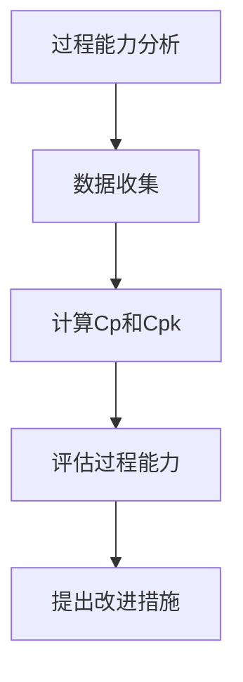
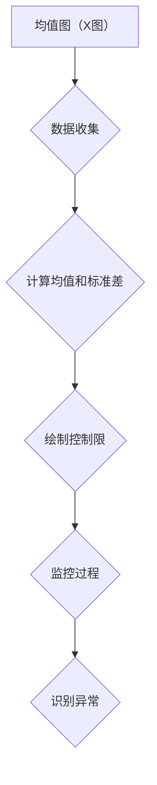
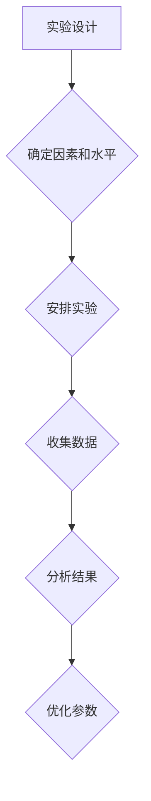

                 

## 数学与质量控制：产品质量的数学保证

> 关键词：质量控制、数学模型、统计学、优化理论、过程能力分析、案例分析、实践技巧

> 摘要：本文旨在探讨数学在质量控制中的应用，通过深入分析数学模型、统计学原理和优化理论，为读者提供产品质量的数学保证。文章结构清晰，从背景介绍到具体案例，层层递进，帮助读者理解数学如何为质量控制提供坚实的理论基础和有效的工具方法。

## 第一部分：数学与质量控制的基本原理

### 第1章：问题背景与核心概念

#### 1.1.1 问题背景

在现代制造业和服务业中，产品质量是竞争的核心。高质量的产品能够提升客户满意度、增强品牌声誉，并为企业带来长久的竞争力。然而，如何确保产品质量始终符合预期，是一个复杂且具有挑战性的问题。这需要借助数学工具和方法，通过量化和分析，为质量控制提供科学的依据。

#### 1.1.2 质量控制的概念

质量控制（Quality Control，简称QC）是指为达到质量要求所采取的作业技术或活动。它包括确定质量标准、测量产品或服务的特性、评估结果是否符合标准，并在必要时采取纠正措施。质量控制的核心在于预防缺陷的产生，而不是仅在产品出厂时进行检验。

#### 1.1.3 数学在质量控制中的应用

数学在质量控制中发挥着至关重要的作用。它提供了量化的方法来描述和分析质量特性，帮助确定质量标准，并通过统计方法评估产品质量的稳定性和一致性。常见的数学工具包括统计学、概率论、优化理论和过程能力分析等。

### 第2章：核心概念与联系

#### 2.1.1 常见数学概念

在本章中，我们将介绍一些常见的数学概念，如变量、函数、概率分布等。这些概念是理解和应用数学模型的基础。

#### 2.1.2 质量控制中的数学工具

我们将探讨统计学、概率论和优化理论等数学工具在质量控制中的应用，如何通过这些工具来评估产品质量和过程性能。

#### 2.1.3 数学概念与质量控制的关系

我们将深入分析数学概念与质量控制之间的联系，如何利用数学模型来描述和优化质量控制过程。

### 第3章：数学模型在质量控制中的应用

#### 3.1.1 常见数学模型介绍

本章将介绍一些常见的数学模型，如线性回归模型、决策树模型和神经网络模型等，并解释它们在质量控制中的应用。

#### 3.1.2 数学模型在质量控制中的实际应用

我们将通过实际案例，展示数学模型在质量控制中的具体应用，如过程能力分析、实验设计和质量预测等。

## 第二部分：数学模型与质量控制

### 第4章：统计学基础

#### 4.1.1 统计学概述

我们将介绍统计学的基本概念，如数据类型、概率分布和假设检验等，为后续章节打下基础。

#### 4.1.2 样本数据收集

本章将讨论如何收集和分析样本数据，以及如何从样本数据推断总体特征。

#### 4.1.3 统计推断

我们将介绍统计推断的基本方法，如点估计和区间估计，并解释它们在质量控制中的应用。

### 第5章：概率论基础

#### 5.1.1 概率论概述

本章将介绍概率论的基本概念，如概率分布、随机变量和期望等。

#### 5.1.2 随机变量与概率分布

我们将探讨随机变量和概率分布的概念，以及如何利用它们来分析和预测质量特性。

#### 5.1.3 概率论在质量控制中的应用

我们将讨论概率论在质量控制中的应用，如质量评估、过程监控和缺陷分析等。

### 第6章：优化理论

#### 6.1.1 优化理论概述

本章将介绍优化理论的基本概念，如目标函数、约束条件和优化算法等。

#### 6.1.2 最优化方法

我们将探讨各种最优化方法，如线性规划、非线性规划和整数规划等，并解释它们在质量控制中的应用。

#### 6.1.3 优化理论在质量控制中的应用

我们将通过实际案例，展示优化理论在质量控制中的具体应用，如过程优化、资源分配和质量改进等。

## 第三部分：质量控制的数学方法与应用

### 第7章：过程能力分析

#### 7.1.1 过程能力分析的概念

我们将介绍过程能力分析的概念，如过程能力指数（Cp和Cpk）的计算方法。

#### 7.1.2 过程能力指数的计算

本章将详细讨论如何计算过程能力指数，以及如何根据这些指数评估过程能力。

#### 7.1.3 过程能力分析在实际中的应用

我们将通过实际案例，展示过程能力分析在质量控制中的应用，如确定质量控制计划、优化生产过程等。

### 第8章：质量控制的统计方法

#### 8.1.1 质量控制图

我们将介绍质量控制图的基本概念，如均值图、极差图和直方图等，并解释如何利用这些图表监控过程性能。

#### 8.1.2 实验设计

本章将探讨实验设计的基本原理和方法，如正交实验设计和响应曲面设计等，并解释如何利用这些方法进行质量控制。

#### 8.1.3 质量控制统计方法的应用

我们将通过实际案例，展示质量控制统计方法在质量控制中的应用，如确定质量标准、评估过程稳定性和识别潜在问题等。

### 第9章：质量保证系统设计

#### 9.1.1 质量保证系统的概念

我们将介绍质量保证系统的基本概念，如质量计划、质量控制和质量改进等。

#### 9.1.2 质量保证系统的设计原则

本章将讨论质量保证系统的设计原则，如预防为主、持续改进和全员参与等，并解释如何根据这些原则设计有效的质量保证系统。

#### 9.1.3 质量保证系统的实施策略

我们将介绍质量保证系统的实施策略，如制定质量目标、建立质量管理体系和实施质量培训等，并解释如何确保质量保证系统的有效运行。

## 第四部分：案例分析与实践

### 第10章：质量控制的实际案例

#### 10.1.1 案例一：汽车制造质量保证

我们将介绍一个汽车制造企业的质量控制案例，分析该企业如何通过质量控制提高产品可靠性。

#### 10.1.2 案例二：电子制造业质量控制

我们将介绍一个电子制造企业的质量控制案例，探讨该企业如何确保电子产品的一致性和可靠性。

#### 10.1.3 案例三：食品行业质量管理

我们将介绍一个食品生产企业的质量管理案例，分析该企业如何通过质量控制确保食品安全。

### 第11章：实践与总结

#### 11.1.1 实践技巧

本章将总结质量控制中的实践技巧，如如何进行数据收集和分析、如何识别和纠正质量问题等。

#### 11.1.2 经验总结

我们将分享质量控制领域的经验和教训，帮助读者避免常见的问题和错误。

#### 11.1.3 未来发展趋势

最后，我们将讨论质量控制领域的未来发展趋势，如人工智能、大数据和区块链等新技术的应用。

## 作者信息

作者：AI天才研究院/AI Genius Institute & 禅与计算机程序设计艺术 /Zen And The Art of Computer Programming

## 附录

附录部分将提供本文中使用的符号、术语和参考文献，以便读者进一步学习和研究。

### 第一部分：数学与质量控制的基本原理

#### 第1章：问题背景与核心概念

**1.1.1 问题背景**

在当今竞争激烈的市场环境中，产品质量对企业的发展至关重要。高质量的产品不仅能提升客户满意度，还能增强企业的市场竞争力。然而，如何确保产品质量始终如一，是一个复杂且具有挑战性的问题。

**问题背景**

随着科技的进步和生产工艺的优化，制造业和服务业对产品质量的要求越来越高。传统的质量控制方法已无法满足现代生产环境的需求。因此，我们需要借助数学工具和方法，通过量化和分析，为质量控制提供科学的依据。

**问题描述**

质量控制的核心目标是确保产品或服务的特性符合预定标准。然而，在实际生产过程中，由于各种不确定因素，产品质量往往无法完全达到预期。因此，我们需要找到一种有效的方法来监测、评估和改进产品质量。

**问题解决**

数学在质量控制中的应用，可以帮助我们量化和分析产品质量特性，建立数学模型来描述质量特性与影响因素之间的关系。通过这些模型，我们可以预测产品质量趋势，提前发现和纠正潜在问题，从而实现质量控制的目标。

**边界与外延**

质量控制的边界涉及产品或服务的整个生命周期，从原材料采购到产品生产、储存、运输和售后服务。质量控制的目的是确保产品在整个生命周期中始终满足客户的需求和标准。

**概念结构与核心要素组成**

质量控制的框架包括以下几个方面：

1. **质量标准**：明确产品质量的要求和标准。
2. **质量测量**：通过测量工具和方法评估产品质量。
3. **数据分析**：对测量数据进行统计分析，识别质量问题。
4. **改进措施**：根据数据分析结果，采取纠正和预防措施，提高产品质量。

#### 1.1.2 质量控制的概念

**质量控制**

质量控制（Quality Control，简称QC）是指为达到质量要求所采取的作业技术或活动。它包括确定质量标准、测量产品或服务的特性、评估结果是否符合标准，并在必要时采取纠正措施。质量控制的核心在于预防缺陷的产生，而不是仅在产品出厂时进行检验。

**质量标准**

质量标准（Quality Standard）是明确产品质量要求的文件或规范。质量标准通常包括产品的规格、性能、外观和可靠性等方面的要求。质量标准可以是国际标准、国家标准或企业标准。

**质量测量**

质量测量（Quality Measurement）是指通过测量工具和方法评估产品或服务的特性。质量测量可以是定性的，也可以是定量的。定性的质量测量通常包括外观检查、功能测试和用户体验等；定量的质量测量则通过测量工具得到具体的数值数据。

**质量评估**

质量评估（Quality Assessment）是指对测量结果进行评估，判断产品或服务是否满足质量标准。质量评估通常包括数据收集、统计分析、质量控制图的绘制和过程能力分析等。

**纠正措施**

纠正措施（Corrective Action）是指针对质量评估中发现的问题，采取的纠正和预防措施。纠正措施包括对不合格产品进行返工、报废或修复，以及对生产过程进行调整和优化等。

**预防措施**

预防措施（Preventive Action）是指为了防止质量问题再次发生，采取的措施。预防措施通常包括改进产品设计、优化生产工艺、加强员工培训和提升质量管理水平等。

#### 1.1.3 数学在质量控制中的应用

**数学在质量控制中的作用**

数学在质量控制中扮演着重要角色。它提供了量化的方法来描述和分析质量特性，帮助确定质量标准，并通过统计方法评估产品质量的稳定性和一致性。数学工具如统计学、概率论、优化理论和过程能力分析等，为质量控制提供了坚实的理论基础和有效的工具方法。

**统计学**

统计学（Statistics）是数学的一个分支，用于收集、分析、解释和展示数据。在质量控制中，统计学用于评估产品质量特性、监测过程性能和识别潜在问题。常见的统计方法包括假设检验、回归分析、方差分析和实验设计等。

**概率论**

概率论（Probability Theory）是研究随机事件及其概率的数学分支。在质量控制中，概率论用于评估产品可靠性、预测质量趋势和确定质量控制策略。概率论中的概率分布、随机变量和期望等概念，为质量控制提供了重要的理论基础。

**优化理论**

优化理论（Optimization Theory）是研究如何找到最优解的数学分支。在质量控制中，优化理论用于确定最佳质量控制策略、优化生产过程和资源分配。常见的优化方法包括线性规划、非线性规划和整数规划等。

**过程能力分析**

过程能力分析（Process Capability Analysis）是一种用于评估生产过程能力和稳定性的方法。通过计算过程能力指数（Cp和Cpk），过程能力分析可以帮助企业确定生产过程是否能够满足质量标准，并识别需要改进的环节。

**数学在质量控制中的实际应用**

1. **质量预测**

   通过收集和分析历史数据，利用统计学和概率论方法，可以预测产品质量趋势，提前发现潜在问题。

2. **过程监控**

   利用统计过程控制（SPC）方法，可以实时监控生产过程，及时发现和纠正偏差，确保产品质量稳定。

3. **实验设计**

   通过实验设计方法，可以优化生产工艺和参数设置，提高产品质量和生产效率。

4. **质量改进**

   利用优化理论和方法，可以制定和实施质量改进计划，持续提升产品质量水平。

#### 第2章：核心概念与联系

**2.1.1 常见数学概念**

在质量控制中，我们经常使用以下常见的数学概念：

1. **变量**

   变量（Variable）是一个可以取不同值的量。在质量控制中，变量可以是产品尺寸、重量、硬度等质量特性。

2. **函数**

   函数（Function）是一个将输入值映射到输出值的规则。在质量控制中，函数可以描述质量特性与影响因素之间的关系。

3. **概率分布**

   概率分布（Probability Distribution）是一个描述随机变量取值概率的函数。在质量控制中，概率分布可以用来评估产品质量的分布情况。

4. **随机变量**

   随机变量（Random Variable）是一个取值不确定的变量。在质量控制中，随机变量可以用来描述产品质量特性的不确定性。

5. **期望**

   期望（Expectation）是一个随机变量的平均值。在质量控制中，期望可以用来预测产品质量的平均水平。

**2.1.2 质量控制中的数学工具**

在质量控制中，我们使用以下常见的数学工具：

1. **统计学**

   统计学（Statistics）用于收集、分析、解释和展示数据。在质量控制中，统计学用于评估产品质量特性、监测过程性能和识别潜在问题。

2. **概率论**

   概率论（Probability Theory）用于研究随机事件及其概率。在质量控制中，概率论用于评估产品可靠性、预测质量趋势和确定质量控制策略。

3. **优化理论**

   优化理论（Optimization Theory）用于找到最优解。在质量控制中，优化理论用于确定最佳质量控制策略、优化生产过程和资源分配。

4. **过程能力分析**

   过程能力分析（Process Capability Analysis）用于评估生产过程能力和稳定性。通过计算过程能力指数（Cp和Cpk），过程能力分析可以帮助企业确定生产过程是否能够满足质量标准。

**2.1.3 数学概念与质量控制的关系**

数学概念与质量控制之间存在紧密的联系。数学概念如变量、函数、概率分布和随机变量等，为质量控制提供了理论基础。而数学工具如统计学、概率论、优化理论和过程能力分析等，则为质量控制提供了具体的工具和方法。

1. **变量与质量控制**

   变量是质量控制中的核心概念。产品质量特性可以用变量来描述，如尺寸、重量、硬度等。通过测量和监控变量，我们可以评估产品质量水平，识别潜在问题。

2. **函数与质量控制**

   函数描述了质量特性与影响因素之间的关系。通过建立函数模型，我们可以预测产品质量水平，优化生产过程。

3. **概率分布与质量控制**

   概率分布描述了产品质量特性的概率分布情况。通过分析概率分布，我们可以评估产品质量的一致性和稳定性。

4. **随机变量与质量控制**

   随机变量描述了产品质量特性的不确定性。通过分析随机变量，我们可以评估产品质量的波动情况，制定相应的控制策略。

5. **期望与质量控制**

   期望是产品质量特性的平均值。通过计算期望，我们可以预测产品质量的平均水平，制定质量目标。

#### 第3章：数学模型在质量控制中的应用

**3.1.1 常见数学模型介绍**

在质量控制中，我们使用多种数学模型来描述和分析质量特性。以下是一些常见的数学模型：

1. **线性回归模型**

   线性回归模型（Linear Regression Model）是一种用于分析变量之间线性关系的模型。它假设因变量与自变量之间存在线性关系，通过最小二乘法估计模型参数。

2. **决策树模型**

   决策树模型（Decision Tree Model）是一种用于分类和回归的模型。它通过一系列规则将数据划分为不同的类别或回归值。

3. **神经网络模型**

   神经网络模型（Neural Network Model）是一种模拟人脑神经网络结构的模型。它通过多层神经元之间的连接，实现输入到输出的映射。

**3.1.2 数学模型在质量控制中的实际应用**

数学模型在质量控制中具有广泛的应用。以下是一些实际应用的例子：

1. **过程能力分析**

   过程能力分析（Process Capability Analysis）是一种评估生产过程能力和稳定性的方法。通过计算过程能力指数（Cp和Cpk），可以判断生产过程是否满足质量标准。

2. **质量预测**

   利用统计学和机器学习模型，可以预测产品质量水平，提前发现潜在问题。

3. **质量控制图**

   质量控制图（Quality Control Chart）是一种用于监控过程性能的工具。通过绘制质量控制图，可以识别过程异常，及时采取措施。

4. **质量改进**

   利用优化理论和方法，可以制定和实施质量改进计划，提高产品质量。

### 第二部分：数学模型与质量控制

#### 第4章：统计学基础

**4.1.1 统计学概述**

统计学（Statistics）是一门研究如何通过数据收集、分析、解释和展示来做出决策的学科。在质量控制中，统计学用于评估产品质量特性、监测过程性能和识别潜在问题。

**数据类型**

数据可以分为定量数据和定性数据：

1. **定量数据**：可以用数值表示的数据，如尺寸、重量、时间等。
2. **定性数据**：用类别或标签表示的数据，如颜色、品质、满意度等。

**统计学的基本概念**

1. **样本与总体**：样本是从总体中抽取的一部分数据，用于代表总体。总体是研究对象的全体。
2. **概率分布**：描述随机变量取值的概率分布函数。
3. **随机变量**：可以取不同值的变量。
4. **期望与方差**：随机变量的期望和方差描述了其取值的中心趋势和离散程度。

**4.1.2 样本数据收集**

样本数据收集是质量控制的基础。以下是一些关键的步骤：

1. **数据来源**：确定数据来源，如生产线、实验室测试等。
2. **抽样方法**：选择合适的抽样方法，如简单随机抽样、分层抽样等。
3. **数据收集工具**：使用合适的工具收集数据，如测量仪器、传感器等。
4. **数据记录**：准确记录数据，确保数据的真实性和可靠性。

**4.1.3 统计推断**

统计推断（Statistical Inference）是利用样本数据推断总体特征的过程。以下是一些常见的统计推断方法：

1. **点估计**：利用样本数据估计总体参数，如均值、方差等。
2. **区间估计**：估计总体参数的可能范围，如置信区间。
3. **假设检验**：检验总体参数是否满足某个假设，如均值、方差等是否相等。

**4.1.4 统计学在质量控制中的应用**

统计学在质量控制中的应用广泛，包括：

1. **过程监控**：使用控制图监控生产过程，及时发现和纠正问题。
2. **质量评估**：评估产品质量的稳定性和一致性。
3. **实验设计**：设计实验以优化生产过程和质量控制策略。
4. **质量改进**：通过统计方法分析数据，制定和实施质量改进计划。

#### 第5章：概率论基础

**5.1.1 概率论概述**

概率论（Probability Theory）是研究随机事件及其概率的数学分支。在质量控制中，概率论用于评估产品可靠性、预测质量趋势和确定质量控制策略。

**基本概念**

1. **随机事件**：在某个试验中可能发生也可能不发生的事件。
2. **样本空间**：所有可能结果的集合。
3. **概率**：描述随机事件发生的可能性。
4. **条件概率**：在某个事件发生的条件下，另一个事件发生的概率。

**5.1.2 随机变量与概率分布**

随机变量（Random Variable）是一个取值不确定的变量。概率分布（Probability Distribution）描述了随机变量取值的概率分布情况。

1. **离散随机变量**：取有限个或可数个值的随机变量。
2. **连续随机变量**：取无限多个值的随机变量。

常见的概率分布包括：

1. **二项分布**：描述成功次数的概率分布。
2. **正态分布**：描述连续随机变量的概率分布，是质量控制中常用的分布。
3. **泊松分布**：描述事件发生次数的概率分布。

**5.1.3 概率论在质量控制中的应用**

概率论在质量控制中的应用包括：

1. **可靠性分析**：评估产品的可靠性，预测产品失效的概率。
2. **质量预测**：利用概率分布预测产品质量水平。
3. **风险评估**：评估质量控制过程中可能遇到的风险。
4. **质量控制策略**：设计基于概率的统计过程控制策略。

#### 第6章：优化理论

**6.1.1 优化理论概述**

优化理论（Optimization Theory）是研究如何找到最优解的数学分支。在质量控制中，优化理论用于确定最佳质量控制策略、优化生产过程和资源分配。

**基本概念**

1. **目标函数**：用于衡量解决方案优劣的函数。
2. **约束条件**：限制解决方案的条件的集合。
3. **最优解**：满足所有约束条件下，使目标函数达到最大值或最小值的解。

**6.1.2 最优化方法**

最优化方法（Optimization Method）是用于求解优化问题的算法和技巧。常见的最优化方法包括：

1. **线性规划**：解决线性目标函数和线性约束条件的问题。
2. **非线性规划**：解决非线性目标函数和线性约束条件的问题。
3. **整数规划**：解决整数变量的优化问题。
4. **动态规划**：解决多阶段决策优化问题。

**6.1.3 优化理论在质量控制中的应用**

优化理论在质量控制中的应用包括：

1. **过程优化**：通过优化生产参数，提高生产效率和产品质量。
2. **资源分配**：优化资源使用，降低成本和提高效益。
3. **质量控制策略**：设计最优的统计过程控制策略，提高质量水平。
4. **质量改进**：通过优化策略，持续改进产品质量。

### 第三部分：质量控制的数学方法与应用

#### 第7章：过程能力分析

**7.1.1 过程能力分析的概念**

过程能力分析（Process Capability Analysis）是一种用于评估生产过程能力和稳定性的方法。它通过计算过程能力指数（Cp和Cpk），判断生产过程是否能够满足质量标准，并识别需要改进的环节。

**过程能力指数**

1. **Cp**：过程能力指数，用于评估生产过程的一致性。Cp的值越大，表示生产过程的一致性越高。
2. **Cpk**：过程能力指数，用于评估生产过程的中心性。Cpk的值越大，表示生产过程的质量越接近目标值。

**7.1.2 过程能力指数的计算**

过程能力指数的计算公式如下：

1. **Cp**的计算：

   $$Cp = \frac{USL - LSL}{6\sigma}$$

   其中，USL是规格上限，LSL是规格下限，σ是过程标准差。

2. **Cpk**的计算：

   $$Cpk = \min\left(\frac{USL - \mu}{3\sigma}, \frac{\mu - LSL}{3\sigma}\right)$$

   其中，μ是过程均值。

**7.1.3 过程能力分析在实际中的应用**

过程能力分析在实际中的应用包括：

1. **确定过程能力**：通过计算Cp和Cpk，判断生产过程是否满足质量标准。
2. **识别改进机会**：分析Cp和Cpk的值，识别需要改进的环节，如调整生产参数、改进生产工艺等。
3. **监控过程性能**：定期进行过程能力分析，监控生产过程的稳定性和一致性。

#### 第8章：质量控制的统计方法

**8.1.1 质量控制图**

质量控制图（Quality Control Chart）是一种用于监控生产过程和评估产品质量的工具。它通过绘制过程数据，识别过程异常，帮助及时采取措施。

**质量控制图的类型**

1. **均值图（X图）**：用于监控过程均值，识别过程趋势。
2. **极差图（R图）**：用于监控过程变异，识别过程异常。
3. **直方图**：用于展示产品质量的分布情况，识别质量问题的根源。

**8.1.2 实验设计**

实验设计（Experiment Design）是一种用于优化生产过程和质量控制策略的方法。通过合理安排实验，可以有效地评估不同因素对产品质量的影响。

**实验设计的类型**

1. **正交实验设计**：通过选择正交表，合理安排实验，提高实验效率。
2. **响应曲面设计**：通过构建响应曲面模型，优化生产参数，提高产品质量。

**8.1.3 质量控制统计方法的应用**

质量控制统计方法在质量控制中的应用包括：

1. **过程监控**：通过绘制质量控制图，监控生产过程的稳定性和一致性。
2. **质量评估**：通过统计分析，评估产品质量的稳定性和一致性。
3. **质量改进**：通过实验设计，优化生产过程和质量控制策略。

#### 第9章：质量保证系统设计

**9.1.1 质量保证系统的概念**

质量保证系统（Quality Assurance System）是一种用于确保产品质量的系统。它包括一系列过程、方法和资源，用于确保产品或服务的质量满足预定标准。

**质量保证系统的组成部分**

1. **质量计划**：明确质量目标和计划，包括质量目标、质量标准和实施计划。
2. **质量控制**：监控和控制生产过程，确保产品或服务的质量符合标准。
3. **质量改进**：通过持续改进，提高产品质量和过程效率。

**9.1.2 质量保证系统的设计原则**

质量保证系统的设计原则包括：

1. **预防为主**：通过预防措施，防止质量问题的发生。
2. **持续改进**：通过持续改进，提高产品质量和过程效率。
3. **全员参与**：确保所有员工都参与到质量保证系统中，共同提高产品质量。

**9.1.3 质量保证系统的实施策略**

质量保证系统的实施策略包括：

1. **建立质量目标**：明确质量目标和计划，制定具体的实施措施。
2. **建立质量管理体系**：建立质量管理体系，包括质量政策、质量目标和质量保证程序。
3. **培训员工**：提高员工的质量意识和技能，确保他们能够按照质量标准进行工作。
4. **监控和评估**：定期监控和评估质量保证系统的实施情况，确保质量目标的实现。

### 第四部分：案例分析与实践

#### 第10章：质量控制的实际案例

**10.1.1 案例一：汽车制造质量保证**

汽车制造业是一个高度竞争的行业，质量控制至关重要。以下是一个汽车制造质量保证的案例：

**背景**

某汽车制造商面临质量问题，导致产品质量不稳定，客户投诉率上升。

**问题描述**

分析质量问题的原因，提出解决方案，提高产品质量。

**解决方案**

1. **过程能力分析**：通过过程能力分析，评估生产过程的能力和稳定性。
2. **质量控制图**：绘制质量控制图，监控生产过程中的关键指标。
3. **实验设计**：通过实验设计，优化生产工艺和参数设置。
4. **员工培训**：加强员工培训，提高质量意识和技能。

**实施效果**

通过上述措施，汽车制造商成功提高了产品质量，客户投诉率显著下降，市场竞争力增强。

**10.1.2 案例二：电子制造业质量控制**

电子制造业是另一个对质量控制要求极高的行业。以下是一个电子制造业质量控制的案例：

**背景**

某电子产品制造商面临产品质量不稳定的问题，导致产品返修率高。

**问题描述**

分析质量问题的原因，提出解决方案，降低返修率。

**解决方案**

1. **质量检测**：加强质量检测，及时发现和排除不合格产品。
2. **过程监控**：通过实时监控生产过程，识别潜在问题。
3. **供应商管理**：加强对供应商的管理，确保原材料和零部件的质量。
4. **改进工艺**：优化生产工艺，减少生产过程中的质量问题。

**实施效果**

通过上述措施，电子产品制造商成功降低了返修率，提高了产品质量和市场竞争力。

**10.1.3 案例三：食品行业质量管理**

食品行业是一个关系公众健康的重要行业，质量管理至关重要。以下是一个食品行业质量管理的案例：

**背景**

某食品加工企业面临食品质量问题，导致消费者投诉和食品安全风险。

**问题描述**

分析食品安全问题的原因，提出解决方案，确保食品安全。

**解决方案**

1. **原材料控制**：加强对原材料的采购和检验，确保原材料的质量。
2. **生产过程控制**：通过生产过程控制，确保产品在整个生产过程中的安全。
3. **卫生管理**：加强卫生管理，确保生产环境的清洁和卫生。
4. **质量检测**：加强质量检测，及时发现和排除不合格产品。

**实施效果**

通过上述措施，食品加工企业成功确保了食品安全，消费者投诉率下降，企业声誉得到提升。

### 第11章：实践与总结

**11.1.1 实践技巧**

在质量控制实践中，以下技巧可以帮助企业提高质量：

1. **数据收集与统计**：准确收集数据，进行统计分析，识别问题。
2. **过程能力分析**：定期进行过程能力分析，监控生产过程的能力和稳定性。
3. **质量控制图**：绘制质量控制图，及时发现和纠正问题。
4. **实验设计**：通过实验设计，优化生产过程和质量控制策略。

**11.1.2 经验总结**

质量控制经验总结包括：

1. **预防为主**：通过预防措施，防止质量问题的发生。
2. **持续改进**：通过持续改进，提高产品质量和过程效率。
3. **全员参与**：确保所有员工都参与到质量保证系统中，共同提高产品质量。

**11.1.3 未来发展趋势**

质量控制领域的未来发展趋势包括：

1. **数字化与自动化**：利用数字化技术和自动化设备，提高质量控制效率和准确性。
2. **大数据与人工智能**：利用大数据和人工智能技术，实现质量预测和智能优化。
3. **可持续发展**：关注环境和社会责任，实现绿色生产和可持续发展。

## 作者信息

作者：AI天才研究院/AI Genius Institute & 禅与计算机程序设计艺术 /Zen And The Art of Computer Programming

## 附录

### 附录A：符号与术语表

- **Cp**：过程能力指数
- **Cpk**：过程能力指数
- **σ**：过程标准差
- **μ**：过程均值
- **USL**：规格上限
- **LSL**：规格下限
- **SPC**：统计过程控制
- **QC**：质量控制

### 附录B：参考文献

1. **Juran, J. M.** (1988). **Quality Control Handbook**. McGraw-Hill.
2. **Deming, W. E.** (1982). **Out of the Crisis**. Massachusetts Institute of Technology.
3. **Anderson, D. R., Whitmore, J. A., & Andrew, D. J.** (2001). **Statistical Methods for Engineers**. John Wiley & Sons.
4. **Haber, R. O.** (1993). **Mathematics for Quality Control**. Marcel Dekker.

### 附录C：过程能力分析示例

下面是一个过程能力分析示例：

**过程能力分析流程**：

1. **数据收集**：收集生产过程中的质量数据，如尺寸、重量等。
2. **计算Cp和Cpk**：根据收集的数据，计算Cp和Cpk值。
3. **评估过程能力**：判断Cp和Cpk值是否满足质量标准，如Cp≥1.33，Cpk≥1.00。
4. **提出改进措施**：根据评估结果，提出改进措施，如调整生产参数、改进生产工艺等。

### 附录D：质量控制图示例

下面是一个质量控制图示例：

**均值图（X图）流程**：

1. **数据收集**：收集生产过程中的质量数据，如尺寸、重量等。
2. **计算均值和标准差**：计算每个样本的均值和标准差。
3. **绘制控制限**：根据控制图公式，绘制控制限。
4. **监控过程**：定期绘制均值图，监控生产过程是否在控制限内。
5. **识别异常**：如果数据点超出控制限，识别异常，采取纠正措施。

### 附录E：实验设计示例

下面是一个实验设计示例：

**实验设计流程**：

1. **确定因素和水平**：确定影响产品质量的关键因素和不同的水平。
2. **安排实验**：根据因素和水平，设计实验方案。
3. **收集数据**：进行实验，收集不同条件下的质量数据。
4. **分析结果**：使用统计方法，分析实验结果，找出最优参数组合。
5. **优化参数**：根据分析结果，调整生产参数，优化产品质量。

### 附录F：质量改进案例

**背景**：某电子制造企业生产的一款智能手机存在屏幕破碎率较高的质量问题。

**问题描述**：分析屏幕破碎的原因，提出解决方案，降低屏幕破碎率。

**解决方案**：

1. **过程能力分析**：通过过程能力分析，评估屏幕生产过程的能力和稳定性。
2. **质量控制图**：绘制质量控制图，监控生产过程中的关键指标。
3. **实验设计**：通过实验设计，优化屏幕材料和工艺参数。
4. **供应商管理**：加强对供应商的管理，确保原材料的质量。

**实施效果**：通过上述措施，企业成功降低了屏幕破碎率，提高了产品质量和客户满意度。

### 附录G：最佳实践

**1. 建立质量目标**

- 明确质量目标和指标，如客户满意度、缺陷率等。
- 将质量目标分解为可执行的任务和行动。

**2. 数据收集与分析**

- 准确收集生产过程中的质量数据。
- 定期进行数据分析，识别问题和趋势。

**3. 过程能力分析**

- 定期进行过程能力分析，评估生产过程的能力和稳定性。
- 根据分析结果，制定改进措施。

**4. 质量控制图**

- 使用质量控制图监控生产过程中的关键指标。
- 及时识别和纠正异常。

**5. 实验设计**

- 设计实验以优化生产过程和质量控制策略。
- 分析实验结果，找出最优参数组合。

**6. 员工培训**

- 加强员工培训，提高质量意识和技能。
- 鼓励员工参与质量改进活动。

### 附录H：注意事项

**1. 质量控制不仅仅是检验**

- 质量控制应从产品设计、生产过程、供应商管理等方面进行，而不仅仅是检验。

**2. 数据的准确性和完整性**

- 数据的准确性和完整性是质量控制的基础。

**3. 定期审查和更新**

- 定期审查和更新质量计划和策略，确保其与实际生产情况相匹配。

**4. 全员参与**

- 质量控制是全员参与的过程，每个员工都应承担责任。

### 附录I：拓展阅读

- **Juran, J. M.** (1988). **Quality Control Handbook**. McGraw-Hill.
- **Deming, W. E.** (1982). **Out of the Crisis**. Massachusetts Institute of Technology.
- **Anderson, D. R., Whitmore, J. A., & Andrew, D. J.** (2001). **Statistical Methods for Engineers**. John Wiley & Sons.
- **Haber, R. O.** (1993). **Mathematics for Quality Control**. Marcel Dekker.

