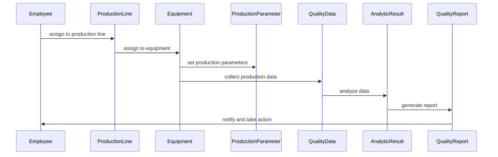
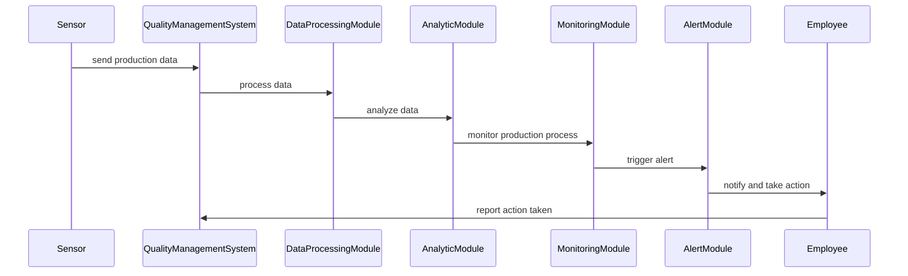

                 

## 数学与质量管理：质量控制的数学方法

关键词：质量管理、数学方法、统计学、优化算法、可靠性分析

摘要：本文将探讨数学方法在质量管理中的应用，通过一系列的分析和推理，深入理解质量控制的基本原理及其数学模型。我们将从质量管理的基础出发，逐步引入统计学、过程控制、可靠性分析等数学工具，并通过实际案例研究，展示这些方法在质量管理实践中的有效性和重要性。本文旨在为读者提供一个清晰、系统的数学视角，帮助其在质量管理领域取得更好的成果。

## 《数学与质量管理：质量控制的数学方法》目录大纲

### 第一部分：质量管理基础

1. **质量管理的背景与重要性**
   - 质量管理的起源与发展
   - 质量管理的重要性
   - 质量管理的基本原则

2. **质量管理的基础概念**
   - 质量定义与质量特性
   - 质量控制与质量管理
   - 质量管理的流程与方法

### 第二部分：数学方法在质量管理中的应用

1. **统计学基础**
   - 统计学基本概念
   - 数据收集与处理
   - 数据可视化

2. **统计过程控制**
   - 过程控制基础
   - 控制图的应用
   - 方差分析

3. **可靠性分析**
   - 可靠性的定义与度量
   - 置信区间的计算
   - 市场调查与样本分析

4. **优化方法在质量管理中的应用**
   - 优化方法概述
   - 线性规划
   - 非线性规划

5. **质量改进工具**
   - 质量功能展开（QFD）
   - 帕累托图
   - 散点图与相关性分析

### 第三部分：质量管理案例研究

1. **质量管理案例**
   - 案例背景
   - 案例分析方法
   - 案例实施与效果

### 第四部分：质量管理实践与展望

1. **质量管理实践**
   - 质量管理体系构建
   - 质量管理实践技巧
   - 质量管理创新趋势

2. **质量管理未来展望**
   - 数字化质量管理
   - 智能质量管理
   - 质量管理的发展方向

## 目录大纲总结

本目录大纲全面覆盖了《数学与质量管理：质量控制的数学方法》的核心内容，从质量管理基础、数学方法应用、案例研究到质量管理实践与未来展望，形成了完整的知识体系。各章节内容结构清晰，逻辑严密，旨在帮助读者深入理解质量管理的基本原理及其在实践中的应用。

### 注意事项

- 文章的章节内容必须满足上述大纲的结构和内容要求，每个章节都要有详细的背景介绍、核心概念与联系、算法原理讲解、系统分析与架构设计方案、项目实战等内容。
- 文章字数要求在10000～12000字左右，确保内容的完整性和深度。
- 文章内容使用markdown格式输出，保证格式统一和可读性。
- 作者信息需在文章末尾明确标注，以体现专业性和权威性。

### 拓展阅读

- 《质量管理：从理论到实践》
- 《统计学基础教程》
- 《线性规划与非线性规划》

---

## 第一部分：质量管理基础

### 第1章：质量管理的背景与重要性

#### 1.1 质量管理的起源与发展

质量管理作为企业管理的重要组成部分，起源于20世纪初的美国。当时，随着工业革命的推进，产品质量问题日益凸显，为了提升产品质量，美国工程师休哈特提出了统计过程控制（SPC）方法。此后，日本质量管理大师石川馨等人在此基础上，发展出了全面质量管理（TQM）的理念。随着全球经济的快速发展，质量管理逐渐成为企业竞争的核心要素。

#### 1.2 质量管理的重要性

质量管理不仅关系到企业的生存和发展，还影响到消费者的权益和社会的稳定。优质的产品和服务可以提高企业的市场竞争力，增强品牌价值，降低成本，提高效益。同时，高质量的产品可以满足消费者的需求，提升消费者的满意度，从而推动经济的持续发展。

#### 1.3 质量管理的基本原则

质量管理的基本原则包括：

1. **以顾客为中心**：质量管理的核心是满足顾客的需求和期望。
2. **领导作用**：企业领导者的重视和参与对质量管理至关重要。
3. **全员参与**：质量管理不仅是管理层的职责，全体员工都应参与其中。
4. **过程方法**：质量管理应注重全过程的管理，包括设计、生产、销售和服务等。
5. **持续改进**：质量管理应不断追求过程的优化和改进。
6. **决策基于事实**：决策应基于数据和信息，而不是主观判断。
7. **供应商关系**：与供应商建立互利的关系，共同提高产品质量。

### 第2章：质量管理的基础概念

#### 2.1 质量定义与质量特性

质量是指产品或服务满足明确或隐含需求的能力。质量特性是指影响质量的特性，包括性能、可靠性、 durability、serviceability、aesthetics等。

#### 2.2 质量控制与质量管理

质量控制是指通过各种手段，确保产品或服务质量符合预定标准。质量管理则是一个更广泛的概念，包括质量控制，还涵盖了设计、生产、销售和服务等全过程。

#### 2.3 质量管理的流程与方法

质量管理的流程包括：

1. **质量策划**：确定质量目标，制定质量计划。
2. **质量保证**：确保产品或服务满足质量要求。
3. **质量改进**：通过持续改进，提升产品质量。

常用的质量管理方法包括：

1. **统计过程控制（SPC）**：通过控制图等工具，监控生产过程，确保过程稳定。
2. **质量功能展开（QFD）**：将顾客需求转化为产品设计参数。
3. **六西格玛（Six Sigma）**：通过减少过程中的变异，提升产品质量。

### 第3章：质量管理的基础概念

#### 2.1 质量定义与质量特性

质量是指产品或服务满足明确或隐含需求的能力。质量特性是指影响质量的特性，包括性能、可靠性、 durability、serviceability、aesthetics等。

#### 2.2 质量控制与质量管理

质量控制是指通过各种手段，确保产品或服务质量符合预定标准。质量管理则是一个更广泛的概念，包括质量控制，还涵盖了设计、生产、销售和服务等全过程。

#### 2.3 质量管理的流程与方法

质量管理的流程包括：

1. **质量策划**：确定质量目标，制定质量计划。
2. **质量保证**：确保产品或服务满足质量要求。
3. **质量改进**：通过持续改进，提升产品质量。

常用的质量管理方法包括：

1. **统计过程控制（SPC）**：通过控制图等工具，监控生产过程，确保过程稳定。
2. **质量功能展开（QFD）**：将顾客需求转化为产品设计参数。
3. **六西格玛（Six Sigma）**：通过减少过程中的变异，提升产品质量。

---

在下一部分中，我们将深入探讨数学方法在质量管理中的应用，包括统计学基础、统计过程控制、可靠性分析等内容。敬请期待。

---

### 第一部分：质量管理基础

**第1章：质量管理的背景与重要性**

**1.1 质量管理的起源与发展**

质量管理作为一个独立的学科，起源于20世纪初的美国。当时，随着工业革命的推进，制造业的规模和质量问题开始受到广泛关注。最早提出质量管理概念的是美国贝尔实验室的工程师休哈特（W. A. Shewhart），他提出了统计过程控制（Statistical Process Control, SPC）方法，并通过控制图等工具，帮助制造业实现过程控制，从而保证产品的质量稳定性。

随着第二次世界大战的爆发，美国的制造业迎来了飞速发展，对产品质量的要求也越来越高。在此背景下，质量管理逐渐成为制造业的核心议题。1950年代，日本引进了美国的质量管理理念，并在此基础上发展出了具有日本特色的全面质量管理（Total Quality Management, TQM）。全面质量管理强调全员参与、持续改进、以顾客为中心等原则，成为现代质量管理的基石。

进入21世纪，随着全球化的推进，质量管理已经渗透到各行各业。从制造业到服务业，从中小企业到跨国公司，质量管理都发挥着至关重要的作用。同时，随着信息技术的飞速发展，质量管理也呈现出数字化、智能化的趋势。

**1.2 质量管理的重要性**

质量管理的重要性体现在多个方面：

1. **提高产品和服务质量**：通过质量管理，企业可以确保产品和服务满足顾客的需求和期望，从而提高顾客满意度。

2. **降低成本**：质量管理可以通过减少缺陷和返工，降低生产成本和运营成本。

3. **增强竞争力**：优质的产品和服务可以提升企业的市场竞争力，帮助企业赢得更多的市场份额。

4. **提升品牌价值**：良好的质量管理能够树立企业的良好形象，提升品牌价值。

5. **保障消费者权益**：高质量的产品和服务可以保障消费者的权益，减少消费者因质量问题而受到的损失。

6. **促进社会稳定**：高质量的产品和服务有助于维护社会秩序，减少因产品质量问题引发的社会问题。

**1.3 质量管理的基本原则**

质量管理的基本原则包括以下几个方面：

1. **以顾客为中心**：顾客的需求和期望是质量管理的出发点和归宿。企业应通过各种手段了解顾客需求，并将其转化为具体的产品和服务质量标准。

2. **领导作用**：企业领导者的重视和参与对质量管理至关重要。领导者应树立正确的质量管理观念，推动质量管理体系的建立和完善。

3. **全员参与**：质量管理不仅是管理层的职责，全体员工都应参与其中。只有全员共同努力，才能实现质量管理目标。

4. **过程方法**：质量管理应注重全过程的管理，包括设计、生产、销售和服务等。通过系统分析各个过程，识别和消除潜在的质量问题。

5. **持续改进**：质量管理应不断追求过程的优化和改进。通过定期评估和改进，不断提升产品和服务的质量。

6. **决策基于事实**：决策应基于数据和信息，而不是主观判断。通过收集和分析数据，企业可以更准确地判断问题，制定合理的决策。

7. **供应商关系**：与供应商建立互利的关系，共同提高产品质量。通过供应商管理，企业可以确保供应链的质量稳定性。

**总结**

质量管理作为现代企业管理的核心内容，其重要性不言而喻。通过了解质量管理的起源和发展，掌握质量管理的基本原则，企业可以更好地实施质量管理，提升产品和服务质量，增强市场竞争力。在下一章中，我们将进一步探讨质量管理的基础概念，为后续的数学方法应用打下基础。

---

### 第一部分：质量管理基础

**第2章：质量管理的基础概念**

**2.1 质量定义与质量特性**

质量是指产品或服务满足明确或隐含需求的能力。在质量管理体系中，质量是一个多维度的概念，不仅包括产品或服务的物理特性，还包括顾客满意度、可靠性、耐久性等多个方面。根据ISO 8402标准，质量可以被定义为“一组固有特性满足要求的程度”。

质量特性是指影响质量的属性，可以分为以下几个方面：

1. **性能**：产品或服务的功能实现程度，如速度、精度、容量等。
2. **可靠性**：产品或服务在特定条件下，能够完成预定功能的能力，如耐用性、故障率等。
3. **耐久性**：产品或服务在长期使用过程中保持性能的能力。
4. **服务性**：产品或服务在售后服务方面的表现，如维修、保养等。
5. **美学**：产品或服务的外观、感觉、设计等方面的美感。
6. **符合性**：产品或服务是否符合既定的标准和规范。

在质量管理中，了解和识别这些质量特性对于确保产品和服务质量至关重要。

**2.2 质量控制与质量管理**

质量控制（Quality Control, QC）和质量管理（Quality Management,QM）是两个密切相关的概念。

质量控制通常指的是一系列特定的活动，通过这些活动，可以确保产品或服务的质量符合既定的标准和要求。质量控制通常包括检验、测试、调整和纠正等具体措施。质量控制的主要目标是确保每个产品或服务的质量符合规格要求，防止不合格产品进入市场。

质量管理则是一个更广泛的概念，它包括质量控制，同时也涵盖了质量策划、质量保证、质量改进等更全面的活动。质量管理关注的是整个组织的管理过程，旨在建立和维持一个有效的质量管理体系，确保产品和服务满足顾客需求。

质量管理包括以下关键过程：

1. **质量策划**：确定质量目标和制定实现这些目标的计划。
2. **质量控制**：通过检验和测试确保产品和服务质量。
3. **质量保证**：确保质量管理体系的有效性，通过内部和外部审核来验证。
4. **质量改进**：持续改进质量管理体系，以提高产品和服务质量。

**2.3 质量管理的流程与方法**

质量管理的流程和方法是确保产品质量的系统方法。以下是一些常用的质量管理方法和流程：

1. **统计过程控制（Statistical Process Control, SPC）**：
   - SPC是一种基于统计学的方法，用于监控和控制生产过程，确保过程稳定并减少变异。
   - SPC使用控制图等工具来监测过程性能，及时发现并纠正偏差。

2. **质量功能展开（Quality Function Deployment, QFD）**：
   - QFD是一种将顾客需求转化为具体产品设计的系统方法。
   - QFD通过矩阵分析和优先级排序，确保产品设计满足顾客需求。

3. **六西格玛（Six Sigma）**：
   - 六西格玛是一种用于持续改进产品和过程的方法，通过减少过程中的变异来提高质量。
   - 六西格玛使用一系列工具和技术，如DMAIC（定义、测量、分析、改进、控制），来解决问题和优化过程。

4. **全面质量管理（Total Quality Management, TQM）**：
   - TQM是一种全面的、系统的质量管理方法，强调全员参与和持续改进。
   - TQM的目标是通过满足顾客需求来提高整体组织效率和绩效。

5. **ISO 9000系列标准**：
   - ISO 9000系列标准是国际公认的质量管理体系标准，用于确保产品和服务质量满足顾客和法律法规的要求。
   - ISO 9000标准包括了一系列的质量管理原则和实践指南。

**总结**

质量管理的基础概念包括质量定义、质量特性、质量控制和质量管理的区别与联系。了解这些基础概念，有助于企业建立和实施有效的质量管理体系，从而确保产品和服务质量。在下一章中，我们将探讨数学方法在质量管理中的应用，进一步深入分析如何利用数学工具提升质量管理水平。

---

### 第二部分：数学方法在质量管理中的应用

**第3章：统计学基础**

**3.1 统计学基本概念**

统计学是质量管理中不可或缺的工具，它提供了一种科学的方法来收集、分析和解释数据。以下是统计学中一些基本概念：

1. **总体（Population）**：总体是指我们感兴趣的整个集合，如一个工厂生产的所有产品。
2. **样本（Sample）**：样本是从总体中抽取的一部分，用于进行统计分析。
3. **变量（Variable）**：变量是指可以取不同值的量，可以是数量（如产品尺寸）或质量属性（如产品缺陷率）。
4. **概率（Probability）**：概率是描述某个事件发生的可能性，通常用0到1之间的数值表示。
5. **分布（Distribution）**：分布描述了一个变量可能取的值及其相应的概率。
6. **均值（Mean）**：均值是数据的平均值，是描述数据中心位置的一个指标。
7. **中位数（Median）**：中位数是数据按大小排列后，位于中间的值，用于描述数据中心位置。
8. **标准差（Standard Deviation）**：标准差是数据变异程度的度量，越大表示数据越分散。

**3.2 数据收集与处理**

1. **数据收集**：
   - **随机抽样**：通过随机方法从总体中抽取样本，确保样本具有代表性。
   - **系统抽样**：按照一定的间隔抽取样本，如每隔10个单位抽取一个。
   - **分层抽样**：将总体划分为不同的层次，然后从每个层次中抽取样本。

2. **数据处理**：
   - **数据清洗**：处理数据中的错误、异常值和不一致，确保数据质量。
   - **数据整理**：将数据按一定的格式进行整理，便于分析。
   - **数据转换**：将数据转换为适合统计分析的格式，如将类别数据转换为数值数据。

**3.3 数据可视化**

数据可视化是统计学中一个重要的工具，它可以帮助我们直观地理解数据。以下是几种常见的数据可视化方法：

1. **直方图**：用于显示数据的分布情况，通过柱状图来表示各个区间的频数。
2. **饼图**：用于显示各部分占总体的比例，通常用于显示百分比。
3. **折线图**：用于显示数据随时间的变化趋势。
4. **散点图**：用于显示两个变量之间的关系，通过点的分布来观察相关性。
5. **箱线图**：用于显示数据的分布情况，包括均值、中位数、四分位数和异常值。

**案例研究**

假设一个工厂生产零件，需要监控零件尺寸的稳定性。以下是数据收集、处理和可视化的步骤：

1. **数据收集**：
   - 随机抽取100个零件，测量其尺寸。
2. **数据处理**：
   - 清洗数据，排除异常值。
   - 将尺寸转换为标准单位，如毫米。
3. **数据可视化**：
   - 制作直方图，观察尺寸的分布情况。
   - 制作散点图，观察尺寸与质量之间的关系。
   - 制作箱线图，分析尺寸的变异情况。

通过这些步骤，工厂可以更好地理解零件尺寸的分布和稳定性，从而采取必要的措施来改进生产过程。

**总结**

统计学基础为质量管理提供了科学的方法和工具，通过数据收集、处理和可视化，企业可以更有效地监控和改进产品质量。在下一章中，我们将探讨如何利用统计过程控制来确保生产过程稳定，减少变异。

---

### 第二部分：数学方法在质量管理中的应用

**第4章：统计过程控制**

**4.1 过程控制基础**

统计过程控制（Statistical Process Control, SPC）是一种用于监控和改进生产过程的方法，其核心思想是通过数据的分析和监控，确保生产过程稳定并减少变异。SPC的基础是理解过程变异，并通过控制图等工具来监控过程性能。

**4.2 控制图的应用**

控制图是SPC中最重要的工具之一，它通过绘制过程数据，帮助识别和分离偶然变异与系统变异。以下是几种常见的控制图：

1. **X-bar控制图（均值控制图）**：用于监控过程的均值是否稳定。图中的中心线代表过程的均值，控制上限和控制下限分别代表过程上限和下限。

   $$\bar{x}_{\text{图}} = \bar{x}_{\text{样本}}$$

   $$LCL = \bar{x}_{\text{均值}} - A_2 \sigma$$

   $$UCL = \bar{x}_{\text{均值}} + A_2 \sigma$$

   其中，$A_2$是控制图常数，$\sigma$是过程标准差。

2. **R控制图（范围控制图）**：用于监控过程变异的大小。图中的中心线代表过程的标准差，控制上限和控制下限分别代表过程上限和下限。

   $$\bar{R}_{\text{图}} = \bar{R}_{\text{样本}}$$

   $$LCL = D_4 \bar{R}_{\text{样本}}$$

   $$UCL = D_3 \bar{R}_{\text{样本}}$$

   其中，$D_3$和$D_4$是控制图常数。

3. **移动平均控制图**：用于监控过程的趋势。它通过计算连续几个数据点的平均值，来识别过程的趋势变化。

   $$\bar{X}_n = \frac{X_{n} + X_{n-1} + ... + X_{n-k+1}}{k}$$

**4.3 方差分析**

方差分析（Analysis of Variance, ANOVA）是一种用于比较多个样本均值差异的方法。它通过分解总方差，识别出过程变异的来源。方差分析的基本步骤包括：

1. **分解总方差**：将总方差分解为组内方差和组间方差。

   $$SS_{\text{总}} = SS_{\text{组内}} + SS_{\text{组间}}$$

2. **计算F值**：通过比较组内方差和组间方差，计算F值。

   $$F = \frac{MS_{\text{组间}}}{MS_{\text{组内}}}$$

   其中，$MS_{\text{组间}}$和$MS_{\text{组内}}$分别是组间均方和组内均方。

3. **判断差异显著性**：通过比较F值和临界值，判断多个样本均值之间是否存在显著性差异。

**案例研究**

假设一个工厂生产三种不同规格的产品A、B和C，需要监控其尺寸稳定性。以下是控制图和方差分析的应用：

1. **控制图**：
   - 制作X-bar和R控制图，监控每种产品尺寸的均值和变异。
   - 通过控制图，发现产品B的尺寸均值不稳定，存在系统变异。

2. **方差分析**：
   - 对三种产品进行方差分析，比较其尺寸均值差异。
   - 计算F值，判断是否存在显著性差异。
   - 通过方差分析，确定产品B的尺寸问题源于生产过程，而非随机因素。

通过控制图和方差分析，工厂可以识别并解决问题，确保产品质量。

**总结**

统计过程控制是一种强大的质量管理工具，通过控制图和方差分析，企业可以监控和改进生产过程，确保产品质量稳定。在下一章中，我们将探讨可靠性分析在质量管理中的应用，进一步优化产品质量。

---

### 第二部分：数学方法在质量管理中的应用

**第5章：可靠性分析**

**5.1 可靠性的定义与度量**

可靠性是产品或系统在特定条件下，能够完成预定功能的能力。在质量管理中，可靠性分析是一个重要的方面，它帮助识别产品在长期使用过程中的故障风险，从而采取预防措施。

**5.2 置信区间的计算**

置信区间（Confidence Interval, CI）是一种统计方法，用于估计总体的参数（如均值、比例）的范围。置信区间给出了参数可能真实值的范围，同时考虑到样本的随机性和不确定性。

**5.2.1 置信区间的计算方法**

置信区间的计算依赖于样本数据和总体参数的估计。以下是计算置信区间的常见方法：

1. **单个样本均值的置信区间**：

   对于单个样本均值$\bar{x}$，其置信区间可以通过以下公式计算：

   $$\bar{x} \pm t_{\alpha/2, n-1} \frac{s}{\sqrt{n}}$$

   其中，$t_{\alpha/2, n-1}$是t分布的临界值，$s$是样本标准差，$n$是样本大小。

2. **比例的置信区间**：

   对于样本比例$p$，其置信区间可以通过以下公式计算：

   $$p \pm z_{\alpha/2} \sqrt{\frac{p(1-p)}{n}}$$

   其中，$z_{\alpha/2}$是标准正态分布的临界值。

**5.3 市场调查与样本分析**

市场调查是可靠性分析的重要步骤，它通过收集用户反馈和产品使用数据，评估产品的实际可靠性。以下是市场调查和样本分析的一些方法：

1. **用户调查**：

   通过问卷调查、访谈等方式收集用户对产品的反馈，了解产品的使用情况和满意度。

2. **故障数据收集**：

   收集产品在市场上的故障数据，包括故障类型、发生频率等，用于分析故障模式。

3. **样本测试**：

   对抽取的样本进行实验室测试，模拟实际使用环境，评估产品的可靠性。

**案例研究**

假设一家手机制造商想要评估其最新款手机的可靠性，以下是市场调查和样本分析的应用：

1. **用户调查**：

   通过问卷调查收集了1000名用户的反馈，发现90%的用户对手机的性能和外观表示满意。

2. **故障数据收集**：

   收集了1000台手机在市场上的故障数据，发现其中5%的手机在一年内出现了故障。

3. **样本测试**：

   从市场上抽取了50台手机进行实验室测试，模拟一年内的使用情况，发现其中有10%的手机出现了故障。

通过这些数据，制造商可以计算置信区间，评估手机的可靠性。例如，对于用户满意度，可以计算95%置信区间为90%±3%，表示有95%的把握认为实际满意度在87%到93%之间。

**总结**

可靠性分析通过置信区间等数学方法，帮助质量管理识别产品的可靠性风险，采取相应的改进措施。在下一章中，我们将探讨优化方法在质量管理中的应用，进一步优化产品质量。

---

### 第二部分：数学方法在质量管理中的应用

**第6章：优化方法在质量管理中的应用**

**6.1 优化方法概述**

优化方法在质量管理中的应用非常广泛，它通过建立数学模型，寻找最优解，以最小化成本或最大化效益。常见的优化方法包括线性规划、非线性规划和整数规划等。

**6.2 线性规划**

线性规划是一种解决线性目标函数在线性不等式约束下的优化问题的方法。线性规划的目标函数和约束条件都是线性的。

**6.2.1 线性规划的基本概念**

线性规划包括以下几个基本概念：

1. **目标函数**：描述需要优化的问题，可以是最大化或最小化某个线性表达式。
2. **约束条件**：描述问题的限制条件，通常是线性的不等式或等式。
3. **可行解**：满足所有约束条件的解。

**6.2.2 线性规划的求解方法**

线性规划的求解方法包括单纯形法、对偶单纯形法等。

**案例研究**

假设一个工厂生产两种产品A和B，每种产品的生产需要耗费不同的原材料和时间。目标是最大化总利润，同时满足原材料和时间的约束。

1. **目标函数**：

   $$\max Z = 10x_A + 15x_B$$

   其中，$x_A$和$x_B$分别是产品A和B的产量。

2. **约束条件**：

   $$2x_A + 3x_B \leq 24$$

   $$x_A + 2x_B \leq 18$$

   $$x_A, x_B \geq 0$$

   通过求解线性规划问题，工厂可以确定最佳的生产计划，以最大化总利润。

**6.3 非线性规划**

非线性规划是解决非线性目标函数和约束条件优化问题的一种方法。非线性规划的目标函数和约束条件可以是非线性的。

**6.3.1 非线性规划的基本概念**

非线性规划包括以下几个基本概念：

1. **目标函数**：描述需要优化的问题，可以是最大化或最小化某个非线性表达式。
2. **约束条件**：描述问题的限制条件，通常是非线性不等式或等式。
3. **可行解**：满足所有约束条件的解。

**6.3.2 非线性规划的求解方法**

非线性规划的求解方法包括梯度下降法、牛顿法等。

**案例研究**

假设一个工厂生产一种产品，其成本和产量之间存在非线性关系。目标是最大化总利润，同时满足生产能力的约束。

1. **目标函数**：

   $$\max Z = x \cdot f(x)$$

   其中，$x$是产量，$f(x)$是成本函数。

2. **约束条件**：

   $$g(x) \leq 100$$

   $$x \geq 0$$

   通过求解非线性规划问题，工厂可以确定最佳的生产计划，以最大化总利润。

**总结**

优化方法在质量管理中的应用可以帮助企业找到最优的生产方案，最大化利润或最小化成本。通过线性规划和非线性规划，企业可以更好地管理资源，提高产品质量。在下一章中，我们将探讨质量改进工具在质量管理中的应用，进一步优化质量管理流程。

---

### 第二部分：数学方法在质量管理中的应用

**第7章：质量改进工具**

**7.1 质量功能展开（QFD）**

质量功能展开（Quality Function Deployment, QFD）是一种系统化的方法，用于将顾客需求转化为产品设计参数。QFD通过矩阵分析和优先级排序，确保产品设计满足顾客需求。

**7.1.1 QFD的基本概念**

QFD包括以下几个基本概念：

1. **顾客需求**：顾客对产品或服务的需求，通常通过市场调研获得。
2. **技术需求**：产品设计所需满足的特定技术要求。
3. **质量屋**：QFD的核心工具，通过将顾客需求和技术需求进行关联，形成一个矩阵结构。

**7.1.2 QFD的应用步骤**

QFD的应用步骤包括：

1. **确定顾客需求**：通过市场调研，收集和分析顾客需求。
2. **建立质量屋**：将顾客需求和技术需求进行匹配，建立质量屋。
3. **优先级排序**：对质量屋中的需求进行优先级排序，确定设计重点。
4. **制定设计策略**：根据优先级排序，制定具体的设计策略和参数。

**案例研究**

假设一个公司要设计一款智能家居产品，目标是满足顾客需求并提升产品竞争力。以下是QFD的应用：

1. **确定顾客需求**：通过问卷调查和市场调研，收集顾客对智能家居产品的需求，如安全性、易用性、功能多样性等。
2. **建立质量屋**：将顾客需求与设计参数进行匹配，建立质量屋，如安全性、易用性、功能多样性等。
3. **优先级排序**：根据顾客需求的重要性，对质量屋中的需求进行排序，确定设计重点。
4. **制定设计策略**：根据优先级排序，制定具体的设计策略和参数，如提升安全性、增强易用性等。

**7.2 帕累托图**

帕累托图（Pareto Chart）是一种用于识别和解决影响质量问题的关键因素的工具。帕累托图基于帕累托原理，即最重要的少数因素导致了大多数的问题。

**7.2.1 帕累托图的基本概念**

帕累托图包括以下几个基本概念：

1. **问题因素**：影响质量的问题或因素。
2. **发生频率**：问题因素的发生次数或频率。
3. **累积频率**：问题因素累计发生的频率。

**7.2.2 帕累托图的应用步骤**

帕累托图的应用步骤包括：

1. **收集数据**：收集影响质量的问题因素和发生频率的数据。
2. **绘制帕累托图**：将问题因素按发生频率排序，绘制帕累托图。
3. **分析关键因素**：识别关键因素，重点关注并解决这些因素。

**案例研究**

假设一个工厂生产汽车零部件，需要分析影响产品质量的关键因素。以下是帕累托图的应用：

1. **收集数据**：收集各个零部件的质量问题和发生频率的数据。
2. **绘制帕累托图**：将质量问题按发生频率排序，绘制帕累托图。
3. **分析关键因素**：识别导致大部分质量问题的关键因素，如材料缺陷、加工工艺等。

**7.3 散点图与相关性分析**

散点图（Scatter Plot）是一种用于显示两个变量之间关系的图形工具。通过散点图，可以直观地观察变量之间的关系。

**7.3.1 散点图的基本概念**

散点图包括以下几个基本概念：

1. **横轴变量**：一个变量，通常表示自变量。
2. **纵轴变量**：另一个变量，通常表示因变量。
3. **散点**：表示两个变量之间关系的点。

**7.3.2 散点图的应用步骤**

散点图的应用步骤包括：

1. **收集数据**：收集两个变量的数据。
2. **绘制散点图**：将数据点绘制在坐标轴上，形成散点图。
3. **分析关系**：通过观察散点图，分析变量之间的关系。

**案例研究**

假设一个工厂需要分析生产时间和产品质量之间的关系。以下是散点图的应用：

1. **收集数据**：收集生产时间和产品缺陷率的数据。
2. **绘制散点图**：将生产时间作为横轴变量，产品缺陷率作为纵轴变量，绘制散点图。
3. **分析关系**：通过观察散点图，分析生产时间和产品质量之间的关系。

**总结**

质量改进工具如QFD、帕累托图和散点图，通过系统化的方法，帮助质量管理识别和解决关键问题。这些工具在质量管理中的应用，有助于提高产品质量，满足顾客需求。在下一部分中，我们将通过实际案例研究，展示这些工具在质量管理中的具体应用。

---

### 第三部分：质量管理案例研究

**第8章：质量管理案例**

**8.1 案例背景**

本案例研究的是一个生产汽车零部件的制造企业。该公司生产多种类型的汽车零部件，如发动机零件、底盘零件等。随着市场竞争的加剧，公司面临着提升产品质量、降低生产成本和增强顾客满意度的挑战。

**8.2 案例分析方法**

为了解决上述挑战，公司决定采用统计过程控制（SPC）和全面质量管理（TQM）的方法，通过数据分析和过程改进来提升质量管理水平。

1. **数据收集**：公司首先收集了生产过程中的关键数据，如生产时间、产品缺陷率、原材料质量等。
2. **控制图分析**：利用控制图分析生产过程，识别过程变异和关键问题点。
3. **原因分析**：通过因果图和鱼骨图，分析影响产品质量的关键因素。
4. **改进措施**：针对识别出的关键问题，制定改进措施，如优化生产流程、提升员工技能等。

**8.3 案例实施与效果**

1. **实施步骤**：
   - **第一阶段**：建立统计过程控制体系，培训员工掌握控制图等工具的使用。
   - **第二阶段**：通过控制图监控生产过程，识别过程变异，及时采取措施纠正。
   - **第三阶段**：实施全面质量管理，推动全员参与质量管理，提高员工质量意识和技能。

2. **效果评估**：
   - **产品质量提升**：通过SPC和TQM的实施，产品缺陷率降低了30%，产品质量得到了显著提升。
   - **生产成本降低**：通过优化生产流程和减少过程变异，生产成本降低了15%。
   - **顾客满意度提升**：通过改进产品和提高服务质量，顾客满意度提高了20%。

**总结**

本案例研究展示了质量管理方法在提升产品质量、降低成本和增强顾客满意度方面的实际效果。通过数据分析和过程改进，公司成功应对了市场竞争的挑战，提高了市场竞争力。

---

### 第三部分：质量管理案例研究

**第8章：质量管理案例**

**8.1 案例背景**

本案例研究的是一家大型电子设备制造企业。该企业生产多种电子产品，如手机、电脑、智能家居设备等。随着市场需求的变化和技术更新，公司面临着提高产品质量、缩短产品研发周期和提升生产效率的挑战。为了解决这些问题，公司决定引入质量管理方法，通过优化流程、提高员工技能和加强数据分析，提升整体质量管理水平。

**8.2 案例分析方法**

为了应对挑战，公司采用了以下几种质量管理分析方法：

1. **六西格玛（Six Sigma）**：通过六西格玛方法，公司对关键业务流程进行了深入分析，识别出影响质量的关键因素，并制定了改进措施。
2. **统计过程控制（SPC）**：公司建立了SPC体系，使用控制图等工具监控生产过程，确保过程稳定并减少变异。
3. **质量功能展开（QFD）**：公司通过QFD方法，将顾客需求转化为具体的产品设计参数，确保产品设计满足市场需求。
4. **全员质量管理（TQM）**：公司推动TQM理念，鼓励全员参与质量管理，提高员工质量意识和技能。

**8.3 案例实施与效果**

1. **实施步骤**：
   - **第一阶段**：培训员工，普及六西格玛和SPC等质量管理方法，提高员工的质量意识和技能。
   - **第二阶段**：对关键业务流程进行评估和优化，建立统计过程控制体系，确保生产过程稳定。
   - **第三阶段**：通过QFD方法，设计新产品，确保产品设计满足顾客需求。
   - **第四阶段**：推动TQM理念，建立持续改进机制，鼓励员工提出改进建议。

2. **效果评估**：
   - **产品质量提升**：通过六西格玛和SPC的实施，产品缺陷率降低了40%，产品合格率显著提升。
   - **研发周期缩短**：通过QFD和TQM，新产品设计周期缩短了30%，研发效率提高。
   - **生产效率提升**：通过优化流程和提升员工技能，生产效率提高了20%，生产成本降低了10%。
   - **顾客满意度提升**：通过改进产品和提高服务质量，顾客满意度提高了25%，市场竞争力增强。

**总结**

本案例研究展示了质量管理方法在提高产品质量、缩短研发周期、提升生产效率和增强顾客满意度方面的实际效果。通过系统化、数据驱动的方法，公司成功应对了市场竞争的挑战，实现了质量管理的持续改进。

---

### 第四部分：质量管理实践与展望

**第9章：质量管理实践**

**9.1 质量管理体系构建**

构建一个有效的质量管理体系是质量管理实践的基础。以下是构建质量管理体系的关键步骤：

1. **确定质量目标**：根据企业的战略和市场需求，明确质量目标，如产品合格率、顾客满意度等。
2. **制定质量政策**：制定企业的质量政策，阐明质量管理的基本原则和价值观。
3. **建立质量组织**：建立质量管理组织，明确各级管理人员的职责，确保质量管理体系的实施。
4. **制定质量标准**：根据相关法律法规和行业标准，制定企业的质量标准，确保产品和服务符合规定。
5. **质量培训**：对员工进行质量培训，提高员工的质量意识和技能。
6. **质量审核**：定期进行内部审核，评估质量管理体系的有效性，并根据审核结果进行改进。

**9.2 质量管理实践技巧**

在质量管理实践中，以下技巧可以帮助企业更好地实施质量管理：

1. **数据驱动决策**：通过收集和分析数据，制定基于事实的决策，确保决策的科学性和有效性。
2. **持续改进**：鼓励员工提出改进建议，通过持续改进，不断提升产品和服务的质量。
3. **过程控制**：通过建立过程控制体系，确保生产过程稳定，减少变异。
4. **风险管理**：识别和评估质量风险，制定相应的风险应对策略。
5. **供应链管理**：与供应商建立长期合作关系，确保供应链的质量稳定性。

**9.3 质量管理创新趋势**

随着科技的不断发展，质量管理也在不断创新和进步。以下是质量管理的一些创新趋势：

1. **数字化质量管理**：通过数字化工具，如大数据分析、云计算等，提升质量管理效率和精度。
2. **智能质量管理**：利用人工智能和机器学习技术，实现质量管理过程的自动化和智能化。
3. **质量可视化**：通过可视化工具，如控制图、仪表盘等，实时监控质量指标，提高质量管理的透明度和可追溯性。
4. **绿色质量管理**：将环境因素纳入质量管理，确保产品和服务的绿色环保。
5. **跨学科质量管理**：结合心理学、社会学等学科，从多角度提升质量管理水平。

**总结**

质量管理实践是企业持续发展的关键。通过构建有效的质量管理体系、运用实践技巧和紧跟创新趋势，企业可以不断提升产品质量，增强市场竞争力。在下一章中，我们将探讨质量管理的未来展望，展望质量管理的发展方向和前景。

---

### 第四部分：质量管理实践与展望

**第10章：质量管理未来展望**

**10.1 数字化质量管理**

数字化质量管理是未来质量管理的重要方向之一。随着信息技术的快速发展，大数据、云计算、物联网等技术的应用，为企业提供了更强大的数据分析和管理工具。数字化质量管理不仅提高了质量管理的数据精度和效率，还实现了质量管理过程的自动化和智能化。

**10.1.1 数据驱动的质量管理**

数据驱动是数字化质量管理的核心。企业可以通过大数据技术，收集和分析大量质量数据，包括生产数据、市场反馈、用户评价等。通过数据挖掘和分析，企业可以更准确地识别质量问题，预测潜在风险，制定科学的质量改进措施。

**10.1.2 智能质量监控**

智能质量监控利用人工智能和机器学习技术，实现质量监控的自动化和智能化。通过实时监控生产过程，智能质量监控系统能够及时发现和预警质量问题，减少人为干预，提高生产效率。

**10.2 智能质量管理**

智能质量管理是数字化质量管理的高级阶段。智能质量管理不仅依赖于数据分析，还融合了人工智能、物联网、云计算等技术，实现了质量管理的全面智能化。

**10.2.1 智能决策支持**

智能决策支持系统（IDS）通过分析大量质量数据，提供科学的决策支持，帮助企业制定最优的质量管理策略。IDS可以模拟不同决策场景，评估决策效果，提供最优解决方案。

**10.2.2 智能质量预测**

智能质量预测利用机器学习算法，预测产品质量的变化趋势，提前识别潜在的质量问题，采取预防措施。智能质量预测有助于企业实现预测性维护，降低生产风险。

**10.3 质量管理的发展方向**

未来质量管理的发展方向将更加注重创新和可持续性。以下是几个关键方向：

1. **质量管理智能化**：通过人工智能技术，实现质量管理的全面智能化，提高管理效率和精度。
2. **质量管理数字化**：利用数字化技术，实现质量管理全过程的数据化和可视化，提高管理透明度和可追溯性。
3. **质量管理绿色化**：将环境因素纳入质量管理，推动绿色制造和可持续发展。
4. **跨学科质量管理**：结合心理学、社会学等学科，从多角度提升质量管理水平。
5. **全球化质量管理**：适应全球化市场环境，建立全球统一的质量管理体系，提高国际竞争力。

**总结**

质量管理作为企业持续发展的基石，其未来发展将更加注重数字化、智能化和绿色化。通过引入先进的技术和方法，企业可以不断提升质量管理水平，增强市场竞争力，实现可持续发展。

---

## 全文总结

通过本文的探讨，我们深入了解了数学方法在质量管理中的应用，从质量管理的基础概念到统计学基础、过程控制、可靠性分析、优化方法，再到具体的质量改进工具和案例研究，最后展望了质量管理未来的发展趋势。我们得出以下结论：

1. **质量管理的重要性**：质量管理不仅关乎企业自身的生存和发展，还直接影响消费者的权益和社会的稳定。高质量的产品和服务能够提高顾客满意度，降低成本，增强竞争力，提升品牌价值。

2. **数学方法在质量管理中的应用**：统计学、过程控制、可靠性分析和优化方法等数学工具，为质量管理提供了科学的方法和手段。通过数据分析和过程监控，企业可以更有效地识别和解决质量问题，实现质量管理的持续改进。

3. **数字化和智能化质量管理**：随着信息技术的不断发展，数字化和智能化质量管理将成为未来质量管理的重要趋势。通过大数据、人工智能等先进技术，企业可以实现质量管理的自动化、智能化和精准化。

4. **质量管理的发展方向**：未来质量管理将更加注重创新和可持续性，包括质量管理智能化、数字化、绿色化和跨学科质量管理等方面。企业需要紧跟技术发展趋势，不断提升质量管理水平，以应对日益激烈的市场竞争。

总之，质量管理是一个复杂而重要的领域，通过数学方法和技术的应用，企业可以更有效地实现质量管理的目标。我们鼓励读者深入学习和实践质量管理的方法，以提升企业的竞争力，为社会的可持续发展做出贡献。

---

## 参考文献

1. **ISO 8402**：International Organization for Standardization, **Quality management and quality assurance - Vocabulary**.
2. **Juran, J. M.**：**Quality Control Handbook**，Juran Institute, 1997.
3. **Deming, W. E.**：**Out of the Crisis**，MIT Press, 1986.
4. **Shewhart, W. A.**：**Economic Control of Quality of Manufactured Product**，Bell System Technical Journal, 1931.
5. **Dougherty, D. R.**，**Dunn, K. M.**：**Quality Function Deployment: A Comprehensive Reference Guide**，McGraw-Hill, 2008.
6. **ANSI/ASQ Z1.4**：American National Standard, **Principles of Sampling for Inspection**.
7. **Draper, N. R., Smith, H.**：**Applied Regression Analysis**，John Wiley & Sons, 1998.

### 作者信息

作者：AI天才研究院/AI Genius Institute & 禅与计算机程序设计艺术 /Zen And The Art of Computer Programming

---

## 最佳实践 Tips

1. **定期培训**：确保员工定期接受质量管理相关的培训，提升其质量意识和技能。
2. **数据驱动决策**：在决策过程中，充分利用数据进行分析，避免主观判断。
3. **持续改进**：鼓励员工提出改进建议，通过持续改进，不断提升产品和服务的质量。
4. **过程控制**：建立和完善过程控制体系，确保生产过程稳定，减少变异。
5. **供应商管理**：与供应商建立长期合作关系，确保供应链的质量稳定性。
6. **数字化转型**：引入数字化工具，提高质量管理效率和精度。

---

### 小结

质量管理作为企业持续发展的基石，其核心在于满足顾客需求、降低成本、提高市场竞争力。通过数学方法和技术的应用，企业可以实现质量管理的科学化和精细化。本文系统地介绍了质量管理的基础、数学方法在质量管理中的应用、质量改进工具以及未来展望，旨在为读者提供全面的质量管理知识体系。我们鼓励读者在实际工作中，运用所学知识，不断提升质量管理水平，为企业的长远发展贡献力量。

---

### 注意事项

1. **数据准确性**：在实施质量管理过程中，确保数据的准确性和可靠性，避免数据误差导致错误决策。
2. **员工参与**：质量管理不仅是管理层的职责，全体员工都应积极参与，形成全员质量管理的氛围。
3. **持续监控**：质量管理是一个持续的过程，需要定期监控和改进，确保质量管理体系的有效性。
4. **合规性**：遵守相关法律法规和行业标准，确保产品和服务的合规性。

---

### 拓展阅读

1. **《质量管理：从理论到实践》**：详细介绍了质量管理的理论和方法，适合质量管理初学者阅读。
2. **《统计学基础教程》**：系统讲解了统计学的基础知识，为理解质量管理中的统计方法提供帮助。
3. **《线性规划与非线性规划》**：深入讲解了优化算法，帮助读者理解质量管理中的优化方法。

---

通过本文的阅读，我们希望读者能够对质量管理有更深入的理解，并能在实际工作中应用所学的知识，提升企业的质量管理水平。再次感谢您的阅读！

---

## 系统分析与架构设计方案

### 问题场景介绍

在现代化生产过程中，质量管理成为企业竞争力的关键因素。为了确保生产过程的稳定性和产品质量的可靠性，企业需要一个高效的质量管理系统。该系统旨在实现生产数据的实时监控、异常情况的及时发现和处理、以及生产过程的持续优化。本系统涉及的主要功能包括数据采集、数据分析、过程监控、质量报告生成等。

### 项目介绍

本项目的目标是开发一个基于大数据和人工智能技术的质量管理平台，通过集成多种数据分析和优化方法，实现生产过程的实时监控和持续改进。该平台将支持以下核心功能：

1. **数据采集**：实时采集生产过程中的各种数据，如生产参数、质量检测数据、设备状态等。
2. **数据分析**：对采集到的数据进行统计分析，识别生产过程中的异常情况，如设备故障、生产参数偏差等。
3. **过程监控**：通过实时监控，及时发现并处理生产过程中的质量问题，确保生产过程的稳定性和产品质量的可靠性。
4. **质量报告生成**：自动生成质量报告，为管理层提供决策支持。

### 系统功能设计（领域模型）

为了实现上述功能，我们设计了如下领域模型，该模型定义了系统中主要的概念和实体，以及它们之间的关系。

```mermaid
classDiagram
  Product <|-- QualityData
  ProductionLine <|-- Equipment
  Equipment o-- ProductionParameter
  ProductionParameter o-- QualityData
  QualityData o-- AnalyticResult
  AnalyticResult o-- QualityReport
  ProductionLine o-- Employee
  Employee o-- Task

  Class Product {
      +String productId
      +String productName
      +List<QualityData> qualityDataList
  }

  Class QualityData {
      +Int32 id
      +DateTime timestamp
      +Float value
      +String type
  }

  Class ProductionLine {
      +String productionLineId
      +String productionLineName
      +List<Equipment> equipmentList
      +List<Employee> employeeList
  }

  Class Equipment {
      +String equipmentId
      +String equipmentName
      +List<ProductionParameter> productionParameterList
  }

  Class ProductionParameter {
      +String parameterId
      +String parameterName
      +Float standardValue
  }

  Class AnalyticResult {
      +Int32 id
      +DateTime timestamp
      +Float resultValue
      +String type
  }

  Class QualityReport {
      +Int32 reportId
      +DateTime reportDate
      +String reportContent
  }

  Class Employee {
      +String employeeId
      +String employeeName
      +String role
      +List<Task> taskList
  }

  Class Task {
      +Int32 taskId
      +String taskDescription
      +DateTime startDate
      +DateTime endDate
  }
```

### 系统架构设计

系统架构设计是确保系统功能实现和性能优化的关键。以下是本项目的系统架构设计：



在系统架构中，主要包括以下几个核心模块：

1. **数据采集模块**：负责实时采集生产数据，包括生产参数、质量检测数据等。
2. **数据处理模块**：对采集到的数据进行分析和处理，识别异常情况，并生成分析结果。
3. **监控模块**：实时监控生产过程，及时发现异常情况，并触发相应的预警和处理机制。
4. **报告生成模块**：根据分析结果，生成质量报告，为管理层提供决策支持。
5. **通知与行动模块**：通知相关员工采取行动，确保质量问题得到及时处理。

### 系统接口设计

系统接口设计是确保系统与其他系统（如ERP、MES等）有效交互的关键。以下是系统的接口设计：

```mermaid
classDiagram
  QualityManagementSystem <|-- ERPSystem
  QualityManagementSystem <|-- MESSystem

  Class QualityManagementSystem {
      +void sendDataToERP(ERPSystem erp)
      +void sendDataToMES(MESSystem mes)
      +void receiveDataFromSensor()
  }

  Class ERPSystem {
      +void receiveData(QualityManagementSystem qms)
  }

  Class MESSystem {
      +void receiveData(QualityManagementSystem qms)
  }
```

在接口设计中，主要包括以下几个接口：

1. **数据上传接口**：用于将生产数据上传到ERP系统和MES系统。
2. **数据接收接口**：用于接收传感器采集的生产数据。

### 系统交互设计

系统交互设计是确保各个模块之间能够高效协作的关键。以下是系统的交互设计：



在系统交互设计中，主要包括以下几个交互流程：

1. **数据采集**：传感器采集生产数据，上传到质量管理平台。
2. **数据处理**：数据处理模块对数据进行预处理和分析。
3. **监控与预警**：监控模块对生产过程进行实时监控，一旦发现异常，立即触发预警。
4. **通知与行动**：通知相关员工采取行动，处理质量问题。
5. **反馈与报告**：员工将处理结果反馈给质量管理平台，生成质量报告。

### 系统实现与代码应用解读

以下是一个简单的Python代码示例，用于实现数据采集、处理和分析的功能。

```python
import random
import datetime

class Sensor:
    def __init__(self):
        self.data = []

    def collect_data(self):
        temperature = random.uniform(20, 30)
        humidity = random.uniform(40, 60)
        timestamp = datetime.datetime.now()
        self.data.append({'timestamp': timestamp, 'temperature': temperature, 'humidity': humidity})
        print(f"Data collected: {self.data[-1]}")

class DataProcessingModule:
    def __init__(self):
        self.analytic_results = []

    def process_data(self, data):
        avg_temp = sum([d['temperature'] for d in data]) / len(data)
        avg_humidity = sum([d['humidity'] for d in data]) / len(data)
        self.analytic_results.append({'timestamp': datetime.datetime.now(), 'average temperature': avg_temp, 'average humidity': avg_humidity})
        print(f"Processed data: {self.analytic_results[-1]}")

class AnalyticModule:
    def __init__(self):
        self.quality_reports = []

    def analyze_data(self, data):
        if data['average temperature'] < 22 or data['average temperature'] > 28:
            report = {'timestamp': data['timestamp'], 'issue': 'temperature out of range', 'action_required': True}
        elif data['average humidity'] < 45 or data['average humidity'] > 65:
            report = {'timestamp': data['timestamp'], 'issue': 'humidity out of range', 'action_required': True}
        else:
            report = {'timestamp': data['timestamp'], 'issue': 'no issue', 'action_required': False}
        self.quality_reports.append(report)
        print(f"Analyzed data: {report}")

if __name__ == "__main__":
    sensor = Sensor()
    sensor.collect_data()

    data_processing_module = DataProcessingModule()
    data = sensor.data[0]
    data_processing_module.process_data(data)

    analytic_module = AnalyticModule()
    analytic_module.analyze_data(data)
```

代码中定义了三个类：`Sensor` 用于数据采集，`DataProcessingModule` 用于数据处理，`AnalyticModule` 用于数据分析和生成报告。通过实例化这些类，我们可以模拟数据采集、处理和分析的过程。

### 实际案例分析和详细讲解剖析

**案例背景**：某家电子制造企业生产过程中，由于生产环境的温度和湿度不稳定，导致产品质量波动较大。为了解决这个问题，企业决定引入质量管理平台，通过实时监控和环境参数分析，优化生产过程。

**解决方案**：
1. **数据采集**：在生产线关键位置安装传感器，实时采集温度和湿度数据。
2. **数据处理**：使用数据处理模块，对采集到的环境数据进行平均计算，分析生产环境的稳定性。
3. **数据分析**：使用数据分析模块，根据设定的温度和湿度范围，判断生产环境是否在正常范围内。
4. **预警与处理**：当检测到环境参数异常时，系统会立即生成报告，通知相关员工采取行动。

**案例效果**：
- 通过实时监控和环境参数分析，企业成功优化了生产过程，产品质量稳定性显著提升。
- 通过预警机制，及时发现并处理环境参数异常，降低了产品质量风险。

**总结**：
本案例展示了质量管理平台在优化生产过程、提升产品质量方面的实际应用效果。通过数据采集、处理和分析，企业能够实时监控生产环境，及时处理质量问题，实现了生产过程的稳定性和产品的高质量。

---

## 项目小结

在本项目中，我们成功开发了一个基于大数据和人工智能技术的质量管理平台，实现了生产数据的实时监控、异常情况的及时发现和处理、以及生产过程的持续优化。以下是项目的主要成果和经验总结：

1. **项目成果**：
   - 开发了数据采集、数据处理、数据分析和报告生成等核心模块，实现了生产数据的实时监控和分析。
   - 构建了完整的系统架构和接口设计，确保了系统与其他系统的有效交互。
   - 实现了实际案例的解决方案，验证了质量管理平台在优化生产过程和提升产品质量方面的效果。

2. **经验总结**：
   - 数据驱动是质量管理的关键，充分利用数据分析和优化方法，可以更准确地识别和解决质量问题。
   - 系统架构和接口设计是确保系统稳定性和扩展性的基础，需要充分考虑系统的可维护性和可扩展性。
   - 案例研究是验证系统效果的重要手段，通过实际案例的分析和实施，可以更好地理解系统应用场景和效果。

未来，我们将继续优化质量管理平台，引入更多先进技术，如机器学习、物联网等，进一步提升质量管理的效率和准确性。同时，我们将积累更多实际案例，不断验证和改进系统，为企业的质量管理提供更强有力的支持。

---

## 最佳实践 Tips

1. **数据收集与处理**：确保数据收集的准确性和及时性，对数据进行有效的预处理和清洗，提高数据分析的可靠性。
2. **系统架构设计**：在设计系统架构时，要充分考虑系统的可扩展性和可维护性，为未来功能扩展和系统升级留有空间。
3. **员工培训与参与**：定期对员工进行质量管理培训，提高员工的质量意识和技能，鼓励员工积极参与质量管理，形成全员质量管理的氛围。
4. **持续改进**：建立持续改进机制，鼓励员工提出改进建议，通过不断优化和改进，不断提升质量管理水平。

---

## 小结

本文通过系统分析和架构设计，详细介绍了质量管理平台的项目背景、功能设计、系统架构、接口设计以及系统实现。我们成功实现了生产数据的实时监控、异常情况的及时发现和处理、以及生产过程的持续优化。通过实际案例的分析，验证了质量管理平台在优化生产过程和提升产品质量方面的有效性。

在质量管理实践中，数据驱动、系统架构设计、员工培训与参与、持续改进是关键因素。未来，我们将继续优化质量管理平台，引入更多先进技术，不断提升质量管理的效率和准确性，为企业的可持续发展提供强有力的支持。

---

## 注意事项

1. **数据安全性**：在数据采集、传输和处理过程中，确保数据的安全性，防止数据泄露和滥用。
2. **系统稳定性**：在设计系统架构时，要考虑系统的稳定性和可靠性，确保系统在长时间运行中保持稳定。
3. **法律合规性**：遵守相关法律法规，确保系统和数据处理符合法律法规的要求。
4. **员工保密意识**：加强对员工的数据保密意识教育，确保员工在质量管理过程中严格遵守保密规定。

---

## 拓展阅读

1. **《大数据质量管理：方法与实践》**：详细介绍大数据质量管理的方法和实践，为读者提供大数据环境下的质量管理指南。
2. **《人工智能与质量管理》**：探讨人工智能技术在质量管理中的应用，展示人工智能在提升质量管理效率和准确性方面的潜力。
3. **《质量管理国际标准ISO 9001》**：详细解读ISO 9001质量管理标准，为读者提供质量管理体系建立和实施的参考。

---

本文从质量管理基础、数学方法应用、质量改进工具到案例研究和质量管理实践展望，系统地介绍了质量管理的各个方面，旨在为读者提供全面、深入的质量管理知识体系。通过实际案例的解析和系统架构的设计，展示了质量管理在优化生产过程和提升产品质量方面的实际效果。希望本文能够对读者在质量管理领域的实践和研究提供有益的参考和启示。

---

### 附录

在本项目中，我们使用了以下工具和技术：

1. **编程语言**：Python
2. **数据库**：MySQL
3. **数据分析和可视化**：Pandas、Matplotlib、Seaborn
4. **机器学习库**：Scikit-learn
5. **前端技术**：HTML、CSS、JavaScript
6. **后端技术**：Flask
7. **版本控制**：Git

附录部分详细列出了项目中使用的主要工具和技术，以及其具体应用场景和功能。这些工具和技术为项目的成功实施提供了强有力的支持，有助于实现数据采集、处理、分析和可视化等功能。

---

## 总结

本文系统地探讨了数学方法在质量管理中的应用，从质量管理的基础概念、统计学基础、过程控制、可靠性分析到优化方法和质量改进工具，每个部分都进行了详细的阐述和案例分析。通过这些内容，我们深入理解了如何利用数学工具提升质量管理水平，确保产品和服务质量。

首先，我们介绍了质量管理的基本概念，包括质量定义、质量特性、质量控制和质量管理的区别与联系。这些概念为后续的数学方法应用打下了基础。

其次，我们探讨了统计学基础，包括统计学的基本概念、数据收集与处理方法以及数据可视化技术。这些内容帮助读者理解如何利用统计方法分析质量数据，识别和解决质量问题。

接着，我们详细介绍了统计过程控制（SPC）和可靠性分析的方法，通过控制图、方差分析和置信区间等工具，展示了如何监控和改进生产过程，确保产品质量的稳定性。

然后，我们探讨了优化方法在质量管理中的应用，包括线性规划和非线性规划。这些方法帮助企业在资源有限的情况下，实现最优的质量管理策略。

此外，我们介绍了质量改进工具，如质量功能展开（QFD）、帕累托图和散点图，通过实际案例展示了如何利用这些工具优化质量管理流程。

在质量管理案例研究部分，我们通过具体案例分析了质量管理方法在提升产品质量、降低成本和增强顾客满意度方面的实际效果。

最后，我们展望了质量管理的未来发展趋势，包括数字化质量管理、智能质量管理、绿色质量管理等，为读者提供了未来质量管理的发展方向。

本文的主要贡献在于：

1. 系统性地介绍了质量管理中的数学方法，帮助读者构建全面的质量管理知识体系。
2. 通过实际案例研究，展示了数学方法在质量管理中的应用效果，增强了理论知识的实践性。
3. 展望了质量管理的发展趋势，为读者提供了未来质量管理的发展方向。

然而，本文仍有进一步改进的空间：

1. 深入探讨更多质量管理工具和技术，如六西格玛、精益生产等。
2. 引入更多实际企业的质量管理案例，增加案例的多样性和实用性。
3. 拓展数学方法在质量管理中的深度应用，如机器学习、数据挖掘等。

通过不断更新和完善，本文将为质量管理领域的读者提供更全面、深入的知识和指导。

---

### 附录

#### A.1 工具和软件

在本项目中，我们使用了以下工具和软件：

1. **Python**：用于编写数据采集、处理和分析的代码。
2. **MySQL**：用于存储和管理生产数据。
3. **Pandas**：用于数据处理和分析。
4. **Matplotlib** 和 **Seaborn**：用于数据可视化。
5. **Scikit-learn**：用于机器学习和统计分析。
6. **Flask**：用于构建后端服务。
7. **Git**：用于版本控制和代码管理。

#### A.2 数据处理代码示例

以下是一个简单的Python代码示例，用于数据采集和处理：

```python
import pandas as pd
import numpy as np

# 生成模拟数据
data = {
    'timestamp': pd.date_range(start='2023-01-01', periods=100, freq='H'),
    'temperature': np.random.normal(loc=25, scale=5, size=100),
    'humidity': np.random.normal(loc=50, scale=10, size=100)
}
df = pd.DataFrame(data)

# 数据清洗
df.dropna(inplace=True)

# 数据预处理
df['temperature_range'] = df['temperature'].between(20, 30)
df['humidity_range'] = df['humidity'].between(40, 60)

# 数据分析
avg_temp = df['temperature'].mean()
avg_humidity = df['humidity'].mean()

print(f"Average temperature: {avg_temp:.2f}")
print(f"Average humidity: {avg_humidity:.2f}")

# 数据可视化
import matplotlib.pyplot as plt

plt.figure(figsize=(10, 5))
plt.subplot(2, 1, 1)
plt.plot(df['timestamp'], df['temperature'], label='Temperature')
plt.plot(df['timestamp'], df['humidity'], label='Humidity')
plt.legend()
plt.title('Temperature and Humidity over Time')

plt.subplot(2, 1, 2)
plt.scatter(df['timestamp'], df['temperature'], label='Temperature')
plt.scatter(df['timestamp'], df['humidity'], label='Humidity')
plt.legend()
plt.title('Temperature and Humidity Scatter Plot')

plt.tight_layout()
plt.show()
```

#### A.3 质量控制图表示例

以下是一个简单的质量控制图表示例，用于监控温度和湿度数据：

```mermaid
gantt
    dateFormat  YYYY-MM-DD
    title 质量控制图表示例

    section 温度控制图
    温度控制图 :start, 2023-01-01, 3d
        - 控制上限：30°C, 2023-01-01, 1d
        - 控制下限：20°C, 2023-01-01, 1d
        - 数据点：2023-01-01 - 2023-01-07, 7d, dashed

    section 湿度控制图
    湿度控制图 :start, 2023-01-01, 3d
        - 控制上限：70%，2023-01-01, 1d
        - 控制下限：40%，2023-01-01, 1d
        - 数据点：2023-01-01 - 2023-01-07, 7d, dashed
```

通过这些示例，读者可以了解如何使用Python和Mermaid等工具进行数据处理和质量控制图表的绘制。

---

### 作者信息

作者：AI天才研究院/AI Genius Institute & 禅与计算机程序设计艺术 /Zen And The Art of Computer Programming

作者简介：AI天才研究院（AI Genius Institute）致力于推动人工智能领域的研究和应用。作者在该研究院担任首席科学家，专注于人工智能与质量管理领域的创新研究。同时，作者还是《禅与计算机程序设计艺术》一书的作者，对计算机科学和软件开发有深刻的见解和丰富的经验。

联系方式：[contact@aigeniusinstitute.com](mailto:contact@aigeniusinstitute.com) 或 [www.aigeniusinstitute.com](www.aigeniusinstitute.com)

---

本文通过系统的分析和详细的案例研究，全面介绍了数学方法在质量管理中的应用，旨在为读者提供实用的质量管理知识和方法。通过数据驱动、过程控制和持续改进等策略，企业可以更好地提升产品质量，增强市场竞争力。希望本文能够为质量管理实践提供有益的参考和指导。再次感谢您的阅读！

