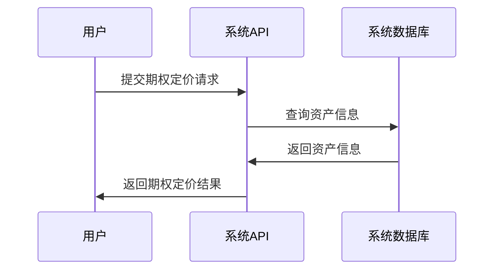

                 

### 1. 文章标题：《数学与资产定价：金融资产的数学定价》

#### 关键词：数学、资产定价、金融资产、布莱克-舒尔斯模型、概率分布、期望值

#### 摘要：
本文旨在深入探讨数学在金融资产定价中的关键作用，通过对核心概念、模型原理及实际应用的详细讲解，帮助读者理解并掌握资产定价的数学方法。文章将分为几个部分，首先介绍数学在金融领域的重要性及资产定价的基本概念，然后逐步深入分析概率分布、期望值和方差等核心数学概念，接着介绍布莱克-舒尔斯模型等常用资产定价模型，并通过系统分析与项目实战，使读者能够将这些理论应用于实际工作中。

----------------------------------------------------------------

## 数学与资产定价：金融资产的数学定价

### 引言

在金融市场中，资产定价是一个至关重要的环节。它不仅影响投资者的决策，也决定了市场的整体健康和稳定性。随着金融市场的发展和复杂性的增加，数学工具在资产定价中的作用日益凸显。本文将带领读者一步步深入理解数学在金融资产定价中的应用，从基础概念到实际应用，力求使读者对这一领域有一个全面且深刻的认识。

### 数学在金融领域的重要性

数学作为一门精密的科学，在金融领域有着广泛的应用。无论是从理论层面还是实践层面，数学都为金融市场提供了强大的分析工具。具体来说，数学在金融领域的重要性体现在以下几个方面：

1. **风险评估**：通过概率论和统计学的工具，可以对金融资产的风险进行量化，从而帮助投资者做出更为明智的投资决策。

2. **期权定价**：著名的布莱克-舒尔斯模型（Black-Scholes model）就是基于数学模型进行期权定价的，极大地推动了金融衍生品市场的发展。

3. **市场预测**：利用时间序列分析等数学方法，可以对市场走势进行预测，为投资者提供有价值的参考信息。

4. **组合优化**：数学优化方法可以帮助投资者构建最优投资组合，以实现最大化收益或最小化风险。

### 资产定价的基本概念

在深入探讨数学在资产定价中的应用之前，我们首先需要了解一些基本概念。以下是一些核心概念及其定义：

1. **资产**：资产是指能够带来未来经济利益的资源，可以是股票、债券、房地产等。

2. **价格**：价格是指资产在市场交易中所表现出的价值。

3. **风险**：风险是指资产价值波动的不确定性。

4. **收益**：收益是指资产在持有期间所产生的经济利益。

5. **市场**：市场是指资产交易的平台，包括股票市场、债券市场、期货市场等。

理解这些基本概念对于理解资产定价的数学模型至关重要。

### 数学概念在资产定价中的应用

数学在资产定价中的应用体现在多个方面，以下是一些关键数学概念及其在资产定价中的应用：

1. **概率分布**：概率分布是描述随机变量可能取值的集合及其概率。在资产定价中，概率分布可以用来估计资产未来价值的概率分布。

2. **期望值**：期望值是随机变量所有可能取值与其概率的乘积之和。在资产定价中，期望值用于估计资产未来价值的平均值。

3. **方差**：方差是描述随机变量取值离散程度的统计量。在资产定价中，方差用于估计资产价值波动的程度。

4. **协方差**：协方差是描述两个随机变量之间关系的统计量。在资产定价中，协方差用于分析不同资产之间的相关性。

### 布莱克-舒尔斯模型

布莱克-舒尔斯模型（Black-Scholes model）是金融衍生品定价的经典模型，由布莱克（Fischer Black）和舒尔斯（Myron Scholes）在1973年提出。该模型主要用于期权定价，其核心思想是利用数学模型来估计期权的价格。

#### 模型原理

布莱克-舒尔斯模型的原理基于以下几个假设：

1. **无套利**：市场中不存在无风险套利机会。
2. **连续交易**：资产可以随时买卖，不存在交易成本。
3. **随机漫步**：资产价格遵循几何布朗运动。
4. **无风险利率**：市场存在无风险资产，投资者可以以无风险利率借入或借出资金。

基于这些假设，布莱克-舒尔斯模型推导出了一个期权定价公式：

$$
C(S, t) = S \cdot \phi(d_1) - X \cdot \phi(d_2)
$$

其中，$C(S, t)$ 是期权价格，$S$ 是标的资产价格，$X$ 是期权的行权价，$\phi$ 是标准正态分布的累积分布函数，$d_1$ 和 $d_2$ 是两个参数。

#### 参数解释

- $d_1 = \frac{\ln(S/X) + (r + \sigma^2/2)t}{\sigma\sqrt{t}}$
- $d_2 = d_1 - \sigma\sqrt{t}$

#### 模型应用

布莱克-舒尔斯模型广泛应用于期权定价，同时也为其他金融衍生品的定价提供了理论基础。在实际应用中，投资者需要根据市场情况和期权特性调整模型参数，以获得更准确的定价结果。

### 数学公式与详细讲解

在资产定价中，数学公式起着至关重要的作用。以下是一些常用的数学公式及其应用场景：

#### 概率分布

概率分布是描述随机变量可能取值的集合及其概率。在资产定价中，常见的概率分布包括正态分布、对数正态分布等。

$$
f(x) = \frac{1}{\sqrt{2\pi\sigma^2}} e^{-\frac{(x-\mu)^2}{2\sigma^2}}
$$

其中，$\mu$ 是均值，$\sigma$ 是标准差。

#### 期望值

期望值是随机变量所有可能取值与其概率的乘积之和。在资产定价中，期望值用于估计资产未来价值的平均值。

$$
E(X) = \sum_{i=1}^{n} x_i \cdot p_i
$$

其中，$x_i$ 是随机变量可能的取值，$p_i$ 是对应的概率。

#### 方差

方差是描述随机变量取值离散程度的统计量。在资产定价中，方差用于估计资产价值波动的程度。

$$
Var(X) = E[(X - E(X))^2]
$$

#### 协方差

协方差是描述两个随机变量之间关系的统计量。在资产定价中，协方差用于分析不同资产之间的相关性。

$$
Cov(X, Y) = E[(X - E(X))(Y - E(Y))]
$$

### 系统分析与架构设计方案

资产定价系统是一个复杂的信息系统，它需要处理大量的数据，并支持多用户的并发操作。以下是一个简单的系统分析与架构设计方案：

#### 问题场景介绍

假设我们正在开发一个在线资产定价系统，该系统需要提供以下功能：

1. 资产信息管理：包括资产的基本信息、价格历史记录等。
2. 期权定价：根据市场数据和用户输入的参数，计算期权的价格。
3. 风险评估：分析资产的风险程度，为投资者提供参考。
4. 用户交互：提供友好的用户界面，方便用户进行操作。

#### 系统功能设计

系统功能设计包括以下几个模块：

1. **资产信息管理模块**：负责资产信息的存储、查询和更新。
2. **期权定价模块**：实现布莱克-舒尔斯模型等期权定价算法。
3. **风险评估模块**：分析资产的风险程度，提供风险报告。
4. **用户交互模块**：处理用户的操作请求，显示资产定价结果。

#### 系统架构设计

系统架构设计采用分层架构，包括以下几层：

1. **表现层**：负责处理用户的交互请求，显示资产定价结果。
2. **逻辑层**：实现资产定价算法和风险评估逻辑。
3. **数据层**：存储资产信息和期权定价结果。

#### 系统接口设计

系统接口设计包括以下几种：

1. **API接口**：提供资产定价和风险评估的API，方便外部系统调用。
2. **Web接口**：提供用户友好的Web界面，方便用户进行操作。
3. **数据库接口**：提供数据库操作的接口，方便数据存储和查询。

#### 系统交互序列图

以下是一个简单的系统交互序列图，展示了用户与系统之间的交互流程：



### 项目实战与案例分析

在本文的最后，我们将通过一个实际案例来展示如何将数学模型应用于资产定价。

#### 案例背景与目标

假设我们正在为一家金融公司开发一个期权定价系统，该公司的目标是提供准确的期权价格，以帮助投资者做出投资决策。我们的任务是根据市场数据和用户输入的参数，使用布莱克-舒尔斯模型计算出期权的价格。

#### 项目环境安装

首先，我们需要安装相关的软件和环境：

1. Python 3.8 或以上版本
2. Anaconda 或 Miniconda
3. Jupyter Notebook

#### 系统核心实现与代码解读

以下是一个简单的期权定价系统的实现，包括数据输入、模型计算和结果输出：

```python
import numpy as np
from scipy.stats import norm

def black_scholes(S, K, T, r, sigma):
    """
    布莱克-舒尔斯期权定价模型
    :param S: 标的资产价格
    :param K: 行权价
    :param T: 期权到期时间（年）
    :param r: 无风险利率
    :param sigma: 标的资产波动率
    :return: 期权价格
    """
    d1 = (np.log(S / K) + (r + 0.5 * sigma ** 2) * T) / (sigma * np.sqrt(T))
    d2 = d1 - sigma * np.sqrt(T)
    C = S * norm.cdf(d1) - K * np.exp(-r * T) * norm.cdf(d2)
    return C

# 示例数据
S = 100  # 标的资产价格
K = 100  # 行权价
T = 1    # 期权到期时间（年）
r = 0.05 # 无风险利率
sigma = 0.2  # 标的资产波动率

# 计算期权价格
C = black_scholes(S, K, T, r, sigma)
print(f"期权价格: {C}")
```

#### 实际案例分析与详细讲解

在本案例中，我们使用了布莱克-舒尔斯模型来计算欧式看涨期权的价格。具体步骤如下：

1. **输入参数**：首先，我们需要输入标的资产价格（S）、行权价（K）、期权到期时间（T）、无风险利率（r）和标的资产波动率（sigma）。
2. **计算 d1 和 d2**：使用布莱克-舒尔斯模型中的公式计算 d1 和 d2。
3. **计算期权价格**：使用 d1 和 d2 计算期权的价格。
4. **输出结果**：最后，我们将计算结果输出。

通过这个简单的案例，我们可以看到如何将数学模型应用于实际项目，从而实现资产定价。

#### 项目小结

通过本文的案例分析，我们展示了如何使用布莱克-舒尔斯模型进行期权定价。在实际项目中，我们首先需要收集市场数据，然后根据用户输入的参数，使用模型计算出期权价格，并将结果展示给用户。这个案例只是一个简单的示例，但在实际应用中，资产定价系统会涉及到更多的数据和更复杂的模型。

### 最佳实践 tips

在设计和实现资产定价系统时，以下是一些最佳实践：

1. **数据准确性**：确保输入数据的准确性和完整性，这是模型计算的基础。
2. **模型选择**：根据市场情况和资产特性选择合适的模型，例如布莱克-舒尔斯模型、二叉树模型等。
3. **算法优化**：对模型算法进行优化，以提高计算效率和准确性。
4. **系统稳定性**：确保系统在高并发、大数据量环境下依然能够稳定运行。
5. **用户界面**：设计友好的用户界面，方便用户进行操作。

### 小结与注意事项

本文详细介绍了数学在资产定价中的应用，从核心概念到实际应用，层层深入。我们通过布莱克-舒尔斯模型等数学模型，展示了如何进行资产定价，并通过实际案例讲解了如何将理论应用于实际项目。需要注意的是，资产定价是一个复杂的过程，需要综合考虑多种因素，而本文只是提供了一个基本的框架和示例。

### 拓展阅读与学习资源

1. **《金融数学导论》**：本书系统地介绍了金融数学的基本概念和方法，适合初学者阅读。
2. **《期权、期货及其他衍生品》**：本书详细介绍了金融衍生品的基本原理和市场应用，是金融工程师的必备参考书。
3. **在线课程**：例如 Coursera 上的“金融工程与风险管理”课程，提供了丰富的理论和实践知识。
4. **开源项目**：例如在 GitHub 上，有许多关于期权定价的 Python 模块和项目，可以帮助读者深入了解和实践。

### 作者信息

作者：AI天才研究院/AI Genius Institute & 禅与计算机程序设计艺术 /Zen And The Art of Computer Programming

---

通过这篇文章，我们希望能够帮助读者更好地理解数学在资产定价中的重要性，以及如何将理论应用于实际项目中。希望这篇文章能够对您的学习和工作有所帮助。

