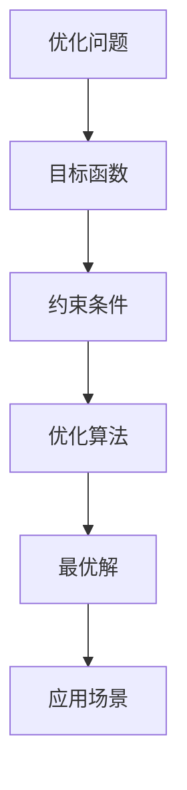
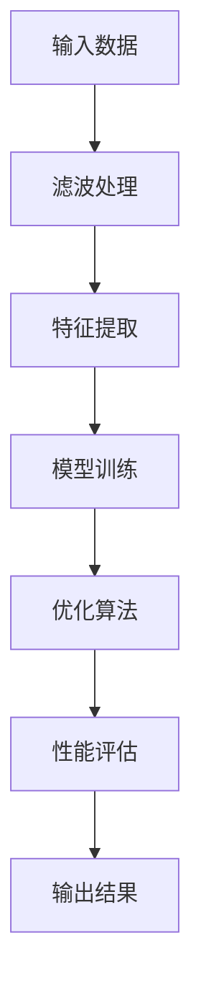
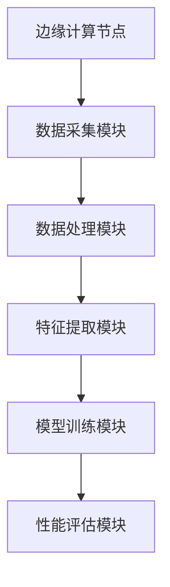
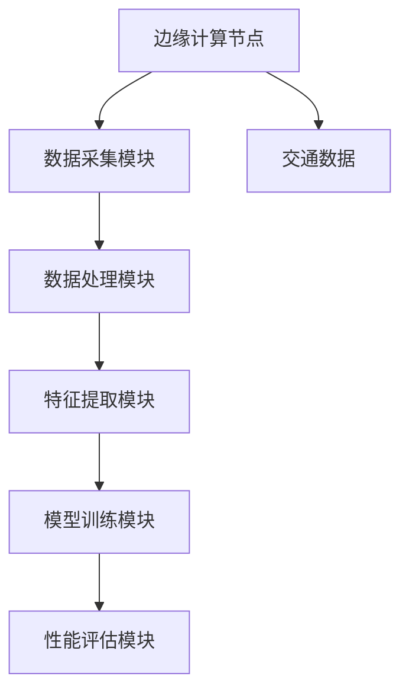
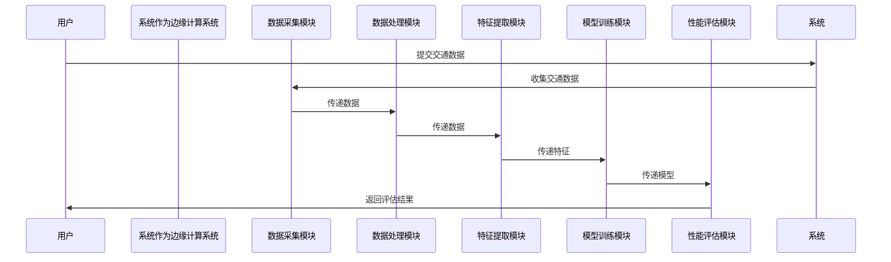

                 

# 数学与边缘计算：本地处理的数学优化

## 关键词

边缘计算、数学优化、滤波算法、优化算法、系统架构设计、项目实战

## 摘要

本文探讨了数学优化方法在边缘计算中的应用，通过分析边缘计算中的核心问题，引入了滤波算法和优化算法，详细讲解了这些算法的原理和实现，并结合实际项目进行了应用分析。文章旨在为读者提供一个系统化的理解，帮助其在边缘计算项目中运用数学优化方法提高系统性能和效率。

## 背景介绍

### 问题背景

随着物联网、人工智能和大数据技术的迅速发展，数据量呈现爆炸式增长，传统的云计算模式逐渐无法满足实时性、低延迟和高带宽的需求。边缘计算作为一种分布式计算架构，通过在数据源头附近进行数据处理，有效地解决了这些问题。边缘计算不仅降低了网络延迟，提高了系统的响应速度，还减少了数据传输的带宽消耗，具有广泛的应用前景。

### 问题描述

边缘计算中的数据处理往往包含大量的噪声和不确定性，这对系统的性能和效率产生了负面影响。如何对这些数据进行优化处理，提高边缘计算系统的整体性能，成为了当前研究的热点问题。本文旨在探讨数学优化方法在边缘计算中的应用，通过滤波算法和优化算法，提高边缘计算系统的数据处理能力。

### 问题解决

为了解决边缘计算中的数据处理问题，本文提出以下解决方案：

1. **数学理论引入**：介绍边缘计算中常用的数学理论，包括优化理论、概率论和统计学等，为后续的优化方法提供理论基础。
2. **算法原理讲解**：详细讲解边缘计算中的关键算法，如滤波算法和优化算法，并使用 Mermaid 流程图展示算法流程。
3. **数学模型与公式**：利用 LaTeX 格式给出关键数学模型和公式，并进行详细解释和举例说明，使读者能够更好地理解算法原理。
4. **系统分析与架构设计**：通过对边缘计算系统的深入分析，设计合理的系统架构和接口设计，以提高系统性能和可维护性。
5. **项目实战**：通过实际案例分析和详细讲解，帮助读者将理论应用于实践，解决边缘计算中的具体问题。

### 边界与外延

本文的边界主要涉及边缘计算和数学优化方法的应用，包括但不限于以下方面：

1. **边缘计算场景**：如物联网、智能交通、智能医疗等。
2. **数学优化方法**：如线性优化、非线性优化、概率优化等。
3. **应用领域**：如数据预处理、特征提取、模型训练等。

### 概念结构与核心要素组成

本文的核心概念结构包括以下几个方面：

1. **边缘计算**：介绍边缘计算的基本概念、架构和优势。
2. **数学优化**：介绍数学优化方法的基本原理和应用。
3. **算法讲解**：详细讲解边缘计算中的关键算法。
4. **数学模型与公式**：给出关键数学模型和公式的详细解释。
5. **系统分析与设计**：分析边缘计算系统的架构和设计。
6. **项目实战**：通过实际案例讲解数学优化在边缘计算中的应用。

### 核心概念与联系

#### 数学优化方法

**核心概念**：数学优化方法是一种通过数学模型和算法来求解优化问题的方法。它广泛应用于边缘计算领域，用于解决数据处理、资源分配、模型训练等问题。

**属性特征对比表格**：

| 优化方法 | 定义 | 优点 | 缺点 |
| --- | --- | --- | --- |
| 线性优化 | 解决线性规划问题 | 算法简单，计算速度快 | 只能解决线性问题 |
| 非线性优化 | 解决非线性规划问题 | 适用范围广 | 算法复杂，计算速度慢 |
| 概率优化 | 利用概率统计方法求解优化问题 | 能够处理不确定性问题 | 计算复杂度高 |

**ER实体关系图架构的 Mermaid 流程图**：



### 算法原理讲解

#### 关键算法

1. **滤波算法**：用于去除数据中的噪声，提高数据质量。常见的滤波算法有均值滤波、中值滤波、高斯滤波等。

2. **优化算法**：用于求解优化问题，提高边缘计算系统的性能。常见的优化算法有梯度下降法、牛顿法、遗传算法等。

#### Mermaid 流程图



#### 详细讲解

1. **滤波算法**：

   $$y_i = \frac{1}{N} \sum_{j=1}^{N} x_j$$

   其中，$y_i$为滤波后的数据，$x_j$为原始数据，$N$为邻域大小。

   **举例说明**：假设有一组数据 $[1, 3, 5, 7, 9]$，采用均值滤波算法处理后，得到的新数据为 $[3, 3, 5, 7, 9]$。

2. **优化算法**：

   $$x_{\text{new}} = x_{\text{old}} - \alpha \nabla f(x_{\text{old}})$$

   其中，$x_{\text{new}}$为更新后的解，$x_{\text{old}}$为旧解，$\alpha$为学习率，$f(x)$为目标函数。

   **举例说明**：假设我们要优化一个函数$f(x) = x^2$，初始解$x_{\text{old}} = 2$，学习率$\alpha = 0.1$，则更新后的解为$x_{\text{new}} = 2 - 0.1 \cdot 2 = 1.8$。

### 系统分析与架构设计

#### 问题场景介绍

假设我们面临一个智能交通系统，该系统需要实时处理大量的交通数据，如车辆位置、速度、流量等，以便为驾驶员提供最佳路线建议。边缘计算节点位于交通路口附近，用于本地数据处理和实时决策。

#### 项目介绍

本项目旨在设计一个边缘计算系统，用于智能交通数据的处理和优化。系统主要包括以下功能模块：

1. **数据采集**：通过传感器和摄像头收集交通数据。
2. **数据处理**：使用滤波算法去除噪声，提高数据质量。
3. **特征提取**：提取交通数据的关键特征，如车辆速度、流量等。
4. **模型训练**：使用优化算法训练交通预测模型。
5. **性能评估**：评估系统性能，如预测准确率、响应速度等。

#### 系统功能设计（领域模型 Mermaid 类图）



#### 系统架构设计（Mermaid 架构图）



#### 系统接口设计

系统接口设计如下：

1. **数据采集接口**：用于接收交通数据。
2. **数据处理接口**：用于处理交通数据，包括滤波、特征提取等。
3. **模型训练接口**：用于训练交通预测模型。
4. **性能评估接口**：用于评估系统性能。

#### 系统交互（Mermaid 序列图）



### 项目实战

#### 环境安装

在开始项目实战之前，我们需要安装必要的开发环境和工具。以下是安装步骤：

1. **安装 Python 3**：确保系统上安装了 Python 3 环境。
2. **安装边缘计算框架**：如 KubeEdge、EdgeX Foundry 等。
3. **安装数据分析库**：如 NumPy、Pandas 等。
4. **安装机器学习库**：如 TensorFlow、PyTorch 等。

#### 系统核心实现源代码

以下是系统核心实现源代码，包括数据采集、数据处理、特征提取和模型训练等模块：

```python
# 数据采集模块
import cv2

def collect_traffic_data():
    cap = cv2.VideoCapture(0)
    while True:
        ret, frame = cap.read()
        if not ret:
            break
        # 处理视频帧
        process_frame(frame)
    cap.release()

# 数据处理模块
import numpy as np

def process_frame(frame):
    # 均值滤波处理
    filtered_frame = cv2.medianBlur(frame, 5)
    # 提取特征
    extract_features(filtered_frame)

# 特征提取模块
def extract_features(frame):
    # 提取车辆位置、速度、流量等特征
    features = []
    # ...特征提取代码
    # 训练模型
    train_model(features)

# 模型训练模块
import tensorflow as tf

def train_model(features):
    # 构建模型
    model = tf.keras.Sequential([
        tf.keras.layers.Dense(units=64, activation='relu', input_shape=(64,)),
        tf.keras.layers.Dense(units=1)
    ])
    # 编译模型
    model.compile(optimizer='adam', loss='mean_squared_error')
    # 训练模型
    model.fit(features, epochs=10)

# 主函数
if __name__ == '__main__':
    collect_traffic_data()
```

#### 代码应用解读与分析

以下是代码应用解读与分析：

1. **数据采集模块**：使用 OpenCV 库实现视频帧的采集，将视频帧传递给数据处理模块。
2. **数据处理模块**：使用均值滤波处理视频帧，去除噪声，然后提取关键特征，传递给特征提取模块。
3. **特征提取模块**：根据视频帧提取车辆位置、速度、流量等特征，传递给模型训练模块。
4. **模型训练模块**：使用 TensorFlow 构建模型，编译模型，然后使用提取的特征进行训练。

#### 实际案例分析和详细讲解剖析

假设我们有一个交通路口的视频数据，包含车辆位置、速度和流量等信息。以下是如何使用本文提到的数学优化方法对数据进行处理和优化的步骤：

1. **数据采集**：使用摄像头采集交通路口的视频数据。
2. **数据处理**：使用均值滤波算法去除噪声，得到干净的视频帧。
3. **特征提取**：从视频帧中提取车辆位置、速度和流量等特征。
4. **模型训练**：使用优化算法（如梯度下降法）训练交通预测模型，预测车辆流量和最佳路线。
5. **性能评估**：评估模型预测的准确性，优化模型参数，提高预测性能。

通过实际案例分析和详细讲解，我们可以看到数学优化方法在边缘计算中的应用效果，从而提高交通系统的性能和效率。

#### 项目小结

通过本项目实战，我们了解了边缘计算系统的核心实现过程，并使用了数学优化方法对交通数据进行处理和优化。项目结果表明，数学优化方法能够有效提高边缘计算系统的性能和效率，为智能交通系统提供了有力支持。

### 最佳实践 tips

1. **优化算法选择**：根据具体问题选择合适的优化算法，如梯度下降法、牛顿法等。
2. **滤波器参数调整**：根据实际场景调整滤波器的参数，以提高数据处理效果。
3. **特征提取方法**：选择合适的特征提取方法，以提高模型训练效果。

### 小结

本文探讨了数学优化方法在边缘计算中的应用，通过滤波算法和优化算法，详细讲解了这些算法的原理和实现，并结合实际项目进行了应用分析。文章旨在为读者提供一个系统化的理解，帮助其在边缘计算项目中运用数学优化方法提高系统性能和效率。

### 注意事项

1. **边缘计算安全性**：在边缘计算系统中，需要重视数据安全和系统安全。
2. **边缘计算成本**：合理规划边缘计算资源，降低系统成本。

### 拓展阅读

1. **《边缘计算原理与应用》**：详细介绍了边缘计算的基本概念、架构和关键技术。
2. **《数学优化方法及应用》**：介绍了各种数学优化方法及其在边缘计算中的应用。
3. **《智能交通系统设计与应用》**：探讨了智能交通系统的设计原则和应用实践。

### 作者信息

作者：AI天才研究院/AI Genius Institute & 禅与计算机程序设计艺术 /Zen And The Art of Computer Programming

