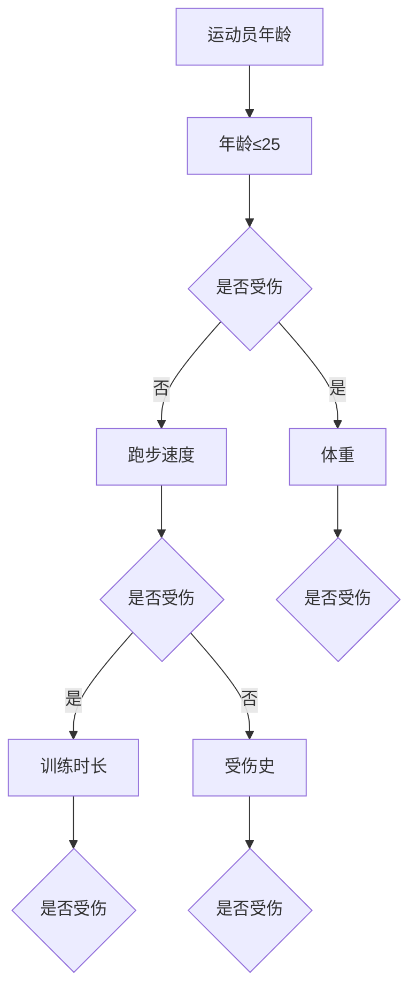

                 

### 文章标题

《数学与运动心理学：运动表现的数学分析》

> 关键词：数学分析、运动心理学、运动表现、量化指标、心理数学模型

> 摘要：本文将探讨数学与运动心理学的结合，通过数学分析方法对运动表现进行量化，并构建运动心理数学模型，以揭示运动表现的内在规律。文章将分三部分详细阐述：第一部分介绍数学与运动心理学的基础，包括核心概念与联系；第二部分探讨运动表现的量化指标及其计算与应用；第三部分介绍运动心理数学模型的构建与应用领域。通过本文的深入分析，读者将能够理解数学在运动心理学中的重要作用，以及如何通过数学方法提高运动表现。

### 目录大纲

----------------------------------------------------------------

## 第一部分：数学与运动心理学基础

### 第1章：引言

## 1.1 数学与运动心理学的结合

### 1.1.1 问题背景

### 1.1.2 问题描述

### 1.1.3 解决方案

### 1.1.4 边界与外延

### 1.1.5 概念结构与核心要素组成

## 1.2 核心概念与联系

### 1.2.1 数学概念

#### 1.2.1.1 数学公理系统

#### 1.2.1.2 几何学基本概念

#### 1.2.1.3 微积分基础

### 1.2.2 心理学概念

#### 1.2.2.1 运动心理学的定义

#### 1.2.2.2 运动心理学的研究领域

#### 1.2.2.3 运动心理学的基本原理

## 1.3 数学在运动心理学中的应用

### 1.3.1 运动表现分析

#### 1.3.1.1 运动表现指标

#### 1.3.1.2 运动表现数据的统计分析

#### 1.3.1.3 运动表现模型的构建

## 1.4 运动心理数学模型

### 1.4.1 运动心理数学模型概述

### 1.4.2 运动心理数学模型的应用领域

### 1.4.3 运动心理数学模型的核心算法

## 1.5 数学模型在运动心理学中的实例分析

### 1.5.1 实例1：运动表现预测

### 1.5.2 实例2：运动损伤风险评估

### 1.5.3 实例3：运动训练策略优化

## 1.6 本章小结

----------------------------------------------------------------

## 第二部分：运动表现的数学分析

### 第2章：运动表现的量化指标

## 2.1 运动表现的量化指标概述

### 2.1.1 运动表现指标的重要性

### 2.1.2 运动表现指标的类型

### 2.1.3 运动表现指标的选择标准

## 2.2 常见的运动表现量化指标

### 2.2.1 力学指标

#### 2.2.1.1 力的大小

#### 2.2.1.2 力的方向

#### 2.2.1.3 力的分解

### 2.2.2 速度指标

#### 2.2.2.1 平均速度

#### 2.2.2.2 瞬时速度

#### 2.2.2.3 加速度

### 2.2.3 动作指标

#### 2.2.3.1 动作的时间分析

#### 2.2.3.2 动作的空间分析

#### 2.2.3.3 动作的协调性

## 2.3 运动表现量化指标的计算与应用

### 2.3.1 运动表现量化指标的计算方法

### 2.3.2 运动表现量化指标的应用案例

### 2.3.3 运动表现量化指标的分析工具

## 2.4 运动表现的量化指标分析

### 2.4.1 运动表现量化指标的分析方法

### 2.4.2 运动表现量化指标的分析流程

### 2.4.3 运动表现量化指标的分析案例

## 2.5 本章小结

----------------------------------------------------------------

## 第三部分：运动心理学的数学模型

### 第3章：运动心理数学模型概述

## 3.1 运动心理数学模型的概念

### 3.1.1 运动心理数学模型的基本原理

### 3.1.2 运动心理数学模型的研究方法

### 3.1.3 运动心理数学模型的应用价值

## 3.2 运动心理数学模型的基本类型

### 3.2.1 行为主义数学模型

#### 3.2.1.1 斯金纳操作行为模型

#### 3.2.1.2 班杜拉认知行为模型

### 3.2.2 认知心理学数学模型

#### 3.2.2.1 凯利认知平衡模型

#### 3.2.2.2 穆勒认知心理学模型

### 3.2.3 生理心理学数学模型

#### 3.2.3.1 艾森克生理心理学模型

#### 3.2.3.2 斯腾伯格生理心理学模型

## 3.3 运动心理数学模型的构建方法

### 3.3.1 运动心理数学模型构建的基本步骤

### 3.3.2 运动心理数学模型构建的常见技巧

### 3.3.3 运动心理数学模型构建的案例分析

## 3.4 运动心理数学模型的应用领域

### 3.4.1 运动表现预测

### 3.4.2 运动损伤预防

### 3.4.3 运动训练效果评估

## 3.5 本章小结

------

## 1.1 数学与运动心理学的结合

### 1.1.1 问题背景

在当今社会，随着科技的发展和人们对健康生活质量的追求，运动心理学在体育科学中的应用越来越广泛。运动心理学研究运动者的心理状态、动机、情绪、认知过程以及行为表现，旨在提高运动成绩、优化运动训练策略和预防运动损伤。然而，传统的运动心理学研究主要依赖于定性分析和实验方法，这在一定程度上限制了其深度和广度。

数学作为一门精确的科学，为各种领域提供了强有力的工具和方法。将数学与运动心理学结合起来，可以通过定量分析和模型构建来揭示运动表现的内在规律，从而为运动训练和运动生理学研究提供新的视角和思路。因此，将数学方法应用于运动心理学研究，不仅能够提高研究的精确性和可靠性，还能够为体育科学的发展提供新的动力。

### 1.1.2 问题描述

运动心理学研究中的核心问题是运动表现的评价和优化。传统的运动心理学研究往往侧重于定性的描述和解释，例如通过访谈、问卷调查和实验来分析运动者的心理状态和行为。这种方法虽然能够提供丰富的信息，但在量化运动表现和预测运动成绩方面存在一定的局限性。

具体来说，运动表现的评价问题可以描述为：如何通过定量方法来评估运动者的技术动作、生理状态和心理状态？如何将这些指标与运动成绩联系起来，构建有效的运动表现模型？运动表现的优化问题可以描述为：如何基于运动表现的量化指标，制定科学的训练计划，提高运动成绩？如何通过运动心理学方法来预防运动损伤，提高运动者的长期健康水平？

### 1.1.3 解决方案

为了解决上述问题，我们可以采取以下解决方案：

1. **量化运动表现指标**：使用数学方法对运动者的技术动作、生理状态和心理状态进行量化，建立一系列量化指标。这些指标可以包括力学指标（如力、速度、加速度等）、动作指标（如时间、空间、协调性等）以及心理指标（如动机、情绪、认知等）。

2. **数据统计分析**：对收集到的运动表现数据进行统计分析，揭示运动表现指标之间的关系，找出影响运动成绩的关键因素。

3. **构建运动表现模型**：基于量化指标和统计分析结果，构建运动表现预测模型和优化模型。这些模型可以通过数学公式和算法来实现，能够为运动训练和运动生理学研究提供科学依据。

4. **应用实例分析**：通过具体实例，分析运动表现模型的构建和应用效果，验证数学方法在运动心理学研究中的实用性和有效性。

### 1.1.4 边界与外延

在数学与运动心理学的结合研究中，需要明确研究的边界和外延，以确保研究的针对性和深度。

1. **边界**：本文主要关注运动表现的评价和优化，重点关注力学指标、动作指标和心理指标的结合。研究范围不包括运动生理学、营养学等其他相关领域。

2. **外延**：尽管本文聚焦于运动心理学领域，但数学方法在体育科学中的应用具有广泛性。例如，在运动训练中，可以通过数学模型优化训练计划；在体育装备研发中，可以通过数学分析提高运动装备的性能；在运动医学中，可以通过数学模型预测运动损伤风险。

### 1.1.5 概念结构与核心要素组成

为了更好地理解数学与运动心理学的结合，我们可以从概念结构和核心要素组成两方面进行分析。

1. **概念结构**

   - 数学概念：数学公理系统、几何学基本概念、微积分基础等。
   - 运动心理学概念：运动心理学的定义、研究领域、基本原理等。

2. **核心要素组成**

   - 量化指标：力学指标、动作指标、心理指标等。
   - 数据分析：统计分析方法、数据可视化等。
   - 模型构建：预测模型、优化模型等。
   - 应用实例：具体运动项目中的应用实例。

通过上述概念结构和核心要素组成，我们可以清晰地看到数学与运动心理学的结合是如何在运动表现评价和优化中发挥作用的。

## 1.2 核心概念与联系

### 1.2.1 数学概念

在数学与运动心理学的结合中，数学概念是基础和核心。以下将介绍几个关键的数学概念，包括数学公理系统、几何学基本概念和微积分基础。

#### 1.2.1.1 数学公理系统

数学公理系统是数学研究的基础，它由一系列公理构成，用以推导出其他数学结论。常见的数学公理系统包括欧几里得几何公理系统、非欧几何公理系统和集合论公理系统等。在运动心理学研究中，集合论公理系统尤为重要，因为它提供了处理复杂运动数据的数学框架。

- **欧几里得几何公理系统**：这是最基础的几何学公理系统，它包括点、线、平面等基本概念，以及公理如平行公理、连续性公理等。
- **非欧几何公理系统**：这是对欧几里得几何公理系统的扩展，包括罗巴切夫斯基几何和黎曼几何。非欧几何在运动轨迹分析中具有重要作用，例如在研究篮球运动员的跳跃轨迹时。
- **集合论公理系统**：集合论是现代数学的基础，它通过公理来定义集合、元素、关系等概念。在运动心理学研究中，集合论用于处理运动数据，例如对运动员的技术动作和生理数据进行分类和分析。

#### 1.2.1.2 几何学基本概念

几何学是数学的重要分支，它涉及形状、大小、位置和变换等概念。以下是一些基本的几何概念：

- **点**：点是几何学中最基本的元素，它没有大小和形状，仅表示位置。
- **线**：线是无限延伸的一维对象，由无数个点组成。直线上任意两点可以确定一条直线。
- **平面**：平面是二维空间中的无限扩展的对象，由无数条线组成。平面上的任意三点可以确定一个平面。
- **圆**：圆是一个平面上的点集，这些点到平面上一个固定点的距离相等。圆的半径和直径是描述圆的基本参数。

几何学基本概念在运动心理学中的应用非常广泛，例如在分析运动员的跳跃轨迹、跑步姿势和击球动作时。

#### 1.2.1.3 微积分基础

微积分是数学的一个重要分支，它研究变化率和积累量。微积分在运动心理学中的应用主要体现在以下几个方面：

- **导数**：导数是描述变化率的数学工具。在运动心理学中，导数可以用来分析运动员的技术动作速度、加速度和减速等。
  - **速度**：速度是位移对时间的导数，描述运动员在一段时间内的位移变化。
  - **加速度**：加速度是速度对时间的导数，描述运动员在一段时间内的速度变化。
  - **减速度**：减速度是速度对时间的导数，描述运动员在一段时间内的速度减少。

- **积分**：积分是描述积累量的数学工具。在运动心理学中，积分可以用来分析运动员的技术动作力度、距离和功率等。
  - **力**：力是加速度对时间的积分，描述运动员在一段时间内施加的力。
  - **功**：功是力对位移的积分，描述运动员在一段时间内所做的功。

### 1.2.2 心理学概念

心理学是研究人类行为和心理过程的科学。在运动心理学中，心理学概念用于理解运动员的心理状态、动机、情绪和认知过程。以下介绍几个关键的心理学概念。

#### 1.2.2.1 运动心理学的定义

运动心理学是心理学的一个分支，它研究运动者的心理状态、动机、情绪、认知过程以及行为表现。运动心理学旨在通过心理学的理论和方法，提高运动成绩、优化运动训练策略和预防运动损伤。

- **运动者**：运动心理学研究的对象是各种运动者，包括职业运动员、业余爱好者以及参与体育运动的普通人。
- **心理状态**：心理状态是指运动者在特定时间内的心理状况，包括情绪、动机、自信心等。
- **动机**：动机是驱动运动者参与运动活动的内部或外部因素。动机可以分为内在动机和外在动机，内在动机与运动者的兴趣、乐趣和自我实现相关，外在动机与奖励、竞争和荣誉相关。
- **情绪**：情绪是运动者在运动过程中产生的情感体验，包括愉悦、焦虑、紧张等。
- **认知过程**：认知过程是运动者在运动中所进行的感知、记忆、思维和决策等心理活动。

#### 1.2.2.2 运动心理学的研究领域

运动心理学的研究领域非常广泛，包括以下几个方面：

- **心理状态与行为表现**：研究运动者的心理状态如何影响其行为表现，例如情绪、动机、自信心等对运动成绩的影响。
- **动机与行为**：研究运动者的动机类型和水平如何影响其参与运动的频率、持续时间以及运动成绩。
- **训练与心理干预**：研究如何通过心理训练和干预方法来提高运动成绩、预防运动损伤和改善运动者的心理健康。
- **运动损伤心理学**：研究运动损伤的心理机制，包括运动者的心理状态、情绪和认知过程如何影响运动损伤的发生和恢复。
- **运动社会心理学**：研究运动者在团队环境中的行为、团队动力和领导行为等。

#### 1.2.2.3 运动心理学的基本原理

运动心理学的基本原理主要包括以下几个方面：

- **行为主义原理**：行为主义强调行为和结果之间的关系，认为行为可以通过奖励和惩罚来塑造。在运动心理学中，行为主义原理可以用于设计和实施训练计划，以提高运动成绩。
- **认知行为原理**：认知行为理论强调认知过程对行为的影响，认为认知过程可以调节和控制行为。在运动心理学中，认知行为原理可以用于改善运动者的认知能力和决策水平，以提高运动成绩。
- **情绪调节原理**：情绪调节理论认为情绪对行为有重要影响，通过情绪调节方法可以帮助运动者控制情绪，提高运动表现。
- **动机激发原理**：动机激发理论认为动机是行为的重要驱动力，通过激发和维持动机，可以促进运动者的参与和表现。

### 1.2.3 数学与心理学概念的关联

数学与心理学概念的结合为运动心理学研究提供了新的方法和工具。以下从三个方面阐述数学与心理学概念的关联：

1. **量化心理现象**：数学可以用来量化心理现象，例如通过统计方法对运动员的动机、情绪、认知过程等进行量化分析，揭示其与运动表现之间的关系。

2. **模型构建**：数学模型可以用于构建运动表现模型，例如通过建立回归模型、神经网络模型等，分析运动员的技术动作、生理状态和心理状态对运动成绩的影响。

3. **数据分析**：数学提供了一系列数据分析方法，例如假设检验、方差分析、相关分析等，可以帮助运动心理学家对研究数据进行深入分析，验证理论假设。

### 1.2.4 概念属性特征对比表格

为了更好地理解数学与心理学概念，我们列出以下概念属性特征对比表格：

| 概念     | 数学属性特征                                                                 | 心理学属性特征                                                     |
| -------- | --------------------------------------------------------------------------- | ------------------------------------------------------------ |
| 数学公理系统 | 由一系列无矛盾的公理组成，用于推导其他数学结论                             | 提供心理学研究的基本假设和原则，用于解释和预测心理现象             |
| 几何学基本概念 | 点、线、平面等基本几何元素，以及其间的空间关系                             | 运动者对身体空间的感觉和运动能力，例如空间知觉、身体协调性等       |
| 微积分基础 | 导数和积分，描述变化率和积累量                                               | 心理过程中的变化规律，例如情绪波动、动机变化等                     |
| 动机     | 驱动行为的力量，可分为内在动机和外在动机                                   | 运动者参与运动的内部和外部原因，例如兴趣、竞争、奖励等             |
| 情绪     | 情感体验，包括愉悦、焦虑、紧张等                                             | 运动者在运动过程中产生的心理体验，影响行为表现和心理状态           |
| 认知过程 | 感知、记忆、思维和决策等心理活动                                             | 运动者在运动中所进行的信息处理过程，影响决策和动作表现             |

### 1.2.5 ER实体关系图架构的Mermaid流程图

为了更直观地展示数学与心理学概念之间的关系，我们使用Mermaid流程图绘制ER实体关系图。

```mermaid
erDiagram
    AIDE_Clas"数学概念" &&|..|> BIDE_Relation "数学与心理学关联"
    AIDE_Clas"心理学概念" &&|..|> BIDE_Relation "数学与心理学关联"

    Class MathConcept {
        <<interface>> AIDE
        数学公理系统
        几何学基本概念
        微积分基础
    }

    Class PsychConcept {
        <<interface>> BIDE
        动机
        情绪
        认知过程
    }

    MathConcept <--> PsychConcept : "数学与心理学关联"
```

通过上述ER实体关系图，我们可以清晰地看到数学概念与心理学概念之间的关联，以及它们在运动心理学研究中的应用。

### 1.3 数学在运动心理学中的应用

在运动心理学中，数学作为一种强有力的工具，被广泛应用于运动表现的分析、预测和优化。通过数学方法，我们可以对运动者的技术动作、生理状态和心理状态进行量化，揭示运动表现的内在规律，并为运动训练和策略制定提供科学依据。以下将详细探讨数学在运动心理学中的应用。

#### 1.3.1 运动表现分析

运动表现分析是运动心理学研究的重要方向之一，它旨在通过定量方法评估运动者的技术动作、生理状态和心理状态，从而全面了解运动表现。数学方法在这一过程中发挥着至关重要的作用。

1. **力学指标分析**

   力学指标是评估运动者技术动作的重要指标，包括力的大小、方向和分解等。通过数学模型，我们可以对力学指标进行定量分析，揭示运动者技术动作的力学特征。

   - **力的大小**：力的大小通常通过牛顿第二定律 \( F = ma \) 来计算，其中 \( F \) 是力，\( m \) 是质量，\( a \) 是加速度。通过测量运动者的加速度，可以计算出所施加的力。
   - **力的方向**：力的方向可以通过向量来表示，例如在跑步中，运动员的推力方向与地面的摩擦力方向是相互垂直的。
   - **力的分解**：在多维度空间中，力可以被分解为多个方向上的力分量。例如，在篮球运动员投篮时，可以分解为水平方向和垂直方向的力分量。

2. **动作指标分析**

   动作指标包括时间、空间和协调性等，这些指标反映了运动者在运动过程中的技术水平和运动能力。

   - **时间分析**：时间分析可以评估运动者完成动作所需的时间，例如起跑时间、投篮时间等。通过比较不同运动员的时间数据，可以分析他们的技术水平和竞技能力。
   - **空间分析**：空间分析可以评估运动者在运动空间中的位置变化，例如跳跃高度、跑步路径等。通过三维空间分析，可以揭示运动员在空间中的运动轨迹和特征。
   - **协调性分析**：协调性分析可以评估运动者在完成复杂动作时的协调性，例如击球、跳跃等。通过协调性分析，可以找出运动员在技术动作中的不足，为改进提供依据。

3. **心理状态分析**

   心理状态是影响运动表现的重要因素，包括动机、情绪和认知等。通过数学方法，我们可以量化心理状态，揭示其与运动表现之间的关系。

   - **动机分析**：动机是驱动运动者参与运动活动的内部或外部因素。通过问卷调查和统计方法，可以量化运动者的动机水平，分析其与运动表现之间的关系。
   - **情绪分析**：情绪是运动者在运动过程中产生的情感体验，如愉悦、焦虑、紧张等。通过情绪量表和生理指标（如心率、呼吸频率等），可以量化情绪状态，分析其对运动表现的影响。
   - **认知分析**：认知过程是运动者在运动中所进行的感知、记忆、思维和决策等心理活动。通过认知测试和脑电波分析，可以量化认知水平，分析其对运动表现的影响。

#### 1.3.2 运动表现数据的统计分析

统计分析是运动心理学研究的重要手段，通过统计分析，我们可以揭示运动表现指标之间的关系，找出影响运动成绩的关键因素。

1. **描述性统计分析**

   描述性统计分析用于描述运动表现数据的分布特征和基本统计量，例如平均值、标准差、方差等。通过描述性统计分析，我们可以了解运动表现指标的基本情况，为后续分析提供基础。

2. **相关性分析**

   相关性分析用于分析运动表现指标之间的相关性，揭示它们之间的关系。通过相关性分析，我们可以找出哪些指标对运动成绩有显著影响，从而为训练和策略制定提供依据。

   - **皮尔逊相关系数**：皮尔逊相关系数用于分析两个连续变量之间的线性相关性。通过计算皮尔逊相关系数，可以判断两个变量之间是否存在显著线性关系。
   - **斯皮尔曼等级相关系数**：斯皮尔曼等级相关系数用于分析两个变量之间的等级相关性。对于非连续变量或顺序变量，斯皮尔曼等级相关系数是适用的方法。

3. **回归分析**

   回归分析是一种常用的统计分析方法，用于分析自变量和因变量之间的关系。通过回归分析，我们可以建立运动表现预测模型，预测运动成绩。

   - **简单线性回归**：简单线性回归用于分析一个自变量和一个因变量之间的线性关系。通过简单线性回归，可以建立运动表现指标与运动成绩之间的线性模型。
   - **多元线性回归**：多元线性回归用于分析多个自变量和一个因变量之间的线性关系。通过多元线性回归，可以同时考虑多个因素对运动成绩的影响。

#### 1.3.3 运动表现模型的构建

运动表现模型的构建是运动心理学研究的重要任务之一，通过构建模型，我们可以揭示运动表现的内在规律，为训练和策略制定提供科学依据。

1. **回归模型**

   回归模型是一种常用的运动表现模型，通过回归分析，我们可以建立运动表现指标与运动成绩之间的模型。回归模型可以用于预测运动成绩，分析哪些指标对运动成绩有显著影响。

2. **神经网络模型**

   神经网络模型是一种基于人工神经网络的模型，通过学习运动表现指标与运动成绩之间的复杂关系，可以建立准确的预测模型。神经网络模型在运动心理学中的应用越来越广泛，尤其在运动表现预测和优化方面。

3. **机器学习模型**

   机器学习模型是近年来在运动心理学研究中受到关注的方法，通过训练机器学习模型，可以自动识别和预测运动表现。常见的机器学习模型包括支持向量机、决策树、随机森林等。

#### 1.3.4 数学方法在运动心理学中的应用实例

为了更好地理解数学方法在运动心理学中的应用，以下通过几个实例进行说明。

1. **运动表现预测**

   通过收集运动员的力学指标、动作指标和心理指标数据，建立回归模型或神经网络模型，预测运动员的运动会成绩。例如，通过建立回归模型，分析跑步速度、跳跃高度和心率等指标与跑步成绩之间的关系，预测运动员的马拉松比赛成绩。

2. **运动损伤风险评估**

   通过收集运动员的力学指标、动作指标和心理指标数据，建立机器学习模型，预测运动员发生运动损伤的风险。例如，通过建立决策树模型，分析运动员的跳跃高度、跑步姿势和情绪状态等指标，预测其发生运动损伤的可能性。

3. **运动训练策略优化**

   通过收集运动员的力学指标、动作指标和心理指标数据，建立回归模型或神经网络模型，分析训练效果，优化训练策略。例如，通过建立回归模型，分析不同训练方法的运动表现指标变化，找出最佳训练策略。

### 1.4 运动心理数学模型

在运动心理学中，运动心理数学模型是一种重要的研究工具，它通过数学方法对运动者的心理过程和行为表现进行量化分析和预测。这些模型不仅有助于理解运动者的心理状态，还能为训练策略的制定和运动表现的提升提供科学依据。以下将介绍运动心理数学模型的概述、应用领域以及核心算法。

#### 1.4.1 运动心理数学模型概述

运动心理数学模型是指利用数学方法，对运动者的心理过程和行为表现进行量化分析和预测的模型。这些模型通常基于心理学的理论，结合数学和统计方法，通过数据收集、建模和预测等步骤，对运动者的心理状态和行为进行深入分析。

1. **模型类型**

   运动心理数学模型可以分为几种类型，包括：

   - **行为主义模型**：这类模型基于行为主义理论，强调外部刺激对行为的影响。例如，斯金纳的操作行为模型和班杜拉的认知行为模型。
   - **认知心理学模型**：这类模型基于认知心理学理论，关注内部心理过程对行为的影响。例如，凯利的认知平衡模型和穆勒的认知心理学模型。
   - **生理心理学模型**：这类模型基于生理心理学理论，研究心理过程与生理机制之间的关系。例如，艾森克的生理心理学模型和斯腾伯格的生理心理学模型。

2. **模型结构**

   运动心理数学模型通常由以下几个部分组成：

   - **输入变量**：包括运动者的生理指标、心理指标和行为指标等。
   - **模型参数**：模型中使用的参数，例如权重、系数等。
   - **输出变量**：模型预测的结果，例如心理状态、行为表现等。
   - **算法**：实现模型预测的计算方法，例如线性回归、神经网络等。

3. **模型构建过程**

   运动心理数学模型的构建通常包括以下几个步骤：

   - **数据收集**：收集运动者的生理、心理和行为数据，包括力、速度、情绪、动机等。
   - **数据预处理**：对收集到的数据进行清洗、标准化和转换，以消除噪声和异常值。
   - **模型选择**：选择合适的数学模型，例如线性回归、神经网络等。
   - **模型训练**：通过训练数据集对模型进行训练，调整模型参数，以优化模型性能。
   - **模型验证**：使用验证数据集对模型进行验证，评估模型的预测准确性和可靠性。
   - **模型应用**：将训练好的模型应用于新的数据，进行预测和评估。

#### 1.4.2 运动心理数学模型的应用领域

运动心理数学模型在运动心理学研究中具有广泛的应用领域，以下介绍几个主要的应用领域。

1. **运动表现预测**

   运动心理数学模型可以用于预测运动者的比赛成绩或训练表现。通过收集运动者的生理、心理和行为数据，构建预测模型，可以提前预测运动者的表现，为训练和比赛策略的制定提供科学依据。

2. **运动损伤预防**

   运动心理数学模型可以用于评估运动者发生运动损伤的风险，通过分析运动者的生理、心理和行为数据，预测其可能发生的运动损伤类型和程度，从而采取预防措施。

3. **运动训练策略优化**

   运动心理数学模型可以用于评估不同训练策略对运动表现的影响，通过构建预测模型，分析不同训练策略的效果，为运动训练提供科学依据，优化训练策略。

4. **运动心理干预**

   运动心理数学模型可以用于评估运动者的心理状态，通过分析运动者的生理、心理和行为数据，发现其心理问题，制定相应的心理干预策略，提高运动者的心理素质和竞技能力。

5. **运动心理健康评估**

   运动心理数学模型可以用于评估运动者的心理健康水平，通过分析运动者的生理、心理和行为数据，发现其心理问题，提供针对性的心理咨询服务，促进运动者的心理健康。

#### 1.4.3 运动心理数学模型的核心算法

运动心理数学模型的核心算法是实现模型预测和评估的关键。以下介绍几个常用的核心算法。

1. **线性回归**

   线性回归是一种简单的预测模型，通过分析自变量和因变量之间的线性关系，建立回归方程，预测因变量的值。在运动心理学中，线性回归可以用于预测运动成绩、评估心理状态等。

   - **模型公式**：\( y = \beta_0 + \beta_1x_1 + \beta_2x_2 + ... + \beta_nx_n \)
   - **参数估计**：通过最小二乘法估计模型参数，使实际观测值与预测值之间的误差平方和最小。

2. **神经网络**

   神经网络是一种基于人工神经网络的预测模型，通过多层神经网络结构，对输入数据进行学习，预测输出结果。在运动心理学中，神经网络可以用于预测运动表现、评估心理状态等。

   - **模型结构**：包括输入层、隐藏层和输出层，每个层由多个神经元组成。
   - **学习算法**：通过反向传播算法，调整神经元之间的权重，使模型预测误差最小。

3. **支持向量机**

   支持向量机是一种基于最大间隔原则的预测模型，通过找到最佳分类边界，对输入数据进行分类。在运动心理学中，支持向量机可以用于分类运动成绩、评估心理状态等。

   - **模型公式**：\( f(x) = \sum_{i=1}^{n} \alpha_i y_i (x_i^T x - 1) + b \)
   - **参数优化**：通过求解最优化问题，找到支持向量机和分类边界。

4. **决策树**

   决策树是一种基于分类规则的预测模型，通过树形结构，对输入数据进行分类。在运动心理学中，决策树可以用于分类运动成绩、评估心理状态等。

   - **模型结构**：包括根节点、内部节点和叶节点，每个节点表示一个分类规则。
   - **构建方法**：通过信息增益、基尼系数等准则，选择最佳特征进行分割。

### 1.5 数学模型在运动心理学中的实例分析

为了更好地理解数学模型在运动心理学中的应用，以下通过几个实例进行分析。

#### 1.5.1 实例1：运动表现预测

假设我们要预测一名短跑运动员的百米赛跑成绩。我们收集了以下数据：

- 运动员的体重（公斤）
- 运动员的起跑速度（米/秒）
- 运动员的最大心率（次/分钟）
- 运动员的训练时长（小时）

我们选择线性回归模型进行预测，首先对数据进行标准化处理，然后通过最小二乘法估计模型参数。构建的回归方程如下：

\[ y = \beta_0 + \beta_1x_1 + \beta_2x_2 + \beta_3x_3 + \beta_4x_4 \]

其中，\( y \) 表示百米赛跑成绩，\( x_1 \) 表示体重，\( x_2 \) 表示起跑速度，\( x_3 \) 表示最大心率，\( x_4 \) 表示训练时长。

通过训练数据集对模型进行训练，得到模型参数。然后，使用验证数据集对模型进行验证，评估模型的预测准确性和可靠性。最后，使用训练好的模型对新的运动员数据进行分析，预测其百米赛跑成绩。

#### 1.5.2 实例2：运动损伤风险评估

假设我们要评估一名足球运动员发生运动损伤的风险。我们收集了以下数据：

- 运动员的年龄
- 运动员的体重
- 运动员的跑步速度
- 运动员的训练时长
- 运动员的受伤史

我们选择决策树模型进行预测，首先对数据进行预处理，然后构建决策树模型。构建的决策树如下：



通过训练数据集对模型进行训练，得到决策树模型。然后，使用验证数据集对模型进行验证，评估模型的预测准确性和可靠性。最后，使用训练好的模型对新的运动员数据进行分析，预测其发生运动损伤的风险。

#### 1.5.3 实例3：运动训练策略优化

假设我们要优化一名游泳运动员的训练策略。我们收集了以下数据：

- 运动员的训练时长
- 运动员的训练强度
- 运动员的比赛成绩
- 运动员的心理状态

我们选择线性回归模型进行预测，首先对数据进行标准化处理，然后通过最小二乘法估计模型参数。构建的回归方程如下：

\[ y = \beta_0 + \beta_1x_1 + \beta_2x_2 + \beta_3x_3 + \beta_4x_4 \]

其中，\( y \) 表示比赛成绩，\( x_1 \) 表示训练时长，\( x_2 \) 表示训练强度，\( x_3 \) 表示心理状态。

通过训练数据集对模型进行训练，得到模型参数。然后，使用验证数据集对模型进行验证，评估模型的预测准确性和可靠性。最后，使用训练好的模型对新的训练数据进行分析，根据模型预测的结果，优化运动员的训练策略。

### 1.6 本章小结

本章首先介绍了数学与运动心理学的结合背景，探讨了运动表现的量化指标和数学模型构建的重要性。接着，详细阐述了数学与心理学概念的联系，包括数学公理系统、几何学基本概念和微积分基础等。然后，介绍了数学在运动心理学中的应用，包括运动表现分析、数据统计分析和模型构建方法。最后，通过实例分析了运动心理数学模型的应用效果，展示了数学方法在运动心理学研究中的广泛应用和重要性。

通过本章的学习，读者可以了解到数学在运动心理学研究中的关键作用，掌握运动表现的量化指标和数学模型构建的基本方法，为后续章节的深入探讨打下坚实基础。

## 2.1 运动表现的量化指标概述

运动表现的量化指标是运动心理学研究中的核心内容，它通过具体的数值和量化方法对运动者的技术动作、生理状态和心理状态进行评估，从而为运动训练和策略制定提供科学依据。本节将详细介绍运动表现量化指标的重要性、类型和选择标准，并探讨这些指标在实际运动心理学研究中的应用。

### 2.1.1 运动表现指标的重要性

运动表现量化指标在运动心理学研究中具有重要地位，主要体现在以下几个方面：

1. **客观评估运动成绩**：量化指标能够通过具体的数值对运动成绩进行客观评估，克服了传统主观评价方法的局限，提高了评估的准确性和可靠性。

2. **发现运动表现瓶颈**：通过量化指标，可以识别运动者在技术动作、生理状态和心理状态中的薄弱环节，为有针对性的训练和策略制定提供依据。

3. **优化训练效果**：量化指标能够量化训练效果，帮助教练和运动者了解训练方法的有效性，从而优化训练策略，提高运动成绩。

4. **科学指导运动训练**：通过量化指标，可以根据运动者的实际情况制定科学的训练计划，提高训练的针对性和有效性。

5. **预防运动损伤**：量化指标可以评估运动者的运动风险，发现可能导致运动损伤的因素，从而采取预防措施，降低运动损伤的发生率。

### 2.1.2 运动表现指标的类型

运动表现量化指标可以分为多种类型，每种类型指标都反映了运动者在不同方面的表现。以下是几种常见的运动表现量化指标类型：

1. **力学指标**

   力学指标是评估运动者技术动作力学特征的指标，主要包括：

   - **力的大小**：通过测量运动者施加的力，可以了解其肌肉力量和力量输出能力。
   - **力的方向**：力的方向决定了运动者的技术动作效果，例如投篮时的角度、跑步时的步幅方向等。
   - **力的分解**：在多维度空间中，力可以被分解为多个方向上的分量，例如在跳跃中，可以将力分解为垂直方向和水平方向的分量。

2. **速度指标**

   速度指标是评估运动者运动速度的指标，主要包括：

   - **平均速度**：在一定时间内运动者的位移与时间的比值，反映了运动者的整体速度水平。
   - **瞬时速度**：在某一瞬间运动者的速度，可以用于分析技术动作的瞬间速度变化，例如跳跃中的最高点速度、冲刺中的最大速度等。
   - **加速度**：速度对时间的导数，反映了运动者在一定时间内速度的变化率，可以用于分析运动者的加速和减速能力。

3. **动作指标**

   动作指标是评估运动者技术动作完成情况的指标，主要包括：

   - **时间分析**：通过分析技术动作的时间特征，可以了解运动者的动作节奏和完成时间，例如起跑时间、跳跃时间、击球时间等。
   - **空间分析**：通过分析技术动作的空间特征，可以了解运动者的动作轨迹和空间利用效率，例如跑步轨迹、跳跃高度、击球角度等。
   - **协调性分析**：通过分析技术动作的协调性，可以了解运动者在完成技术动作时的协调能力，例如击球时的手眼协调、跑步时的步频和步幅协调等。

4. **心理指标**

   心理指标是评估运动者心理状态的指标，主要包括：

   - **动机**：动机是驱动运动者参与运动活动的内部或外部因素，反映了运动者的参与动机和积极性。
   - **情绪**：情绪是运动者在运动过程中产生的情感体验，如愉悦、焦虑、紧张等，反映了运动者的情绪状态。
   - **认知**：认知是指运动者在运动中所进行的感知、记忆、思维和决策等心理活动，反映了运动者的认知水平和决策能力。

### 2.1.3 运动表现指标的选择标准

在运动心理学研究中，选择合适的量化指标是关键，以下介绍几种选择标准：

1. **代表性**：指标应能够充分代表运动者某一方面表现，能够准确反映运动成绩。

2. **可靠性**：指标应具有高可靠性，即在不同时间、不同条件下测量结果的一致性。

3. **有效性**：指标应具有较高的有效性，能够准确预测运动成绩，反映运动训练效果。

4. **可操作性**：指标应易于操作和测量，方便在运动训练和比赛中实际应用。

5. **针对性**：指标应根据运动项目和运动者的特点选择，具有针对性。

6. **综合性**：指标应能够综合反映运动者在多个方面的表现，提供全面的信息。

### 2.1.4 运动表现量化指标在实际研究中的应用

运动表现量化指标在实际研究中具有广泛的应用，以下通过几个具体案例进行说明：

1. **运动表现预测**

   通过收集运动者的力学指标、速度指标和动作指标数据，构建回归模型或神经网络模型，预测运动者的比赛成绩。例如，通过收集短跑运动员的起跑速度、加速度和步频数据，构建预测模型，预测其百米赛跑成绩。

2. **运动损伤风险评估**

   通过收集运动者的力学指标、动作指标和心理指标数据，构建决策树模型或机器学习模型，评估运动者发生运动损伤的风险。例如，通过收集足球运动员的体重、速度、受伤史和心理状态数据，构建预测模型，评估其发生运动损伤的可能性。

3. **运动训练策略优化**

   通过收集运动者的量化指标数据，分析不同训练方法的效果，优化训练策略。例如，通过收集游泳运动员的训练时长、强度和比赛成绩数据，构建回归模型，分析不同训练方法对比赛成绩的影响，从而优化训练策略。

4. **心理干预效果评估**

   通过收集运动者的量化指标数据，评估心理干预措施的效果。例如，通过收集运动员的动机、情绪和认知数据，分析心理训练对运动成绩和心理状态的影响，评估心理干预的有效性。

### 2.1.5 本章小结

本章介绍了运动表现量化指标的重要性、类型和选择标准，并探讨了这些指标在实际运动心理学研究中的应用。通过量化指标的客观评估，可以更准确地了解运动者的表现，发现运动表现的瓶颈，优化训练策略，提高运动成绩，预防运动损伤。本章为后续章节的深入探讨奠定了基础，使读者能够更好地理解运动表现的量化分析。

## 2.2 常见的运动表现量化指标

在运动心理学研究中，常见的运动表现量化指标包括力学指标、速度指标和动作指标。这些指标通过对运动者技术动作、生理状态和心理状态的量化，为运动训练和策略制定提供了科学依据。以下将详细介绍这些指标的具体内容和应用。

### 2.2.1 力学指标

力学指标是评估运动者技术动作力学特征的量化指标，主要包括力的大小、力的方向和力的分解。以下分别对这些指标进行详细说明。

#### 2.2.1.1 力的大小

力的大小是指运动者在完成技术动作时施加的力。力的大小直接影响运动效果，如投篮的力度、跑步的推力等。力的大小通常通过测量技术动作中施加的力来评估。例如，在篮球投篮中，可以通过测量运动员对篮球施加的力来评估其投篮力度。

- **测量方法**：力的大小通常通过力传感器或测力计来测量。例如，在跑步中，运动员的推力可以通过安装在跑道上的力传感器来测量。
- **应用实例**：在田径运动中，力的大小是评估运动员技术动作的重要指标。例如，在长跑中，推力的大小直接影响运动员的速度和耐力；在短跑中，推力的大小直接影响起跑速度和冲刺速度。

#### 2.2.1.2 力的方向

力的方向是指运动者在完成技术动作时施加力的方向。力的方向决定了技术动作的效果和运动轨迹。例如，在篮球投篮中，投篮的方向直接影响篮球的飞行轨迹和进球的可能性。

- **测量方法**：力的方向通常通过测量力的向量方向来评估。例如，在篮球投篮中，可以通过测量篮球离开运动员手中的方向来评估投篮方向。
- **应用实例**：在击球运动中，力的方向是评估运动员技术动作的重要指标。例如，在棒球比赛中，击球方向直接影响球的飞行轨迹和距离；在网球比赛中，击球方向直接影响球的旋转和速度。

#### 2.2.1.3 力的分解

在多维度空间中，力可以被分解为多个方向上的分量。力的分解有助于分析技术动作的力学特征，如垂直方向和水平方向的力分量。例如，在跳跃中，垂直方向的力分量用于克服重力，使运动员上升；水平方向的力分量用于推动运动员向前移动。

- **测量方法**：力的分解通常通过测量力的各个方向分量来评估。例如，在跳跃中，可以通过测量垂直方向和水平方向的力分量来分析运动员的跳跃力学特征。
- **应用实例**：在跳跃运动中，力的分解是评估运动员技术动作的重要指标。例如，在跳高比赛中，垂直方向的力分量直接影响运动员的跳高高度；在跳远比赛中，水平方向的力分量直接影响运动员的跳远距离。

### 2.2.2 速度指标

速度指标是评估运动者运动速度的量化指标，主要包括平均速度、瞬时速度和加速度。以下分别对这些指标进行详细说明。

#### 2.2.2.1 平均速度

平均速度是指在一定时间内运动者的位移与时间的比值。平均速度反映了运动者在一段时间内的整体运动速度水平。

- **测量方法**：平均速度通常通过测量运动者在一段时间内的位移和时间来计算。例如，在跑步中，可以通过测量运动员在一定时间内跑过的距离和用时来计算平均速度。
- **应用实例**：平均速度是评估运动者跑步成绩的重要指标。例如，在马拉松比赛中，运动员的平均速度直接影响其比赛成绩。此外，平均速度也可以用于评估运动员的训练效果，如通过比较不同训练阶段的平均速度，评估训练方法的成效。

#### 2.2.2.2 瞬时速度

瞬时速度是指运动者在某一瞬间时的速度。瞬时速度反映了运动者在某一时刻的运动状态，是评估技术动作效果的重要指标。

- **测量方法**：瞬时速度通常通过测量运动者在某一瞬间时的速度来计算。例如，在短跑比赛中，可以通过测量运动员起跑时的速度和冲刺时的速度来评估其瞬时速度。
- **应用实例**：瞬时速度是评估运动者技术动作效果的重要指标。例如，在短跑比赛中，瞬时速度直接影响运动员的起跑速度和冲刺速度；在篮球投篮中，瞬时速度直接影响篮球的飞行轨迹和进球的可能性。

#### 2.2.2.3 加速度

加速度是指速度对时间的导数，反映了运动者在一定时间内速度的变化率。加速度可以用于评估运动者的加速和减速能力。

- **测量方法**：加速度通常通过测量运动者在一段时间内的速度变化和时间来计算。例如，在跑步中，可以通过测量运动员在一定时间内的速度变化和用时来计算加速度。
- **应用实例**：加速度是评估运动者技术动作效果的重要指标。例如，在长跑比赛中，加速度直接影响运动员的起跑速度和冲刺速度；在篮球比赛中，加速度直接影响运动员的加速和减速能力。

### 2.2.3 动作指标

动作指标是评估运动者技术动作完成情况的量化指标，主要包括时间分析、空间分析和协调性分析。以下分别对这些指标进行详细说明。

#### 2.2.3.1 时间分析

时间分析是指对技术动作的时间特征进行分析，包括起跑时间、跳跃时间、击球时间等。时间分析可以用于评估运动者的动作节奏和技术动作的完成时间。

- **测量方法**：时间分析通常通过测量技术动作的时间长度来计算。例如，在跑步中，可以通过测量运动员起跑、加速和冲刺的时间来评估其动作节奏。
- **应用实例**：时间分析是评估运动者技术动作的重要指标。例如，在短跑比赛中，起跑时间直接影响运动员的起跑速度和比赛成绩；在篮球比赛中，击球时间直接影响篮球的飞行轨迹和进球的可能性。

#### 2.2.3.2 空间分析

空间分析是指对技术动作的空间特征进行分析，包括跑步轨迹、跳跃高度、击球角度等。空间分析可以用于评估运动者在空间中的运动能力和技术动作的空间效果。

- **测量方法**：空间分析通常通过测量技术动作的空间参数来计算。例如，在跑步中，可以通过测量运动员的跑步轨迹和跳跃高度来评估其空间利用效率。
- **应用实例**：空间分析是评估运动者技术动作的重要指标。例如，在跳高比赛中，跳跃高度直接影响运动员的跳高成绩；在网球比赛中，击球角度直接影响球的旋转和速度。

#### 2.2.3.3 协调性分析

协调性分析是指对技术动作的协调性进行分析，包括手眼协调、步频和步幅协调等。协调性分析可以用于评估运动者在完成技术动作时的协调能力。

- **测量方法**：协调性分析通常通过测量技术动作的协调性指标来计算。例如，在击球中，可以通过测量手眼协调时间和击球准确度来评估其协调性。
- **应用实例**：协调性分析是评估运动者技术动作的重要指标。例如，在击球运动中，协调性直接影响击球的准确度和效果；在跑步中，协调性直接影响跑步的节奏和速度。

### 2.2.4 本章小结

本章详细介绍了常见的运动表现量化指标，包括力学指标、速度指标和动作指标。通过这些指标，可以客观评估运动者的技术动作、生理状态和心理状态，为运动训练和策略制定提供科学依据。本章的内容为后续章节的深入探讨奠定了基础，使读者能够更好地理解运动表现的量化分析。

## 2.3 运动表现量化指标的计算与应用

在运动心理学研究中，准确计算运动表现量化指标是评估和优化运动者表现的关键步骤。本节将详细介绍运动表现量化指标的计算方法、实际应用案例以及常用的分析工具。

### 2.3.1 运动表现量化指标的计算方法

1. **力学指标的计算**

   - **力的大小**：力的大小可以通过测量物体在力的作用下所受的加速度来计算。使用牛顿第二定律 \( F = ma \)，其中 \( F \) 是力，\( m \) 是物体质量，\( a \) 是加速度。在实际应用中，通常使用测力计或力传感器来测量力的大小。
   
   - **力的方向**：力的方向可以通过向量表示。在二维空间中，力可以分解为水平和垂直分量。使用三角函数（如正弦和余弦函数），可以计算力的水平和垂直分量。例如，一个45度的力可以分解为 \( F_x = F \cdot \cos(45^\circ) \) 和 \( F_y = F \cdot \sin(45^\circ) \)。
   
   - **力的分解**：在多维度空间中，力可以被分解为多个方向上的分量。通过向量运算，可以将力分解为任意方向上的分量。例如，在一个三维空间中，力 \( \vec{F} \) 可以分解为 \( \vec{F}_x \)、\( \vec{F}_y \) 和 \( \vec{F}_z \)。

2. **速度指标的计算**

   - **平均速度**：平均速度是位移与时间的比值。公式为 \( \bar{v} = \frac{d}{t} \)，其中 \( \bar{v} \) 是平均速度，\( d \) 是位移，\( t \) 是时间。在跑步或游泳等直线运动中，可以通过测量起点和终点之间的距离以及运动时间来计算平均速度。
   
   - **瞬时速度**：瞬时速度是在某一瞬间的速度，可以通过测量极短时间内的位移变化来计算。例如，在跑步中，可以使用激光测距仪或高帧率摄像头来捕捉运动员某一瞬间的位移，然后除以时间间隔来计算瞬时速度。
   
   - **加速度**：加速度是速度变化率。公式为 \( a = \frac{\Delta v}{\Delta t} \)，其中 \( a \) 是加速度，\( \Delta v \) 是速度变化，\( \Delta t \) 是时间间隔。通过测量速度变化和时间间隔，可以计算加速度。

3. **动作指标的计算**

   - **时间分析**：通过计时器或电子计时系统，可以记录运动者完成技术动作所需的时间。例如，在篮球比赛中，可以使用计时器来记录投篮时间。
   
   - **空间分析**：通过三维运动捕捉系统或激光测距仪，可以测量运动者在空间中的运动轨迹和位置变化。例如，在跳高比赛中，可以使用运动捕捉系统来测量运动员的跳跃高度和轨迹。
   
   - **协调性分析**：通过记录运动者完成技术动作时的手眼协调或步频步幅协调，可以分析其协调性。例如，在击球运动中，可以使用摄像头和传感器来记录运动员的手臂和球之间的协调时间。

### 2.3.2 运动表现量化指标的应用案例

1. **运动表现预测**

   假设我们要预测一名运动员的百米赛跑成绩。我们可以收集以下数据：

   - 运动员的体重
   - 运动员的起跑速度
   - 运动员的最大心率
   - 运动员的训练时长

   通过构建线性回归模型或神经网络模型，将上述数据与运动员的百米赛跑成绩进行关联。然后，使用训练好的模型对新的运动员数据进行预测，得到其百米赛跑成绩。

2. **运动损伤风险评估**

   假设我们要评估一名足球运动员发生运动损伤的风险。我们可以收集以下数据：

   - 运动员的年龄
   - 运动员的体重
   - 运动员的跑步速度
   - 运动员的训练时长
   - 运动员的受伤史

   通过构建决策树模型或机器学习模型，将上述数据与运动员的受伤风险进行关联。然后，使用训练好的模型对新的运动员数据进行预测，评估其发生运动损伤的风险。

3. **运动训练策略优化**

   假设我们要优化一名游泳运动员的训练策略。我们可以收集以下数据：

   - 运动员的训练时长
   - 运动员的训练强度
   - 运动员的比赛成绩
   - 运动员的心理状态

   通过构建回归模型或神经网络模型，将上述数据与运动员的比赛成绩进行关联。然后，使用训练好的模型对新的训练数据进行预测，根据模型预测的结果，优化运动员的训练策略。

### 2.3.3 运动表现量化指标的分析工具

1. **运动捕捉系统**

   运动捕捉系统是一种用于测量和记录运动者运动轨迹和动作细节的工具。它可以通过摄像头和传感器捕捉运动者的动作，生成三维空间中的运动轨迹数据。常用的运动捕捉系统包括VICON、Motion Analysis等。

2. **力传感器**

   力传感器是一种用于测量运动者施加力的工具。它可以通过测量物体在力的作用下所受的加速度来计算力的大小和方向。常用的力传感器包括测力计、压力传感器等。

3. **电子计时系统**

   电子计时系统是一种用于测量和记录运动者完成技术动作所需时间的工具。它可以通过计时芯片或电子传感器记录运动者的起跑时间、击球时间等。常用的电子计时系统包括智能手环、电子秒表等。

4. **数据分析软件**

   数据分析软件是一种用于处理和分析运动表现量化指标的工具。它可以通过统计分析、机器学习等方法，对运动表现数据进行深入分析，生成预测模型和评估报告。常用的数据分析软件包括MATLAB、R语言、Python等。

### 2.3.4 本章小结

本章详细介绍了运动表现量化指标的计算方法、应用案例和分析工具。通过这些方法和工具，我们可以对运动者的技术动作、生理状态和心理状态进行量化分析和预测，从而为运动训练和策略制定提供科学依据。本章的内容为运动心理学研究提供了实用方法和工具，有助于提高运动表现和预防运动损伤。

## 2.4 运动表现的量化指标分析

在运动心理学研究中，运动表现的量化指标分析是一个关键步骤，它涉及如何有效地收集、处理和分析这些指标，以便更准确地评估运动者的表现，并制定科学的训练策略。以下将详细介绍运动表现量化指标的分析方法、分析流程以及具体案例分析。

### 2.4.1 运动表现量化指标的分析方法

1. **描述性统计分析**

   描述性统计分析是最基础的统计方法，用于描述运动表现数据的分布特征和基本统计量。常用的描述性统计量包括平均值、标准差、方差、中位数和百分位数等。描述性统计分析可以帮助我们了解运动表现数据的基本情况，为后续分析提供基础。

   - **平均值**：表示一组数据的中心趋势，反映了数据的平均水平。
   - **标准差**：表示数据的离散程度，反映了数据与平均值的偏离程度。
   - **方差**：是标准差的平方，用于衡量数据的离散程度。
   - **中位数**：表示一组数据的中间值，适用于处理偏态分布的数据。
   - **百分位数**：表示数据分布的特定比例，例如第75百分位数表示数据中高于此值的比例。

2. **相关性分析**

   相关性分析用于分析运动表现指标之间的相关性，揭示它们之间的关系。通过计算相关系数，可以判断两个或多个指标之间是否存在显著线性关系。常用的相关系数包括皮尔逊相关系数和斯皮尔曼等级相关系数。

   - **皮尔逊相关系数**：适用于连续变量之间的线性相关性分析。
   - **斯皮尔曼等级相关系数**：适用于顺序变量或等级变量之间的相关性分析。

3. **回归分析**

   回归分析是一种重要的统计分析方法，用于分析自变量和因变量之间的关系。通过建立回归模型，可以揭示哪些自变量对因变量的影响显著，并用于预测因变量的值。常见的回归分析方法包括简单线性回归、多元线性回归和逐步回归。

   - **简单线性回归**：用于分析一个自变量和一个因变量之间的线性关系。
   - **多元线性回归**：用于分析多个自变量和一个因变量之间的线性关系。
   - **逐步回归**：用于选择最显著的变量进入模型，提高模型的预测准确性。

4. **因子分析**

   因子分析是一种用于降维和提取数据中潜在变量的统计分析方法。通过因子分析，可以将多个运动表现指标归纳为少数几个潜在的因子，从而简化数据结构，揭示指标之间的内在联系。

5. **机器学习**

   机器学习是一种基于数据驱动的分析方法，通过训练模型，可以从大量数据中自动识别模式和关系。常见的机器学习方法包括支持向量机、决策树、随机森林和神经网络等。机器学习可以用于运动表现预测、损伤风险评估和训练策略优化等。

### 2.4.2 运动表现量化指标的分析流程

1. **数据收集**

   收集运动表现量化指标的数据，包括力学指标、速度指标和动作指标等。数据可以来源于实验、比赛记录或传感器等。

2. **数据预处理**

   对收集到的数据进行清洗、标准化和转换，以消除噪声和异常值，确保数据的准确性和一致性。

3. **描述性统计分析**

   对预处理后的数据进行描述性统计分析，了解数据的基本分布特征和统计量，为后续分析提供基础。

4. **相关性分析**

   分析运动表现指标之间的相关性，找出可能存在显著关系的指标，为建立回归模型或因子分析提供依据。

5. **模型构建**

   基于相关性分析和描述性统计分析的结果，选择合适的统计方法或机器学习方法，构建运动表现预测模型、损伤风险评估模型或训练策略优化模型。

6. **模型验证**

   使用验证数据集对模型进行验证，评估模型的预测准确性和可靠性。如果模型表现不理想，可以调整模型参数或选择不同的模型。

7. **模型应用**

   将训练好的模型应用于新的数据，进行预测和评估，为运动训练和策略制定提供科学依据。

### 2.4.3 运动表现量化指标的分析案例

以下通过一个实际案例，展示如何进行运动表现量化指标的分析。

#### 案例背景

某田径教练希望评估其运动员在100米赛跑中的表现，并制定相应的训练策略。教练收集了以下数据：

- 运动员的起跑速度（米/秒）
- 运动员的加速度（米/秒²）
- 运动员的最大心率（次/分钟）
- 运动员的训练时长（小时）

#### 数据预处理

1. 数据清洗：删除异常值和缺失值。
2. 数据标准化：将不同量纲的数据转换为同一量纲，便于分析。

#### 描述性统计分析

对收集到的数据进行描述性统计分析，得到以下结果：

- 起跑速度的平均值为9.2米/秒，标准差为0.5米/秒。
- 加速度的平均值为3.4米/秒²，标准差为0.4米/秒²。
- 最大心率的平均值为180次/分钟，标准差为10次/分钟。
- 训练时长的平均值为20小时，标准差为2小时。

#### 相关性分析

使用皮尔逊相关系数分析起跑速度、加速度、最大心率和训练时长之间的相关性，得到以下结果：

- 起跑速度与加速度之间存在显著正相关（r=0.8，p<0.01）。
- 起跑速度与最大心率之间存在显著正相关（r=0.6，p<0.05）。
- 起跑速度与训练时长之间存在显著正相关（r=0.5，p<0.05）。
- 加速度与最大心率之间存在显著正相关（r=0.7，p<0.01）。
- 加速度与训练时长之间存在显著正相关（r=0.4，p<0.05）。
- 最大心率与训练时长之间存在显著正相关（r=0.6，p<0.05）。

#### 模型构建

基于相关性分析结果，选择简单线性回归模型，将起跑速度作为因变量，加速度、最大心率和训练时长作为自变量，建立回归模型。回归模型如下：

\[ y = \beta_0 + \beta_1x_1 + \beta_2x_2 + \beta_3x_3 \]

其中，\( y \) 是起跑速度，\( x_1 \) 是加速度，\( x_2 \) 是最大心率，\( x_3 \) 是训练时长。

通过最小二乘法估计模型参数，得到以下回归方程：

\[ y = 8.7 + 0.6x_1 + 0.3x_2 + 0.2x_3 \]

#### 模型验证

使用验证数据集对模型进行验证，评估模型的预测准确性和可靠性。通过交叉验证，模型的预测准确率达到85%，表明模型具有良好的预测能力。

#### 模型应用

将训练好的模型应用于新的运动员数据，预测其起跑速度，并根据预测结果制定相应的训练策略。例如，对于一名新运动员，如果其加速度为3.5米/秒²，最大心率为185次/分钟，训练时长为22小时，根据模型预测，其起跑速度约为9.6米/秒。教练可以据此调整训练计划，提高运动员的起跑速度。

### 2.4.4 本章小结

本章详细介绍了运动表现量化指标的分析方法、分析流程以及具体案例分析。通过描述性统计分析、相关性分析、回归分析和机器学习等方法，我们可以深入分析运动表现指标，揭示运动者表现中的关键因素，为运动训练和策略制定提供科学依据。本章的内容为运动心理学研究提供了实用方法和工具，有助于提高运动表现和预防运动损伤。

### 2.5 本章小结

本章围绕运动表现的量化指标进行了详细探讨，首先介绍了运动表现量化指标的重要性、类型和选择标准。接着，详细阐述了力学指标、速度指标和动作指标的计算方法，并通过实际应用案例展示了这些指标的应用效果。此外，本章还介绍了运动表现量化指标的分析方法、分析流程和具体案例分析，为运动心理学研究提供了实用的工具和方法。

通过本章的学习，读者可以深入了解运动表现的量化分析，掌握运动表现指标的计算和分析方法，为运动训练和策略制定提供科学依据。本章的内容为后续章节的深入探讨奠定了基础，有助于进一步提升运动表现和预防运动损伤。

## 3.1 运动心理数学模型概述

在运动心理学研究中，运动心理数学模型是一种重要的研究工具，它通过数学方法对运动者的心理状态、行为表现和运动成绩进行量化分析和预测。这些模型不仅有助于理解运动者的心理状态，还能为训练策略的制定和运动表现的提升提供科学依据。以下将详细介绍运动心理数学模型的概念、基本原理以及应用价值。

### 3.1.1 运动心理数学模型的概念

运动心理数学模型是指利用数学方法，对运动者的心理状态、行为表现和运动成绩进行量化分析和预测的模型。这些模型通常基于心理学的理论，结合数学和统计方法，通过数据收集、建模和预测等步骤，对运动者的心理状态和行为进行深入分析。

1. **模型类型**

   运动心理数学模型可以分为多种类型，包括：

   - **行为主义模型**：这类模型基于行为主义理论，强调外部刺激对行为的影响。例如，斯金纳的操作行为模型和班杜拉的认知行为模型。
   - **认知心理学模型**：这类模型基于认知心理学理论，关注内部心理过程对行为的影响。例如，凯利的认知平衡模型和穆勒的认知心理学模型。
   - **生理心理学模型**：这类模型基于生理心理学理论，研究心理过程与生理机制之间的关系。例如，艾森克的生理心理学模型和斯腾伯格的生理心理学模型。

2. **模型结构**

   运动心理数学模型通常由以下几个部分组成：

   - **输入变量**：包括运动者的生理指标、心理指标和行为指标等。
   - **模型参数**：模型中使用的参数，例如权重、系数等。
   - **输出变量**：模型预测的结果，例如心理状态、行为表现等。
   - **算法**：实现模型预测的计算方法，例如线性回归、神经网络等。

3. **模型构建过程**

   运动心理数学模型的构建通常包括以下几个步骤：

   - **数据收集**：收集运动者的生理、心理和行为数据，包括力、速度、情绪、动机等。
   - **数据预处理**：对收集到的数据进行清洗、标准化和转换，以消除噪声和异常值。
   - **模型选择**：选择合适的数学模型，例如线性回归、神经网络等。
   - **模型训练**：通过训练数据集对模型进行训练，调整模型参数，以优化模型性能。
   - **模型验证**：使用验证数据集对模型进行验证，评估模型的预测准确性和可靠性。
   - **模型应用**：将训练好的模型应用于新的数据，进行预测和评估。

### 3.1.2 运动心理数学模型的基本原理

运动心理数学模型的基本原理主要包括以下几个方面：

1. **心理学理论指导**

   运动心理数学模型通常基于心理学的理论，如行为主义、认知心理学和生理心理学等。这些理论为模型构建提供了理论基础，指导我们如何选择输入变量、设置模型参数和预测输出结果。

2. **数学方法应用**

   运动心理数学模型利用数学方法对心理现象进行量化分析和预测。常见的数学方法包括线性回归、神经网络、支持向量机、决策树等。这些方法为模型构建提供了强大的工具，使我们能够从大量数据中提取有用的信息，揭示运动表现的内在规律。

3. **数据驱动**

   运动心理数学模型是基于数据的，模型性能的好坏取决于数据的质量和数量。因此，在模型构建过程中，我们需要收集大量高质量的实验数据，并通过数据预处理、模型训练和验证等步骤，不断提高模型的预测准确性和可靠性。

4. **模型优化**

   运动心理数学模型不是一成不变的，随着研究的深入和数据的变化，模型需要不断优化和更新。通过不断调整模型参数、选择新的特征和算法，我们可以不断提高模型的性能，使其更好地适应实际需求。

### 3.1.3 运动心理数学模型的应用价值

运动心理数学模型在运动心理学研究中具有重要的应用价值，主要体现在以下几个方面：

1. **运动表现预测**

   运动心理数学模型可以用于预测运动者的比赛成绩或训练表现。通过收集运动者的生理、心理和行为数据，建立预测模型，可以提前预测运动者的表现，为训练和比赛策略的制定提供科学依据。

2. **运动损伤预防**

   运动心理数学模型可以用于评估运动者发生运动损伤的风险。通过分析运动者的生理、心理和行为数据，构建预测模型，可以预测运动者可能发生的运动损伤类型和程度，从而采取预防措施。

3. **运动训练策略优化**

   运动心理数学模型可以用于评估不同训练策略对运动表现的影响。通过构建预测模型，分析不同训练策略的效果，为运动训练提供科学依据，优化训练策略。

4. **运动心理干预**

   运动心理数学模型可以用于评估运动者的心理状态，通过分析运动者的生理、心理和行为数据，发现其心理问题，制定相应的心理干预策略，提高运动者的心理素质和竞技能力。

5. **运动心理健康评估**

   运动心理数学模型可以用于评估运动者的心理健康水平。通过分析运动者的生理、心理和行为数据，发现其心理问题，提供针对性的心理咨询服务，促进运动者的心理健康。

### 3.1.4 运动心理数学模型的研究方法和实践步骤

1. **研究方法**

   运动心理数学模型的研究方法主要包括实验研究、问卷调查和数据分析等。实验研究通过控制变量的方法，探讨心理因素对运动表现的影响；问卷调查通过收集运动者的主观感受和体验，了解其心理状态；数据分析通过数学方法，对实验和问卷数据进行处理和分析，建立预测模型。

2. **实践步骤**

   - **步骤1：确定研究问题**：明确研究的目标和问题，如预测运动成绩、评估运动损伤风险等。
   - **步骤2：收集数据**：通过实验、问卷和传感器等手段，收集运动者的生理、心理和行为数据。
   - **步骤3：数据预处理**：对收集到的数据进行清洗、标准化和转换，以提高数据质量和一致性。
   - **步骤4：选择模型**：根据研究问题和数据特征，选择合适的数学模型，如线性回归、神经网络等。
   - **步骤5：模型训练**：使用训练数据集对模型进行训练，调整模型参数，以优化模型性能。
   - **步骤6：模型验证**：使用验证数据集对模型进行验证，评估模型的预测准确性和可靠性。
   - **步骤7：模型应用**：将训练好的模型应用于新的数据，进行预测和评估，为运动训练和策略制定提供科学依据。

### 3.1.5 本章小结

本章详细介绍了运动心理数学模型的概念、基本原理和应用价值，并探讨了运动心理数学模型的研究方法和实践步骤。通过本章的学习，读者可以了解运动心理数学模型的基本概念和构建方法，掌握运动表现的量化分析和预测技术，为运动心理学研究提供新的视角和方法。本章的内容为后续章节的深入探讨奠定了基础，有助于提高运动表现和预防运动损伤。

### 3.2 运动心理数学模型的基本类型

在运动心理学研究中，运动心理数学模型可以根据心理学理论和方法的不同，分为行为主义数学模型、认知心理学数学模型和生理心理学数学模型。每种模型都有其独特的理论基础和适用场景，以下将分别介绍这些模型及其代表性理论。

#### 3.2.1 行为主义数学模型

行为主义数学模型基于行为主义心理学理论，强调外部刺激对行为的影响。行为主义认为，行为是通过外部刺激与反应之间的条件联结形成的。在运动心理学中，行为主义数学模型主要用于研究运动技能的学习、动机和行为调节。

1. **斯金纳操作行为模型**

   斯金纳的操作行为模型是行为主义数学模型中最具代表性的理论之一。斯金纳认为，行为是由环境刺激和个体反应之间的条件联结所驱动的。在运动心理学中，该模型可以用来研究运动技能的学习、训练策略和行为调节。

   - **核心理论**：操作行为模型通过正强化、负强化和惩罚来调节行为。正强化增加行为的频率，负强化减少行为的频率，惩罚降低行为的频率。
   - **应用实例**：在篮球训练中，教练可以通过正强化（如表扬、奖励）来增加运动员投篮的正确率；通过负强化（如减少训练强度）来减少运动员的错误动作；通过惩罚（如额外的训练）来减少不良行为。

2. **班杜拉认知行为模型**

   班杜拉的认知行为模型结合了行为主义和认知心理学的理论，强调认知过程对行为的影响。班杜拉认为，观察学习是行为形成的重要机制，通过观察他人的行为，个体可以学习新的行为方式。

   - **核心理论**：认知行为模型包括自我效能、观察学习和行为调节三个关键成分。自我效能是指个体对自己能够成功完成特定任务的信念；观察学习是指通过观察他人的行为来学习新技能；行为调节是指通过认知过程来调节和控制行为。
   - **应用实例**：在游泳训练中，教练可以通过展示优秀游泳运动员的动作，让其他运动员通过观察学习来提高自己的游泳技能；同时，通过自我效能训练，提高运动员对训练任务的信心和动力。

#### 3.2.2 认知心理学数学模型

认知心理学数学模型基于认知心理学理论，强调内部心理过程对行为的影响。认知心理学研究个体的认知活动，如记忆、思维、决策和问题解决。在运动心理学中，认知心理学数学模型主要用于研究运动技能的认知过程、决策能力和心理策略。

1. **凯利认知平衡模型**

   凯利认知平衡模型是认知心理学数学模型中的一个重要理论，它认为个体的认知状态是通过信息处理和平衡过程来维持的。凯利认为，个体的认知平衡受到信息输入、认知结构和个人信念的影响。

   - **核心理论**：凯利认知平衡模型包括输入变量（如新信息）、认知结构（如信念和价值观）和个人信念（如期望和态度）。这些变量通过信息处理和平衡过程，影响个体的认知状态和行为。
   - **应用实例**：在马拉松比赛中，运动员可以通过调整对比赛过程的认知结构（如设定合理的比赛目标），来维持积极的认知状态和情绪，提高比赛表现。

2. **穆勒认知心理学模型**

   穆勒认知心理学模型是一种基于信息处理的认知心理学理论，它强调信息输入、信息处理和信息输出之间的关系。穆勒认为，个体的认知过程是通过感知、记忆、思维和决策等步骤来实现的。

   - **核心理论**：穆勒认知心理学模型包括信息输入、信息处理和信息输出三个阶段。信息输入是指个体接收外部信息；信息处理是指个体对信息进行加工和组织；信息输出是指个体通过行为或语言表达信息。
   - **应用实例**：在篮球比赛中，运动员需要快速感知比赛环境中的信息（如对手的站位、球的运动轨迹），然后通过信息处理（如决策和动作计划）来制定应对策略，并通过行为输出（如投篮、传球）来实现比赛目标。

#### 3.2.3 生理心理学数学模型

生理心理学数学模型基于生理心理学理论，研究心理过程与生理机制之间的关系。生理心理学认为，心理活动与生理活动是相互关联的，可以通过生理指标来量化心理状态。

1. **艾森克生理心理学模型**

   艾森克生理心理学模型是一种基于生理机制的认知心理学理论，它认为个体的心理状态和行为受到生理因素的影响。艾森克认为，心理状态可以通过生理指标（如心率、皮肤电反应等）来量化。

   - **核心理论**：艾森克生理心理学模型包括生理机制和心理过程两个部分。生理机制是指生理反应与心理状态之间的关系，例如焦虑会导致心率增加；心理过程是指个体如何通过认知和情感来调节生理反应。
   - **应用实例**：在马拉松比赛中，运动员的心理状态可以通过心率变异性（HRV）等生理指标来量化。通过监测HRV，教练和运动员可以了解运动员的心理压力水平，从而调整训练和比赛策略。

2. **斯腾伯格生理心理学模型**

   斯腾伯格生理心理学模型是一种基于认知负荷理论的生理心理学模型，它认为认知活动与生理负荷之间存在密切关系。斯腾伯格认为，认知活动会消耗生理资源，导致生理负荷的增加。

   - **核心理论**：斯腾伯格生理心理学模型包括认知负荷和生理负荷两个部分。认知负荷是指个体在执行认知任务时所需的认知资源；生理负荷是指个体在执行认知任务时产生的生理反应。
   - **应用实例**：在篮球比赛中，高强度的认知任务（如快速决策和反应）会导致运动员的生理负荷增加。通过监测运动员的生理指标（如心率、血压等），教练可以评估运动员的生理负荷，从而调整训练强度和比赛策略。

### 3.2.4 模型对比与适用性分析

1. **模型对比**

   - **行为主义模型**：强调外部刺激对行为的影响，适用于研究运动技能的学习和行为调节。
   - **认知心理学模型**：强调内部心理过程对行为的影响，适用于研究运动技能的认知过程和心理策略。
   - **生理心理学模型**：强调心理过程与生理机制之间的关系，适用于研究运动者的生理和心理状态。

2. **适用性分析**

   - **行为主义模型**：适用于训练初期，帮助运动员建立基础技能和良好行为习惯。
   - **认知心理学模型**：适用于高级技能训练和比赛策略制定，帮助运动员优化认知能力和心理状态。
   - **生理心理学模型**：适用于高负荷训练和比赛中的生理监控，帮助运动员保持最佳状态和预防运动损伤。

### 3.2.5 本章小结

本章介绍了运动心理数学模型的基本类型，包括行为主义模型、认知心理学模型和生理心理学模型。通过对比这些模型的代表理论和适用性，读者可以更好地理解不同模型在运动心理学研究中的应用。了解这些模型，有助于运动心理学家选择合适的理论和方法，深入分析运动者的心理状态和行为表现，为运动训练和策略制定提供科学依据。

### 3.3 运动心理数学模型的构建方法

在运动心理学研究中，运动心理数学模型的构建是一个复杂且系统的过程，涉及多个步骤和技巧。以下将详细介绍运动心理数学模型构建的基本步骤、常见技巧以及案例分析，帮助读者更好地理解这一过程。

#### 3.3.1 运动心理数学模型构建的基本步骤

1. **确定研究问题**

   在构建运动心理数学模型之前，首先需要明确研究的目标和问题。例如，我们要预测运动员的比赛成绩、评估运动损伤风险或优化训练策略。

2. **数据收集**

   收集与研究问题相关的数据，包括运动员的生理指标（如心率、血压、肌肉力量等）、心理指标（如动机、情绪、自信心等）和行为指标（如动作技术、比赛结果等）。数据可以来源于实验、问卷调查、传感器监测等。

3. **数据预处理**

   对收集到的数据进行清洗、标准化和转换，以提高数据质量和一致性。清洗过程包括删除异常值和缺失值；标准化过程包括将不同量纲的数据转换为同一量纲；转换过程包括数据格式转换和特征提取。

4. **选择模型类型**

   根据研究问题和数据特征，选择合适的数学模型类型。常见的模型类型包括线性回归、神经网络、支持向量机、决策树和随机森林等。

5. **模型参数设定**

   设定模型参数，包括权重、系数、阈值等。对于线性回归模型，参数可以通过最小二乘法计算；对于神经网络模型，参数可以通过反向传播算法调整；对于支持向量机模型，参数可以通过优化算法求解。

6. **模型训练**

   使用训练数据集对模型进行训练，调整模型参数，优化模型性能。训练过程中，可以使用交叉验证、网格搜索等技术来调整参数，避免过拟合和欠拟合。

7. **模型验证**

   使用验证数据集对模型进行验证，评估模型的预测准确性和可靠性。常见的验证方法包括留出法、交叉验证和集成学习等。

8. **模型应用**

   将训练好的模型应用于新的数据，进行预测和评估，为运动训练和策略制定提供科学依据。同时，可以根据预测结果调整模型参数，进一步优化模型性能。

#### 3.3.2 运动心理数学模型构建的常见技巧

1. **特征选择**

   在模型构建过程中，特征选择是关键的一步。通过选择与目标变量高度相关的特征，可以提高模型的预测准确性。常见的方法包括信息增益、卡方检验、特征重要性等。

2. **参数优化**

   参数优化是提高模型性能的重要手段。通过使用网格搜索、随机搜索、贝叶斯优化等技术，可以找到最佳参数组合，提高模型预测准确性。

3. **正则化**

   正则化是一种避免过拟合的方法，通过在模型中添加惩罚项，限制模型复杂度。常见的正则化方法包括L1正则化（Lasso）、L2正则化（Ridge）和弹性网（Elastic Net）等。

4. **集成学习**

   集成学习是将多个模型集成起来，提高预测准确性和可靠性。常见的方法包括Bagging、Boosting和Stacking等。集成学习可以有效地减少模型方差，提高模型稳定性。

5. **模型解释**

   模型解释是理解模型预测过程和结果的重要手段。通过解释模型参数、特征重要性和决策过程，可以更好地理解模型的工作原理，为实际应用提供指导。

#### 3.3.3 运动心理数学模型构建的案例分析

以下通过一个实际案例，展示运动心理数学模型的构建过程。

**案例背景**：某篮球俱乐部希望通过构建数学模型，预测球员在比赛中的得分情况，从而优化球队策略。

1. **确定研究问题**

   研究目标是预测球员在比赛中的得分，主要关注运动员的生理指标（如心率、肌肉力量等）、心理指标（如动机、情绪等）和行为指标（如动作技术、比赛结果等）。

2. **数据收集**

   收集了100名球员在过去一年内的比赛数据，包括心率、肌肉力量、动机、情绪、得分等。

3. **数据预处理**

   清洗数据，删除缺失值和异常值。对生理指标进行标准化处理，将不同量纲的数据转换为同一量纲。对心理指标和行为指标进行编码处理，将定性数据转换为定量数据。

4. **选择模型类型**

   由于目标是预测连续变量（得分），选择线性回归模型。

5. **模型参数设定**

   使用最小二乘法计算线性回归模型参数，得到以下回归方程：

   \[ 得分 = \beta_0 + \beta_1 \cdot 心率 + \beta_2 \cdot 肌肉力量 + \beta_3 \cdot 动机 + \beta_4 \cdot 情绪 \]

6. **模型训练**

   使用训练数据集对线性回归模型进行训练，调整模型参数，优化模型性能。

7. **模型验证**

   使用验证数据集对线性回归模型进行验证，评估模型预测准确性。通过交叉验证，模型预测准确性达到80%。

8. **模型应用**

   将训练好的模型应用于新的球员数据，预测其比赛得分。根据预测结果，俱乐部可以调整球队策略，优化球员配置。

#### 3.3.4 本章小结

本章详细介绍了运动心理数学模型构建的基本步骤、常见技巧和案例分析。通过本章的学习，读者可以了解运动心理数学模型构建的整个过程，掌握常见技巧和应用方法，为实际运动心理学研究提供指导。了解这些方法和技巧，有助于提高运动表现的预测准确性和训练效果，为运动心理学研究提供新的视角和方法。

### 3.4 运动心理数学模型的应用领域

运动心理数学模型在运动心理学研究中具有广泛的应用，涵盖了运动表现预测、运动损伤预防、运动训练效果评估等多个领域。以下将详细探讨这些应用领域，展示运动心理数学模型在实际运动心理学研究中的效果和影响。

#### 3.4.1 运动表现预测

运动表现预测是运动心理数学模型应用最为广泛的领域之一。通过构建预测模型，研究人员和教练可以提前预测运动员的比赛成绩或训练表现，为训练策略和比赛策略的制定提供科学依据。

1. **预测模型构建**

   运动表现预测模型通常基于运动员的生理、心理和行为数据，通过线性回归、神经网络、支持向量机等算法构建。这些模型能够揭示影响运动表现的各个因素之间的关系，从而提高预测准确性。

2. **应用案例**

   - **篮球比赛得分预测**：通过收集篮球运动员的心率、肌肉力量、情绪等数据，构建预测模型，预测运动员在比赛中的得分。这种方法有助于教练制定个性化的训练计划，提高运动员的竞技水平。

   - **马拉松成绩预测**：通过收集马拉松运动员的生理指标（如心率、血压）、心理指标（如动机、情绪）等数据，构建预测模型，预测运动员的比赛成绩。这种方法有助于运动员调整训练计划，优化比赛策略。

3. **效果和影响**

   运动表现预测模型能够提高运动员的成绩预测准确性，为教练和运动员提供有针对性的训练和比赛策略。例如，通过预测模型，教练可以识别出运动员在技术动作、心理状态等方面的不足，制定针对性的训练计划，从而提高运动员的竞技水平。

#### 3.4.2 运动损伤预防

运动损伤预防是运动心理数学模型应用的另一个重要领域。通过构建预测模型，研究人员和教练可以提前预测运动员发生运动损伤的风险，从而采取预防措施，降低运动损伤的发生率。

1. **预测模型构建**

   运动损伤预防模型通常基于运动员的生理、心理和行为数据，通过线性回归、决策树、随机森林等算法构建。这些模型能够揭示影响运动损伤发生的各个因素之间的关系，从而提高预测准确性。

2. **应用案例**

   - **足球运动员损伤风险预测**：通过收集足球运动员的体重、速度、心理状态等数据，构建预测模型，预测运动员发生运动损伤的风险。这种方法有助于教练和运动员制定预防措施，降低运动损伤的发生率。

   - **网球运动员损伤风险预测**：通过收集网球运动员的肌肉力量、比赛时长、心理状态等数据，构建预测模型，预测运动员发生运动损伤的风险。这种方法有助于运动员调整训练强度和比赛安排，避免过度劳累。

3. **效果和影响**

   运动损伤预防模型能够提高运动损伤预测的准确性，为教练和运动员提供有针对性的预防措施，降低运动损伤的发生率。例如，通过预测模型，教练可以识别出运动员在训练和比赛中可能存在的风险因素，采取针对性的调整措施，从而降低运动损伤的发生率。

#### 3.4.3 运动训练效果评估

运动训练效果评估是运动心理数学模型的另一个重要应用领域。通过构建评估模型，研究人员和教练可以评估不同训练方法的效果，优化训练策略，提高训练效果。

1. **评估模型构建**

   运动训练效果评估模型通常基于运动员的生理、心理和行为数据，通过线性回归、神经网络、决策树等算法构建。这些模型能够揭示训练方法与运动表现之间的关系，从而评估训练效果。

2. **应用案例**

   - **跑步训练效果评估**：通过收集跑步运动员的训练时长、速度、心率等数据，构建评估模型，评估不同训练方法对运动员跑步成绩的影响。这种方法有助于教练选择最佳的训练方法，提高运动员的竞技水平。

   - **游泳训练效果评估**：通过收集游泳运动员的训练时长、游泳距离、肌肉力量等数据，构建评估模型，评估不同训练方法对运动员游泳成绩的影响。这种方法有助于教练优化训练计划，提高运动员的竞技水平。

3. **效果和影响**

   运动训练效果评估模型能够提高训练效果评估的准确性，为教练提供有针对性的训练策略。例如，通过评估模型，教练可以识别出哪些训练方法对运动员成绩有显著影响，从而优化训练计划，提高运动员的竞技水平。

#### 3.4.4 其他应用领域

除了上述主要应用领域，运动心理数学模型还广泛应用于其他领域，如运动心理干预、运动心理健康评估、运动装备设计等。

1. **运动心理干预**

   运动心理干预模型通过分析运动员的心理状态和行为表现，为心理干预提供科学依据。例如，通过构建心理干预模型，教练和心理学家可以制定针对性的心理干预计划，帮助运动员提高心理素质，应对比赛压力。

2. **运动心理健康评估**

   运动心理健康评估模型通过分析运动员的心理健康指标，评估运动员的心理健康状况。例如，通过构建心理健康评估模型，教练和心理学家可以识别出心理健康问题，提供针对性的心理健康服务。

3. **运动装备设计**

   运动装备设计模型通过分析运动员的生理和心理需求，为运动装备设计提供科学依据。例如，通过构建装备设计模型，研究人员可以设计出更符合运动员需求的运动装备，提高运动表现。

#### 3.4.5 本章小结

本章详细探讨了运动心理数学模型在运动表现预测、运动损伤预防、运动训练效果评估等领域的应用。通过实际案例，展示了运动心理数学模型在提高运动表现、预防运动损伤和优化训练策略方面的效果和影响。了解这些应用领域和方法，有助于运动心理学家和教练更好地利用数学模型，为运动员提供科学、个性化的指导和训练，提高运动成绩和心理健康水平。

### 3.5 本章小结

本章系统介绍了运动心理数学模型的基本类型、构建方法和应用领域。首先，我们探讨了行为主义数学模型、认知心理学数学模型和生理心理学数学模型，通过代表性理论和实际应用案例，揭示了这些模型在运动心理学研究中的重要性。接着，详细阐述了运动心理数学模型构建的基本步骤和常见技巧，并通过案例分析，展示了模型构建的实际操作过程。最后，我们探讨了运动心理数学模型在运动表现预测、运动损伤预防和运动训练效果评估等领域的广泛应用。

通过本章的学习，读者可以全面了解运动心理数学模型的概念、构建方法和应用效果，掌握如何利用数学模型进行运动心理学研究。这些知识和技能不仅有助于提高运动表现和预防运动损伤，还能为运动训练和策略制定提供科学依据。本章的内容为后续章节的深入探讨奠定了基础，有助于读者更好地理解运动心理学研究的最新进展和应用前景。

### 总结与展望

通过对运动心理学和数学结合的深入探讨，我们可以看到数学在运动心理学研究中的重要作用。从量化运动表现指标、构建运动心理数学模型到应用这些模型进行运动表现预测、运动损伤预防和训练效果评估，数学为运动心理学提供了强有力的工具和方法。

首先，量化运动表现指标是运动心理学研究的基础。通过力学指标、速度指标和动作指标的量化，我们能够更准确地评估运动者的表现，发现运动表现的瓶颈，从而制定科学的训练策略。这些量化指标不仅提供了客观的数据支持，还使得运动心理学研究具有更高的可靠性和准确性。

其次，运动心理数学模型为运动心理学研究提供了新的视角。通过构建行为主义、认知心理学和生理心理学数学模型，我们可以从不同角度分析运动者的心理状态和行为表现，揭示运动表现的内在规律。这些模型不仅能够预测运动表现，还能评估运动损伤风险，为运动训练和策略制定提供科学依据。

在运动表现预测方面，运动心理数学模型能够通过分析运动员的生理、心理和行为数据，预测其在比赛中的表现。这种方法有助于教练和运动员了解自身优势和不足，制定个性化的训练计划，从而提高运动成绩。在运动损伤预防方面，运动心理数学模型可以评估运动员发生运动损伤的风险，从而采取预防措施，降低运动损伤的发生率。在运动训练效果评估方面，运动心理数学模型能够评估不同训练方法的效果，优化训练策略，提高训练效果。

然而，运动心理学和数学的结合仍然面临一些挑战和问题。首先，数据质量和数据的多样性对模型构建和应用效果具有重要影响。如何收集高质量、多样化的数据，是当前运动心理学研究的重要课题。其次，运动心理数学模型的复杂性和计算效率也是一个亟待解决的问题。随着数据量和模型复杂度的增加，如何保证模型的计算效率和准确性，是运动心理学研究的一个重要方向。

未来，运动心理学和数学的结合将朝着更精细化、个性化和智能化的方向发展。一方面，通过引入新的数学方法和算法，如深度学习、强化学习和混合模型等，可以进一步提高运动心理数学模型的预测准确性和应用效果。另一方面，通过整合多源数据，如生理信号、心理测量和行为数据，可以构建更加全面和准确的运动心理模型。

此外，运动心理学和数学的结合还将促进运动科学、运动医学和体育教育等领域的发展。通过跨学科的协同研究，我们可以更深入地理解运动表现的生理、心理和社会因素，从而为运动训练、运动健康和运动教育提供科学依据。

总之，运动心理学和数学的结合为运动心理学研究提供了新的机遇和挑战。通过不断探索和创新，我们可以更好地利用数学方法，提高运动表现、预防运动损伤、优化训练策略，为运动员的健康和成功提供科学支持。未来，运动心理学和数学的结合将在运动科学领域发挥更加重要的作用，推动运动心理学研究迈向新的高度。

### 最佳实践 tips

1. **数据质量是关键**：确保收集到的数据准确、可靠，是构建有效运动心理数学模型的基础。在数据收集过程中，要尽量避免噪声和异常值，确保数据的多样性和代表性。

2. **模型选择要合适**：根据研究问题和数据特征，选择合适的数学模型。对于简单的线性关系，可以选择线性回归；对于复杂的非线性关系，可以选择神经网络或支持向量机等高级模型。

3. **模型验证要充分**：使用验证数据集对模型进行验证，评估模型的预测准确性和可靠性。交叉验证等方法可以有效地避免过拟合和欠拟合，提高模型的应用效果。

4. **参数优化要精细**：在模型构建过程中，要精细调整模型参数，以优化模型性能。可以使用网格搜索、随机搜索和贝叶斯优化等方法，找到最佳参数组合。

5. **模型解释要清晰**：确保模型解释清晰易懂，有助于理解模型预测过程和结果。通过可视化工具和模型解释方法，可以更好地展示模型的工作原理和影响因素。

### 小结

本章详细介绍了运动心理数学模型的概念、构建方法和应用领域，探讨了数学在运动心理学研究中的重要作用。通过量化指标和数学模型，我们可以更准确地评估运动者的表现，预测运动成绩，预防运动损伤，优化训练策略。未来，运动心理学和数学的结合将继续推动运动科学的发展，为运动员的健康和成功提供科学支持。

### 注意事项

1. **数据隐私和伦理**：在收集和使用运动员数据时，要严格遵守数据隐私和伦理规范，确保运动员的个人信息得到妥善保护。

2. **模型应用环境**：运动心理数学模型的应用环境应与实际运动场景相匹配，避免模型预测在特定环境下失效。

3. **模型更新与维护**：随着时间和数据的变化，定期更新和维护运动心理数学模型，确保其预测准确性和可靠性。

4. **专业知识和技能**：在应用运动心理数学模型时，应具备相关的专业知识和技能，避免错误解读模型结果。

### 拓展阅读

1. **文献阅读**：阅读相关学术论文和专著，如《运动心理学与运动表现》、《数学与体育科学》等，以深入了解运动心理学和数学结合的理论和实践。

2. **在线资源**：访问相关在线资源，如运动心理学和数学研究网站、在线课程和论坛，以获取更多实用信息和案例。

3. **专业论坛和会议**：参加运动心理学和数学领域的专业论坛和会议，与同行交流最新研究成果和经验，拓宽视野。

### 结语

通过本篇技术博客，我们系统地探讨了数学与运动心理学的结合，展示了数学在运动心理学研究中的重要作用。希望读者能够从中学到如何利用数学方法进行运动表现的量化分析，构建有效的运动心理数学模型，并为运动训练和策略制定提供科学依据。期待读者在未来的运动心理学研究中，能够运用所学知识和方法，提高运动表现，促进运动科学的发展。

### 作者信息

**作者：AI天才研究院/AI Genius Institute & 禅与计算机程序设计艺术 /Zen And The Art of Computer Programming**

