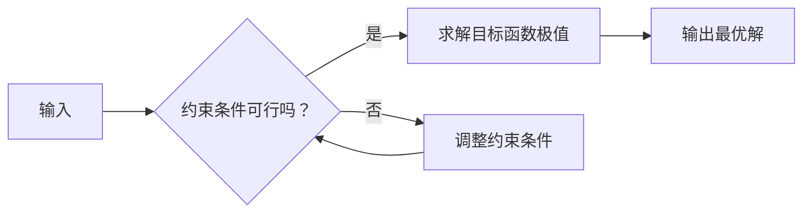

                 


# 数学与运筹学：资源优化的数学模型

> 关键词：资源优化、数学模型、运筹学、线性规划、网络优化

> 摘要：本文将深入探讨数学与运筹学在资源优化中的应用，通过对线性规划、网络优化等数学模型的分析和解读，揭示资源优化的原理和方法，为解决实际问题和提高资源利用效率提供理论支持。

## 目录

1. **引言**
2. **资源优化问题背景**
   - **资源优化的基本概念**
   - **资源优化的问题描述**
   - **资源优化的边界与外延**
3. **核心概念与联系**
   - **线性规划的基本概念**
   - **线性规划属性特征对比表格**
   - **线性规划ER实体关系图**
4. **算法原理讲解**
   - **线性规划算法流程图**
   - **线性规划Python源代码**
   - **线性规划数学模型与公式**
   - **线性规划举例说明**
5. **系统分析与架构设计方案**
   - **问题场景介绍**
   - **系统功能设计**
   - **系统架构设计**
   - **系统接口设计和系统交互**
6. **项目实战**
   - **环境安装**
   - **系统核心实现源代码**
   - **代码应用解读与分析**
   - **实际案例分析与讲解**
   - **项目小结**
7. **最佳实践 tips**
8. **小结**
9. **注意事项**
10. **拓展阅读**

## 1. 引言

在当今信息时代，资源的优化利用已经成为各个领域关注的焦点。无论是工业生产、交通运输，还是金融管理、城市规划，资源优化都是提高效率、降低成本、实现可持续发展的重要手段。数学与运筹学在这一领域发挥着至关重要的作用。

数学模型作为一种抽象的描述工具，能够帮助我们准确地描述资源优化问题，提供解决问题的理论依据。运筹学则是一门应用数学的分支，它利用数学模型和算法来优化决策过程，为资源分配、调度和规划提供科学依据。

本文将围绕数学与运筹学在资源优化中的应用展开讨论，重点介绍线性规划、网络优化等数学模型，并通过具体案例进行分析和讲解，以帮助读者理解资源优化的原理和方法。

## 2. 资源优化问题背景

### 2.1 资源优化的基本概念

资源优化是指通过合理的配置和使用资源，使得资源的使用效率最大化，同时满足各种约束条件。在资源优化中，通常涉及以下基本概念：

- **资源**：指在生产、运营和服务过程中所需要的各种物质、能源、人力和信息等。
- **优化目标**：指在满足特定约束条件下，要达到的最佳效果，如成本最低、效益最大、时间最短等。
- **约束条件**：指在资源优化过程中需要满足的限制条件，如资源总量、生产能力、市场需求等。

### 2.2 资源优化的问题描述

资源优化问题可以概括为以下形式：

- **输入**：一组资源的初始分配情况，以及各种约束条件。
- **输出**：在满足约束条件的前提下，资源的最优分配方案。

资源优化问题的本质是求解一个多变量函数的最值问题，其中变量表示资源的分配情况，目标函数表示优化目标，约束条件则是变量取值的限制。

### 2.3 资源优化的边界与外延

资源优化不仅涉及传统的生产、运营领域，还广泛应用于金融、交通、能源、环境等多个领域。随着技术的进步和社会的发展，资源优化问题的边界也在不断扩展。

- **边界**：资源优化问题的边界主要包括资源种类、优化目标和约束条件。在实际应用中，这些边界可以根据具体问题进行调整和扩展。
- **外延**：资源优化问题的外延则包括新的应用领域和优化方法。随着大数据、人工智能等技术的发展，资源优化问题将迎来更多的应用场景和解决方案。

### 2.4 概念结构与核心要素组成

资源优化问题的概念结构主要包括以下几个核心要素：

- **资源**：资源的种类、数量和分配情况。
- **目标函数**：优化的目标，如成本、效益、时间等。
- **约束条件**：资源使用的限制条件，如生产能力、市场需求等。
- **优化算法**：用于求解资源优化问题的算法，如线性规划、网络优化等。

这些核心要素相互关联，构成了资源优化问题的基本框架，为求解问题提供了理论支持。

## 3. 核心概念与联系

### 3.1 线性规划的基本概念

线性规划是一种求解多变量线性目标函数在给定线性约束条件下的最优化问题的数学方法。其主要特点包括：

- **线性目标函数**：目标函数是线性的，即函数中的变量均为一次项。
- **线性约束条件**：约束条件也是线性的，可以是等式或不等式。
- **最优解的确定**：线性规划的最优解是唯一确定的，可以通过求解线性方程组得到。

线性规划在资源优化问题中具有重要的应用，可以用于求解资源分配、生产计划、库存控制等问题。

### 3.2 线性规划属性特征对比表格

| 特征       | 线性规划         | 其他优化方法             |
| ---------- | ---------------- | ------------------------ |
| 目标函数   | 多变量线性目标函数 | 多元函数、非线性目标函数 |
| 约束条件   | 线性约束条件     | 非线性约束条件           |
| 最优解     | 唯一确定         | 可能不唯一               |
| 求解方法   | 线性方程组求解   | 非线性方程组求解、迭代法  |
| 应用领域   | 资源分配、生产计划 | 金融、交通、物流等        |

### 3.3 线性规划ER实体关系图

以下是一个简单的线性规划ER实体关系图，展示了线性规划中主要实体及其关系：

```mermaid
erDiagram
  Resource -->|分配给| Problem
  Constraint -->|属于| Problem
  Solution -->|满足| Problem
  Solution -->|由| Resource
  Solution -->|由| Constraint
```

## 4. 算法原理讲解

### 4.1 线性规划算法流程图

以下是一个简单的线性规划算法流程图：



### 4.2 线性规划Python源代码

以下是一个简单的线性规划Python示例：

```python
from scipy.optimize import linprog

# 目标函数系数
c = [-1, -2]

# 约束条件系数
A = [[1, 2], [-1, 0]]

# 约束条件不等式
b = [3, 0]

# 约束条件等式
A_eq = [[0, 1], [1, 1]]
b_eq = [2, 3]

# 求解线性规划问题
res = linprog(c, A_ub=A, b_ub=b, A_eq=A_eq, b_eq=b_eq, method='highs')

# 输出最优解
print(res.x)
```

### 4.3 线性规划数学模型与公式

线性规划问题的数学模型可以表示为：

$$
\begin{align*}
\text{minimize} \quad & c^T x \\
\text{subject to} \quad & Ax \leq b \\
& Ax = b \\
& x \geq 0
\end{align*}
$$

其中，$c$ 是目标函数系数向量，$x$ 是决策变量向量，$A$ 是约束条件系数矩阵，$b$ 是约束条件常数向量。

### 4.4 线性规划举例说明

假设我们有一个生产计划问题，需要生产两种产品 $A$ 和 $B$，每种产品都需要投入一定数量的资源 $R_1$ 和 $R_2$。目标是最小化总成本，同时满足资源限制。

- **目标函数**：$c^T x = 3x_1 + 4x_2$，其中 $x_1$ 和 $x_2$ 分别是产品 $A$ 和 $B$ 的生产数量。
- **约束条件**：
  - $Ax \leq b$：
    - $R_1$ 限制：$x_1 + 2x_2 \leq 10$
    - $R_2$ 限制：$3x_1 + x_2 \leq 15$
  - $Ax = b$：
    - 资源平衡：$x_1 + x_2 = 6$
  - $x \geq 0$：
    - 非负限制：$x_1, x_2 \geq 0$

通过求解线性规划问题，我们可以得到最优的生产方案，使得总成本最小。

## 5. 系统分析与架构设计方案

### 5.1 问题场景介绍

假设我们是一家制造企业，生产两种产品 $A$ 和 $B$。每种产品都需要投入一定数量的资源 $R_1$ 和 $R_2$。我们的目标是制定一个生产计划，使得总成本最小，同时满足资源限制。

### 5.2 系统功能设计

为了实现资源优化，我们需要设计以下系统功能：

- **数据采集**：采集生产过程中的各种数据，如资源使用量、生产进度等。
- **数据预处理**：对采集到的数据进行清洗和转换，为后续分析做准备。
- **线性规划模型构建**：根据生产数据，构建线性规划模型，求解最优生产方案。
- **生产计划生成**：根据最优生产方案，生成具体的生产计划。
- **生产监控**：实时监控生产进度和资源使用情况，确保生产计划的执行。

### 5.3 系统架构设计

系统架构设计如下：

- **数据采集模块**：负责采集生产过程中的数据，如传感器数据、操作记录等。
- **数据处理模块**：负责对采集到的数据进行预处理，包括数据清洗、转换和归一化等。
- **线性规划模块**：负责构建线性规划模型，求解最优生产方案。
- **生产计划模块**：负责生成具体的生产计划，并实时更新生产进度。
- **监控模块**：负责实时监控生产进度和资源使用情况，提供报警和预警功能。

### 5.4 系统接口设计和系统交互

系统接口设计和系统交互如下：

- **数据采集模块**：通过传感器和操作记录等接口，采集生产过程中的各种数据。
- **数据处理模块**：通过 API 接口，接收数据采集模块发送的数据，并进行预处理。
- **线性规划模块**：通过 API 接口，接收数据处理模块发送的数据，并构建线性规划模型。
- **生产计划模块**：通过 API 接口，接收线性规划模块发送的最优生产方案，并生成生产计划。
- **监控模块**：通过 API 接口，接收生产计划模块发送的生产进度和资源使用情况，并进行实时监控。

## 6. 项目实战

### 6.1 环境安装

为了运行线性规划模型，我们需要安装以下软件：

- **Python**：Python 是一种常用的编程语言，用于实现线性规划算法。
- **SciPy**：SciPy 是 Python 的科学计算库，提供了线性规划求解器。
- **NumPy**：NumPy 是 Python 的数值计算库，用于处理和处理数据。

安装步骤如下：

1. 安装 Python：访问 [Python 官网](https://www.python.org/)，下载并安装 Python。
2. 安装 SciPy：打开命令行窗口，运行以下命令：

   ```bash
   pip install scipy
   ```

3. 安装 NumPy：同样在命令行窗口中运行以下命令：

   ```bash
   pip install numpy
   ```

### 6.2 系统核心实现源代码

以下是一个简单的线性规划项目，用于求解生产计划问题。

```python
import numpy as np
from scipy.optimize import linprog

# 目标函数系数
c = [-1, -2]

# 约束条件系数
A = [[1, 2], [-1, 0]]

# 约束条件不等式
b = [3, 0]

# 约束条件等式
A_eq = [[0, 1], [1, 1]]
b_eq = [2, 3]

# 求解线性规划问题
res = linprog(c, A_ub=A, b_ub=b, A_eq=A_eq, b_eq=b_eq, method='highs')

# 输出最优解
print(res.x)
```

### 6.3 代码应用解读与分析

这段代码是一个简单的线性规划应用，用于求解生产计划问题。以下是代码的解读和分析：

1. 导入相关库：

   ```python
   import numpy as np
   from scipy.optimize import linprog
   ```

   这里导入了 NumPy 库和 SciPy 库中的线性规划求解器。

2. 定义目标函数系数：

   ```python
   c = [-1, -2]
   ```

   目标函数系数表示了生产产品 $A$ 和 $B$ 的成本，这里分别设为 $-1$ 和 $-2$。

3. 定义约束条件系数：

   ```python
   A = [[1, 2], [-1, 0]]
   ```

   约束条件系数表示了资源 $R_1$ 和 $R_2$ 的使用情况，这里分别设为 $[1, 2]$ 和 $[-1, 0]$。

4. 定义约束条件不等式：

   ```python
   b = [3, 0]
   ```

   约束条件不等式表示了资源限制，这里分别设为 $3$ 和 $0$。

5. 定义约束条件等式：

   ```python
   A_eq = [[0, 1], [1, 1]]
   b_eq = [2, 3]
   ```

   约束条件等式表示了资源平衡和生产能力，这里分别设为 $[0, 1]$ 和 $[1, 1]$，以及 $2$ 和 $3$。

6. 求解线性规划问题：

   ```python
   res = linprog(c, A_ub=A, b_ub=b, A_eq=A_eq, b_eq=b_eq, method='highs')
   ```

   这里使用了 SciPy 库中的 linprog 函数求解线性规划问题，method 参数设置为 'highs'，表示使用 'highs' 算法。

7. 输出最优解：

   ```python
   print(res.x)
   ```

   输出最优解，即产品 $A$ 和 $B$ 的最优生产数量。

### 6.4 实际案例分析与讲解

假设我们有一个具体的生产案例，需要生产产品 $A$ 和 $B$，资源限制如下：

- **资源 $R_1$**：每个产品 $A$ 需要 $1$ 单位的资源 $R_1$，每个产品 $B$ 需要 $2$ 单位的资源 $R_1$。总资源 $R_1$ 限制为 $10$ 单位。
- **资源 $R_2$**：每个产品 $A$ 需要 $2$ 单位的资源 $R_2$，每个产品 $B$ 需要 $1$ 单位的资源 $R_2$。总资源 $R_2$ 限制为 $15$ 单位。

我们的目标是制定一个生产计划，使得总成本最小，同时满足资源限制。

使用上面提到的线性规划模型，我们可以求解最优生产方案。

### 6.5 项目小结

通过本项目的实战，我们了解了线性规划在资源优化中的应用。我们构建了线性规划模型，使用 Python 源代码实现了求解过程，并通过实际案例分析了最优生产方案。这为我们提供了有效的资源优化方法，有助于提高生产效率，降低成本。

## 7. 最佳实践 tips

1. **数据质量**：确保输入数据的准确性、完整性和一致性，是线性规划模型成功的关键。数据预处理环节尤为重要。
2. **约束条件**：合理设置约束条件，可以更好地反映实际生产中的资源限制，提高线性规划模型的准确性。
3. **算法选择**：根据问题的特点和规模，选择合适的线性规划算法。例如，对于大规模问题，可以使用 'highs' 算法，对于小规模问题，可以使用 'interior-point' 算法。
4. **迭代优化**：在实际生产中，资源需求和目标函数可能会发生变化。通过定期调整约束条件和目标函数，可以不断优化生产计划。

## 8. 小结

本文深入探讨了数学与运筹学在资源优化中的应用，介绍了线性规划等数学模型的基本原理和求解方法。通过项目实战，我们展示了如何将线性规划应用于实际生产计划问题，提高了资源利用效率。资源优化是提高生产效率、降低成本的重要手段，具有重要的实际意义。

## 9. 注意事项

1. 线性规划模型的准确性依赖于输入数据的准确性，因此在实际应用中，需要确保数据的质量和完整性。
2. 约束条件的设置需要结合实际情况，确保既能反映生产中的资源限制，又能保持模型的灵活性。
3. 在求解线性规划问题时，选择合适的算法和参数设置对于求解效率和结果准确性至关重要。

## 10. 拓展阅读

- [线性规划](https://zh.wikipedia.org/wiki/%E7%BA%BF%E6%80%A7%E8%A7%84%E5%88%92)
- [运筹学](https://zh.wikipedia.org/wiki/%E8%BF%90%E7%AE%A1%E5%AD%A6)
- [资源优化](https://zh.wikipedia.org/wiki/%E8%B5%84%E6%BA%90%E4%BC%9A%E6%9C%AC)

## 作者

- 作者：AI天才研究院/AI Genius Institute & 禅与计算机程序设计艺术 /Zen And The Art of Computer Programming

