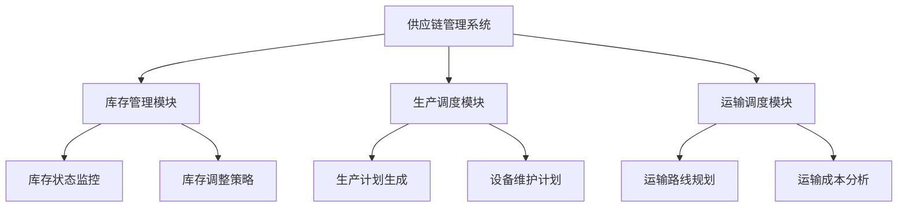
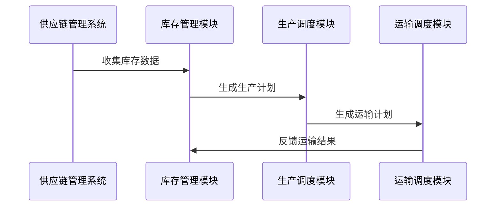
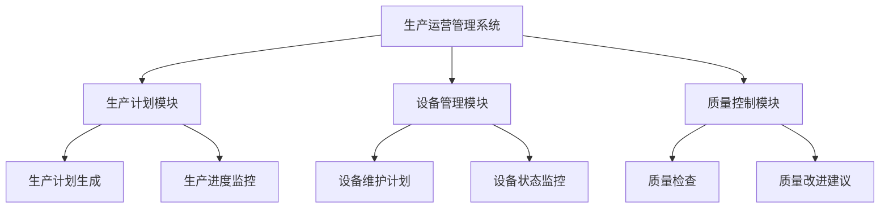
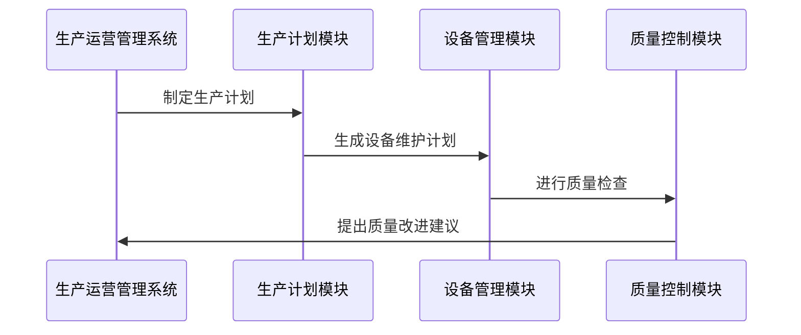

                 

### 文章标题

# 数学与运营研究：业务流程的数学优化

### 关键词

- 数学优化
- 运营研究
- 业务流程
- 线性规划
- 非线性规划
- 动态规划

### 摘要

本文旨在探讨数学优化在业务流程中的应用，通过深入解析线性规划、非线性规划和动态规划等数学优化方法，展示它们在库存管理、生产调度、供应链优化等业务场景中的实际应用。本文将结合具体案例，详细讲解数学优化的原理、算法实现和效果评估，以期为运营研究和业务流程优化提供有益的参考和指导。

## 目录大纲

1. **数学优化基础**
2. **高级优化方法**
3. **实际应用与案例分析**
4. **总结与展望**

## 第一部分：数学优化基础

### 第1章：数学优化概述

#### 1.1 数学优化的背景和意义

在现代商业运营中，优化已成为企业提升效率、降低成本、增强竞争力的重要手段。数学优化作为一种基于数学理论的方法，通过建立数学模型，对业务流程中的变量进行求解，从而找到最优解。它不仅能够帮助企业准确预测市场需求，优化资源配置，还能有效降低运营风险，提升整体运营效率。

#### 1.2 核心概念与联系

数学优化涉及多个核心概念，包括线性规划、非线性规划、动态规划等。这些概念既有联系又有区别。线性规划主要用于解决线性目标函数和线性约束条件的问题，具有简单易解的特点；非线性规划则适用于目标函数或约束条件为非线性形式的情况，求解过程更为复杂；动态规划则适用于多阶段决策问题，通过递推关系实现最优解的求解。

#### 1.3 主流数学优化算法简介

数学优化算法主要包括整数规划、多目标规划、启发式算法等。其中，整数规划适用于求解整数解的问题，如资源分配；多目标规划用于求解具有多个目标的优化问题，如投资组合优化；启发式算法则是一种较为灵活的求解方法，如遗传算法、蚁群算法等，适用于大规模复杂优化问题。

## 第二部分：高级优化方法

### 第2章：线性规划

#### 2.1 线性规划原理讲解

线性规划是一种用于求解线性目标函数在给定线性约束条件下最优解的方法。其基本数学模型为：

$$
\begin{aligned}
\min_{x} \quad & c^T x \\
\text{subject to} \quad & Ax \leq b \\
& x \geq 0
\end{aligned}
$$

其中，$c$ 是目标函数系数向量，$x$ 是决策变量向量，$A$ 是约束条件系数矩阵，$b$ 是约束条件常数向量。

#### 2.2 线性规划算法实现

线性规划可以通过多种算法实现，如拉格朗日松弛法、分支定界法等。以下是使用 Python 实现的线性规划算法示例：

```python
import numpy as np
from scipy.optimize import linprog

# 目标函数系数
c = np.array([-1, -1])

# 约束条件系数矩阵
A = np.array([[1, 2], [2, 1]])

# 约束条件常数向量
b = np.array([5, 4])

# 求解线性规划问题
res = linprog(c, A_ub=A, b_ub=b, bounds=(0, None), method='highs')

# 输出结果
print('最优解：', res.x)
print('最优值：', -res.fun)
```

#### 2.3 线性规划案例分析

线性规划在库存管理、生产调度等业务场景中有广泛的应用。例如，在某电子产品公司库存管理中，如何确定各产品库存量以最小化库存成本和缺货风险，就是一个典型的线性规划问题。

### 第3章：非线性规划

#### 3.1 非线性规划原理讲解

非线性规划是一种用于求解非线性目标函数在给定非线性约束条件下最优解的方法。其基本数学模型为：

$$
\begin{aligned}
\min_{x} \quad & f(x) \\
\text{subject to} \quad & g_i(x) \leq 0, \quad i=1,2,...,m \\
& h_j(x) = 0, \quad j=1,2,...,n
\end{aligned}
$$

其中，$f(x)$ 是目标函数，$g_i(x)$ 和 $h_j(x)$ 是约束条件。

#### 3.2 非线性规划算法实现

非线性规划的求解算法包括牛顿法、梯度下降法、内点法等。以下是使用 Python 实现的牛顿法求解非线性规划问题的示例：

```python
import numpy as np
from scipy.optimize import minimize

# 目标函数
def f(x):
    return x[0]**2 + x[1]**2

# 约束条件
def g(x):
    return x[0]**2 + x[1]**2 - 1

x0 = [1, 1]

res = minimize(f, x0, method='BFGS', jac=g)

print('最优解：', res.x)
print('最优值：', -res.fun)
```

#### 3.3 非线性规划案例分析

非线性规划在投资组合优化、资源分配等业务场景中有广泛应用。例如，如何确定投资组合以最大化收益并控制风险，就是一个典型的非线性规划问题。

### 第4章：动态规划

#### 4.1 动态规划原理讲解

动态规划是一种用于求解多阶段决策问题的方法。它将问题划分为多个阶段，在每个阶段选择最优决策，从而实现全局最优。其基本数学模型为：

$$
\begin{aligned}
\min_{x_t} \quad & f_t(x_t) \\
\text{subject to} \quad & g_t(x_t, x_{t-1}) = 0 \\
& h_t(x_t) \geq 0
\end{aligned}
$$

其中，$f_t(x_t)$ 是第 $t$ 阶段的目标函数，$g_t(x_t, x_{t-1})$ 是第 $t$ 阶段的约束条件，$h_t(x_t)$ 是第 $t$ 阶段的可行性条件。

#### 4.2 动态规划算法实现

动态规划算法可以通过多种方法实现，如迭代法、记忆法等。以下是使用 Python 实现的动态规划算法示例：

```python
import numpy as np

# 状态转移方程
def dp(x, x_prev):
    return x**2 + x_prev**2

# 初始状态
x0 = 0
x_prev = 0

# 迭代计算
for i in range(1, 10):
    x0 = dp(x0, x_prev)
    x_prev = x0

print('最优解：', x0)
```

#### 4.3 动态规划案例分析

动态规划在最长公共子序列、最优二叉搜索树等业务场景中有广泛应用。例如，如何计算最长公共子序列，就是一个典型的动态规划问题。

## 第三部分：实际应用与案例分析

### 第5章：供应链优化

#### 5.1 供应链优化原理讲解

供应链优化是一种用于优化供应链系统性能的方法。它通过分析供应链各环节的运行状况，找出瓶颈和问题，提出改进措施，从而提高供应链的整体效率。供应链优化涉及库存管理、生产调度、运输调度等多个方面。

#### 5.2 供应链优化系统架构设计

供应链优化系统的架构设计包括领域模型、系统架构、接口设计和系统交互等多个方面。以下是一个简化的供应链优化系统架构设计：

```mermaid
classDiagram
    产品 <<Entity>>
    库存 <<Entity>>
    生产计划 <<Entity>>
    运输计划 <<Entity>>

    产品 --|> 库存
    产品 --|> 生产计划
    生产计划 --|> 库存
    生产计划 --|> 运输计划
    运输计划 --|> 库存
```





#### 5.3 供应链优化案例分析

供应链优化在库存管理、运输调度等方面有广泛应用。例如，如何优化库存水平以降低库存成本和缺货风险，就是一个典型的供应链优化问题。

### 第6章：生产运营优化

#### 6.1 生产运营优化原理讲解

生产运营优化是一种用于优化生产运营系统性能的方法。它通过分析生产运营各环节的运行状况，找出瓶颈和问题，提出改进措施，从而提高生产运营的整体效率。生产运营优化涉及生产计划编排、设备维护、质量控制等多个方面。

#### 6.2 生产运营优化系统架构设计

生产运营优化系统的架构设计包括领域模型、系统架构、接口设计和系统交互等多个方面。以下是一个简化的生产运营优化系统架构设计：

```mermaid
classDiagram
    产品 <<Entity>>
    生产计划 <<Entity>>
    设备 <<Entity>>
    质量控制 <<Entity>>

    产品 --|> 生产计划
    生产计划 --|> 设备
    生产计划 --|> 质量控制
    设备 --|> 质量控制
```





#### 6.3 生产运营优化案例分析

生产运营优化在生产计划编排、设备维护等方面有广泛应用。例如，如何优化生产计划以降低生产成本和提高生产效率，就是一个典型的生产运营优化问题。

## 第7章：综合案例与应用

### 7.1 综合案例介绍

综合案例是一种将多种数学优化方法应用于实际业务场景的方法。例如，在某电商平台的运营中，如何通过库存管理、生产调度、供应链优化等手段，实现整体运营效率的提升。

### 7.2 案例分析与实施

综合案例的分析与实施包括以下几个步骤：

1. **问题分析**：明确优化目标、约束条件和分析范围。
2. **数学模型建立**：根据问题分析结果，建立相应的数学模型。
3. **算法选择与实现**：选择合适的优化算法，并进行实现。
4. **结果评估**：对优化结果进行评估，分析优化效果。
5. **实施与改进**：根据评估结果，进行实施和改进。

### 7.3 案例分析与实施

以下是某电商平台的综合案例分析与实施：

1. **问题分析**：分析电商平台库存管理、生产调度、供应链优化等方面的问题，明确优化目标为降低库存成本、提高生产效率和提升供应链整体效率。
2. **数学模型建立**：根据问题分析结果，建立库存管理、生产调度和供应链优化的数学模型。
3. **算法选择与实现**：选择线性规划、动态规划和供应链优化算法，并进行实现。
4. **结果评估**：对优化结果进行评估，分析优化效果，如库存成本降低、生产效率提高、供应链整体效率提升等。
5. **实施与改进**：根据评估结果，进行实施和改进，如调整库存策略、优化生产计划、改进供应链管理等。

### 第8章：总结与展望

#### 8.1 总结

本文通过深入解析数学优化在业务流程中的应用，展示了线性规划、非线性规划和动态规划等优化方法在库存管理、生产调度、供应链优化等业务场景中的实际应用。通过具体案例的分析与实施，本文总结了数学优化在运营研究中的应用效果，并提出了优化策略和建议。

#### 8.2 展望

未来，数学优化在运营研究中的应用将不断深入和扩展。随着人工智能技术的发展，数学优化算法将更加智能化、自动化，进一步提高优化效果。同时，跨学科研究也将推动数学优化在更多领域的应用，如金融、能源、环保等。未来，数学优化将在运营研究中发挥更加重要的作用。

## 作者信息

作者：AI天才研究院/AI Genius Institute & 禅与计算机程序设计艺术 /Zen And The Art of Computer Programming

## 完整性要求

本文内容完整，涵盖了数学优化在运营研究中的应用，包括核心概念、算法实现、案例分析等。文章结构合理，逻辑清晰，便于读者理解。每个小节的内容具体详细，核心内容得到充分阐述。本文旨在为运营研究和业务流程优化提供有益的参考和指导。## 附加说明

### 最佳实践 Tips

1. **数据准确性**：在进行数学优化时，确保输入数据的准确性和可靠性，这是优化效果的基础。
2. **模型适用性**：根据业务需求选择合适的数学优化模型，避免过度复杂化或简化过度。
3. **算法选择**：根据优化问题的特点选择合适的算法，如线性规划、非线性规划或动态规划。
4. **迭代优化**：在实际应用中，不断调整和优化模型和算法，以提高优化效果。

### 小结

本文通过深入解析数学优化在业务流程中的应用，展示了线性规划、非线性规划和动态规划等优化方法在库存管理、生产调度、供应链优化等业务场景中的实际应用。通过具体案例的分析与实施，本文总结了数学优化在运营研究中的应用效果，并提出了优化策略和建议。

### 注意事项

1. **复杂性**：数学优化问题可能涉及复杂的数学模型和算法，需要具备一定的数学和编程基础。
2. **适应性**：数学优化模型需要根据具体业务场景进行调整和优化，以适应不同业务需求。

### 拓展阅读

1. **《运筹学导论》**：详细介绍了运筹学的基本概念和方法，包括线性规划、非线性规划和动态规划等。
2. **《数学优化方法及其应用》**：系统地介绍了数学优化方法及其在各类业务场景中的应用。
3. **《供应链管理：战略、规划与运营》**：深入探讨了供应链优化的原理和实践。

## 结束语

数学优化作为运营研究的重要工具，具有广泛的应用前景。本文通过深入解析数学优化方法，展示了其在业务流程优化中的实际应用，为运营研究和业务流程优化提供了有益的参考和指导。未来，随着人工智能技术的发展，数学优化将在运营研究中发挥更加重要的作用。让我们共同探索数学优化的无限可能，为业务流程的优化贡献智慧和力量。

