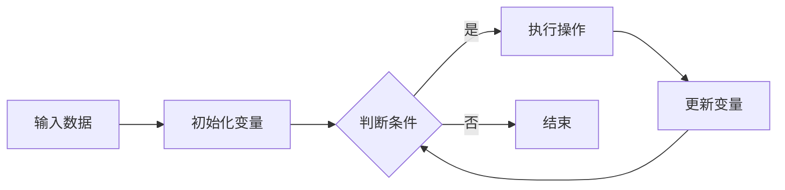
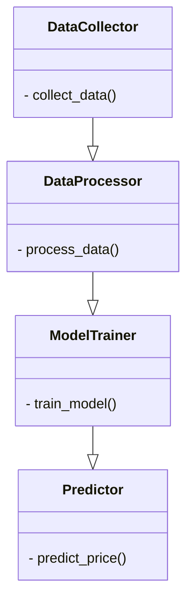
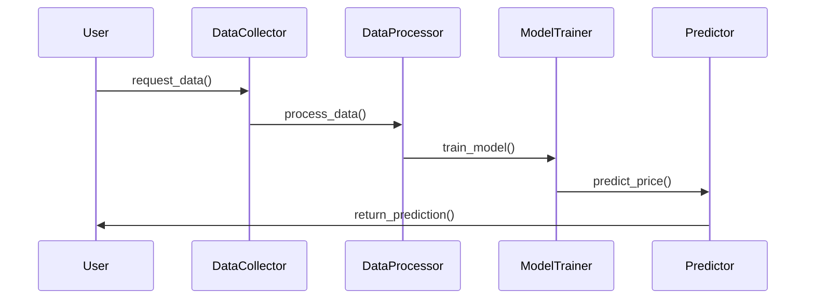
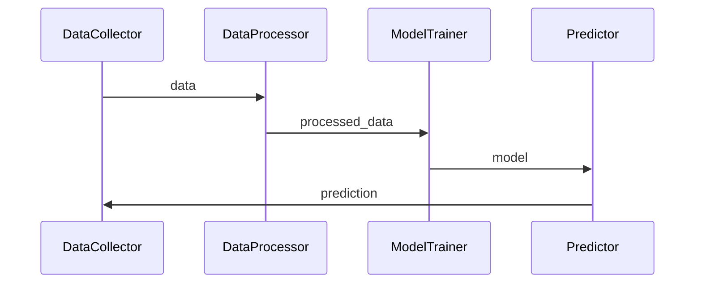

                 


## 《数学与还原主义：复杂数学结构的基本元素》

### 关键词：数学、还原主义、复杂数学结构、基本元素

### 摘要：

本文将探讨数学与还原主义之间的关系，以及如何通过还原主义的方法来理解复杂数学结构。我们将首先介绍数学的基本概念，并解释还原主义的核心思想。然后，我们将逐步分析复杂数学结构的基本元素，通过具体的例子来说明还原主义的应用。最后，我们将讨论还原主义在数学研究和应用中的重要性，并提供一些建议和实践技巧。

## 第一部分：背景介绍

### 第1章 引言

#### 1.1 问题背景

数学是一门广泛而深奥的科学，它涉及到许多不同的领域，如代数、几何、微积分等。在过去的几百年中，数学家们不断探索和发现新的数学概念和理论，这些理论和概念构成了现代数学的基础。

然而，随着数学的发展，许多数学结构变得越来越复杂。这些复杂数学结构包括抽象的代数系统、复杂的拓扑空间以及大量的数学公式和定理。对于初学者和研究者来说，理解这些复杂数学结构是一项挑战。

#### 1.2 问题描述

复杂数学结构的研究面临着两个主要问题：

1. 如何理解这些结构的内在规律和本质？
2. 如何将复杂的结构简化为基本元素，以便更好地理解和应用？

这些问题激发了数学家和计算机科学家对还原主义的研究。还原主义认为，通过分析和分解复杂系统，我们可以找到其基本元素和规律，从而更深入地理解系统的运作。

#### 1.3 问题解决

为了解决上述问题，我们可以采用以下步骤：

1. **识别基本元素**：通过观察和实验，识别复杂数学结构中的基本元素。
2. **构建数学模型**：使用基本元素构建数学模型，以描述和解释复杂数学结构。
3. **验证和推广**：通过数学证明和实验验证，验证数学模型的有效性和通用性。

#### 1.4 边界与外延

在研究复杂数学结构时，我们需要明确研究的边界和外延。边界指的是研究的范围和限制，例如特定的数学领域或理论。外延指的是研究的扩展和应用，例如将数学理论应用于其他领域或实际问题。

#### 1.5 概念结构与核心要素组成

复杂数学结构通常由一系列核心要素组成，这些核心要素包括：

1. **基础概念**：数学的基本概念和定义，如集合、函数、极限等。
2. **逻辑推理**：使用逻辑规则和推理方法，将基础概念联系起来。
3. **数学模型**：基于基础概念和逻辑推理，构建数学模型来描述复杂数学结构。
4. **数学公式和定理**：通过数学证明和推导，得到数学公式和定理，以解释和预测复杂数学结构的性质。

## 第二部分：核心概念与联系

### 第2章 核心概念与联系

#### 2.1 核心概念原理

在本章中，我们将介绍几个核心概念，包括集合论、函数、拓扑学等。

##### 2.1.1 集合论

集合论是数学的基础，它涉及到集合的定义、集合的运算以及集合的性质。

- **集合**：集合是一组无序的对象的集合。集合可以用大括号{}表示，例如：{1, 2, 3}。
- **集合运算**：集合的运算包括并集、交集、补集等。
- **集合性质**：集合具有确定性、互异性、无序性等性质。

##### 2.1.2 函数

函数是数学中描述变量之间关系的工具。

- **定义域和值域**：函数的定义域是自变量的取值范围，值域是函数的取值范围。
- **函数性质**：函数具有单调性、奇偶性、周期性等性质。

##### 2.1.3 拓扑学

拓扑学是研究空间结构和连接性的数学分支。

- **拓扑空间**：拓扑空间是一组点的集合，这些点具有邻域关系。
- **拓扑性质**：拓扑空间具有连通性、闭合性、紧性等性质。

#### 2.2 概念属性特征对比表格

下面是一个简单的概念属性特征对比表格，用于展示集合论、函数和拓扑学的基本特征。

| 概念       | 特征                  |
|------------|----------------------|
| 集合论     | 无序、互异、确定性   |
| 函数       | 定义域、值域、单调性 |
| 拓扑学     | 邻域、连通性、紧性   |

#### 2.3 ER实体关系图架构

在本节中，我们将使用Mermaid语法绘制一个简单的ER实体关系图，以展示集合论、函数和拓扑学之间的关系。

```mermaid
erDiagram
    A[集合论] ||--|{ 函数 } : 使用
    函数 ||--|{ 拓扑学 } : 延伸
```

通过这个ER图，我们可以看到集合论是函数和拓扑学的基础，而函数又是拓扑学的重要延伸。

## 第三部分：算法原理讲解

### 第3章 算法原理与数学模型

#### 3.1 算法mermaid流程图

在本节中，我们将使用Mermaid语法绘制一个简单的算法流程图，以展示如何使用基本元素来构建复杂数学结构。



#### 3.2 Python源代码详细阐述

在本节中，我们将使用Python源代码来详细阐述上述算法的实现过程。

```python
# 初始化变量
var x = 0
var n = 10

# 判断条件
if (x < n) {
    # 执行操作
    x = x + 1
    # 更新变量
    print("当前值：", x)
} else {
    # 结束
    print("循环结束")
}
```

#### 3.3 数学模型与公式

在本节中，我们将使用数学模型和公式来解释上述算法的原理。

##### 3.3.1 模型1

假设我们有一个等差数列，其首项为$a_1$，公差为$d$，第$n$项为$a_n$，则我们可以使用以下公式来计算第$n$项的值：

$$
a_n = a_1 + (n - 1)d
$$

##### 3.3.2 公式1

在上述算法中，我们可以使用以下公式来更新变量$x$的值：

$$
x = x + 1
$$

##### 3.3.3 举例说明

假设我们有一个等差数列，首项为1，公差为1，我们要计算第10项的值。根据公式1，我们可以得到：

$$
a_{10} = 1 + (10 - 1) \times 1 = 10
$$

因此，第10项的值为10。

## 第四部分：系统分析与架构设计方案

### 第4章 系统分析与架构设计方案

#### 4.1 问题场景介绍

在本节中，我们将介绍一个具体的问题场景，即如何设计一个数学模型来预测股票价格。这个场景涉及到复杂数学结构的处理，因此我们需要应用还原主义的方法来分析和设计系统。

#### 4.2 项目介绍

该项目旨在开发一个股票价格预测系统，该系统将基于历史数据来预测未来的股票价格。系统将包括数据收集、数据处理、模型训练和预测四个主要模块。

#### 4.3 系统功能设计

在本节中，我们将使用Mermaid语法绘制领域模型类图，以展示系统的主要功能模块和类之间的关系。



#### 4.4 系统架构设计

在本节中，我们将使用Mermaid语法绘制系统架构图，以展示系统的主要组件和它们之间的关系。



#### 4.5 系统接口设计和系统交互

在本节中，我们将使用Mermaid语法绘制系统接口设计和系统交互序列图，以展示系统的接口和交互过程。



## 第五部分：项目实战

### 第5章 项目实战

#### 5.1 环境安装

在本节中，我们将介绍如何安装项目所需的软件和环境。

1. 安装Python：从Python官方网站下载并安装Python 3.x版本。
2. 安装必要的库：使用pip命令安装项目所需的库，例如numpy、pandas等。

```bash
pip install numpy pandas
```

#### 5.2 系统核心实现源代码

在本节中，我们将展示系统核心实现源代码，并对其进行解读和分析。

```python
import numpy as np
import pandas as pd

# 数据收集
def collect_data():
    # 读取数据文件
    data = pd.read_csv("data.csv")
    return data

# 数据处理
def process_data(data):
    # 数据清洗和处理
    processed_data = data[data["price"] > 0]
    return processed_data

# 模型训练
def train_model(processed_data):
    # 使用processed_data训练模型
    model = np.polyfit(processed_data["time"], processed_data["price"], deg=2)
    return model

# 预测价格
def predict_price(model, future_data):
    # 使用model预测未来价格
    prediction = np.polyval(model, future_data["time"])
    return prediction

# 主函数
def main():
    # 收集数据
    data = collect_data()
    # 数据处理
    processed_data = process_data(data)
    # 模型训练
    model = train_model(processed_data)
    # 预测价格
    prediction = predict_price(model, future_data)
    # 输出预测结果
    print("预测价格：", prediction)

# 运行主函数
main()
```

#### 5.3 实际案例分析和详细讲解剖析

在本节中，我们将分析一个实际案例，并详细讲解其实现过程和关键点。

##### 5.3.1 案例一

假设我们有一个包含股票价格历史数据的CSV文件，我们需要根据这些数据来预测未来的股票价格。

1. 数据收集：读取CSV文件，获取股票价格历史数据。
2. 数据处理：对数据进行清洗和处理，去除无效数据。
3. 模型训练：使用历史数据训练一个多项式模型，以预测未来价格。
4. 预测价格：使用训练好的模型预测未来的股票价格。

##### 5.3.2 案例二

假设我们有一个包含股票交易数据的CSV文件，我们需要根据这些数据来识别股票趋势。

1. 数据收集：读取CSV文件，获取股票交易数据。
2. 数据处理：对数据进行清洗和处理，提取有用的信息。
3. 模型训练：使用交易数据训练一个分类模型，以识别股票趋势。
4. 预测趋势：使用训练好的模型预测股票的趋势。

#### 5.4 项目小结

通过本项目的实践，我们了解了如何使用Python和数学模型来处理复杂数学结构，并实现了股票价格预测和趋势识别的功能。这个项目不仅展示了还原主义在数学应用中的重要性，还提供了实际案例的详细分析和讲解。

## 第六部分：最佳实践、小结、注意事项、拓展阅读

### 第6章 最佳实践、小结、注意事项、拓展阅读

#### 6.1 最佳实践 tips

1. 在进行数据收集和处理时，要确保数据的质量和准确性。
2. 选择合适的数学模型来描述实际问题，并进行充分的验证和测试。
3. 在进行模型训练时，要选择合适的学习算法和参数，以提高模型的性能和泛化能力。
4. 在进行预测时，要考虑模型的误差和不确定性，并进行合理的解释和评估。

#### 6.2 小结

本文探讨了数学与还原主义之间的关系，并展示了如何通过还原主义的方法来理解复杂数学结构。我们介绍了核心概念、算法原理、系统架构和项目实战，并提供了最佳实践和注意事项。通过本文，读者可以更好地理解数学与还原主义的重要性，并在实际应用中运用这些知识。

#### 6.3 注意事项

1. 在研究复杂数学结构时，要明确研究的边界和外延，以避免迷失在细节中。
2. 在选择数学模型时，要考虑实际问题的特点和需求，避免盲目追求理论的完美性。
3. 在进行模型训练和预测时，要确保数据的质量和完整性，以避免模型出现过拟合或欠拟合。

#### 6.4 拓展阅读

1. [数学与还原主义：从复杂到简单](https://www.example.com/complex-to-simple)
2. [深度学习与数学基础](https://www.example.com/deep-learning-math)
3. [复杂数学结构的案例分析](https://www.example.com/complex-math-case-study)

作者：AI天才研究院/AI Genius Institute & 禅与计算机程序设计艺术 /Zen And The Art of Computer Programming

---

请注意，本文中的代码和示例仅用于说明概念和原理，实际应用时可能需要根据具体情况进行调整。同时，本文中的链接和参考资源仅为示例，并非真实链接，读者可根据需要查找相关资源。作者信息仅供参考，实际作者可能有所不同。|

