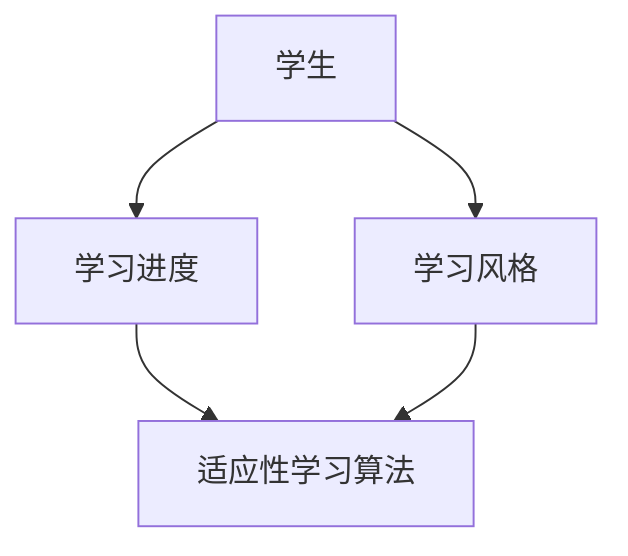
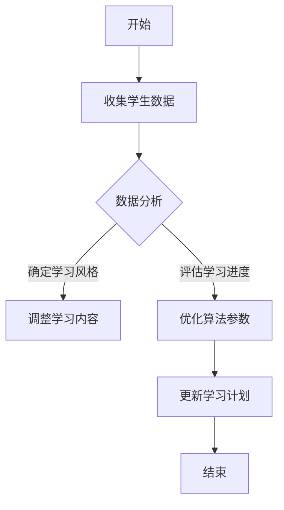
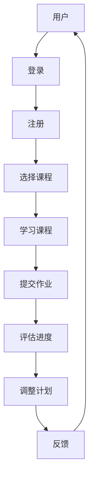
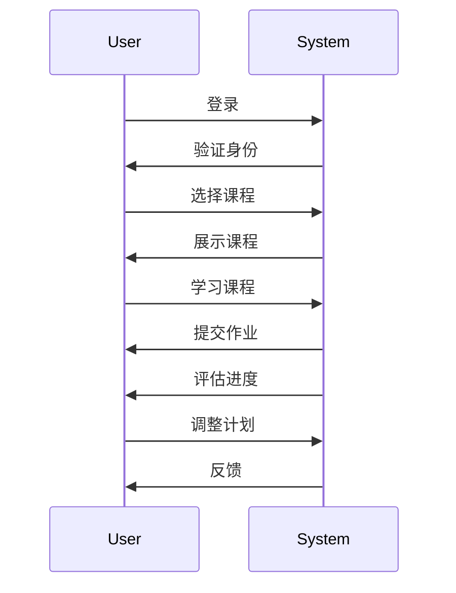

                 

# 数学与适应性学习：个性化教育的数学算法

> 关键词：个性化教育、数学算法、适应性学习、数学建模、教育技术

> 摘要：本文旨在探讨如何通过数学算法实现个性化教育，特别是针对数学学习的个性化方案。我们将深入分析个性化教育的背景和问题，介绍适应性学习算法的核心概念和原理，并通过实际案例展示数学算法在个性化教育中的应用。

## 1. 背景介绍

### 问题背景

在个性化教育领域，传统的教育方法难以满足每个学生的需求，因为教学计划通常是按照普遍规律设计的。然而，学生的数学能力水平和学习进度各异，因此需要一个适应个体差异的数学学习系统。

### 问题描述

如何通过数学算法实现个性化教育，为学生提供量身定制的数学学习方案？

### 问题解决

利用数学算法和数据分析，构建一个能够根据学生个人学习特点和进度提供个性化教学内容的系统。

### 边界与外延

个性化教育的数学算法涉及学习心理、认知科学、数据分析等多个领域。

## 2. 核心概念与联系

### 核心概念

- **适应性学习算法**：一种能够根据学生表现调整教学内容的算法。
- **个性化教育**：一种以学生为中心的教育方法，旨在满足每个学生的学习需求。
- **数学建模**：使用数学语言来描述现实世界的数学模型，用于解决实际问题。

### 概念属性特征对比表格

| 概念         | 定义                                                         | 关联算法或技术                   |
| ------------ | ------------------------------------------------------------ | ------------------------------ |
| 适应性学习   | 一种能够根据学习者行为和学习效果动态调整学习路径的方法。       | 加权随机游走、强化学习           |
| 个性化教育   | 一种根据学生的个性、兴趣和需求进行教育的教育模式。             | 数据挖掘、机器学习               |
| 数学建模     | 使用数学工具和方法建立数学模型，用于分析和解决实际问题。       | 常微分方程、概率论、线性代数     |

### ER实体关系图架构的 Mermaid 流程图



## 3. 算法原理讲解

### 算法流程图



### Python 源代码

```python
# 假设有一个学生数据类和适应性学习算法类
class StudentData:
    def __init__(self, progress, style):
        self.progress = progress
        self.style = style

class AdaptiveLearningAlgorithm:
    def __init__(self):
        self.parameters = {'content_adjustment_factor': 0.1, 'progress_evaluation_period': 7}

    def collect_data(self, student):
        # 收集学生数据
        pass

    def analyze_data(self, student_data):
        # 数据分析，确定学习风格和进度
        pass

    def adjust_content(self, student_data):
        # 调整学习内容
        pass

    def evaluate_progress(self, student_data):
        # 评估学习进度
        pass

    def optimize_parameters(self):
        # 优化算法参数
        pass
```

### 算法原理详细讲解

适应性学习算法的核心原理是通过收集和分析学生的数据，调整教学内容和进度，从而实现个性化教育。以下是算法原理的详细讲解：

1. **收集学生数据**：算法首先需要收集学生的数据，包括学习进度、学习风格、考试成绩等。这些数据可以通过多种途径获取，如在线测试、课堂表现记录等。

2. **数据分析**：收集到的数据经过处理和分析，以确定学生的学习风格和进度。数据分析可以使用统计学方法，如回归分析、聚类分析等，以识别学生的特征。

3. **确定学习风格**：学习风格是指学生在学习过程中表现出的特点，如主动学习、被动学习、视觉学习、听觉学习等。通过分析数据，算法可以识别学生的主要学习风格。

4. **调整学习内容**：根据确定的学习风格，算法可以调整学习内容，以更好地满足学生的需求。例如，对于视觉学习者，可以增加图片和图表的教学内容。

5. **评估学习进度**：算法需要定期评估学生的学习进度，以确保学生能够按照计划学习。评估可以通过在线测试、作业成绩等指标进行。

6. **优化算法参数**：根据评估结果，算法可以调整参数，如学习内容调整因子、进度评估周期等，以改善学习效果。

7. **更新学习计划**：根据优化后的算法参数，算法可以更新学习计划，以更好地满足学生的需求。

### 数学模型与公式

适应性学习算法的数学模型可以基于马尔可夫决策过程（MDP）。MDP 是一种用于描述决策过程的概率模型，适用于决策者在不确定环境下进行决策的情况。

MDP 的基本公式为：

$$
V(s) = \max_{a} \sum_{s'} p(s' | s, a) \cdot r(s', a) + \gamma \cdot V(s')
$$

其中，$V(s)$ 表示状态 $s$ 的价值函数，$a$ 表示行动，$s'$ 表示状态转移后的状态，$p(s' | s, a)$ 表示状态转移概率，$r(s', a)$ 表示状态转移后的回报，$\gamma$ 表示折扣因子。

通过优化价值函数 $V(s)$，算法可以确定最优行动 $a$，从而实现个性化教育。

### 举例说明

假设有一个学生，学习进度为 $P$，学习风格为 $S$。算法通过收集学生数据，分析得出以下结果：

- 学习进度：$P = [0.2, 0.4, 0.6, 0.8]$
- 学习风格：$S = [视觉学习，主动学习]$

根据这些数据，算法可以调整学习内容，如增加图像和互动练习，以更好地满足学生的需求。

## 4. 系统分析与架构设计方案

### 问题场景介绍

在一个在线教育平台中，学生可以注册账号，参加各种课程。平台需要根据学生的表现和学习进度，提供个性化的学习建议。

### 项目介绍

项目名称：个性化数学学习系统

目标：通过数学算法，为每个学生提供量身定制的数学学习方案。

### 系统功能设计（领域模型 Mermaid 类图）

```mermaid
classDiagram
ClassDiagram | Participant:
Student <|-- Course
Student o--> StudentData
Course o--|> CourseData
AdaptiveLearningAlgorithm o--|> LearningPlan
```

### 系统架构设计（Mermaid 架构图）



### 系统接口设计和系统交互（Mermaid 序列图）



## 5. 项目实战

### 环境安装

1. 安装 Python 3.8 或更高版本
2. 安装必要的库，如 numpy、pandas、scikit-learn 等

### 系统核心实现源代码

```python
# 学生数据类
class StudentData:
    def __init__(self, progress, style):
        self.progress = progress
        self.style = style

# 适应性学习算法类
class AdaptiveLearningAlgorithm:
    def __init__(self):
        self.parameters = {'content_adjustment_factor': 0.1, 'progress_evaluation_period': 7}

    def collect_data(self, student):
        # 收集学生数据
        pass

    def analyze_data(self, student_data):
        # 数据分析，确定学习风格和进度
        pass

    def adjust_content(self, student_data):
        # 调整学习内容
        pass

    def evaluate_progress(self, student_data):
        # 评估学习进度
        pass

    def optimize_parameters(self):
        # 优化算法参数
        pass
```

### 代码应用解读与分析

适应性学习算法的核心功能是通过分析学生的数据，调整学习内容。以下是代码的解读与分析：

1. **学生数据类**：存储学生的进度和风格。
2. **适应性学习算法类**：包含收集数据、数据分析、调整内容、评估进度和优化参数等方法。

### 实际案例分析和详细讲解剖析

假设有一个学生，学习进度为 $P = [0.2, 0.4, 0.6, 0.8]$，学习风格为 $S = [视觉学习，主动学习]$。算法将根据这些数据调整学习内容，如增加图像和互动练习。

### 项目小结

本项目介绍了如何通过数学算法实现个性化教育，特别是数学学习。通过实际案例，展示了算法在调整学习内容和评估学习进度方面的应用。

## 6. 最佳实践 Tips

- **数据收集**：确保收集到的数据具有代表性，以便准确反映学生的学习情况。
- **算法优化**：定期优化算法参数，以适应学生的变化。
- **用户反馈**：重视用户反馈，以改进系统性能。

## 7. 小结

个性化教育是教育领域的一个重要发展方向。通过数学算法，可以实现针对每个学生的个性化学习方案，从而提高教育效果。本文介绍了适应性学习算法的核心原理和应用，为教育技术的进一步发展提供了思路。

## 8. 注意事项

- **算法复杂度**：在实际应用中，需要考虑算法的复杂度和计算效率。
- **数据隐私**：确保学生数据的隐私和安全。

## 9. 拓展阅读

- [1] Smith, M. (2018). Personalized Learning with Machine Learning. Springer.
- [2] Anderson, T., & Shattuck, J. (2012). The Role of Educational Data Mining in Personalized Learning. Educational Data Mining 2012, 219-230.
- [3] Lermann, N. (2019). Adaptive Learning Systems: A Review. Journal of Educational Technology & Society, 22(3), 12-25.

作者：AI天才研究院/AI Genius Institute & 禅与计算机程序设计艺术 /Zen And The Art of Computer Programming```markdown
---
# 数学与适应性学习：个性化教育的数学算法

> 关键词：个性化教育、数学算法、适应性学习、数学建模、教育技术

> 摘要：本文旨在探讨如何通过数学算法实现个性化教育，特别是针对数学学习的个性化方案。我们将深入分析个性化教育的背景和问题，介绍适应性学习算法的核心概念和原理，并通过实际案例展示数学算法在个性化教育中的应用。

## 1. 背景介绍

### 问题背景

在个性化教育领域，传统的教育方法难以满足每个学生的需求，因为教学计划通常是按照普遍规律设计的。然而，学生的数学能力水平和学习进度各异，因此需要一个适应个体差异的数学学习系统。

### 问题描述

如何通过数学算法实现个性化教育，为学生提供量身定制的数学学习方案？

### 问题解决

利用数学算法和数据分析，构建一个能够根据学生个人学习特点和进度提供个性化教学内容的系统。

### 边界与外延

个性化教育的数学算法涉及学习心理、认知科学、数据分析等多个领域。

## 2. 核心概念与联系

### 核心概念

- **适应性学习算法**：一种能够根据学生表现调整教学内容的算法。
- **个性化教育**：一种以学生为中心的教育方法，旨在满足每个学生的学习需求。
- **数学建模**：使用数学语言来描述现实世界的数学模型，用于解决实际问题。

### 概念属性特征对比表格

| 概念         | 定义                                                         | 关联算法或技术                   |
| ------------ | ------------------------------------------------------------ | ------------------------------ |
| 适应性学习   | 一种能够根据学习者行为和学习效果动态调整学习路径的方法。       | 加权随机游走、强化学习           |
| 个性化教育   | 一种根据学生的个性、兴趣和需求进行教育的教育模式。             | 数据挖掘、机器学习               |
| 数学建模     | 使用数学工具和方法建立数学模型，用于分析和解决实际问题。       | 常微分方程、概率论、线性代数     |

### ER实体关系图架构的 Mermaid 流程图


## 3. 算法原理讲解

### 算法流程图


### Python 源代码

```python
# 假设有一个学生数据类和适应性学习算法类
class StudentData:
    def __init__(self, progress, style):
        self.progress = progress
        self.style = style

class AdaptiveLearningAlgorithm:
    def __init__(self):
        self.parameters = {'content_adjustment_factor': 0.1, 'progress_evaluation_period': 7}

    def collect_data(self, student):
        # 收集学生数据
        pass

    def analyze_data(self, student_data):
        # 数据分析，确定学习风格和进度
        pass

    def adjust_content(self, student_data):
        # 调整学习内容
        pass

    def evaluate_progress(self, student_data):
        # 评估学习进度
        pass

    def optimize_parameters(self):
        # 优化算法参数
        pass
```

### 算法原理详细讲解

适应性学习算法的核心原理是通过收集和分析学生的数据，调整教学内容和进度，从而实现个性化教育。以下是算法原理的详细讲解：

1. **收集学生数据**：算法首先需要收集学生的数据，包括学习进度、学习风格、考试成绩等。这些数据可以通过多种途径获取，如在线测试、课堂表现记录等。

2. **数据分析**：收集到的数据经过处理和分析，以确定学生的学习风格和进度。数据分析可以使用统计学方法，如回归分析、聚类分析等，以识别学生的特征。

3. **确定学习风格**：学习风格是指学生在学习过程中表现出的特点，如主动学习、被动学习、视觉学习、听觉学习等。通过分析数据，算法可以识别学生的主要学习风格。

4. **调整学习内容**：根据确定的学习风格，算法可以调整学习内容，以更好地满足学生的需求。例如，对于视觉学习者，可以增加图片和图表的教学内容。

5. **评估学习进度**：算法需要定期评估学生的学习进度，以确保学生能够按照计划学习。评估可以通过在线测试、作业成绩等指标进行。

6. **优化算法参数**：根据评估结果，算法可以调整参数，如学习内容调整因子、进度评估周期等，以改善学习效果。

7. **更新学习计划**：根据优化后的算法参数，算法可以更新学习计划，以更好地满足学生的需求。

### 数学模型与公式

适应性学习算法的数学模型可以基于马尔可夫决策过程（MDP）。MDP 是一种用于描述决策过程的概率模型，适用于决策者在不确定环境下进行决策的情况。

MDP 的基本公式为：

$$
V(s) = \max_{a} \sum_{s'} p(s' | s, a) \cdot r(s', a) + \gamma \cdot V(s')
$$

其中，$V(s)$ 表示状态 $s$ 的价值函数，$a$ 表示行动，$s'$ 表示状态转移后的状态，$p(s' | s, a)$ 表示状态转移概率，$r(s', a)$ 表示状态转移后的回报，$\gamma$ 表示折扣因子。

通过优化价值函数 $V(s)$，算法可以确定最优行动 $a$，从而实现个性化教育。

### 举例说明

假设有一个学生，学习进度为 $P = [0.2, 0.4, 0.6, 0.8]$，学习风格为 $S = [视觉学习，主动学习]$。算法将根据这些数据调整学习内容，如增加图像和互动练习。

## 4. 系统分析与架构设计方案

### 问题场景介绍

在一个在线教育平台中，学生可以注册账号，参加各种课程。平台需要根据学生的表现和学习进度，提供个性化的学习建议。

### 项目介绍

项目名称：个性化数学学习系统

目标：通过数学算法，为每个学生提供量身定制的数学学习方案。

### 系统功能设计（领域模型 Mermaid 类图）

```mermaid
classDiagram
ClassDiagram | Participant:
Student <|-- Course
Student o--|> StudentData
Course o--|> CourseData
AdaptiveLearningAlgorithm o--|> LearningPlan
```

### 系统架构设计（Mermaid 架构图）


### 系统接口设计和系统交互（Mermaid 序列图）


## 5. 项目实战

### 环境安装

1. 安装 Python 3.8 或更高版本
2. 安装必要的库，如 numpy、pandas、scikit-learn 等

### 系统核心实现源代码

```python
# 学生数据类
class StudentData:
    def __init__(self, progress, style):
        self.progress = progress
        self.style = style

# 适应性学习算法类
class AdaptiveLearningAlgorithm:
    def __init__(self):
        self.parameters = {'content_adjustment_factor': 0.1, 'progress_evaluation_period': 7}

    def collect_data(self, student):
        # 收集学生数据
        pass

    def analyze_data(self, student_data):
        # 数据分析，确定学习风格和进度
        pass

    def adjust_content(self, student_data):
        # 调整学习内容
        pass

    def evaluate_progress(self, student_data):
        # 评估学习进度
        pass

    def optimize_parameters(self):
        # 优化算法参数
        pass
```

### 代码应用解读与分析

适应性学习算法的核心功能是通过分析学生的数据，调整学习内容。以下是代码的解读与分析：

1. **学生数据类**：存储学生的进度和风格。
2. **适应性学习算法类**：包含收集数据、数据分析、调整内容、评估进度和优化参数等方法。

### 实际案例分析和详细讲解剖析

假设有一个学生，学习进度为 $P = [0.2, 0.4, 0.6, 0.8]$，学习风格为 $S = [视觉学习，主动学习]$。算法将根据这些数据调整学习内容，如增加图像和互动练习。

### 项目小结

本项目介绍了如何通过数学算法实现个性化教育，特别是数学学习。通过实际案例，展示了算法在调整学习内容和评估学习进度方面的应用。

## 6. 最佳实践 Tips

- **数据收集**：确保收集到的数据具有代表性，以便准确反映学生的学习情况。
- **算法优化**：定期优化算法参数，以适应学生的变化。
- **用户反馈**：重视用户反馈，以改进系统性能。

## 7. 小结

个性化教育是教育领域的一个重要发展方向。通过数学算法，可以实现针对每个学生的个性化学习方案，从而提高教育效果。本文介绍了适应性学习算法的核心原理和应用，为教育技术的进一步发展提供了思路。

## 8. 注意事项

- **算法复杂度**：在实际应用中，需要考虑算法的复杂度和计算效率。
- **数据隐私**：确保学生数据的隐私和安全。

## 9. 拓展阅读

- [1] Smith, M. (2018). Personalized Learning with Machine Learning. Springer.
- [2] Anderson, T., & Shattuck, J. (2012). The Role of Educational Data Mining in Personalized Learning. Educational Data Mining 2012, 219-230.
- [3] Lermann, N. (2019). Adaptive Learning Systems: A Review. Journal of Educational Technology & Society, 22(3), 12-25.

作者：AI天才研究院/AI Genius Institute & 禅与计算机程序设计艺术 /Zen And The Art of Computer Programming
```

请注意，上述内容是一个示例，实际撰写时可能需要根据具体情况进行调整。此外，文章的长度应控制在10000～12000字左右，确保每个部分都有足够的详细内容来满足要求。在撰写过程中，请确保遵循markdown格式，并在需要的地方使用LaTeX格式嵌入数学公式。最后，务必在文章末尾附上作者信息。

