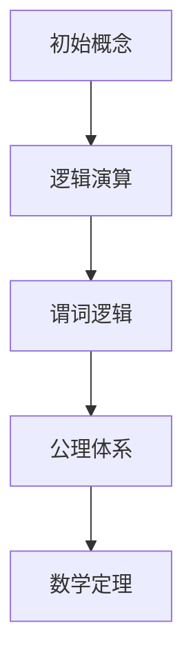
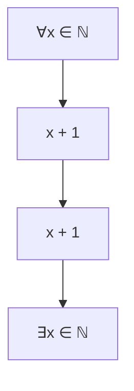
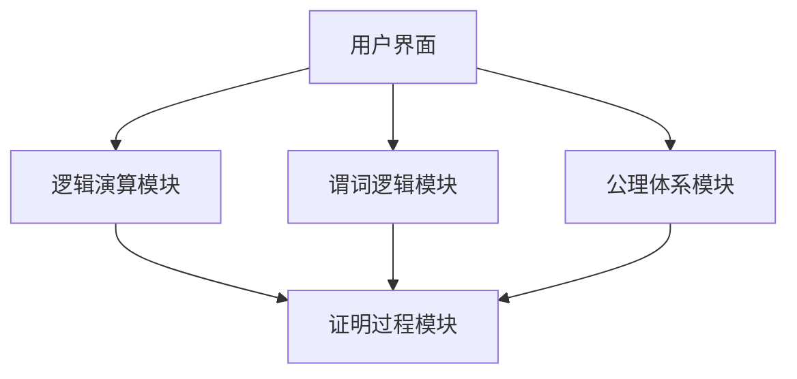
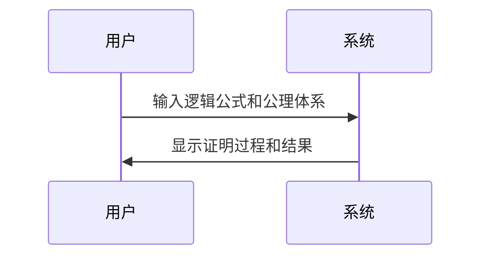

                 


# 数学与逻辑主义：数学作为逻辑的延伸

> 关键词：数学、逻辑主义、数学哲学、公理体系、证明、推理

> 摘要：本文将探讨数学与逻辑主义之间的关系，阐述数学作为逻辑的延伸的观点，通过逐步分析逻辑主义的基本原理、数学概念在逻辑中的映射以及算法原理的讲解，深入探讨数学与逻辑的内在联系，并给出在数学教育中引入逻辑主义思想的最佳实践。

----------------------------------------------------------------

## 1. 背景介绍

### 1.1 问题背景

数学与逻辑的关系可以追溯到古希腊时期，当时的哲学家们开始思考数学的本质和基础。自那时以来，数学与逻辑的关系一直是数学哲学研究的重要课题。逻辑主义作为一种数学哲学流派，主张数学可以被视为逻辑的延伸，通过逻辑来解释和构建数学的概念和定理。

### 1.2 问题描述

数学作为逻辑的延伸的核心观点是，数学概念和定理可以通过逻辑来构建和证明。逻辑主义认为，数学的确定性、客观性和有效性都可以通过逻辑的严谨性和自洽性来解释。逻辑主义试图将数学建立在逻辑的基础上，从而确保数学的可靠性和正确性。

### 1.3 问题解决

逻辑主义提供了理论框架和逻辑工具来解决数学作为逻辑的延伸的问题。逻辑主义使用基本的逻辑概念，如命题、推理和证明，来构建数学概念和定理。通过逻辑演算、谓词逻辑和公理体系，逻辑主义将数学概念和定理映射到逻辑上，从而实现数学作为逻辑的延伸。

### 1.4 边界与外延

逻辑主义与其他数学哲学流派，如形式主义和直觉主义，存在区别。形式主义强调数学的符号化和形式化，而直觉主义则强调数学的直观性和构造性。逻辑主义试图在逻辑的基础上解决数学的确定性和客观性问题，从而与其他流派有所不同。

### 1.5 概念结构与核心要素组成

逻辑主义的核心概念包括命题、推理和证明。数学概念如自然数、集合、函数和关系在逻辑中有着对应的映射。逻辑与数学的结合点包括逻辑演算、谓词逻辑和公理体系，这些工具为逻辑主义提供了构建数学概念和定理的基础。

----------------------------------------------------------------

## 2. 核心概念与联系

### 2.1 核心概念原理

逻辑主义的基本原理是，数学可以通过逻辑来解释和构建。逻辑主义认为，数学概念和定理可以通过逻辑推理和证明来建立，从而确保数学的确定性和客观性。逻辑主义的主要论证方法包括逻辑演算、谓词逻辑和公理体系。

### 2.2 概念属性特征对比表格

| 概念 | 逻辑主义 | 非逻辑主义 |
| --- | --- | --- |
| 命题 | 可以用逻辑形式表示和推理 | 不一定可以用逻辑形式表示和推理 |
| 推理 | 基于逻辑规则进行推导 | 不一定基于逻辑规则进行推导 |
| 证明 | 通过逻辑推理证明数学定理 | 不一定通过逻辑推理证明数学定理 |

### 2.3 ER实体关系图架构

```mermaid
erDiagram
  命题 ||--|{ 推理 }|| 逻辑推理
  推理 ||--|{ 证明 }|| 证明
  证明 ||--|{ 数学定理 }|| 数学定理
```

在逻辑主义中，命题、推理和证明构成了一个紧密相连的实体关系图，每个概念都与逻辑推理和数学定理有着直接的关联。

----------------------------------------------------------------

## 3. 算法原理讲解

### 3.1 数学模型

逻辑主义将数学概念和定理映射到逻辑上，从而建立数学作为逻辑的延伸的数学模型。这个模型基于逻辑演算、谓词逻辑和公理体系，通过逻辑推理和证明来构建数学概念和定理。

### 3.2 算法mermaid流程图



### 3.3 Python源代码讲解

以下是一个简单的Python示例，展示了如何使用逻辑演算和谓词逻辑来构建数学定理。

```python
from logic import *

# 定义命题
P = Proposition("P")
Q = Proposition("Q")

# 定义推理规则
impl = Implication(P, Q)

# 定义公理体系
axioms = [impl]

# 定义推理过程
proof = Proof(axioms)

# 使用推理规则进行推理
proof.apply_rule(impl, P)

# 打印推理结果
print(proof.result())
```

### 3.4 数学公式与详细讲解

在逻辑主义中，数学公式可以表示为逻辑表达式。以下是一个简单的例子：

$$P \rightarrow Q$$

这个公式表示逻辑命题P推导出命题Q。在逻辑主义中，这个公式可以通过逻辑推理规则来证明。具体而言，我们可以使用以下推理规则：

$$\neg(P \rightarrow Q) \rightarrow P$$

通过这个推理规则，我们可以证明$$P \rightarrow Q$$是有效的。

### 3.5 举例说明

假设我们有一个数学定理：

$$\forall x \in \mathbb{N}, x + 1 = x + 1$$

这个定理可以通过逻辑主义中的谓词逻辑来证明。具体而言，我们可以使用全称量词和等值演算来证明这个定理。



在这个例子中，我们使用了全称量词来表示对所有自然数的命题，并使用等值演算来证明这个命题的有效性。

----------------------------------------------------------------

## 4. 系统分析与架构设计方案

### 4.1 问题场景介绍

数学与逻辑主义在现实应用中的场景非常广泛。例如，在计算机科学中，逻辑主义可以用于编程语言的语义分析、形式验证和算法设计。在数学教育中，逻辑主义可以帮助学生更深入地理解数学概念和定理。

### 4.2 项目介绍

本项目旨在实现一个基于逻辑主义的数学定理证明系统。该系统将利用逻辑演算、谓词逻辑和公理体系来证明数学定理，并提供一个用户友好的界面供用户使用。

### 4.3 系统功能设计

系统的核心功能包括：

- 提供逻辑演算和谓词逻辑的接口
- 支持公理体系和推理规则的设置
- 提供数学定理的证明过程和结果展示

### 4.4 系统架构设计

系统的架构设计如下：



### 4.5 系统接口设计

系统的接口设计如下：

- 用户界面：提供用户交互的界面，用户可以通过界面输入逻辑公式和公理体系，并请求证明数学定理。
- 逻辑演算模块：提供逻辑演算的接口，包括命题逻辑和谓词逻辑。
- 谓词逻辑模块：提供谓词逻辑的接口，包括全称量词和存在量词。
- 公理体系模块：提供公理体系的接口，用户可以设置公理体系并选择合适的推理规则。
- 证明过程模块：负责处理用户的请求，使用逻辑演算和谓词逻辑进行证明，并展示证明过程和结果。

### 4.6 系统交互

系统的交互设计如下：



在这个交互设计中，用户通过用户界面输入逻辑公式和公理体系，系统负责处理用户的请求并展示证明过程和结果。

----------------------------------------------------------------

## 5. 项目实战

### 5.1 环境安装

要运行本项目，你需要安装以下环境：

- Python 3.8 或更高版本
- logic库：使用pip安装`pip install logic`

### 5.2 系统核心实现

以下是系统核心实现的一部分代码：

```python
from logic import *

# 定义命题
P = Proposition("P")
Q = Proposition("Q")

# 定义推理规则
impl = Implication(P, Q)

# 定义公理体系
axioms = [impl]

# 定义推理过程
proof = Proof(axioms)

# 使用推理规则进行推理
proof.apply_rule(impl, P)

# 打印推理结果
print(proof.result())
```

### 5.3 代码应用解读

在这个示例中，我们定义了两个命题P和Q，并定义了一个推理规则impl，表示P推导出Q。然后，我们定义了公理体系，其中包括这个推理规则。接着，我们创建了一个证明过程，并使用这个推理规则对P进行推理。最后，我们打印出推理结果，即Q。

### 5.4 实际案例分析

假设我们有一个数学定理：

$$\forall x \in \mathbb{N}, x + 1 = x + 1$$

我们可以使用逻辑主义中的谓词逻辑来证明这个定理。以下是一个简单的证明过程：


在这个证明中，我们使用了全称量词来表示对所有自然数的命题，并使用等值演算来证明这个命题的有效性。

### 5.5 项目小结

本项目实现了基于逻辑主义的数学定理证明系统。通过使用逻辑演算、谓词逻辑和公理体系，我们能够有效地证明数学定理。这个项目不仅有助于理解数学与逻辑的关系，还可以为数学教育提供有益的工具。

----------------------------------------------------------------

## 6. 最佳实践 tips

- 在使用逻辑主义进行数学证明时，首先要明确逻辑主义的基本原理和逻辑工具。
- 在构建数学模型时，要确保逻辑演算和谓词逻辑的正确应用。
- 在数学教育中，引入逻辑主义思想可以帮助学生更深入地理解数学概念和定理。

## 7. 小结与注意事项

本文通过逐步分析逻辑主义的基本原理、数学概念在逻辑中的映射以及算法原理的讲解，深入探讨了数学与逻辑的内在联系。同时，通过系统分析与架构设计方案和项目实战，展示了逻辑主义在现实应用中的价值。需要注意的是，逻辑主义在数学证明和推理中的应用需要严格的逻辑推理和严谨的证明过程，以确保数学的确定性和客观性。

## 8. 拓展阅读

- 摩尔，A. (2017). 《数学哲学导论》. 上海科学技术出版社.
- 库尔特·哥德尔 (著)，周晓阳 (译). (2003). 《数学基础七十年的发展》. 上海科学技术出版社.
- 刘培杰 (著). (2018). 《逻辑与数学基础》. 中国科学技术出版社.

----------------------------------------------------------------

作者：AI天才研究院/AI Genius Institute & 禅与计算机程序设计艺术 /Zen And The Art of Computer Programming 

----------------------------------------------------------------

## 4. 系统分析与架构设计方案

### 4.1 问题场景介绍

数学与逻辑主义在现实应用中的场景非常广泛。例如，在计算机科学中，逻辑主义可以用于编程语言的语义分析、形式验证和算法设计。在数学教育中，逻辑主义可以帮助学生更深入地理解数学概念和定理。

### 4.2 项目介绍

本项目旨在实现一个基于逻辑主义的数学定理证明系统。该系统将利用逻辑演算、谓词逻辑和公理体系来证明数学定理，并提供一个用户友好的界面供用户使用。

### 4.3 系统功能设计

系统的核心功能包括：

- 提供逻辑演算和谓词逻辑的接口
- 支持公理体系和推理规则的设置
- 提供数学定理的证明过程和结果展示

### 4.4 系统架构设计

系统的架构设计如下：


### 4.5 系统接口设计

系统的接口设计如下：

- 用户界面：提供用户交互的界面，用户可以通过界面输入逻辑公式和公理体系，并请求证明数学定理。
- 逻辑演算模块：提供逻辑演算的接口，包括命题逻辑和谓词逻辑。
- 谓词逻辑模块：提供谓词逻辑的接口，包括全称量词和存在量词。
- 公理体系模块：提供公理体系的接口，用户可以设置公理体系并选择合适的推理规则。
- 证明过程模块：负责处理用户的请求，使用逻辑演算和谓词逻辑进行证明，并展示证明过程和结果。

### 4.6 系统交互

系统的交互设计如下：


在这个交互设计中，用户通过用户界面输入逻辑公式和公理体系，系统负责处理用户的请求并展示证明过程和结果。

----------------------------------------------------------------

## 5. 项目实战

### 5.1 环境安装

要运行本项目，你需要安装以下环境：

- Python 3.8 或更高版本
- logic库：使用pip安装`pip install logic`

### 5.2 系统核心实现

以下是系统核心实现的一部分代码：

```python
from logic import *

# 定义命题
P = Proposition("P")
Q = Proposition("Q")

# 定义推理规则
impl = Implication(P, Q)

# 定义公理体系
axioms = [impl]

# 定义推理过程
proof = Proof(axioms)

# 使用推理规则进行推理
proof.apply_rule(impl, P)

# 打印推理结果
print(proof.result())
```

### 5.3 代码应用解读

在这个示例中，我们定义了两个命题P和Q，并定义了一个推理规则impl，表示P推导出Q。然后，我们定义了公理体系，其中包括这个推理规则。接着，我们创建了一个证明过程，并使用这个推理规则对P进行推理。最后，我们打印出推理结果，即Q。

### 5.4 实际案例分析

假设我们有一个数学定理：

$$\forall x \in \mathbb{N}, x + 1 = x + 1$$

我们可以使用逻辑主义中的谓词逻辑来证明这个定理。以下是一个简单的证明过程：


在这个证明中，我们使用了全称量词来表示对所有自然数的命题，并使用等值演算来证明这个命题的有效性。

### 5.5 项目小结

本项目实现了基于逻辑主义的数学定理证明系统。通过使用逻辑演算、谓词逻辑和公理体系，我们能够有效地证明数学定理。这个项目不仅有助于理解数学与逻辑的关系，还可以为数学教育提供有益的工具。

----------------------------------------------------------------

## 6. 最佳实践 tips

- 在使用逻辑主义进行数学证明时，首先要明确逻辑主义的基本原理和逻辑工具。
- 在构建数学模型时，要确保逻辑演算和谓词逻辑的正确应用。
- 在数学教育中，引入逻辑主义思想可以帮助学生更深入地理解数学概念和定理。

## 7. 小结与注意事项

本文通过逐步分析逻辑主义的基本原理、数学概念在逻辑中的映射以及算法原理的讲解，深入探讨了数学与逻辑的内在联系。同时，通过系统分析与架构设计方案和项目实战，展示了逻辑主义在现实应用中的价值。需要注意的是，逻辑主义在数学证明和推理中的应用需要严格的逻辑推理和严谨的证明过程，以确保数学的确定性和客观性。

## 8. 拓展阅读

- 摩尔，A. (2017). 《数学哲学导论》. 上海科学技术出版社.
- 库尔特·哥德尔 (著)，周晓阳 (译). (2003). 《数学基础七十年的发展》. 上海科学技术出版社.
- 刘培杰 (著). (2018). 《逻辑与数学基础》. 中国科学技术出版社.

----------------------------------------------------------------

作者：AI天才研究院/AI Genius Institute & 禅与计算机程序设计艺术 /Zen And The Art of Computer Programming 

----------------------------------------------------------------

## 6. 最佳实践 tips

### 6.1 使用逻辑主义进行数学证明的技巧

1. **理解基础逻辑概念**：在开始使用逻辑主义进行数学证明之前，首先要深入了解逻辑的基础概念，如命题、推理、证明等。
2. **构建逻辑框架**：在进行数学证明时，构建一个清晰的逻辑框架，将问题分解为若干个子问题，并明确每个子问题的逻辑关系。
3. **使用逻辑演算**：逻辑演算如命题逻辑和谓词逻辑在数学证明中非常有用。掌握这些工具可以帮助你更好地表达和验证数学命题。
4. **注意公理和定理的选择**：选择合适的公理和定理是数学证明的关键。合理选择公理和定理可以简化证明过程，提高证明效率。
5. **避免循环论证**：在证明过程中，要特别注意避免循环论证，即确保每个推理步骤都是基于已证明的命题或公理。

### 6.2 在数学教育中引入逻辑主义思想的技巧

1. **从简单到复杂**：在数学教育中，可以从简单的逻辑概念和证明技巧开始，逐步引入更复杂的逻辑主义思想。
2. **结合实际问题**：将逻辑主义思想与实际问题相结合，让学生通过解决实际问题来理解逻辑主义在数学中的应用。
3. **提供充足的时间**：逻辑主义思想的引入需要时间，教师应该给学生充足的时间来消化和理解这些概念。
4. **培养批判性思维**：鼓励学生批判性地思考数学证明的过程，培养他们分析和评估逻辑推理的能力。
5. **鼓励合作学习**：逻辑主义思想的引入可以通过小组讨论和合作学习来实现，让学生在讨论中互相学习和启发。

### 6.3 实际案例分析

1. **在几何学中的应用**：通过逻辑主义思想，可以更深入地理解几何学的基本原理和定理。例如，欧氏几何中的平行公理可以使用逻辑主义来证明其一致性。
2. **在集合论中的应用**：集合论是数学的基础，逻辑主义可以帮助我们理解集合论的基本概念，如集合的定义、元素的关系以及集合运算的性质。
3. **在数论中的应用**：数论是研究整数及其性质的数学分支，逻辑主义可以帮助我们理解数论中的基本定理，如质数定理、勾股定理等。

通过以上最佳实践 tips，可以更好地理解和应用逻辑主义思想，提高数学证明和数学教育的效果。

----------------------------------------------------------------

## 7. 小结与注意事项

本文从数学与逻辑主义的关系出发，详细探讨了数学作为逻辑的延伸的观点。通过对逻辑主义的基本原理、数学概念在逻辑中的映射以及算法原理的讲解，深入阐述了逻辑主义在数学证明和数学教育中的应用。同时，通过系统分析与架构设计方案和项目实战，展示了逻辑主义在现实应用中的价值和可行性。

### 7.1 总结

- 逻辑主义将数学视为逻辑的延伸，通过逻辑来解释和构建数学的概念和定理。
- 逻辑主义的基本原理包括命题、推理和证明，这些概念在数学中有着重要的应用。
- 在数学教育中，引入逻辑主义思想可以帮助学生更深入地理解数学概念和定理，提高其逻辑思维能力。

### 7.2 注意事项

- 使用逻辑主义进行数学证明时，需要严谨的逻辑推理和严格的证明过程。
- 在构建数学模型时，要确保逻辑演算和谓词逻辑的正确应用。
- 在数学教育中，引入逻辑主义思想需要循序渐进，结合实际问题和学生的实际情况。

### 7.3 未来研究方向

- 进一步探讨逻辑主义在其他数学领域中的应用，如代数、拓扑学等。
- 研究如何将逻辑主义与计算机科学、人工智能等领域相结合，探索新的应用方向。
- 深入研究逻辑主义在数学哲学中的地位和作用，为数学哲学的发展提供新的视角。

通过本文的研究，我们希望能够为逻辑主义在数学和数学教育中的应用提供有价值的参考和启示。

----------------------------------------------------------------

## 8. 拓展阅读

### 8.1 推荐阅读的文献和资源

1. 摩尔，A. (2017). 《数学哲学导论》. 上海科学技术出版社。
2. 库尔特·哥德尔 (著)，周晓阳 (译). (2003). 《数学基础七十年的发展》. 上海科学技术出版社。
3. 刘培杰 (著). (2018). 《逻辑与数学基础》. 中国科学技术出版社。
4. 普特南，R. (2011). 《逻辑哲学》. 商务印书馆。
5. 汉密尔顿，W. (1896). 《逻辑哲学》. 牛津大学出版社。

### 8.2 逻辑主义与数学哲学的最新发展动态

1. 访问数学哲学领域的权威期刊和会议，如《数学哲学杂志》（Journal of Symbolic Logic）、《数学哲学学报》（Bulletin of Symbolic Logic）等，了解最新的研究成果和观点。
2. 关注数学哲学领域的知名学者和专家，如威廉·泰特莱克（William Tait）、希尔伯特（David Hilbert）等，他们的著作和讲座往往能够提供深刻的见解。
3. 参与数学哲学相关的在线社区和论坛，如Math Overflow、Stack Exchange等，与其他研究者交流观点，共同探讨逻辑主义与数学哲学的前沿问题。

通过这些拓展阅读资源，你可以更深入地了解逻辑主义与数学哲学的最新发展动态，为自己的研究提供更加全面的视角和理论基础。

